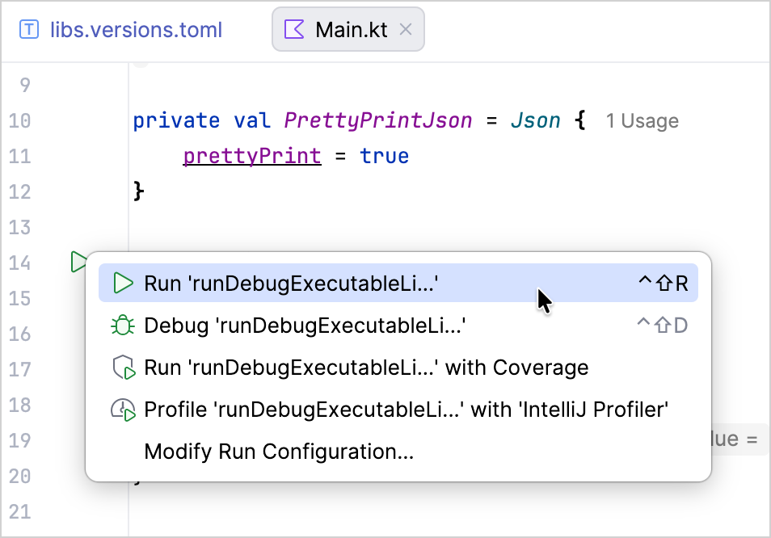
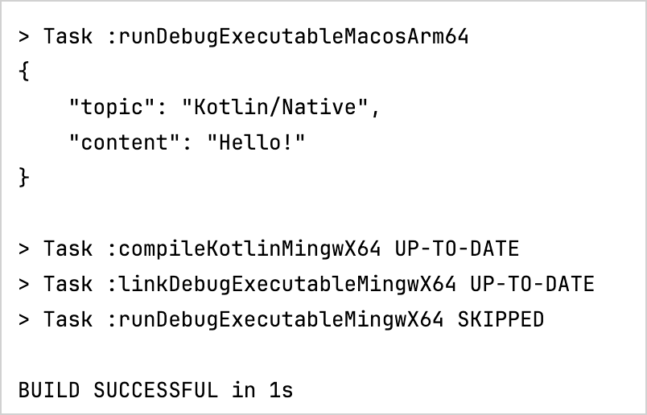
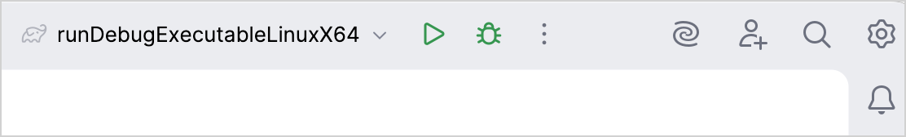
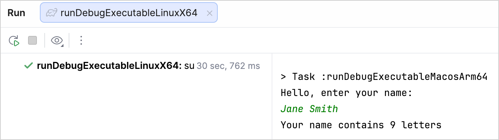
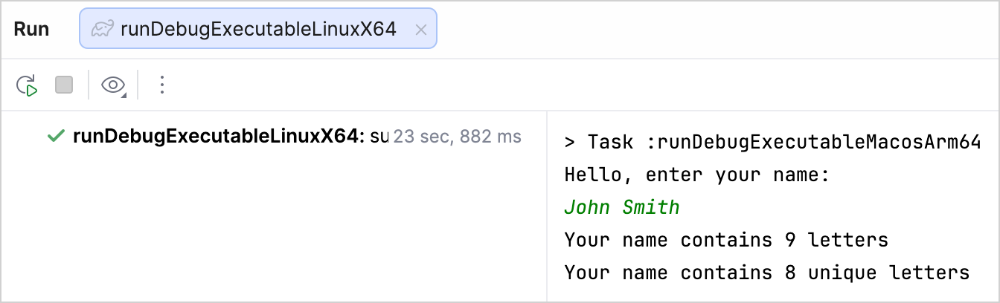

+++
title = "6.3.2 Kotlin/Native 入门"
date = 2026-09-13T08:50:47+08:00
weight = 2
type = "docs"
description = ""
isCJKLanguage = true
draft = false
+++


> 原文链接: [https://kotlinlang.org/docs/native-get-started.html](https://kotlinlang.org/docs/native-get-started.html)

# 6.3.2 Kotlin/Native 入门

在本教程中，你将学习如何创建 Kotlin/Native 应用。请选择最适合你的工具，并通过以下方式创建应用：

* **[IDE](#in-ide)**。在这里，你可以从版本控制系统克隆项目模板并在 IntelliJ IDEA 中使用它。
* **[Gradle 构建系统](#using-gradle)**。为更好地理解底层工作原理，你可以手动为项目创建构建文件。
* **[命令行工具](#using-the-command-line-compiler)**。你可以使用随标准 Kotlin 发行版一起提供的 Kotlin/Native 编译器，直接在命令行工具中创建应用。

控制台编译看起来简单直接，但对于包含数百个文件和库的较大项目，它的扩展性不好。对于这类项目，我们建议使用 IDE 或构建系统。

使用 Kotlin/Native，你可以为[不同的目标](../6.3.8-NativeTargetSupport/)编译，包括 Linux、macOS 和 Windows。虽然交叉编译是可行的（即在一个平台上为另一个平台编译），但在本教程中，你将面向与编译所在的同一个平台。

> **注意：** 如果你使用 Mac，并且想为 macOS 或其他 Apple 目标创建并运行应用，还需要先安装 [Xcode Command Line Tools](https://developer.apple.com/download/)、启动它并接受许可条款。

## 在 IDE 中 {#in-ide}

在本节中，你将学习如何使用 IntelliJ IDEA 创建 Kotlin/Native 应用。

### 创建项目 {#create-the-project}

1. 下载并安装最新版本的 [IntelliJ IDEA](https://www.jetbrains.com/idea/)。
2. 在 IntelliJ IDEA 中选择 **File** | **New** | **Project from Version Control**，并使用以下 URL 克隆[项目模板](https://github.com/Kotlin/kmp-native-wizard)：

```none
   https://github.com/Kotlin/kmp-native-wizard
```

3. 打开 `gradle/libs.versions.toml` 文件，它是项目依赖的版本目录。要创建 Kotlin/Native 应用，你需要 Kotlin Multiplatform Gradle 插件，它与 Kotlin 版本相同。请确保使用最新的 Kotlin 版本：

```toml
   [versions]
   kotlin = "2.4.20"
```

4. 按照提示重新加载 Gradle 文件：


关于这些设置的更多信息，请参阅 [Multiplatform Gradle DSL 参考](https://kotlinlang.org/docs/multiplatform/multiplatform-dsl-reference.html)。

### 构建并运行应用 {#build-and-run-the-application}

打开 `src/nativeMain/kotlin/` 目录中的 `Main.kt` 文件：

* `src` 目录包含 Kotlin 源文件。
* `Main.kt` 文件包含使用 [`println()`](https://kotlinlang.org/api/latest/jvm/stdlib/kotlin.io/println.html) 函数打印 "Hello, Kotlin/Native!" 的代码。

点击装订区域中的绿色图标来运行代码：



IntelliJ IDEA 会使用 Gradle 任务运行代码，并在 **Run** 选项卡中输出结果：



首次运行后，IDE 会在顶部创建相应的运行配置：



> 拥有 Ultimate 订阅的 IntelliJ IDEA 用户可以安装 [Native Debugging Support](https://plugins.jetbrains.com/plugin/12775-native-debugging-support) 插件，它允许调试已编译的原生可执行文件，并且会为导入的 Kotlin/Native 项目自动创建运行配置。

你可以[配置 IntelliJ IDEA](https://www.jetbrains.com/help/idea/compiling-applications.html#auto-build) 以自动构建项目：

1. 前往 **Settings | Build, Execution, Deployment | Compiler**。
2. 在 **Compiler** 页面上，选择 **Build project automatically**。
3. 应用更改。

现在，当你在类文件中进行更改或保存文件（Ctrl + S/Cmd + S）时，IntelliJ IDEA 会自动对项目执行增量构建。

### 更新应用 {#update-the-application}

我们为你的应用添加一个功能，让它能统计你名字中的字母数：

1. 在 `Main.kt` 文件中添加读取输入的代码。使用 [`readln()`](https://kotlinlang.org/api/latest/jvm/stdlib/kotlin.io/readln.html) 函数读取输入值并把它赋给 `name` 变量：

```kotlin
   fun main() {
       // 读取输入值。
       println("Hello, enter your name:")
       val name = readln()
   }
```

2. 要使用 Gradle 运行这个应用，请在 `build.gradle.kts` 文件中指定 `System.in` 作为所使用的输入，并重新加载 Gradle 变更：

```kotlin
   kotlin {
       //...
       targets.withType<KotlinNativeTarget>().configureEach {
           binaries {
               executable {
                   entryPoint = "main"
                   runTaskProvider?.configure { standardInput = System.`in` }
               }
           }
       }
       //...
   }
```
{initial-collapse-state="collapsed" collapsible="true" collapsed-title="runTaskProvider?.configure { standardInput = System.`in` }"}

3. 去掉空白字符并统计字母数：

* 使用 [`replace()`](https://kotlinlang.org/api/latest/jvm/stdlib/kotlin.text/replace.html) 函数移除名字中的空格。
* 使用作用域函数 [`let`](../../../libraryguides/9.1-Standardlibrary/9.1.4-ScopeFunctions/#let) 在该对象的上下文中运行函数。
* 使用[字符串模板](../../../languageguide/5.4-Types/5.4.6-Strings/#string-templates)把名字长度插入字符串：在前面加上美元符号 `$` 并用花括号括起来 —— `${it.length}`。`it` 是 [lambda 参数](../../../languageguide/5.2-CodingConventions/#lambda-parameters)的默认名称。

```kotlin
   fun main() {
       // 读取输入值。
       println("Hello, enter your name:")
       val name = readln()
       // 统计名字中的字母数。
       name.replace(" ", "").let {
           println("Your name contains ${it.length} letters")
       }
   }
```

4. 运行该应用。
5. 输入你的名字，享受结果吧：



现在我们只统计你名字中不重复的字母：

1. 在 `Main.kt` 文件中，为 `String` 声明新的[扩展函数](../../../languageguide/5.8-Classesandinterfaces/5.8.3-Extensions/#extension-functions) `.countDistinctCharacters()`：

* 使用 [`.lowercase()`](https://kotlinlang.org/api/latest/jvm/stdlib/kotlin.text/lowercase.html) 函数把名字转换为小写。
* 使用 [`toList()`](https://kotlinlang.org/api/latest/jvm/stdlib/kotlin.text/to-list.html) 函数把输入字符串转换为字符列表。
* 使用 [`distinct()`](https://kotlinlang.org/api/latest/jvm/stdlib/kotlin.collections/distinct.html) 函数只选出名字中不重复的字符。
* 使用 [`count()`](https://kotlinlang.org/api/latest/jvm/stdlib/kotlin.collections/count.html) 函数统计不重复字符的数量。

```kotlin
   fun String.countDistinctCharacters() = lowercase().toList().distinct().count()
```

2. 使用 `.countDistinctCharacters()` 函数统计你名字中不重复的字母：

```kotlin
   fun String.countDistinctCharacters() = lowercase().toList().distinct().count()

   fun main() {
       // 读取输入值。
       println("Hello, enter your name:")
       val name = readln()
       // 统计名字中的字母数。
       name.replace(" ", "").let {
           println("Your name contains ${it.length} letters")
           // 打印不重复字母的数量。
           println("Your name contains ${it.countDistinctCharacters()} unique letters")
       }
   }
```

3. 运行该应用。
4. 输入你的名字并查看结果：



## 使用 Gradle {#using-gradle}

在本节中，你将学习如何使用 [Gradle](https://gradle.org) 手动创建 Kotlin/Native 应用。它是 Kotlin/Native 和 Kotlin Multiplatform 项目的默认构建系统，也常用于 Java、Android 及其他生态系统。

构建 Kotlin/Native 项目时，Kotlin Gradle 插件会下载以下产物：

* 主要的 Kotlin/Native 包，其中包含 `konanc`、`cinterop` 和 `jsinterop` 等不同工具。默认情况下，Kotlin/Native 包会作为一个普通的 Gradle 依赖从 [Maven Central](https://repo1.maven.org/maven2/org/jetbrains/kotlin/kotlin-native-prebuilt/) 仓库下载。
* `konanc` 自身所需的依赖，例如 `llvm`。它们会通过自定义逻辑从 JetBrains CDN 下载。

你可以在 Gradle 构建脚本的 `repositories {}` 块中更改主包的下载来源。

### 创建项目文件 {#create-project-files}

1. 首先，安装兼容版本的 [Gradle](https://gradle.org/install/)。请查看[兼容性表](../../../buildtools/11.1-Gradle/11.1.3-GradleConfigureProject/#apply-the-plugin)来检查 Kotlin Gradle 插件（KGP）与可用 Gradle 版本的兼容性。
2. 创建一个空的项目目录。在其中创建一个包含以下内容的 `build.gradle(.kts)` 文件：

**Kotlin**

```kotlin
   // build.gradle.kts
   import org.jetbrains.kotlin.gradle.plugin.mpp.KotlinNativeTarget

   plugins {
       kotlin("multiplatform") version "2.4.20"
   }

   repositories {
       // 指定主包的下载来源
       // 默认使用 Maven Central
       mavenCentral()
   }

   kotlin {
       macosArm64() // 在 macOS 上
       // linuxArm64() // 在 Linux 上
       // mingwX64()   // 在 Windows 上

       targets.withType<KotlinNativeTarget>().configureEach {
           binaries {
               executable()
           }
       }
   }

   tasks.withType<Wrapper> {
       gradleVersion = "9.7.0"
       distributionType = Wrapper.DistributionType.BIN
   }
```

**Groovy**

```groovy
   // build.gradle
   import org.jetbrains.kotlin.gradle.plugin.mpp.KotlinNativeTarget

   plugins {
       id 'org.jetbrains.kotlin.multiplatform' version '2.4.20'
   }

   repositories {
       // 指定主包的下载来源
       // 默认使用 Maven Central
       mavenCentral()
   }

   kotlin {
       macosArm64() // 在 macOS 上
       // linuxArm64() // 在 Linux 上
       // mingwX64()   // 在 Windows 上

       targets.withType(KotlinNativeTarget).configureEach {
           binaries {
               executable()
           }
       }
   }

   wrapper {
       gradleVersion = '9.7.0'
       distributionType = 'BIN'
   }
```

你可以使用不同的[目标名称](../6.3.8-NativeTargetSupport/)，例如 `macosArm64`、`iosArm64`、`linuxArm64` 和 `mingwX64`，来定义你要为哪些目标编译代码。目标名称用于在项目中生成源路径和任务名称。

3. 在项目目录中创建一个空的 `settings.gradle(.kts)` 文件。
4. 创建 `src/nativeMain/kotlin` 目录，并在其中放置一个包含以下内容的 `hello.kt` 文件：

```kotlin
   fun main() {
       println("Hello, Kotlin/Native!")
   }
```

按照约定，所有源文件都位于 `src/<platform name>[Main|Test]/kotlin` 目录中，其中 `Main` 用于源代码，`Test` 用于测试。在本例中，`<platform name>` 就是 `native`。

### 构建并运行项目 {#build-and-run-the-project}

1. 在项目根目录中，为你的目标运行 `<yourTargetName>Binaries` 构建命令，例如：

```bash
   ./gradlew macosArm64Binaries
```

该命令会创建 `build/bin/<yourTargetName>` 目录，其中包含两个子目录：`debugExecutable` 和 `releaseExecutable`。它们包含相应的二进制文件。

默认情况下，二进制文件的名称与项目目录相同。

2. 要运行项目，请为你的目标执行 `build/bin/<yourTargetName>/debugExecutable/<project_name>.kexe` 命令，例如：

```bash
   build/bin/macosArm64/DebugExecutable/hello.kexe
```

终端会打印 "Hello, Kotlin/Native!"。

### 在 IDE 中打开项目 {#open-the-project-in-ide}

现在，你可以在任何支持 Gradle 的 IDE 中打开你的项目。如果你使用 IntelliJ IDEA：

1. 选择 **File** | **Open**。
2. 选择项目目录并点击 **Open**。IntelliJ IDEA 会自动检测它是否是 Kotlin/Native 项目。

如果项目出现问题，IntelliJ IDEA 会在 **Build** 选项卡中显示错误消息。

## 使用命令行编译器 {#using-the-command-line-compiler}

在本节中，你将学习如何在命令行工具中使用 Kotlin 编译器创建 Kotlin/Native 应用。

### 下载并安装编译器 {#download-and-install-the-compiler}

要安装该编译器：

1. 前往 Kotlin 的 [GitHub 发布页面](https://github.com/JetBrains/kotlin/releases/tag/v2.4.20)，向下滚动到 **Assets** 部分。
2. 查找名称中包含 `kotlin-native` 的文件，并下载适合你操作系统的那个，例如 `kotlin-native-prebuilt-linux-x86_64-2.4.20.tar.gz`。
3. 把压缩包解压到你选择的目录中。
4. 打开你的 shell 配置文件，把编译器 `/bin` 目录的路径添加到 `PATH` 环境变量中：

```bash
   export PATH="/<path to the compiler>/kotlin-native/bin:$PATH"
```

> **注意：** 虽然编译器的输出没有依赖或虚拟机要求，但编译器本身需要 Java 1.8 或更高版本的运行时。它受 [JDK 8（JAVA SE 8）或更高版本](https://www.oracle.com/java/technologies/downloads/)支持。

### 创建程序 {#create-the-program}

选择一个工作目录并创建一个名为 `hello.kt` 的文件。用以下代码更新它：

```kotlin
fun main() {
    println("Hello, Kotlin/Native!")
}
```

### 从控制台编译代码 {#compile-the-code-from-the-console}

要编译该应用，请使用下载好的编译器执行以下命令：

```bash
kotlinc-native hello.kt -o hello
```

`-o` 选项的值指定输出文件的名称，因此该调用会在 macOS 和 Linux 上生成 `hello.kexe` 二进制文件（在 Windows 上生成 `hello.exe`）。

关于可用选项的完整列表，请参阅 [Kotlin 编译器选项](../../../compilerandplugins/12.1-Kotlincompiler/12.1.4-CompilerReference/)。

### 运行程序 {#run-the-program}

要运行该程序，请在命令行工具中进入包含该二进制文件的目录并运行以下命令：

**macOS 和 Linux**

```none
./hello.kexe
```

**Windows**

```none
./hello.exe
```

该应用会把 "Hello, Kotlin/Native" 打印到标准输出。

## 接下来做什么？ {#what-s-next}

* 完成[使用 C 互操作和 libcurl 创建应用](../../../interoperability/7.3-Swiftobjectivecandcinterop/7.3.3-Cinterop/7.3.3.4-NativeAppWithCAndLibcurl/)教程，它介绍了如何创建原生 HTTP 客户端并与 C 库互操作。
* 了解如何[为真实的 Kotlin/Native 项目编写 Gradle 构建脚本](https://kotlinlang.org/docs/multiplatform/multiplatform-dsl-reference.html)。
* 在[文档](../../../buildtools/11.1-Gradle/11.1.1-Gradle/)中进一步了解 Gradle 构建系统。
