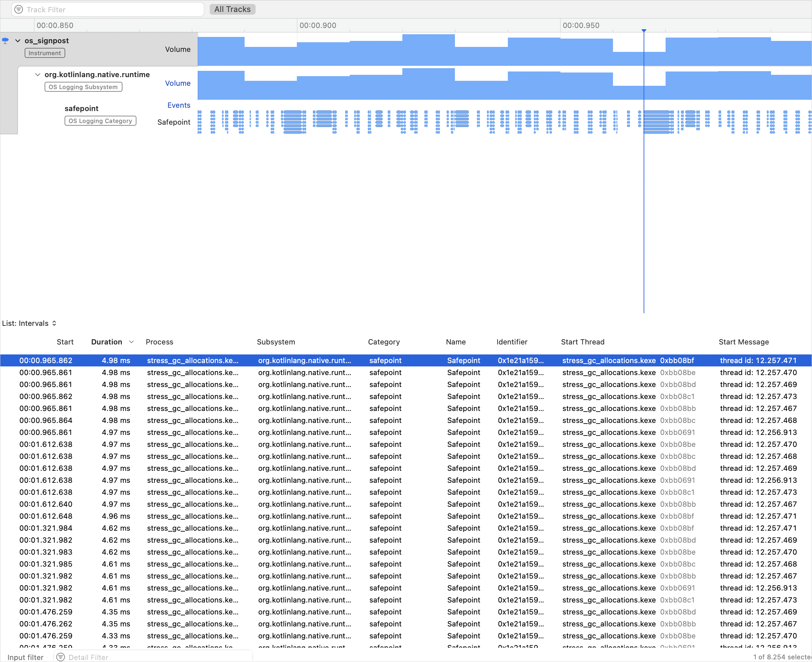

+++
title = "6.3.5.1 Kotlin/Native 内存管理"
date = 2026-09-13T08:50:47+08:00
weight = 1
type = "docs"
description = ""
isCJKLanguage = true
draft = false
+++


> 原文链接: [https://kotlinlang.org/docs/native-memory-manager.html](https://kotlinlang.org/docs/native-memory-manager.html)

# 6.3.5.1 Kotlin/Native 内存管理

Kotlin/Native 使用现代的内存管理器，它与 JVM、Go 等主流技术类似，具备以下特性：

* 对象存储在共享堆中，可以从任何线程访问。
* 定期执行追踪式垃圾回收，以回收从“根”（例如局部变量和全局变量）不可达的对象。

## 垃圾回收器 {#garbage-collector}

Kotlin/Native 的垃圾回收器（GC）算法在不断演进。目前它的工作方式是不把堆划分为多个分代的并发标记清扫（CMS）回收器。

GC 在单独的线程上执行，并基于内存压力启发式或定时器启动。也可以通过[手动调用](#enable-garbage-collection-manually)来启动。

GC 会在多个线程上并行处理标记队列，包括应用程序线程、GC 线程以及可选的标记线程。应用程序线程和至少一个 GC 线程会参与标记过程。默认情况下，标记阶段与应用程序线程并发运行，这减少了 GC 暂停时间。你可以通过 [GC 日志](#monitor-gc-performance)监控 GC 性能。

> **提示：** 你可以使用 `kotlin.native.binary.gcMarkSingleThreaded=true` 编译器选项禁用标记阶段的并行化。不过，在大型堆上，这可能会增加垃圾回收器的暂停时间。

标记阶段完成后，GC 会处理弱引用，并把指向未标记对象的引用置空。默认情况下，弱引用是并发处理的，以减少 GC 暂停时间。

如果你在使用 CMS 时遇到问题，可以切换回并行标记并发清扫（PMCS）方案。为此，请在 `gradle.properties` 文件中设置以下[二进制选项](../../6.3.6-NativeBinaryOptions/)：

```none
kotlin.native.binary.gc=pmcs
```

### 手动启用垃圾回收 {#enable-garbage-collection-manually}

要强制启动垃圾回收器，请调用 `kotlin.native.internal.GC.collect()`。该方法会触发一次新的回收，并等待其完成。

### 监控 GC 性能 {#monitor-gc-performance}

要监控 GC 性能，你可以查看它的日志并诊断问题。要启用日志，请在 Gradle 构建脚本中设置以下编译器选项：

```none
-Xruntime-logs=gc=info
```

目前，日志只会输出到 `stderr`。

在 Apple 平台上，你可以利用 Xcode Instruments 工具包来调试 iOS 应用的性能。垃圾回收器会通过 Instruments 中可用的路标（signpost）报告暂停。路标让你可以在应用中自定义日志记录，从而检查某次 GC 暂停是否对应应用的卡顿。

要在你的应用中跟踪与 GC 相关的暂停：

1. 要启用该特性，请在 `gradle.properties` 文件中设置以下编译器选项：

```none
   kotlin.native.binary.enableSafepointSignposts=true
```

2. 打开 Xcode，前往 **Product** | **Profile** 或按 Cmd + I。该操作会编译你的应用并启动 Instruments。
3. 在模板选择中，选择 **os_signpost**。
4. 进行配置：把 **subsystem** 指定为 `org.kotlinlang.native.runtime`，把 **category** 指定为 `safepoint`。
5. 点击红色的录制按钮来运行你的应用并开始录制路标事件：



在这里，最下方图表中的每个蓝色斑块代表一个独立的路标事件，也就是一次 GC 暂停。

### 禁用垃圾回收 {#disable-garbage-collection}

建议保持 GC 启用。不过，在某些情况下你可以禁用它，例如为了测试，或者当你遇到问题且程序运行时间很短时。为此，请在 `gradle.properties` 文件中设置以下二进制选项：

```none
kotlin.native.binary.gc=noop
```

> **警告：** 启用该选项后，GC 不会回收 Kotlin 对象，因此只要程序在运行，内存消耗就会持续上升。请注意不要耗尽系统内存。

## 内存消耗 {#memory-consumption}

Kotlin/Native 使用自己的[内存分配器](https://kotlinlang.org/docs/https://github.com/JetBrains/kotlin/blob/master/kotlin-native/runtime/src/alloc/custom/README.html)。它把系统内存划分为页，从而可以按连续顺序独立清扫。每次分配都会成为某个页中的一个内存块，页会跟踪块的大小。不同的页类型针对各种分配大小进行了优化。内存块的连续排列保证了遍历所有已分配块时的高效性。

当线程分配内存时，它会根据分配大小搜索合适的页。线程为不同的大小类别维护一组页。通常，给定大小对应的当前页能够满足该分配。如果不能，线程会从共享分配空间请求另一个页。该页可能已经可用、需要清扫，或者必须先创建。

Kotlin/Native 内存分配器带有针对内存分配突然激增的保护。它可防止出现这样的情况：修改器开始快速分配大量垃圾，而 GC 线程跟不上，导致内存使用无休止地增长。在这种情况下，GC 会强制执行一个 stop-the-world 阶段，直到迭代完成。

你可以自己监控内存消耗、检查内存泄漏，并调整内存消耗。

### 监控内存消耗 {#monitor-memory-consumption}

要调试内存问题，你可以查看内存管理器指标。此外，在 Apple 平台上还可以跟踪 Kotlin 的内存消耗。

#### 检查内存泄漏 {#check-for-memory-leaks}

要访问内存管理器指标，请调用 `kotlin.native.internal.GC.lastGCInfo()`。该方法返回垃圾回收器上一次运行的统计信息。这些统计信息可用于：

* 在使用全局变量时调试内存泄漏
* 在运行测试时检查泄漏

```kotlin
import kotlin.native.internal.*
import kotlin.test.*

class Resource

val global = mutableListOf<Resource>()

@OptIn(ExperimentalStdlibApi::class)
fun getUsage(): Long {
    GC.collect()
    return GC.lastGCInfo!!.memoryUsageAfter["heap"]!!.totalObjectsSizeBytes
}

fun run() {
    global.add(Resource())
    // 如果你删掉下一行，测试会失败
    global.clear()
}

@Test
fun test() {
    val before = getUsage()
    // 使用单独的函数以确保所有临时对象都被清除
    run()
    val after = getUsage()
    assertEquals(before, after)
}
```

#### 在 Apple 平台上跟踪内存消耗 {#track-memory-consumption-on-apple-platforms}

在 Apple 平台上调试内存问题时，你可以看到 Kotlin 代码保留了多少内存。Kotlin 所占的部分带有标识符标记，可以通过 Xcode Instruments 中的 VM Tracker 等工具进行跟踪。

该特性仅适用于默认的 Kotlin/Native 内存分配器，并且需要满足_以下所有_条件：

* **启用了标记**。内存应使用有效的标识符进行标记。Apple 建议使用 240 到 255 之间的数字；默认值是 246。

如果你设置了 `kotlin.native.binary.mmapTag=0` Gradle 属性，标记就会被禁用。

* **使用 mmap 分配**。分配器应使用 `mmap` 系统调用把文件映射到内存中。

如果你设置了 `kotlin.native.binary.disableMmap=true` Gradle 属性，默认分配器会使用 `malloc` 而不是 `mmap`。

* **启用了分页**。应启用分配的分页（缓冲）。

如果你设置了 [`kotlin.native.binary.pagedAllocator=false`](#disable-allocator-paging) Gradle 属性，内存会改为按对象逐个保留。

### 调整内存消耗 {#adjust-memory-consumption}

如果你遇到意外的高内存消耗，请尝试以下解决方案：

#### 更新 Kotlin {#update-kotlin}

把 Kotlin 更新到最新版本。我们在不断改进内存管理器，因此即使只是更新编译器也可能改善内存消耗。

#### 禁用分配器分页 {#disable-allocator-paging}
**实验性**

你可以禁用分配的分页（缓冲），让内存分配器按对象逐个保留内存。在某些情况下，这可能有助于满足严格的内存限制，或减少应用启动时的内存消耗。

为此，请在 `gradle.properties` 文件中设置以下选项：

```none
kotlin.native.binary.pagedAllocator=false
```

> **注意：** 禁用分配器分页后，就无法[在 Apple 平台上跟踪内存消耗](#track-memory-consumption-on-apple-platforms)。

#### 启用对 Latin-1 字符串的支持 {#enable-support-for-latin-1-strings}
**实验性**

默认情况下，Kotlin 中的字符串使用 UTF-16 编码存储，其中每个字符由两个字节表示。在某些情况下，这会导致字符串在二进制文件中所占的空间是源代码的两倍，读取数据也会占用两倍内存。

要减小应用的二进制文件大小并调整内存消耗，你可以启用对 Latin-1 编码字符串的支持。[Latin-1（ISO 8859-1）](https://en.wikipedia.org/wiki/ISO/IEC_8859-1)编码用单个字节表示前 256 个 Unicode 字符。

要启用它，请在 `gradle.properties` 文件中设置以下选项：

```none
kotlin.native.binary.latin1Strings=true
```

启用 Latin-1 支持后，只要所有字符都落在 Latin-1 范围内，字符串就以 Latin-1 编码存储。否则使用默认的 UTF-16 编码。

> **注意：** 在该特性仍处于实验性阶段时，cinterop 扩展函数 [`String.pin`](https://kotlinlang.org/api/core/kotlin-stdlib/kotlinx.cinterop/pin.html)、[`String.usePinned`](https://kotlinlang.org/api/core/kotlin-stdlib/kotlinx.cinterop/use-pinned.html) 和 [`String.refTo`](https://kotlinlang.org/api/core/kotlin-stdlib/kotlinx.cinterop/ref-to.html) 的效率会降低。每次调用它们都可能触发字符串自动转换为 UTF-16。

如果这些选项都没有帮助，请在 [YouTrack](https://kotl.in/issue) 中创建 issue。

## 后台单元测试 {#unit-tests-in-the-background}

在单元测试中，没有任何东西会处理主线程队列，因此除非已经 mock 过，否则不要使用 `Dispatchers.Main`。可以调用 `kotlinx-coroutines-test` 中的 `Dispatchers.setMain` 来进行 mock。

如果你不依赖 `kotlinx.coroutines`，或者由于某种原因 `Dispatchers.setMain` 对你不起作用，请尝试以下变通办法来实现测试启动器：

```kotlin
package testlauncher

import platform.CoreFoundation.*
import kotlin.native.concurrent.*
import kotlin.native.internal.test.*
import kotlin.system.*

fun mainBackground(args: Array<String>) {
    val worker = Worker.start(name = "main-background")
    worker.execute(TransferMode.SAFE, { args.freeze() }) {
        val result = testLauncherEntryPoint(it)
        exitProcess(result)
    }
    CFRunLoopRun()
    error("CFRunLoopRun should never return")
}
```

然后，使用 `-e testlauncher.mainBackground` 编译器选项编译测试二进制文件。

## 接下来做什么 {#what-s-next}

* [从旧版内存管理器迁移](../6.3.5.3-NativeMigrationGuide/)
* [查看与 Swift/Objective-C ARC 集成的细节](../6.3.5.2-NativeArcIntegration/)
