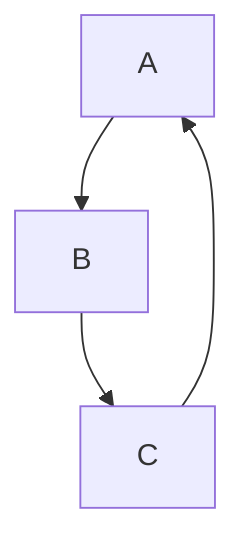
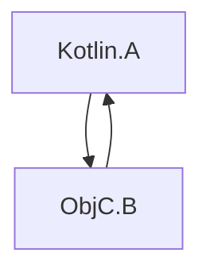

+++
title = "6.3.5.2 与 Swift/Objective-C ARC 的集成"
date = 2026-09-13T08:50:47+08:00
weight = 2
type = "docs"
description = ""
isCJKLanguage = true
draft = false
+++


> 原文链接: [https://kotlinlang.org/docs/native-arc-integration.html](https://kotlinlang.org/docs/native-arc-integration.html)

# 6.3.5.2 与 Swift/Objective-C ARC 的集成

Kotlin 与 Objective-C 使用不同的内存管理策略。Kotlin 使用追踪式垃圾回收器，而 Objective-C 依赖自动引用计数（ARC）。

这两种策略之间的集成通常是无缝的，一般不需要额外的工作。不过，有一些细节需要你留意：

## 线程 {#threads}

### 析构器 {#deinitializers}

如果 Swift/Objective-C 对象是在主线程上传给 Kotlin 的，那么这些对象及其所引用对象的析构会在主线程上调用，例如：

```kotlin
// Kotlin
class KotlinExample {
    fun action(arg: Any) {
        println(arg)
    }
}
```

```swift
// Swift
class SwiftExample {
    init() {
        print("init on \(Thread.current)")
    }

    deinit {
        print("deinit on \(Thread.current)")
    }
}

func test() {
    KotlinExample().action(arg: SwiftExample())
}
```

输出结果如下：

```text
init on <_NSMainThread: 0x600003bc0000>{number = 1, name = main}
shared.SwiftExample
deinit on <_NSMainThread: 0x600003bc0000>{number = 1, name = main}
```

在以下情况下，Swift/Objective-C 对象的析构会改在特殊的 GC 线程上调用：

* Swift/Objective-C 对象是在非主线程上传给 Kotlin 的。
* 主调度队列没有被处理。

如果你想显式地在特殊 GC 线程上进行析构，请在 `gradle.properties` 中设置 `kotlin.native.binary.objcDisposeOnMain=false`。该选项会启用特殊 GC 线程上的析构，即使 Swift/Objective-C 对象是在主线程上传给 Kotlin 的。

特殊 GC 线程符合 Objective-C 运行时的要求，也就是说它有 run loop 并会排空自动释放池。

### 完成处理器 {#completion-handlers}

从 Swift 调用 Kotlin 挂起函数时，完成处理器可能会在非主线程上被调用，例如：

```kotlin
// Kotlin
// coroutineScope、launch 和 delay 来自 kotlinx.coroutines
suspend fun asyncFunctionExample() = coroutineScope {
    launch {
        delay(1000L)
        println("World!")
    }
    println("Hello")
}
```

```swift
// Swift
func test() {
    print("Running test on \(Thread.current)")
    PlatformKt.asyncFunctionExample(completionHandler: { _ in
        print("Running completion handler on \(Thread.current)")
    })
}
```

输出结果如下：

```text
Running test on <_NSMainThread: 0x600001b100c0>{number = 1, name = main}
Hello
World!
Running completion handler on <NSThread: 0x600001b45bc0>{number = 7, name = (null)}
```

## 垃圾回收与生命周期 {#garbage-collection-and-lifecycle}

### 对象的回收 {#object-reclamation}

对象只有在垃圾回收期间才会被回收。这同样适用于跨越互操作边界进入 Kotlin/Native 的 Swift/Objective-C 对象，例如：

```kotlin
// Kotlin
class KotlinExample {
    fun action(arg: Any) {
        println(arg)
    }
}
```

```swift
// Swift
class SwiftExample {
    deinit {
        print("SwiftExample deinit")
    }
}

func test() {
    swiftTest()
    kotlinTest()
}

func swiftTest() {
    print(SwiftExample())
    print("swiftTestFinished")
}

func kotlinTest() {
    KotlinExample().action(arg: SwiftExample())
    print("kotlinTest finished")
}
```

输出结果如下：

```text
shared.SwiftExample
SwiftExample deinit
swiftTestFinished
shared.SwiftExample
kotlinTest finished
SwiftExample deinit
```

### Objective-C 对象的生命周期 {#objective-c-objects-lifecycle}

Objective-C 对象的存活时间可能比应有的更长，这有时会导致性能问题。例如，当一个长时间运行的循环在每次迭代中都创建若干跨越 Swift/Objective-C 互操作边界的临时对象时。

在 [GC 日志](../6.3.5.1-NativeMemoryManager/#monitor-gc-performance)中，根集合里会有若干稳定的引用（stable refs）。如果这个数字持续增长，可能说明 Swift/Objective-C 对象在应当释放时没有被释放。在这种情况下，请尝试在进行互操作调用的循环体周围加上 `autoreleasepool` 块：

```kotlin
// Kotlin
fun growingMemoryUsage() {
    repeat(Int.MAX_VALUE) {
        NSLog("$it\n")
    }
}

fun steadyMemoryUsage() {
    repeat(Int.MAX_VALUE) {
        autoreleasepool {
            NSLog("$it\n")
        }
    }
}
```

### Swift 与 Kotlin 对象引用链的垃圾回收 {#garbage-collection-of-swift-and-kotlin-objects-chains}

考虑以下示例：

```kotlin
// Kotlin
interface Storage {
    fun store(arg: Any)
}

class KotlinStorage(var field: Any? = null) : Storage {
    override fun store(arg: Any) {
        field = arg
    }
}

class KotlinExample {
    fun action(firstSwiftStorage: Storage, secondSwiftStorage: Storage) {
        // 这里我们创建了以下引用链：
        // firstKotlinStorage -> firstSwiftStorage -> secondKotlinStorage -> secondSwiftStorage.
        val firstKotlinStorage = KotlinStorage()
        firstKotlinStorage.store(firstSwiftStorage)
        val secondKotlinStorage = KotlinStorage()
        firstSwiftStorage.store(secondKotlinStorage)
        secondKotlinStorage.store(secondSwiftStorage)
    }
}
```

```swift
// Swift
class SwiftStorage : Storage {

    let name: String

    var field: Any? = nil

    init(_ name: String) {
        self.name = name
    }

    func store(arg: Any) {
        field = arg
    }

    deinit {
        print("deinit SwiftStorage \(name)")
    }
}

func test() {
    KotlinExample().action(
        firstSwiftStorage: SwiftStorage("first"),
        secondSwiftStorage: SwiftStorage("second")
    )
}
```

从日志中出现 "deinit SwiftStorage first" 到出现 "deinit SwiftStorage second" 之间会有一段时间间隔。原因是 `firstKotlinStorage` 和 `secondKotlinStorage` 是在不同的 GC 周期中被回收的。事件顺序如下：

1. `KotlinExample.action` 执行完毕。由于没有任何东西引用 `firstKotlinStorage`，它被视为“已死”，而 `secondKotlinStorage` 不然，因为它被 `firstSwiftStorage` 引用着。
2. 第一个 GC 周期开始，`firstKotlinStorage` 被回收。
3. 此时没有对 `firstSwiftStorage` 的引用，所以它也被视为“已死”，于是调用 `deinit`。
4. 第二个 GC 周期开始。由于 `firstSwiftStorage` 不再引用 `secondKotlinStorage`，后者被回收。
5. `secondSwiftStorage` 最终被回收。

回收这四个对象需要两个 GC 周期，因为 Swift 和 Objective-C 对象的析构发生在 GC 周期之后。这一限制源于 `deinit`，它可以调用任意代码，包括无法在 GC 暂停期间运行的 Kotlin 代码。

### 循环引用 {#retain-cycles}

在_循环引用（retain cycle）_中，若干对象通过强引用循环地互相引用：



Kotlin 的追踪式 GC 与 Objective-C 的 ARC 对循环引用的处理方式不同。当对象变为不可达时，Kotlin 的 GC 能正确回收这类循环，而 Objective-C 的 ARC 不能。因此，Kotlin 对象的循环引用可以被回收，而 [Swift/Objective-C 对象的循环引用则不能](https://docs.swift.org/swift-book/documentation/the-swift-programming-language/automaticreferencecounting/#Strong-Reference-Cycles-Between-Class-Instances)。

考虑循环引用同时包含 Objective-C 对象和 Kotlin 对象的情况：



这涉及把 Kotlin 与 Objective-C 的内存管理模型组合在一起，而它们都无法共同处理（回收）循环引用。这意味着只要其中存在至少一个 Objective-C 对象，整个对象图的循环引用就无法被回收，也不可能从 Kotlin 一侧打破该循环。

遗憾的是，目前还没有专门的工具能自动检测 Kotlin/Native 代码中的循环引用。要避免循环引用，请使用[弱引用或无主引用](https://docs.swift.org/swift-book/documentation/the-swift-programming-language/automaticreferencecounting/#Resolving-Strong-Reference-Cycles-Between-Class-Instances)。

## 对后台状态和 App Extension 的支持 {#support-for-background-state-and-app-extensions}

当前的内存管理器默认不跟踪应用状态，也不开箱即用地与 [App Extension](https://developer.apple.com/app-extensions/) 集成。

这意味着内存管理器不会相应地调整 GC 行为，在某些情况下这可能是有害的。要改变这一行为，请把以下[实验性](../../../../kotlinevolutionandroadmap/13.4-ComponentsStability/)二进制选项添加到你的 `gradle.properties`：

```none
kotlin.native.binary.appStateTracking=enabled
```

它会在应用处于后台时关闭基于定时器的垃圾回收器调用，因此 GC 只会在内存消耗过高时才被调用。

## 接下来做什么 {#what-s-next}

进一步了解 [Swift/Objective-C 互操作](../../../../interoperability/7.3-Swiftobjectivecandcinterop/7.3.1-Swiftobjectivecinterop/7.3.1.1-NativeObjcInterop/)。
