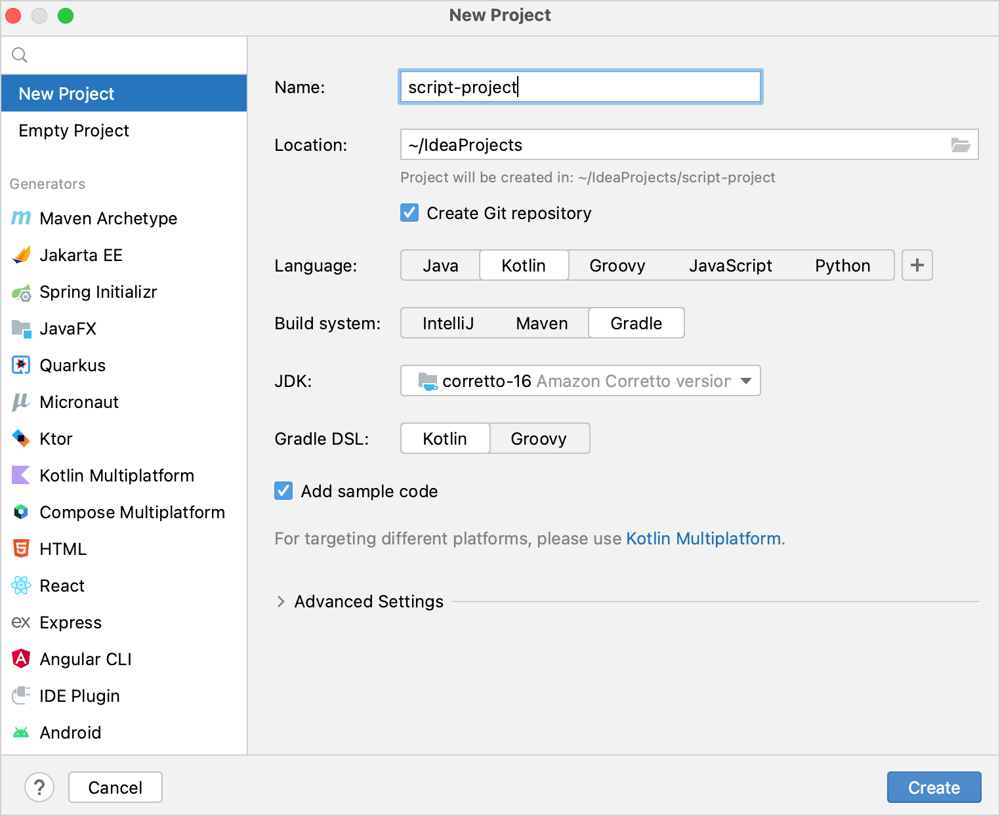
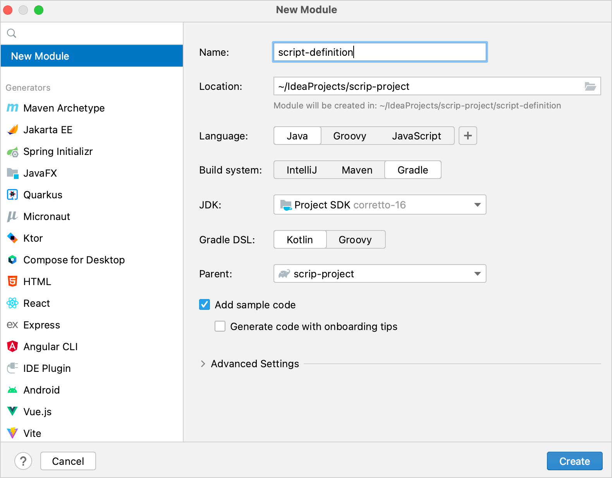
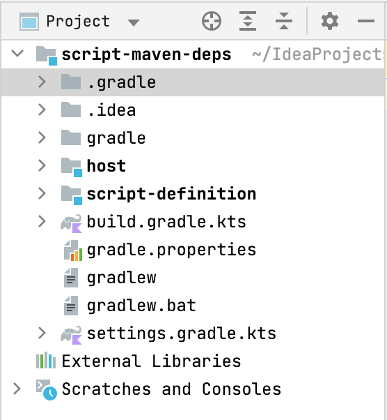
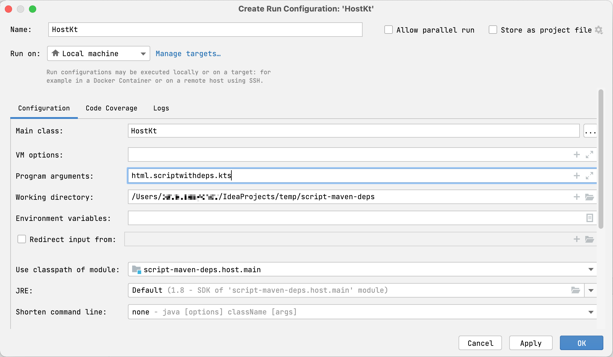

+++
title = "6.6 Kotlin 自定义脚本入门 – 教程"
date = 2026-09-13T08:50:47+08:00
weight = 2
type = "docs"
description = ""
isCJKLanguage = true
draft = false
+++


> 原文链接: [https://kotlinlang.org/docs/custom-script-deps-tutorial.html](https://kotlinlang.org/docs/custom-script-deps-tutorial.html)

# 6.6 Kotlin 自定义脚本入门 – 教程

> **警告：** Kotlin 自定义脚本是[实验性](../../kotlinevolutionandroadmap/13.4-ComponentsStability/)的。它可能随时被移除或更改。请仅将其用于评估目的。我们非常欢迎你在 [YouTrack](https://kotl.in/issue) 上提供反馈。

_Kotlin 脚本_是一种技术，让你无需事先编译或打包成可执行文件就能把 Kotlin 代码作为脚本执行。

关于 Kotlin 脚本的概览和示例，请观看 KotlinConf'19 上 Rodrigo Oliveira 的演讲[实现 Gradle Kotlin DSL](https://kotlinconf.com/2019/talks/video/2019/126701/)。

在本教程中，你将创建一个 Kotlin 脚本项目，用来执行带 Maven 依赖的任意 Kotlin 代码。你将能够执行这样的脚本：

```kotlin
@file:Repository("https://maven.pkg.jetbrains.space/public/p/kotlinx-html/maven")
@file:DependsOn("org.jetbrains.kotlinx:kotlinx-html-jvm:0.7.3")

import kotlinx.html.*
import kotlinx.html.stream.*
import kotlinx.html.attributes.*

val addressee = "World"

print(
    createHTML().html {
        body {
            h1 { +"Hello, $addressee!" }
        }
    }
)
```

指定的 Maven 依赖（本示例中为 `kotlinx-html-jvm`）会在执行期间从指定的 Maven 仓库或本地缓存解析出来，并在脚本的其余部分中使用。

## 项目结构 {#project-structure}

一个最小的 Kotlin 自定义脚本项目包含两部分：

* _脚本定义_ —— 一组参数和配置，定义这种脚本类型应如何被识别、处理、编译和执行。
* _脚本宿主_ —— 处理脚本编译和执行的应用程序或组件 —— 即实际运行这种类型脚本的东西。

考虑到以上这些，最好把项目拆分成两个模块。

## 开始之前 {#before-you-start}

下载并安装最新版本的 [IntelliJ IDEA](https://www.jetbrains.com/idea/download/)。

## 创建项目 {#create-a-project}

1. 在 IntelliJ IDEA 中，选择 **File** | **New** | **Project**。
2. 在左侧面板中，选择 **New Project**。
3. 为新项目命名，如有必要可更改其位置。

> **提示：** 勾选 **Create Git repository** 复选框可以把新项目置于版本控制之下。你以后也可以随时这样做。

4. 在 **Language** 列表中，选择 **Kotlin**。
5. 选择 **Gradle** 构建系统。
6. 在 **JDK** 列表中，选择你想在项目中使用的 [JDK](https://www.oracle.com/java/technologies/downloads/)。
* 如果 JDK 已安装在你的计算机上，但未在 IDE 中定义，请选择 **Add JDK** 并指定 JDK 主目录的路径。
* 如果你的计算机上没有所需的 JDK，请选择 **Download JDK**。

7. 为 **Gradle DSL** 选择 Kotlin 或 Groovy 语言。
8. 点击 **Create**。



## 添加脚本模块 {#add-scripting-modules}

现在你有了一个空的 Kotlin/JVM Gradle 项目。添加所需的模块：脚本定义和脚本宿主：

1. 在 IntelliJ IDEA 中，选择 **File | New | Module**。
2. 在左侧面板中，选择 **New Module**。该模块将作为脚本定义。
3. 为新模块命名，如有必要可更改其位置。
4. 在 **Language** 列表中，选择 **Java**。
5. 选择 **Gradle** 构建系统；如果你想用 Kotlin 编写构建脚本，则把 **Gradle DSL** 设为 Kotlin。
6. 作为该模块的父模块，选择根模块。
7. 点击 **Create**。



8. 在该模块的 `build.gradle(.kts)` 文件中，删除 Kotlin Gradle 插件的 `version`。它已经在根项目的构建脚本中声明了。

9. 再重复前面的步骤一次，为脚本宿主创建一个模块。

项目应具有以下结构：



你可以在 [kotlin-script-examples GitHub 仓库](https://github.com/Kotlin/kotlin-script-examples/tree/master/jvm/basic/jvm-maven-deps)中找到这样一个项目的示例以及更多 Kotlin 脚本示例。

## 创建脚本定义 {#create-a-script-definition}

首先定义脚本类型：开发者在这种类型的脚本中可以写什么，以及它会如何被处理。在本教程中，这包括在脚本中支持 `@Repository` 和 `@DependsOn` 注解。

1. 在脚本定义模块中，把对 Kotlin 脚本组件的依赖添加到 `build.gradle(.kts)` 的 `dependencies` 块中。这些依赖提供了脚本定义所需的 API：

**Kotlin**

```kotlin
   dependencies {
       implementation("org.jetbrains.kotlin:kotlin-scripting-common")
       implementation("org.jetbrains.kotlin:kotlin-scripting-jvm")
       implementation("org.jetbrains.kotlin:kotlin-scripting-dependencies")
       implementation("org.jetbrains.kotlin:kotlin-scripting-dependencies-maven")
       // 这个特定定义需要 coroutines 依赖
       implementation("org.jetbrains.kotlinx:kotlinx-coroutines-core:1.11.0")
   }
```

**Groovy**

```groovy
   dependencies {
       implementation 'org.jetbrains.kotlin:kotlin-scripting-common'
       implementation 'org.jetbrains.kotlin:kotlin-scripting-jvm'
       implementation 'org.jetbrains.kotlin:kotlin-scripting-dependencies'
       implementation 'org.jetbrains.kotlin:kotlin-scripting-dependencies-maven'
       // 这个特定定义需要 coroutines 依赖
       implementation 'org.jetbrains.kotlinx:kotlinx-coroutines-core:1.11.0'
   }
```

2. 在该模块中创建 `src/main/kotlin/` 目录，并添加一个 Kotlin 源文件，例如 `scriptDef.kt`。

3. 在 `scriptDef.kt` 中创建一个类。它将成为此类脚本的父类，因此请把它声明为 `abstract` 或 `open`。

```kotlin
    // 此类脚本的抽象（或 open）父类
    abstract class ScriptWithMavenDeps
```

这个类稍后也会作为脚本定义的引用。

4. 要让该类成为脚本定义，请用 `@KotlinScript` 注解标记它。向该注解传入两个参数：
* `fileExtension` —— 以 `.kts` 结尾的字符串，定义此类脚本的文件扩展名。
* `compilationConfiguration` —— 一个继承自 `ScriptCompilationConfiguration` 的 Kotlin 类，定义该脚本定义的编译细节。你将在下一步创建它。

```kotlin
    // @KotlinScript 注解标记脚本定义类
    @KotlinScript(
        // 该脚本类型的文件扩展名
        fileExtension = "scriptwithdeps.kts",
        // 该脚本类型的编译配置
        compilationConfiguration = ScriptWithMavenDepsConfiguration::class
    )
    abstract class ScriptWithMavenDeps

    object ScriptWithMavenDepsConfiguration: ScriptCompilationConfiguration()
```

> **注意：** 在本教程中，我们只提供可运行的代码，而不解释 Kotlin 脚本 API。你可以在 [GitHub](https://github.com/Kotlin/kotlin-script-examples/blob/master/jvm/basic/jvm-maven-deps/script/src/main/kotlin/org/jetbrains/kotlin/script/examples/jvm/resolve/maven/scriptDef.kt) 上找到带有详细解释的相同代码。

5. 按下面的方式定义脚本编译配置。

```kotlin
    object ScriptWithMavenDepsConfiguration : ScriptCompilationConfiguration(
        {
            // 此类脚本的隐式 import
            defaultImports(DependsOn::class, Repository::class)
            jvm {
                // 从上下文类加载器中提取整个 classpath 并将其用作依赖
                dependenciesFromCurrentContext(wholeClasspath = true)
            }
            // 回调
            refineConfiguration {
                // 使用提供的处理器处理指定的注解
                onAnnotations(DependsOn::class, Repository::class, handler = ::configureMavenDepsOnAnnotations)
            }
        }
    )
```

`configureMavenDepsOnAnnotations` 函数如下：

```kotlin
    // 动态重新配置编译的处理器
    fun configureMavenDepsOnAnnotations(context: ScriptConfigurationRefinementContext): ResultWithDiagnostics<ScriptCompilationConfiguration> {
        val annotations = context.collectedData?.get(ScriptCollectedData.collectedAnnotations)?.takeIf { it.isNotEmpty() }
            ?: return context.compilationConfiguration.asSuccess()
        return runBlocking {
            resolver.resolveFromScriptSourceAnnotations(annotations)
        }.onSuccess {
            context.compilationConfiguration.with {
                dependencies.append(JvmDependency(it))
            }.asSuccess()
        }
    }

    private val resolver = CompoundDependenciesResolver(FileSystemDependenciesResolver(), MavenDependenciesResolver())
```

你可以在[这里](https://github.com/Kotlin/kotlin-script-examples/blob/master/jvm/basic/jvm-maven-deps/script/src/main/kotlin/org/jetbrains/kotlin/script/examples/jvm/resolve/maven/scriptDef.kt)找到完整代码。

## 创建脚本宿主 {#create-a-scripting-host}

下一步是创建脚本宿主 —— 即处理脚本执行的组件。

1. 在脚本宿主模块中，把依赖添加到 `build.gradle(.kts)` 的 `dependencies` 块中：
* 提供脚本宿主所需 API 的 Kotlin 脚本组件
* 你之前创建的脚本定义模块

**Kotlin**

```kotlin
   dependencies {
       implementation("org.jetbrains.kotlin:kotlin-scripting-common")
       implementation("org.jetbrains.kotlin:kotlin-scripting-jvm")
       implementation("org.jetbrains.kotlin:kotlin-scripting-jvm-host")
       implementation(project(":script-definition")) // 脚本定义模块
   }
```

**Groovy**

```groovy
   dependencies {
       implementation 'org.jetbrains.kotlin:kotlin-scripting-common'
       implementation 'org.jetbrains.kotlin:kotlin-scripting-jvm'
       implementation 'org.jetbrains.kotlin:kotlin-scripting-jvm-host'
       implementation project(':script-definition') // 脚本定义模块
   }
```

2. 在该模块中创建 `src/main/kotlin/` 目录，并添加一个 Kotlin 源文件，例如 `host.kt`。

3. 为应用定义 `main` 函数。在其函数体中，检查它有一个参数 —— 脚本文件的路径 —— 并执行该脚本。你将在下一步中用一个单独的函数 `evalFile` 来定义脚本的执行。现在先把它声明为空。

`main` 可能看起来像这样：

```kotlin
    fun main(vararg args: String) {
        if (args.size != 1) {
            println("usage: <app> <script file>")
        } else {
            val scriptFile = File(args[0])
            println("Executing script $scriptFile")
            evalFile(scriptFile)
        }
    }
```

4. 定义脚本求值函数。在这里你将使用脚本定义。通过在类型参数中传入脚本定义类来调用 `createJvmCompilationConfigurationFromTemplate` 获取它。然后调用 `BasicJvmScriptingHost().eval`，并传入脚本代码及其编译配置。`eval` 返回 `ResultWithDiagnostics` 的实例，因此把它设置为该函数的返回类型。

```kotlin
    fun evalFile(scriptFile: File): ResultWithDiagnostics<EvaluationResult> {
        val compilationConfiguration = createJvmCompilationConfigurationFromTemplate<ScriptWithMavenDeps>()
        return BasicJvmScriptingHost().eval(scriptFile.toScriptSource(), compilationConfiguration, null)
    }
```

5. 调整 `main` 函数以打印脚本执行的相关信息：

```kotlin
    fun main(vararg args: String) {
        if (args.size != 1) {
            println("usage: <app> <script file>")
        } else {
            val scriptFile = File(args[0])
            println("Executing script $scriptFile")
            val res = evalFile(scriptFile)
            res.reports.forEach {
                if (it.severity > ScriptDiagnostic.Severity.DEBUG) {
                    println(" : ${it.message}" + if (it.exception == null) "" else ": ${it.exception}")
                }
            }
        }
    }
```

你可以在[这里](https://github.com/Kotlin/kotlin-script-examples/blob/master/jvm/basic/jvm-maven-deps/host/src/main/kotlin/org/jetbrains/kotlin/script/examples/jvm/resolve/maven/host/host.kt)找到完整代码

## 运行脚本 {#run-scripts}

要检查你的脚本宿主如何工作，请准备一个要执行的脚本和一个运行配置。

1. 在项目根目录中创建包含以下内容的 `html.scriptwithdeps.kts` 文件：

```kotlin
   @file:Repository("https://maven.pkg.jetbrains.space/public/p/kotlinx-html/maven")
   @file:DependsOn("org.jetbrains.kotlinx:kotlinx-html-jvm:0.7.3")

   import kotlinx.html.*; import kotlinx.html.stream.*; import kotlinx.html.attributes.*

   val addressee = "World"

   print(
       createHTML().html {
           body {
               h1 { +"Hello, $addressee!" }
           }
       }
   )
```

它使用了 `kotlinx-html-jvm` 库中的函数，该库在 `@DependsOn` 注解参数中被引用。

2. 创建一个运行配置，用于启动脚本宿主并执行该文件：
1. 打开 `host.kt` 并定位到 `main` 函数。它的左侧有一个 **Run** 装订区域图标。
2. 右键点击该装订区域图标，选择 **Modify Run Configuration**。
3. 在 **Create Run Configuration** 对话框中，把脚本文件名添加到 **Program arguments**，然后点击 **OK**。



3. 运行创建好的配置。

你将看到脚本如何被执行：从指定的仓库解析对 `kotlinx-html-jvm` 的依赖，并打印调用其函数的结果：

```text
<html>
  <body>
    <h1>Hello, World!</h1>
  </body>
</html>
```

首次运行时解析依赖可能需要一些时间。后续运行会快得多，因为它们会使用本地 Maven 仓库中已下载的依赖。

## 接下来做什么？ {#what-s-next}

创建好一个简单的 Kotlin 脚本项目之后，可以进一步了解这个主题：
* 阅读 [Kotlin 脚本 KEEP](https://kotlinlang.org/docs/https://github.com/Kotlin/KEEP/blob/master/proposals/scripting-support.html)
* 浏览更多 [Kotlin 脚本示例](https://github.com/Kotlin/kotlin-script-examples)
* 观看 Rodrigo Oliveira 的演讲[实现 Gradle Kotlin DSL](https://kotlinconf.com/2019/talks/video/2019/126701/)
