+++
title = "6.7.4 运行代码片段"
date = 2026-09-13T08:50:47+08:00
weight = 3
type = "docs"
description = ""
isCJKLanguage = true
draft = false
+++


> 原文链接: [https://kotlinlang.org/docs/run-code-snippets.html](https://kotlinlang.org/docs/run-code-snippets.html)

# 6.7.4 运行代码片段

Kotlin 代码通常被组织成项目，你在 IDE、文本编辑器或其他工具中处理它们。不过，如果你想快速看看某个函数如何工作，或想知道某个表达式的值，就不必新建项目并构建它。下面三种便捷方式可以让你在不同环境中立即运行 Kotlin 代码：

* IDE 中的[草稿文件](#ide-scratches-and-worksheets)。
* 浏览器中的 [Kotlin Playground](#browser-kotlin-playground)。
* 命令行中的 [ki shell](#command-line-ki-shell)。

## IDE：草稿文件 {#ide-scratches-and-worksheets}

IntelliJ IDEA 和 Android Studio 支持 Kotlin [草稿文件](https://www.jetbrains.com/help/idea/kotlin-repl.html#efb8fb32)。

*草稿文件*（或简称*草稿*）让你在与项目相同的 IDE 窗口中创建代码草稿并即时运行。草稿不与项目绑定；你可以在操作系统的任意 IntelliJ IDEA 窗口中访问并运行你的所有草稿。

要创建 Kotlin 草稿，请点击 **File** | **New** | **Scratch File**，然后选择 **Kotlin** 类型。

草稿支持语法高亮、自动补全以及 IntelliJ IDEA 的其他代码编辑功能。你不需要声明 `main()` 函数——你写的所有代码都会像是在 `main()` 的函数体中一样被执行。

在草稿中写完代码后，点击 **Run**。执行结果会显示在代码对面的行中。

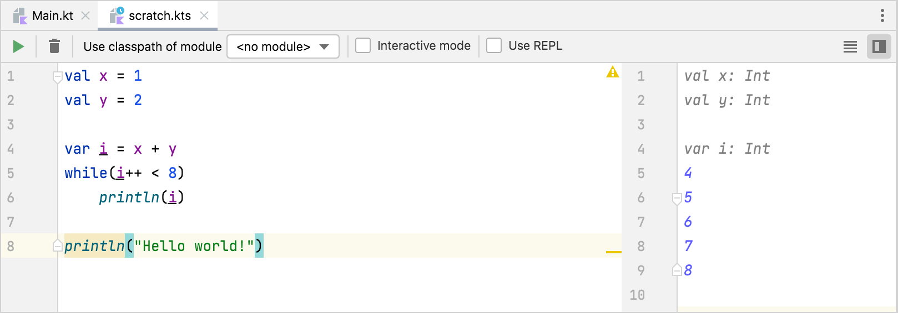

### 交互模式 {#interactive-mode}

IDE 可以自动运行草稿中的代码。要在停止输入后立即得到执行结果，请打开 **Interactive mode**。

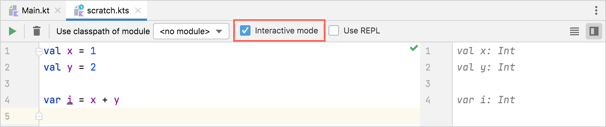

### 使用模块 {#use-modules}

你可以在草稿中使用 Kotlin 项目中的类或函数。

要在草稿中使用项目中的类或函数，请像平常一样用 `import` 语句把它们导入草稿文件。然后编写代码，并在 **Use classpath of module** 列表中选择合适的模块后运行。

草稿使用的是所连接模块的已编译版本。因此，如果你修改了模块的源文件，那么在重新构建该模块后，改动会传播到草稿中。要在每次运行草稿前自动重新构建模块，请勾选 **Make module before Run**。

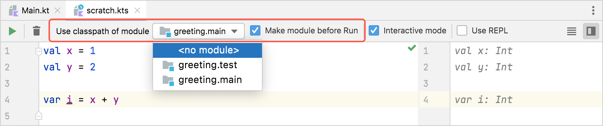

## 浏览器：Kotlin Playground {#browser-kotlin-playground}

[Kotlin Playground](https://play.kotlinlang.org/) 是一个在线应用，让你在浏览器中编写、运行和分享 Kotlin 代码。

### 编写与编辑代码 {#write-and-edit-code}

在 Playground 的编辑器区域，你可以像在源文件中一样编写代码：
* 以任意顺序添加你自己的类、函数和顶层声明。
* 把可执行部分写在 `main()` 函数的函数体中。

与典型的 Kotlin 项目一样，Playground 中的 `main()` 函数可以带 `args` 参数，也可以完全不带参数。要在执行时传入程序参数，请在 **Program arguments** 字段中填写它们。

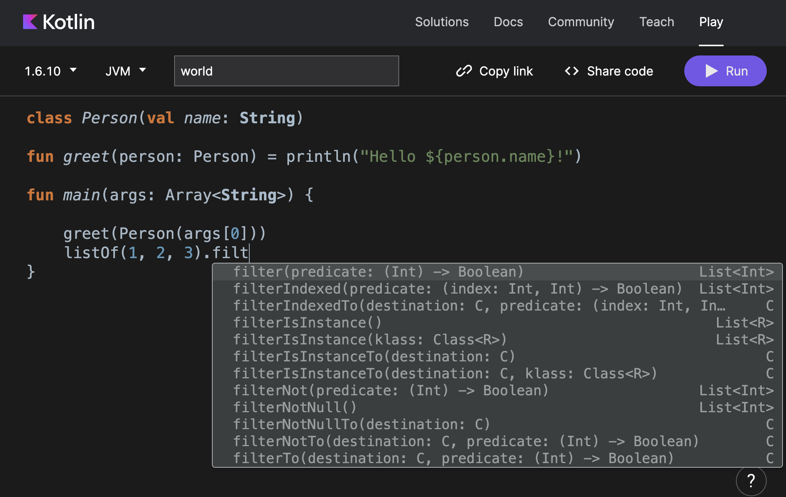

Playground 会在你输入时高亮代码并显示补全选项。它会自动导入标准库以及 [`kotlinx.coroutines`](../../../languageguide/5.12-Concurrency/5.12.2-CoroutinesOverview/) 中的声明。

### 选择执行环境 {#choose-execution-environment}

Playground 提供了自定义执行环境的方式：
* 多个 Kotlin 版本，包括可用的[未来版本预览](../../../earlyaccessprevieweap/14.1-Eap/)。
* 多种运行代码的后端：JVM、JS（旧版或 [IR 编译器](../../6.2-Webdevelopment/6.2.2-Kotlinjs/6.2.2.9-JsIrCompiler/)，或 Canvas），或 JUnit。

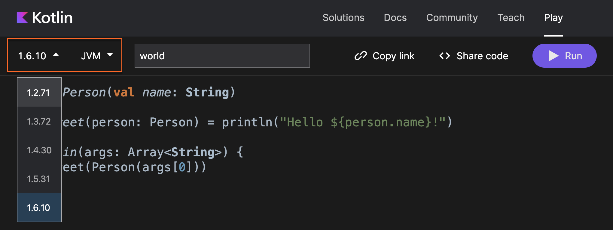

对于 JS 后端，你还可以看到生成的 JS 代码。

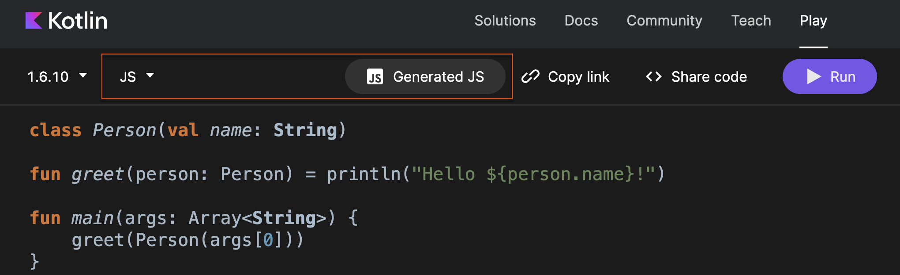

### 在线分享代码 {#share-code-online}

用 Playground 把你的代码分享给别人——点击 **Copy link**，把它发送给任何你想展示代码的人。

你还可以把 Playground 中的代码片段嵌入其他网站，甚至让它们可运行。点击 **Share code** 把你的示例嵌入任何网页或 [Medium](https://medium.com/) 文章。

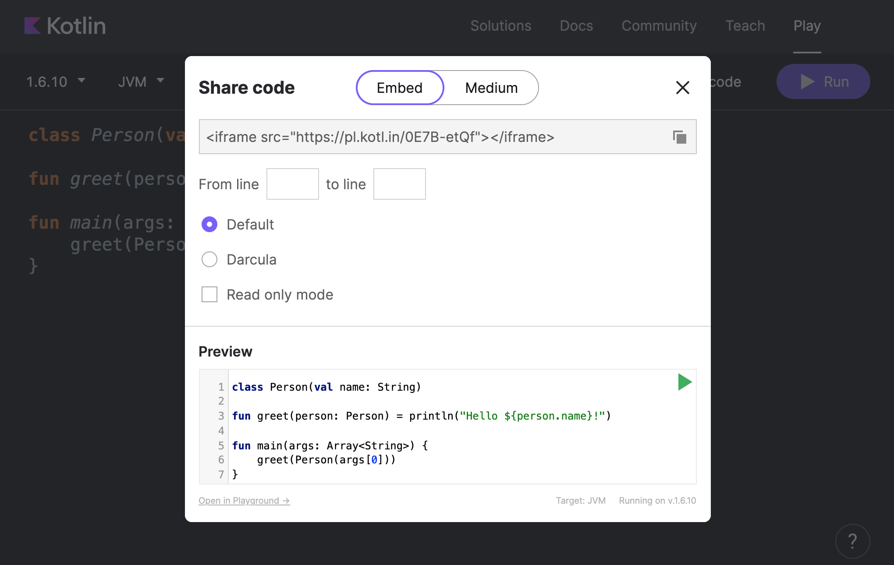

## 命令行：ki shell {#command-line-ki-shell}

[ki shell](https://github.com/Kotlin/kotlin-interactive-shell)（_Kotlin Interactive Shell_）是一个用于在终端中运行 Kotlin 代码的命令行工具。它可用于 Linux、macOS 和 Windows。

ki shell 提供了基本的代码求值能力，以及以下高级特性：
* 代码补全
* 类型检查
* 外部依赖
* 用于代码片段的粘贴模式
* 脚本支持

更多细节请参阅 [ki shell GitHub 仓库](https://github.com/Kotlin/kotlin-interactive-shell)。

### 安装并运行 ki shell {#install-and-run-ki-shell}

要安装 ki shell，请从 [GitHub](https://github.com/Kotlin/kotlin-interactive-shell) 下载它的最新版本，并解压到你选择的目录中。

在 macOS 上，你也可以用 Homebrew 安装 ki shell，只需运行以下命令：

```shell
brew install ki
```

要启动 ki shell，请在 Linux 和 macOS 上运行 `bin/ki.sh`（如果 ki shell 是通过 Homebrew 安装的，也可以直接运行 `ki`），在 Windows 上运行 `bin\ki.bat`。

shell 启动后，你就可以立即在终端中编写 Kotlin 代码。输入 `:help`（或 `:h`）可以查看 ki shell 中可用的命令。

### 代码补全与高亮 {#code-completion-and-highlighting}

当你按下 **Tab** 时，ki shell 会显示代码补全选项。它还会在你输入时提供语法高亮。你可以输入 `:syntax off` 来禁用该特性。

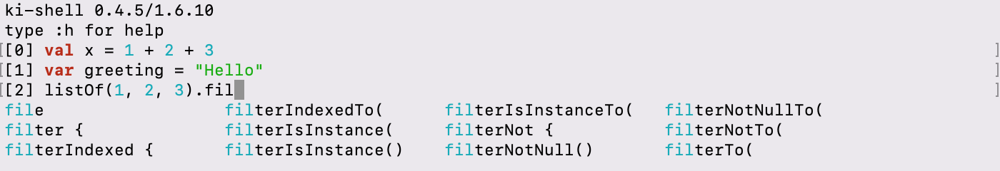

当你按下 **Enter** 时，ki shell 会对输入的行求值并打印结果。表达式的值会以自动生成的名称（如 `res*`）作为变量打印出来。之后你可以在运行的代码中使用这些变量。如果输入的构造不完整（例如一个只有条件没有函数体的 `if`），shell 会打印三个点并等待剩余部分。

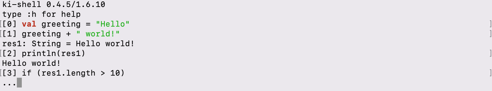

### 检查表达式的类型 {#check-an-expression-s-type}

对于复杂表达式或你不太熟悉的 API，ki shell 提供了 `:type`（或 `:t`）命令，用于显示表达式的类型：

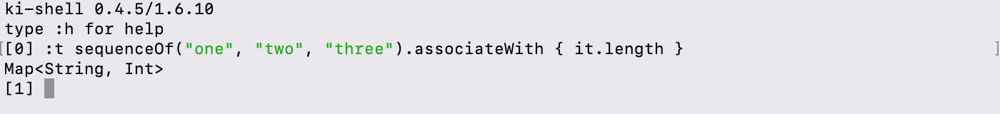

### 加载代码 {#load-code}

如果你需要的代码存放在别处，有两种方式加载它并在 ki shell 中使用：
* 用 `:load`（或 `:l`）命令加载源文件。
* 用 `:paste`（或 `:p`）命令在粘贴模式中复制粘贴代码片段。

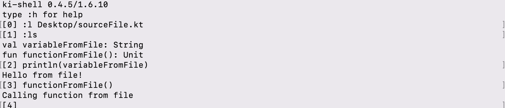

`ls` 命令会显示可用的符号（变量和函数）。

### 添加外部依赖 {#add-external-dependencies}

除标准库之外，ki shell 还支持外部依赖。这让你不必创建整个项目就能在其中试用第三方库。

要在 ki shell 中添加第三方库，请使用 `:dependsOn` 命令。默认情况下，ki shell 使用 Maven 中央仓库，但如果你用 `:repository` 命令连接了其他仓库，也可以使用它们：

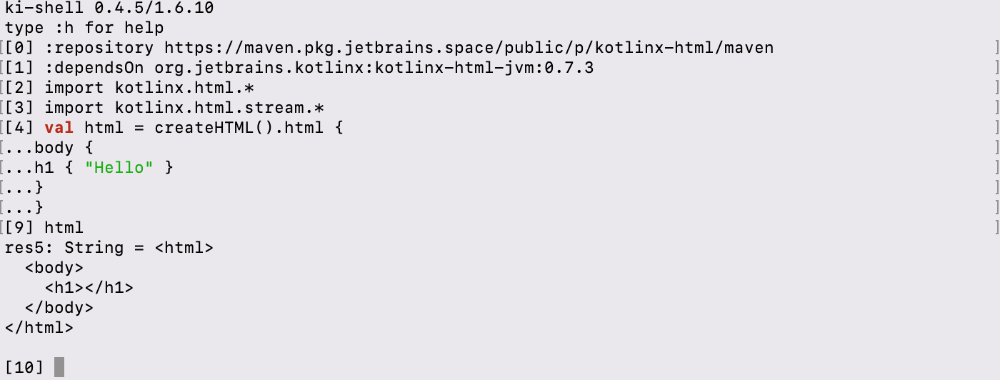
