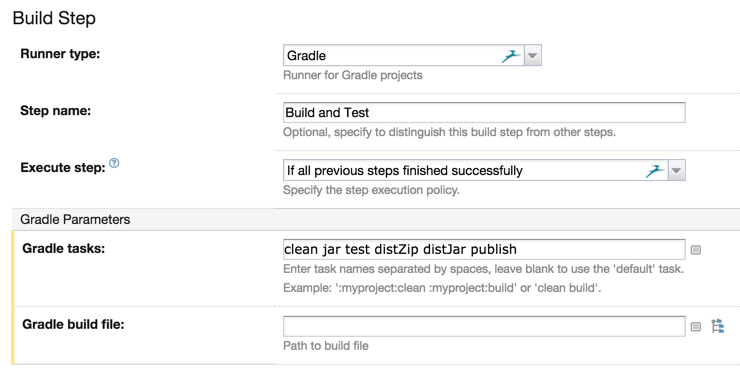
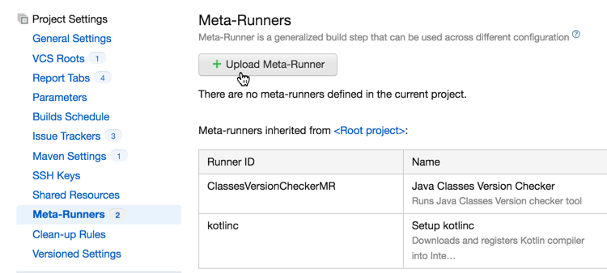
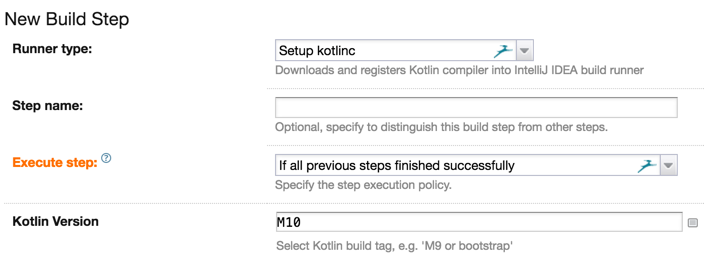
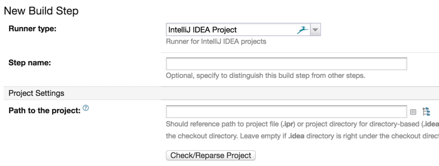

+++
title = "6.7.7 Kotlin 与 TeamCity 持续集成"
date = 2026-09-13T08:50:47+08:00
weight = 6
type = "docs"
description = ""
isCJKLanguage = true
draft = false
+++

> 原文链接: [https://kotlinlang.org/docs/kotlin-and-ci.html](https://kotlinlang.org/docs/kotlin-and-ci.html)

# 6.7.7 Kotlin 与 TeamCity 持续集成

本页将介绍如何设置 [TeamCity](https://www.jetbrains.com/teamcity/) 来构建你的 Kotlin 项目。关于 TeamCity 的更多信息和基础知识，请查看[文档页面](https://www.jetbrains.com/teamcity/documentation/)，其中包含安装、基本配置等信息。

Kotlin 可与不同的构建工具配合使用，因此如果你使用 Maven 或 Gradle 这样的标准工具，设置 Kotlin 项目的过程与任何其他集成这些工具的语言或库并无不同。只有在使用 IntelliJ IDEA 的内部构建系统时（TeamCity 也支持它），才会有一些细微的要求和差异。

## Gradle 与 Maven {#gradle-and-maven}

如果使用 Maven 或 Gradle，设置过程很直接。只需定义构建步骤（Build Step）。例如，如果使用 Gradle，只需为 Runner Type 定义必要参数，例如步骤名称（Step Name）和需要执行的 Gradle 任务。

由于 Kotlin 所需的所有依赖都在 Gradle 文件中定义好了，因此不需要为 Kotlin 正确运行额外配置任何东西。

如果使用 Maven，配置方式相同。唯一的区别是 Runner Type 应选择 Maven。

## IntelliJ IDEA 构建系统 {#intellij-idea-build-system}

如果在 TeamCity 中使用 IntelliJ IDEA 构建系统，请确保 IntelliJ IDEA 所使用的 Kotlin 版本与 TeamCity 运行的版本相同。你可能需要下载特定版本的 Kotlin 插件并把它安装到 TeamCity 上。

幸运的是，已经有一个现成的 meta-runner 可以处理大部分手工工作。如果你不熟悉 TeamCity meta-runner 的概念，请查看[文档](https://www.jetbrains.com/help/teamcity/working-with-meta-runner.html)。它们是一种非常简单而强大的方式，让你无需编写插件就能引入自定义 Runner。

### 下载并安装 meta-runner {#download-and-install-the-meta-runner}

Kotlin 的 meta-runner 可以在 [GitHub](https://github.com/jonnyzzz/Kotlin.TeamCity) 上获取。下载该 meta-runner 并从 TeamCity 用户界面导入它

### 设置获取 Kotlin 编译器的步骤 {#setup-kotlin-compiler-fetching-step}

基本上，这一步只需定义步骤名称和你需要的 Kotlin 版本。也可以使用标签（Tags）。

该 runner 会根据 IntelliJ IDEA 项目中的路径设置，把 `system.path.macro.KOTLIN.BUNDLED` 属性的值设为正确的值。不过，这个值需要在 TeamCity 中定义（并且可以设为任意值）。因此，你需要把它定义为一个系统变量。

### 设置 Kotlin 编译步骤 {#setup-kotlin-compilation-step}

最后一步是定义项目的实际编译过程，它使用标准的 IntelliJ IDEA Runner Type。

这样，我们的项目现在就应该能构建并产出相应的构件了。

## 其他 CI 服务器 {#other-ci-servers}

如果使用 TeamCity 之外的持续集成工具，只要它支持上述任一构建工具，或者能调用命令行工具，那么编译 Kotlin 并把它作为 CI 流程的一部分自动化应该是可以做到的。
