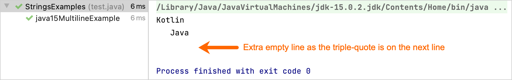
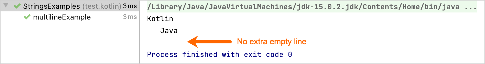

+++
title = "7.1.5.1 Java 与 Kotlin 中的字符串"
date = 2026-09-13T08:50:47+08:00
weight = 1
type = "docs"
description = ""
isCJKLanguage = true
draft = false
+++


> 原文链接: [https://kotlinlang.org/docs/java-to-kotlin-idioms-strings.html](https://kotlinlang.org/docs/java-to-kotlin-idioms-strings.html)

# 7.1.5.1 Java 与 Kotlin 中的字符串

了解如何从 Java String 迁移到 Kotlin String。本指南涵盖 Java 的 StringBuilder、
字符串拼接与拆分、多行字符串、流以及其他主题。

本指南包含在 Java 和 Kotlin 中完成字符串常见任务的示例。它将帮助你从 Java 迁移到 Kotlin，并用真正 Kotlin 的方式编写代码。

## 拼接字符串 {#concatenate-strings}

在 Java 中，你可以这样做：

```java
// Java
String name = "Joe";
System.out.println("Hello, " + name);
System.out.println("Your name is " + name.length() + " characters long");
```

在 Kotlin 中，请在变量名前使用美元符号（`$`），把该变量的值插入字符串中：

```kotlin
fun main() {
    // Kotlin
    val name = "Joe"
    println("Hello, $name")
    println("Your name is ${name.length} characters long")
}
```

你可以用花括号把复杂表达式括起来实现插值，例如 `${name.length}`。更多信息请参阅[字符串模板](../../../../languageguide/5.4-Types/5.4.6-Strings/#string-templates)。

## 构建字符串 {#build-a-string}

在 Java 中，你可以使用 [StringBuilder](https://docs.oracle.com/en/java/javase/11/docs/api/java.base/java/lang/StringBuilder.html)：

```java
// Java
StringBuilder countDown = new StringBuilder();
for (int i = 5; i > 0; i--) {
    countDown.append(i);
    countDown.append("\n");
}
System.out.println(countDown);
```

在 Kotlin 中，请使用 [buildString()](https://kotlinlang.org/api/latest/jvm/stdlib/kotlin.text/build-string.html)——一个[内联函数](../../../../languageguide/5.7-Functions/5.7.5-InlineFunctions/)，它把构建字符串的逻辑作为 lambda 实参接收：

```kotlin
fun main() {
       // Kotlin
       val countDown = buildString {
           for (i in 5 downTo 1) {
               append(i)
               appendLine()
           }
       }
       println(countDown)
}
```

在底层，`buildString` 使用与 Java 相同的 `StringBuilder` 类，你可以在 [lambda](../../../../languageguide/5.7-Functions/5.7.2-Lambdas/#function-literals-with-receiver) 中通过隐式 `this` 访问它。

进一步了解 [lambda 编码规范](../../../../languageguide/5.2-CodingConventions/#lambdas)。

## 用集合元素创建字符串 {#create-a-string-from-collection-items}

在 Java 中，你使用 [Stream API](https://docs.oracle.com/en/java/javase/11/docs/api/java.base/java/util/stream/package-summary.html) 来过滤、映射并收集元素：

```java
// Java
List<Integer> numbers = List.of(1, 2, 3, 4, 5, 6);
String invertedOddNumbers = numbers
        .stream()
        .filter(it -> it % 2 != 0)
        .map(it -> -it)
        .map(Object::toString)
        .collect(Collectors.joining("; "));
System.out.println(invertedOddNumbers);
```

在 Kotlin 中，请使用 [joinToString()](https://kotlinlang.org/api/latest/jvm/stdlib/kotlin.collections/join-to-string.html) 函数，Kotlin 为每个 List 都定义了这个函数：

```kotlin
fun main() {
    // Kotlin
    val numbers = listOf(1, 2, 3, 4, 5, 6)
    val invertedOddNumbers = numbers
        .filter { it % 2 != 0 }
        .joinToString(separator = ";") {"${-it}"}
    println(invertedOddNumbers)
}
```

> **注意：** 在 Java 中，如果你希望在分隔符与后续项之间留出空格，需要显式地在分隔符中加入空格。

进一步了解 [joinToString()](../../../../libraryguides/9.1-Standardlibrary/9.1.1-Collections/9.1.1.6-CollectionTransformations/#string-representation) 的用法。

## 字符串为空白时设置默认值 {#set-default-value-if-the-string-is-blank}

在 Java 中，你可以使用[三元运算符](https://en.wikipedia.org/wiki/%3F:)：

```java
// Java
public void defaultValueIfStringIsBlank() {
    String nameValue = getName();
    String name = nameValue.isBlank() ? "John Doe" : nameValue;
    System.out.println(name);
}

public String getName() {
    Random rand = new Random();
    return rand.nextBoolean() ? "" : "David";
}
```

Kotlin 提供了内联函数 [ifBlank()](https://kotlinlang.org/api/latest/jvm/stdlib/kotlin.text/if-blank.html)，它把默认值作为实参接收：

```kotlin
// Java
import kotlin.random.Random

fun main() {
    val name = getName().ifBlank { "John Doe" }
    println(name)
}

fun getName(): String =
    if (Random.nextBoolean()) "" else "David"
```

## 替换字符串首尾的字符 {#replace-characters-at-the-beginning-and-end-of-a-string}

在 Java 中，你可以使用 [replaceAll()](https://docs.oracle.com/en/java/javase/11/docs/api/java.base/java/lang/String.html#replaceAll(java.lang.String,java.lang.String)) 函数。此时 `replaceAll()` 接收正则表达式 `^##` 和 `##$`，它们分别表示以 `##` 开头和结尾的字符串：

```java
// Kotlin
String input = "##place##holder##";
String result = input.replaceAll("^##|##$", "");
System.out.println(result);
```

在 Kotlin 中，请使用带字符串分隔符 `##` 的 [removeSurrounding()](https://kotlinlang.org/api/latest/jvm/stdlib/kotlin.text/remove-surrounding.html) 函数：

```kotlin
fun main() {
    // Kotlin
    val input = "##place##holder##"
    val result = input.removeSurrounding("##")
    println(result)
}
```

## 替换匹配内容 {#replace-occurrences}

在 Java 中，你可以使用 [Pattern](https://docs.oracle.com/en/java/javase/11/docs/api/java.base/java/util/regex/Pattern.html) 和 [Matcher](https://docs.oracle.com/en/java/javase/11/docs/api/java.base/java/util/regex/Matcher.html) 类，例如对某些数据做脱敏：

```java
// Kotlin
String input = "login: Pokemon5, password: 1q2w3e4r5t";
Pattern pattern = Pattern.compile("\\w*\\d+\\w*");
Matcher matcher = pattern.matcher(input);
String replacementResult = matcher.replaceAll(it -> "xxx");
System.out.println("Initial input: '" + input + "'");
System.out.println("Anonymized input: '" + replacementResult + "'");
```

在 Kotlin 中，你使用简化正则表达式操作的 [Regex](https://kotlinlang.org/api/latest/jvm/stdlib/kotlin.text/-regex/) 类。此外，使用[多行字符串](../../../../languageguide/5.4-Types/5.4.6-Strings/#multiline-strings)可以减少反斜杠数量，从而简化正则模式：

```kotlin
fun main() {
    // Kotlin
    val regex = Regex("""\w*\d+\w*""") // multiline string
    val input = "login: Pokemon5, password: 1q2w3e4r5t"
    val replacementResult = regex.replace(input, replacement = "xxx")
    println("Initial input: '$input'")
    println("Anonymized input: '$replacementResult'")
}
```

## 拆分字符串 {#split-a-string}

在 Java 中，要用句点字符（`.`）拆分字符串，你需要使用转义（`\\`）。这是因为 `String` 类的 [split()](https://docs.oracle.com/en/java/javase/11/docs/api/java.base/java/lang/String.html#split(java.lang.String)) 函数接收正则表达式作为实参：

```java
// Kotlin
System.out.println(Arrays.toString("Sometimes.text.should.be.split".split("\\.")));
```

在 Kotlin 中，请使用 Kotlin 的 [split()](https://kotlinlang.org/api/latest/jvm/stdlib/kotlin.text/split.html) 函数，它把分隔符作为可变数量参数接收：

```kotlin
fun main() {
    // Kotlin
    println("Sometimes.text.should.be.split".split("."))
}
```

如果你需要用正则表达式拆分，请使用接收 `Regex` 作为实参的重载版本 `split()`。

## 截取子字符串 {#take-a-substring}

在 Java 中，你可以使用 [substring()](https://docs.oracle.com/en/java/javase/11/docs/api/java.base/java/lang/String.html#substring(int)) 函数，它接收要开始截取子串的字符起始索引（含该索引）。要截取该字符之后的子串，你需要把索引加一：

```java
// Java
String input = "What is the answer to the Ultimate Question of Life, the Universe, and Everything? 42";
String answer = input.substring(input.indexOf("?") + 1);
System.out.println(answer);
```

在 Kotlin 中，你使用 [substringAfter()](https://kotlinlang.org/api/latest/jvm/stdlib/kotlin.text/substring-after.html) 函数，不需要计算想在其后截取子串的那个字符的索引：

```kotlin
fun main() {
    // Kotlin
    val input = "What is the answer to the Ultimate Question of Life, the Universe, and Everything? 42"
    val answer = input.substringAfter("?")
    println(answer)
}
```

此外，你还可以截取某字符最后一次出现之后的子串：

```kotlin
fun main() {
    // Kotlin
    val input = "To be, or not to be, that is the question."
    val question = input.substringAfterLast(",")
    println(question)
}
```

## 使用多行字符串 {#use-multiline-strings}

在 Java 15 之前，有几种创建多行字符串的方式。例如使用 `String` 类的 [join()](https://docs.oracle.com/en/java/javase/11/docs/api/java.base/java/lang/String.html#join(java.lang.CharSequence,java.lang.CharSequence...)) 函数：

```java
// Java
String lineSeparator = System.getProperty("line.separator");
String result = String.join(lineSeparator,
       "Kotlin",
       "Java");
System.out.println(result);
```

Java 15 中出现了[文本块](https://docs.oracle.com/en/java/javase/15/text-blocks/index.html)。有一点需要注意：如果你打印多行字符串，而三引号写在下一行，输出中就会多出一个空行：

```java
// Java
String result = """
    Kotlin
       Java
    """;
System.out.println(result);
```

输出：



如果你把三引号写在最后一个词所在的同一行，这种差异就会消失。

在 Kotlin 中，你可以把引号写在新的一行，输出中不会多出空行。任意一行最左侧的字符决定该行的起始位置。与 Java 的区别在于，Java 会自动裁剪缩进，而在 Kotlin 中你需要显式地做这件事：

```kotlin
fun main() {
    // Kotlin
    val result = """
        Kotlin
           Java
    """.trimIndent()
    println(result)
}
```

输出：



如果要得到额外的空行，你应该显式地把这个空行加入多行字符串。

在 Kotlin 中，你也可以使用 [trimMargin()](https://kotlinlang.org/api/latest/jvm/stdlib/kotlin.text/trim-margin.html) 函数来自定义缩进：

```kotlin
// Kotlin
fun main() {
    val result = """
       #  Kotlin
       #  Java
   """.trimMargin("#")
    println(result)
}
```

进一步了解[多行字符串](../../../../languageguide/5.2-CodingConventions/#strings)。

## 接下来学什么？ {#what-s-next}

* 浏览其他 [Kotlin 惯用法](../../../../languageguide/5.3-Idioms/)。
* 了解如何用 [Java 到 Kotlin 转换器](../../../../development/6.1-Backenddevelopment/6.1.2-MixingJavaKotlinIntellij/#convert-java-files-to-kotlin)把现有 Java 代码转换为 Kotlin。

如果你有喜欢的惯用法，欢迎通过发送 pull request 与我们分享。
