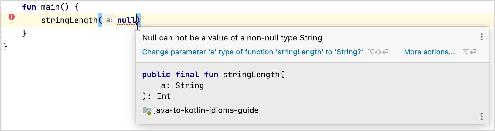

+++
title = "7.1.5.3 Java 与 Kotlin 中的可空性"
date = 2026-09-13T08:50:47+08:00
weight = 3
type = "docs"
description = ""
isCJKLanguage = true
draft = false
+++


> 原文链接: [https://kotlinlang.org/docs/java-to-kotlin-nullability-guide.html](https://kotlinlang.org/docs/java-to-kotlin-nullability-guide.html)

# 7.1.5.3 Java 与 Kotlin 中的可空性

了解如何把可空相关写法从 Java 迁移到 Kotlin。本指南涵盖 Kotlin 中对可空类型的支持、
Kotlin 如何处理来自 Java 的可空性注解等内容。

*可空性*指的是变量持有 `null` 值的能力。当变量包含 `null` 时，尝试解引用该变量会导致 `NullPointerException`。为了把出现空指针异常的概率降到最低，有很多种写法可供选择。

本指南介绍 Java 与 Kotlin 在处理可能为 null 的变量时的差异。它将帮助你从 Java 迁移到 Kotlin，并用真正的 Kotlin 风格编写代码。

本指南的第一部分介绍最重要的差异——Kotlin 对可空类型的支持，以及 Kotlin 如何处理[来自 Java 代码的类型](#platform-types)。第二部分从[检查函数调用的结果](#checking-the-result-of-a-function-call)开始，通过若干具体案例来解释某些差异。

[进一步了解 Kotlin 中的空安全](../../../../languageguide/5.9-NullSafety/)。

## 对可空类型的支持 {#support-for-nullable-types}

Kotlin 与 Java 类型系统之间最重要的差异，是 Kotlin 对[可空类型](../../../../languageguide/5.9-NullSafety/)的显式支持。这是一种指明哪些变量可能持有 `null` 值的方式。如果变量可能为 `null`，在它上面调用方法就是不安全的，因为这可能引发 `NullPointerException`。Kotlin 在编译期禁止这类调用，从而避免了许多可能的异常。在运行时，可空类型的对象与非空类型的对象被同等对待：可空类型并不是非空类型的包装器。所有检查都在编译期完成。这意味着在 Kotlin 中处理可空类型几乎没有运行时开销。

> 我们说"几乎"，是因为尽管确实会生成[内建（intrinsic）](https://en.wikipedia.org/wiki/Intrinsic_function)检查，
但它们的开销极小。

在 Java 中，如果你不写空检查，方法就可能抛出 `NullPointerException`：

```java
// Java
int stringLength(String a) {
    return a.length();
}

void main() {
    stringLength(null); // 抛出 `NullPointerException`
}
```

这次调用会有如下输出：

```java
java.lang.NullPointerException: Cannot invoke "String.length()" because "a" is null
    at test.java.Nullability.stringLength(Nullability.java:8)
    at test.java.Nullability.main(Nullability.java:12)
    at java.base/java.util.ArrayList.forEach(ArrayList.java:1511)
    at java.base/java.util.ArrayList.forEach(ArrayList.java:1511)
```

在 Kotlin 中，除非你显式地把类型标记为可空，否则所有普通类型默认都是非空的。如果你不期望 `a` 为 `null`，可以这样声明 `stringLength()` 函数：

```kotlin
// Kotlin
fun stringLength(a: String) = a.length
```

参数 `a` 的类型是 `String`，在 Kotlin 中这表示它必须始终包含一个 `String` 实例，不能包含 `null`。Kotlin 中的可空类型用问号 `?` 标记，例如 `String?`。如果 `a` 是 `String`，运行时出现 `NullPointerException` 的情况就不可能发生，因为编译器强制要求 `stringLength()` 的所有实参都不为 `null`。

尝试把 `null` 值传给 `stringLength(a: String)` 函数会导致编译期错误"Null can not be a value of a non-null type String"：



如果你希望这个函数能接受任何实参（包括 `null`），请在实参类型后加上问号写成 `String?`，并在函数体内检查该实参的值不为 `null`：

```kotlin
// Kotlin
fun stringLength(a: String?): Int = if (a != null) a.length else 0
```

检查成功通过后，在编译器执行该检查的作用域内，编译器会把该变量当作非空类型 `String` 来对待。

如果你不执行这个检查，代码将无法编译，并给出以下消息："Only [safe (?.)](../../../../languageguide/5.9-NullSafety/#safe-call-operator) or [non-nullable asserted (!!.) calls](../../../../languageguide/5.9-NullSafety/#not-null-assertion-operator) are allowed on a [nullable receiver](../../../../languageguide/5.8-Classesandinterfaces/5.8.3-Extensions/#nullable-receivers) of type String?"。

你也可以写得更短——使用[安全调用运算符 ?.（非空简写）](../../../../languageguide/5.3-Idioms/#if-not-null-shorthand)，它允许把空检查和方法调用合并为一个操作：

```kotlin
// Kotlin
fun stringLength(a: String?): Int = a?.length ?: 0
```

## 平台类型 {#platform-types}

在 Java 中，你可以使用注解来说明变量是否可以为 `null`。这类注解不属于标准库，但你可以单独添加。例如，你可以使用 JetBrains 的 `@Nullable` 和 `@NotNull` 注解（来自 `org.jetbrains.annotations` 包）、[JSpecify](https://jspecify.dev/) 的注解（`org.jspecify.annotations`），或 Eclipse 的注解（`org.eclipse.jdt.annotation`）。当你在[从 Kotlin 代码调用 Java 代码](../../7.1.2-JavaInterop/#nullability-annotations)时，Kotlin 能识别这些注解，并按注解来处理类型。

如果你的 Java 代码没有这些注解，Kotlin 会把 Java 类型当作_平台类型_。但由于 Kotlin 没有这类类型的可空性信息，编译器会允许对它们执行所有操作。你需要自己决定是否执行空检查，因为：

* 与在 Java 中一样，如果你尝试对 `null` 执行操作，就会得到 `NullPointerException`。
* 编译器不会提示任何多余的空检查，而在你对非空类型的值执行空安全操作时，它通常会给出这样的提示。

进一步了解[在空安全与平台类型方面从 Kotlin 调用 Java](../../7.1.2-JavaInterop/#null-safety-and-platform-types)。

## 对确定非空类型的支持 {#support-for-definitely-non-nullable-types}

在 Kotlin 中，如果你想重写一个把 `@NotNull` 作为参数的 Java 方法，就需要用到 Kotlin 的确定非空类型。

例如，考虑 Java 中这个 `load()` 方法：

```java
import org.jetbrains.annotations.*;

public interface Game<T> {
  public T save(T x) {}
  @NotNull
  public T load(@NotNull T x) {}
}
```

要在 Kotlin 中成功重写 `load()` 方法，需要把 `T1` 声明为确定非空（`T1 & Any`）：

```kotlin
interface ArcadeGame<T1> : Game<T1> {
  override fun save(x: T1): T1
  // T1 是确定非空的
  override fun load(x: T1 & Any): T1 & Any
}
```

进一步了解[确定非空](../../../../languageguide/5.11-Generics/#definitely-non-nullable-types)的泛型类型。

## 检查函数调用的结果 {#checking-the-result-of-a-function-call}

需要检查 `null` 的最常见场景之一，是从函数调用获得结果时。

在下面的例子中有两个类：`Order` 和 `Customer`。`Order` 持有一个 `Customer` 实例的引用。`findOrder()` 函数返回 `Order` 类的实例，如果找不到订单则返回 `null`。目标是处理所获取订单的客户实例。

下面是这些类的 Java 版本：

```java
// Java
record Order (Customer customer) {}

record Customer (String name) {}
```

在 Java 中，调用该函数并对结果做非空检查，然后继续解引用所需的属性：

```java
// Java
Order order = findOrder();

if (order != null) {
    processCustomer(order.getCustomer());
}
```

把上面的 Java 代码直接转换成 Kotlin 会得到以下结果：

```kotlin
// Kotlin
data class Order(val customer: Customer)

data class Customer(val name: String)

val order = findOrder()

// 直接转换
if (order != null){
    processCustomer(order.customer)
}
```

请把[安全调用运算符 `?.`（非空简写）](../../../../languageguide/5.3-Idioms/#if-not-null-shorthand)与标准库中的任意[作用域函数](../../../../libraryguides/9.1-Standardlibrary/9.1.4-ScopeFunctions/)结合使用。通常使用 `let` 函数：

```kotlin
// Kotlin
val order = findOrder()

order?.let {
    processCustomer(it.customer)
}
```

下面是同一段代码的更简短写法：

```kotlin
// Kotlin
findOrder()?.customer?.let(::processCustomer)
```

## 用默认值代替 null {#default-values-instead-of-null}

空检查常常与[设置默认值](../../../../languageguide/5.7-Functions/5.7.1-Functions/#parameters-with-default-values)结合使用，用于空检查成功时的场景。

带空检查的 Java 代码：

```java
// Java
Order order = findOrder();
if (order == null) {
    order = new Order(new Customer("Antonio"))
}
```

要在 Kotlin 中表达同样的逻辑，请使用 [Elvis 运算符（非空否则简写）](../../../../languageguide/5.9-NullSafety/#elvis-operator)：

```kotlin
// Kotlin
val order = findOrder() ?: Order(Customer("Antonio"))
```

## 返回一个值或 null 的函数 {#functions-returning-a-value-or-null}

在 Java 中处理列表元素时需要小心。在使用元素之前，你应当始终检查该索引处是否存在元素：

```java
// Java
var numbers = new ArrayList<Integer>();
numbers.add(1);
numbers.add(2);

System.out.println(numbers.get(0));
// numbers.get(5) // 异常！
```

Kotlin 标准库经常提供函数名就能表明其是否可能返回 `null` 的函数。这在集合 API 中尤其常见：

```kotlin
fun main() {
    // Kotlin
    // 与 Java 中相同的代码：
    val numbers = listOf(1, 2)

    println(numbers[0]) // 如果集合为空，可能抛出 IndexOutOfBoundsException
    // numbers.get(5)     // 异常！

    // 更多能力：
    println(numbers.firstOrNull())
    println(numbers.getOrNull(5)) // null
}
```

## 聚合操作 {#aggregate-operations}

当你需要获取最大元素、或在没有元素时返回 `null` 时，在 Java 中你会使用 [Stream API](https://docs.oracle.com/en/java/javase/17/docs/api/java.base/java/util/stream/package-summary.html)：

```java
// Java
var numbers = new ArrayList<Integer>();
var max = numbers.stream().max(Comparator.naturalOrder()).orElse(null);
System.out.println("Max: " + max);
```

在 Kotlin 中，请使用[聚合操作](../../../../libraryguides/9.1-Standardlibrary/9.1.1-Collections/9.1.1.9-Operationsandoperators/9.1.1.9.2-CollectionAggregate/)：

```kotlin
// Kotlin
val numbers = listOf<Int>()
println("Max: ${numbers.maxOrNull()}")
```

进一步了解[Java 与 Kotlin 中的集合](../7.1.5.2-JavaToKotlinCollectionsGuide/)。

## 安全地转换类型 {#casting-types-safely}

当你需要安全地转换类型时，在 Java 中你会使用 `instanceof` 运算符，然后检查转换的效果：

```java
// Java
int getStringLength(Object y) {
    return y instanceof String x ? x.length() : -1;
}

void main() {
    System.out.println(getStringLength(1)); // 打印 `-1`
}
```

要在 Kotlin 中避免异常，请使用[安全转换运算符](../../../../languageguide/5.4-Types/5.4.8-Typecasts/#unsafe-cast-operator) `as?`，它在失败时返回 `null`：

```kotlin
// Kotlin
fun main() {
    println(getStringLength(1)) // 打印 `-1`
}

fun getStringLength(y: Any): Int {
    val x: String? = y as? String // null
    return x?.length ?: -1 // 返回 -1，因为 `x` 为 null
}
```

> 在上面的 Java 例子中，函数 `getStringLength()` 返回基本类型 `int` 的结果。
要让它返回 `null`，你可以使用[_装箱_类型](https://docs.oracle.com/javase/tutorial/java/data/autoboxing.html) `Integer`。不过，让这类函数返回负值再检查该值会更节省资源——反正你本来也要检查，但这样做不会产生额外的装箱。

把 Java 代码迁移到 Kotlin 时，你可能想先用普通的转换运算符 `as` 配合可空类型，以保留代码原有的语义。不过我们建议把代码改成使用安全转换运算符 `as?`，这样更安全、也更符合语言习惯。例如，如果你有如下 Java 代码：

```java
public class UserProfile {
    Object data;

    public static String getUsername(UserProfile profile) {
        if (profile == null) {
            return null;
        }
        return (String) profile.data;
    }
}
```

直接用 `as` 运算符迁移会得到：

```kotlin
class UserProfile(var data: Any? = null)

fun getUsername(profile: UserProfile?): String? {
    if (profile == null) {
        return null
    }
    return profile.data as String?
}
```

这里 `profile.data` 通过 `as String?` 转换为可空字符串。

我们建议再进一步，使用 `as? String` 来安全地转换该值。这种方式在失败时返回 `null`，而不是抛出 `ClassCastException`：

```kotlin
class UserProfile(var data: Any? = null)

fun getUsername(profile: UserProfile?): String? =
  profile?.data as? String
```

这个版本用[安全调用运算符](../../../../languageguide/5.9-NullSafety/#safe-call-operator) `?.` 替代了 `if` 表达式，从而在尝试转换之前安全地访问 data 属性。

## 接下来学什么？ {#what-s-next}

* 浏览其他 [Kotlin 惯用法](../../../../languageguide/5.3-Idioms/)。
* 了解如何用 [Java 到 Kotlin (J2K) 转换器](../../../../development/6.1-Backenddevelopment/6.1.2-MixingJavaKotlinIntellij/#convert-java-files-to-kotlin)把现有 Java 代码转换为 Kotlin。
* 看看其他迁移指南：
* [Java 与 Kotlin 中的字符串](../7.1.5.1-JavaToKotlinIdiomsStrings/)
* [Java 与 Kotlin 中的集合](../7.1.5.2-JavaToKotlinCollectionsGuide/)

如果你有喜欢的惯用法，欢迎通过发送 pull request 与我们分享！
