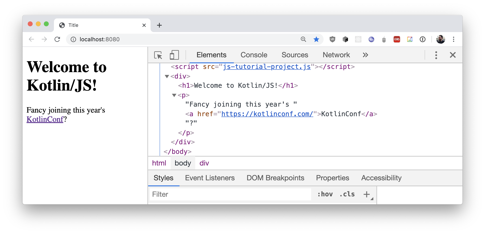

+++
title = "7.2.8 类型安全的 HTML DSL"
date = 2026-09-13T08:50:47+08:00
weight = 8
type = "docs"
description = ""
isCJKLanguage = true
draft = false
+++


> 原文链接: [https://kotlinlang.org/docs/typesafe-html-dsl.html](https://kotlinlang.org/docs/typesafe-html-dsl.html)

# 7.2.8 类型安全的 HTML DSL

[kotlinx.html 库](https://www.github.com/kotlin/kotlinx.html)提供了用静态类型 HTML 构建器生成 DOM 元素的能力（除了 JavaScript 之外，它甚至也能用于 JVM 目标！）。要使用这个库，请把相应的仓库和依赖加入我们的 `build.gradle.kts` 文件：

```kotlin
repositories {
    // ...
    mavenCentral()
}

dependencies {
    implementation(kotlin("stdlib-js"))
    implementation("org.jetbrains.kotlinx:kotlinx-html-js:0.8.0")
    // ...
}
```

引入依赖之后，你就可以使用所提供的各种接口来生成 DOM。例如，要渲染一个标题、一些文本和一个链接，下面这段代码就足够了：

```kotlin
import kotlinx.browser.*
import kotlinx.html.*
import kotlinx.html.dom.*

fun main() {
    document.body!!.append.div {
        h1 {
            +"Welcome to Kotlin/JS!"
        }
        p {
            +"Fancy joining this year's "
            a("https://kotlinconf.com/") {
                +"KotlinConf"
            }
            +"?"
        }
    }
}
```

在浏览器中运行这个例子时，DOM 会以直观的方式组装起来。用浏览器开发者工具查看网站的 Elements 即可轻松确认这一点：



要进一步了解 `kotlinx.html` 库，请查看 [GitHub Wiki](https://github.com/Kotlin/kotlinx.html/wiki/Getting-started)，你可以在其中找到关于如何[创建元素](https://github.com/Kotlin/kotlinx.html/wiki/DOM-trees)而不把它们加入 DOM、如何[绑定事件](https://github.com/Kotlin/kotlinx.html/wiki/Events)（例如 `onClick`），以及如何给 HTML 元素[应用 CSS 类](https://github.com/Kotlin/kotlinx.html/wiki/Elements-CSS-classes)的示例等等，这里仅举几例。
