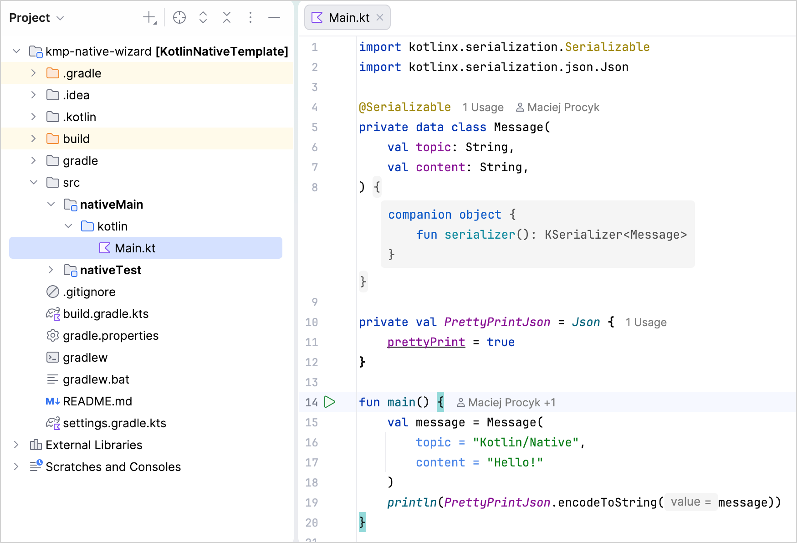
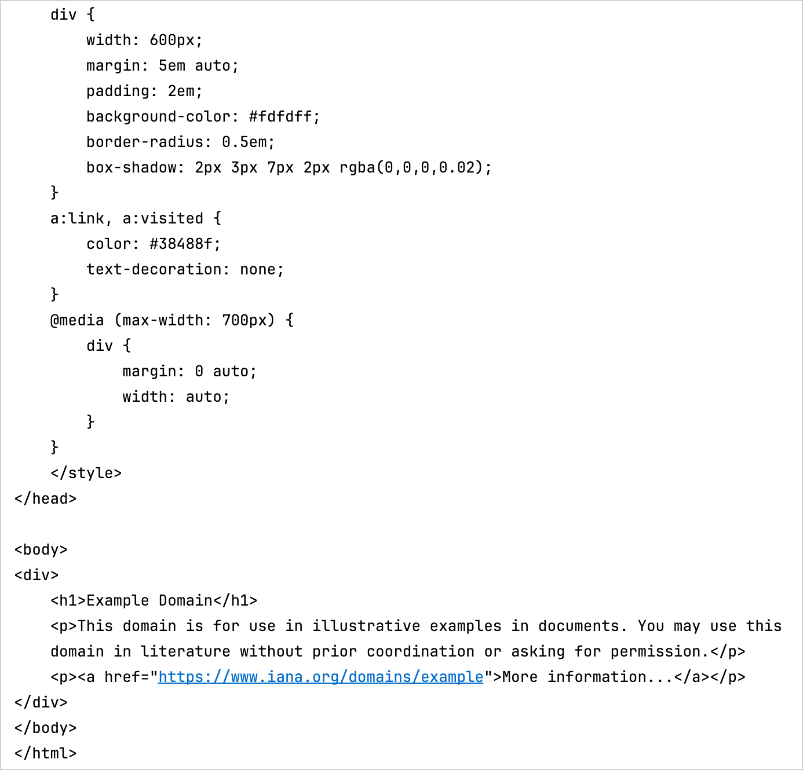

+++
title = "7.3.3.4 使用 C 互操作和 libcurl 创建应用 – 教程"
date = 2026-09-13T08:50:47+08:00
weight = 3
type = "docs"
description = ""
isCJKLanguage = true
draft = false
+++


> 原文链接: [https://kotlinlang.org/docs/native-app-with-c-and-libcurl.html](https://kotlinlang.org/docs/native-app-with-c-and-libcurl.html)

# 7.3.3.4 使用 C 互操作和 libcurl 创建应用 – 教程

> **注意：** C 库导入处于 [Beta](../../7.3.5-NativeLibImportStability/#stability-of-c-and-objective-c-library-import) 阶段。由 cinterop 工具从 C 库生成的所有 Kotlin 声明都应带有 `@ExperimentalForeignApi` 注解。随 Kotlin/Native 提供的原生平台库（例如 Foundation、UIKit 和 POSIX）只对部分 API 要求选择启用。

本教程演示如何使用 IntelliJ IDEA 创建命令行应用。你将学习如何用 Kotlin/Native 和 libcurl 库创建一个能在指定平台上原生运行的简单 HTTP 客户端。

最终产物是一个可执行的命令行应用，你可以在 macOS 和 Linux 上运行它，并发起简单的 HTTP GET 请求。

你可以使用命令行直接生成 Kotlin 库，也可以通过脚本文件（例如 `.sh` 或 `.bat` 文件）来完成。不过，对于包含数百个文件和库的较大项目，这种方式扩展性不好。使用构建系统可以下载并缓存 Kotlin/Native 编译器二进制文件及其传递依赖的库，并负责运行编译器和测试，从而简化整个过程。Kotlin/Native 可以通过 [Kotlin Multiplatform 插件](../../../../buildtools/11.1-Gradle/11.1.3-GradleConfigureProject/#targeting-multiple-platforms)使用 [Gradle](https://gradle.org) 构建系统。

## 开始之前 {#before-you-start}

1. 下载并安装最新版本的 [IntelliJ IDEA](https://www.jetbrains.com/idea/)。
2. 在 IntelliJ IDEA 中选择 **File** | **New** | **Project from Version Control**，并使用以下 URL 克隆[项目模板](https://github.com/Kotlin/kmp-native-wizard)：

```none
   https://github.com/Kotlin/kmp-native-wizard
```

3. 查看项目结构：



该模板包含一个项目，其中有你入门所需的文件和文件夹。需要理解的重要一点是：只要代码没有平台特有的要求，用 Kotlin/Native 编写的应用就可以面向不同平台。你的代码放在 `nativeMain` 目录中，并有一个对应的 `nativeTest`。在本教程中，请保持文件夹结构不变。

4. 打开 `build.gradle.kts` 文件，即包含项目设置的构建脚本。请特别注意构建文件中以下内容：

```kotlin
    import org.jetbrains.kotlin.gradle.plugin.mpp.KotlinNativeTarget

    kotlin {
        macosArm64()
        linuxArm64()
        linuxX64()
        mingwX64()

        targets.withType<KotlinNativeTarget>().configureEach {
            binaries {
                executable {
                    entryPoint = "main"
                }
            }
        }
    }
```

* 目标通过 `macosArm64`、`linuxArm64`、`linuxX64` 和 `mingwX64` 定义，分别对应 macOS、Linux 和 Windows。请查看[受支持平台](../../../../development/6.3-Nativedevelopment/6.3.8-NativeTargetSupport/)的完整列表。
* `binaries {}` 块定义了二进制文件如何生成以及应用的入口点。这些可以保留默认值。
* C 互操作作为构建中的额外步骤进行配置。默认情况下，来自 C 的所有符号都被导入到 `interop` 包中。你可能希望在 `.kt` 文件中导入整个包。进一步了解[如何配置](../../../../buildtools/11.1-Gradle/11.1.3-GradleConfigureProject/#targeting-multiple-platforms)它。

## 创建定义文件 {#create-a-definition-file}

在编写原生应用时，你经常需要访问 [Kotlin 标准库](https://kotlinlang.org/api/latest/jvm/stdlib/)中不包含的某些功能，例如发起 HTTP 请求、读写磁盘等等。

Kotlin/Native 有助于使用标准 C 库，从而开辟了一整个功能生态，几乎涵盖你可能需要的任何东西。Kotlin/Native 已经随附了一组预构建的[平台库](../../../../development/6.3-Nativedevelopment/6.3.4-NativePlatformLibs/)，它们为标准库提供了一些额外的常用功能。

互操作的理想场景是：像调用 Kotlin 函数那样调用 C 函数，遵循相同的签名和约定。这时 cinterop 工具就派上用场了。它接收一个 C 库并生成相应的 Kotlin 绑定，使该库可以像 Kotlin 代码一样使用。

要生成这些绑定，每个库都需要一个定义文件，通常与库同名。这是一个属性文件，精确描述了该库应如何被使用。

在这个应用中，你需要 libcurl 库来发起一些 HTTP 调用。要创建它的定义文件：

1. 选中 `src` 文件夹，并通过 **File | New | Directory** 创建一个新目录。
2. 把新目录命名为 **nativeInterop/cinterop**。这是头文件位置的默认约定，不过如果你使用其他位置，可以在 `build.gradle.kts` 文件中覆盖它。
3. 选中这个新子文件夹，并通过 **File | New | File** 创建一个新的 `libcurl.def` 文件。
4. 用以下代码更新你的文件：

```c
    headers = curl/curl.h
    headerFilter = curl/*

    compilerOpts.linux = -I/usr/include -I/usr/include/x86_64-linux-gnu
    linkerOpts.osx = -L/opt/local/lib -L/usr/local/opt/curl/lib -lcurl
    linkerOpts.linux = -L/usr/lib/x86_64-linux-gnu -lcurl
```

* `headers` 是要为其生成 Kotlin 桩的头文件列表。你可以在这里添加多个文件，用空格分隔。在这里只有 `curl.h`。所引用的文件需要位于指定路径下（在本例中是 `/usr/include/curl`）。
* `headerFilter` 表示具体包含哪些内容。在 C 中，当一个文件通过 `#include` 指令引用另一个文件时，所有头文件都会被一并包含。有时这并不必要，你可以[使用 glob 模式](https://en.wikipedia.org/wiki/Glob_(programming))添加该参数来进行调整。

如果你不想把外部依赖（例如系统 `stdint.h` 头文件）拉入互操作库，可以使用 `headerFilter`。它对于优化库体积、修复系统与所提供的 Kotlin/Native 编译环境之间的潜在冲突也可能有用。

* 如果需要修改某个平台的行为，你可以使用 `compilerOpts.osx` 或 `compilerOpts.linux` 这样的形式为选项提供平台特定的值。在本例中，它们分别是 macOS（`.osx` 后缀）和 Linux（`.linux` 后缀）。也可以使用不带后缀的参数（例如 `linkerOpts=`），它们会应用于所有平台。

关于可用选项的完整列表，请参阅[定义文件](../../7.3.4-NativeDefinitionFile/#properties)。

> **注意：** 要让示例正常工作，你的系统上需要有 `curl` 库的二进制文件。在 macOS 和 Linux 上，它们通常已经包含在内。在 Windows 上，你可以从[源码](https://curl.se/download.html)构建（需要 Microsoft Visual Studio 或 Windows SDK 命令行工具）。更多细节请参阅[相关博客文章](https://jonnyzzz.com/blog/2018/10/29/kn-libcurl-windows/)。或者，你也可以考虑使用 [MinGW/MSYS2](https://www.msys2.org/) 的 `curl` 二进制文件。

## 把互操作加入构建过程 {#add-interoperability-to-the-build-process}

要使用头文件，请确保它们作为构建过程的一部分被生成。为此，请在 `build.gradle.kts` 文件中添加以下 `compilations {}` 块：

```kotlin
targets.withType<KotlinNativeTarget>().configureEach {
    compilations.getByName("main") {
        cinterops {
            val libcurl by creating
        }
    }
    binaries {
        executable {
            entryPoint = "main"
        }
    }
}
```

首先添加 `cinterops`，然后为定义文件添加一个条目。默认情况下会使用该文件的名称。你可以用额外参数覆盖它：

```kotlin
cinterops {
    val libcurl by creating {
        definitionFile.set(project.file("src/nativeInterop/cinterop/libcurl.def"))
        packageName("com.jetbrains.handson.http")
        compilerOpts("-I/path")
        includeDirs.allHeaders("path")
    }
}
```

## 编写应用代码 {#write-the-application-code}

既然你已经有了该库及相应的 Kotlin 桩，就可以在应用中使用它们了。在本教程中，请把 [simple.c](https://curl.se/libcurl/c/simple.html) 示例转换为 Kotlin。

在 `src/nativeMain/kotlin/` 文件夹中，用以下代码更新你的 `Main.kt` 文件：

```kotlin
import kotlinx.cinterop.*
import libcurl.*

@OptIn(ExperimentalForeignApi::class)
fun main(args: Array<String>) {
    val curl = curl_easy_init()
    if (curl != null) {
        curl_easy_setopt(curl, CURLOPT_URL, "https://example.com")
        curl_easy_setopt(curl, CURLOPT_FOLLOWLOCATION, 1L)
        val res = curl_easy_perform(curl)
        if (res != CURLE_OK) {
            println("curl_easy_perform() failed ${curl_easy_strerror(res)?.toKString()}")
        }
        curl_easy_cleanup(curl)
    }
}
```

如你所见，在 Kotlin 版本中显式的变量声明被去掉了，但其他部分与 C 版本基本相同。你期望在 libcurl 库中使用的所有调用，在 Kotlin 中都可以使用。

> **提示：** 这是一行对一行的直译。你也可以用更符合 Kotlin 习惯的方式来编写它。

## 编译并运行应用 {#compile-and-run-the-application}

1. 要编译应用，请从任务列表中运行 `runDebugExecutable<YourTargetName>` Gradle 任务，或在终端中使用控制台命令，例如：

```bash
   ./gradlew runDebugExecutableMacosArm64
```

在这种情况下，由 cinterop 工具生成的部分会被隐式包含到构建中。

2. 如果编译期间没有错误，请点击 `main()` 函数旁边装订区域中的绿色 **Run** 图标，或使用 Shift + Cmd + R/Shift + F10 快捷键。

IntelliJ IDEA 会打开 **Run** 选项卡并显示输出——即 [example.com](https://example.com/) 的内容：



你能看到实际输出，是因为 `curl_easy_perform` 调用会把结果打印到标准输出。你可以使用 `curl_easy_setopt` 隐藏它。

> **注意：** 你可以在我们的 [GitHub 仓库](https://github.com/kotlin-hands-on/intro-kotlin-native)中获取完整的项目代码。

## 接下来做什么 {#what-s-next}

进一步了解 [Kotlin 与 C 的互操作](../7.3.3.1-NativeCInterop/)。
