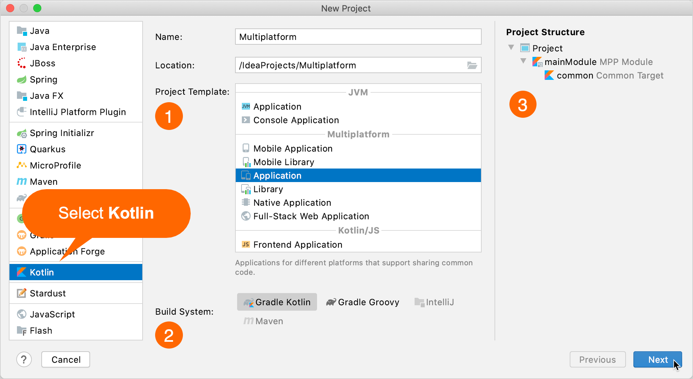
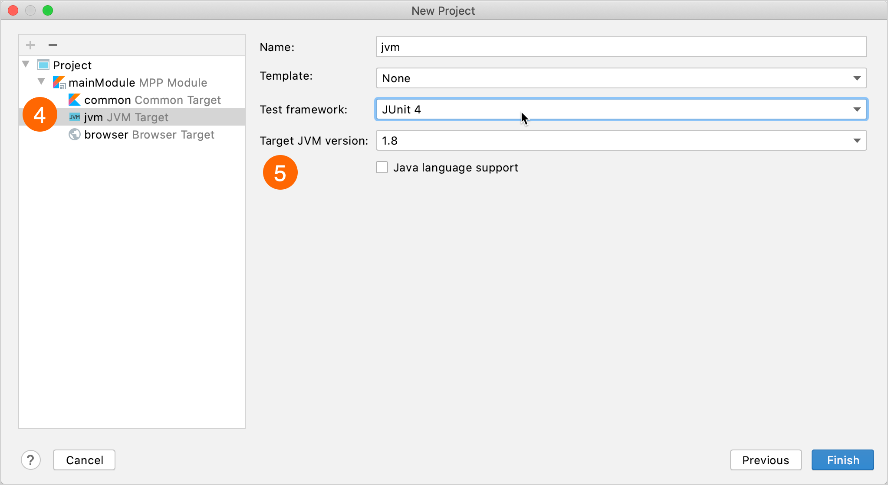
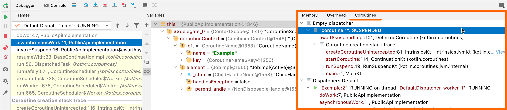
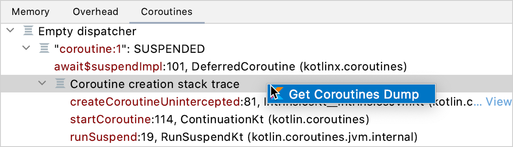
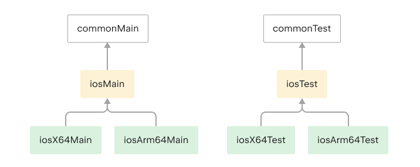
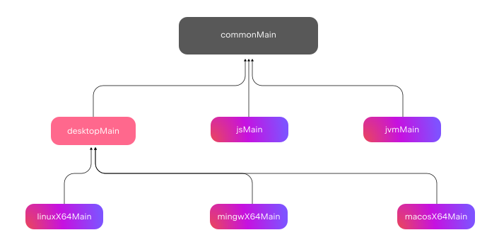
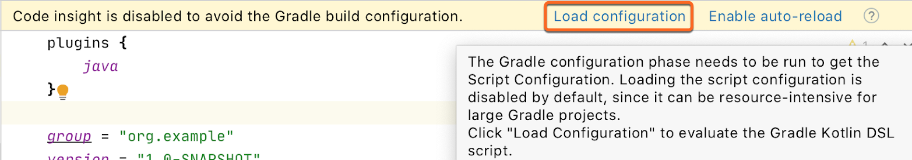
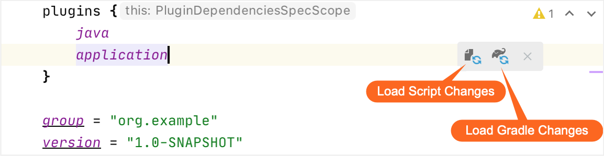
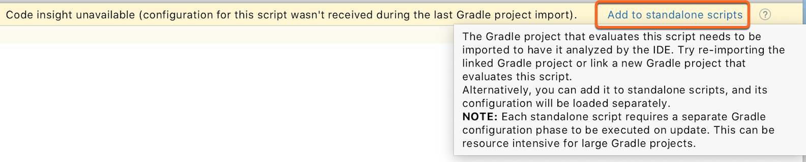
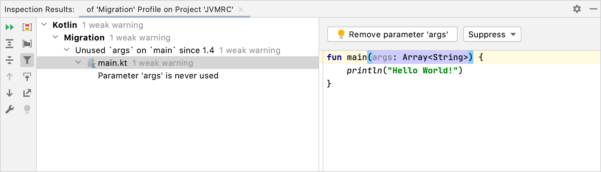

+++
title = "13.6.10.3 Kotlin 1.4.0 新变化"
date = 2026-09-13T08:50:47+08:00
weight = 3
type = "docs"
description = ""
isCJKLanguage = true
draft = false
+++


> 原文链接: [https://kotlinlang.org/docs/whatsnew14.html](https://kotlinlang.org/docs/whatsnew14.html)

# 13.6.10.3 Kotlin 1.4.0 新变化

阅读 Kotlin 1.4.0 发行说明，了解新的语言特性，以及 Kotlin Multiplatform、JVM、Native、JS 的更新和 Gradle、Maven 的构建工具支持。

_[发布时间：2020 年 8 月 17 日](../../../13.5-Releases/#release-history)_

在 Kotlin 1.4.0 中，我们对其所有组件做了大量改进，[重点是质量与性能](https://blog.jetbrains.com/kotlin/2020/08/kotlin-1-4-released-with-a-focus-on-quality-and-performance/)。下面列出了 Kotlin 1.4.0 中最重要的变更。

> **提示：** 有关 Kotlin 发布周期的信息，请参见 [Kotlin 发布流程](../../../13.5-Releases/)。

## 语言特性与改进 {#language-features-and-improvements}

Kotlin 1.4.0 带来了各种不同的语言特性和改进，包括：

* [Kotlin 接口的 SAM 转换](#sam-conversions-for-kotlin-interfaces)
* [面向库作者的显式 API 模式](#explicit-api-mode-for-library-authors)
* [混用命名参数与位置参数](#mixing-named-and-positional-arguments)
* [尾随逗号](#trailing-comma)
* [可调用引用的改进](#callable-reference-improvements)
* [在循环内的 when 表达式中使用 break 和 continue](#using-break-and-continue-inside-when-expressions-included-in-loops)

### Kotlin 接口的 SAM 转换 {#sam-conversions-for-kotlin-interfaces}

在 Kotlin 1.4.0 之前，你只能在[从 Kotlin 使用 Java 方法和 Java 接口时](../../../../interoperability/7.1-Javainterop/7.1.2-JavaInterop/#sam-conversions)应用 SAM（单一抽象方法）转换。从现在起，你也可以对 Kotlin 接口使用 SAM 转换。为此，需要用 `fun` 修饰符把 Kotlin 接口显式标记为函数式接口。

当期望的参数是只有一个抽象方法的接口时，如果你传入 lambda 作为参数，就会应用 SAM 转换。此时编译器会自动把 lambda 转换为实现了该抽象成员函数的类实例。

```kotlin
fun interface IntPredicate {
    fun accept(i: Int): Boolean
}

val isEven = IntPredicate { it % 2 == 0 }

fun main() {
    println("Is 7 even? - ${isEven.accept(7)}")
}
```

[进一步了解 Kotlin 函数式接口与 SAM 转换](../../../../languageguide/5.8-Classesandinterfaces/5.8.9-Specialclassesandinterfaces/5.8.9.5-FunInterfaces/)。

### 面向库作者的显式 API 模式 {#explicit-api-mode-for-library-authors}

Kotlin 编译器为库作者提供了_显式 API 模式_。在该模式下，编译器会执行额外检查，帮助让库的 API 更清晰、更一致。它为暴露在库公开 API 中的声明增加了以下要求：

* 如果默认可见性会把声明暴露到公开 API，则必须为这些声明显式指定可见性修饰符。这有助于确保不会有声明被无意间暴露到公开 API。
* 暴露到公开 API 的属性和函数必须显式指定类型。这可以保证 API 使用者知道自己所用 API 成员的类型。

取决于你的配置，这些显式 API 规则可以产生错误（_strict_ 模式）或警告（_warning_ 模式）。出于可读性和常识的考虑，某些类型的声明不参与此类检查：

* 主构造器
* 数据类的属性
* 属性的 getter 和 setter
* `override` 方法

显式 API 模式只分析模块的生产源。

要以显式 API 模式编译模块，请在 Gradle 构建脚本中添加以下代码：

**Kotlin**

```kotlin
kotlin {
    // 严格模式
    explicitApi()
    // 或者
    explicitApi = ExplicitApiMode.Strict

    // 警告模式
    explicitApiWarning()
    // 或者
    explicitApi = ExplicitApiMode.Warning
}
```

**Groovy**

```groovy
kotlin {
    // 严格模式
    explicitApi()
    // 或者
    explicitApi = 'strict'

    // 警告模式
    explicitApiWarning()
    // 或者
    explicitApi = 'warning'
}
```

使用命令行编译器时，添加值为 `strict` 或 `warning` 的 `-Xexplicit-api` 编译器选项即可切换到显式 API 模式。

```bash
-Xexplicit-api={strict|warning}
```

[在 KEEP 中了解显式 API 模式的更多细节](https://kotlinlang.org/docs/https://github.com/Kotlin/KEEP/blob/master/proposals/explicit-api-mode.html)。

### 混用命名参数与位置参数 {#mixing-named-and-positional-arguments}

在 Kotlin 1.3 中，当你使用[命名参数](../../../../languageguide/5.7-Functions/5.7.1-Functions/#named-arguments)调用函数时，必须把所有不带名称的参数（位置参数）放在第一个命名参数之前。例如，你可以调用 `f(1, y = 2)`，但不能调用 `f(x = 1, 2)`。

当所有参数的位置都正确，而你只想为中间某个参数指定名称时，这会非常令人烦恼。这对明确表示某个布尔值或 `null` 值属于哪个属性尤其有帮助。

在 Kotlin 1.4 中不再有这种限制——你现在可以在一组位置参数中间为某个参数指定名称。此外，只要保持顺序正确，你可以任意混用位置参数和命名参数。

```kotlin
fun reformat(
    str: String,
    uppercaseFirstLetter: Boolean = true,
    wordSeparator: Char = ' '
) {
    // ...
}

// 在中间使用命名参数的函数调用
reformat("This is a String!", uppercaseFirstLetter = false , '-')
```

### 尾随逗号 {#trailing-comma}

在 Kotlin 1.4 中，你现在可以在参数列表和实参列表等枚举、`when` 条目以及解构声明的组成部分中添加尾随逗号。有了尾随逗号，你可以在添加新条目并调整顺序时不必增删逗号。

当你对参数或值使用多行语法时，这尤其有用。添加尾随逗号后，你可以轻松地交换带参数或值的行。

```kotlin
fun reformat(
    str: String,
    uppercaseFirstLetter: Boolean = true,
    wordSeparator: Character = ' ', // ...
) {
    // 尾随逗号
}
```

```kotlin
val colors = listOf(
    "red",
    "green",
    "blue", // 尾随逗号
)
```

### 可调用引用的改进 {#callable-reference-improvements}

Kotlin 1.4 支持更多使用可调用引用的情形：

* 对包含默认值参数的函数的引用
* 在返回 `Unit` 的函数中的函数引用
* 根据函数参数数量进行适配的引用
* 可调用引用上的挂起转换

#### 对包含默认值参数的函数的引用 {#references-to-functions-that-include-parameters-with-default-values}

现在你可以对包含默认值参数的函数使用可调用引用。如果对函数 `foo` 的可调用引用不接受任何参数，则使用默认值 `0`。

```kotlin
fun foo(i: Int = 0): String = "$i!"

fun apply(func: () -> String): String = func()

fun main() {
    println(apply(::foo))
}
```

以前，你必须为 `apply` 或 `foo` 函数额外写一个重载。

```kotlin
// 一些新的重载
fun applyInt(func: (Int) -> String): String = func(0)
```

#### Unit 返回类型函数中的函数引用 {#function-references-in-unit-returning-functions}

在 Kotlin 1.4 中，你可以在返回 `Unit` 的函数中把可调用引用用于返回任意类型的函数。在 Kotlin 1.4 之前，这种情况下只能使用 lambda 实参。现在你可以同时使用 lambda 实参和可调用引用。

```kotlin
fun foo(f: () -> Unit) { }
fun returnsInt(): Int = 42

fun main() {
    foo { returnsInt() } // 在 1.4 之前这是唯一的方式
    foo(::returnsInt) // 从 1.4 开始，这种方式也可以
}
```

#### 根据函数参数数量进行适配的引用 {#references-that-adapt-based-on-the-number-of-arguments-in-a-function}

现在，在传递可变数量参数（`vararg`）时，你可以对函数的可调用引用进行适配。你可以在实参列表末尾传递任意数量的同类型参数。

```kotlin
fun foo(x: Int, vararg y: String) {}

fun use0(f: (Int) -> Unit) {}
fun use1(f: (Int, String) -> Unit) {}
fun use2(f: (Int, String, String) -> Unit) {}

fun test() {
    use0(::foo)
    use1(::foo)
    use2(::foo)
}
```

#### 可调用引用上的挂起转换 {#suspend-conversion-on-callable-references}

除了对 lambda 的挂起转换，Kotlin 从 1.4.0 版本开始还支持对可调用引用的挂起转换。

```kotlin
fun call() {}
fun takeSuspend(f: suspend () -> Unit) {}

fun test() {
    takeSuspend { call() } // 1.4 之前没问题
    takeSuspend(::call) // 在 Kotlin 1.4 中也可以
}
```

### 在循环内的 when 表达式中使用 break 和 continue {#using-break-and-continue-inside-when-expressions-included-in-loops}

在 Kotlin 1.3 中，你不能在循环内的 `when` 表达式中使用不带限定符的 `break` 和 `continue`。原因是这些关键字被保留用于 `when` 表达式中可能的[贯穿（fall-through）行为](https://en.wikipedia.org/wiki/Switch_statement#Fallthrough)。

因此，如果你想在循环内的 `when` 表达式中使用 `break` 和 `continue`，就必须给它们[加标签](../../../../languageguide/5.5-Controlflow/5.5.2-Returns/#break-and-continue-labels)，这相当繁琐。

```kotlin
fun test(xs: List<Int>) {
    LOOP@for (x in xs) {
        when (x) {
            2 -> continue@LOOP
            17 -> break@LOOP
            else -> println(x)
        }
    }
}
```

在 Kotlin 1.4 中，你可以在循环内的 `when` 表达式中使用不带标签的 `break` 和 `continue`。它们的行为符合预期：终止最近的封闭循环，或进入其下一步。

```kotlin
fun test(xs: List<Int>) {
    for (x in xs) {
        when (x) {
            2 -> continue
            17 -> break
            else -> println(x)
        }
    }
}
```

`when` 内部的贯穿行为仍有待进一步设计。

## IDE 中的新工具 {#new-tools-in-the-ide}

借助 Kotlin 1.4，你可以使用 IntelliJ IDEA 中的新工具来简化 Kotlin 开发：

* [全新的灵活项目向导](#new-flexible-project-wizard)
* [协程调试器](#coroutine-debugger)

### 全新的灵活项目向导 {#new-flexible-project-wizard}

借助全新的灵活 Kotlin 项目向导，你可以轻松创建和配置各种类型的 Kotlin 项目，包括没有 UI 就很难配置的多平台项目。



新的 Kotlin 项目向导既简单又灵活：

1. *选择项目模板*，具体取决于你想做什么。将来会加入更多模板。
2. *选择构建系统*——Gradle（Kotlin 或 Groovy DSL）、Maven 或 IntelliJ IDEA。Kotlin 项目向导只会显示所选项目模板支持的构建系统。
3. *预览项目结构*，直接在主界面上查看。

然后你可以完成项目创建，或者可选地在下一个界面*配置项目*：

4. *添加/删除*该模板支持的模块和目标。
5. *配置模块和目标设置*，例如目标 JVM 版本、目标模板和测试框架。



将来我们会通过添加更多配置选项和模板，让 Kotlin 项目向导更加灵活。

你可以通过这些教程试用新的 Kotlin 项目向导：

* [创建一个基于 Kotlin/JVM 的控制台应用](../../../../compilerandplugins/12.1-Kotlincompiler/12.1.3-JvmGetStarted/)
* [创建一个用于 React 的 Kotlin/JS 应用](https://kotlinlang.org/docs/js-react.html)
* [创建一个 Kotlin/Native 应用](../../../../development/6.3-Nativedevelopment/6.3.2-NativeGetStarted/)

### 协程调试器 {#coroutine-debugger}

许多人已经在使用[协程](../../../../libraryguides/9.2-Coroutineskotlinxcoroutines/9.2.1-CoroutinesGuide/)进行异步编程。但说到调试，在 Kotlin 1.4 之前使用协程可能非常痛苦。由于协程会在不同线程之间跳转，很难弄清某个具体协程在做什么并检查它的上下文。在某些情况下，跨断点跟踪根本不起作用。结果，你不得不依赖日志或脑力劳动来调试使用协程的代码。

在 Kotlin 1.4 中，借助 Kotlin 插件提供的新功能，调试协程变得方便多了。

> **注意：** 调试功能适用于 `kotlinx-coroutines-core` 1.3.8 或更高版本。

**调试工具窗口**现在包含一个新的**协程**标签页。在该标签页中，你可以找到正在运行和已挂起的协程的信息。协程会按它们运行所在的调度器分组。



现在你可以：
* 轻松查看每个协程的状态。
* 查看正在运行和已挂起协程的局部变量和被捕获变量的值。
* 查看完整的协程创建栈以及协程内部的调用栈。该栈包含所有带有变量值的帧，甚至是标准调试中会丢失的帧。

如果你需要包含每个协程状态及其栈的完整报告，请在**协程**标签页中右键单击，然后单击 **Get Coroutines Dump**。目前，协程转储还比较简单，但我们会在未来的 Kotlin 版本中让它更易读、更有用。



在[这篇博客文章](https://blog.jetbrains.com/kotlin/2020/07/kotlin-1-4-rc-debugging-coroutines/)和 [IntelliJ IDEA 文档](https://www.jetbrains.com/help/idea/debug-kotlin-coroutines.html)中进一步了解协程调试。

## 新编译器 {#new-compiler}

新的 Kotlin 编译器将会非常快；它将统一所有支持的平台，并提供用于编译器扩展的 API。这是一个长期项目，我们在 Kotlin 1.4.0 中已经完成了若干步骤：

* [新的、更强大的类型推断算法](#new-more-powerful-type-inference-algorithm)已默认启用。
* [新的 JVM 和 JS IR 后端](#unified-backends-and-extensibility)。一旦我们使其稳定，它们就会成为默认后端。

### 更强大的新类型推断算法 {#new-more-powerful-type-inference-algorithm}

Kotlin 1.4 使用了新的、更强大的类型推断算法。这个新算法在 Kotlin 1.3 中就可以通过指定编译器选项试用，现在它已默认使用。你可以在 [YouTrack](https://youtrack.jetbrains.com/issues/KT?q=Tag:%20fixed-in-new-inference%20) 中找到该算法修复的问题完整列表。这里列出一些最显著的改进：

* [更多自动推断类型的情形](#more-cases-where-type-is-inferred-automatically)
* [lambda 最后一个表达式的智能转换](#smart-casts-for-a-lambda-s-last-expression)
* [可调用引用的智能转换](#smart-casts-for-callable-references)
* [委托属性的更好推断](#better-inference-for-delegated-properties)
* [参数不同的 Java 接口的 SAM 转换](#sam-conversion-for-java-interfaces-with-different-arguments)
* [在 Kotlin 中使用 Java SAM 接口](#java-sam-interfaces-in-kotlin)

#### 更多自动推断类型的情形 {#more-cases-where-type-is-inferred-automatically}

新的推断算法在许多旧算法要求你显式指定类型的情形下也能推断出类型。例如，在下面的示例中，lambda 参数 `it` 的类型被正确推断为 `String?`：

```kotlin
val rulesMap: Map<String, (String?) -> Boolean> = mapOf(
    "weak" to { it != null },
    "medium" to { !it.isNullOrBlank() },
    "strong" to { it != null && "^[a-zA-Z0-9]+$".toRegex().matches(it) }
)

fun main() {
    println(rulesMap.getValue("weak")("abc!"))
    println(rulesMap.getValue("strong")("abc"))
    println(rulesMap.getValue("strong")("abc!"))
}
```

在 Kotlin 1.3 中，你需要引入显式的 lambda 参数，或者把 `to` 替换为带有显式泛型实参的 `Pair` 构造器，才能让它正常工作。

#### lambda 最后一个表达式的智能转换 {#smart-casts-for-a-lambda-s-last-expression}

在 Kotlin 1.3 中，除非指定期望的类型，否则 lambda 内的最后一个表达式不会被智能转换。因此在下面的示例中，Kotlin 1.3 会把 `String?` 推断为 `result` 变量的类型：

```kotlin
val result = run {
    var str = currentValue()
    if (str == null) {
        str = "test"
    }
    str // Kotlin 编译器知道这里 str 不为 null
}
// 'result' 的类型在 Kotlin 1.3 中是 String?，在 Kotlin 1.4 中是 String
```

在 Kotlin 1.4 中，得益于新的推断算法，lambda 内的最后一个表达式会获得智能转换，并使用这个更精确的新类型来推断 lambda 的结果类型。因此，`result` 变量的类型变为 `String`。

在 Kotlin 1.3 中，你通常需要添加显式转换（`!!` 或 `as String` 之类的类型转换）才能让这类情况正常工作，而现在这些转换已经不必要了。

#### 可调用引用的智能转换 {#smart-casts-for-callable-references}

在 Kotlin 1.3 中，你无法访问智能转换类型的成员引用。现在在 Kotlin 1.4 中可以做到：

```kotlin
import kotlin.reflect.KFunction

sealed class Animal
class Cat : Animal() {
    fun meow() {
        println("meow")
    }
}

class Dog : Animal() {
    fun woof() {
        println("woof")
    }
}

fun perform(animal: Animal) {
    val kFunction: KFunction<*> = when (animal) {
        is Cat -> animal::meow
        is Dog -> animal::woof
    }
    kFunction.call()
}

fun main() {
    perform(Cat())
}
```

你可以在 animal 变量被智能转换为具体类型 `Cat` 和 `Dog` 之后，使用不同的成员引用 `animal::meow` 和 `animal::woof`。类型检查之后，你就能访问与子类型对应的成员引用。

#### 委托属性的更好推断 {#better-inference-for-delegated-properties}

在分析 `by` 关键字后面的委托表达式时，并没有考虑委托属性的类型。例如，下面的代码以前无法编译，而现在编译器会正确地把 `old` 和 `new` 参数的类型推断为 `String?`：

```kotlin
import kotlin.properties.Delegates

fun main() {
    var prop: String? by Delegates.observable(null) { p, old, new ->
        println("$old → $new")
    }
    prop = "abc"
    prop = "xyz"
}
```

#### 参数不同的 Java 接口的 SAM 转换 {#sam-conversion-for-java-interfaces-with-different-arguments}

Kotlin 从一开始就支持 Java 接口的 SAM 转换，但有一种情况不被支持，这在使用现有 Java 库时有时很烦人。如果你调用一个接收两个 SAM 接口作为参数的 Java 方法，两个实参必须都是 lambda 或都是普通对象。你无法把一个实参作为 lambda、另一个作为对象传入。

新的算法修复了这个问题，你可以在任何情况下用 lambda 代替 SAM 接口传入，这也正是你自然会期望的工作方式。

```java
// 文件：A.java
public class A {
    public static void foo(Runnable r1, Runnable r2) {}
}
```

```kotlin
// 文件：test.kt
fun test(r1: Runnable) {
    A.foo(r1) {} // 在 Kotlin 1.4 中可用
}
```

#### 在 Kotlin 中使用 Java SAM 接口 {#java-sam-interfaces-in-kotlin}

在 Kotlin 1.4 中，你可以在 Kotlin 中使用 Java SAM 接口并对它们应用 SAM 转换。

```kotlin
import java.lang.Runnable

fun foo(r: Runnable) {}

fun test() {
    foo { } // 没问题
}
```

在 Kotlin 1.3 中，你必须用 Java 代码声明上面的 `foo` 函数才能进行 SAM 转换。

### 统一的后端与可扩展性 {#unified-backends-and-extensibility}

在 Kotlin 中，我们有三个生成可执行文件的后端：Kotlin/JVM、Kotlin/JS 和 Kotlin/Native。Kotlin/JVM 和 Kotlin/JS 因为彼此独立开发，所以共享的代码不多。Kotlin/Native 基于以 Kotlin 代码的中间表示（IR）为核心构建的新基础设施。

我们现在正把 Kotlin/JVM 和 Kotlin/JS 迁移到相同的 IR 上。因此，三个后端共享大量逻辑，并拥有统一的流水线。这让我们可以只实现一次大多数特性、优化和缺陷修复，就能适用于所有平台。两个新的基于 IR 的后端都处于 [Alpha](../../../13.4-ComponentsStability/) 阶段。

通用的后端基础设施也为多平台编译器扩展打开了大门。你将能够接入流水线并添加自定义处理和转换，它们会自动适用于所有平台。

我们鼓励你使用我们新的 [JVM IR](#new-jvm-ir-backend) 和 [JS IR](#new-js-ir-backend) 后端（它们目前处于 Alpha 阶段），并分享你的反馈。

## Kotlin/JVM {#kotlin-jvm}

Kotlin 1.4.0 包含许多针对 JVM 的改进，例如：

* [新的 JVM IR 后端](#new-jvm-ir-backend)
* [在接口中生成默认方法的新模式](#new-modes-for-generating-default-methods)
* [空检查的统一异常类型](#unified-exception-type-for-null-checks)
* [JVM 字节码中的类型注解](#type-annotations-in-the-jvm-bytecode)

### 新的 JVM IR 后端 {#new-jvm-ir-backend}

与 Kotlin/JS 一起，我们正把 Kotlin/JVM 迁移到[统一的 IR 后端](#unified-backends-and-extensibility)，这让我们可以只实现一次大多数特性和缺陷修复，就能适用于所有平台。你也将能因此受益，创建可在所有平台上工作的多平台扩展。

Kotlin 1.4.0 还没有为此类扩展提供公开 API，但我们正与包括 [Jetpack Compose](https://developer.android.com/jetpack/compose) 在内的合作伙伴紧密合作，他们已经在使用我们的新后端构建自己的编译器插件。

我们鼓励你试用目前处于 Alpha 阶段的新 Kotlin/JVM 后端，并把任何问题和特性请求提交到我们的[问题跟踪器](https://youtrack.jetbrains.com/issues/KT)。这将帮助我们统一编译器流水线，并更快地把 Jetpack Compose 之类的编译器扩展带给 Kotlin 社区。

要启用新的 JVM IR 后端，请在 Gradle 构建脚本中指定一个额外的编译器选项：

```kotlin
kotlinOptions.useIR = true
```

> **注意：** 如果你[启用了 Jetpack Compose](https://developer.android.com/jetpack/compose/setup?hl=en)，就会自动选择启用新的 JVM 后端，无需在 `kotlinOptions` 中指定编译器选项。

使用命令行编译器时，请添加编译器选项 `-Xuse-ir`。

> **注意：** 只有在你启用了新后端时，才能使用由新 JVM IR 后端编译的代码。否则会报错。考虑到这一点，我们不建议库作者在生产环境中切换到新后端。

### 生成默认方法的新模式 {#new-modes-for-generating-default-methods}

当把 Kotlin 代码编译到 JVM 1.8 及更高版本的目标时，你可以把 Kotlin 接口中的非抽象方法编译为 Java 的 `default` 方法。为此有一个机制：用 `@JvmDefault` 注解标记这类方法，并用 `-Xjvm-default` 编译器选项启用对该注解的处理。

在 1.4.0 中，我们新增了一种生成默认方法的模式：`-Xjvm-default=all` 会把 Kotlin 接口中的*所有*非抽象方法编译为 Java 的 `default` 方法。为了与使用未按 `default` 方式编译的接口的代码兼容，我们还添加了 `all-compatibility` 模式。

有关 Java 互操作中默认方法的更多信息，请参见[互操作文档](../../../../interoperability/7.1-Javainterop/7.1.3-JavaToKotlinInterop/#default-methods-in-interfaces)和[这篇博客文章](https://blog.jetbrains.com/kotlin/2020/07/kotlin-1-4-m3-generating-default-methods-in-interfaces/)。

### 空检查的统一异常类型 {#unified-exception-type-for-null-checks}

从 Kotlin 1.4.0 开始，所有运行时空检查都会抛出 `java.lang.NullPointerException`，而不再是 `KotlinNullPointerException`、`IllegalStateException`、`IllegalArgumentException` 和 `TypeCastException`。这适用于：`!!` 运算符、方法前导部分的参数空检查、平台类型表达式的空检查，以及带非可空类型的 `as` 运算符。这不适用于 `lateinit` 空检查和 `checkNotNull`、`requireNotNull` 之类的显式库函数调用。

这一变更增加了可执行的空检查优化数量，无论是 Kotlin 编译器还是各种字节码处理工具（例如 Android 的 [R8 优化器](https://developer.android.com/studio/build/shrink-code)）都可以进行这些优化。

请注意，从开发者的角度看，变化并不大：Kotlin 代码抛出的异常会带有与之前相同的错误消息。异常类型变了，但传递的信息保持不变。

### JVM 字节码中的类型注解 {#type-annotations-in-the-jvm-bytecode}

Kotlin 现在可以在 JVM 字节码（目标版本 1.8+）中生成类型注解，使它们在运行时可通过 Java 反射获取。要在字节码中生成类型注解，请按以下步骤操作：

1. 确保你声明的注解具有合适的注解目标（Java 的 `ElementType.TYPE_USE` 或 Kotlin 的 `AnnotationTarget.TYPE`）和保留策略（`AnnotationRetention.RUNTIME`）。
2. 把注解类声明编译为 JVM 字节码目标版本 1.8+。你可以用 `-jvm-target=1.8` 编译器选项指定。
3. 把使用该注解的代码编译为 JVM 字节码目标版本 1.8+（`-jvm-target=1.8`），并添加 `-Xemit-jvm-type-annotations` 编译器选项。

请注意，标准库中的类型注解目前不会生成到字节码中，因为标准库是以目标版本 1.6 编译的。

到目前为止，只支持基本情形：

- 方法参数、方法返回类型和属性类型上的类型注解；
- 类型实参的不变投影，例如 `Smth<@Ann Foo>`、`Array<@Ann Foo>`。

在下面的示例中，`String` 类型上的 `@Foo` 注解可以被生成到字节码中，然后由库代码使用：

```kotlin
@Target(AnnotationTarget.TYPE)
annotation class Foo

class A {
    fun foo(): @Foo String = "OK"
}
```

## Kotlin/JS {#kotlin-js}

在 JS 平台上，Kotlin 1.4.0 提供了以下改进：

- [新的 Gradle DSL](#new-gradle-dsl)
- [新的 JS IR 后端](#new-js-ir-backend)

### 新的 Gradle DSL {#new-gradle-dsl}

`kotlin.js` Gradle 插件带来了调整后的 Gradle DSL，它提供了许多新的配置选项，并且与 `kotlin-multiplatform` 插件使用的 DSL 更加一致。其中影响最大的变更包括：

- 通过 `binaries.executable()` 显式开关可执行文件的创建。在[此处进一步了解如何执行 Kotlin/JS 及其环境](../../../../development/6.2-Webdevelopment/6.2.2-Kotlinjs/6.2.2.3-JsProjectSetup/#execution-environments)。
- 通过 `cssSupport` 在 Gradle 配置中配置 webpack 的 CSS 和样式加载器。在[此处进一步了解如何使用 CSS 和样式加载器](../../../../development/6.2-Webdevelopment/6.2.2-Kotlinjs/6.2.2.3-JsProjectSetup/#css)。
- 改进的 npm 依赖管理，要求使用版本号或 [semver](https://docs.npmjs.com/about-semantic-versioning) 版本范围，并通过 `devNpm`、`optionalNpm` 和 `peerNpm` 支持 _development_、_peer_ 和 _optional_ npm 依赖。[在此处进一步了解直接从 Gradle 管理 npm 包的依赖](../../../../development/6.2-Webdevelopment/6.2.2-Kotlinjs/6.2.2.3-JsProjectSetup/#npm-dependencies)。
- 与 [Dukat](https://github.com/Kotlin/dukat)（Kotlin 外部声明的生成器）的更紧密集成。现在外部声明可以在构建时生成，也可以通过 Gradle 任务手动生成。

### 新的 JS IR 后端 {#new-js-ir-backend}

目前处于 [Alpha](../../../13.4-ComponentsStability/) 稳定级别的 [Kotlin/JS 的 IR 后端](../../../../development/6.2-Webdevelopment/6.2.2-Kotlinjs/6.2.2.9-JsIrCompiler/)提供了一些 Kotlin/JS 目标特有的新功能，主要集中在通过死代码消除减小生成代码的体积，以及与 JavaScript 和 TypeScript 的改进互操作等方面。

要启用 Kotlin/JS IR 后端，请在 `gradle.properties` 中设置键 `kotlin.js.compiler=ir`，或者把 `IR` 编译器类型传递给 Gradle 构建脚本中的 `js` 函数：

```groovy
kotlin {
    js(IR) { // 或者：LEGACY、BOTH
        // ...
    }
    binaries.executable()
}
```

有关如何配置新后端的更详细信息，请查看 [Kotlin/JS IR 编译器文档](../../../../development/6.2-Webdevelopment/6.2.2-Kotlinjs/6.2.2.9-JsIrCompiler/)。

借助新的 [@JsExport](../../../../interoperability/7.2-Javascriptinterop/7.2.5-JsToKotlinInterop/#jsexport-annotation) 注解以及**[从 Kotlin 代码生成 TypeScript 定义](../../../../development/6.2-Webdevelopment/6.2.2-Kotlinjs/6.2.2.3-JsProjectSetup/#generation-of-typescript-declaration-files-d-ts)的能力**，Kotlin/JS IR 编译器后端改进了 JavaScript 与 TypeScript 的互操作。这也让 Kotlin/JS 代码更容易与现有工具集成，从而创建**混合应用**并在多平台项目中利用代码共享功能。

[进一步了解 Kotlin/JS IR 编译器后端中可用的特性](../../../../development/6.2-Webdevelopment/6.2.2-Kotlinjs/6.2.2.9-JsIrCompiler/)。

## Kotlin/Native {#kotlin-native}

在 1.4.0 中，Kotlin/Native 获得了大量新特性和改进，包括：

* [在 Swift 和 Objective-C 中支持 Kotlin 的挂起函数](#support-for-kotlin-s-suspending-functions-in-swift-and-objective-c)
* [默认支持 Objective-C 泛型](#objective-c-generics-support-by-default)
* [Objective-C/Swift 互操作中的异常处理](#exception-handling-in-objective-c-swift-interop)
* [在 Apple 目标上默认生成 release .dSYM](#generate-release-dsyms-on-apple-targets-by-default)
* [性能改进](#performance-improvements)
* [简化 CocoaPods 依赖管理](#simplified-management-of-cocoapods-dependencies)

### 在 Swift 和 Objective-C 中支持 Kotlin 的挂起函数 {#support-for-kotlin-s-suspending-functions-in-swift-and-objective-c}

在 1.4.0 中，我们为 Swift 和 Objective-C 中的挂起函数添加了基本支持。现在，当你把 Kotlin 模块编译为 Apple 框架时，挂起函数会以带回调的函数形式提供（在 Swift/Objective-C 术语中是 `completionHandler`）。当生成的框架头文件中有这类函数时，你可以在 Swift 或 Objective-C 代码中调用它们，甚至可以重写它们。

例如，如果你编写这个 Kotlin 函数：

```kotlin
suspend fun queryData(id: Int): String = ...
```

...那么你可以像这样从 Swift 中调用它：

```swift
queryData(id: 17) { result, error in
   if let e = error {
       print("ERROR: \(e)")
   } else {
       print(result!)
   }
}
```

[进一步了解在 Swift 和 Objective-C 中使用挂起函数](../../../../interoperability/7.3-Swiftobjectivecandcinterop/7.3.1-Swiftobjectivecinterop/7.3.1.1-NativeObjcInterop/)。

### 默认支持 Objective-C 泛型 {#objective-c-generics-support-by-default}

之前的 Kotlin 版本为 Objective-C 互操作中的泛型提供了实验性支持。从 1.4.0 起，Kotlin/Native 默认会基于 Kotlin 代码生成带泛型的 Apple 框架。在某些情况下，这可能会破坏调用 Kotlin 框架的现有 Objective-C 或 Swift 代码。要让框架头文件不带泛型，请添加 `-Xno-objc-generics` 编译器选项。

```kotlin
kotlin {
    targets.withType<org.jetbrains.kotlin.gradle.plugin.mpp.KotlinNativeTarget> {
        binaries.all {
            freeCompilerArgs += "-Xno-objc-generics"
        }
    }
}
```

请注意，[Objective-C 互操作文档](../../../../interoperability/7.3-Swiftobjectivecandcinterop/7.3.1-Swiftobjectivecinterop/7.3.1.1-NativeObjcInterop/#generics)中列出的所有细节和限制仍然有效。

### Objective-C/Swift 互操作中的异常处理 {#exception-handling-in-objective-c-swift-interop}

在 1.4.0 中，我们就异常的翻译方式稍微修改了由 Kotlin 生成的 Swift API。Kotlin 和 Swift 在错误处理上存在根本差异。Kotlin 的所有异常都是非受检的，而 Swift 只有受检错误。因此，为了让 Swift 代码知道预期的异常，Kotlin 函数应使用 `@Throws` 注解标记，并指定可能的异常类列表。

在编译到 Swift 或 Objective-C 框架时，带有或继承 `@Throws` 注解的函数在 Objective-C 中会表示为产生 `NSError*` 的方法，在 Swift 中会表示为 `throws` 方法。

以前，除 `RuntimeException` 和 `Error` 之外的任何异常都会作为 `NSError` 传播。现在这一行为发生了变化：现在只有属于 `@Throws` 注解参数中指定类（或其子类）实例的异常才会抛出 `NSError`。到达 Swift/Objective-C 的其他 Kotlin 异常被视为未处理，并会导致程序终止。

### 在 Apple 目标上默认生成 release .dSYM {#generate-release-dsyms-on-apple-targets-by-default}

从 1.4.0 开始，Kotlin/Native 编译器默认在 Darwin 平台上为 release 二进制文件生成[调试符号文件](https://developer.apple.com/documentation/xcode/building_your_app_to_include_debugging_information)（`.dSYM`）。可以通过 `-Xadd-light-debug=disable` 编译器选项禁用。在其他平台上，该选项默认禁用。要在 Gradle 中切换该选项，请使用：

```kotlin
kotlin {
    targets.withType<org.jetbrains.kotlin.gradle.plugin.mpp.KotlinNativeTarget> {
        binaries.all {
            freeCompilerArgs += "-Xadd-light-debug={enable|disable}"
        }
    }
}
```

[进一步了解崩溃报告符号化](../../../../development/6.3-Nativedevelopment/6.3.7-NativeDebugging/#debug-ios-applications)。

### 性能改进 {#performance-improvements}

Kotlin/Native 获得了大量性能改进，既加快了开发过程，也加快了执行速度。以下是一些例子：

- 为了提高对象分配速度，我们现在提供 [mimalloc](https://github.com/microsoft/mimalloc) 内存分配器作为系统分配器的替代方案。在某些基准测试中，mimalloc 的速度提高达两倍。目前，Kotlin/Native 中使用 mimalloc 仍是实验性的；你可以通过 `-Xallocator=mimalloc` 编译器选项切换到它。

- 我们重做了 C 互操作库的构建方式。借助新工具，Kotlin/Native 生成互操作库的速度比之前快达 4 倍，制品体积为原来的 25% 到 30%。

- 由于 GC 的优化，整体运行时性能得到改善。这种改进在使用大量长生命周期对象的项目中尤为明显。`HashMap` 和 `HashSet` 集合现在因避免了冗余装箱而运行得更快。

- 在 1.3.70 中，我们引入了两个用于提升 Kotlin/Native 编译性能的新特性：[缓存项目依赖以及从 Gradle 守护进程运行编译器](https://blog.jetbrains.com/kotlin/2020/03/kotlin-1-3-70-released/#kotlin-native)。从那时起，我们修复了大量问题，并提高了这些特性的整体稳定性。

### 简化 CocoaPods 依赖管理 {#simplified-management-of-cocoapods-dependencies}

以前，一旦你把项目与依赖管理器 CocoaPods 集成，就只能单独在 Xcode 中构建项目的 iOS、macOS、watchOS 或 tvOS 部分，与多平台项目的其他部分分离。其他部分可以在 IntelliJ IDEA 中构建。

此外，每次添加对存放在 CocoaPods 中的 Objective-C 库（Pod 库）的依赖时，你都必须从 IntelliJ IDEA 切换到 Xcode，调用 `pod install`，并在那里运行 Xcode 构建。

现在你可以在 IntelliJ IDEA 中直接管理 Pod 依赖，同时享受它在处理代码方面带来的好处，例如代码高亮和补全。你也可以用 Gradle 构建整个 Kotlin 项目，而无需切换到 Xcode。这意味着只有在你需要编写 Swift/Objective-C 代码，或者在模拟器或设备上运行应用时，才需要进入 Xcode。

现在你也可以使用存储在本地 Pod 库。

根据需要，你可以在以下两者之间添加依赖：
* Kotlin 项目与远程存储在 CocoaPods 仓库中或存储在你机器本地的 Pod 库。
* Kotlin Pod（用作 CocoaPods 依赖的 Kotlin 项目）与包含一个或多个目标的 Xcode 项目。

完成初始配置后，当你向 `cocoapods` 添加新依赖时，只需在 IntelliJ IDEA 中重新导入项目即可。新依赖会被自动添加，无需额外步骤。

[了解如何添加依赖](https://kotlinlang.org/docs/multiplatform/multiplatform-cocoapods-libraries.html)。

## Kotlin Multiplatform {#kotlin-multiplatform}

> **警告：** 对多平台项目的支持处于 [Alpha](../../../13.4-ComponentsStability/) 阶段。它可能会以不兼容的方式发生变化，并在将来需要手动迁移。我们欢迎你在 [YouTrack](https://youtrack.jetbrains.com/issues/KT) 中提供反馈。

[Kotlin Multiplatform](https://kotlinlang.org/docs/multiplatform/get-started.html) 减少了为[不同平台](https://kotlinlang.org/docs/multiplatform/multiplatform-dsl-reference.html#targets)编写和维护相同代码所花费的时间，同时保留原生编程的灵活性和优点。我们会继续在多平台特性和改进上投入精力：

* [通过分层项目结构在多个目标之间共享代码](#sharing-code-in-several-targets-with-the-hierarchical-project-structure)
* [在分层结构中使用原生库](#leveraging-native-libs-in-the-hierarchical-structure)
* [只声明一次 kotlinx 依赖](#specifying-dependencies-only-once)

> **注意：** 多平台项目需要 Gradle 6.0 或更高版本。

### 通过分层项目结构在多个目标之间共享代码 {#sharing-code-in-several-targets-with-the-hierarchical-project-structure}

有了新的分层项目结构支持，你可以在[多平台项目](https://kotlinlang.org/docs/multiplatform/multiplatform-discover-project.html)中的[多个平台](https://kotlinlang.org/docs/multiplatform/multiplatform-dsl-reference.html#targets)之间共享代码。

以前，添加到多平台项目的任何代码只能放在平台特定的源集中（仅限一个目标，无法被其他平台复用），或者放在 `commonMain`、`commonTest` 之类的通用源集中（在项目的所有平台之间共享）。在通用源集中，你只能通过[需要平台特定的 `actual` 实现的 `expect` 声明](https://kotlinlang.org/docs/multiplatform/multiplatform-expect-actual.html)来调用平台特定的 API。

这使得[在所有平台上共享代码](https://kotlinlang.org/docs/multiplatform/multiplatform-share-on-platforms.html#share-code-on-all-platforms)很容易，但[只在部分目标之间共享](https://kotlinlang.org/docs/multiplatform/multiplatform-share-on-platforms.html#share-code-on-similar-platforms)就没那么容易了，尤其是那些可以复用大量通用逻辑和第三方 API 的相似平台。

例如，在一个面向 iOS 的典型多平台项目中，有两个与 iOS 相关的目标：一个用于 iOS ARM64 设备，另一个用于 x64 模拟器。它们有各自的平台特定源集，但实际上很少需要为设备和模拟器编写不同的代码，而且它们的依赖也非常相似。因此 iOS 特有的代码可以在它们之间共享。

显然，在这种设置下，最好能有一个*用于两个 iOS 目标的共享源集*，其中的 Kotlin/Native 代码仍然可以直接调用 iOS 设备和模拟器共有的任何 API。



现在你可以通过[分层项目结构支持](https://kotlinlang.org/docs/multiplatform/multiplatform-share-on-platforms.html#share-code-on-similar-platforms)做到这一点，它会根据哪些目标使用某个源集来推断并适配该源集中可用的 API 和语言特性。

对于常见的目标组合，你可以使用目标快捷方式创建分层结构。例如，用 `ios()` 快捷方式创建两个 iOS 目标以及上面所示的共享源集：

```kotlin
kotlin {
    ios() // iOS 设备与模拟器目标；iosMain 和 iosTest 源集
}
```

对于其他目标组合，可以通过 `dependsOn` 关系连接源集来[手动创建层次结构](https://kotlinlang.org/docs/multiplatform/multiplatform-hierarchy.html#manual-configuration)。



**Kotlin**

```kotlin
kotlin{
    sourceSets {
        val desktopMain by creating {
            dependsOn(commonMain)
        }
        val linuxX64Main by getting {
            dependsOn(desktopMain)
        }
        val mingwX64Main by getting {
            dependsOn(desktopMain)
        }
        val macosX64Main by getting {
            dependsOn(desktopMain)
        }
    }
}
```

**Groovy**

```groovy
kotlin {
    sourceSets {
        desktopMain {
            dependsOn(commonMain)
        }
        linuxX64Main {
            dependsOn(desktopMain)
        }
        mingwX64Main {
            dependsOn(desktopMain)
        }
        macosX64Main {
            dependsOn(desktopMain)
        }
    }
}

```

得益于分层项目结构，库也可以为一组目标子集提供通用 API。进一步了解[在库中共享代码](https://kotlinlang.org/docs/multiplatform/multiplatform-share-on-platforms.html#share-code-in-libraries)。

### 在分层结构中使用原生库 {#leveraging-native-libs-in-the-hierarchical-structure}

你可以在多个原生目标共享的源集中使用依赖平台的库，例如 Foundation、UIKit 和 POSIX。这可以帮助你共享更多原生代码，而不会受平台特定依赖的限制。

无需额外步骤——一切都会自动完成。IntelliJ IDEA 会帮助你发现在共享代码中可以使用的通用声明。

[进一步了解依赖平台的库的使用](https://kotlinlang.org/docs/multiplatform/multiplatform-share-on-platforms.html#connect-platform-specific-libraries)。

### 只声明一次依赖 {#specifying-dependencies-only-once}

从现在起，与其在使用同一库不同变体的共享源集和平台特定源集中分别声明依赖，不如只在共享源集中声明一次依赖。

**Kotlin**

```kotlin
kotlin {
    sourceSets {
        val commonMain by getting {
            dependencies {
                implementation("org.jetbrains.kotlinx:kotlinx-coroutines-core:1.11.0")
            }
        }
    }
}
```

**Groovy**

```groovy
kotlin {
    sourceSets {
        commonMain {
            dependencies {
                implementation 'org.jetbrains.kotlinx:kotlinx-coroutines-core:1.11.0'
            }
        }
    }
}
```

不要使用带平台后缀的 kotlinx 库制品名称，例如 `-common`、`-native` 之类，因为它们已不再受支持。请使用库的基础制品名称，在上面的示例中是 `kotlinx-coroutines-core`。

不过，该变更目前不影响：
* `stdlib` 库——从 Kotlin 1.4.0 开始，[stdlib 依赖会被自动添加](#dependency-on-the-standard-library-added-by-default)。
* `kotlin.test` 库——你仍应使用 `test-common` 和 `test-annotations-common`。这些依赖会在以后处理。

如果你只需要针对特定平台的依赖，仍然可以使用带 `-jvm` 或` -js` 之类后缀的标准库和 kotlinx 库的平台特定变体，例如 `kotlinx-coroutines-core-jvm`。

[进一步了解如何配置依赖](../../../../buildtools/11.1-Gradle/11.1.3-GradleConfigureProject/#configure-dependencies)。

## Gradle 项目改进 {#gradle-project-improvements}

除了针对 [Kotlin Multiplatform](#kotlin-multiplatform)、[Kotlin/JVM](#kotlin-jvm)、[Kotlin/Native](#kotlin-native) 和 [Kotlin/JS](#kotlin-js) 的 Gradle 项目特性和改进之外，还有若干变更适用于所有 Kotlin Gradle 项目：

* [现在默认添加对标准库的依赖](#dependency-on-the-standard-library-added-by-default)
* [Kotlin 项目需要较新的 Gradle 版本](#minimum-gradle-version-for-kotlin-projects)
* [改进 IDE 中对 Kotlin Gradle DSL 的支持](#improved-gradle-kts-support-in-the-ide)

### 默认添加对标准库的依赖 {#dependency-on-the-standard-library-added-by-default}

你不再需要在任何 Kotlin Gradle 项目（包括多平台项目）中声明对 `stdlib` 库的依赖。该依赖会默认添加。

自动添加的标准库与 Kotlin Gradle 插件版本相同，因为它们采用相同的版本号。

对于平台特定的源集，会使用该库对应的平台特定变体，而其余源集则添加通用标准库。Kotlin Gradle 插件会根据你 Gradle 构建脚本中 `kotlinOptions.jvmTarget` [编译器选项](../../../../buildtools/11.1-Gradle/11.1.5-GradleCompilerOptions/)选择合适的 JVM 标准库。

[了解如何更改默认行为](../../../../buildtools/11.1-Gradle/11.1.3-GradleConfigureProject/#dependency-on-the-standard-library)。

### Kotlin 项目的最低 Gradle 版本 {#minimum-gradle-version-for-kotlin-projects}

要在 Kotlin 项目中享受新特性，请把 Gradle 更新到[最新版本](https://gradle.org/releases/)。多平台项目需要 Gradle 6.0 或更高版本，其他 Kotlin 项目可在 Gradle 5.4 或更高版本上工作。

### 改进 IDE 中的 *.gradle.kts 支持 {#improved-gradle-kts-support-in-the-ide}

在 1.4.0 中，我们继续改进 IDE 对 Gradle Kotlin DSL 脚本（`*.gradle.kts` 文件）的支持。以下是新版本带来的内容：

- _显式加载脚本配置_，以获得更好的性能。以前，你对构建脚本所做的更改会在后台自动加载。为了提升性能，我们在 1.4.0 中禁用了构建脚本配置的自动加载。现在只有当你显式应用更改时，IDE 才会加载这些更改。

在 Gradle 6.0 之前的版本中，你需要点击编辑器中的 **Load Configuration** 来手动加载脚本配置。



在 Gradle 6.0 及更高版本中，你可以点击 **Load Gradle Changes** 或重新导入 Gradle 项目来显式应用更改。

我们在 IntelliJ IDEA 2020.1 中配合 Gradle 6.0 及更高版本又添加了一个操作——**Load Script Configurations**，它可以在不更新整个项目的情况下加载脚本配置的更改。这比重新导入整个项目耗时少得多。



对于新建的脚本，或者当你第一次用新的 Kotlin 插件打开项目时，你也应该执行 **Load Script Configurations**。

在 Gradle 6.0 及更高版本中，你现在可以一次性加载所有脚本，而之前的实现是逐个加载。由于每次请求都需要执行 Gradle 配置阶段，对于大型 Gradle 项目来说这可能非常消耗资源。

目前，这种加载仅限于 `build.gradle.kts` 和 `settings.gradle.kts` 文件（请为相关[问题](https://github.com/gradle/gradle/issues/12640)投票）。要为 `init.gradle.kts` 或已应用的[脚本插件](https://docs.gradle.org/current/userguide/plugins.html#sec:script_plugins)启用高亮，请使用旧机制——把它们添加到独立脚本中。当你需要时，这些脚本的配置会单独加载。你也可以为这类脚本启用自动重新加载。



- _更好的错误报告_。以前你只能在单独的日志文件中看到来自 Gradle 守护进程的错误。现在 Gradle 守护进程会直接返回错误的所有信息，并显示在 Build 工具窗口中。这为你节省了时间和精力。

## 标准库 {#standard-library}

以下是 1.4.0 中 Kotlin 标准库最重要的变更列表：

- [通用异常处理 API](#common-exception-processing-api)
- [数组和集合的新函数](#new-functions-for-arrays-and-collections)
- [字符串操作函数](#functions-for-string-manipulations)
- [位操作](#bit-operations)
- [委托属性改进](#delegated-properties-improvements)
- [从 KType 转换为 Java Type](#converting-from-ktype-to-java-type)
- [Kotlin 反射的 Proguard 配置](#proguard-configurations-for-kotlin-reflection)
- [改进现有 API](#improving-the-existing-api)
- [stdlib 制品的 module-info 描述符](#module-info-descriptors-for-stdlib-artifacts)
- [弃用](#deprecations)
- [排除已弃用的实验性协程](#exclusion-of-the-deprecated-experimental-coroutines)

### 通用异常处理 API {#common-exception-processing-api}

以下 API 元素已移到通用库中：

* `Throwable.stackTraceToString()` 扩展函数返回该 throwable 及其堆栈跟踪的详细描述，`Throwable.printStackTrace()` 则把该描述打印到标准错误输出。
* `Throwable.addSuppressed()` 函数允许你指定为了传递该异常而被抑制的异常，`Throwable.suppressedExceptions` 属性返回所有被抑制异常的列表。
* `@Throws` 注解列出了在函数被编译为平台方法（在 JVM 或原生平台上）时要检查的异常类型。

### 数组和集合的新函数 {#new-functions-for-arrays-and-collections}

#### 集合 {#collections}

在 1.4.0 中，标准库包含了许多用于处理**集合**的实用函数：

* `setOfNotNull()`，创建一个由所提供实参中所有非 null 项组成的集合。

```kotlin
    fun main() {
        val set = setOfNotNull(null, 1, 2, 0, null)
        println(set)
    }
```

* 序列的 `shuffled()`。

```kotlin
    fun main() {
        val numbers = (0 until 50).asSequence()
        val result = numbers.map { it * 2 }.shuffled().take(5)
        println(result.toList()) // 五个小于 100 的随机偶数
    }
```

* `onEach()` 和 `flatMap()` 对应的 `*Indexed()` 版本。它们对集合元素所应用的操作以元素索引作为参数。

```kotlin
    fun main() {
        listOf("a", "b", "c", "d").onEachIndexed {
            index, item -> println(index.toString() + ":" + item)
        }

       val list = listOf("hello", "kot", "lin", "world")
              val kotlin = list.flatMapIndexed { index, item ->
                  if (index in 1..2) item.toList() else emptyList()
              }
              println(kotlin)
    }
```

* `randomOrNull()`、`reduceOrNull()` 和 `reduceIndexedOrNull()` 等 `*OrNull()` 版本。它们在空集合上返回 `null`。

```kotlin
    fun main() {
         val empty = emptyList<Int>()
         empty.reduceOrNull { a, b -> a + b }
         //empty.reduce { a, b -> a + b } // 异常：空集合无法被归约。
    }
```

* `runningFold()` 及其同义词 `scan()` 和 `runningReduce()` 会像 `fold()` 和 `reduce()` 那样依次对集合元素应用给定的操作；区别在于这些新函数会返回中间结果的完整序列。

```kotlin
    fun main() {
        val numbers = mutableListOf(0, 1, 2, 3, 4, 5)
        val runningReduceSum = numbers.runningReduce { sum, item -> sum + item }
        val runningFoldSum = numbers.runningFold(10) { sum, item -> sum + item }
        println(runningReduceSum.toString())
        println(runningFoldSum.toString())
    }
```

* `sumOf()` 接受一个选择器函数，并返回它对集合所有元素求值的结果之和。`sumOf()` 可以产生 `Int`、`Long`、`Double`、`UInt` 和 `ULong` 类型的和。在 JVM 上还可以使用 `BigInteger` 和 `BigDecimal`。

```kotlin
    data class OrderItem(val name: String, val price: Double, val count: Int)

    fun main() {
        val order = listOf<OrderItem>(
            OrderItem("Cake", price = 10.0, count = 1),
            OrderItem("Coffee", price = 2.5, count = 3),
            OrderItem("Tea", price = 1.5, count = 2))

        val total = order.sumOf { it.price * it.count } // Double
        val count = order.sumOf { it.count } // Int
        println("You've ordered $count items that cost $total in total")
    }
```

* `min()` 和 `max()` 函数已重命名为 `minOrNull()` 和 `maxOrNull()`，以遵循 Kotlin 集合 API 中通用的命名约定。函数名中的 `*OrNull` 后缀表示当接收者集合为空时返回 `null`。这同样适用于 `minBy()`、`maxBy()`、`minWith()`、`maxWith()`——在 1.4 中它们有了 `*OrNull()` 同义词。
* 新的 `minOf()` 和 `maxOf()` 扩展函数返回给定的选择器函数作用于集合项时的最小值与最大值。

```kotlin
    data class OrderItem(val name: String, val price: Double, val count: Int)

    fun main() {
        val order = listOf<OrderItem>(
            OrderItem("Cake", price = 10.0, count = 1),
            OrderItem("Coffee", price = 2.5, count = 3),
            OrderItem("Tea", price = 1.5, count = 2))
        val highestPrice = order.maxOf { it.price }
        println("The most expensive item in the order costs $highestPrice")
    }
```

还有接受 `Comparator` 作为参数的 `minOfWith()` 和 `maxOfWith()`，以及这四个函数在空集合上返回 `null` 的 `*OrNull()` 版本。

* `flatMap` 和 `flatMapTo` 的新重载允许你使用返回类型与接收者类型不匹配的变换，具体包括：
* 对 `Iterable`、`Array` 和 `Map` 变换为 `Sequence`
* 对 `Sequence` 变换为 `Iterable`

```kotlin
    fun main() {
        val list = listOf("kot", "lin")
        val lettersList = list.flatMap { it.asSequence() }
        val lettersSeq = list.asSequence().flatMap { it.toList() }
        println(lettersList)
        println(lettersSeq.toList())
    }
```

* `removeFirst()` 和 `removeLast()` 是从可变列表中删除元素的快捷方式，以及这些函数的 `*orNull()` 版本。

#### 数组 {#arrays}

为了在处理不同容器类型时提供一致的体验，我们也为**数组**添加了新函数：

* `shuffle()` 把数组元素随机打乱。
* `onEach()` 对每个数组元素执行给定操作并返回数组本身。
* `associateWith()` 和 `associateWithTo()` 以数组元素为键构建映射。
* 针对数组子区间的 `reverse()` 反转子区间中元素的顺序。
* 针对数组子区间的 `sortDescending()` 按降序对子区间中的元素排序。
* 针对数组子区间的 `sort()` 和 `sortWith()` 现在可以在通用库中使用。

```kotlin
fun main() {
    var language = ""
    val letters = arrayOf("k", "o", "t", "l", "i", "n")
    val fileExt = letters.onEach { language += it }
       .filterNot { it in "aeuio" }.take(2)
       .joinToString(prefix = ".", separator = "")
    println(language) // "kotlin"
    println(fileExt) // ".kt"

    letters.shuffle()
    letters.reverse(0, 3)
    letters.sortDescending(2, 5)
    println(letters.contentToString()) // [k, o, t, l, i, n]
}
```

此外，还有用于 `CharArray`/`ByteArray` 与 `String` 之间转换的新函数：
* `ByteArray.decodeToString()` 和 `String.encodeToByteArray()`
* `CharArray.concatToString()` 和 `String.toCharArray()`

```kotlin
fun main() {
	val str = "kotlin"
    val array = str.toCharArray()
    println(array.concatToString())
}
```

#### ArrayDeque {#arraydeque}

我们还添加了 `ArrayDeque` 类——双端队列的一种实现。双端队列允许你在队列两端以平摊常数时间添加或删除元素。当代码中需要队列或栈时，你可以默认使用双端队列。

```kotlin
fun main() {
    val deque = ArrayDeque(listOf(1, 2, 3))

    deque.addFirst(0)
    deque.addLast(4)
    println(deque) // [0, 1, 2, 3, 4]

    println(deque.first()) // 0
    println(deque.last()) // 4

    deque.removeFirst()
    deque.removeLast()
    println(deque) // [1, 2, 3]
}
```

`ArrayDeque` 的实现内部使用可调整大小的数组：它把内容存储在环形缓冲区（一个 `Array`）中，只有当该 `Array` 变满时才调整大小。

### 字符串操作函数 {#functions-for-string-manipulations}

1.4.0 中的标准库在字符串操作 API 方面包含了许多改进：

* `StringBuilder` 有了实用的新扩展函数：`set()`、`setRange()`、`deleteAt()`、`deleteRange()`、`appendRange()` 等。

```kotlin
        fun main() {
            val sb = StringBuilder("Bye Kotlin 1.3.72")
            sb.deleteRange(0, 3)
            sb.insertRange(0, "Hello", 0 ,5)
            sb.set(15, '4')
            sb.setRange(17, 19, "0")
            print(sb.toString())
        }
```

* `StringBuilder` 的一些现有函数现在可在通用库中使用，其中包括 `append()`、`insert()`、`substring()`、`setLength()` 等。
* 通用库中新增了 `Appendable.appendLine()` 和 `StringBuilder.appendLine()` 函数。它们取代了这些类仅限 JVM 的 `appendln()` 函数。

```kotlin
    fun main() {
        println(buildString {
            appendLine("Hello,")
            appendLine("world")
        })
    }
```

### 位操作 {#bit-operations}

位操作的新函数：
* `countOneBits()`
* `countLeadingZeroBits()`
* `countTrailingZeroBits()`
* `takeHighestOneBit()`
* `takeLowestOneBit()`
* `rotateLeft()` 和 `rotateRight()`（实验性）

```kotlin
fun main() {
    val number = "1010000".toInt(radix = 2)
    println(number.countOneBits())
    println(number.countTrailingZeroBits())
    println(number.takeHighestOneBit().toString(2))
}
```

### 委托属性改进 {#delegated-properties-improvements}

在 1.4.0 中，我们添加了新特性来改善你在 Kotlin 中使用委托属性的体验：
- 现在属性可以委托给另一个属性。
- 新接口 `PropertyDelegateProvider` 有助于在单个声明中创建委托提供者。
- `ReadWriteProperty` 现在继承 `ReadOnlyProperty`，因此你可以把两者都用于只读属性。

除了新 API 之外，我们还做了一些优化来减小生成的字节码大小。这些优化在[这篇博客文章](https://blog.jetbrains.com/kotlin/2019/12/what-to-expect-in-kotlin-1-4-and-beyond/#delegated-properties)中有介绍。

[进一步了解委托属性](../../../../languageguide/5.8-Classesandinterfaces/5.8.10-Properties/5.8.10.2-DelegatedProperties/)。

### 从 KType 转换为 Java Type {#converting-from-ktype-to-java-type}

标准库中新的扩展属性 `KType.javaType`（目前是实验性的）可以帮助你从 Kotlin 类型获取 `java.lang.reflect.Type`，而无需使用整个 `kotlin-reflect` 依赖。

```kotlin
import kotlin.reflect.javaType
import kotlin.reflect.typeOf

@OptIn(ExperimentalStdlibApi::class)
inline fun <reified T> accessReifiedTypeArg() {
   val kType = typeOf<T>()
   println("Kotlin type: $kType")
   println("Java type: ${kType.javaType}")
}

@OptIn(ExperimentalStdlibApi::class)
fun main() {
   accessReifiedTypeArg<String>()
   // Kotlin 类型：kotlin.String
   // Java 类型：class java.lang.String

   accessReifiedTypeArg<List<String>>()
   // Kotlin 类型：kotlin.collections.List<kotlin.String>
   // Java 类型：java.util.List<java.lang.String>
}
```

### Kotlin 反射的 Proguard 配置 {#proguard-configurations-for-kotlin-reflection}

从 1.4.0 开始，我们在 `kotlin-reflect.jar` 中内置了 Kotlin 反射的 Proguard/R8 配置。有了它，大多数使用 R8 或 Proguard 的 Android 项目应该无需额外配置即可使用 kotlin-reflect。你不再需要复制粘贴 kotlin-reflect 内部的 Proguard 规则。但请注意，你仍然需要显式列出所有你打算反射的 API。

### 改进现有 API {#improving-the-existing-api}

* 若干函数现在可以作用于 null 接收者，例如：
* 字符串上的 `toBoolean()`
* 数组上的 `contentEquals()`、`contentHashcode()`、`contentToString()`

* `Double` 和 `Float` 中的 `NaN`、`NEGATIVE_INFINITY` 和 `POSITIVE_INFINITY` 现在定义为 `const`，因此你可以把它们用作注解实参。

* `Double` 和 `Float` 中新增的常量 `SIZE_BITS` 和 `SIZE_BYTES` 分别包含以二进制形式表示该类型实例所用的位数和字节数。

* 顶层函数 `maxOf()` 和 `minOf()` 可以接受可变数量的参数（`vararg`）。

### stdlib 制品的 module-info 描述符 {#module-info-descriptors-for-stdlib-artifacts}

Kotlin 1.4.0 为默认标准库制品添加了 `module-info.java` 模块信息。这让你可以把它们与 [jlink 工具](https://docs.oracle.com/en/java/javase/11/tools/jlink.html)一起使用，从而生成只包含应用所需平台模块的自定义 Java 运行时镜像。此前你已经可以把 jlink 与 Kotlin 标准库制品一起使用，但必须使用单独的制品——即带有 "modular" 分类器的那种——而且整个配置过程并不简单。在 Android 上，请确保使用 Android Gradle 插件 3.2 或更高版本，它能正确处理带 module-info 的 jar 文件。

### 弃用 {#deprecations}

#### Double 和 Float 的 toShort() 与 toByte() {#toshort-and-tobyte-of-double-and-float}

我们弃用了 `Double` 和 `Float` 上的 `toShort()` 和 `toByte()` 函数，因为值域较窄且变量尺寸较小，它们可能导致意想不到的结果。

要把浮点数转换为 `Byte` 或 `Short`，请使用两步转换：先转换为 `Int`，然后再转换为目标类型。

#### 浮点数组的 contains()、indexOf() 和 lastIndexOf() {#contains-indexof-and-lastindexof-on-floating-point-arrays}

我们弃用了 `FloatArray` 和 `DoubleArray` 的 `contains()`、`indexOf()` 和 `lastIndexOf()` 扩展函数，因为它们使用 [IEEE 754](https://en.wikipedia.org/wiki/IEEE_754) 标准相等性，在某些边界情况下与全序相等性相矛盾。详情请参见[此问题](https://youtrack.jetbrains.com/issue/KT-28753)。

#### 集合的 min() 和 max() 函数 {#min-and-max-collection-functions}

我们弃用了集合的 `min()` 和 `max()` 函数，改用 `minOrNull()` 和 `maxOrNull()`，后者更准确地反映了它们的行为——在空集合上返回 `null`。详情请参见[此问题](https://youtrack.jetbrains.com/issue/KT-38854)。

### 排除已弃用的实验性协程 {#exclusion-of-the-deprecated-experimental-coroutines}

`kotlin.coroutines.experimental` API 在 1.3.0 中已因 kotlin.coroutines 而被弃用。在 1.4.0 中，我们通过从标准库中移除它来完成 `kotlin.coroutines.experimental` 的弃用周期。对于仍在 JVM 上使用它的人，我们提供了包含所有实验性协程 API 的兼容制品 `kotlin-coroutines-experimental-compat.jar`。我们已将它发布到 Maven，并把它与标准库一起包含在 Kotlin 发行版中。

## 稳定的 JSON 序列化 {#stable-json-serialization}

随 Kotlin 1.4.0 一起，我们发布了 [kotlinx.serialization](https://github.com/Kotlin/kotlinx.serialization) 的第一个稳定版本——1.0.0-RC。现在我们很高兴地宣布 `kotlinx-serialization-core`（以前称为 `kotlinx-serialization-runtime`）中的 JSON 序列化 API 已稳定。其他序列化格式的库以及核心库的一些高级部分仍处于实验性阶段。

我们大幅重做了 JSON 序列化的 API，使其更一致、更易用。从现在起，我们将以向后兼容的方式继续开发 JSON 序列化 API。不过，如果你使用过它的早期版本，在迁移到 1.0.0-RC 时需要重写部分代码。为了帮助你，我们还提供了 **[Kotlin 序列化指南](https://kotlinlang.org/docs/https://github.com/Kotlin/kotlinx.serialization/blob/master/docs/serialization-guide.html)**——`kotlinx.serialization` 的完整文档集。它会引导你使用最重要的特性，并帮助你解决可能遇到的任何问题。

> **注意**：`kotlinx-serialization` 1.0.0-RC 只能与 Kotlin 编译器 1.4 配合使用。更早的编译器版本不兼容。

## 脚本与 REPL {#scripting-and-repl}

在 1.4.0 中，Kotlin 中的脚本功能得益于大量功能性和性能方面的改进以及其他更新。以下是一些关键变更：

- [新的依赖解析 API](#new-dependencies-resolution-api)
- [新的 REPL API](#new-repl-api)
- [已编译脚本缓存](#compiled-scripts-cache)
- [制品重命名](#artifacts-renaming)

为了帮助你更熟悉 Kotlin 中的脚本功能，我们准备了一个[示例项目](https://github.com/Kotlin/kotlin-script-examples)。其中包含标准脚本（`*.main.kts`）的示例，以及 Kotlin 脚本 API 和自定义脚本定义的用法示例。请试用一下，并通过我们的[问题跟踪器](https://youtrack.jetbrains.com/issues/KT)分享反馈。

### 新的依赖解析 API {#new-dependencies-resolution-api}

在 1.4.0 中，我们引入了用于解析外部依赖（例如 Maven 制品）的新 API 及其实现。该 API 发布在新的制品 `kotlin-scripting-dependencies` 和 `kotlin-scripting-dependencies-maven` 中。`kotlin-script-util` 库中之前的依赖解析功能现在已被弃用。

### 新的 REPL API {#new-repl-api}

新的实验性 REPL API 现在是 Kotlin 脚本 API 的一部分。已发布的制品中也有它的若干实现，其中一些具有代码补全之类的高级功能。我们在 [Kotlin Jupyter 内核](https://blog.jetbrains.com/kotlin/2020/05/kotlin-kernel-for-jupyter-notebook-v0-8/)中使用了该 API，现在你也可以在自己的自定义 shell 和 REPL 中试用它。

### 已编译脚本缓存 {#compiled-scripts-cache}

Kotlin 脚本 API 现在提供了实现已编译脚本缓存的能力，可显著加快未更改脚本的后续执行速度。我们的默认高级脚本实现 `kotlin-main-kts` 已经拥有自己的缓存。

### 制品重命名 {#artifacts-renaming}

为了避免制品名称引起混淆，我们把 `kotlin-scripting-jsr223-embeddable` 和 `kotlin-scripting-jvm-host-embeddable` 重命名为 `kotlin-scripting-jsr223` 和 `kotlin-scripting-jvm-host`。这些制品依赖于 `kotlin-compiler-embeddable` 制品，后者对捆绑的第三方库做了遮蔽（shade）以避免使用冲突。通过这次重命名，我们让脚本制品默认使用 `kotlin-compiler-embeddable`（总体上更安全）。如果由于某些原因你需要依赖未遮蔽的 `kotlin-compiler` 的制品，请使用带 `-unshaded` 后缀的制品版本，例如 `kotlin-scripting-jsr223-unshaded`。请注意，这次重命名只影响那些打算直接使用的脚本制品；其他制品的名称保持不变。

## 迁移到 Kotlin 1.4.0 {#migrating-to-kotlin-1-4-0}

Kotlin 插件的迁移工具可以帮助你把项目从早期 Kotlin 版本迁移到 1.4.0。

只需把 Kotlin 版本改为 `1.4.0` 并重新导入你的 Gradle 或 Maven 项目。随后 IDE 会询问你是否进行迁移。

如果你同意，它会运行迁移代码检查，检查你的代码并为在 1.4.0 中无法工作或不推荐的做法建议修正方案。


代码检查有不同的[严重级别](https://www.jetbrains.com/help/idea/configuring-inspection-severities.html)，帮助你决定接受哪些建议、忽略哪些建议。



Kotlin 1.4.0 是一个特性版本，因此可能带来不兼容的语言变更。你可以在 **[Kotlin 1.4 兼容性指南](../13.6.10.4-CompatibilityGuide14/)** 中找到这些变更的详细列表。
