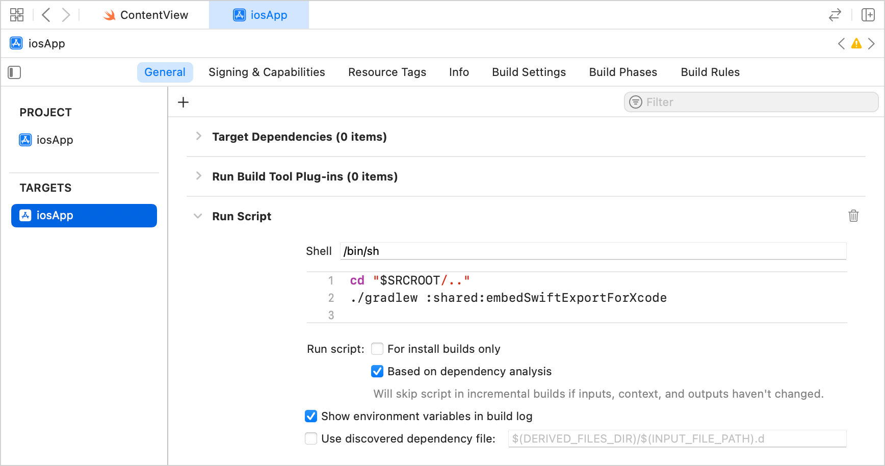
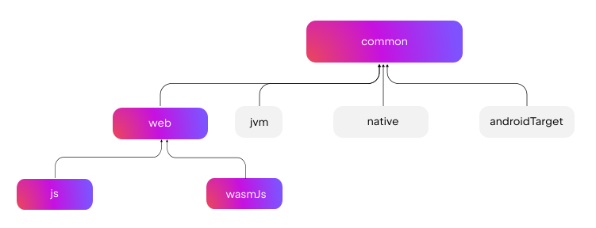

+++
title = "13.6.2.1 Kotlin 2.2.20 新变化"
date = 2026-09-13T08:50:47+08:00
weight = 1
type = "docs"
description = ""
isCJKLanguage = true
draft = false
+++


> 原文链接: [https://kotlinlang.org/docs/whatsnew2220.html](https://kotlinlang.org/docs/whatsnew2220.html)

# 13.6.2.1 Kotlin 2.2.20 新变化

阅读 Kotlin 2.2.20 发行说明，了解新的语言特性，以及 Kotlin Multiplatform、JVM、Native、JS、Wasm 的更新和 Gradle、Maven 的构建工具支持。

_[发布时间：2025 年 9 月 10 日](../../../13.5-Releases/#release-history)_

> 有关缺陷修复版本 2.2.21 的详细信息，请参见[变更日志](https://github.com/JetBrains/kotlin/releases/tag/v2.2.21)

Kotlin 2.2.20 已经发布，为 Web 开发带来了重要变更。[Kotlin/Wasm 现在进入 Beta](#kotlin-wasm)，并改进了 [JavaScript 互操作中的异常处理](#improved-exception-handling-in-kotlin-wasm-and-javascript-interop)、[npm 依赖管理](#separated-npm-dependencies)、[内置浏览器调试支持](#support-for-debugging-in-browsers-without-configuration)，以及为 [`js` 和 `wasmJs` 目标新增的共享源集](#shared-source-set-for-js-and-wasmjs-targets)。

此外，以下是一些主要亮点：

* **Kotlin Multiplatform**：[默认提供 Swift 导出](#swift-export-available-by-default)、[Kotlin 库的稳定跨平台编译](#stable-cross-platform-compilation-for-kotlin-libraries)，以及[声明通用依赖的新方式](#new-approach-for-declaring-common-dependencies)。
* **语言**：[改进把 lambda 传给带 suspend 函数类型的重载时的重载解析](#improved-overload-resolution-for-lambdas-with-suspend-function-types)。
* **Kotlin/Native**：[支持 Xcode 26、栈金丝雀，以及更小的 release 二进制体积](#kotlin-native)。
* **Kotlin/JS**：[`Long` 值编译为 JavaScript `BigInt`](#usage-of-the-bigint-type-to-represent-kotlin-s-long-type)。

> **注意：** 用于 Web 的 Compose Multiplatform 进入 Beta。请在我们的[博客文章](https://blog.jetbrains.com/kotlin/2025/09/compose-multiplatform-1-9-0-compose-for-web-beta/)中了解更多。

你也可以在这个视频中查看这些更新的简短概述：

视频：[What's new in Kotlin 2.2.21](https://www.youtube.com/v/QWpp5-LlTqA)

> **提示：** 有关 Kotlin 发布周期的信息，请参见 [Kotlin 发布流程](../../../13.5-Releases/)。

## IDE 支持 {#ide-support}

支持 Kotlin 2.2.20 的 Kotlin 插件已捆绑在最新版本的 IntelliJ IDEA 和 Android Studio 中。要更新，你需要做的只是在构建脚本中把 Kotlin 版本改为 2.2.20。

详情请参见[更新到新版本](../../../13.5-Releases/#update-to-a-new-kotlin-version)。

## 语言 {#language}

在 Kotlin 2.2.20 中，你可以试用计划在 Kotlin 2.3.0 中推出的语言特性，包括[改进把 lambda 传给带 `suspend` 函数类型的重载时的重载解析](#improved-overload-resolution-for-lambdas-with-suspend-function-types)以及[支持在带显式返回类型的表达式体中使用 `return` 语句](#support-for-return-statements-in-expression-bodies-with-explicit-return-types)。此版本还包含对 [`when` 表达式的穷尽性检查](#data-flow-based-exhaustiveness-checks-for-when-expressions)、[具体化的 `Throwable` 捕获](#support-for-reified-types-in-catch-clauses)和 [Kotlin 契约](#improved-kotlin-contracts)的改进。

### 改进带 suspend 函数类型的 lambda 的重载解析 {#improved-overload-resolution-for-lambdas-with-suspend-function-types}

以前，用常规函数类型和 `suspend` 函数类型同时重载一个函数，会在传入 lambda 时导致歧义错误。你可以用显式类型转换绕过该错误，但编译器会错误地报告 `No cast needed` 警告：

```kotlin
// 定义两个重载
fun transform(block: () -> Int) {}
fun transform(block: suspend () -> Int) {}

fun test() {
    // 失败，出现重载解析歧义
    transform({ 42 })

    // 使用显式类型转换，但编译器错误地报告
    // 一个 "No cast needed" 警告
    transform({ 42 } as () -> Int)
}
```

有了这一变更，当你同时定义常规和 `suspend` 函数类型的重载时，不带类型转换的 lambda 会解析到常规重载。请使用 `suspend` 关键字来显式解析到挂起重载：

```kotlin
// 解析为 transform(() -> Int)
transform({ 42 })

// 解析为 transform(suspend () -> Int)
transform(suspend { 42 })
```

该行为将在 Kotlin 2.3.0 中默认启用。要现在就测试它，请使用以下编译器选项把语言版本设置为 `2.3`：

```kotlin
-language-version 2.3
```

或者在你的 `build.gradle(.kts)` 文件中配置：

```kotlin
kotlin {
    compilerOptions {
        languageVersion.set(org.jetbrains.kotlin.gradle.dsl.KotlinVersion.KOTLIN_2_3)
    }
}
```

我们欢迎你在我们的问题跟踪器 [YouTrack](https://youtrack.jetbrains.com/issue/KT-23610) 中提供反馈。

### 支持在带显式返回类型的表达式体中使用 return 语句 {#support-for-return-statements-in-expression-bodies-with-explicit-return-types}

以前，在表达式体中使用 `return` 会导致编译器错误，因为它可能导致函数的返回类型被推断为 `Nothing`。

```kotlin
fun example() = return 42
// 错误：不允许在带表达式体的函数中使用 return
```

有了这一变更，只要显式写明返回类型，你现在就可以在表达式体中使用 `return`：

```kotlin
// 显式指定返回类型
fun getDisplayNameOrDefault(userId: String?): String = getDisplayName(userId ?: return "default")

// 失败，因为没有显式指定返回类型
fun getDisplayNameOrDefault(userId: String?) = getDisplayName(userId ?: return "default")
```

类似地，以前在带表达式体的函数中，lambda 和嵌套表达式内部的 `return` 语句会被意外地允许编译。Kotlin 现在支持这些情况，前提是显式指定了返回类型。未显式指定返回类型的情况将在 Kotlin 2.3.0 中被弃用：

```kotlin
// 没有显式指定返回类型，且 return 语句位于 lambda 内
// 这将被弃用
fun returnInsideLambda() = run { return 42 }

// 没有显式指定返回类型，且 return 语句位于局部变量的
// 初始化器中，这将被弃用
fun returnInsideIf() = when {
    else -> {
        val result = if (someCondition()) return "" else "value"
        result
    }
}
```

该行为将在 Kotlin 2.3.0 中默认启用。要现在就测试它，请使用以下编译器选项把语言版本设置为 `2.3`：

```kotlin
-language-version 2.3
```

或者在你的 `build.gradle(.kts)` 文件中配置：

```kotlin
kotlin {
    compilerOptions {
        languageVersion.set(org.jetbrains.kotlin.gradle.dsl.KotlinVersion.KOTLIN_2_3)
    }
}
```

我们欢迎你在我们的问题跟踪器 [YouTrack](https://youtrack.jetbrains.com/issue/KT-76926) 中提供反馈。

### when 表达式基于数据流的穷尽性检查 {#data-flow-based-exhaustiveness-checks-for-when-expressions}
**实验性**

Kotlin 2.2.20 为 `when` 表达式引入了**基于数据流的**穷尽性检查。以前，编译器的检查仅限于 `when` 表达式本身，常常迫使你添加冗余的 `else` 分支。有了这一更新，编译器现在会跟踪之前的条件检查和提前返回，因此你可以移除冗余的 `else` 分支。

例如，编译器现在会识别出函数在 `if` 条件成立时返回，因此 `when` 表达式只需处理剩余的情况：

```kotlin
enum class UserRole { ADMIN, MEMBER, GUEST }

fun getPermissionLevel(role: UserRole): Int {
    // 在 when 表达式之外覆盖 Admin 情况
    if (role == UserRole.ADMIN) return 99

    return when (role) {
        UserRole.MEMBER -> 10
        UserRole.GUEST -> 1
        // 你不再需要包含这个 else 分支
        // else -> throw IllegalStateException()
    }
}
```

该特性是[实验性](../../../13.4-ComponentsStability/#stability-levels-explained)的。要启用它，请在 `build.gradle(.kts)` 文件中添加以下编译器选项：

```kotlin
kotlin {
    compilerOptions {
        freeCompilerArgs.add("-Xdata-flow-based-exhaustiveness")
    }
}
```

### 支持在 catch 子句中使用具体化类型 {#support-for-reified-types-in-catch-clauses}
**实验性**

在 Kotlin 2.2.20 中，编译器现在允许在 `inline` 函数的 `catch` 子句中使用[具体化的泛型类型参数](../../../../languageguide/5.7-Functions/5.7.5-InlineFunctions/#reified-type-parameters)。

以下是一个示例：

```kotlin
inline fun <reified ExceptionType : Throwable> handleException(block: () -> Unit) {
    try {
        block()
        // 在此变更后这是允许的
    } catch (e: ExceptionType) {
        println("Caught specific exception: ${e::class.simpleName}")
    }
}

fun main() {
    // 尝试执行可能抛出 IOException 的操作
    handleException<java.io.IOException> {
        throw java.io.IOException("File not found")
    }
    // 捕获到特定异常：IOException
}
```

以前，尝试在 `inline` 函数中捕获具体化的 `Throwable` 类型会导致错误。

该行为将在 Kotlin 2.4.0 中默认启用。要现在就使用它，请在 `build.gradle(.kts)` 文件中添加以下编译器选项：

```kotlin
kotlin {
    compilerOptions {
        freeCompilerArgs.add("-Xallow-reified-type-in-catch")
    }
}
```

Kotlin 团队感谢外部贡献者 [Iven Krall](https://github.com/kralliv) 的贡献。

### 改进的 Kotlin 契约 {#improved-kotlin-contracts}
**实验性**

Kotlin 2.2.20 为 [Kotlin 契约](https://kotlinlang.org/api/core/kotlin-stdlib/kotlin.contracts/contract.html)引入了若干改进，包括：

* [契约类型断言中对泛型的支持](#support-for-generics-in-contract-type-assertions)。
* [支持在属性访问器和特定运算符函数中使用契约](#support-for-contracts-inside-property-accessors-and-specific-operator-functions)。
* [契约中对 `returnsNotNull()` 函数的支持](#support-for-the-returnsnotnull-function-in-contracts)，用于在条件成立时确保返回非 null 值。
* [新的 `holdsIn` 关键字](#new-holdsin-keyword)，允许你在传入 lambda 时假定条件为真。

这些改进是[实验性](../../../13.4-ComponentsStability/#stability-levels-explained)的。要选择启用，你仍然需要在声明契约时使用 `@OptIn(ExperimentalContracts::class)` 注解。`holdsIn` 关键字和 `returnsNotNull()` 函数还需要 `@OptIn(ExperimentalExtendedContracts::class)` 注解。

要使用这些改进，你还需要添加以下各节中描述的编译器选项。

我们欢迎你在我们的[问题跟踪器](https://kotl.in/issue)中提供反馈。

#### 契约类型断言中对泛型的支持 {#support-for-generics-in-contract-type-assertions}

你现在可以编写对泛型类型执行类型断言的契约：

```kotlin
import kotlin.contracts.*

sealed class Failure {
    class HttpError(val code: Int) : Failure()
    // 在此插入其他失败类型
}

sealed class Result<out T, out F : Failure> {
    class Success<T>(val data: T) : Result<T, Nothing>()
    class Failed<F : Failure>(val failure: F) : Result<Nothing, F>()
}

@OptIn(ExperimentalContracts::class)
// 使用契约断言泛型类型
fun <T, F : Failure> Result<T, F>.isHttpError(): Boolean {
    contract {
        returns(true) implies (this@isHttpError is Result.Failed<Failure.HttpError>)
    }
    return this is Result.Failed && this.failure is Failure.HttpError
}
```

在这个示例中，契约对 `Result` 对象执行类型断言，使编译器可以安全地把它[智能转换](../../../../languageguide/5.4-Types/5.4.8-Typecasts/#smart-casts)为断言的泛型类型。

该特性是[实验性](../../../13.4-ComponentsStability/#stability-levels-explained)的。要选择启用，请在 `build.gradle(.kts)` 文件中添加以下编译器选项：

```kotlin
kotlin {
    compilerOptions {
        freeCompilerArgs.add("-Xallow-contracts-on-more-functions")
    }
}
```

#### 支持在属性访问器和特定运算符函数中使用契约 {#support-for-contracts-inside-property-accessors-and-specific-operator-functions}

你现在可以在属性访问器和特定运算符函数中定义契约。这让你可以在更多类型的声明上使用契约，使它们更灵活。

例如，你可以在 getter 中使用契约来为接收者对象启用智能转换：

```kotlin
import kotlin.contracts.*

val Any.isHelloString: Boolean
    get() {
        @OptIn(ExperimentalContracts::class)
        // 当 getter 返回 true 时，把接收者智能转换为 String
        contract { returns(true) implies (this@isHelloString is String) }
        return "hello" == this
    }

fun printIfHelloString(x: Any) {
    if (x.isHelloString) {
        // 在接收者被智能转换为 String 之后打印长度
        println(x.length)
        // 5
    }
}
```

此外，你可以在以下运算符函数中使用契约：

* `invoke`
* `contains`
* `rangeTo`、`rangeUntil`
* `componentN`
* `iterator`
* `unaryPlus`、`unaryMinus`、`not`
* `inc`、`dec`

以下是一个在运算符函数中使用契约以确保 lambda 内变量初始化的示例：

```kotlin
import kotlin.contracts.*

class Runner {
    @OptIn(ExperimentalContracts::class)
    // 允许初始化在 lambda 内赋值的变量
    operator fun invoke(block: () -> Unit) {
        contract {
            callsInPlace(block, InvocationKind.EXACTLY_ONCE)
        }
        block()
    }
}

fun testOperator(runner: Runner) {
    val number: Int
    runner {
        number = 1
    }
    // 打印由契约保证的确定赋值之后的值
    println(number)
    // 1
}
```

该特性是[实验性](../../../13.4-ComponentsStability/#stability-levels-explained)的。要选择启用，请在 `build.gradle(.kts)` 文件中添加以下编译器选项：

```kotlin
kotlin {
    compilerOptions {
        freeCompilerArgs.add("-Xallow-contracts-on-more-functions")
    }
}
```

#### 契约中对 returnsNotNull() 函数的支持 {#support-for-the-returnsnotnull-function-in-contracts}

Kotlin 2.2.20 为契约引入了 [`returnsNotNull()`](https://kotlinlang.org/api/core/kotlin-stdlib/kotlin.contracts/-contract-builder/returns-not-null.html) 函数。你可以用该函数确保函数在特定条件成立时返回非 null 值。通过用单个简洁的函数替代分别处理可空和非可空的函数重载，这简化了你的代码：

```kotlin
import kotlin.contracts.*

@OptIn(ExperimentalContracts::class, ExperimentalExtendedContracts::class)
fun decode(encoded: String?): String? {
    contract {
        // 保证输入非 null 时返回非 null 值
        (encoded != null) implies (returnsNotNull())
    }
    if (encoded == null) return null
    return java.net.URLDecoder.decode(encoded, "UTF-8")
}

fun useDecodedValue(s: String?) {
    // 由于返回值可能为 null，使用安全调用
    decode(s)?.length
    if (s != null) {
        // 在智能转换后把返回值视为非 null
        decode(s).length
    }
}
```

在这个示例中，`decode()` 函数中的契约让编译器可以在输入非 null 时智能转换其返回值，从而无需额外的 null 检查或多个重载。

该特性是[实验性](../../../13.4-ComponentsStability/#stability-levels-explained)的。要选择启用，请在 `build.gradle(.kts)` 文件中添加以下编译器选项：

```kotlin
kotlin {
    compilerOptions {
        freeCompilerArgs.add("-Xallow-condition-implies-returns-contracts")
    }
}
```

#### 新的 holdsIn 关键字 {#new-holdsin-keyword}

Kotlin 2.2.20 为契约引入了新的 [`holdsIn`](https://kotlinlang.org/api/core/kotlin-stdlib/kotlin.contracts/-contract-builder/holds-in.html) 关键字。你可以用它确保在特定 lambda 内部假定布尔条件为 `true`。这让你可以用契约构建带条件智能转换的 DSL。

以下是一个示例：

```kotlin
import kotlin.contracts.*

@OptIn(ExperimentalContracts::class, ExperimentalExtendedContracts::class)
fun <T> T.alsoIf(condition: Boolean, block: (T) -> Unit): T {
    contract {
        // 声明该 lambda 最多运行一次
        callsInPlace(block, InvocationKind.AT_MOST_ONCE)
        // 声明在 lambda 内部假定条件为真
        condition holdsIn block
    }
    if (condition) block(this)
    return this
}

fun useApplyIf(input: Any) {
    val result = listOf(1, 2, 3)
        .first()
        .alsoIf(input is Int) {
            // 输入参数在 lambda 内被智能转换为 Int
            // 打印 input 与列表首元素之和
            println(input + it)
            // 2
        }
        .toString()
}
```

该特性是[实验性](../../../13.4-ComponentsStability/#stability-levels-explained)的。要选择启用，请在 `build.gradle(.kts)` 文件中添加以下编译器选项：

```kotlin
kotlin {
    compilerOptions {
        freeCompilerArgs.add("-Xallow-holdsin-contract")
    }
}
```

## Kotlin/JVM：支持在 when 表达式中使用 invokedynamic {#kotlin-jvm-support-invokedynamic-with-when-expressions}
**实验性**

在 Kotlin 2.2.20 中，你现在可以用 `invokedynamic` 编译 `when` 表达式。以前，带多个类型检查的 `when` 表达式会编译为字节码中一长串 `instanceof` 检查。

现在，在满足以下条件时，你可以用 `invokedynamic` 处理 `when` 表达式，以生成更小的字节码，类似于 Java `switch` 语句产生的字节码：

* 除 `else` 之外的所有条件都是 `is` 或 `null` 检查。
* 表达式不包含[守卫条件（`if`）](../../../../languageguide/5.5-Controlflow/5.5.1-ControlFlow/#guard-conditions-in-when-expressions)。
* 条件不包含无法直接进行类型检查的类型，例如可变 Kotlin 集合（`MutableList`）或函数类型（`kotlin.Function1`、`kotlin.Function2` 等）。
* 除 `else` 之外至少有两个条件。
* 所有分支检查 `when` 表达式的同一个主语。

例如：

```kotlin
open class Example

class A : Example()
class B : Example()
class C : Example()

fun test(e: Example) = when (e) {
    // 对 SwitchBootstraps.typeSwitch 使用 invokedynamic
    is A -> 1
    is B -> 2
    is C -> 3
    else -> 0
}
```

启用新特性后，这个示例中的 `when` 表达式会编译为单个 `invokedynamic` 类型切换，而不是多个 `instanceof` 检查。

要启用该特性，请用 JVM 目标 21 或更高版本编译 Kotlin 代码，并添加以下编译器选项：

```bash
-Xwhen-expressions=indy
```

或者把它添加到 `build.gradle(.kts)` 文件的 `compilerOptions {}` 块中：

```kotlin
kotlin {
    compilerOptions {
        freeCompilerArgs.add("-Xwhen-expressions=indy")
    }
}
```

该特性是[实验性](../../../13.4-ComponentsStability/#stability-levels-explained)的。我们欢迎你在我们的问题跟踪器 [YouTrack](https://youtrack.jetbrains.com/issue/KT-65688) 中提供反馈。

## Kotlin Multiplatform {#kotlin-multiplatform}

Kotlin 2.2.20 为 Kotlin Multiplatform 引入了重要变更：Swift 导出默认可用、有了新的共享源集，并且你可以试用管理通用依赖的新方式。

### 默认提供 Swift 导出 {#swift-export-available-by-default}
**实验性 - 通用**

Kotlin 2.2.20 引入了对 Swift 导出的实验性支持。它允许你直接导出 Kotlin 源码，并以符合习惯的方式从 Swift 调用 Kotlin 代码，从而不再需要 Objective-C 头文件。

这应当能显著改善面向 Apple 目标的多平台开发。例如，如果你有一个带顶层函数的 Kotlin 模块，Swift 导出会启用简洁的按模块导入，去除令人困惑的 Objective-C 下划线和被修饰的名称。

关键特性包括：

* **多模块支持**。每个 Kotlin 模块都导出为单独的 Swift 模块，简化函数调用。
* **包支持**。Kotlin 包在导出期间被显式保留，避免生成的 Swift 代码中出现命名冲突。
* **类型别名**。Kotlin 类型别名会被导出并在 Swift 中保留，提升可读性。
* **基本类型的增强可空性**。与需要把 `Int?` 之类的类型装箱到 `KotlinInt` 包装类以保留可空性的 Objective-C 互操作不同，Swift 导出会直接转换可空性信息。
* **重载**。你可以在 Swift 中无歧义地调用 Kotlin 的重载函数。
* **扁平的包结构**。你可以把 Kotlin 包转换为 Swift 枚举，从生成的 Swift 代码中移除包前缀。
* **模块名自定义**。你可以在 Kotlin 项目的 Gradle 配置中自定义生成的 Swift 模块名。

#### 如何启用 Swift 导出 {#how-to-enable-swift-export}

该特性目前是[实验性](../../../13.4-ComponentsStability/#stability-levels-explained)的，只适用于使用[直接集成](https://kotlinlang.org/docs/multiplatform/multiplatform-direct-integration.html)把 iOS 框架连接到 Xcode 项目的项目。这是用 IntelliJ IDEA 中的 Kotlin Multiplatform 插件或通过 [Web 向导](https://kmp.jetbrains.com/)创建的多平台项目的标准配置。

要试用 Swift 导出，请配置你的 Xcode 项目：

1. 在 Xcode 中打开项目设置。
2. 在 **Build Phases** 标签页中，找到带 `embedAndSignAppleFrameworkForXcode` 任务的 **Run Script** 阶段。
3. 调整脚本，在运行脚本阶段中改用 `embedSwiftExportForXcode` 任务：

```bash
   ./gradlew :<Shared module name>:embedSwiftExportForXcode
```



4. 构建项目。Swift 模块会在构建输出目录中生成。

该特性默认可用。如果你在以前的版本中已经启用过它，现在可以从 `gradle.properties` 文件中移除 `kotlin.experimental.swift-export.enabled`。

> **提示：** 为节省时间，请克隆我们已配置好 Swift 导出的[公开示例](https://github.com/Kotlin/swift-export-sample)。

有关 Swift 导出的更多信息，请参见我们的[文档](../../../../interoperability/7.3-Swiftobjectivecandcinterop/7.3.2-NativeSwiftExport/)。

#### 留下反馈 {#leave-feedback}

我们计划在未来的 Kotlin 版本中扩展并逐步稳定对 Swift 导出的支持。在 Kotlin 2.2.20 之后，我们将专注于改进 Kotlin 与 Swift 之间的互操作，尤其是协程和流方面。

对 Swift 导出的支持对 Kotlin Multiplatform 来说是一项重要变更。我们欢迎你的反馈：

* 在 Kotlin Slack 上直接联系开发团队——[获取邀请](https://surveys.jetbrains.com/s3/kotlin-slack-sign-up?_gl=1*ju6cbn*_ga*MTA3MTk5NDkzMC4xNjQ2MDY3MDU4*_ga_9J976DJZ68*MTY1ODMzNzA3OS4xMDAuMS4xNjU4MzQwODEwLjYw)并加入 [#swift-export](https://kotlinlang.slack.com/archives/C073GUW6WN9) 频道。
* 在 [YouTrack](https://kotl.in/issue) 中报告你使用 Swift 导出时遇到的任何问题。

### js 和 wasmJs 目标的共享源集 {#shared-source-set-for-js-and-wasmjs-targets}

以前，Kotlin Multiplatform 默认不包含 JavaScript（`js`）和 WebAssembly（`wasmJs`）Web 目标的共享源集。要在 `js` 和 `wasmJs` 之间共享代码，你必须手动配置自定义源集，或者把代码写两处，一份用于 `js`，另一份用于 `wasmJs`。例如：

```kotlin
// commonMain
expect suspend fun readCopiedText(): String

// jsMain
external interface Navigator { val clipboard: Clipboard }
// JS 和 Wasm 中的互操作不同
external interface Clipboard { fun readText(): Promise<String> }
external val navigator: Navigator

suspend fun readCopiedText(): String {
    // JS 和 Wasm 中的互操作不同
    return navigator.clipboard.readText().await()
}

// wasmJsMain
external interface Navigator { val clipboard: Clipboard }
external interface Clipboard { fun readText(): Promise<JsString> }
external val navigator: Navigator

suspend fun readCopiedText(): String {
    return navigator.clipboard.readText().await().toString()
}
```

从此次发布开始，当你使用[默认层次结构模板](https://kotlinlang.org/docs/multiplatform/multiplatform-hierarchy.html#default-hierarchy-template)时，Kotlin Gradle 插件会为 Web 添加新的共享源集（由 `webMain` 和 `webTest` 组成）。

有了这一变更，`web` 源集成为 `js` 和 `wasmJs` 源集的父源集。更新后的源集层次结构如下：



新的源集让你可以为 `js` 和 `wasmJs` 两个目标编写一份代码。你可以把共享代码放在 `webMain` 中，让它自动对两者都生效：

```kotlin
// commonMain
expect suspend fun readCopiedText(): String

// webMain
@OptIn(ExperimentalWasmJsInterop::class)
private suspend fun <R : JsAny?> Promise<R>.await(): R = suspendCancellableCoroutine { continuation ->
    this.then(
        onFulfilled = { continuation.resumeWith(Result.success(it)); null },
        onRejected = { continuation.resumeWithException(it.asJsException()); null }
    )
}

external interface Navigator { val clipboard: Clipboard }
external interface Clipboard { fun readText(): Promise<JsString> }
external val navigator: Navigator

actual suspend fun readCopiedText(): String {
    return navigator.clipboard.readText().await().toString()
}
```

这一更新简化了 `js` 和 `wasmJs` 目标之间的代码共享。它在两种情况下特别有用：

* 如果你是库作者，并且想在不重复代码的情况下同时支持 `js` 和 `wasmJs` 目标。
* 如果你在开发面向 Web 的 Compose Multiplatform 应用，为 `js` 和 `wasmJs` 目标启用交叉编译以获得更广泛的浏览器兼容性。有了这种回退模式，你创建的网站在所有浏览器上开箱即用，因为现代浏览器使用 `wasmJs`，较旧的浏览器使用 `js`。

要试用该特性，请在 `build.gradle(.kts)` 文件的 `kotlin {}` 块中使用[默认层次结构模板](https://kotlinlang.org/docs/multiplatform/multiplatform-hierarchy.html#default-hierarchy-template)：

```kotlin
kotlin {
    js()
    wasmJs()

    // 启用默认源集层次结构，包括 webMain 和 webTest
    applyDefaultHierarchyTemplate()
}
```

在使用默认层次结构之前，如果你的项目有自定义共享源集，或者你重命名过 `js("web")` 目标，请仔细考虑任何潜在冲突。要解决这些冲突，请重命名冲突的源集或目标，或者不使用默认层次结构。

### Kotlin 库的稳定跨平台编译 {#stable-cross-platform-compilation-for-kotlin-libraries}

Kotlin 2.2.20 完成了一项重要的[路线图事项](https://youtrack.jetbrains.com/issue/KT-71290)，稳定了 Kotlin 库的跨平台编译。

你现在可以使用任何[受支持的主机](../../../../development/6.3-Nativedevelopment/6.3.8-NativeTargetSupport/#hosts)来产出用于发布 Kotlin 库的 `.klib` 制品。这大大简化了发布过程，尤其是此前需要 Mac 机器的 Apple 目标。

该特性默认可用。如果你已经用 `kotlin.native.enableKlibsCrossCompilation=true` 启用了交叉编译，现在可以从 `gradle.properties` 文件中移除它。

遗憾的是，仍有一些限制。在以下情况下你仍然需要使用 Mac 机器：

* 你的库或任何依赖模块有 [cinterop 依赖](../../../../interoperability/7.3-Swiftobjectivecandcinterop/7.3.3-Cinterop/7.3.3.1-NativeCInterop/)。
* 你的项目设置了 [CocoaPods 集成](https://kotlinlang.org/docs/multiplatform/multiplatform-cocoapods-overview.html)。
* 你需要为 Apple 目标构建或测试[最终二进制文件](https://kotlinlang.org/docs/multiplatform/multiplatform-build-native-binaries.html)。

有关多平台库发布的更多信息，请参见我们的[文档](https://kotlinlang.org/docs/multiplatform/multiplatform-publish-lib-setup.html)。

### 声明通用依赖的新方式 {#new-approach-for-declaring-common-dependencies}
**实验性**

为了简化用 Gradle 配置多平台项目，当你的项目使用 Gradle 8.8 或更高版本时，Kotlin 2.2.20 现在允许你在 `kotlin {}` 块中使用顶层 `dependencies {}` 块声明通用依赖。这些依赖的行为如同声明在 `commonMain` 源集中。该特性的工作方式类似于你为 Kotlin/JVM 和纯 Android 项目使用的 dependencies 块，它在 Kotlin Multiplatform 中现在是[实验性](../../../13.4-ComponentsStability/#stability-levels-explained)的。

在项目级别声明通用依赖减少了各源集之间重复的配置，并有助于简化你的构建配置。你仍然可以按需在每个源集中添加平台特定的依赖。

要试用该特性，请在顶层 `dependencies {}` 块之前添加 `@OptIn(ExperimentalKotlinGradlePluginApi::class)` 注解来选择启用。例如：

```kotlin
kotlin {
    @OptIn(ExperimentalKotlinGradlePluginApi::class)
    dependencies {
        implementation("org.jetbrains.kotlinx:kotlinx-coroutines-core:1.11.0")
    }
}
```

我们欢迎你在 [YouTrack](https://youtrack.jetbrains.com/issue/KT-76446) 中提供关于该特性的反馈。

### 依赖中目标支持的新诊断 {#new-diagnostic-for-target-support-in-dependencies}

在 Kotlin 2.2.20 之前，如果构建脚本中的某个依赖不支持源集所需的所有目标，Gradle 产生的错误消息会让你难以理解问题所在。

Kotlin 2.2.20 引入了新的诊断，清晰显示每个依赖支持和不支持哪些目标。

该诊断默认启用。如果出于某些原因你需要禁用，请在这个 [YouTrack 议题](https://kotl.in/kmp-dependencies-diagnostic-issue)的评论中告诉我们。你可以在 `gradle.properties` 文件中使用以下 Gradle 属性禁用该诊断：

| 属性                                                 | 说明                                                    |

| `kotlin.kmp.eagerUnresolvedDependenciesDiagnostic=false` | 仅对元数据编译和导入运行诊断 |
| `kotlin.kmp.unresolvedDependenciesDiagnostic=false`      | 完全禁用诊断                             |

## Kotlin/Native {#kotlin-native}

此版本带来了对 Xcode 26 的支持、与 Objective-C/Swift 互操作和调试的改进，以及新的二进制选项。

### 支持 Xcode 26 {#support-for-xcode-26}

从 Kotlin 2.2.2**1** 开始，Kotlin/Native 编译器支持 Xcode 26——最新稳定版本的 Xcode。你现在可以更新 Xcode 并访问最新 API，继续开发面向 Apple 操作系统的 Kotlin 项目。

### 二进制文件中支持栈金丝雀 {#support-for-stack-canaries-in-binaries}

从 Kotlin 2.2.20 开始，Kotlin 在为 Kotlin/Native 生成的二进制文件中添加了对栈金丝雀的支持。作为栈保护的一部分，这项安全特性可防止栈溢出攻击，缓解一些常见的应用漏洞。它已在 Swift 和 Objective-C 中可用，现在 Kotlin 也支持了。

Kotlin/Native 中栈保护的实现遵循 [Clang](https://clang.llvm.org/docs/ClangCommandLineReference.html#cmdoption-clang-fstack-protector) 中栈保护器的行为。

要启用栈金丝雀，请在 `gradle.properties` 文件中添加以下[二进制选项](../../../../development/6.3-Nativedevelopment/6.3.6-NativeBinaryOptions/)：

```none
kotlin.native.binary.stackProtector=yes
```

该属性会为所有易受栈溢出攻击的 Kotlin 函数启用该特性。其他可选模式有：

* `kotlin.native.binary.stackProtector=strong`，对易受栈溢出攻击的函数使用更强的启发式规则。
* `kotlin.native.binary.stackProtector=all`，为所有函数启用栈保护。

请注意，在某些情况下，栈保护可能带来性能开销。

### 减小 release 二进制的体积 {#smaller-binary-size-for-release-binaries}
**实验性**

Kotlin 2.2.20 引入了 `smallBinary` 选项，可帮助减小 release 二进制的体积。该新选项实际上把 `-Oz` 设为 LLVM 编译阶段编译器的默认优化参数。

启用 `smallBinary` 选项后，你可以让 release 二进制更小并改善构建时间。不过，在某些情况下它可能影响运行时性能。

该新特性目前是[实验性](../../../13.4-ComponentsStability/#stability-levels-explained)的。要在你的项目中试用它，请在 `gradle.properties` 文件中添加以下[二进制选项](../../../../development/6.3-Nativedevelopment/6.3.6-NativeBinaryOptions/)：

```none
kotlin.native.binary.smallBinary=true
```

Kotlin 团队感谢 [Troels Lund](https://github.com/troelsbjerre) 帮助实现该特性。

### 改进的调试器对象摘要 {#improved-debugger-object-summaries}

Kotlin/Native 现在为 LLDB 和 GDB 之类的调试器工具生成更清晰的对象摘要。这提高了所生成调试信息的可读性，并简化了你的调试体验。

例如，考虑以下对象：

```kotlin
class Point(val x: Int, val y: Int)
val point = Point(1, 2)
```

以前，检查时只会显示有限的信息，包括指向对象内存地址的指针：

```none
(lldb) v point
(ObjHeader *) point = [x: ..., y: ...]
(lldb) v point->x
(int32_t *) x = 0x0000000100274048
```

在 Kotlin 2.2.20 中，调试器现在会显示更丰富的细节，包括实际值：

```none
(lldb) v point
(ObjHeader *) point = Point(x=1, y=2)
(lldb) v point->x
(int32_t) point->x = 1
```

Kotlin 团队感谢 [Nikita Nazarov](https://github.com/nikita-nazarov) 帮助实现该特性。

有关 Kotlin/Native 中调试的更多信息，请参见[文档](../../../../development/6.3-Nativedevelopment/6.3.7-NativeDebugging/)。

### Objective-C 头文件块类型中的显式名称 {#explicit-names-in-block-types-for-objective-c-headers}

Kotlin 2.2.20 引入了为从 Kotlin/Native 项目导出的 Objective-C 头文件中的 Kotlin 函数类型添加显式参数名的选项。参数名会改进 Xcode 中的自动补全建议，并有助于避免 Clang 警告。

以前，生成的 Objective-C 头文件中的块类型会省略参数名。在这类情况下，Xcode 的自动补全会建议在 Objective-C 块中不带参数名地调用这些函数。生成的块会触发 Clang 警告。

例如，对于以下 Kotlin 代码：

```kotlin
// Kotlin：
fun greetUser(block: (name: String) -> Unit) = block("John")
```

生成的 Objective-C 头文件没有参数名：

```objc
// Objective-C：
+ (void)greetUserBlock:(void (^)(NSString *))block __attribute__((swift_name("greetUser(block:)")));
```

因此在 Xcode 中从 Objective-C 调用 `greetUserBlock()` 函数时，IDE 会建议：

```objc
// Objective-C：
greetUserBlock:^(NSString *) {
    // ...
};
```

建议中缺失参数名 `(NSString *)` 会导致 Clang 警告。

有了新选项，Kotlin 会把 Kotlin 函数类型中的参数名转发到 Objective-C 块类型，因此 Xcode 会在建议中使用它们：

```objc
// Objective-C：
greetUserBlock:^(NSString *name) {
    // ...
};
```

要启用显式参数名，请在 `gradle.properties` 文件中添加以下[二进制选项](../../../../development/6.3-Nativedevelopment/6.3.6-NativeBinaryOptions/)：

```none
kotlin.native.binary.objcExportBlockExplicitParameterNames=true
```

Kotlin 团队感谢 [Yijie Jiang](https://github.com/edisongz) 实现该特性。

### 减小 Kotlin/Native 发行版体积 {#reduced-size-of-kotlin-native-distribution}

Kotlin/Native 发行版过去包含两个带编译器代码的 JAR 文件：

* `konan/lib/kotlin-native.jar`
* `konan/lib/kotlin-native-compiler-embeddable.jar`。

从 Kotlin 2.2.20 开始，`kotlin-native.jar` 不再发布。

被移除的 JAR 文件是可嵌入编译器的旧版，已不再需要。这一变更显著减小了发行版的体积。

因此，以下选项现在已被弃用并移除：

* `kotlin.native.useEmbeddableCompilerJar=false` Gradle 属性。现在 Kotlin/Native 项目始终使用可嵌入的编译器 JAR 文件。
* `KotlinCompilerPluginSupportPlugin.getPluginArtifactForNative()` 函数。现在始终使用 [`getPluginArtifact()`](https://kotlinlang.org/api/kotlin-gradle-plugin/kotlin-gradle-plugin-api/org.jetbrains.kotlin.gradle.plugin/-kotlin-compiler-plugin-support-plugin/get-plugin-artifact.html) 函数。

更多信息请参见 [YouTrack 议题](https://kotl.in/KT-51301)。

### 默认将 KDoc 导出到 Objective-C 头文件 {#exporting-kdocs-to-objective-c-headers-by-default}

在编译 Kotlin/Native 最终二进制文件期间生成 Objective-C 头文件时，[KDoc](../../../../development/6.7-Developmenttooling/6.7.5-KotlinDoc/) 注释现在默认导出。

以前，你需要在构建文件中手动添加 `-Xexport-kdoc` 选项。现在它会自动传给编译任务。

该选项会把 KDoc 注释嵌入 klib，并在生成 Apple 框架时从 klib 中提取注释。结果，类和方法上的注释会出现在自动补全中，例如在 Xcode 中。

你可以在 `build.gradle(.kts)` 文件的 `binaries {}` 块中禁用把 KDoc 注释从 klib 导出到生成的 Apple 框架：

```kotlin
import org.jetbrains.kotlin.gradle.ExperimentalKotlinGradlePluginApi

kotlin {
    iosArm64 {
        binaries {
            framework {
                baseName = "sdk"
                @OptIn(ExperimentalKotlinGradlePluginApi::class)
                exportKdoc.set(false)
            }
        }
    }
}
```

更多信息请参见[我们的文档](../../../../interoperability/7.3-Swiftobjectivecandcinterop/7.3.1-Swiftobjectivecinterop/7.3.1.1-NativeObjcInterop/#provide-documentation-with-kdoc-comments)。

### 弃用 x86_64 Apple 目标 {#deprecation-of-x86-64-apple-targets}

Apple 几年前就停止生产带 Intel 芯片的设备，并[最近宣布](https://www.youtube.com/live/51iONeETSng?t=3288s) macOS Tahoe 26 将是最后一个支持 Intel 架构的操作系统版本。

这使我们越来越难以在构建代理上正确测试这些目标，尤其是在未来的 Kotlin 版本中，我们将更新随 macOS 26 提供的受支持 Xcode 版本。

从 Kotlin 2.2.20 开始，`macosX64` 和 `iosX64` 目标被降级为支持层级 2。这意味着该目标会在 CI 上定期测试以确保可以编译，但可能不会自动测试以确保可以运行。

我们计划逐步弃用所有 `x86_64` Apple 目标，并最终在 Kotlin 2.2.20−2.4.0 发布周期内移除对它们的支持。这包括以下目标：

* `macosX64`
* `iosX64`
* `tvosX64`
* `watchosX64`

有关支持层级的更多信息，请参见 [Kotlin/Native 目标支持](../../../../development/6.3-Nativedevelopment/6.3.8-NativeTargetSupport/)。

## Kotlin/Wasm {#kotlin-wasm}

Kotlin/Wasm 现在进入 Beta，提供更高的稳定性，以及分离的 npm 依赖、[改进的 JavaScript 互操作异常处理](#improved-exception-handling-in-kotlin-wasm-and-javascript-interop)、[内置浏览器调试支持](#support-for-debugging-in-browsers-without-configuration)等改进。

### 分离的 npm 依赖 {#separated-npm-dependencies}

以前，在你的 Kotlin/Wasm 项目中，所有 [npm](https://www.npmjs.com/) 依赖都一起安装在项目文件夹中，包括 Kotlin 工具链依赖和你自己的依赖。它们也一起记录在项目的锁文件（`package-lock.json` 或 `yarn.lock`）中。

结果，每当 Kotlin 工具链依赖更新时，即使你没有添加或更改任何内容，也必须更新锁文件。

从 Kotlin 2.2.20 开始，Kotlin 工具链的 npm 依赖安装在你的项目之外。现在工具链依赖和你的（用户）依赖有各自的目录：

* **工具链依赖目录：**

`<kotlin-user-home>/kotlin-npm-tooling/<yarn|npm>/hash/node_modules`

* **用户依赖目录：**

`build/wasm/node_modules`

此外，项目目录内的锁文件只包含用户定义的依赖。

这一改进让锁文件只专注于你自己的依赖，有助于保持项目更整洁，并减少文件的不必要变更。

该变更对 `wasm-js` 目标默认启用。该变更尚未在 `js` 目标中实现。虽然有计划在未来的版本中实现，但在 Kotlin 2.2.20 中 `js` 目标的 npm 依赖行为与之前相同。

### 改进 Kotlin/Wasm 与 JavaScript 互操作中的异常处理 {#improved-exception-handling-in-kotlin-wasm-and-javascript-interop}

以前，Kotlin 很难理解在 JavaScript（JS）中抛出并跨越到 Kotlin/Wasm 代码中的异常（错误）。

在某些情况下，反向也会出现问题：当异常被抛出或从 Wasm 代码传递到 JS 时，会被包装成不带任何详情的 `WebAssembly.Exception`。这些 Kotlin 异常处理问题使调试变得困难。

从 Kotlin 2.2.20 开始，两个方向的异常体验都得到改善：

* 当异常从 JS 抛出时，你可以在 Kotlin 一侧看到更多信息。当这类异常经由 Kotlin 传回 JS 时，它不再被包装成 WebAssembly 异常。
* 当异常从 Kotlin 抛出时，现在可以在 JS 一侧作为 JS 错误捕获。

新的异常处理在支持 [`WebAssembly.JSTag`](https://webassembly.github.io/exception-handling/js-api/#dom-webassembly-jstag) 特性的现代浏览器中自动生效：

* Chrome 115+
* Firefox 129+
* Safari 18.4+

在较旧的浏览器中，异常处理行为保持不变。

### 支持无需配置即可在浏览器中调试 {#support-for-debugging-in-browsers-without-configuration}

以前，浏览器无法自动访问调试所需的 Kotlin/Wasm 项目源文件。要在浏览器中调试 Kotlin/Wasm 应用，你必须手动配置构建以提供这些源文件，在 `build.gradle(.kts)` 文件中添加以下片段：

```kotlin
devServer = (devServer ?: KotlinWebpackConfig.DevServer()).apply {
    static = (static ?: mutableListOf()).apply {
        add(project.rootDir.path)
    }
}
```

从 Kotlin 2.2.20 开始，在[现代浏览器](../../../../development/6.2-Webdevelopment/6.2.3-Webassemblywasm/6.2.3.6-WasmConfiguration/#browser-versions)中调试应用开箱即用。当你运行 Gradle 开发任务（`*DevRun`）时，Kotlin 会自动把源文件提供给浏览器，让你无需额外配置即可设置断点、检查变量并单步执行 Kotlin 代码。

这一变更通过免除手动配置简化了调试。所需配置现在包含在 Kotlin Gradle 插件中。如果你以前把这些配置添加到了 `build.gradle(.kts)` 文件中，应移除它们以避免冲突。

浏览器调试对所有 Gradle `*DevRun` 任务默认启用。这些任务不仅提供应用，还提供其源文件，因此请只在本地开发中使用它们，避免在源文件会被公开暴露的云或生产环境中运行。

#### 处理调试期间的重复重新加载 {#handle-repeated-reloads-during-debugging}

默认提供源文件可能导致[在 Kotlin 编译和打包完成之前浏览器反复重新加载应用](https://youtrack.jetbrains.com/issue/KT-80582/Multiple-reloads-when-using-webpack-dev-server-after-2.2.20-Beta2#focus=Comments-27-12596427.0-0)。作为变通方案，请调整 webpack 配置以忽略 Kotlin 源文件，并禁止监视提供的静态文件。在项目根目录的 `webpack.config.d` 目录中添加一个包含以下内容的 `.js` 文件：

```kotlin
config.watchOptions = config.watchOptions || {
    ignored: ["**/*.kt", "**/node_modules"]
}

if (config.devServer) {
    config.devServer.static = config.devServer.static.map(file => {
        if (typeof file === "string") {
        return { directory: file,
                 watch: false,
        }
    } else {
        return file
    }
    })
}
```

### 消除空的 yarn.lock 文件 {#elimination-of-empty-yarn-lock-files}

以前，Kotlin Gradle 插件（KGP）会自动生成 `yarn.lock` 文件，其中包含 Kotlin 工具链所需的 npm 包信息，以及项目或所用库中已有的 [npm](https://www.npmjs.com/) 依赖。

现在，KGP 单独管理工具链依赖，除非项目有 npm 依赖，否则不再生成项目级 `yarn.lock` 文件。

KGP 在添加 npm 依赖时自动创建 `yarn.lock` 文件，并在移除 npm 依赖时删除该文件。

这一变更清理了项目结构，使跟踪实际引入 npm 依赖的时机更容易。

配置该行为无需额外步骤。从 Kotlin 2.2.20 起，它在 Kotlin/Wasm 项目中默认应用。

### 完全限定类名的新编译器错误 {#new-compiler-error-in-fully-qualified-class-names}

在 Kotlin/Wasm 上，编译器默认不会把类的完全限定名称（FQN）存储到生成的二进制文件中。这种做法避免了增加应用体积。

因此在以前的 Kotlin 版本中，调用 `KClass::qualifiedName` 属性会返回空字符串，而不是类的限定名称。

从 Kotlin 2.2.20 开始，如果你在 Kotlin/Wasm 项目中使用 `KClass::qualifiedName` 属性，编译器会报错，除非你显式启用完全限定名称特性。

这一变更防止了调用 `qualifiedName` 属性时出现意外的空字符串，并通过在编译期捕捉问题改善了开发者体验。

该诊断默认启用，错误会自动报告。要禁用诊断并允许在 Kotlin/Wasm 中存储 FQN，请通过在你的 `build.gradle(.kts)` 文件中添加以下选项，让编译器为所有类存储完全限定名称：

```kotlin
kotlin {
    wasmJs {
        ...
        compilerOptions {
            freeCompilerArgs.add("-Xwasm-kclass-fqn")
        }
    }
}
```

> **注意：** 请记住，启用该选项会增加应用体积。

## Kotlin/JS {#kotlin-js}

Kotlin 2.2.20 支持使用 `BigInt` 类型表示 Kotlin 的 `Long` 类型，从而可以在导出声明中使用 `Long`。此外，此版本添加了一个用于清理 Node.js 参数的 DSL 函数。

### 使用 BigInt 类型表示 Kotlin 的 Long 类型 {#usage-of-the-bigint-type-to-represent-kotlin-s-long-type}
**实验性**

在 ES2020 标准之前，JavaScript（JS）不支持用于精确表示大于 53 位整数的基本类型。

因此，Kotlin/JS 过去把 `Long` 值（64 位宽）表示为包含两个 `number` 属性的 JavaScript 对象。这种自定义实现使 Kotlin 与 JavaScript 之间的互操作更加复杂。

从 Kotlin 2.2.20 开始，在编译到现代 JavaScript（ES2020）时，Kotlin/JS 改用 JavaScript 内置的 `BigInt` 类型来表示 Kotlin 的 `Long` 值。

这一变更使得[把 `Long` 类型导出到 JavaScript](#usage-of-long-in-exported-declarations)成为可能，该特性也在 Kotlin 2.2.20 中引入。因此，这一变更简化了 Kotlin 与 JavaScript 之间的互操作。

要启用它，你需要在 `build.gradle(.kts)` 文件中添加以下编译器选项：

```kotlin
kotlin {
    js {
        ...
        compilerOptions {
            freeCompilerArgs.add("-Xes-long-as-bigint")
        }
    }
}
```

该特性是[实验性](../../../13.4-ComponentsStability/#stability-levels-explained)的。我们欢迎你在我们的问题跟踪器 [YouTrack](https://youtrack.jetbrains.com/issue/KT-57128) 中提供反馈。

#### 在导出声明中使用 Long {#usage-of-long-in-exported-declarations}

由于 Kotlin/JS 使用自定义的 `Long` 表示，很难提供一种直接从 JavaScript 与 Kotlin 的 `Long` 交互的简单方式。因此，你无法把使用 `Long` 类型的 Kotlin 代码导出到 JavaScript。该问题影响了任何使用 `Long` 的代码，例如函数参数、类属性或构造器。

现在 Kotlin 的 `Long` 类型可以编译为 JavaScript 的 `BigInt` 类型，Kotlin/JS 支持把 `Long` 值导出到 JavaScript，从而简化 Kotlin 与 JavaScript 代码之间的互操作。

要启用该特性：

1. 在 `build.gradle(.kts)` 文件的 `freeCompilerArgs` 属性中添加以下编译器选项，以允许在 Kotlin/JS 中导出 `Long`：

```kotlin
    kotlin {
        js {
            ...
            compilerOptions {
                freeCompilerArgs.add("-XXLanguage:+JsAllowLongInExportedDeclarations")
            }
        }
    }
```

2. 启用 `BigInt` 类型。请参见[使用 `BigInt` 类型表示 Kotlin 的 `Long` 类型](#usage-of-the-bigint-type-to-represent-kotlin-s-long-type)了解如何启用它。

### 用于更简洁参数的新 DSL 函数 {#new-dsl-function-for-cleaner-arguments}

用 Node.js 运行 Kotlin/JS 应用时，传给程序的参数（`args`）过去会包含：

* 可执行文件 `Node` 的路径。
* 你的脚本的路径。
* 你提供的实际命令行参数。

然而，`args` 的预期行为是只包含命令行参数。为此，你不得不在 `build.gradle(.kts)` 文件中或 Kotlin 代码中使用 `drop()` 函数手动跳过前两个参数：

```kotlin
fun main(args: Array<String>) {
    println(args.drop(2).joinToString(", "))
}
```

这种变通方案重复、容易出错，并且在跨平台共享代码时效果不佳。

为修复该问题，Kotlin 2.2.20 引入了名为 `passCliArgumentsToMainFunction()` 的新 DSL 函数。

使用该函数后，只包含命令行参数，而不包含 `Node` 和脚本路径：

```kotlin
fun main(args: Array<String>) {
    // 不再需要 drop()，只包含你的自定义参数
    println(args.joinToString(", "))
}
```

这一变更减少了样板代码，防止了手动丢弃参数导致的错误，并改善了跨平台兼容性。

要启用该特性，请在 `build.gradle(.kts)` 文件中添加以下 DSL 函数：

```kotlin
kotlin {
    js {
        nodejs {
            passCliArgumentsToMainFunction()
        }
    }
}
```

## Gradle {#gradle}

Kotlin 2.2.20 在 Gradle 构建报告中为 Kotlin/Native 任务添加了新的编译器性能指标，并在增量编译方面做了易用性改进。

### Kotlin/Native 任务构建报告中的新编译器性能指标 {#new-compiler-performance-metrics-in-build-reports-for-kotlin-native-tasks}

在 Kotlin 1.7.0 中，我们引入了[构建报告](../../../../buildtools/11.1-Gradle/11.1.6-GradleCompilationAndCaches/#build-reports)来帮助跟踪编译器性能。从那时起，我们添加了更多指标，使这些报告在调查性能问题时更详细、更有用。

在 Kotlin 2.2.20 中，构建报告现在包含 Kotlin/Native 任务的编译器性能指标。

要更多了解构建报告及其配置方式，请参见[启用构建报告](../../../../buildtools/11.1-Gradle/11.1.6-GradleCompilationAndCaches/#enabling-build-reports)。

### 预览 Kotlin/JVM 改进的增量编译 {#preview-improved-incremental-compilation-for-kotlin-jvm}
**实验性 - 通用**

Kotlin 2.0.0 引入了带优化前端的新 K2 编译器。Kotlin 2.2.20 在此基础上利用新前端改进了 Kotlin/JVM 在某些复杂增量编译场景中的性能。

在我们努力稳定该行为期间，这些改进默认禁用。要启用它们，请在 `gradle.properties` 文件中添加以下属性：

```none
kotlin.incremental.jvm.fir=true
```

目前，[`kapt` 编译器插件](../../../../compilerandplugins/12.2-Kotlincompilerplugins/12.2.3-Kapt/)与该新行为不兼容。我们正在努力在未来的 Kotlin 版本中添加支持。

我们欢迎你在 [YouTrack](https://youtrack.jetbrains.com/issue/KT-72822) 中提供关于该特性的反馈。

### 增量编译检测内联函数 lambda 中的变更 {#incremental-compilation-detects-changes-in-lambdas-of-inline-functions}

在 Kotlin 2.2.20 之前，如果你启用了增量编译并修改了内联函数中 lambda 的逻辑，编译器不会重新编译其他模块中该内联函数的调用点。结果，这些调用点会使用 lambda 的旧版本，可能导致意外行为。

在 Kotlin 2.2.20 中，编译器现在会检测内联函数 lambda 中的变更，并自动重新编译其调用点。

### 库发布的改进 {#improvements-for-library-publication}

Kotlin 2.2.20 添加了新的 Gradle 任务，让库发布更容易。这些任务帮助你生成密钥对、上传公钥，并运行本地检查以确保在上传到 Maven Central 仓库之前验证过程能够成功。

有关如何在发布过程中使用这些任务的更多信息，请参见[把你的库发布到 Maven Central](https://kotlinlang.org/docs/multiplatform/multiplatform-publish-libraries.html)。

#### 用于生成和上传 PGP 密钥的新 Gradle 任务 {#new-gradle-tasks-for-generating-and-uploading-pgp-keys}

在 Kotlin 2.2.20 之前，如果你想把手跨平台库发布到 Maven Central 仓库，必须安装 `gpg` 之类的第三方程序来生成用于签名发布的密钥对。现在 Kotlin Gradle 插件自带 Gradle 任务，让你可以生成密钥对并上传公钥，因此不必再安装另一个程序。

##### 生成密钥对 {#generate-a-key-pair}

`generatePgpKeys` 任务会生成密钥对。运行它时，你必须按以下格式为私有密钥库提供密码和你的名字：

```bash
./gradlew -Psigning.password=example-password generatePgpKeys --name "John Smith <john@example.com>"
```

该任务会把密钥对存储在 `build/pgp` 目录中。

> **警告：** 请把密钥对移到安全位置，防止意外删除或未经授权的访问。

##### 上传公钥 {#upload-the-public-key}

`uploadPublicPgpKey` 任务会把公钥上传到 Ubuntu 的密钥服务器：`keyserver.ubuntu.com`。运行它时，请提供 `.asc` 格式公钥的路径：

```bash
./gradlew uploadPublicPgpKey --keyring /path_to/build/pgp/public_KEY_ID.asc
```

#### 用于在本地测试验证的新 Gradle 任务 {#new-gradle-tasks-to-test-verification-locally}

Kotlin 2.2.20 还添加了在把库上传到 Maven Central 仓库之前进行本地验证测试的 Gradle 任务。

如果你同时使用 Kotlin Gradle 插件和 Gradle 的[签名插件](https://docs.gradle.org/current/userguide/signing_plugin.html)和 [Maven 发布插件](https://docs.gradle.org/current/userguide/publishing_maven.html)，你可以运行 `checkSigningConfiguration` 和 `checkPomFileFor<PUBLICATION_NAME>Publication` 任务，以验证你的配置满足 Maven Central 的要求。请把 `<PUBLICATION_NAME>` 替换为你的发布名称。

这些任务不会作为 `build` 或 `check` Gradle 任务的一部分自动运行，因此你需要手动运行它们。例如，如果你有一个 `KotlinMultiplatform` 发布：

```bash
./gradlew checkSigningConfiguration checkPomFileForKotlinMultiplatformPublication
```

`checkSigningConfiguration` 任务会检查：

* 签名插件已配置密钥。
* 已配置的公钥已上传到 `keyserver.ubuntu.com` 或 `keys.openpgp.org` 密钥服务器。
* 所有发布都已启用签名。

如果任何一项检查失败，该任务会返回错误，并附带如何修复问题的信息。

`checkPomFileFor<PUBLICATION_NAME>Publication` 任务会检查 `pom.xml` 文件是否满足 Maven Central 的[要求](https://central.sonatype.org/publish/requirements/#required-pom-metadata)。如果不满足，该任务会返回错误，并详细说明 `pom.xml` 文件的哪些部分不符合要求。

## Maven：kotlin-maven-plugin 中对 Kotlin 守护进程的支持 {#maven-support-for-the-kotlin-daemon-in-the-kotlin-maven-plugin}

Kotlin 2.2.20 通过在 `kotlin-maven-plugin` 中添加对 [Kotlin 守护进程](../../../../buildtools/11.4-KotlinDaemon/)的支持，把 [Kotlin 2.2.0 中引入的构建工具 API](../13.6.2.2-Whatsnew22/#new-experimental-build-tools-api)向前推进了一步。使用 Kotlin 守护进程时，Kotlin 编译器在单独的隔离进程中运行，从而防止其他 Maven 插件覆盖系统属性。你可以在这个 [YouTrack 议题](https://youtrack.jetbrains.com/issue/KT-43894/Maven-Windows-error-RuntimeException-Could-not-find-installation-home-path)中看到一个示例。

从 Kotlin 2.2.20 开始，Kotlin 守护进程默认使用。如果你想回到之前的行为，请在 `pom.xml` 文件中把以下属性设置为 `false` 来选择退出：

```xml
<properties>
    <kotlin.compiler.daemon>false</kotlin.compiler.daemon>
</properties>
```

Kotlin 2.2.20 还引入了新的 `jvmArgs` 属性，你可以用它自定义 Kotlin 守护进程的默认 JVM 参数。例如，要覆盖 `-Xmx` 和 `-Xms` 选项，请在你的 `pom.xml` 文件中添加以下内容：

```xml
<properties>
    <kotlin.compiler.daemon.jvmArgs>Xmx1500m,Xms500m</kotlin.compiler.daemon.jvmArgs>
</properties>
```

## Kotlin 编译器选项的新通用 schema {#new-common-schema-for-kotlin-compiler-options}

Kotlin 2.2.20 为发布在 [`org.jetbrains.kotlin:kotlin-compiler-arguments-description`](https://central.sonatype.com/artifact/org.jetbrains.kotlin/kotlin-compiler-arguments-description) 下的所有编译器选项引入了通用 schema。该制品既包含代码表示，也包含面向非 JVM 使用者的 JSON 等价表示，涵盖所有编译器选项、它们的描述，以及每个选项在哪个版本中引入或稳定的元数据。你可以用这个 schema 生成选项的自定义视图，或按需对它们进行分析。

## 标准库 {#standard-library}

此版本在标准库中引入了新的实验性特性：Kotlin/JS 中通过反射识别接口类型、通用原子类型的更新函数，以及用于调整数组大小的 `copyOf()` 重载。

### Kotlin/JS 中通过反射识别接口类型的支持 {#support-for-identifying-interface-types-through-reflection-in-kotlin-js}
**实验性**

Kotlin 2.2.20 为 Kotlin/JS 标准库添加了[实验性](../../../13.4-ComponentsStability/#stability-levels-explained)的 [`KClass.isInterface`](https://kotlinlang.org/api/core/kotlin-stdlib/kotlin.reflect/-k-class/is-interface.html) 属性。

有了该属性，你现在可以检查某个类引用是否表示 Kotlin 接口。这让 Kotlin/JS 更接近 Kotlin/JVM 的能力，后者可以使用 `KClass.java.isInterface` 检查某个类是否表示接口。

要选择启用，请使用 `@OptIn(ExperimentalStdlibApi::class)` 注解：

```kotlin
@OptIn(ExperimentalStdlibApi::class)
fun inspect(klass: KClass<*>) {
    // 对接口打印 true
    println(klass.isInterface)
}
```

我们欢迎你在我们的问题跟踪器 [YouTrack](https://youtrack.jetbrains.com/issue/KT-78581) 中提供反馈。

### 通用原子类型的新更新函数 {#new-update-functions-for-common-atomic-types}
**实验性**

Kotlin 2.2.20 为更新通用原子类型及其数组对应元素引入了新的实验性函数。每个函数都使用其中一个更新函数原子地计算新值并替换当前值，返回值取决于你使用哪个函数：

* [`update()`](https://kotlinlang.org/api/core/kotlin-stdlib/kotlin.concurrent.atomics/update.html) 和 [`updateAt()`](https://kotlinlang.org/api/core/kotlin-stdlib/kotlin.concurrent.atomics/update-at.html) 设置新值但不返回结果。
* [`fetchAndUpdate()`](https://kotlinlang.org/api/core/kotlin-stdlib/kotlin.concurrent.atomics/fetch-and-update.html) 和 [`fetchAndUpdateAt()`](https://kotlinlang.org/api/core/kotlin-stdlib/kotlin.concurrent.atomics/fetch-and-update-at.html) 设置新值并返回变更前的值。
* [`updateAndFetch()`](https://kotlinlang.org/api/core/kotlin-stdlib/kotlin.concurrent.atomics/update-and-fetch.html) 和 [`updateAndFetchAt()`](https://kotlinlang.org/api/core/kotlin-stdlib/kotlin.concurrent.atomics/update-and-fetch-at.html) 设置新值并返回变更后的值。

你可以用这些函数实现开箱即用不支持的原子变换，例如乘法或位运算。在此变更之前，对通用原子类型做自增并读取之前的值需要使用带 [`compareAndSet()`](https://kotlinlang.org/api/core/kotlin-stdlib/kotlin.concurrent/-atomic-int/compare-and-set.html) 函数的循环。

与所有通用原子类型的 API 一样，这些函数是[实验性](../../../13.4-ComponentsStability/#stability-levels-explained)的。要选择启用，请使用 `@OptIn(ExperimentalAtomicApi::class)` 注解。

以下是一个执行不同类型更新并返回先前值或更新后值的代码示例：

```kotlin
import kotlin.concurrent.atomics.*
import kotlin.random.Random

@OptIn(ExperimentalAtomicApi::class)
fun main() {
    val counter = AtomicLong(Random.nextLong())
    val minSetBitsThreshold = 20

    // 设置新值而不使用结果
    counter.update { if (it < 0xDECAF) 0xCACA0 else 0xC0FFEE }

    // 获取当前值，然后更新它
    val previousValue = counter.fetchAndUpdate { 0x1CEDL.shl(Long.SIZE_BITS - it.countLeadingZeroBits()) or it }

    // 更新值，然后获取结果
    val current = counter.updateAndFetch {
        if (it.countOneBits() < minSetBitsThreshold) it.shl(20) or 0x15BADL else it
    }

    val hexFormat = HexFormat {
        upperCase = true
        number {
            removeLeadingZeros = true
        }
    }
    println("Previous value: ${previousValue.toHexString(hexFormat)}")
    println("Current value: ${current.toHexString(hexFormat)}")
    println("Expected status flag set: ${current and 0xBAD != 0xBADL}")
}
```

我们欢迎你在我们的问题跟踪器 [YouTrack](https://youtrack.jetbrains.com/issue/KT-76389) 中提供反馈。

### 数组 copyOf() 重载的支持 {#support-for-copyof-overloads-for-arrays}
**实验性**

Kotlin 2.2.20 引入了 [`copyOf()`](https://kotlinlang.org/api/core/kotlin-stdlib/kotlin.collections/copy-of.html) 函数的实验性重载。它适用于泛型类型的数组 `Array<T>` 和所有基本类型数组。

你可以用该函数把数组变大，并使用初始化 lambda 中的值填充新元素。这可以帮助你减少自定义样板代码，并修复了调整泛型 `Array<T>` 大小时会产生可空结果（`Array<T?>`）这一常见痛点。

以下是一个示例：

```kotlin
@OptIn(ExperimentalStdlibApi::class)
fun main() {
    val row1: Array<String> = arrayOf("one", "two")
    // 调整数组大小并用 lambda 填充新元素
    val row2: Array<String> = row1.copyOf(4) { "default" }
    println(row2.contentToString())
    // [one, two, default, default]
}
```

该 API 是[实验性](../../../13.4-ComponentsStability/#stability-levels-explained)的。要选择启用，请使用 `@OptIn(ExperimentalStdlibApi::class)` 注解。

我们欢迎你在我们的[问题跟踪器](https://youtrack.jetbrains.com/issue/KT-70984)中提供反馈。

## Compose 编译器 {#compose-compiler}

在此版本中，Compose 编译器通过添加新警告并改进构建指标的输出来带来易用性改进，使它们更易读。

### 默认参数的语言版本限制 {#language-version-restrictions-for-default-parameters}

在此版本中，如果为编译指定的语言版本低于在抽象或开放 composable 函数中支持默认参数所需的版本，Compose 编译器会报错。

从 Kotlin 2.1.0 起，Compose 编译器支持抽象函数的默认参数；从 Kotlin 2.2.0 起支持开放函数。当面向较旧的 Kotlin 语言版本使用较新版本的 Compose 编译器时，库开发者应注意：即使语言版本不支持，抽象或开放函数中的默认参数仍可能出现在公开 API 中。

### K2 编译器的 composable 目标警告 {#composable-target-warnings-for-the-k2-compiler}

此版本添加了使用 K2 编译器时关于 [`@ComposableTarget`](https://developer.android.com/reference/kotlin/androidx/compose/runtime/ComposableTarget) 不匹配的警告。

例如：

```text
@Composable fun App() {
  Box { // Box { // <-- `Box` 是 `@UiComposable`
    Path(...) // Path(...) // <-- `Path` 是 `@VectorComposable`
    ^^^^^^^^^
    warning: Calling a Vector composable function where a UI composable was expected
  }
}
```
### 构建指标中的完全限定名称 {#fully-qualified-names-in-build-metrics}

构建指标中报告的类和函数名现在是完全限定的，从而更容易区分不同包中同名的声明。

此外，构建指标不再包含默认参数中复杂表达式的转储，使它们更易读。

## 破坏性变更与弃用 {#breaking-changes-and-deprecations}

本节重点介绍值得注意的重要破坏性变更和弃用：

* [kapt](../../../../compilerandplugins/12.2-Kotlincompilerplugins/12.2.3-Kapt/) 编译器插件现在默认使用 K2 编译器。因此，用于控制插件是否使用 K2 编译器的 `kapt.use.k2` 属性已被弃用。如果你把该属性设置为 `false` 来选择不使用 K2 编译器，Gradle 会显示警告。

## 文档更新 {#documentation-updates}

Kotlin 文档有一些值得注意的变更：

* [Kotlin 路线图](../../../13.1-Roadmap/)——查看 Kotlin 在语言和生态演进方面优先事项的更新列表。
* [属性](../../../../languageguide/5.8-Classesandinterfaces/5.8.10-Properties/5.8.10.1-Properties/)——了解在 Kotlin 中使用属性的多种方式。
* [条件与循环](../../../../languageguide/5.5-Controlflow/5.5.1-ControlFlow/)——了解 Kotlin 中条件与循环的工作方式。
* [Kotlin/JavaScript](../../../../development/6.2-Webdevelopment/6.2.2-Kotlinjs/6.2.2.1-JsOverview/)——探索 Kotlin/JS 的用例。
* [面向 Web](../../../../buildtools/11.1-Gradle/11.1.3-GradleConfigureProject/#targeting-the-web)——了解 Gradle 为 Web 开发提供的不同目标。
* [Kotlin 守护进程](../../../../buildtools/11.4-KotlinDaemon/)——了解 Kotlin 守护进程以及它如何与构建系统和 Kotlin 编译器协作。
* [协程概览页面](../../../../languageguide/5.12-Concurrency/5.12.2-CoroutinesOverview/)——了解协程概念并开始你的学习之旅。
* [Kotlin/Native 二进制选项](../../../../development/6.3-Nativedevelopment/6.3.6-NativeBinaryOptions/)——了解 Kotlin/Native 的二进制选项及如何配置它们。
* [调试 Kotlin/Native](../../../../development/6.3-Nativedevelopment/6.3.7-NativeDebugging/)——探索使用 Kotlin/Native 调试的不同方式。
* [自定义 LLVM 后端的技巧](../../../../development/6.3-Nativedevelopment/6.3.10-NativeLlvmPasses/)——了解 Kotlin/Native 如何使用 LLVM 并调整优化 pass。
* [Exposed 的 DAO API 入门](https://www.jetbrains.com/help/exposed/get-started-with-exposed-dao.html)——了解如何使用 Exposed 的数据访问对象（DAO）API 在关系数据库中存储和检索数据。
* Exposed 文档中关于 R2DBC 的新页面：
* [使用数据库](https://www.jetbrains.com/help/exposed/working-with-database.html)
* [使用 ConnectionFactory](https://www.jetbrains.com/help/exposed/working-with-connectionfactory.html)
* [自定义类型映射](https://www.jetbrains.com/help/exposed/custom-type-mapping.html)
* [HTMX 集成](https://ktor.io/docs/htmx-integration.html)——了解 Ktor 如何为 HTMX 提供实验性的一等支持。

## 如何更新到 Kotlin 2.2.20 {#how-to-update-to-kotlin-2-2-20}

Kotlin 插件在 IntelliJ IDEA 和 Android Studio 中作为捆绑插件分发。

要更新到新的 Kotlin 版本，请在构建脚本中[更改 Kotlin 版本](../../../13.5-Releases/#update-to-a-new-kotlin-version)为 2.2.20。
