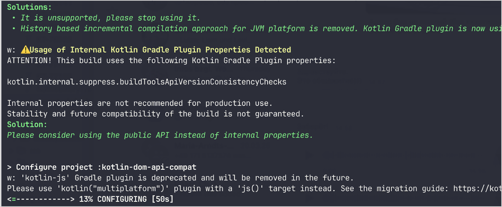

+++
title = "13.6.2.2 Kotlin 2.2.0 新变化"
date = 2026-09-13T08:50:47+08:00
weight = 2
type = "docs"
description = ""
isCJKLanguage = true
draft = false
+++


> 原文链接: [https://kotlinlang.org/docs/whatsnew22.html](https://kotlinlang.org/docs/whatsnew22.html)

# 13.6.2.2 Kotlin 2.2.0 新变化

阅读 Kotlin 2.2.0 发行说明，了解新的语言特性，以及 Kotlin Multiplatform、JVM、Native、JS、Wasm 的更新和 Gradle、Maven 的构建工具支持。

_[发布时间：2025 年 6 月 23 日](../../../13.5-Releases/#release-history)_

Kotlin 2.2.0 已经发布！以下是主要亮点：

* **语言**：预览中的新语言特性，包括[上下文参数](#preview-of-context-parameters)。若干[此前处于实验性的特性现在已进入 Stable](#stable-features-guard-conditions-non-local-break-and-continue-and-multi-dollar-interpolation)，例如守卫条件、非局部 break 和 continue，以及多美元插值。
* **Kotlin 编译器**：[编译器警告的统一管理](#kotlin-compiler-unified-management-of-compiler-warnings)。
* **Kotlin/JVM**：[接口函数默认方法生成的变更](#changes-to-default-method-generation-for-interface-functions)。
* **Kotlin/Native**：[LLVM 19，以及跟踪和调整内存消耗的新特性](#kotlin-native)。
* **Kotlin/Wasm**：[分离的 Wasm 目标](#build-infrastructure-for-wasm-target-separated-from-javascript-target)以及[按项目配置 Binaryen](#per-project-binaryen-configuration) 的能力。
* **Kotlin/JS**：[修复为 `@JsPlainObject` 接口生成的 `copy()` 方法](#fix-for-copy-in-jsplainobject-interfaces)。
* **Gradle**：[Kotlin Gradle 插件中的二进制兼容性验证](#binary-compatibility-validation-included-in-kotlin-gradle-plugin)。
* **标准库**：[稳定的 Base64 和 HexFormat API](#stable-base64-encoding-and-decoding)。
* **文档**：[Kotlin 文档做了重要改进](#documentation-updates)。

你也可以观看这个视频，Kotlin 语言演进团队在其中讨论了新特性并回答问题：

视频：[What's new in Kotlin 2.2.0](https://www.youtube.com/watch?v=jne3923lWtw)

> **提示：** 有关 Kotlin 发布周期的信息，请参见 [Kotlin 发布流程](../../../13.5-Releases/)。

## IDE 支持 {#ide-support}

支持 2.2.0 的 Kotlin 插件已捆绑在最新版本的 IntelliJ IDEA 和 Android Studio 中。你无需在 IDE 中更新 Kotlin 插件。你需要做的只是在构建脚本中[更改 Kotlin 版本](../../../../earlyaccessprevieweap/14.2-ConfigureBuildForEap/#adjust-the-kotlin-version)为 2.2.0。

详情请参见[更新到新版本](../../../13.5-Releases/#update-to-a-new-kotlin-version)。

## 语言 {#language}

此版本把守卫条件、非局部 `break` 和 `continue`，以及多美元插值[升级](#stable-features-guard-conditions-non-local-break-and-continue-and-multi-dollar-interpolation)为 [Stable](../../../13.4-ComponentsStability/#stability-levels-explained)。此外，[上下文参数](#preview-of-context-parameters)和[上下文敏感解析](#preview-of-context-sensitive-resolution)等若干特性以预览形式引入。

### 上下文参数预览 {#preview-of-context-parameters}
**实验性 - 通用**

上下文参数允许函数和属性声明在周围上下文中隐式可用的依赖。

有了上下文参数，你不再需要手动传递服务或依赖之类的值——这些值在一组函数调用之间共享且很少变化。

上下文参数取代了名为上下文接收者的旧实验性特性。要从上下文接收者迁移到上下文参数，你可以使用 IntelliJ IDEA 中的辅助支持，如[博客文章](https://blog.jetbrains.com/kotlin/2025/04/update-on-context-parameters/)中所述。

主要区别在于上下文参数不会作为接收者引入到函数体中。因此，你需要使用上下文参数的名称来访问其成员，而不像上下文接收者那样上下文是隐式可用的。

Kotlin 中的上下文参数通过简化依赖注入、改进 DSL 设计和作用域化操作，代表了依赖管理方面的重大改进。更多信息请参见该特性的 [KEEP](https://kotlinlang.org/docs/https://github.com/Kotlin/KEEP/blob/context-parameters/proposals/context-parameters.html)。

#### 如何声明上下文参数 {#how-to-declare-context-parameters}

你可以使用 `context` 关键字为属性和函数声明上下文参数，后面跟一串参数，每个参数的格式为 `name: Type`。以下是一个依赖 `UserService` 接口的示例：

```kotlin
// UserService 定义了上下文中所需的依赖
interface UserService {
    fun log(message: String)
    fun findUserById(id: Int): String
}

// 声明带上下文参数的函数
context(users: UserService)
fun outputMessage(message: String) {
    // 使用上下文中的 log
    users.log("Log: $message")
}

// 声明带上下文参数的属性
context(users: UserService)
val firstUser: String
    // 使用上下文中的 findUserById
    get() = users.findUserById(1)
```

你可以用 `_` 作为上下文参数名。在这种情况下，参数的值可用于解析，但在块内无法按名称访问：

```kotlin
// 使用 "_" 作为上下文参数名
context(_: UserService)
fun logWelcome() {
    // 从 UserService 中找到合适的 log 函数
    outputMessage("Welcome!")
}
```

#### 如何启用上下文参数 {#how-to-enable-context-parameters}

要在项目中启用上下文参数，请在命令行中使用以下编译器选项：

```Bash
-Xcontext-parameters
```

或者把它添加到 Gradle 构建文件的 `compilerOptions {}` 块中：

```kotlin
// build.gradle.kts
kotlin {
    compilerOptions {
        freeCompilerArgs.add("-Xcontext-parameters")
    }
}
```

> **警告：** 同时指定 `-Xcontext-receivers` 和 `-Xcontext-parameters` 编译器选项会导致错误。

#### 留下你的反馈 {#leave-your-feedback}

该特性计划在未来的 Kotlin 版本中稳定并改进。我们欢迎你在我们的问题跟踪器 [YouTrack](https://youtrack.jetbrains.com/issue/KT-10468/Context-Parameters-expanding-extension-receivers-to-work-with-scopes) 中提供反馈。

### 上下文敏感解析预览 {#preview-of-context-sensitive-resolution}
**实验性 - 通用**

Kotlin 2.2.0 以预览形式引入了上下文敏感解析的实现。

你可以在这个视频中查看该特性的概述：

视频：[Context-sensitive resolution in Kotlin 2.2.0](https://www.youtube.com/v/aF8RYQrJI8Q)

以前，即使类型可以从上下文推断出来，你也必须写出 enum 条目或密封类成员的完整名称。例如：

```kotlin
enum class Problem {
    CONNECTION, AUTHENTICATION, DATABASE, UNKNOWN
}

fun message(problem: Problem): String = when (problem) {
    Problem.CONNECTION -> "connection"
    Problem.AUTHENTICATION -> "authentication"
    Problem.DATABASE -> "database"
    Problem.UNKNOWN -> "unknown"
}
```

现在，有了上下文敏感解析，你可以在已知期望类型的上下文中省略类型名：

```kotlin
enum class Problem {
    CONNECTION, AUTHENTICATION, DATABASE, UNKNOWN
}

// 根据 problem 的已知类型解析 enum 条目
fun message(problem: Problem): String = when (problem) {
    CONNECTION -> "connection"
    AUTHENTICATION -> "authentication"
    DATABASE -> "database"
    UNKNOWN -> "unknown"
}
```

编译器使用这一上下文类型信息来解析正确的成员。这些信息包括：

* `when` 表达式的主语
* 显式的返回类型
* 声明的变量类型
* 类型检查（`is`）和类型转换（`as`）
* 密封类层次结构的已知类型
* 参数的声明类型

> **注意：** 上下文敏感解析不适用于函数、带参数的属性，或带接收者的扩展属性。

要在你的项目中试用上下文敏感解析，请在命令行中使用以下编译器选项：

```bash
-Xcontext-sensitive-resolution
```

或者把它添加到 Gradle 构建文件的 `compilerOptions {}` 块中：

```kotlin
// build.gradle.kts
kotlin {
    compilerOptions {
        freeCompilerArgs.add("-Xcontext-sensitive-resolution")
    }
}
```

我们计划在未来的 Kotlin 版本中稳定并改进该特性，并欢迎你在我们的问题跟踪器 [YouTrack](https://youtrack.jetbrains.com/issue/KT-16768/Context-sensitive-resolution) 中提供反馈。

### 注解使用处目标的特性预览 {#preview-of-features-for-annotation-use-site-targets}
**实验性 - 通用**

Kotlin 2.2.0 引入了几个让注解使用处目标更易用的特性。

#### 属性的 @all 元目标 {#all-meta-target-for-properties}
**实验性 - 通用**

Kotlin 允许你把注解附加到声明的特定部分，称为[使用处目标](../../../../languageguide/5.1-Basicsyntax/5.1.4-Annotations/#annotation-use-site-targets)。然而，逐个标注每个目标既复杂又容易出错：

```kotlin
data class User(
    val username: String,

    @param:Email // 构造器参数
    @field:Email // 后备字段
    @get:Email // getter 方法
    @property:Email // Kotlin 属性引用
    val email: String,
) {
    @field:Email
    @get:Email
    @property:Email
    val secondaryEmail: String? = null
}
```

为简化这一点，Kotlin 为属性引入了新的 `@all` 元目标。该特性告诉编译器把注解应用到属性的所有相关部分。使用它时，`@all` 会尝试把注解应用到：

* **`param`**：构造器参数（如果在主构造器中声明）。

* **`property`**：Kotlin 属性本身。

* **`field`**：后备字段（如果存在）。

* **`get`**：getter 方法。

* **`setparam`**：setter 方法的参数（如果属性定义为 `var`）。

* **`RECORD_COMPONENT`**：如果类是 `@JvmRecord`，注解会应用到 [Java record 组件](#improved-support-for-annotating-jvm-records)。该行为模仿 Java 处理 record 组件注解的方式。

编译器只会把注解应用到给定属性的这些目标上。

在下面的示例中，`@Email` 注解被应用到每个属性的所有相关目标：

```kotlin
data class User(
    val username: String,

    // 把 @Email 应用到 param、property、field、
    // get 和 setparam（如果是 var）
    @all:Email val email: String,
) {
    // 把 @Email 应用到 property、field 和 get
    // （没有 param，因为它不在构造器中）
    @all:Email val secondaryEmail: String? = null
}
```

你可以对任何属性使用 `@all` 元目标，无论是在主构造器内还是外部。不过，你不能把 `@all` 元目标与[多个注解](https://kotlinlang.org/spec/syntax-and-grammar.html#grammar-rule-annotation)一起使用。

这个新特性简化了语法、确保了一致性，并改进了与 Java record 的互操作。

要在项目中启用 `@all` 元目标，请在命令行中使用以下编译器选项：

```Bash
-Xannotation-target-all
```

或者把它添加到 Gradle 构建文件的 `compilerOptions {}` 块中：

```kotlin
// build.gradle.kts
kotlin {
    compilerOptions {
        freeCompilerArgs.add("-Xannotation-target-all")
    }
}
```

该特性处于预览阶段。请把任何问题报告到我们的问题跟踪器 [YouTrack](https://kotl.in/issue)。有关 `@all` 元目标的更多信息，请阅读这个 [KEEP](https://kotlinlang.org/docs/https://github.com/Kotlin/KEEP/blob/master/proposals/annotation-target-in-properties.html) 提案。

#### 使用处注解目标的新默认规则 {#new-defaulting-rules-for-use-site-annotation-targets}
**实验性 - 通用**

Kotlin 2.2.0 引入了把注解传播到参数、字段和属性的新默认规则。以前注解默认只应用到 `param`、`property` 或 `field` 之一，现在默认行为更符合人们对注解的预期。

如果有多个适用目标，会按以下方式选择一个或多个：

* 如果构造器参数目标（`param`）适用，则使用它。
* 如果属性目标（`property`）适用，则使用它。
* 如果字段目标（`field`）适用而 `property` 不适用，则使用 `field`。

如果存在多个目标，而 `param`、`property` 和 `field` 都不适用，注解会导致错误。

要启用该特性，请把它添加到 Gradle 构建文件的 `compilerOptions {}` 块中：

```kotlin
// build.gradle.kts
kotlin {
    compilerOptions {
        freeCompilerArgs.add("-Xannotation-default-target=param-property")
    }
}
```

或者使用编译器的命令行参数：

```Bash
-Xannotation-default-target=param-property
```

每当你想使用旧行为时，可以：

* 在特定情况下显式定义必要的目标，例如用 `@param:Annotation` 代替 `@Annotation`。
* 对于整个项目，在 Gradle 构建文件中使用以下标志：

```kotlin
    // build.gradle.kts
    kotlin {
        compilerOptions {
            freeCompilerArgs.add("-Xannotation-default-target=first-only")
        }
    }
```

该特性处于预览阶段。请把任何问题报告到我们的问题跟踪器 [YouTrack](https://kotl.in/issue)。有关使用处注解目标新默认规则的更多信息，请阅读这个 [KEEP](https://kotlinlang.org/docs/https://github.com/Kotlin/KEEP/blob/master/proposals/annotation-target-in-properties.html) 提案。

### 支持嵌套类型别名 {#support-for-nested-type-aliases}
**Beta**

Kotlin 2.2.0 添加了对在其他声明内部定义类型别名的支持。

你可以在这个视频中查看该特性的概述：

视频：[Nested type aliases in Kotlin 2.2.0](https://www.youtube.com/v/1W6d45IOwWk)

以前，你只能在 Kotlin 文件的顶层声明[类型别名](../../../../languageguide/5.4-Types/5.4.9-TypeAliases/)。这意味着即使是内部的或领域特定的类型别名，也必须放在使用它们的类之外。

从 2.2.0 开始，你可以在其他声明内部定义类型别名，只要它们不捕获外部类的类型参数：

```kotlin
class Dijkstra {
    typealias VisitedNodes = Set<Node>

    private fun step(visited: VisitedNodes, ...) = ...
}
```

嵌套类型别名有一些额外限制，例如不能提及类型参数。请查看[文档](../../../../languageguide/5.4-Types/5.4.9-TypeAliases/#nested-type-aliases)了解完整的规则集。

嵌套类型别名通过改进封装、减少包级杂乱并简化内部实现，让代码更整洁、更易维护。

#### 如何启用嵌套类型别名 {#how-to-enable-nested-type-aliases}

要在项目中启用嵌套类型别名，请在命令行中使用以下编译器选项：

```bash
-Xnested-type-aliases
```

或者把它添加到 Gradle 构建文件的 `compilerOptions {}` 块中：

```kotlin
// build.gradle.kts
kotlin {
    compilerOptions {
        freeCompilerArgs.add("-Xnested-type-aliases")
    }
}
```

#### 分享你的反馈 {#share-your-feedback}

嵌套类型别名目前处于 [Beta](../../../13.4-ComponentsStability/#stability-levels-explained) 阶段。请把任何问题报告到我们的问题跟踪器 [YouTrack](https://kotl.in/issue)。有关该特性的更多信息，请阅读这个 [KEEP](https://kotlinlang.org/docs/https://github.com/Kotlin/KEEP/blob/master/proposals/nested-typealias.html) 提案。

### 稳定特性：守卫条件、非局部 break 和 continue，以及多美元插值 {#stable-features-guard-conditions-non-local-break-and-continue-and-multi-dollar-interpolation}

在 Kotlin 2.1.0 中，若干新语言特性以预览形式引入。我们很高兴地宣布，以下语言特性在此版本中已进入 [Stable](../../../13.4-ComponentsStability/#stability-levels-explained)：

* [带主语的 `when` 中的守卫条件](../../../../languageguide/5.5-Controlflow/5.5.1-ControlFlow/#guard-conditions-in-when-expressions)
* [非局部 `break` 和 `continue`](../../../../languageguide/5.7-Functions/5.7.5-InlineFunctions/#break-and-continue)
* [多美元插值：改进字符串字面量中 `$` 的处理](../../../../languageguide/5.4-Types/5.4.6-Strings/#multi-dollar-string-interpolation)

[查看 Kotlin 语言设计特性与提案的完整列表](../../../13.2-KotlinLanguageFeaturesAndProposals/)。

## Kotlin 编译器：编译器警告的统一管理 {#kotlin-compiler-unified-management-of-compiler-warnings}
**实验性 - 通用**

Kotlin 2.2.0 引入了新的编译器选项 `-Xwarning-level`。它旨在为 Kotlin 项目中的编译器警告管理提供统一方式。

以前，你只能应用模块级的通用规则，例如用 `-nowarn` 禁用所有警告、用 `-Werror` 把所有警告转为编译错误，或用 `-Wextra` 启用额外的编译器检查。唯一能针对特定警告进行调整的选项是 `-Xsuppress-warning`。

有了这个新方案，你可以以一致的方式覆盖通用规则并排除特定诊断。

### 如何使用 {#how-to-apply}

新编译器选项的语法如下：

```bash
-Xwarning-level=DIAGNOSTIC_NAME:(error|warning|disabled)
```

* `error`：把指定的警告提升为错误。
* `warning`：发出警告，默认启用。
* `disabled`：在整个模块中完全抑制指定的警告。

请记住，新编译器选项只能配置_警告_的严重级别。

### 使用场景 {#use-cases}

有了这个新方案，你可以通过把通用规则与特定规则结合，更好地微调项目中的警告报告。请选择你的使用场景：

#### 抑制警告 {#suppress-warnings}

| 命令                                           | 说明                                            |

| [`-nowarn`](../../../../compilerandplugins/12.1-Kotlincompiler/12.1.4-CompilerReference/#nowarn)         | 在编译期间抑制所有警告。            |
| `-Xwarning-level=DIAGNOSTIC_NAME:disabled`        | 只抑制指定的警告。                    |
| `-nowarn -Xwarning-level=DIAGNOSTIC_NAME:warning` | 抑制除指定警告之外的所有警告。 |

#### 将警告提升为错误 {#raise-warnings-to-errors}

| 命令                                           | 说明                                                  |

| [`-Werror`](../../../../compilerandplugins/12.1-Kotlincompiler/12.1.4-CompilerReference/#werror)         | 把所有警告提升为编译错误。                   |
| `-Xwarning-level=DIAGNOSTIC_NAME:error`           | 只把指定的警告提升为错误。                    |
| `-Werror -Xwarning-level=DIAGNOSTIC_NAME:warning` | 把除指定警告之外的所有警告提升为错误。 |

#### 启用额外的编译器警告 {#enable-additional-compiler-warnings}

| 命令                                            | 说明                                                                                          |

| [`-Wextra`](../../../../compilerandplugins/12.1-Kotlincompiler/12.1.4-CompilerReference/#wextra)          | 启用所有在成立时发出警告的额外声明、表达式和类型编译器检查。 |
| `-Xwarning-level=DIAGNOSTIC_NAME:warning`          | 只启用指定的额外编译器检查。                                                   |
| `-Wextra -Xwarning-level=DIAGNOSTIC_NAME:disabled` | 启用除指定检查之外的所有额外检查。                                         |

#### 警告列表 {#warning-lists}

如果你有许多想从通用规则中排除的警告，可以通过 [`@argfile`](../../../../compilerandplugins/12.1-Kotlincompiler/12.1.4-CompilerReference/#argfile) 把它们列在单独的文件中。

### 留下反馈 {#leave-feedback}

新编译器选项仍是[实验性](../../../13.4-ComponentsStability/#stability-levels-explained)的。请把任何问题报告到我们的问题跟踪器 [YouTrack](https://kotl.in/issue)。

## Kotlin/JVM {#kotlin-jvm}

Kotlin 2.2.0 为 JVM 带来了许多更新。编译器现在支持 Java 24 字节码，并引入了接口函数默认方法生成的变更。此版本还简化了处理 Kotlin 元数据中注解的方式，改进了与内联值类的 Java 互操作，并更好地支持为 JVM record 添加注解。

### 接口函数默认方法生成的变更 {#changes-to-default-method-generation-for-interface-functions}

从 Kotlin 2.2.0 开始，除非另行配置，接口中声明的函数都会编译为 JVM 默认方法。这一变更影响了带实现的 Kotlin 接口函数如何编译为字节码。

该行为由新的稳定编译器选项 `-jvm-default` 控制，它取代了已弃用的 `-Xjvm-default` 选项。

你可以使用以下值控制 `-jvm-default` 选项的行为：

* `enable`（默认）：在接口中生成默认实现，并在子类和 `DefaultImpls` 类中包含桥接函数。使用该模式可保持与旧 Kotlin 版本的二进制兼容性。
* `no-compatibility`：只在接口中生成默认实现。该模式跳过兼容性桥接和 `DefaultImpls` 类，适合新代码。
* `disable`：禁用接口中的默认实现。只生成桥接函数和 `DefaultImpls` 类，与 Kotlin 2.2.0 之前的行为一致。

要配置 `-jvm-default` 编译器选项，请在 Gradle Kotlin DSL 中设置 `jvmDefault` 属性：

```kotlin
// build.gradle.kts
kotlin {
    compilerOptions {
        jvmDefault = JvmDefaultMode.NO_COMPATIBILITY
    }
}
```

### 支持读写 Kotlin 元数据中的注解 {#support-for-reading-and-writing-annotations-in-kotlin-metadata}
**实验性 - 通用**

以前，你必须使用反射或字节码分析从已编译的 JVM 类文件中读取注解，并根据签名手动把它们匹配到元数据条目。这个过程容易出错，尤其是对重载函数。

现在，在 Kotlin 2.2.0 中，[ ](../../../../libraryguides/9.4-MetadataJvm/)引入了对读取 Kotlin 元数据中所存储注解的支持。

要让注解出现在已编译文件的元数据中，请添加以下编译器选项：

```kotlin
-Xannotations-in-metadata
```

或者把它添加到 Gradle 构建文件的 `compilerOptions {}` 块中：

```kotlin
// build.gradle.kts
kotlin {
    compilerOptions {
        freeCompilerArgs.add("-Xannotations-in-metadata")
    }
}
```

启用该选项后，Kotlin 编译器会把注解与 JVM 字节码一起写入元数据，使 `kotlin-metadata-jvm` 库可以访问它们。

该库提供以下用于访问注解的 API：

* `KmClass.annotations`
* `KmFunction.annotations`
* `KmProperty.annotations`
* `KmConstructor.annotations`
* `KmPropertyAccessorAttributes.annotations`
* `KmValueParameter.annotations`
* `KmFunction.extensionReceiverAnnotations`
* `KmProperty.extensionReceiverAnnotations`
* `KmProperty.backingFieldAnnotations`
* `KmProperty.delegateFieldAnnotations`
* `KmEnumEntry.annotations`

这些 API 是[实验性](../../../13.4-ComponentsStability/#stability-levels-explained)的。要选择启用，请使用 `@OptIn(ExperimentalAnnotationsInMetadata::class)` 注解。

以下是一个从 Kotlin 元数据读取注解的示例：

```kotlin
@file:OptIn(ExperimentalAnnotationsInMetadata::class)

import kotlin.metadata.ExperimentalAnnotationsInMetadata
import kotlin.metadata.jvm.KotlinClassMetadata

annotation class Label(val value: String)

@Label("Message class")
class Message

fun main() {
    val metadata = Message::class.java.getAnnotation(Metadata::class.java)
    val kmClass = (KotlinClassMetadata.readStrict(metadata) as KotlinClassMetadata.Class).kmClass
    println(kmClass.annotations)
    // [@Label(value = StringValue("Message class"))]
}
```

> **警告：** 如果你在项目中使用 `kotlin-metadata-jvm` 库，我们建议测试并更新你的代码以支持注解。否则，当元数据中的注解在未来的 Kotlin 版本中[默认启用](https://youtrack.jetbrains.com/issue/KT-75736)时，你的项目可能产生无效或不完整的元数据。如果你遇到任何问题，请在我们的[问题跟踪器](https://youtrack.jetbrains.com/issue/KT-31857)中报告。

### 改进与内联值类的 Java 互操作 {#improved-java-interop-with-inline-value-classes}
**实验性 - 通用**

Kotlin 2.2.0 引入了新的实验性注解：[`@JvmExposeBoxed`](https://kotlinlang.org/api/core/kotlin-stdlib/kotlin.jvm/-jvm-expose-boxed/)。该注解让从 Java 消费[内联值类](../../../../languageguide/5.8-Classesandinterfaces/5.8.9-Specialclassesandinterfaces/5.8.9.3-InlineClasses/)更容易。

你可以在这个视频中查看该特性的概述：

视频：[Exposed inline value classes for Java in Kotlin 2.2.0](https://www.youtube.com/v/KSvq7jHr1lo)

默认情况下，Kotlin 把内联值类编译为使用**未装箱表示**，这种表示性能更好，但通常难以甚至无法从 Java 使用。例如：

```kotlin
@JvmInline value class PositiveInt(val number: Int) {
    init { require(number >= 0) }
}
```

在这种情况下，由于类未装箱，Java 没有可调用的构造器。Java 也无法触发 `init` 块来确保 `number` 为正。

当你用 `@JvmExposeBoxed` 注解标记该类时，Kotlin 会生成一个 Java 可以直接调用的公开构造器，从而确保 `init` 块也会运行。

你可以在类、构造器或函数级别应用 `@JvmExposeBoxed` 注解，以细粒度控制向 Java 暴露的内容。

例如，在下面的代码中，扩展函数 `.timesTwoBoxed()` **无法**从 Java 访问：

```kotlin
@JvmInline
value class MyInt(val value: Int)

fun MyInt.timesTwoBoxed(): MyInt = MyInt(this.value * 2)
```

为了能够从 Java 代码创建 `MyInt` 类的实例并调用 `.timesTwoBoxed()` 函数，请给类和函数都加上 `@JvmExposeBoxed` 注解：

```kotlin
@JvmExposeBoxed
@JvmInline
value class MyInt(val value: Int)

@JvmExposeBoxed
fun MyInt.timesTwoBoxed(): MyInt = MyInt(this.value * 2)
```

有了这些注解，Kotlin 编译器会为 `MyInt` 类生成 Java 可访问的构造器。它还会为该扩展函数生成使用值类装箱形式的注释重载。结果，以下 Java 代码可以成功运行：

```java
MyInt input = new MyInt(5);
MyInt output = ExampleKt.timesTwoBoxed(input);
```

如果你不想为每个想暴露的内联值类部分都加注解，你可以有效地把该注解应用到整个模块。要对该模块应用此行为，请用 `-Xjvm-expose-boxed` 选项编译它。使用该选项编译的效果等同于模块中每个声明都有 `@JvmExposeBoxed` 注解。

这个新注解不会改变 Kotlin 在内部编译或使用值类的方式，所有已编译的代码仍然有效。它只是添加了新能力来改进 Java 互操作。使用值类的 Kotlin 代码性能不受影响。

`@JvmExposeBoxed` 注解对希望暴露成员函数装箱变体并接收装箱返回类型的库作者很有用。它消除了在内联值类（高效但仅限 Kotlin）和 data class（兼容 Java 但总是装箱）之间做选择的必要。

有关 `@JvmExposedBoxed` 注解如何工作及其所解决问题的更详细说明，请参见这个 [KEEP](https://kotlinlang.org/docs/https://github.com/Kotlin/KEEP/blob/jvm-expose-boxed/proposals/jvm-expose-boxed.html) 提案。

### 改进对 JVM record 加注解的支持 {#improved-support-for-annotating-jvm-records}

Kotlin 从 1.5.0 起就支持 [JVM record](../../../../interoperability/7.1-Javainterop/7.1.4-JvmRecords/)。现在 Kotlin 2.2.0 改进了 Kotlin 处理 record 组件上注解的方式，尤其是与 Java 的 [`RECORD_COMPONENT`](https://docs.oracle.com/en/java/javase/17/docs/api/java.base/java/lang/annotation/ElementType.html#RECORD_COMPONENT) 目标相关时。

首先，如果你想使用 `RECORD_COMPONENT` 作为注解目标，你需要手动为 Kotlin（`@Target`）和 Java 添加注解。这是因为 Kotlin 的 `@Target` 注解不支持 `RECORD_COMPONENT`。例如：

```kotlin
@Target(AnnotationTarget.CLASS, AnnotationTarget.PROPERTY)
@java.lang.annotation.Target(ElementType.CLASS, ElementType.RECORD_COMPONENT)
annotation class exampleClass
```

手动维护两个列表容易出错，因此 Kotlin 2.2.0 在 Kotlin 和 Java 目标不匹配时会引入编译器警告。例如，如果你在 Java 目标列表中省略 `ElementType.CLASS`，编译器会报告：

```
Incompatible annotation targets: Java target 'CLASS' missing, corresponding to Kotlin targets 'CLASS'.
```

其次，在传播 record 中的注解时，Kotlin 的行为与 Java 不同。在 Java 中，record 组件上的注解会自动应用到后备字段、getter 和构造器参数。Kotlin 默认不这样做，但现在你可以使用 [`@all:` 使用处目标](#all-meta-target-for-properties)复现这一行为。

例如：

```kotlin
@JvmRecord
data class Person(val name: String, @all:Positive val age: Int)
```

当你把 `@JvmRecord` 与 `@all:` 一起使用时，Kotlin 现在会：

* 把注解传播到属性、后备字段、构造器参数和 getter。
* 如果注解支持 Java 的 `RECORD_COMPONENT`，还会把注解应用到 record 组件。

## Kotlin/Native {#kotlin-native}

从 2.2.0 开始，Kotlin/Native 使用 LLVM 19。此版本还带来了若干旨在跟踪和调整内存消耗的实验性特性。

### 按对象的内存分配 {#per-object-memory-allocation}
**实验性**

Kotlin/Native 的[内存分配器](https://kotlinlang.org/docs/https://github.com/JetBrains/kotlin/blob/master/kotlin-native/runtime/src/alloc/custom/README.html)现在可以按对象预留内存。在某些情况下，这可以帮助你满足严格的内存限制，或减少应用启动时的内存消耗。

该新特性旨在取代 `-Xallocator=std` 编译器选项，后者会启用系统内存分配器而不是默认分配器。现在你可以在不切换内存分配器的情况下禁用缓冲（分配的页式管理）。

该特性目前是[实验性](../../../13.4-ComponentsStability/#stability-levels-explained)的。要启用它，请在 `gradle.properties` 文件中设置以下选项：

```none
kotlin.native.binary.pagedAllocator=false
```

请把任何问题报告到我们的问题跟踪器 [YouTrack](https://kotl.in/issue)。

### 运行时支持 Latin-1 编码的字符串 {#support-for-latin-1-encoded-strings-at-runtime}
**实验性**

Kotlin 现在支持 Latin-1 编码的字符串，与 [JVM](https://openjdk.org/jeps/254) 类似。这应当有助于减小应用的二进制体积并调整内存消耗。

默认情况下，Kotlin 中的字符串使用 UTF-16 编码存储，每个字符由两个字节表示。在某些情况下，这会导致字符串在二进制中占用的空间是源代码的两倍，并且从简单的 ASCII 文件读取数据可能占用比在磁盘上存储该文件多一倍的内存。

而 [Latin-1（ISO 8859-1）](https://en.wikipedia.org/wiki/ISO/IEC_8859-1)编码只用 1 个字节表示前 256 个 Unicode 字符中的每一个。启用 Latin-1 支持后，只要所有字符都在其范围内，字符串就会以 Latin-1 编码存储。否则使用默认的 UTF-16 编码。

#### 如何启用 Latin-1 支持 {#how-to-enable-latin-1-support}

该特性目前是[实验性](../../../13.4-ComponentsStability/#stability-levels-explained)的。要启用它，请在 `gradle.properties` 文件中设置以下选项：

```none
kotlin.native.binary.latin1Strings=true
```
#### 已知问题 {#known-issues}

只要该特性仍是实验性的，cinterop 扩展函数 [`String.pin`](https://kotlinlang.org/api/core/kotlin-stdlib/kotlinx.cinterop/pin.html)、[`String.usePinned`](https://kotlinlang.org/api/core/kotlin-stdlib/kotlinx.cinterop/use-pinned.html) 和 [`String.refTo`](https://kotlinlang.org/api/core/kotlin-stdlib/kotlinx.cinterop/ref-to.html) 的效率就会下降。每次调用它们都可能触发字符串自动转换为 UTF-16。

Kotlin 团队非常感谢我们在 Google 的同事，尤其是 [Sonya Valchuk](https://github.com/pyos) 实现该特性。

有关 Kotlin 中内存消耗的更多信息，请参见[文档](../../../../development/6.3-Nativedevelopment/6.3.5-Memorymanager/6.3.5.1-NativeMemoryManager/#memory-consumption)。

### 改进 Apple 平台上的内存消耗跟踪 {#improved-tracking-of-memory-consumption-on-apple-platforms}

从 Kotlin 2.2.0 开始，Kotlin 代码分配的内存会被打上标签。这可以帮助你在 Apple 平台上调试内存问题。

在检查应用的高内存占用时，你现在可以识别出 Kotlin 代码预留了多少内存。Kotlin 的份额带有标识符标签，可以通过 Xcode Instruments 中的 VM Tracker 之类的工具进行跟踪。

该特性默认启用，但仅在以下条件_全部_满足时才在 Kotlin/Native 默认内存分配器中可用：

* **启用打标签**。内存应带有有效标识符标签。Apple 建议使用 240 到 255 之间的数字；默认值是 246。

如果你设置了 `kotlin.native.binary.mmapTag=0` Gradle 属性，打标签功能会被禁用。

* **使用 mmap 分配**。分配器应使用 `mmap` 系统调用把文件映射到内存。

如果你设置了 `kotlin.native.binary.disableMmap=true` Gradle 属性，默认分配器会使用 `malloc` 而不是 `mmap`。

* **启用页式管理**。分配的页式管理（缓冲）应处于启用状态。

如果你设置了 [`kotlin.native.binary.pagedAllocator=false`](#per-object-memory-allocation) Gradle 属性，内存会改为按对象预留。

有关 Kotlin 中内存消耗的更多信息，请参见[文档](../../../../development/6.3-Nativedevelopment/6.3.5-Memorymanager/6.3.5.1-NativeMemoryManager/#memory-consumption)。

### LLVM 从 16 更新到 19 {#llvm-update-from-16-to-19}

在 Kotlin 2.2.0 中，我们把 LLVM 从 16 版本更新到 19。新版本包含性能改进、缺陷修复和安全更新。

这一更新不应影响你的代码，但如果你遇到任何问题，请报告到我们的[问题跟踪器](http://kotl.in/issue)。

### 弃用 Windows 7 目标 {#windows-7-target-deprecated}

从 Kotlin 2.2.0 开始，最低支持的 Windows 版本从 Windows 7 提高到 Windows 10。由于微软已于 2025 年 1 月结束对 Windows 7 的支持，我们也决定弃用这个旧目标。

更多信息请参见[ ](../../../../development/6.3-Nativedevelopment/6.3.8-NativeTargetSupport/)。

## Kotlin/Wasm {#kotlin-wasm}

在此版本中，[Wasm 目标的构建基础设施与 JavaScript 目标分离](#build-infrastructure-for-wasm-target-separated-from-javascript-target)。此外，你现在可以[按项目或模块配置 Binaryen 工具](#per-project-binaryen-configuration)。

### Wasm 目标的构建基础设施与 JavaScript 目标分离 {#build-infrastructure-for-wasm-target-separated-from-javascript-target}

以前，`wasmJs` 目标与 `js` 目标共享同一套基础设施。结果，两个目标都托管在同一目录（`build/js`）中，并使用相同的 NPM 任务和配置。

现在，`wasmJs` 目标拥有了独立于 `js` 目标的基础设施。这使 Wasm 任务和类型可以与 JavaScript 的区分开，从而实现独立配置。

此外，与 Wasm 相关的项目文件和 NPM 依赖现在存储在单独的 `build/wasm` 目录中。

为 Wasm 引入了新的 NPM 相关任务，而现有的 JavaScript 任务现在专用于 JavaScript：

| **Wasm 任务**         | **JavaScript 任务** |

| `kotlinWasmNpmInstall` | `kotlinNpmInstall`   |
| `wasmRootPackageJson`  | `rootPackageJson`    |

类似地，新增了 Wasm 专用的声明：

| **Wasm 声明**     | **JavaScript 声明** |

| `WasmNodeJsRootPlugin`    | `NodeJsRootPlugin`          |
| `WasmNodeJsPlugin`        | `NodeJsPlugin`              |
| `WasmYarnPlugin`          | `YarnPlugin`                |
| `WasmNodeJsRootExtension` | `NodeJsRootExtension`       |
| `WasmNodeJsEnvSpec`       | `NodeJsEnvSpec`             |
| `WasmYarnRootEnvSpec`     | `YarnRootEnvSpec`           |

你现在可以独立于 JavaScript 目标使用 Wasm 目标，这简化了配置过程。

该变更默认启用，无需额外配置。

### 按项目配置 Binaryen {#per-project-binaryen-configuration}

用于在 Kotlin/Wasm 中[优化生产构建](../../13.6.4-Kotlin20x/13.6.4.2-Whatsnew20/#optimized-production-builds-by-default-using-binaryen)的 Binaryen 工具，以前只在根项目中配置一次。

现在，你可以按项目或模块配置 Binaryen 工具。这一变更符合 Gradle 的最佳实践，并确保更好地支持[项目隔离](https://docs.gradle.org/current/userguide/isolated_projects.html)之类的特性，从而提升复杂构建中的性能与可靠性。

此外，如有需要，你现在可以为不同模块配置不同版本的 Binaryen。

该特性默认启用。不过，如果你有自定义的 Binaryen 配置，现在需要按项目应用它，而不再只在根项目中应用。

## Kotlin/JS {#kotlin-js}

此版本改进了 [`@JsPlainObject` 接口中的 `copy()` 函数](#fix-for-copy-in-jsplainobject-interfaces)、[带 `@JsModule` 注解的文件中的类型别名](#support-for-type-aliases-in-files-with-jsmodule-annotation)，以及 Kotlin/JS 的其他特性。

### 修复 @JsPlainObject 接口中的 copy() {#fix-for-copy-in-jsplainobject-interfaces}

Kotlin/JS 有一个名为 `js-plain-objects` 的实验性插件，它为带 `@JsPlainObject` 注解的接口引入了 `copy()` 函数。你可以用 `copy()` 函数操作对象。

然而，`copy()` 的初始实现与继承不兼容，当 `@JsPlainObject` 接口扩展其他接口时会引发问题。

为避免对这些纯对象造成限制，`copy()` 函数已从对象本身移到其伴生对象中：

```kotlin
@JsPlainObject
external interface User {
    val name: String
    val age: Int
}

fun main() {
    val user = User(name = "SomeUser", age = 21)
    // 这种语法不再有效
    val copy = user.copy(age = 35)
    // 这才是正确的语法
    val copy = User.copy(user, age = 35)
}
```

这一变更解决了继承层次结构中的冲突并消除了歧义。从 Kotlin 2.2.0 起它默认启用。

### 支持带 @JsModule 注解的文件中的类型别名 {#support-for-type-aliases-in-files-with-jsmodule-annotation}

以前，用 `@JsModule` 注解以从 JavaScript 模块导入声明的文件只能包含外部声明。这意味着你无法在这类文件中声明 `typealias`。

从 Kotlin 2.2.0 开始，你可以在标有 `@JsModule` 的文件中声明类型别名：

```kotlin
@file:JsModule("somepackage")
package somepackage
typealias SomeClass = Any
```

这一变更减少了一项 Kotlin/JS 互操作限制，未来版本还计划有更多改进。

带 `@JsModule` 的文件中对类型别名的支持默认启用。

### 多平台 expect 声明中对 @JsExport 的支持 {#support-for-jsexport-in-multiplatform-expect-declarations}

在 Kotlin Multiplatform 项目中使用 [`expect/actual` 机制](https://kotlinlang.org/docs/multiplatform/multiplatform-expect-actual.html)时，无法为通用代码中的 `expect` 声明使用 `@JsExport` 注解。

从此次发布开始，你可以直接把 `@JsExport` 应用于 `expect` 声明：

```kotlin
// commonMain

// 以前会产生错误，但现在可以正确工作
@JsExport
expect class WindowManager {
    fun close()
}

@JsExport
fun acceptWindowManager(manager: WindowManager) {
    ...
}

// jsMain

@JsExport
actual class WindowManager {
    fun close() {
        window.close()
    }
}
```

你还必须为 JavaScript 源集中对应的 `actual` 实现加上 `@JsExport` 注解，并且它只能使用可导出的类型。

这一修复让定义在 `commonMain` 中的共享代码可以正确导出到 JavaScript。你现在可以把多平台代码暴露给 JavaScript 使用者，而无需使用手动变通方案。

该变更默认启用。

### 能够在 Promise<Unit> 类型上使用 @JsExport {#ability-to-use-jsexport-with-the-promise-unit-type}

以前，当你尝试用 `@JsExport` 注解导出返回 `Promise<Unit>` 类型的函数时，Kotlin 编译器会报错。

虽然 `Promise<Int>` 之类的返回类型工作正常，但使用 `Promise<Unit>` 会触发 "non-exportable type" 警告，即使它在 TypeScript 中正确映射为 `Promise<void>`。

该限制已被移除。现在以下代码可以无错误地编译：

```kotlin
// 以前可以正确工作
@JsExport
fun fooInt(): Promise<Int> = GlobalScope.promise {
    delay(100)
    return@promise 42
}

// 以前会产生错误，但现在可以正确工作
@JsExport
fun fooUnit(): Promise<Unit> = GlobalScope.promise {
    delay(100)
}
```

这一变更移除了 Kotlin/JS 互操作模型中不必要的限制。该修复默认启用。

## Gradle {#gradle}

Kotlin 2.2.0 与 Gradle 7.6.3 到 8.14 完全兼容。你也可以使用最新 Gradle 版本以内的其他版本。不过请注意，这样做可能会产生弃用警告，并且某些新的 Gradle 特性可能无法工作。

在此版本中，Kotlin Gradle 插件在诊断方面带来了若干改进。它还引入了[二进制兼容性验证](#binary-compatibility-validation-included-in-kotlin-gradle-plugin)的实验性集成，使开发库更容易。

### Kotlin Gradle 插件中包含二进制兼容性验证 {#binary-compatibility-validation-included-in-kotlin-gradle-plugin}
**实验性 - 通用**

为更容易检查库版本之间的二进制兼容性，我们正在试验把[二进制兼容性验证器](https://github.com/Kotlin/binary-compatibility-validator)的功能移到 Kotlin Gradle 插件（KGP）中。你可以在玩具项目中试用，但我们还不建议在生产中使用。

在实验阶段，原来的[二进制兼容性验证器](https://github.com/Kotlin/binary-compatibility-validator)仍会继续维护。

Kotlin 库可以使用两种二进制格式之一：JVM 类文件或 `klib`。由于这两种格式不兼容，KGP 会分别处理它们。

要启用二进制兼容性验证功能集，请在 `build.gradle.kts` 文件的 `kotlin{}` 块中添加以下内容：

```kotlin
// build.gradle.kts
kotlin {
    @OptIn(org.jetbrains.kotlin.gradle.dsl.abi.ExperimentalAbiValidation::class)
    abiValidation {
        // 使用 set() 函数以确保与旧 Gradle 版本兼容
        enabled.set(true)
    }
}
```

如果你的项目有多个模块需要检查二进制兼容性，请在每个模块中分别配置该特性。每个模块都可以有自己的自定义配置。

启用后，运行 `checkLegacyAbi` Gradle 任务来检查二进制兼容性问题。你可以在 IntelliJ IDEA 中运行该任务，也可以在项目目录中从命令行运行：

```kotlin
./gradlew checkLegacyAbi
```

该任务会从当前代码生成应用二进制接口（ABI）转储，输出为 UTF-8 文本文件。然后任务会把新转储与上一个版本的转储进行比较。如果发现任何差异，就把它作为错误报告。审查错误后，如果你认为这些变更可以接受，可以运行 `updateLegacyAbi` Gradle 任务来更新参考 ABI 转储。

#### 过滤类 {#filter-classes}

该特性允许你在 ABI 转储中过滤类。你可以按名称或部分名称，或按标记它们的注解（或注解名的一部分）显式包含或排除类。

例如，这个示例排除了 `com.company` 包中的所有类：

```kotlin
// build.gradle.kts
kotlin {
    @OptIn(org.jetbrains.kotlin.gradle.dsl.abi.ExperimentalAbiValidation::class)
    abiValidation {
        filters.excluded.byNames.add("com.company.**")
    }
}
```

请浏览 [KGP API 参考](https://kotlinlang.org/api/kotlin-gradle-plugin/kotlin-gradle-plugin-api/org.jetbrains.kotlin.gradle.dsl.abi/)以进一步了解如何配置二进制兼容性验证器。

#### 多平台限制 {#multiplatform-limitations}

在多平台项目中，如果你的主机不支持对所有目标进行交叉编译，KGP 会尝试通过检查其他目标的 ABI 转储来推断不受支持目标的 ABI 变更。这种方式有助于在你之后切换到**能够**编译所有目标的主机时避免误报验证失败。

你可以改变这一默认行为，让 KGP 不再为不受支持的目标推断 ABI 变更，只需在 `build.gradle.kts` 文件中添加以下内容：

```kotlin
// build.gradle.kts
kotlin {
    @OptIn(org.jetbrains.kotlin.gradle.dsl.abi.ExperimentalAbiValidation::class)
    abiValidation {
        klib {
            keepUnsupportedTargets = false
        }
    }
}
```

然而，如果你的项目中有不受支持的目标，运行 `checkLegacyAbi` 任务会因为无法创建 ABI 转储而失败。如果让检查失败比因从其他目标推断 ABI 变更而漏掉不兼容变更更重要，那么这种行为可能是你想要的。

### Kotlin Gradle 插件支持控制台富文本输出 {#support-for-rich-output-in-console-for-kotlin-gradle-plugin}

在 Kotlin 2.2.0 中，我们在 Gradle 构建过程中支持控制台中的颜色和其他富文本输出，使报告的诊断更易读、更易理解。

富文本输出在 Linux 和 macOS 上受支持的终端模拟器中可用，我们正在为 Windows 添加支持。



该特性默认启用，但如果你想覆盖它，请在 `gradle.properties` 文件中添加以下 Gradle 属性：

```
org.gradle.console=plain
```

有关该属性及其选项的更多信息，请参见 Gradle 文档中的[自定义日志格式](https://docs.gradle.org/current/userguide/command_line_interface.html#sec:command_line_customizing_log_format)。

### 在 KGP 诊断中集成 Problems API {#integration-of-problems-api-within-kgp-diagnostics}

以前，Kotlin Gradle 插件（KGP）只能把警告和错误之类的诊断以纯文本形式输出到控制台或日志中。

从 2.2.0 开始，KGP 引入了额外的报告机制：它现在使用 [Gradle 的 Problems API](https://docs.gradle.org/current/kotlin-dsl/gradle/org.gradle.api.problems/index.html)，这是构建过程中报告丰富、结构化问题信息的标准化方式。

KGP 诊断现在更易读，并且在 Gradle CLI 和 IntelliJ IDEA 等不同界面中显示得更一致。

从 Gradle 8.6 或更高版本开始，该集成默认启用。由于该 API 仍在演进，请使用最新的 Gradle 版本以享受最新的改进。

### KGP 与 --warning-mode 的兼容性 {#kgp-compatibility-with-warning-mode}

Kotlin Gradle 插件（KGP）诊断过去使用固定的严重级别报告问题，这意味着 Gradle 的 [`--warning-mode` 命令行选项](https://docs.gradle.org/current/userguide/command_line_interface.html#sec:command_line_warnings)对 KGP 如何显示错误没有影响。

现在 KGP 诊断与 `--warning-mode` 选项兼容，提供了更大灵活性。例如，你可以把所有警告转为错误，或完全禁用警告。

有了这一变更，KGP 诊断会根据所选的警告模式调整输出：

* 当你设置 `--warning-mode=fail` 时，严重级别为 `Severity.Warning` 的诊断现在会被提升为 `Severity.Error`。
* 当你设置 `--warning-mode=none` 时，严重级别为 `Severity.Warning` 的诊断不会被记录。

从 2.2.0 开始，该行为默认启用。

要忽略 `--warning-mode` 选项，请在 `gradle.properties` 文件中设置以下 Gradle 属性：

```
kotlin.internal.diagnostics.ignoreWarningMode=true
```

## 新的实验性构建工具 API {#new-experimental-build-tools-api}
**实验性 - 通用**

你可以在各种构建系统（例如 Gradle、Maven、Amper 等）中使用 Kotlin。然而，把 Kotlin 集成到每个系统中以支持完整特性集（例如增量编译，以及与 Kotlin 编译器插件、守护进程和 Kotlin Multiplatform 的兼容性）需要大量工作。

为简化这一过程，Kotlin 2.2.0 引入了新的实验性构建工具 API（BTA）。BTA 是一个通用 API，充当构建系统与 Kotlin 编译器生态之间的抽象层。通过这种方式，每个构建系统只需支持一个 BTA 入口点。

目前，BTA 只支持 Kotlin/JVM。JetBrains 的 Kotlin 团队已经在 Kotlin Gradle 插件（KGP）和 `kotlin-maven-plugin` 中使用它。你可以通过这两个插件试用 BTA，但该 API 本身还没有准备好供你在自己的构建工具集成中普遍使用。如果你对 BTA 提案感兴趣或想分享反馈，请参见这个 [KEEP](https://github.com/Kotlin/KEEP/issues/421) 提案。

要在以下场景中试用 BTA：

* KGP，请在 `gradle.properties` 文件中添加以下属性：

```kotlin
kotlin.compiler.runViaBuildToolsApi=true
```

* Maven，你无需做任何事。它默认启用。

BTA 目前对 Maven 插件没有直接好处，但它为更快交付新特性奠定了坚实基础，例如[对 Kotlin 守护进程的支持](https://youtrack.jetbrains.com/issue/KT-77587/Maven-Introduce-Kotlin-daemon-support-and-make-it-enabled-by-default)和[增量编译的稳定化](https://youtrack.jetbrains.com/issue/KT-77086/Stabilize-incremental-compilation-in-Maven)。

对于 KGP，使用 BTA 已经带来以下好处：

* [改进的“进程内”编译器执行策略](#improved-in-process-compiler-execution-strategy)
* [更灵活地配置来自 Kotlin 的不同编译器版本](#flexibility-to-configure-different-compiler-versions-from-kotlin)

### 改进的“进程内”编译器执行策略 {#improved-in-process-compiler-execution-strategy}

KGP 支持三种 [Kotlin 编译器执行策略](../../../../compilerandplugins/12.1-Kotlincompiler/12.1.5-CompilerExecutionStrategy/)。“进程内”策略在 Gradle 守护进程内部运行编译器，以前不支持增量编译。

现在，使用 BTA，“进程内”策略**确实**支持增量编译。要使用它，请在 `gradle.properties` 文件中添加以下属性：

```kotlin
kotlin.compiler.execution.strategy=in-process
```

### 灵活配置来自 Kotlin 的不同编译器版本 {#flexibility-to-configure-different-compiler-versions-from-kotlin}

有时你可能想在代码中使用较新的 Kotlin 编译器版本，同时让 KGP 保持较旧版本——例如在试用新语言特性的同时继续处理构建脚本弃用问题。或者你可能想更新 KGP 版本，但保持较旧的 Kotlin 编译器版本。

BTA 让这成为可能。以下是你可以在 `build.gradle.kts` 文件中进行配置的方式：

```kotlin
// build.gradle.kts
import org.jetbrains.kotlin.buildtools.api.ExperimentalBuildToolsApi
import org.jetbrains.kotlin.gradle.ExperimentalKotlinGradlePluginApi

plugins {
    kotlin("jvm") version "2.2.0"
}

group = "org.jetbrains.example"
version = "1.0-SNAPSHOT"

repositories {
    mavenCentral()
}

kotlin {
    jvmToolchain(8)
    @OptIn(ExperimentalBuildToolsApi::class, ExperimentalKotlinGradlePluginApi::class)
    compilerVersion.set("2.1.21") // 与 2.2.0 不同的版本
}

```

BTA 支持配置 KGP 和 Kotlin 编译器版本，范围涵盖前三个主版本和后一个主版本。因此在 KGP 2.2.0 中，支持 Kotlin 编译器版本 2.1.x、2.0.x 和 1.9.25。KGP 2.2.0 也与未来的 Kotlin 编译器版本 2.2.x 和 2.3.x 兼容。

不过请记住，把不同编译器版本与编译器插件一起使用可能导致 Kotlin 编译器异常。Kotlin 团队计划在未来的版本中解决这类问题。

通过这些插件试用 BTA，并在 [KGP](https://youtrack.jetbrains.com/issue/KT-56574) 和 [Maven 插件](https://youtrack.jetbrains.com/issue/KT-73012)的专用 YouTrack 议题中向我们发送反馈。

## 标准库 {#standard-library}

在 Kotlin 2.2.0 中，[`Base64` API](https://kotlinlang.org/api/core/kotlin-stdlib/kotlin.io.encoding/-base64/) 和 [`HexFormat` API](https://kotlinlang.org/api/core/kotlin-stdlib/kotlin.text/-hex-format/) 现在已进入 [Stable](../../../13.4-ComponentsStability/#stability-levels-explained)。

### 稳定的 Base64 编码与解码 {#stable-base64-encoding-and-decoding}

Kotlin 1.8.20 引入了[对 Base64 编码和解码的实验性支持](../../13.6.6-Kotlin18x/13.6.6.1-Whatsnew1820/#support-for-base64-encoding)。在 Kotlin 2.2.0 中，[Base64 API](https://kotlinlang.org/api/core/kotlin-stdlib/kotlin.io.encoding/-base64/) 现在已进入 [Stable](../../../13.4-ComponentsStability/#stability-levels-explained)，包含四种编码方案，其中新增了 `Base64.Pem`：

* [`Base64.Default`](https://kotlinlang.org/api/core/kotlin-stdlib/kotlin.io.encoding/-base64/-default/) 使用标准 [Base64 编码方案](https://www.rfc-editor.org/rfc/rfc4648#section-4)。

> **提示：** `Base64.Default` 是 `Base64` 类的伴生对象。因此，你可以用 `Base64.encode()` 和 `Base64.decode()` 调用它的函数，而不必使用 `Base64.Default.encode()` 和 `Base64.Default.decode()`。

* [`Base64.UrlSafe`](https://kotlinlang.org/api/core/kotlin-stdlib/kotlin.io.encoding/-base64/-default/-url-safe.html) 使用 ["URL 和文件名安全"](https://www.rfc-editor.org/rfc/rfc4648#section-5)编码方案。
* [`Base64.Mime`](https://kotlinlang.org/api/core/kotlin-stdlib/kotlin.io.encoding/-base64/-default/-mime.html) 使用 [MIME](https://www.rfc-editor.org/rfc/rfc2045#section-6.8) 编码方案，编码时每 76 个字符插入一个行分隔符，解码时跳过非法字符。
* `Base64.Pem` 像 `Base64.Mime` 那样编码数据，但把行长限制为 64 个字符。

你可以使用 Base64 API 把二进制数据编码为 Base64 字符串，再解码回字节。

以下是一个示例：

```kotlin
val foBytes = "fo".map { it.code.toByte() }.toByteArray()
Base64.Default.encode(foBytes) // "Zm8="
// 或者：
// Base64.encode(foBytes)

val foobarBytes = "foobar".map { it.code.toByte() }.toByteArray()
Base64.UrlSafe.encode(foobarBytes) // "Zm9vYmFy"

Base64.Default.decode("Zm8=") // foBytes
// 或者：
// Base64.decode("Zm8=")

Base64.UrlSafe.decode("Zm9vYmFy") // foobarBytes
```

在 JVM 上，使用 `.encodingWith()` 和 `.decodingWith()` 扩展函数通过输入流和输出流进行 Base64 编码和解码：

```kotlin
import kotlin.io.encoding.*
import java.io.ByteArrayOutputStream

fun main() {
    val output = ByteArrayOutputStream()
    val base64Output = output.encodingWith(Base64.Default)

    base64Output.use { stream ->
        stream.write("Hello World!!".encodeToByteArray())
    }

    println(output.toString())
    // SGVsbG8gV29ybGQhIQ==
}
```

### 使用 HexFormat API 稳定地解析和格式化十六进制 {#stable-hexadecimal-parsing-and-formatting-with-the-hexformat-api}

在 [Kotlin 1.9.0](../../13.6.5-Kotlin19x/13.6.5.2-Whatsnew19/#new-hexformat-class-to-format-and-parse-hexadecimals)中引入的 [`HexFormat` API](https://kotlinlang.org/api/core/kotlin-stdlib/kotlin.text/-hex-format/) 现在已进入 [Stable](../../../13.4-ComponentsStability/#stability-levels-explained)。你可以用它进行数值与十六进制字符串之间的转换。

例如：

```kotlin
fun main() {
    println(93.toHexString())
}
```

更多信息请参见[用于格式化和解析十六进制的新 HexFormat 类](../../13.6.5-Kotlin19x/13.6.5.2-Whatsnew19/#new-hexformat-class-to-format-and-parse-hexadecimals)。

## Compose 编译器 {#compose-compiler}

在此版本中，Compose 编译器引入了对 composable 函数引用的支持，并更改了若干特性标志的默认值。

### 支持 @Composable 函数引用 {#support-for-composable-function-references}

从 Kotlin 2.2.0 版本开始，Compose 编译器支持 composable 函数引用的声明和使用：

```kotlin
val content: @Composable (String) -> Unit = ::Text

@Composable fun App() {
    content("My App")
}
```

composable 函数引用在运行时的行为与 composable lambda 对象略有不同。具体来说，composable lambda 通过扩展 `ComposableLambda` 类，可以更精细地控制跳过行为。函数引用需要实现 `KCallable` 接口，因此无法应用相同的优化。

### 默认启用 PausableComposition 特性标志 {#pausablecomposition-feature-flag-enabled-by-default}

`PausableComposition` 特性标志从 Kotlin 2.2.0 起默认启用。该标志调整 Compose 编译器为可重启函数生成的输出，使运行时可以强制跳过行为，从而通过跳过每个函数有效地暂停组合。这允许把繁重的组合拆分到多个帧之间，未来的版本会把它用于预取。

要禁用该特性标志，请在 Gradle 配置中添加以下内容：

```kotlin
// build.gradle.kts
composeCompiler {
    featureFlag = setOf(ComposeFeatureFlag.PausableComposition.disabled())
}
```

### 默认启用 OptimizeNonSkippingGroups 特性标志 {#optimizenonskippinggroups-feature-flag-enabled-by-default}

`OptimizeNonSkippingGroups` 特性标志从 Kotlin 2.2.0 起默认启用。该优化通过移除为不可跳过的 composable 函数生成的组调用，改善运行时性能。它不应导致运行时出现任何可观察的行为变化。

如果你遇到任何问题，可以通过禁用该特性标志来验证它是否导致了问题。请把任何问题报告到 [Jetpack Compose 问题跟踪器](https://issuetracker.google.com/issues/new?component=610764&template=1424126)。

要禁用 `OptimizeNonSkippingGroups` 标志，请在 Gradle 配置中添加以下内容：

```kotlin
composeCompiler {
    featureFlag = setOf(ComposeFeatureFlag.OptimizeNonSkippingGroups.disabled())
}
```

### 弃用的特性标志 {#deprecated-feature-flags}

`StrongSkipping` 和 `IntrinsicRemember` 特性标志现在已被弃用，并将在未来的版本中移除。如果你遇到任何迫使你禁用这些特性标志的问题，请报告到 [Jetpack Compose 问题跟踪器](https://issuetracker.google.com/issues/new?component=610764&template=1424126)。

## 破坏性变更与弃用 {#breaking-changes-and-deprecations}

本节重点介绍值得注意的重要破坏性变更和弃用。请参阅我们的[兼容性指南](../13.6.2.3-CompatibilityGuide22/)以了解此版本中所有破坏性变更和弃用的完整概述。

* 从 Kotlin 2.2.0 开始，编译器[不再支持 `-language-version=1.6` 或 `-language-version=1.7`](../13.6.2.3-CompatibilityGuide22/#drop-support-in-language-version-for-1-6-and-1-7)。早于 1.8 的语言特性集不受支持，但语言本身仍与 Kotlin 1.0 完全向后兼容。
* 对 Ant 构建系统的支持已弃用。Kotlin 对 Ant 的支持已长时间没有活跃开发，而且由于其用户群相对较小，也没有进一步维护的计划。我们计划在 2.3.0 中移除 Ant 支持。
* Kotlin 2.2.0 把 Gradle 中 [`kotlinOptions{}` 块的弃用级别提升为错误](../13.6.2.3-CompatibilityGuide22/#deprecate-kotlinoptions-dsl)。请改用 `compilerOptions{}` 块。有关更新构建脚本的指导，请参见[从 `kotlinOptions{}` 迁移到 `compilerOptions{}`](../../../../buildtools/11.1-Gradle/11.1.5-GradleCompilerOptions/#migrate-from-kotlinoptions-to-compileroptions)。
* Kotlin 脚本仍是 Kotlin 生态的重要组成部分，但我们正专注于特定用例（例如自定义脚本，以及 `gradle.kts` 和 `main.kts` 脚本）以提供更好的体验。要了解更多信息，请参见我们更新的[博客文章](https://blog.jetbrains.com/kotlin/2024/11/state-of-kotlin-scripting-2024/)。因此，Kotlin 2.2.0 弃用了对以下内容的支持：

* REPL：要继续通过 `kotlinc` 使用 REPL，请用 `-Xrepl` 编译器选项选择启用。
* JSR-223：由于该 [JSR](https://jcp.org/en/jsr/detail?id=223) 处于 **Withdrawn** 状态，JSR-223 实现仍可与语言版本 1.9 一起工作，但将来不会迁移到使用 K2 编译器。
* `KotlinScriptMojo` Maven 插件：我们没有看到这个插件有足够的关注度。如果你继续使用它，会看到编译器警告。
*
* 在 Kotlin 2.2.0 中，[`KotlinCompileTool`](https://kotlinlang.org/api/kotlin-gradle-plugin/kotlin-gradle-plugin-api/org.jetbrains.kotlin.gradle.tasks/-kotlin-compile-tool/#) 中的 [`setSource()`](https://kotlinlang.org/api/kotlin-gradle-plugin/kotlin-gradle-plugin-api/org.jetbrains.kotlin.gradle.tasks/-kotlin-compile-tool/set-source.html#) 函数现在[替换已配置的源，而不是追加](../13.6.2.3-CompatibilityGuide22/#correct-setsource-function-in-kotlincompiletool-to-replace-sources)。如果你想在不替换现有源的情况下添加源，请使用 [`source()`](https://kotlinlang.org/api/kotlin-gradle-plugin/kotlin-gradle-plugin-api/org.jetbrains.kotlin.gradle.tasks/-kotlin-compile-tool/source.html#) 函数。
* `BaseKapt` 中 [`annotationProcessorOptionProviders`](https://kotlinlang.org/api/kotlin-gradle-plugin/kotlin-gradle-plugin-api/org.jetbrains.kotlin.gradle.tasks/-base-kapt/annotation-processor-option-providers.html#) 的类型已[从 `MutableList<Any>` 改为 `MutableList<CommandLineArgumentProvider>`](../13.6.2.3-CompatibilityGuide22/#deprecate-basekapt-annotationprocessoroptionproviders-property)。如果你的代码目前把列表作为单个元素添加，请改用 `addAll()` 函数而不是 `add()` 函数。
* 在旧 Kotlin/JS 后端使用的死代码消除（DCE）工具被弃用之后，Kotlin Gradle 插件中其余与 DCE 相关的 DSL 现在也被移除：
* `org.jetbrains.kotlin.gradle.dsl.KotlinJsDce` 接口
* `org.jetbrains.kotlin.gradle.targets.js.dsl.KotlinJsBrowserDsl.dceTask(body: Action<KotlinJsDce>)` 函数
* `org.jetbrains.kotlin.gradle.dsl.KotlinJsDceCompilerToolOptions` 接口
* `org.jetbrains.kotlin.gradle.dsl.KotlinJsDceOptions` 接口

当前的 [JS IR 编译器](../../../../development/6.2-Webdevelopment/6.2.2-Kotlinjs/6.2.2.9-JsIrCompiler/)开箱即用地支持 DCE，并且 [`@JsExport`](https://kotlinlang.org/api/latest/jvm/stdlib/kotlin.js/-js-export/) 注解允许指定在 DCE 期间保留哪些 Kotlin 函数和类。

* 已弃用的 `kotlin-android-extensions` 插件[在 Kotlin 2.2.0 中被移除](../13.6.2.3-CompatibilityGuide22/#deprecate-kotlin-android-extensions-plugin)。请改用 `kotlin-parcelize` 插件来生成 `Parcelable` 实现，并使用 Android Jetpack 的[视图绑定](https://developer.android.com/topic/libraries/view-binding)代替合成视图。
* 实验性的 `kotlinArtifacts` API [在 Kotlin 2.2.0 中被弃用](../13.6.2.3-CompatibilityGuide22/#deprecate-kotlinartifacts-api)。请使用 Kotlin Gradle 插件中当前可用的 DSL 来[构建最终原生二进制文件](https://kotlinlang.org/docs/multiplatform/multiplatform-build-native-binaries.html)。如果它不足以完成迁移，请在这个 [YouTrack 议题](https://youtrack.jetbrains.com/issue/KT-74953)中留下评论。
* 在 Kotlin 1.9.0 中弃用的 `KotlinCompilation.source` 现在[已从 Kotlin Gradle 插件中移除](../13.6.2.3-CompatibilityGuide22/#deprecate-kotlincompilation-source-api)。
* 实验性 commonization 模式的参数[在 Kotlin 2.2.0 中被弃用](../13.6.2.3-CompatibilityGuide22/#deprecate-commonization-parameters)。请清除 commonization 缓存以删除无效的编译制品。
* 已弃用的 `konanVersion` 属性现在[已从 `CInteropProcess` 任务中移除](../13.6.2.3-CompatibilityGuide22/#deprecate-konanversion-in-cinteropprocess)。请改用 `CInteropProcess.kotlinNativeVersion`。
* 使用已弃用的 `destinationDir` 属性现在会[导致错误](../13.6.2.3-CompatibilityGuide22/#deprecate-destinationdir-in-cinteropprocess)。请改用 `CInteropProcess.destinationDirectory.set()`。

## 文档更新 {#documentation-updates}

此版本带来了值得注意的文档变更，包括把 Kotlin Multiplatform 文档迁移到 [KMP 门户](https://kotlinlang.org/docs/multiplatform/get-started.html)。

此外，我们创建了新页面和教程，并改版了现有内容。

### 新增与改版的教程 {#new-and-revamped-tutorials}

* [Kotlin 中级导览](../../../../takekotlintour/3.1-KotlinTourWelcome/)——把你对 Kotlin 的理解提升到新的水平。了解何时使用扩展函数、接口、类等。
* [构建使用 Spring AI 的 Kotlin 应用](../../../../kotlinforaianddataanalysis/8.1-Kotlinforai/8.1.3-SpringAiGuide/)——了解如何创建一个使用 OpenAI 和向量数据库回答问题的 Kotlin 应用。
* [ ](../../../../development/6.1-Backenddevelopment/6.1.7-Createawebappwithkotlinandspringboot/6.1.7.2-JvmCreateProjectWithSpringBoot/)——了解如何使用 IntelliJ IDEA 的 **New Project** 向导创建带 Gradle 的 Spring Boot 项目。
* [Kotlin 与 C 类型映射教程系列](../../../../interoperability/7.3-Swiftobjectivecandcinterop/7.3.3-Cinterop/7.3.3.2-Mappingkotlinandc/7.3.3.2.1-MappingPrimitiveDataTypesFromC/)——了解不同类型和构造在 Kotlin 与 C 之间如何映射。
* [使用 C 互操作和 libcurl 创建应用](../../../../interoperability/7.3-Swiftobjectivecandcinterop/7.3.3-Cinterop/7.3.3.4-NativeAppWithCAndLibcurl/)——使用 libcurl C 库创建一个可以原生运行的简单 HTTP 客户端。
* [创建你的 Kotlin Multiplatform 库](https://kotlinlang.org/docs/multiplatform/create-kotlin-multiplatform-library.html)——了解如何使用 IntelliJ IDEA 创建并发布多平台库。
* [使用 Ktor 和 Kotlin Multiplatform 构建全栈应用](https://ktor.io/docs/full-stack-development-with-kotlin-multiplatform.html)——该教程现在使用 IntelliJ IDEA 而不是 Fleet，并采用 Material 3 以及最新版本的 Ktor 和 Kotlin。
* [管理 Compose Multiplatform 应用中的本地资源环境](https://kotlinlang.org/docs/multiplatform/compose-resource-environment.html)——了解如何管理应用的资源环境，例如应用内主题和语言。

### 新增与改版的页面 {#new-and-revamped-pages}

* [Kotlin 用于 AI 概览](../../../../kotlinforaianddataanalysis/8.1-Kotlinforai/8.1.2-KotlinAiAppsDevelopmentOverview/)——探索 Kotlin 构建 AI 驱动应用的能力。
* [Dokka 迁移指南](https://kotlinlang.org/docs/dokka-migration.html)——了解如何迁移到 Dokka Gradle 插件 v2。
* [ ](../../../../libraryguides/9.4-MetadataJvm/)——探索关于读取、修改和生成面向 JVM 编译的 Kotlin 类元数据的指导。
* [CocoaPods 集成](https://kotlinlang.org/docs/multiplatform/multiplatform-cocoapods-overview.html)——通过教程和示例项目了解如何设置环境、添加 Pod 依赖，或把 Kotlin 项目用作 CocoaPod 依赖。
* Compose Multiplatform 为支持 iOS 稳定版发布新增的页面：
* 尤其是[导航](https://kotlinlang.org/docs/multiplatform/compose-navigation.html)和[深链接](https://kotlinlang.org/docs/multiplatform/compose-navigation-deep-links.html)。
* [在 Compose 中实现布局](https://kotlinlang.org/docs/multiplatform/compose-layout.html)。
* [本地化字符串](https://kotlinlang.org/docs/multiplatform/compose-localize-strings.html)以及对 RTL 语言支持等其他 i18n 页面。
* [Compose 热重载](https://kotlinlang.org/docs/multiplatform/compose-hot-reload.html)——了解如何在桌面目标中使用 Compose 热重载，以及如何把它添加到现有项目。
* [Exposed 迁移](https://www.jetbrains.com/help/exposed/migrations.html)——了解 Exposed 为管理数据库 schema 变更提供的工具。

## 如何更新到 Kotlin 2.2.0 {#how-to-update-to-kotlin-2-2-0}

Kotlin 插件在 IntelliJ IDEA 和 Android Studio 中作为捆绑插件分发。

要更新到新的 Kotlin 版本，请在构建脚本中[更改 Kotlin 版本](../../../13.5-Releases/#update-to-a-new-kotlin-version)为 2.2.0。
