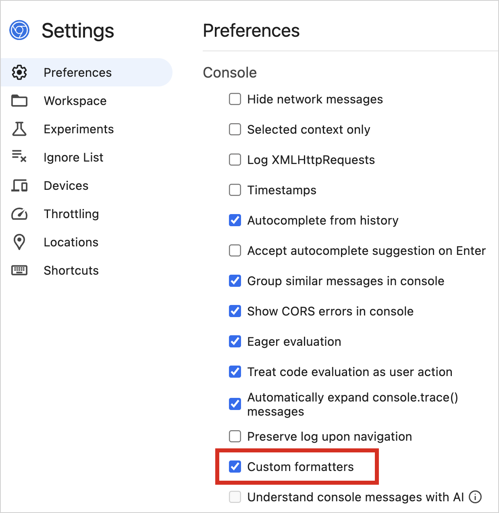
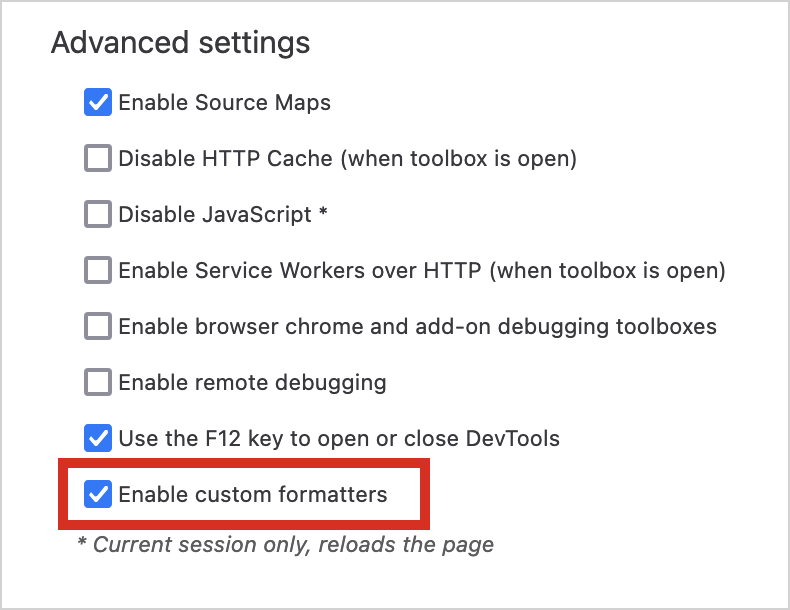

+++
title = "13.6.3.1 Kotlin 2.1.20 的新变化"
date = 2026-09-13T08:50:47+08:00
weight = 1
type = "docs"
description = ""
isCJKLanguage = true
draft = false
+++


> 原文链接: [https://kotlinlang.org/docs/whatsnew2120.html](https://kotlinlang.org/docs/whatsnew2120.html)

# 13.6.3.1 Kotlin 2.1.20 的新变化

阅读 Kotlin 2.1.20 的发行说明，涵盖新的语言特性、Kotlin Multiplatform、JVM、Native、JS 和 Wasm 的更新，以及对 Gradle 和 Maven 构建工具的支持。

_[发布日期：2025 年 3 月 20 日](../../../13.5-Releases/#release-history)_

Kotlin 2.1.20 发布了！以下是主要亮点：

* **K2 编译器更新**：[新的 kapt 和 Lombok 插件的更新](#kotlin-k2-compiler)
* **Kotlin Multiplatform**：[用于取代 Gradle Application 插件的新 DSL](#kotlin-multiplatform-new-dsl-to-replace-gradle-s-application-plugin)
* **Kotlin/Native**：[支持 Xcode 16.3 以及新的内联优化](#kotlin-native)
* **Kotlin/Wasm**：[默认自定义格式化器、DWARF 支持以及迁移到 Provider API](#kotlin-wasm)
* **Gradle 支持**：[兼容 Gradle 的隔离项目和自定义发布变体](#gradle)
* **标准库**：[通用原子类型、改进的 UUID 支持和新的时间跟踪功能](#standard-library)
* **Compose 编译器**：[放宽对 `@Composable` 函数的限制及其他更新](#compose-compiler)
* **文档**：[Kotlin 文档的重要改进](#documentation-updates)

> **提示：** 关于 Kotlin 发布周期的信息，请参阅 [Kotlin 发布流程](../../../13.5-Releases/)。

## IDE 支持 {#ide-support}

支持 2.1.20 的 Kotlin 插件已捆绑在最新的 IntelliJ IDEA 和 Android Studio 中。你无需更新 IDE 中的 Kotlin 插件，只需在构建脚本中把 Kotlin 版本改为 2.1.20。

详情请参阅[更新到新版本](../../../13.5-Releases/#update-to-a-new-kotlin-version)。

### 为支持 OSGi 的项目下载 Kotlin 产物源码 {#download-sources-for-kotlin-artifacts-in-projects-with-osgi-support}

`kotlin-osgi-bundle` 库所有依赖的源码现在都包含在其发行版中。这让 IntelliJ IDEA 可以下载这些源码，从而为 Kotlin 符号提供文档并改善调试体验。

## Kotlin K2 编译器 {#kotlin-k2-compiler}

我们正在继续改进新 Kotlin K2 编译器的插件支持。本次发布带来了新的 kapt 和 Lombok 插件的更新。

### 新的默认 kapt 插件 {#new-default-kapt-plugin}
**Beta**

从 Kotlin 2.1.20 开始，kapt 编译器插件的 K2 实现默认对所有项目启用。

早在 Kotlin 1.9.20 中，JetBrains 团队就随 K2 编译器推出了 kapt 插件的新实现。此后，我们进一步开发了 K2 kapt 的内部实现，使其行为与 K1 版本类似，同时显著提升了性能。

如果你在 K2 编译器上使用 kapt 时遇到任何问题，可以临时回退到之前的插件实现。

为此，请在项目的 `gradle.properties` 文件中添加以下选项：

```kotlin
kapt.use.k2=false
```

请把任何问题报告到我们的[问题跟踪器](https://youtrack.jetbrains.com/issue/KT-71439/K2-kapt-feedback)。

### Lombok 编译器插件：支持 `@SuperBuilder` 以及 `@Builder` 的更新 {#lombok-compiler-plugin-support-for-superbuilder-and-updates-on-builder}
**实验性 - 通用**

[Kotlin Lombok 编译器插件](../../../../compilerandplugins/12.2-Kotlincompilerplugins/12.2.4-Lombok/)现在支持 `@SuperBuilder` 注解，让为类层次结构创建构建器更容易。此前，在 Kotlin 中使用 Lombok 的开发者面对继承时必须手动定义构建器。使用 `@SuperBuilder` 时，构建器会自动继承父类字段，让你可以在构造对象时初始化它们。

此外，本次更新还包含若干改进和缺陷修复：

* `@Builder` 注解现在可用于构造器，从而实现更灵活的对象创建。更多细节请参阅相应的 [YouTrack 议题](https://youtrack.jetbrains.com/issue/KT-71547)。
* Kotlin 中与 Lombok 代码生成相关的若干问题已得到解决，整体兼容性得到改善。更多细节请参阅 [GitHub 更新日志](https://github.com/JetBrains/kotlin/releases/tag/v2.1.20)。

关于 `@SuperBuilder` 注解的更多信息，请参阅官方 [Lombok 文档](https://projectlombok.org/features/experimental/SuperBuilder)。

## Kotlin Multiplatform：用于取代 Gradle Application 插件的新 DSL {#kotlin-multiplatform-new-dsl-to-replace-gradle-s-application-plugin}
**实验性**

从 Gradle 8.7 开始，[Application](https://docs.gradle.org/current/userguide/application_plugin.html) 插件不再与 Kotlin Multiplatform Gradle 插件兼容。Kotlin 2.1.20 引入了实验性 DSL 来实现类似功能。新的 `executable {}` 块为 JVM 目标配置执行任务和 Gradle [分发](https://docs.gradle.org/current/userguide/distribution_plugin.html#distribution_plugin)。

在构建脚本中的 `executable {}` 块之前，请添加以下 `@OptIn` 注解：

```kotlin
@OptIn(ExperimentalKotlinGradlePluginApi::class)
```

例如：

```kotlin
kotlin {
    jvm {
        @OptIn(ExperimentalKotlinGradlePluginApi::class)
        binaries {
            // 为该目标中 "main" 编译配置一个名为 "runJvm" 的 JavaExec 任务和一个 Gradle 分发
            executable {
                mainClass.set("foo.MainKt")
            }

            // 为 "main" 编译配置一个名为 "runJvmAnother" 的 JavaExec 任务和一个 Gradle 分发
            executable(KotlinCompilation.MAIN_COMPILATION_NAME, "another") {
                // 设置一个不同的类
                mainClass.set("foo.MainAnotherKt")
            }

            // 为 "test" 编译配置一个名为 "runJvmTest" 的 JavaExec 任务和一个 Gradle 分发
            executable(KotlinCompilation.TEST_COMPILATION_NAME) {
                mainClass.set("foo.MainTestKt")
            }

            // 为 "test" 编译配置一个名为 "runJvmTestAnother" 的 JavaExec 任务和一个 Gradle 分发
            executable(KotlinCompilation.TEST_COMPILATION_NAME, "another") {
                mainClass.set("foo.MainAnotherTestKt")
            }
        }
    }
}
```

在这个例子中，Gradle 的 [Distribution](https://docs.gradle.org/current/userguide/distribution_plugin.html#distribution_plugin) 插件会在第一个 `executable {}` 块上应用。

如果你遇到任何问题，请在我们的[问题跟踪器](https://kotl.in/issue)中报告，或在我们的[公开 Slack 频道](https://kotlinlang.slack.com/archives/C19FD9681)中告诉我们。

## Kotlin/Native {#kotlin-native}

### 支持 Xcode 16.3 {#support-for-xcode-16-3}

从 Kotlin **2.1.21** 开始，Kotlin/Native 编译器支持 Xcode 16.3 —— 最新的稳定版 Xcode。你可以放心更新 Xcode，继续开发面向 Apple 操作系统的 Kotlin 项目。

2.1.21 版本还修复了相关的 [cinterop 问题](https://youtrack.jetbrains.com/issue/KT-75781/)，该问题曾导致 Kotlin Multiplatform 项目编译失败。

### 新的内联优化 {#new-inlining-optimization}
**实验性**

Kotlin 2.1.20 引入了新的内联优化阶段，它位于实际代码生成阶段之前。

Kotlin/Native 编译器中新的内联阶段应当比标准的 LLVM 内联器表现更好，并改善生成代码的运行时性能。

新的内联阶段目前是[实验性](../../../13.4-ComponentsStability/#stability-levels-explained)的。要试用它，请使用以下编译器选项：

```none
-Xbinary=preCodegenInlineThreshold=40
```

我们的实验表明，把阈值设为 40 个 token（编译器解析的代码单元）是编译优化的合理折中。根据我们的基准测试，它带来了 9.5% 的整体性能提升。当然，你也可以尝试其他取值。

如果你遇到二进制文件体积增大或编译时间增加的情况，请通过 [YouTrack](https://kotl.in/issue) 报告这些问题。

## Kotlin/Wasm {#kotlin-wasm}

本次发布改进了 Kotlin/Wasm 的调试和属性使用。自定义格式化器现在在开发构建中开箱即用，而 DWARF 调试有助于代码检查。此外，Provider API 简化了 Kotlin/Wasm 和 Kotlin/JS 中属性的使用。

### 默认启用自定义格式化器 {#custom-formatters-enabled-by-default}

此前，处理 Kotlin/Wasm 代码时，你必须[手动配置](../13.6.3.2-Whatsnew21/#improved-debugging-experience-for-kotlin-wasm)自定义格式化器，以改善 Web 浏览器中的调试体验。

在本次发布中，自定义格式化器在开发构建中默认启用，因此你不需要额外的 Gradle 配置。

要使用该特性，你只需确保浏览器的开发者工具中启用了自定义格式化器：

* 在 Chrome DevTools 中，在 **Settings | Preferences | Console** 中找到自定义格式化器复选框：



* 在 Firefox DevTools 中，在 **Settings | Advanced settings** 中找到自定义格式化器复选框：



这一变更主要影响 Kotlin/Wasm 开发构建。如果你对生产构建有特定要求，需要相应调整 Gradle 配置。为此，请在 `wasmJs {}` 块中添加以下编译器选项：

```kotlin
// build.gradle.kts
kotlin {
    wasmJs {
        // ...

        compilerOptions {
            freeCompilerArgs.add("-Xwasm-debugger-custom-formatters")
        }
    }
}
```

### 支持用 DWARF 调试 Kotlin/Wasm 代码 {#support-for-dwarf-to-debug-kotlin-wasm-code}

Kotlin 2.1.20 在 Kotlin/Wasm 中引入了对 DWARF（使用任意记录格式进行调试）的支持。

有了这一变更，Kotlin/Wasm 编译器能够把 DWARF 数据嵌入生成的 WebAssembly（Wasm）二进制文件中。许多调试器和虚拟机可以读取这些数据，从而洞察已编译的代码。

DWARF 主要用于在独立的 Wasm 虚拟机（VM）中调试 Kotlin/Wasm 应用。要使用该特性，Wasm VM 和调试器必须支持 DWARF。

有了 DWARF 支持，你可以单步执行 Kotlin/Wasm 应用、检查变量并洞察代码。要启用该特性，请使用以下编译器选项：

```bash
-Xwasm-generate-dwarf
```
### Kotlin/Wasm 与 Kotlin/JS 属性迁移到 Provider API {#migration-to-provider-api-for-kotlin-wasm-and-kotlin-js-properties}

此前，Kotlin/Wasm 和 Kotlin/JS 扩展中的属性是可变的（`var`），并在构建脚本中直接赋值：

```kotlin
the<NodeJsExtension>().version = "2.0.0"
```

现在，属性通过 [Provider API](https://docs.gradle.org/current/userguide/properties_providers.html) 暴露，你必须使用 `.set()` 函数赋值：

```kotlin
the<NodeJsEnvSpec>().version.set("2.0.0")
```

Provider API 确保值是惰性计算的，并与任务依赖正确集成，从而改善构建性能。

有了这一变更，直接属性赋值已被弃用，应改用 `*EnvSpec` 类，例如 `NodeJsEnvSpec` 和 `YarnRootEnvSpec`。

此外，为避免混淆，若干别名任务已被移除：

| 已弃用的任务        | 替代项                                                     |

| `wasmJsRun`            | `wasmJsBrowserDevelopmentRun`                                   |
| `wasmJsBrowserRun`     | `wasmJsBrowserDevelopmentRun`                                   |
| `wasmJsNodeRun`        | `wasmJsNodeDevelopmentRun`                                      |
| `wasmJsBrowserWebpack` | `wasmJsBrowserProductionWebpack` 或 `wasmJsBrowserDistribution` |
| `jsRun`                | `jsBrowserDevelopmentRun`                                       |
| `jsBrowserRun`         | `jsBrowserDevelopmentRun`                                       |
| `jsNodeRun`            | `jsNodeDevelopmentRun`                                          |
| `jsBrowserWebpack`     | `jsBrowserProductionWebpack` 或 `jsBrowserDistribution`         |

如果你只在构建脚本中使用 Kotlin/JS 或 Kotlin/Wasm，则无需采取任何操作，因为 Gradle 会自动处理赋值。

不过，如果你维护基于 Kotlin Gradle 插件的插件，并且你的插件没有应用 `kotlin-dsl`，则必须把属性赋值更新为使用 `.set()` 函数。

## Gradle {#gradle}

Kotlin 2.1.20 与 Gradle 7.6.3 到 8.11 完全兼容。你也可以使用最高到最新版本的 Gradle。不过请注意，这样做可能会产生弃用警告，并且某些新的 Gradle 特性可能无法工作。

这个 Kotlin 版本包含 Kotlin Gradle 插件与 Gradle 隔离项目的兼容性，以及对自定义 Gradle 发布变体的支持。

### Kotlin Gradle 插件兼容 Gradle 的隔离项目 {#kotlin-gradle-plugins-compatible-with-gradle-s-isolated-projects}
**实验性**

> **警告：** 该特性目前在 Gradle 中处于 pre-Alpha 状态。目前不支持 JS 和 Wasm 目标。请仅与 Gradle 8.10 或更高版本一起使用，并且仅用于评估目的。

自 Kotlin 2.1.0 起，你就可以在项目中[预览 Gradle 的隔离项目特性](../13.6.3.2-Whatsnew21/#preview-gradle-s-isolated-projects-in-kotlin-multiplatform)。

此前，你必须先配置 Kotlin Gradle 插件，使项目兼容隔离项目特性，然后才能试用它。在 Kotlin 2.1.20 中，不再需要这一步。

现在，要启用隔离项目特性，你只需[设置系统属性](https://docs.gradle.org/current/userguide/isolated_projects.html#how_do_i_use_it)。

Kotlin Gradle 插件在多平台项目以及只包含 JVM 或 Android 目标的项目中支持 Gradle 的隔离项目特性。

特别是对于多平台项目，如果升级后你发现 Gradle 构建有问题，可以通过添加以下内容来退出新的 Kotlin Gradle 插件行为：

```none
kotlin.kmp.isolated-projects.support=disable
```

不过，如果你在多平台项目中使用这个 Gradle 属性，就无法使用隔离项目特性。

请在 [YouTrack](https://youtrack.jetbrains.com/issue/KT-57279/Support-Gradle-Project-Isolation-Feature-for-Kotlin-Multiplatform) 中告诉我们你对该特性的体验。

### 支持添加自定义 Gradle 发布变体 {#support-for-adding-custom-gradle-publication-variants}
**实验性**

Kotlin 2.1.20 引入了对添加自定义 [Gradle 发布变体](https://docs.gradle.org/current/userguide/variant_attributes.html)的支持。该特性适用于多平台项目和面向 JVM 的项目。

> **注意：** 你无法通过该特性修改现有的 Gradle 变体。

该特性是[实验性](../../../13.4-ComponentsStability/#stability-levels-explained)的。要选择启用，请使用 `@OptIn(ExperimentalKotlinGradlePluginApi::class)` 注解。

要添加自定义 Gradle 发布变体，请调用 `adhocSoftwareComponent()` 函数，它返回一个 [`AdhocComponentWithVariants`](https://docs.gradle.org/current/javadoc/org/gradle/api/component/AdhocComponentWithVariants.html) 实例，你可以在 Kotlin DSL 中配置它：

```kotlin
plugins {
    // 仅支持 JVM 和 Multiplatform
    kotlin("jvm")
    // 或者
    kotlin("multiplatform")
}

kotlin {
    @OptIn(ExperimentalKotlinGradlePluginApi::class)
    publishing {
        // 返回一个 AdhocSoftwareComponent 实例
        adhocSoftwareComponent()
        // 你也可以在 DSL 块中按如下方式配置 AdhocSoftwareComponent
        adhocSoftwareComponent {
            // 在这里使用 AdhocSoftwareComponent API 添加自定义变体
        }
    }
}
```

> **提示：** 关于变体的更多信息，请参阅 Gradle 的[自定义发布指南](https://docs.gradle.org/current/userguide/publishing_customization.html)。

## 标准库 {#standard-library}

本次发布为标准库带来了新的实验性特性：通用原子类型、对 UUID 的改进支持，以及新的时间跟踪功能。

### 通用原子类型 {#common-atomic-types}
**实验性**

在 Kotlin 2.1.20 中，我们在标准库的 `kotlin.concurrent.atomics` 包中引入通用原子类型，从而支持共享的、与平台无关的线程安全操作代码。这通过消除在多个源集之间重复依赖原子的逻辑，简化了 Kotlin Multiplatform 项目的开发。

`kotlin.concurrent.atomics` 包及其属性是[实验性](../../../13.4-ComponentsStability/#stability-levels-explained)的。要选择启用，请使用 `@OptIn(ExperimentalAtomicApi::class)` 注解或编译器选项 `-opt-in=kotlin.ExperimentalAtomicApi`。

下面是一个示例，展示如何使用 `AtomicInt` 在多个线程之间安全地统计已处理的项目数：

```kotlin
// 导入必要的库
import kotlin.concurrent.atomics.*
import kotlinx.coroutines.*

@OptIn(ExperimentalAtomicApi::class)
suspend fun main() {
    // 初始化用于统计已处理项目的原子计数器
    var processedItems = AtomicInt(0)
    val totalItems = 100
    val items = List(totalItems) { "item$it" }
    // 把项目分成块，由多个协程处理
    val chunkSize = 20
    val itemChunks = items.chunked(chunkSize)
    coroutineScope {
        for (chunk in itemChunks) {
            launch {
                for (item in chunk) {
                    println("Processing $item in thread ${Thread.currentThread()}")
                    processedItems += 1 // 以原子方式递增计数器
                }
            }
         }
    }
    // 打印已处理项目的总数
    println("Total processed items: ${processedItems.load()}")
}
```

为了实现 Kotlin 原子类型与 Java 的 [`java.util.concurrent.atomic`](https://docs.oracle.com/javase/8/docs/api/java/util/concurrent/atomic/package-summary.html) 原子类型之间的无缝互操作，该 API 提供了 `.asJavaAtomic()` 和 `.asKotlinAtomic()` 扩展函数。在 JVM 上，Kotlin 原子类型和 Java 原子类型在运行时是相同的类型，因此你可以在没有任何开销的情况下把 Java 原子类型转换为 Kotlin 原子类型，反之亦然。

下面是一个示例，展示 Kotlin 与 Java 原子类型如何协同工作：

```kotlin
// 导入必要的库
import kotlin.concurrent.atomics.*
import java.util.concurrent.atomic.*

@OptIn(ExperimentalAtomicApi::class)
fun main() {
    // 把 Kotlin 的 AtomicInt 转换为 Java 的 AtomicInteger
    val kotlinAtomic = AtomicInt(42)
    val javaAtomic: AtomicInteger = kotlinAtomic.asJavaAtomic()
    println("Java atomic value: ${javaAtomic.get()}")
    // Java 原子值：42

    // 把 Java 的 AtomicInteger 转换回 Kotlin 的 AtomicInt
    val kotlinAgain: AtomicInt = javaAtomic.asKotlinAtomic()
    println("Kotlin atomic value: ${kotlinAgain.load()}")
    // Kotlin 原子值：42
}
```

### UUID 解析、格式化和可比较性的变化 {#changes-in-uuid-parsing-formatting-and-comparability}
**实验性**

JetBrains 团队继续改进[在 2.0.20 中引入标准库的](../../13.6.4-Kotlin20x/13.6.4.1-Whatsnew2020/#support-for-uuids-in-the-common-kotlin-standard-library) UUID 支持。

此前，`parse()` 函数只接受十六进制加连字符格式的 UUID。在 Kotlin 2.1.20 中，`parse()` 既可用于十六进制加连字符格式，_也_可用于纯十六进制（不带连字符）格式。

在本次发布中，我们还引入了专门用于十六进制加连字符格式操作的函数：

* `parseHexDash()` 从十六进制加连字符格式解析 UUID。
* `toHexDashString()` 把 `Uuid` 转换为十六进制加连字符格式的 `String`（功能与 `toString()` 相同）。

这些函数的工作方式类似于此前为十六进制格式引入的 [`parseHex()`](https://kotlinlang.org/api/core/kotlin-stdlib/kotlin.uuid/-uuid/-companion/parse-hex.html) 和 [`toHexString()`](https://kotlinlang.org/api/core/kotlin-stdlib/kotlin.uuid/-uuid/to-hex-string.html)。为解析和格式化功能提供明确的命名，应该能提升代码清晰度和你使用 UUID 的整体体验。

Kotlin 中的 UUID 现在实现了 `Comparable`。从 Kotlin 2.1.20 开始，你可以直接比较和排序 `Uuid` 类型的值。这让你可以使用 `<` 和 `>` 运算符，以及专为 `Comparable` 类型或其集合提供的标准库扩展（例如 `sorted()`），还允许把 UUID 传给任何要求 `Comparable` 接口的函数或 API。

请记住，标准库中的 UUID 支持仍处于[实验性](../../../13.4-ComponentsStability/#stability-levels-explained)阶段。要选择启用，请使用 `@OptIn(ExperimentalUuidApi::class)` 注解或编译器选项 `-opt-in=kotlin.uuid.ExperimentalUuidApi`：

```kotlin
import kotlin.uuid.ExperimentalUuidApi
import kotlin.uuid.Uuid

@OptIn(ExperimentalUuidApi::class)
fun main() {
    // parse() 接受纯十六进制格式的 UUID
    val uuid = Uuid.parse("550e8400e29b41d4a716446655440000")

    // 把它转换为十六进制加连字符格式
    val hexDashFormat = uuid.toHexDashString()

    // 以十六进制加连字符格式输出该 UUID
    println(hexDashFormat)

    // 按升序输出这些 UUID
    println(
        listOf(
            uuid,
            Uuid.parse("780e8400e29b41d4a716446655440005"),
            Uuid.parse("5ab88400e29b41d4a716446655440076")
        ).sorted()
    )
   }
```

### 新的时间跟踪功能 {#new-time-tracking-functionality}
**实验性**

从 Kotlin 2.1.20 开始，标准库提供了表示某个时间点的能力。该功能此前只在官方 Kotlin 库 [`kotlinx-datetime`](https://kotlinlang.org/api/kotlinx-datetime/) 中可用。

`kotlinx.datetime.Clock` 接口作为 [`kotlin.time.Clock`](https://kotlinlang.org/api/core/2.1/kotlin-stdlib/kotlin.time/-clock/) 引入标准库，`kotlinx.datetime.Instant` 类作为 [`kotlin.time.Instant`](https://kotlinlang.org/api/core/2.1/kotlin-stdlib/kotlin.time/-instant/) 引入。这些概念与标准库中的 `time` 包天然契合，因为它们只关心时间点，而更复杂的日历与时区功能仍留在 `kotlinx-datetime` 中。

当你需要在不考虑时区或日期的情况下精确跟踪时间时，`Instant` 和 `Clock` 很有用。例如，你可以用它们记录带时间戳的事件、测量两个时间点之间的时长，以及获取系统进程的当前时刻。

为提供与其他语言的互操作，还提供了额外的转换函数：

* [`.toKotlinInstant()`](https://kotlinlang.org/api/core/2.1/kotlin-stdlib/kotlin.time/to-kotlin-instant.html) 把时间值转换为 `kotlin.time.Instant` 实例。
* [`.toJavaInstant()`](https://kotlinlang.org/api/core/2.1/kotlin-stdlib/kotlin.time/to-java-instant.html) 把 `kotlin.time.Instant` 值转换为 `java.time.Instant` 值。
* [`Instant.toJSDate()`](https://kotlinlang.org/api/core/2.1/kotlin-stdlib/kotlin.time/to-j-s-date.html) 把 `kotlin.time.Instant` 值转换为 JS `Date` 类的实例。该转换并不精确；JS 用毫秒精度表示日期，而 Kotlin 允许纳秒级精度。

标准库新的时间特性仍处于[实验性](../../../13.4-ComponentsStability/#stability-levels-explained)阶段。要选择启用，请使用 `@OptIn(ExperimentalTime::class)` 注解：

```kotlin
import kotlin.time.*

@OptIn(ExperimentalTime::class)
fun main() {

    // 获取当前时刻
    val currentInstant = Clock.System.now()
    println("Current time: $currentInstant")

    // 求两个时间点之间的差值
    val pastInstant = Instant.parse("2023-01-01T00:00:00Z")
    val duration = currentInstant - pastInstant

    println("Time elapsed since 2023-01-01: $duration")
}
```

关于其实现的更多信息，请参阅这个 [KEEP 提案](https://github.com/Kotlin/KEEP/pull/387/files)。

## Compose 编译器 {#compose-compiler}

在 2.1.20 中，Compose 编译器放宽了此前版本中对 `@Composable` 函数的一些限制。此外，Compose 编译器 Gradle 插件默认包含源信息，使所有平台的行为与 Android 保持一致。

### 支持开放 `@Composable` 函数中带默认值的参数 {#support-for-parameters-with-default-values-in-open-composable-functions}

由于编译器输出不正确会导致运行时崩溃，编译器此前限制了开放 `@Composable` 函数中带默认值的参数。底层问题现已解决，在使用 Kotlin 2.1.20 或更高版本时，带默认值的参数得到完全支持。

在 [1.5.8 版本](https://developer.android.com/jetpack/androidx/releases/compose-compiler#1.5.8)之前，Compose 编译器允许开放函数中带默认值的参数，因此该支持取决于项目配置：

* 如果开放 composable 函数使用 Kotlin 2.1.20 或更高版本编译，编译器会为带默认值的参数生成正确的包装器。这包括与 1.5.8 之前二进制文件兼容的包装器，意味着下游库也能使用这个开放函数。
* 如果该开放 composable 函数使用早于 2.1.20 的 Kotlin 编译，Compose 会使用兼容模式，这可能导致运行时崩溃。使用兼容模式时，编译器会发出警告以提示潜在问题。

### 允许 final 覆盖函数可重启 {#final-overridden-functions-are-allowed-to-be-restartable}

虚函数（`open` 和 `abstract` 的覆盖，包括接口）在 [2.1.0 版本中被强制为不可重启](../13.6.3.2-Whatsnew21/#changes-to-open-and-overridden-composable-functions)。这一限制现在对 final 类的成员或本身是 `final` 的函数放宽了 —— 它们会像往常一样重启或跳过。

升级到 Kotlin 2.1.20 后，你可能会观察到相关函数的一些行为变化。要从之前的版本强制使用不可重启逻辑，请对该函数应用 `@NonRestartableComposable` 注解。

### `ComposableSingletons` 已从公共 API 中移除 {#composablesingletons-removed-from-public-api}

`ComposableSingletons` 是 Compose 编译器在优化 `@Composable` lambda 时创建的类。不捕获任何参数的 lambda 会被分配一次并缓存在该类的属性中，从而在运行时节省分配。该类以 internal 可见性生成，只用于优化编译单元（通常是文件）内部的 lambda。

不过，这一优化也被应用到了 `inline` 函数体中，导致单例 lambda 实例泄漏到公共 API 中。为修复该问题，从 2.1.20 开始，`@Composable` lambda 不再在 inline 函数内部被优化为单例。同时，为支持在先前模型下编译的模块的二进制兼容性，Compose 编译器会继续为 inline 函数生成单例类和 lambda。

### 默认包含源信息 {#source-information-included-by-default}

Compose 编译器 Gradle 插件的[包含源信息](https://kotlinlang.org/api/kotlin-gradle-plugin/compose-compiler-gradle-plugin/org.jetbrains.kotlin.compose.compiler.gradle/-compose-compiler-gradle-plugin-extension/include-source-information.html)特性在 Android 上已默认启用。从 Kotlin 2.1.20 开始，该特性将在所有平台上默认启用。

请记得检查你是否通过 `freeCompilerArgs` 设置了该选项。与插件一起使用时，这种方式可能导致构建失败，因为该选项实际上会被设置两次。

## 破坏性变更与弃用 {#breaking-changes-and-deprecations}

* 为使 Kotlin Multiplatform 与 Gradle 即将到来的变更保持一致，我们正在逐步淘汰 `withJava()` 函数。[Java 源集现在默认创建](https://kotlinlang.org/docs/multiplatform/multiplatform-compatibility-guide.html#java-source-sets-created-by-default)。如果你使用 [Java test fixtures](https://docs.gradle.org/current/userguide/java_testing.html#sec:java_test_fixtures) Gradle 插件，请直接升级到 [Kotlin 2.1.21](../../../13.5-Releases/#release-history) 以避免兼容性问题。
* JetBrains 团队正在推进 `kotlin-android-extensions` 插件的弃用。如果你在项目中尝试使用它，现在会得到配置错误，并且不会执行任何插件代码。
* 旧的 `kotlin.incremental.classpath.snapshot.enabled` 属性已从 Kotlin Gradle 插件中移除。该属性此前提供了在 JVM 上回退到内置 ABI 快照的机会。插件现在使用其他方法来检测和避免不必要的重新编译，因此该属性已过时。

## 文档更新 {#documentation-updates}

Kotlin 文档有一些值得注意的变化：

### 改版和新页面 {#revamped-and-new-pages}

* [Kotlin 路线图](../../../13.1-Roadmap/) —— 查看 Kotlin 在语言和生态系统演进方面优先事项的更新列表。
* [Gradle 最佳实践](../../../../buildtools/11.1-Gradle/11.1.4-GradleBestPractices/)页面 —— 了解优化 Gradle 构建并提升性能的关键最佳实践。
* [Compose Multiplatform 与 Jetpack Compose](https://kotlinlang.org/docs/multiplatform/compose-multiplatform-and-jetpack-compose.html) —— 概述这两个 UI 框架之间的关系。
* [Kotlin Multiplatform 与 Flutter](https://kotlinlang.org/docs/multiplatform/kotlin-multiplatform-flutter.html) —— 查看两个流行跨平台框架的对比。
* [与 C 互操作](../../../../interoperability/7.3-Swiftobjectivecandcinterop/7.3.3-Cinterop/7.3.3.1-NativeCInterop/) —— 探索 Kotlin 与 C 互操作的细节。
* [数值](../../../../languageguide/5.4-Types/5.4.2-Numbers/) —— 了解用于表示数值的不同 Kotlin 类型。

### 新增和更新的教程 {#new-and-updated-tutorials}

* [把你的库发布到 Maven Central](https://kotlinlang.org/docs/multiplatform/multiplatform-publish-libraries.html) —— 了解如何把 KMP 库产物发布到最流行的 Maven 仓库。
* [把 Kotlin/Native 作为动态库](../../../../interoperability/7.3-Swiftobjectivecandcinterop/7.3.3-Cinterop/7.3.3.3-NativeDynamicLibraries/) —— 创建一个动态 Kotlin 库。
* [把 Kotlin/Native 作为 Apple framework](../../../../interoperability/7.3-Swiftobjectivecandcinterop/7.3.1-Swiftobjectivecinterop/7.3.1.2-AppleFramework/) —— 创建你自己的 framework，并在 macOS 和 iOS 上的 Swift/Objective-C 应用中使用 Kotlin/Native 代码。

## 如何更新到 Kotlin 2.1.20 {#how-to-update-to-kotlin-2-1-20}

从 IntelliJ IDEA 2023.3 和 Android Studio Iguana（2023.2.1）Canary 15 开始，Kotlin 插件作为捆绑插件随 IDE 一起分发。这意味着你不能再从 JetBrains Marketplace 安装该插件。

要更新到新的 Kotlin 版本，请在构建脚本中[把 Kotlin 版本](../../../13.5-Releases/#update-to-a-new-kotlin-version)改为 2.1.20。
