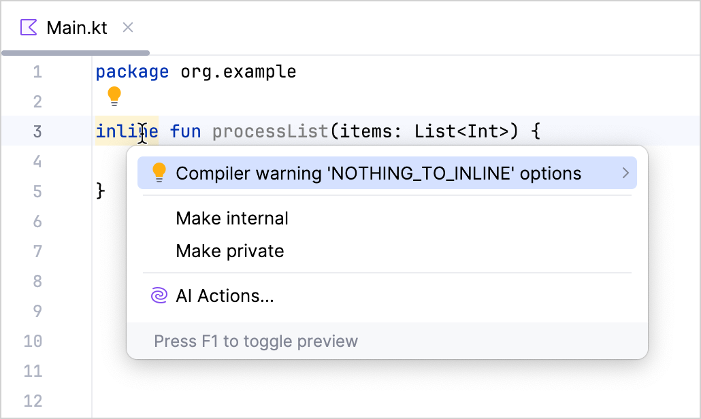
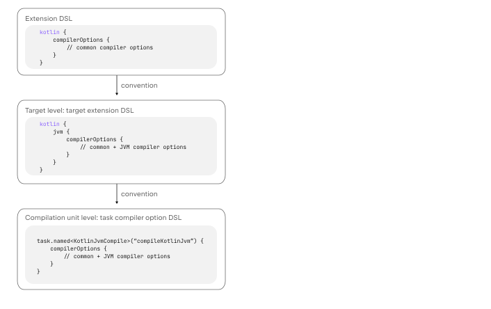
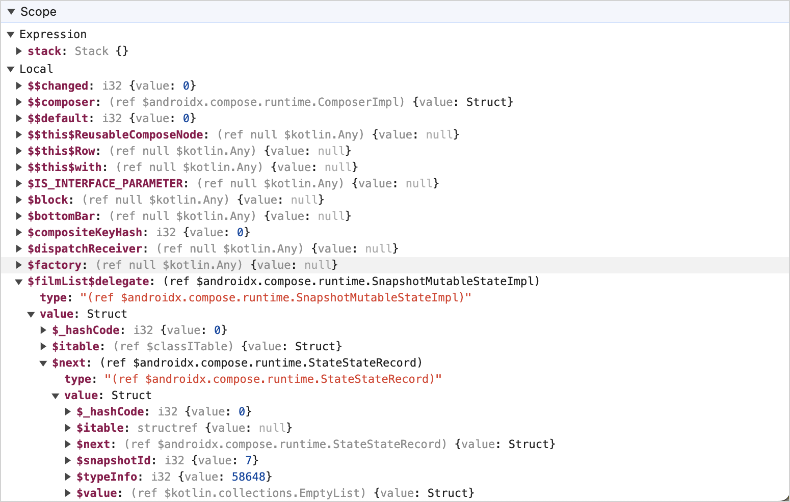
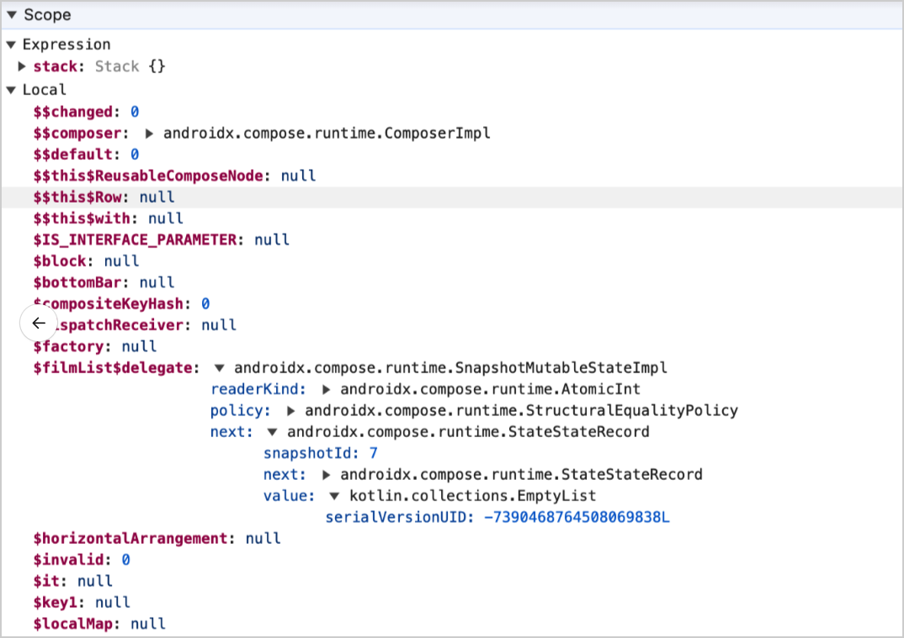

+++
title = "13.6.3.2 Kotlin 2.1.0 新变化"
date = 2026-09-13T08:50:47+08:00
weight = 2
type = "docs"
description = ""
isCJKLanguage = true
draft = false
+++


> 原文链接: [https://kotlinlang.org/docs/whatsnew21.html](https://kotlinlang.org/docs/whatsnew21.html)

# 13.6.3.2 Kotlin 2.1.0 新变化

阅读 Kotlin 2.1.0 发行说明，了解新的语言特性，以及 Kotlin Multiplatform、JVM、Native、JS、Wasm 的更新和 Gradle、Maven 的构建工具支持。

_[发布时间：2024 年 11 月 27 日](../../../13.5-Releases/#release-history)_

Kotlin 2.1.0 已经发布！以下是主要亮点：

* **预览中的新语言特性**：[带主语的 `when` 中的守卫条件](#guard-conditions-in-when-with-a-subject)、[非局部 `break` 和 `continue`](#non-local-break-and-continue)，以及[多美元字符串插值](#multi-dollar-string-interpolation)。
* **K2 编译器更新**：[编译器检查更加灵活](#extra-compiler-checks)，以及[改进的 kapt 实现](#improved-k2-kapt-implementation)。
* **Kotlin Multiplatform**：引入了[对 Swift 导出的基本支持](#basic-support-for-swift-export)、[用于编译器选项的稳定 Gradle DSL](#new-gradle-dsl-for-compiler-options-in-multiplatform-projects-promoted-to-stable)等。
* **Kotlin/Native**：[改进对 `iosArm64` 的支持](#iosarm64-promoted-to-tier-1)以及其他更新。
* **Kotlin/Wasm**：多项更新，包括[对增量编译的支持](#support-for-incremental-compilation)。
* **Gradle 支持**：[改进与新版 Gradle 和 Android Gradle 插件的兼容性](#gradle-improvements)，以及 [Kotlin Gradle 插件 API 的更新](#new-api-for-kotlin-gradle-plugin-extensions)。
* **文档**：[Kotlin 文档的重大改进](#documentation-updates)。

> **提示：** 有关 Kotlin 发布周期的信息，请参见 [Kotlin 发布流程](../../../13.5-Releases/)。

## IDE 支持 {#ide-support}

支持 2.1.0 的 Kotlin 插件已捆绑在最新的 IntelliJ IDEA 和 Android Studio 中。你无需在 IDE 中更新 Kotlin 插件。你需要做的只是在构建脚本中把 Kotlin 版本改为 2.1.0。

详情请参见[更新到新的 Kotlin 版本](../../../13.5-Releases/#update-to-a-new-kotlin-version)。

## 语言 {#language}

在发布带 K2 编译器的 Kotlin 2.0.0 之后，JetBrains 团队专注于用新特性改进语言。在此版本中，我们很高兴地宣布若干新的语言设计改进。

这些特性以预览形式提供，我们鼓励你试用它们并分享反馈：

* [带主语的 `when` 中的守卫条件](#guard-conditions-in-when-with-a-subject)
* [非局部 `break` 和 `continue`](#non-local-break-and-continue)
* [多美元插值：改进字符串字面量中 `$` 的处理](#multi-dollar-string-interpolation)

> **提示：** 所有特性都在启用了 K2 模式的 IntelliJ IDEA 2024.3 最新版本中有 IDE 支持。请在 [IntelliJ IDEA 2024.3 博客文章](https://blog.jetbrains.com/idea/2024/11/intellij-idea-2024-3/)中了解更多。

[查看 Kotlin 语言设计特性与提案的完整列表](../../../13.2-KotlinLanguageFeaturesAndProposals/)。

此版本还带来以下语言更新：

* [要求选择启用才能扩展 API](#support-for-requiring-opt-in-to-extend-apis)
* [改进带泛型类型的函数的重载解析](#improved-overload-resolution-for-functions-with-generic-types)
* [改进带密封类的 when 表达式的穷尽性检查](#improved-exhaustiveness-checks-for-when-expressions-with-sealed-classes)

### 带主语的 when 中的守卫条件 {#guard-conditions-in-when-with-a-subject}

> **警告：** 该特性处于[预览](../../../13.3-KotlinEvolutionPrinciples/#pre-stable-features)阶段，需要选择启用（详见下文）。我们欢迎你在 [YouTrack](https://youtrack.jetbrains.com/issue/KT-71140) 中提供反馈。

从 2.1.0 开始，你可以在带主语的 `when` 表达式或语句中使用守卫条件。

守卫条件允许你为 `when` 表达式的分支包含多个条件，使复杂的控制流更明确、更简洁，并让代码结构更扁平。

要在分支中包含守卫条件，请把它放在主条件之后，用 `if` 分隔：

```kotlin
sealed interface Animal {
    data class Cat(val mouseHunter: Boolean) : Animal {
        fun feedCat() {}
    }

    data class Dog(val breed: String) : Animal {
        fun feedDog() {}
    }
}

fun feedAnimal(animal: Animal) {
    when (animal) {
        // 只有主条件的分支。当 `animal` 是 `Dog` 时调用 `feedDog()`
        is Animal.Dog -> animal.feedDog()
        // 同时包含主条件和守卫条件的分支。当 `animal` 是 `Cat` 且不是 `mouseHunter` 时调用 `feedCat()`
        is Animal.Cat if !animal.mouseHunter -> animal.feedCat()
        // 如果以上条件都不匹配，则打印 "Unknown animal"
        else -> println("Unknown animal")
    }
}
```

在单个 `when` 表达式中，你可以混合带有和不带守卫条件的分支。带守卫条件分支中的代码只有在主条件和守卫条件都为 `true` 时才运行。如果主条件不匹配，就不会求值守卫条件。此外，守卫条件支持 `else if`。

要在项目中启用守卫条件，请在命令行中使用以下编译器选项：

```bash
kotlinc -Xwhen-guards main.kt
```

或者把它添加到 Gradle 构建文件的 `compilerOptions {}` 块中：

```kotlin
// build.gradle.kts
kotlin {
    compilerOptions {
        freeCompilerArgs.add("-Xwhen-guards")
    }
}
```

### 非局部 break 和 continue {#non-local-break-and-continue}

> **警告：** 该特性处于[预览](../../../13.3-KotlinEvolutionPrinciples/#pre-stable-features)阶段，需要选择启用（详见下文）。我们欢迎你在 [YouTrack](https://youtrack.jetbrains.com/issue/KT-1436) 中提供反馈。

Kotlin 2.1.0 为另一个期待已久的特性添加了预览：使用非局部 `break` 和 `continue` 的能力。该特性扩展了你可以在内联函数作用域中使用的工具集，并减少了项目中的样板代码。

以前你只能使用非局部返回。现在 Kotlin 还支持非局部的 `break` 和 `continue` [跳转表达式](../../../../languageguide/5.5-Controlflow/5.5.2-Returns/)。这意味着你可以在作为参数传给内联函数、且该内联函数包含循环的 lambda 中应用它们：

```kotlin
fun processList(elements: List<Int>): Boolean {
    for (element in elements) {
        val variable = element.nullableMethod() ?: run {
            log.warning("Element is null or invalid, continuing...")
            continue
        }
        if (variable == 0) return true // 如果 variable 为零，返回 true
    }
    return false
}
```

要在项目中试用该特性，请在命令行中使用 `-Xnon-local-break-continue` 编译器选项：

```bash
kotlinc -Xnon-local-break-continue main.kt
```

或者把它添加到 Gradle 构建文件的 `compilerOptions {}` 块中：

```kotlin
// build.gradle.kts
kotlin {
    compilerOptions {
        freeCompilerArgs.add("-Xnon-local-break-continue")
    }
}
```

我们计划在未来的 Kotlin 版本中使该特性进入 Stable。如果你在使用非局部 `break` 和 `continue` 时遇到任何问题，请报告到我们的[问题跟踪器](https://youtrack.jetbrains.com/issue/KT-1436)。

### 多美元字符串插值 {#multi-dollar-string-interpolation}

> **警告：** 该特性处于[预览](../../../13.3-KotlinEvolutionPrinciples/#pre-stable-features)阶段，需要选择启用（详见下文）。我们欢迎你在 [YouTrack](https://youtrack.jetbrains.com/issue/KT-2425) 中提供反馈。

Kotlin 2.1.0 引入了对多美元字符串插值的支持，改进了字符串字面量中美元符号（`$`）的处理方式。该特性在需要多个美元符号的场景中很有帮助，例如模板引擎、JSON schema 或其他数据格式。

Kotlin 中的字符串插值使用单个美元符号。然而，在字符串中使用字面量美元符号（在财务数据和模板系统中很常见）需要 `${'$'}` 之类的变通方案。启用多美元插值特性后，你可以配置多少个美元符号才触发插值，较少的美元符号会被视为字符串字面量。

以下是一个使用 `$` 生成带占位符的 JSON schema 多行字符串的示例：

```kotlin
val KClass<*>.jsonSchema : String
    get() = $$"""
    {
      "$schema": "https://json-schema.org/draft/2020-12/schema",
      "$id": "https://example.com/product.schema.json",
      "$dynamicAnchor": "meta"
      "title": "$${simpleName ?: qualifiedName ?: "unknown"}",
      "type": "object"
    }
    """
```

在这个示例中，开头的 `$$` 意味着你需要**两个美元符号**（`$$`）才能触发插值。这防止了 `$schema`、`$id` 和 `$dynamicAnchor` 被解释为插值标记。

当处理使用美元符号作为占位符语法的系统时，这种方式尤其有帮助。

要启用该特性，请在命令行中使用以下编译器选项：

```bash
kotlinc -Xmulti-dollar-interpolation main.kt
```

或者更新 Gradle 构建文件的 `compilerOptions {}` 块：

```kotlin
// build.gradle.kts
kotlin {
    compilerOptions {
        freeCompilerArgs.add("-Xmulti-dollar-interpolation")
    }
}
```

如果你的代码已经使用带单个美元符号的标准字符串插值，则无需任何更改。你可以在字符串中需要字面量美元符号时使用 `$$`。

### 支持要求选择启用才能扩展 API {#support-for-requiring-opt-in-to-extend-apis}

Kotlin 2.1.0 引入了 [`@SubclassOptInRequired`](https://kotlinlang.org/api/latest/jvm/stdlib/kotlin/-subclass-opt-in-required/) 注解，它允许库作者在用户实现实验性接口或扩展实验性类之前要求显式选择启用。

当某个库 API 足够稳定可以使用，但可能会因新增抽象函数而演进、从而在继承方面不稳定时，该特性很有用。

要为某个 API 元素添加选择启用要求，请使用 `@SubclassOptInRequired` 注解并引用注解类：

```kotlin
@RequiresOptIn(
level = RequiresOptIn.Level.WARNING,
message = "Interfaces in this library are experimental"
)
annotation class UnstableApi()

@SubclassOptInRequired(UnstableApi::class)
interface CoreLibraryApi
```

在这个示例中，`CoreLibraryApi` 接口要求用户在选择启用之后才能实现它。用户可以这样选择启用：

```kotlin
@OptIn(UnstableApi::class)
interface MyImplementation: CoreLibraryApi
```

> **注意：** 当你使用 `@SubclassOptInRequired` 注解要求选择启用时，该要求不会传播到任何[内部类或嵌套类](../../../../languageguide/5.8-Classesandinterfaces/5.8.9-Specialclassesandinterfaces/5.8.9.4-NestedClasses/)。

关于如何在你的 API 中使用 `@SubclassOptInRequired` 注解的真实示例，请查看 `kotlinx.coroutines` 库中的 [`SharedFlow`](https://kotlinlang.org/api/kotlinx.coroutines/kotlinx-coroutines-core/kotlinx.coroutines.flow/-shared-flow/) 接口。

### 改进带泛型类型的函数的重载解析 {#improved-overload-resolution-for-functions-with-generic-types}

以前，如果你有多个函数重载，其中一些在同一位置使用泛型类型的值参数，另一些使用函数类型，解析行为有时会不一致。

这导致行为会因重载是成员函数还是扩展函数而不同。例如：

```kotlin
class KeyValueStore<K, V> {
    fun store(key: K, value: V) {} // 1
    fun store(key: K, lazyValue: () -> V) {} // 2
}

fun <K, V> KeyValueStore<K, V>.storeExtension(key: K, value: V) {} // 1
fun <K, V> KeyValueStore<K, V>.storeExtension(key: K, lazyValue: () -> V) {} // 2

fun test(kvs: KeyValueStore<String, Int>) {
    // 成员函数
    kvs.store("", 1) // 解析为 1
    kvs.store("") { 1 } // 解析为 2

    // 扩展函数
    kvs.storeExtension("", 1) // 解析为 1
    kvs.storeExtension("") { 1 } // 无法解析
}
```

在这个示例中，`KeyValueStore` 类有 `store()` 函数的两个重载，其中一个重载具有泛型类型 `K` 和 `V` 的函数参数，另一个具有返回泛型类型 `V` 的 lambda 函数。类似地，扩展函数 `storeExtension()` 也有两个重载。

当带和不带 lambda 函数调用 `store()` 函数时，编译器成功解析到了正确的重载。然而，当带 lambda 函数调用扩展函数 `storeExtension()` 时，编译器没有解析到正确的重载，因为它错误地认为两个重载都适用。

为解决该问题，我们引入了一种新的启发式规则，使编译器能够根据来自其他参数的信息，在泛型类型的函数参数无法接受 lambda 函数时排除某个可能的候选重载。这一变更使成员函数和扩展函数的行为保持一致，并已在 Kotlin 2.1.0 中默认启用。

### 改进带密封类的 when 表达式的穷尽性检查 {#improved-exhaustiveness-checks-for-when-expressions-with-sealed-classes}

在以前的 Kotlin 版本中，对于带密封上界的类型参数，即使 `sealed class` 层次结构中的所有情况都已覆盖，编译器仍要求 `when` 表达式中有 `else` 分支。该行为在 Kotlin 2.1.0 中得到解决和改进，使穷尽性检查更强大，并允许你移除冗余的 `else` 分支，让 `when` 表达式更简洁、更直观。

以下是一个演示该变更的示例：

```kotlin
sealed class Result
object Error: Result()
class Success(val value: String): Result()

fun <T : Result> render(result: T) = when (result) {
    Error -> "Error!"
    is Success -> result.value
    // 不需要 else 分支
}
```

## Kotlin K2 编译器 {#kotlin-k2-compiler}

在 Kotlin 2.1.0 中，K2 编译器在处理编译器检查时提供了[更多灵活性](#extra-compiler-checks)，支持[全局警告](#global-warning-suppression)，并[改进了对 kapt 插件的支持](#improved-k2-kapt-implementation)。

### 额外的编译器检查 {#extra-compiler-checks}

有了 Kotlin 2.1.0，你现在可以在 K2 编译器中启用额外的检查。这些额外的声明、表达式和类型检查通常对编译不是必需的，但如果你想校验以下情况，它们仍然很有用：

| 检查类型                                            | 注释                                                                                  |

| `REDUNDANT_NULLABLE`                                  | 使用了 `Boolean??` 而不是 `Boolean?`                                                |
| `PLATFORM_CLASS_MAPPED_TO_KOTLIN`                     | 使用了 `java.lang.String` 而不是 `kotlin.String`                                    |
| `ARRAY_EQUALITY_OPERATOR_CAN_BE_REPLACED_WITH_EQUALS` | 使用了 `arrayOf("") == arrayOf("")` 而不是 `arrayOf("").contentEquals(arrayOf(""))` |
| `REDUNDANT_CALL_OF_CONVERSION_METHOD`                 | 使用了 `42.toInt()` 而不是 `42`                                                     |
| `USELESS_CALL_ON_NOT_NULL`                            | 使用了 `"".orEmpty()` 而不是 `""`                                                   |
| `REDUNDANT_SINGLE_EXPRESSION_STRING_TEMPLATE`         | 使用了 `"$string"` 而不是 `string`                                                  |
| `UNUSED_ANONYMOUS_PARAMETER`                          | 在 lambda 表达式中传入了参数但从未使用                            |
| `REDUNDANT_VISIBILITY_MODIFIER`                       | 使用了 `public class Klass` 而不是 `class Klass`                                    |
| `REDUNDANT_MODALITY_MODIFIER`                         | 使用了 `final class Klass` 而不是 `class Klass`                                     |
| `REDUNDANT_SETTER_PARAMETER_TYPE`                     | 使用了 `set(value: Int)` 而不是 `set(value)`                                        |
| `CAN_BE_VAL`                                          | 定义了 `var local = 0` 但从未重新赋值，可以改为 `val local = 42`         |
| `ASSIGNED_VALUE_IS_NEVER_READ`                        | 定义了 `val local = 42` 但之后在代码中从未使用                         |
| `UNUSED_VARIABLE`                                     | 定义了 `val local = 0` 但在代码中从未使用                                    |
| `REDUNDANT_RETURN_UNIT_TYPE`                          | 使用了 `fun foo(): Unit {}` 而不是 `fun foo() {}`                                   |
| `UNREACHABLE_CODE`                                    | 存在代码语句但永远无法执行                                      |

如果检查成立，你会收到编译器警告以及如何修复问题的建议。

额外检查默认禁用。要启用它们，请在命令行中使用 `-Wextra` 编译器选项，或者在 Gradle 构建文件的 `compilerOptions {}` 块中指定 `extraWarnings`：

```kotlin
// build.gradle.kts
kotlin {
    compilerOptions {
        extraWarnings.set(true)
    }
}
```

有关如何定义和使用编译器选项的更多信息，请参见 [Kotlin Gradle 插件中的编译器选项](../../../../buildtools/11.1-Gradle/11.1.5-GradleCompilerOptions/)。

### 全局警告抑制 {#global-warning-suppression}

在 2.1.0 中，Kotlin 编译器获得了一个备受期待的特性——全局抑制警告的能力。

你现在可以在命令行中使用 `-Xsuppress-warning=WARNING_NAME` 语法，或者在构建文件的 `compilerOptions {}` 块中使用 `freeCompilerArgs` 属性，在整个项目中抑制特定警告。

例如，如果你在项目中启用了[额外编译器检查](#extra-compiler-checks)但想抑制其中一个，请使用：

```kotlin
// build.gradle.kts
kotlin {
    compilerOptions {
        extraWarnings.set(true)
        freeCompilerArgs.add("-Xsuppress-warning=CAN_BE_VAL")
    }
}
```

如果你想抑制某个警告但不知道它的名称，请选中该元素并点击灯泡图标（或使用 Cmd + Enter/Alt + Enter）：



新的编译器选项目前是[实验性](../../../13.4-ComponentsStability/#stability-levels-explained)的。以下细节也值得注意：

* 不允许抑制错误。
* 如果你传入未知的警告名称，编译会报错。
* 你可以一次指定多个警告：

**命令行**

```bash
   kotlinc -Xsuppress-warning=NOTHING_TO_INLINE -Xsuppress-warning=NO_TAIL_CALLS_FOUND main.kt
```

**构建文件**

```kotlin
   // build.gradle.kts
   kotlin {
       compilerOptions {
           freeCompilerArgs.addAll(
               listOf(
                   "-Xsuppress-warning=NOTHING_TO_INLINE",
                   "-Xsuppress-warning=NO_TAIL_CALLS_FOUND"
               )
           )
       }
   }
```

### 改进的 K2 kapt 实现 {#improved-k2-kapt-implementation}

> **警告：** 用于 K2 编译器的 kapt 插件（K2 kapt）处于 [Alpha](../../../13.4-ComponentsStability/#stability-levels-explained) 阶段。它随时可能发生变化。我们欢迎你在 [YouTrack](https://youtrack.jetbrains.com/issue/KT-71439/K2-kapt-feedback) 中提供反馈。

目前，使用 [kapt](../../../../compilerandplugins/12.2-Kotlincompilerplugins/12.2.3-Kapt/) 插件的项目默认使用 K1 编译器，支持的 Kotlin 版本最高到 1.9。

在 Kotlin 1.9.20 中，我们推出了 kapt 插件与 K2 编译器配合使用的实验性实现（K2 kapt）。我们现在改进了 K2 kapt 的内部实现，以缓解技术和性能问题。

虽然新的 K2 kapt 实现没有引入新特性，但其性能相比之前的 K2 kapt 实现显著提升。此外，K2 kapt 插件的行为现在更接近 K1 kapt。

要使用新的 K2 kapt 插件实现，请像之前启用 K2 kapt 插件那样启用它。在你的项目的 `gradle.properties` 文件中添加以下选项：

```kotlin
kapt.use.k2=true
```

在即将发布的版本中，K2 kapt 实现将取代 K1 kapt 成为默认，因此你将不再需要手动启用它。

在新实现稳定之前，我们非常感谢你的[反馈](https://youtrack.jetbrains.com/issue/KT-71439/K2-kapt-feedback)。

### 无符号类型与非基本类型之间重载冲突的解析 {#resolution-for-overload-conflicts-between-unsigned-and-non-primitive-types}

此版本解决了以前版本中可能出现的重载冲突解析问题：当函数为无符号类型和非基本类型重载时，例如以下示例：

#### 重载的扩展函数 {#overloaded-extension-functions}

```kotlin
fun Any.doStuff() = "Any"
fun UByte.doStuff() = "UByte"

fun main() {
    val uByte: UByte = UByte.MIN_VALUE
    uByte.doStuff() // 在 Kotlin 2.1.0 之前是重载解析歧义
}
```

在更早的版本中，调用 `uByte.doStuff()` 会导致歧义，因为 `Any` 和 `UByte` 扩展都适用。

#### 重载的顶层函数 {#overloaded-top-level-functions}

```kotlin
fun doStuff(value: Any) = "Any"
fun doStuff(value: UByte) = "UByte"

fun main() {
    val uByte: UByte = UByte.MIN_VALUE
    doStuff(uByte) // 在 Kotlin 2.1.0 之前是重载解析歧义
}
```

类似地，对 `doStuff(uByte)` 的调用也有歧义，因为编译器无法决定使用 `Any` 还是 `UByte` 版本。在 2.1.0 中，编译器现在正确处理这些情况，通过优先选择更具体的类型（本例中为 `UByte`）来解决歧义。

## Kotlin/JVM {#kotlin-jvm}

从 2.1.0 版本开始，编译器可以生成包含 Java 23 字节码的类。

### 将 JSpecify 可空性不匹配诊断的严重级别改为严格 {#change-of-jspecify-nullability-mismatch-diagnostics-severity-to-strict}

Kotlin 2.1.0 对来自 `org.jspecify.annotations` 的可空性注解实施严格处理，提升了 Java 互操作的类型安全性。

以下可空性注解受到影响：

* `org.jspecify.annotations.Nullable`
* `org.jspecify.annotations.NonNull`
* `org.jspecify.annotations.NullMarked`
* `org.jspecify.nullness` 中的旧注解（JSpecify 0.2 及更早版本）

从 Kotlin 2.1.0 开始，可空性不匹配默认从警告升级为错误。这确保了 `@NonNull` 和 `@Nullable` 之类的注解在类型检查期间得到强制执行，防止运行时出现意外的可空性问题。

`@NullMarked` 注解还会影响其作用域内所有成员的可空性，使你在处理带注解的 Java 代码时行为更可预测。

以下是一个演示新的默认行为的示例：

```java
// Java
import org.jspecify.annotations.*;
public class SomeJavaClass {
    @NonNull
    public String foo() { // ...
    }

    @Nullable
    public String bar() { // ...
    }
}
```

```kotlin
// Kotlin
fun test(sjc: SomeJavaClass) {
    // 访问非 null 结果，这是允许的
    sjc.foo().length

    // 在默认严格模式下会报错，因为结果是可空的
    // 要避免错误，请改用 ?.length
    sjc.bar().length
}
```

你可以手动控制这些注解诊断的严重级别。为此，请使用 `-Xnullability-annotations` 编译器选项选择模式：

* `ignore`：忽略可空性不匹配。
* `warning`：对可空性不匹配报告警告。
* `strict`：对可空性不匹配报告错误（默认模式）。

更多信息请参见[可空性注解](../../../../interoperability/7.1-Javainterop/7.1.2-JavaInterop/#nullability-annotations)。

## Kotlin Multiplatform {#kotlin-multiplatform}

Kotlin 2.1.0 引入了[对 Swift 导出的基本支持](#basic-support-for-swift-export)，并使[发布 Kotlin Multiplatform 库更容易](#ability-to-publish-kotlin-libraries-from-any-host)。它还专注于 Gradle 相关的改进，稳定了[用于配置编译器选项的新 DSL](#new-gradle-dsl-for-compiler-options-in-multiplatform-projects-promoted-to-stable)，并带来了[隔离项目特性的预览](#preview-gradle-s-isolated-projects-in-kotlin-multiplatform)。

### 多平台项目中编译器选项的新 Gradle DSL 升级为 Stable {#new-gradle-dsl-for-compiler-options-in-multiplatform-projects-promoted-to-stable}

在 Kotlin 2.0.0 中，[我们引入了新的实验性 Gradle DSL](../../13.6.4-Kotlin20x/13.6.4.2-Whatsnew20/#new-gradle-dsl-for-compiler-options-in-multiplatform-projects)，以简化在多平台项目中配置编译器选项。在 Kotlin 2.1.0 中，该 DSL 已升级为 Stable。

现在整个项目配置有三层。最高层是扩展级别，然后是目标级别，最低层是编译单元（通常是一个编译任务）：



要进一步了解不同层级以及它们之间如何配置编译器选项，请参见[编译器选项](https://kotlinlang.org/docs/multiplatform/multiplatform-dsl-reference.html#compiler-options)。

### 在 Kotlin Multiplatform 中预览 Gradle 的隔离项目 {#preview-gradle-s-isolated-projects-in-kotlin-multiplatform}

> **警告：** 该特性是[实验性](../../../13.4-ComponentsStability/#stability-levels-explained)的，目前在 Gradle 中处于 pre-Alpha 状态。请仅与 Gradle 8.10 版本一起使用，并且仅用于评估目的。该特性随时可能被放弃或更改。我们欢迎你在 [YouTrack](https://youtrack.jetbrains.com/issue/KT-57279/Support-Gradle-Project-Isolation-Feature-for-Kotlin-Multiplatform) 中提供反馈。需要选择启用（详见下文）。

在 Kotlin 2.1.0 中，你可以在多平台项目中预览 Gradle 的[隔离项目](https://docs.gradle.org/current/userguide/isolated_projects.html)特性。

Gradle 中的隔离项目特性通过把各个 Gradle 项目的配置相互“隔离”来改善构建性能。每个项目的构建逻辑被限制为不能直接访问其他项目的可变状态，从而允许它们安全地并行运行。为支持该特性，我们对 Kotlin Gradle 插件的模型做了一些改动，我们很想了解你在这次预览期间的经验。

有两种方式启用 Kotlin Gradle 插件的新模型：

* 方式 1：**在不启用隔离项目的情况下测试兼容性**——要在不启用隔离项目特性的情况下检查与 Kotlin Gradle 插件新模型的兼容性，请在项目的 `gradle.properties` 文件中添加以下 Gradle 属性：

```none
  # gradle.properties
  kotlin.kmp.isolated-projects.support=enable
```

* 方式 2：**在启用隔离项目的情况下测试**——在 Gradle 中启用隔离项目特性会自动把 Kotlin Gradle 插件配置为使用新模型。要启用隔离项目特性，请[设置系统属性](https://docs.gradle.org/current/userguide/isolated_projects.html#how_do_i_use_it)。在这种情况下，你无需为 Kotlin Gradle 插件向项目添加 Gradle 属性。

### 对 Swift 导出的基本支持 {#basic-support-for-swift-export}

> **警告：** 该特性目前处于开发的早期阶段。它随时可能被放弃或更改。需要选择启用（详见下文），并且只应用于评估目的。我们欢迎你在 [YouTrack](https://kotl.in/issue) 中提供反馈。

2.1.0 版本迈出了在 Kotlin 中提供 Swift 导出支持的第一步，允许你直接把 Kotlin 源码导出到 Swift 接口，而无需使用 Objective-C 头文件。这应当能让面向 Apple 目标的多平台开发更容易。

当前的基本支持包括以下能力：

* 把多个 Gradle 模块从 Kotlin 直接导出到 Swift。
* 用 `moduleName` 属性定义自定义 Swift 模块名。
* 用 `flattenPackage` 属性为包结构设置折叠规则。

你可以在项目中使用以下构建文件作为配置 Swift 导出的起点：

```kotlin
// build.gradle.kts
kotlin {

    iosX64()
    iosArm64()
    iosSimulatorArm64()

    @OptIn(ExperimentalSwiftExportDsl::class)
    swiftExport {
        // 根模块名
        moduleName = "Shared"

        // 折叠规则
        // 从生成的 Swift 代码中移除包前缀
        flattenPackage = "com.example.sandbox"

        // 导出外部模块
        export(project(":subproject")) {
            // 被导出的模块名
            moduleName = "Subproject"
            // 折叠被导出的依赖规则
            flattenPackage = "com.subproject.library"
        }
    }
}
```

你也可以克隆我们已配置好 Swift 导出的[公开示例](https://github.com/Kotlin/swift-export-sample)。

编译器会自动生成所有必要文件（包括 `swiftmodule` 文件、静态 `a` 库以及头文件和 `modulemap` 文件），并把它们复制到你可以从 Xcode 访问的应用构建目录中。

#### 如何启用 Swift 导出 {#how-to-enable-swift-export}

请记住，该特性目前仅处于开发的早期阶段。

Swift 导出目前适用于使用[直接集成](https://kotlinlang.org/docs/multiplatform/multiplatform-direct-integration.html)把 iOS 框架连接到 Xcode 项目的项目。这是通过 Android Studio 或[Web 向导](https://kmp.jetbrains.com/)创建的 Kotlin Multiplatform 项目的标准配置。

要在你的项目中试用 Swift 导出：

1. 在你的 `gradle.properties` 文件中添加以下 Gradle 选项：

```none
   # gradle.properties
   kotlin.experimental.swift-export.enabled=true
```

2. 在 Xcode 中打开项目设置。
3. 在 **Build Phases** 标签页中，找到带 `embedAndSignAppleFrameworkForXcode` 任务的 **Run Script** 阶段。
4. 调整脚本，在运行脚本阶段中改用 `embedSwiftExportForXcode` 任务：

```bash
   ./gradlew :<Shared module name>:embedSwiftExportForXcode
```


#### 留下关于 Swift 导出的反馈 {#leave-feedback-on-swift-export}

我们计划在未来的 Kotlin 版本中扩展并稳定对 Swift 导出的支持。请在这个 [YouTrack 议题](https://youtrack.jetbrains.com/issue/KT-64572)中留下你的反馈。

### 能够从任何主机发布 Kotlin 库 {#ability-to-publish-kotlin-libraries-from-any-host}

> **警告：** 该特性目前是[实验性](../../../13.4-ComponentsStability/#stability-levels-explained)的。需要选择启用（详见下文），并且只应用于评估目的。我们欢迎你在 [YouTrack](https://youtrack.jetbrains.com/issue/KT-71290) 中提供反馈。

Kotlin 编译器会为发布 Kotlin 库产出 `.klib` 制品。以前，你可以从任何主机获得这些必要的制品，但需要 Mac 机器的 Apple 平台目标除外。这给面向 iOS、macOS、tvOS 和 watchOS 的 Kotlin Multiplatform 项目带来了特殊限制。

Kotlin 2.1.0 取消了这一限制，添加了对交叉编译的支持。现在你可以使用任何[受支持的主机](../../../../development/6.3-Nativedevelopment/6.3.8-NativeTargetSupport/#hosts)来产出 `.klib` 制品，这应当会大大简化 Kotlin 和 Kotlin Multiplatform 库的发布过程。

#### 如何启用从任何主机发布库 {#how-to-enable-publishing-libraries-from-any-host}

要在你的项目中试用交叉编译，请把以下二进制选项添加到 `gradle.properties` 文件中：

```none
# gradle.properties
kotlin.native.enableKlibsCrossCompilation=true
```

该特性目前是实验性的，并且有一些限制。在以下情况下你仍然需要使用 Mac 机器：

* 你的库有 [cinterop 依赖](../../../../interoperability/7.3-Swiftobjectivecandcinterop/7.3.3-Cinterop/7.3.3.1-NativeCInterop/)。
* 你的项目设置了 [CocoaPods 集成](https://kotlinlang.org/docs/multiplatform/multiplatform-cocoapods-overview.html)。
* 你需要为 Apple 目标构建或测试[最终二进制文件](https://kotlinlang.org/docs/multiplatform/multiplatform-build-native-binaries.html)。

#### 留下关于从任何主机发布库的反馈 {#leave-feedback-on-publishing-libraries-from-any-host}

我们计划在未来的 Kotlin 版本中稳定该特性并进一步改进库发布。请在我们的问题跟踪器 [YouTrack](https://youtrack.jetbrains.com/issue/KT-71290) 中留下反馈。

更多信息请参见[发布多平台库](https://kotlinlang.org/docs/multiplatform/multiplatform-publish-lib-setup.html)。

### 支持非打包 klib {#support-for-non-packed-klibs}

Kotlin 2.1.0 使生成非打包的 `.klib` 文件制品成为可能。这让你可以直接配置对 klib 的依赖，而不必先解包它们。

这一变更还能提升性能，缩短 Kotlin/Wasm、Kotlin/JS 和 Kotlin/Native 项目的编译和链接时间。

例如，我们的基准测试显示，在包含 1 个链接任务和 10 个编译任务的项目上（该项目构建一个依赖 9 个简化项目的单一原生可执行二进制文件），总构建时间大约提升了 3%。不过，对构建时间的实际影响取决于子项目的数量及其各自的规模。

#### 如何配置你的项目 {#how-to-set-up-your-project}

默认情况下，Kotlin 编译和链接任务现在配置为使用新的非打包制品。

如果你为解析 klib 设置了自定义构建逻辑，并且想使用新的解包制品，则需要在 Gradle 构建文件中显式指定首选的 klib 包解析变体：

```kotlin
// build.gradle.kts
import org.jetbrains.kotlin.gradle.plugin.attributes.KlibPackaging
// ...
val resolvableConfiguration = configurations.resolvable("resolvable") {

    // 对于新的非打包配置：
    attributes.attribute(KlibPackaging.ATTRIBUTE, project.objects.named(KlibPackaging.NON_PACKED))

    // 对于之前的打包配置：
    attributes.attribute(KlibPackaging.ATTRIBUTE, project.objects.named(KlibPackaging.PACKED))
}
```

非打包的 `.klib` 文件生成在你项目构建目录中与以前打包文件相同的位置。相应地，打包的 klib 现在位于 `build/libs` 目录中。

如果未指定属性，则使用打包变体。你可以用以下控制台命令查看可用属性和变体的列表：

```shell
./gradlew outgoingVariants
```

我们欢迎你在 [YouTrack](https://kotl.in/issue) 中提供关于该特性的反馈。

### 进一步弃用旧的 android 目标 {#further-deprecation-of-old-android-target}

在 Kotlin 2.1.0 中，旧 `android` 目标名称的弃用警告已提升为错误。

目前，我们建议在面向 Android 的 Kotlin Multiplatform 项目中使用 `androidTarget` 选项。这是一种临时解决方案，用于为即将推出的来自 Google 的 Android/KMP 插件腾出 `android` 这个名字。

当新插件可用时，我们会提供进一步的迁移说明。来自 Google 的新 DSL 将成为 Kotlin Multiplatform 中支持 Android 目标的首选选项。

更多信息请参见 [Kotlin Multiplatform 兼容性指南](https://kotlinlang.org/docs/multiplatform/multiplatform-compatibility-guide.html#rename-of-android-target-to-androidtarget)。

### 停止支持声明多个同类型目标 {#dropped-support-for-declaring-multiple-targets-of-the-same-type}

在 Kotlin 2.1.0 之前，你可以在多平台项目中声明多个同类型目标。然而，这使区分目标和有效支持共享源集变得困难。在大多数情况下，更简单的配置（例如使用单独的 Gradle 项目）效果更好。有关详细指导和迁移示例，请参见 Kotlin Multiplatform 兼容性指南中的[声明多个相似目标](https://kotlinlang.org/docs/multiplatform/multiplatform-compatibility-guide.html#declaring-several-similar-targets)。

如果你在多平台项目中声明了多个同类型目标，Kotlin 1.9.20 会触发弃用警告。在 Kotlin 2.1.0 中，这个弃用警告对所有目标都变成了错误，Kotlin/JS 目标除外。要更多了解 Kotlin/JS 目标为何豁免，请参见 [YouTrack](https://youtrack.jetbrains.com/issue/KT-47038/KJS-MPP-Split-JS-target-into-JsBrowser-and-JsNode) 中的这个议题。

## Kotlin/Native {#kotlin-native}

Kotlin 2.1.0 包含 [`iosArm64` 目标支持的升级](#iosarm64-promoted-to-tier-1)、[改进的 cinterop 缓存过程](#changes-to-caching-in-cinterop)以及其他更新。

### iosArm64 提升到第 1 层级 {#iosarm64-promoted-to-tier-1}

对 [Kotlin Multiplatform](https://kotlinlang.org/docs/multiplatform/get-started.html) 开发至关重要的 `iosArm64` 目标已提升到第 1 层级。这是 Kotlin/Native 编译器中最高的支持级别。

这意味着该目标会在 CI 流水线上定期测试，以确保能够编译和运行。我们还为该目标提供编译器版本之间的源码和二进制兼容性。

有关目标层级的更多信息，请参见 [Kotlin/Native 目标支持](../../../../development/6.3-Nativedevelopment/6.3.8-NativeTargetSupport/)。

### LLVM 从 11.1.0 升级到 16.0.0 {#llvm-update-from-11-1-0-to-16-0-0}

在 Kotlin 2.1.0 中，我们把 LLVM 从 11.1.0 版本升级到 16.0.0。新版本包含缺陷修复和安全更新。在某些情况下，它还提供了编译器优化和更快的编译。

如果你的项目中有 Linux 目标，请注意 Kotlin/Native 编译器现在对所有 Linux 目标默认使用 `lld` 链接器。

这一更新不应影响你的代码，但如果你遇到任何问题，请报告到我们的[问题跟踪器](http://kotl.in/issue)。

### cinterop 中缓存的变更 {#changes-to-caching-in-cinterop}

在 Kotlin 2.1.0 中，我们对 cinterop 缓存过程做了调整。它不再具有 [`CacheableTask`](https://docs.gradle.org/current/javadoc/org/gradle/api/tasks/CacheableTask.html) 注解类型。新的推荐做法是使用 [`cacheIf`](https://docs.gradle.org/current/kotlin-dsl/gradle/org.gradle.api.tasks/-task-outputs/cache-if.html) 输出类型来缓存任务结果。

这应当能解决 `UP-TO-DATE` 检查无法检测到[定义文件](../../../../interoperability/7.3-Swiftobjectivecandcinterop/7.3.4-NativeDefinitionFile/)中指定头文件变更的问题，从而避免构建系统无法重新编译代码。

### 弃用 mimalloc 内存分配器 {#deprecation-of-the-mimalloc-memory-allocator}

早在 Kotlin 1.9.0 中，我们就引入了新的内存分配器，随后在 Kotlin 1.9.20 中默认启用它。新分配器的设计目标是让垃圾回收更高效，并提升 Kotlin/Native 内存管理器的运行时性能。

新的内存分配器取代了之前的默认分配器 [mimalloc](https://github.com/microsoft/mimalloc)。现在是在 Kotlin/Native 编译器中弃用 mimalloc 的时候了。

你现在可以从构建脚本中移除 `-Xallocator=mimalloc` 编译器选项。如果遇到任何问题，请报告到我们的[问题跟踪器](http://kotl.in/issue)。

有关 Kotlin 中内存分配器和垃圾回收的更多信息，请参见 [Kotlin/Native 内存管理](../../../../development/6.3-Nativedevelopment/6.3.5-Memorymanager/6.3.5.1-NativeMemoryManager/)。

## Kotlin/Wasm {#kotlin-wasm}

Kotlin/Wasm 获得了多项更新以及[对增量编译的支持](#support-for-incremental-compilation)。

### 支持增量编译 {#support-for-incremental-compilation}

以前，当你在 Kotlin 代码中改动某些内容时，Kotlin/Wasm 工具链必须重新编译整个代码库。

从 2.1.0 开始，Wasm 目标支持增量编译。在开发任务中，编译器现在只重新编译与上次编译以来的改动相关的文件，从而明显缩短编译时间。

这一变更目前使编译速度翻倍，并且有计划在未来的版本中进一步改进。

在当前配置中，Wasm 目标的增量编译默认禁用。要启用增量编译，请在项目的 `local.properties` 或 `gradle.properties` 文件中添加以下代码行：

```none
# gradle.properties
kotlin.incremental.wasm=true
```

试用 Kotlin/Wasm 增量编译并[分享你的反馈](https://youtrack.jetbrains.com/issue/KT-72158/Kotlin-Wasm-incremental-compilation-feedback)。你的见解将帮助更快地让该特性进入 Stable 并默认启用。

### 浏览器 API 移到 kotlinx-browser 独立库 {#browser-apis-moved-to-the-kotlinx-browser-stand-alone-library}

以前，Web API 及相关目标工具的声明是 Kotlin/Wasm 标准库的一部分。

在此版本中，`org.w3c.*` 声明已从 Kotlin/Wasm 标准库移到新的 [kotlinx-browser 库](https://github.com/kotlin/kotlinx-browser)。该库还包含其他与 Web 相关的包，例如 `org.khronos.webgl`、`kotlin.dom` 和 `kotlinx.browser`。

这种分离提供了模块化，使与 Web 相关的 API 能够在 Kotlin 发布周期之外独立更新。此外，Kotlin/Wasm 标准库现在只包含在任何 JavaScript 环境中都可用的声明。

要使用被移走包中的声明，你需要在项目的构建配置文件中添加 `kotlinx-browser` 依赖：

```kotlin
// build.gradle.kts
val wasmJsMain by getting {
    dependencies {
        implementation("org.jetbrains.kotlinx:kotlinx-browser:0.3")
    }
}
```

### 改进 Kotlin/Wasm 的调试体验 {#improved-debugging-experience-for-kotlin-wasm}

以前，在 Web 浏览器中调试 Kotlin/Wasm 代码时，你可能在调试界面中看到变量值的底层表示。这常常使跟踪应用的当前状态变得困难。



为改善这一体验，我们在变量视图中添加了自定义格式化器。该实现使用[自定义格式化器 API](https://firefox-source-docs.mozilla.org/devtools-user/custom_formatters/index.html)，它得到 Firefox 和基于 Chromium 的浏览器等主流浏览器的支持。

有了这一变更，你现在可以以更友好、更易理解的方式显示和定位变量值。



要试用新的调试体验：

1. 在 `wasmJs {}` 编译器选项中添加以下编译器选项：

```kotlin
   // build.gradle.kts
   kotlin {
       wasmJs {
           // ...

           compilerOptions {
               freeCompilerArgs.add("-Xwasm-debugger-custom-formatters")
           }
       }
   }
```

2. 在浏览器中启用自定义格式化器：

* 在 Chrome DevTools 中，可以通过 **Settings | Preferences | Console** 启用：


* 在 Firefox DevTools 中，可以通过 **Settings | Advanced settings** 启用：


### 减小 Kotlin/Wasm 二进制体积 {#reduced-size-of-kotlin-wasm-binaries}

生产构建生成的 Wasm 二进制体积最多可减少 30%，并且你可能会看到一些性能改进。这是因为 `--closed-world`、`--type-ssa` 和 `--type-merging` 这三个 Binaryen 选项现在被认为对所有 Kotlin/Wasm 项目都是安全的，并已默认启用。

### 改进 Kotlin/Wasm 中的 JavaScript 数组互操作 {#improved-javascript-array-interoperability-in-kotlin-wasm}

虽然 Kotlin/Wasm 的标准库为 JavaScript 数组提供了 `JsArray<T>` 类型，但没有直接把 `JsArray<T>` 转换为 Kotlin 原生 `Array` 或 `List` 类型的方法。

这一缺口要求为数组转换编写自定义函数，使 Kotlin 与 JavaScript 代码之间的互操作变得复杂。

此版本引入了一个适配器函数，可以自动在 `JsArray<T>` 与 `Array<T>` 之间转换，从而简化数组操作。

以下是一个在泛型类型之间转换的示例：Kotlin `List<T>` 和 `Array<T>` 转换为 JavaScript `JsArray<T>`。

```kotlin
val list: List<JsString> =
    listOf("Kotlin", "Wasm").map { it.toJsString() }

// 使用 .toJsArray() 把 List 或 Array 转换为 JsArray
val jsArray: JsArray<JsString> = list.toJsArray()

// 使用 .toArray() 和 .toList() 把它转换回 Kotlin 类型
val kotlinArray: Array<JsString> = jsArray.toArray()
val kotlinList: List<JsString> = jsArray.toList()
```

类似的方法也可用于把类型化数组转换为对应的 Kotlin 类型（例如 `IntArray` 和 `Int32Array`）。详细信息和实现请参见 [`kotlinx-browser` 仓库]( https://github.com/Kotlin/kotlinx-browser/blob/dfbdceed314567983c98f1d66e8c2e10d99c5a55/src/wasmJsMain/kotlin/arrayCopy.kt)。

以下是一个在类型化数组之间转换的示例：Kotlin `IntArray` 转换为 JavaScript `Int32Array`。

```kotlin
import org.khronos.webgl.*

    // ...

    val intArray: IntArray = intArrayOf(1, 2, 3)

    // 使用 .toInt32Array() 把 Kotlin IntArray 转换为 JavaScript Int32Array
    val jsInt32Array: Int32Array = intArray.toInt32Array()

    // 使用 toIntArray() 把 JavaScript Int32Array 转换回 Kotlin IntArray
    val kotlinIntArray: IntArray = jsInt32Array.toIntArray()
```

### 支持在 Kotlin/Wasm 中访问 JavaScript 异常详情 {#support-for-accessing-javascript-exception-details-in-kotlin-wasm}

以前，当 Kotlin/Wasm 中发生 JavaScript 异常时，`JsException` 类型只提供通用消息，没有来自原始 JavaScript 错误的详情。

从 Kotlin 2.1.0 开始，你可以通过启用一个特定的编译器选项，让 `JsException` 包含原始错误消息和堆栈跟踪。这提供了更多上下文，有助于诊断源自 JavaScript 的问题。

该行为依赖于 `WebAssembly.JSTag` API，它只在某些浏览器中可用：

* **Chrome**：从 115 版本起支持
* **Firefox**：从 129 版本起支持
* **Safari**：尚不支持

要启用这个默认禁用的特性，请在你的 `build.gradle.kts` 文件中添加以下编译器选项：

```kotlin
// build.gradle.kts
kotlin {
    wasmJs {
        compilerOptions {
            freeCompilerArgs.add("-Xwasm-attach-js-exception")
        }
    }
}
```

以下是一个演示新行为的示例：

```kotlin
external object JSON {
    fun <T: JsAny> parse(json: String): T
}

fun main() {
    try {
        JSON.parse("an invalid JSON")
    } catch (e: JsException) {
        println("Thrown value is: ${e.thrownValue}")
        // SyntaxError: Unexpected token 'a', "an invalid JSON" is not valid JSON

        println("Message: ${e.message}")
        // Message: Unexpected token 'a', "an invalid JSON" is not valid JSON

        println("Stacktrace:")
        // 堆栈跟踪：

        // 打印完整的 JavaScript 堆栈跟踪
        e.printStackTrace()
    }
}
```

启用 `-Xwasm-attach-js-exception` 选项后，`JsException` 会提供来自 JavaScript 错误的具体详情。未启用该选项时，`JsException` 只包含一条通用消息，说明运行 JavaScript 代码时抛出了异常。

### 弃用默认导出 {#deprecation-of-default-exports}

作为向命名导出迁移的一部分，此前在 JavaScript 中对 Kotlin/Wasm 导出使用默认导入时会向控制台打印错误。

在 2.1.0 中，为了完全支持命名导出，默认导入已被彻底移除。

在为 Kotlin/Wasm 目标编写 JavaScript 代码时，你现在需要改用相应的命名导入而不是默认导入。

这一变更标志着向命名导出迁移的弃用周期的最后阶段：

**在 2.0.0 版本中：** 向控制台打印警告消息，说明通过默认导出导出实体已弃用。

**在 2.0.20 版本中：** 发生错误，要求使用相应的命名导入。

**在 2.1.0 版本中：** 默认导入的使用已被彻底移除。

### 子项目专用的 Node.js 设置 {#subproject-specific-node-js-settings}

你可以通过为 `rootProject` 定义 `NodeJsRootPlugin` 类的属性来配置项目的 Node.js 设置。在 2.1.0 中，你可以使用新类 `NodeJsPlugin` 为每个子项目配置这些设置。以下是一个为子项目设置特定 Node.js 版本的示例：

```kotlin
// build.gradle.kts
project.plugins.withType<org.jetbrains.kotlin.gradle.targets.js.nodejs.NodeJsPlugin> {
    project.the<org.jetbrains.kotlin.gradle.targets.js.nodejs.NodeJsEnvSpec>().version = "22.0.0"
}
```

要为整个项目使用新类，请在 `allprojects {}` 块中添加相同的代码：

```kotlin
// build.gradle.kts
allprojects {
    project.plugins.withType<org.jetbrains.kotlin.gradle.targets.js.nodejs.NodeJsPlugin> {
        project.the<org.jetbrains.kotlin.gradle.targets.js.nodejs.NodeJsEnvSpec>().version = "your Node.js version"
    }
}
```

你也可以使用 Gradle 约定插件把这些设置应用到特定的一组子项目。

## Kotlin/JS {#kotlin-js}

### 支持属性中的非标识符字符 {#support-for-non-identifier-characters-in-properties}

Kotlin/JS 以前不允许使用用反引号括起、包含空格的[测试方法名称](../../../../languageguide/5.2-CodingConventions/#names-for-test-methods)。

类似地，也无法访问包含 Kotlin 标识符中不允许的字符（例如连字符或空格）的 JavaScript 对象属性：

```kotlin
external interface Headers {
    var accept: String?

    // 由于连字符，这不是有效的 Kotlin 标识符
    var `content-length`: String?
}

val headers: Headers = TODO("value provided by a JS library")
val accept = headers.accept
// 由于属性名中的连字符而导致错误
val length = headers.`content-length`
```

这一行为与 JavaScript 和 TypeScript 不同，后者允许使用非标识符字符访问这类属性。

从 Kotlin 2.1.0 开始，该特性默认启用。Kotlin/JS 现在允许你使用反引号（``）和 `@JsName` 注解来与包含非标识符字符的 JavaScript 属性交互，并使用测试方法名称。

此外，你可以使用 `@JsName` 和 ` @JsQualifier` 注解把 Kotlin 属性名映射到 JavaScript 等价物：

```kotlin
object Bar {
    val `property example`: String = "bar"
}

@JsQualifier("fooNamespace")
external object Foo {
    val `property example`: String
}

@JsExport
object Baz {
    val `property example`: String = "bar"
}

fun main() {
    // 在 JavaScript 中，这会编译为 Bar.property_example_HASH
    println(Bar.`property example`)
    // 在 JavaScript 中，这会编译为 fooNamespace["property example"]
    println(Foo.`property example`)
    // 在 JavaScript 中，这会编译为 Baz["property example"]
    println(Baz.`property example`)
}
```

### 支持生成 ES2015 箭头函数 {#support-for-generating-es2015-arrow-functions}

Kotlin 2.1.0 在 Kotlin/JS 中引入了对生成 ES2015 箭头函数（例如 `(a, b) => expression`）而不是匿名函数的支持。

使用箭头函数可以减小项目的包体积，尤其是在使用实验性的 `-Xir-generate-inline-anonymous-functions` 模式时。这也让生成的代码更贴近现代 JS。

面向 ES2015 时该特性默认启用。或者，你也可以通过 `-Xes-arrow-functions` 命令行参数启用它。

在[官方文档中进一步了解 ES2015（ECMAScript 2015、ES6）](https://262.ecma-international.org/6.0/)。

## Gradle 改进 {#gradle-improvements}

Kotlin 2.1.0 与 Gradle 7.6.3 到 8.6 完全兼容。Gradle 8.7 到 8.10 也受支持，只有一个例外。如果你使用 Kotlin Multiplatform Gradle 插件，你的多平台项目在 JVM 目标中调用 `withJava()` 函数时可能会看到弃用警告。我们计划尽快修复该问题。

更多信息请参见 [YouTrack](https://youtrack.jetbrains.com/issue/KT-66542) 中的相关议题。

你也可以使用最新 Gradle 版本以内的其他版本，但如果这样做，请记住你可能会遇到弃用警告，或者某些新的 Gradle 特性可能无法工作。

### 最低支持的 AGP 版本提升到 7.3.1 {#minimum-supported-agp-version-bumped-to-7-3-1}

从 Kotlin 2.1.0 开始，最低支持的 Android Gradle 插件版本是 7.3.1。

### 最低支持的 Gradle 版本提升到 7.6.3 {#minimum-supported-gradle-version-bumped-to-7-6-3}

从 Kotlin 2.1.0 开始，最低支持的 Gradle 版本是 7.6.3。

### Kotlin Gradle 插件扩展的新 API {#new-api-for-kotlin-gradle-plugin-extensions}

Kotlin 2.1.0 引入了新的 API，让你更容易创建用于配置 Kotlin Gradle 插件自己的插件。这一变更弃用了 `KotlinTopLevelExtension` 和 `KotlinTopLevelExtensionConfig` 接口，并为插件作者引入了以下接口：

| 名称                     | 说明                                                                                                                                                                                                                                                          |

| `KotlinBaseExtension`    | 用于为整个项目配置通用 Kotlin JVM、Android 和 Multiplatform 插件选项的插件 DSL 扩展类型：`org.jetbrains.kotlin.jvm``org.jetbrains.kotlin.android``org.jetbrains.kotlin.multiplatform` |
| `KotlinJvmExtension`     | 用于为整个项目配置 Kotlin **JVM** 插件选项的插件 DSL 扩展类型。                                                                                                                                                                    |
| `KotlinAndroidExtension` | 用于为整个项目配置 Kotlin **Android** 插件选项的插件 DSL 扩展类型。                                                                                                                                                                |

例如，如果你想同时为 JVM 和 Android 项目配置编译器选项，请使用 `KotlinBaseExtension`：

```kotlin
configure<KotlinBaseExtension> {
    if (this is HasConfigurableKotlinCompilerOptions<*>) {
        with(compilerOptions) {
            if (this is KotlinJvmCompilerOptions) {
                jvmTarget.set(JvmTarget.JVM_17)
            }
        }
    }
}
```

这会为 JVM 和 Android 项目都把 JVM 目标配置为 17。

要专门为 JVM 项目配置编译器选项，请使用 `KotlinJvmExtension`：

```kotlin
configure<KotlinJvmExtension> {
    compilerOptions {
        jvmTarget.set(JvmTarget.JVM_17)
    }

    target.mavenPublication {
        groupId = "com.example"
        artifactId = "example-project"
        version = "1.0-SNAPSHOT"
    }
}
```

这个示例同样为 JVM 项目把 JVM 目标配置为 17。它还为项目配置了 Maven 发布，以便其输出发布到 Maven 仓库。

你可以用完全相同的方式使用 `KotlinAndroidExtension`。

### 从 Kotlin Gradle 插件 API 中隐藏编译器符号 {#compiler-symbols-hidden-from-the-kotlin-gradle-plugin-api}

以前，KGP 在其运行时依赖中包含 `org.jetbrains.kotlin:kotlin-compiler-embeddable`，使内部编译器符号在构建脚本类路径中可用。这些符号仅供内部使用。

从 Kotlin 2.1.0 开始，KGP 在其 JAR 文件中捆绑 `org.jetbrains.kotlin:kotlin-compiler-embeddable` 类文件的一个子集，并逐步移除它们。这一变更旨在防止兼容性问题并简化 KGP 的维护。

如果你构建逻辑的其他部分（例如 `kotlinter` 之类的插件）依赖的 `org.jetbrains.kotlin:kotlin-compiler-embeddable` 版本与 KGP 捆绑的版本不同，可能导致冲突和运行时异常。

为防止这类问题，如果 `org.jetbrains.kotlin:kotlin-compiler-embeddable` 与 KGP 同时出现在构建类路径中，KGP 现在会显示警告。

作为长期解决方案，如果你是使用 `org.jetbrains.kotlin:kotlin-compiler-embeddable` 类的插件作者，我们建议在隔离的类加载器中运行它们。例如，你可以使用带类加载器或进程隔离的 [Gradle Workers API](https://docs.gradle.org/current/userguide/worker_api.html) 来实现。

#### 使用 Gradle Workers API {#using-the-gradle-workers-api}

这个示例演示了在生成 Gradle 插件的项目中如何安全地使用 Kotlin 编译器。首先，在构建脚本中添加一个仅编译期依赖。这使该符号仅在编译期可用：

```kotlin
// build.gradle.kts
dependencies {
    compileOnly("org.jetbrains.kotlin:kotlin-compiler-embeddable:2.4.20")
}
```

接下来，定义一个 Gradle work action 来打印 Kotlin 编译器版本：

```kotlin
import org.gradle.workers.WorkAction
import org.gradle.workers.WorkParameters
import org.jetbrains.kotlin.config.KotlinCompilerVersion
abstract class ActionUsingKotlinCompiler : WorkAction<WorkParameters.None> {
    override fun execute() {
        println("Kotlin compiler version: ${KotlinCompilerVersion.getVersion()}")
    }
}
```

现在创建一个任务，使用类加载器隔离把这个 action 提交给 worker executor：

```kotlin
import org.gradle.api.DefaultTask
import org.gradle.api.file.ConfigurableFileCollection
import org.gradle.api.tasks.Classpath
import org.gradle.api.tasks.TaskAction
import org.gradle.workers.WorkerExecutor
import javax.inject.Inject
abstract class TaskUsingKotlinCompiler: DefaultTask() {
    @get:Inject
    abstract val executor: WorkerExecutor

    @get:Classpath
    abstract val kotlinCompiler: ConfigurableFileCollection

    @TaskAction
    fun compile() {
        val workQueue = executor.classLoaderIsolation {
            classpath.from(kotlinCompiler)
        }
        workQueue.submit(ActionUsingKotlinCompiler::class.java) {}
    }
}
```

最后，在你的 Gradle 插件中配置 Kotlin 编译器类路径：

```kotlin
import org.gradle.api.Plugin
import org.gradle.api.Project
abstract class MyPlugin: Plugin<Project> {
    override fun apply(target: Project) {
        val myDependencyScope = target.configurations.create("myDependencyScope")
        target.dependencies.add(myDependencyScope.name, "$KOTLIN_COMPILER_EMBEDDABLE:$KOTLIN_COMPILER_VERSION")
        val myResolvableConfiguration = target.configurations.create("myResolvable") {
            extendsFrom(myDependencyScope)
        }
        target.tasks.register("myTask", TaskUsingKotlinCompiler::class.java) {
            kotlinCompiler.from(myResolvableConfiguration)
        }
    }

    companion object {
        const val KOTLIN_COMPILER_EMBEDDABLE = "org.jetbrains.kotlin:kotlin-compiler-embeddable"
        const val KOTLIN_COMPILER_VERSION = "2.4.20"
    }
}
```

## Compose 编译器更新 {#compose-compiler-updates}

### 支持多个稳定性配置文件 {#support-for-multiple-stability-configuration-files}

Compose 编译器可以解释多个稳定性配置文件，但 Compose Compiler Gradle 插件的 `stabilityConfigurationFile` 选项以前只允许指定单个文件。在 Kotlin 2.1.0 中，该功能经过重做，允许你为单个模块使用多个稳定性配置文件：

* `stabilityConfigurationFile` 选项已被弃用。
* 有了新选项 `stabilityConfigurationFiles`，其类型为 `ListProperty<RegularFile>`。

以下是使用新选项向 Compose 编译器传入多个文件的方法：

```kotlin
// build.gradle.kt
composeCompiler {
    stabilityConfigurationFiles.addAll(
        project.layout.projectDirectory.file("configuration-file1.conf"),
        project.layout.projectDirectory.file("configuration-file2.conf"),
    )
}
```

### 可暂停的组合 {#pausable-composition}

可暂停组合是一个新的实验性特性，它改变了编译器生成可跳过函数的方式。启用该特性后，组合可以在运行时于跳过点被挂起，从而允许把长时间运行的组合过程拆分到多个帧中。可暂停组合用于惰性列表和其他性能密集型组件，用于预取内容，而如果以阻塞方式执行，这些内容可能导致掉帧。

要试用可暂停组合，请在 Compose 编译器的 Gradle 配置中添加以下特性标志：

```kotlin
// build.gradle.kts
composeCompiler {
    featureFlags = setOf(
        ComposeFeatureFlag.PausableComposition
    )
}
```

> **注意：** 该特性的运行时支持是在 `androidx.compose.runtime` 1.8.0-alpha02 版本中添加的。与更早的运行时版本一起使用时，该特性标志不会生效。

### open 和被重写的 @Composable 函数的变更 {#changes-to-open-and-overridden-composable-functions}

虚函数（open、abstract 和被重写的）`@Composable` 函数不再可以重启。可重启组的代码生成会产生在继承场景中[无法正确工作](https://issuetracker.google.com/329477544)的调用，导致运行时崩溃。

这意味着虚函数不会被重启或跳过：每当其状态失效时，运行时会改为重组其父 composable。如果你的代码对重组敏感，你可能会注意到运行时行为的变化。

### 性能改进 {#performance-improvements}

Compose 编译器过去会创建模块 IR 的完整副本，以转换 `@Composable` 类型。除了在复制与 Compose 无关的元素时增加内存消耗之外，这种行为在[某些边界情况](https://issuetracker.google.com/365066530)下还会破坏下游编译器插件。

这个复制操作已被移除，从而可能带来更快的编译时间。

## 标准库 {#standard-library}

### 标准库 API 弃用严重级别的变更 {#changes-to-the-deprecation-severity-of-standard-library-apis}

在 Kotlin 2.1.0 中，我们把多个标准库 API 的弃用严重级别从警告提升为错误。如果你的代码依赖这些 API，你需要更新它以保持兼容。最值得注意的变更包括：

* **`Char` 和 `String` 的区域敏感大小写转换函数已弃用：** `Char.toLowerCase()`、`Char.toUpperCase()`、`String.toUpperCase()` 和 `String.toLowerCase()` 之类的函数现在已被弃用，使用它们会导致错误。请把它们替换为与区域无关的函数替代方案或其他大小写转换机制。如果你想继续使用默认区域，请把 `String.toLowerCase()` 之类的调用替换为 `String.lowercase(Locale.getDefault())`，显式指定区域。对于与区域无关的转换，请把它们替换为默认使用不变区域的 `String.lowercase()`。

* **Kotlin/Native 的冻结 API 已弃用：** 使用此前用 `@FreezingIsDeprecated` 注解标记的冻结相关声明现在会导致错误。这一变更反映了 Kotlin/Native 旧内存管理器的过渡，后者需要冻结对象才能在线程之间共享。要了解如何在新内存模型中从冻结相关 API 迁移，请参见 [Kotlin/Native 迁移指南](../../../../development/6.3-Nativedevelopment/6.3.5-Memorymanager/6.3.5.3-NativeMigrationGuide/#update-your-code)。更多信息请参见[关于弃用冻结的公告](../../13.6.7-Kotlin17x/13.6.7.1-Whatsnew1720/#freezing)。

* **`appendln()` 已弃用，建议改用 `appendLine()`：** `StringBuilder.appendln()` 和 `Appendable.appendln()` 函数现在已被弃用，使用它们会导致错误。要替换它们，请改用 `StringBuilder.appendLine()` 或 `Appendable.appendLine()` 函数。`appendln()` 函数被弃用是因为在 Kotlin/JVM 上它使用 `line.separator` 系统属性，而该属性在每个操作系统上的默认值不同。在 Kotlin/JVM 上，该属性在 Windows 上默认为 `\r\n`（CR LF），在其他系统上默认为 `\n`（LF）。而 `appendLine()` 函数始终使用 `\n`（LF）作为行分隔符，确保跨平台行为一致。

有关此版本中受影响 API 的完整列表，请参见 [KT-71628](https://youtrack.jetbrains.com/issue/KT-71628) YouTrack 议题。

### 稳定的 java.nio.file.Path 文件树遍历扩展 {#stable-file-tree-traversal-extensions-for-java-nio-file-path}

Kotlin 1.7.20 为 `java.nio.file.Path` 类引入了实验性的[扩展函数](../../../../languageguide/5.8-Classesandinterfaces/5.8.3-Extensions/#extension-functions)，让你可以遍历文件树。在 Kotlin 2.1.0 中，以下文件树遍历扩展现在已进入 [Stable](../../../13.4-ComponentsStability/#stability-levels-explained)：

* `walk()` 惰性地遍历以指定路径为根的文件树。
* `fileVisitor()` 使你可以单独创建 `FileVisitor`。`FileVisitor` 指定遍历期间对目录和文件执行的操作。
* `visitFileTree(fileVisitor: FileVisitor, ...)` 遍历文件树，对遇到的每个条目调用指定的 `FileVisitor`，它在底层使用 `java.nio.file.Files.walkFileTree()` 函数。
* `visitFileTree(..., builderAction: FileVisitorBuilder.() -> Unit)` 用提供的 `builderAction` 创建 `FileVisitor`，并调用 `visitFileTree(fileVisitor, ...)` 函数。
* `sealed interface FileVisitorBuilder` 允许你定义自定义的 `FileVisitor` 实现。
* `enum class PathWalkOption` 为 `Path.walk()` 函数提供遍历选项。

下面的示例演示了如何使用这些文件遍历 API 创建自定义的 `FileVisitor` 行为，让你可以为访问文件和目录定义特定操作。

例如，你可以显式创建一个 `FileVisitor` 并在之后使用它：

```kotlin
val cleanVisitor = fileVisitor {
    onPreVisitDirectory { directory, attributes ->
        // 占位符：在此添加访问目录时的逻辑
        FileVisitResult.CONTINUE
    }

    onVisitFile { file, attributes ->
        // 占位符：在此添加访问文件时的逻辑
        FileVisitResult.CONTINUE
    }
}

// 占位符：在此添加遍历前通用设置的逻辑
projectDirectory.visitFileTree(cleanVisitor)
```

你也可以用 `builderAction` 创建 `FileVisitor`，并立即用它进行遍历：

```kotlin
projectDirectory.visitFileTree {
    // 定义 builderAction：
    onPreVisitDirectory { directory, attributes ->
        // 访问目录时的一些逻辑
        FileVisitResult.CONTINUE
    }

    onVisitFile { file, attributes ->
        // 访问文件时的一些逻辑
        FileVisitResult.CONTINUE
    }
}
```

此外，你可以用 `walk()` 函数遍历以指定路径为根的文件树：

```kotlin
fun traverseFileTree() {
    val cleanVisitor = fileVisitor {
        onPreVisitDirectory { directory, _ ->
            if (directory.name == "build") {
                directory.toFile().deleteRecursively()
                FileVisitResult.SKIP_SUBTREE
            } else {
                FileVisitResult.CONTINUE
            }
        }

        // 删除扩展名为 .class 的文件
        onVisitFile { file, _ ->
            if (file.extension == "class") {
                file.deleteExisting()
            }
            FileVisitResult.CONTINUE
        }
    }

    // 设置根目录和文件
    val rootDirectory = createTempDirectory("Project")

    // 创建带 A.kt 和 A.class 文件的 src 目录
    rootDirectory.resolve("src").let { srcDirectory ->
        srcDirectory.createDirectory()
        srcDirectory.resolve("A.kt").createFile()
        srcDirectory.resolve("A.class").createFile()
    }

    // 创建带 Project.jar 文件的 build 目录
    rootDirectory.resolve("build").let { buildDirectory ->
        buildDirectory.createDirectory()
        buildDirectory.resolve("Project.jar").createFile()
    }

    // 使用 walk() 函数：
    val directoryStructure = rootDirectory.walk(PathWalkOption.INCLUDE_DIRECTORIES)
        .map { it.relativeTo(rootDirectory).toString() }
        .toList().sorted()
    println(directoryStructure)
    // "[, build, build/Project.jar, src, src/A.class, src/A.kt]"

    // 用 cleanVisitor 遍历文件树，应用 rootDirectory.visitFileTree(cleanVisitor) 的清理规则
    val directoryStructureAfterClean = rootDirectory.walk(PathWalkOption.INCLUDE_DIRECTORIES)
        .map { it.relativeTo(rootDirectory).toString() }
        .toList().sorted()
    println(directoryStructureAfterClean)
    // "[, src, src/A.kt]"
}
```

## 文档更新 {#documentation-updates}

Kotlin 文档有一些值得注意的变更：

### 语言概念 {#language-concepts}

* 改进了[空安全](../../../../languageguide/5.9-NullSafety/)页面——了解如何在代码中安全地处理 `null` 值。
* 改进了[对象声明与表达式](../../../../languageguide/5.8-Classesandinterfaces/5.8.7-ObjectDeclarations/)页面——了解如何一步定义类并创建实例。
* 改进了 [When 表达式与语句](../../../../languageguide/5.5-Controlflow/5.5.1-ControlFlow/#when-expressions-and-statements)一节——了解 `when` 条件及其用法。
* 更新了 [Kotlin 路线图](../../../13.1-Roadmap/)、[Kotlin 演进原则](../../../13.3-KotlinEvolutionPrinciples/)和 [Kotlin 语言特性与提案](../../../13.2-KotlinLanguageFeaturesAndProposals/)页面——了解 Kotlin 的计划、正在进行的开发和指导原则。

### Compose 编译器 {#compose-compiler}

* [Compose 编译器文档](../../../../compilerandplugins/12.3-Composecompiler/12.3.1-ComposeCompilerMigrationGuide/)现在位于编译器和插件部分——了解 Compose 编译器、编译器选项以及迁移步骤。

### API 参考 {#api-references}

* 新的 [Kotlin Gradle 插件 API 参考](https://kotlinlang.org/api/kotlin-gradle-plugin)——探索 Kotlin Gradle 插件和 Compose 编译器 Gradle 插件的 API 参考。

### 多平台开发 {#multiplatform-development}

* 新的[为多平台构建 Kotlin 库](https://kotlinlang.org/docs/api-guidelines-build-for-multiplatform.html)页面——了解如何为 Kotlin Multiplatform 设计你的 Kotlin 库。
* 新的 [Kotlin Multiplatform 简介](https://kotlinlang.org/docs/multiplatform/get-started.html)页面——了解 Kotlin Multiplatform 的关键概念、依赖、库等。
* 新的 [iOS 集成](https://kotlinlang.org/docs/multiplatform/multiplatform-ios-integration-overview.html)一节——了解如何把 Kotlin Multiplatform 共享模块集成到你的 iOS 应用中。
* 新的 [Kotlin/Native 定义文件](../../../../interoperability/7.3-Swiftobjectivecandcinterop/7.3.4-NativeDefinitionFile/)页面——了解如何创建定义文件以消费 C 和 Objective-C 库。
* [WASI 入门](../../../../development/6.2-Webdevelopment/6.2.3-Webassemblywasm/6.2.3.3-WasmWasi/)——了解如何在各种 WebAssembly 虚拟机中使用 WASI 运行一个简单的 Kotlin/Wasm 应用。

### 工具 {#tooling}

* [新的 Dokka 迁移指南](../../../../development/6.7-Developmenttooling/6.7.3-Dokka/6.7.3.3-Rundokka/6.7.3.3.4-DokkaMigration/)——了解如何迁移到 Dokka Gradle 插件 v2。

## Kotlin 2.1.0 兼容性指南 {#compatibility-guide-for-kotlin-2-1-0}

Kotlin 2.1.0 是一个特性版本，因此可能带来与为早期语言版本编写的代码不兼容的变更。请在 [Kotlin 2.1.0 兼容性指南](../13.6.3.3-CompatibilityGuide21/)中找到这些变更的详细列表。

## 安装 Kotlin 2.1.0 {#install-kotlin-2-1-0}

从 IntelliJ IDEA 2023.3 和 Android Studio Iguana (2023.2.1) Canary 15 开始，Kotlin 插件作为捆绑插件随 IDE 一起分发。这意味着你不能再从 JetBrains Marketplace 安装该插件。

要更新到新的 Kotlin 版本，请在构建脚本中[更改 Kotlin 版本](../../../13.5-Releases/#update-to-a-new-kotlin-version)为 2.1.0。
