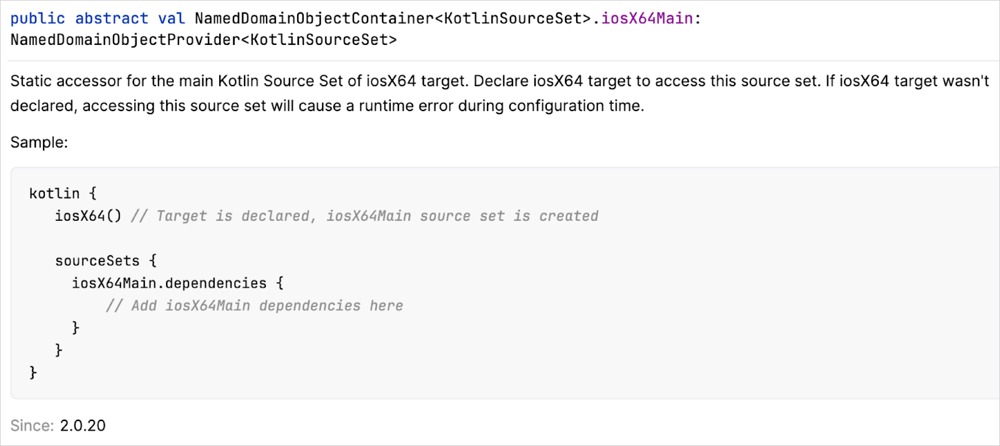

+++
title = "13.6.4.1 Kotlin 2.0.20 新变化"
date = 2026-09-13T08:50:47+08:00
weight = 1
type = "docs"
description = ""
isCJKLanguage = true
draft = false
+++


> 原文链接: [https://kotlinlang.org/docs/whatsnew2020.html](https://kotlinlang.org/docs/whatsnew2020.html)

# 13.6.4.1 Kotlin 2.0.20 新变化

阅读 Kotlin 2.0.20 发行说明，了解新的语言特性，以及 Kotlin Multiplatform、JVM、Native、JS、Wasm 的更新和 Gradle、Maven 的构建工具支持。

_[发布时间：2024 年 8 月 22 日](../../../13.5-Releases/#release-history)_

Kotlin 2.0.20 已经发布！此版本包含对 Kotlin 2.0.0 的性能改进和缺陷修复，我们在 Kotlin 2.0.0 中宣布 Kotlin K2 编译器进入 Stable。以下是此版本的一些额外亮点：

* [数据类的 copy 函数与构造器具有相同的可见性](#data-class-copy-function-to-have-the-same-visibility-as-constructor)
* [多平台项目中现在可以使用默认目标层次结构源集的静态访问器](#static-accessors-for-source-sets-from-the-default-target-hierarchy)
* [垃圾回收器中实现了 Kotlin/Native 的并发标记](#concurrent-marking-in-garbage-collector)
* [Kotlin/Wasm 中的 `@ExperimentalWasmDsl` 注解有了新位置](#new-location-of-experimentalwasmdsl-annotation)
* [添加了对 Gradle 8.6–8.8 版本的支持](#gradle)
* [新选项允许在 Gradle 项目之间以类文件形式共享 JVM 制品](#option-to-share-jvm-artifacts-between-projects-as-class-files)
* [Compose 编译器已更新](#compose-compiler)
* [通用 Kotlin 标准库中添加了对 UUID 的支持](#support-for-uuids-in-the-common-kotlin-standard-library)

> **提示：** 有关 Kotlin 发布周期的信息，请参见 [Kotlin 发布流程](../../../13.5-Releases/)。

## IDE 支持 {#ide-support}

支持 2.0.20 的 Kotlin 插件已捆绑在最新的 IntelliJ IDEA 和 Android Studio 中。你无需在 IDE 中更新 Kotlin 插件。你需要做的只是把构建脚本中的 Kotlin 版本改为 2.0.20。

详情请参见[更新到新版本](../../../13.5-Releases/#update-to-a-new-kotlin-version)。

## 语言 {#language}

Kotlin 2.0.20 开始引入一些变更，以提升数据类的一致性，并替换实验性的上下文接收者特性。

### 数据类的 copy 函数与构造器具有相同的可见性 {#data-class-copy-function-to-have-the-same-visibility-as-constructor}

目前，如果你用 `private` 构造器创建数据类，自动生成的 `copy()` 函数不会有相同的可见性。这可能在后续代码中引发问题。在未来的 Kotlin 版本中，我们将引入 `copy()` 函数的默认可见性与构造器相同的行为。这一变更将逐步引入，以帮助你尽可能平滑地迁移代码。

我们的迁移计划从 Kotlin 2.0.20 开始，它会在你的代码中未来可见性将发生变化的地方发出警告。例如：

```kotlin
// 在 2.0.20 中会触发警告
data class PositiveInteger private constructor(val number: Int) {
    companion object {
        fun create(number: Int): PositiveInteger? = if (number > 0) PositiveInteger(number) else null
    }
}

fun main() {
    val positiveNumber = PositiveInteger.create(42) ?: return
    // 在 2.0.20 中会触发警告
    val negativeNumber = positiveNumber.copy(number = -1)
    // 警告：非公开主构造器通过 'data' 类生成的 'copy()' 方法暴露。
    // 生成的 'copy()' 将在未来的版本中改变其可见性。
}
```

有关迁移计划的最新信息，请参见 [YouTrack](https://youtrack.jetbrains.com/issue/KT-11914) 中的相应议题。

为了让你对这一行为有更多控制，我们在 Kotlin 2.0.20 中引入了两个注解：

* `@ConsistentCopyVisibility`，用于在我们于后续版本把它设为默认之前提前选择启用该行为。
* `@ExposedCopyVisibility`，用于选择退出该行为并在声明处抑制警告。请注意，即使使用该注解，编译器在调用 `copy()` 函数时仍会报告警告。

如果你想在 2.0.20 中为整个模块（而不是单个类）选择启用新行为，可以使用 `-Xconsistent-data-class-copy-visibility` 编译器选项。该选项的效果等同于为模块中的所有数据类添加 `@ConsistentCopyVisibility` 注解。

### 用上下文参数逐步替换上下文接收者 {#phased-replacement-of-context-receivers-with-context-parameters}

在 Kotlin 1.6.20 中，我们引入了[上下文接收者](../../13.6.8-Kotlin16x/13.6.8.1-Whatsnew1620/#prototype-of-context-receivers-for-kotlin-jvm)，作为[实验性](../../../13.4-ComponentsStability/#stability-levels-explained)特性。在听取社区反馈后，我们决定不再继续这种做法，而是采取不同的方向。

在未来的 Kotlin 版本中，上下文接收者将被上下文参数取代。上下文参数仍处于设计阶段，你可以在 [KEEP](https://kotlinlang.org/docs/https://github.com/Kotlin/KEEP/blob/context-parameters/proposals/context-parameters.html) 中找到该提案。

由于上下文参数的实现需要对编译器做重大更改，我们决定不同时支持上下文接收者和上下文参数。这一决定大大简化了实现，并把出现不稳定行为的风险降到最低。

我们理解已有大量开发者在使用上下文接收者。因此我们将逐步开始移除对上下文接收者的支持。我们的迁移计划从 Kotlin 2.0.20 开始，当使用 `-Xcontext-receivers` 编译器选项使用上下文接收者时，会在你的代码中发出警告。例如：

```kotlin
class MyContext

context(MyContext)
// 警告：实验性的上下文接收者已弃用，将由上下文参数取代。
// 请不要使用上下文接收者。你可以显式传递参数，或使用带扩展的成员。
fun someFunction() {
}
```

该警告将在未来的 Kotlin 版本中变成错误。

如果你在代码中使用了上下文接收者，我们建议你把代码迁移为使用以下之一：

* 显式参数。

| 之前 | 之后 |
| --- | --- |
| ```kotlin    context(ContextReceiverType)    fun someFunction() {        contextReceiverMember()    }    ``` | ```kotlin    fun someFunction(explicitContext: ContextReceiverType) {        explicitContext.contextReceiverMember()    }    ``` |

* 扩展成员函数（如果可行）。

| 之前 | 之后 |
| --- | --- |
| ```kotlin    context(ContextReceiverType)    fun contextReceiverMember() = TODO()        context(ContextReceiverType)    fun someFunction() {        contextReceiverMember()    }    ``` | ```kotlin    class ContextReceiverType {        fun contextReceiverMember() = TODO()    }        fun ContextReceiverType.someFunction() {        contextReceiverMember()    }    ``` |

或者，你也可以等到编译器支持上下文参数的那个 Kotlin 版本。请注意，上下文参数最初会作为实验性特性引入。

## Kotlin Multiplatform {#kotlin-multiplatform}

Kotlin 2.0.20 改进了多平台项目中的源集管理，并由于 Gradle 近期的变更而弃用了与一些 Gradle Java 插件的兼容性。

### 默认目标层次结构中源集的静态访问器 {#static-accessors-for-source-sets-from-the-default-target-hierarchy}

从 Kotlin 1.9.20 起，[默认层次结构模板](https://kotlinlang.org/docs/multiplatform/multiplatform-hierarchy.html#default-hierarchy-template)会自动应用于所有 Kotlin Multiplatform 项目。对于默认层次结构模板中的所有源集，Kotlin Gradle 插件提供了类型安全的访问器。这样，你终于可以访问所有已指定目标的源集，而不必使用 `by getting` 或 `by creating` 构造。

Kotlin 2.0.20 旨在进一步改善你的 IDE 体验。它现在在 `sourceSets {}` 块中为默认层次结构模板的所有源集提供静态访问器。我们相信这一变更会让大家按名称访问源集更容易、更可预测。

每个这样的源集现在都有带示例的详细 KDoc 注释，以及在你尚未声明相应目标就尝试访问该源集时的诊断消息和警告：

```kotlin
kotlin {
    jvm()
    linuxX64()
    linuxArm64()
    mingwX64()

    sourceSets {
        commonMain.languageSettings {
            progressiveMode = true
        }

        jvmMain { }
        linuxX64Main { }
        linuxArm64Main { }
        // 警告：在未注册目标的情况下访问源集
        iosX64Main { }
    }
}
```



进一步了解 [Kotlin Multiplatform 中的分层项目结构](https://kotlinlang.org/docs/multiplatform/multiplatform-hierarchy.html)。

### 弃用 Kotlin Multiplatform Gradle 插件与 Gradle Java 插件的兼容性 {#deprecated-compatibility-with-kotlin-multiplatform-gradle-plugin-and-gradle-java-plugins}

在 Kotlin 2.0.20 中，当你把 Kotlin Multiplatform Gradle 插件与以下任一 Gradle Java 插件应用到同一个项目时，我们会引入弃用警告：[Java](https://docs.gradle.org/current/userguide/java_plugin.html)、[Java Library](https://docs.gradle.org/current/userguide/java_library_plugin.html) 和 [Application](https://docs.gradle.org/current/userguide/application_plugin.html)。当你的多平台项目中的另一个 Gradle 插件应用了某个 Gradle Java 插件时，也会出现该警告。例如，[Spring Boot Gradle 插件](https://docs.spring.io/spring-boot/gradle-plugin/index.html)会自动应用 Application 插件。

我们添加这个弃用警告，是因为 Kotlin Multiplatform 的项目模型与 Gradle 的 Java 生态插件之间存在根本性的兼容问题。Gradle 的 Java 生态插件目前没有考虑到其他插件可能：

* 也以不同于 Java 生态插件的方式发布或为 JVM 目标编译。
* 在同一项目中拥有两个不同的 JVM 目标，例如 JVM 和 Android。
* 拥有复杂的多平台项目结构，可能包含多个非 JVM 目标。

遗憾的是，Gradle 目前没有提供任何 API 来解决这些问题。

我们此前在 Kotlin Multiplatform 中使用了一些变通方案来帮助集成 Java 生态插件。然而，这些变通方案从未真正解决兼容性问题，而且从 Gradle 8.8 起，这些变通方案不再可行。更多信息请参见我们的 [YouTrack 议题](https://youtrack.jetbrains.com/issue/KT-66542/Gradle-JVM-target-with-withJava-produces-a-deprecation-warning)。

虽然我们还不清楚该如何确切解决这个兼容性问题，但我们承诺继续在你的 Kotlin Multiplatform 项目中支持某种形式的 Java 源代码编译。至少，我们将支持 Java 源代码的编译，以及在多平台项目中使用 Gradle 的 [`java-base`](https://docs.gradle.org/current/javadoc/org/gradle/api/plugins/JavaBasePlugin.html) 插件。

与此同时，如果你在多平台项目中看到这个弃用警告，我们建议你：
1. 确定你的项目是否真的需要 Gradle Java 插件。如果不需要，考虑移除它。
2. 检查 Gradle Java 插件是否只用于单个任务。如果是，你可能不需要太多工作就能移除该插件。例如，如果该任务使用 Gradle Java 插件来创建 Javadoc JAR 文件，你可以改为手动定义 Javadoc 任务。

否则，如果你想在多平台项目中同时使用 Kotlin Multiplatform Gradle 插件和这些用于 Java 的 Gradle 插件，我们建议你：

1. 在多平台项目中创建一个单独的子项目。
2. 在该单独的子项目中应用用于 Java 的 Gradle 插件。
3. 在该单独的子项目中添加对父多平台项目的依赖。

> **警告：** 该单独的子项目**绝不能**是多平台项目，并且你只能用它来建立对多平台项目的依赖。

例如，你有一个名为 `my-main-project` 的多平台项目，并且想使用 [Application](https://docs.gradle.org/current/userguide/application_plugin.html) Gradle 插件来运行 JVM 应用。

创建子项目（我们称之为 `subproject-A`）后，你的父项目结构应如下所示：

```text
.
├── build.gradle.kts
├── settings.gradle
├── subproject-A
    └── build.gradle.kts
    └── src
        └── Main.java
```

在子项目的 `build.gradle.kts` 文件中，在 `plugins {}` 块中应用 Application 插件：

**Kotlin**

```kotlin
plugins {
    id("application")
}
```

**Groovy**

```groovy
plugins {
    id('application')
}
```

在子项目的 `build.gradle.kts` 文件中，添加对父多平台项目的依赖：

**Kotlin**

```kotlin
dependencies {
    implementation(project(":my-main-project")) // 你的父多平台项目的名称
}
```

**Groovy**

```groovy
dependencies {
    implementation project(':my-main-project') // 你的父多平台项目的名称
}
```

你的父项目现在配置好了，可以同时使用这两个插件。

## Kotlin/Native {#kotlin-native}

Kotlin/Native 在垃圾回收器以及从 Swift/Objective-C 调用 Kotlin 挂起函数方面获得了改进。

### 垃圾回收器中的并发标记 {#concurrent-marking-in-garbage-collector}

在 Kotlin 2.0.20 中，JetBrains 团队朝着提升 Kotlin/Native 运行时性能又迈进了一步。我们为垃圾回收器（GC）添加了对并发标记的实验性支持。

默认情况下，当 GC 标记堆中的对象时，应用线程必须暂停。这极大地影响 GC 暂停时间的长短，而这对延迟敏感型应用（例如用 Compose Multiplatform 构建的 UI 应用）的性能很重要。

现在，垃圾回收的标记阶段可以与应用线程同时运行。这应当能显著缩短 GC 暂停时间，并有助于提升应用的响应性。

#### 如何启用 {#how-to-enable}

该特性目前是[实验性](../../../13.4-ComponentsStability/#stability-levels-explained)的。要启用它，请在 `gradle.properties` 文件中设置以下选项：

```none
kotlin.native.binary.gc=cms
```

请把任何问题报告到我们的问题跟踪器 [YouTrack](https://kotl.in/issue)。

### 移除对 bitcode 嵌入的支持 {#support-for-bitcode-embedding-removed}

从 Kotlin 2.0.20 开始，Kotlin/Native 编译器不再支持 bitcode 嵌入。bitcode 嵌入在 Xcode 14 中被弃用，并在 Xcode 15 中针对所有 Apple 目标被移除。

现在，框架配置的 `embedBitcode` 参数以及 `-Xembed-bitcode` 和 `-Xembed-bitcode-marker` 命令行参数都已弃用。

如果你仍在使用较早版本的 Xcode 但想升级到 Kotlin 2.0.20，请在你的 Xcode 项目中禁用 bitcode 嵌入。

### 带 signpost 的 GC 性能监控的变更 {#changes-to-gc-performance-monitoring-with-signposts}

Kotlin 2.0.0 使你可以通过 Xcode Instruments 监控 Kotlin/Native 垃圾回收器（GC）的性能。Instruments 包含 signposts 工具，可以把 GC 暂停显示为事件。这在检查 iOS 应用中与 GC 相关的卡顿时很方便。

该特性默认启用，但遗憾的是，当应用与 Xcode Instruments 同时运行时，它有时会导致崩溃。从 Kotlin 2.0.20 开始，它需要通过以下编译器选项显式选择启用：

```none
-Xbinary=enableSafepointSignposts=true
```

请在[文档](../../../../development/6.3-Nativedevelopment/6.3.5-Memorymanager/6.3.5.1-NativeMemoryManager/#monitor-gc-performance)中进一步了解 GC 性能分析。

### 能够从 Swift/Objective-C 在非主线程调用 Kotlin 挂起函数 {#ability-to-call-kotlin-suspending-functions-from-swift-objective-c-on-non-main-threads}

此前，Kotlin/Native 有一个默认限制，把从 Swift 和 Objective-C 调用 Kotlin 挂起函数的能力限制在主线程。Kotlin 2.0.20 取消了该限制，允许你在任意线程上从 Swift/Objective-C 运行 Kotlin `suspend` 函数。

如果你此前用 `kotlin.native.binary.objcExportSuspendFunctionLaunchThreadRestriction=none` 二进制选项切换了非主线程的默认行为，现在可以从 `gradle.properties` 文件中移除它。

## Kotlin/Wasm {#kotlin-wasm}

在 Kotlin 2.0.20 中，Kotlin/Wasm 继续向命名导出迁移，并迁移了 `@ExperimentalWasmDsl` 注解的位置。

### 使用默认导出会报错 {#error-in-default-export-usage}

作为向命名导出迁移的一部分，此前在 JavaScript 中对 Kotlin/Wasm 导出使用默认导入时会向控制台打印警告消息。

为了完全支持命名导出，该警告现在已升级为错误。如果你使用默认导入，会遇到以下错误消息：

```text
Do not use default import. Use the corresponding named import instead.
```

这一变更是向命名导出迁移的弃用周期的一部分。以下是各阶段的情况：

* **在 2.0.0 版本中**：向控制台打印警告消息，说明通过默认导出导出实体已弃用。
* **在 2.0.20 版本中**：发生错误，要求使用相应的命名导入。
* **在 2.1.0 版本中**：完全移除默认导入的使用。

### ExperimentalWasmDsl 注解的新位置 {#new-location-of-experimentalwasmdsl-annotation}

此前，用于 WebAssembly（Wasm）特性的 `@ExperimentalWasmDsl` 注解位于 Kotlin Gradle 插件中的这个位置：

```Kotlin
org.jetbrains.kotlin.gradle.targets.js.dsl.ExperimentalWasmDsl
```

在 2.0.20 中，`@ExperimentalWasmDsl` 注解已被迁移到：

```Kotlin
org.jetbrains.kotlin.gradle.ExperimentalWasmDsl
```

之前的位置现在已弃用，可能导致构建失败并出现未解析的引用。

为了反映 `@ExperimentalWasmDsl` 注解的新位置，请更新 Gradle 构建脚本中的 import 语句。为新位置使用显式导入：

```kotlin
import org.jetbrains.kotlin.gradle.ExperimentalWasmDsl
```

或者，从旧包中移除这个星号导入语句：

```kotlin
import org.jetbrains.kotlin.gradle.targets.js.dsl.*
```

## Kotlin/JS {#kotlin-js}

Kotlin/JS 引入了一些实验性特性，以支持 JavaScript 中的静态成员，以及从 JavaScript 创建 Kotlin 集合。

### 支持在 JavaScript 中使用 Kotlin 静态成员 {#support-for-using-kotlin-static-members-in-javascript}

> **警告：** 该特性是[实验性](../../../13.4-ComponentsStability/#stability-levels-explained)的。它随时可能被放弃或更改。请仅将其用于评估目的。我们欢迎你在 [YouTrack](https://youtrack.jetbrains.com/issue/KT-18891/JS-provide-a-way-to-declare-static-members-JsStatic) 中提供反馈。

从 Kotlin 2.0.20 开始，你可以使用 `@JsStatic` 注解。它的工作方式类似于 [@JvmStatic](https://kotlinlang.org/api/latest/jvm/stdlib/kotlin.jvm/-jvm-static/)，会指示编译器为目标声明生成额外的静态方法。这有助于你在 JavaScript 中直接使用 Kotlin 代码中的静态成员。

你可以把 `@JsStatic` 注解用于具名对象中定义的函数，以及类和接口内声明的伴生对象中的函数。编译器会同时生成对象的静态方法和对象自身的实例方法。例如：

```kotlin
class C {
    companion object {
        @JsStatic
        fun callStatic() {}
        fun callNonStatic() {}
    }
}
```

现在，`callStatic()` 在 JavaScript 中是静态的，而 `callNonStatic()` 不是：

```javascript
C.callStatic(); // 可以，访问静态函数
C.callNonStatic(); // 错误，在生成的 JavaScript 中不是静态函数
C.Companion.callStatic(); // 实例方法保留
C.Companion.callNonStatic(); // 这是唯一可行的方式
```

也可以把 `@JsStatic` 注解应用于对象或伴生对象的属性，使其 getter 和 setter 方法成为该对象或包含伴生对象的类中的静态成员。

### 能够从 JavaScript 创建 Kotlin 集合 {#ability-to-create-kotlin-collections-from-javascript}

> **警告：** 该特性是[实验性](../../../13.4-ComponentsStability/#stability-levels-explained)的。它随时可能被放弃或更改。请仅将其用于评估目的。我们欢迎你在 [YouTrack](https://youtrack.jetbrains.com/issue/KT-69133/Kotlin-JS-Add-support-for-collection-instantiation-in-JavaScript) 中提供反馈。

Kotlin 2.0.0 引入了把 Kotlin 集合导出到 JavaScript（和 TypeScript）的能力。现在 JetBrains 团队又迈出了一步来改善集合互操作。从 Kotlin 2.0.20 开始，可以直接从 JavaScript/TypeScript 一侧创建 Kotlin 集合。

你可以从 JavaScript 创建 Kotlin 集合并把它们作为参数传给导出的构造器或函数。只要你在导出声明中提及某个集合，Kotlin 就会为它生成一个在 JavaScript/TypeScript 中可用的工厂。

看一下下面这个导出的函数：

```kotlin
// Kotlin
@JsExport
fun consumeMutableMap(map: MutableMap<String, Int>)
```

由于提到了 `MutableMap` 集合，Kotlin 会生成一个带工厂方法的对象，可从 JavaScript/TypeScript 使用。该工厂方法随后会从 JavaScript 的 `Map` 创建一个 `MutableMap`：

```javascript
// JavaScript
import { consumeMutableMap } from "an-awesome-kotlin-module"
import { KtMutableMap } from "an-awesome-kotlin-module/kotlin-kotlin-stdlib"

consumeMutableMap(
    KtMutableMap.fromJsMap(new Map([["First", 1], ["Second", 2]]))
)
```

该特性适用于 `Set`、`Map` 和 `List` Kotlin 集合类型及其可变对应类型。

## Gradle {#gradle}

Kotlin 2.0.20 与 Gradle 6.8.3 到 8.6 完全兼容。Gradle 8.7 和 8.8 也受支持，只有一个例外：如果你使用 Kotlin Multiplatform Gradle 插件，你的多平台项目在 JVM 目标中调用 `withJava()` 函数时可能会看到弃用警告。我们计划尽快修复该问题。

更多信息请参见 [YouTrack](https://youtrack.jetbrains.com/issue/KT-66542/Gradle-JVM-target-with-withJava-produces-a-deprecation-warning) 中的议题。

你也可以使用最新 Gradle 版本以内的其他版本，但如果这样做，请记住你可能会遇到弃用警告，或者某些新的 Gradle 特性可能无法工作。

此版本带来的变更包括开始弃用基于 JVM 历史文件的旧增量编译方式，以及一种在项目之间共享 JVM 制品的新方式。

### 弃用基于 JVM 历史文件的增量编译 {#deprecated-incremental-compilation-based-on-jvm-history-files}

在 Kotlin 2.0.20 中，基于 JVM 历史文件的增量编译方式已被弃用，建议改用自 Kotlin 1.8.20 起默认启用的新增量编译方式。

基于 JVM 历史文件的增量编译方式存在一些局限，例如无法与 [Gradle 的构建缓存](https://docs.gradle.org/current/userguide/build_cache.html)一起工作，也不支持编译规避。相比之下，新的增量编译方式克服了这些局限，并且自引入以来表现良好。

鉴于新的增量编译方式已在最近两个 Kotlin 主版本中默认使用，`kotlin.incremental.useClasspathSnapshot` Gradle 属性在 Kotlin 2.0.20 中已被弃用。因此，如果你用它来选择退出，将会看到弃用警告。

### 以类文件形式在项目之间共享 JVM 制品的选项 {#option-to-share-jvm-artifacts-between-projects-as-class-files}

> **警告：** 该特性是[实验性](../../../13.4-ComponentsStability/#stability-levels-explained)的。它随时可能被放弃或更改。请仅将其用于评估目的。我们欢迎你在 [YouTrack](https://youtrack.jetbrains.com/issue/KT-61861/Gradle-Kotlin-compilations-depend-on-packed-artifacts) 中提供反馈。需要选择启用（详见下文）。

在 Kotlin 2.0.20 中，我们引入了一种新方式，改变了 Kotlin/JVM 编译输出（例如 JAR 文件）在项目之间共享的方法。使用这种方式，Gradle 的 `apiElements` 配置现在有了一个次级变体，提供对包含已编译 `.class` 文件的目录的访问。配置后，你的项目会在编译期间使用该目录，而不是请求压缩的 JAR 制品。这减少了 JAR 文件被压缩和解压的次数，尤其是在增量构建时。

我们的测试显示，这种新方式可以在 Linux 和 macOS 主机上带来构建性能改进。然而在 Windows 主机上，由于 Windows 处理文件 I/O 操作的方式，我们看到了性能下降。

要试用这种新方式，请在 `gradle.properties` 文件中添加以下属性：

```none
kotlin.jvm.addClassesVariant=true
```

默认情况下，该属性设置为 `false`，Gradle 中的 `apiElements` 变体会请求压缩的 JAR 制品。

> **注意：** Gradle 有一个相关属性，你可以在纯 Java 项目中使用它，以便在编译期间只公开压缩的 JAR 制品，**而不是**包含已编译 `.class` 文件的目录：```none org.gradle.java.compile-classpath-packaging=true ``` 有关该属性及其用途的更多信息，请参见 Gradle 文档中[在 Windows 上处理巨型多项目时构建性能显著下降](https://docs.gradle.org/current/userguide/java_library_plugin.html#sub:java_library_known_issues_windows_performance)的说明。

我们欢迎你对这种新方式提供反馈。你在使用它时是否注意到任何性能改进？请在 [YouTrack](https://youtrack.jetbrains.com/issue/KT-61861/Gradle-Kotlin-compilations-depend-on-packed-artifacts) 中添加评论告诉我们。

### Kotlin Gradle 插件与 java-test-fixtures 插件的依赖行为对齐 {#aligned-dependency-behavior-of-kotlin-gradle-plugin-with-java-test-fixtures-plugin}

在 Kotlin 2.0.20 之前，如果你在项目中使用 [`java-test-fixtures` 插件](https://docs.gradle.org/current/userguide/java_testing.html#sec:java_test_fixtures)，Gradle 与 Kotlin Gradle 插件在依赖传播方式上存在差异。

Kotlin Gradle 插件会传播依赖：

* 从 `java-test-fixtures` 插件的 `implementation` 和 `api` 依赖类型传播到 `test` 源集编译类路径。
* 从主源集的 `implementation` 和 `api` 依赖类型传播到 `java-test-fixtures` 插件的源集编译类路径。

然而，Gradle 只传播 `api` 依赖类型中的依赖。

这种行为差异导致一些项目在类路径中多次找到资源文件。

从 Kotlin 2.0.20 起，Kotlin Gradle 插件的行为已与 Gradle 的 `java-test-fixtures` 插件对齐，因此这个问题在该插件以及其他 Gradle 插件中都不再出现。

这一变更导致 `test` 和 `testFixtures` 源集中的一些依赖可能不再可访问。如果发生这种情况，请把依赖声明的类型从 `implementation` 改为 `api`，或者在受影响的源集上添加新的依赖声明。

### 为编译任务在制品上缺少任务依赖的罕见情况添加任务依赖 {#added-task-dependency-for-rare-cases-when-the-compile-task-lacks-one-on-an-artifact}

在 2.0.20 之前，我们发现有场景中编译任务缺少对其某个制品输入的任务依赖。这意味着依赖它的编译任务结果不稳定，因为有时制品已及时生成，有时则没有。

为修复该问题，Kotlin Gradle 插件现在会在这些场景中自动添加所需的任务依赖。

在极少数情况下，我们发现这一新行为会导致循环依赖错误。例如，如果你有多个编译，其中一个编译可以看到另一个编译的所有 `internal` 声明，并且生成的制品依赖于两个编译任务的输出，你可能会看到类似以下的错误：

```none
FAILURE: Build failed with an exception.

What went wrong:
Circular dependency between the following tasks:
:lib:compileKotlinJvm
--- :lib:jvmJar
     \--- :lib:compileKotlinJvm (*)
(*) - details omitted (listed previously)
```

为修复这个循环依赖错误，我们添加了一个 Gradle 属性：`archivesTaskOutputAsFriendModule`。

默认情况下，该属性设置为 `true` 以跟踪任务依赖。要禁止在编译任务中使用该制品，从而不需要任务依赖，请在 `gradle.properties` 文件中添加以下内容：

```kotlin
kotlin.build.archivesTaskOutputAsFriendModule=false
```

更多信息请参见 [YouTrack](https://youtrack.jetbrains.com/issue/KT-69330) 中的议题。

## Compose 编译器 {#compose-compiler}

在 Kotlin 2.0.20 中，Compose 编译器获得了一些改进。

### 修复 2.0.0 中引入的不必要重组问题 {#fix-for-the-unnecessary-recompositions-issue-introduced-in-2-0-0}

Compose 编译器 2.0.0 存在一个问题：它有时会错误地推断带非 JVM 目标的多平台项目中类型的稳定性。这可能导致不必要的（甚至无尽的）重组。我们强烈建议把为 Kotlin 2.0.0 构建的 Compose 应用更新到 2.0.10 或更高版本。

如果你的应用是用 Compose 编译器 2.0.10 或更高版本构建的，但使用了用 2.0.0 版本构建的依赖，这些较旧的依赖仍可能导致重组问题。为避免这种情况，请把依赖更新为与你的应用使用相同 Compose 编译器构建的版本。

### 配置编译器选项的新方式 {#new-way-to-configure-compiler-options}

我们引入了新的选项配置机制，以避免顶层参数频繁变动。对 Compose 编译器团队来说，通过为 `composeCompiler {}` 块创建或移除顶层条目来测试东西很困难。因此，诸如强跳过模式和非跳过组优化之类的选项现在通过 `featureFlags` 属性启用。该属性将用于测试最终会成为默认值的新 Compose 编译器选项。

这一变更也应用到了 Compose 编译器 Gradle 插件。今后要配置特性标志，请使用以下语法（这段代码会翻转所有默认值）：

```kotlin
composeCompiler {
    featureFlags = setOf(
        ComposeFeatureFlag.IntrinsicRemember.disabled(),
        ComposeFeatureFlag.OptimizeNonSkippingGroups,
        ComposeFeatureFlag.StrongSkipping.disabled()
    )
}
```

或者，如果你是直接配置 Compose 编译器，请使用以下语法：

```text
-P plugin:androidx.compose.compiler.plugins.kotlin:featureFlag=IntrinsicRemember
```

因此，`enableIntrinsicRemember`、`enableNonSkippingGroupOptimization` 和 `enableStrongSkippingMode` 属性已被弃用。

我们欢迎你在 [YouTrack](https://youtrack.jetbrains.com/issue/KT-68651/Compose-provide-a-single-place-in-extension-to-configure-all-compose-flags) 中提供关于这种新方式的任何反馈。

### 默认启用强跳过模式 {#strong-skipping-mode-enabled-by-default}

Compose 编译器的强跳过模式现在默认启用。

强跳过模式是 Compose 编译器的一个配置选项，它改变了哪些 composable 可以被跳过的规则。启用强跳过模式后，带不稳定参数的 composable 现在也可以被跳过。强跳过模式还会自动记住 composable 函数中使用的 lambda，因此你不再需要用 `remember` 包装 lambda 来避免重组。

更多细节请参见[强跳过模式文档](https://developer.android.com/develop/ui/compose/performance/stability/strongskipping)。

### 默认启用组合跟踪标记 {#composition-trace-markers-enabled-by-default}

Compose 编译器 Gradle 插件中的 `includeTraceMarkers` 选项现在默认设置为 `true`，以匹配编译器插件中的默认值。这让你可以在 Android Studio 的系统跟踪分析器中看到 composable 函数。有关组合跟踪的细节，请参见这篇 [Android 开发者博客文章](https://medium.com/androiddevelopers/jetpack-compose-composition-tracing-9ec2b3aea535)。

### 非跳过组优化 {#non-skipping-group-optimizations}

此版本包含一个新的编译器选项：启用后，不可跳过且不可重启的 composable 函数将不再在 composable 主体周围生成组。这会减少分配，从而提升性能。该选项是实验性的，默认禁用，但可以通过特性标志 `OptimizeNonSkippingGroups` 启用，如[上文](#new-way-to-configure-compiler-options)所示。

该特性标志现在已准备好进行更广泛的测试。启用该特性时发现的任何问题都可以提交到 [Google 问题跟踪器](https://goo.gle/compose-feedback)。

### 支持抽象 composable 函数的默认参数 {#support-for-default-parameters-in-abstract-composable-functions}

你现在可以为抽象 composable 函数添加默认参数。

以前，尽管这是合法的 Kotlin 代码，Compose 编译器在尝试这样做时会报错。我们现在在 Compose 编译器中添加了对它的支持，该限制已被移除。这对于包含默认 `Modifier` 值特别有用：

```kotlin
abstract class Composables {
    @Composable
    abstract fun Composable(modifier: Modifier = Modifier)
}
```

在 2.0.20 中，开放 composable 函数的默认参数仍受限制。该限制将在未来的版本中得到解决。

## 标准库 {#standard-library}

标准库现在以实验性特性支持通用唯一标识符，并包含一些对 Base64 解码的变更。

### 通用 Kotlin 标准库中对 UUID 的支持 {#support-for-uuids-in-the-common-kotlin-standard-library}

> **警告：** 该特性是[实验性](../../../13.4-ComponentsStability/#stability-levels-explained)的。要选择启用，请使用 `@ExperimentalUuidApi` 注解或编译器选项 `-opt-in=kotlin.uuid.ExperimentalUuidApi`。

Kotlin 2.0.20 在通用 Kotlin 标准库中引入了一个用于表示 [UUID（通用唯一标识符）](https://en.wikipedia.org/wiki/Universally_unique_identifier)的类，以解决唯一标识条目的难题。

此外，该特性为以下与 UUID 相关的操作提供了 API：

* 生成 UUID。
* 从字符串表示解析 UUID，以及把 UUID 格式化为字符串表示。
* 从指定的 128 位值创建 UUID。
* 访问 UUID 的 128 位。

以下代码示例演示了这些操作：

```kotlin
// 为创建 UUID 构造字节数组
val byteArray = byteArrayOf(
    0x55, 0x0E, 0x84.toByte(), 0x00, 0xE2.toByte(), 0x9B.toByte(), 0x41, 0xD4.toByte(),
    0xA7.toByte(), 0x16, 0x44, 0x66, 0x55, 0x44, 0x00, 0x00
)

val uuid1 = Uuid.fromByteArray(byteArray)
val uuid2 = Uuid.fromULongs(0x550E8400E29B41D4uL, 0xA716446655440000uL)
val uuid3 = Uuid.parse("550e8400-e29b-41d4-a716-446655440000")

println(uuid1)
// 550e8400-e29b-41d4-a716-446655440000
println(uuid1 == uuid2)
// true
println(uuid2 == uuid3)
// true

// 访问 UUID 的位
val version = uuid1.toLongs { mostSignificantBits, _ ->
    ((mostSignificantBits shr 12) and 0xF).toInt()
}
println(version)
// 4

// 生成一个随机 UUID
val randomUuid = Uuid.random()

println(uuid1 == randomUuid)
// false
```

为了与使用 `java.util.UUID` 的 API 保持兼容，Kotlin/JVM 中有两个扩展函数用于在 `java.util.UUID` 与 `kotlin.uuid.Uuid` 之间转换：`.toJavaUuid()` 和 `.toKotlinUuid()`。例如：

```kotlin
val kotlinUuid = Uuid.parseHex("550e8400e29b41d4a716446655440000")
// 把 Kotlin UUID 转换为 java.util.UUID
val javaUuid = kotlinUuid.toJavaUuid()

val javaUuid = java.util.UUID.fromString("550e8400-e29b-41d4-a716-446655440000")
// 把 Java UUID 转换为 kotlin.uuid.Uuid
val kotlinUuid = javaUuid.toKotlinUuid()
```

该特性及所提供的 API 通过在多个平台之间共享代码，简化了多平台软件开发。在难以生成唯一标识符的环境中，UUID 也非常理想。

涉及 UUID 的一些示例用例包括：

* 为数据库记录分配唯一 ID。
* 生成 Web 会话标识符。
* 任何需要唯一标识或跟踪的场景。

### HexFormat 中对 minLength 的支持 {#support-for-minlength-in-hexformat}

> **警告：** [`HexFormat`](https://kotlinlang.org/api/latest/jvm/stdlib/kotlin.text/-hex-format/) 类及其属性是[实验性](../../../13.4-ComponentsStability/#stability-levels-explained)的。要选择启用，请使用 `@OptIn(ExperimentalStdlibApi::class)` 注解或编译器选项 `-opt-in=kotlin.ExperimentalStdlibApi`。

Kotlin 2.0.20 为 [`NumberHexFormat`](https://kotlinlang.org/api/latest/jvm/stdlib/kotlin.text/-hex-format/-number-hex-format/) 类添加了新的 `minLength` 属性，可通过 [`HexFormat.number`](https://kotlinlang.org/api/latest/jvm/stdlib/kotlin.text/-hex-format/number.html) 访问。该属性让你可以指定数值十六进制表示中的最小位数，从而可以用零填充以达到所需长度。此外，还可以用 `removeLeadingZeros` 属性去除前导零：

```kotlin
fun main() {
    println(93.toHexString(HexFormat {
        number.minLength = 4
        number.removeLeadingZeros = true
    }))
    // "005d"
}
```

`minLength` 属性不影响解析。不过，解析现在允许十六进制字符串的位数多于类型宽度，前提是多余的前导数字是零。

### Base64 解码器行为的变更 {#changes-to-the-base64-s-decoder-behavior}

> **警告：** [`Base64` 类](https://kotlinlang.org/api/latest/jvm/stdlib/kotlin.io.encoding/-base64/)及其相关特性是[实验性](../../../13.4-ComponentsStability/#stability-levels-explained)的。要选择启用，请使用 `@OptIn(ExperimentalEncodingApi::class)` 注解或编译器选项 `-opt-in=kotlin.io.encoding.ExperimentalEncodingApi`。

Kotlin 2.0.20 中对 Base64 解码器的行为引入了两项变更：

* [Base64 解码器现在要求填充](#the-base64-decoder-now-requires-padding)
* [添加了用于配置填充的 `withPadding` 函数](#withpadding-function-for-padding-configuration)

#### Base64 解码器现在要求填充 {#the-base64-decoder-now-requires-padding}

Base64 编码器现在默认添加填充，解码器要求填充，并在解码时禁止非零填充位。

#### 用于配置填充的 withPadding 函数 {#withpadding-function-for-padding-configuration}

引入了新的 `.withPadding()` 函数，让用户能够控制 Base64 编码和解码的填充行为：

```kotlin
val base64 = Base64.UrlSafe.withPadding(Base64.PaddingOption.ABSENT_OPTIONAL)
```

该函数支持创建带不同填充选项的 `Base64` 实例：

| `PaddingOption`    | 编码时    | 解码时           |

| `PRESENT`          | 添加填充  | 要求填充 |
| `ABSENT`           | 省略填充 | 不允许填充  |
| `PRESENT_OPTIONAL` | 添加填充  | 填充可选 |
| `ABSENT_OPTIONAL`  | 省略填充 | 填充可选 |

你可以创建带不同填充选项的 `Base64` 实例，并用它们对数据进行编码和解码：

```kotlin
import kotlin.io.encoding.Base64
import kotlin.io.encoding.ExperimentalEncodingApi

@OptIn(ExperimentalEncodingApi::class)
fun main() {
    // 要编码的示例数据
    val data = "fooba".toByteArray()

    // 创建一个使用 URL 安全字母表和 PRESENT 填充的 Base64 实例
    val base64Present = Base64.UrlSafe.withPadding(Base64.PaddingOption.PRESENT)
    val encodedDataPresent = base64Present.encode(data)
    println("Encoded data with PRESENT padding: $encodedDataPresent")
    // 使用 PRESENT 填充编码的数据：Zm9vYmE=

    // 创建一个使用 URL 安全字母表和 ABSENT 填充的 Base64 实例
    val base64Absent = Base64.UrlSafe.withPadding(Base64.PaddingOption.ABSENT)
    val encodedDataAbsent = base64Absent.encode(data)
    println("Encoded data with ABSENT padding: $encodedDataAbsent")
    // 使用 ABSENT 填充编码的数据：Zm9vYmE

    // 把数据解码回来
    val decodedDataPresent = base64Present.decode(encodedDataPresent)
    println("Decoded data with PRESENT padding: ${String(decodedDataPresent)}")
    // 使用 PRESENT 填充解码的数据：fooba

    val decodedDataAbsent = base64Absent.decode(encodedDataAbsent)
    println("Decoded data with ABSENT padding: ${String(decodedDataAbsent)}")
    // 使用 ABSENT 填充解码的数据：fooba
}
```

## 文档更新 {#documentation-updates}

Kotlin 文档有一些值得注意的变更：

* 改进了[标准输入页面](../../../../interoperability/7.1-Javainterop/7.1.5-Javatokotlinmigrationguides/7.1.5.4-StandardInput/)——了解如何使用 Java Scanner 和 `readln()`。
* 改进了 [K2 编译器迁移指南](../../../../compilerandplugins/12.1-Kotlincompiler/12.1.1-K2CompilerMigrationGuide/)——了解性能改进、与 Kotlin 库的兼容性，以及该如何处理你的自定义编译器插件。
* 改进了[异常页面](../../../../languageguide/5.6-Exceptions/)——了解异常以及如何抛出和捕获它们。
* 改进了[在 JVM 中使用 JUnit 测试代码的教程](../../../../development/6.1-Backenddevelopment/6.1.3-JvmTestUsingJunit/)——了解如何使用 JUnit 创建测试。
* 改进了[与 Swift/Objective-C 的互操作页面](../../../../interoperability/7.3-Swiftobjectivecandcinterop/7.3.1-Swiftobjectivecinterop/7.3.1.1-NativeObjcInterop/)——了解如何在 Swift/Objective-C 代码中使用 Kotlin 声明，以及在 Kotlin 代码中使用 Objective-C 声明。
* 改进了 [Swift 包导出设置页面](https://kotlinlang.org/docs/multiplatform/multiplatform-spm-export.html)——了解如何设置可被 Swift 包管理器依赖消费的 Kotlin/Native 输出。

## 安装 Kotlin 2.0.20 {#install-kotlin-2-0-20}

从 IntelliJ IDEA 2023.3 和 Android Studio Iguana (2023.2.1) Canary 15 开始，Kotlin 插件作为捆绑插件随 IDE 一起分发。这意味着你不能再从 JetBrains Marketplace 安装该插件。

要更新到新的 Kotlin 版本，请在构建脚本中[更改 Kotlin 版本](../../../13.5-Releases/#update-to-a-new-kotlin-version)为 2.0.20。
