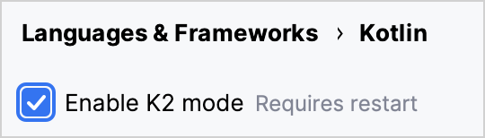

+++
title = "13.6.4.2 Kotlin 2.0.0 新变化"
date = 2026-09-13T08:50:47+08:00
weight = 2
type = "docs"
description = ""
isCJKLanguage = true
draft = false
+++


> 原文链接: [https://kotlinlang.org/docs/whatsnew20.html](https://kotlinlang.org/docs/whatsnew20.html)

# 13.6.4.2 Kotlin 2.0.0 新变化

阅读 Kotlin 2.0.0 发行说明，了解新的语言特性，以及 Kotlin Multiplatform、JVM、Native、JS、Wasm 的更新和 Gradle、Maven 的构建工具支持。

_[发布时间：2024 年 5 月 21 日](../../../13.5-Releases/#release-history)_

Kotlin 2.0.0 已经发布，[新的 Kotlin K2 编译器](#kotlin-k2-compiler)已进入 Stable！此外，以下是一些其他亮点：

* [新的 Compose 编译器 Gradle 插件](#new-compose-compiler-gradle-plugin)
* [使用 invokedynamic 生成 lambda 函数](#generation-of-lambda-functions-using-invokedynamic)
* [kotlinx-metadata-jvm 库现在已进入 Stable](#the-kotlinx-metadata-jvm-library-is-stable)
* [在 Apple 平台上用 signpost 监控 Kotlin/Native 中的 GC 性能](#monitoring-gc-performance-with-signposts-on-apple-platforms)
* [解决 Kotlin/Native 中与 Objective-C 方法的冲突](#resolving-conflicts-with-objective-c-methods)
* [Kotlin/Wasm 中对命名导出的支持](#support-for-named-export)
* [Kotlin/Wasm 中对带 @JsExport 的函数使用无符号基本类型的支持](#support-for-unsigned-primitive-types-in-functions-with-jsexport)
* [默认使用 Binaryen 优化生产构建](#optimized-production-builds-by-default-using-binaryen)
* [多平台项目中编译器选项的新 Gradle DSL](#new-gradle-dsl-for-compiler-options-in-multiplatform-projects)
* [稳定的 enum 类 values 泛型函数替代方案](#stable-replacement-of-the-enum-class-values-generic-function)
* [稳定的 AutoCloseable 接口](#stable-autocloseable-interface)

Kotlin 2.0 对 JetBrains 团队来说是一个巨大的里程碑。此版本是 KotlinConf 2024 的核心内容。请查看开幕主题演讲，我们在其中宣布了令人兴奋的更新，并介绍了最近在 Kotlin 语言上的工作：

视频：[KotlinConf'24 - Keynote](https://www.youtube.com/v/Ar73Axsz2YA)

> **提示：** 有关 Kotlin 发布周期的信息，请参见 [Kotlin 发布流程](../../../13.5-Releases/)。

## IDE 支持 {#ide-support}

支持 Kotlin 2.0.0 的 Kotlin 插件已捆绑在最新的 IntelliJ IDEA 和 Android Studio 中。你无需在 IDE 中更新 Kotlin 插件。你需要做的只是在构建脚本中[更改 Kotlin 版本](../../../13.5-Releases/#update-to-a-new-kotlin-version)为 Kotlin 2.0.0。

* 有关 IntelliJ IDEA 对 Kotlin K2 编译器支持的详细信息，请参见 [IDE 中的支持](#support-in-ides)。
* 有关 IntelliJ IDEA 对 Kotlin 支持的更多细节，请参见 [Kotlin 版本](../../../13.5-Releases/#ide-support)。

## Kotlin K2 编译器 {#kotlin-k2-compiler}

通往 K2 编译器的道路很漫长，但现在 JetBrains 团队终于准备好宣布它的稳定化。在 Kotlin 2.0.0 中，新的 Kotlin K2 编译器默认使用，并且对所有目标平台（JVM、Native、Wasm 和 JS）都是 [Stable](../../../13.4-ComponentsStability/)。新编译器带来了重大的性能改进、加快了新语言特性的开发、统一了 Kotlin 支持的所有平台，并为多平台项目提供了更好的架构。

JetBrains 团队通过成功编译来自选定用户项目和内部项目的 1000 万行代码来确保新编译器的质量。18,000 名开发者参与了稳定化过程，在总共 80,000 个项目中测试新的 K2 编译器，并报告他们发现的任何问题。

为帮助让迁移到新编译器的过程尽可能顺畅，我们编写了 [K2 编译器迁移指南](../../../../compilerandplugins/12.1-Kotlincompiler/12.1.1-K2CompilerMigrationGuide/)。该指南说明了编译器的诸多优势，强调了你可能遇到的变更，并描述了必要时如何回退到之前的版本。

在一篇[博客文章](https://blog.jetbrains.com/kotlin/2024/04/k2-compiler-performance-benchmarks-and-how-to-measure-them-on-your-projects/)中，我们探讨了 K2 编译器在不同项目中的性能。如果你想了解 K2 编译器性能的真实数据，并找到从自己的项目收集性能基准的方法，请查看该文章。

你也可以观看 KotlinConf 2024 的这个演讲，首席语言设计师 Michail Zarečenskij 在其中讨论了 Kotlin 的特性演进和 K2 编译器：

视频：[Kotlin Language Features in 2.0 and Beyond](https://www.youtube.com/v/tAGJ5zJXJ7w)

### 当前 K2 编译器的限制 {#current-k2-compiler-limitations}

在 Gradle 项目中启用 K2 会带来某些限制，在使用 Gradle 8.3 以下版本的项目中，以下情况会受到影响：

* 编译来自 `buildSrc` 的源代码。
* 编译所包含构建中的 Gradle 插件。
* 在 Gradle 8.3 以下版本的项目中使用其他 Gradle 插件时，编译这些插件。
* 构建 Gradle 插件依赖。

如果你遇到上述任何问题，可以采取以下步骤来解决：

* 为 `buildSrc`、任何 Gradle 插件及其依赖设置语言版本：

```kotlin
  kotlin {
      compilerOptions {
          languageVersion.set(org.jetbrains.kotlin.gradle.dsl.KotlinVersion.KOTLIN_1_9)
          apiVersion.set(org.jetbrains.kotlin.gradle.dsl.KotlinVersion.KOTLIN_1_9)
      }
  }
```

> **注意：** 如果你为特定任务配置语言和 API 版本，这些值会覆盖由 `compilerOptions` 扩展设置的值。在这种情况下，语言和 API 版本不应高于 1.9。

* 把项目的 Gradle 版本更新到 8.3 或更高版本。

### 智能转换改进 {#smart-cast-improvements}

Kotlin 编译器可以在特定情况下自动把对象转换为某个类型，省去了你手动显式转换的麻烦。这称为[智能转换](../../../../languageguide/5.4-Types/5.4.8-Typecasts/#smart-casts)。Kotlin K2 编译器现在在比以前更多的场景中执行智能转换。

在 Kotlin 2.0.0 中，我们在以下方面做了与智能转换相关的改进：

* [局部变量与更深的作用域](#local-variables-and-further-scopes)
* [使用逻辑 `or` 运算符的类型检查](#type-checks-with-logical-or-operator)
* [内联函数](#inline-functions)
* [具有函数类型的属性](#properties-with-function-types)
* [异常处理](#exception-handling)
* [自增与自减运算符](#increment-and-decrement-operators)

#### 局部变量与更深的作用域 {#local-variables-and-further-scopes}

以前，如果某个变量在 `if` 条件中被判定为不为 `null`，该变量会被智能转换。关于该变量的信息随后会在 `if` 块的作用域内继续共享。

然而，如果你把变量声明在 `if` 条件的**外部**，那么在 `if` 条件内部就没有关于该变量的信息，因此它无法被智能转换。`when` 表达式和 `while` 循环中也有同样的行为。

从 Kotlin 2.0.0 开始，如果你在 `if`、`when` 或 `while` 条件中使用变量之前先声明它，那么编译器收集到的关于该变量的任何信息都可以在相应的块中用于智能转换。

当你想把布尔条件提取到变量中时，这会很有用。这样你可以给变量起一个有意义的名字，从而提高代码可读性，并使变量能在后续代码中复用。例如：

```kotlin
class Cat {
    fun purr() {
        println("Purr purr")
    }
}

fun petAnimal(animal: Any) {
    val isCat = animal is Cat
    if (isCat) {
        // 在 Kotlin 2.0.0 中，编译器可以访问
        // 关于 isCat 的信息，因此它知道
        // animal 已被智能转换为 Cat 类型。
        // 因此可以调用 purr() 函数。
        // 在 Kotlin 1.9.20 中，编译器不知道
        // 该智能转换，因此调用 purr()
        // 函数会触发错误。
        animal.purr()
    }
}

fun main() {
    val kitty = Cat()
    petAnimal(kitty)
    // Purr purr
}
```

#### 使用逻辑 or 运算符的类型检查 {#type-checks-with-logical-or-operator}

在 Kotlin 2.0.0 中，如果你用 `or` 运算符（`||`）组合对对象的类型检查，会智能转换到它们最近的公共父类型。在此变更之前，总是智能转换到 `Any` 类型。

在这种情况下，你仍然必须在之后手动检查对象类型，才能访问它的任何属性或调用它的函数。例如：

```kotlin
interface Status {
    fun signal() {}
}

interface Ok : Status
interface Postponed : Status
interface Declined : Status

fun signalCheck(signalStatus: Any) {
    if (signalStatus is Postponed || signalStatus is Declined) {
        // signalStatus 被智能转换为公共父类型 Status
        signalStatus.signal()
        // 在 Kotlin 2.0.0 之前，signalStatus 被智能转换
        // 为 Any 类型，因此调用 signal() 函数会触发
        // 未解析引用错误。signal() 函数只能在
        // 另一次类型检查之后才能成功调用：

        // check(signalStatus is Status)
        // signalStatus.signal()
    }
}
```

> **注意：** 公共父类型是联合类型的**近似**。Kotlin 不支持[联合类型](https://en.wikipedia.org/wiki/Union_type)。

#### 内联函数 {#inline-functions}

在 Kotlin 2.0.0 中，K2 编译器以不同方式处理内联函数，使其能够结合其他编译器分析来确定智能转换是否安全。

具体来说，内联函数现在被视为具有隐式的 [`callsInPlace`](https://kotlinlang.org/api/latest/jvm/stdlib/kotlin.contracts/-contract-builder/calls-in-place.html) 契约。这意味着传给内联函数的任何 lambda 函数都会被就地调用。由于 lambda 函数是就地调用的，编译器知道 lambda 函数无法泄漏对其函数体内任何变量的引用。

编译器利用这一知识以及其他编译器分析来判断智能转换任何被捕获变量是否安全。例如：

```kotlin
interface Processor {
    fun process()
}

inline fun inlineAction(f: () -> Unit) = f()

fun nextProcessor(): Processor? = null

fun runProcessor(): Processor? {
    var processor: Processor? = null
    inlineAction {
        // 在 Kotlin 2.0.0 中，编译器知道 processor
        // 是局部变量，而 inlineAction() 是内联函数，因此
        // 对 processor 的引用不会泄漏。因此可以
        // 安全地对 processor 进行智能转换。

        // 如果 processor 不为 null，processor 会被智能转换
        if (processor != null) {
            // 编译器知道 processor 不为 null，因此不需要
            // 安全调用
            processor.process()

            // 在 Kotlin 1.9.20 中，你必须执行安全调用：
            // processor?.process()
        }

        processor = nextProcessor()
    }

    return processor
}
```

#### 具有函数类型的属性 {#properties-with-function-types}

在以前的 Kotlin 版本中，有一个缺陷导致具有函数类型的类属性不会被智能转换。我们在 Kotlin 2.0.0 和 K2 编译器中修复了这一行为。例如：

```kotlin
class Holder(val provider: (() -> Unit)?) {
    fun process() {
        // 在 Kotlin 2.0.0 中，如果 provider 不为 null，
        // 则 provider 会被智能转换
        if (provider != null) {
            // 编译器知道 provider 不为 null
            provider()

            // 在 1.9.20 中，编译器不知道 provider 不为
            // null，因此会触发错误：
            // Reference has a nullable type '(() -> Unit)?', use explicit '?.invoke()' to make a function-like call instead
        }
    }
}
```

如果你重载了 `invoke` 运算符，这一变更同样适用。例如：

```kotlin
interface Provider {
    operator fun invoke()
}

interface Processor : () -> String

class Holder(val provider: Provider?, val processor: Processor?) {
    fun process() {
        if (provider != null) {
            provider()
            // 在 1.9.20 中，编译器会触发错误：
            // Reference has a nullable type 'Provider?' use explicit '?.invoke()' to make a function-like call instead
        }
    }
}
```

#### 异常处理 {#exception-handling}

在 Kotlin 2.0.0 中，我们改进了异常处理，使智能转换信息可以传递给 `catch` 和 `finally` 块。这一变更让你的代码更安全，因为编译器会跟踪你的对象是否具有可空类型。例如：

```kotlin
fun testString() {
    var stringInput: String? = null
    // stringInput 被智能转换为 String 类型
    stringInput = ""
    try {
        // 编译器知道 stringInput 不为 null
        println(stringInput.length)
        // 0

        // 编译器拒绝了先前对 stringInput 的智能转换信息。
        // 现在 stringInput 具有 String? 类型。
        stringInput = null

        // 触发一个异常
        if (2 > 1) throw Exception()
        stringInput = ""
    } catch (exception: Exception) {
        // 在 Kotlin 2.0.0 中，编译器知道 stringInput
        // 可能为 null，因此 stringInput 保持可空。
        println(stringInput?.length)
        // null

        // 在 Kotlin 1.9.20 中，编译器说不
        // 需要安全调用，但这是不正确的。
    }
}

fun main() {
    testString()
}
```

#### 自增与自减运算符 {#increment-and-decrement-operators}

在 Kotlin 2.0.0 之前，编译器不理解对象类型在使用自增或自减运算符后可能发生变化。由于编译期无法准确跟踪对象类型，你的代码可能导致未解析引用错误。在 Kotlin 2.0.0 中，这已被修复：

```kotlin
interface Rho {
    operator fun inc(): Sigma = TODO()
}

interface Sigma : Rho {
    fun sigma() = Unit
}

interface Tau {
    fun tau() = Unit
}

fun main(input: Rho) {
    var unknownObject: Rho = input

    // 检查 unknownObject 是否继承自 Tau 接口
    // 注意，unknownObject 有可能同时继承
    // Rho 和 Tau 接口。
    if (unknownObject is Tau) {

        // 使用接口 Rho 中重载的 inc() 运算符。
        // 在 Kotlin 2.0.0 中，unknownObject 的类型被智能转换为
        // Sigma。
        ++unknownObject

        // 在 Kotlin 2.0.0 中，编译器知道 unknownObject 具有
        // Sigma 类型，因此可以成功调用 sigma() 函数。
        unknownObject.sigma()

        // 在 Kotlin 1.9.20 中，调用 inc() 时编译器不会
        // 执行智能转换，因此编译器仍认为
        // unknownObject 具有 Tau 类型。调用 sigma() 函数
        // 会抛出编译期错误。

        // 在 Kotlin 2.0.0 中，编译器知道 unknownObject 具有
        // Sigma 类型，因此调用 tau() 函数会抛出编译期
        // 错误。
        unknownObject.tau()
        // 未解析引用 'tau'

        // 在 Kotlin 1.9.20 中，由于编译器错误地认为
        // unknownObject 具有 Tau 类型，可以调用 tau() 函数，
        // 但它会抛出 ClassCastException。
    }
}
```

### Kotlin Multiplatform 改进 {#kotlin-multiplatform-improvements}

在 Kotlin 2.0.0 中，我们在 K2 编译器中就 Kotlin Multiplatform 在以下方面做了改进：

* [编译期间通用源与平台源的分离](#separation-of-common-and-platform-sources-during-compilation)
* [预期声明与实际声明的不同可见性级别](#different-visibility-levels-of-expected-and-actual-declarations)

#### 编译期间通用源与平台源的分离 {#separation-of-common-and-platform-sources-during-compilation}

以前，Kotlin 编译器的设计使其无法在编译期保持通用源集与平台源集的分离。因此，通用代码可以访问平台代码，从而导致各平台之间存在行为差异。此外，通用代码中的一些编译器设置和依赖会泄漏到平台代码中。

在 Kotlin 2.0.0 中，我们对新 Kotlin K2 编译器的实现重新设计了编译方案，以确保通用源集与平台源集严格分离。当你使用[预期函数与实际函数](https://kotlinlang.org/docs/multiplatform/multiplatform-expect-actual.html#expected-and-actual-functions)时，这一变更最为明显。以前，通用代码中的函数调用有可能解析到平台代码中的函数。例如：

| 通用代码 | 平台代码 |
| --- | --- |
| ```kotlin fun foo(x: Any) = println("common foo")  fun exampleFunction() {     foo(42) } ``` | ```kotlin // JVM fun foo(x: Int) = println("platform foo")  // JavaScript // There is no foo() function overload // on the JavaScript platform ``` |

在这个示例中，通用代码的行为因运行平台不同而不同：

* 在 JVM 平台上，调用通用代码中的 `foo()` 函数会导致调用平台代码中的 `foo()` 函数，输出 `platform foo`。
* 在 JavaScript 平台上，调用通用代码中的 `foo()` 函数会导致调用通用代码中的 `foo()` 函数，输出 `common foo`，因为平台代码中没有这样的函数。

在 Kotlin 2.0.0 中，通用代码无法访问平台代码，因此两个平台都会成功地把 `foo()` 函数解析为通用代码中的 `foo()` 函数：`common foo`。

除了改进跨平台行为的一致性之外，我们还努力修复 IntelliJ IDEA 或 Android Studio 与编译器之间行为冲突的情况。例如，当你使用[预期类与实际类](https://kotlinlang.org/docs/multiplatform/multiplatform-expect-actual.html#expected-and-actual-classes)时，会出现以下情况：

| 通用代码 | 平台代码 |
| --- | --- |
| ```kotlin expect class Identity {     fun confirmIdentity(): String }  fun common() {     // Before 2.0.0,     // it triggers an IDE-only error     Identity().confirmIdentity()     // RESOLUTION_TO_CLASSIFIER : Expected class     // Identity has no default constructor. } ``` | ```kotlin actual class Identity {     actual fun confirmIdentity() = "expect class fun: jvm" } ``` |

在这个示例中，预期类 `Identity` 没有默认构造器，因此无法在通用代码中成功调用。以前，只有 IDE 会报告错误，但代码在 JVM 上仍能成功编译。而现在编译器会正确地报告错误：

```none
Expected class 'expect class Identity : Any' does not have default constructor
```

##### 解析行为不变的场景 {#when-resolution-behavior-doesn-t-change}

我们仍在迁移到新编译方案的过程中，因此当你调用不在同一源集中的函数时，解析行为仍然相同。你主要会在通用代码中使用多平台库的重载时注意到这一差异。

假设你有一个库，其中有两个签名不同的 `whichFun()` 函数：

```kotlin
// 示例库

// MODULE: common
fun whichFun(x: Any) = println("common function")

// MODULE: JVM
fun whichFun(x: Int) = println("platform function")
```

如果你在通用代码中调用 `whichFun()` 函数，会解析到库中参数类型最相关的那个函数：

```kotlin
// 一个为 JVM 目标使用示例库的项目

// MODULE: common
fun main() {
    whichFun(2)
    // platform function
}
```

相比之下，如果你在同一源集中声明 `whichFun()` 的重载，会解析到通用代码中的函数，因为你的代码无法访问平台特有的版本：

```kotlin
// 未使用示例库

// MODULE: common
fun whichFun(x: Any) = println("common function")

fun main() {
    whichFun(2)
    // common function
}

// MODULE: JVM
fun whichFun(x: Int) = println("platform function")
```

与多平台库类似，由于 `commonTest` 模块位于单独的源集中，它也仍然可以访问平台特有的代码。因此，对 `commonTest` 模块中函数的调用解析表现出与旧编译方案相同的行为。

将来，这些剩余情况会与新编译方案更加一致。

#### 预期声明与实际声明的不同可见性级别 {#different-visibility-levels-of-expected-and-actual-declarations}

在 Kotlin 2.0.0 之前，如果你在 Kotlin Multiplatform 项目中使用[预期声明与实际声明](https://kotlinlang.org/docs/multiplatform/multiplatform-expect-actual.html)，它们必须具有相同的[可见性级别](../../../../languageguide/5.1-Basicsyntax/5.1.5-VisibilityModifiers/)。Kotlin 2.0.0 现在也支持不同的可见性级别，但**仅当**实际声明比预期声明_更_宽松时。例如：

```kotlin
expect internal class Attribute // expect internal class Attribute // 可见性为 internal
actual class Attribute // actual class Attribute          // 可见性默认为 public，
                                // 这更为宽松
```

类似地，如果你在实际声明中使用[类型别名](../../../../languageguide/5.4-Types/5.4.9-TypeAliases/)，则**底层类型**的可见性应与预期声明相同或更宽松。例如：

```kotlin
expect internal class Attribute // expect internal class Attribute                 // 可见性为 internal
internal actual typealias Attribute = Expanded

class Expanded // class Expanded                                  // 可见性默认为 public，
                                                // 这更为宽松
```

### 编译器插件支持 {#compiler-plugins-support}

目前，Kotlin K2 编译器支持以下 Kotlin 编译器插件：

* [`all-open`](../../../../compilerandplugins/12.2-Kotlincompilerplugins/12.2.2-AllOpenPlugin/)
* [AtomicFU](https://github.com/Kotlin/kotlinx-atomicfu)
* [`jvm-abi-gen`](https://github.com/JetBrains/kotlin/tree/master/plugins/jvm-abi-gen)
* [`js-plain-objects`](https://github.com/JetBrains/kotlin/tree/master/plugins/js-plain-objects)
* [kapt](../../13.6.5-Kotlin19x/13.6.5.1-Whatsnew1920/#preview-kapt-compiler-plugin-with-k2)
* [Lombok](../../../../compilerandplugins/12.2-Kotlincompilerplugins/12.2.4-Lombok/)
* [`no-arg`](../../../../compilerandplugins/12.2-Kotlincompilerplugins/12.2.5-NoArgPlugin/)
* [Parcelize](https://plugins.gradle.org/plugin/org.jetbrains.kotlin.plugin.parcelize)
* [带接收者的 SAM](../../../../compilerandplugins/12.2-Kotlincompilerplugins/12.2.7-SamWithReceiverPlugin/)
* [序列化](../../../../libraryguides/9.3-Serializationkotlinxserialization/9.3.1-Serialization/)
* [Power-assert](../../../../compilerandplugins/12.2-Kotlincompilerplugins/12.2.6-PowerAssert/)

此外，Kotlin K2 编译器还支持：

* [Jetpack Compose](https://developer.android.com/jetpack/compose) 编译器插件 2.0.0，它已被[迁移到 Kotlin 仓库](https://android-developers.googleblog.com/2024/04/jetpack-compose-compiler-moving-to-kotlin-repository.html)。
* 自 [KSP2](https://android-developers.googleblog.com/2023/12/ksp2-preview-kotlin-k2-standalone.html) 起的 [Kotlin 符号处理（KSP）插件](../../../../compilerandplugins/12.4-Kotlinsymbolprocessingapi/12.4.1-KspOverview/)。

> **提示：** 如果你使用任何额外的编译器插件，请查看它们的文档，确认它们是否与 K2 兼容。

### 实验性 Kotlin Power-assert 编译器插件 {#experimental-kotlin-power-assert-compiler-plugin}

> **警告：** Kotlin Power-assert 插件是[实验性](../../../13.4-ComponentsStability/#stability-levels-explained)的。它随时可能发生变化。

Kotlin 2.0.0 引入了实验性的 Power-assert 编译器插件。该插件通过在失败消息中包含上下文信息来改善编写测试的体验，使调试更容易、更高效。

开发者常常需要使用复杂的断言库来编写有效的测试。Power-assert 插件通过自动生成包含断言表达式中间值的失败消息来简化这一过程。这有助于开发者快速理解测试失败的原因。

当测试中的断言失败时，改进后的错误消息会显示断言中所有变量和子表达式的值，清楚表明是条件的哪一部分导致了失败。这对检查多个条件的复杂断言尤其有用。

要在项目中启用该插件，请在 `build.gradle(.kts)` 文件中进行配置：

**Kotlin**

```kotlin
plugins {
    kotlin("multiplatform") version "2.0.0"
    kotlin("plugin.power-assert") version "2.0.0"
}

powerAssert {
    functions = listOf("kotlin.assert", "kotlin.test.assertTrue")
}
```

**Groovy**

```groovy
plugins {
    id 'org.jetbrains.kotlin.multiplatform' version '2.0.0'
    id 'org.jetbrains.kotlin.plugin.power-assert' version '2.0.0'
}

powerAssert {
    functions = ["kotlin.assert", "kotlin.test.assertTrue"]
}
```

请在[文档中进一步了解 Kotlin Power-assert 插件](../../../../compilerandplugins/12.2-Kotlincompilerplugins/12.2.6-PowerAssert/)。

### 如何启用 Kotlin K2 编译器 {#how-to-enable-the-kotlin-k2-compiler}

从 Kotlin 2.0.0 开始，Kotlin K2 编译器默认启用。无需额外操作。

### 在 Kotlin Playground 中试用 Kotlin K2 编译器 {#try-the-kotlin-k2-compiler-in-kotlin-playground}

Kotlin Playground 支持 2.0.0 版本。[试试看！](https://pl.kotl.in/czuoQprce)

### IDE 中的支持 {#support-in-ides}

默认情况下，IntelliJ IDEA 和 Android Studio 仍使用之前的编译器进行代码分析、代码补全、高亮以及其他 IDE 相关功能。要在 IDE 中获得完整的 Kotlin 2.0 体验，请启用 K2 模式。

在你的 IDE 中，前往 **Settings** | **Languages & Frameworks** | **Kotlin**，并选中 **Enable K2 mode** 选项。IDE 将使用其 K2 模式分析你的代码。



启用 K2 模式后，你可能会注意到 IDE 分析因编译器行为的变化而有所不同。请在我们的[迁移指南](../../../../compilerandplugins/12.1-Kotlincompiler/12.1.1-K2CompilerMigrationGuide/)中了解新的 K2 编译器与之前版本有何不同。

* 在我们的[博客](https://blog.jetbrains.com/idea/2024/11/k2-mode-becomes-stable/)中进一步了解 K2 模式。
* 我们正在积极收集关于 K2 模式的反馈，请在我们的[公共 Slack 频道](https://kotlinlang.slack.com/archives/C0B8H786P)中分享你的想法。

### 留下你对新 K2 编译器的反馈 {#leave-your-feedback-on-the-new-k2-compiler}

我们欢迎你的任何反馈！

* 在[我们的问题跟踪器](https://kotl.in/issue)中报告你使用新 K2 编译器时遇到的任何问题。
* [启用 "Send usage statistics" 选项](https://www.jetbrains.com/help/idea/settings-usage-statistics.html)，允许 JetBrains 收集有关 K2 使用情况的匿名数据。

## Kotlin/JVM {#kotlin-jvm}

从 2.0.0 版本开始，编译器可以生成包含 Java 22 字节码的类。此版本还带来以下变更：

* [使用 invokedynamic 生成 lambda 函数](#generation-of-lambda-functions-using-invokedynamic)
* [kotlinx-metadata-jvm 库现在已进入 Stable](#the-kotlinx-metadata-jvm-library-is-stable)

### 使用 invokedynamic 生成 lambda 函数 {#generation-of-lambda-functions-using-invokedynamic}

Kotlin 2.0.0 引入了使用 `invokedynamic` 生成 lambda 函数的新默认方式。与传统的匿名类生成相比，这一变更减小了应用的二进制体积。

自第一个版本以来，Kotlin 一直把 lambda 生成为匿名类。然而从 [Kotlin 1.5.0](../../13.6.9-Kotlin15x/13.6.9.3-Whatsnew15/#lambdas-via-invokedynamic) 起，就可以通过 `-Xlambdas=indy` 编译器选项选择使用 `invokedynamic` 生成。在 Kotlin 2.0.0 中，`invokedynamic` 成为 lambda 生成的默认方式。这种方式产生更轻量的二进制文件，并使 Kotlin 与 JVM 优化保持一致，确保应用能从 JVM 性能的持续和未来改进中受益。

目前，与普通的 lambda 编译相比，它有三个限制：

* 编译为 `invokedynamic` 的 lambda 不可序列化。
* 实验性的 [`reflect()`](https://kotlinlang.org/api/latest/jvm/stdlib/kotlin.reflect.jvm/reflect.html) API 不支持由 `invokedynamic` 生成的 lambda。
* 对此类 lambda 调用 `.toString()` 会产生可读性较差的字符串表示：

```kotlin
fun main() {
    println({})

    // 在 Kotlin 1.9.24 中配合反射，返回
    // () -> kotlin.Unit

    // 在 Kotlin 2.0.0 中，返回
    // FileKt$$Lambda$13/0x00007f88a0004608@506e1b77
}
```

要保留生成 lambda 函数的旧行为，你可以：

* 用 `@JvmSerializableLambda` 注解标记特定的 lambda。
* 使用编译器选项 `-Xlambdas=class` 让模块中的所有 lambda 都按旧方式生成。

### kotlinx-metadata-jvm 库已进入 Stable {#the-kotlinx-metadata-jvm-library-is-stable}

在 Kotlin 2.0.0 中，`kotlinx-metadata-jvm` 库已进入 [Stable](../../../13.4-ComponentsStability/#stability-levels-explained)。既然该库已改为 `kotlin` 包和坐标，你可以用 `kotlin-metadata-jvm`（不带 "x"）找到它。

以前，`kotlinx-metadata-jvm` 库有自己的发布方案和版本号。现在，我们将把 `kotlin-metadata-jvm` 的更新作为 Kotlin 发布周期的一部分来构建和发布，并提供与 Kotlin 标准库相同的向后兼容性保证。

`kotlin-metadata-jvm` 库提供了一个 API，用于读取和修改 Kotlin/JVM 编译器生成的二进制文件的元数据。

## Kotlin/Native {#kotlin-native}

此版本带来以下变更：

* [使用 signpost 监控 GC 性能](#monitoring-gc-performance-with-signposts-on-apple-platforms)
* [解决与 Objective-C 方法的冲突](#resolving-conflicts-with-objective-c-methods)
* [Kotlin/Native 中编译器参数的日志级别变更](#changed-log-level-for-compiler-arguments)
* [显式向 Kotlin/Native 添加标准库和平台依赖](#explicitly-added-standard-library-and-platform-dependencies-to-kotlin-native)
* [Gradle 配置缓存中的任务错误](#tasks-error-in-gradle-configuration-cache)

### 在 Apple 平台上用 signpost 监控 GC 性能 {#monitoring-gc-performance-with-signposts-on-apple-platforms}

以前，只能通过查看日志来监控 Kotlin/Native 垃圾回收器（GC）的性能。然而这些日志没有与 Xcode Instruments 集成，而后者是调查 iOS 应用性能问题时常用的工具集。

从 Kotlin 2.0.0 开始，GC 会通过 Instruments 中可用的 signpost 报告暂停。signpost 允许在你的应用中进行自定义日志记录，所以现在在调试 iOS 应用性能时，你可以检查某个 GC 暂停是否对应应用的卡顿。

请在[文档](../../../../development/6.3-Nativedevelopment/6.3.5-Memorymanager/6.3.5.1-NativeMemoryManager/#monitor-gc-performance)中进一步了解 GC 性能分析。

### 解决与 Objective-C 方法的冲突 {#resolving-conflicts-with-objective-c-methods}

Objective-C 方法可以有不同的名称，但参数数量和类型相同。例如 [`locationManager:didEnterRegion:`](https://developer.apple.com/documentation/corelocation/cllocationmanagerdelegate/1423560-locationmanager?language=objc) 和 [`locationManager:didExitRegion:`](https://developer.apple.com/documentation/corelocation/cllocationmanagerdelegate/1423630-locationmanager?language=objc)。在 Kotlin 中，这些方法具有相同的签名，因此尝试使用它们会触发重载冲突错误。

以前，你必须手动抑制冲突的重载来避免这个编译错误。为了改善 Kotlin 与 Objective-C 的互操作，Kotlin 2.0.0 引入了新的 `@ObjCSignatureOverride` 注解。

当从 Objective-C 类继承多个参数类型相同但参数名不同的函数时，该注解指示 Kotlin 编译器忽略冲突的重载。

使用该注解也比一般性地抑制错误更安全。该注解只能用于重写 Objective-C 方法，这是受支持且经过测试的场景，而一般性抑制可能隐藏重要错误并导致代码在无声中损坏。

### 编译器参数的日志级别变更 {#changed-log-level-for-compiler-arguments}

在此版本中，Kotlin/Native Gradle 任务（例如 `compile`、`link` 和 `cinterop`）中编译器参数的日志级别已从 `info` 改为 `debug`。

以 `debug` 为默认值后，日志级别与其他 Gradle 编译任务保持一致，并提供详细的调试信息，包括所有编译器参数。

### 显式向 Kotlin/Native 添加标准库和平台依赖 {#explicitly-added-standard-library-and-platform-dependencies-to-kotlin-native}

以前，Kotlin/Native 编译器隐式解析标准库和平台依赖，这导致 Kotlin Gradle 插件在不同 Kotlin 目标上的工作方式不一致。

现在，每个 Kotlin/Native Gradle 编译都通过 `compileDependencyFiles` [编译参数](https://kotlinlang.org/docs/multiplatform/multiplatform-dsl-reference.html#compilation-parameters)在其编译期库路径中显式包含标准库和平台依赖。

### Gradle 配置缓存中的任务错误 {#tasks-error-in-gradle-configuration-cache}

从 Kotlin 2.0.0 开始，你可能会遇到配置缓存错误，消息内容为：`invocation of Task.project at execution time is unsupported`。

该错误出现在 `NativeDistributionCommonizerTask` 和 `KotlinNativeCompile` 之类的任务中。

然而，这是一个误报错误。底层问题在于存在与 Gradle 配置缓存不兼容的任务，例如 `publish*` 任务。

这种不一致可能不会立即显现，因为错误消息暗示了不同的根本原因。

由于错误报告中没有明确说明确切原因，[Gradle 团队已经在着手修复报告问题](https://github.com/gradle/gradle/issues/21290)。

## Kotlin/Wasm {#kotlin-wasm}

Kotlin 2.0.0 改进了性能以及与 JavaScript 的互操作：

* [默认使用 Binaryen 优化生产构建](#optimized-production-builds-by-default-using-binaryen)
* [对命名导出的支持](#support-for-named-export)
* [支持在带 `@JsExport` 的函数中使用无符号基本类型](#support-for-unsigned-primitive-types-in-functions-with-jsexport)
* [在 Kotlin/Wasm 中生成 TypeScript 声明文件](#generation-of-typescript-declaration-files-in-kotlin-wasm)
* [支持捕获 JavaScript 异常](#support-for-catching-javascript-exceptions)
* [现在支持新的异常处理提案作为选项](#new-exception-handling-proposal-is-now-supported-as-an-option)
* [`withWasm()` 函数拆分为 JS 和 WASI 变体](#the-withwasm-function-is-split-into-js-and-wasi-variants)

### 默认使用 Binaryen 优化生产构建 {#optimized-production-builds-by-default-using-binaryen}

Kotlin/Wasm 工具链现在在生产编译期间对所有项目应用 [Binaryen](https://github.com/WebAssembly/binaryen) 工具，而不再是以前的手动配置方式。据我们估计，这应当能改善运行时性能并减小项目的二进制体积。

> **注意：** 这一变更只影响生产编译。开发编译过程保持不变。

### 支持命名导出 {#support-for-named-export}

以前，Kotlin/Wasm 中所有导出的声明都使用默认导出导入到 JavaScript：

```javascript
// JavaScript：
import Module from "./index.mjs"

Module.add()
```

现在，你可以按名称导入每个用 `@JsExport` 标记的 Kotlin 声明：

```kotlin
// Kotlin：
@JsExport
fun add(a: Int, b: Int) = a + b
```

```javascript
// JavaScript：
import { add } from "./index.mjs"
```

命名导出让 Kotlin 与 JavaScript 模块之间共享代码更容易。它们提高了可读性，并帮助你管理模块之间的依赖。

### 支持在带 @JsExport 的函数中使用无符号基本类型 {#support-for-unsigned-primitive-types-in-functions-with-jsexport}

从 Kotlin 2.0.0 开始，你可以在外部声明以及带 `@JsExport` 注解（该注解使 Kotlin/Wasm 函数可在 JavaScript 代码中使用）的函数中使用[无符号基本类型](../../../../languageguide/5.4-Types/5.4.3-UnsignedIntegerTypes/)。

这有助于缓解此前阻止在导出声明和外部声明中直接使用[无符号基本类型](../../../../languageguide/5.4-Types/5.4.3-UnsignedIntegerTypes/)的限制。现在你可以导出以无符号基本类型作为返回类型或参数类型的函数，并消费返回或接收无符号基本类型的外部声明。

有关 Kotlin/Wasm 与 JavaScript 互操作的更多信息，请参见[文档](../../../../development/6.2-Webdevelopment/6.2.3-Webassemblywasm/6.2.3.5-WasmJsInterop/#use-javascript-code-in-kotlin)。

### 在 Kotlin/Wasm 中生成 TypeScript 声明文件 {#generation-of-typescript-declaration-files-in-kotlin-wasm}

> **警告：** 在 Kotlin/Wasm 中生成 TypeScript 声明文件是[实验性](../../../13.4-ComponentsStability/#stability-levels-explained)的。它随时可能被放弃或更改。

在 Kotlin 2.0.0 中，Kotlin/Wasm 编译器现在能够从 Kotlin 代码中任何 `@JsExport` 声明生成 TypeScript 定义。IDE 和 JavaScript 工具可以使用这些定义提供代码自动补全、帮助进行类型检查，并使把 Kotlin 代码引入 JavaScript 更容易。

Kotlin/Wasm 编译器会收集所有用 `@JsExport` 标记的[顶层函数](../../../../development/6.2-Webdevelopment/6.2.3-Webassemblywasm/6.2.3.5-WasmJsInterop/#functions-with-the-jsexport-annotation)，并在 `.d.ts` 文件中自动生成 TypeScript 定义。

要生成 TypeScript 定义，请在 `build.gradle(.kts)` 文件的 `wasmJs {}` 块中添加 `generateTypeScriptDefinitions()` 函数：

```kotlin
kotlin {
    wasmJs {
        binaries.executable()
        browser {
        }
        generateTypeScriptDefinitions()
    }
}
```

### 支持捕获 JavaScript 异常 {#support-for-catching-javascript-exceptions}

以前，Kotlin/Wasm 代码无法捕获 JavaScript 异常，这使得处理来自程序 JavaScript 一侧的错误变得困难。

在 Kotlin 2.0.0 中，我们实现了在 Kotlin/Wasm 中捕获 JavaScript 异常的支持。该实现允许你使用 `try-catch` 块，并配合 `Throwable` 或 `JsException` 之类的特定类型来正确处理这些错误。

此外，用于在无论是否发生异常时都执行代码的 `finally` 块也能正常工作。虽然我们引入了捕获 JavaScript 异常的支持，但当 JavaScript 异常（例如调用栈）发生时，不会提供额外信息。不过，[我们正在实现这些功能](https://youtrack.jetbrains.com/issue/KT-68185/WasmJs-Attach-js-exception-object-to-JsException)。

### 现在支持新的异常处理提案作为选项 {#new-exception-handling-proposal-is-now-supported-as-an-option}

在此版本中，我们在 Kotlin/Wasm 中引入了对新版 WebAssembly [异常处理提案](https://kotlinlang.org/docs/https://github.com/WebAssembly/exception-handling/blob/main/proposals/exception-handling/Exceptions.html)的支持。

这一更新确保新提案符合 Kotlin 的要求，使 Kotlin/Wasm 能够在仅支持最新版提案的虚拟机上使用。

使用 `-Xwasm-use-new-exception-proposal` 编译器选项启用新的异常处理提案，该选项默认关闭。

### withWasm() 函数拆分为 JS 和 WASI 变体 {#the-withwasm-function-is-split-into-js-and-wasi-variants}

以前用于为层次结构模板提供 Wasm 目标的 `withWasm()` 函数已被弃用，建议改用专门的 `withWasmJs()` 和 `withWasmWasi()` 函数。

现在你可以在树定义中把 WASI 和 JS 目标分到不同的组中。

## Kotlin/JS {#kotlin-js}

除其他变更外，此版本为 Kotlin 带来了现代 JS 编译，支持 ES2015 标准中的更多特性：

* [新的编译目标](#new-compilation-target)
* [挂起函数作为 ES2015 生成器](#suspend-functions-as-es2015-generators)
* [向 main 函数传递参数](#passing-arguments-to-the-main-function)
* [Kotlin/JS 项目的按文件编译](#per-file-compilation-for-kotlin-js-projects)
* [改进的集合互操作](#improved-collection-interoperability)
* [支持 createInstance()](#support-for-createinstance)
* [支持类型安全的纯 JavaScript 对象](#support-for-type-safe-plain-javascript-objects)
* [支持 npm 包管理器](#support-for-npm-package-manager)
* [编译任务的变更](#changes-to-compilation-tasks)
* [停止使用旧版 Kotlin/JS JAR 制品](#discontinuing-legacy-kotlin-js-jar-artifacts)

### 新的编译目标 {#new-compilation-target}

在 Kotlin 2.0.0 中，我们为 Kotlin/JS 添加了新的编译目标 `es2015`。这是一种让你一次性启用 Kotlin 中支持的所有 ES2015 特性的新方式。

你可以在 `build.gradle(.kts)` 文件中这样配置：

```kotlin
kotlin {
    js {
        compilerOptions {
            target.set("es2015")
        }
    }
}
```

新目标会自动开启 [ES 类和模块](../../13.6.5-Kotlin19x/13.6.5.2-Whatsnew19/#experimental-support-for-es2015-classes-and-modules)以及新支持的 [ES 生成器](#suspend-functions-as-es2015-generators)。

### 挂起函数作为 ES2015 生成器 {#suspend-functions-as-es2015-generators}

此版本引入了对用 ES2015 生成器编译[挂起函数](../../../../libraryguides/9.2-Coroutineskotlinxcoroutines/9.2.6-ComposingSuspendingFunctions/)的[实验性](../../../13.4-ComponentsStability/#stability-levels-explained)支持。

使用生成器而不是状态机应当能改善项目的最终包体积。例如，JetBrains 团队通过使用 ES2015 生成器把其 Space 项目的包体积减少了 20%。

[在官方文档中进一步了解 ES2015（ECMAScript 2015、ES6）](https://262.ecma-international.org/6.0/)。

### 向 main 函数传递参数 {#passing-arguments-to-the-main-function}

从 Kotlin 2.0.0 开始，你可以为 `main()` 函数指定 `args` 的来源。该特性使得处理命令行并传递参数更容易。

为此，请定义 `js {}` 块并使用新的 `passAsArgumentToMainFunction()` 函数，它返回一个字符串数组：

```kotlin
kotlin {
    js {
        binary.executable()
        passAsArgumentToMainFunction("Deno.args")
    }
}
```

该函数在运行时执行。它接收 JavaScript 表达式，并将其用作 `args: Array<String>` 参数，而不是 `main()` 函数调用。

此外，如果你使用 Node.js 运行时，还可以利用一个特殊的别名。它让你可以一次性把 `process.argv` 传给 `args` 参数，而不必每次手动添加：

```kotlin
kotlin {
    js {
        binary.executable()
        nodejs {
            passProcessArgvToMainFunction()
        }
    }
}
```

### Kotlin/JS 项目的按文件编译 {#per-file-compilation-for-kotlin-js-projects}

Kotlin 2.0.0 为 Kotlin/JS 项目输出引入了新的粒度选项。你现在可以配置按文件编译，为每个 Kotlin 文件生成一个 JavaScript 文件。这有助于显著优化最终包的体积并改善程序的加载时间。

以前只有两种输出选项。Kotlin/JS 编译器可以为整个项目生成单个 `.js` 文件。然而这个文件可能太大且使用不便。每当你想使用项目中的某个函数时，都必须把整个 JavaScript 文件作为依赖引入。或者，你也可以配置为每个项目模块生成单独的 `.js` 文件。这仍然是默认选项。

由于模块文件也可能过大，在 Kotlin 2.0.0 中我们添加了更细粒度的输出：为每个 Kotlin 文件生成一个（如果该文件包含导出声明，则生成两个）JavaScript 文件。要启用按文件编译模式：

1. 在构建文件中添加 [`useEsModules()`](../../13.6.5-Kotlin19x/13.6.5.2-Whatsnew19/#experimental-support-for-es2015-classes-and-modules) 函数以支持 ECMAScript 模块：

```kotlin
   // build.gradle.kts
   kotlin {
       js(IR) {
           useEsModules() // 启用 ES2015 模块
           browser()
       }
   }
```

你也可以为此使用新的 `es2015` [编译目标](#new-compilation-target)。

2. 应用 `-Xir-per-file` 编译器选项，或者在你的 `gradle.properties` 文件中更新为：

```none
   # gradle.properties
   kotlin.js.ir.output.granularity=per-file // `per-module` 是默认值
```

### 改进的集合互操作 {#improved-collection-interoperability}

从 Kotlin 2.0.0 开始，可以把签名中包含 Kotlin 集合类型的声明导出到 JavaScript（和 TypeScript）。这适用于 `Set`、`Map` 和 `List` 集合类型及其可变对应类型。

要在 JavaScript 中使用 Kotlin 集合，请先用 [`@JsExport`](https://kotlinlang.org/api/latest/jvm/stdlib/kotlin.js/-js-export/) 注解标记必要的声明：

```kotlin
// Kotlin
@JsExport
data class User(
    val name: String,
    val friends: List<User> = emptyList()
)

@JsExport
val me = User(
    name = "Me",
    friends = listOf(User(name = "Kodee"))
)
```

然后你就可以像使用普通 JavaScript 数组那样从 JavaScript 消费它们：

```javascript
// JavaScript
import { User, me, KtList } from "my-module"

const allMyFriendNames = me.friends
    .asJsReadonlyArrayView()
    .map(x => x.name) // ['Kodee']
```

> **注意：** 遗憾的是，目前仍然无法从 JavaScript 创建 Kotlin 集合。我们计划在 Kotlin 2.0.20 中添加该功能。

### 支持 createInstance() {#support-for-createinstance}

从 Kotlin 2.0.0 开始，你可以在 Kotlin/JS 目标上使用 [`createInstance()`](https://kotlinlang.org/api/latest/jvm/stdlib/kotlin.reflect.full/create-instance.html) 函数。以前它只在 JVM 上可用。

这个来自 [KClass](https://kotlinlang.org/api/latest/jvm/stdlib/kotlin.reflect/-k-class/) 接口的函数会创建指定类的新实例，对于获取 Kotlin 类的运行时引用很有用。

### 支持类型安全的纯 JavaScript 对象 {#support-for-type-safe-plain-javascript-objects}

> **警告：** `js-plain-objects` 插件是[实验性](../../../13.4-ComponentsStability/#stability-levels-explained)的。它随时可能被放弃或更改。`js-plain-objects` 插件**仅**支持 K2 编译器。

为了更轻松地处理 JavaScript API，我们在 Kotlin 2.0.0 中提供了一个新插件：[`js-plain-objects`](https://github.com/JetBrains/kotlin/tree/master/plugins/js-plain-objects)，你可以用它创建类型安全的纯 JavaScript 对象。该插件会检查你的代码中是否带有 `@JsPlainObject` 注解的[外部接口](../../../../development/6.2-Webdevelopment/6.2.3-Webassemblywasm/6.2.3.5-WasmJsInterop/#external-interfaces)，并添加：

* 伴生对象中的一个内联 `invoke` 运算符函数，你可以把它当作构造器使用。
* 一个 `.copy()` 函数，你可以在调整对象某些属性的同时创建它的副本。

例如：

```kotlin
import kotlinx.js.JsPlainObject

@JsPlainObject
external interface User {
    var name: String
    val age: Int
    val email: String?
}

fun main() {
    // 创建一个 JavaScript 对象
    val user = User(name = "Name", age = 10)
    // 复制该对象并添加 email
    val copy = user.copy(age = 11, email = "some@user.com")

    println(JSON.stringify(user))
    // { "name": "Name", "age": 10 }
    println(JSON.stringify(copy))
    // { "name": "Name", "age": 11, "email": "some@user.com" }
}
```

用这种方式创建的任何 JavaScript 对象都更安全，因为错误不再只在运行时可见，你可以在编译期看到它们，甚至由 IDE 高亮显示。

考虑这个示例，它使用 `fetch()` 函数与 JavaScript API 交互，并用外部接口描述 JavaScript 对象的形状：

```kotlin
import kotlinx.js.JsPlainObject

@JsPlainObject
external interface FetchOptions {
    val body: String?
    val method: String
}

// Window.fetch 的包装器
suspend fun fetch(url: String, options: FetchOptions? = null) = TODO("Add your custom behavior here")

// 触发编译期错误，因为 "metod" 未被识别
// 为 method
fetch("https://google.com", options = FetchOptions(metod = "POST"))
// 触发编译期错误，因为 method 是必需的
fetch("https://google.com", options = FetchOptions(body = "SOME STRING"))
```

相比之下，如果你改用 `js()` 函数创建 JavaScript 对象，错误只会在运行时发现，或者根本不会触发：

```kotlin
suspend fun fetch(url: String, options: FetchOptions? = null) = TODO("Add your custom behavior here")

// 不会触发错误。由于 "metod" 未被识别，会使用错误的
// 方法（GET）。
fetch("https://google.com", options = js("{ metod: 'POST' }"))

// 默认情况下使用 GET 方法。会触发运行时错误，因为
// 不应存在 body。
fetch("https://google.com", options = js("{ body: 'SOME STRING' }"))
// TypeError: Window.fetch: HEAD or GET Request cannot have a body
```

要使用 `js-plain-objects` 插件，请在 `build.gradle(.kts)` 文件中添加以下内容：

**Kotlin**

```kotlin
plugins {
    kotlin("plugin.js-plain-objects") version "2.0.0"
}
```

**Groovy**

```groovy
plugins {
    id "org.jetbrains.kotlin.plugin.js-plain-objects" version "2.0.0"
}
```

### 支持 npm 包管理器 {#support-for-npm-package-manager}

以前，Kotlin Multiplatform Gradle 插件只能使用 [Yarn](https://yarnpkg.com/lang/en/) 作为包管理器来下载和安装 npm 依赖。从 Kotlin 2.0.0 开始，你可以改用 [npm](https://www.npmjs.com/) 作为包管理器。使用 npm 作为包管理器意味着你的配置过程中需要管理的工具少了一个。

为了向后兼容，Yarn 仍是默认包管理器。要使用 npm 作为包管理器，请在 `gradle.properties` 文件中设置以下属性：

```kotlin
kotlin.js.yarn = false
```

### 编译任务的变更 {#changes-to-compilation-tasks}

以前，`webpack` 和 `distributeResources` 编译任务都指向相同的目录。此外，`distribution` 任务也把 `dist` 声明为其输出目录。这导致输出重叠并产生编译警告。

因此，从 Kotlin 2.0.0 开始，我们做了以下变更：

* `webpack` 任务现在指向一个单独的文件夹。
* `distributeResources` 任务已被完全移除。
* `distribution` 任务现在具有 `Copy` 类型并指向 `dist` 文件夹。

### 停止使用旧版 Kotlin/JS JAR 制品 {#discontinuing-legacy-kotlin-js-jar-artifacts}

从 Kotlin 2.0.0 开始，Kotlin 发行版不再包含扩展名为 `.jar` 的旧版 Kotlin/JS 制品。旧版制品用于已不受支持的旧 Kotlin/JS 编译器，对使用 `klib` 格式的 IR 编译器没有必要。

## Gradle 改进 {#gradle-improvements}

Kotlin 2.0.0 与 Gradle 6.8.3 到 8.5 完全兼容。你也可以使用最新 Gradle 版本以内的其他版本，但如果这样做，请记住你可能会遇到弃用警告，或者某些新的 Gradle 特性可能无法工作。

此版本带来以下变更：

* [多平台项目中编译器选项的新 Gradle DSL](#new-gradle-dsl-for-compiler-options-in-multiplatform-projects)
* [新的 Compose 编译器 Gradle 插件](#new-compose-compiler-gradle-plugin)
* [用于区分 JVM 和 Android 已发布库的新属性](#new-attribute-to-distinguish-jvm-and-android-published-libraries)
* [改进 Kotlin/Native 中 CInteropProcess 的 Gradle 依赖处理](#improved-gradle-dependency-handling-for-cinteropprocess-in-kotlin-native)
* [Gradle 中的可见性变更](#visibility-changes-in-gradle)
* [Gradle 项目中 Kotlin 数据的新目录](#new-directory-for-kotlin-data-in-gradle-projects)
* [按需下载 Kotlin/Native 编译器](#kotlin-native-compiler-downloaded-when-needed)
* [弃用旧的编译器选项定义方式](#deprecated-old-ways-of-defining-compiler-options)
* [提升最低支持的 AGP 版本](#bumped-minimum-supported-agp-version)
* [用于试用最新语言版本的新 Gradle 属性](#new-gradle-property-for-trying-the-latest-language-version)
* [构建报告的新 JSON 输出格式](#new-json-output-format-for-build-reports)
* [kapt 配置从父配置继承注解处理器](#kapt-configurations-inherit-annotation-processors-from-superconfigurations)
* [Kotlin Gradle 插件不再使用已弃用的 Gradle 约定](#kotlin-gradle-plugin-no-longer-uses-deprecated-gradle-conventions)

### 多平台项目中编译器选项的新 Gradle DSL {#new-gradle-dsl-for-compiler-options-in-multiplatform-projects}

> **警告：** 该特性是[实验性](../../../13.4-ComponentsStability/#stability-levels-explained)的。它随时可能被放弃或更改。请仅将其用于评估目的。我们欢迎你在 [YouTrack](https://kotl.in/issue) 中提供反馈。

在 Kotlin 2.0.0 之前，在带 Gradle 的多平台项目中配置编译器选项只能在较低层级进行，例如按任务、编译或源集。为了让你更容易更通用地配置编译器选项，Kotlin 2.0.0 带来了新的 Gradle DSL。

有了这个新 DSL，你可以在扩展级别为所有目标和共享源集（如 `commonMain`）配置编译器选项，也可以在目标级别为特定目标配置：

```kotlin
kotlin {
    compilerOptions {
        // 扩展级的通用编译器选项，用于作为
        // 所有目标和共享源集的默认值
        allWarningsAsErrors.set(true)
    }
    jvm {
        compilerOptions {
            // 目标级 JVM 编译器选项，用于作为
            // 此目标中所有编译的默认值
            noJdk.set(true)
        }
    }
}
```

现在整个项目配置有三层。最高层是扩展级别，然后是目标级别，最低层是编译单元（通常是一个编译任务）：


较高层级的设置会作为较低层级的约定（默认值）：

* 扩展编译器选项的值是目标编译器选项的默认值，包括 `commonMain`、`nativeMain` 和 `commonTest` 之类的共享源集。
* 目标编译器选项的值用作编译单元（任务）编译器选项的默认值，例如 `compileKotlinJvm` 和 `compileTestKotlinJvm` 任务。

反过来，在较低层级所做的配置会覆盖较高层级的相关设置：

* 任务级编译器选项覆盖目标级或扩展级的相关配置。
* 目标级编译器选项覆盖扩展级的相关配置。

在配置项目时，请记住一些旧的编译器选项设置方式已被[弃用](#deprecated-old-ways-of-defining-compiler-options)。

我们鼓励你在多平台项目中试用新 DSL，并在 [YouTrack](https://kotl.in/issue) 中留下反馈，因为我们计划让这个 DSL 成为配置编译器选项的推荐方式。

### 新的 Compose 编译器 Gradle 插件 {#new-compose-compiler-gradle-plugin}

把 composable 转换为 Kotlin 代码的 Jetpack Compose 编译器现在已合并到 Kotlin 仓库。这将有助于把 Compose 项目过渡到 Kotlin 2.0.0，因为 Compose 编译器将始终与 Kotlin 同时发布。这也把 Compose 编译器版本提升到了 2.0.0。

要在项目中使用新的 Compose 编译器，请在 `build.gradle(.kts)` 文件中应用 `org.jetbrains.kotlin.plugin.compose` Gradle 插件，并把其版本设置为与 Kotlin 2.0.0 相同。

要了解这一变更的更多信息并查看迁移说明，请参见 [Compose 编译器](https://kotlinlang.org/docs/multiplatform/compose-compiler.html)文档。

### 用于区分 JVM 和 Android 已发布库的新属性 {#new-attribute-to-distinguish-jvm-and-android-published-libraries}

从 Kotlin 2.0.0 开始，[`org.gradle.jvm.environment`](https://docs.gradle.org/current/userguide/variant_attributes.html#sub:jvm_default_attributes) Gradle 属性会随所有 Kotlin 变体默认发布。

该属性有助于区分 Kotlin Multiplatform 库的 JVM 变体和 Android 变体。它表示某个库变体更适合某种 JVM 环境。目标环境可以是 "android"、"standard-jvm" 或 "no-jvm"。

发布该属性还应当让非多平台客户端（例如纯 Java 项目）消费带 JVM 和 Android 目标的 Kotlin Multiplatform 库更加健壮。

如有必要，你可以禁用该属性的发布。为此，请在你的 `gradle.properties` 文件中添加以下 Gradle 选项：

```none
kotlin.publishJvmEnvironmentAttribute=false
```

### 改进 Kotlin/Native 中 CInteropProcess 的 Gradle 依赖处理 {#improved-gradle-dependency-handling-for-cinteropprocess-in-kotlin-native}

在此版本中，我们增强了 `defFile` 属性的处理，以确保 Kotlin/Native 项目中更好的 Gradle 任务依赖管理。

在此更新之前，如果把 `defFile` 属性指定为另一个尚未执行的任务的输出，Gradle 构建可能会失败。该问题的变通方案是为这个任务添加依赖：

```kotlin
kotlin {
    macosArm64("native") {
        compilations.getByName("main") {
            cinterops {
                val cinterop by creating {
                    defFileProperty.set(createDefFileTask.flatMap { it.defFile.asFile })
                    project.tasks.named(interopProcessingTaskName).configure {
                        dependsOn(createDefFileTask)
                    }
                }
            }
        }
    }
}
```

为修复该问题，我们新增了一个名为 `definitionFile` 的 `RegularFileProperty` 属性。现在，Gradle 会在构建过程中稍后运行了关联任务之后，惰性地验证 `definitionFile` 属性是否存在。这种新方式消除了对额外依赖的需要。

`CInteropProcess` 任务和 `CInteropSettings` 类现在使用 `definitionFile` 属性而不是 `defFile` 和 `defFileProperty`：

**Kotlin**

```kotlin
kotlin {
    macosArm64("native") {
        compilations.getByName("main") {
            cinterops {
                val cinterop by creating {
                    definitionFile.set(project.file("def-file.def"))
                }
            }
        }
    }
}
```

**Groovy**

```groovy
kotlin {
    macosArm64("native") {
        compilations.main {
            cinterops {
                cinterop {
                    definitionFile.set(project.file("def-file.def"))
                }
            }
        }
    }
}
```

> **警告：** `defFile` 和 `defFileProperty` 参数已被弃用。

### Gradle 中的可见性变更 {#visibility-changes-in-gradle}

> **注意：** 此变更仅影响 Kotlin DSL 用户。

在 Kotlin 2.0.0 中，我们修改了 Kotlin Gradle 插件，以便在你的构建脚本中获得更好的控制和安全性。以前，一些针对特定 DSL 上下文的 Kotlin DSL 函数和属性会无意间泄漏到其他 DSL 上下文中。这种泄漏可能导致使用错误的编译器选项、设置被多次应用以及其他错误配置：

```kotlin
kotlin {
    // 目标 DSL 无法访问 kotlin{} 扩展 DSL 中
    // 定义的方法和属性
    jvm {
        // 编译 DSL 无法访问 kotlin{} 扩展 DSL 和
        // Kotlin jvm{} 目标 DSL 中定义的方法和属性
        compilations.configureEach {
            // 编译任务 DSL 无法访问 kotlin{} 扩展、
            // Kotlin jvm{} 目标或 Kotlin 编译 DSL 中
            // 定义的方法和属性
            compileTaskProvider.configure {
                // 例如：
                explicitApi()
                // 错误，因为它定义在 kotlin{} 扩展 DSL 中
                mavenPublication {}
                // 错误，因为它定义在 Kotlin jvm{} 目标 DSL 中
                defaultSourceSet {}
                // 错误，因为它定义在 Kotlin 编译 DSL 中
            }
        }
    }
}
```

为修复该问题，我们添加了 `@KotlinGradlePluginDsl` 注解，防止 Kotlin Gradle 插件 DSL 的函数和属性暴露到它们不应可用的层级。以下层级彼此分离：

* Kotlin 扩展
* Kotlin 目标
* Kotlin 编译
* Kotlin 编译任务

对于最常见的情况，我们添加了编译器警告，并在你的构建脚本配置不当时给出修复建议。例如：

```kotlin
kotlin {
    jvm {
        sourceSets.getByName("jvmMain").dependencies {
            implementation("org.jetbrains.kotlinx:kotlinx-coroutines-core-jvm:1.7.3")
        }
    }
}
```

在这种情况下，`sourceSets` 的警告消息是：

```none
[DEPRECATION] 'sourceSets: NamedDomainObjectContainer<KotlinSourceSet>' is deprecated.Accessing 'sourceSets' container on the Kotlin target level DSL is deprecated. Consider configuring 'sourceSets' on the Kotlin extension level.
```

我们欢迎你对这一变更提供反馈！请在我们的 [#gradle Slack 频道](https://kotlinlang.slack.com/archives/C19FD9681)中直接向 Kotlin 开发者发表评论。[获取 Slack 邀请](https://surveys.jetbrains.com/s3/kotlin-slack-sign-up)。

### Gradle 项目中 Kotlin 数据的新目录 {#new-directory-for-kotlin-data-in-gradle-projects}

> **警告：** 不要把 `.kotlin` 目录提交到版本控制。例如，如果你使用 Git，请把 `.kotlin` 添加到项目的 `.gitignore` 文件中。

在 Kotlin 1.8.20 中，Kotlin Gradle 插件改为把数据存储在 Gradle 项目缓存目录：`<project-root-directory>/.gradle/kotlin`。然而 `.gradle` 目录是为 Gradle 保留的，因此这种做法并不面向未来。

为了解决这个问题，从 Kotlin 2.0.0 起，我们将默认把 Kotlin 数据存储在 `<project-root-directory>/.kotlin` 中。为了向后兼容，我们仍会把一些数据存储在 `.gradle/kotlin` 目录中。

你可以配置的新 Gradle 属性有：

| Gradle 属性                                     | 说明                                                                                                        |

| `kotlin.project.persistent.dir`                     | 配置项目级数据的存储位置。默认：`<project-root-directory>/.kotlin`       |
| `kotlin.project.persistent.dir.gradle.disableWrite` | 一个布尔值，控制是否禁用把 Kotlin 数据写入 `.gradle` 目录。默认：`false` |

把这些属性添加到项目的 `gradle.properties` 文件中，它们才会生效。

### 按需下载 Kotlin/Native 编译器 {#kotlin-native-compiler-downloaded-when-needed}

在 Kotlin 2.0.0 之前，如果你在多平台项目的 Gradle 构建脚本中配置了 [Kotlin/Native 目标](../../../../development/6.3-Nativedevelopment/6.3.8-NativeTargetSupport/)，Gradle 会在[配置阶段](https://docs.gradle.org/current/userguide/build_lifecycle.html#sec:configuration)总是下载 Kotlin/Native 编译器。

即使没有任何要在[执行阶段](https://docs.gradle.org/current/userguide/build_lifecycle.html#sec:execution)运行的 Kotlin/Native 目标代码编译任务，这种情况也会发生。对于只想检查项目中 JVM 或 JavaScript 代码的用户来说，以这种方式下载 Kotlin/Native 编译器尤其低效。例如，在 CI 过程中对 Kotlin 项目执行测试或检查。

在 Kotlin 2.0.0 中，我们改变了 Kotlin Gradle 插件中的这一行为：Kotlin/Native 编译器会在[执行阶段](https://docs.gradle.org/current/userguide/build_lifecycle.html#sec:execution)下载，并且**仅**在请求对 Kotlin/Native 目标进行编译时下载。

相应地，Kotlin/Native 编译器的依赖现在也不再作为编译器的一部分下载，而是在执行阶段下载。

如果你在新行为上遇到任何问题，可以通过在 `gradle.properties` 文件中添加以下 Gradle 属性临时切回之前的行为：

```none
kotlin.native.toolchain.enabled=false
```

从 Kotlin 1.9.20-Beta 起，Kotlin/Native 发行版除 CDN 外还会发布到 [Maven Central](https://repo.maven.apache.org/maven2/org/jetbrains/kotlin/kotlin-native-prebuilt/)。

这让我们得以改变 Kotlin 查找和下载必要制品的方式。现在它默认使用你在项目 `repositories {}` 块中指定的 Maven 仓库，而不是 CDN。

你可以通过在 `gradle.properties` 文件中设置以下 Gradle 属性临时切回该行为：

```none
kotlin.native.distribution.downloadFromMaven=false
```

请把任何问题报告到我们的问题跟踪器 [YouTrack](https://kotl.in/issue)。这两个改变默认行为的 Gradle 属性都是临时的，将在未来的版本中移除。

### 弃用旧的编译器选项定义方式 {#deprecated-old-ways-of-defining-compiler-options}

在此版本中，我们继续完善编译器选项的设置方式。它应当消除不同方式之间的歧义，并使项目配置更直接。

从 Kotlin 2.0.0 起，以下用于指定编译器选项的 DSL 已被弃用：

* 来自实现所有 Kotlin 编译任务的 `KotlinCompile` 接口的 `kotlinOptions` DSL。请改用 `KotlinCompilationTask<CompilerOptions>`。
* 来自 `KotlinCompilation` 接口、类型为 `HasCompilerOptions` 的 `compilerOptions` 属性。该 DSL 与其他 DSL 不一致，并且配置的是与 `KotlinCompilation.compileTaskProvider` 编译任务中 `compilerOptions` 相同的 `KotlinCommonCompilerOptions` 对象，这令人困惑。

相反，我们建议使用 Kotlin 编译任务中的 `compilerOptions` 属性：

```kotlin
  kotlinCompilation.compileTaskProvider.configure {
      compilerOptions { ... }
  }
```

例如：

```kotlin
  kotlin {
      js(IR) {
          compilations.all {
              compileTaskProvider.configure {
                  compilerOptions.freeCompilerArgs.add("-Xir-minimized-member-names=false")
              }
          }
      }
  }
```

* 来自 `KotlinCompilation` 接口的 `kotlinOptions` DSL。
* 来自 `KotlinNativeArtifactConfig` 接口、`KotlinNativeLink` 类和 `KotlinNativeLinkArtifactTask` 类的 `kotlinOptions` DSL。请改用 `toolOptions` DSL。
* 来自 `KotlinJsDce` 接口的 `dceOptions` DSL。请改用 `toolOptions` DSL。

有关在 Kotlin Gradle 插件中指定编译器选项的更多信息，请参见[如何定义选项](../../../../buildtools/11.1-Gradle/11.1.5-GradleCompilerOptions/#how-to-define-options)。

### 提升最低支持的 AGP 版本 {#bumped-minimum-supported-agp-version}

从 Kotlin 2.0.0 开始，最低支持的 Android Gradle 插件版本是 7.1.3。

### 用于试用最新语言版本的新 Gradle 属性 {#new-gradle-property-for-trying-the-latest-language-version}

在 Kotlin 2.0.0 之前，我们用以下 Gradle 属性来试用新的 K2 编译器：`kotlin.experimental.tryK2`。既然 K2 编译器已在 Kotlin 2.0.0 中默认启用，我们决定把这个属性演变成一种新形式，让你可以在项目中试用最新的语言版本：`kotlin.experimental.tryNext`。当你在 `gradle.properties` 文件中使用该属性时，Kotlin Gradle 插件会把语言版本提升到你的 Kotlin 版本默认值之上的一级。例如在 Kotlin 2.0.0 中，默认语言版本是 2.0，因此该属性会配置语言版本 2.1。

这个新的 Gradle 属性在[构建报告](../../../../buildtools/11.1-Gradle/11.1.6-GradleCompilationAndCaches/#build-reports)中产生的指标与之前的 `kotlin.experimental.tryK2` 类似。输出中会包含所配置的语言版本。例如：

```none
##### 'kotlin.experimental.tryNext' results #####
:app:compileKotlin: 2.1 language version
:lib:compileKotlin: 2.1 language version
##### 100% (2/2) tasks have been compiled with Kotlin 2.1 #####
```

要进一步了解如何启用构建报告及其内容，请参见[构建报告](../../../../buildtools/11.1-Gradle/11.1.6-GradleCompilationAndCaches/#build-reports)。

### 构建报告的新 JSON 输出格式 {#new-json-output-format-for-build-reports}

在 Kotlin 1.7.0 中，我们引入了构建报告来帮助跟踪编译器性能。随着时间推移，我们添加了更多指标，使这些报告在调查性能问题时更详细、更有帮助。以前，本地文件的唯一输出格式是 `*.txt`。在 Kotlin 2.0.0 中，我们支持 JSON 输出格式，使使用其他工具分析更容易。

要为构建报告配置 JSON 输出格式，请在 `gradle.properties` 文件中声明以下属性：

```none
kotlin.build.report.output=json

// 存储构建报告的目录
kotlin.build.report.json.directory=my/directory/path
```

或者，你也可以运行以下命令：

```shell
./gradlew assemble -Pkotlin.build.report.output=json -Pkotlin.build.report.json.directory="my/directory/path"
```

配置完成后，Gradle 会在你指定的目录中生成构建报告，文件名为：`${project_name}-date-time-<sequence_number>.json`。

以下是采用 JSON 输出格式、包含构建指标和聚合指标的构建报告片段示例：

```json
"buildOperationRecord": [
    {
     "path": ":lib:compileKotlin",
      "classFqName": "org.jetbrains.kotlin.gradle.tasks.KotlinCompile_Decorated",
      "startTimeMs": 1714730820601,
      "totalTimeMs": 2724,
      "buildMetrics": {
        "buildTimes": {
          "buildTimesNs": {
            "CLEAR_OUTPUT": 713417,
            "SHRINK_AND_SAVE_CURRENT_CLASSPATH_SNAPSHOT_AFTER_COMPILATION": 19699333,
            "IR_TRANSLATION": 281000000,
            "NON_INCREMENTAL_LOAD_CURRENT_CLASSPATH_SNAPSHOT": 14088042,
            "CALCULATE_OUTPUT_SIZE": 1301500,
            "GRADLE_TASK": 2724000000,
            "COMPILER_INITIALIZATION": 263000000,
            "IR_GENERATION": 74000000,
...
          }
        }
...
 "aggregatedMetrics": {
    "buildTimes": {
      "buildTimesNs": {
        "CLEAR_OUTPUT": 782667,
        "SHRINK_AND_SAVE_CURRENT_CLASSPATH_SNAPSHOT_AFTER_COMPILATION": 22031833,
        "IR_TRANSLATION": 333000000,
        "NON_INCREMENTAL_LOAD_CURRENT_CLASSPATH_SNAPSHOT": 14890292,
        "CALCULATE_OUTPUT_SIZE": 2370750,
        "GRADLE_TASK": 3234000000,
        "COMPILER_INITIALIZATION": 292000000,
        "IR_GENERATION": 89000000,
...
      }
    }
```

### kapt 配置从父配置继承注解处理器 {#kapt-configurations-inherit-annotation-processors-from-superconfigurations}

在 Kotlin 2.0.0 之前，如果你想在单独的 Gradle 配置中定义一组通用的注解处理器，并在子项目的 kapt 专用配置中扩展该配置，kapt 会跳过注解处理，因为它找不到任何注解处理器。在 Kotlin 2.0.0 中，kapt 能够成功检测到存在对你的注解处理器的间接依赖。

例如，对于一个使用 [Dagger](https://dagger.dev/) 的子项目，请在 `build.gradle(.kts)` 文件中使用以下配置：

```kotlin
val commonAnnotationProcessors by configurations.creating
configurations.named("kapt") { extendsFrom(commonAnnotationProcessors) }

dependencies {
    implementation("com.google.dagger:dagger:2.48.1")
    commonAnnotationProcessors("com.google.dagger:dagger-compiler:2.48.1")
}
```

在这个示例中，`commonAnnotationProcessors` Gradle 配置是你希望用于所有项目的通用注解处理配置。你用 [`extendsFrom()`](https://docs.gradle.org/current/dsl/org.gradle.api.artifacts.Configuration.html#org.gradle.api.artifacts.Configuration:extendsFrom) 方法把 `commonAnnotationProcessors` 添加为父配置。kapt 会看到 `commonAnnotationProcessors` Gradle 配置对 Dagger 注解处理器有依赖。因此，kapt 会把 Dagger 注解处理器纳入其注解处理配置。

感谢 Christoph Loy 的[实现](https://github.com/JetBrains/kotlin/pull/5198)！

### Kotlin Gradle 插件不再使用已弃用的 Gradle 约定 {#kotlin-gradle-plugin-no-longer-uses-deprecated-gradle-conventions}

在 Kotlin 2.0.0 之前，如果你使用 Gradle 8.2 或更高版本，Kotlin Gradle 插件会错误地使用已在 Gradle 8.2 中弃用的 Gradle 约定。这导致 Gradle 报告构建弃用。在 Kotlin 2.0.0 中，Kotlin Gradle 插件已更新，在你使用 Gradle 8.2 或更高版本时不再触发这些弃用警告。

## 标准库 {#standard-library}

此版本为 Kotlin 标准库带来了进一步的稳定性，并使更多现有函数成为所有平台通用的：

* [稳定的 enum 类 values 泛型函数替代方案](#stable-replacement-of-the-enum-class-values-generic-function)
* [稳定的 AutoCloseable 接口](#stable-autocloseable-interface)
* [通用 protected 属性 AbstractMutableList.modCount](#common-protected-property-abstractmutablelist-modcount)
* [通用 protected 函数 AbstractMutableList.removeRange](#common-protected-function-abstractmutablelist-removerange)
* [通用 String.toCharArray(destination)](#common-string-tochararray-destination-function)

### 稳定的 enum 类 values 泛型函数替代方案 {#stable-replacement-of-the-enum-class-values-generic-function}

在 Kotlin 2.0.0 中，`enumEntries<T>()` 函数已进入 [Stable](../../../13.4-ComponentsStability/#stability-levels-explained)。`enumEntries<T>()` 函数是泛型函数 `enumValues<T>()` 的替代方案。新函数返回给定枚举类型 `T` 的所有枚举条目的列表。enum 类的 `entries` 属性此前已被引入并稳定，用于替代合成函数 `values()`。有关 entries 属性的更多信息，请参见 [Kotlin 1.8.20 新变化](../../13.6.6-Kotlin18x/13.6.6.1-Whatsnew1820/#a-modern-and-performant-replacement-of-the-enum-class-values-function)。

> **提示：** `enumValues<T>()` 函数仍然受支持，但我们建议你改用 `enumEntries<T>()` 函数，因为它的性能影响更小。每次调用 `enumValues<T>()` 都会创建一个新数组，而每次调用 `enumEntries<T>()` 都返回同一个列表，效率要高得多。

例如：

```kotlin
enum class RGB { RED, GREEN, BLUE }

inline fun <reified T : Enum<T>> printAllValues() {
    print(enumEntries<T>().joinToString { it.name })
}

printAllValues<RGB>()
// RED, GREEN, BLUE
```

### 稳定的 AutoCloseable 接口 {#stable-autocloseable-interface}

在 Kotlin 2.0.0 中，通用 [`AutoCloseable`](https://kotlinlang.org/api/latest/jvm/stdlib/kotlin/-auto-closeable/) 接口已进入 [Stable](../../../13.4-ComponentsStability/#stability-levels-explained)。它让你可以轻松关闭资源，并包含几个实用的函数：

* `use()` 扩展函数，它在选定的资源上执行给定的代码块函数，然后正确地关闭它，无论是否抛出异常。
* `AutoCloseable()` 构造器函数，用于创建 `AutoCloseable` 接口的实例。

在下面的示例中，我们定义 `XMLWriter` 接口，并假设存在一个实现它的资源。例如，该资源可以是一个打开文件、写入 XML 内容然后关闭它的类：

```kotlin
interface XMLWriter {
    fun document(encoding: String, version: String, content: XMLWriter.() -> Unit)
    fun element(name: String, content: XMLWriter.() -> Unit)
    fun attribute(name: String, value: String)
    fun text(value: String)

    fun flushAndClose()
}

fun writeBooksTo(writer: XMLWriter) {
    val autoCloseable = AutoCloseable { writer.flushAndClose() }
    autoCloseable.use {
        writer.document(encoding = "UTF-8", version = "1.0") {
            element("bookstore") {
                element("book") {
                    attribute("category", "fiction")
                    element("title") { text("Harry Potter and the Prisoner of Azkaban") }
                    element("author") { text("J. K. Rowling") }
                    element("year") { text("1999") }
                    element("price") { text("29.99") }
                }
                element("book") {
                    attribute("category", "programming")
                    element("title") { text("Kotlin in Action") }
                    element("author") { text("Dmitry Jemerov") }
                    element("author") { text("Svetlana Isakova") }
                    element("year") { text("2017") }
                    element("price") { text("25.19") }
                }
            }
        }
    }
}
```

### 通用 protected 属性 AbstractMutableList.modCount {#common-protected-property-abstractmutablelist-modcount}

在此版本中，`AbstractMutableList` 接口的 [`modCount`](https://kotlinlang.org/api/latest/jvm/stdlib/kotlin.collections/-abstract-mutable-list/mod-count.html) `protected` 属性变为通用。以前 `modCount` 属性在各平台上可用，但不适用于通用目标。现在你可以在通用代码中创建 `AbstractMutableList` 的自定义实现并访问该属性。

该属性跟踪对集合所做的结构性修改次数。这包括改变集合大小的操作，或者以可能导致正在进行中的迭代返回错误结果的方式修改列表的操作。

你可以在实现自定义列表时使用 `modCount` 属性来登记并检测并发修改。

### 通用 protected 函数 AbstractMutableList.removeRange {#common-protected-function-abstractmutablelist-removerange}

在此版本中，`AbstractMutableList` 接口的 [`removeRange()`](https://kotlinlang.org/api/latest/jvm/stdlib/kotlin.collections/-abstract-mutable-list/remove-range.html) `protected` 函数变为通用。以前它在各平台上可用，但不适用于通用目标。现在你可以在通用代码中创建 `AbstractMutableList` 的自定义实现并重写该函数。

该函数移除此列表中指定范围内的元素。通过重写该函数，你可以利用自定义实现并提升列表操作的性能。

### 通用 String.toCharArray(destination) 函数 {#common-string-tochararray-destination-function}

此版本引入了通用的 [`String.toCharArray(destination)`](https://kotlinlang.org/api/latest/jvm/stdlib/kotlin.text/to-char-array.html) 函数。以前它只在 JVM 上可用。

让我们把它与现有的 [`String.toCharArray()`](https://kotlinlang.org/api/latest/jvm/stdlib/kotlin.text/to-char-array.html) 函数比较一下。后者创建一个新的 `CharArray`，其中包含指定字符串的字符。而新的通用 `String.toCharArray(destination)` 函数会把 `String` 的字符移动到一个已有的目标 `CharArray` 中。如果你已经有一个想填充的缓冲区，这会很有用：

```kotlin
fun main() {
    val myString = "Kotlin is awesome!"
    val destinationArray = CharArray(myString.length)

    // 转换字符串并将其存储到 destinationArray 中：
    myString.toCharArray(destinationArray)

    for (char in destinationArray) {
        print("$char ")
        // K o t l i n   i s   a w e s o m e !
    }
}
```

## 安装 Kotlin 2.0.0 {#install-kotlin-2-0-0}

从 IntelliJ IDEA 2023.3 和 Android Studio Iguana (2023.2.1) Canary 15 开始，Kotlin 插件作为捆绑插件随 IDE 一起分发。这意味着你不能再从 JetBrains Marketplace 安装该插件。

要更新到新的 Kotlin 版本，请在构建脚本中[更改 Kotlin 版本](../../../13.5-Releases/#update-to-a-new-kotlin-version)为 2.0.0。
