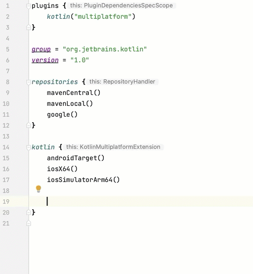
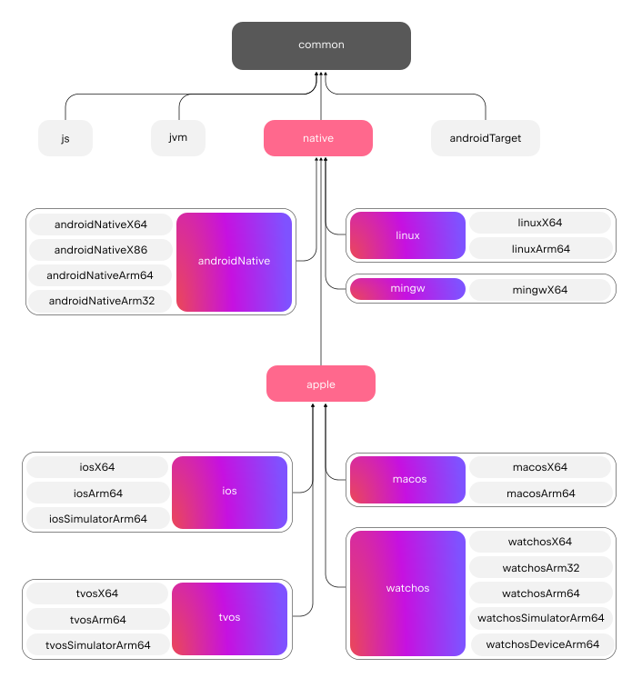
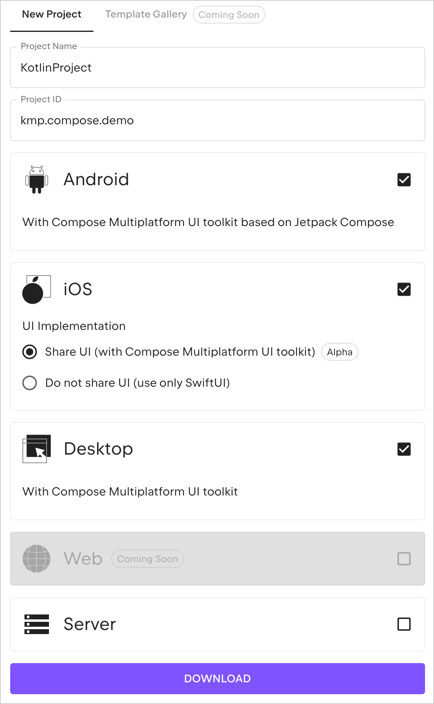

+++
title = "13.6.5.1 Kotlin 1.9.20 新变化"
date = 2026-09-13T08:50:47+08:00
weight = 1
type = "docs"
description = ""
isCJKLanguage = true
draft = false
+++


> 原文链接: [https://kotlinlang.org/docs/whatsnew1920.html](https://kotlinlang.org/docs/whatsnew1920.html)

# 13.6.5.1 Kotlin 1.9.20 新变化

阅读 Kotlin 1.9.20 发行说明，了解新的语言特性，以及 Kotlin Multiplatform、JVM、Native、JS、Wasm 的更新和 Gradle、Maven 的构建工具支持。

_[发布时间：2023 年 11 月 1 日](../../../13.5-Releases/#release-history)_

Kotlin 1.9.20 已经发布，[面向所有目标的 K2 编译器现在处于 Beta 阶段](#new-kotlin-k2-compiler-updates)，并且 [Kotlin Multiplatform 已进入 Stable](#kotlin-multiplatform-is-stable)。此外，以下是一些主要亮点：

* [用于设置多平台项目的新默认层次结构模板](#template-for-configuring-multiplatform-projects)
* [Kotlin Multiplatform 中对 Gradle 配置缓存的完整支持](#full-support-for-the-gradle-configuration-cache-in-kotlin-multiplatform)
* [Kotlin/Native 中默认启用自定义内存分配器](#custom-memory-allocator-enabled-by-default)
* [Kotlin/Native 中垃圾回收器的性能改进](#performance-improvements-for-the-garbage-collector)
* [Kotlin/Wasm 中的新目标与重命名后的目标](#new-wasm-wasi-target-and-the-renaming-of-the-wasm-target-to-wasm-js)
* [Kotlin/Wasm 标准库中对 WASI API 的支持](#support-for-the-wasi-api-in-the-standard-library)

你也可以在这个视频中查看这些更新的简短概述：

视频：[What's new in Kotlin 1.9.20](https://www.youtube.com/v/Ol_96CHKqg8)

> **提示：** 有关 Kotlin 发布周期的信息，请参见 [Kotlin 发布流程](../../../13.5-Releases/)。

## IDE 支持 {#ide-support}

支持 1.9.20 的 Kotlin 插件可用于：

| IDE            | 支持的版本                     |

| IntelliJ IDEA  | 2023.1.x、2023.2.x、2023.x             |
| Android Studio | Hedgehog (2023.1.1)、Iguana (2023.2.1) |

> **注意：** 从 IntelliJ IDEA 2023.3.x 和 Android Studio Iguana (2023.2.1) Canary 15 开始，Kotlin 插件会自动包含并更新。你需要做的只是更新项目中的 Kotlin 版本。

## Kotlin K2 编译器的新更新 {#new-kotlin-k2-compiler-updates}

JetBrains 的 Kotlin 团队继续稳定新的 K2 编译器，它将带来重大的性能改进、加快新语言特性的开发、统一 Kotlin 支持的所有平台，并为多平台项目提供更好的架构。

K2 目前对所有目标都处于 **Beta** 阶段。[在发布博客文章中了解更多](https://blog.jetbrains.com/kotlin/2023/11/kotlin-1-9-20-released/)

### 对 Kotlin/Wasm 的支持 {#support-for-kotlin-wasm}

从此版本开始，Kotlin/Wasm 支持新的 K2 编译器。[了解如何在你的项目中启用它](#how-to-enable-the-kotlin-k2-compiler)。

### 使用 K2 预览 kapt 编译器插件 {#preview-kapt-compiler-plugin-with-k2}

> **警告：** kapt 编译器插件中对 K2 的支持是[实验性](../../../13.4-ComponentsStability/)的。需要选择启用（详见下文），并且只应用于评估目的。

在 1.9.20 中，你可以尝试把 [kapt 编译器插件](../../../../compilerandplugins/12.2-Kotlincompilerplugins/12.2.3-Kapt/)与 K2 编译器一起使用。要在项目中使用 K2 编译器，请在 `gradle.properties` 文件中添加以下选项：

```text
kotlin.experimental.tryK2=true
kapt.use.k2=true
```

或者，你可以通过完成以下步骤为 kapt 启用 K2：
1. 在 `build.gradle.kts` 文件中[把语言版本设置](../../../../buildtools/11.1-Gradle/11.1.5-GradleCompilerOptions/#example-of-setting-languageversion)为 `2.0`。
2. 在 `gradle.properties` 文件中添加 `kapt.use.k2=true`。

如果你在把 kapt 与 K2 编译器一起使用时遇到任何问题，请报告到我们的[问题跟踪器](http://kotl.in/issue)。

### 如何启用 Kotlin K2 编译器 {#how-to-enable-the-kotlin-k2-compiler}

#### 在 Gradle 中启用 K2 {#enable-k2-in-gradle}

要启用并测试 Kotlin K2 编译器，请通过以下编译器选项使用新的语言版本：

```bash
-language-version 2.0
```

你可以在 `build.gradle.kts` 文件中指定它：

```kotlin
kotlin {
    sourceSets.all {
        languageSettings {
            languageVersion = "2.0"
        }
    }
}
```

#### 在 Maven 中启用 K2 {#enable-k2-in-maven}

要启用并测试 Kotlin K2 编译器，请更新 `pom.xml` 文件的 `<project/>` 部分：

```xml
<properties>
    <kotlin.compiler.languageVersion>2.0</kotlin.compiler.languageVersion>
</properties>
```

#### 在 IntelliJ IDEA 中启用 K2 {#enable-k2-in-intellij-idea}

要在 IntelliJ IDEA 中启用并测试 Kotlin K2 编译器，请前往 **Settings** | **Build, Execution, Deployment** |
**Compiler** | **Kotlin Compiler**，并把 **Language Version** 字段更新为 `2.0 (experimental)`。

### 留下你对新 K2 编译器的反馈 {#leave-your-feedback-on-the-new-k2-compiler}

我们欢迎你的任何反馈！

* 在 Kotlin Slack 上直接向 K2 开发者提供反馈——[获取邀请](https://surveys.jetbrains.com/s3/kotlin-slack-sign-up?_gl=1*ju6cbn*_ga*MTA3MTk5NDkzMC4xNjQ2MDY3MDU4*_ga_9J976DJZ68*MTY1ODMzNzA3OS4xMDAuMS4xNjU4MzQwODEwLjYw)并加入 [#k2-early-adopters](https://kotlinlang.slack.com/archives/C03PK0PE257) 频道。
* 在[我们的问题跟踪器](https://kotl.in/issue)中报告你使用新 K2 编译器时遇到的任何问题。
* [启用 Send usage statistics 选项](https://www.jetbrains.com/help/idea/settings-usage-statistics.html)，允许 JetBrains 收集有关 K2 使用情况的匿名数据。

## Kotlin/JVM {#kotlin-jvm}

从 1.9.20 版本开始，编译器可以生成包含 Java 21 字节码的类。

## Kotlin/Native {#kotlin-native}

Kotlin 1.9.20 包含稳定的内存管理器（默认启用新的内存分配器）、垃圾回收器的性能改进以及其他更新：

* [默认启用自定义内存分配器](#custom-memory-allocator-enabled-by-default)
* [垃圾回收器的性能改进](#performance-improvements-for-the-garbage-collector)
* [`klib` 制品的增量编译](#incremental-compilation-of-klib-artifacts)
* [管理库链接问题](#managing-library-linkage-issues)
* [类构造器调用时初始化伴生对象](#companion-object-initialization-on-class-constructor-calls)
* [所有 cinterop 声明都需要选择启用](#opt-in-requirement-for-all-cinterop-declarations)
* [链接器错误的自定义消息](#custom-message-for-linker-errors)
* [移除旧内存管理器](#removal-of-the-legacy-memory-manager)
* [目标层级政策的变更](#change-to-our-target-tiers-policy)

### 默认启用自定义内存分配器 {#custom-memory-allocator-enabled-by-default}

Kotlin 1.9.20 默认启用了新的内存分配器。它旨在替换之前的默认分配器 `mimalloc`，使垃圾回收更高效，并提升 [Kotlin/Native 内存管理器](../../../../development/6.3-Nativedevelopment/6.3.5-Memorymanager/6.3.5.1-NativeMemoryManager/)的运行时性能。

新的自定义分配器把系统内存划分为页，允许按连续顺序独立清理。每次分配都会成为页内的一个内存块，页会跟踪块大小。不同的页类型针对各种分配大小进行了优化。内存块的连续排列确保了对所有已分配块的高效遍历。

当线程分配内存时，它会根据分配大小搜索合适的页。线程为不同的大小类别维护一组页。通常，给定大小的当前页可以容纳该分配。如果不能，线程会从共享分配空间请求另一个页。这个页可能已经可用、需要清理，或者需要先创建。

新的分配器允许同时存在多个独立的分配空间，这将使 Kotlin 团队能够试验不同的页布局，从而进一步提升性能。

#### 如何启用自定义内存分配器 {#how-to-enable-the-custom-memory-allocator}

从 Kotlin 1.9.20 开始，新的内存分配器是默认选项。无需额外配置。

如果你遇到内存占用过高的情况，可以在 Gradle 构建脚本中用 `-Xallocator=mimalloc` 或 `-Xallocator=std` 切换回 `mimalloc` 或系统分配器。请在 [YouTrack](https://kotl.in/issue) 中报告这类问题，帮助我们改进新的内存分配器。

有关新分配器设计的技术细节，请参见这个 [README](https://kotlinlang.org/docs/https://github.com/JetBrains/kotlin/blob/master/kotlin-native/runtime/src/alloc/custom/README.html)。

### 垃圾回收器的性能改进 {#performance-improvements-for-the-garbage-collector}

Kotlin 团队继续改进新的 Kotlin/Native 内存管理器的性能和稳定性。此版本为垃圾回收器（GC）带来了若干重要变更，包括 1.9.20 的以下亮点：

* [完全并行标记以缩短 GC 暂停时间](#full-parallel-mark-to-reduce-the-pause-time-for-the-gc)
* [以大块跟踪内存以改善分配性能](#tracking-memory-in-big-chunks-to-improve-the-allocation-performance)

#### 完全并行标记以缩短 GC 暂停时间 {#full-parallel-mark-to-reduce-the-pause-time-for-the-gc}

以前，默认垃圾回收器只执行部分并行标记。当修改器线程被暂停时，它会从自身根（例如线程局部变量和调用栈）开始标记。同时，单独的 GC 线程负责从全局根以及所有仍在运行原生代码、因此未被暂停的修改器线程的根开始标记。

在全局对象数量有限、且修改器线程有大量时间处于可运行状态执行 Kotlin 代码时，这种方式效果很好。然而，典型的 iOS 应用并非如此。

现在 GC 使用完全并行标记，把被暂停的修改器线程、GC 线程以及可选的标记线程结合起来处理标记队列。默认情况下，标记过程由以下部分组成：

* 被暂停的修改器线程。它们不再只处理自身的根然后闲置，而是参与整个标记过程。
* GC 线程。这确保至少有一个线程执行标记。

这种新方式使标记过程更高效，从而缩短了 GC 的暂停时间。

#### 以大块跟踪内存以改善分配性能 {#tracking-memory-in-big-chunks-to-improve-the-allocation-performance}

以前，GC 调度器逐个跟踪每个对象的分配。然而，无论新的默认自定义分配器还是 `mimalloc` 内存分配器，都不会为每个对象分配单独的存储；它们会一次性为若干对象分配大片区域。

在 Kotlin 1.9.20 中，GC 跟踪的是区域而不是单个对象。这通过减少每次分配执行的任务数量来加快小对象的分配，从而有助于把垃圾回收器的内存占用降到最低。

### klib 制品的增量编译 {#incremental-compilation-of-klib-artifacts}

> **警告：** 该特性是[实验性](../../../13.4-ComponentsStability/#stability-levels-explained)的。它随时可能被放弃或更改。需要选择启用（详见下文）。请仅将其用于评估目的。我们欢迎你在 [YouTrack](https://kotl.in/issue) 中提供反馈。

Kotlin 1.9.20 为 Kotlin/Native 引入了新的编译时间优化。把 `klib` 制品编译为原生代码的过程现在是部分增量的。

在调试模式下把 Kotlin 源代码编译为原生二进制时，编译分为两个阶段：

1. 源代码被编译为 `klib` 制品。
2. `klib` 制品连同依赖一起被编译为二进制。

为了优化第二阶段的编译时间，团队已经为依赖实现了编译器缓存。依赖只会被编译为原生代码一次，之后每次编译二进制时都复用结果。但由项目源码构建的 `klib` 制品在每次项目变更时都会被完整重新编译为原生代码。

有了新的增量编译，如果项目模块的变更只导致源代码部分重新编译为 `klib` 制品，那么只有 `klib` 的一部分会被进一步重新编译为二进制。

要启用增量编译，请在 `gradle.properties` 文件中添加以下选项：

```none
kotlin.incremental.native=true
```

如果你遇到任何问题，请把这类情况报告到 [YouTrack](https://kotl.in/issue)。

### 管理库链接问题 {#managing-library-linkage-issues}

此版本改进了 Kotlin/Native 编译器处理 Kotlin 库中链接问题的方式。错误消息现在使用签名名称而不是哈希，从而包含更可读的声明，帮助你更容易地找到并修复问题。以下是一个示例：

```text
No function found for symbol 'org.samples/MyClass.removedFunction|removedFunction(kotlin.Int;kotlin.String){}[0]'
```
Kotlin/Native 编译器会检测第三方 Kotlin 库之间的链接问题，并在运行时报告错误。如果某个第三方 Kotlin 库的作者对另一个第三方 Kotlin 库所消费的实验性 API 做了不兼容的更改，你就可能遇到这类问题。

从 Kotlin 1.9.20 开始，编译器默认以静默模式检测链接问题。你可以在项目中调整该设置：

* 如果你想把这些问题记录到编译日志中，可以用 `-Xpartial-linkage-loglevel=WARNING` 编译器选项启用警告。
* 也可以把报告的警告严重级别提升为编译错误：`-Xpartial-linkage-loglevel=ERROR`。在这种情况下编译会失败，你会在编译日志中看到所有错误。使用该选项可以更仔细地检查链接问题。

```kotlin
// 在 Gradle 构建文件中传递编译器选项的示例：
kotlin {
    macosX64("native") {
        binaries.executable()

        compilations.configureEach {
            compilerOptions.configure {
                // 把链接问题报告为警告：
                freeCompilerArgs.add("-Xpartial-linkage-loglevel=WARNING")

                // 把链接警告提升为错误：
                freeCompilerArgs.add("-Xpartial-linkage-loglevel=ERROR")
            }
        }
    }
}
```

如果你在使用该特性时遇到意外问题，随时可以用 `-Xpartial-linkage=disable` 编译器选项选择退出。请不要犹豫，把这类情况报告到[我们的问题跟踪器](https://kotl.in/issue)。

### 类构造器调用时初始化伴生对象 {#companion-object-initialization-on-class-constructor-calls}

从 Kotlin 1.9.20 开始，Kotlin/Native 后端会在类构造器中调用伴生对象的静态初始化器：

```kotlin
class Greeting {
    companion object {
        init {
            print("Hello, Kotlin!")
        }
    }
}

fun main() {
    val start = Greeting() // 打印 "Hello, Kotlin!"
}
```

该行为现在与 Kotlin/JVM 统一：在加载（解析）与 Java 静态初始化器语义相符的对应类时，会初始化伴生对象。

既然该特性的实现在各平台之间更加一致，在 Kotlin Multiplatform 项目中共享代码就更容易了。

### 所有 cinterop 声明都需要选择启用 {#opt-in-requirement-for-all-cinterop-declarations}

从 Kotlin 1.9.20 开始，`cinterop` 工具从 C 和 Objective-C 库（例如 libcurl 和 libxml）生成的所有 Kotlin 声明都被标记为 `@ExperimentalForeignApi`。如果缺少选择启用注解，你的代码将无法编译。

这一要求反映了导入 C 和 Objective-C 库的[实验性](../../../13.4-ComponentsStability/#stability-levels-explained)状态。我们建议你把它限制在项目的特定区域内使用。当我们在未来开始稳定该导入时，你的迁移会更容易。

> **注意：** 至于随 Kotlin/Native 提供的原生平台库（例如 Foundation、UIKit 和 POSIX），只有部分 API 需要使用 `@ExperimentalForeignApi` 选择启用。在这些情况下，你会看到带有选择启用要求的警告。

### 链接器错误的自定义消息 {#custom-message-for-linker-errors}

如果你是库作者，现在可以用自定义消息帮助你的用户解决链接器错误。

如果你的 Kotlin 库依赖 C 或 Objective-C 库（例如使用 [CocoaPods 集成](https://kotlinlang.org/docs/multiplatform/multiplatform-cocoapods-overview.html)），其用户需要在机器上本地拥有这些依赖库，或者在项目构建脚本中显式配置它们。如果情况并非如此，用户会得到令人困惑的 "Framework not found" 消息。

你现在可以在编译失败消息中提供具体的说明或链接。为此，请把 `-Xuser-setup-hint` 编译器选项传给 `cinterop`，或者在 `.def` 文件中添加 `userSetupHint=message` 属性。

### 移除旧内存管理器 {#removal-of-the-legacy-memory-manager}

[新内存管理器](../../../../development/6.3-Nativedevelopment/6.3.5-Memorymanager/6.3.5.1-NativeMemoryManager/)在 Kotlin 1.6.20 中引入，并在 1.7.20 中成为默认。从那时起，它持续获得更新和性能改进，并已进入 Stable。

现在是完成弃用周期并移除旧内存管理器的时候了。如果你仍在使用它，请从 `gradle.properties` 中移除 `kotlin.native.binary.memoryModel=strict` 选项，并按照我们的[迁移指南](../../../../development/6.3-Nativedevelopment/6.3.5-Memorymanager/6.3.5.3-NativeMigrationGuide/)进行必要的更改。

### 目标层级政策的变更 {#change-to-our-target-tiers-policy}

我们决定提高[第 1 层级支持](../../../../development/6.3-Nativedevelopment/6.3.8-NativeTargetSupport/#tier-1)的要求。Kotlin 团队现在承诺为符合第 1 层级条件的目标在编译器版本之间提供源码和二进制兼容性。这些目标还必须定期通过 CI 工具测试，以确保能够编译和运行。目前，第 1 层级包含以下适用于 macOS 主机的目标：

* `macosX64`
* `macosArm64`
* `iosSimulatorArm64`
* `iosX64`

在 Kotlin 1.9.20 中，我们还移除了一些此前已弃用的目标，即：

* `iosArm32`
* `watchosX86`
* `wasm32`
* `mingwX86`
* `linuxMips32`
* `linuxMipsel32`

请查看当前[受支持目标](../../../../development/6.3-Nativedevelopment/6.3.8-NativeTargetSupport/)的完整列表。

## Kotlin Multiplatform {#kotlin-multiplatform}

Kotlin 1.9.20 聚焦于 Kotlin Multiplatform 的稳定化，并通过新的项目向导和其他值得注意的特性在改善开发者体验方面迈出新的一步：

* [Kotlin Multiplatform 已进入 Stable](#kotlin-multiplatform-is-stable)
* [用于配置多平台项目的模板](#template-for-configuring-multiplatform-projects)
* [新的项目向导](#new-project-wizard)
* [对 Gradle 配置缓存的完整支持](#full-support-for-the-gradle-configuration-cache-in-kotlin-multiplatform)
* [在 Gradle 中更轻松地配置新的标准库版本](#easier-configuration-of-new-standard-library-versions-in-gradle)
* [默认支持第三方 cinterop 库](#default-support-for-third-party-cinterop-libraries)
* [Compose Multiplatform 项目中支持 Kotlin/Native 编译缓存](#support-for-kotlin-native-compilation-caches-in-compose-multiplatform-projects)
* [兼容性指南](#compatibility-guidelines)

### Kotlin Multiplatform 已进入 Stable {#kotlin-multiplatform-is-stable}

1.9.20 版本标志着 Kotlin 演进中的一个重要里程碑：[Kotlin Multiplatform](https://kotlinlang.org/docs/multiplatform/get-started.html) 终于进入 Stable。这意味着该技术可以在你的项目中安全使用，并 100% 可以用于生产。这也意味着 Kotlin Multiplatform 的后续发展将按照我们严格的[向后兼容规则](https://kotlinfoundation.org/language-committee-guidelines/)继续进行。

请注意，Kotlin Multiplatform 的一些高级特性仍在演进中。使用它们时，你会收到一条警告，说明你所用特性的当前稳定状态。在 IntelliJ IDEA 中使用任何实验性功能之前，你需要在 **Settings** | **Advanced Settings** | **Kotlin** | **Experimental Multiplatform** 中显式启用它。

* 请访问 [Kotlin 博客](https://blog.jetbrains.com/kotlin/2023/11/kotlin-multiplatform-stable/)以进一步了解 Kotlin Multiplatform 的稳定化及未来计划。
* 请查看[多平台兼容性指南](https://kotlinlang.org/docs/multiplatform/multiplatform-compatibility-guide.html)，了解在稳定化过程中做了哪些重要变更。
* 阅读[预期声明与实际声明机制](https://kotlinlang.org/docs/multiplatform/multiplatform-expect-actual.html)，这是 Kotlin Multiplatform 的重要组成部分，在此版本中也得到了部分稳定化。

### 用于配置多平台项目的模板 {#template-for-configuring-multiplatform-projects}

从 Kotlin 1.9.20 开始，Kotlin Gradle 插件会为常见的多平台场景自动创建共享源集。如果你的项目配置属于其中之一，就无需手动配置源集层次结构，只需显式指定项目所需的目标即可。

得益于默认层次结构模板（Kotlin Gradle 插件的新特性），配置现在更简单了。它是内置于插件中的预定义源集层次结构模板。它包含 Kotlin 为你声明的目标自动创建的中间源集。[查看完整模板](#see-the-full-hierarchy-template)。

#### 更轻松地创建项目 {#create-your-project-easier}

考虑一个面向 Android 和 iPhone 设备、在 Apple 芯片 MacBook 上开发的多平台项目。比较一下该项目在不同 Kotlin 版本中的配置方式：

| Kotlin 1.9.0 及更早版本（标准配置） | Kotlin 1.9.20 |
| --- | --- |
| ```kotlin kotlin {     androidTarget()     iosArm64()     iosSimulatorArm64()      sourceSets {         val commonMain by getting          val iosMain by creating {             dependsOn(commonMain)         }          val iosArm64Main by getting {             dependsOn(iosMain)         }          val iosSimulatorArm64Main by getting {             dependsOn(iosMain)         }     } } ``` | ```kotlin kotlin {     androidTarget()     iosArm64()     iosSimulatorArm64()      // iosMain 源集会自动创建 } ``` |

注意使用默认层次结构模板大大减少了配置项目所需的样板代码。

当你在代码中声明 `androidTarget`、`iosArm64` 和 `iosSimulatorArm64` 目标时，Kotlin Gradle 插件会从模板中找到合适的共享源集并为你创建它们。生成的层次结构如下所示：

{thumbnail="true" width="350" thumbnail-same-file="true"}

绿色的源集是实际创建并包含在项目中的，而默认模板中的灰色源集会被忽略。

#### 为源集使用代码补全 {#use-completion-for-source-sets}

为了让你更容易使用创建出的项目结构，IntelliJ IDEA 现在为使用默认层次结构模板创建的源集提供代码补全：



如果你尝试访问一个因未声明相应目标而不存在的源集，Kotlin 也会给出警告。在下面的示例中没有 JVM 目标（只有 `androidTarget`，两者并不相同）。但我们试着使用 `jvmMain` 源集，看看会发生什么：

```kotlin
kotlin {
    androidTarget()
    iosArm64()
    iosSimulatorArm64()

    sourceSets {
        jvmMain {
        }
    }
}
```

在这种情况下，Kotlin 会在构建日志中报告警告：

```none
w: Accessed 'source set jvmMain' without registering the jvm target:
  kotlin {
      jvm() // jvm() /* <- 注册 'jvm' 目标 */

      sourceSets.jvmMain.dependencies {

      }
  }
```

#### 设置目标层次结构 {#set-up-the-target-hierarchy}

从 Kotlin 1.9.20 开始，默认层次结构模板会自动启用。在大多数情况下无需额外配置。

不过，如果你在迁移 1.9.20 之前创建的现有项目，并且此前用 `dependsOn()` 调用手动引入了中间源集，你可能会遇到警告。要解决该问题，请执行以下操作：

* 如果你的中间源集已被默认层次结构模板覆盖，请移除所有手动的 `dependsOn()` 调用以及用 `by creating` 构造创建的源集。

要查看所有默认源集的列表，请参见[完整层次结构模板](#see-the-full-hierarchy-template)。

* 如果你想要默认层次结构模板未提供的额外源集，例如一个在 macOS 和 JVM 目标之间共享代码的源集，请调整层次结构：用 `applyDefaultHierarchyTemplate()` 显式重新应用模板，并像往常一样用 `dependsOn()` 手动配置额外的源集：

```kotlin
  kotlin {
      jvm()
      macosArm64()
      iosArm64()
      iosSimulatorArm64()

      // 显式应用默认层次结构。例如，它会创建 iosMain 源集：
      applyDefaultHierarchyTemplate()

      sourceSets {
          // 创建一个额外的 jvmAndMacos 源集
          val jvmAndMacos by creating {
              dependsOn(commonMain.get())
          }

          macosArm64Main.get().dependsOn(jvmAndMacos)
          jvmMain.get().dependsOn(jvmAndMacos)
      }
  }
```

* 如果你的项目中已有源集与模板生成的源集名称完全相同，但在不同的目标集合之间共享，那么目前无法修改模板源集之间默认的 `dependsOn` 关系。

此时你可以选择一个适合你用途的其他源集，既可以在默认层次结构模板中找，也可以手动创建。另一种选择是完全退出该模板。

要退出，请在 `gradle.properties` 中添加 `kotlin.mpp.applyDefaultHierarchyTemplate=false`，并手动配置所有其他源集。

我们目前正在开发用于创建你自己层次结构模板的 API，以简化这类情况下的配置过程。

#### 查看完整层次结构模板 {#see-the-full-hierarchy-template}

当你声明项目编译到的目标时，插件会相应地从模板中挑选共享源集并在你的项目中创建它们。



> **提示：** 此示例只展示项目的生产部分，省略了 `Main` 后缀（例如使用 `common` 而不是 `commonMain`）。不过，对于 `*Test` 源也是一样。

### 新的项目向导 {#new-project-wizard}

JetBrains 团队正在引入一种创建跨平台项目的新方式——[Kotlin Multiplatform Web 向导](https://kmp.jetbrains.com)。

新的 Kotlin Multiplatform 向导的第一个实现涵盖了最常见的 Kotlin Multiplatform 用例。它融合了关于之前项目模板的所有反馈，并使架构尽可能健壮可靠。

新向导采用分布式架构，允许我们拥有统一的后端和不同的前端，Web 版本是第一步。我们正在考虑将来既实现 IDE 版本，也创建命令行工具。在 Web 上你总能获得最新版本的向导，而在 IDE 中则需要等待下一个版本。

有了新向导，项目配置比以往更容易。你可以通过选择移动端、服务端和桌面端开发的目标平台来定制项目。我们还计划在未来的版本中添加 Web 开发。



新的项目向导现在是使用 Kotlin 创建跨平台项目的首选方式。从 1.9.20 起，Kotlin 插件不再在 IntelliJ IDEA 中提供 **Kotlin Multiplatform** 项目向导。

新向导会轻松引导你完成初始配置，让上手过程顺畅得多。如果你遇到任何问题，请报告到 [YouTrack](https://kotl.in/issue)，帮助我们改善你对向导的体验。


### Kotlin Multiplatform 中对 Gradle 配置缓存的完整支持 {#full-support-for-the-gradle-configuration-cache-in-kotlin-multiplatform}

此前我们引入了 [Gradle 配置缓存的预览](../13.6.5.2-Whatsnew19/#preview-of-the-gradle-configuration-cache)，它适用于 Kotlin 多平台库。在 1.9.20 中，Kotlin Multiplatform 插件又向前迈出了一步。

它现在在 [Kotlin CocoaPods Gradle 插件](https://kotlinlang.org/docs/multiplatform/multiplatform-cocoapods-dsl-reference.html)中支持 Gradle 配置缓存，也支持 Xcode 构建所必需的集成任务，例如 `embedAndSignAppleFrameworkForXcode`。

现在所有多平台项目都能受益于改进后的构建时间。Gradle 配置缓存通过为后续构建复用配置阶段的结果来加快构建过程。更多细节和配置说明请参见 [Gradle 文档](https://docs.gradle.org/current/userguide/configuration_cache.html#config_cache:usage)。

### 在 Gradle 中更轻松地配置新的标准库版本 {#easier-configuration-of-new-standard-library-versions-in-gradle}

当你创建多平台项目时，会自动为每个源集添加标准库（`stdlib`）依赖。这是开始使用多平台项目最简单的方式。

以前，如果你想手动配置对标准库的依赖，需要为每个源集单独配置。从 `kotlin-stdlib:1.9.20` 起，你只需在 `commonMain` 根源集中配置**一次**依赖：

| 标准库版本 1.9.10 及更早 | 标准库版本 1.9.20 |
| --- | --- |
| ```kotlin kotlin {     sourceSets {         // For the common source set         val commonMain by getting {             dependencies {                 implementation("org.jetbrains.kotlin:kotlin-stdlib-common:1.9.10")             }         }          // For the JVM source set         val jvmMain by getting {             dependencies {                 implementation("org.jetbrains.kotlin:kotlin-stdlib:1.9.10")             }         }          // For the JS source set         val jsMain by getting {             dependencies {                 implementation("org.jetbrains.kotlin:kotlin-stdlib-js:1.9.10")             }         }     } } ``` | ```kotlin kotlin {     sourceSets {         commonMain {             dependencies {                 implementation("org.jetbrains.kotlin:kotlin-stdlib:1.9.20")             }         }     } } ``` |

这一变更之所以可行，是因为标准库的 Gradle 元数据中加入了新信息。这使 Gradle 能为其他源集自动解析正确的标准库制品。

### 默认支持第三方 cinterop 库 {#default-support-for-third-party-cinterop-libraries}

Kotlin 1.9.20 为应用了 [Kotlin CocoaPods Gradle](https://kotlinlang.org/docs/multiplatform/multiplatform-cocoapods-overview.html) 插件的项目中的全部 cinterop 依赖添加了默认支持（而不是需要选择启用的支持）。

这意味着你现在可以共享更多原生代码，而不会受平台特定依赖的限制。例如，你可以向 `iosMain` 共享源集添加[对 Pod 库的依赖](https://kotlinlang.org/docs/multiplatform/multiplatform-cocoapods-libraries.html)。

以前，这只适用于随 Kotlin/Native 发行版提供的[平台特定库](../../../../development/6.3-Nativedevelopment/6.3.4-NativePlatformLibs/)（例如 Foundation、UIKit 和 POSIX）。现在所有第三方 Pod 库默认都可以在共享源集中使用。你不再需要指定单独的 Gradle 属性来支持它们。

### Compose Multiplatform 项目中支持 Kotlin/Native 编译缓存 {#support-for-kotlin-native-compilation-caches-in-compose-multiplatform-projects}

此版本解决了与 Compose Multiplatform 编译器插件的兼容性问题，该问题主要影响 iOS 的 Compose Multiplatform 项目。

为了绕开该问题，你不得不使用 `kotlin.native.cacheKind=none` Gradle 属性禁用缓存。然而这种变通方案付出了性能代价：由于 Kotlin/Native 编译器中缓存无法工作，编译时间变慢了。

现在问题已修复，你可以从 `gradle.properties` 文件中移除 `kotlin.native.cacheKind=none`，并享受 Compose Multiplatform 项目中改进后的编译时间。

关于改善编译时间的更多提示，请参见 [Kotlin/Native 文档](../../../../development/6.3-Nativedevelopment/6.3.9-NativeImprovingCompilationTime/)。

### 兼容性指南 {#compatibility-guidelines}

在配置项目时，请检查 Kotlin Multiplatform Gradle 插件与可用 Gradle、Xcode 和 Android Gradle 插件（AGP）版本的兼容性：

| Kotlin Multiplatform Gradle 插件 | Gradle | Android Gradle 插件 | Xcode |

| 1.9.20        | 7.5 及更高版本 | 7.4.2–8.2 | 15.0。详见下文 |

从此版本起，推荐的 Xcode 版本是 15.0。随 Xcode 15.0 交付的库得到完整支持，你可以在 Kotlin 代码中的任何位置访问它们。

不过，XCode 14.3 在大多数情况下仍应可用。请记住，如果你在本地机器上使用 14.3 版本，随 Xcode 15 交付的库会可见但无法访问。

## Kotlin/Wasm {#kotlin-wasm}

在 1.9.20 中，Kotlin Wasm 达到了 [Alpha 级别](../../../13.4-ComponentsStability/)的稳定性。

* [与 Wasm GC 第 4 阶段和最终操作码的兼容性](#compatibility-with-wasm-gc-phase-4-and-final-opcodes)
* [新的 `wasm-wasi` 目标，以及把 `wasm` 目标重命名为 `wasm-js`](#new-wasm-wasi-target-and-the-renaming-of-the-wasm-target-to-wasm-js)
* [标准库中对 WASI API 的支持](#support-for-the-wasi-api-in-the-standard-library)
* [Kotlin/Wasm API 改进](#kotlin-wasm-api-improvements)

> **注意：** Kotlin Wasm 处于 [Alpha](../../../13.4-ComponentsStability/) 阶段。它随时可能发生变化。请仅将其用于评估目的。我们欢迎你在 [YouTrack](https://kotl.in/issue) 中提供反馈。

### 与 Wasm GC 第 4 阶段和最终操作码的兼容性 {#compatibility-with-wasm-gc-phase-4-and-final-opcodes}

Wasm GC 进入最终阶段，需要更新操作码——二进制表示中使用的常量数字。Kotlin 1.9.20 支持最新的操作码，因此我们强烈建议你把 Wasm 项目更新到最新的 Kotlin 版本。我们还建议使用带 Wasm 环境的最新浏览器版本：
* 对于 Chrome 和基于 Chromium 的浏览器，使用 119 或更高版本。
* 对于 Firefox，使用 119 或更高版本。请注意，在 Firefox 119 中你需要[手动开启 Wasm GC](../../../../development/6.2-Webdevelopment/6.2.3-Webassemblywasm/6.2.3.6-WasmConfiguration/)。

### 新的 wasm-wasi 目标，以及把 wasm 目标重命名为 wasm-js {#new-wasm-wasi-target-and-the-renaming-of-the-wasm-target-to-wasm-js}

在此版本中，我们为 Kotlin/Wasm 引入了新目标 `wasm-wasi`，并把 `wasm` 目标重命名为 `wasm-js`。在 Gradle DSL 中，这些目标分别以 `wasmWasi {}` 和 `wasmJs {}` 的形式提供。

要在项目中使用这些目标，请更新 `build.gradle.kts` 文件：

```kotlin
kotlin {
    wasmWasi {
        // ...
    }
    wasmJs {
        // ...
    }
}
```

此前引入的 `wasm {}` 块已被弃用，建议改用 `wasmJs {}`。

要迁移现有的 Kotlin/Wasm 项目，请执行以下操作：
* 在 `build.gradle.kts` 文件中，把 `wasm {}` 块重命名为 `wasmJs {}`。
* 在项目结构中，把 `wasmMain` 目录重命名为 `wasmJsMain`。

### 标准库中对 WASI API 的支持 {#support-for-the-wasi-api-in-the-standard-library}

在此版本中，我们加入了对 [WASI](https://github.com/WebAssembly/WASI) 的支持，它是 Wasm 平台的系统接口。WASI 支持通过提供一组用于访问系统资源的标准化 API，让你更容易在浏览器之外（例如在服务端应用）使用 Kotlin/Wasm。此外，WASI 提供了基于能力的安全机制——在访问外部资源时的另一层安全保障。

要运行 Kotlin/Wasm 应用，你需要一个支持 Wasm 垃圾回收（GC）的虚拟机，例如 Node.js 或 Deno。Wasmtime、WasmEdge 等仍在努力实现完整的 Wasm GC 支持。

要导入 WASI 函数，请使用 `@WasmImport` 注解：

```kotlin
import kotlin.wasm.WasmImport

@WasmImport("wasi_snapshot_preview1", "clock_time_get")
private external fun wasiRawClockTimeGet(clockId: Int, precision: Long, resultPtr: Int): Int
```

[你可以在我们的 GitHub 仓库中找到完整示例](https://github.com/Kotlin/kotlin-wasm-examples/tree/main/wasi-example)。

> **注意：** 在面向 `wasmWasi` 时，无法使用[与 JavaScript 的互操作](../../../../development/6.2-Webdevelopment/6.2.3-Webassemblywasm/6.2.3.5-WasmJsInterop/)。

### Kotlin/Wasm API 改进 {#kotlin-wasm-api-improvements}

此版本为 Kotlin/Wasm API 带来了若干易用性改进。例如，你不再需要为 DOM 事件监听器返回值：

| 1.9.20 之前 | 在 1.9.20 中 |
| --- | --- |
| ```kotlin fun main() {     window.onload = {         document.body?.sayHello()         null     } } ``` | ```kotlin fun main() {     window.onload = { document.body?.sayHello() } } ``` |

## Gradle {#gradle}

Kotlin 1.9.20 与 Gradle 6.8.3 到 8.1 完全兼容。你也可以使用最新 Gradle 版本以内的其他版本，但如果这样做，请记住你可能会遇到弃用警告，或者某些新的 Gradle 特性可能无法工作。

此版本带来以下变更：
* [支持测试夹具访问 internal 声明](#support-for-test-fixtures-to-access-internal-declarations)
* [用于配置 Konan 目录路径的新属性](#new-property-to-configure-paths-to-konan-directories)
* [Kotlin/Native 任务的新构建报告指标](#new-build-report-metrics-for-kotlin-native-tasks)

### 支持测试夹具访问 internal 声明 {#support-for-test-fixtures-to-access-internal-declarations}

在 Kotlin 1.9.20 中，如果你使用 Gradle 的 `java-test-fixtures` 插件，那么你的[测试夹具](https://docs.gradle.org/current/userguide/java_testing.html#sec:java_test_fixtures)现在可以访问主源集类中的 `internal` 声明。此外，任何测试源也可以看到测试夹具类中的任何 `internal` 声明。

### 用于配置 Konan 目录路径的新属性 {#new-property-to-configure-paths-to-konan-directories}

在 Kotlin 1.9.20 中，可以使用 `konan.data.dir` Gradle 属性来自定义指向 `~/.konan` 目录的路径，这样你就不必通过环境变量 `KONAN_DATA_DIR` 来配置它。

或者，你可以使用 `-Xkonan-data-dir` 编译器选项，通过 `cinterop` 和 `konanc` 工具自定义指向 `~/.konan` 目录的路径。

### Kotlin/Native 任务的新构建报告指标 {#new-build-report-metrics-for-kotlin-native-tasks}

在 Kotlin 1.9.20 中，Gradle 构建报告现在包含 Kotlin/Native 任务的指标。以下是一个包含这些指标的构建报告示例：

```none
Total time for Kotlin tasks: 20.81 s (93.1 % of all tasks time)
Time   |% of Kotlin time|Task
15.24 s|73.2 %          |:compileCommonMainKotlinMetadata
5.57 s |26.8 %          |:compileNativeMainKotlinMetadata

Task ':compileCommonMainKotlinMetadata' finished in 15.24 s
Task info:
  Kotlin language version: 2.0
Time metrics:
  Total Gradle task time: 15.24 s
  Spent time before task action: 0.16 s
  Task action before worker execution: 0.21 s
  Run native in process: 2.70 s
    Run entry point: 2.64 s
Size metrics:
  Start time of task action: 2023-07-27T11:04:17

Task ':compileNativeMainKotlinMetadata' finished in 5.57 s
Task info:
  Kotlin language version: 2.0
Time metrics:
  Total Gradle task time: 5.57 s
  Spent time before task action: 0.04 s
  Task action before worker execution: 0.02 s
  Run native in process: 1.48 s
    Run entry point: 1.47 s
Size metrics:
  Start time of task action: 2023-07-27T11:04:32
```

此外，`kotlin.experimental.tryK2` 构建报告现在会包含所有已编译的 Kotlin/Native 任务，并列出所使用的语言版本：

```none
##### 'kotlin.experimental.tryK2' results #####
:lib:compileCommonMainKotlinMetadata: 2.0 language version
:lib:compileKotlinJvm: 2.0 language version
:lib:compileKotlinIosArm64: 2.0 language version
:lib:compileKotlinIosSimulatorArm64: 2.0 language version
:lib:compileKotlinLinuxX64: 2.0 language version
:lib:compileTestKotlinJvm: 2.0 language version
:lib:compileTestKotlinIosSimulatorArm64: 2.0 language version
:lib:compileTestKotlinLinuxX64: 2.0 language version
##### 100% (8/8) tasks have been compiled with Kotlin 2.0 #####
```

> **注意：** 如果你使用 Gradle 8.0，可能会遇到一些构建报告相关的问题，尤其是在启用 Gradle 配置缓存时。这是一个已知问题，已在 Gradle 8.1 及更高版本中修复。

## 标准库 {#standard-library}

在 Kotlin 1.9.20 中，[Kotlin/Native 标准库进入 Stable](#the-kotlin-native-standard-library-becomes-stable)，并且还有一些新特性：
* [Enum 类 values 泛型函数的替代方案](#replacement-of-the-enum-class-values-generic-function)
* [Kotlin/JS 中 HashMap 操作的性能改进](#improved-performance-of-hashmap-operations-in-kotlin-js)

### Enum 类 values 泛型函数的替代方案 {#replacement-of-the-enum-class-values-generic-function}

> **警告：** 该特性是[实验性](../../../13.4-ComponentsStability/#stability-levels-explained)的。它随时可能被放弃或更改。需要选择启用（详见下文）。请仅将其用于评估目的。我们欢迎你在 [YouTrack](https://kotl.in/issue) 中提供反馈。

在 Kotlin 1.9.0 中，enum 类的 `entries` 属性已进入 Stable。`entries` 属性是合成函数 `values()` 的现代化高性能替代。作为 Kotlin 1.9.20 的一部分，泛型函数 `enumValues<T>()` 也有了替代方案：`enumEntries<T>()`。

> **提示：** `enumValues<T>()` 函数仍然受支持，但我们建议你改用 `enumEntries<T>()` 函数，因为它的性能影响更小。每次调用 `enumValues<T>()` 都会创建一个新数组，而每次调用 `enumEntries<T>()` 都返回同一个列表，效率要高得多。

例如：

```kotlin
enum class RGB { RED, GREEN, BLUE }

@OptIn(ExperimentalStdlibApi::class)
inline fun <reified T : Enum<T>> printAllValues() {
    print(enumEntries<T>().joinToString { it.name })
}

printAllValues<RGB>()
// RED, GREEN, BLUE
```

#### 如何启用 enumEntries 函数 {#how-to-enable-the-enumentries-function}

要试用该特性，请使用 `@OptIn(ExperimentalStdlibApi)` 选择启用，并使用语言版本 1.9 或更高版本。如果你使用最新版本的 Kotlin Gradle 插件，则无需指定语言版本即可测试该特性。

### Kotlin/Native 标准库进入 Stable {#the-kotlin-native-standard-library-becomes-stable}

在 Kotlin 1.9.0 中，我们[说明了](../13.6.5.2-Whatsnew19/#the-kotlin-native-standard-library-s-journey-towards-stabilization)为使 Kotlin/Native 标准库更接近稳定化目标所采取的行动。在 Kotlin 1.9.20 中，我们终于完成了这项工作，让 Kotlin/Native 标准库进入 Stable。以下是此版本的一些要点：

* [`Vector128`](https://kotlinlang.org/api/latest/jvm/stdlib/kotlinx.cinterop/-vector128/) 类已从 `kotlin.native` 包移到 `kotlinx.cinterop` 包。
* 作为 Kotlin 1.9.0 的一部分引入的 `ExperimentalNativeApi` 和 `NativeRuntimeApi` 注解的选择启用要求级别已从 `WARNING` 提升为 `ERROR`。
* Kotlin/Native 集合现在会检测并发修改，例如在 [`ArrayList`](https://kotlinlang.org/api/latest/jvm/stdlib/kotlin.collections/-array-list/) 和 [`HashMap`](https://kotlinlang.org/api/latest/jvm/stdlib/kotlin.collections/-hash-map/) 集合中。
* `Throwable` 类的 [`printStackTrace()`](https://kotlinlang.org/api/latest/jvm/stdlib/kotlin/-throwable/print-stack-trace.html) 函数现在打印到 `STDERR` 而不是 `STDOUT`。
> **警告：** `printStackTrace()` 的输出格式不是 Stable 的，可能会发生变化。

#### Atomics API 的改进 {#improvements-to-the-atomics-api}

在 Kotlin 1.9.0 中，我们说过当 Kotlin/Native 标准库进入 Stable 时，Atomics API 也就准备好进入 Stable 了。Kotlin 1.9.20 包含以下额外变更：

* 引入了实验性的 `AtomicIntArray`、`AtomicLongArray` 和 `AtomicArray<T>` 类。这些新类专门设计为与 Java 的原子数组保持一致，以便将来可以把它们纳入通用标准库。
> **警告：** `AtomicIntArray`、`AtomicLongArray` 和 `AtomicArray<T>` 类是[实验性](../../../13.4-ComponentsStability/#stability-levels-explained)的。它们随时可能被放弃或更改。要试用它们，请使用 `@OptIn(ExperimentalStdlibApi)` 选择启用。请仅将它们用于评估目的。我们欢迎你在 [YouTrack](https://kotl.in/issue) 中提供反馈。
* 在 `kotlin.native.concurrent` 包中，在 Kotlin 1.9.0 中以 `WARNING` 级别弃用的 Atomics API 的弃用级别已提升为 `ERROR`。
* 在 `kotlin.concurrent` 包中，[`AtomicInt`](https://kotlinlang.org/api/latest/jvm/stdlib/kotlin.concurrent/-atomic-int/index.html) 和 [`AtomicLong`](https://kotlinlang.org/api/latest/jvm/stdlib/kotlin.concurrent/-atomic-long/index.html) 类中弃用级别为 `ERROR` 的成员函数已被移除。
* `AtomicReference` 类的所有[成员函数](https://kotlinlang.org/api/latest/jvm/stdlib/kotlin.concurrent/-atomic-reference/#functions)现在都使用原子内在函数。

有关 Kotlin 1.9.20 中所有变更的更多信息，请参见我们的 [YouTrack 议题](https://youtrack.jetbrains.com/issue/KT-61028/Behavioural-changes-to-the-Native-stdlib-API)。

### Kotlin/JS 中 HashMap 操作的性能改进 {#improved-performance-of-hashmap-operations-in-kotlin-js}

Kotlin 1.9.20 改进了 Kotlin/JS 中 `HashMap` 操作的性能并减少了其内存占用。在内部，Kotlin/JS 把实现改为开放寻址。这意味着在以下操作中你应该会看到性能改进：
* 向 `HashMap` 中插入新元素。
* 在 `HashMap` 中查找已有元素。
* 遍历 `HashMap` 中的键或值。

## 文档更新 {#documentation-updates}

Kotlin 文档有一些值得注意的变更：
* [JVM 元数据](https://kotlinlang.org/api/kotlinx-metadata-jvm/) API 参考——探索如何使用 Kotlin/JVM 解析元数据。
* [时间测量指南](../../../../libraryguides/9.1-Standardlibrary/9.1.5-TimeMeasurement/)——了解如何在 Kotlin 中计算和测量时间。
* 改进了 [Kotlin 导览](../../../../takekotlintour/3.1-KotlinTourWelcome/)中的集合章节——通过包含理论与实践章节的内容学习 Kotlin 编程语言的基础知识。
* [明确非可空类型](../../../../languageguide/5.11-Generics/#definitely-non-nullable-types)——了解明确非可空的泛型类型。
* 改进了[数组页面](../../../../languageguide/5.4-Types/5.4.7-Arrays/)——了解数组以及何时使用它们。
* [Kotlin Multiplatform 中的预期声明与实际声明](https://kotlinlang.org/docs/multiplatform/multiplatform-expect-actual.html)——了解 Kotlin Multiplatform 中预期声明与实际声明的 Kotlin 机制。

## 安装 Kotlin 1.9.20 {#install-kotlin-1-9-20}

### 检查 IDE 版本 {#check-the-ide-version}

[IntelliJ IDEA](https://www.jetbrains.com/idea/download/) 2023.1.x 和 2023.2.x 会自动建议把 Kotlin 插件更新到 1.9.20 版本。IntelliJ IDEA 2023.3 将包含 Kotlin 1.9.20 插件。

Android Studio Hedgehog (231) 和 Iguana (232) 将在即将发布的版本中支持 Kotlin 1.9.20。

新的命令行编译器可在 [GitHub 发布页面](https://github.com/JetBrains/kotlin/releases/tag/v1.9.20)下载。

### 配置 Gradle 设置 {#configure-gradle-settings}

要下载 Kotlin 制品和依赖，请更新你的 `settings.gradle(.kts)` 文件以使用 Maven Central 仓库：

```kotlin
pluginManagement {
    repositories {
        mavenCentral()
        gradlePluginPortal()
    }
}
```

如果未指定仓库，Gradle 会使用已停止服务的 JCenter 仓库，这可能导致 Kotlin 制品出现问题。
