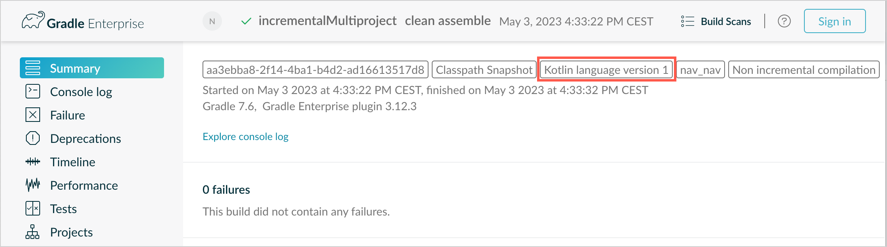
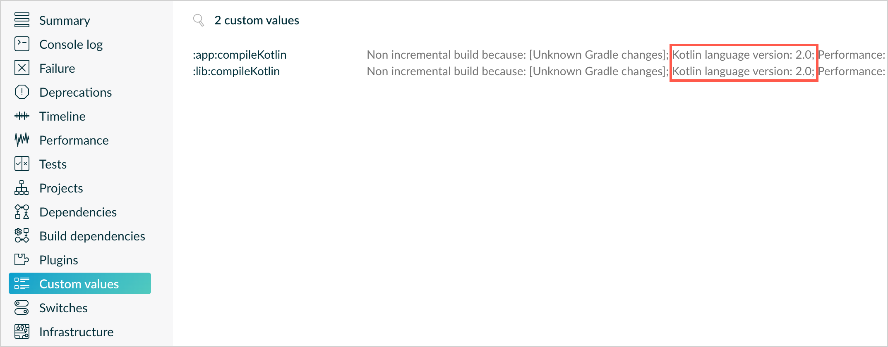

+++
title = "13.6.5.2 Kotlin 1.9.0 新变化"
date = 2026-09-13T08:50:47+08:00
weight = 2
type = "docs"
description = ""
isCJKLanguage = true
draft = false
+++


> 原文链接: [https://kotlinlang.org/docs/whatsnew19.html](https://kotlinlang.org/docs/whatsnew19.html)

# 13.6.5.2 Kotlin 1.9.0 新变化

阅读 Kotlin 1.9.0 发行说明，了解新的语言特性，以及 Kotlin Multiplatform、JVM、Native、JS、Wasm 的更新和 Gradle、Maven 的构建工具支持。

_[发布时间：2023 年 7 月 6 日](../../../13.5-Releases/#release-history)_

Kotlin 1.9.0 已经发布，JVM 版 K2 编译器现在处于 **Beta** 阶段。此外，以下是一些主要亮点：

* [Kotlin K2 编译器的新更新](#new-kotlin-k2-compiler-updates)
* [稳定的 enum 类 values 函数替代方案](#stable-replacement-of-the-enum-class-values-function)
* [稳定的用于开区间范围的 `..<` 运算符](#stable-operator-for-open-ended-ranges)
* [按名称获取正则捕获组的新通用函数](#new-common-function-to-get-regex-capture-group-by-name)
* [创建父目录的新路径工具](#new-path-utility-to-create-parent-directories)
* [Kotlin Multiplatform 中 Gradle 配置缓存的预览](#preview-of-the-gradle-configuration-cache)
* [Kotlin Multiplatform 中 Android 目标支持的变更](#changes-to-android-target-support)
* [Kotlin/Native 中自定义内存分配器的预览](#preview-of-custom-memory-allocator)
* [Kotlin/Native 中的库链接](#library-linkage-in-kotlin-native)
* [Kotlin/Wasm 中与体积相关的优化](#size-related-optimizations)

你也可以在这个视频中查看这些更新的简短概述：

视频：[What's new in Kotlin 1.9.0](https://www.youtube.com/v/fvwTZc-dxsM)

> **提示：** 有关 Kotlin 发布周期的信息，请参见 [Kotlin 发布流程](../../../13.5-Releases/)。

## IDE 支持 {#ide-support}

支持 1.9.0 的 Kotlin 插件可用于：

| IDE | 支持的版本 |

| IntelliJ IDEA | 2022.3.x、2023.1.x |
| Android Studio | Giraffe (223)、Hedgehog (231)* |

*Kotlin 1.9.0 插件将随 Android Studio Giraffe (223) 和 Hedgehog (231) 的即将发布的版本一起提供。

Kotlin 1.9.0 插件将随即将发布的 IntelliJ IDEA 2023.2 一起提供。

> **警告：** 要下载 Kotlin 制品和依赖，请[配置你的 Gradle 设置](#configure-gradle-settings)以使用 Maven Central 仓库。

## Kotlin K2 编译器的新更新 {#new-kotlin-k2-compiler-updates}

JetBrains 的 Kotlin 团队继续稳定 K2 编译器，1.9.0 版本引入了更多进展。JVM 版 K2 编译器现在处于 **Beta** 阶段。

现在还提供了对 Kotlin/Native 和多平台项目的基本支持。

### kapt 编译器插件与 K2 编译器的兼容性 {#compatibility-of-the-kapt-compiler-plugin-with-the-k2-compiler}

你可以在项目中把 [kapt 插件](../../../../compilerandplugins/12.2-Kotlincompilerplugins/12.2.3-Kapt/)与 K2 编译器一起使用，但存在一些限制。尽管把 `languageVersion` 设置为 `2.0`，kapt 编译器插件仍然使用旧编译器。

如果你在 `languageVersion` 设置为 `2.0` 的项目中执行 kapt 编译器插件，kapt 会自动切换到 `1.9` 并禁用特定的版本兼容性检查。这种行为等同于包含以下命令参数：
* `-Xskip-metadata-version-check`
* `-Xskip-prerelease-check`
* `-Xallow-unstable-dependencies`

这些检查只对 kapt 任务禁用。所有其他编译任务将继续使用新的 K2 编译器。

如果你在把 kapt 与 K2 编译器一起使用时遇到任何问题，请报告到我们的[问题跟踪器](http://kotl.in/issue)。

### 在你的项目中试用 K2 编译器 {#try-the-k2-compiler-in-your-project}

从 1.9.0 开始直到 Kotlin 2.0 发布，你都可以通过在 `gradle.properties` 文件中添加 `kotlin.experimental.tryK2=true` Gradle 属性来轻松测试 K2 编译器。你也可以运行以下命令：

```shell
./gradlew assemble -Pkotlin.experimental.tryK2=true
```

该 Gradle 属性会自动把语言版本设置为 2.0，并在构建报告中更新使用 K2 编译器编译的 Kotlin 任务数量与使用当前编译器编译的数量对比：

```none
##### 'kotlin.experimental.tryK2' results (Kotlin/Native not checked) #####
:lib:compileKotlin: 2.0 language version
:app:compileKotlin: 2.0 language version
##### 100% (2/2) tasks have been compiled with Kotlin 2.0 #####
```

### Gradle 构建报告 {#gradle-build-reports}

[Gradle 构建报告](../../../../buildtools/11.1-Gradle/11.1.6-GradleCompilationAndCaches/#build-reports)现在会显示编译代码使用的是当前编译器还是 K2 编译器。在 Kotlin 1.9.0 中，你可以在 [Gradle 构建扫描](https://scans.gradle.com/)中看到这一信息：





你也可以在构建报告中直接找到项目使用的 Kotlin 版本：

```none
Task info:
  Kotlin language version: 1.9
```

> **注意：** 如果你使用 Gradle 8.0，可能会遇到一些构建报告相关的问题，尤其是在启用 Gradle 配置缓存时。这是一个已知问题，已在 Gradle 8.1 及更高版本中修复。

### 当前 K2 编译器的限制 {#current-k2-compiler-limitations}

在 Gradle 项目中启用 K2 会带来某些限制，在使用 Gradle 8.3 以下版本的项目中，以下情况会受到影响：

* 编译来自 `buildSrc` 的源代码。
* 编译所包含构建中的 Gradle 插件。
* 在 Gradle 8.3 以下版本的项目中使用其他 Gradle 插件时，编译这些插件。
* 构建 Gradle 插件依赖。

如果你遇到上述任何问题，可以采取以下步骤来解决：

* 为 `buildSrc`、任何 Gradle 插件及其依赖设置语言版本：

```kotlin
kotlin {
    compilerOptions {
        languageVersion.set(org.jetbrains.kotlin.gradle.dsl.KotlinVersion.KOTLIN_1_9)
        apiVersion.set(org.jetbrains.kotlin.gradle.dsl.KotlinVersion.KOTLIN_1_9)
    }
}
```

* 在可用时把项目的 Gradle 版本更新到 8.3。

### 留下你对新 K2 编译器的反馈 {#leave-your-feedback-on-the-new-k2-compiler}

我们欢迎你的任何反馈！

* 在 Kotlin Slack 上直接向 K2 开发者提供反馈——[获取邀请](https://surveys.jetbrains.com/s3/kotlin-slack-sign-up)并加入 [#k2-early-adopters](https://kotlinlang.slack.com/archives/C03PK0PE257) 频道。
* 在[我们的问题跟踪器](https://kotl.in/issue)中报告你使用新 K2 编译器时遇到的任何问题。
* [启用 **Send usage statistics** 选项](https://www.jetbrains.com/help/idea/settings-usage-statistics.html)，允许 JetBrains 收集有关 K2 使用情况的匿名数据。

## 语言 {#language}

在 Kotlin 1.9.0 中，我们稳定了一些此前引入的新语言特性：
* [enum 类 values 函数的替代方案](#stable-replacement-of-the-enum-class-values-function)
* [与数据类对称的数据对象](#stable-data-objects-for-symmetry-with-data-classes)
* [支持内联值类中带函数体的次构造器](#support-for-secondary-constructors-with-bodies-in-inline-value-classes)

### 稳定的 enum 类 values 函数替代方案 {#stable-replacement-of-the-enum-class-values-function}

在 1.8.20 中，enum 类的 `entries` 属性作为实验性特性被引入。`entries` 属性是合成函数 `values()` 的现代化高性能替代。在 1.9.0 中，`entries` 属性已进入 Stable。

> **提示：** `values()` 函数仍然受支持，但我们建议你改用 `entries` 属性。

```kotlin
enum class Color(val colorName: String, val rgb: String) {
    RED("Red", "#FF0000"),
    ORANGE("Orange", "#FF7F00"),
    YELLOW("Yellow", "#FFFF00")
}

fun findByRgb(rgb: String): Color? = Color.entries.find { it.rgb == rgb }
```

有关 enum 类 `entries` 属性的更多信息，请参见 [Kotlin 1.8.20 新变化](../../13.6.6-Kotlin18x/13.6.6.1-Whatsnew1820/#a-modern-and-performant-replacement-of-the-enum-class-values-function)。

### 稳定的与数据类对称的数据对象 {#stable-data-objects-for-symmetry-with-data-classes}

在 [Kotlin 1.8.20](../../13.6.6-Kotlin18x/13.6.6.1-Whatsnew1820/#preview-of-data-objects-for-symmetry-with-data-classes)中引入的数据对象声明现在已进入 Stable。这包括为与数据类保持对称而添加的函数：`toString()`、`equals()` 和 `hashCode()`。

该特性在 `sealed` 层次结构（例如 `sealed class` 或 `sealed interface` 层次结构）中特别有用，因为 `data object` 声明可以方便地与 `data class` 声明一起使用。在这个示例中，把 `EndOfFile` 声明为 `data object` 而不是普通 `object`，意味着它会自动拥有 `toString()` 函数，而无需手动重写。这保持了与配套数据类定义的对称性。

```kotlin
sealed interface ReadResult
data class Number(val number: Int) : ReadResult
data class Text(val text: String) : ReadResult
data object EndOfFile : ReadResult

fun main() {
    println(Number(7)) // Number(number=7)
    println(EndOfFile) // EndOfFile
}
```

更多信息请参见 [Kotlin 1.8.20 新变化](../../13.6.6-Kotlin18x/13.6.6.1-Whatsnew1820/#preview-of-data-objects-for-symmetry-with-data-classes)。

### 支持内联值类中带函数体的次构造器 {#support-for-secondary-constructors-with-bodies-in-inline-value-classes}

从 Kotlin 1.9.0 开始，在[内联值类](../../../../languageguide/5.8-Classesandinterfaces/5.8.9-Specialclassesandinterfaces/5.8.9.3-InlineClasses/)中使用带函数体的次构造器已默认可用：

```kotlin
@JvmInline
value class Person(private val fullName: String) {
    // 自 Kotlin 1.4.30 起允许：
    init {
        check(fullName.isNotBlank()) {
            "Full name shouldn't be empty"
        }
    }
    // 自 Kotlin 1.9.0 起默认允许：
    constructor(name: String, lastName: String) : this("$name $lastName") {
        check(lastName.isNotBlank()) {
            "Last name shouldn't be empty"
        }
    }
}
```

以前，Kotlin 只允许内联类中有公开主构造器。结果，无法封装底层值，也无法创建表示某些受限值的内联类。

随着 Kotlin 的发展，这些问题得到了解决。Kotlin 1.4.30 放宽了对 `init` 块的限制，随后 Kotlin 1.8.20 带来了带函数体的次构造器的预览。现在它们已默认可用。请在[这个 KEEP](https://kotlinlang.org/docs/https://github.com/Kotlin/KEEP/blob/master/proposals/inline-classes.html) 中进一步了解 Kotlin 内联类的发展。

## Kotlin/JVM {#kotlin-jvm}

从 1.9.0 版本开始，编译器可以生成字节码版本对应于 JVM 20 的类。此外，`JvmDefault` 注解和旧 `-Xjvm-default` 模式的弃用仍在继续。

### 弃用 JvmDefault 注解和旧的 -Xjvm-default 模式 {#deprecation-of-jvmdefault-annotation-and-legacy-xjvm-default-modes}

从 Kotlin 1.5 开始，`JvmDefault` 注解的使用已被弃用，建议改用更新的 `-Xjvm-default` 模式：`all` 和 `all-compatibility`。随着 Kotlin 1.4 中引入 `JvmDefaultWithoutCompatibility`、Kotlin 1.6 中引入 `JvmDefaultWithCompatibility`，这些模式提供了对 `DefaultImpls` 类生成的全面控制，确保与较旧的 Kotlin 代码无缝兼容。

因此在 Kotlin 1.9.0 中，`JvmDefault` 注解不再有任何意义，已被标记为弃用并产生错误。它最终会从 Kotlin 中移除。

## Kotlin/Native {#kotlin-native}

除了其他改进之外，此版本为 [Kotlin/Native 内存管理器](../../../../development/6.3-Nativedevelopment/6.3.5-Memorymanager/6.3.5.1-NativeMemoryManager/)带来了更多进展，应当能增强其健壮性和性能：

* [自定义内存分配器预览](#preview-of-custom-memory-allocator)
* [主线程上的 Objective-C 或 Swift 对象释放钩子](#objective-c-or-swift-object-deallocation-hook-on-the-main-thread)
* [Kotlin/Native 中访问常量值时不再初始化对象](#no-object-initialization-when-accessing-constant-values-in-kotlin-native)
* [能够为 Kotlin/Native 的 iOS 模拟器测试配置独立模式](#ability-to-configure-standalone-mode-for-ios-simulator-tests-in-kotlin-native)
* [Kotlin/Native 中的库链接](#library-linkage-in-kotlin-native)

### 自定义内存分配器预览 {#preview-of-custom-memory-allocator}

Kotlin 1.9.0 引入了自定义内存分配器的预览。它的分配系统提升了 [Kotlin/Native 内存管理器](../../../../development/6.3-Nativedevelopment/6.3.5-Memorymanager/6.3.5.1-NativeMemoryManager/)的运行时性能。

Kotlin/Native 目前的对象分配系统使用通用分配器，它不具备高效垃圾回收的功能。作为补偿，它在垃圾回收器（GC）把所有已分配对象合并到一个可在清理期间遍历的列表之前，维护线程局部的已分配对象链表。这种方式带来了若干性能缺陷：

* 清理顺序缺乏内存局部性，通常导致分散的内存访问模式，从而带来潜在的性能问题。
* 链表需要为每个对象额外分配内存，增加了内存占用，尤其是在处理许多小对象时。
* 单一的已分配对象列表使清理难以并行化，当修改器线程分配对象的速度快于 GC 线程回收时，可能导致内存使用问题。

为了解决这些问题，Kotlin 1.9.0 引入了自定义分配器的预览。它把系统内存划分为页，允许按连续顺序独立清理。每次分配都会成为页内的一个内存块，页会跟踪块大小。不同的页类型针对各种分配大小进行了优化。内存块的连续排列确保了对所有已分配块的高效遍历。

当线程分配内存时，它会根据分配大小搜索合适的页。线程为不同的大小类别维护一组页。通常，给定大小的当前页可以容纳该分配。如果不能，线程会从共享分配空间请求另一个页。这个页可能已经可用、需要清理，或者需要先创建。

新的分配器允许同时存在多个独立的分配空间，这将使 Kotlin 团队能够试验不同的页布局，从而进一步提升性能。

有关新分配器设计的更多信息，请参见这个 [README](https://kotlinlang.org/docs/https://github.com/JetBrains/kotlin/blob/master/kotlin-native/runtime/src/alloc/custom/README.html)。

#### 如何启用 {#how-to-enable}

添加 `-Xallocator=custom` 编译器选项：

```kotlin
kotlin {
    macosX64("native") {
        binaries.executable()

        compilations.configureEach {
            compilerOptions.configure {
                freeCompilerArgs.add("-Xallocator=custom")
            }
        }
    }
}
```

#### 留下反馈 {#leave-feedback}

我们欢迎你在 [YouTrack](https://youtrack.jetbrains.com/issue/KT-55364/Implement-custom-allocator-for-Kotlin-Native) 中提供反馈，以改进自定义分配器。

### 主线程上的 Objective-C 或 Swift 对象释放钩子 {#objective-c-or-swift-object-deallocation-hook-on-the-main-thread}

从 Kotlin 1.9.0 开始，如果 Objective-C 或 Swift 对象是在主线程上传给 Kotlin 的，那么该对象的释放钩子会在主线程上调用。[Kotlin/Native 内存管理器](../../../../development/6.3-Nativedevelopment/6.3.5-Memorymanager/6.3.5.1-NativeMemoryManager/)以前处理对 Objective-C 对象引用的方式可能导致内存泄漏。我们相信新行为应当能提升内存管理器的健壮性。

考虑一个在 Kotlin 代码中被引用的 Objective-C 对象，例如作为参数传入、由函数返回或从集合中取出。在这种情况下，Kotlin 会创建自己的对象来持有对 Objective-C 对象的引用。当该 Kotlin 对象被释放时，Kotlin/Native 运行时会调用 `objc_release` 函数来释放该 Objective-C 引用。

以前，Kotlin/Native 内存管理器在特殊的 GC 线程上运行 `objc_release`。如果这是最后一个对象引用，该对象就会被释放。当 Objective-C 对象有自定义释放钩子（例如 Objective-C 中的 `dealloc` 方法或 Swift 中的 `deinit` 块）并且这些钩子期望在特定线程上被调用时，就可能出现问题。

由于主线程上对象的钩子通常期望在主线程被调用，Kotlin/Native 运行时现在也会在主线程上调用 `objc_release`。这应当能覆盖 Objective-C 对象在主线程上传给 Kotlin、从而在那里创建 Kotlin 对等对象的情况。这只在主调度队列被处理时有效，而常规 UI 应用正是如此。如果不是主队列，或者对象是在非主线程上传给 Kotlin 的，`objc_release` 就会像以前一样在特殊的 GC 线程上调用。

#### 如何选择退出 {#how-to-opt-out}

如果你遇到问题，可以在 `gradle.properties` 文件中用以下选项禁用该行为：

```none
kotlin.native.binary.objcDisposeOnMain=false
```

请不要犹豫，把这类情况报告到[我们的问题跟踪器](https://kotl.in/issue)。

### Kotlin/Native 中访问常量值时不再初始化对象 {#no-object-initialization-when-accessing-constant-values-in-kotlin-native}

从 Kotlin 1.9.0 开始，Kotlin/Native 后端在访问 `const val` 字段时不会初始化对象：

```kotlin
object MyObject {
    init {
        println("side effect!")
    }

    const val y = 1
}

fun main() {
    println(MyObject.y) // 第一次不会初始化
    val x = MyObject // 这里会发生初始化
    println(x.y)
}
```

该行为现在与 Kotlin/JVM 统一，后者与 Java 保持一致，在这种情况下从不初始化对象。得益于此变更，你还可以期待 Kotlin/Native 项目中的一些性能改进。

### 能够为 Kotlin/Native 的 iOS 模拟器测试配置独立模式 {#ability-to-configure-standalone-mode-for-ios-simulator-tests-in-kotlin-native}

默认情况下，在运行 Kotlin/Native 的 iOS 模拟器测试时，会使用 `--standalone` 标志以避免手动启动和关闭模拟器。在 1.9.0 中，你现在可以通过 `standalone` 属性配置 Gradle 任务中是否使用该标志。默认情况下会使用 `--standalone` 标志，因此独立模式是启用的。

以下是一个如何在 `build.gradle.kts` 文件中禁用独立模式的示例：

```kotlin
tasks.withType<org.jetbrains.kotlin.gradle.targets.native.tasks.KotlinNativeSimulatorTest>().configureEach {
    standalone.set(false)
}
```

> **警告：** 如果你禁用独立模式，就必须手动启动模拟器。要从 CLI 启动模拟器，可以使用以下命令：```shell /usr/bin/xcrun simctl boot <DeviceId> ```

### Kotlin/Native 中的库链接 {#library-linkage-in-kotlin-native}

从 Kotlin 1.9.0 开始，Kotlin/Native 编译器对 Kotlin 库中的链接问题的处理方式与 Kotlin/JVM 相同。如果某个第三方 Kotlin 库的作者对另一个第三方 Kotlin 库所消费的实验性 API 做了不兼容的更改，你就可能遇到这类问题。

现在，当第三方 Kotlin 库之间存在链接问题时，构建不会在编译期间失败。相反，你只会在运行时遇到这些错误，与 JVM 上完全一样。

Kotlin/Native 编译器每次检测到库链接问题时都会报告警告。你可以在编译日志中找到这类警告，例如：

```text
No function found for symbol 'org.samples/MyRemovedClass.doSomething|3657632771909858561[0]'

Can not get instance of singleton 'MyEnumClass.REMOVED_ENTRY': No enum entry found for symbol 'org.samples/MyEnumClass.REMOVED_ENTRY|null[0]'

Function 'getMyRemovedClass' can not be called: Function uses unlinked class symbol 'org.samples/MyRemovedClass|null[0]'
```

你可以在项目中进一步配置甚至禁用该行为：

* 如果你不想在编译日志中看到这些警告，可以用 `-Xpartial-linkage-loglevel=INFO` 编译器选项抑制它们。
* 也可以把报告的警告严重级别提升为编译错误：`-Xpartial-linkage-loglevel=ERROR`。在这种情况下编译会失败，你会在编译日志中看到所有错误。使用该选项可以更仔细地检查链接问题。
* 如果你在使用该特性时遇到意外问题，随时可以用 `-Xpartial-linkage=disable` 编译器选项选择退出。请不要犹豫，把这类情况报告到[我们的问题跟踪器](https://kotl.in/issue)。

```kotlin
// 通过 Gradle 构建文件传递编译器选项的示例。
kotlin {
    macosX64("native") {
        binaries.executable()

        compilations.configureEach {
            compilerOptions.configure {
                // 抑制链接警告：
                freeCompilerArgs.add("-Xpartial-linkage-loglevel=INFO")

                // 把链接警告提升为错误：
                freeCompilerArgs.add("-Xpartial-linkage-loglevel=ERROR")

                // 完全禁用该特性：
                freeCompilerArgs.add("-Xpartial-linkage=disable")
            }
        }
    }
}
```

### C 互操作隐式整数转换的编译器选项 {#compiler-option-for-c-interop-implicit-integer-conversions}

我们为 C 互操作引入了一个允许使用隐式整数转换的编译器选项。经过慎重考虑，我们引入了这个编译器选项以防止非预期使用，因为该特性仍有改进空间，而我们的目标是提供最高质量的 API。

在这个代码示例中，隐式整数转换允许 `options = 0`，即使 [`options`](https://developer.apple.com/documentation/foundation/nscalendar/options) 是无符号类型 `UInt` 而 `0` 是有符号的。

```kotlin
val today = NSDate()
val tomorrow = NSCalendar.currentCalendar.dateByAddingUnit(
    unit = NSCalendarUnitDay,
    value = 1,
    toDate = today,
    options = 0
)
```

要在原生互操作库中使用隐式转换，请使用 `-XXLanguage:+ImplicitSignedToUnsignedIntegerConversion` 编译器选项。

你可以在 Gradle 的 `build.gradle.kts` 文件中进行配置：
```kotlin
tasks.withType<org.jetbrains.kotlin.gradle.tasks.KotlinNativeCompile>().configureEach {
    compilerOptions.freeCompilerArgs.addAll(
        "-XXLanguage:+ImplicitSignedToUnsignedIntegerConversion"
    )
}
```

## Kotlin Multiplatform {#kotlin-multiplatform}

Kotlin Multiplatform 在 1.9.0 中获得了若干旨在改善开发者体验的值得注意的更新：

* [Android 目标支持的变更](#changes-to-android-target-support)
* [默认启用新的 Android 源集布局](#new-android-source-set-layout-enabled-by-default)
* [多平台项目中 Gradle 配置缓存的预览](#preview-of-the-gradle-configuration-cache)

### Android 目标支持的变更 {#changes-to-android-target-support}

我们继续努力稳定 Kotlin Multiplatform。其中一个关键步骤是为 Android 目标提供一等支持。我们很高兴地宣布，将来 Google 的 Android 团队会提供自己的 Gradle 插件来在 Kotlin Multiplatform 中支持 Android。

为了给 Google 的这个新方案让路，我们在 1.9.0 中重命名了当前 Kotlin DSL 中的 `android` 块。请把构建脚本中所有出现的 `android` 块改为 `androidTarget`。这是一项临时变更，目的是为即将推出的 Google DSL 腾出 `android` 这个名字。

Google 插件将成为在多平台项目中使用 Android 的首选方式。当它准备就绪时，我们会提供必要的迁移说明，让你能像以前一样使用简短的 `android` 名称。

### 默认启用新的 Android 源集布局 {#new-android-source-set-layout-enabled-by-default}

从 Kotlin 1.9.0 开始，新的 Android 源集布局成为默认布局。它替换了之前的目录命名方案，后者在多个方面令人困惑。新布局有一些优势：

* 简化的类型语义——新的 Android 源布局提供了清晰一致的命名约定，有助于区分不同类型的源集。
* 改进的源目录布局——使用新布局后，`SourceDirectories` 的排布更加一致，使组织代码和定位源文件更容易。
* 清晰的 Gradle 配置命名方案——该方案现在在 `KotlinSourceSets` 和 `AndroidSourceSets` 中都更加一致和可预测。

新布局需要 Android Gradle 插件 7.0 或更高版本，并且受 Android Studio 2022.3 及更高版本支持。请参阅我们的[迁移指南](https://kotlinlang.org/docs/multiplatform/multiplatform-android-layout.html)，在 `build.gradle(.kts)` 文件中进行必要的更改。

### Gradle 配置缓存的预览 {#preview-of-the-gradle-configuration-cache}

Kotlin 1.9.0 在多平台库中提供了对 [Gradle 配置缓存](https://docs.gradle.org/current/userguide/configuration_cache.html)
的支持。如果你是库作者，你已经可以从改进的构建性能中受益。

Gradle 配置缓存通过为后续构建复用配置阶段的结果来加快构建过程。该特性自 Gradle 8.1 起已进入 Stable。要启用它，请按照 [Gradle 文档](https://docs.gradle.org/current/userguide/configuration_cache.html#config_cache:usage)中的说明操作。

> **注意：** Kotlin Multiplatform 插件仍然不支持带 Xcode 集成任务的 Gradle 配置缓存，也不支持 [Kotlin CocoaPods Gradle 插件](https://kotlinlang.org/docs/multiplatform/multiplatform-cocoapods-dsl-reference.html)。我们预计会在未来的 Kotlin 版本中添加该特性。

## Kotlin/Wasm {#kotlin-wasm}

Kotlin 团队继续试验新的 Kotlin/Wasm 目标。此版本引入了若干性能和[体积相关的优化](#size-related-optimizations)，以及 [JavaScript 互操作的更新](#updates-in-javascript-interop)。

### 体积相关优化 {#size-related-optimizations}

Kotlin 1.9.0 为 WebAssembly（Wasm）项目带来了显著的体积改进。对比两个 "Hello World" 项目，Kotlin 1.9.0 中 Wasm 的代码占用现在比 Kotlin 1.8.20 小 10 倍以上。


这些体积优化在使用 Kotlin 代码面向 Wasm 平台时带来了更高效的资源利用和更好的性能。

### JavaScript 互操作的更新 {#updates-in-javascript-interop}

此 Kotlin 更新为 Kotlin/Wasm 引入了 Kotlin 与 JavaScript 之间互操作的变更。由于 Kotlin/Wasm 是[实验性](../../../13.4-ComponentsStability/#stability-levels-explained)特性，其互操作存在某些限制。

#### 对 Dynamic 类型的限制 {#restriction-of-dynamic-types}

从 1.9.0 版本开始，Kotlin 不再支持在 Kotlin/Wasm 中使用 `Dynamic` 类型。它现在已被弃用，建议改用新的通用 `JsAny` 类型，后者便于实现 JavaScript 互操作。

更多细节请参见 [Kotlin/Wasm 与 JavaScript 的互操作](../../../../development/6.2-Webdevelopment/6.2.3-Webassemblywasm/6.2.3.5-WasmJsInterop/)文档。

#### 对非 external 类型的限制 {#restriction-of-non-external-types}

Kotlin/Wasm 支持在向 JavaScript 传递值以及从 JavaScript 接收值时转换特定的 Kotlin 静态类型。这些受支持的类型包括：

* 基本类型，例如有符号数字、`Boolean` 和 `Char`。
* `String`。
* 函数类型。

其他类型此前会作为不透明引用不加转换地传递，导致 JavaScript 与 Kotlin 的子类型关系不一致。

为了解决这个问题，Kotlin 把 JavaScript 互操作限制在一组受良好支持的类型上。从 Kotlin 1.9.0 开始，Kotlin/Wasm 的 JavaScript 互操作只支持 external 类型、基本类型、字符串和函数类型。此外，还引入了一个名为 `JsReference` 的独立显式类型，用于表示可以在 JavaScript 互操作中使用的 Kotlin/Wasm 对象句柄。

更多细节请参阅 [Kotlin/Wasm 与 JavaScript 的互操作](../../../../development/6.2-Webdevelopment/6.2.3-Webassemblywasm/6.2.3.5-WasmJsInterop/)文档。

### Kotlin Playground 中的 Kotlin/Wasm {#kotlin-wasm-in-kotlin-playground}

Kotlin Playground 支持 Kotlin/Wasm 目标。你可以编写、运行和分享面向 Kotlin/Wasm 的 Kotlin 代码。[试试看！](https://pl.kotl.in/HDFAvimga)

> **注意：** 使用 Kotlin/Wasm 需要在浏览器中启用实验性特性。[进一步了解如何启用这些特性](../../../../development/6.2-Webdevelopment/6.2.3-Webassemblywasm/6.2.3.6-WasmConfiguration/)。

```kotlin
import kotlin.time.*
import kotlin.time.measureTime

fun main() {
    println("Hello from Kotlin/Wasm!")
    computeAck(3, 10)
}

tailrec fun ack(m: Int, n: Int): Int = when {
    m == 0 -> n + 1
    n == 0 -> ack(m - 1, 1)
    else -> ack(m - 1, ack(m, n - 1))
}

fun computeAck(m: Int, n: Int) {
    var res = 0
    val t = measureTime {
        res = ack(m, n)
    }
    println()
    println("ack($m, $n) = ${res}")
    println("duration: ${t.inWholeNanoseconds / 1e6} ms")
}
```

## Kotlin/JS {#kotlin-js}

此版本为 Kotlin/JS 引入了更新，包括移除旧的 Kotlin/JS 编译器、弃用 Kotlin/JS Gradle 插件以及对 ES2015 的实验性支持：

* [移除旧的 Kotlin/JS 编译器](#removal-of-the-old-kotlin-js-compiler)
* [弃用 Kotlin/JS Gradle 插件](#deprecation-of-the-kotlin-js-gradle-plugin)
* [弃用 external enum](#deprecation-of-external-enum)
* [对 ES2015 类和模块的实验性支持](#experimental-support-for-es2015-classes-and-modules)
* [更改 JS 生产分发的默认目标位置](#changed-default-destination-of-js-production-distribution)
* [从 stdlib-js 中提取 org.w3c 声明](#extract-org-w3c-declarations-from-stdlib-js)

> **注意：** 从 1.9.0 版本开始，[部分库链接](#library-linkage-in-kotlin-native)也对 Kotlin/JS 启用。

### 移除旧的 Kotlin/JS 编译器 {#removal-of-the-old-kotlin-js-compiler}

在 Kotlin 1.8.0 中，我们[宣布](../../13.6.6-Kotlin18x/13.6.6.2-Whatsnew18/#stable-js-ir-compiler-backend)基于 IR 的后端已进入 [Stable](../../../13.4-ComponentsStability/)。从那时起，不指定编译器就已成为错误，而使用旧编译器会产生警告。

在 Kotlin 1.9.0 中，使用旧后端会导致错误。请迁移到 IR 编译器。

### 弃用 Kotlin/JS Gradle 插件 {#deprecation-of-the-kotlin-js-gradle-plugin}

从 Kotlin 1.9.0 开始，`kotlin-js` Gradle 插件已被弃用。我们鼓励你改用带 `js()` 目标的 `kotlin-multiplatform` Gradle 插件。

Kotlin/JS Gradle 插件的功能实质上与 `kotlin-multiplatform` 插件重复，并在底层共享相同的实现。这种重复造成了混淆，也增加了 Kotlin 团队的维护负担。

请参阅我们的 [Kotlin Multiplatform 兼容性指南](https://kotlinlang.org/docs/multiplatform/multiplatform-compatibility-guide.html#migration-from-kotlin-js-gradle-plugin-to-kotlin-multiplatform-gradle-plugin)以了解迁移说明。如果你发现指南中未涵盖的任何问题，请报告到我们的[问题跟踪器](http://kotl.in/issue)。

### 弃用 external enum {#deprecation-of-external-enum}

在 Kotlin 1.9.0 中，由于 `entries` 之类无法在 Kotlin 之外存在的静态枚举成员存在问题，external enum 的使用将被弃用。我们建议改用带 object 子类的 external 密封类：

```kotlin
// 之前
external enum class ExternalEnum { A, B }

// 之后
external sealed class ExternalEnum {
    object A: ExternalEnum
    object B: ExternalEnum
}
```

通过改用带 object 子类的 external 密封类，你可以实现与 external enum 类似的功能，同时避免与默认方法相关的问题。

从 Kotlin 1.9.0 开始，使用 external enum 会被标记为已弃用。我们鼓励你更新代码，采用建议的 external 密封类实现，以获得兼容性和未来的可维护性。

### 对 ES2015 类和模块的实验性支持 {#experimental-support-for-es2015-classes-and-modules}

此版本引入了对 ES2015 模块和生成 ES2015 类的[实验性](../../../13.4-ComponentsStability/#stability-levels-explained)支持：
* 模块提供了一种简化代码库并提高可维护性的方式。
* 类允许你引入面向对象编程（OOP）原则，从而得到更清晰、更直观的代码。

要启用这些特性，请相应地更新你的 `build.gradle.kts` 文件：

```kotlin
// build.gradle.kts
kotlin {
    js(IR) {
        useEsModules() // 启用 ES2015 模块
        browser()
    }
}

// 启用 ES2015 类生成
tasks.withType<KotlinJsCompile>().configureEach {
    kotlinOptions {
        useEsClasses = true
    }
}
```

[在官方文档中进一步了解 ES2015（ECMAScript 2015、ES6）](https://262.ecma-international.org/6.0/)。

### 更改 JS 生产分发的默认目标位置 {#changed-default-destination-of-js-production-distribution}

在 Kotlin 1.9.0 之前，分发目标目录是 `build/distributions`。然而，这是 Gradle 归档文件的常用目录。为解决该问题，我们在 Kotlin 1.9.0 中把默认分发目标目录改为：`build/dist/<targetName>/<binaryName>`。

例如，`productionExecutable` 以前位于 `build/distributions`。在 Kotlin 1.9.0 中，它位于 `build/dist/js/productionExecutable`。

> **警告：** 如果你有使用这些构建结果的流水线，请务必更新该目录。

### 从 stdlib-js 中提取 org.w3c 声明 {#extract-org-w3c-declarations-from-stdlib-js}

从 Kotlin 1.9.0 起，`stdlib-js` 不再包含 `org.w3c` 声明。这些声明被移到了一个单独的 Gradle 依赖中。当你把 Kotlin Multiplatform Gradle 插件添加到 `build.gradle.kts` 文件时，这些声明会像标准库一样自动包含在你的项目中。

无需任何手动操作或迁移。必要的调整会自动处理。

## Gradle {#gradle}

Kotlin 1.9.0 带来了新的 Gradle 编译器选项以及更多内容：

* [移除 classpath 属性](#removed-classpath-property)
* [新的 Gradle 编译器选项](#new-compiler-options)
* [Kotlin/JVM 的项目级编译器选项](#project-level-compiler-options-for-kotlin-jvm)
* [Kotlin/Native 模块名的编译器选项](#compiler-option-for-kotlin-native-module-name)
* [为官方 Kotlin 库提供独立的编译器插件](#separate-compiler-plugins-for-official-kotlin-libraries)
* [提升最低支持版本](#incremented-minimum-supported-version)
* [kapt 不会再导致任务急切创建](#kapt-doesn-t-cause-eager-task-creation-in-gradle)
* [以编程方式配置 JVM 目标验证模式](#programmatic-configuration-of-the-jvm-target-validation-mode)

### 移除 classpath 属性 {#removed-classpath-property}

在 Kotlin 1.7.0 中，我们宣布开始弃用 `KotlinCompile` 任务的属性 `classpath`。弃用级别在 Kotlin 1.8.0 中提升为 `ERROR`。在此版本中，我们终于移除了 `classpath` 属性。所有编译任务现在都应使用 `libraries` 输入来指定编译所需的库列表。

### 新的编译器选项 {#new-compiler-options}

Kotlin Gradle 插件现在为选择启用和编译器的渐进模式提供了新属性。

* 要选择启用新 API，你现在可以使用 `optIn` 属性并传入字符串列表，例如：`optIn.set(listOf(a, b, c))`。
* 要启用渐进模式，请使用 `progressiveMode.set(true)`。

### Kotlin/JVM 的项目级编译器选项 {#project-level-compiler-options-for-kotlin-jvm}

从 Kotlin 1.9.0 开始，`kotlin` 配置块内有了新的 `compilerOptions` 块：

```kotlin
kotlin {
    compilerOptions {
        jvmTarget.set(JVM.Target_11)
    }
}
```

它使配置编译器选项容易得多。不过，有几点需要注意：

* 该配置只在项目级别生效。
* 对于 Android 插件，该块配置的对象与下面相同：

```kotlin
android {
    kotlinOptions {}
}
```

* `android.kotlinOptions` 和 `kotlin.compilerOptions` 配置块会相互覆盖。构建文件中最后一个（最靠下的）块总是生效。
* 如果在项目级别配置了 `moduleName`，其值在传给编译器时可能被更改。`main` 编译不会如此，但对于其他类型（例如测试源），Kotlin Gradle 插件会添加 `_test` 后缀。
* `tasks.withType<KotlinJvmCompile>().configureEach {}`（或 `tasks.named<KotlinJvmCompile>("compileKotlin") { }`）中的配置会覆盖 `kotlin.compilerOptions` 和 `android.kotlinOptions`。

### Kotlin/Native 模块名的编译器选项 {#compiler-option-for-kotlin-native-module-name}

Kotlin/Native 的 [`module-name`](../../../../compilerandplugins/12.1-Kotlincompiler/12.1.4-CompilerReference/#module-name-name-native) 编译器选项现在在 Kotlin Gradle 插件中很容易使用。

该选项为编译模块指定名称，也可用于为导出到 Objective-C 的声明添加名称前缀。

你现在可以直接在 Gradle 构建文件的 `compilerOptions` 块中设置模块名：

**Kotlin**

```kotlin
tasks.named<org.jetbrains.kotlin.gradle.tasks.KotlinNativeCompile>("compileKotlinLinuxX64") {
    compilerOptions {
        moduleName.set("my-module-name")
    }
}
```

**Groovy**

```groovy
tasks.named("compileKotlinLinuxX64", org.jetbrains.kotlin.gradle.tasks.KotlinNativeCompile.class) {
    compilerOptions {
        moduleName = "my-module-name"
    }
}
```

### 为官方 Kotlin 库提供独立的编译器插件 {#separate-compiler-plugins-for-official-kotlin-libraries}

Kotlin 1.9.0 为其官方库引入了独立的编译器插件。以前，编译器插件被嵌入到对应的 Gradle 插件中。如果编译器插件是针对高于 Gradle 构建的 Kotlin 运行时版本的 Kotlin 版本编译的，这可能导致兼容性问题。

现在编译器插件作为单独的依赖添加，因此你不会再遇到与旧 Gradle 版本的兼容性问题。新方式的另一个主要优势是，新的编译器插件可以与 [Bazel](https://bazel.build/) 等其他构建系统一起使用。

以下是我们现在发布到 Maven Central 的新编译器插件列表：

* kotlin-atomicfu-compiler-plugin
* kotlin-allopen-compiler-plugin
* kotlin-lombok-compiler-plugin
* kotlin-noarg-compiler-plugin
* kotlin-sam-with-receiver-compiler-plugin
* kotlinx-serialization-compiler-plugin

每个插件都有对应的 `-embeddable` 版本，例如 `kotlin-allopen-compiler-plugin-embeddable` 是为配合 `kotlin-compiler-embeddable` 制品（脚本制品的默认选项）而设计的。

Gradle 会把这些插件作为编译器参数添加。你无需对现有项目做任何更改。

### 提升最低支持版本 {#incremented-minimum-supported-version}

从 Kotlin 1.9.0 开始，最低支持的 Android Gradle 插件版本是 4.2.2。

请参阅我们文档中的 [Kotlin Gradle 插件与可用 Gradle 版本的兼容性](../../../../buildtools/11.1-Gradle/11.1.3-GradleConfigureProject/#apply-the-plugin)。

### kapt 不会再导致 Gradle 中的任务急切创建 {#kapt-doesn-t-cause-eager-task-creation-in-gradle}

在 1.9.0 之前，[kapt 编译器插件](../../../../compilerandplugins/12.2-Kotlincompilerplugins/12.2.3-Kapt/)通过请求 Kotlin 编译任务的已配置实例而导致任务急切创建。该行为已在 Kotlin 1.9.0 中修复。如果你对 `build.gradle.kts` 文件使用默认配置，那么你的配置不受此变更影响。

> **警告：** 如果你使用自定义配置，你的配置会受到不利影响。例如，如果你使用 Gradle 的 tasks API 修改了 `KotlinJvmCompile` 任务，那么你必须在构建脚本中同样修改 `KaptGenerateStubs` 任务。例如，如果你的脚本对 `KotlinJvmCompile` 任务有以下配置：```kotlin tasks.named<KotlinJvmCompile>("compileKotlin") { // Your custom configuration } ``` {validate="false"} 在这种情况下，你需要确保把相同的修改作为 `KaptGenerateStubs` 任务的一部分：```kotlin tasks.named<KaptGenerateStubs>("kaptGenerateStubs") { // Your custom configuration } ``` {validate="false"}

更多信息请参见我们的 [YouTrack 议题](https://youtrack.jetbrains.com/issue/KT-54468/KAPT-Gradle-plugin-causes-eager-task-creation)。

### 以编程方式配置 JVM 目标验证模式 {#programmatic-configuration-of-the-jvm-target-validation-mode}

在 Kotlin 1.9.0 之前，只有一种方式可以调整 Kotlin 与 Java 之间 JVM 目标不兼容的检测：你必须在 `gradle.properties` 中为整个项目设置 `kotlin.jvm.target.validation.mode=ERROR`。

现在你也可以在 `build.gradle.kts` 文件的 task 级别进行配置：

```kotlin
tasks.named<org.jetbrains.kotlin.gradle.tasks.KotlinJvmCompile>("compileKotlin") {
    jvmTargetValidationMode.set(org.jetbrains.kotlin.gradle.dsl.jvm.JvmTargetValidationMode.WARNING)
}
```

## 标准库 {#standard-library}

Kotlin 1.9.0 为标准库带来了一些很棒的改进：
* [`..<` 运算符](#stable-operator-for-open-ended-ranges)和[时间 API](#stable-time-api)已进入 Stable。
* [Kotlin/Native 标准库经过了全面审查和更新](#the-kotlin-native-standard-library-s-journey-towards-stabilization)
* [`@Volatile` 注解可以在更多平台上使用](#stable-volatile-annotation)
* [有了按名称获取正则捕获组的**通用**函数](#new-common-function-to-get-regex-capture-group-by-name)
* [引入了用于格式化和解析十六进制的 `HexFormat` 类](#new-hexformat-class-to-format-and-parse-hexadecimals)

### 稳定的用于开区间范围的 ..< 运算符 {#stable-operator-for-open-ended-ranges}

新的用于开区间范围的 `..<` 运算符在 [Kotlin 1.7.20](../../13.6.7-Kotlin17x/13.6.7.1-Whatsnew1720/#preview-of-the-operator-for-creating-open-ended-ranges)中引入，并在 1.8.0 中进入 Stable。在 1.9.0 中，用于处理开区间范围的标准库 API 也已进入 Stable。

我们的研究表明，新的 `..<` 运算符让人更容易理解声明的是开区间范围。如果你使用 [`until`](https://kotlinlang.org/api/latest/jvm/stdlib/kotlin.ranges/until.html) 中缀函数，很容易误以为上界被包含在内。

以下是一个使用 `until` 函数的示例：

```kotlin
fun main() {
    for (number in 2 until 10) {
        if (number % 2 == 0) {
            print("$number ")
        }
    }
    // 2 4 6 8
}
```

以下是一个使用新 `..<` 运算符的示例：

```kotlin
fun main() {
    for (number in 2..<10) {
        if (number % 2 == 0) {
            print("$number ")
        }
    }
    // 2 4 6 8
}
```

> **注意：** 从 IntelliJ IDEA 2023.1.1 版本开始，有了新的代码检查，会在你可以使用 `..<` 运算符时高亮显示。

有关使用该运算符可以做什么的更多信息，请参见 [Kotlin 1.7.20 新变化](../../13.6.7-Kotlin17x/13.6.7.1-Whatsnew1720/#preview-of-the-operator-for-creating-open-ended-ranges)。

### 稳定的时间 API {#stable-time-api}

自 1.3.50 起，我们预览了新的时间测量 API。API 中与时长相关的部分在 1.6.0 中进入 Stable。在 1.9.0 中，其余的时间测量 API 也已进入 Stable。

旧的时间 API 提供了 `measureTimeMillis` 和 `measureNanoTime` 函数，它们用起来并不直观。虽然可以明确它们以不同单位测量时间，但看不出 `measureTimeMillis` 使用[挂钟时间](https://en.wikipedia.org/wiki/Elapsed_real_time)测量，而 `measureNanoTime` 使用单调时间源。新的时间 API 解决了这个问题以及其他问题，使 API 更加用户友好。

有了新的时间 API，你可以轻松地：
* 使用单调时间源按你想要的时间单位测量执行某些代码所花费的时间。
* 标记时间中的一个瞬间。
* 比较并找出两个时间点之间的差值。
* 检查自某个特定时刻以来经过了多长时间。
* 检查当前时间是否已经过了某个特定时刻。

#### 测量代码执行时间 {#measure-code-execution-time}

要测量执行一个代码块所花费的时间，请使用 [`measureTime`](https://kotlinlang.org/api/latest/jvm/stdlib/kotlin.time/measure-time.html) 内联函数。

要测量执行一个代码块所花费的时间**并**返回该代码块的结果，请使用 [`measureTimedValue`](https://kotlinlang.org/api/latest/jvm/stdlib/kotlin.time/measure-timed-value.html) 内联函数。

默认情况下，这两个函数都使用单调时间源。不过，如果你愿意，也可以使用已过实时时间源。例如在 Android 上，默认时间源 `System.nanoTime()` 只在设备处于活动状态时计时，设备进入深度睡眠时会丢失时间。要在设备深度睡眠期间继续计时，你可以创建一个改用 [`SystemClock.elapsedRealtimeNanos()`](https://developer.android.com/reference/android/os/SystemClock#elapsedRealtimeNanos()) 的时间源：

```kotlin
object RealtimeMonotonicTimeSource : AbstractLongTimeSource(DurationUnit.NANOSECONDS) {
    override fun read(): Long = SystemClock.elapsedRealtimeNanos()
}
```

#### 标记并测量时间差 {#mark-and-measure-differences-in-time}

要标记时间中的某个特定时刻，请使用 [`TimeSource`](https://kotlinlang.org/api/latest/jvm/stdlib/kotlin.time/-time-source/) 接口和 [`markNow()`](https://kotlinlang.org/api/latest/jvm/stdlib/kotlin.time/-time-source/mark-now.html) 函数创建一个 [`TimeMark`](https://kotlinlang.org/api/latest/jvm/stdlib/kotlin.time/-time-mark/)。要测量来自同一时间源的 `TimeMark` 之间的差值，请使用减法运算符（`-`）：

```kotlin
import kotlin.time.*

fun main() {
    val timeSource = TimeSource.Monotonic
    val mark1 = timeSource.markNow()
    Thread.sleep(500) // 睡眠 0.5 秒。
    val mark2 = timeSource.markNow()

    repeat(4) { n ->
        val mark3 = timeSource.markNow()
        val elapsed1 = mark3 - mark1
        val elapsed2 = mark3 - mark2

        println("Measurement 1.${n + 1}: elapsed1=$elapsed1, elapsed2=$elapsed2, diff=${elapsed1 - elapsed2}")
    }
    // 也可以把时间标记相互比较。
    println(mark2 > mark1) // 这是 true，因为 mark2 捕获的时间晚于 mark1。
}
```

要检查是否已过截止时间或是否已达到超时，请使用 [`hasPassedNow()`](https://kotlinlang.org/api/latest/jvm/stdlib/kotlin.time/-time-mark/has-passed-now.html) 和 [`hasNotPassedNow()`](https://kotlinlang.org/api/latest/jvm/stdlib/kotlin.time/-time-mark/has-not-passed-now.html) 扩展函数：

```kotlin
import kotlin.time.*
import kotlin.time.Duration.Companion.seconds

fun main() {
    val timeSource = TimeSource.Monotonic
    val mark1 = timeSource.markNow()
    val fiveSeconds: Duration = 5.seconds
    val mark2 = mark1 + fiveSeconds

    // 还没到 5 秒
    println(mark2.hasPassedNow())
    // false

    // 等待六秒
    Thread.sleep(6000)
    println(mark2.hasPassedNow())
    // true
}
```

### Kotlin/Native 标准库走向稳定之路 {#the-kotlin-native-standard-library-s-journey-towards-stabilization}

随着我们面向 Kotlin/Native 的标准库不断成长，我们认为是时候进行一次全面审查，以确保它符合我们的高标准。作为其中的一部分，我们仔细审查了**每一个**现有的公开签名。对每个签名，我们都考虑它是否：

* 有独特的用途。
* 与其他 Kotlin API 保持一致。
* 与 JVM 上的对应物行为相似。
* 面向未来。

基于这些考虑，我们做出了以下决定之一：
* 使其进入 Stable。
* 使其成为实验性。
* 把它标记为 `private`。
* 修改其行为。
* 把它移到其他位置。
* 弃用它。
* 把它标记为已过时。

> **注意：** 如果某个现有签名已被：* 移到另一个包，那么该签名仍存在于原包中，但已被弃用，弃用级别为 `WARNING`。IntelliJ IDEA 会在代码检查时自动建议替代方案。* 弃用，那么它以弃用级别 `WARNING` 被弃用。* 标记为已过时，那么你可以继续使用它，但将来它会被替换。

我们不会在此列出审查的所有结果，但以下是一些要点：
* 我们稳定了 Atomics API。
* 我们让 [`kotlinx.cinterop`](https://kotlinlang.org/api/latest/jvm/stdlib/kotlinx.cinterop/) 成为实验性，现在使用该包需要不同的选择启用。更多信息请参见[明确的 C 互操作稳定性保证](#explicit-c-interoperability-stability-guarantees)。
* 我们把 [`Worker`](https://kotlinlang.org/api/latest/jvm/stdlib/kotlin.native.concurrent/-worker/) 类及其相关 API 标记为已过时。
* 我们把 [`BitSet`](https://kotlinlang.org/api/latest/jvm/stdlib/kotlin.native/-bit-set/) 类标记为已过时。
* 我们把 `kotlin.native.internal` 包中所有 `public` API 标记为 `private` 或移到其他包中。

#### 明确的 C 互操作稳定性保证 {#explicit-c-interoperability-stability-guarantees}

为了保持我们 API 的高质量，我们决定让 [`kotlinx.cinterop`](https://kotlinlang.org/api/latest/jvm/stdlib/kotlinx.cinterop/) 成为实验性。虽然 `kotlinx.cinterop` 已经过充分的尝试和测试，但在我们满意到足以让它进入 Stable 之前仍有改进空间。我们建议你在互操作中使用该 API，但尽量把它限制在项目的特定区域。这样，当我们开始演进该 API 以使其稳定时，你的迁移会更容易。

如果你想使用指针之类类似 C 的外部 API，必须使用 `@OptIn(ExperimentalForeignApi)` 选择启用，否则代码无法编译。

要使用 `kotlinx.cinterop` 的其余部分（涵盖 Objective-C/Swift 互操作），你必须使用 `@OptIn(BetaInteropApi)` 选择启用。如果你在未选择启用的情况下尝试使用该 API，代码会编译，但编译器会发出警告，清楚说明你可以预期什么行为。

有关这些注解的更多信息，请参见我们 [`Annotations.kt`](https://github.com/JetBrains/kotlin/blob/master/kotlin-native/Interop/Runtime/src/main/kotlin/kotlinx/cinterop/Annotations.kt) 的源代码。

有关此次审查中**所有**变更的更多信息，请参见我们的 [YouTrack 议题](https://youtrack.jetbrains.com/issue/KT-55765)。

我们欢迎你的任何反馈！你可以直接在[议题](https://youtrack.jetbrains.com/issue/KT-57728)中评论来提供反馈。

### 稳定的 @Volatile 注解 {#stable-volatile-annotation}

如果你用 `@Volatile` 注解标记一个 `var` 属性，那么其后备字段会被标记，使得对该字段的任何读写都是原子的，并且写入总是对其他线程可见。

在 1.8.20 之前，通用标准库中提供的是 [`kotlin.jvm.Volatile` 注解](https://kotlinlang.org/api/latest/jvm/stdlib/kotlin.jvm/-volatile/)。然而，该注解只在 JVM 上有效。如果你在其他平台上使用它，它会被忽略，从而导致错误。

在 1.8.20 中，我们引入了实验性的通用注解 `kotlin.concurrent.Volatile`，你可以在 JVM 和 Kotlin/Native 中预览它。

在 1.9.0 中，`kotlin.concurrent.Volatile` 已进入 Stable。如果你在多平台项目中使用 `kotlin.jvm.Volatile`，我们建议你迁移到 `kotlin.concurrent.Volatile`。

### 按名称获取正则捕获组的新通用函数 {#new-common-function-to-get-regex-capture-group-by-name}

在 1.9.0 之前，每个平台都有自己的扩展来从正则表达式匹配结果中按名称获取正则捕获组。然而并没有通用函数。在 Kotlin 1.8.0 之前不可能有通用函数，因为标准库仍支持 JVM 目标 1.6 和 1.7。

从 Kotlin 1.8.0 起，标准库使用 JVM 目标 1.8 编译。因此在 1.9.0 中有了**通用**的 [`groups`](https://kotlinlang.org/api/latest/jvm/stdlib/kotlin.text/-match-result/groups.html) 函数，你可以用它按名称获取正则表达式匹配结果中某个组的内容。当你想要访问属于特定捕获组的正则表达式匹配结果时，这会很有用。

下面是一个包含三个捕获组 `city`、`state` 和 `areaCode` 的正则表达式示例。你可以使用这些组名访问匹配到的值：

```kotlin
fun main() {
    val regex = """\b(?<city>[A-Za-z\s]+),\s(?<state>[A-Z]{2}):\s(?<areaCode>[0-9]{3})\b""".toRegex()
    val input = "Coordinates: Austin, TX: 123"

    val match = regex.find(input)!!
    println(match.groups["city"]?.value)
    // Austin
    println(match.groups["state"]?.value)
    // TX
    println(match.groups["areaCode"]?.value)
    // 123
}
```

### 创建父目录的新路径工具 {#new-path-utility-to-create-parent-directories}

在 1.9.0 中有了新的 `createParentDirectories()` 扩展函数，你可以用它创建一个新文件以及所有必要的父目录。当你把文件路径传给 `createParentDirectories()` 时，它会检查父目录是否已存在。如果存在，它什么都不做。如果不存在，它会为你创建。

`createParentDirectories()` 在复制文件时特别有用。例如，你可以把它与 `copyToRecursively()` 函数结合使用：

```kotlin
sourcePath.copyToRecursively(
    destinationPath.createParentDirectories(),
    followLinks = false
 )
```

### 用于格式化和解析十六进制的新 HexFormat 类 {#new-hexformat-class-to-format-and-parse-hexadecimals}

> **警告：** 新的 `HexFormat` 类及其相关扩展函数是[实验性](../../../13.4-ComponentsStability/#stability-levels-explained)的，要使用它们，你可以通过 `@OptIn(ExperimentalStdlibApi::class)` 或编译器参数 `-opt-in=kotlin.ExperimentalStdlibApi` 选择启用。

在 1.9.0 中，[`HexFormat`](https://kotlinlang.org/api/latest/jvm/stdlib/kotlin.text/-hex-format/) 类及其相关扩展函数作为实验性特性提供，允许你在数值和十六进制字符串之间转换。具体来说，你可以使用这些扩展函数在十六进制字符串与 `ByteArray` 或其他数值类型（`Int`、`Short`、`Long`）之间转换。

例如：

```kotlin
println(93.toHexString()) // "0000005d"
```

`HexFormat` 类包含可以用 `HexFormat{}` 构建器配置的格式化选项。

如果你处理的是 `ByteArray`，可以使用以下选项，它们可通过属性配置：

| 选项 | 说明 |

| `upperCase` | 十六进制数字是大写还是小写。默认假设为小写。`upperCase = false`。 |
| `bytes.bytesPerLine` | 每行最大字节数。 |
| `bytes.bytesPerGroup` | 每组最大字节数。 |
| `bytes.bytesSeparator` | 字节之间的分隔符。默认为空。 |
| `bytes.bytesPrefix` | 紧接在每个字节的两位十六进制表示之前的字符串，默认为空。 |
| `bytes.bytesSuffix` | 紧接在每个字节的两位十六进制表示之后的字符串，默认为空。 |

例如：

```kotlin
val macAddress = "001b638445e6".hexToByteArray()

// 使用 HexFormat{} 构建器用冒号分隔十六进制字符串
println(macAddress.toHexString(HexFormat { bytes.byteSeparator = ":" }))
// "00:1b:63:84:45:e6"

// 使用 HexFormat{} 构建器来：
// * 把十六进制字符串变为大写
// * 把字节两两分组
// * 用句点分隔
val threeGroupFormat = HexFormat { upperCase = true; bytes.bytesPerGroup = 2; bytes.groupSeparator = "." }

println(macAddress.toHexString(threeGroupFormat))
// "001B.6384.45E6"
```

如果你处理的是数值类型，可以使用以下选项，它们可通过属性配置：

| 选项 | 说明 |

| `number.prefix` | 十六进制字符串的前缀，默认为空。 |
| `number.suffix` | 十六进制字符串的后缀，默认为空。 |
| `number.removeLeadingZeros` | 是否移除十六进制字符串中的前导零。默认不移除前导零。`number.removeLeadingZeros = false` |

例如：

```kotlin
// 使用 HexFormat{} 构建器解析带前缀 "0x" 的十六进制数。
println("0x3a".hexToInt(HexFormat { number.prefix = "0x" })) // "58"
```

## 文档更新 {#documentation-updates}

Kotlin 文档有一些值得注意的变更：
* [Kotlin 导览](../../../../takekotlintour/3.1-KotlinTourWelcome/)——通过包含理论与实践章节的内容学习 Kotlin 编程语言的基础知识。
* [Android 源集布局](https://kotlinlang.org/docs/multiplatform/multiplatform-android-layout.html)——了解新的 Android 源集布局。
* [Kotlin Multiplatform 兼容性指南](https://kotlinlang.org/docs/multiplatform/multiplatform-compatibility-guide.html)——了解使用 Kotlin Multiplatform 开发项目时可能遇到的不兼容变更。
* [Kotlin Wasm](../../../../development/6.2-Webdevelopment/6.2.3-Webassemblywasm/6.2.3.1-WasmOverview/)——了解 Kotlin/Wasm 以及如何在你的 Kotlin Multiplatform 项目中使用它。

## 安装 Kotlin 1.9.0 {#install-kotlin-1-9-0}

### 检查 IDE 版本 {#check-the-ide-version}

[IntelliJ IDEA](https://www.jetbrains.com/idea/download/) 2022.3.3 和 2023.1.1 会自动建议把 Kotlin 插件更新到 1.9.0 版本。IntelliJ IDEA 2023.2 将包含 Kotlin 1.9.0 插件。

Android Studio Giraffe (223) 和 Hedgehog (231) 将在即将发布的版本中支持 Kotlin 1.9.0。

新的命令行编译器可在 [GitHub 发布页面](https://github.com/JetBrains/kotlin/releases/tag/v1.9.0)下载。

### 配置 Gradle 设置 {#configure-gradle-settings}

要下载 Kotlin 制品和依赖，请更新你的 `settings.gradle(.kts)` 文件以使用 Maven Central 仓库：

```kotlin
pluginManagement {
    repositories {
        mavenCentral()
        gradlePluginPortal()
    }
}
```

如果未指定仓库，Gradle 会使用已停止服务的 JCenter 仓库，这可能导致 Kotlin 制品出现问题。

## Kotlin 1.9.0 兼容性指南 {#compatibility-guide-for-kotlin-1-9-0}

Kotlin 1.9.0 是一个特性版本，因此可能带来与为早期语言版本编写的代码不兼容的变更。请在 [Kotlin 1.9.0 兼容性指南](../13.6.5.3-CompatibilityGuide19/)中找到这些变更的详细列表。
