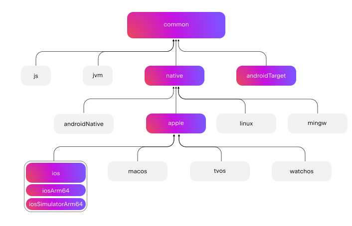
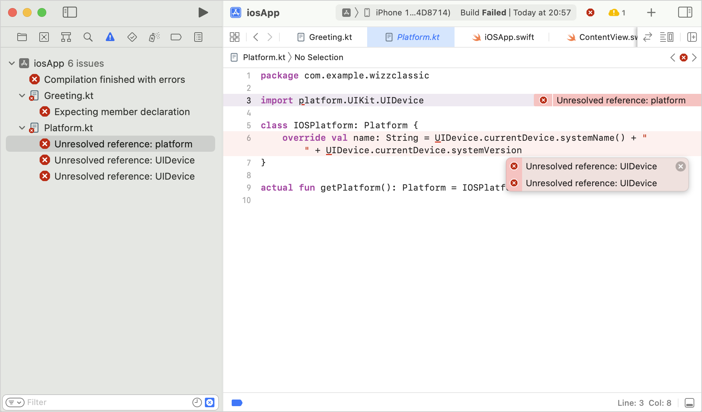
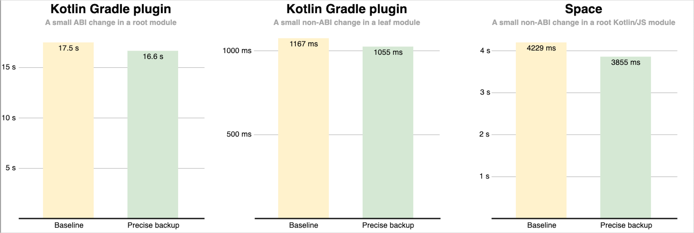

+++
title = "13.6.6.1 Kotlin 1.8.20 新变化"
date = 2026-09-13T08:50:47+08:00
weight = 1
type = "docs"
description = ""
isCJKLanguage = true
draft = false
+++


> 原文链接: [https://kotlinlang.org/docs/whatsnew1820.html](https://kotlinlang.org/docs/whatsnew1820.html)

# 13.6.6.1 Kotlin 1.8.20 新变化

阅读 Kotlin 1.8.20 发行说明，了解新的语言特性，以及 Kotlin Multiplatform、JVM、Native、JS、Wasm 的更新和 Gradle、Maven 的构建工具支持。

_[发布时间：2023 年 4 月 25 日](../../../13.5-Releases/#release-history)_

Kotlin 1.8.20 已经发布，以下是一些最亮眼的内容：

* [Kotlin K2 编译器的新更新](#new-kotlin-k2-compiler-updates)
* [新的实验性 Kotlin/Wasm 目标](#new-kotlin-wasm-target)
* [Gradle 中默认启用新的 JVM 增量编译](#new-jvm-incremental-compilation-by-default-in-gradle)
* [Kotlin/Native 目标的更新](#update-for-kotlin-native-targets)
* [Kotlin Multiplatform 中 Gradle 复合构建的预览](#preview-of-gradle-composite-builds-support-in-kotlin-multiplatform)
* [改进 Xcode 中 Gradle 错误的输出](#improved-output-for-gradle-errors-in-xcode)
* [标准库中对 AutoCloseable 接口的实验性支持](#support-for-the-autocloseable-interface)
* [标准库中对 Base64 编码的实验性支持](#support-for-base64-encoding)

你也可以在这个视频中查看这些变更的简短概述：

视频：[What's new in Kotlin 1.8.20](https://www.youtube.com/v/R1JpkpPzyBU)

> **提示：** 有关 Kotlin 发布周期的信息，请参见 [Kotlin 发布流程](../../../13.5-Releases/)。

## IDE 支持 {#ide-support}

支持 1.8.20 的 Kotlin 插件可用于：

| IDE            | 支持的版本            |

| IntelliJ IDEA  | 2022.2.x、2022.3.x、2023.1.x |
| Android Studio | Flamingo (222)                |

> **警告：** 要正确下载 Kotlin 制品和依赖，请[配置 Gradle 设置](#configure-gradle-settings)以使用 Maven Central 仓库。

## Kotlin K2 编译器的新更新 {#new-kotlin-k2-compiler-updates}

Kotlin 团队继续稳定 K2 编译器。如 [Kotlin 1.7.0 公告](../../13.6.7-Kotlin17x/13.6.7.2-Whatsnew17/#new-kotlin-k2-compiler-for-the-jvm-in-alpha)中所述，它仍处于 **Alpha** 阶段。此版本在通往 [K2 Beta](https://youtrack.jetbrains.com/issue/KT-52604) 的道路上引入了更多改进。

从 1.8.20 版本开始，Kotlin K2 编译器：

* 提供了序列化插件的预览版本。
* 为 [JS IR 编译器](../../../../development/6.2-Webdevelopment/6.2.2-Kotlinjs/6.2.2.9-JsIrCompiler/)提供 Alpha 支持。
* 引出了未来发布的[新语言版本 Kotlin 2.0](https://blog.jetbrains.com/kotlin/2023/02/k2-kotlin-2-0/)。

在以下视频中进一步了解新编译器及其优势：

* [What Everyone Must Know About The NEW Kotlin K2 Compiler](https://www.youtube.com/watch?v=iTdJJq_LyoY)
* [The New Kotlin K2 Compiler: Expert Review](https://www.youtube.com/watch?v=db19VFLZqJM)

### 如何启用 Kotlin K2 编译器 {#how-to-enable-the-kotlin-k2-compiler}

要启用并测试 Kotlin K2 编译器，请通过以下编译器选项使用新的语言版本：

```bash
-language-version 2.0
```

你可以在 `build.gradle(.kts)` 文件中指定它：

```kotlin
kotlin {
   sourceSets.all {
       languageSettings {
           languageVersion = "2.0"
       }
   }
}
```

之前的 `-Xuse-k2` 编译器选项已被弃用。

> **警告：** 新 K2 编译器的 Alpha 版仅适用于 JVM 和 JS IR 项目。它尚不支持 Kotlin/Native 或任何多平台项目。

### 留下你对新 K2 编译器的反馈 {#leave-your-feedback-on-the-new-k2-compiler}

我们欢迎你的任何反馈！

* 在 Kotlin Slack 上直接向 K2 开发者提供反馈——[获取邀请](https://surveys.jetbrains.com/s3/kotlin-slack-sign-up?_gl=1*ju6cbn*_ga*MTA3MTk5NDkzMC4xNjQ2MDY3MDU4*_ga_9J976DJZ68*MTY1ODMzNzA3OS4xMDAuMS4xNjU4MzQwODEwLjYw)并加入 [#k2-early-adopters](https://kotlinlang.slack.com/archives/C03PK0PE257) 频道。
* 在[我们的问题跟踪器](https://kotl.in/issue)中报告你使用新 K2 编译器时遇到的任何问题。
* [启用 **Send usage statistics** 选项](https://www.jetbrains.com/help/idea/settings-usage-statistics.html)，允许 JetBrains 收集有关 K2 使用情况的匿名数据。

## 语言 {#language}

随着 Kotlin 的不断演进，我们在 1.8.20 中引入了新语言特性的预览版本：

* [Enum 类 values 函数的现代化高性能替代](#a-modern-and-performant-replacement-of-the-enum-class-values-function)
* [与数据类对称的数据对象](#preview-of-data-objects-for-symmetry-with-data-classes)
* [放宽内联类中带函数体的次构造器限制](#preview-of-lifting-restriction-on-secondary-constructors-with-bodies-in-inline-classes)

### Enum 类 values 函数的现代化高性能替代 {#a-modern-and-performant-replacement-of-the-enum-class-values-function}

> **警告：** 该特性是[实验性](../../../13.4-ComponentsStability/#stability-levels-explained)的。它随时可能被放弃或更改。需要选择启用（详见下文）。请仅将其用于评估目的。我们欢迎你在 [YouTrack](https://kotl.in/issue) 中提供反馈。

Enum 类有一个合成的 `values()` 函数，它返回已定义枚举常量的数组。然而，使用数组会在 Kotlin 和 Java 中导致[隐藏的性能问题](https://kotlinlang.org/docs/https://github.com/Kotlin/KEEP/blob/master/proposals/enum-entries.html#examples-of-performance-issues)。此外，大多数 API 使用集合，最终需要转换。为了解决这些问题，我们为 Enum 类引入了 `entries` 属性，应使用它来代替 `values()` 函数。调用时，`entries` 属性会返回已定义枚举常量的预分配不可变列表。

> **提示：** `values()` 函数仍然受支持，但我们建议你改用 `entries` 属性。

```kotlin
enum class Color(val colorName: String, val rgb: String) {
    RED("Red", "#FF0000"),
    ORANGE("Orange", "#FF7F00"),
    YELLOW("Yellow", "#FFFF00")
}

@OptIn(ExperimentalStdlibApi::class)
fun findByRgb(rgb: String): Color? = Color.entries.find { it.rgb == rgb }
```

#### 如何启用 entries 属性 {#how-to-enable-the-entries-property}

要试用该特性，请使用 `@OptIn(ExperimentalStdlibApi)` 选择启用并开启 `-language-version 1.9` 编译器选项。在 Gradle 项目中，你可以通过在 `build.gradle(.kts)` 文件中添加以下内容来实现：

**Kotlin**

```kotlin
tasks
    .withType<org.jetbrains.kotlin.gradle.tasks.KotlinCompilationTask<*>>()
    .configureEach {
        compilerOptions
            .languageVersion
            .set(
                org.jetbrains.kotlin.gradle.dsl.KotlinVersion.KOTLIN_1_9
            )
    }
```

**Groovy**

```groovy
tasks
    .withType(org.jetbrains.kotlin.gradle.tasks.KotlinCompilationTask.class)
    .configureEach {
        compilerOptions.languageVersion =
            org.jetbrains.kotlin.gradle.dsl.KotlinVersion.KOTLIN_1_9
    }
```

> **提示：** 从 IntelliJ IDEA 2023.1 开始，如果你已选择启用该特性，相应的 IDE 检查会提示你从 `values()` 转换为 `entries`，并提供快速修复。

有关该提案的更多信息，请参见 [KEEP 说明](https://kotlinlang.org/docs/https://github.com/Kotlin/KEEP/blob/master/proposals/enum-entries.html)。

### 与数据类对称的数据对象预览 {#preview-of-data-objects-for-symmetry-with-data-classes}

数据对象允许你声明具有单例语义和简洁 `toString()` 表示的对象。在这个片段中，你可以看到给对象声明添加 `data` 关键字如何改善其 `toString()` 输出的可读性：

```kotlin
package org.example
object MyObject
data object MyDataObject

fun main() {
    println(MyObject) // org.example.MyObject@1f32e575
    println(MyDataObject) // MyDataObject
}
```

尤其是对于 `sealed` 层次结构（例如 `sealed class` 或 `sealed interface` 层次结构），`data objects` 非常合适，因为它们可以方便地与 `data class` 声明一起使用。在这个片段中，把 `EndOfFile` 声明为 `data object` 而不是普通 `object`，意味着它会获得漂亮的 `toString`，而无需手动重写。这保持了与配套数据类定义的对称性。

```kotlin
sealed interface ReadResult
data class Number(val number: Int) : ReadResult
data class Text(val text: String) : ReadResult
data object EndOfFile : ReadResult

fun main() {
    println(Number(7)) // Number(number=7)
    println(EndOfFile) // EndOfFile
}
```

#### 数据对象的语义 {#semantics-of-data-objects}

自成对的数据对象在 [Kotlin 1.7.20](../../13.6.7-Kotlin17x/13.6.7.1-Whatsnew1720/#improved-string-representations-for-singletons-and-sealed-class-hierarchies-with-data-objects)中首次预览以来，数据对象的语义得到了完善。编译器现在会自动为它们生成若干便捷函数：

##### toString {#tostring}

数据对象的 `toString()` 函数返回对象的简单名称：

```kotlin
data object MyDataObject {
    val x: Int = 3
}

fun main() {
    println(MyDataObject) // MyDataObject
}
```

##### equals 与 hashCode {#equals-and-hashcode}

`data object` 的 `equals()` 函数确保所有具有你的 `data object` 类型的对象都被视为相等。在大多数情况下，运行时你的数据对象只会有一个实例（毕竟 `data object` 声明的是单例）。然而，在运行时生成了同类型另一个对象的边界情况下（例如通过 `java.lang.reflect` 进行平台反射，或使用底层调用该 API 的 JVM 序列化库），这能确保这些对象被视为相等。

请确保只按结构比较 `data objects`（使用 `==` 运算符），而绝不按引用比较（`===` 运算符）。这有助于避免运行时存在多个数据对象实例时的陷阱。下面的片段展示了这个特定的边界情况：

```kotlin
import java.lang.reflect.Constructor

data object MySingleton

fun main() {
    val evilTwin = createInstanceViaReflection()

    println(MySingleton) // MySingleton
    println(evilTwin) // MySingleton

    // 即使某个库强行创建了 MySingleton 的第二个实例，其 `equals` 方法仍返回 true：
    println(MySingleton == evilTwin) // true

    // 不要通过 === 比较数据对象。
    println(MySingleton === evilTwin) // false
}

fun createInstanceViaReflection(): MySingleton {
    // Kotlin 反射不允许实例化数据对象。
    // 这会“强行”创建一个新的 MySingleton 实例（即 Java 平台反射）
    // 不要自己这样做！
    return (MySingleton.javaClass.declaredConstructors[0].apply { isAccessible = true } as Constructor<MySingleton>).newInstance()
}
```

生成的 `hashCode()` 函数的行为与 `equals()` 函数一致，因此 `data object` 的所有运行时实例都具有相同的哈希码。

##### 数据对象没有 copy 和 componentN 函数 {#no-copy-and-componentn-functions-for-data-objects}

虽然 `data object` 和 `data class` 声明经常一起使用并且有一些相似之处，但有些函数不会为 `data object` 生成：

由于 `data object` 声明旨在用作单例对象，因此不会生成 `copy()` 函数。单例模式把类的实例化限制为单个实例，允许创建实例的副本会违反这一限制。

此外，与 `data class` 不同，`data object` 没有任何数据属性。由于尝试解构这样的对象没有意义，因此不会生成任何 `componentN()` 函数。

我们欢迎你在 [YouTrack](https://youtrack.jetbrains.com/issue/KT-4107) 中提供关于该特性的反馈。

#### 如何启用数据对象预览 {#how-to-enable-the-data-objects-preview}

要试用该特性，请开启 `-language-version 1.9` 编译器选项。在 Gradle 项目中，你可以通过在 `build.gradle(.kts)` 文件中添加以下内容来实现：

**Kotlin**

```kotlin
tasks
    .withType<org.jetbrains.kotlin.gradle.tasks.KotlinCompilationTask<*>>()
    .configureEach {
        compilerOptions
            .languageVersion
            .set(
                org.jetbrains.kotlin.gradle.dsl.KotlinVersion.KOTLIN_1_9
            )
    }
```

**Groovy**

```groovy
tasks
    .withType(org.jetbrains.kotlin.gradle.tasks.KotlinCompilationTask.class)
    .configureEach {
        compilerOptions.languageVersion =
            org.jetbrains.kotlin.gradle.dsl.KotlinVersion.KOTLIN_1_9
    }
```

### 内联类中带函数体的次构造器限制放宽预览 {#preview-of-lifting-restriction-on-secondary-constructors-with-bodies-in-inline-classes}

> **警告：** 该特性是[实验性](../../../13.4-ComponentsStability/#stability-levels-explained)的。它随时可能被放弃或更改。需要选择启用（详见下文）。请仅将其用于评估目的。我们欢迎你在 [YouTrack](https://kotl.in/issue) 中提供反馈。

Kotlin 1.8.20 放宽了在[内联类](../../../../languageguide/5.8-Classesandinterfaces/5.8.9-Specialclassesandinterfaces/5.8.9.3-InlineClasses/)中使用带函数体的次构造器的限制。

过去，内联类只允许一个不带 `init` 块或次构造器的公开主构造器，以保证清晰的初始化语义。结果，无法封装底层值，也无法创建表示某些受限值的内联类。

这些问题在 Kotlin 1.4.30 放宽对 `init` 块的限制时得到了解决。现在我们更进一步，在预览模式下允许带函数体的次构造器：

```kotlin
@JvmInline
value class Person(private val fullName: String) {
    // 自 Kotlin 1.4.30 起允许：
    init {
        check(fullName.isNotBlank()) {
            "Full name shouldn't be empty"
        }
    }

    // 自 Kotlin 1.8.20 起可用（预览）：
    constructor(name: String, lastName: String) : this("$name $lastName") {
        check(lastName.isNotBlank()) {
            "Last name shouldn't be empty"
        }
    }
}
```

#### 如何启用带函数体的次构造器 {#how-to-enable-secondary-constructors-with-bodies}

要试用该特性，请开启 `-language-version 1.9` 编译器选项。在 Gradle 项目中，你可以通过在 `build.gradle(.kts)` 中添加以下内容来实现：

**Kotlin**

```kotlin
tasks
    .withType<org.jetbrains.kotlin.gradle.tasks.KotlinCompilationTask<*>>()
    .configureEach {
        compilerOptions
            .languageVersion
            .set(
                org.jetbrains.kotlin.gradle.dsl.KotlinVersion.KOTLIN_1_9
            )
    }
```

**Groovy**

```groovy
tasks
    .withType(org.jetbrains.kotlin.gradle.tasks.KotlinCompilationTask.class)
    .configureEach {
        compilerOptions.languageVersion =
            org.jetbrains.kotlin.gradle.dsl.KotlinVersion.KOTLIN_1_9
    }
```

我们鼓励你试用该特性并把所有报告提交到 [YouTrack](https://kotl.in/issue)，帮助我们在 Kotlin 1.9.0 中把它变为默认行为。

请在[这个 KEEP](https://kotlinlang.org/docs/https://github.com/Kotlin/KEEP/blob/master/proposals/inline-classes.html) 中进一步了解 Kotlin 内联类的发展。

## 新的 Kotlin/Wasm 目标 {#new-kotlin-wasm-target}

Kotlin/Wasm（Kotlin WebAssembly）在此版本中进入[实验性](../../../13.4-ComponentsStability/#stability-levels-explained)阶段。Kotlin 团队认为 [WebAssembly](https://webassembly.org/) 是一项很有前景的技术，希望找到更好的方式让你使用它并获得 Kotlin 的全部优势。

WebAssembly 二进制格式与平台无关，因为它使用自己的虚拟机运行。几乎所有现代浏览器都已经支持 WebAssembly 1.0。要设置运行 WebAssembly 的环境，你只需启用 Kotlin/Wasm 所针对的实验性垃圾回收模式。你可以在这里找到详细说明：[如何启用 Kotlin/Wasm](#how-to-enable-kotlin-wasm)。

我们想强调新的 Kotlin/Wasm 目标的以下优势：

* 与 `wasm32` Kotlin/Native 目标相比编译速度更快，因为 Kotlin/Wasm 不必使用 LLVM。
* 与 `wasm32` 目标相比，由于有 [Wasm 垃圾回收](https://github.com/WebAssembly/gc)，与 JS 的互操作和与浏览器的集成更容易。
* 由于 Wasm 的字节码紧凑且易于解析，应用启动速度可能比 Kotlin/JS 和 JavaScript 更快。
* 由于 Wasm 是静态类型语言，应用的运行时性能相比 Kotlin/JS 和 JavaScript 更好。

从 1.8.20 版本开始，你可以在实验性项目中使用 Kotlin/Wasm。我们开箱即用地为 Kotlin/Wasm 提供了 Kotlin 标准库（`stdlib`）和测试库（`kotlin.test`）。IDE 支持将在未来的版本中添加。

[在这个 YouTube 视频中进一步了解 Kotlin/Wasm](https://www.youtube.com/watch?v=-pqz9sKXatw)。

### 如何启用 Kotlin/Wasm {#how-to-enable-kotlin-wasm}

要启用并测试 Kotlin/Wasm，请更新你的 `build.gradle.kts` 文件：

```kotlin
plugins {
    kotlin("multiplatform") version "1.8.20"
}

kotlin {
    wasm {
        binaries.executable()
        browser {
        }
    }
    sourceSets {
        val commonMain by getting
        val commonTest by getting {
            dependencies {
                implementation(kotlin("test"))
            }
        }
        val wasmMain by getting
        val wasmTest by getting
    }
}
```

> **提示：** 请查看[包含 Kotlin/Wasm 示例的 GitHub 仓库](https://github.com/Kotlin/kotlin-wasm-examples)。

要运行 Kotlin/Wasm 项目，你需要更新目标环境的设置：

**Chrome**

* 对于 109 版本：

使用 `--js-flags=--experimental-wasm-gc` 命令行参数运行应用。

* 对于 110 或更高版本：

1. 在浏览器中访问 `chrome://flags/#enable-webassembly-garbage-collection`。
2. 启用 **WebAssembly Garbage Collection**。
3. 重新启动浏览器。

**Firefox**

对于 109 或更高版本：

1. 在浏览器中访问 `about:config`。
2. 启用 `javascript.options.wasm_function_references` 和 `javascript.options.wasm_gc` 选项。
3. 重新启动浏览器。

**Edge**

对于 109 或更高版本：

使用 `--js-flags=--experimental-wasm-gc` 命令行参数运行应用。

### 留下你对 Kotlin/Wasm 的反馈 {#leave-your-feedback-on-kotlin-wasm}

我们欢迎你的任何反馈！

* 在 Kotlin Slack 上直接向开发者提供反馈——[获取邀请](https://surveys.jetbrains.com/s3/kotlin-slack-sign-up?_gl=1*ju6cbn*_ga*MTA3MTk5NDkzMC4xNjQ2MDY3MDU4*_ga_9J976DJZ68*MTY1ODMzNzA3OS4xMDAuMS4xNjU4MzQwODEwLjYw)并加入 [#webassembly](https://kotlinlang.slack.com/archives/CDFP59223) 频道。
* 在这个 [YouTrack 议题](https://youtrack.jetbrains.com/issue/KT-56492)中报告你使用 Kotlin/Wasm 时遇到的任何问题。

## Kotlin/JVM {#kotlin-jvm}

Kotlin 1.8.20 引入了 [Java 合成属性引用的预览](#preview-of-java-synthetic-property-references)以及 [kapt 存根生成任务默认支持 JVM IR 后端](#support-for-the-jvm-ir-backend-in-kapt-stub-generating-task-by-default)。

### Java 合成属性引用预览 {#preview-of-java-synthetic-property-references}

> **警告：** 该特性是[实验性](../../../13.4-ComponentsStability/#stability-levels-explained)的。它随时可能被放弃或更改。请仅将其用于评估目的。我们欢迎你在 [YouTrack](https://kotl.in/issue) 中提供反馈。

Kotlin 1.8.20 引入了创建对 Java 合成属性引用的能力，例如对下面这样的 Java 代码：

```java
public class Person {
    private String name;
    private int age;

    public Person(String name, int age) {
        this.name = name;
        this.age = age;
    }

    public String getName() {
        return name;
    }

    public int getAge() {
        return age;
    }
}
```

Kotlin 一直允许你编写 `person.age`，其中 `age` 是一个合成属性。现在你还可以创建对 `Person::age` 和 `person::age` 的引用。`name` 也同样适用。

```kotlin
val persons = listOf(Person("Jack", 11), Person("Sofie", 12), Person("Peter", 11))
    persons
        // 调用对 Java 合成属性的引用：
        .sortedBy(Person::age)
        // 通过 Kotlin 属性语法调用 Java getter：
        .forEach { person -> println(person.name) }
```

#### 如何启用 Java 合成属性引用 {#how-to-enable-java-synthetic-property-references}

要试用该特性，请开启 `-language-version 1.9` 编译器选项。在 Gradle 项目中，你可以通过在 `build.gradle(.kts)` 中添加以下内容来实现：

**Kotlin**

```kotlin
tasks
    .withType<org.jetbrains.kotlin.gradle.tasks.KotlinCompilationTask<*>>()
    .configureEach {
        compilerOptions
            .languageVersion
            .set(
                org.jetbrains.kotlin.gradle.dsl.KotlinVersion.KOTLIN_1_9
            )
    }
```

**Groovy**

```groovy
tasks
    .withType(org.jetbrains.kotlin.gradle.tasks.KotlinCompilationTask.class)
    .configureEach {
        compilerOptions.languageVersion =
            org.jetbrains.kotlin.gradle.dsl.KotlinVersion.KOTLIN_1_9
    }
```

### kapt 存根生成任务默认支持 JVM IR 后端 {#support-for-the-jvm-ir-backend-in-kapt-stub-generating-task-by-default}

在 Kotlin 1.7.20 中，我们引入了 [kapt 存根生成任务对 JVM IR 后端的支持](../../13.6.7-Kotlin17x/13.6.7.1-Whatsnew1720/#support-for-the-jvm-ir-backend-in-kapt-stub-generating-task)。从此次发布开始，该支持默认生效。你不再需要在 `gradle.properties` 中指定 `kapt.use.jvm.ir=true` 来启用它。我们欢迎你在 [YouTrack](https://youtrack.jetbrains.com/issue/KT-49682) 中提供关于该特性的反馈。

## Kotlin/Native {#kotlin-native}

Kotlin 1.8.20 包含对受支持 Kotlin/Native 目标的更改、与 Objective-C 的互操作，以及对 CocoaPods Gradle 插件的改进等更新：

* [Kotlin/Native 目标的更新](#update-for-kotlin-native-targets)
* [弃用旧内存管理器](#deprecation-of-the-legacy-memory-manager)
* [支持带 @import 指令的 Objective-C 头文件](#support-for-objective-c-headers-with-import-directives)
* [Cocoapods Gradle 插件支持仅链接模式](#support-for-the-link-only-mode-in-cocoapods-gradle-plugin)
* [在 UIKit 中以类成员的方式导入 Objective-C 扩展](#import-objective-c-extensions-as-class-members-in-uikit)
* [在编译器中重新实现编译器缓存管理](#reimplementation-of-compiler-cache-management-in-the-compiler)
* [弃用 Cocoapods Gradle 插件中的 `useLibraries()`](#deprecation-of-uselibraries-in-cocoapods-gradle-plugin)

### Kotlin/Native 目标的更新 {#update-for-kotlin-native-targets}

Kotlin 团队决定重新审视 Kotlin/Native 支持的目标列表，把它们划分为不同层级，并从 Kotlin 1.8.20 开始弃用其中一些。请参阅 [Kotlin/Native 目标支持](../../../../development/6.3-Nativedevelopment/6.3.8-NativeTargetSupport/)一节，了解受支持和已弃用目标的完整列表。

以下目标在 Kotlin 1.8.20 中被弃用，并将在 1.9.20 中移除：

* `iosArm32`
* `watchosX86`
* `wasm32`
* `mingwX86`
* `linuxArm32Hfp`
* `linuxMips32`
* `linuxMipsel32`

至于其余目标，现在根据某个目标在 Kotlin/Native 编译器中受支持和测试的程度划分为三个支持层级。目标可以在不同层级之间移动。例如，我们将来会尽最大努力为 `iosArm64` 提供完整支持，因为它对 [Kotlin Multiplatform](https://kotlinlang.org/docs/multiplatform/get-started.html) 很重要。

如果你是库作者，这些目标层级可以帮助你决定在 CI 工具上测试哪些目标、跳过哪些目标。Kotlin 团队在开发官方 Kotlin 库（如 [kotlinx.coroutines](../../../../libraryguides/9.2-Coroutineskotlinxcoroutines/9.2.1-CoroutinesGuide/)）时也会采用同样的方式。

请查看我们的[博客文章](https://blog.jetbrains.com/kotlin/2023/02/update-regarding-kotlin-native-targets/)以进一步了解这些变更的原因。

### 弃用旧内存管理器 {#deprecation-of-the-legacy-memory-manager}

从 1.8.20 开始，旧内存管理器已被弃用，并将在 1.9.20 中移除。[新内存管理器](../../../../development/6.3-Nativedevelopment/6.3.5-Memorymanager/6.3.5.1-NativeMemoryManager/)在 1.7.20 中已默认启用，并持续获得稳定性更新和性能改进。

如果你仍在使用旧内存管理器，请从 `gradle.properties` 中移除 `kotlin.native.binary.memoryModel=strict` 选项，并按照我们的[迁移指南](../../../../development/6.3-Nativedevelopment/6.3.5-Memorymanager/6.3.5.3-NativeMigrationGuide/)进行必要的更改。

新的内存管理器不支持 `wasm32` 目标。该目标[从此次发布起](#update-for-kotlin-native-targets)也被弃用，并将在 1.9.20 中移除。

### 支持带 @import 指令的 Objective-C 头文件 {#support-for-objective-c-headers-with-import-directives}

> **警告：** 该特性是[实验性](../../../13.4-ComponentsStability/#stability-levels-explained)的。它随时可能被放弃或更改。需要选择启用（详见下文）。请仅将其用于评估目的。我们欢迎你在 [YouTrack](https://kotl.in/issue) 中提供反馈。

Kotlin/Native 现在可以导入带 `@import` 指令的 Objective-C 头文件。该特性对于使用自动生成 Objective-C 头文件的 Swift 库或以 Swift 编写的 CocoaPods 依赖类很有用。

以前，cinterop 工具无法分析通过 `@import` 指令依赖 Objective-C 模块的头文件。原因是它不支持 `-fmodules` 选项。

从 Kotlin 1.8.20 开始，你可以使用带 `@import` 的 Objective-C 头文件。为此，请在定义文件中把 `-fmodules` 选项作为 `compilerOpts` 传给编译器。如果你使用 [CocoaPods 集成](https://kotlinlang.org/docs/multiplatform/multiplatform-cocoapods-overview.html)，请在 `pod()` 函数的配置块中指定 cinterop 选项，如下所示：

```kotlin
kotlin {
    ios()

    cocoapods {
        summary = "CocoaPods test library"
        homepage = "https://github.com/JetBrains/kotlin"

        ios.deploymentTarget = "13.5"

        pod("PodName") {
            extraOpts = listOf("-compiler-option", "-fmodules")
        }
    }
}
```

这是一个[备受期待的特性](https://youtrack.jetbrains.com/issue/KT-39120)，我们欢迎你在 [YouTrack](https://kotl.in/issue) 中提供反馈，帮助我们把它在未来的版本中变为默认行为。

### Cocoapods Gradle 插件支持仅链接模式 {#support-for-the-link-only-mode-in-cocoapods-gradle-plugin}

借助 Kotlin 1.8.20，你可以把 Pod 依赖与动态框架一起仅用于链接，而不生成 cinterop 绑定。当 cinterop 绑定已经生成时，这会很方便。

考虑一个包含 2 个模块的项目：一个库和一个应用。该库依赖某个 Pod 但不产出框架，只产出一个 `.klib`。应用依赖该库并产出动态框架。在这种情况下，你需要把这个框架与库所依赖的 Pod 链接起来，但不需要 cinterop 绑定，因为它们已经为库生成了。

要启用该特性，请在添加对 Pod 的依赖时使用 `linkOnly` 选项或构建器属性：

```kotlin
cocoapods {
    summary = "CocoaPods test library"
    homepage = "https://github.com/JetBrains/kotlin"

    pod("Alamofire", linkOnly = true) {
        version = "5.7.0"
    }
}
```

> **注意：** 如果你对静态框架使用该选项，它会完全移除 Pod 依赖，因为 Pod 不会用于静态框架链接。

### 在 UIKit 中以类成员的方式导入 Objective-C 扩展 {#import-objective-c-extensions-as-class-members-in-uikit}

从 Xcode 14.1 开始，Objective-C 类的一些方法被移到了 category 成员中。这导致生成了不同的 Kotlin API，这些方法被作为 Kotlin 扩展而不是方法导入。

在使用 UIKit 重写方法时，你可能因此遇到过问题。例如，在 Kotlin 中继承 UIView 时，无法再重写 `drawRect()` 或 `layoutSubviews()` 方法。

从 1.8.20 开始，与 NSView 和 UIView 类声明在同一头文件中的 category 成员会作为这些类的成员导入。这意味着继承自 NSView 和 UIView 的方法可以像其他方法一样轻松重写。

如果一切顺利，我们计划为所有 Objective-C 类默认启用这一行为。

### 在编译器中重新实现编译器缓存管理 {#reimplementation-of-compiler-cache-management-in-the-compiler}

为了加快编译器缓存的演进，我们把编译器缓存管理从 Kotlin Gradle 插件移到了 Kotlin/Native 编译器。这为若干重要改进扫清了障碍，包括与编译时间和编译器缓存灵活性相关的改进。

如果你遇到问题并需要回到旧行为，请使用 `kotlin.native.cacheOrchestration=gradle` Gradle 属性。

我们欢迎你在 [YouTrack 中](https://kotl.in/issue)提供关于此的反馈。

### 弃用 Cocoapods Gradle 插件中的 useLibraries() {#deprecation-of-uselibraries-in-cocoapods-gradle-plugin}

Kotlin 1.8.20 开始了在 [CocoaPods 集成](https://kotlinlang.org/docs/multiplatform/multiplatform-cocoapods-overview.html)中用于静态库的 `useLibraries()` 函数的弃用周期。

我们引入 `useLibraries()` 函数是为了允许依赖包含静态库的 Pod。随着时间推移，这种情况变得非常罕见。大多数 Pod 以源码分发，而 Objective-C 框架或 XCFramework 是二进制分发的常见选择。

由于该函数不受欢迎，并且它带来的问题使 Kotlin CocoaPods Gradle 插件的开发变得复杂，我们决定弃用它。

有关框架和 XCFramework 的更多信息，请参见[构建最终原生二进制文件](https://kotlinlang.org/docs/multiplatform/multiplatform-build-native-binaries.html)。

## Kotlin Multiplatform {#kotlin-multiplatform}

Kotlin 1.8.20 通过对 Kotlin Multiplatform 的以下更新来改善开发者体验：

* [设置源集层次结构的新方式](#new-approach-to-source-set-hierarchy)
* [Kotlin Multiplatform 中 Gradle 复合构建支持的预览](#preview-of-gradle-composite-builds-support-in-kotlin-multiplatform)
* [改进 Xcode 中 Gradle 错误的输出](#improved-output-for-gradle-errors-in-xcode)

### 源集层次结构的新方式 {#new-approach-to-source-set-hierarchy}

> **警告：** 源集层次结构的新方式是[实验性](../../../13.4-ComponentsStability/#stability-levels-explained)的。它可能在未来的 Kotlin 版本中未经事先通知而更改。需要选择启用（详见下文）。我们欢迎你在 [YouTrack](https://kotl.in/issue) 中提供反馈。

Kotlin 1.8.20 提供了在多平台项目中设置源集层次结构的新方式——默认目标层次结构。新方式旨在取代 `ios` 之类的目标快捷方式，这些快捷方式存在[设计缺陷](#why-replace-shortcuts)。

默认目标层次结构背后的理念很简单：你显式声明项目编译到的所有目标，Kotlin Gradle 插件根据指定目标自动创建共享源集。

#### 设置你的项目 {#set-up-your-project}

考虑这个简单多平台移动应用的示例：

```kotlin
@OptIn(ExperimentalKotlinGradlePluginApi::class)
kotlin {
    // 启用默认目标层次结构：
    targetHierarchy.default()

    android()
    iosArm64()
    iosSimulatorArm64()
}
```

你可以把默认目标层次结构看作所有可能目标及其共享源集的模板。当你在代码中声明最终目标 `android`、`iosArm64` 和 `iosSimulatorArm64` 时，Kotlin Gradle 插件会从模板中找到合适的共享源集并为你创建它们。生成的层次结构如下所示：

{thumbnail="true" width="350" thumbnail-same-file="true"}

绿色的源集是实际创建并存在于项目中的，而默认模板中的灰色源集会被忽略。如你所见，Kotlin Gradle 插件没有创建 `watchos` 源集，因为项目中没有 watchOS 目标。

如果你添加一个 watchOS 目标（例如 `watchosArm64`），就会创建 `watchos` 源集，并且来自 `apple`、`native` 和 `common` 源集的代码也会编译到 `watchosArm64`。

你可以在[文档](https://kotlinlang.org/docs/multiplatform/multiplatform-hierarchy.html#default-hierarchy-template)中找到默认目标层次结构的完整方案。

> **注意：** 在此示例中，`apple` 和 `native` 源集只编译到 `iosArm64` 和 `iosSimulatorArm64` 目标。因此，尽管名字如此，它们可以访问完整的 iOS API。对于像 `native` 这样的源集来说这可能违反直觉，因为你可能期望该源集中只能访问所有 native 目标都可用的 API。该行为将来可能会改变。

#### 为什么要替换快捷方式 {#why-replace-shortcuts}

创建源集层次结构可能很冗长、容易出错，并且对初学者不友好。我们之前的解决方案是引入 `ios` 之类的快捷方式，为你创建部分层次结构。然而，使用快捷方式的实践证明了它们有一个很大的设计缺陷：难以更改。

以 `ios` 快捷方式为例。它只创建 `iosArm64` 和 `iosX64` 目标，这可能令人困惑，并且在需要 `iosSimulatorArm64` 目标的基于 M1 的主机上工作时可能导致问题。然而，添加 `iosSimulatorArm64` 目标对用户项目来说可能是一个破坏性很大的变更：

* `iosMain` 源集中使用的所有依赖都必须支持 `iosSimulatorArm64` 目标；否则依赖解析会失败。
* 添加新目标时，`iosMain` 中使用的一些 native API 可能会消失（尽管在 `iosSimulatorArm64` 的情况下不太可能）。
* 在某些情况下（例如在基于 Intel 的 MacBook 上编写小型个人项目），你可能根本不需要这个变更。

很明显，快捷方式并没有解决配置层次结构的问题，这也是我们在某个时间点停止添加新快捷方式的原因。

默认目标层次结构乍看之下可能与快捷方式相似，但它们有一个关键区别：**用户必须显式指定目标集合**。这个集合决定了你的项目如何编译和发布，以及如何参与依赖解析。由于这个集合是固定的，Kotlin Gradle 插件对默认配置的更改应该会对生态系统造成小得多的困扰，并且更容易提供工具辅助的迁移。

#### 如何启用默认层次结构 {#how-to-enable-the-default-hierarchy}

这个新特性是[实验性](../../../13.4-ComponentsStability/#stability-levels-explained)的。对于 Kotlin Gradle 构建脚本，你需要通过 `@OptIn(ExperimentalKotlinGradlePluginApi::class)` 选择启用。

更多信息请参见[分层项目结构](https://kotlinlang.org/docs/multiplatform/multiplatform-hierarchy.html#default-hierarchy-template)。

#### 留下反馈 {#leave-feedback}

这是对多平台项目的重要变更。我们欢迎你的[反馈](https://kotl.in/issue)，帮助我们把它做得更好。

### Kotlin Multiplatform 中 Gradle 复合构建支持的预览 {#preview-of-gradle-composite-builds-support-in-kotlin-multiplatform}

> **注意：** 自 Kotlin Gradle 插件 1.8.20 起，Gradle 构建已支持该特性。对于 IDE 支持，请使用 IntelliJ IDEA 2023.1 Beta 2 (231.8109.2) 或更高版本，并配合任意 Kotlin IDE 插件的 Kotlin Gradle 插件 1.8.20。

从 1.8.20 开始，Kotlin Multiplatform 支持 [Gradle 复合构建](https://docs.gradle.org/current/userguide/composite_builds.html)。复合构建允许你把不同项目的构建或同一项目的各个部分包含到单个构建中。

由于一些技术挑战，在 Kotlin Multiplatform 中使用 Gradle 复合构建此前只得到部分支持。Kotlin 1.8.20 包含改进支持的预览，应该可以适用于更多种类的项目。要试用它，请在 `gradle.properties` 中添加以下选项：

```none
kotlin.mpp.import.enableKgpDependencyResolution=true
```

该选项启用新模式导入的预览。除了对复合构建的支持之外，它还提供了更顺畅的多平台项目导入体验，因为我们加入了重要的缺陷修复和改进，使导入更稳定。

#### 已知问题 {#known-issues}

它仍然是需要进一步稳定的预览版本，导入过程中你可能会遇到一些问题。以下是我们计划在 Kotlin 1.8.20 最终版本之前修复的一些已知问题：

* IntelliJ IDEA 2023.1 EAP 目前还没有可用的 Kotlin 1.8.20 插件。尽管如此，你仍然可以把 Kotlin Gradle 插件版本设置为 1.8.20，并在这个 IDE 中试用复合构建。
* 如果你的项目包含指定了 `rootProject.name` 的构建，复合构建可能无法解析 Kotlin 元数据。有关变通方案和细节，请参见这个 [Youtrack 议题](https://youtrack.jetbrains.com/issue/KT-56536)。

我们鼓励你试用它并把所有报告提交到 [YouTrack](https://kotl.in/issue)，帮助我们在 Kotlin 1.9.0 中把它变为默认行为。

### 改进 Xcode 中 Gradle 错误的输出 {#improved-output-for-gradle-errors-in-xcode}

如果你在 Xcode 中构建多平台项目时遇到问题，可能会遇到 "Command PhaseScriptExecution failed with a nonzero exit code" 错误。这条消息表明 Gradle 调用失败，但在尝试定位问题时帮助不大。

从 Kotlin 1.8.20 开始，Xcode 可以解析来自 Kotlin/Native 编译器的输出。此外，如果 Gradle 构建失败，你会在 Xcode 中看到来自根因异常的附加错误消息。在大多数情况下，这将有助于识别根本问题。



新行为对于用于 Xcode 集成的标准 Gradle 任务（例如可以把多平台项目中的 iOS 框架连接到 Xcode 中 iOS 应用的 `embedAndSignAppleFrameworkForXcode`）默认启用。它也可以通过 `kotlin.native.useXcodeMessageStyle` Gradle 属性启用（或禁用）。

## Kotlin/JavaScript {#kotlin-javascript}

Kotlin 1.8.20 改变了生成 TypeScript 定义的方式。它还包含一项旨在改善调试体验的变更：

* [从 Gradle 插件中移除 Dukat 集成](#removal-of-dukat-integration-from-gradle-plugin)
* [源映射中的 Kotlin 变量名和函数名](#kotlin-variable-and-function-names-in-source-maps)
* [选择启用 TypeScript 定义文件的生成](#opt-in-for-generation-of-typescript-definition-files)

### 从 Gradle 插件中移除 Dukat 集成 {#removal-of-dukat-integration-from-gradle-plugin}

在 Kotlin 1.8.20 中，我们从 Kotlin/JavaScript Gradle 插件中移除了[实验性](../../../13.4-ComponentsStability/#stability-levels-explained)的 Dukat 集成。Dukat 集成支持把 TypeScript 声明文件（`.d.ts`）自动转换为 Kotlin 外部声明。

你仍然可以使用我们的 [Dukat 工具](https://github.com/Kotlin/dukat)把 TypeScript 声明文件（`.d.ts`）转换为 Kotlin 外部声明。

> **警告：** Dukat 工具是[实验性](../../../13.4-ComponentsStability/#stability-levels-explained)的。它随时可能被放弃或更改。

### 源映射中的 Kotlin 变量名和函数名 {#kotlin-variable-and-function-names-in-source-maps}

为了帮助调试，我们引入了把你用 Kotlin 代码声明的变量名和函数名添加到源映射中的能力。在 1.8.20 之前，这些名称在源映射中不可用，因此在调试器中你总是看到生成的 JavaScript 的变量名和函数名。

你可以在 Gradle 文件 `build.gradle.kts` 中使用 `sourceMapNamesPolicy`，或者使用 `-source-map-names-policy` 编译器选项来配置添加的内容。下表列出了可能的设置：

| 设置                 | 说明                                                   | 示例输出                    |

| `simple-names`          | 添加变量名和简单函数名。（默认） | `main`                            |
| `fully-qualified-names` | 添加变量名和完全限定函数名。  | `com.example.kjs.playground.main` |
| `no`                    | 不添加任何变量名或函数名。                      | 不适用                               |

以下是一个 `build.gradle.kts` 文件中的配置示例：

```kotlin
tasks.withType<org.jetbrains.kotlin.gradle.tasks.Kotlin2JsCompile>().configureEach {
    compilercompileOptions.sourceMapNamesPolicy.set(org.jetbrains.kotlin.gradle.dsl.JsSourceMapNamesPolicy.SOURCE_MAP_NAMES_POLICY_FQ_NAMES) // 或者 SOURCE_MAP_NAMES_POLICY_NO，或 SOURCE_MAP_NAMES_POLICY_SIMPLE_NAMES
}
```

基于 Chromium 的浏览器中提供的调试工具可以从源映射中获取原始 Kotlin 名称，以提高堆栈跟踪的可读性。祝你调试愉快！

> **警告：** 在源映射中添加变量名和函数名是[实验性](../../../13.4-ComponentsStability/#stability-levels-explained)的。它随时可能被放弃或更改。

### 选择启用 TypeScript 定义文件的生成 {#opt-in-for-generation-of-typescript-definition-files}

以前，如果你的项目产出可执行文件（`binaries.executable()`），Kotlin/JS IR 编译器会收集所有带 `@JsExport` 标记的顶层声明，并自动在 `.d.ts` 文件中生成 TypeScript 定义。

由于这对并非每个项目都有用，我们在 Kotlin 1.8.20 中改变了这一行为。如果你想生成 TypeScript 定义，必须显式地在 Gradle 构建文件中进行配置。在 `build.gradle.kts.file` 的 [`js` 部分](../../../../development/6.2-Webdevelopment/6.2.2-Kotlinjs/6.2.2.3-JsProjectSetup/#execution-environments)添加 `generateTypeScriptDefinitions()`。例如：

```kotlin
kotlin {
    js {
        binaries.executable()
        browser {
        }
        generateTypeScriptDefinitions()
    }
}
```

> **警告：** 生成 TypeScript 定义（`d.ts`）是[实验性](../../../13.4-ComponentsStability/#stability-levels-explained)的。它随时可能被放弃或更改。

## Gradle {#gradle}

Kotlin 1.8.20 与 Gradle 6.8 到 7.6 完全兼容，只有[多平台插件中的一些特殊情况](https://youtrack.jetbrains.com/issue/KT-55751)除外。你也可以使用最新 Gradle 版本以内的其他版本，但如果这样做，请记住你可能会遇到弃用警告，或者某些新的 Gradle 特性可能无法工作。

此版本带来以下变更：

* [新的 Gradle 插件版本对齐](#new-gradle-plugins-versions-alignment)
* [Gradle 中默认启用新的 JVM 增量编译](#new-jvm-incremental-compilation-by-default-in-gradle)
* [编译任务输出的精确备份](#precise-backup-of-compilation-tasks-outputs)
* [为所有 Gradle 版本实现 Kotlin/JVM 任务的惰性创建](#lazy-kotlin-jvm-tasks-creation-for-all-gradle-versions)
* [编译任务 destinationDirectory 的非默认位置](#non-default-location-of-compile-tasks-destinationdirectory)
* [能够选择不向 HTTP 统计服务报告编译器参数](#ability-to-opt-out-from-reporting-compiler-arguments-to-an-http-statistics-service)

### 新的 Gradle 插件版本对齐 {#new-gradle-plugins-versions-alignment}

Gradle 提供了一种确保必须协同工作的依赖始终[版本对齐](https://docs.gradle.org/current/userguide/dependency_version_alignment.html#aligning_versions_natively_with_gradle)的方式。Kotlin 1.8.20 也采用了这种做法。它默认生效，因此你无需更改或更新配置即可启用它。此外，你也不再需要求助于[这个用于解析 Kotlin Gradle 插件传递依赖的变通方案](../13.6.6.2-Whatsnew18/#resolution-of-kotlin-gradle-plugins-transitive-dependencies)。

我们欢迎你在 [YouTrack](https://youtrack.jetbrains.com/issue/KT-54691) 中提供关于该特性的反馈。

### Gradle 中默认启用新的 JVM 增量编译 {#new-jvm-incremental-compilation-by-default-in-gradle}

[自 Kotlin 1.7.0 起可用](../../13.6.7-Kotlin17x/13.6.7.2-Whatsnew17/#a-new-approach-to-incremental-compilation)的增量编译新方式现在默认生效。你不再需要在 `gradle.properties` 中指定 `kotlin.incremental.useClasspathSnapshot=true` 来启用它。

我们欢迎你对此提供反馈。你可以在 YouTrack 中[提交议题](https://kotl.in/issue)。

### 编译任务输出的精确备份 {#precise-backup-of-compilation-tasks-outputs}

> **警告：** 编译任务输出的精确备份是[实验性](../../../13.4-ComponentsStability/#stability-levels-explained)的。要使用它，请把 `kotlin.compiler.preciseCompilationResultsBackup=true` 添加到 `gradle.properties`。我们欢迎你在 [YouTrack](https://kotl.in/issue/experimental-ic-optimizations) 中提供反馈。

从 Kotlin 1.8.20 开始，你可以启用精确备份，此时只有 Kotlin 在[增量编译](../../../../buildtools/11.1-Gradle/11.1.6-GradleCompilationAndCaches/#incremental-compilation)中重新编译的那些类会被备份。完整备份和精确备份都有助于在编译错误后再次增量运行构建。与完整备份相比，精确备份还能节省构建时间。在大型项目中，或者在许多任务都在执行备份时（尤其是当项目位于较慢的 HDD 上时），完整备份可能耗费**明显的**构建时间。

该优化是实验性的。你可以在 `gradle.properties` 文件中添加 `kotlin.compiler.preciseCompilationResultsBackup` Gradle 属性来启用它：

```none
kotlin.compiler.preciseCompilationResultsBackup=true
```

#### JetBrains 中精确备份用法的示例 {#example-of-precise-backup-usage-in-jetbrains}

在下面的图表中，你可以看到使用精确备份与完整备份对比的示例：



第一张和第二张图表展示了 Kotlin 项目中的精确备份如何影响构建 Kotlin Gradle 插件：

1. 在对许多模块都依赖的模块进行小的 [ABI](https://en.wikipedia.org/wiki/Application_binary_interface) 变更（添加新的公开方法）之后。
2. 在对没有任何其他模块依赖的模块进行小的非 ABI 变更（添加私有函数）之后。

第三张图表展示了 [Space](https://www.jetbrains.com/space/) 项目中的精确备份如何影响在对许多模块都依赖的 Kotlin/JS 模块进行小的非 ABI 变更（添加私有函数）后构建 web 前端。

这些测量是在配备 Apple M1 Max CPU 的计算机上进行的；不同的计算机会给出略有不同的结果。影响性能的因素包括但不限于：

* [Kotlin 守护进程](../../../../buildtools/11.1-Gradle/11.1.6-GradleCompilationAndCaches/#the-kotlin-daemon-and-how-to-use-it-with-gradle)和 [Gradle 守护进程](https://docs.gradle.org/current/userguide/gradle_daemon.html)的热度。
* 磁盘的快慢。
* CPU 型号及其繁忙程度。
* 哪些模块受到变更影响以及这些模块有多大。
* 变更是 ABI 还是非 ABI 的。

#### 使用构建报告评估优化 {#evaluating-optimizations-with-build-reports}

要评估该优化在你的计算机上对你的项目和场景的影响，你可以使用 [Kotlin 构建报告](../../../../buildtools/11.1-Gradle/11.1.6-GradleCompilationAndCaches/#build-reports)。通过把以下属性添加到 `gradle.properties` 文件来启用文本文件格式的报告：

```none
kotlin.build.report.output=file
```

以下是启用精确备份之前报告中的相关部分示例：

```none
Task ':kotlin-gradle-plugin:compileCommonKotlin' finished in 0.59 s
<...>
Time metrics:
 Total Gradle task time: 0.59 s
 Task action before worker execution: 0.24 s
  Backup output: 0.22 s // 注意这个数字
<...>
```

以下是启用精确备份之后报告中的相关部分示例：

```none
Task ':kotlin-gradle-plugin:compileCommonKotlin' finished in 0.46 s
<...>
Time metrics:
 Total Gradle task time: 0.46 s
 Task action before worker execution: 0.07 s
  Backup output: 0.05 s // 时间减少了
 Run compilation in Gradle worker: 0.32 s
  Clear jar cache: 0.00 s
  Precise backup output: 0.00 s // 与精确备份相关
  Cleaning up the backup stash: 0.00 s // 与精确备份相关
<...>
```

### 为所有 Gradle 版本实现 Kotlin/JVM 任务的惰性创建 {#lazy-kotlin-jvm-tasks-creation-for-all-gradle-versions}

对于在 Gradle 7.3+ 上使用 `org.jetbrains.kotlin.gradle.jvm` 插件的项目，Kotlin Gradle 插件不再提前创建和配置 `compileKotlin` 任务。在较低的 Gradle 版本上，它只是注册所有任务，并且在试运行时不会配置它们。现在使用 Gradle 7.3+ 时也是同样的行为。

### 编译任务 destinationDirectory 的非默认位置 {#non-default-location-of-compile-tasks-destinationdirectory}

如果你做了以下任一操作，请用一些额外代码更新你的构建脚本：

* 覆盖 Kotlin/JVM `KotlinJvmCompile`/`KotlinCompile` 任务的 `destinationDirectory` 位置。
* 使用已弃用的 Kotlin/JS/Non-IR [变体](../../../../buildtools/11.1-Gradle/11.1.9-GradlePluginVariants/)并覆盖 `Kotlin2JsCompile` 任务的 `destinationDirectory`。

你需要显式地把 `sourceSets.main.kotlin.classesDirectories` 添加到 JAR 文件的 `sourceSets.main.outputs` 中：

```groovy
tasks.jar(type: Jar) {
    from sourceSets.main.outputs
    from sourceSets.main.kotlin.classesDirectories
}
```

### 能够选择不向 HTTP 统计服务报告编译器参数 {#ability-to-opt-out-from-reporting-compiler-arguments-to-an-http-statistics-service}

你现在可以控制 Kotlin Gradle 插件是否应在 HTTP [构建报告](../../../../buildtools/11.1-Gradle/11.1.6-GradleCompilationAndCaches/#build-reports)中包含编译器参数。有时你可能不需要插件报告这些参数。如果项目包含许多模块，报告中的编译器参数可能非常庞大且帮助不大。现在有办法禁用它，从而节省内存。在你的 `gradle.properties` 或 `local.properties` 中，使用 `kotlin.build.report.include_compiler_arguments=(true|false)` 属性。

我们欢迎你在 [YouTrack](https://youtrack.jetbrains.com/issue/KT-55323/) 上提供关于该特性的反馈。

## 标准库 {#standard-library}

Kotlin 1.8.20 添加了多种新特性，其中一些对 Kotlin/Native 开发特别有用：

* [支持 AutoCloseable 接口](#support-for-the-autocloseable-interface)
* [支持 Base64 编码和解码](#support-for-base64-encoding)
* [Kotlin/Native 中对 @Volatile 的支持](#support-for-volatile-in-kotlin-native)
* [修复 Kotlin/Native 中使用正则表达式时的栈溢出](#bug-fix-for-stack-overflow-when-using-regex-in-kotlin-native)

### 支持 AutoCloseable 接口 {#support-for-the-autocloseable-interface}

> 新的 `AutoCloseable` 接口是[实验性](../../../13.4-ComponentsStability/#stability-levels-explained)的，要使用它，你需要通过 `@OptIn(ExperimentalStdlibApi::class)` 或编译器参数 `-opt-in=kotlin.ExperimentalStdlibApi` 选择启用。

`AutoCloseable` 接口已被添加到通用标准库中，这样你就可以对所有库使用同一个通用接口来关闭资源。在 Kotlin/JVM 中，`AutoCloseable` 接口是 [`java.lang.AutoClosable`](https://docs.oracle.com/javase/8/docs/api/java/lang/AutoCloseable.html) 的别名。

此外，现在还包含扩展函数 `use()`，它在选定的资源上执行给定的代码块函数，然后正确地关闭它，无论是否抛出异常。

通用标准库中没有实现 `AutoCloseable` 接口的公开类。在下面的示例中，我们定义 `XMLWriter` 接口，并假设存在一个实现它的资源。例如，该资源可以是一个打开文件、写入 XML 内容然后关闭它的类。

```kotlin
interface XMLWriter : AutoCloseable {
    fun document(encoding: String, version: String, content: XMLWriter.() -> Unit)
    fun element(name: String, content: XMLWriter.() -> Unit)
    fun attribute(name: String, value: String)
    fun text(value: String)
}

fun writeBooksTo(writer: XMLWriter) {
    writer.use { xml ->
        xml.document(encoding = "UTF-8", version = "1.0") {
            element("bookstore") {
                element("book") {
                    attribute("category", "fiction")
                    element("title") { text("Harry Potter and the Prisoner of Azkaban") }
                    element("author") { text("J. K. Rowling") }
                    element("year") { text("1999") }
                    element("price") { text("29.99") }
                }
                element("book") {
                    attribute("category", "programming")
                    element("title") { text("Kotlin in Action") }
                    element("author") { text("Dmitry Jemerov") }
                    element("author") { text("Svetlana Isakova") }
                    element("year") { text("2017") }
                    element("price") { text("25.19") }
                }
            }
        }
    }
}
```

### 支持 Base64 编码 {#support-for-base64-encoding}

> **警告：** 新的编码和解码功能是[实验性](../../../13.4-ComponentsStability/#stability-levels-explained)的，要使用它，你需要通过 `@OptIn(ExperimentalEncodingApi::class)` 或编译器参数 `-opt-in=kotlin.io.encoding.ExperimentalEncodingApi` 选择启用。

我们添加了对 Base64 编码和解码的支持。我们提供 3 个类实例，它们分别使用不同的编码方案并表现出不同行为。对于标准 [Base64 编码方案](https://www.rfc-editor.org/rfc/rfc4648#section-4)，请使用 `Base64.Default` 实例。

对于 ["URL 和文件名安全"](https://www.rfc-editor.org/rfc/rfc4648#section-5)编码方案，请使用 `Base64.UrlSafe` 实例。

对于 [MIME](https://www.rfc-editor.org/rfc/rfc2045#section-6.8) 编码方案，请使用 `Base64.Mime` 实例。当你使用 `Base64.Mime` 实例时，所有编码函数每 76 个字符会插入一个行分隔符。解码时，任何非法字符都会被跳过，不会抛出异常。

> **提示：** `Base64.Default` 实例是 `Base64` 类的伴生对象。因此，你可以通过 `Base64.encode()` 和 `Base64.decode()` 调用它的函数，而不必使用 `Base64.Default.encode()` 和 `Base64.Default.decode()`。

```kotlin
val foBytes = "fo".map { it.code.toByte() }.toByteArray()
Base64.Default.encode(foBytes) // "Zm8="
// 或者：
// Base64.encode(foBytes)

val foobarBytes = "foobar".map { it.code.toByte() }.toByteArray()
Base64.UrlSafe.encode(foobarBytes) // "Zm9vYmFy"

Base64.Default.decode("Zm8=") // foBytes
// 或者：
// Base64.decode("Zm8=")

Base64.UrlSafe.decode("Zm9vYmFy") // foobarBytes
```

你还可以使用其他函数把字节编码或解码到现有缓冲区中，以及把编码结果追加到提供的 `Appendable` 类型对象中。

在 Kotlin/JVM 中，我们还添加了扩展函数 `encodingWith()` 和 `decodingWith()`，让你可以用输入流和输出流进行 Base64 编码和解码。

### Kotlin/Native 中对 @Volatile 的支持 {#support-for-volatile-in-kotlin-native}

> **警告：** Kotlin/Native 中的 `@Volatile` 是[实验性](../../../13.4-ComponentsStability/#stability-levels-explained)的。它随时可能被放弃或更改。需要选择启用（详见下文）。请仅将其用于评估目的。我们欢迎你在 [YouTrack](https://kotl.in/issue) 中提供反馈。

如果你用 `@Volatile` 注解标记一个 `var` 属性，那么其后备字段会被标记，使得对该字段的任何读写都是原子的，并且写入总是对其他线程可见。

在 1.8.20 之前，通用标准库中提供的是 [`kotlin.jvm.Volatile` 注解](https://kotlinlang.org/api/latest/jvm/stdlib/kotlin.jvm/-volatile/)。然而，该注解只在 JVM 上有效。如果你在 Kotlin/Native 中使用它，它会被忽略，这可能导致错误。

在 1.8.20 中，我们引入了通用注解 `kotlin.concurrent.Volatile`，你可以在 JVM 和 Kotlin/Native 中使用它。

#### 如何启用 {#how-to-enable}

要试用该特性，请使用 `@OptIn(ExperimentalStdlibApi)` 选择启用并开启 `-language-version 1.9` 编译器选项。在 Gradle 项目中，你可以通过在 `build.gradle(.kts)` 文件中添加以下内容来实现：

**Kotlin**

```kotlin
tasks
    .withType<org.jetbrains.kotlin.gradle.tasks.KotlinCompilationTask<*>>()
    .configureEach {
        compilerOptions
            .languageVersion
            .set(
                org.jetbrains.kotlin.gradle.dsl.KotlinVersion.KOTLIN_1_9
            )
    }
```

**Groovy**

```groovy
tasks
    .withType(org.jetbrains.kotlin.gradle.tasks.KotlinCompilationTask.class)
    .configureEach {
        compilerOptions.languageVersion =
            org.jetbrains.kotlin.gradle.dsl.KotlinVersion.KOTLIN_1_9
    }
```

### 修复 Kotlin/Native 中使用正则表达式时的栈溢出 {#bug-fix-for-stack-overflow-when-using-regex-in-kotlin-native}

在之前的 Kotlin 版本中，如果你的正则表达式输入包含大量字符，即使正则表达式模式非常简单，也可能发生崩溃。在 1.8.20 中，该问题已被解决。更多信息请参见 [KT-46211](https://youtrack.jetbrains.com/issue/KT-46211)。

## 序列化更新 {#serialization-updates}

Kotlin 1.8.20 带来了[对 Kotlin K2 编译器的 Alpha 支持](#prototype-serialization-compiler-plugin-for-kotlin-k2-compiler)以及[禁止通过伴生对象自定义序列化器](#prohibit-implicit-serializer-customization-via-companion-object)。

### 面向 Kotlin K2 编译器的原型序列化编译器插件 {#prototype-serialization-compiler-plugin-for-kotlin-k2-compiler}

> **警告：** K2 的序列化编译器插件支持处于 [Alpha](../../../13.4-ComponentsStability/#stability-levels-explained) 阶段。要使用它，请[启用 Kotlin K2 编译器](#how-to-enable-the-kotlin-k2-compiler)。

从 1.8.20 开始，序列化编译器插件可以与 Kotlin K2 编译器配合使用。试用一下并[与我们分享你的反馈](#leave-your-feedback-on-the-new-k2-compiler)！

### 禁止通过伴生对象隐式自定义序列化器 {#prohibit-implicit-serializer-customization-via-companion-object}

目前，可以用 `@Serializable` 注解把类声明为可序列化，同时在其伴生对象上用 `@Serializer` 注解声明自定义序列化器。

例如：

```kotlin
import kotlinx.serialization.*

@Serializable
class Foo(val a: Int) {
    @Serializer(Foo::class)
    companion object {
        // KSerializer<Foo> 的自定义实现
    }
}
```

在这种情况下，从 `@Serializable` 注解无法看出使用的是哪个序列化器。实际上，类 `Foo` 使用的是自定义序列化器。

为避免这种混淆，我们在 Kotlin 1.8.20 中引入了检测到该场景时的编译器警告。该警告包含可用于解决此问题的迁移路径。

如果你的代码中使用了这类构造，我们建议按下面所示进行更新：

```kotlin
import kotlinx.serialization.*

@Serializable(Foo.Companion::class)
class Foo(val a: Int) {
    // 无论你是否使用 @Serializer(Foo::class) 都不重要
    companion object: KSerializer<Foo> {
        // KSerializer<Foo> 的自定义实现
    }
}
```

使用这种方式，很明确 `Foo` 类使用的是伴生对象中声明的自定义序列化器。更多信息请参见我们的 [YouTrack 议题](https://youtrack.jetbrains.com/issue/KT-54441)。

> **提示：** 在 Kotlin 2.0 中，我们计划把这个编译警告提升为编译器错误。如果你看到该警告，建议你迁移代码。

## 文档更新 {#documentation-updates}

Kotlin 文档有一些值得注意的变更：

* [Spring Boot 与 Kotlin 入门](../../../../development/6.1-Backenddevelopment/6.1.7-Createawebappwithkotlinandspringboot/6.1.7.1-JvmGetStartedSpringBoot/)——创建一个带数据库的简单应用，并进一步了解 Spring Boot 和 Kotlin 的特性。
* [作用域函数](../../../../libraryguides/9.1-Standardlibrary/9.1.4-ScopeFunctions/)——了解如何使用标准库中实用的作用域函数简化你的代码。
* [CocoaPods 集成](https://kotlinlang.org/docs/multiplatform/multiplatform-cocoapods-overview.html)——设置使用 CocoaPods 的环境。

## 安装 Kotlin 1.8.20 {#install-kotlin-1-8-20}

### 检查 IDE 版本 {#check-the-ide-version}

[IntelliJ IDEA](https://www.jetbrains.com/idea/download/) 2022.2 和 2022.3 会自动建议把 Kotlin 插件更新到 1.8.20 版本。IntelliJ IDEA 2023.1 内置了 Kotlin 插件 1.8.20。

Android Studio Flamingo (222) 和 Giraffe (223) 将在后续版本中支持 Kotlin 1.8.20。

新的命令行编译器可在 [GitHub 发布页面](https://github.com/JetBrains/kotlin/releases/tag/v1.8.20)下载。

### 配置 Gradle 设置 {#configure-gradle-settings}

要正确下载 Kotlin 制品和依赖，请更新你的 `settings.gradle(.kts)` 文件以使用 Maven Central 仓库：

```kotlin
pluginManagement {
    repositories {
        mavenCentral()
        gradlePluginPortal()
    }
}
```

如果未指定仓库，Gradle 会使用已停止服务的 JCenter 仓库，这可能导致 Kotlin 制品出现问题。
