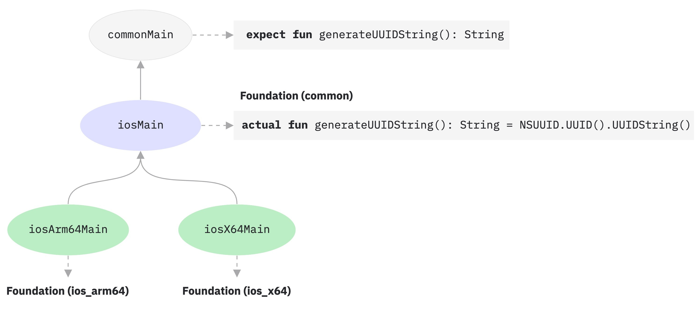

+++
title = "13.6.8.1 Kotlin 1.6.20 新变化"
date = 2026-09-13T08:50:47+08:00
weight = 1
type = "docs"
description = ""
isCJKLanguage = true
draft = false
+++


> 原文链接: [https://kotlinlang.org/docs/whatsnew1620.html](https://kotlinlang.org/docs/whatsnew1620.html)

# 13.6.8.1 Kotlin 1.6.20 新变化

阅读 Kotlin 1.6.20 发行说明，了解新的语言特性，以及 Kotlin Multiplatform、JVM、Native、JS 的更新和 Gradle、Maven 的构建工具支持。

_[发布时间：2022 年 4 月 4 日](../../../13.5-Releases/#release-history)_

Kotlin 1.6.20 展示了未来语言特性的预览，使分层结构成为多平台项目的默认结构，并为其他组件带来了演进性改进。

你也可以在这个视频中查看这些变更的简短概述：

视频：[What's new in Kotlin 1.6.20](https://www.youtube.com/v/8F19ds109-o)

> **提示：** 有关 Kotlin 发布周期的信息，请参见 [Kotlin 发布流程](../../../13.5-Releases/)。

## 语言 {#language}

在 Kotlin 1.6.20 中，你可以试用两个新的语言特性：

* [Kotlin/JVM 的上下文接收者原型](#prototype-of-context-receivers-for-kotlin-jvm)
* [明确非可空类型](#definitely-non-nullable-types)

### Kotlin/JVM 的上下文接收者原型 {#prototype-of-context-receivers-for-kotlin-jvm}

> **警告：** 该特性是仅适用于 Kotlin/JVM 的原型。启用 `-Xcontext-receivers` 后，编译器会产生无法用于生产代码的预发布二进制文件。请仅在玩具项目中使用上下文接收者。我们欢迎你在 [YouTrack](https://youtrack.jetbrains.com/issues/KT) 中提供反馈。

在 Kotlin 1.6.20 中，你不再局限于只有一个接收者。如果需要更多接收者，你可以通过向声明中添加上下文接收者，使函数、属性和类依赖于上下文（或称为_上下文相关_）。上下文相关的声明会做以下事情：

* 它要求所有声明的上下文接收者都作为隐式接收者出现在调用方的作用域中。
* 它把声明的上下文接收者作为隐式接收者引入其主体作用域。

```kotlin
interface LoggingContext {
    val log: Logger // 此上下文提供对 logger 的引用
}

context(LoggingContext)
fun startBusinessOperation() {
    // 由于 LoggingContext 是隐式接收者，你可以访问 log 属性
    log.info("Operation has started")
}

fun test(loggingContext: LoggingContext) {
    with(loggingContext) {
        // 你需要让 LoggingContext 作为隐式接收者
        // 出现在作用域中，才能调用 startBusinessOperation()
        startBusinessOperation()
    }
}
```

要在项目中启用上下文接收者，请使用 `-Xcontext-receivers` 编译器选项。你可以在 [KEEP](https://kotlinlang.org/docs/https://github.com/Kotlin/KEEP/blob/master/proposals/context-receivers.html#detailed-design) 中找到该特性及其语法的详细说明。

请注意，该实现只是一个原型：

* 启用 `-Xcontext-receivers` 后，编译器会产生无法用于生产代码的预发布二进制文件
* 目前 IDE 对上下文接收者的支持非常有限

在你的玩具项目中试用该特性，并通过[这个 YouTrack 议题](https://youtrack.jetbrains.com/issue/KT-42435)与我们分享你的想法和经验。如果遇到任何问题，请[提交新议题](https://kotl.in/issue)。

### 明确非可空类型 {#definitely-non-nullable-types}

> **警告：** 明确非可空类型处于 [Beta](../../../13.4-ComponentsStability/) 阶段。它们几乎已经稳定，但将来可能需要迁移步骤。我们会尽力把你需要做的改动降到最少。

为了在继承泛型 Java 类和接口时提供更好的互操作，Kotlin 1.6.20 允许你在使用处用新语法 `T & Any` 把泛型类型参数标记为明确非可空。该语法形式来自[交集类型](https://en.wikipedia.org/wiki/Intersection_type)的写法，目前限于 `&` 左侧是带可空上界的类型参数、右侧是非可空的 `Any`：

```kotlin
fun <T> elvisLike(x: T, y: T & Any): T & Any = x ?: y

fun main() {
    // 没问题
    elvisLike<String>("", "").length
    // 错误：'null' 不能作为非空类型的值
    elvisLike<String>("", null).length

    // 没问题
    elvisLike<String?>(null, "").length
    // 错误：'null' 不能作为非空类型的值
    elvisLike<String?>(null, null).length
}
```

把语言版本设置为 `1.7` 即可启用该特性：

**Kotlin**

```kotlin
kotlin {
    sourceSets.all {
        languageSettings.apply {
            languageVersion = "1.7"
        }
    }
}
```

**Groovy**

```groovy
kotlin {
    sourceSets.all {
        languageSettings {
            languageVersion = '1.7'
        }
    }
}
```

请在 [KEEP](https://kotlinlang.org/docs/https://github.com/Kotlin/KEEP/blob/master/proposals/definitely-non-nullable-types.html) 中进一步了解明确非可空类型。

## Kotlin/JVM {#kotlin-jvm}

Kotlin 1.6.20 引入了：

* JVM 接口中默认方法的兼容性改进：[接口的新 `@JvmDefaultWithCompatibility` 注解](#new-jvmdefaultwithcompatibility-annotation-for-interfaces)以及 [`-Xjvm-default` 模式中的兼容性变更](#compatibility-changes-in-the-xjvm-default-modes)
* [JVM 后端支持单个模块的并行编译](#support-for-parallel-compilation-of-a-single-module-in-the-jvm-backend)
* [支持对函数式接口构造器的可调用引用](#support-for-callable-references-to-functional-interface-constructors)

### 接口的新 @JvmDefaultWithCompatibility 注解 {#new-jvmdefaultwithcompatibility-annotation-for-interfaces}

Kotlin 1.6.20 引入了新注解 [`@JvmDefaultWithCompatibility`](https://kotlinlang.org/api/latest/jvm/stdlib/kotlin.jvm/-jvm-default-with-compatibility/)：把它与 `-Xjvm-default=all` 编译器选项一起使用，可以为任何 Kotlin 接口中的任何非抽象成员[在 JVM 接口中创建默认方法](../../../../interoperability/7.1-Javainterop/7.1.3-JavaToKotlinInterop/#default-methods-in-interfaces)。

如果有客户端使用未带 `-Xjvm-default=all` 选项编译的 Kotlin 接口，它们可能与用该选项编译的代码二进制不兼容。在 Kotlin 1.6.20 之前，为避免这一兼容性问题，[推荐做法](https://blog.jetbrains.com/kotlin/2020/07/kotlin-1-4-m3-generating-default-methods-in-interfaces/#JvmDefaultWithoutCompatibility)是使用 `-Xjvm-default=all-compatibility` 模式，并为不需要这种兼容性的接口使用 `@JvmDefaultWithoutCompatibility` 注解。

这种做法有一些缺点：

* 在新增接口时，你很容易忘记添加该注解。
* 通常非公开部分的接口比公开 API 中的更多，所以你最终会在代码中的许多地方都带上这个注解。

现在，你可以使用 `-Xjvm-default=all` 模式，并用 `@JvmDefaultWithCompatibility` 注解标记接口。这样你只需为公开 API 中的所有接口添加一次该注解，而新的非公开代码则无需使用任何注解。

请在[这个 YouTrack 议题](https://youtrack.jetbrains.com/issue/KT-48217)中留下你对这个新注解的反馈。

### -Xjvm-default 模式中的兼容性变更 {#compatibility-changes-in-the-xjvm-default-modes}

Kotlin 1.6.20 新增了在默认模式（`-Xjvm-default=disable` 编译器选项）下编译模块，并针对以 `-Xjvm-default=all` 或 `-Xjvm-default=all-compatibility` 模式编译的模块进行编译的选项。与之前一样，如果所有模块都使用 `-Xjvm-default=all` 或 `-Xjvm-default=all-compatibility` 模式，编译也会成功。你可以在这个 [YouTrack 议题](https://youtrack.jetbrains.com/issue/KT-47000)中留下反馈。

Kotlin 1.6.20 弃用了编译器选项 `-Xjvm-default` 的 `compatibility` 和 `enable` 模式。其他模式的描述在兼容性方面有所变化，但整体逻辑保持不变。你可以查看[更新后的描述](../../../../interoperability/7.1-Javainterop/7.1.3-JavaToKotlinInterop/#compatibility-modes-for-default-methods)。

有关 Java 互操作中默认方法的更多信息，请参见[互操作文档](../../../../interoperability/7.1-Javainterop/7.1.3-JavaToKotlinInterop/#default-methods-in-interfaces)和[这篇博客文章](https://blog.jetbrains.com/kotlin/2020/07/kotlin-1-4-m3-generating-default-methods-in-interfaces/)。

### JVM 后端支持单个模块的并行编译 {#support-for-parallel-compilation-of-a-single-module-in-the-jvm-backend}

> **警告：** JVM 后端对单个模块并行编译的支持是[实验性](../../../13.4-ComponentsStability/)的。它随时可能被放弃或更改。需要选择启用（详见下文），并且只应用于评估目的。我们欢迎你在 [YouTrack](https://youtrack.jetbrains.com/issue/KT-46085) 中提供反馈。

我们正在继续[改进新的 JVM IR 后端的编译时间](https://youtrack.jetbrains.com/issue/KT-46768)。在 Kotlin 1.6.20 中，我们添加了实验性的 JVM IR 后端模式，可以并行编译模块中的所有文件。并行编译最多可以将总编译时间减少 15%。

通过[编译器选项](../../../../compilerandplugins/12.1-Kotlincompiler/12.1.4-CompilerReference/#compiler-options) `-Xbackend-threads` 启用实验性的并行后端模式。该选项使用以下参数：

* `N` 是你想使用的线程数。它不应大于你的 CPU 核心数；否则由于线程间上下文切换，并行化会失去效果
* `0` 表示为每个 CPU 核心使用一个单独的线程

[Gradle](../../../../buildtools/11.1-Gradle/11.1.1-Gradle/) 可以并行运行任务，但从 Gradle 的角度看，当项目（或项目的主要部分）只是一个大任务时，这种并行化帮助不大。如果你有一个非常大的单体模块，请使用并行编译来加快编译速度。如果你的项目由许多小模块组成，并且已经由 Gradle 并行构建，那么再添加一层并行化可能因上下文切换而损害性能。

> **注意：** 并行编译有一些限制：* 它无法与 [kapt](../../../../compilerandplugins/12.2-Kotlincompilerplugins/12.2.3-Kapt/) 一起使用，因为 kapt 会禁用 IR 后端 * 它按设计需要更多 JVM 堆内存。堆内存量与线程数成正比

### 支持对函数式接口构造器的可调用引用 {#support-for-callable-references-to-functional-interface-constructors}

> **警告：** 对函数式接口构造器的可调用引用的支持是[实验性](../../../13.4-ComponentsStability/)的。它随时可能被放弃或更改。需要选择启用（详见下文），并且只应用于评估目的。我们欢迎你在 [YouTrack](https://youtrack.jetbrains.com/issue/KT-47939) 中提供反馈。

对函数式接口构造器的[可调用引用](../../../../languageguide/5.13-Reflection/#callable-references)的支持，提供了一种源码兼容的方式，让你可以从带构造器函数的接口迁移到[函数式接口](../../../../languageguide/5.8-Classesandinterfaces/5.8.9-Specialclassesandinterfaces/5.8.9.5-FunInterfaces/)。

考虑以下代码：

```kotlin
interface Printer {
    fun print()
}

fun Printer(block: () -> Unit): Printer = object : Printer { override fun print() = block() }
```

启用对函数式接口构造器的可调用引用后，这段代码可以被替换为仅仅一个函数式接口声明：

```kotlin
fun interface Printer {
    fun print()
}
```

它的构造器会被隐式创建，任何使用 `::Printer` 函数引用的代码都能编译。例如：

```kotlin
documentsStorage.addPrinter(::Printer)
```

通过用带 `DeprecationLevel.HIDDEN` 的 [`@Deprecated`](https://kotlinlang.org/api/latest/jvm/stdlib/kotlin/-deprecated/) 注解标记旧的 `Printer` 函数，可以保持二进制兼容性：

```kotlin
@Deprecated(message = "Your message about the deprecation", level = DeprecationLevel.HIDDEN)
fun Printer(...) {...}
```

使用编译器选项 `-XXLanguage:+KotlinFunInterfaceConstructorReference` 启用该特性。

## Kotlin/Native {#kotlin-native}

Kotlin/Native 1.6.20 标志着其新组件的持续开发。我们又向着与其他平台一致的 Kotlin 体验迈出了一步：

* [新内存管理器的进展](#an-update-on-the-new-memory-manager)
* [新内存管理器中清理阶段的并发实现](#concurrent-implementation-for-the-sweep-phase-in-new-memory-manager)
* [注解类的实例化](#instantiation-of-annotation-classes)
* [与 Swift async/await 的互操作：返回 Swift 的 Void 而不是 KotlinUnit](#interop-with-swift-async-await-returning-void-instead-of-kotlinunit)
* [使用 libbacktrace 获得更好的堆栈跟踪](#better-stack-traces-with-libbacktrace)
* [支持独立的 Android 可执行文件](#support-for-standalone-android-executables)
* [性能改进](#performance-improvements)
* [改进 cinterop 模块导入时的错误处理](#improved-error-handling-during-cinterop-modules-import)
* [支持 Xcode 13 库](#support-for-xcode-13-libraries)

### 新内存管理器进展 {#an-update-on-the-new-memory-manager}

> **注意：** 新的 Kotlin/Native 内存管理器处于 [Alpha](../../../13.4-ComponentsStability/) 阶段。它可能会以不兼容的方式发生变化，并在将来需要手动迁移。我们欢迎你在 [YouTrack](https://youtrack.jetbrains.com/issue/KT-48525) 中提供反馈。

借助 Kotlin 1.6.20，你可以试用新的 Kotlin/Native 内存管理器的 Alpha 版本。它消除了 JVM 与 Native 平台之间的差异，从而在多平台项目中提供一致的开发体验。例如，你将更容易创建同时运行在 Android 和 iOS 上的跨平台移动应用。

新的 Kotlin/Native 内存管理器取消了对线程之间共享对象的限制。它还提供了无泄漏的并发编程原语，既安全也不需要任何特殊管理或注解。

新的内存管理器将在未来的版本中成为默认选项，因此我们鼓励你现在就试用。请查看我们的[博客文章](https://blog.jetbrains.com/kotlin/2021/08/try-the-new-kotlin-native-memory-manager-development-preview/)以了解新内存管理器的更多信息并探索演示项目，或者直接跳到[迁移说明](https://kotlinlang.org/docs/https://github.com/JetBrains/kotlin/blob/master/kotlin-native/NEW_MM.html)亲自试用。

请在你的项目上试用新的内存管理器，看看它的效果，并在我们的问题跟踪器 [YouTrack](https://youtrack.jetbrains.com/issue/KT-48525) 中分享反馈。

### 新内存管理器中清理阶段的并发实现 {#concurrent-implementation-for-the-sweep-phase-in-new-memory-manager}

如果你已经切换到我们在 [Kotlin 1.6 中宣布](../13.6.8.2-Whatsnew16/#preview-of-the-new-memory-manager)的新内存管理器，你可能已经注意到执行时间的大幅改善：我们的基准测试显示平均提升 35%。从 1.6.20 开始，新内存管理器还提供了清理阶段的并发实现。这应该也能改善性能并缩短垃圾回收暂停的时长。

要为新的 Kotlin/Native 内存管理器启用该特性，请传入以下编译器选项：

```bash
-Xgc=cms
```

欢迎在这个 [YouTrack 议题](https://youtrack.jetbrains.com/issue/KT-48526)中分享你对新内存管理器性能的反馈。

### 注解类的实例化 {#instantiation-of-annotation-classes}

在 Kotlin 1.6.0 中，注解类的实例化对 Kotlin/JVM 和 Kotlin/JS 已进入 [Stable](../../../13.4-ComponentsStability/)。1.6.20 版本为 Kotlin/Native 提供了支持。

进一步了解[注解类的实例化](../../../../languageguide/5.1-Basicsyntax/5.1.4-Annotations/#instantiation)。

### 与 Swift async/await 的互操作：返回 Void 而不是 KotlinUnit {#interop-with-swift-async-await-returning-void-instead-of-kotlinunit}

> **警告：** 与 Swift async/await 的并发互操作是[实验性](../../../13.4-ComponentsStability/)的。它随时可能被放弃或更改。请仅将其用于评估目的。我们欢迎你在 [YouTrack](https://youtrack.jetbrains.com/issue/KT-47610) 中提供反馈。

我们继续推进[与 Swift async/await 的实验性互操作](../../13.6.9-Kotlin15x/13.6.9.1-Whatsnew1530/#experimental-interoperability-with-swift-5-5-async-await)（自 Swift 5.5 起可用）。Kotlin 1.6.20 与之前版本在处理返回类型为 `Unit` 的 `suspend` 函数时有所不同。

以前，这类函数在 Swift 中表示为返回 `KotlinUnit` 的 `async` 函数。然而，对它们来说正确的返回类型是 `Void`，与非挂起函数相同。

为了避免破坏现有代码，我们引入了一个 Gradle 属性，让编译器把返回 `Unit` 的挂起函数转换为返回 `Void` 的 `async` Swift 函数：

```none
# gradle.properties
kotlin.native.binary.unitSuspendFunctionObjCExport=proper
```

我们计划在未来的 Kotlin 版本中把这一行为变为默认。

### 使用 libbacktrace 获得更好的堆栈跟踪 {#better-stack-traces-with-libbacktrace}

> **警告：** 使用 libbacktrace 解析源代码位置是[实验性](../../../13.4-ComponentsStability/)的。它随时可能被放弃或更改。请仅将其用于评估目的。我们欢迎你在 [YouTrack](https://youtrack.jetbrains.com/issue/KT-48424) 中提供反馈。

Kotlin/Native 现在可以为 `linux*`（`linuxMips32` 和 `linuxMipsel32` 除外）和 `androidNative*` 目标生成带文件位置和行号的详细堆栈跟踪，从而更好地进行调试。

该特性在底层使用 [libbacktrace](https://github.com/ianlancetaylor/libbacktrace) 库。看一下以下代码，了解差异的示例：

```kotlin
fun main() = bar()
fun bar() = baz()
inline fun baz() {
    error("")
}
```

* **1.6.20 之前：**

```text
Uncaught Kotlin exception: kotlin.IllegalStateException:
   at 0   example.kexe        0x227190       kfun:kotlin.Throwable#<init>(kotlin.String?){} + 96
   at 1   example.kexe        0x221e4c       kfun:kotlin.Exception#<init>(kotlin.String?){} + 92
   at 2   example.kexe        0x221f4c       kfun:kotlin.RuntimeException#<init>(kotlin.String?){} + 92
   at 3   example.kexe        0x22234c       kfun:kotlin.IllegalStateException#<init>(kotlin.String?){} + 92
   at 4   example.kexe        0x25d708       kfun:#bar(){} + 104
   at 5   example.kexe        0x25d68c       kfun:#main(){} + 12
```

* **1.6.20 配合 libbacktrace：**

```text
Uncaught Kotlin exception: kotlin.IllegalStateException:
   at 0   example.kexe        0x229550    kfun:kotlin.Throwable#<init>(kotlin.String?){} + 96 (/opt/buildAgent/work/c3a91df21e46e2c8/kotlin/kotlin-native/runtime/src/main/kotlin/kotlin/Throwable.kt:24:37)
   at 1   example.kexe        0x22420c    kfun:kotlin.Exception#<init>(kotlin.String?){} + 92 (/opt/buildAgent/work/c3a91df21e46e2c8/kotlin/kotlin-native/runtime/src/main/kotlin/kotlin/Exceptions.kt:23:44)
   at 2   example.kexe        0x22430c    kfun:kotlin.RuntimeException#<init>(kotlin.String?){} + 92 (/opt/buildAgent/work/c3a91df21e46e2c8/kotlin/kotlin-native/runtime/src/main/kotlin/kotlin/Exceptions.kt:34:44)
   at 3   example.kexe        0x22470c    kfun:kotlin.IllegalStateException#<init>(kotlin.String?){} + 92 (/opt/buildAgent/work/c3a91df21e46e2c8/kotlin/kotlin-native/runtime/src/main/kotlin/kotlin/Exceptions.kt:70:44)
   at 4   example.kexe        0x25fac8    kfun:#bar(){} + 104 [inlined] (/opt/buildAgent/work/c3a91df21e46e2c8/kotlin/libraries/stdlib/src/kotlin/util/Preconditions.kt:143:56)
   at 5   example.kexe        0x25fac8    kfun:#bar(){} + 104 [inlined] (/private/tmp/backtrace/src/commonMain/kotlin/app.kt:4:5)
   at 6   example.kexe        0x25fac8    kfun:#bar(){} + 104 (/private/tmp/backtrace/src/commonMain/kotlin/app.kt:2:13)
   at 7   example.kexe        0x25fa4c    kfun:#main(){} + 12 (/private/tmp/backtrace/src/commonMain/kotlin/app.kt:1:14)
```

在堆栈跟踪中早已带有文件位置和行号的 Apple 目标上，libbacktrace 为内联函数调用提供了更多细节：

* **1.6.20 之前：**

```text
Uncaught Kotlin exception: kotlin.IllegalStateException:
   at 0   example.kexe    0x10a85a8f8    kfun:kotlin.Throwable#<init>(kotlin.String?){} + 88 (/opt/buildAgent/work/c3a91df21e46e2c8/kotlin/kotlin-native/runtime/src/main/kotlin/kotlin/Throwable.kt:24:37)
   at 1   example.kexe    0x10a855846    kfun:kotlin.Exception#<init>(kotlin.String?){} + 86 (/opt/buildAgent/work/c3a91df21e46e2c8/kotlin/kotlin-native/runtime/src/main/kotlin/kotlin/Exceptions.kt:23:44)
   at 2   example.kexe    0x10a855936    kfun:kotlin.RuntimeException#<init>(kotlin.String?){} + 86 (/opt/buildAgent/work/c3a91df21e46e2c8/kotlin/kotlin-native/runtime/src/main/kotlin/kotlin/Exceptions.kt:34:44)
   at 3   example.kexe    0x10a855c86    kfun:kotlin.IllegalStateException#<init>(kotlin.String?){} + 86 (/opt/buildAgent/work/c3a91df21e46e2c8/kotlin/kotlin-native/runtime/src/main/kotlin/kotlin/Exceptions.kt:70:44)
   at 4   example.kexe    0x10a8489a5    kfun:#bar(){} + 117 (/private/tmp/backtrace/src/commonMain/kotlin/app.kt:2:1)
   at 5   example.kexe    0x10a84891c    kfun:#main(){} + 12 (/private/tmp/backtrace/src/commonMain/kotlin/app.kt:1:14)
...
```

* **1.6.20 配合 libbacktrace：**

```text
Uncaught Kotlin exception: kotlin.IllegalStateException:
   at 0   example.kexe    0x10669bc88    kfun:kotlin.Throwable#<init>(kotlin.String?){} + 88 (/opt/buildAgent/work/c3a91df21e46e2c8/kotlin/kotlin-native/runtime/src/main/kotlin/kotlin/Throwable.kt:24:37)
   at 1   example.kexe    0x106696bd6    kfun:kotlin.Exception#<init>(kotlin.String?){} + 86 (/opt/buildAgent/work/c3a91df21e46e2c8/kotlin/kotlin-native/runtime/src/main/kotlin/kotlin/Exceptions.kt:23:44)
   at 2   example.kexe    0x106696cc6    kfun:kotlin.RuntimeException#<init>(kotlin.String?){} + 86 (/opt/buildAgent/work/c3a91df21e46e2c8/kotlin/kotlin-native/runtime/src/main/kotlin/kotlin/Exceptions.kt:34:44)
   at 3   example.kexe    0x106697016    kfun:kotlin.IllegalStateException#<init>(kotlin.String?){} + 86 (/opt/buildAgent/work/c3a91df21e46e2c8/kotlin/kotlin-native/runtime/src/main/kotlin/kotlin/Exceptions.kt:70:44)
   at 4   example.kexe    0x106689d35    kfun:#bar(){} + 117 [inlined] (/opt/buildAgent/work/c3a91df21e46e2c8/kotlin/libraries/stdlib/src/kotlin/util/Preconditions.kt:143:56)
>>  at 5   example.kexe    0x106689d35    kfun:#bar(){} + 117 [inlined] (/private/tmp/backtrace/src/commonMain/kotlin/app.kt:4:5)
   at 6   example.kexe    0x106689d35    kfun:#bar(){} + 117 (/private/tmp/backtrace/src/commonMain/kotlin/app.kt:2:13)
   at 7   example.kexe    0x106689cac    kfun:#main(){} + 12 (/private/tmp/backtrace/src/commonMain/kotlin/app.kt:1:14)
...
```

要使用 libbacktrace 生成更好的堆栈跟踪，请在 `gradle.properties` 中添加以下代码行：

```none
# gradle.properties
kotlin.native.binary.sourceInfoType=libbacktrace
```

请在这个 [YouTrack 议题](https://youtrack.jetbrains.com/issue/KT-48424)中告诉我们，使用 libbacktrace 调试 Kotlin/Native 对你来说效果如何。

### 支持独立的 Android 可执行文件 {#support-for-standalone-android-executables}

以前，Kotlin/Native 中的 Android Native 可执行文件实际上并不是可执行文件，而是可以作为 NativeActivity 使用的共享库。现在有了为 Android Native 目标生成标准可执行文件的选项。

为此，请在项目的 `build.gradle(.kts)` 中配置 `androidNative` 目标的 executable 块。添加以下二进制选项：

```kotlin
kotlin {
    androidNativeX64("android") {
        binaries {
            executable {
                binaryOptions["androidProgramType"] = "standalone"
            }
        }
    }
}
```

请注意，该特性将在 Kotlin 1.7.0 中成为默认。如果你想保留当前行为，请使用以下设置：

```kotlin
binaryOptions["androidProgramType"] = "nativeActivity"
```

感谢 Mattia Iavarone 的[实现](https://github.com/jetbrains/kotlin/pull/4624)！

### 性能改进 {#performance-improvements}

我们正努力让 Kotlin/Native [加快编译过程](https://youtrack.jetbrains.com/issue/KT-42294)并改善你的开发体验。

Kotlin 1.6.20 带来了一些影响 Kotlin 所生成 LLVM IR 的性能更新和缺陷修复。根据我们内部项目的基准测试，平均获得了以下性能提升：

* 执行时间减少 15%
* release 和 debug 二进制文件的代码体积都减少 20%
* release 二进制文件的编译时间减少 26%

这些变更还使一个大型内部项目上 debug 二进制的编译时间减少了 10%。

为此，我们为一些编译器生成的合成对象实现了静态初始化，改进了我们为每个函数组织 LLVM IR 的方式，并优化了编译器缓存。

### 改进 cinterop 模块导入时的错误处理 {#improved-error-handling-during-cinterop-modules-import}

此版本改进了使用 `cinterop` 工具导入 Objective-C 模块（CocoaPods pod 的典型做法）时的错误处理。以前，如果你在尝试使用 Objective-C 模块时遇到错误（例如处理头文件中的编译错误时），会收到信息量很少的错误消息，例如 `fatal error: could not build module $name`。我们扩展了 `cinterop` 工具的这一部分，因此你将得到带有详细描述的错误消息。

### 支持 Xcode 13 库 {#support-for-xcode-13-libraries}

从此次发布起，随 Xcode 13 交付的库得到完整支持。你可以随时在 Kotlin 代码中的任何位置访问它们。

## Kotlin Multiplatform {#kotlin-multiplatform}

1.6.20 为 Kotlin Multiplatform 带来了以下值得注意的更新：

* [分层结构支持现在是所有新多平台项目的默认设置](#hierarchical-structure-support-for-multiplatform-projects)
* [Kotlin CocoaPods Gradle 插件获得了若干用于 CocoaPods 集成的实用特性](#kotlin-cocoapods-gradle-plugin)

### 多平台项目的分层结构支持 {#hierarchical-structure-support-for-multiplatform-projects}

Kotlin 1.6.20 默认启用了分层结构支持。自从[在 Kotlin 1.4.0 中引入它](../../13.6.10-Kotlin14x/13.6.10.3-Whatsnew14/#sharing-code-in-several-targets-with-the-hierarchical-project-structure)以来，我们大幅改进了前端，并使 IDE 导入变得稳定。

以前，在多平台项目中有两种添加代码的方式。第一种是把它插入平台特定的源集中，这种源集仅限一个目标，无法被其他平台复用。第二种是使用在 Kotlin 当前支持的所有平台之间共享的通用源集。

现在你可以在多个相似的 native 目标之间[共享源代码](#better-code-sharing-in-your-project)，这些目标复用大量通用逻辑和第三方 API。该技术会提供正确的默认依赖，并找出共享代码中确切可用的 API。这消除了复杂的构建配置，也不必再为了在 native 目标之间共享源集而使用各种变通方案来获得 IDE 支持。它还有助于防止针对其他目标的不安全 API 用法。

该技术对[库作者](#more-opportunities-for-library-authors)也很有用，因为分层项目结构允许他们发布和消费为部分目标提供通用 API 的库。

默认情况下，用分层项目结构发布的库只与使用分层结构的项目兼容。

#### 项目中更好的代码共享 {#better-code-sharing-in-your-project}

如果没有分层结构支持，就无法直接地在_部分_（而非_全部_）[Kotlin 目标](https://kotlinlang.org/docs/multiplatform/multiplatform-dsl-reference.html#targets)之间共享代码。一个常见的例子是在所有 iOS 目标之间共享代码，并访问 iOS 特有的[依赖](https://kotlinlang.org/docs/multiplatform/multiplatform-share-on-platforms.html#connect-platform-specific-libraries)，例如 Foundation。

得益于分层项目结构支持，你现在可以开箱即用地实现这一点。在新结构中，源集形成层次结构。你可以使用给定源集所编译到的每个目标可用的平台特定语言特性和依赖。

例如，考虑一个典型的包含两个目标的多平台项目——用于 iOS 设备和模拟器的 `iosArm64` 和 `iosX64`。Kotlin 工具链知道这两个目标具有相同的函数，并允许你从中间源集 `iosMain` 中访问该函数。



Kotlin 工具链会提供正确的默认依赖，例如 Kotlin/Native stdlib 或原生库。此外，Kotlin 工具链会尽力找出共享代码中确切可用的 API 范围。这可以防止诸如在为 Windows 共享的代码中使用 macOS 特有函数这类情况。

#### 库作者的更多机会 {#more-opportunities-for-library-authors}

发布多平台库时，其中间源集的 API 现在也会随之正确发布，从而可供使用者使用。同样，Kotlin 工具链会自动推断出使用者源集中可用的 API，同时谨慎防范不安全的用法，例如在 JS 代码中使用本应属于 JVM 的 API。进一步了解[在库中共享代码](https://kotlinlang.org/docs/multiplatform/multiplatform-share-on-platforms.html#share-code-in-libraries)。

#### 配置与设置 {#configuration-and-setup}

从 Kotlin 1.6.20 开始，你所有新的多平台项目都会拥有分层项目结构。无需额外配置。

* 如果你已经[手动开启](https://kotlinlang.org/docs/multiplatform/multiplatform-share-on-platforms.html#share-code-on-similar-platforms)过，可以从 `gradle.properties` 中移除这些已弃用的选项：

```none
  # gradle.properties
  kotlin.mpp.enableGranularSourceSetsMetadata=true
  kotlin.native.enableDependencyPropagation=false // 或者 'true'，取决于你之前的配置
```

* 对于 Kotlin 1.6.20，我们建议使用 [Android Studio 2021.1.1](https://developer.android.com/studio)（Bumblebee）或更高版本以获得最佳体验。

* 你也可以选择退出。要禁用分层结构支持，请在 `gradle.properties` 中设置以下选项：

```none
  # gradle.properties
  kotlin.mpp.hierarchicalStructureSupport=false
```

#### 留下你的反馈 {#leave-your-feedback}

这是对整个生态的重大变更。我们欢迎你的反馈，帮助我们把它做得更好。

现在就试用一下，并把遇到的任何困难报告到[我们的问题跟踪器](https://kotl.in/issue)。

### Kotlin CocoaPods Gradle 插件 {#kotlin-cocoapods-gradle-plugin}

为了简化 CocoaPods 集成，Kotlin 1.6.20 提供了以下特性：

* CocoaPods 插件现在有了用所有已注册目标构建 XCFramework 并生成 Podspec 文件的任务。当你不想直接与 Xcode 集成，而是想构建制品并将其部署到本地 CocoaPods 仓库时，这会很有用。

进一步了解[构建 XCFramework](https://kotlinlang.org/docs/multiplatform/multiplatform-build-native-binaries.html#build-xcframeworks)。

* 如果你在项目中使用 [CocoaPods 集成](https://kotlinlang.org/docs/multiplatform/multiplatform-cocoapods-overview.html)，你习惯于为整个 Gradle 项目指定所需的 Pod 版本。现在你有更多选择：
* 直接在 `cocoapods` 块中指定 Pod 版本
* 继续使用 Gradle 项目版本

如果这些属性都没有配置，你会得到错误。

* 现在你可以在 `cocoapods` 块中配置 CocoaPod 名称，而无需更改整个 Gradle 项目的名称。

* CocoaPods 插件引入了新的 `extraSpecAttributes` 属性，可用于配置先前被硬编码在 Podspec 文件中的属性，例如 `libraries` 或 `vendored_frameworks`。

```kotlin
kotlin {
    cocoapods {
        version = "1.0"
        name = "MyCocoaPod"
        extraSpecAttributes["social_media_url"] = 'https://twitter.com/kotlin'
        extraSpecAttributes["vendored_frameworks"] = 'CustomFramework.xcframework'
        extraSpecAttributes["libraries"] = 'xml'
    }
}
```

请参阅 Kotlin CocoaPods Gradle 插件的完整 [DSL 参考](https://kotlinlang.org/docs/multiplatform/multiplatform-cocoapods-dsl-reference.html)。

## Kotlin/JS {#kotlin-js}

1.6.20 中 Kotlin/JS 的改进主要影响 IR 编译器：

* [使用 IR 编译器对开发二进制文件进行增量编译](#incremental-compilation-for-development-binaries-with-ir-compiler)
* [使用 IR 编译器时默认延迟初始化顶层属性](#lazy-initialization-of-top-level-properties-by-default-with-ir-compiler)
* [使用 IR 编译器时默认为项目模块生成独立的 JS 文件](#separate-js-files-for-project-modules-by-default-with-ir-compiler)
* [Char 类优化](#char-class-optimization)
* [导出改进（IR 和旧后端均有）](#improvements-to-export-and-typescript-declaration-generation)
* [@AfterTest 对异步测试的保证](#aftertest-guarantees-for-asynchronous-tests)

### 使用 IR 编译器对开发二进制文件进行增量编译 {#incremental-compilation-for-development-binaries-with-ir-compiler}

为了让使用 IR 编译器进行 Kotlin/JS 开发更高效，我们引入了新的_增量编译_模式。

在该模式下使用 `compileDevelopmentExecutableKotlinJs` Gradle 任务构建**开发二进制文件**时，编译器会在模块级别缓存之前编译的结果。它在后续编译中对未更改的源文件使用缓存的编译结果，使编译更快完成，尤其是在改动较小时。请注意，这一改进只针对开发过程（缩短编辑-构建-调试循环），不影响生产制品的构建。

要为开发二进制文件启用增量编译，请在项目的 `gradle.properties` 中添加以下代码行：

```none
# gradle.properties
kotlin.incremental.js.ir=true // 默认值为 false
```

在我们的测试项目中，新模式使增量编译快了多达 30%。不过，由于需要创建和填充缓存，该模式下的干净构建变慢了。

请在这个 [YouTrack 议题](https://youtrack.jetbrains.com/issue/KT-50203)中告诉我们你对在 Kotlin/JS 项目中使用增量编译的看法。

### 使用 IR 编译器时默认延迟初始化顶层属性 {#lazy-initialization-of-top-level-properties-by-default-with-ir-compiler}

在 Kotlin 1.4.30 中，我们展示了 JS IR 编译器中[顶层属性延迟初始化](../../13.6.10-Kotlin14x/13.6.10.1-Whatsnew1430/#lazy-initialization-of-top-level-properties)的原型。通过消除在应用启动时初始化所有属性的需要，延迟初始化缩短了启动时间。我们的测量显示，在真实的 Kotlin/JS 应用上速度提升约 10%。

现在，在对该机制进行完善和充分测试之后，我们让延迟初始化成为 IR 编译器中顶层属性的默认行为。

```kotlin
// 延迟初始化
val a = run {
    val result = // 密集计算
        println(result)
    result
} // run 会在该变量首次被使用时执行
```

如果出于某些原因你需要立即初始化属性（在应用启动时），请用 [`@EagerInitialization`](https://kotlinlang.org/api/latest/jvm/stdlib/kotlin.native/-eager-initialization/) 注解标记它。

### 使用 IR 编译器时默认为项目模块生成独立的 JS 文件 {#separate-js-files-for-project-modules-by-default-with-ir-compiler}

以前，JS IR 编译器提供了为项目模块[生成独立 `.js` 文件]( https://youtrack.jetbrains.com/issue/KT-44319)的能力。这是对默认选项——整个项目生成单个 `.js` 文件——的替代方案。单个文件可能太大且使用不便，因为每当你想使用项目中的某个函数时，都必须把整个 JS 文件作为依赖引入。多个文件增加了灵活性并减小了此类依赖的体积。该特性可通过 `-Xir-per-module` 编译器选项使用。

从 1.6.20 开始，JS IR 编译器默认为项目模块生成独立的 `.js` 文件。

现在可以通过以下 Gradle 属性把项目编译为单个 `.js` 文件：

```none
# gradle.properties
kotlin.js.ir.output.granularity=whole-program // `per-module` 是默认值
```

在之前的版本中，实验性的按模块模式（通过 `-Xir-per-module=true` 标志使用）会在每个模块中调用 `main()` 函数。这与常规的单个 `.js` 模式不一致。从 1.6.20 开始，在两种情况下 `main()` 函数都只会在主模块中被调用。如果你确实需要在模块加载时运行一些代码，可以使用带 `@EagerInitialization` 注解的顶层属性。请参见[默认延迟初始化顶层属性（IR）](#lazy-initialization-of-top-level-properties-by-default-with-ir-compiler)。

### Char 类优化 {#char-class-optimization}

Kotlin/JS 编译器现在处理 `Char` 类时不会引入装箱（类似于[内联类](../../../../languageguide/5.8-Classesandinterfaces/5.8.9-Specialclassesandinterfaces/5.8.9.3-InlineClasses/)）。这加快了 Kotlin/JS 代码中对字符的操作。

除了性能改进之外，这也改变了 `Char` 导出到 JavaScript 的方式：现在它会被转换为 `Number`。

### 导出与 TypeScript 声明生成的改进 {#improvements-to-export-and-typescript-declaration-generation}

Kotlin 1.6.20 为导出机制（[`@JsExport`](https://kotlinlang.org/api/latest/jvm/stdlib/kotlin.js/-js-export/) 注解）带来了多项修复和改进，包括[生成 TypeScript 声明（`.d.ts`）](../../../../development/6.2-Webdevelopment/6.2.2-Kotlinjs/6.2.2.3-JsProjectSetup/#generation-of-typescript-declaration-files-d-ts)。我们添加了导出接口和枚举的能力，并修复了此前向我们报告的某些边界情况下的导出行为。更多细节请参见 [YouTrack 中的导出改进列表](https://youtrack.jetbrains.com/issues?q=Project:%20Kotlin%20issue%20id:%20KT-45434,%20KT-44494,%20KT-37916,%20KT-43191,%20KT-46961,%20KT-40236)。

进一步了解[从 JavaScript 使用 Kotlin 代码](../../../../interoperability/7.2-Javascriptinterop/7.2.5-JsToKotlinInterop/)。

### @AfterTest 对异步测试的保证 {#aftertest-guarantees-for-asynchronous-tests}

Kotlin 1.6.20 使 [`@AfterTest`](https://kotlinlang.org/api/latest/kotlin.test/kotlin.test/-after-test/) 函数在 Kotlin/JS 上能正确处理异步测试。如果测试函数的返回类型被静态解析为 [`Promise`](https://kotlinlang.org/api/latest/jvm/stdlib/kotlin.js/-promise/)，编译器现在会把 `@AfterTest` 函数的执行安排到相应的 [`then()`](https://kotlinlang.org/api/latest/jvm/stdlib/kotlin.js/-promise/then.html) 回调中。

## 安全性 {#security}

Kotlin 1.6.20 引入了几个用于提升代码安全性的特性：

* [在 klib 中使用相对路径](#using-relative-paths-in-klibs)
* [为 Kotlin/JS Gradle 项目持久化 yarn.lock](#persisting-yarn-lock-for-kotlin-js-gradle-projects)
* [默认使用 `--ignore-scripts` 安装 npm 依赖](#installation-of-npm-dependencies-with-ignore-scripts-by-default)

### 在 klib 中使用相对路径 {#using-relative-paths-in-klibs}

`klib` 格式的库[包含](../../../../development/6.3-Nativedevelopment/6.3.3-NativeLibraries/#library-format)源文件序列化后的 IR 表示，其中还包括这些文件的路径，用于生成正确的调试信息。在 Kotlin 1.6.20 之前，存储的文件路径是绝对路径。由于库作者可能不想共享绝对路径，1.6.20 版本提供了另一种选择。

如果你要发布 `klib`，并且希望在制品中只使用源文件的相对路径，现在可以传入 `-Xklib-relative-path-base` 编译器选项，并指定一个或多个源文件基础路径：

**Kotlin**

```kotlin
tasks.withType(org.jetbrains.kotlin.gradle.dsl.KotlinCompile::class).configureEach {
    // $base 是源文件的基础路径
    kotlinOptions.freeCompilerArgs += "-Xklib-relative-path-base=$base"
}
```

**Groovy**

```groovy
tasks.withType(org.jetbrains.kotlin.gradle.dsl.KotlinCompile).configureEach {
    kotlinOptions {
        // $base 是源文件的基础路径
        freeCompilerArgs += "-Xklib-relative-path-base=$base"
    }
}
```

### 为 Kotlin/JS Gradle 项目持久化 yarn.lock {#persisting-yarn-lock-for-kotlin-js-gradle-projects}

> **注意：** 该特性已向后移植到 Kotlin 1.6.10。

Kotlin/JS Gradle 插件现在提供了持久化 `yarn.lock` 文件的能力，使你无需额外配置 Gradle 就能锁定项目的 npm 依赖版本。该特性带来了默认项目结构的变化：在项目根目录添加自动生成的 `kotlin-js-store` 目录，其中存放 `yarn.lock` 文件。

我们强烈建议把 `kotlin-js-store` 目录及其内容提交到版本控制系统。把锁文件提交到版本控制系统是[推荐做法](https://classic.yarnpkg.com/blog/2016/11/24/lockfiles-for-all/)，因为这样可以确保你的应用在所有机器上（无论是其他机器上的开发环境还是 CI/CD 服务）都使用完全相同的依赖树进行构建。锁文件还能防止在新机器上检出项目时 npm 依赖被静默更新，后者是一个安全隐患。

像 [Dependabot](https://github.com/dependabot) 这样的工具也可以解析你 Kotlin/JS 项目的 `yarn.lock` 文件，并在你所依赖的任何 npm 包被入侵时向你发出警告。

如有需要，你可以在构建脚本中同时更改目录名和锁文件名：

**Kotlin**

```kotlin
rootProject.plugins.withType<org.jetbrains.kotlin.gradle.targets.js.yarn.YarnPlugin> {
    rootProject.the<org.jetbrains.kotlin.gradle.targets.js.yarn.YarnRootExtension>().lockFileDirectory =
        project.rootDir.resolve("my-kotlin-js-store")
    rootProject.the<org.jetbrains.kotlin.gradle.targets.js.yarn.YarnRootExtension>().lockFileName = "my-yarn.lock"
}
```

**Groovy**

```groovy
rootProject.plugins.withType(org.jetbrains.kotlin.gradle.targets.js.yarn.YarnPlugin) {
    rootProject.extensions.getByType(org.jetbrains.kotlin.gradle.targets.js.yarn.YarnRootExtension).lockFileDirectory =
        file("my-kotlin-js-store")
    rootProject.extensions.getByType(org.jetbrains.kotlin.gradle.targets.js.yarn.YarnRootExtension).lockFileName = 'my-yarn.lock'
}
```

> **警告：** 更改锁文件名可能导致依赖检查工具无法再识别该文件。

### 默认使用 --ignore-scripts 安装 npm 依赖 {#installation-of-npm-dependencies-with-ignore-scripts-by-default}

> **注意：** 该特性已向后移植到 Kotlin 1.6.10。

Kotlin/JS Gradle 插件现在默认阻止在安装 npm 依赖期间执行[生命周期脚本](https://docs.npmjs.com/cli/v8/using-npm/scripts#life-cycle-scripts)。该变更旨在降低执行来自被入侵 npm 包的恶意代码的可能性。

要回退到旧配置，你可以通过在 `build.gradle(.kts)` 中添加以下代码显式启用生命周期脚本执行：

**Kotlin**

```kotlin
rootProject.plugins.withType<org.jetbrains.kotlin.gradle.targets.js.yarn.YarnPlugin> {
    rootProject.the<org.jetbrains.kotlin.gradle.targets.js.yarn.YarnRootExtension>().ignoreScripts = false
}
```

**Groovy**

```groovy
rootProject.plugins.withType(org.jetbrains.kotlin.gradle.targets.js.yarn.YarnPlugin) {
    rootProject.extensions.getByType(org.jetbrains.kotlin.gradle.targets.js.yarn.YarnRootExtension).ignoreScripts = false
}
```

进一步了解 [Kotlin/JS Gradle 项目的 npm 依赖](../../../../development/6.2-Webdevelopment/6.2.2-Kotlinjs/6.2.2.3-JsProjectSetup/#npm-dependencies)。

## Gradle {#gradle}

Kotlin 1.6.20 为 Kotlin Gradle 插件带来以下变更：

* 用于定义 Kotlin 编译器执行策略的新[属性 `kotlin.compiler.execution.strategy` 和 `compilerExecutionStrategy`](#properties-for-defining-kotlin-compiler-execution-strategy)
* [弃用选项 `kapt.use.worker.api`、`kotlin.experimental.coroutines` 和 `kotlin.coroutines`](#deprecation-of-build-options-for-kapt-and-coroutines)
* [移除 `kotlin.parallel.tasks.in.project` 构建选项](#removal-of-the-kotlin-parallel-tasks-in-project-build-option)

### 用于定义 Kotlin 编译器执行策略的属性 {#properties-for-defining-kotlin-compiler-execution-strategy}

在 Kotlin 1.6.20 之前，你使用系统属性 `-Dkotlin.compiler.execution.strategy` 来定义 Kotlin 编译器执行策略。这个属性在某些情况下可能不太方便。Kotlin 1.6.20 引入了同名 Gradle 属性 `kotlin.compiler.execution.strategy` 以及编译任务属性 `compilerExecutionStrategy`。

系统属性仍然有效，但将在未来的版本中移除。

当前属性的优先级如下：

* 任务属性 `compilerExecutionStrategy` 优先于系统属性和 Gradle 属性 `kotlin.compiler.execution.strategy`。
* Gradle 属性优先于系统属性。

有三种编译器执行策略可以赋给这些属性：

| 策略       | Kotlin 编译器在哪里执行    | 增量编译 | 其他特征                                                  |

| Daemon         | 在其自身的守护进程内        | 是                     | *默认策略*。可在不同的 Gradle 守护进程之间共享 |
| In process     | 在 Gradle 守护进程内     | 否                      | 可能与 Gradle 守护进程共享堆                              |
| Out of process | 在每次调用的单独进程中  | 否                      | —                                                                      |

相应地，`kotlin.compiler.execution.strategy` 属性（系统和 Gradle 的）的可用值为：
1. `daemon`（默认）
2. `in-process`
3. `out-of-process`

在 `gradle.properties` 中使用 Gradle 属性 `kotlin.compiler.execution.strategy`：

```none
# gradle.properties
kotlin.compiler.execution.strategy=out-of-process
```

`compilerExecutionStrategy` 任务属性的可用值为：

1. `org.jetbrains.kotlin.gradle.tasks.KotlinCompilerExecutionStrategy.DAEMON`（默认）
2. `org.jetbrains.kotlin.gradle.tasks.KotlinCompilerExecutionStrategy.IN_PROCESS`
3. `org.jetbrains.kotlin.gradle.tasks.KotlinCompilerExecutionStrategy.OUT_OF_PROCESS`

在 `build.gradle.kts` 构建脚本中使用任务属性 `compilerExecutionStrategy`：

```kotlin
import org.jetbrains.kotlin.gradle.dsl.KotlinCompile
import org.jetbrains.kotlin.gradle.tasks.KotlinCompilerExecutionStrategy

// ...

tasks.withType<KotlinCompile>().configureEach {
    compilerExecutionStrategy.set(KotlinCompilerExecutionStrategy.IN_PROCESS)
}
```

请在这个 [YouTrack 任务](https://youtrack.jetbrains.com/issue/KT-49299)中留下你的反馈。

### 弃用 kapt 和协程的构建选项 {#deprecation-of-build-options-for-kapt-and-coroutines}

在 Kotlin 1.6.20 中，我们更改了以下属性的弃用级别：

* 我们弃用了通过 `kapt.use.worker.api` 使用 Kotlin 守护进程运行 [kapt](../../../../compilerandplugins/12.2-Kotlincompilerplugins/12.2.3-Kapt/) 的能力——现在它会向 Gradle 输出产生警告。自 1.3.70 版本起，[kapt 默认使用 Gradle worker](../../../../compilerandplugins/12.2-Kotlincompilerplugins/12.2.3-Kapt/#run-kapt-tasks-in-parallel)，我们建议坚持使用这种方式。

我们将在未来的版本中移除 `kapt.use.worker.api` 选项。

* 我们弃用了 `kotlin.experimental.coroutines` Gradle DSL 选项以及在 `gradle.properties` 中使用的 `kotlin.coroutines` 属性。只需使用_挂起函数_，或者向 `build.gradle(.kts)` 文件[添加 `kotlinx.coroutines` 依赖](../../../../buildtools/11.1-Gradle/11.1.3-GradleConfigureProject/#set-a-dependency-on-a-kotlinx-library)。

请在[协程指南](../../../../libraryguides/9.2-Coroutineskotlinxcoroutines/9.2.1-CoroutinesGuide/)中进一步了解协程。

### 移除 kotlin.parallel.tasks.in.project 构建选项 {#removal-of-the-kotlin-parallel-tasks-in-project-build-option}

在 Kotlin 1.5.20 中，我们宣布[弃用构建选项 `kotlin.parallel.tasks.in.project`](../../13.6.9-Kotlin15x/13.6.9.2-Whatsnew1520/#deprecation-of-the-kotlin-parallel-tasks-in-project-build-property)。该选项已在 Kotlin 1.6.20 中移除。

视项目而定，Kotlin 守护进程中的并行编译可能需要更多内存。为减少内存消耗，请[增大 Kotlin 守护进程的堆大小](../../../../buildtools/11.1-Gradle/11.1.6-GradleCompilationAndCaches/#setting-kotlin-daemon-s-jvm-arguments)。

进一步了解 Kotlin Gradle 插件中[当前支持的编译器选项](../../../../buildtools/11.1-Gradle/11.1.5-GradleCompilerOptions/)。
