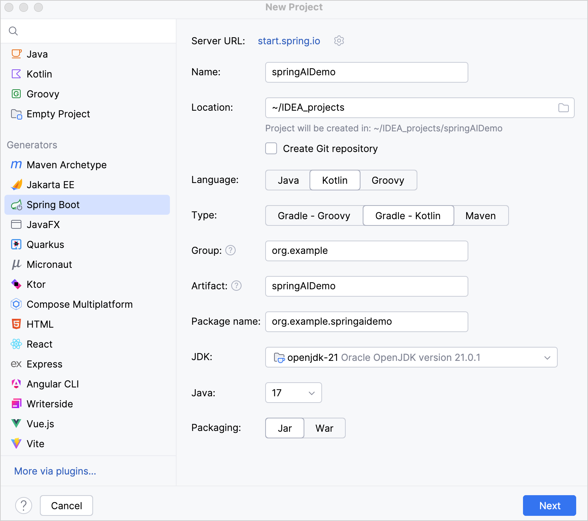
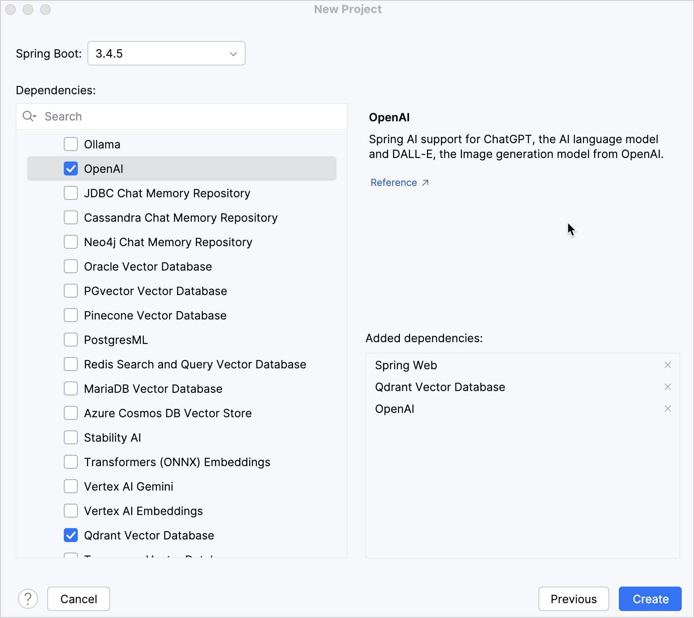
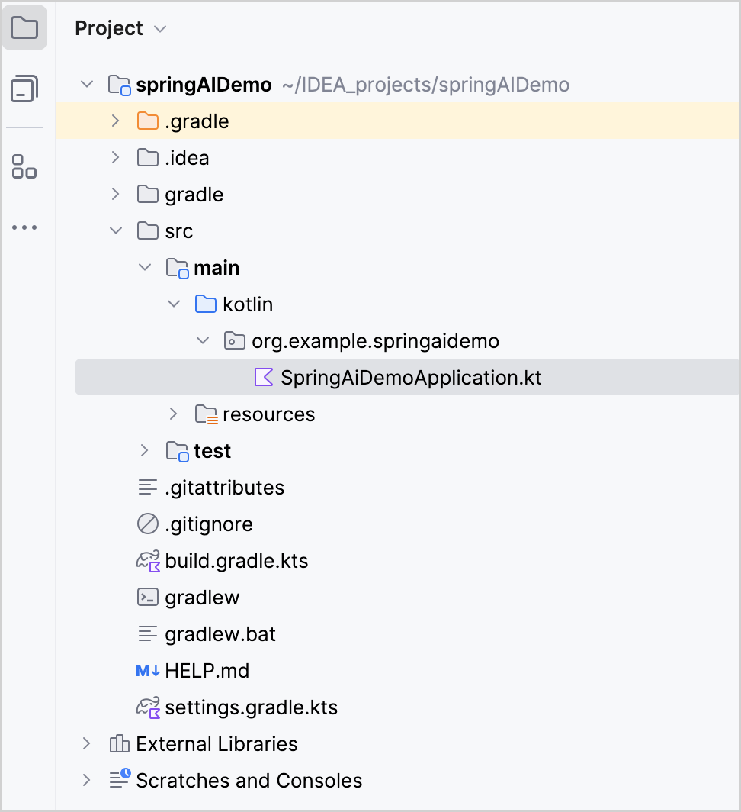
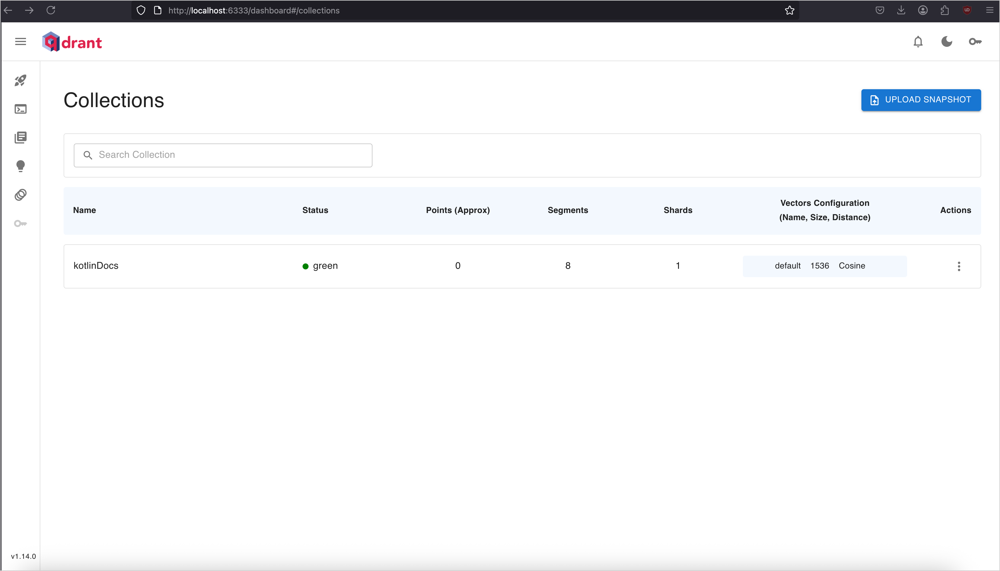
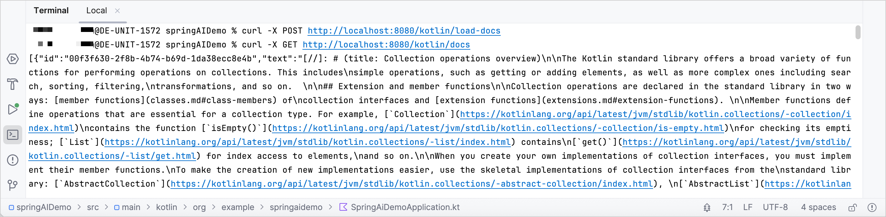
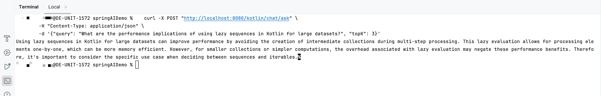

+++
title = "8.1.3 创建一个用 Spring AI 回答问题的 Kotlin 应用 — 教程"
date = 2026-09-13T08:50:47+08:00
weight = 3
type = "docs"
description = ""
isCJKLanguage = true
draft = false
+++


> 原文链接: [https://kotlinlang.org/docs/spring-ai-guide.html](https://kotlinlang.org/docs/spring-ai-guide.html)

# 8.1.3 创建一个用 Spring AI 回答问题的 Kotlin 应用 — 教程

[//]: # (description: 了解如何创建一个用 Spring AI 回答问题的 Kotlin 应用，把文档存入向量数据库，并使用这些文档的上下文来回答问题。)

在本教程中，你将学习如何构建一个 Kotlin 应用：通过 [Spring AI](https://spring.io/projects/spring-ai) 连接 LLM、把文档存入向量数据库，并使用这些文档的上下文来回答问题。

在本教程中，你将使用以下工具：

* [Spring Boot](https://spring.io/projects/spring-boot) 作为配置和运行 Web 应用的基础。
* [Spring AI](https://spring.io/projects/spring-ai) 与 LLM 交互并执行基于上下文的检索。
* [IntelliJ IDEA](https://www.jetbrains.com/idea/) 用于生成项目并实现应用逻辑。
* [Qdrant](https://qdrant.tech/) 作为用于相似度搜索的向量数据库。
* [Docker](https://www.docker.com/) 用于在本地运行 Qdrant。
* [OpenAI](https://platform.openai.com) 作为 LLM 提供方。

## 开始之前 {#before-you-start}

1. 下载并安装最新版本的 [IntelliJ IDEA](https://www.jetbrains.com/idea/download/)，并使用 Ultimate 订阅。

> **提示：** 如果你使用没有 Ultimate 订阅的 IntelliJ IDEA，或使用其他 IDE，可以使用[基于 Web 的项目生成器](https://start.spring.io/#!language=kotlin&type=gradle-project-kotlin)生成 Spring Boot 项目。

2. 在 [OpenAI 平台](https://platform.openai.com/api-keys)上创建 OpenAI API 密钥以访问该 API。
3. 安装 [Docker](https://www.docker.com/) 以在本地运行 Qdrant 向量数据库。
4. 安装 Docker 后，打开终端并运行以下命令来启动容器：

```bash
    docker run -p 6333:6333 -p 6334:6334 qdrant/qdrant
```

## 创建项目 {#create-the-project}

> **注意：** 你也可以使用 [Spring Boot 基于 Web 的项目生成器](https://start.spring.io/)来生成项目。

在带有 Ultimate 订阅的 IntelliJ IDEA 中创建一个新的 Spring Boot 项目：

1. 在 IntelliJ IDEA 中，选择 **File** | **New** | **Project**。
2. 在左侧面板中，选择 **New Project** | **Spring Boot**。
3. 在 **New Project** 窗口中填写以下字段和选项：

* **Name**：springAIDemo
* **Language**：Kotlin
* **Type**：Gradle - Kotlin

> **提示：** 该选项指定构建系统和 DSL。

* **Package name**：org.example.springaidemo
* **JDK**：Java JDK

> **注意：** 本教程使用 **Oracle OpenJDK version 21.0.1**。如果你没有安装 JDK，可以从下拉列表中下载。

* **Java**：17

> **提示：** 如果你没有安装 Java 17，可以从 JDK 下拉列表中下载。



4. 确认已填写所有字段并点击 **Next**。
5. 在 **Spring Boot** 字段中选择最新的稳定 Spring Boot 版本。

6. 选择本教程所需的以下依赖：

* **Web | Spring Web**
* **AI | OpenAI**
* **SQL | Qdrant Vector Database**



7. 点击 **Create** 生成并设置项目。

> **提示：** IDE 会生成并打开一个新项目。下载和导入项目依赖可能需要一些时间。

之后，你可以在 **Project view** 中看到以下结构：



生成的 Gradle 项目对应 Maven 的标准目录布局：

* `main/kotlin` 文件夹下有属于该应用的包和类。
* 应用的入口点是 `SpringAiDemoApplication.kt` 文件的 `main()` 方法。

## 更新项目配置 {#update-the-project-configuration}

1. 用以下内容更新你的 `build.gradle.kts` Gradle 构建文件：

```kotlin
    plugins {
        kotlin("jvm") version "2.4.20"
        kotlin("plugin.spring") version "2.4.20"
        // 其余插件
    }
```

2. 把 `springAiVersion` 设置为 `2.0.0`：

```kotlin
   extra["springAiVersion"] = "2.0.0"
```

3. 点击 **Sync Gradle Changes** 按钮同步 Gradle 文件。
4. 用以下内容更新你的 `src/main/resources/application.properties` 文件：

```text
   # OpenAI
   spring.ai.openai.api-key=YOUR_OPENAI_API_KEY
   spring.ai.openai.chat.model=gpt-4o-mini
   spring.ai.openai.embedding.model=text-embedding-ada-002
   # Qdrant
   spring.ai.vectorstore.qdrant.host=localhost
   spring.ai.vectorstore.qdrant.port=6334
   spring.ai.vectorstore.qdrant.collection-name=kotlinDocs
   spring.ai.vectorstore.qdrant.initialize-schema=true
```

> **注意：** 把你的 OpenAI API 密钥设置到 `spring.ai.openai.api-key` 属性中。

5. 运行 `SpringAiDemoApplication.kt` 文件以启动 Spring Boot 应用。启动后，在浏览器中打开 [Qdrant collections](http://localhost:6333/dashboard#/collections) 页面查看结果：



## 创建一个用于加载和搜索文档的控制器 {#create-a-controller-to-load-and-search-documents}

创建一个 Spring `@RestController` 来搜索文档并把它们存入 Qdrant 集合：

1. 在 `src/main/kotlin/org/example/springaidemo` 目录中，创建一个名为 `KotlinSTDController.kt` 的新文件，并添加以下代码：

```kotlin
    package org.example.springaidemo

    // 导入所需的 Spring 类和工具类
    import org.slf4j.LoggerFactory
    import org.springframework.ai.document.Document
    import org.springframework.ai.vectorstore.SearchRequest
    import org.springframework.ai.vectorstore.VectorStore
    import org.springframework.web.bind.annotation.GetMapping
    import org.springframework.web.bind.annotation.PostMapping
    import org.springframework.web.bind.annotation.RequestMapping
    import org.springframework.web.bind.annotation.RequestParam
    import org.springframework.web.bind.annotation.RestController
    import org.springframework.web.client.RestTemplate
    import kotlin.uuid.ExperimentalUuidApi
    import kotlin.uuid.Uuid

    @RestController
    @RequestMapping("/kotlin")
    class KotlinSTDController(
        private val restTemplate: RestTemplate,
        private val vectorStore: VectorStore,
    ) {
        private val logger = LoggerFactory.getLogger(this::class.java)

        @OptIn(ExperimentalUuidApi::class)
        @PostMapping("/load-docs")
        fun load() {
            // 从 Kotlin 文档加载一组文档
            val kotlinStdTopics = listOf(
                "collections-overview", "constructing-collections", "iterators", "ranges", "sequences",
                "collection-operations", "collection-transformations", "collection-filtering", "collection-plus-minus",
                "collection-grouping", "collection-parts", "collection-elements", "collection-ordering",
                "collection-aggregate", "collection-write", "list-operations", "set-operations",
                "map-operations", "read-standard-input", "opt-in-requirements", "scope-functions", "time-measurement",
            )
            // 文档的基础 URL
            val url = "https://raw.githubusercontent.com/JetBrains/kotlin-web-site/refs/heads/master/docs/topics/"
            // 从 URL 获取每个文档并把它加入向量存储
            kotlinStdTopics.forEach { topic ->
                val data = restTemplate.getForObject("$url$topic.md", String::class.java)
                data?.let { it ->
                    val doc = Document.builder()
                        // 用随机 UUID 构建文档
                        .id(Uuid.random().toString())
                        .text(it)
                        .metadata("topic", topic)
                        .build()
                    vectorStore.add(listOf(doc))
                    logger.info("Document $topic loaded.")
                } ?: logger.warn("Failed to load document for topic: $topic")
            }
        }

        @GetMapping("docs")
        fun query(
            @RequestParam query: String = "operations, filtering, and transformations",
            @RequestParam topK: Int = 2
        ): List<Document>? {
            val searchRequest = SearchRequest.builder()
                .query(query)
                .topK(topK)
                .build()
            val results = vectorStore.similaritySearch(searchRequest)
            logger.info("Found ${results?.size ?: 0} documents for query: '$query'")
            return results
        }
    }
```

2. 更新 `SpringAiDemoApplication.kt` 文件，声明一个 `RestTemplate` bean：

```kotlin
   package org.example.springaidemo

   import org.springframework.boot.autoconfigure.SpringBootApplication
   import org.springframework.boot.runApplication
   import org.springframework.context.annotation.Bean
   import org.springframework.web.client.RestTemplate

   @SpringBootApplication
   class SpringAiDemoApplication {
       @Bean
       fun restTemplate(): RestTemplate = RestTemplate()
   }

   fun main(args: Array<String>) {
       runApplication<SpringAiDemoApplication>(*args)
   }
```

3. 运行该应用。
4. 在终端中，向 `/kotlin/load-docs` 端点发送 POST 请求以加载文档：

```bash
   curl -X POST http://localhost:8080/kotlin/load-docs
```

5. 文档加载完成后，你可以用 GET 请求搜索它们：

```Bash
   curl -X GET http://localhost:8080/kotlin/docs
```



> **提示：** 你也可以在 [Qdrant collections](http://localhost:6333/dashboard#/collections) 页面上查看结果。

## 实现 AI 聊天端点 {#implement-an-ai-chat-endpoint}

文档加载完成后，最后一步是添加一个端点，通过 Spring AI 的检索增强生成（RAG）支持，使用 Qdrant 中的文档来回答问题：

1. 打开 `KotlinSTDController.kt` 文件，并导入以下类：

```kotlin
   import org.springframework.ai.chat.client.ChatClient
   import org.springframework.ai.chat.client.advisor.SimpleLoggerAdvisor
   import org.springframework.ai.chat.client.advisor.vectorstore.QuestionAnswerAdvisor
   import org.springframework.ai.chat.prompt.Prompt
   import org.springframework.ai.chat.prompt.PromptTemplate
   import org.springframework.web.bind.annotation.RequestBody
```

2. 定义一个 `ChatRequest` data 类：

```kotlin
   // 表示聊天查询的请求负载
   data class ChatRequest(val query: String, val topK: Int = 3)
```

3. 把 `ChatClient.Builder` 添加到控制器构造器参数中：

```kotlin
   class KotlinSTDController(
       // 提供用于创建 ChatClient 的构建器
       private val chatClientBuilder: ChatClient.Builder,

       private val restTemplate: RestTemplate,
       private val vectorStore: VectorStore,
   )
```

4. 在控制器类内部创建一个 `ChatClient` 实例：

```kotlin
   // 用简单的日志 advisor 构建聊天客户端
   private val chatClient = chatClientBuilder.defaultAdvisors(SimpleLoggerAdvisor()).build()
```

5. 在 `KotlinSTDController.kt` 文件末尾添加一个新的 `chatAsk()` 端点，逻辑如下：

```kotlin
   @PostMapping("/chat/ask")
   fun chatAsk(@RequestBody request: ChatRequest): String? {
       // 定义带占位符的提示模板
       val promptTemplate = PromptTemplate(
           """
           {query}.
           Please provide a concise answer based on the "Kotlin standard library" documentation.
       """.trimIndent()
       )

       // 通过把占位符替换为实际值创建提示
       val prompt: Prompt =
           promptTemplate.create(mapOf("query" to request.query))

       // 配置检索 advisor，用相关文档增强查询
       val retrievalAdvisor = QuestionAnswerAdvisor.builder(vectorStore)
           .searchRequest(
               SearchRequest.builder()
                   .similarityThreshold(0.7)
                   .topK(request.topK)
                   .build()
           )
           .promptTemplate(promptTemplate)
           .build()

       // 把提示连同检索 advisor 发送给 LLM 并取回生成的内容
       val response = chatClient.prompt(prompt)
           .advisors(retrievalAdvisor)
           .call()
           .content()
       logger.info("Chat response generated for query: '${request.query}'")
       return response
   }
```

6. 运行该应用。
7. 在终端中向新端点发送 POST 请求以查看结果：

```bash
   curl -X POST "http://localhost:8080/kotlin/chat/ask" \
        -H "Content-Type: application/json" \
        -d '{"query": "What are the performance implications of using lazy sequences in Kotlin for large datasets?", "topK": 3}'
```



恭喜！你现在有了一个连接 OpenAI 的 Kotlin 应用，它使用从 Qdrant 中存储的文档检索到的上下文来回答问题。试着尝试不同的查询或导入其他文档，探索更多可能性。

你可以在 [Spring AI 演示 GitHub 仓库](https://github.com/Kotlin/Kotlin-AI-Examples/tree/master/projects/spring-ai/springAI-demo)中查看完成后的项目。

## 接下来做什么 {#what-s-next}

* 在 [Kotlin AI 示例](https://github.com/Kotlin/Kotlin-AI-Examples/tree/master)中探索其他 Spring AI 示例
* [使用 Spring Boot 和 Claude 创建任务管理器应用](../../../development/6.1-Backenddevelopment/6.1.8-SpringBootClaude/)
