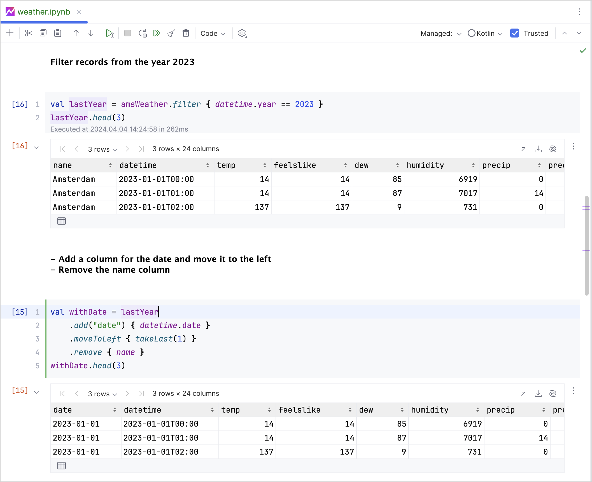
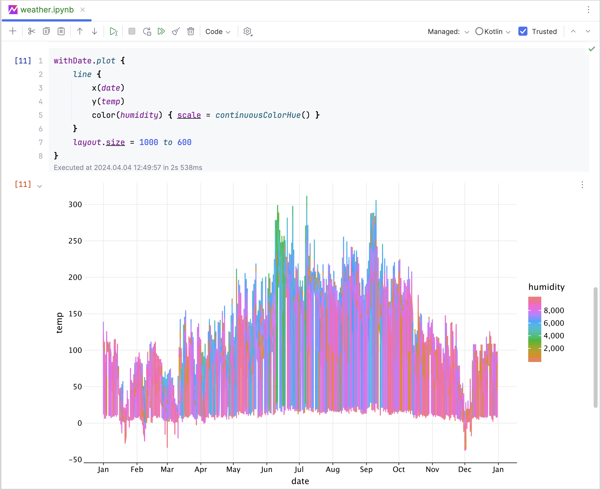

+++
title = "8.2.1 用于数据分析的 Kotlin"
date = 2026-09-13T08:50:47+08:00
weight = 1
type = "docs"
description = ""
isCJKLanguage = true
draft = false
+++

> 原文链接: [https://kotlinlang.org/docs/data-analysis-overview.html](https://kotlinlang.org/docs/data-analysis-overview.html)

# 8.2.1 用于数据分析的 Kotlin

[//]: # (description: 了解如何使用 Kotlin DataFrame 和 Kandy 进行数据分析，以获取、转换、分析和可视化数据。)

探索和分析数据也许不是你每天都会做的事情，但它是你作为软件开发者必须具备的关键技能。

让我们想想哪些软件开发工作离不开数据分析：调试时分析集合里实际存放的内容、深入研究内存转储或数据库，或者在使用 REST API 时接收包含大量数据的 JSON 文件，如此等等。

借助 Kotlin 的探索性数据分析（EDA）工具，例如 [Kotlin DataFrame](#kotlin-dataframe) 和 [Kandy](#kandy)，你拥有一整套丰富的能力来提升分析技能，并在各种场景中为你提供支持：

* **加载、转换并可视化各种格式的数据：** 使用我们的 Kotlin EDA 工具，你可以执行过滤、排序和聚合等任务。我们的工具可以在 IDE 中直接从 CSV、JSON、SQL 数据库或 Parquet 文件等不同数据源读取数据。所有支持的格式见 [DataFrame 文档](https://kotlin.github.io/dataframe/data-sources.html)。

我们的绘图工具 Kandy 让你可以创建各种图表，以便对数据集进行可视化并获得洞见。

* **高效分析存储在关系型数据库中的数据：** Kotlin DataFrame 可以与数据库无缝集成，并提供类似 SQL 查询的能力。你可以直接从各种数据库中获取、操作和可视化数据。

* **从 Web API 获取并分析实时和动态数据集：** EDA 工具的灵活性使其可以通过 OpenAPI 等协议与外部 API 集成。这一特性帮助你把数据从 Web API 中取出，然后按需清洗和转换。

## Kotlin DataFrame {#kotlin-dataframe}

[Kotlin DataFrame](https://kotlin.github.io/dataframe/overview.html) 库让你在 Kotlin 项目中操作结构化数据。从数据创建和清洗到深入分析和特征工程，这个库都能满足你的需求。

使用 Kotlin DataFrame 库，你可以处理多种文件格式，包括 CSV、JSON、XLS 和 XLSX。这个库还能连接 SQL 数据库或 API，从而简化数据获取过程。所有支持的格式见 [DataFrame 文档](https://kotlin.github.io/dataframe/data-sources.html)。

## Kandy {#kandy}

[Kandy](https://kotlin.github.io/kandy/welcome.html) 是一个开源 Kotlin 库，提供强大而灵活的 DSL，用于绘制各种类型的图表。这个库是一个简单、符合习惯、易读且类型安全的可视化数据工具。你也可以轻松把 Kandy 与 Kotlin DataFrame 结合使用，以完成各种与数据相关的任务。

## 接下来学什么 {#what-s-next}

* [使用 Kotlin DataFrame 库获取和转换数据](../8.2.2-Workingwithdatasources/8.2.2.1-DataAnalysisWorkWithDataSources/)
* [使用 Kandy 库可视化数据](../8.2.3-Visualizingdata/8.2.3.1-DataAnalysisVisualization/)
* [进一步了解用于数据分析的 Kotlin 和 Java 库](../8.2.4-DataAnalysisLibraries/)
