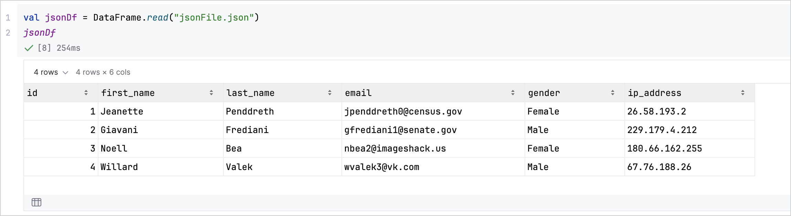
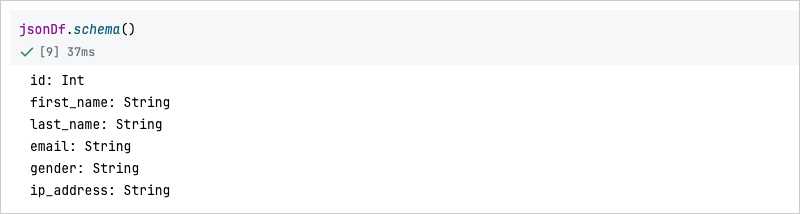
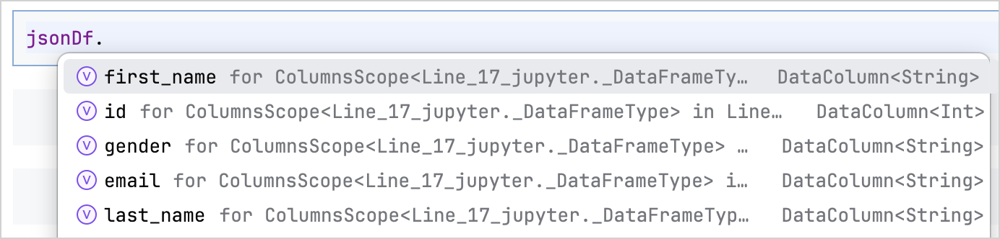
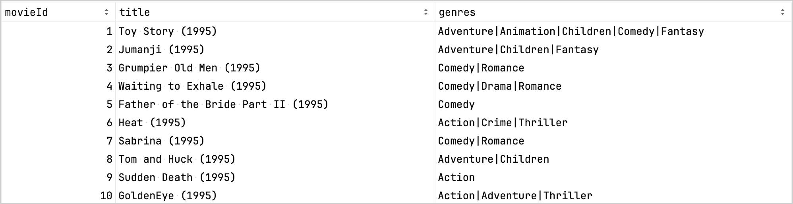
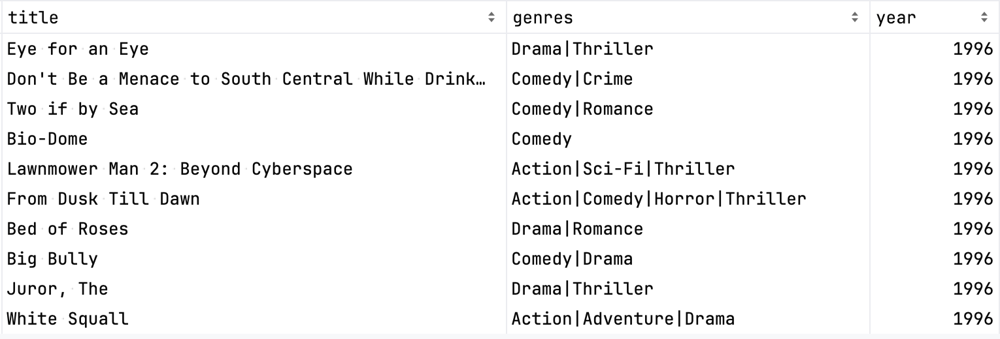

+++
title = "8.2.2.1 从文件获取数据"
date = 2026-09-13T08:50:47+08:00
weight = 1
type = "docs"
description = ""
isCJKLanguage = true
draft = false
+++


> 原文链接: [https://kotlinlang.org/docs/data-analysis-work-with-data-sources.html](https://kotlinlang.org/docs/data-analysis-work-with-data-sources.html)

# 8.2.2.1 从文件获取数据

[//]: # (description: 了解如何使用 Kotlin DataFrame 从文件加载数据，包括 CSV、JSON、SQL、Excel 和 Apache Arrow 文件。)

[Kotlin DataFrame 库](https://kotlin.github.io/dataframe/home.html)让你可以同时处理非结构化和结构化数据。对于数据转换，你可以使用 [`.add()`](https://kotlin.github.io/dataframe/adddf.html)、[`.split()`](https://kotlin.github.io/dataframe/split.html)、[`.convert()`](https://kotlin.github.io/dataframe/convert.html) 和 [`.parse()`](https://kotlin.github.io/dataframe/parse.html) 等方法。此外，这套工具还能从各种结构化文件格式中获取和操作数据，包括 CSV、JSON、XLS、Parquet 和 Apache Arrow。所有受支持的格式请参阅 [DataFrame 文档](https://kotlin.github.io/dataframe/data-sources.html)。

在本指南中，你将通过多个示例学习如何获取、精炼和处理数据。

## 开始之前 {#before-you-start}

> **注意：** 从 IntelliJ IDEA 2026.2 开始，Kotlin Notebook 将不再随 IDE 一起提供，也不再由 JetBrains 官方支持。源代码仍可在 [GitHub](https://github.com/Kotlin/kotlin-notebook) 上获取。更多信息请参阅[博客文章](https://blog.jetbrains.com/idea/2026/06/kotlin-notebook-sunset/)。

要学习本教程：

1. 选择 **File** | **New** | **Kotlin Notebook**。
2. 导入 Kotlin DataFrame：

```kotlin
   %use dataframe
```

请在任何其他代码单元之前先运行包含 `%use dataframe` 这一行的代码单元，以确保 DataFrame 库及其 API 在笔记本中可用。

要学习本教程，你也可以把 DataFrame 用作 [Gradle](https://kotlin.github.io/dataframe/setupgradle.html) 或 [Maven](https://kotlin.github.io/dataframe/setupmaven.html) 依赖。

## 获取数据 {#retrieve-data}

要从文件中获取数据，请使用 `DataFrame.read()` 函数：

```kotlin
val movies = DataFrame.read("movies.csv")
```

`DataFrame.read()` 函数会根据文件扩展名和内容检测输入格式。

你还可以传入额外参数来控制 DataFrame 库读取输入数据的方式。例如，以下代码为 CSV 文件指定了自定义分隔符（`;`）：

```kotlin
val movies = DataFrame.read("movies.csv", delimiter = ';')
```

> **提示：** 关于其他文件格式和各种读取函数的全面概述，请参阅 [Kotlin DataFrame 库文档](https://kotlin.github.io/dataframe/read.html)。

## 显示数据 {#display-data}

拿到数据之后，你就可以显示它。最简单的方式是把数据存入变量然后返回它：

```kotlin
val jsonDf = DataFrame.read("jsonFile.json")
jsonDf
```

这段代码会把文件中的数据显示为可交互的表格：



你可以借助这个视图检查取值、查看列名，并轻松了解数据集的状态。

## 检查数据结构 {#inspect-data-structure}

要深入了解数据的结构或模式，请在你的 DataFrame 变量上使用 [`.schema()`](https://kotlin.github.io/dataframe/schema.html) 函数。

例如，运行 `jsonDf.schema()` 可以列出 JSON 数据集中每一列的类型：



你也可以使用自动补全功能。它让你可以快速访问和操作 DataFrame 的属性。加载数据后，只需输入 DataFrame 变量后跟一个点号（`.`），就能看到可用列及其类型的列表。



## 精炼数据 {#refine-data}

Kotlin DataFrame 提供了各种操作来精炼数据集。例如[分组](https://kotlin.github.io/dataframe/group.html)、[过滤](https://kotlin.github.io/dataframe/filter.html)、[更新](https://kotlin.github.io/dataframe/update.html)或[添加新列](https://kotlin.github.io/dataframe/add.html)。这些函数对数据分析至关重要，让你能够有效地组织、清理和转换数据。

例如，我们来看 `movies.csv` 数据集。它把电影标题和上映年份存储在同一个单元格中。目标是精炼这个数据集，以便更容易分析：

1. **加载数据**

使用 `.read()` 函数把文件加载到 `DataFrame` 中：

```kotlin
   val movies = DataFrame.read("movies.csv")
```

2. **添加一列**

要从 `title` 列中提取上映年份，请添加一个新的 `year` 列：

```kotlin
   val moviesWithYear = movies
       .add("year") {
           "\\d{4}".toRegex()
               .findAll(title)
               .lastOrNull()
               ?.value
               ?.toInt()
               ?: -1
       }

   moviesWithYear
```

3. **更新值**

要从电影标题中移除上映年份，请更新 `title` 列：

```kotlin
   val moviesTitle = moviesWithYear
       .update("title") {
           "\\s*\\(\\d{4}\\)\\s*$".toRegex().replace(title, "")
   }

   moviesTitle
```

这段代码把电影标题保留在一列中，并把上映年份移到另一列中。

4. **过滤行**

要只关注特定数据，请使用 `.filter()` 函数。例如，只保留 1986 年之后上映的电影，请运行：

```kotlin
   val newMovies = moviesTitle.filter {
       year >= 1996
   }

   newMovies
```

5. **移除列**

要移除不需要的列，请使用 `.remove()` 函数：

```kotlin
   val refinedMovies = newMovies.remove {
       movieID
   }

   refinedMovies
```

作为对比，下面是精炼之前的数据集：



下面是精炼之后的数据集：



> **提示：** 关于更多使用场景和详细示例，请参阅 [Kotlin Dataframe 示例](https://github.com/Kotlin/dataframe/tree/master/examples)。

## 导出数据 {#export-data}

精炼数据之后，你可以轻松地导出它。

你可以为此使用各种 [`.write()`](https://kotlin.github.io/dataframe/write.html) 函数。它支持保存为多种格式，包括 CSV、JSON、XLS、XLSX、Apache Arrow，甚至 HTML 表格。所有受支持的格式请参阅 [DataFrame 文档](https://kotlin.github.io/dataframe/data-sources.html)。这对于分享你的发现、创建报告，或让数据可供进一步分析特别有用。

例如，我们把结果保存为：

* 使用 [`.writeJson()`](https://kotlin.github.io/dataframe/write.html#writing-to-json) 函数保存为 JSON 文件：

```kotlin
  refinedMovies.writeJson("movies.json")
```
* 使用 [`.writeCsv()`](https://kotlin.github.io/dataframe/write.html#writing-to-csv) 函数保存为 CSV 文件：

```kotlin
  refinedMovies.writeCsv("movies.csv")
```

* 使用 `.writeArrorIPC()` 和 `.writeArrorFeather()` 函数保存为 [Apache Arrow 文件](https://kotlin.github.io/dataframe/write.html#writing-to-apache-arrow-formats)：

```kotlin
  refinedMovies.writeArrowIPC("movies.arrow")
  refinedMovies.writeArrowFeather("movies.feather")
```

你也可以使用 [`.toStandaloneHTML()`](https://kotlin.github.io/dataframe/tohtml.html) 函数在浏览器中打开独立的 HTML 表格：

```kotlin
refinedMoviesDf
    .toStandaloneHTML(DisplayConfiguration(rowsLimit = null))
    .openInBrowser()
```

## 接下来做什么 {#what-s-next}

* 使用 [Kandy 库](https://kotlin.github.io/kandy/examples.html)探索数据可视化
* 在[使用 Kandy 进行数据可视化](../../8.2.3-Visualizingdata/8.2.3.1-DataAnalysisVisualization/)中查找有关数据可视化的更多信息
* 关于 Kotlin 中可用于数据科学和分析的工具与资源的广泛概述，请参阅[用于数据分析的 Kotlin 和 Java 库](../../8.2.4-DataAnalysisLibraries/)
