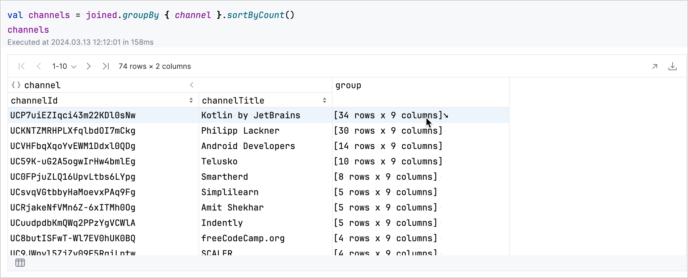
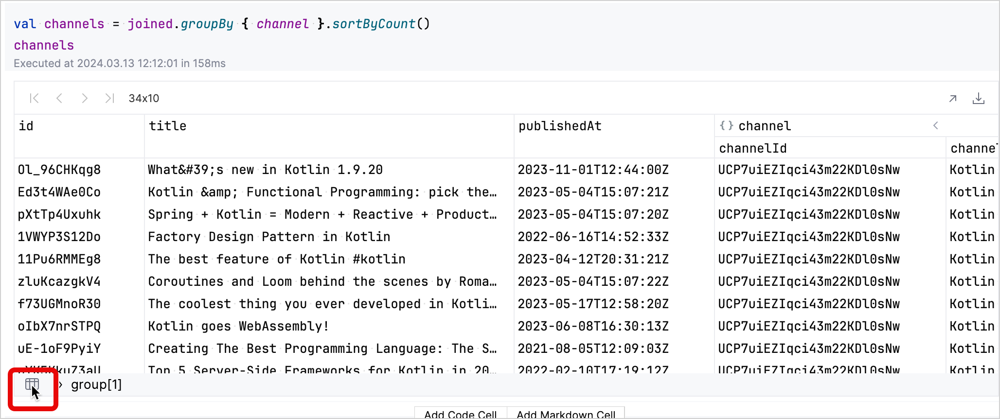
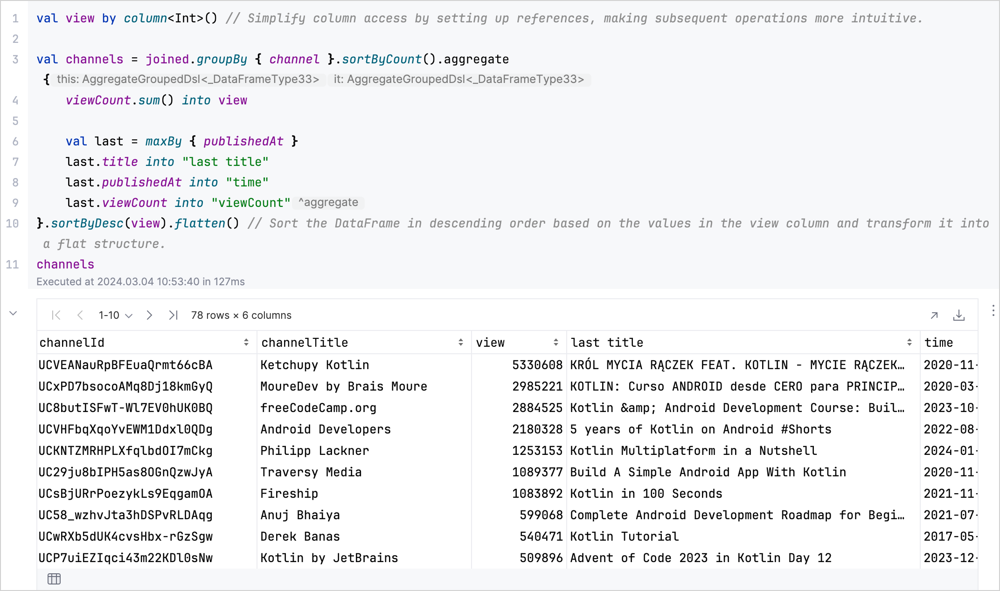

+++
title = "8.2.2.2 从 Web 来源和 API 获取数据"
date = 2026-09-13T08:50:47+08:00
weight = 2
type = "docs"
description = ""
isCJKLanguage = true
draft = false
+++


> 原文链接: [https://kotlinlang.org/docs/data-analysis-work-with-api.html](https://kotlinlang.org/docs/data-analysis-work-with-api.html)

# 8.2.2.2 从 Web 来源和 API 获取数据

借助 [Kotlin DataFrame 库](https://kotlin.github.io/dataframe/home.html)，你可以访问和操作来自各种 Web 来源和 API 的数据。它还能帮助你重塑这些数据，以便进行全面分析和可视化。

探索 [GitHub 上的 DataFrame 示例](https://github.com/Kotlin/dataframe/tree/master/examples/projects)。

## 开始之前 {#before-you-start}

> **注意：** 从 IntelliJ IDEA 2026.2 开始，Kotlin Notebook 将不再随 IDE 一起提供，也不再由 JetBrains 官方支持。源代码仍可在 [GitHub](https://github.com/Kotlin/kotlin-notebook) 上获取。更多信息请参阅[博客文章](https://blog.jetbrains.com/idea/2026/06/kotlin-notebook-sunset/)。

创建一个新的 Kotlin Notebook：

1. 选择 **File** | **New** | **Kotlin Notebook**。

2. 运行以下命令导入 Kotlin DataFrame 库：

```kotlin
   %use dataframe
```
要学习本教程，你也可以把 DataFrame 用作 [Gradle](https://kotlin.github.io/dataframe/setupgradle.html) 或 [Maven](https://kotlin.github.io/dataframe/setupmaven.html) 依赖。

## 从 API 获取数据 {#fetch-data-from-an-api}

使用 Kotlin DataFrame 库从 API 获取数据是通过 [`.read()`](https://kotlin.github.io/dataframe/read.html) 函数完成的，这与[从文件获取数据](../8.2.2.1-DataAnalysisWorkWithDataSources/#retrieve-data)（例如 CSV 或 JSON）类似。不过，在处理基于 Web 的来源时，你可能需要额外的格式化，才能把原始的 API 数据转换为结构化格式。

我们来看一个从 [YouTube Data API](https://console.cloud.google.com/apis/library/youtube.googleapis.com) 获取数据的示例：

1. 在新的代码单元中安全地添加你的 API 密钥，这是向 YouTube Data API 发送请求进行身份验证所必需的。你可以在[凭据选项卡](https://console.cloud.google.com/apis/credentials)中获取 API 密钥：

```kotlin
   val apiKey = "YOUR-API_KEY"
```

2. 创建一个加载函数，它接收一个字符串形式的路径，并使用 DataFrame 的 `.read()` 函数从 YouTube Data API 获取数据：

```kotlin
   fun load(path: String): AnyRow = DataRow.read("https://www.googleapis.com/youtube/v3/$path&key=$apiKey")
```

3. 把获取到的数据整理为行，并通过 `nextPageToken` 处理 YouTube API 的分页。这样就能确保你跨多个页面收集数据：

```kotlin
   fun load(path: String, maxPages: Int): AnyFrame {
       // 初始化一个可变列表，用于存储数据行。
       val rows = mutableListOf<AnyRow>()

       // 设置数据加载的初始页面路径。
       var pagePath = path
       do {
           // 从当前页面路径加载数据。
           val row = load(pagePath)
           // 把加载到的数据作为一行添加到列表中。
           rows.add(row)

           // 获取下一页的令牌（如果存在）。
           val next = row.getValueOrNull<String>("nextPageToken")
           // 更新下一次迭代的页面路径，包含新的令牌。
           pagePath = path + "&pageToken=" + next

           // 持续加载页面，直到没有下一页。
       } while (next != null && rows.size < maxPages)

       // 拼接所有已加载的行并作为 DataFrame 返回。
       return rows.concat()
   }
```

4. 在新的代码单元中使用前面定义的 `load()` 函数获取数据并创建 DataFrame。这个示例获取与 Kotlin 相关的数据（在这里即视频），每页最多 50 条结果，最多 5 页。结果存储在 `df` 变量中：

```kotlin
   val df = load("search?q=kotlin&maxResults=50&part=snippet", 5)
   df
```

5. 最后，从 DataFrame 中提取并拼接条目：

```kotlin
   val items = df.items.concat()
   items
```

## 清理和精炼数据 {#clean-and-refine-data}

清理和精炼数据是为分析准备数据集的关键步骤。[Kotlin DataFrame 库](https://kotlin.github.io/dataframe/home.html)为这些任务提供了强大的功能。[`move`](https://kotlin.github.io/dataframe/move.html)、[`concat`](https://kotlin.github.io/dataframe/concatdf.html)、[`select`](https://kotlin.github.io/dataframe/select.html)、[`parse`](https://kotlin.github.io/dataframe/parse.html) 和 [`join`](https://kotlin.github.io/dataframe/join.html) 等方法在组织和转换数据时非常有用。

我们来看一个示例，其中的数据已经[通过 YouTube 的数据 API 获取](#fetch-data-from-an-api)。目标是清理并重构数据集，为深入分析做好准备：

1. 你可以先重新组织和清理数据。这包括把某些列移到新表头下，并为了清晰而移除不必要的列：

```kotlin
   val videos = items.dropNulls { id.videoId }
       .select { id.videoId named "id" and snippet }
       .distinct()
   videos
```

2. 把清理后的数据中的 ID 分块，并加载相应的视频统计信息。这包括把数据拆分成更小的批次并获取更多细节：

```kotlin
   val statPages = clean.id.chunked(50).map {
       val ids = it.joinToString("%2C")
       load("videos?part=statistics&id=$ids")
   }
   statPages
```

3. 拼接获取到的统计数据并选择相关列：

```kotlin
   val stats = statPages.items.concat().select { id and statistics.all() }.parse()
   stats
```

4. 把已有的清理后数据与新获取的统计数据连接起来。这会把两组数据合并为一个完整的 DataFrame：

```kotlin
   val joined = clean.join(stats)
   joined
```

这个示例演示了如何使用 Kotlin DataFrame 的各种函数来清理、重组和增强数据集。每一步都旨在精炼数据，使其更适合深入分析。

## 在 Kotlin Notebook 中分析数据 {#analyze-data-in-kotlin-notebook}

在你使用 [Kotlin DataFrame 库](https://kotlin.github.io/dataframe/home.html)的函数成功[获取数据](#fetch-data-from-an-api)并[清理和精炼数据](#clean-and-refine-data)之后，下一步就是分析这个准备好的数据集，以提取有意义的洞察。

用于对数据分类的 [`groupBy`](https://kotlin.github.io/dataframe/groupby.html)、用于[汇总统计](https://kotlin.github.io/dataframe/summarystatistics.html)的 [`sum`](https://kotlin.github.io/dataframe/sum.html) 和 [`maxBy`](https://kotlin.github.io/dataframe/maxby.html)，以及用于数据排序的 [`sortBy`](https://kotlin.github.io/dataframe/sortby.html) 等方法特别有用。这些工具让你可以高效地执行复杂的数据分析任务。

我们来看一个示例，使用 `groupBy` 按频道对视频分类，用 `sum` 计算每个类别的总观看次数，用 `maxBy` 找出每组中最新或观看次数最多的视频：

1. 通过建立引用来简化对特定列的访问：

```kotlin
   val view by column<Int>()
```

2. 使用 `groupBy` 方法按 `channel` 列对数据分组并排序。

```kotlin
   val channels = joined.groupBy { channel }.sortByCount()
```

在生成的表格中，你可以交互式地探索数据。点击某个频道对应行的 `group` 字段，会展开该行，显示该频道视频的更多细节。



你可以点击左下角的表格图标返回到分组数据集。



3. 使用 `aggregate`、`sum`、`maxBy` 和 `flatten` 创建一个 DataFrame，汇总每个频道的总观看次数及其最新或观看次数最多的视频的详情：

```kotlin
   val aggregated = channels.aggregate {
       viewCount.sum() into view

       val last = maxBy { publishedAt }
       last.title into "last title"
       last.publishedAt into "time"
       last.viewCount into "viewCount"
       // 按观看次数降序对 DataFrame 排序，并将其转换为扁平结构。
   }.sortByDesc(view).flatten()
   aggregated
```

分析结果如下：



关于更多高级技巧，请参阅 [Kotlin DataFrame 文档](https://kotlin.github.io/dataframe/home.html)。

## 接下来做什么 {#what-s-next}

* 使用 [Kandy 库](https://kotlin.github.io/kandy/examples.html)探索数据可视化
* 在[使用 Kandy 进行数据可视化](../../8.2.3-Visualizingdata/8.2.3.1-DataAnalysisVisualization/)中查找有关数据可视化的更多信息
* 关于 Kotlin 中可用于数据科学和分析的工具与资源的广泛概述，请参阅[用于数据分析的 Kotlin 和 Java 库](../../8.2.4-DataAnalysisLibraries/)
