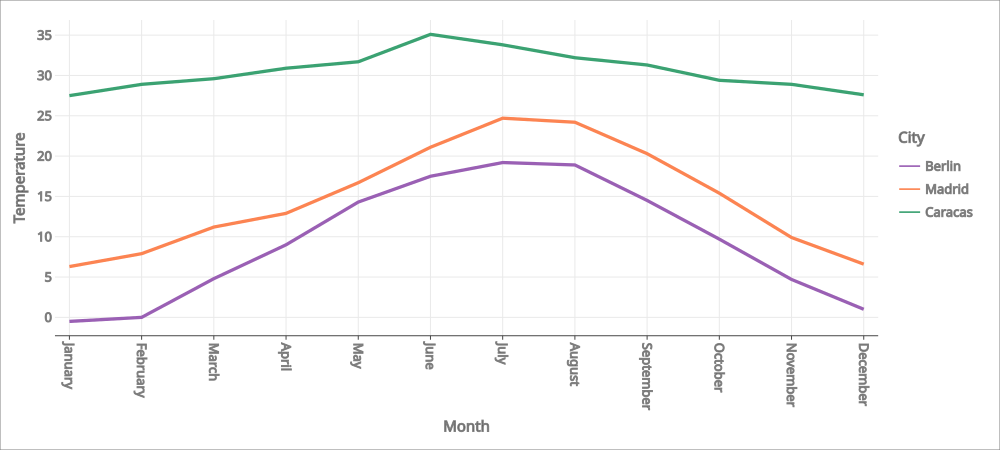
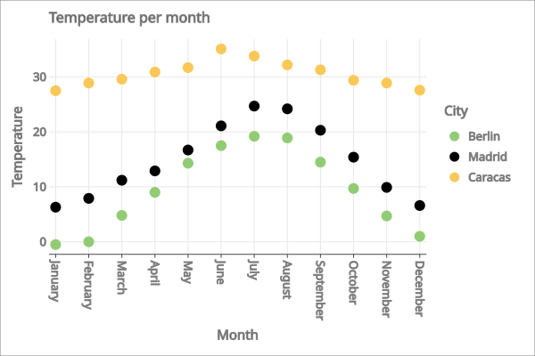
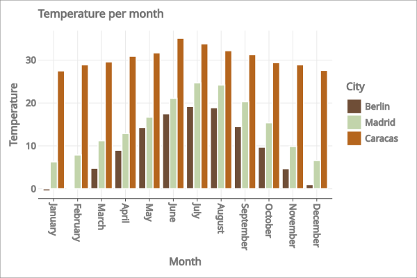

+++
title = "8.2.3.1 使用 Kandy 进行数据可视化"
date = 2026-09-13T08:50:47+08:00
weight = 1
type = "docs"
description = ""
isCJKLanguage = true
draft = false
+++


> 原文链接: [https://kotlinlang.org/docs/data-analysis-visualization.html](https://kotlinlang.org/docs/data-analysis-visualization.html)

# 8.2.3.1 使用 Kandy 进行数据可视化

[//]: # (description: 了解如何使用 Kandy 和 Kotlin DataFrame 通过创建折线图、散点图和柱状图来可视化数据。)

Kotlin 提供了一站式的强大且灵活的数据可视化解决方案，让你在深入复杂模型之前能够以直观的方式呈现和探索数据。

本教程演示如何在 IntelliJ IDEA 中使用 [Kandy](https://kotlin.github.io/kandy/welcome.html) 和 [Kotlin DataFrame](https://kotlin.github.io/dataframe/home.html) 库创建不同类型的图表。

## 开始之前 {#before-you-start}

> **注意：** 从 IntelliJ IDEA 2026.2 开始，Kotlin Notebook 将不再随 IDE 一起提供，也不再由 JetBrains 官方支持。源代码仍可在 [GitHub](https://github.com/Kotlin/kotlin-notebook) 上获取。更多信息请参阅[博客文章](https://blog.jetbrains.com/idea/2026/06/kotlin-notebook-sunset/)。

要学习本教程：

1. 选择 **File** | **New** | **Kotlin Notebook**。
2. 在你的笔记本中导入 [Kandy](https://kotlin.github.io/kandy/welcome.html) 和 [Kotlin DataFrame](https://kotlin.github.io/dataframe/home.html)：

```kotlin
   %use kandy
   %use dataframe
```

请在任何其他代码单元之前先运行包含 `%use dataframe` 这一行的代码单元，以确保 DataFrame 库及其 API 在笔记本中可用。

要学习本教程，你也可以把 DataFrame 用作 [Gradle](https://kotlin.github.io/dataframe/setupgradle.html) 或 [Maven](https://kotlin.github.io/dataframe/setupmaven.html) 依赖。

## 创建 DataFrame {#create-a-dataframe}

首先，我们创建一个包含待可视化数据的 DataFrame。这个 DataFrame 存储了柏林、马德里和加拉加斯的模拟月平均气温：

```kotlin
// months 变量存储一个包含一年 12 个月份的列表
val months = listOf(
    "January", "February",
    "March", "April", "May",
    "June", "July", "August",
    "September", "October", "November",
    "December"
)
// tempBerlin、tempMadrid 和 tempCaracas 变量分别存储一个列表
// 其中包含每个月份的气温值
val tempBerlin =
    listOf(-0.5, 0.0, 4.8, 9.0, 14.3, 17.5, 19.2, 18.9, 14.5, 9.7, 4.7, 1.0)
val tempMadrid =
    listOf(6.3, 7.9, 11.2, 12.9, 16.7, 21.1, 24.7, 24.2, 20.3, 15.4, 9.9, 6.6)
val tempCaracas =
    listOf(27.5, 28.9, 29.6, 30.9, 31.7, 35.1, 33.8, 32.2, 31.3, 29.4, 28.9, 27.6)
```

现在让我们创建一个新变量（`df`），并使用 [`dataFrameOf()`](https://kotlin.github.io/dataframe/createdataframe.html#dataframeof) 函数生成一个包含三列（Month、Temperature 和 City）的 DataFrame：

```kotlin
val df = dataFrameOf(
    "Month" to months + months + months,
    "Temperature" to tempBerlin + tempMadrid + tempCaracas,
    "City" to List(12) { "Berlin" } + List(12) { "Madrid" } + List(12) { "Caracas" }
)
```
要预览数据，请使用 [`.head()`](https://kotlin.github.io/dataframe/head.html) 函数：

```kotlin
df.head(4) // 返回前四行
```

在我们的数据集中，前四行存储的是柏林 1 月到 4 月的气温：


> **提示：** 访问列记录有多种方式，在把 Kandy 与 Kotlin DataFrame 库一起使用时，它们有助于提高类型安全性。更多信息请参阅[访问 API](https://kotlin.github.io/dataframe/apilevels.html)。

## 创建折线图 {#create-a-line-chart}

我们使用上一节的 `df` DataFrame 创建折线图：

1. 调用 Kandy 库中的 `.plot()` 函数。
2. 应用 `line()` 图层。
3. 把 `Month` 和 `Temperature` 列相应映射到 `X` 轴和 `Y` 轴。
4. （可选）自定义颜色和尺寸。

```kotlin
df.plot {
   line {
      x(Month)
      y(Temperature)

      color(City) {
         scale = categorical(
            "Berlin" to Color.hex("#6F4E37"),
            "Madrid" to Color.hex("#C2D4AB"),
            "Caracas" to Color.hex("#B5651D")
         )
      }
      width = 1.5
   }
   layout {
      size = 1000 to 450
   }
}
```

结果如下：



## 创建散点图 {#create-a-points-chart}

现在，我们用散点图来可视化 `df` DataFrame：

1. 调用 Kandy 库中的 `.plot()` 函数。
2. 应用 `points()` 图层。
3. 把 `Month` 和 `Temperature` 列相应映射到 `X` 轴和 `Y` 轴。
4. （可选）自定义颜色、坐标轴标签、点的大小和图表标题。

```kotlin
df.plot {
   points {
      x(Month) {
         axis.name = "Month"
      }
      y(Temperature) {
         axis.name = "Temperature"
      }

      color(City) {
         scale = categorical(
            "Berlin" to Color.hex("#6F4E37"),
            "Madrid" to Color.hex("#C2D4AB"),
            "Caracas" to Color.hex("#B5651D")
         )
      }
      size = 5.5
   }
   layout {
      title = "Temperature per month"
   }
}

```

结果如下：



## 创建柱状图 {#create-a-bar-chart}

最后，我们为每个城市创建一个柱状图：

1. 使用 `.groupBy()` 函数按 `City` 列对 DataFrame 分组。
2. 调用 Kandy 库中的 `plot()` 函数。
3. 应用 `bars()` 图层。
4. （可选）为图表添加标题并自定义颜色。

```kotlin
df.groupBy { City }.plot {
    bars {
        x(Month)
        y(Temperature)

        fillColor(City) {
            scale = categorical(
                "Berlin" to Color.hex("#6F4E37"),
                "Madrid" to Color.hex("#C2D4AB"),
                "Caracas" to Color.hex("#B5651D")
            )
        }
    }
    layout.title {
       title = "Temperature per month"
    }
}
```

结果如下：



## 接下来做什么 {#what-s-next}

* 在 [Kandy 库文档](https://kotlin.github.io/kandy/examples.html)中探索更多图表示例
* 在 [Lets-Plot 库文档](../8.2.3.2-LetsPlot/)中探索更多高级绘图选项
* 在 [Kotlin DataFrame 库文档](https://kotlin.github.io/dataframe/info.html)中查找有关创建、探索和管理数据帧的更多信息
