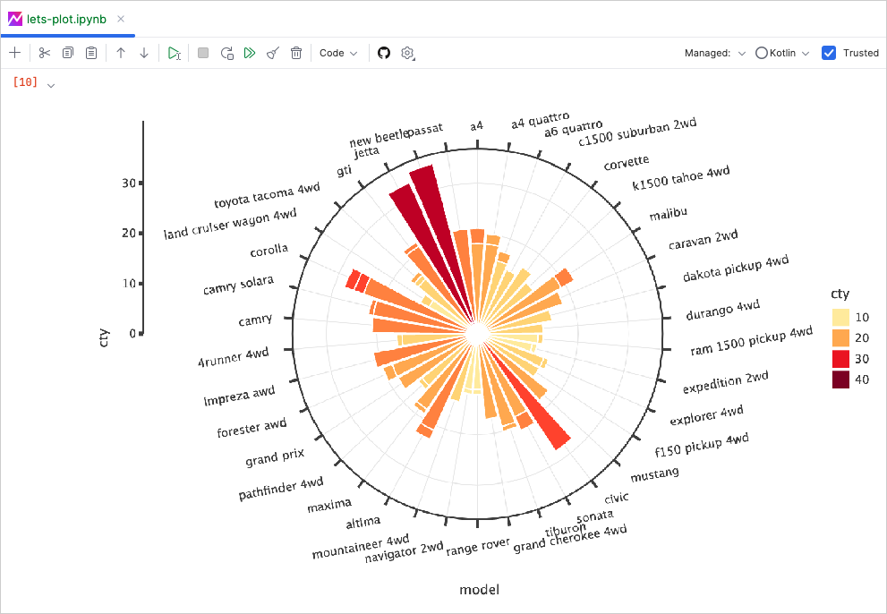
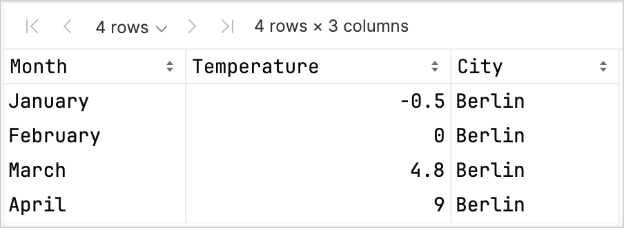
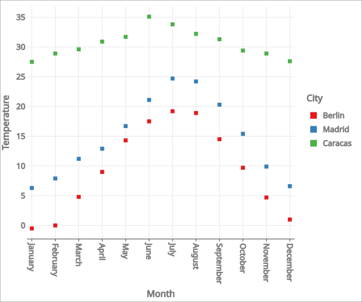
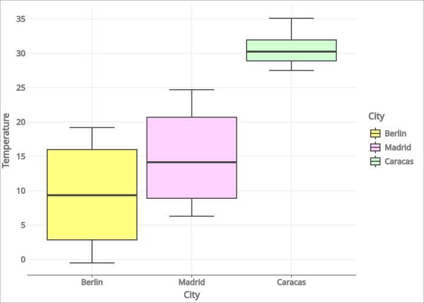
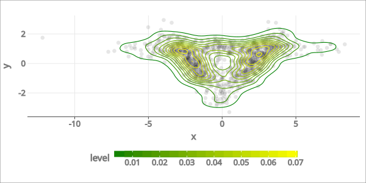

+++
title = "8.2.3.2 使用 Lets-Plot for Kotlin 进行数据可视化"
date = 2026-09-13T08:50:47+08:00
weight = 2
type = "docs"
description = ""
isCJKLanguage = true
draft = false
+++


> 原文链接: [https://kotlinlang.org/docs/lets-plot.html](https://kotlinlang.org/docs/lets-plot.html)

# 8.2.3.2 使用 Lets-Plot for Kotlin 进行数据可视化

[Lets-Plot for Kotlin（LPK）](https://lets-plot.org/kotlin/get-started.html)是一个多平台绘图库，把 [R 的 ggplot2 库](https://ggplot2.tidyverse.org/)移植到了 Kotlin。LPK 把功能丰富的 ggplot2 API 带入 Kotlin 生态，非常适合需要复杂数据可视化能力的科学家和统计学家。

LPK 面向多种平台，包括 [Kotlin/JS](../../../../development/6.2-Webdevelopment/6.2.2-Kotlinjs/6.2.2.1-JsOverview/)、[JVM 的 Swing](https://docs.oracle.com/javase/8/docs/technotes/guides/swing/)、[JavaFX](https://openjfx.io/) 和 [Compose Multiplatform](https://www.jetbrains.com/lp/compose-multiplatform/)。此外，LPK 还能与 [IntelliJ](https://www.jetbrains.com/idea/)、[DataGrip](https://www.jetbrains.com/datagrip/)、[DataSpell](https://www.jetbrains.com/dataspell/) 和 [PyCharm](https://www.jetbrains.com/pycharm/) 无缝集成。



本教程演示如何在 IntelliJ IDEA 中使用 LPK 和 [Kotlin DataFrame](https://kotlin.github.io/dataframe/home.html) 库创建不同类型的图表。

## 开始之前 {#before-you-start}

> **注意：** 从 IntelliJ IDEA 2026.2 开始，Kotlin Notebook 将不再随 IDE 一起提供，也不再由 JetBrains 官方支持。源代码仍可在 [GitHub](https://github.com/Kotlin/kotlin-notebook) 上获取。更多信息请参阅[博客文章](https://blog.jetbrains.com/idea/2026/06/kotlin-notebook-sunset/)。

创建一个新的 Kotlin Notebook 来使用 Lets-Plot：

1. 选择 **File** | **New** | **Kotlin Notebook**。
2. 在你的笔记本中运行以下命令，导入 LPK 和 Kotlin DataFrame 库：

```kotlin
    %use lets-plot
    %use dataframe
```

要学习本教程，你也可以把 DataFrame 用作 [Gradle](https://kotlin.github.io/dataframe/setupgradle.html) 或 [Maven](https://kotlin.github.io/dataframe/setupmaven.html) 依赖。

## 准备数据 {#prepare-the-data}

我们来创建一个 DataFrame，存储柏林、马德里和加拉加斯三座城市的模拟月平均气温数值。

使用 Kotlin DataFrame 库中的 [`dataFrameOf()`](https://kotlin.github.io/dataframe/createdataframe.html#dataframeof) 函数生成该 DataFrame。粘贴并运行以下代码片段：

```kotlin
// months 变量存储一个包含一年 12 个月份的列表
val months = listOf(
    "January", "February",
    "March", "April", "May",
    "June", "July", "August",
    "September", "October", "November",
    "December"
)
// tempBerlin、tempMadrid 和 tempCaracas 变量分别存储一个列表，其中包含每个月份的气温值
val tempBerlin =
    listOf(-0.5, 0.0, 4.8, 9.0, 14.3, 17.5, 19.2, 18.9, 14.5, 9.7, 4.7, 1.0)
val tempMadrid =
    listOf(6.3, 7.9, 11.2, 12.9, 16.7, 21.1, 24.7, 24.2, 20.3, 15.4, 9.9, 6.6)
val tempCaracas =
    listOf(27.5, 28.9, 29.6, 30.9, 31.7, 35.1, 33.8, 32.2, 31.3, 29.4, 28.9, 27.6)

// df 变量存储一个包含三列的 DataFrame，包括月份记录、气温和城市
val df = dataFrameOf(
    "Month" to months + months + months,
    "Temperature" to tempBerlin + tempMadrid + tempCaracas,
    "City" to List(12) { "Berlin" } + List(12) { "Madrid" } + List(12) { "Caracas" }
)
df.head(4)
```

你可以看到该 DataFrame 有三列：Month、Temperature 和 City。DataFrame 的前四行包含柏林 1 月到 4 月的气温记录：



要使用 LPK 库绘图，你需要把数据（`df`）转换为以键值对形式存储数据的 `Map` 类型。你可以使用 [`.toMap()`](https://kotlinlang.org/api/latest/jvm/stdlib/kotlin.collections/to-map.html) 函数轻松把 DataFrame 转换为 `Map`：

```kotlin
val data = df.toMap()
```

## 创建散点图 {#create-a-scatter-plot}

我们来用 LPK 库创建一个散点图。

把数据转换为 `Map` 格式之后，使用 LPK 库中的 [`geomPoint()`](https://lets-plot.org/kotlin/api-reference/-lets--plot--kotlin/org.jetbrains.letsPlot.geom/geom-point/index.html) 函数生成散点图。你可以指定 X 轴和 Y 轴的值，以及定义类别及其颜色。此外，你还可以按自己的需要[自定义](https://lets-plot.org/kotlin/aesthetics.html#point-shapes)图表尺寸和点的形状：

```kotlin
// 指定 X 轴和 Y 轴、类别及其颜色、图表尺寸和图表类型
val scatterPlot =
    letsPlot(data) { x = "Month"; y = "Temperature"; color = "City" } + ggsize(600, 500) + geomPoint(shape = 15)
scatterPlot
```

结果如下：



## 创建箱线图 {#create-a-box-plot}

我们用箱线图来可视化[这些数据](#prepare-the-data)。使用 LPK 库中的 [`geomBoxplot()`](https://lets-plot.org/kotlin/api-reference/-lets--plot--kotlin/org.jetbrains.letsPlot.geom/geom-boxplot.html) 函数生成图表，并用 [`scaleFillManual()`](https://lets-plot.org/kotlin/api-reference/-lets--plot--kotlin/org.jetbrains.letsPlot.scale/scale-fill-manual.html) 函数[自定义](https://lets-plot.org/kotlin/aesthetics.html#point-shapes)颜色：

```kotlin
// 指定 X 轴和 Y 轴、类别、图表尺寸和图表类型
val boxPlot = ggplot(data) { x = "City"; y = "Temperature" } + ggsize(700, 500) + geomBoxplot { fill = "City" } +
    // 自定义颜色
    scaleFillManual(values = listOf("light_yellow", "light_magenta", "light_green"))
boxPlot
```

结果如下：



## 创建二维密度图 {#create-a-2d-density-plot}

现在，我们创建一个二维密度图，来可视化一些随机数据的分布和集中程度。

### 为二维密度图准备数据 {#prepare-the-data-for-the-2d-density-plot}

1. 导入用于处理数据和生成图表的依赖：

```kotlin
   %use lets-plot

   @file:DependsOn("org.apache.commons:commons-math3:3.6.1")
   import org.apache.commons.math3.distribution.MultivariateNormalDistribution
```

2. 粘贴并运行以下代码片段，创建二维数据点集合：

```kotlin
   // 为三个分布定义协方差矩阵
   val cov0: Array<DoubleArray> = arrayOf(
       doubleArrayOf(1.0, -.8),
       doubleArrayOf(-.8, 1.0)
   )

   val cov1: Array<DoubleArray> = arrayOf(
       doubleArrayOf(1.0, .8),
       doubleArrayOf(.8, 1.0)
   )

   val cov2: Array<DoubleArray> = arrayOf(
       doubleArrayOf(10.0, .1),
       doubleArrayOf(.1, .1)
   )

   // 定义样本数量
   val n = 400

   // 为三个分布定义均值
   val means0: DoubleArray = doubleArrayOf(-2.0, 0.0)
   val means1: DoubleArray = doubleArrayOf(2.0, 0.0)
   val means2: DoubleArray = doubleArrayOf(0.0, 1.0)

   // 从三个多元正态分布中生成随机样本
   val xy0 = MultivariateNormalDistribution(means0, cov0).sample(n)
   val xy1 = MultivariateNormalDistribution(means1, cov1).sample(n)
   val xy2 = MultivariateNormalDistribution(means2, cov2).sample(n)
```

在上面的代码中，`xy0`、`xy1` 和 `xy2` 变量存储的是由二维（`x, y`）数据点组成的数组。

3. 把数据转换为 `Map` 类型：

```kotlin
   val data = mapOf(
       "x" to (xy0.map { it[0] } + xy1.map { it[0] } + xy2.map { it[0] }).toList(),
       "y" to (xy0.map { it[1] } + xy1.map { it[1] } + xy2.map { it[1] }).toList()
   )
```

### 生成二维密度图 {#generate-the-2d-density-plot}

使用上一步得到的 `Map` 创建二维密度图（`geomDensity2D`），并在背景中加入散点图（`geomPoint`），以便更好地可视化数据点和离群值。你可以使用 [`scaleColorGradient()`](https://lets-plot.org/kotlin/api-reference/-lets--plot--kotlin/org.jetbrains.letsPlot.scale/scale-color-gradient.html) 函数自定义颜色刻度：

```kotlin
val densityPlot = letsPlot(data) { x = "x"; y = "y" } + ggsize(600, 300) + geomPoint(
    color = "black",
    alpha = .1
) + geomDensity2D { color = "..level.." } +
        scaleColorGradient(low = "dark_green", high = "yellow", guide = guideColorbar(barHeight = 10, barWidth = 300)) +
        theme().legendPositionBottom()
densityPlot
```

结果如下：



## 接下来做什么 {#what-s-next}

* 在 [Lets-Plot for Kotlin 文档](https://lets-plot.org/kotlin/charts.html)中探索更多图表示例。
* 查阅 Lets-Plot for Kotlin 的 [API 参考](https://lets-plot.org/kotlin/api-reference/)。
* 在 [Kotlin DataFrame](https://kotlin.github.io/dataframe/info.html) 和 [Kandy](https://kotlin.github.io/kandy/welcome.html) 库文档中了解如何使用 Kotlin 转换和可视化数据。
