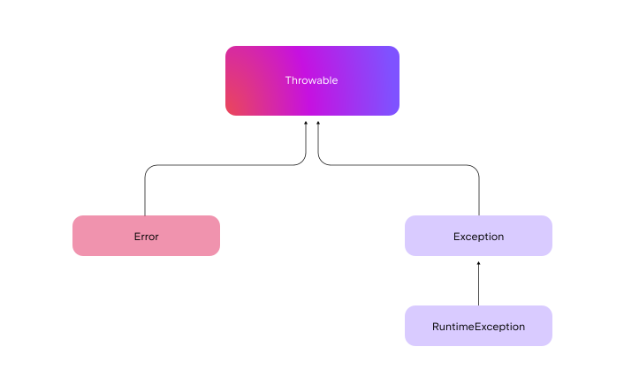
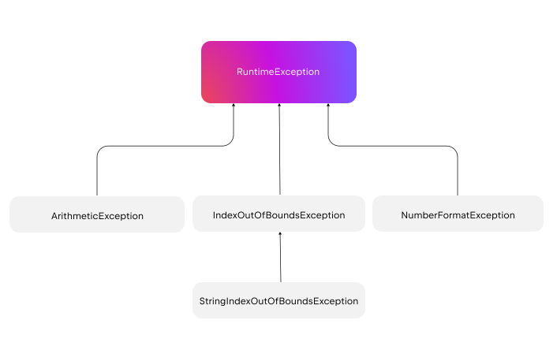

+++
title = "5.6 异常与错误处理"
date = 2026-09-13T08:50:47+08:00
weight = 3
type = "docs"
description = ""
isCJKLanguage = true
draft = false
+++


> 原文链接: [https://kotlinlang.org/docs/exceptions.html](https://kotlinlang.org/docs/exceptions.html)

# 5.6 异常与错误处理

了解 Kotlin 如何使用异常来处理运行时错误。

即使出现可能中断程序执行的运行时错误，异常也能让你的代码运行得更加可预测。Kotlin 默认把所有异常都视为*非受检*（unchecked）异常。非受检异常简化了异常处理流程：你可以捕获异常，但不必显式处理或[声明](../../interoperability/7.1-Javainterop/7.1.3-JavaToKotlinInterop/#checked-exceptions)它们。

> **提示：** 想进一步了解 Kotlin 在与 Java、Swift 和 Objective-C 交互时如何处理异常，请参阅[与 Java、Swift 和 Objective-C 的异常互操作](#exception-interoperability-with-java-swift-and-objective-c)一节。

处理异常主要包括两个操作：

* **抛出异常：** 在出现问题时加以表明。
* **捕获异常：** 通过解决问题，或通知开发者/应用用户，来手动处理意外异常。

异常由 [`Exception`](https://kotlinlang.org/api/latest/jvm/stdlib/kotlin/-exception/) 类的子类表示，而 `Exception` 又是 [`Throwable`](https://kotlinlang.org/api/latest/jvm/stdlib/kotlin/-throwable/) 类的子类。关于这一层级的更多信息，请参阅[异常层级](#exception-hierarchy)一节。由于 `Exception` 是 [`open class`](../5.8-Classesandinterfaces/5.8.6-Inheritance/)，你可以创建[自定义异常](#create-custom-exceptions)来满足应用的特定需求。

## 抛出异常 {#throw-exceptions}

你可以用 `throw` 关键字手动抛出异常。抛出异常表示代码中出现了意外的运行时错误。异常是[对象](../5.8-Classesandinterfaces/5.8.1-Classes/#creating-instances)，抛出一个异常就是创建一个异常类的实例。

可以不携带任何参数抛出异常：

```kotlin
throw IllegalArgumentException()
```

为了更好地了解问题的来源，可以附加更多信息，例如自定义消息和原始原因：

```kotlin
val cause = IllegalStateException("Original cause: illegal state")

// 如果 userInput 为负数，则抛出 IllegalArgumentException
// 此外，还会显示原始原因，即由 cause 表示的 IllegalStateException
if (userInput < 0) {
    throw IllegalArgumentException("Input must be non-negative", cause)
}
```

在这个例子中，当用户输入负值时抛出 `IllegalArgumentException`。你可以创建自定义的错误消息，并保留异常的原始原因（`cause`），它会包含在[堆栈轨迹](#stack-trace)中。

### 使用前置条件函数抛出异常 {#throw-exceptions-with-precondition-functions}

Kotlin 还提供了使用前置条件函数自动抛出异常的其他方式。前置条件函数包括：

| 前置条件函数                     | 用途                           | 抛出的异常                                                                                                       |

| [`require()`](#require-function) | 校验用户输入的有效性           | [`IllegalArgumentException`](https://kotlinlang.org/api/latest/jvm/stdlib/kotlin/-illegal-argument-exception/)   |
| [`check()`](#check-function)     | 校验对象或变量状态的有效性     | [`IllegalStateException`](https://kotlinlang.org/api/latest/jvm/stdlib/kotlin/-illegal-state-exception/)         |
| [`error()`](#error-function)     | 表明非法的状态或条件           | [`IllegalStateException`](https://kotlinlang.org/api/latest/jvm/stdlib/kotlin/-illegal-state-exception/)         |

当特定条件不满足时程序流程就无法继续，这几种函数正适合这样的场景。它能让代码更简洁，也让这类检查更高效。

#### require() 函数 {#require-function}

当输入参数对函数的运行至关重要、参数无效时函数就无法继续，此时可以用 [`require()`](https://kotlinlang.org/api/latest/jvm/stdlib/kotlin/require.html) 函数来校验它们。

如果 `require()` 中的条件不满足，它会抛出 [`IllegalArgumentException`](https://kotlinlang.org/api/latest/jvm/stdlib/kotlin/-illegal-argument-exception/)：

```kotlin
fun getIndices(count: Int): List<Int> {
    require(count >= 0) { "Count must be non-negative. You set count to $count." }
    return List(count) { it + 1 }
}

fun main() {
    // 这一行会因 IllegalArgumentException 失败
    println(getIndices(-1))

    // 取消下面一行的注释即可看到正常工作的示例
    // println(getIndices(3))
    // [1, 2, 3]
}
```

> **注意：** `require()` 函数允许编译器执行[智能转换](../5.4-Types/5.4.8-Typecasts/#smart-casts)。检查成功后，变量会自动转换为非空类型。这类函数常用于空值检查，以确保变量在继续执行前不为 null。例如： ```kotlin fun printNonNullString(str: String?) { // 空值检查 require(str != null) // 检查成功后，可以保证 'str' // 不为 null，并会自动智能转换为非空 String println(str.length) } ```

#### check() 函数 {#check-function}

用 [`check()`](https://kotlinlang.org/api/latest/jvm/stdlib/kotlin/check.html) 函数校验对象或变量的状态。如果检查失败，说明存在需要解决的逻辑错误。

如果 `check()` 函数中指定的条件为 `false`，它会抛出 [`IllegalStateException`](https://kotlinlang.org/api/latest/jvm/stdlib/kotlin/-illegal-state-exception/)：

```kotlin
fun main() {
    var someState: String? = null

    fun getStateValue(): String {

        val state = checkNotNull(someState) { "State must be set beforehand!" }
        check(state.isNotEmpty()) { "State must be non-empty!" }
        return state
    }
    // 如果取消下面一行的注释，程序会因 IllegalStateException 失败
    // getStateValue()

    someState = ""

    // 如果取消下面一行的注释，程序会因 IllegalStateException 失败
    // getStateValue()
    someState = "non-empty-state"

    // 这里会打印 "non-empty-state"
    println(getStateValue())
}
```

> **注意：** `check()` 函数允许编译器执行[智能转换](../5.4-Types/5.4.8-Typecasts/#smart-casts)。检查成功后，变量会自动转换为非空类型。这类函数常用于空值检查，以确保变量在继续执行前不为 null。例如： ```kotlin fun printNonNullString(str: String?) { // 空值检查 check(str != null) // 检查成功后，可以保证 'str' // 不为 null，并会自动智能转换为非空 String println(str.length) } ```

#### error() 函数 {#error-function}

[`error()`](https://kotlinlang.org/api/latest/jvm/stdlib/kotlin/error.html) 函数用于表明代码中出现了非法的状态，或逻辑上不应该发生的情况。当你希望在代码中故意抛出异常时（例如代码遇到了意外状态），它就非常合适。这个函数在 `when` 表达式中特别有用，可以清晰地处理那些逻辑上不应发生的情况。

在下面的例子中，`error()` 函数用于处理未定义的用户角色。如果角色不在预定义范围内，就会抛出 [`IllegalStateException`](https://kotlinlang.org/api/latest/jvm/stdlib/kotlin/-illegal-state-exception/)：

```kotlin
class User(val name: String, val role: String)

fun processUserRole(user: User) {
    when (user.role) {
        "admin" -> println("${user.name} is an admin.")
        "editor" -> println("${user.name} is an editor.")
        "viewer" -> println("${user.name} is a viewer.")
        else -> error("Undefined role: ${user.role}")
    }
}

fun main() {
    // 这按预期工作
    val user1 = User("Alice", "admin")
    processUserRole(user1)
    // Alice 是管理员。

    // 这里会抛出 IllegalStateException
    val user2 = User("Bob", "guest")
    processUserRole(user2)
}
```

## 使用 try-catch 块处理异常 {#handle-exceptions-using-try-catch-blocks}

异常抛出后会中断程序的正常执行。你可以用 `try` 和 `catch` 关键字优雅地处理异常，让程序保持稳定。`try` 块中包含可能抛出异常的代码，而 `catch` 块则在异常发生时捕获并处理它。异常会由第一个与其具体类型或其[超类](../5.8-Classesandinterfaces/5.8.6-Inheritance/)匹配的 `catch` 块捕获。

下面是把 `try` 和 `catch` 关键字一起使用的写法：

```kotlin
try {
    // 可能抛出异常的代码
} catch (e: SomeException) {
    // 处理异常的代码
}
```

常见做法是把 `try-catch` 用作表达式，这样它可以从 `try` 块或 `catch` 块返回一个值：

```kotlin
fun main() {
    val num: Int = try {

        // 如果 count() 成功完成，其返回值会赋给 num
        count()

    } catch (e: ArithmeticException) {

        // 如果 count() 抛出异常，catch 块返回 -1，
        // 并把它赋给 num
        -1
    }
    println("Result: $num")
}

// 模拟一个可能抛出 ArithmeticException 的函数
fun count(): Int {

    // 修改这个值可以为 num 返回不同的结果
    val a = 0

    return 10 / a
}
```

你可以在不使用异常实例的情况下处理异常。例如，可以在 `catch` 块中提供回退值或通用的错误消息。

用下划线（`_`）代替异常参数名，表示有意忽略该异常实例：

```kotlin
import java.io.File
import java.io.IOException

fun main() {
    val userSettings = try {
        File("user-settings.json").readText()

    // 捕获 IOException，但不使用异常实例
    } catch (_: IOException) {
        // 如果文件加载失败，则使用回退值
        "{}"
    }

    println(userSettings)
}
```

同一个 `try` 块可以使用多个 `catch` 处理器。你可以按需要添加任意多个 `catch` 块，以分别处理不同的异常。当有多个 `catch` 块时，按代码从上到下的顺序，把最具体的异常放在前面、最不具体的放在后面，这一点很重要。这样的顺序与程序的执行流程一致。

来看一个使用[自定义异常](#create-custom-exceptions)的例子：

```kotlin
open class WithdrawalException(message: String) : Exception(message)
class InsufficientFundsException(message: String) : WithdrawalException(message)

fun processWithdrawal(amount: Double, availableFunds: Double) {
    if (amount > availableFunds) {
        throw InsufficientFundsException("Insufficient funds for the withdrawal.")
    }
    if (amount < 1 || amount % 1 != 0.0) {
        throw WithdrawalException("Invalid withdrawal amount.")
    }
    println("Withdrawal processed")
}

fun main() {
    val availableFunds = 500.0

    // 修改这个值可以测试不同的场景
    val withdrawalAmount = 500.5

    try {
        processWithdrawal(withdrawalAmount.toDouble(), availableFunds)

    // catch 块的顺序很重要！
    } catch (e: InsufficientFundsException) {
        println("Caught an InsufficientFundsException: ${e.message}")
    } catch (e: WithdrawalException) {
        println("Caught a WithdrawalException: ${e.message}")
    }
}
```

处理 `WithdrawalException` 的通用 catch 块会捕获该类型的所有异常，包括 `InsufficientFundsException` 这类具体异常，除非它们已被更具体的 catch 块提前捕获。

### finally 块 {#the-finally-block}

`finally` 块中的代码无论 `try` 块是成功完成还是抛出异常，都一定会执行。借助 `finally` 块，你可以在 `try` 和 `catch` 块执行之后进行清理。这在处理文件、网络连接等资源时尤为重要，因为 `finally` 能保证它们被正确关闭或释放。

下面是 `try-catch-finally` 三个块一起使用的典型写法：

```kotlin
try {
    // 可能抛出异常的代码
}
catch (e: YourException) {
    // 异常处理器
}
finally {
    // 总是会被执行的代码
}
```

`try` 表达式的返回值由 `try` 块或 `catch` 块中最后执行的表达式决定。如果没有发生异常，结果来自 `try` 块；如果异常被处理，结果来自 `catch` 块。`finally` 块总会被执行，但它不会改变 `try-catch` 块的结果。

我们用一个例子来演示：

```kotlin
fun divideOrNull(a: Int): Int {

    // try 块总会被执行
    // 这里的异常（除以零）会立即跳转到 catch 块
    try {
        val b = 44 / a
        println("try block: Executing division: $b")
        return b
    }

    // 由于 ArithmeticException（当 a == 0 时除以零），catch 块会被执行
    catch (e: ArithmeticException) {
        println("catch block: Encountered ArithmeticException $e")
        return -1
    }
    finally {
        println("finally block: The finally block is always executed")
    }
}

fun main() {

    // 修改这个值可以得到不同的结果。发生 ArithmeticException 时会返回：-1
    divideOrNull(0)
}
```

> **注意：** 在 Kotlin 中，管理实现了 [`AutoClosable`](https://kotlinlang.org/api/latest/jvm/stdlib/kotlin/-auto-closeable/) 接口的资源（例如 `FileInputStream` 或 `FileOutputStream` 这类文件流）的惯用做法是使用 [`.use()`](https://kotlinlang.org/api/latest/jvm/stdlib/kotlin/use.html) 函数。无论是否抛出异常，该函数都会在代码块执行完毕时自动关闭资源，因此不需要 `finally` 块。正因如此，Kotlin 不需要像 [Java 的 try-with-resources](https://docs.oracle.com/javase/tutorial/essential/exceptions/tryResourceClose.html) 那样的特殊语法来管理资源。 ```kotlin FileWriter("test.txt").use { writer -> writer.write("some text") // 该代码块结束后，.use 函数会自动调用 writer.close()，类似 finally 块 } ```

如果你的代码需要清理资源但不需要处理异常，也可以只使用 `try` 和 `finally` 而不写 `catch` 块：

```kotlin
class MockResource {
    fun use() {
        println("Resource being used")
        // 模拟正在使用资源
        // 如果发生除以零，这里会抛出 ArithmeticException
        val result = 100 / 0

        // 如果抛出异常，这一行不会被执行
        println("Result: $result")
    }

    fun close() {
        println("Resource closed")
    }
}

fun main() {
    val resource = MockResource()
    try {

        // 尝试使用该资源
        resource.use()

    } finally {

        // 确保资源总是被关闭，即使发生异常
        resource.close()
    }

    // 如果抛出异常，这一行不会被打印
    println("End of the program")
}
```

可以看到，无论是否发生异常，`finally` 块都能保证资源被关闭。

在 Kotlin 中，你可以按需只使用 `catch` 块、只使用 `finally` 块，或两者都用，但 `try` 块必须至少伴随一个 `catch` 块或一个 `finally` 块。

## 创建自定义异常 {#create-custom-exceptions}

在 Kotlin 中，你可以通过创建继承内置 `Exception` 类的类来定义自定义异常。这样可以针对应用的需求创建更具体的错误类型。

要创建自定义异常，可以定义一个继承 `Exception` 的类：

```kotlin
class MyException: Exception("My message")
```

在这个例子中有一个默认的错误消息 "My message"，如果你愿意，也可以把它留空。

> **提示：** Kotlin 中的异常是有状态的对象，携带与创建上下文相关的信息，即[堆栈轨迹](#stack-trace)。避免使用[对象声明](../5.8-Classesandinterfaces/5.8.7-ObjectDeclarations/#object-declarations-overview)来创建异常，而应在每次需要时创建新的异常实例。这样可以确保异常的状态准确反映具体的上下文。

自定义异常也可以继承任何已有的异常子类，例如 `ArithmeticException` 子类：

```kotlin
class NumberTooLargeException: ArithmeticException("My message")
```

> **注意：** 如果你想创建自定义异常的子类，必须把父类声明为 `open`，因为[类默认是 final 的](../5.8-Classesandinterfaces/5.8.6-Inheritance/)，否则无法被继承。例如： ```kotlin // 把自定义异常声明为 open 类，使其可以被继承 open class MyCustomException(message: String): Exception(message) // 创建该自定义异常类的子类 class SpecificCustomException: MyCustomException("Specific error message") ```

自定义异常的行为与内置异常完全一样。你可以用 `throw` 关键字抛出它们，并用 `try-catch-finally` 块处理它们。来看一个演示例子：

```kotlin
class NegativeNumberException: Exception("Parameter is less than zero.")
class NonNegativeNumberException: Exception("Parameter is a non-negative number.")

fun myFunction(number: Int) {
    if (number < 0) throw NegativeNumberException()
    else if (number >= 0) throw NonNegativeNumberException()
}

fun main() {

    // 修改这个函数中的值可以获得不同的异常
    myFunction(1)
}
```

在错误场景多样的应用中，构建异常层级有助于让代码更清晰、更具体。你可以用[抽象类](../5.8-Classesandinterfaces/5.8.1-Classes/#abstract-classes)或[密封类](../5.8-Classesandinterfaces/5.8.9-Specialclassesandinterfaces/5.8.9.1-SealedClasses/#constructors)作为承载公共异常特征的基类，再为具体的异常类型创建子类。此外，带默认值参数的自定义异常更加灵活，可以用不同的消息初始化，从而实现更细粒度的错误处理。

下面这个例子以密封类 `AccountException` 作为异常层级的基类，子类 `APIKeyExpiredException` 则展示了如何使用带默认值的参数来提供更详细的异常信息：

```kotlin
// 创建一个密封类，作为账号相关错误的异常层级基类
sealed class AccountException(message: String, cause: Throwable? = null):
Exception(message, cause)

// 创建 AccountException 的子类
class InvalidAccountCredentialsException : AccountException("Invalid account credentials detected")

// 创建 AccountException 的子类，允许添加自定义消息和原因
class APIKeyExpiredException(message: String = "API key expired", cause: Throwable? = null)	: AccountException(message, cause)

// 修改这些占位函数的返回值可以得到不同的结果
fun areCredentialsValid(): Boolean = true
fun isAPIKeyExpired(): Boolean = true

// 校验账号凭据和 API 密钥
fun validateAccount() {
    if (!areCredentialsValid()) throw InvalidAccountCredentialsException()
    if (isAPIKeyExpired()) {
        // 以特定原因抛出 APIKeyExpiredException 的示例
        val cause = RuntimeException("API key validation failed due to network error")
        throw APIKeyExpiredException(cause = cause)
    }
}

fun main() {
    try {
        validateAccount()
        println("Operation successful: Account credentials and API key are valid.")
    } catch (e: AccountException) {
        println("Error: ${e.message}")
        e.cause?.let { println("Caused by: ${it.message}") }
    }
}
```

## Nothing 类型 {#the-nothing-type}

在 Kotlin 中，每个表达式都有类型。表达式 `throw IllegalArgumentException()` 的类型是 [`Nothing`](https://kotlinlang.org/api/latest/jvm/stdlib/kotlin/-nothing.html)，这是一个内置类型，是所有其他类型的子类型，也被称为[底类型](https://en.wikipedia.org/wiki/Bottom_type)。这意味着在期望其他任何类型的地方，都可以使用 `Nothing` 作为返回类型或泛型类型，而不会引发类型错误。

`Nothing` 是 Kotlin 中的一种特殊类型，用于表示永远不会成功完成的函数或表达式——它们要么总是抛出异常，要么进入像无限循环这样永不结束的执行路径。你可以用 `Nothing` 标记尚未实现或设计为总是抛出异常的函数，从而向编译器和代码阅读者清楚表明你的意图。如果编译器在函数签名中推断出 `Nothing` 类型，它会给出警告。显式地把 `Nothing` 声明为返回类型可以消除这个警告。

下面这段 Kotlin 代码演示了 `Nothing` 类型的用法，编译器会把函数调用之后的代码标记为不可达：

```kotlin
class Person(val name: String?)

fun fail(message: String): Nothing {
    throw IllegalArgumentException(message)
    // 这个函数永远不会成功返回。
    // 它总是会抛出异常。
}

fun main() {
    // 创建一个 Person 实例，其 'name' 为 null
    val person = Person(name = null)

    val s: String = person.name ?: fail("Name required")

    // 此时可以保证 's' 已被初始化
    println(s)
}
```

Kotlin 的 [`TODO()`](https://kotlinlang.org/api/latest/jvm/stdlib/kotlin/-t-o-d-o.html) 函数同样使用 `Nothing` 类型，它作为占位符，用于标出代码中将来需要实现的部分：

```kotlin
fun notImplementedFunction(): Int {
    TODO("This function is not yet implemented")
}

fun main() {
    val result = notImplementedFunction()
    // 这里会抛出 NotImplementedError
    println(result)
}
```

可以看到，`TODO()` 函数总是抛出 [`NotImplementedError`](https://kotlinlang.org/api/latest/jvm/stdlib/kotlin/-not-implemented-error/) 异常。

## 异常类 {#exception-classes}

我们来看看 Kotlin 中一些常见的异常类型，它们都是 [`RuntimeException`](https://kotlinlang.org/api/latest/jvm/stdlib/kotlin/-runtime-exception/) 类的子类：

* [`ArithmeticException`](https://kotlinlang.org/api/latest/jvm/stdlib/kotlin/-arithmetic-exception/)：当无法执行某个算术运算（例如除以零）时会发生此异常。

```kotlin
    val example = 2 / 0 // 抛出 ArithmeticException
```

* [`IndexOutOfBoundsException`](https://kotlinlang.org/api/latest/jvm/stdlib/kotlin/-index-out-of-bounds-exception/)：当数组或字符串等某种索引超出范围时抛出此异常。

```kotlin
    val myList = mutableListOf(1, 2, 3)
    myList.removeAt(3) // 抛出 IndexOutOfBoundsException
```

> **注意：** 要避免这个异常，请改用更安全的方式，例如 [`getOrNull()`](https://kotlinlang.org/api/latest/jvm/stdlib/kotlin.collections/get-or-null.html) 函数： ```kotlin val myList = listOf(1, 2, 3) // 返回 null，而不是抛出 IndexOutOfBoundsException val element = myList.getOrNull(3) println("Element at index 3: $element") ```

* [`NoSuchElementException`](https://kotlinlang.org/api/latest/jvm/stdlib/kotlin/-no-such-element-exception/)：当访问某个集合中不存在的元素时抛出此异常。在使用 [`first()`](https://kotlinlang.org/api/latest/jvm/stdlib/kotlin.collections/first.html) 或 [`last()`](https://kotlinlang.org/api/latest/jvm/stdlib/kotlin.collections/last.html) 这类期望存在特定元素的方法时会发生。

```kotlin
    val emptyList = listOf<Int>()
    val firstElement = emptyList.first() // 抛出 NoSuchElementException
```

> **注意：** 要避免这个异常，请改用更安全的方式，例如 [`firstOrNull()`](https://kotlinlang.org/api/latest/jvm/stdlib/kotlin.collections/first-or-null.html) 函数： ```kotlin val emptyList = listOf<Int>() // 返回 null，而不是抛出 NoSuchElementException val firstElement = emptyList.firstOrNull() println("First element in empty list: $firstElement") ```

* [`NumberFormatException`](https://kotlinlang.org/api/latest/jvm/stdlib/kotlin/-number-format-exception/)：当尝试把字符串转换为数值类型，但字符串的格式不合适时会发生此异常。

```kotlin
    val string = "This is not a number"
    val number = string.toInt() // 抛出 NumberFormatException
```

> **注意：** 要避免这个异常，请改用更安全的方式，例如 [`toIntOrNull()`](https://kotlinlang.org/api/latest/jvm/stdlib/kotlin.text/to-int-or-null.html) 函数： ```kotlin val nonNumericString = "not a number" // 返回 null，而不是抛出 NumberFormatException val number = nonNumericString.toIntOrNull() println("Converted number: $number") ```

* [`NullPointerException`](https://kotlinlang.org/api/latest/jvm/stdlib/kotlin/-null-pointer-exception/)：当应用尝试使用值为 `null` 的对象引用时抛出此异常。尽管 Kotlin 的空安全特性显著降低了 NullPointerException 的风险，但仍然可能因故意使用 `!!` 运算符，或与缺少 Kotlin 空安全特性的 Java 交互而发生。

```kotlin
    val text: String? = null
    println(text!!.length) // 抛出 NullPointerException
```

虽然 Kotlin 中所有异常都是非受检的，你不必显式捕获它们，但如果需要，你仍然可以灵活地捕获。

### 异常层级 {#exception-hierarchy}

Kotlin 异常层级的根是 [`Throwable`](https://kotlinlang.org/api/latest/jvm/stdlib/kotlin/-throwable/) 类。它有两个直接子类：[`Error`](https://kotlinlang.org/api/latest/jvm/stdlib/kotlin/-error/) 和 [`Exception`](https://kotlinlang.org/api/latest/jvm/stdlib/kotlin/-exception/)：

* `Error` 子类表示应用可能无法自行恢复的严重基础性问题。这类问题通常不需要你去处理，例如 [`OutOfMemoryError`](https://kotlinlang.org/api/latest/jvm/stdlib/kotlin/-out-of-memory-error/) 或 `StackOverflowError`。

* `Exception` 子类用于表示你可能希望处理的情况。`Exception` 类型的子类型，例如 [`RuntimeException`](https://kotlinlang.org/api/latest/jvm/stdlib/kotlin/-runtime-exception/) 和 `IOException`（输入/输出异常），用于处理应用中的异常事件。



`RuntimeException` 通常由程序代码中检查不充分引起，可以通过编程手段避免。Kotlin 帮助避免 `NullPointerException` 这类常见的 `RuntimeException`，并针对除零等潜在的运行时错误提供编译期警告。下图展示了派生自 `RuntimeException` 的子类型层级：



## 堆栈轨迹 {#stack-trace}

*堆栈轨迹*（stack trace）是运行时环境生成的报告，用于调试。它展示了导致程序到达某个特定位置（尤其是发生错误或异常的位置）的函数调用序列。

来看一个在 JVM 环境中因异常而自动打印堆栈轨迹的例子：

```kotlin
fun main() {
    throw ArithmeticException("This is an arithmetic exception!")
}
```

在 JVM 环境中运行这段代码会得到如下输出：

```text
Exception in thread "main" java.lang.ArithmeticException: This is an arithmetic exception!
    at MainKt.main(Main.kt:3)
    at MainKt.main(Main.kt)
```

第一行是异常描述，包含：

* 异常类型：`java.lang.ArithmeticException`
* 线程：`main`
* 异常消息：`"This is an arithmetic exception!"`

异常描述之后，每一以 `at` 开头的行都是堆栈轨迹的一部分。其中一行称为一个*堆栈轨迹元素*或*栈帧*：

* `at MainKt.main (Main.kt:3)`：显示了方法名（`MainKt.main`）以及调用该方法所在的源文件和行号（`Main.kt:3`）。
* `at MainKt.main (Main.kt)`：表明异常发生在 `Main.kt` 文件的 `main()` 函数中。

## 与 Java、Swift 和 Objective-C 的异常互操作 {#exception-interoperability-with-java-swift-and-objective-c}

由于 Kotlin 把所有异常都视为非受检异常，当这些异常被区分受检与非受检异常的语言调用时，可能会带来麻烦。为解决 Kotlin 与 Java、Swift、Objective-C 等语言在异常处理上的这种差异，你可以使用 [`@Throws`](https://kotlinlang.org/api/latest/jvm/stdlib/kotlin/-throws/) 注解。该注解会提醒调用方可能抛出的异常。更多信息请参阅[从 Java 调用 Kotlin](../../interoperability/7.1-Javainterop/7.1.3-JavaToKotlinInterop/#checked-exceptions)和[与 Swift/Objective-C 的互操作](../../interoperability/7.3-Swiftobjectivecandcinterop/7.3.1-Swiftobjectivecinterop/7.3.1.1-NativeObjcInterop/#errors-and-exceptions)。
