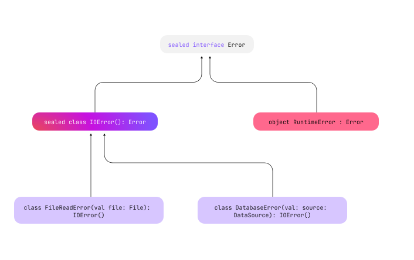

+++
title = "5.8.9.1 密封类与密封接口"
date = 2026-09-13T08:50:47+08:00
weight = 1
type = "docs"
description = ""
isCJKLanguage = true
draft = false
+++


> 原文链接: [https://kotlinlang.org/docs/sealed-classes.html](https://kotlinlang.org/docs/sealed-classes.html)

# 5.8.9.1 密封类与密封接口

*密封*类与密封接口为类层级提供受控的继承。密封类的所有直接子类在编译期都是已知的。在定义该密封类的模块和包之外，不会出现其他子类。同样的逻辑也适用于密封接口及其实现：一旦包含密封接口的模块编译完成，就无法再创建新的实现。

> **注意：** 直接子类是直接继承其超类的类。间接子类是比其超类低一级以上继承下来的类。

当你把密封类和密封接口与 `when` 表达式结合使用时，就可以覆盖所有可能子类的行为，并确保不会出现会影响你代码的新的子类。

密封类最适合以下场景：

* **希望限制类继承：** 你有一组预定义的、有限的子类继承某个类，且它们在编译期都是已知的。
* **需要类型安全的设计：** 安全性与模式匹配在项目中至关重要，尤其是在状态管理或处理复杂条件逻辑时。示例请参阅[把密封类与 when 表达式一起使用](#use-sealed-classes-with-when-expression)。
* **处理封闭的 API：** 你希望为库提供健壮且可维护的公开 API，确保第三方客户端按预期方式使用这些 API。

关于更详细的实战应用，请参阅[用例场景](#use-case-scenarios)。

> **提示：** Java 15 引入了[类似的概念](https://docs.oracle.com/en/java/javase/15/language/sealed-classes-and-interfaces.html#GUID-0C709461-CC33-419A-82BF-61461336E65F)，其中密封类使用 `sealed` 关键字配合 `permits` 子句来定义受限的层级。

## 声明密封类或密封接口 {#declare-a-sealed-class-or-interface}

要声明密封类或密封接口，请使用 `sealed` 修饰符：

```kotlin
// 创建一个密封接口
sealed interface Error

// 创建一个实现密封接口 Error 的密封类
sealed class IOError(): Error

// 定义继承密封类 'IOError' 的子类
class FileReadError(val file: File): IOError()
class DatabaseError(val source: DataSource): IOError()

// 创建一个实现 'Error' 密封接口的单例对象
object RuntimeError : Error
```

这个例子可以表示某个库的 API，其中包含错误类，让库的使用者能够处理该库可能抛出的错误。如果这类错误类的层级中包含在公开 API 中可见的接口或抽象类，那么没有什么能阻止其他开发者在客户端代码中实现或扩展它们。由于库并不知道外部声明的错误，它无法把外部错误与自己的类一致地处理。而借助**密封**的错误类层级，库作者可以确信自己知道所有可能的错误类型，并且之后不会再出现其他错误类型。

该示例的层级结构如下：



### 构造函数 {#constructors}

密封类本身始终是[抽象类](../../5.8.1-Classes/#abstract-classes)，因此不能被直接实例化。不过，它可以包含或继承构造函数。这些构造函数不是用来创建密封类自身实例的，而是供其子类使用的。请看下面这个名为 `Error` 的密封类及其若干子类，我们对它们进行了实例化：

```kotlin
sealed class Error(val message: String) {
    class NetworkError : Error("Network failure")
    class DatabaseError : Error("Database cannot be reached")
    class UnknownError : Error("An unknown error has occurred")
}

fun main() {
    val errors = listOf(Error.NetworkError(), Error.DatabaseError(), Error.UnknownError())
    errors.forEach { println(it.message) }
}
// Network failure
// Database cannot be reached
// An unknown error has occurred
```

你可以在密封类中使用 [`enum`](../5.8.9.2-EnumClasses/) 类，用枚举常量表示状态并提供额外细节。每个枚举常量只存在**一个**实例，而密封类的子类可以有**多个**实例。在这个例子中，`sealed class Error` 及其若干子类使用 `enum` 表示错误严重程度。每个子类的构造函数都会初始化 `severity`，并且可以改变它的状态：

```kotlin
enum class ErrorSeverity { MINOR, MAJOR, CRITICAL }

sealed class Error(val severity: ErrorSeverity) {
    class FileReadError(val file: File): Error(ErrorSeverity.MAJOR)
    class DatabaseError(val source: DataSource): Error(ErrorSeverity.CRITICAL)
    object RuntimeError : Error(ErrorSeverity.CRITICAL)
    // 可以在这里添加更多错误类型
}
```

密封类的构造函数可以有两种[可见性](../../../5.1-Basicsyntax/5.1.5-VisibilityModifiers/)：`protected`（默认）或 `private`：

```kotlin
sealed class IOError {
    // 密封类的构造函数默认具有 protected 可见性。它在此类及其子类中可见
    constructor() { /*...*/ }

    // 私有构造函数，只在此类中可见。
    // 在密封类中使用私有构造函数可以实现更严格的实例化控制，从而在类内部执行特定的初始化流程。
    private constructor(description: String): this() { /*...*/ }

    // 这里会报错，因为密封类不允许 public 和 internal 构造函数
    // public constructor(code: Int): this() {}
}
```

## 继承 {#inheritance}

密封类和密封接口的直接子类必须在同一个包中声明。它们可以是顶层声明，也可以嵌套在任意数量的其他具名类、具名接口或具名对象中。子类可以具有任何[可见性](../../../5.1-Basicsyntax/5.1.5-VisibilityModifiers/)，只要符合 Kotlin 中通常的继承规则，包括[重写属性](../../5.8.6-Inheritance/#overriding-properties)的规则。

密封类的子类必须有正确限定的名称。它们不能是局部对象或匿名对象。

> **注意：** `enum` 类不能继承密封类或其他任何类。不过，它们可以实现密封接口：```kotlin sealed interface Error // 继承密封接口 Error 的 enum 类 enum class ErrorType : Error { FILE_ERROR, DATABASE_ERROR } ```

这些限制不适用于间接子类。如果密封类的某个直接子类没有被标记为 sealed，那么它可以按其修饰符允许的任何方式被继承：

```kotlin
// 密封接口 'Error' 只在同一个包和模块中有实现
sealed interface Error

// 密封类 'IOError' 继承 'Error'，且只能在同一个包中扩展
sealed class IOError(): Error

// 开放类 'CustomError' 继承 'Error'，在它可见的任何地方都可以被扩展
open class CustomError(): Error
```

### 多平台项目中的继承 {#inheritance-in-multiplatform-projects}

在[多平台项目](https://kotlinlang.org/docs/multiplatform/get-started.html)中还有一条继承限制：密封类的直接子类必须位于同一个[源集](https://kotlinlang.org/docs/multiplatform/multiplatform-discover-project.html#source-sets)中。这适用于没有[ expect 和 actual 修饰符](https://kotlinlang.org/docs/multiplatform/multiplatform-expect-actual.html)的密封类。

如果某个密封类在公共源集中声明为 `expect`，并在平台源集中有 `actual` 实现，那么 `expect` 和 `actual` 两个版本都可以在各自的源集中有子类。此外，如果你使用层级结构，还可以在 `expect` 与 `actual` 声明之间的任意源集中创建子类。

[进一步了解多平台项目的层级结构](https://kotlinlang.org/docs/multiplatform/multiplatform-hierarchy.html)。

## 把密封类与 when 表达式一起使用 {#use-sealed-classes-with-when-expression}

使用密封类的关键好处体现在把它用于 [`when`](../../../5.5-Controlflow/5.5.1-ControlFlow/#when-expressions-and-statements) 表达式时。与密封类一起使用的 `when` 表达式让 Kotlin 编译器能够穷尽检查所有可能情况是否都已覆盖。在这种情况下，你不需要添加 `else` 子句：

```kotlin
// 密封类及其子类
sealed class Error {
    class FileReadError(val file: String): Error()
    class DatabaseError(val source: String): Error()
    object RuntimeError : Error()
}

// 用于记录错误的函数
fun log(e: Error) = when(e) {
    is Error.FileReadError -> println("Error while reading file ${e.file}")
    is Error.DatabaseError -> println("Error while reading from database ${e.source}")
    Error.RuntimeError -> println("Runtime error")
    // 不需要 `else` 子句，因为所有情况都已覆盖
}

// 列出所有错误
fun main() {
    val errors = listOf(
        Error.FileReadError("example.txt"),
        Error.DatabaseError("usersDatabase"),
        Error.RuntimeError
    )

    errors.forEach { log(it) }
}
```

> **提示：** 要减少 `when` 表达式中的重复，可以试试上下文敏感解析（目前为预览功能）。当预期类型已知时，该功能允许你在匹配密封类成员时省略类型名。更多信息请参阅[上下文敏感解析预览](../../../../kotlinevolutionandroadmap/13.6-Earlierkotlinreleases/13.6.2-Kotlin22x/13.6.2.2-Whatsnew22/#preview-of-context-sensitive-resolution)或相关的 [KEEP 提案](https://kotlinlang.org/docs/https://github.com/Kotlin/KEEP/blob/improved-resolution-expected-type/proposals/context-sensitive-resolution.html)。

把密封类与 `when` 表达式一起使用时，你还可以添加守卫条件，在单个分支中加入额外检查。更多信息请参阅 [when 表达式中的守卫条件](../../../5.5-Controlflow/5.5.1-ControlFlow/#guard-conditions-in-when-expressions)。

> **注意：** 在多平台项目中，如果你的公共代码里有一个带 `when` 表达式的密封类作为[预期声明](https://kotlinlang.org/docs/multiplatform/multiplatform-expect-actual.html)，仍然需要 `else` 分支。这是因为 `actual` 平台实现中的子类可能继承公共代码中未知的密封类。

## 用例场景 {#use-case-scenarios}

我们来看看密封类和密封接口特别有用的一些实际场景。

### UI 应用中的状态管理 {#state-management-in-ui-applications}

你可以用密封类表示应用中的不同 UI 状态。这种方式可以结构化且安全地处理 UI 变化。下面的例子演示了如何管理各种 UI 状态：

```kotlin
sealed class UIState {
    data object Loading : UIState()
    data class Success(val data: String) : UIState()
    data class Error(val exception: Exception) : UIState()
}

fun updateUI(state: UIState) {
    when (state) {
        is UIState.Loading -> showLoadingIndicator()
        is UIState.Success -> showData(state.data)
        is UIState.Error -> showError(state.exception)
    }
}
```

### 支付方式处理 {#payment-method-handling}

在实际业务应用中，高效处理各种支付方式是一项常见需求。你可以用密封类配合 `when` 表达式来实现这类业务逻辑。把不同的支付方式表示为密封类的子类，可以为交易处理建立清晰且易于管理的结构：

```kotlin
sealed class Payment {
    data class CreditCard(val number: String, val expiryDate: String) : Payment()
    data class PayPal(val email: String) : Payment()
    data object Cash : Payment()
}

fun processPayment(payment: Payment) {
    when (payment) {
        is Payment.CreditCard -> processCreditCardPayment(payment.number, payment.expiryDate)
        is Payment.PayPal -> processPayPalPayment(payment.email)
        is Payment.Cash -> processCashPayment()
    }
}
```

`Payment` 是一个密封类，表示电商系统中不同的支付方式：`CreditCard`、`PayPal` 和 `Cash`。每个子类都可以有自己的特定属性，例如 `CreditCard` 的 `number` 和 `expiryDate`，以及 `PayPal` 的 `email`。

`processPayment()` 函数演示了如何处理不同的支付方式。这种方式确保考虑了所有可能的支付类型，同时系统仍然可以灵活地支持将来新增的支付方式。

### API 请求与响应处理 {#api-request-response-handling}

你可以用密封类和密封接口实现一个处理 API 请求与响应的用户认证系统。该用户认证系统具有登录和登出功能。密封接口 `ApiRequest` 定义了具体的请求类型：用于登录的 `LoginRequest`，以及用于登出操作的 `LogoutRequest`。密封类 `ApiResponse` 封装了不同的响应场景：带用户数据的 `UserSuccess`、表示用户不存在的 `UserNotFound`，以及表示任何失败的 `Error`。`handleRequest` 函数使用 `when` 表达式以类型安全的方式处理这些请求，而 `getUserById` 则模拟用户查询：

```kotlin
// 导入必要的模块
import io.ktor.server.application.*
import io.ktor.server.resources.*

import kotlinx.serialization.*

// 使用 Ktor 资源为 API 请求定义密封接口
@Resource("api")
sealed interface ApiRequest

@Serializable
@Resource("login")
data class LoginRequest(val username: String, val password: String) : ApiRequest

@Serializable
@Resource("logout")
object LogoutRequest : ApiRequest

// 定义带详细响应类型的 ApiResponse 密封类
sealed class ApiResponse {
    data class UserSuccess(val user: UserData) : ApiResponse()
    data object UserNotFound : ApiResponse()
    data class Error(val message: String) : ApiResponse()
}

// 成功响应中使用的用户数据类
data class UserData(val userId: String, val name: String, val email: String)

// 用于校验用户凭据的函数（仅用于演示）
fun isValidUser(username: String, password: String): Boolean {
    // 一些校验逻辑（这里只是占位）
    return username == "validUser" && password == "validPass"
}

// 处理 API 请求并返回详细响应的函数
fun handleRequest(request: ApiRequest): ApiResponse {
    return when (request) {
        is LoginRequest -> {
            if (isValidUser(request.username, request.password)) {
                ApiResponse.UserSuccess(UserData("userId", "userName", "userEmail"))
            } else {
                ApiResponse.Error("Invalid username or password")
            }
        }
        is LogoutRequest -> {
            // 假设在本例中登出操作总是成功
            ApiResponse.UserSuccess(UserData("userId", "userName", "userEmail")) // 仅用于演示
        }
    }
}

// 模拟 getUserById 调用的函数
fun getUserById(userId: String): ApiResponse {
    return if (userId == "validUserId") {
        ApiResponse.UserSuccess(UserData("validUserId", "John Doe", "john@example.com"))
    } else {
        ApiResponse.UserNotFound
    }
    // 错误处理也会返回 Error 响应。
}

// 演示用法的主函数
fun main() {
    val loginResponse = handleRequest(LoginRequest("user", "pass"))
    println(loginResponse)

    val logoutResponse = handleRequest(LogoutRequest)
    println(logoutResponse)

    val userResponse = getUserById("validUserId")
    println(userResponse)

    val userNotFoundResponse = getUserById("invalidId")
    println(userNotFoundResponse)
}
```

## 接下来学什么 {#what-s-next}

进一步了解 [Kotlin 中的继承](../../5.8.6-Inheritance/)。
