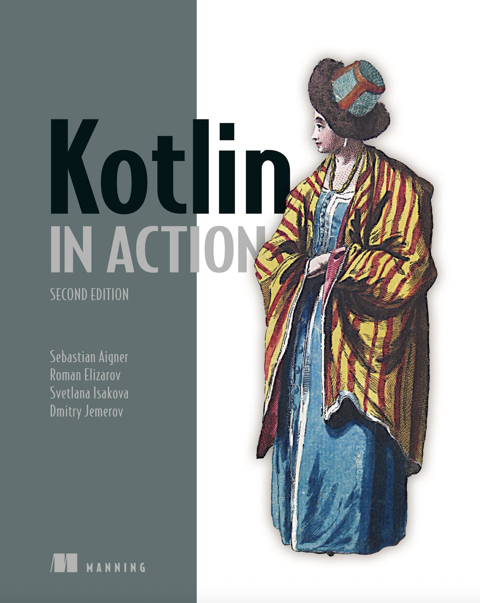
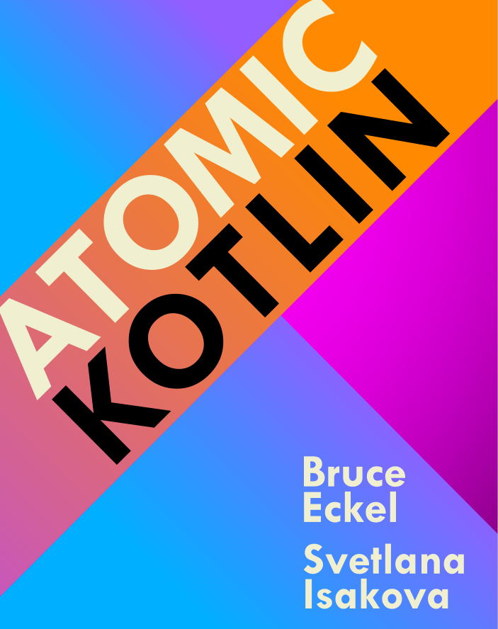
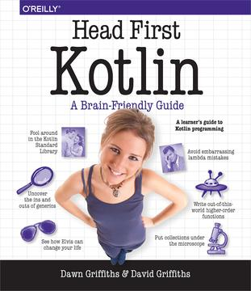
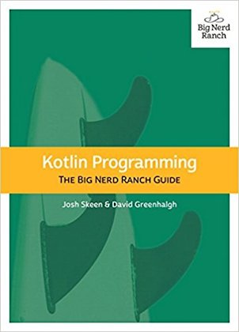
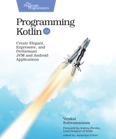
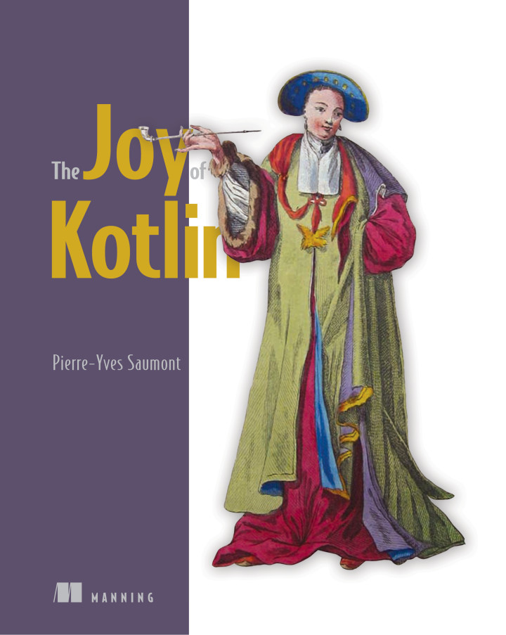

+++
title = "15.6 Kotlin 图书"
date = 2026-09-13T08:50:47+08:00
weight = 5
type = "docs"
description = ""
isCJKLanguage = true
draft = false
+++

> 原文链接: [https://kotlinlang.org/docs/books.html](https://kotlinlang.org/docs/books.html)

# 15.6 Kotlin 图书

越来越多的作者在用不同语言编写学习 Kotlin 的图书。我们对他们所有人深表感谢，也感谢他们为帮助我们增加专业 Kotlin 开发者数量所做的努力。

下面只是我们审阅过并推荐你用来学习 Kotlin 的部分图书。你可以在[我们的社区网站](https://kotlin.link/)上找到更多图书。

|  | [Kotlin in Action](https://www.manning.com/books/kotlin-in-action-second-edition) 教你使用 Kotlin 语言编写生产级应用。这本书为熟悉 Java 或其他面向对象语言的开发者而写，示例丰富，比大多数语言书讲得更深入。第二版增加了大量关于 Kotlin 协程库的内容。本书作者是 Sebastian Aigner、Roman Elizarov、Svetlana Isakova 和 Dmitry Jemerov，他们都是 Kotlin 团队的现任或前任成员。 |
| --- | --- |
|  | [Atomic Kotlin](https://www.atomickotlin.com/atomickotlin/) 既适合初学者，也适合有经验的程序员！本书由多次获奖的《Thinking in C++》和《Thinking in Java》作者 Bruce Eckel 与 JetBrains 的 Kotlin 开发者布道师 Svetlana Isakova 合著，把语言概念拆解成一个个易于消化的小"原子"，并配套一门免费课程，其中的练习可直接在 IntelliJ IDEA 中获得提示和解答！ |
|  | [Head First Kotlin](https://www.oreilly.com/library/view/head-first-kotlin/9781491996683/) 是一本完整的 Kotlin 编码入门书。这本实践导向的书用一种独特的教学方法帮助你学习 Kotlin 语言，它超越了语法和操作手册的层面，教你如何像优秀的 Kotlin 开发者那样思考。你将学到从语言基础到集合、泛型、lambda 和高阶函数的全部内容。在此过程中，你还能同时体验面向对象编程和函数式编程。如果你想真正理解 Kotlin，这本书就是为你准备的。 |
|  | [Kotlin Programming: The Big Nerd Ranch Guide](https://www.amazon.com/Kotlin-Programming-Nerd-Ranch-Guide/dp/0135161630) 本书通过精心设计的示例教你有效地使用 Kotlin 语言，帮助你掌握 Kotlin 优雅的风格和特性。从基本原理开始，你将逐步深入到 Kotlin 的高级用法，从而能够用更少的代码写出更可靠的程序。 |
|  | [Programming Kotlin](https://pragprog.com/titles/vskotlin/programming-kotlin/) 由 Venkat Subramaniam 编写。程序员不只是使用 Kotlin，他们是爱上它。甚至 Google 也把它采纳为 Android 开发的一流语言。使用 Kotlin，你可以混合使用命令式、函数式和面向对象的编程风格，并从中选择最适合当前问题的做法。通过易于理解的示例，学习这门高度简洁、流畅、优雅且富有表现力的静态类型语言的众多特性。学习编写可维护、高性能的 JVM 和 Android 应用、创建 DSL、进行异步编程等等。 |
|  | [The Joy of Kotlin](https://www.manning.com/books/the-joy-of-kotlin) 教你用正确的方式编写 Kotlin 代码。在这本充满洞见的书中，你将在探索各种编码技巧的同时掌握 Kotlin 语言，无论你使用哪种语言，这些技巧都会让你成为更好的开发者。Kotlin 原生支持函数式编程风格，因此资深作者 Pierre-Yves Saumont 首先回顾了不可变性、引用透明性以及函数与副作用分离等函数式编程原则。随后，你将更深入地了解 Kotlin 在真实世界中的应用，学习如何正确处理错误和数据、封装共享状态变更以及使用惰性求值。这本书将改变你的编码方式——并让你重新找回初学编程时的那份乐趣。 |
