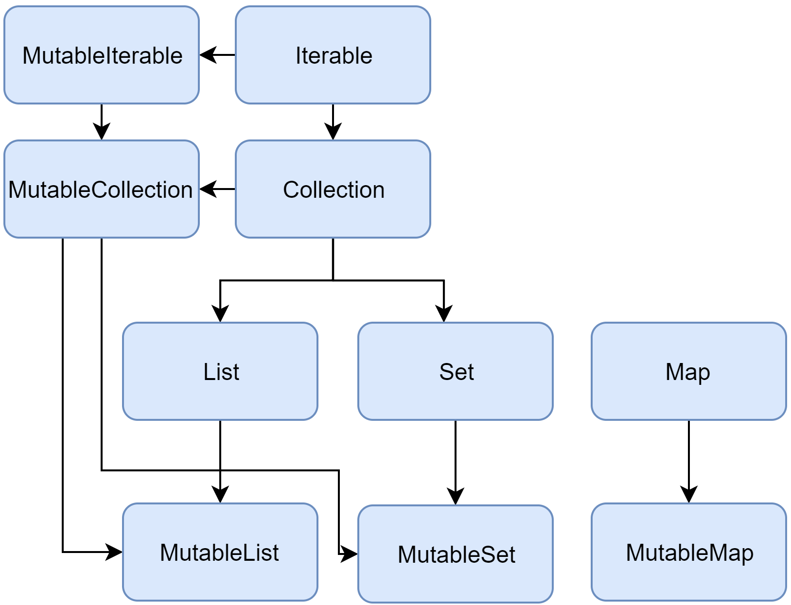

+++
title = "9.1.1.1 集合概览"
date = 2026-09-13T08:50:47+08:00
weight = 1
type = "docs"
description = ""
isCJKLanguage = true
draft = false
+++


> 原文链接: [https://kotlinlang.org/docs/collections-overview.html](https://kotlinlang.org/docs/collections-overview.html)

# 9.1.1.1 集合概览

Kotlin 标准库提供了一整套用于管理*集合*的工具——集合是指数量可变（可能为零）的一组条目，它们对所解决的问题有意义，并且通常会被一起操作。

集合是大多数编程语言中的常见概念，因此如果你熟悉 Java 或 Python 的集合，可以跳过这段介绍，直接阅读后面的详细小节。

集合通常包含若干相同类型（及其子类型）的对象。集合中的对象称为*元素*或*条目*。例如，一个系里的所有学生构成一个集合，可以用它来计算他们的平均年龄。

以下集合类型与 Kotlin 相关：

* _List_ 是有序集合，可通过索引访问元素——索引是反映元素位置的整数。元素可以在列表中多次出现。电话号就是一个列表的例子：它是一组数字，顺序很重要，而且可以重复。
* _Set_ 是唯一元素的集合。它反映了数学上集合的抽象概念：一组不重复的对象。通常，集合元素的顺序没有意义。例如，彩票上的号码构成一个集合：它们互不相同，顺序也不重要。
* _Map_（或*字典*）是一组键值对。键是唯一的，每个键恰好映射到一个值。值可以有重复。映射适合存储对象之间的逻辑关联，例如员工的 ID 与其职位。

Kotlin 让你可以独立于集合中实际存储的对象类型来操作集合。换句话说，把 `String` 添加到 `String` 列表中，与对 `Int` 或用户自定义类进行同样的操作方式相同。因此，Kotlin 标准库提供了泛型接口、类和函数，用于创建、填充和管理任意类型的集合。

集合接口及相关函数位于 `kotlin.collections` 包中。我们来概览一下它的内容。

> **注意：** 数组不是一种集合类型。更多信息请参阅[数组](../../../../languageguide/5.4-Types/5.4.7-Arrays/)。

## 集合类型 {#collection-types}

Kotlin 标准库为基本集合类型提供了实现：set、list 和 map。每种集合类型都由一对接口表示：

* 一个*只读*接口，提供访问集合元素的操作。
* 一个*可变*接口，它在相应的只读接口基础上扩展了写操作：添加、移除和更新元素。

注意，可变集合不必赋值给 [`var`](../../../../languageguide/5.1-Basicsyntax/5.1.1-BasicSyntax/#variables)。即使把它赋值给 `val`，仍然可以对可变集合执行写操作。把可变集合赋值给 `val` 的好处是，你可以保护对该可变集合的引用不被修改。随着代码的增长和变得更复杂，防止引用被意外修改会变得越来越重要。尽可能使用 `val`，可以写出更安全、更健壮的代码。如果你尝试重新给 `val` 集合赋值，会得到编译错误：

```kotlin
fun main() {
    val numbers = mutableListOf("one", "two", "three", "four")
    numbers.add("five") // 这样可以
    println(numbers)
    //numbers = mutableListOf("six", "seven")      // 编译错误

}
```

只读集合类型是[协变](../../../../languageguide/5.11-Generics/#variance)的。这意味着，如果 `Rectangle` 类继承自 `Shape`，那么在任何需要 `List<Shape>` 的地方都可以使用 `List<Rectangle>`。换句话说，集合类型具有与元素类型相同的子类型关系。Map 在值类型上是协变的，但在键类型上不是。

而可变集合则不是协变的，否则会导致运行时失败。如果 `MutableList<Rectangle>` 是 `MutableList<Shape>` 的子类型，你就可以往里面插入其他 `Shape` 的继承者（例如 `Circle`），从而违反它的 `Rectangle` 类型实参。

下面是 Kotlin 集合接口的示意图：



我们来逐一了解这些接口及其实现。要了解 `Collection`，请阅读下面的小节。要了解 `List`、`Set` 和 `Map`，你可以阅读相应的小节，也可以观看 Kotlin 开发者布道师 Sebastian Aigner 的视频：

视频：[Kotlin Collections Overview](https://www.youtube.com/v/F8jj7e-_jFA)

### Collection {#collection}

[`Collection<T>`](https://kotlinlang.org/api/latest/jvm/stdlib/kotlin.collections/-collection/index.html) 是集合层级的根。该接口表示只读集合的通用行为：获取大小、检查条目是否属于集合等等。`Collection` 继承自 `Iterable<T>` 接口，后者定义了遍历元素的操作。你可以把 `Collection` 用作函数参数，使其适用于不同的集合类型。对于更具体的情况，请使用 `Collection` 的继承者：[`List`](https://kotlinlang.org/api/latest/jvm/stdlib/kotlin.collections/-list/index.html) 和 [`Set`](https://kotlinlang.org/api/latest/jvm/stdlib/kotlin.collections/-set/index.html)。

```kotlin
fun printAll(strings: Collection<String>) {
    for(s in strings) print("$s ")
    println()
}

fun main() {
    val stringList = listOf("one", "two", "one")
    printAll(stringList)

    val stringSet = setOf("one", "two", "three")
    printAll(stringSet)
}
```

[`MutableCollection<T>`](https://kotlinlang.org/api/latest/jvm/stdlib/kotlin.collections/-mutable-collection/index.html) 是带有写操作（例如 `add` 和 `remove`）的 `Collection`。

```kotlin
fun List<String>.getShortWordsTo(shortWords: MutableList<String>, maxLength: Int) {
    this.filterTo(shortWords) { it.length <= maxLength }
    // 去掉冠词
    val articles = setOf("a", "A", "an", "An", "the", "The")
    shortWords -= articles
}

fun main() {
    val words = "A long time ago in a galaxy far far away".split(" ")
    val shortWords = mutableListOf<String>()
    words.getShortWordsTo(shortWords, 3)
    println(shortWords)
}
```

### List {#list}

[`List<T>`](https://kotlinlang.org/api/latest/jvm/stdlib/kotlin.collections/-list/index.html) 按指定顺序存储元素，并提供带索引的访问方式。索引从零开始（第一个元素的索引），一直到 `lastIndex`，它等于 `(list.size - 1)`。

```kotlin
fun main() {
    val numbers = listOf("one", "two", "three", "four")
    println("Number of elements: ${numbers.size}")
    println("Third element: ${numbers.get(2)}")
    println("Fourth element: ${numbers[3]}")
    println("Index of element \"two\" ${numbers.indexOf("two")}")
}
```

列表元素（包括 null）可以重复：一个列表可以包含任意数量的相等对象，或同一个对象的多次出现。如果两个列表大小相同，且相同位置上的元素[结构相等](../../../../languageguide/5.10-Equality/#structural-equality)，则认为这两个列表相等。

```kotlin
data class Person(var name: String, var age: Int)

fun main() {
    val bob = Person("Bob", 31)
    val people = listOf(Person("Adam", 20), bob, bob)
    val people2 = listOf(Person("Adam", 20), Person("Bob", 31), bob)
    println(people == people2)
    bob.age = 32
    println(people == people2)
}
```

[`MutableList<T>`](https://kotlinlang.org/api/latest/jvm/stdlib/kotlin.collections/-mutable-list/index.html) 是带有列表特有写操作的 `List`，例如在指定位置添加或移除元素。

```kotlin
fun main() {
    val numbers = mutableListOf(1, 2, 3, 4)
    numbers.add(5)
    numbers.removeAt(1)
    numbers[0] = 0
    numbers.shuffle()
    println(numbers)
}
```

如你所见，在某些方面列表与数组非常相似。但有一个重要区别：数组的大小在初始化时确定，且永远不会改变；而列表没有预先确定的大小，其大小可以因写操作（添加、更新或移除元素）而改变。

在 Kotlin 中，`MutableList` 的默认实现是 [`ArrayList`](https://kotlinlang.org/api/latest/jvm/stdlib/kotlin.collections/-array-list/index.html)，你可以把它看作可调整大小的数组。

### Set {#set}

[`Set<T>`](https://kotlinlang.org/api/latest/jvm/stdlib/kotlin.collections/-set/index.html) 存储唯一元素；其顺序通常是不确定的。`null` 元素也是唯一的：一个 `Set` 只能包含一个 `null`。如果两个集合大小相同，且对于其中一个集合的每个元素，另一个集合中都有相等的元素，则认为这两个集合相等。

```kotlin
fun main() {
    val numbers = setOf(1, 2, 3, 4)
    println("Number of elements: ${numbers.size}")
    if (numbers.contains(1)) println("1 is in the set")

    val numbersBackwards = setOf(4, 3, 2, 1)
    println("The sets are equal: ${numbers == numbersBackwards}")
}
```

[`MutableSet`](https://kotlinlang.org/api/latest/jvm/stdlib/kotlin.collections/-mutable-set/index.html) 是带有 `MutableCollection` 写操作的 `Set`。

`MutableSet` 的默认实现——[`LinkedHashSet`](https://kotlinlang.org/api/latest/jvm/stdlib/kotlin.collections/-linked-hash-set/index.html)——会保留元素插入的顺序。因此，`first()` 或 `last()` 等依赖顺序的函数在这类集合上会返回可预测的结果。

```kotlin
fun main() {
    val numbers = setOf(1, 2, 3, 4) // LinkedHashSet 是默认实现
    val numbersBackwards = setOf(4, 3, 2, 1)

    println(numbers.first() == numbersBackwards.first())
    println(numbers.first() == numbersBackwards.last())
}
```

另一种实现——[`HashSet`](https://kotlinlang.org/api/latest/jvm/stdlib/kotlin.collections/-hash-set/index.html)——不保证元素顺序，因此在这类集合上调用上述函数会返回不可预测的结果。不过，在存储相同数量元素时，`HashSet` 占用的内存更少。

### Map {#map}

[`Map<K, V>`](https://kotlinlang.org/api/latest/jvm/stdlib/kotlin.collections/-map/index.html) 不是 `Collection` 接口的继承者；不过它同样是 Kotlin 的集合类型。`Map` 存储*键值*对（或称*条目*）；键是唯一的，但不同的键可以对应相等的值。`Map` 接口提供了一些特定函数，例如按键访问值、搜索键和值等等。

```kotlin
fun main() {
    val numbersMap = mapOf("key1" to 1, "key2" to 2, "key3" to 3, "key4" to 1)

    println("All keys: ${numbersMap.keys}")
    println("All values: ${numbersMap.values}")
    if ("key2" in numbersMap) println("Value by key \"key2\": ${numbersMap["key2"]}")
    if (1 in numbersMap.values) println("The value 1 is in the map")
    if (numbersMap.containsValue(1)) println("The value 1 is in the map") // 与上一行相同
}
```

只要包含相等的键值对，两个映射就是相等的，与键值对的顺序无关。

```kotlin
fun main() {
    val numbersMap = mapOf("key1" to 1, "key2" to 2, "key3" to 3, "key4" to 1)
    val anotherMap = mapOf("key2" to 2, "key1" to 1, "key4" to 1, "key3" to 3)

    println("The maps are equal: ${numbersMap == anotherMap}")
}
```

[`MutableMap`](https://kotlinlang.org/api/latest/jvm/stdlib/kotlin.collections/-mutable-map/index.html) 是带有映射写操作的 `Map`，例如你可以添加新的键值对，或更新与给定键关联的值。

```kotlin
fun main() {
    val numbersMap = mutableMapOf("one" to 1, "two" to 2)
    numbersMap.put("three", 3)
    numbersMap["one"] = 11

    println(numbersMap)
}
```

`MutableMap` 的默认实现——[`LinkedHashMap`](https://kotlinlang.org/api/latest/jvm/stdlib/kotlin.collections/-linked-hash-map/index.html)——在遍历映射时会保留元素插入的顺序。而另一种实现——[`HashMap`](https://kotlinlang.org/api/latest/jvm/stdlib/kotlin.collections/-hash-map/index.html)——则不保证元素顺序。

### ArrayDeque {#arraydeque}

[`ArrayDeque<T>`](https://kotlinlang.org/api/latest/jvm/stdlib/kotlin.collections/-array-deque/) 是双端队列的一种实现，允许你在队列的开头或末尾添加、移除元素。因此，`ArrayDeque` 在 Kotlin 中也同时充当栈和队列这两种数据结构。在底层，`ArrayDeque` 使用一个可调整大小的数组实现，会在需要时自动调整大小：

```kotlin
fun main() {
    val deque = ArrayDeque(listOf(1, 2, 3))

    deque.addFirst(0)
    deque.addLast(4)
    println(deque) // [0, 1, 2, 3, 4]

    println(deque.first()) // 0
    println(deque.last()) // 4

    deque.removeFirst()
    deque.removeLast()
    println(deque) // [1, 2, 3]
}
```
