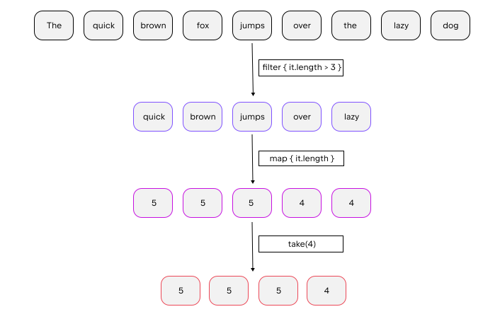
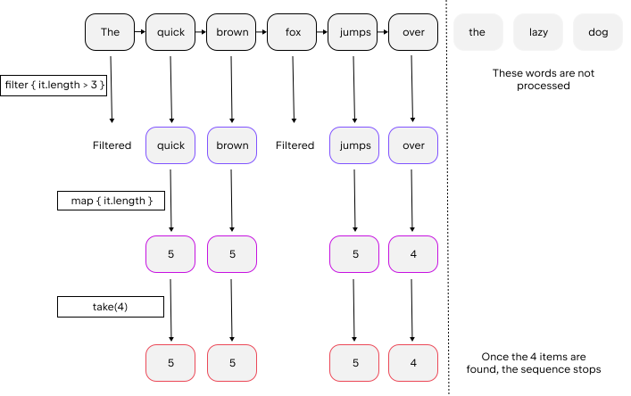

+++
title = "9.1.1.10 序列"
date = 2026-09-13T08:50:47+08:00
weight = 8
type = "docs"
description = ""
isCJKLanguage = true
draft = false
+++


> 原文链接: [https://kotlinlang.org/docs/sequences.html](https://kotlinlang.org/docs/sequences.html)

# 9.1.1.10 序列

除了集合之外，Kotlin 标准库还包含另一种类型——*序列*（[`Sequence<T>`](https://kotlinlang.org/api/latest/jvm/stdlib/kotlin.sequences/-sequence/index.html)）。与集合不同，序列不包含元素，而是在迭代时产生元素。序列提供了与 [`Iterable`](https://kotlinlang.org/api/latest/jvm/stdlib/kotlin.collections/-iterable/index.html) 相同的函数，但对多步骤的集合处理实现了另一种方式。

当对 `Iterable` 的处理包含多个步骤时，这些步骤会急切执行：每个处理步骤都会完成并返回结果——一个中间集合。下一个步骤在这个集合上执行。而序列的多步骤处理则在可能的情况下惰性执行：只有当整个处理链的结果被请求时，实际计算才会发生。

操作的执行顺序也不同：`Sequence` 会为每个元素依次执行所有处理步骤。而 `Iterable` 会先为整个集合完成一个步骤，然后再进行下一个步骤。

因此，序列让你避免构建中间步骤的结果，从而提升整个集合处理链的性能。不过，序列的惰性特性会带来一些额外开销，在处理较小集合或进行较简单计算时这些开销可能相当明显。因此，你应当同时考虑 `Sequence` 和 `Iterable`，再决定哪一种更适合你的场景。

## 构造 {#construct}

### 从元素构造 {#from-elements}

要创建序列，请调用 [`sequenceOf()`](https://kotlinlang.org/api/latest/jvm/stdlib/kotlin.sequences/sequence-of.html) 函数并把这些元素作为实参列出。

```kotlin
val numbersSequence = sequenceOf("four", "three", "two", "one")
```

### 从 Iterable 构造 {#from-an-iterable}

如果你已经有 `Iterable` 对象（例如 `List` 或 `Set`），可以通过调用 [`asSequence()`](https://kotlinlang.org/api/latest/jvm/stdlib/kotlin.collections/as-sequence.html) 从它创建序列。

```kotlin
val numbers = listOf("one", "two", "three", "four")
val numbersSequence = numbers.asSequence()

```

### 从函数构造 {#from-a-function}

创建序列的另一种方式是用一个计算其元素的函数来构建它。要基于函数构建序列，请调用 [`generateSequence()`](https://kotlinlang.org/api/latest/jvm/stdlib/kotlin.sequences/generate-sequence.html) 并把该函数作为实参传入。你也可以选择把第一个元素指定为显式值或函数调用的结果。当提供的函数返回 `null` 时，序列生成就会停止。因此，下面例子中的序列是无限的。

```kotlin

fun main() {
    val oddNumbers = generateSequence(1) { it + 2 } // `it` 是前一个元素
    println(oddNumbers.take(5).toList())
    // 错误：该序列是无限的
}
```

要用 `generateSequence()` 创建有限序列，请提供一个在你需要的最后一个元素之后返回 `null` 的函数。

```kotlin

fun main() {
    val oddNumbersLessThan10 = generateSequence(1) { if (it < 8) it + 2 else null }
    println(oddNumbersLessThan10.count())
}
```

### 从数据块构造 {#from-chunks}

最后，还有一个函数让你可以逐个或按任意大小的数据块产生序列元素——[`sequence()`](https://kotlinlang.org/api/latest/jvm/stdlib/kotlin.sequences/sequence.html) 函数。该函数接收一个包含 [`yield()`](https://kotlinlang.org/api/latest/jvm/stdlib/kotlin.sequences/-sequence-scope/yield.html) 和 [`yieldAll()`](https://kotlinlang.org/api/latest/jvm/stdlib/kotlin.sequences/-sequence-scope/yield-all.html) 函数调用的 lambda 表达式。这些函数会把一个元素返回给序列的消费者，并挂起 `sequence()` 的执行，直到消费者请求下一个元素。`yield()` 接收单个元素作为实参；`yieldAll()` 可以接收 `Iterable` 对象、`Iterator` 或另一个 `Sequence`。`yieldAll()` 的 `Sequence` 实参可以是无限的。不过这样的调用必须是最后一个：它之后的所有调用都不会被执行。

```kotlin

fun main() {
    val oddNumbers = sequence {
        yield(1)
        yieldAll(listOf(3, 5))
        yieldAll(generateSequence(7) { it + 2 })
    }
    println(oddNumbers.take(5).toList())
}
```

## 序列操作 {#sequence-operations}

按对状态的要求，序列操作可以分为以下几组：

* *无状态*操作不需要状态，独立地处理每个元素，例如 [`map()`](../9.1.1.6-CollectionTransformations/#map) 或 [`filter()`](../9.1.1.7-CollectionFiltering/)。无状态操作也可能需要少量固定状态来处理元素，例如 [`take()` 或 `drop()`](../9.1.1.8-Retrieve/9.1.1.8.1-CollectionParts/)。
* *有状态*操作需要大量状态，通常与序列中元素的数量成正比。

如果某个序列操作返回另一个惰性产生的序列，它称为*中间*操作。否则该操作是*终止*操作。终止操作的例子有 [`toList()`](../9.1.1.2-ConstructingCollections/#copy) 或 [`sum()`](../9.1.1.9-Operationsandoperators/9.1.1.9.2-CollectionAggregate/)。序列元素只能通过终止操作获取。

序列可以被多次迭代；不过有些序列实现可能限制自己只能迭代一次。这一点会在它们的文档中特别说明。

## 序列处理示例 {#sequence-processing-example}

我们用一个例子来看看 `Iterable` 和 `Sequence` 之间的区别。

### Iterable {#iterable}

假设你有一个单词列表。下面的代码过滤出长度大于 3 的单词，并打印这类单词中前 4 个的长度。

```kotlin

fun main() {
    val words = "The quick brown fox jumps over the lazy dog".split(" ")
    val lengthsList = words.filter { println("filter: $it"); it.length > 3 }
        .map { println("length: ${it.length}"); it.length }
        .take(4)

    println("Lengths of first 4 words longer than 3 chars:")
    println(lengthsList)
}
```

运行这段代码时，你会看到 `filter()` 和 `map()` 函数按它们在代码中出现的顺序执行。首先你会看到所有元素的 `filter:`，然后是过滤后剩下的元素的 `length:`，最后是最后两行的输出。

列表的处理过程如下：



### 序列 {#sequence}

现在用序列写同样的代码：

```kotlin

fun main() {
    val words = "The quick brown fox jumps over the lazy dog".split(" ")
    // 把 List 转换为 Sequence
    val wordsSequence = words.asSequence()

    val lengthsSequence = wordsSequence.filter { println("filter: $it"); it.length > 3 }
        .map { println("length: ${it.length}"); it.length }
        .take(4)

    println("Lengths of first 4 words longer than 3 chars")
    // 终止操作：把结果作为 List 获取
    println(lengthsSequence.toList())
}
```

这段代码的输出表明，只有构建结果列表时才会调用 `filter()` 和 `map()` 函数。因此你会先看到文本行 `"Lengths of.."`，然后序列处理才开始。注意，对于过滤后剩下的元素，map 会在过滤下一个元素之前执行。当结果大小达到 4 时，处理就停止了，因为这是 `take(4)` 能够返回的最大可能大小。

序列的处理过程是这样：



在这个例子中，惰性处理元素并在找到四项之后停止，相比使用列表的方式减少了操作次数。
