+++
title = "16.5 Kotlin 品牌资产"
date = 2026-09-13T08:50:47+08:00
weight = 2
type = "docs"
description = ""
isCJKLanguage = true
draft = false
+++

> 原文链接: [https://kotlinlang.org/docs/kotlin-brand-assets.html](https://kotlinlang.org/docs/kotlin-brand-assets.html)

# 16.5 Kotlin 品牌资产

## Kotlin 标志 {#kotlin-logo}

我们的标志由一个图形符号和一款字体组成。全彩版本是主版本，绝大多数情况下都应使用它。

[下载所有版本](https://resources.jetbrains.com/storage/products/kotlin/docs/kotlin_logos.zip){:.typo-float-right.kto-button.kto-button_size_m.kto-button_mode_outline}

我们的标志和图形符号都有保护区域。放置标志时，请确保其他设计元素不要进入该区域内。保护区域的最小尺寸是图形符号高度的一半。

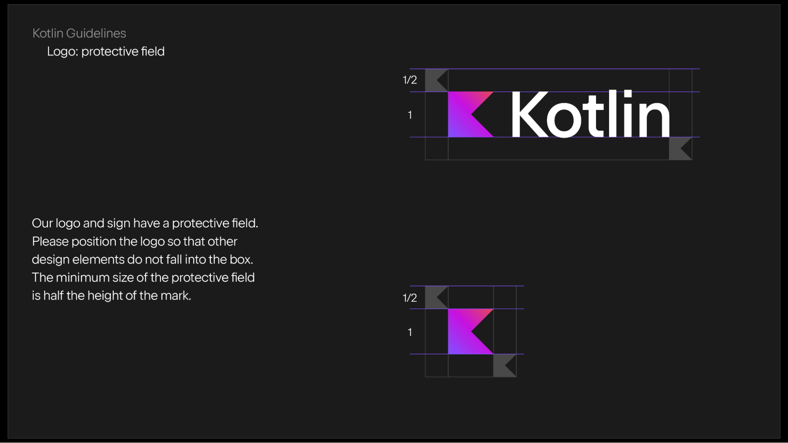

请特别注意以下关于标志使用的限制：

* 不要把图形符号与文字分开，也不要调换元素的位置。
* 不要改变标志的透明度。
* 不要给标志描边。
* 不要用第三方颜色重新给标志上色。
* 不要修改文字。
* 不要把标志放在复杂的背景上，也不要把标志放在明亮的背景前面。

[阅读 Kotlin 品牌使用指南](https://kotlinfoundation.org/guidelines/)。

## Kotlin 生态系统标志 {#kotlin-ecosystem-logos}

Kotlin 品牌包中还包含若干官方 Kotlin 生态系统项目、库、框架和技术的标志。这些资产遵循与 Kotlin 标志相同的视觉原则，有助于在整个生态系统中保持一致的形象。

该品牌包中包含以下标志：

* [Kotlin Foundation](https://kotlinfoundation.org)
* [Kotlin Multiplatform（KMP）](https://kotlinlang.org/multiplatform/)
* [Talking Kotlin](https://www.youtube.com/playlist?list=PLlFc5cFwUnmz1TwkP9SKCHU978dqLTANB)
* [Compose Multiplatform（CMP）](https://kotlinlang.org/compose-multiplatform/)
* [Compose Hot Reload](https://kotlinlang.org/docs/multiplatform/compose-hot-reload.html)
* [Ktor](https://ktor.io)
* [Exposed](https://www.jetbrains.com/exposed/)

你可以在同一个下载包中找到这些标志：

[下载所有版本](https://resources.jetbrains.com/storage/products/kotlin/docs/kotlin_logos.zip){:.typo-float-right.kto-button.kto-button_size_m.kto-button_mode_outline}

## Kotlin 吉祥物 {#kotlin-mascot}

来认识一下 Kodee，它是 Kotlin 的吉祥物，也是你友好的伙伴，时刻在那里鼓励和激发你的创造力。使用它时，请遵循这些[简单指南](https://resources.jetbrains.com/storage/products/kotlin/docs/Kotlin_Mascot_Guidelines.pdf)。

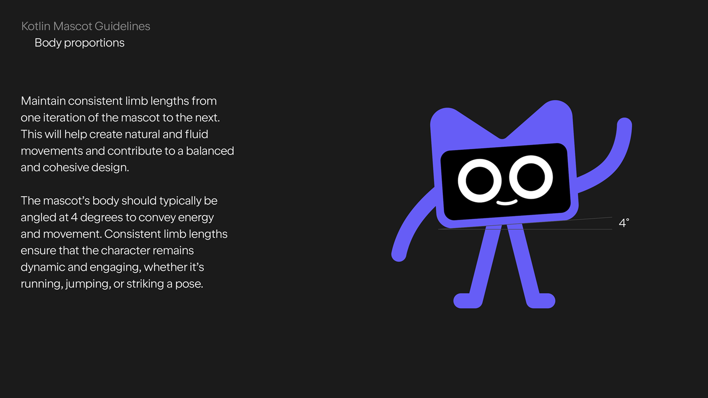

你可以在数字和印刷材料中使用 Kodee。为此，我们准备了各种 Kotlin 吉祥物素材供你下载和探索。

[下载所有素材](https://resources.jetbrains.com/storage/products/kotlin/docs/kotlin_mascot_2.zip){:.typo-float-right.kto-button.kto-button_size_m.kto-button_mode_outline}

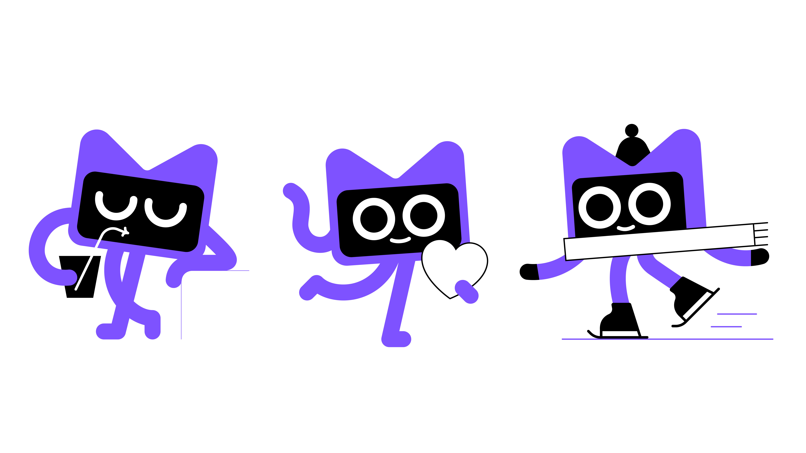

## Kotlin 用户组品牌资产 {#kotlin-user-group-brand-assets}

我们为 Kotlin 用户组提供了一款专门设计的标志，它易于辨识，并能体现与 Kotlin 的关联。

* 官方 Kotlin 标志与这门语言本身相关联，不应用在其他场景中，否则可能造成混淆。它的近似衍生标志也是如此。
* 用户组标志还意味着社区的观点和行动独立于 Kotlin 团队。
* 你的观点不必与我们一致，我们认为这才是打造富有创造力且强大社区的最有益模式。

[下载所有素材](https://drive.google.com/drive/folders/0B3Zi34svOj1RZ2sxZExhblRJc1k){:.typo-float-right.kto-button.kto-button_size_m.kto-button_mode_outline}

### 用户组样式 {#style-for-user-groups}

自 2017 年初 Kotlin 社区支持计划启动以来，用户组的数量成倍增长，每月大约有 2–4 个新用户组加入我们。请查看 **Kotlin 用户组**部分中的完整列表，找到你所在地区的一个用户组。

我们为新的 Kotlin 用户组提供用户组标志和头像。

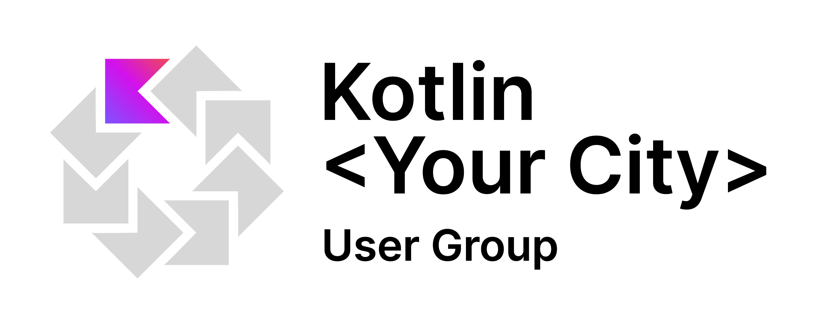

我们这样做主要有两个原因：

* 首先，我们收到了许多来自社区的请求，希望获得具有特殊 Kotlin 风格的品牌素材，以帮助它们被认定为官方的专门用户组。
* 其次，我们希望为用户组和社区内容提供一种独特的风格，以便清楚地分辨哪些 Kotlin 相关材料来自官方团队，哪些由社区创建。

### 创建你用户组的标志 {#create-the-logo-of-your-user-group}

要创建你用户组的标志：
1. 把 Kotlin 用户组的[标志文件](https://docs.google.com/drawings/d/1IcJp8Z2jAwEliXrHB-l9RNK_2LrqGTkNuPPtjrW1iIU/edit)复制到你的 Google Drive（你需要登录 Google 账号）。
2. 把 **Your City** 文字替换成你用户组的名称。
3. 下载图片，并将其用于用户组材料。

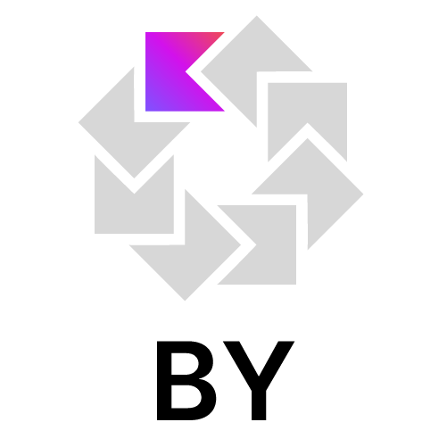

*白俄罗斯 Kotlin 用户组头像示例*

你可以下载一套[图形素材](https://drive.google.com/drive/folders/0B3Zi34svOj1RZ2sxZExhblRJc1k)，其中包括矢量图形和社交网络封面图示例。

### 为不同平台创建你用户组的头像 {#create-your-group-s-profile-picture-for-different-platforms}

要创建你用户组的头像：
1. 把 Kotlin 用户组头像[图片文件](https://docs.google.com/drawings/d/1buhwccmllb7wFS0OIAub0WC4DIuSHRiDpjEQhB4tkPs/edit)复制一份到你的 Google Drive（你需要登录 Google 账号）。
2. 添加用户组所在位置的缩写名称（按照我们的默认示例，最多 4 个大写字符）。
3. 下载图片，并将其用于你在 Facebook、Twitter 或任何其他平台上的头像。

### 创建 meetup.com 封面图 {#create-meetup-com-cover-photo}

要为 meetup.com 创建带有用户组标志的封面照片：
1. 把[图片文件](https://drive.google.com/file/d/1g_0Plf_do6vrXvy1R-Hx430vfV2CPVKN/view)复制一份到你的 Google Drive（你需要登录 Google 账号）。
2. 在图片右上角的标志中添加用户组所在位置的缩写名称。如果你想用自定义图片替换通用图案，请点击背景图案图片，选择“替换图片”，然后选择“从计算机上传”或任何其他来源。
3. 下载图片，并将其用于你在 [meetup.com](https://meetup.com) 上的头像。

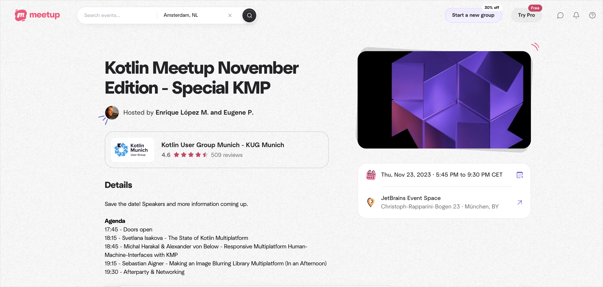

## Kotlin Night 品牌资产 {#kotlin-night-brand-assets}

JetBrains 为 Kotlin Night 活动提供品牌和素材。我们的团队会为活动宣传准备数字素材，并寄送包含贴纸和 T 恤的周边礼包。看看我们准备了什么，让你的 Kotlin Night 更加有趣！

[下载所有素材](https://drive.google.com/drive/folders/1wTJ-PiO6VvbY6XdACGLsWZ_N8KHI0Nvr){:.typo-float-right.kto-button.kto-button_size_m.kto-button_mode_outline}

### 社交媒体 {#social-media}

贴纸可以用于给 Kotlin Night 所需的任何媒介添加品牌元素。把它们贴到你能拿到的任何东西上吧，很有意思！

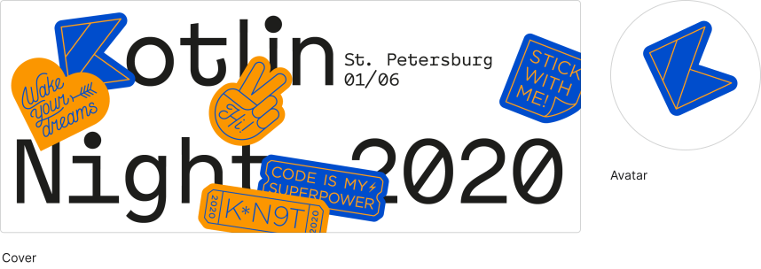

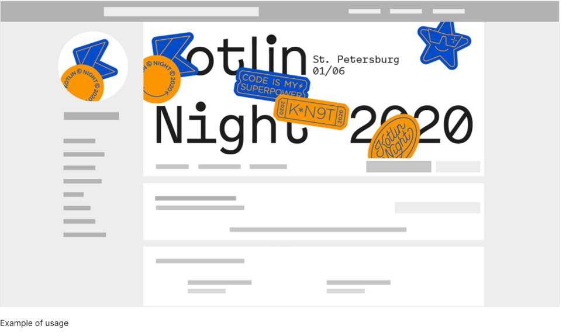

### 品牌贴纸 {#branding-stickers}

贴纸可以用来为 Kotlin Night 的素材添加品牌元素。把它们贴到你能拿到的任何东西上吧，很有趣！

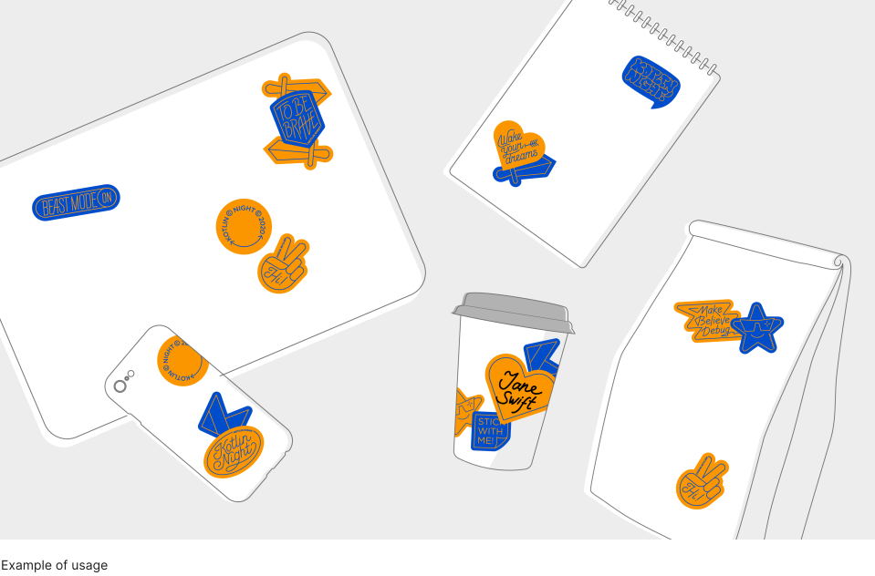

### 记者墙 {#press-wall}

你可以用贴纸装饰记者墙，拍出令人难忘的活动照片。

### 贴纸胸牌 {#sticky-badges}

把贴纸当作与会者的胸牌，促进活动中的交流！

### 贴纸留言板 {#board-for-stickers}

或者，你也可以提供一块留言板，让来宾把写着感想、反馈和祝愿的贴纸贴上去。

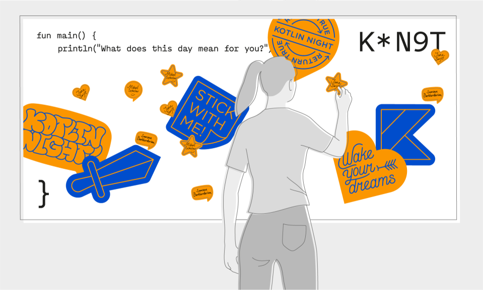

### T 恤 {#t-shirts}

活动来宾可以把贴纸贴在留言板上，写下他们对这次聚会的感想。这对你意味着什么呢？

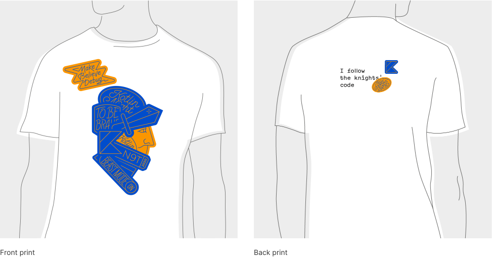
