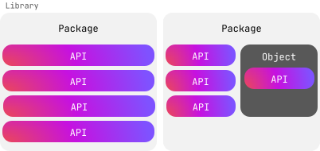

+++
title = "3.3.9 库与 API"
date = 2026-09-13T08:50:47+08:00
weight = 9
type = "docs"
description = ""
isCJKLanguage = true
draft = false
+++


> 原文链接: [https://kotlinlang.org/docs/kotlin-tour-intermediate-libraries-and-apis.html](https://kotlinlang.org/docs/kotlin-tour-intermediate-libraries-and-apis.html)

# 3.3.9 库与 API

要充分利用 Kotlin，请使用现成的库和 API，这样你就能把更多时间花在写代码上，而不是重复造轮子。

库分发可复用的代码，用来简化常见任务。库内部有包和对象，用来把相关的类、函数和工具组织在一起。库以函数、类或属性的形式对外暴露 API（应用程序编程接口），供开发者在自己的代码中使用。



我们来看看用 Kotlin 能做些什么。

## 标准库 {#the-standard-library}

Kotlin 有一个标准库，提供基础类型、函数、集合和工具，让你的代码简洁而富有表现力。标准库的很大一部分（[`kotlin` 包](https://kotlinlang.org/api/core/kotlin-stdlib/kotlin/)中的所有内容）在任何 Kotlin 文件中都可以直接使用，无需显式导入：

```kotlin
fun main() {
    val text = "emosewa si niltoK"

   // Use the reversed() function from the standard library
    val reversedText = text.reversed()

    // Use the print() function from the standard library
    print(reversedText)
    // Kotlin is awesome
}
```

不过，标准库中有些部分需要先导入才能在代码中使用。例如，如果你想使用标准库的时间测量功能，就需要导入 [`kotlin.time` 包](https://kotlinlang.org/api/core/kotlin-stdlib/kotlin.time/)。

在文件顶部添加 `import` 关键字，后面跟上你需要的包：

```kotlin
import kotlin.time.*
```

星号 `*` 是通配符导入，表示让 Kotlin 导入该包中的所有内容。你不能对伴生对象使用星号 `*`。相反，你需要显式声明想要使用的伴生对象成员。

例如：

```kotlin
import kotlin.time.Duration
import kotlin.time.Duration.Companion.hours
import kotlin.time.Duration.Companion.minutes

fun main() {
    val thirtyMinutes: Duration = 30.minutes
    val halfHour: Duration = 0.5.hours
    println(thirtyMinutes == halfHour)
    // true
}
```

这个示例：

* 导入了 `Duration` 类，以及它伴生对象中的 `hours` 和 `minutes` 扩展属性。
* 使用 `minutes` 属性把 `30` 转换成 30 分钟的 `Duration`。
* 使用 `hours` 属性把 `0.5` 转换成 30 分钟的 `Duration`。
* 检查这两个时长是否相等并打印结果。

### 动手之前先搜索 {#search-before-you-build}

在决定自己写代码之前，先查一下标准库，看看你要找的东西是否已经存在。下面列出了一些标准库已经为你提供了大量类、函数和属性的领域：

* [集合](https://kotlinlang.org/api/core/kotlin-stdlib/kotlin.collections/)
* [序列](https://kotlinlang.org/api/core/kotlin-stdlib/kotlin.sequences/)
* [字符串操作](https://kotlinlang.org/api/core/kotlin-stdlib/kotlin.text/)
* [时间管理](https://kotlinlang.org/api/core/kotlin-stdlib/kotlin.time/)

要了解标准库中还有哪些内容，可以浏览它的 [API 参考](https://kotlinlang.org/api/core/kotlin-stdlib/)。

## Kotlin 库 {#kotlin-libraries}

标准库涵盖了许多常见用法，但也有一些场景它并不涉及。幸运的是，Kotlin 团队和社区的其他成员开发了种类繁多的库来补充标准库。例如，[`kotlinx-datetime`](https://kotlinlang.org/api/kotlinx-datetime/) 可以帮助你在不同平台上管理时间。

你可以在我们的[搜索平台](https://klibs.io/)上找到有用的库。要使用它们，你需要做一些额外的工作，例如添加依赖或插件。每个库都有对应的 GitHub 仓库，其中有如何把它加入你的 Kotlin 项目的说明。

添加库之后，你就可以导入其中的任何包。下面是一个导入 `kotlinx-datetime` 包并在纽约查询当前时间的示例：

```kotlin
import kotlinx.datetime.*

fun main() {
    val now = Clock.System.now() // Get current instant
    println("Current instant: $now")

    val zone = TimeZone.of("America/New_York")
    val localDateTime = now.toLocalDateTime(zone)
    println("Local date-time in NY: $localDateTime")
}
```

这个示例：

* 导入 `kotlinx.datetime` 包。
* 使用 `Clock.System.now()` 函数创建一个包含当前时间的 `Instant` 类实例，并把结果赋给 `now` 变量。
* 打印当前时间。
* 使用 `TimeZone.of()` 函数查找纽约所在的时区，并把结果赋给 `zone` 变量。
* 在包含当前时间的实例上调用 `.toLocalDateTime()` 函数，并以纽约时区作为参数。
* 把结果赋给 `localDateTime` 变量。
* 打印按纽约时区调整后的时间。

> **提示：** 要更详细地了解这个示例用到的函数和类，请参阅 [API 参考](https://kotlinlang.org/api/kotlinx-datetime/kotlinx-datetime/kotlinx.datetime/)。

## 选择启用 API {#opt-in-to-apis}

库的作者可能会把某些 API 标记为需要先选择启用，才能在代码中使用。他们通常在 API 仍在开发中、将来可能发生变化时这样做。如果你没有选择启用，就会看到这样的警告或错误：

```text
This declaration needs opt-in. Its usage should be marked with '@...' or '@OptIn(...)'
```

要选择启用，请写 `@OptIn`，后面的圆括号中包含用来给该 API 分类的类名，类名之后跟两个冒号 `::` 和 `class`。

例如，标准库中的 `uintArrayOf()` 函数属于 `@ExperimentalUnsignedTypes`，如 [API 参考](https://kotlinlang.org/api/core/kotlin-stdlib/kotlin.collections/to-u-int-array.html)中所示：

```kotlin
@ExperimentalUnsignedTypes
inline fun uintArrayOf(vararg elements: UInt): UIntArray
```

在你的代码中，选择启用看起来是这样的：

```kotlin
@OptIn(ExperimentalUnsignedTypes::class)
```

下面是一个选择启用后使用 `uintArrayOf()` 函数创建无符号整数数组并修改其中某个元素的示例：

```kotlin
@OptIn(ExperimentalUnsignedTypes::class)
fun main() {
    // Create an unsigned integer array
    val unsignedArray: UIntArray = uintArrayOf(1u, 2u, 3u, 4u, 5u)

    // Modify an element
    unsignedArray[2] = 42u
    println("Updated array: ${unsignedArray.joinToString()}")
    // Updated array: 1, 2, 42, 4, 5
}
```

这是最简单的选择启用方式，但还有别的方式。要了解更多内容，请参阅[选择启用要求](../../../libraryguides/9.1-Standardlibrary/9.1.3-OptInRequirements/)。

## 练习 {#practice}

### 习题 1 {#exercise-1}

你正在开发一个帮助用户计算投资未来价值的金融应用。计算复利的公式是：

A = P × (1 + r/n)^(nt)

其中：

* `A` 是计息后累积的金额（本金 + 利息）。
* `P` 是本金（初始投资额）。
* `r` 是年利率（小数形式）。
* `n` 是每年计算复利的次数。
* `t` 是资金投资的时长（以年为单位）。

请修改代码以：

1. 从 [`kotlin.math` 包](https://kotlinlang.org/api/core/kotlin-stdlib/kotlin.math/)导入必要的函数。
2. 为 `calculateCompoundInterest()` 函数添加函数体，计算应用复利后的最终金额。

```kotlin
// Write your code here

fun calculateCompoundInterest(P: Double, r: Double, n: Int, t: Int): Double {
    // Write your code here
}

fun main() {
    val principal = 1000.0
    val rate = 0.05
    val timesCompounded = 4
    val years = 5
    val amount = calculateCompoundInterest(principal, rate, timesCompounded, years)
    println("The accumulated amount is: $amount")
    // The accumulated amount is: 1282.0372317085844
}

```

```kotlin
import kotlin.math.*

fun calculateCompoundInterest(P: Double, r: Double, n: Int, t: Int): Double {
    return P * (1 + r / n).pow(n * t)
}

fun main() {
    val principal = 1000.0
    val rate = 0.05
    val timesCompounded = 4
    val years = 5
    val amount = calculateCompoundInterest(principal, rate, timesCompounded, years)
    println("The accumulated amount is: $amount")
    // The accumulated amount is: 1282.0372317085844
}
```

**示例解答**

### 习题 2 {#exercise-2}

你想测量程序中执行多个数据处理任务所花费的时间。请修改代码，从 [`kotlin.time`](https://kotlinlang.org/api/core/kotlin-stdlib/kotlin.time/) 包中添加正确的导入语句和函数：

```kotlin
// Write your code here

fun main() {
    val timeTaken = /* Write your code here */ {
        // Simulate some data processing
        val data = List(1000) { it * 2 }
        val filteredData = data.filter { it % 3 == 0 }

        // Simulate processing the filtered data
        val processedData = filteredData.map { it / 2 }
        println("Processed data")
    }

    println("Time taken: $timeTaken") // e.g. 16 ms
}
```

```kotlin
import kotlin.time.measureTime

fun main() {
    val timeTaken = measureTime {
        // Simulate some data processing
        val data = List(1000) { it * 2 }
        val filteredData = data.filter { it % 3 == 0 }

        // Simulate processing the filtered data
        val processedData = filteredData.map { it / 2 }
        println("Processed data")
    }

    println("Time taken: $timeTaken") // e.g. 16 ms
}
```

**示例解答**

### 习题 3 {#exercise-3}

最新版 Kotlin 的标准库中有一个新特性，你想试用一下，但它需要选择启用。这个特性属于 [`@ExperimentalStdlibApi`](https://kotlinlang.org/api/core/kotlin-stdlib/kotlin/-experimental-stdlib-api/)。在你的代码中，选择启用应该怎么写？

```kotlin
@OptIn(ExperimentalStdlibApi::class)
```

**示例解答**

## 接下来做什么？ {#what-s-next}

恭喜！你已经完成了进阶导览！你愿意[分享你的反馈](https://surveys.hotjar.com/bf4ce865-99ce-4fc1-b107-e9b16bc31592)吗？

下一步，可以看看我们针对常见 Kotlin 应用的教程：

* [用 Spring Boot 和 Kotlin 创建后端应用](../../../development/6.1-Backenddevelopment/6.1.7-Createawebappwithkotlinandspringboot/6.1.7.2-JvmCreateProjectWithSpringBoot/)
* 从零开始为 Android 和 iOS 创建跨平台应用，并：
* [共享业务逻辑，同时保持原生界面](https://kotlinlang.org/docs/multiplatform/multiplatform-create-first-app.html)
* [共享业务逻辑与界面](https://kotlinlang.org/docs/multiplatform/compose-multiplatform-create-first-app.html)

**另请参阅**

[上一步](../3.3.8-KotlinTourIntermediateNullSafety/)
