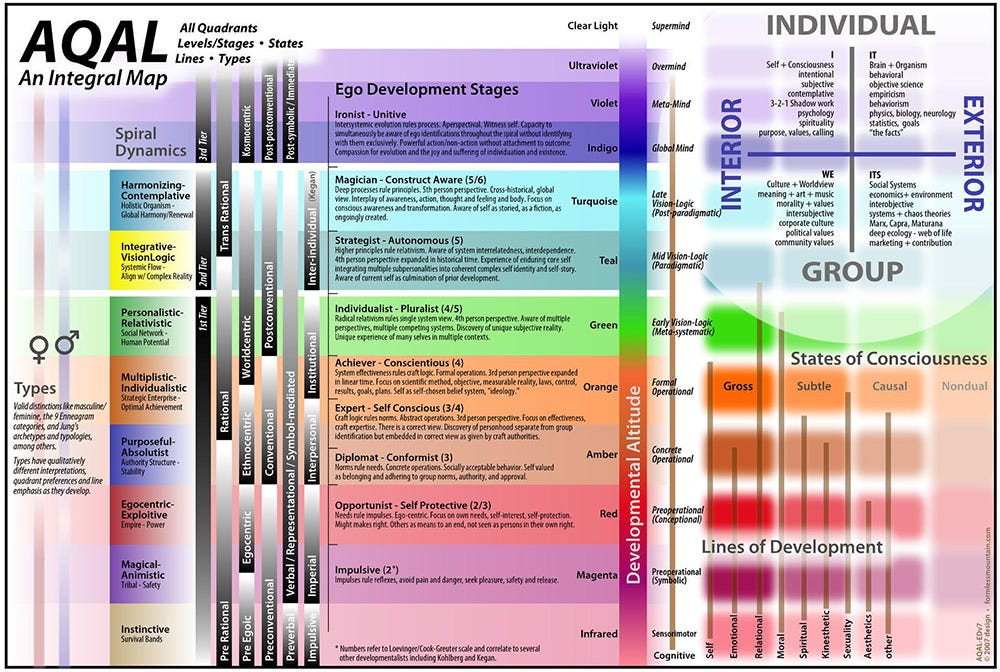
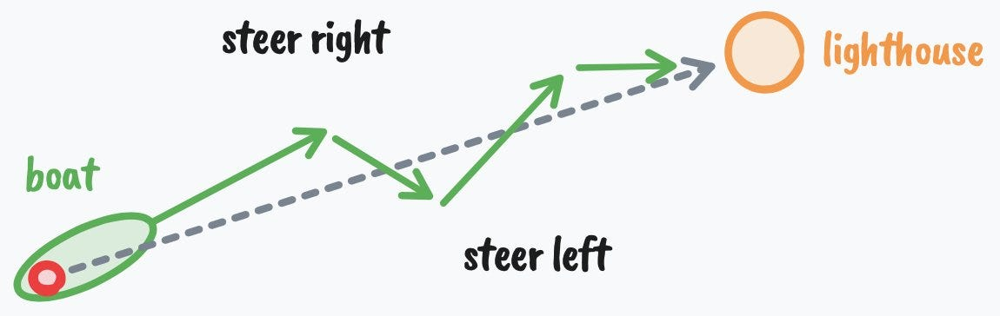

+++
title = "How to fix your entire life in 1 day"
date = 2026-04-12T10:23:29+08:00
weight = 1
type = "docs"
description = ""
isCJKLanguage = true
draft = false

+++

> 原文: [https://letters.thedankoe.com/p/how-to-fix-your-entire-life-in-1](https://letters.thedankoe.com/p/how-to-fix-your-entire-life-in-1)

# How to fix your entire life in 1 day
# 如何在1天内修复你整个人生

### do this before 2026
### 在2026年之前完成这件事

[DAN KOE](https://substack.com/@thedankoe)

Dec 24, 2025
2025年12月24日

---

> You're probably going to quit your new years resolution.
>
> And that's okay. Most people do (studies show 80-90% failure rates) because most people don't actually want to change on a deep, internal level. That is, they go about changing their life in the completely wrong way. They create a new years resolution because everyone else does – humans want to impress others more than they want to impress themselves... we create a superficial meaning out of status games – but they don't meet the requirements for true change, which goes a lot deeper than convincing yourself you're going to be more disciplined or productive this year.

【译文】  
你很可能也会放弃你的新年决心。

这没关系。大多数人都会如此（研究显示失败率高达80-90%），因为大多数人并没有在深层的、内在的层面上真正想要改变。也就是说，他们试图改变生活的方式完全错了。他们制定新年决心，只是因为别人都这么做——人类取悦他人的欲望往往强于取悦自己……我们从地位博弈中创造出肤浅的意义——但这些做法无法满足真正改变所需的条件，而真正的改变远比"说服自己今年要更自律或更高效"要深刻得多。

---

> I'm not here to talk down on you. I've quit 10 times more goals than I've set. I think that should be the case for most people. But the fact that people try to change their lives and utterly fail almost every time holds true. So much so that it's a meme for the gym to be crowded during January and return back to normal in February.

【译文】  
我并非要贬低你。我放弃的目标数量，是我设定目标的十倍。我认为对大多数人来说本该如此。但事实是，人们试图改变人生却几乎每次都彻底失败，这一点千真万确。以至于"一月健身房人满为患，二月恢复常态"已经成了一个网络梗。

---

> However, as much as I think new years resolutions are stupid, it's always wise to reflect on the life you hate so you can launch yourself toward something that much better, as we will discuss.

【译文】  
然而，尽管我认为新年决心很愚蠢，但反思你所厌恶的生活，从而将自己推向更美好的境地，这始终是明智之举——这正是我们将要探讨的内容。

---

> Human nature is a b*tch, and the worst feeling is when you make a promise to yourself and can't help but break it. You start to feel helpless, and if you don't know what you're doing, you may continue the cycle for years on end: always wanting to change, but never being able to.

【译文】  
人性很棘手，最糟糕的感受莫过于：你向自己许下承诺，却忍不住亲手打破它。你开始感到无助，如果你不清楚自己在做什么，这种循环可能会年复一年地持续下去：总是渴望改变，却永远无法做到。

---

> So whether you want to start the business, transform your body, or take the risk toward a more meaningful life without quitting after 2 weeks, I want to share 7 ideas you probably haven't heard before on behavior change, psychology, and productivity so you can do just that in 2026.

【译文】  
所以，无论你想创业、重塑身材，还是冒险追求更有意义的人生而不想在两周后就放弃，我想分享7个你可能从未听过的、关于行为改变、心理学和效率的理念，帮助你在2026年真正实现这些目标。

---

> This will be comprehensive.
>
> This isn't one of those letters that you read through and forget about.
>
> This is something you will want to bookmark, take notes on, and set aside time to think about.
>
> The protocol at the end – to dig deep into your psyche and uncover what you truly want in life – will take about a full day to complete, with effects that last far longer than that.
>
> All I ask is that you dedicate your full attention to this. If you get bored skip to the next section and go back to fill in the blanks if you need to.
>
> Let's begin.

【译文】  
本文将非常全面。

这不是一封你读过就会忘记的邮件。

这是一篇你值得收藏、做笔记、并专门抽出时间深入思考的内容。

文末的实操方案——深入挖掘你的潜意识，探寻你真正想要的人生——大约需要一整天来完成，但其影响将远超这一天。

我唯一的请求是：请全身心投入。如果感到枯燥，可以跳到下一节，需要时再回头补充。

我们开始吧。

---

> (I also turned this letter into a video if you would rather watch it)
>
> 

【译文】  
（如果你更倾向于观看视频，我也将这封信制作成了视频）

---

### I – You aren't where you want to be because you aren't the person who would be there
### 一、你未达理想之境，因为你尚未成为那个本该抵达的人

> When it comes to New Year's resolutions, people only focus on one of the two requirements for success:
>
> 1. Changing your actions to make progress toward the goal (least important, second order)
> 2. Changing who you are so that your behavior naturally follows (most important, first order)

【译文】  
谈到新年决心，人们往往只关注成功所需的两个条件之一：

1. 改变行动以朝着目标前进（次要，二阶因素）  
2. 改变你是谁，使行为自然随之改变（核心，一阶因素）

---

> Most people set a surface-level goal, hype themselves up to remain disciplined for the first few weeks, then go back to their old ways without much struggle, because they were trying to build a great life on a rotting foundation.

【译文】  
大多数人设定一个表面化的目标，靠自我激励在前几周保持自律，然后毫不费力地回到老路上——因为他们试图在腐朽的地基上建造美好人生。

---

> If this doesn't make sense, let's run through an example.
>
> Think of somebody successful. It can be a bodybuilder with a great physique, a founder/CEO worth hundreds of millions, or a charismatic dude who can chat up a group without a shred of anxiety entering his mind space.
>
> Do you think the bodybuilder has to "grind" to eat healthy? Does the CEO have to discipline themselves to show up and lead the team? To you, it may seem like that on the surface, but the truth is that *they can't see themselves living any other way.* The bodybuilder has to grind to eat **unhealthily**. The CEO has to force themself to lie in bed past their alarm clock, and they hate every second of it.

【译文】  
如果这听起来抽象，我们来看一个例子。

想想某个成功的人。可以是一位身材健美的健美运动员，一位身价数亿的创始人/CEO，或是一位魅力十足、能在人群中谈笑风生而毫无焦虑的人。

你认为那位健美运动员需要"咬牙坚持"才能健康饮食吗？那位CEO需要靠自律才能准时出现、带领团队吗？在你看来，表面或许如此，但真相是：*他们无法想象自己以其他方式生活*。那位健美运动员需要"咬牙坚持"才能吃得不健康。那位CEO需要强迫自己赖床超过闹钟时间，而且每一秒都倍感煎熬。

---

> To some people, my own lifestyle seems a bit extreme and disciplined. To me, it's natural, and I don't say that to contrast it with any other kind of lifestyle. I simply enjoy living this way. When my mom tells me that I should take a break, go out, and have some fun... I hold my tongue from telling her, "If I weren't having fun, why would I be doing what I'm doing?"

【译文】  
对某些人而言，我的生活方式似乎有些极端和自律。但对我而言，这很自然——我这么说并非为了贬低其他生活方式。我只是单纯享受这样生活。当我妈妈告诉我应该休息一下、出去玩玩、找点乐子时……我忍住没对她说："如果我不快乐，我为什么要做我正在做的事？"

---

> Do not take this next sentence lightly.
>
> If you want a specific outcome in life, you must have the *lifestyle* that creates that outcome long before you reach it.

【译文】  
请认真对待下一句话。

如果你想要人生中的某个特定结果，你必须在抵达之前很久，就拥有能够创造该结果的*生活方式*。

---

> If someone says they want to lose 30 pounds, I often don't believe them. Not because I don't think they are capable, but because there are too many times when that same person says "they can't wait until they're done losing weight so they can start to enjoy life again." I hate to break it to you, but if you don't adopt the lifestyle that led to you losing the weight, for life, and find a *reason with a higher gravitational pull* than the one tying you to your previous ways, then you will go straight back to where you started, and you can unhappily say that you wasted the resource you will never get back: time.

【译文】  
如果有人说他想减掉30磅，我往往不相信。不是因为我怀疑他的能力，而是因为太多时候，同一个人在说完这话后又说"等减完肥我就能重新享受生活了"。很抱歉告诉你真相：如果你不终身采纳那个让你瘦下来的生活方式，并找到一个*引力更强*的理由（强过将你束缚于旧习惯的那个理由），那么你最终会直接回到起点，然后痛苦地承认：你浪费了那个永远无法挽回的资源——时间。

---

> When you truly change yourself, all of your habits that don't move the needle toward your goal become disgusting, because you have a deep and profound awareness of what kind of life those actions compound into. You are okay with your current standards because you are not fully aware of what they are or what they lead to. We will discuss how to uncover this, but we need to build up to that.

【译文】  
当你真正改变自己时，所有无法推动你朝向目标的习惯都会变得令人厌恶，因为你已深刻意识到：那些行为长期累积会导向何种人生。你之所以能接受当前的标准，是因为你尚未充分认知它们是什么、会引向何方。我们将探讨如何揭示这一点，但需要先打好基础。

---

> You say you want to change. You say you want to "become financially free" and "get healthy," but your actions show otherwise for a reason. And it goes a lot deeper than you think.

【译文】  
你说你想改变。你说你想"实现财务自由"、"变得健康"，但你的行为却显示出相反的信号——这背后有原因，而且原因远比你想的更深层。

---

### II – You aren't where you want to be because you don't *want* to be there
### 二、你未达理想之境，因为你并非真正*想要*抵达那里

> Trust only movement. Life happens at the level of events, not of words. Trust movement.
>
> – Alfred Adler

【译文】  
只相信行动。人生发生在事件的层面，而非言语的层面。相信行动。
——阿尔弗雷德·阿德勒

---

> If you want to change who you are, you must understand *how the mind works* so that you can start to reprogram it.
>
> The first step to understanding the mind is to understand that all behavior is goal-oriented. When you think about it, this is kinda obvious, but when we dig into it, most people don't want to hear it.

【译文】  
如果你想改变你是谁，你必须理解*心智如何运作*，才能开始重新编程它。

理解心智的第一步，是认识到：所有行为都是目标导向的。仔细想想，这似乎显而易见；但深入探究时，大多数人并不愿听这个真相。

---

> You take a step forward because you want to reach a certain location.
>
> You scratch your nose because you want to make the itch go away.
>
> Those ones are clear, but most of the time, your goals are unconscious. You may not realize that when you sit on the couch in the middle of the day, you are trying to burn time before your next responsibility, as one simple example.

【译文】  
你向前迈一步，是因为你想抵达某个地点。

你挠鼻子，是因为你想消除痒感。

这些例子很清晰，但大多数时候，你的目标是无意识的。你可能没意识到：当你中午坐在沙发上时，你其实是在消磨时间、等待下一项责任到来——这只是一个简单的例子。

---

> On an even more unconscious and complex level, you pursue goals that can harm you, but you justify your actions in a way that is socially acceptable and doesn't make you seem like a loser.

【译文】  
在更深层、更复杂的无意识层面，你追求的目标甚至可能伤害你，但你会用社会可接受的方式为自己的行为辩护，让自己看起来不像个失败者。

---

> As an example, if you can't stop procrastinating your work, you may justify it with the fact that you "lack discipline," but in reality, you are attempting to achieve a goal like you always are. In this case, that goal could be to *protect yourself from the judgment that comes from finishing and sharing your work.*

【译文】  
举个例子：如果你无法停止拖延工作，你可能会用"我缺乏自律"来为自己辩护；但事实上，你像往常一样，仍在试图达成某个目标。在这种情况下，那个目标可能是：*保护自己免受完成并分享作品后可能遭遇的评判*。

---

> If you say you want to quit your dead-end job, but stay in it without any real reason, you may start to think you don't have enough courage, or that you were never really a "risk taker," but the truth is that you are pursuing the goal of safety, predictability, and an excuse to not look like a failure to everyone else in your life who also works a dead-end job.

【译文】  
如果你说想辞掉那份毫无前途的工作，却毫无理由地继续留着，你可能会开始认为自己缺乏勇气，或从来就不是一个"敢于冒险的人"；但真相是：你真正追求的目标是安全、可预测性，以及一个借口——让你在那群同样做着无前途工作的人面前，看起来不像个失败者。

---

> The lesson here is that real change requires changing your goals.
>
> I don't mean *setting* some surface level goal *because the act of doing that serves an unconscious goal that is actually harming you*. That's been ran through enough in the productivity space. I mean changing your *point of view.* Because that's what a goal is. A goal is a projection into the future that acts as a lens of perception which allows you to notice information, ideas, and resources that aid in you achieving that goal.

【译文】  
这里的教训是：真正的改变需要改变你的目标。

我不是指*设定*某个表面化的目标——*因为设定行为本身可能服务于一个实际上在伤害你的无意识目标*。这类讨论在效率领域已经够多了。我指的是改变你的*视角*。因为目标的本质就是如此：目标是对未来的投射，它作为一种感知透镜，让你能够注意到有助于实现该目标的信息、想法和资源。

---

> Now let's dig a bit deeper, because if you don't understand this, it only becomes more difficult to get out.

【译文】  
现在让我们再深入一点，因为如果你不理解这一点，想要脱困只会更加困难。

---

### III – You aren't where you want to be because you're afraid to be there
### 三、你未达理想之境，因为你害怕抵达那里

> The important thing for you to remember is that it does not matter in the least how you got the idea or where it came from. You may never have met a professional hypnotist. You may never have been formally hypnotized. But if you have accepted an idea - from yourself, your teachers, your parents, friends, advertisements, from any other source - and further, if you are firmly convinced that idea is true, it has the same power over you as the hypnotist's words have over the hypnotized subject.
>
> – Maxwell Maltz

【译文】  
你需要记住的关键是：你如何获得某个想法、它来自何处，这些都完全不重要。你可能从未见过专业催眠师，也从未被正式催眠过。但如果你接受了一个想法——无论它来自你自己、老师、父母、朋友、广告，或任何其他来源——并且，如果你坚信这个想法为真，那么它对你的影响力，就与催眠师的话语对受催眠者的影响力完全相同。
——马克斯韦尔·马尔茨

---

> Here's how you've become who you are today, and how you will become who you will be tomorrow. This is the anatomy of identity:
>
> 1. You want to achieve a goal
> 2. You perceive reality through the lens of that goal
> 3. You only notice "important" information and ideas that allows you to achieve that goal (learning)
> 4. You act toward that goal and receive feedback that you are progressing toward it
> 5. You repeat that behavior until it becomes automatic and unconscious (conditioning)
> 6. That behavior becomes a part of who you think you are ("I am the type of person who...")
> 7. You defend your identity to maintain psychological consistency
> 8. Your identity shapes new goals, restarting the cycle, and if that identity is disadvantageous toward a good life, this gets bad very quick

【译文】  
以下是你如何成为今天的你，以及你将如何成为明天的你。这是"身份"的解剖结构：

1. 你想要达成一个目标  
2. 你通过该目标的透镜感知现实  
3. 你只注意到那些有助于实现该目标的"重要"信息和想法（学习）  
4. 你朝该目标行动，并收到"正在进展中"的反馈  
5. 你重复该行为，直到它变得自动且无意识（条件反射）  
6. 该行为成为你自我认知的一部分（"我是那种会……的人"）  
7. 你捍卫自己的身份，以维持心理一致性  
8. 你的身份塑造新目标，重启循环；如果该身份不利于美好生活，情况会迅速恶化

---

> The unfortunate reality is that you must break the cycle between steps 6 and 7, but this process starts when you are a child.
>
> You have the goal of survival.
>
> You are dependent on your parents to teach you how to survive. You had to conform. And since the way most people teach is through reward and punishment, unless you adopt their beliefs and values, you will be punished. You don't actually think for yourself until you see through this.

【译文】  
不幸的现实是：你必须打破第6步与第7步之间的循环，但这一过程始于童年。

你最初的目标是生存。

你依赖父母教你如何生存。你不得不顺从。而由于大多数人通过奖励与惩罚来教导，除非你采纳他们的信念与价值观，否则你会受到惩罚。在你看透这一点之前，你实际上从未真正为自己思考。

---

> But your parents have also gone through this process throughout their entire lives. That's where it can get dangerous. Your parents, unless they broke the pattern themselves, were conditioned by the culturally accepted ideas of success from the Industrial age. They also carry the best and worst conditioning from their parents and their parents' parents.

【译文】  
但你的父母也终其一生经历了同样的过程。这正是危险所在。你的父母，除非他们自己打破了这一模式，否则都被工业时代文化中公认的成功观念所条件化。他们也承载着来自祖辈的最优与最劣的条件反射。

---

> To take it a layer deeper, once you fulfill your physical survival needs (which is quite easy to do in today's world, you're practically born into safety), you start to survive on the conceptual or ideological level. You may not try to protect and reproduce your body, but you absolutely protect and reproduce your mind. It's not difficult to see the war of ideas on the internet, and the participants are individual and group identities.

【译文】  
再深入一层：一旦你满足了生理生存需求（在当今世界这相当容易，你几乎生来就处于安全之中），你便开始在概念或意识形态层面"生存"。你可能不再试图保护和繁衍你的身体，但你绝对会保护和繁衍你的心智。互联网上的观念之战不难察觉，而参与者正是个体身份与群体身份。

---

> When your body feels threatened, you go into fight or flight.
>
> When your identity feels threatened, the same thing happens.

【译文】  
当你的身体感到威胁时，你会进入战斗或逃跑模式。

当你的身份感到威胁时，同样的事情也会发生。

---

> If you are heavily identified with a political ideology (by the process we talked about just before), you will feel threatened when someone challenges your beliefs. You literally feel the stress. You feel, emotionally, like you were just slapped in the face. Since most people don't analyze their emotions for truth, you tend to get stuck in echo chambers and double down on claims that harm yourself and others.

【译文】  
如果你强烈认同某种政治意识形态（通过我们刚才讨论的过程），当有人挑战你的信念时，你会感到威胁。你真切地感受到压力。在情绪上，你感觉就像刚被扇了一记耳光。由于大多数人不会分析情绪以探寻真相，你往往会陷入信息茧房，并加倍坚持那些伤害自己和他人的主张。

---

> If you were raised in a religious household, and did not think for yourself, you will fight and attack others who threaten your psychological safety within that little bubble.

【译文】  
如果你在宗教家庭中长大，且从未为自己思考，你会攻击那些威胁你在该小圈子中心理安全的人。

---

> The same thing happens when you unconsciously see yourself as a lawyer, a gamer, or somebody else who would not take the actions to achieve a better life.

【译文】  
当你无意识地将自己视为律师、游戏玩家，或其他不会采取行动追求更好生活的人时，同样的事情也会发生。

---

### IV – The life you want lies within a specific level of mind
### 四、你渴望的人生，存在于心智的特定层级之中

> The mind evolves through predictable stages over time.
>
> When you're born, you're like a little survival sponge that absorbs whatever beliefs you can (which are heavily dictated by your culture) so that you can feel safe and secure. And if you don't be careful, your mind may crystalize and it may make it difficult to live a meaningful life.

【译文】  
心智会随着时间，通过可预测的阶段逐步演化。

当你出生时，你就像一块小小的生存海绵，吸收任何你能获取的信念（这些信念很大程度上由你的文化决定），以便感到安全与稳固。如果你不小心，你的心智可能会固化，从而难以过上富有意义的人生。

---

> This has been documented enough in models like Maslow's Hierarchy, Greuter's stages of ego development, and Spiral Dynamics, each building off of one another, but it's also not difficult to observe in society.

【译文】  
这一点已在马斯洛需求层次、格鲁特自我发展阶段、螺旋动力学等模型中得到充分记录，各模型相互借鉴；同时，在社会中观察这一现象也并不困难。

---

> I've talked about these many times, and synthesized them into my own [Human 3.0 model](https://letters.thedankoe.com/p/human-30-a-map-to-reach-the-top-1?lli=1), but here's the 80/20 of the 9 stages of ego development as a refresher (because repetition helps reveal things you didn't notice before, and there are new people reading these letters):

【译文】  
我已多次探讨这些内容，并将其整合为我自己的[人类3.0模型](https://letters.thedankoe.com/p/human-30-a-map-to-reach-the-top-1?lli=1)。以下是9个自我发展阶段的80/20精简版，供你回顾（因为重复有助于揭示你之前未注意到的细节，而且有新读者正在阅读这些内容）：

---

---

> 1. **Impulsive** — No separation between impulse and action. Black and white thinking. *I.e. A toddler hits when angry because the feeling and the behavior are the same thing.*
> 2. **Self-Protective** — The world is dangerous and you learn to look out for yourself. *I.e. A kid learns to hide report cards, lie about chores, and figure out what adults want to hear.*
> 3. **Conformist** — You are your group and its rules feel like reality itself. *I.e. Someone who genuinely cannot fathom why anyone would vote differently than their family or group.*
> 4. **Self-Aware** — You notice you have an inner life that doesn't match the exterior. *I.e. Sitting in church and realizing you're not sure you believe what everyone around you seems to believe, but not knowing what to do with that feeling yet.*
> 5. **Conscientious** — You build your own system of principles and hold yourself accountable to them. *I.e. Leaving your family's religion after careful study and adopting a personal philosophy you can defend, or building a career plan with clear milestones because you believe the right effort yields the right results.*
> 6. **Individualist** — You see that your principles were shaped by context and start holding them more loosely. *I.e. Realizing your political views have more to do with where you grew up than objective truth, or noticing that your ambitious career goals were really about earning your father's approval.*
> 7. **Strategist** — You work with systems while aware of your own involvement in them. *I.e. Leading an organization while actively questioning your own blind spots, or engaging in politics knowing your perspective is partial and shaped by bias you can't fully see.*
> 8. **Construct-Aware** — You see all frameworks, including your identity, as useful fictions. *I.e. Holding your spiritual beliefs with metaphorically not literally, knowing the map is not the territory, or watching yourself play the role of "founder" or "thought leader" with a kind of gentle amusement.*
> 9. **Unitive** — Separation between self and life dissolves. *I.e. Work, rest, and play feel like the same thing. There's no one left who needs to become something, just presence responding to what arises.*

【译文】  
1. **冲动型**——冲动与行动无分离。非黑即白的思维。*例如：幼儿生气时会打人，因为感受与行为是同一件事。*  
2. **自我保护型**——世界是危险的，你学会为自己打算。*例如：孩子学会藏起成绩单、在家务上撒谎、揣摩大人想听什么。*  
3. **从众型**——你就是你的群体，其规则感觉如同现实本身。*例如：有人真心无法理解为何有人会投票支持与其家庭或群体不同的选项。*  
4. **自我觉察型**——你注意到自己有一个与外在表现不符的内在世界。*例如：坐在教堂里，意识到自己不确定是否相信周围人似乎都相信的东西，但尚不知如何处理这种感受。*  
5. **尽责型**——你建立自己的原则体系，并对自己负责。*例如：经过深入研究后脱离家族宗教，采纳一套自己能够捍卫的个人哲学；或制定有清晰里程碑的职业规划，因为你相信正确的努力会带来正确的结果。*  
6. **个体主义型**——你看到自己的原则受情境塑造，开始更灵活地持有它们。*例如：意识到自己的政治观点更多与成长地相关，而非客观真理；或注意到自己雄心勃勃的职业目标，其实是为了赢得父亲的认可。*  
7. **策略型**——你在系统中工作，同时意识到自己身处其中。*例如：领导一个组织时主动质疑自己的盲点；或参与政治时，明知自己的视角是局部的、受你无法完全察觉的偏见所塑造。*  
8. **建构觉察型**——你将所有框架（包括你的身份）视为有用的虚构。*例如：以隐喻而非字面方式持有精神信念，知道地图不等于疆域；或以一种温和的幽默感，观察自己扮演"创始人"或"思想领袖"的角色。*  
9. **合一型**——自我与生命之间的分离消解。*例如：工作、休息与玩乐感觉是同一件事。不再有人需要"成为什么"，只有临在回应着当下发生的一切。*

---

> For most people reading this, I would assume you hover between 4 and 8, which is a huge gap. Those closer to 8 are reading this are doing so to either learn something or pass time. Those closer to 4 are really looking for a change. You feel like you are meant for more, but you can't make sense of everything yet, because there's obviously a lot at play.

【译文】  
对大多数阅读本文的读者，我推测你处于第4至第8阶段之间——这是一个巨大的跨度。更接近第8阶段的读者，阅读是为了学习新知或消磨时间；更接近第4阶段的读者，则真正在寻求改变。你感觉自己注定成就更多，但尚无法理清一切，因为显然有太多因素在起作用。

---

> The good thing is, it doesn't really matter what stage you are in, because moving through any of them follows a pattern.

【译文】  
好消息是：你处于哪个阶段其实并不重要，因为穿越任何阶段都遵循同一模式。

---

### V – Intelligence is the ability to get what you want out of life
### 五、智力，就是从人生中获得你想要之物的能力

> The only real test of intelligence is if you get what you want out of life.
>
> – Naval Ravikant

【译文】  
衡量智力的唯一真实标准，是你能否从人生中获得你想要之物。
——纳瓦尔·拉维坎特

---

> There is a formula for success.
>
> One ingredient is **agency**.
>
> One ingredient is **opportunity** (which many people like to mistake as "privilege" - because they the other ingredients).
>
> The last ingredient is **intelligence**.

【译文】  
成功有一个公式。

其中一个要素是**能动性**（agency）。

一个要素是**机会**（许多人喜欢将其误认为"特权"——因为他们忽略了其他要素）。

最后一个要素是**智力**。

---

> If you have high agency but low opportunity, it doesn't matter how likely you are to act toward a goal, because it isn't a goal that will bear much fruit.
>
> If you have opportunity and agency but low intelligence, then you will never be fully able to benefit from that opportunity.

【译文】  
如果你能动性很高但机会很少，那么你朝目标行动的可能性再高也无济于事，因为那不是一个能结出硕果的目标。

如果你有机会和能动性但智力不足，那么你将永远无法充分受益于那个机会。

---

> First, we've talked about agency before here. In terms of opportunity, I can't tell you to change your physical location, but if you don't see the abundance of digital opportunity right in front of you, I don't know what to tell you.

【译文】  
首先，我们之前已讨论过能动性。关于机会，我无法建议你改变物理位置；但如果你看不见眼前丰富的数字机遇，我也不知道该说什么了。

---

> With that said, I want to focus on *what intelligence is* in the context of these two other ingredients and this letter.

【译文】  
话虽如此，我想聚焦于：在这两个要素及本文语境下，*智力究竟是什么*。

---

> Cybernetics comes from the greek word *kybernetikos* which means "to steer" or "good at steering."
>
> It's also known as "the art of getting what you want."

【译文】  
控制论（Cybernetics）源自希腊语 *kybernetikos*，意为"驾驭"或"善于驾驭"。

它也被称为"获得你想要之物的艺术"。

---

> So, if Naval's definition of intelligence is getting what you want out of life, understanding cybernetics helps you do that much faster.
>
> Cybernetics illustrates the properties of intelligent systems.
>
> - To have a goal.
> - Act toward that goal.
> - Sense where you are.
> - Compare it to the goal.
> - And act again based on that feedback.

【译文】  
因此，如果纳瓦尔将智力定义为"从人生中获得你想要之物"，那么理解控制论能帮你更快实现这一目标。

控制论阐明了智能系统的特性：

- 拥有一个目标  
- 朝该目标行动  
- 感知自身所处位置  
- 将其与目标对比  
- 基于反馈再次行动  

---

> 
>
> *You can judge intelligence based on the system's ability to iterate and persist with trial and error.*

【译文】  

*你可以根据系统通过试错进行迭代与坚持的能力，来判断其智力水平。*

---

> A ship blown off course that corrects toward its destination. A thermostat sensing a change in heat and turning on. The pancreas excreting insulin after blood glucose spikes.

【译文】  
一艘被风吹离航线的船，能自动校正方向驶向目的地。恒温器感知温度变化并启动。胰腺在血糖飙升后分泌胰岛素。

---

> What does this have to do with getting what you want out of life?
>
> Everything.

【译文】  
这与"从人生中获得你想要之物"有何关系？

一切皆有关联。

---

> Acting, sensing, comparing, and understanding the system from a meta-perspective is fundamental to high intelligence.
>
> High intelligence is the ability to iterate, persist, and understand the big picture. **The mark of low intelligence is the inability to learn from your mistakes.**

【译文】  
行动、感知、对比，并从元视角理解系统，是高智力的基础。

高智力是迭代、坚持并理解全局的能力。**低智力的标志，是无法从错误中学习。**

---

> Low-intelligence people get stuck on problems rather than solving them. They hit a roadblock and quit. Like a writer who fails to build a readership and quits because they lack the ability to try new things, experiment, and figure out a process that works for them (to think that there isn't an effective process you can create is verifiably false, no matter your limiting beliefs, hence being low intelligence.)

【译文】  
低智力的人困于问题而非解决问题。他们遇到障碍就放弃。就像一位作家未能建立读者群便放弃，因为他缺乏尝试新事物、实验并找出适合自己的方法的能力（认为"无法创造有效流程"的想法，无论你的限制性信念多么强烈，都是可被证伪的——这正是低智力的体现）。

---

> High intelligence is realizing any problem can be solved on a large enough timescale. The reality is that you can achieve any goal you set your mind to. This isn't something that can be disproven within reason.

【译文】  
高智力是认识到：任何问题，只要时间尺度足够长，都能被解决。现实是：你可以实现任何你决心追求的目标。这在合理范围内是无法被证伪的。

---

> Intelligence is realizing that *there is* a series of choices you can make which lead to achieving the goal you want. You understand that ideas are hierarchical and that you can't go from papyrus to Google docs in one fell swoop. Even if that goal is impossible right now, you simply don't have the resources – which may be invented over the next few years – to achieve that thing.

【译文】  
智力是认识到：*确实存在*一系列你可做的选择，能导向你想要的目标。你理解想法是分层的，你无法一蹴而就从纸莎草纸跳到Google文档。即使某个目标此刻不可能实现，那也只是因为你尚不具备所需资源——而这些资源可能在未来几年内被创造出来。

---

> When I talk about "goals," and as I will continue repeating, I am not speaking from the typical lens of self-help, although that's a helpful lens to adopt at times.
>
> I am speaking from the lens of *teleology* or the Greek *kosmos* – that everything serves a *purpose*. That everything is a part of a greater whole.

【译文】  
当我谈论"目标"时——且我会持续重复这一点——我并非从典型的自助视角出发（尽管该视角有时也有用）。

我是从*目的论*或希腊语 *kosmos*（宇宙秩序）的视角出发：万物皆服务于一个*目的*，万物皆是更大整体的一部分。

---

> Goals determine how you see the world.
>
> Goals determine what you consider "success" or "failure."
>
> You can try to "enjoy the journey," but if you pursue the wrong goal, you will not enjoy it.

【译文】  
目标决定你如何看待世界。

目标决定你将什么视为"成功"或"失败"。

你可以尝试"享受过程"，但如果你追求的是错误的目标，你将无法享受其中。

---

> Your mind is the operating system for reality.
>
> That system is composed of goals.
>
> For most people, those goals are assigned to them. Programmed like lines of code in your psyche.
>
> *Go to school. Get the job. Get offended. Play victim. Retire at 65.*
>
> A known path that doesn't work.

【译文】  
你的心智是现实的操作系统。

该系统由目标构成。

对大多数人而言，这些目标是被赋予的——像代码行一样被写入你的心理。

*上学。找工作。感到被冒犯。扮演受害者。65岁退休。*

一条已知行不通的路径。

---

> To become more intelligent, you must:
>
> - Reject the known path
> - Dive into the unknown
> - Set new, higher goals to expand your mind
> - Embrace the chaos and allow for growth
> - Study the generalized principles of nature
> - Become a deep generalist

【译文】  
要变得更聪明，你必须：

- 拒绝已知路径  
- 潜入未知领域  
- 设定新的、更高的目标以拓展心智  
- 拥抱混沌，允许成长  
- 研究自然的普适原则  
- 成为深度通才  

---

> That leads us into the next section perfectly.

【译文】  
这完美地将我们引向下一部分。

---

### VI – How to launch into a completely new life (in 1 day)
### 六、如何跃入全新人生（仅需1天）

> The best periods of my life always came after a period of getting absolutely fed up with the lack of progress I was making.

【译文】  
我人生中最美好的阶段，总是出现在我彻底厌倦自己毫无进展之后。

---

> How do you dig into your mind?
>
> How do you become aware of your conditioning?
>
> How do you reach profound insights and truths that change the trajectory of your life?
>
> Through the simple, but often painful act of *questioning.*
>
> Something that so few people do, and you can tell by how they speak or give their thoughts on a specific topic. Questioning is thinking, and very few people do it.

【译文】  
你如何深入挖掘自己的心智？

你如何觉察自己被条件化的模式？

你如何获得能改变人生轨迹的深刻洞见与真相？

通过*提问*这一简单却往往痛苦的行为。

极少有人这样做——从他们谈论特定话题的方式就能看出。提问即思考，而极少有人在真正思考。

---

> I want to give you a comprehensive protocol that you can use every year to reset your life and launch into a season of intense progress. This protocol helps you ask the right questions.
>
> These questions will cover the macro to the micro: where you want to be, what you need to do to get there, and what you can do immediately to start moving the needle toward that reality.
>
> This will require one full day to complete, so I recommend you follow along with the exact protocol. You will need a pen, paper, and an open mind.

【译文】  
我想给你一个全面的实操方案，你每年都可用来重置人生、开启高强度成长季。该方案帮助你提出正确的问题。

这些问题将覆盖从宏观到微观：你想抵达何处、需要做什么才能抵达、以及此刻能做什么来开始推动现实朝那个方向转变。

完成这需要整整一天，因此我建议你严格按方案执行。你需要一支笔、一张纸，以及开放的心态。

---

> When I observe patterns in people who successfully flip their identity, it happens fast after a build up of tension. Specifically, I've noticed 3 phases that people then to go through.
>
> 1. **Dissonance** – They feel like they don't belong in their current life, and become sufficiently fed up with their lack of progress.
> 2. **Uncertainty** – They don't know what comes next, so they either experiment or get lost and feel worse.
> 3. **Discovery** – They discover what they want to pursue and make 6 years of progress in 6 months.

【译文】  
当我观察那些成功转变身份的人时，我发现：在张力积累之后，转变发生得很快。具体来说，我注意到人们通常会经历3个阶段：

1. **认知失调**——他们感觉不属于当前生活，并对自己的停滞不前感到足够厌倦。  
2. **不确定性**——他们不知下一步该做什么，于是要么开始实验，要么迷失方向、感觉更糟。  
3. **发现**——他们发现自己真正想追求的东西，并在6个月内取得原本需要6年的进步。

---

> So, our goal with this protocol is to help you reach the point of dissonance, navigate through uncertainty, and discover what it truly is that you want to achieve, so much so that the clarity is overwhelming and distractions no longer hold their weight.

【译文】  
因此，本方案的目标是：帮助你抵达认知失调的临界点，穿越不确定性，并发现你真正想要达成的目标——清晰到压倒一切，干扰不再具有分量。

---

> This protocol is structured so that it can be completed in one day. In the morning, you do a psychological excavation to uncover your own hidden motives. During the day, you prompt yourself with interrupts to keep you out of autopilot and contemplate your life. At night, you synthesize the insights into a direction you will start to move in tomorrow.

【译文】  
本方案设计为一天内可完成：早晨，你进行心理挖掘，揭示自己隐藏的动机；白天，你通过设定提醒打断自动模式，持续反思人生；夜晚，你将洞见整合为明天开始行动的方向。

---

> I cannot guarantee that this will work for everyone, because I cannot guarantee that everyone reading this is in the right chapter of their own story that would make these points impactful. You can't place the climax at the start of the book and expect it to be interesting.

【译文】  
我无法保证这对每个人都有效，因为我无法保证每位读者都正处于自己人生故事中"适合接受这些观点"的章节。你无法把高潮放在书的开头，还期待它引人入胜。

---

> **Part 1) Morning – Psychological Excavation – Vision & Anti-Vision**
>
> First we must create a new frame, or lens of perception, for your mind to operate from.
>
> This is like creating a new shell, leaving your old one, and slowly growing into it over time. It won't feel like it fits at first. That's a good thing.

【译文】  
**第一部分｜早晨｜心理挖掘｜愿景与反愿景**

首先，我们必须为你的心智创建一个新的框架或感知透镜。

这就像创造一个新壳，离开旧壳，并随时间慢慢适应它。起初它会感觉不合身——这恰恰是好事。

---

> Set aside 15-30 minutes (the length of one YouTube video... you can do it) to think about and answer these questions. Do not attempt to outsource this contemplation to AI. I want you to break past the limiter that is on your mind. If you can't answer these immediately, come back to them later.

【译文】  
抽出15-30分钟（一段YouTube视频的长度……你能做到），思考并回答以下问题。不要试图将这种沉思外包给AI。我希望你突破心智的限制器。如果无法立即回答，稍后再回来思考。

---

> 1. What is the dull and persistent dissatisfaction you've learned to live with? Not the deep suffering but what you've learned to tolerate. (If you don't hate it, you will tolerate it)
> 2. What do you complain about repeatedly but never actually change? Write down the three complaints you've voiced most often in the past year.
> 3. For each complaint: What would someone who watched your behavior (not your words) conclude that you actually want?
> 4. What truth about your current life would be unbearable to admit to someone you deeply respect?

【译文】  
1. 你已学会与之共存的、那种沉闷而持久的不满是什么？不是深层的痛苦，而是你已学会容忍的东西。（如果你不憎恶它，你就会容忍它）  
2. 你反复抱怨却从未真正改变的是什么？写下过去一年你最常表达的三个抱怨。  
3. 针对每个抱怨：一个观察你行为（而非言语）的人会得出什么结论——你真正想要的是什么？  
4. 关于你当前生活的哪个真相，是你难以向你深深尊敬的人承认的？

---

> Those questions are meant to make you aware of the pain in your current life. Now, we need to turn those into what I call an "anti-vision," which is a brutal awareness of the life you do not want to live. That way, you can use that negative energy to aim your efforts in a positive direction and act from a place of intrinsic motivation.

【译文】  
这些问题旨在让你觉察当前生活中的痛苦。现在，我们需要将其转化为我所说的"反愿景"——即对你*不想*过的人生的残酷觉察。这样，你就能将那种负面能量转化为正向努力的方向，并从内在动机出发行动。

---

> 1. If absolutely nothing changes for the next five years, describe an average Tuesday. Where do you wake up? What does your body feel like? What's the first thing you think about? Who's around you? What do you do between 9am and 6pm? How do you feel at 10pm?
> 2. Now do it but for ten years. What have you missed? What opportunities closed? Who gave up on you? What do people say about you when you're not in the room?
> 3. You're at the end of your life. You lived the safe version. You never broke the pattern. What was the cost? What did you never let yourself feel, try, or become?
> 4. Who in your life is already living the future you just described? Someone five, ten, twenty years ahead on the same trajectory? What do you feel when you think about becoming them?
> 5. What identity would you have to give up to actually change? ("I am the type of person who...") What would it cost you socially to no longer be that person?
> 6. What is the most embarrassing reason you haven't changed? The one that makes you sound weak, scared, or lazy rather than reasonable?
> 7. If your current behavior is a form of self-protection, what exactly are you protecting? And what is that protection costing you?

【译文】  
1. 如果未来五年完全没有任何改变，请描述一个普通的周二：你在哪里醒来？身体感觉如何？第一个念头是什么？谁在你身边？上午9点到下午6点你在做什么？晚上10点你感觉如何？  
2. 现在用十年重复上述描述。你错过了什么？哪些机会关闭了？谁对你放弃了？当你不在场时，人们如何议论你？  
3. 你已走到生命尽头。你过着"安全版"人生，从未打破模式。代价是什么？你从未允许自己去感受、尝试或成为什么？  
4. 你生活中谁已经活在你刚才描述的那个未来里？某个在相同轨迹上领先你5年、10年、20年的人？想到成为他们，你感受如何？  
5. 若要真正改变，你必须放弃哪个身份？（"我是那种会……的人"）不再做那个人，你在社交上会付出什么代价？  
6. 你尚未改变的最令人尴尬的原因是什么？那个让你听起来软弱、恐惧或懒惰，而非理性的原因？  
7. 如果你当前的行为是一种自我保护，你究竟在保护什么？而这种保护又在让你付出什么代价？

---

> If you answered those truthfully, and if you are in the right chapter of your life, you will feel a deep sense of dis-ease and possibly disgust for how you are currently living. Now, we need to orient that energy in a positive direction. We need to create a minimum viable vision, because your vision is like a product. It starts out unclear, but with time and experience, it grows stronger and more potent.

【译文】  
如果你诚实回答了这些问题，且正处于人生合适的章节，你会对当前生活方式产生深深的不适感，甚至厌恶。现在，我们需要将那种能量导向正向。我们需要创建一个"最小可行愿景"，因为你的愿景如同产品：起初模糊，但随时间与经验，它会变得更清晰、更有力。

---

> 1. Forget practicality for a minute. If you could snap your fingers and be living a different life in three years, not what's realistic, what you actually *want*? What does an average Tuesday look like? Same level of detail as question 5.
> 2. What would you have to believe about yourself for that life to feel natural rather than forced? Write the identity statement: "I am the type of person who..."
> 3. What is one thing you would do this week if you were already that person?

【译文】  
1. 暂时忘掉实用性。如果你打个响指，三年后就能过上不同的人生——不是"现实的"，而是你真正*想要*的——那会是什么样？一个普通的周二如何度过？细节程度同问题5。  
2. 你需要对自己抱持什么信念，才能让那种人生感觉自然而非勉强？写下身份宣言："我是那种会……的人"。  
3. 如果你已经是那个人，本周你会做哪一件具体的事？

---

> Answer all of those first thing in the morning tomorrow.

【译文】  
明天早晨第一件事，回答以上所有问题。

---

> **Part 2) Throughout The Day – Interrupting Autopilot – Breaking Unconscious Patterns**
>
> These journaling exercises are cute, but we want real change.
>
> Frankly, that's not going to happen if you don't break the current unconscious patterns that are keeping you the same.
>
> Throughout the day, I want you to contemplate on everything you journaled in part one. Beyond that, I don't want you to forget to contemplate. Please take this seriously. You aren't going to change by doing the same thing for the rest of your life. You need to consciously force a pattern break.

【译文】  
**第二部分｜全天｜打断自动模式｜打破无意识模式**

这些日记练习很可爱，但我们想要的是真实改变。

坦率说，如果你不打破当前让你停滞的无意识模式，改变就不会发生。

全天之中，我希望你持续反思第一部分所写的内容。此外，我不希望你忘记持续反思。请认真对待。你无法通过余生重复相同行为而实现改变。你需要有意识地强制打破模式。

---

> Take the time right now to create reminders or calendar events in your phone. Include the question in the reminder or event so that you can immediately start thinking about it.
>
> The more random and non-conflicting with your schedule there are, the better.

【译文】  
现在就花时间，在手机中创建提醒或日历事件。将问题写入提醒或事件中，以便你能立即开始思考。

提醒越随机、越不与日程冲突，效果越好。

---

> - **11:00am:** What am I avoiding right now by doing what I'm doing?
> - **1:30pm:** If someone filmed the last two hours, what would they conclude I want from my life?
> - **3:15pm:** Am I moving toward the life I hate or the life I want?
> - **5:00pm:** What's the most important thing I'm pretending isn't important?
> - **7:30pm:** What did I do today out of identity protection rather than genuine desire? (Hint: it's most things you do)
> - **9:00pm:** When did I feel most alive today? When did I feel most dead?

【译文】  
- **上午11:00**：我此刻正在通过当前行为逃避什么？  
- **下午1:30**：如果有人拍摄过去两小时，他们会得出什么结论——我真正想要的人生是什么？  
- **下午3:15**：我正走向我厌恶的人生，还是我渴望的人生？  
- **下午5:00**：我正在假装不重要的、最重要的事情是什么？  
- **晚上7:30**：今天我做的哪些事是出于身份保护，而非真实渴望？（提示：很可能是你做的大多数事）  
- **晚上9:00**：今天何时我感觉最鲜活？何时感觉最死寂？

---

> To add a bit more fuel to the fire, schedule these questions during times where you are either commuting, walking, or lying around.
>
> - What would change if I stopped needing people to see me as [the identity you wrote in question 10]?
> - Where in my life am I trading aliveness for safety?
> - What's the smallest version of the person I want to become that I could be tomorrow?

【译文】  
为再添一把火，请在通勤、散步或闲躺时安排以下问题：

- 如果我不再需要别人将我视为[你在问题10中写的身份]，什么会改变？  
- 我人生中哪些地方正在用"鲜活感"交换"安全感"？  
- 明天我能成为的、那个我想成为之人的"最小版本"是什么？

---

> **Part 3) Evening – Synthesizing Insight – Entering A Season Of Progress**
>
> If you followed that process, I would be surprised if you didn't have at least *one* profound insight that could alter the course of your life. Now, we need to make those known, integrate them into who we are, and act on them to begin solidifying our journey to a new level of mind.

【译文】  
**第三部分｜夜晚｜整合洞见｜进入成长季**

如果你遵循了上述流程，若你未获得至少*一个*能改变人生轨迹的深刻洞见，我会感到惊讶。现在，我们需要让这些洞见显化，将其整合进我们的身份，并据此行动，开始巩固我们迈向新心智层级的旅程。

---

> 1. After today, what feels most true about why you've been stuck?
> 2. What is the actual enemy? Name it clearly. Not circumstances. Not other people. The internal pattern or belief that has been running the show.
> 3. Write a single sentence that captures what you refuse to let your life become. This is your anti-vision compressed. It should make you feel something when you read it.
> 4. Write a single sentence that captures what you're building toward, knowing it will evolve. This is your vision MVP.

【译文】  
1. 经过今天，关于"我为何停滞"，什么感觉最真实？  
2. 真正的敌人是什么？清晰命名它。不是环境，不是他人，而是那个一直在幕后操控的内在模式或信念。  
3. 用一句话概括你拒绝让自己的人生成为的样子。这是你"反愿景"的浓缩版。读它时，应能引发你的情感共鸣。  
4. 用一句话概括你正在构建的方向，明知它会演化。这是你"愿景MVP"（最小可行愿景）。

---

> Lastly, we need to create goals.
>
> Again, these aren't goals that you set for the sake of achievement, because goals are just projections. They are unreliable and make you feel bound to something that will inevitably change. Instead, think of goals as a point of view. A lens that you can exchange to enter the right state of mind to perform the action that will lead away from the life you don't want. Do not worry about some kind of finish line, because as we will find, it doesn't exist. Enjoyment is found in progress.

【译文】  
最后，我们需要设定目标。

再次强调：这些不是为"达成"而设的目标，因为目标只是投射。它们不可靠，且让你感觉被绑定于注定会改变的事物上。相反，将目标视为一种视角——一个你可更换的透镜，用以进入正确的心智状态，执行能将你带离厌恶人生的行动。不必担心某种"终点线"，因为我们会发现：它并不存在。乐趣存在于进步之中。

---

> 1. **One-year lens:** What would have to be true in one year for you to know you've broken the old pattern? One concrete thing.
> 2. **One-month lens:** What would have to be true in one month for the one-year lens to remain possible?
> 3. **Daily lens:** What are 2-3 actions you can timeblock tomorrow that the person you're becoming would simply do?

【译文】  
1. **一年透镜**：一年后，哪一件具体之事若为真，就能让你确认已打破旧模式？  
2. **一月透镜**：一个月后，哪件事若为真，才能让"一年透镜"保持可能？  
3. **每日透镜**：明天你能时间区块化的2-3个行动是什么？那个正在成为的你，会自然而然去做的事？

---

> That was a lot.
>
> Hopefully it was helpful.
>
> But we have one last piece to lock it all in.
>
> Stick with me.

【译文】  
内容很多。

希望它对你有帮助。

但我们还有最后一部分，用来锁定全部成果。

请继续跟随我。

---

### VII – Turn Your Life Into A Video Game
### 七、将你的人生变成一场电子游戏

> The optimal state of inner experience is one in which there is order in consciousness. This happens when psychic energy—or attention—is invested in realistic goals, and when skills match the opportunities for action. The pursuit of a goal brings order in awareness because a person must concentrate attention on the task at hand and momentarily forget everything else.
>
> – Mihaly Csikszentmihalyi

【译文】  
内在体验的最优状态，是意识中存在秩序。当心理能量——或注意力——被投入现实可行的目标，且技能与行动机会相匹配时，这种状态就会发生。追求目标能带来意识的秩序，因为人必须将注意力集中于手头任务，暂时忘却其他一切。
——米哈里·契克森米哈赖

---

> You now have all of the components that lead to a good life.
>
> Now, it may be helpful to organize all of your insights into one coherent plan. Pull out a new page and write down these 6 components:
>
> - **Anti-vision** – What is the bane of my existence, or the life I never want to experience again?
> - **Vision** – What is the ideal life that I think I want and can improve as I work toward it?
> - **1 year goal** – What will my life look like in 1 year time, and is that closer to the life I want?
> - **1 month project** – What do I need to learn? What skills do I need to acquire? What can I build that will move me closer to the one year goal?
> - **Daily levers** – What are the priority, needle-moving tasks that bring my project closer to completion?
> - **Constraints** – What am I not willing to sacrifice to achieve my vision from the ground up?

【译文】  
你现在已拥有通向美好生活的所有要素。

现在，将所有洞见整合为一个连贯计划可能很有帮助。拿出一张新纸，写下这6个要素：

- **反愿景**：我存在的祸根是什么？或我绝不想再经历的人生是怎样的？  
- **愿景**：我认为自己想要的理想人生是什么？且我能在追求过程中持续优化它？  
- **一年目标**：一年后我的生活会是什么样子？那是否更接近我想要的人生？  
- **一月项目**：我需要学习什么？需要掌握哪些技能？我能构建什么，以推动自己更接近一年目标？  
- **每日杠杆**：哪些高优先级、能推动进展的任务，能让我的项目更接近完成？  
- **约束条件**：为了从零开始实现愿景，我不愿牺牲什么？

---

> Why is this so powerful?
>
> Because these components literally create your own little world. If you are meant to pursue this hierarchy of goals at this stage of your life, you will have no other option but to become obsessed. You will feel the pull to something greater. You will not see anything else as an option.

【译文】  
为何这如此强大？

因为这些要素字面上创造了你自己的小世界。如果你注定在人生此阶段追求这一目标层级，你将别无选择，只能为之痴迷。你会感受到某种更伟大事物的牵引。你将不再视其他选项为可能。

---

> You turn your life into a video game.
>
> Because games are the poster child for obsession, enjoyment, and flow states. They have all the components that lead to focus and clarity, so if we reverse engineer what those components are, we can live in a state of deeper enjoyment, less distractions, and more success.

【译文】  
你将人生变成一场电子游戏。

因为游戏是痴迷、享受与心流状态的典型代表。它们具备所有导向专注与清晰的要素；因此，如果我们逆向工程这些要素，就能活在更深度的享受、更少的干扰与更大的成功之中。

---

> Your vision is how you **win**. At least until the game evolves.
>
> Your anti-vision is what's at **stake**. What happens if you lose or give up.
>
> Your 1 year goal is the **mission**. This is your sole priority in life.
>
> Your 1 month project is the **boss fight**. How you gain XP and acquire loot.
>
> Your daily levers are the **quests**. The daily process that unlocks new opportunities.
>
> Your constraints are the **rules**. The limitations that encourage creativity.

【译文】  
- 你的愿景是你**获胜**的方式——至少在游戏演化之前。  
- 你的反愿景是**赌注**——如果你失败或放弃，会发生什么。  
- 你的一年目标是**主线任务**——这是你人生的唯一优先级。  
- 你的一月项目是**Boss战**——你如何获得经验值与战利品。  
- 你的每日杠杆是**支线任务**——解锁新机遇的日常流程。  
- 你的约束条件是**规则**——激发创造力的限制。

---

> All of these act as a concentric set of circles, like a forcefield, that guard your mind from distractions and shiny objects.
>
> The more you play the game, the stronger this force becomes, and soon enough it becomes who you are, and you wouldn't have it any other way.

【译文】  
所有这些要素如同同心圆，像一道力场，守护你的心智免受干扰与"闪亮物件"的诱惑。

你玩得越久，这股力量就越强；很快，它就成为你本身——而你也不会想要其他方式。

---

– Dan  
– 丹
