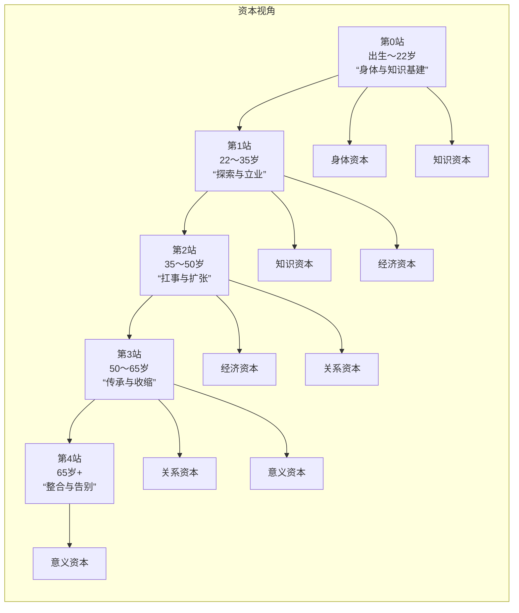

+++
title = "人生意义"
date = 2026-06-16T11:38:58+08:00
weight = 1
type = "docs"
description = ""
isCJKLanguage = true
draft = false

+++

人这一生需要注重身体的健康,懂得知识的学习以及应用,需要工作赚钱或者创业赚钱养家,需要经历各个不同的阶段,市面上很多讲解到思维模型可以套用到工作和学习以及生活中的各种事情上用来更好的处理当下遇到的问题或难题, 以及很多提到的执行力,行动力,战略,战术,本质,行动法则,行动指南等等等,我现在很迷茫:究竟人这一生需要经历什么或者会处于哪种境地,是否有类似道路一样,有起点,有终点,有沿途的驿站和旅馆以及加油站,咖啡厅,饭馆,学校,商场,办公楼,一样都在沿途中,有道路可以到达, 你能否给出人生的道路图呢?以及在每个沿途节点应该怎样应用思维模型或者,执行力,行动力,战略,战术,本质,行动法则,行动指南等等?


## ChatGPT

你提的问题，其实已经触及到了一个很多人30岁、40岁甚至60岁都没有想明白的问题：

> 人生究竟是什么？
>
> 是赚钱？
>
> 是学习？
>
> 是成家？
>
> 是健康？
>
> 是幸福？
>
> 还是不断解决问题？

我的答案是：

**人生更像一场长期经营的开放世界游戏，而不是一场考试。**

很多人之所以迷茫，是因为学校只教了知识，却没有教「人生地图」。

------

## 一、人生道路总图

如果把人生看成一条路，大概是这样：

```text
出生
 │
 ▼
【生存】
活下来
 │
 ▼
【成长】
学习能力
 │
 ▼
【独立】
养活自己
 │
 ▼
【发展】
积累财富和资源
 │
 ▼
【影响】
帮助家庭和他人
 │
 ▼
【创造】
创造价值和作品
 │
 ▼
【传承】
留下经验与成果
 │
 ▼
离开世界
```

------

## 二、人生的五大主线

很多人误以为人生只有一条主线：

```text
读书 → 工作 → 退休
```

实际上人生有五条主线同时进行：

```text
                 人生

        ┌──── 身体 ────┐
        │              │
财富 ───┤              ├── 关系
        │              │
        └──── 认知 ────┘
                 │
                 ▼
               精神
```

------

### 第一条：身体线

这是所有事情的基础。

如果身体崩了：

```text
财富 = 0
事业 = 0
梦想 = 0
```

所以：

```text
身体
↓
精力
↓
行动力
↓
结果
```

#### 核心指标

- 睡眠
- 饮食
- 运动
- 体检

#### 思维模型

第一性原理：

```text
人体是生物机器
```

所以：

```text
输入 → 处理 → 输出
```

输入不好：

```text
熬夜
垃圾食品
久坐

↓

系统故障
```

------

### 第二条：认知线

认知决定上限。

很多人努力却没有结果：

```text
不是不努力

而是方向错了
```

例如：

```text
挖坑很努力

结果挖错地方
```

------

认知成长路径：

```text
信息
 ↓
知识
 ↓
理解
 ↓
应用
 ↓
经验
 ↓
智慧
```

很多人停在：

```text
知识
```

高手停在：

```text
应用
```

大师停在：

```text
智慧
```

------

### 第三条：财富线

财富本质是什么？

很多人以为：

```text
财富 = 钱
```

实际上：

```text
财富 = 持续创造价值的能力
```

------

财富进化路线：

```text
卖时间
 ↓
卖技能
 ↓
卖系统
 ↓
卖产品
 ↓
卖品牌
 ↓
卖资本
```

例如：

程序员：

```text
写代码
 ↓
技术专家
 ↓
团队负责人
 ↓
产品负责人
 ↓
创业
```

------

### 第四条：关系线

人无法脱离社会。

关系包括：

```text
父母
伴侣
孩子
朋友
同事
客户
合作伙伴
```

------

思维模型：

#### 双赢思维

不是：

```text
我赢你输
```

而是：

```text
你赢
我也赢
```

长期收益最高。

------

### 第五条：精神线

很多人40岁后开始思考：

```text
我为什么活着？
```

这属于精神层面。

------

精神成长：

```text
追求快乐
 ↓
追求成就
 ↓
追求意义
 ↓
追求使命
```

------

## 三、人生每个阶段的任务

### 第一阶段（0~20岁）

关键词：

```text
学习
```

主任务：

```text
建立认知系统
```

重点：

- 阅读
- 学习能力
- 思考能力
- 运动习惯

------

思维模型：

#### 复利模型

每天进步：

```text
1%
```

一年后：

```text
1.01^365 ≈ 37.8
```

------

### 第二阶段（20~35岁）

关键词：

```text
探索
```

任务：

```text
找到自己的赛道
```

重点：

- 技能
- 职业
- 收入

------

思维模型：

#### 杠杆模型

不要只卖时间。

利用：

- 技术
- 软件
- 网络
- AI

放大产出。

------

### 第三阶段（35~50岁）

关键词：

```text
积累
```

任务：

```text
建立系统
```

重点：

- 财富
- 家庭
- 团队

------

思维模型：

#### 系统思维

不要解决问题：

```text
A
B
C
D
```

而是建立系统：

```text
解决所有A类问题
```

------

### 第四阶段（50~70岁）

关键词：

```text
传承
```

任务：

```text
经验沉淀
```

例如：

- 写书
- 教学
- 带团队

------

### 第五阶段（70岁以后）

关键词：

```text
回顾
```

任务：

```text
总结人生
```

------

## 四、所有思维模型最终会归结为什么？

市面上有：

- 第一性原理
- 奥卡姆剃刀
- 二八法则
- 复利思维
- 系统思维
- 博弈论
- 长期主义
- 反脆弱
- SWOT
- PDCA
- OKR

看起来很多。

实际上可以压缩成六个核心模型：

------

### 1. 本质思维

问：

```text
这件事本质是什么？
```

例如：

赚钱的本质：

```text
价值交换
```

------

### 2. 系统思维

问：

```text
背后系统是什么？
```

不要看点。

要看链条。

------

### 3. 概率思维

人生没有必然。

只有：

```text
提高成功概率
```

------

### 4. 复利思维

每天：

```text
进步一点点
```

长期巨大差异。

------

### 5. 杠杆思维

寻找放大器：

- AI
- 软件
- 团队
- 资本

------

### 6. 长期思维

问：

```text
五年后还有价值吗？
```

------

## 五、可以把人生理解成这样

```text
人生 = 一场超长距离旅行

身体 = 车
认知 = 导航
财富 = 油箱
关系 = 同行者
精神 = 目的地
```

而你每天要做的事情其实非常简单：

```text
1. 保养车（身体）

2. 更新导航（学习）

3. 加油（赚钱）

4. 善待同行者（关系）

5. 确认方向（意义）
```

如果再进一步压缩成一句话：

> **人生的核心任务不是追求某个终点，而是在不断成长的过程中，让身体更健康、认知更清晰、财富更稳固、关系更和谐、精神更充实，并持续创造价值。**

对于你目前的背景（程序员、持续学习技术、关注英语与AI），你的近期主线其实很明确：

```text
健康
   +
英语能力
   +
AI能力
   +
软件开发能力
   +
可持续收入能力
```

这五项如果未来10年持续复利，很可能比研究更多思维模型本身带来的收益更大。因为模型是地图，而行动和积累才是真正让你沿着道路前进的发动机。


# 智谱清言

​	人生确实可以看成一条“有路、有站、有补给点”的道路，而不是一团乱麻。这条路的“主线任务”是：身体资本 → 知识资本 → 经济资本 → 关系资本 → 意义资本，依次叠加、循环往复。每个“驿站”（人生阶段）都有典型问题，可以配一套“思维模型 + 战略/战术 + 行动力框架”来用。

​	下面我给你画一张“人生道路图”，并按阶段说清楚：用什么模型、怎么定战略、怎么落地行动。

## 一、先给你一张人生道路总图

​	把人的一生简化成一条主线 + 五大阶段（本质上是：身体→学习→赚钱→关系→意义 的螺旋上升）。



​	这条路：有起点（出生），有终点（死亡），中间有驿站（各阶段），也有加油站、学校、商场、办公楼……
不同“站点”的风景和任务不一样，但都可以用同一套“思维模型 + 战略/战术 + 行动力”来走。

## 二、先说：思维模型、战略/战术、行动力，怎么配合？

​	你可以把任何问题，都按这四层来拆：

### 本质层：用思维模型看透问题

​	第一性原理：把问题拆到最基本事实，再重新组合。

​	逆向思维：先问“怎样一定会失败”，然后避开这些坑。

​	二阶思维：追问“然后呢？”，看到长期和连锁后果。

​	能力圈：只在自己真正懂的领域下重注。

### 战略层：做对的选择

​	战略 = 方向 + 阶段重点 + 资源分配。

​	用 SWOT、机会成本、安全边际等模型来选大方向。

### 战术层：把战略拆成可执行路径

​	用 SMART 目标、里程碑、关键结果（OKR 思路）来拆阶段任务。

​	区分：哪些是“关键战役”，哪些是“日常琐事”。

### 行动层：真正干出来

​	执行力 = 目标 × 计划 × 习惯 × 反馈调整。

​	用“番茄钟”“21天习惯养成”“复盘三问”等小工具，把行动焊死。

​	下面每个阶段，我都会按这个四层来给你配一套“用法”。

## 三、按人生阶段，给你配“思维模型 + 行动框架”

### 第0站：出生〜22岁 —— 身体与知识基建

​	核心任务：给身体打一个好底子，给学习打一个好习惯，这是你后面所有“赶路”的本钱。

​	发展心理学里，0〜18岁主要是建立信任、自主、勤奋感等基础品质；职业生涯理论把0〜14岁叫“成长阶段”，

15〜24叫“探索阶段”。合并来看，0〜22就是“打地基”的阶段。

#### 本质层：这个阶段该看透什么？

​	身体是1，后面都是0：所有学习、工作、赚钱都建立在身体之上。

​	知识就是复利：越早养成学习习惯，时间这个“乘数”越可怕。

​	试错成本最低：年轻输得起，多吃苦、多尝试，是“便宜买教训”。

  ##### 可用模型

​	第一性原理：把“我要什么成绩/工作”拆成：每天学多少、练多少、问多少问题，而不是只盯着分数/名次。

​	逆向思维：问自己：什么一定会毁掉身体和未来？熬夜、暴饮暴食、网瘾、混圈子……先把这些删掉。

​	二阶思维：选专业/学校时，不只看“现在热门”，还要想：5年后、10年后，这行业会怎样？

#### 战略层：这个阶段的大方向

##### 战略目标

​	“成为能持续学习、能照顾自己身体的人”，而不是“只看分数/名校”。

##### 战略要点

​	身体：运动习惯、睡眠、饮食，远比短期分数重要。

​	知识：学会“如何学习”，比死记硬背重要。

​	视野：多读一点人物传记、历史，看到不同人生路径，避免“只见过一种活法”。

#### 战术层：怎么拆成具体行动？

##### 身体战术

​	每周至少 3 次运动，每次 30 分钟以上；固定睡眠时间。

##### 学习战术

​	每天 1 小时“深度学习”：不看手机，只啃一本难一点的书/课程。

​	每周 1 次复盘：这周学到了什么？哪里可以改进？

##### 试错战术

​	每年至少尝试一种新东西：社团、比赛、兼职、项目……看看自己喜欢/擅长什么。

#### 行动层：怎么执行到位？

​	用“习惯叠加”：把新习惯绑在旧习惯上，比如“刷牙后背 10 个单词”。

​	用“环境设计”：把手机放到另一个房间，减少学习时的干扰。

​	用“复盘三问”：

-  今天/这周我做得好的是什么？
-   哪里可以更好？
-   下周我具体怎么改？

  

### 第1站：22〜35岁 —— 探索与立业

​	职业生涯理论里，15〜24 是探索阶段，25〜44 是建立阶段；22〜35 大致就是“从学校到社会，找到立足点”的时期。

​	核心任务：从“学生”转成“职业人”，在试错中找到方向，开始积累第一桶金和关键能力。

#### 本质层：这个阶段该看透什么？

​	方向比努力重要：选城市、行业、赛道，比拼命加班更决定未来。

​	早期多试，中期收敛：前 3〜5 年可以多换几家/几个岗位，之后要开始收敛。

​	你的收入 = 你解决问题的稀缺度：先让自己能解决问题，再让自己解决别人解决不了的问题。

##### 可用模型

​	机会成本：选 A 就不能选 B，要比较的是“放弃的那个最好的选项”。
​	安全边际：生活要留一点现金和缓冲，不要月光、不要高负债。
​	逆向思维：问自己：怎样一定会变成“月光、啃老、被裁员”？然后避免那些路径。

#### 战略层：这个阶段的大方向

战略目标：“找到一个可以深耕的领域 + 一条能持续赚钱的路”。

战略要点：

用 3 年时间，至少换 2〜3 份工作/项目，搞清楚自己“真的不想要什么”。
选一个有积累性的赛道：技能、经验、人脉会随着时间增值，而不是吃青春饭。
收入结构：工资 + 技能变现 + 小副业，不要只靠一份死工资。

#### 战术层：怎么拆成具体行动？

职业战术：

每年至少做一次“职业盘点”：我现在的岗位、行业、城市，3 年后会更值钱还是更不值钱？

每年至少学一个新技能，和现有技能形成“组合拳”（如：编程+英语+行业知识）。

财务战术：

先存 3〜6 个月生活费，作为“安全边际”。

用 50/30/20 分配：50 必需，30 成长，20 储蓄/投资。

人际战术：

主动结交三类人：前辈（导师）、同龄人（战友）、年轻人（保持视野）。

行动层：怎么执行到位？

用“90 天冲刺”：每 90 天定一个明确主题（比如：转行、跳槽、副业上线），而不是漫无目的地熬。

用“每周 3 件重要事”：每周只抓 3 件对长远影响最大的事，其他事能简则简。

用“复盘 + 调整”：每季度问自己——

现在的方向，3 年后还会不会在？

我现在的能力，3 年后会不会更值钱？

如果不改变，未来会怎样？这就是逆向+二阶思维。

### 第2站：35〜50岁 —— 扛事与扩张

​	很多理论把 30/40 岁之后视为“成年中期”，核心任务是“繁衍/创造”，避免“停滞”；职业生涯理论里 25〜44 是建立阶段，45〜64 是维持阶段。35〜50 正是“最能扛事，也最容易崩”的阶段。

​	核心任务：扛住家庭和事业的双重压力，把“个人成功”升级为“系统成功”，避免中年危机。

#### 本质层：这个阶段该看透什么？

​	你不再只是“一个人”：上有老下有小，你的身体和决策，牵一发动全身。

​	从“自己干得好” → “让系统干得好”：从业务骨干 → 管理者/创业者/平台搭建者。

​	健康开始走下坡路：再不养身体，后面都是还债。

##### 可用模型

​	二阶思维：做任何决策，要问：这对 10 年后的身体、家庭、事业有什么影响？

​	能力圈：只在自己真正懂的领域下重注，别被“风口”忽悠。

​	Lollapalooza 效应：多个因素叠加，可能带来极端结果，比如：高杠杆+高风险+身体透支。

#### 战略层：这个阶段的大方向

战略目标：“从‘自己赚钱’升级为‘让系统和资产赚钱’”。

战略要点：

​	事业：从“干活的人”变成“搭台子的人”，带团队、建系统、做品牌。

​	财务：尽量有“非工资收入”（投资、租金、版税、分红）。

​	家庭：刻意经营夫妻关系和亲子关系，别把家当成“旅馆”。

​	健康：把运动和体检写进日程，而不是等出问题再重视。

#### 战术层：怎么拆成具体行动？

事业战术：

​	每年至少培养一个“能替你扛事的人”，让你从“离不开”到“可以离开”。

​	每年梳理一次业务/职业：哪里还在增长？哪里已经衰退？提前布局下一步。

财务战术：

​	制定“退休计划”的雏形：按 60/65 岁倒推，每年要存多少钱、什么收益率。

​	把资产分成：流动性资产（应急）、保值资产（房子）、增值资产（股权/投资）。

健康战术：

​	每年体检 + 一次专项检查（肠胃、心血管等）。

​	每周至少 2 次有氧 + 1 次力量训练。

行动层：怎么执行到位？

​	用“时间块管理”：把陪伴家人、运动、深度工作写进日程，而不是“有空再做”。

​	用“年度主题词”：比如今年是“健康年”“团队年”“资产年”，所有决策围绕主题展开。

​	用“家庭复盘”：每半年和伴侣做一次深度对话——财务、孩子、父母、感情，哪里要调整。

### 第3站：50〜65岁 —— 传承与收缩

​	职业生涯理论中 45〜64 是“维持阶段”，任务是维持成就、更新技能、考虑退休；发展心理学里，老年前期要处理“完善 vs 绝望”，开始总结人生。50〜65 就是“从冲锋陷阵，转为传递火炬”的阶段。

​	核心任务：把经验、资源、价值观传承下去，同时为退休和身体下滑做准备。

#### 本质层：这个阶段该看透什么？

​	你不再是主角，但可以是“制高点”：从“上场踢球”转为“教练+顾问”。

​	资产比收入重要：有稳定资产和现金流，比高工资更关键。

​	选择权比忙碌重要：少做一点，但做更有价值的事。

##### 可用模型

​	逆向思维：问自己：怎样一定会老来凄凉？——无存款、无健康、无关系、无意义。现在就开始避免。

​	奥卡姆剃刀：简化生活，把时间和精力集中在最重要的人和事上。

​	地图 ≠ 领土：任何规划都只是“地图”，现实会变，要保留灵活度。

#### 战略层：这个阶段的大方向

​	战略目标：“从‘做大’转为‘做稳’和‘做深’”。

​	战略要点：

​		事业：从“冲业绩”转为“建制度、带人、守底线”。

​		财务：从“追求高收益”转为“保值 + 稳现金流”，控制风险。

​		关系：把时间多给重要的人，减少无效社交。

​		意义：找到一种“传承方式”：带人、写作、公益、分享经验。

#### 战术层：怎么拆成具体行动？

事业战术：

​	每周至少花 20% 时间在“非紧急但重要”的事：培养接班人、优化系统、写文档。

​	逐步减少“必须亲自在场”的工作，提高可替代性。

财务战术：

​	检查养老金、保险、资产配置，确保即使停止工作，也能维持基本生活。

​	把高风险资产逐步转为低风险资产。

传承战术：

​	每年做 1〜2 次分享：内部分享、行业分享、学校分享，把经验“输出”。

​	把关键经验写成文档/课程，而不是只在脑子里。

行动层：怎么执行到位？

- ​	用“每周 3 个重点”：健康、关键关系、关键任务，其他事能推就推。
- ​	用“年度断舍离”：每年清理一次物品、关系、承诺，只留下真正重要的。
- ​	用“生命盘点”：每年问自己——
  - 如果再活 10 年，我要怎样度过？
  - 我希望别人怎么记住我？
  - 现在的生活，离那个记忆有多远？

### 第4站：65岁+ —— 整合与告别

​	发展心理学里，老年期的核心任务是“自我整合 vs 绝望”，接受自己的一生，找到一种智慧与平静。这里就是这条路的“终点站”，但也可以是“风景站”。

​	核心任务：与自己和世界和解，把人生整理成一个“讲得通的故事”，尽量少留遗憾。

#### 本质层：这个阶段该看透什么？

​	人生没有标准答案，只有“你愿意承担的后果”。

​	健康、关系、意义，比钱更重要：钱够用就行，再多带来的边际收益很小。

​	接受失去，是老年最大的功课：接受身体衰退、亲友离世、社会角色变化。

#### 可用模型

​	第一性原理：回到“我到底想要怎样的一天”，而不是“别人怎么看我”。

​	二阶思维：很多事已经没有“然后”，所以只做真正想做的事。

​	逆向思维：问自己：怎样一定会让最后几年很惨？——孤独、怨恨、后悔。现在就避免。

#### 战略层：这个阶段的大方向

​	战略目标：“按自己的方式度过最后一段路”。

​	战略要点：

- 医疗和照护：提前安排，不拖累家人。
- 关系：修复能修复的关系，放下放不下的执念。
- 意义：找到一种“每天愿意醒来”的节奏——爱好、公益、陪伴、创作。


#### 战术层：怎么拆成具体行动？

健康战术：

​	按医嘱管理慢性病，防止跌倒，保持适度活动。

关系战术：

- 每周和家人/朋友有固定互动，减少孤立感。
- 意义战术：
- 每天留一点时间做自己喜欢的事：写、画、种花、散步，都可以。


#### 行动层：怎么执行到位？

​	用“每日三件事”：一件动身体、一件动脑子、一件为别人。

​	用“故事化回忆”：把人生写成故事，或者讲给后辈听，这是“自我整合”的过程。

## 四、把这些“站点”连起来：人生的三条隐形道路

​	除了按年龄分阶段，你还可以把人生看成三条并行的路：

- 身体之路：从“强壮”到“衰退”，但你可以通过运动、睡眠、饮食，大大减缓坡度。
- 知识与认知之路：从“什么都不知道”到“知道一些规律”，再到“知道自己不知道”。
- 关系与意义之路：从“被照顾”到“照顾别人”，再到“与世界和解”。

​	每条路上，都可以用同样的四层框架：

- ​	本质层：用思维模型看清这条路的关键变量。
- ​	战略层：决定这条路上你要去哪里（健康到几岁？认知到什么水平？关系深度如何？）。
- ​	战术层：把大目标拆成每年、每月、每周的行动。
- ​	行动层：用习惯、环境、反馈，把行动焊死。

## 五、你现在迷茫时，可以立刻做的三件事

### 先画你自己的“人生道路图”

​	拿一张纸，把 0〜100 岁画成一条线，标出：你现在在哪一站？你希望 5 年后到哪一站？

​	这就是在用“地图 ≠ 领土”的模型——先有一张属于你的地图。

### 用逆向思维，写一份“人生失败清单”

​	写下：怎样一定会把身体搞坏？怎样一定会财务崩溃？怎样一定会关系破裂？

​	然后，把这些事逐条从你生活中删掉。

### 用二阶思维，做一次“10 年推演”

​	问自己：

- 如果我按现在的路走下去，10 年后会怎样？
- 然后 10 年呢？

​	这会帮你看清：哪些事现在看起来爽，但长期是坑；哪些事现在苦，但长期是利。

​	人生确实没有标准路线，但确实有“更稳、更值得”的方向。

​	你可以把上面那张道路图，当成一个模板，根据自己的情况重新标站、改路——

​	重要的是：先有图，再上路；边走，边修路。
