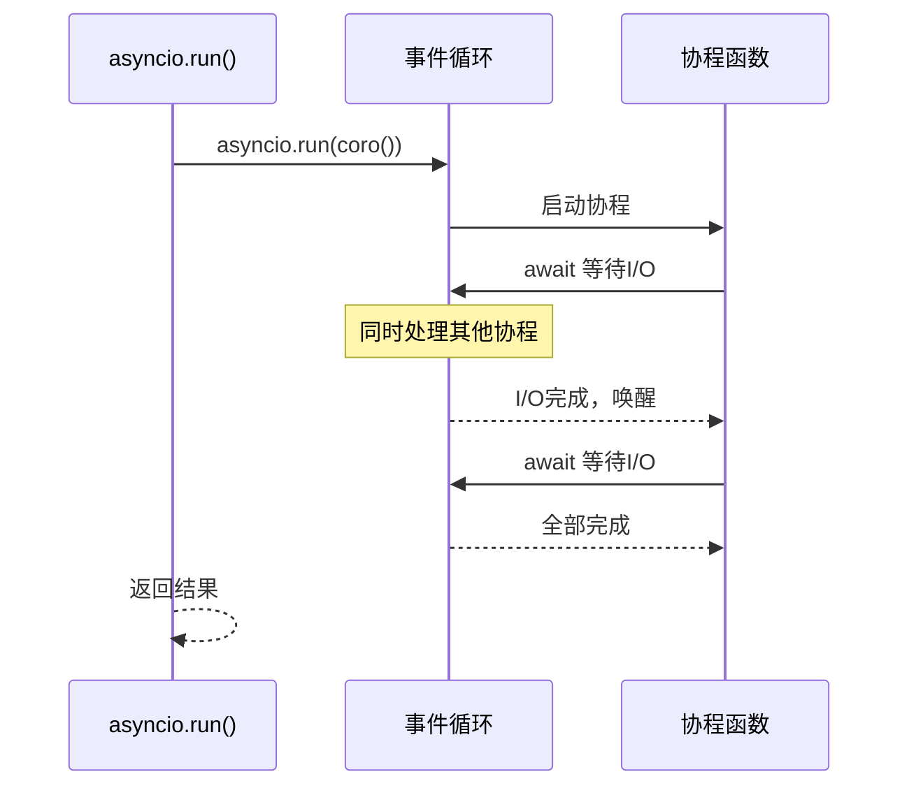
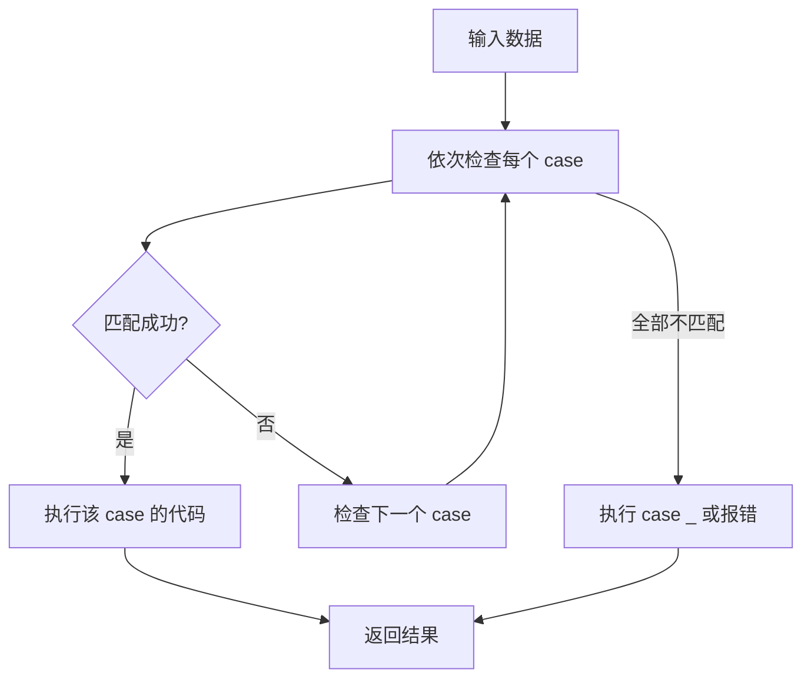
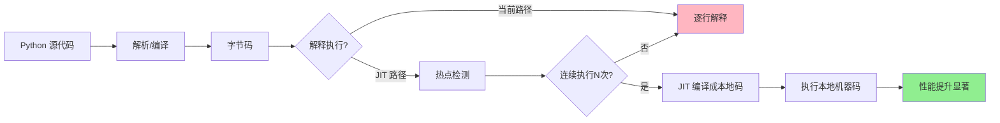
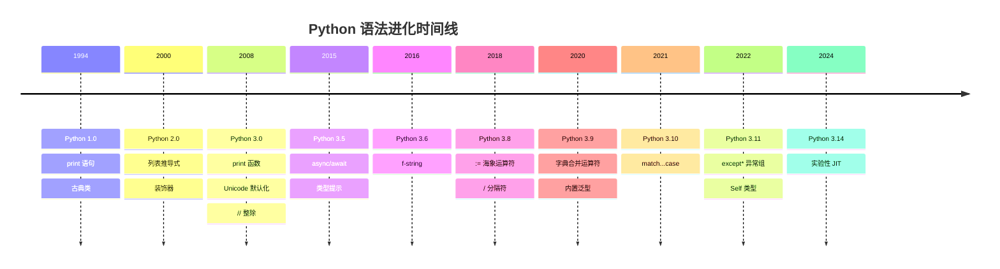

+++
title = "第2章 Python的进化史"
weight = 20
date = "2026-04-08T13:22:00+08:00"
type = "docs"
description = ""
isCJKLanguage = true
draft = false
+++

# 第二章：Python 语法进化史 —— 从远古到赛博朋克

> 🎭 **旁白**：欢迎来到 Python 语法的博物馆！请系好安全带，我们将乘坐时光机，从 1994 年的 Python 1.0 一路狂飙到 2026 年的 Python 3.14。这段旅程中，你会看到语言的"整容史"、语法的"断舍离"，以及那些让程序员又爱又恨的语法糖。准备好了吗？出发！

---

## 2.1 Python 1.x 语法特征：洪荒时代的浪漫

Python 1.x 是语言的蛮荒时期。那时候的程序员还没有 emoji 表情包可用（Python 2.2 才支持 Unicode 标识符，所以你甚至可以用中文变量名 `姓名 = "张三"`），但他们已经开始用 `print` 语句打印 "Hello, World!" 了。让我们穿越回那个没有 `async/await`、没有 f-string、没有 pattern matching 的纯真年代。

### 2.1.1 古典类（old-style class）系统

**什么是古典类？** 古典类（old-style class）是 Python 1.x 和 Python 2.1 及更早版本的类定义方式。在古典类体系中，`class` 对象没有继承自任何共同的基类（或者说它们继承自 `instance` 类型），这导致了很多奇怪的问题。

```python

# Python 1.x / Python 2.1 之前的古典类
class Animal:
    """古典类：没有显式继承任何类"""
    def __init__(self, name):
        self.name = name
    
    def speak(self):
        return "..."

class Dog(Animal):
    """古典类：显式继承 Animal"""
    def speak(self):
        return self.name + " says Woof!"

# 问题：古典类的 type 是什么？
d = Dog("Buddy")
print(type(d))              # <type 'instance'>
print(d.__class__)          # __main__.Dog
print(isinstance(d, object))  # False！！！古典类不是 object 的实例！！

```

> **骚操作警告**：古典类的 `type` 是 `<type 'instance'>` 而不是 `<class 'Dog'>`！这听起来像是一个 bug，但它实际上是"特性"。想象一下，当你 `print(d)` 时，你期望看到什么？

**古典类的灵魂拷问：**

```python

# 在 Python 2 古典类模式下
class A:
    pass

class B:
    pass

a = A()
print(type(a))  # <type 'instance'> —— 没错，你没看错！
print(type(a) == A)  # False —— 这简直是哲学问题！

```

**为什么古典类被淘汰了？** 因为它与现代 Python 的对象系统格格不入。在 Python 2.2 中，引入了"新式类"（new-style class），要求显式继承 `object` 或其他新式类：

```python

# Python 2.2+ 新式类
class NewAnimal(object):  # 显式继承 object
    def __init__(self, name):
        self.name = name

# 现在 type() 终于正常了
a = NewAnimal("Cat")
print(type(a))                # <class '__main__.NewAnimal'>
print(isinstance(a, object))  # True —— 终于，你是对象了！

```

### 2.1.2 早期 Unicode 处理方式

在 Python 1.6 和 Python 2.0 之前，Python 的字符串都是 **字节串**（bytes），没有 Unicode 的概念。你想处理中文？那你得自己想办法编码解码。

```python

# Python 2 时代的 Unicode
# -*- coding: utf-8 -*-

# 普通字符串（实际上是字节串）
s = "你好"           # 在 Python 2 中，这其实是字节串
print(type(s))       # <type 'str'>

# Unicode 字符串（显式用 u 前缀）
u = u"你好"
print(type(u))       # <type 'unicode'>

# 编码转换：Unicode -> UTF-8 bytes
utf8_bytes = u.encode('utf-8')
print(repr(utf8_bytes))  # '\xe4\xb8\xad\xe6\x96\x87'

# 解码：bytes -> Unicode
back = utf8_bytes.decode('utf-8')
print(back)           # 你好

```

> **名梗**：Python 2 的字符串编码问题有个外号，叫"UnicodeEncodeError 的地狱"。你永远不知道什么时候会突然蹦出一个 `UnicodeDecodeError`，就像你永远不知道外卖小哥会从哪里突然窜出来一样。

**早期处理中文的辛酸史：**

```python

# -*- coding: gbk -*-
# Python 2 时代，很多人为了一行中文注释要写这样的头部
# 你以为是 utf-8，其实是 gbk，然后报错，然后心态爆炸

# 常见错误：在 console 输出 Unicode 字符串
import sys
reload(sys)
sys.setdefaultencoding('utf-8')  # 这行代码，Python 2 玩家都懂

```

### 2.1.3 字符串格式化（% 运算符）占主流

在 f-string 诞生之前（那是 2016 年的事了），Python 程序员只能靠 `%` 运算符来续命。这个运算符看起来像取余，但实际上是**字符串格式化运算符**，类似于 C 语言的 `sprintf`。

```python

# Python 2 时代的字符串格式化 —— % 运算符的天下
name = "Alice"
age = 25
height = 1.68

# 基本用法：%s 字符串，%d 整数，%f 浮点数
msg = "My name is %s, I'm %d years old, and my height is %.2f m." % (name, age, height)
print(msg)
# My name is Alice, I'm 25 years old, and my height is 1.68 m.

# 字典格式化：更清晰、更安全
msg = "My name is %(name)s, I'm %(age)d years old." % {"name": name, "age": age}
print(msg)

# %的转义：%% 代表一个字面量 %
ratio = 0.75
print("完成度：%.0f%%" % (ratio * 100))
# 完成度：75%

# 格式化整数：%06d（补零）
order_id = 42
print("订单号：%06d" % order_id)
# 订单号：000042

```

> **古代程序员的智慧**：% 格式化就像用筷子吃饭——用久了觉得挺顺手，突然有一天 f-string 出现，就像有人递给你一把叉子，然后你就再也回不去了（但你还是怀念筷子）。

### 2.1.4 早期异常处理语法

Python 1.x 的异常处理语法已经相当现代化了，但有些细节值得回味。异常处理使用 `try...except` 语句，和现代 Python 类似，但当时没有 `finally` 子句（`finally` 是 Python 2.4 才加入的）！

```python

# Python 1.x 异常处理 —— try/except 已经有了，但 finally 还没有
try:
    x = 1 / 0
except ZeroDivisionError:
    print("除数不能为零！")

# 捕获多种异常
try:
    import non_existent_module
except (ImportError, SyntaxError) as e:
    print("模块导入失败：%s" % e)

# 早期写法：不用 as，用逗号（Python 1.x 风格）
try:
    x = 1 / 0
except ZeroDivisionError, msg:  # 这是 Python 2.1 及之前的语法！
    print(msg)

# Python 2.2+ 才改为 except Exception as e:
try:
    x = 1 / 0
except ZeroDivisionError as msg:  # 这才像话
    print(msg)

# 早期没有 finally，但可以这样做：
try:
    f = open("test.txt", "r")
    content = f.read()
except IOError as e:
    print("文件操作失败：%s" % e)
else:  # else 在没有 finally 时用来表示"没有异常时执行"
    print("文件读取成功")
    f.close()  # 但如果这里出错，文件就没关！所以 finally 很重要

```

> **历史冷知识**：`except Exception, e` 这个逗号写法在 Python 2.6 开始会报警告，在 Python 3 中直接报错。Guido 说："逗号分隔不符合常识，还是 `as` 更像人话。"

---

## 2.2 Python 2.x 语法的进化：黄金年代

Python 2.x 是 Python 真正走向成熟的时期。从 2.0 到 2.7，这个版本统治了 Python 世界近十年。列表推导式、生成器、装饰器、with 语句——这些现代 Python 的标配都是在 Python 2.x 时期引入的。

### 2.2.1 列表推导式：Python 的"神器"

列表推导式（List Comprehension）是 Python 2.0 引入的语法糖，它的发明让 Python 程序员从此告别了笨拙的 for 循环，被认为是 Python 最优雅的发明之一。

#### 2.2.1.1 基本语法

列表推导式的基本结构是：`[表达式 for 变量 in 可迭代对象]`

```python

# 传统 for 循环：创建一个 0-9 的平方列表
squares = []
for i in range(10):
    squares.append(i ** 2)
print(squares)

# 列表推导式：一行搞定！
squares = [i ** 2 for i in range(10)]
print(squares)
# [0, 1, 4, 9, 16, 25, 36, 49, 64, 81]

# 字符串操作
words = ["Hello", "World", "Python"]
upper_words = [w.upper() for w in words]
print(upper_words)
# ['HELLO', 'WORLD', 'PYTHON']

# 数字运算
nums = [1, 2, 3, 4, 5]
doubled = [n * 2 for n in nums]
print(doubled)
# [2, 4, 6, 8, 10]

```

#### 2.2.1.2 带条件的推导式

在 `for` 后面加上 `if` 条件，可以过滤元素。

```python

# 只保留偶数
nums = range(10)
evens = [n for n in nums if n % 2 == 0]
print(evens)
# [0, 2, 4, 6, 8]

# 过滤掉负数
data = [1, -3, 2, -5, 4, -1]
positive = [x for x in data if x > 0]
print(positive)
# [1, 2, 4]

# 多重条件
nums = range(20)
result = [n for n in nums if n % 2 == 0 if n % 3 == 0]
print(result)
# [0, 6, 12, 18] —— 能被2整除且能被3整除的数（也就是6的倍数）

# if-else 表达式（注意：这是表达式，不是过滤）
labels = ["正数" if x > 0 else "非正数" for x in [-1, 0, 1, 2]]
print(labels)
# ['非正数', '非正数', '正数', '正数']

```

#### 2.2.1.3 嵌套列表推导式

列表推导式可以嵌套，就像 for 循环可以嵌套一样。

```python

# 二维矩阵展平
matrix = [[1, 2, 3], [4, 5, 6], [7, 8, 9]]
flat = [num for row in matrix for num in row]
print(flat)
# [1, 2, 3, 4, 5, 6, 7, 8, 9]

# 等价于：
flat = []
for row in matrix:
    for num in row:
        flat.append(num)

# 嵌套推导式生成乘法表
multiplication_table = [[i * j for j in range(1, 10)] for i in range(1, 10)]
# multiplication_table[i-1][j-1] = i * j

# 条件+嵌套：找出两个列表中相等的元素
list1 = [1, 2, 3, 4, 5]
list2 = [3, 4, 5, 6, 7]
common = [x for x in list1 for y in list2 if x == y]
print(common)
# [3, 4, 5] —— 找到了共同的元素

```

> **程序员笑话**：列表推导式是 Python 程序员炫技的利器。面试时写一个三层嵌套的列表推导式，面试官会觉得你很厉害；三个月后再看这段代码，你自己也不知道自己在想什么。所以——**能用列表推导式炫技，但别用它写看不懂的代码**。

### 2.2.2 生成器（yield）语法：懒惰是美德

生成器（Generator）是 Python 2.2 引入的特性，它允许你创建一个惰性迭代器（lazy iterator）。与列表不同，生成器不会一次性把所有值都存在内存中，而是"用多少取多少"——这对于处理大数据集简直是救星。

#### 2.2.2.1 生成器函数定义

用 `yield` 关键字代替 `return` 的函数就是生成器函数。调用生成器函数不会立即执行，而是返回一个生成器对象。

```python

# 生成器函数：用 yield 返回值
def count_up_to(max_val):
    """计数器，模拟 Python 2 的 range 行为"""
    count = 1
    while count <= max_val:
        yield count  # yield 就像暂停键
        count += 1

# 调用生成器函数，返回一个生成器对象
counter = count_up_to(5)
print(type(counter))  # <type 'generator'>

# 用 next() 一个个取值
print(next(counter))  # 1
print(next(counter))  # 2
print(next(counter))  # 3
print(next(counter))  # 4
print(next(counter))  # 5

```

> **灵魂比喻**：生成器就像自动售货机——你投币（调用 `next()`），它就掉出一瓶饮料（返回一个值）。它不需要提前把所有饮料都摆好（不用存储所有数据），节省空间。

#### 2.2.2.2 next() 调用

可以用 `next(generator)` 手动驱动生成器，也可以用 `for` 循环遍历。

```python

def fibonacci():
    """生成斐波那契数列"""
    a, b = 0, 1
    while True:
        yield a
        a, b = b, a + b

# 遍历生成器
fib = fibonacci()
for i in range(10):
    print(next(fib), end=" ")
# 0 1 1 2 3 5 8 13 21 34

# 生成器也可以用 for 循环
fib = fibonacci()
for num in fib:
    if num > 100:
        break
    print(num, end=" ")
# 0 1 1 2 3 5 8 13 21 34 55 89

# 用 list() 一次性消费完（谨慎！大数据集会爆内存）
gen = (x ** 2 for x in range(5))
print(list(gen))
# [0, 1, 4, 9, 16]

```

#### 2.2.2.3 StopIteration 异常

当生成器耗尽时，再次调用 `next()` 会抛出 `StopIteration` 异常。`for` 循环会自动捕获这个异常，所以不会崩溃。

```python

def three_numbers():
    yield 1
    yield 2
    yield 3

gen = three_numbers()
print(next(gen))  # 1
print(next(gen))  # 2
print(next(gen))  # 3

try:
    print(next(gen))  # 没有更多值了！
except StopIteration:
    print("生成器已经榨干了！")
# 生成器已经榨干了！

# for 循环自动处理 StopIteration
for num in three_numbers():
    print(num)
# 1
# 2
# 3

```

> **幽默**：StopIteration 异常就像是"薯片吃完后的咔嚓声"——告诉你"真的没了，别翻了"。但如果你在 for 循环中使用，Python 会优雅地忽略这个声音。

### 2.2.3 with 语句与上下文管理器：优雅的资源管理

`with` 语句（上下文管理器）是 Python 2.6 引入的特性，用于替代 `try...finally` 来自动处理资源的获取和释放。想象你打开了一本书，看完后要合上；with 语句就是你合上书的那个动作，而且即使看书时摔倒了（发生异常），书也会被合上。

#### 2.2.3.1 __enter__ 和 __exit__ 协议

一个对象要支持 `with` 语句，只需要实现 `__enter__` 和 `__exit__` 方法。

```python

# 自定义上下文管理器
class ManagedResource:
    """一个支持 with 语句的资源管理类"""
    
    def __enter__(self):
        """进入 with 块时调用，返回值绑定到 as 后的变量"""
        print("📖 打开资源")
        return self  # 返回的对象会绑定到 as 后的变量
    
    def __exit__(self, exc_type_arg, exc_value, traceback):
        """退出 with 块时调用，无论是否发生异常"""
        print("📕 关闭资源")
        if exc_type_arg is not None:
            print("  异常类型: %s" % exc_type_arg.__name__)
            print("  异常信息: %s" % exc_value)
        # 返回 False 不抑制异常，异常会继续传播
        return False
    
    def read(self):
        return "数据内容..."

# 使用 with 语句
with ManagedResource() as res:
    print("正在读取:", res.read())
    # 故意抛个异常看看 __exit__ 的行为
    # raise ValueError("故意的错误")

print("with 块外的代码继续执行...")

```

运行结果：

```
📖 打开资源
正在读取: 数据内容...
📕 关闭资源
with 块外的代码继续执行...
```

#### 2.2.3.2 with 的优势：自动资源清理

`with` 语句解决了"资源泄漏"的世纪难题。在 without `with` 的年代，很多程序员会因为忘记 `close()` 而浪费文件描述符、数据库连接等资源。

```python

# 不用 with：文件可能没有正确关闭
f = open("example.txt", "w")
f.write("Hello")
# 如果这中间抛出异常，f.close() 就不会被调用！
f.close()

# 用 try...finally：啰嗦
f = open("example.txt", "w")
try:
    f.write("Hello")
finally:
    f.close()  # 终于关了

# 用 with：优雅、安全、简洁
with open("example.txt", "w") as f:
    f.write("Hello")
# 自动关闭，即使 write 时出错也会关闭

# Python 2.7+ 支持同时打开多个文件（用逗号分隔）
with open("input.txt") as fin, open("output.txt", "w") as fout:
    content = fin.read()
    fout.write(content.upper())

```

> **名梗**：`with` 语句的精髓是"**有借有还，再借不难**"。你借用了文件，用完了一定要还，否则操作系统会追债（文件描述符耗尽）。

### 2.2.4 装饰器语法的成熟：披着羊皮的函数

装饰器（Decorator）是 Python 2.4 引入的语法糖，用来动态地给函数或类添加功能，而不需要修改其源代码。装饰器就像是给函数穿上一件"功能外套"——函数本身没变，但多了一层包装。

#### 2.2.4.1 @decorator 语法糖

装饰器的核心思想是：**函数是一等公民**（first-class citizen），可以作为参数传递给其他函数，也可以被其他函数返回。

```python

# 定义一个简单的装饰器
def log_calls(func):
    """记录函数调用次数的装饰器"""
    def wrapper(*args, **kwargs):
        print("🔔 调用函数: %s" % func.__name__)
        result = func(*args, **kwargs)
        print("✅ 函数执行完毕")
        return result
    return wrapper

# 使用 @decorator 语法糖
@log_calls
def say_hello(name):
    print("你好，%s！" % name)

# 等价于：say_hello = log_calls(say_hello)

say_hello("小明")
# 🔔 调用函数: say_hello
# 你好，小明！
# ✅ 函数执行完毕

```

#### 2.2.4.2 多装饰器叠加

多个装饰器可以叠加，效果是**从下到上**应用（靠近函数的先应用）。

```python

def bold(func):
    """加粗装饰器"""
    def wrapper(*args, **kwargs):
        return "**" + func(*args, **kwargs) + "**"
    return wrapper

def italic(func):
    """斜体装饰器"""
    def wrapper(*args, **kwargs):
        return "*" + func(*args, **kwargs) + "*"
    return wrapper

@bold
@italic
def greet(name):
    return "Hello, " + name

print(greet("World"))
# ** *Hello, World* ** —— 先 italic，再 bold

# 等价于：greet = bold(italic(greet))

```

#### 2.2.4.3 带参数的装饰器

装饰器工厂（Decorator Factory）是返回装饰器的函数，可以接受参数。

```python

def repeat(times):
    """带参数的装饰器"""
    def decorator(func):
        def wrapper(*args, **kwargs):
            result = []
            for _ in range(times):
                result.append(func(*args, **kwargs))
            return result
        return wrapper
    return decorator

@repeat(times=3)
def greet(name):
    return "Hello, %s!" % name

print(greet("Alice"))
# ['Hello, Alice!', 'Hello, Alice!', 'Hello, Alice!']

# 使用场景：日志记录、重试机制、性能计时
import time

def timer(func):
    """计时装饰器"""
    def wrapper(*args, **kwargs):
        start = time.time()
        result = func(*args, **kwargs)
        end = time.time()
        print("⏱️ %s 执行耗时: %.4f 秒" % (func.__name__, end - start))
        return result
    return wrapper

@timer
def slow_function():
    time.sleep(1)
    return "Done"

slow_function()
# ⏱️ slow_function 执行耗时: 1.0023 秒

```

> **笑话**：装饰器就像是给函数戴口罩——它还是那个函数，但你可以往口罩里塞各种功能（消毒、增香、美白）。但如果你给装饰器套装饰器……那就像给口罩戴口罩，谁戴谁知道。

### 2.2.5 Metaclass 的完善：类的工厂

元类（Metaclass）是 Python 中最神秘的概念之一，它是"创建类的类"。普通类在 Python 2/3 中默认是 `type` 的实例，而元类则是 `type` 的子类。

#### 2.2.5.1 __metaclass__ 属性

在 Python 2 中，可以在类中定义 `__metaclass__` 属性来指定该类的元类。

```python

# Python 2 风格的元类
class LowerCaseMeta(type):
    """将所有属性名转换为小写的元类"""
    def __new__(mcs, name, bases, dict):
        # 将所有属性名转为小写
        new_dict = {}
        for key, value in dict.items():
            if not key.startswith('_'):
                new_dict[key.lower()] = value
            else:
                new_dict[key] = value
        return super(LowerCaseMeta, mcs).__new__(mcs, name, bases, new_dict)

class MyClass(object):
    __metaclass__ = LowerCaseMeta
    
    Name = "Alice"    # 自动变成 name
    Age = 25           # 自动变成 age
    
print(MyClass.name)   # Alice
print(MyClass.age)    # 25

```

#### 2.2.5.2 type() 创建类

`type()` 函数不仅是查看对象类型的工具，它还可以用来动态创建类。

```python

# type() 的三种用法：查看类型
print(type(123))        # <class 'int'>
print(type("hello"))    # <class 'str'>

# type() 的第四种用法：动态创建类
# type(name, bases, dict)
# name: 类名，bases: 父类元组，dict: 属性字典

DogClass = type('Dog', (), {
    'species': 'Canis familiaris',
    'speak': lambda self: "Woof!",
    '__init__': lambda self, name: setattr(self, 'name', name)
})

dog = DogClass("Buddy")
print(dog.name)           # Buddy
print(dog.species)        # Canis familiaris
print(dog.speak())        # Woof!

# 更复杂的动态类创建
def add_method(cls, method_name, func):
    """动态给类添加方法"""
    setattr(cls, method_name, func)
    return cls

Dog = type('Dog', (), {'species': 'dog'})
Dog = add_method(Dog, 'bark', lambda self: "Woof!")
print(Dog().bark())  # Woof!

```

> **名梗**：元类是 Python 的"九阴真经"——学会了可以称霸武林，但 $99\%$ 的程序员一辈子都用不上。剩下的 $1\%$ 用了元类，写出了没人能维护的代码。**珍爱生命，远离元类！**（除非你在写 ORM 框架）。

### 2.2.6 print 语句 vs print 函数：世纪之争

`print` 从语句变成函数是 Python 3 最大的变化之一。这个转变背后的故事充满了"审美之争"和"Guido 的执念"。

#### 2.2.6.1 Python 2 中的 print 语句

在 Python 2 中，`print` 是一个**语句**（statement），不是函数。它的语法非常"复古"：

```python

# Python 2 print 语句
print "Hello, World!"                    # 基本用法
print "Hello,", name                     # 逗号分隔，自动加空格
print "Hello,", "Python", "!"            # 多个参数
print                                   # 打印空行

# 重定向到文件
print >> file_handle, "写入文件的内容"

# 禁止换行（Python 2 的技巧）
print "内容",
print "不换行",
print "继续"    # Hello World

# 条件打印
if True:
    print "条件成立时才打印"

```

#### 2.2.6.2 print() 函数的优势

Python 3 的 `print()` 函数解决了语句版本的很多痛点：

```python

# Python 3 print 函数
print("Hello, World!")                    # 基本用法
print("Hello", "Python", "!")             # 逗号分隔自动加空格
print("不换行", end="")                   # 自定义 end 参数
print(" 接着打")                          # 不会换行

# sep 参数控制分隔符
print("a", "b", "c", sep=" | ")           # a | b | c

# 输出到文件
with open("output.txt", "w") as f:
    print("写入文件", file=f)

# flush 参数：立即刷新输出
print("正在加载...", end="", flush=True)
import time
time.sleep(1)
print("完成!")

# 格式化输出（结合字符串方法）
name = "小明"
score = 98.5
print("{} 的分数是 {:.1f}".format(name, score))

```

> **灵魂拷问**：`print` 为什么从语句变成函数？Guido 的理由是：语句是 Python 的"历史遗留问题"，而函数更符合"一切皆对象"的哲学。而且，`print >> file` 这种语法太丑了，像是在往文件里倒垃圾。

### 2.2.7 raw_input() vs input()：安全之争

`raw_input()` 和 `input()` 的故事是 Python 2 中最经典的安全教训之一。

#### 2.2.7.1 Python 2 中 input() 的安全漏洞

在 Python 2 中，`input()` 的行为是：**读取用户输入，然后用 `eval()` 执行它**！这简直是给黑客开了一扇大门。

```python

# Python 2 —— 危险！
# 假设用户输入：__import__('os').system('ls')
name = input("请输入你的名字：")  # 用户输入 __import__('os').system('dir')
# 结果：你的电脑执行了 dir 命令！！！

# 另一个例子：输入 1 + 1
result = input("请输入一个表达式：")  # 用户输入 1 + 1
print(result)  # 2 —— 因为 eval("1 + 1") == 2

# 危险操作：输入 os.remove('/etc/passwd') 试试？
# （请不要真的尝试）

```

> **安全警告**：如果你在 Python 2 中使用 `input()`，用户可以输入任何 Python 代码并在你的程序中执行。这叫做 **代码注入攻击**（code injection）。

#### 2.2.7.2 raw_input() 的引入

为了解决 `input()` 的安全问题，Python 2 引入了 `raw_input()` ——它只是读取字符串，不做任何求值。

```python

# Python 2 raw_input() —— 安全
name = raw_input("请输入你的名字：")  # 用户的输入被当作纯字符串
print(name)                            # 打印输入的内容，不会执行

# 想要数字？自己转换
age = int(raw_input("请输入你的年龄："))  # 转换为整数
print(age + 10)                         # 数学运算

```

> **Python 3 的拨乱反正**：Python 3 直接把 `input()` 改成了 `raw_input()` 的行为，而 `raw_input()` 被废除了。历史告诉我们：**安全比功能更重要**。

---

## 2.3 Python 3.x 语法革命：断舍离的艺术

Python 3 是 Python 语言的"改革开放"。Guido van Rossum 借这个机会做了很多"不可能的任务"：移除古典类、让 `print` 成为函数、让除法变得合理、支持 Unicode 默认化……这次革命虽然牺牲了向后兼容性，但让 Python 变得更现代化、更安全、更合理。

### 2.3.1 print 函数的全面普及

Python 3 的 `print()` 函数有四个关键参数：`sep`、`end`、`file`、`flush`。让我们逐个击破。

#### 2.3.1.1 print() 函数参数详解

```python

# print() 函数签名（Python 3）
# print(*objects, sep=' ', end='\n', file=sys.stdout, flush=False)

# *objects: 任意多个对象，会被转换为字符串并打印
print("a", "b", "c", 1, 2, 3)
# a b c 1 2 3

```

#### 2.3.1.2 sep、end、file、flush 参数

```python

# sep: 分隔符，默认是一个空格
print("apple", "banana", "cherry", sep=", ")
# apple, banana, cherry

# end: 结尾字符，默认是换行符
print("第一行", end=" ")
print("同一行")          # 第一行 同一行

# file: 输出目标，默认是标准输出
with open("log.txt", "w") as f:
    print("日志条目", file=f)  # 写入文件

# flush: 是否立即刷新
import time
print("正在连接...", end="", flush=True)
time.sleep(2)
print("连接成功!")

# 组合使用：打印进度条风格
for i in range(101):
    print("\r进度: %d%%" % i, end="", flush=True)
    time.sleep(0.02)
print("\n下载完成！")

```

> **骚操作**：利用 `print()` 的 `end=""` 参数，可以创建"单行更新"的进度条效果，这在 Python 2 中几乎是不可能实现的。

### 2.3.2 整除运算符 //：终于合理了

Python 2 的 `/` 运算符是个"双面间谍"——对整数使用它会进行**地板除法**（向下取整），对浮点数使用它却做**真除法**。Python 3 统一了语义：`/` 永远是真除法，`//` 永远是地板除法。

#### 2.3.2.1 // 与 / 的区别

```python

# Python 3: / 永远是真除法（返回 float）
print(5 / 2)      # 2.5 —— 不是 2！
print(10 / 2)     # 5.0 —— float，不是 int

# Python 3: // 永远是地板除法（返回 int 对 int，结果向下取整）
print(5 // 2)     # 2 —— 向下去整
print(-5 // 2)    # -3 —— 地板除法：向负无穷取整

# Python 2 的行为（如果你非要去回忆）
# 5 / 2 == 2（整数除法，向下取整）
# 5.0 / 2 == 2.5（浮点除法）

# 所以 Python 3 的代码更可预测
print(7 // 3)     # 2
print(7 / 3)      # 2.3333333333333335

```

#### 2.3.2.2 负数整除的行为

负数的地板除法是很多人容易搞混的地方：

```python

# 地板除法（向负无穷取整）vs 截断除法（向零取整）
print(-7 // 3)    # -3 —— 地板除法：-2.333... 向下取整
print(-7 / 3)     # -2.333... —— 真除法

print(7 // -3)    # -3 —— 地板除法：-2.333... 向下取整
print(7 / -3)     # -2.333...

print(-7 // -3)   # 2 —— 2.333... 向下取整还是 2

# math.floor() 和 // 的关系
import math
print(math.floor(-2.5))    # -3
print(-7 // 3)             # -3 —— 相当于 floor(7/3)

```

> **记忆技巧**：地板除法 `//` 就是把你扔到地下室（向负无穷走）。`-2.5` 扔到地下室就是 `-3`。简单吧？

### 2.3.3 Unicode 默认处理：世界语言大团结

Python 3 把 Unicode 作为默认字符串类型，这是一个翻天覆地的变化。在 Python 3 中，`str` 是 Unicode 字符串（文本），`bytes` 是原始字节（二进制数据）。

#### 2.3.3.1 str（文本）与 bytes（二进制）的区分

```python

# Python 3: str 是 Unicode 字符串
text = "你好，Python 3！"
print(type(text))         # <class 'str'>
print(len(text))          # 12（字符数，不是字节数！）

# Python 3: bytes 是原始字节
data = b"Hello"           # b 前缀表示 bytes
print(type(data))        # <class 'bytes'>
print(data[0])            # 72（第一个字符的 ASCII 码）

# 字符串和字节是两种完全不同的类型，不能直接拼接
try:
    "Hello" + b"World"
except TypeError as e:
    print("错误：不能混合 str 和 bytes！")
# 错误：不能混合 str 和 bytes！

```

#### 2.3.3.2 encode() 与 decode() 方法

`encode()` 将 `str` 转换为 `bytes`（编码），`decode()` 将 `bytes` 转换为 `str`（解码）。

```python

# 编码：str -> bytes
text = "你好"
utf8_bytes = text.encode('utf-8')
print(utf8_bytes)                    # b'\xe4\xb8\xad\xe5\xa5\xbd'
print(len(utf8_bytes))               # 6（UTF-8 编码的中文每个字 3 字节）

# 其他编码
gbk_bytes = text.encode('gbk')
print(gbk_bytes)                    # b'\xc4\xe3\xba\xc3'
print(len(gbk_bytes))               # 4（GBK 编码的中文每个字 2 字节）

# 解码：bytes -> str
decoded = utf8_bytes.decode('utf-8')
print(decoded)                       # 你好

# 解码错误示例：UTF-8 编码的字节用 GBK 解码会出错
try:
    gbk_bytes.decode('utf-8')
except UnicodeDecodeError as e:
    print("解码错误！%s" % e)
# 解码错误！'charmap' codec can't decode byte...

```

> **名梗**：Python 2 时代，字符串编码问题被程序员称为"**UnicodeError 禅**"——只有当你完全放弃控制、接受不确定性时，你才能找到内心的平静（然后继续 debug）。

### 2.3.4 range() 替代 xrange()：惰性的胜利

Python 2 的 `range()` 返回一个列表，`xrange()` 返回一个惰性序列（类似于 Python 3 的 `range()`）。Python 3 直接把 `range()` 变成了惰性的，`xrange()` 被废除。

#### 2.3.4.1 range 对象是惰性的

惰性求值（lazy evaluation）意味着 range 对象不会一次性生成所有数字，而是在迭代时才生成下一个数字——这节省了大量内存。

```python

# Python 3 range() —— 惰性序列
r = range(10)
print(type(r))         # <class 'range'>
print(r)               # range(0, 10)
print(len(r))          # 10
print(5 in r)           # True —— range 支持 in 操作符

# range 不存储所有值，只存储起始、结束、步长
import sys
print(sys.getsizeof(range(1000000)))  # 48 字节 —— 很小！
print(sys.getsizeof(list(range(1000000))))  # 8MB —— 很大！

# Python 2 的教训
# r = range(1000000)  # 创建了 0-999999 的列表，内存爆炸
# xrange(1000000)     # 惰性的，内存友好

```

#### 2.3.4.2 range 支持切片

Python 3 的 `range` 对象支持切片操作。

```python

# range 的切片
r = range(0, 20, 2)
print(list(r))            # [0, 2, 4, 6, 8, 10, 12, 14, 16, 18]
print(list(r[2:6]))        # [4, 6, 8, 10] —— 切片
print(list(r[::3]))       # [0, 6, 12, 18] —— 步长切片

# 负数索引
print(r[-2])              # 16 —— 支持负数索引

```

> **性能提示**：如果你的代码中使用了 `list(range(...))`，可以考虑直接用 `range(...)` 进行迭代。除非你真的需要列表的随机访问能力。

### 2.3.5 异常链 raise from 语法：追根溯源

Python 3 引入了异常链（exception chaining），允许你在抛出新异常时保留原始异常的信息。这对于调试"异常背后的异常"非常有帮助。

#### 2.3.5.1 raise exc from cause

```python

# raise...from... 语法：显式异常链
try:
    int("not a number")
except ValueError as e:
    raise RuntimeError("转换失败") from e
# RuntimeError: 转换失败
# The above exception was the direct cause of the following exception:
# ValueError: invalid literal for int() with base 10: 'not a number'

# 使用 `from None` 抑制异常链
try:
    int("not a number")
except ValueError as e:
    raise RuntimeError("转换失败") from None
# RuntimeError: 转换失败
# （不再显示原始异常）

```

#### 2.3.5.2 __cause__ 属性

当使用 `raise ... from ...` 时，原始异常被存储在新异常的 `__cause__` 属性中。

```python

try:
    int("not a number")
except ValueError as original:
    try:
        raise RuntimeError("转换失败") from original
    except RuntimeError as new_exc:
        print("新异常:", new_exc)
        print("原始异常（__cause__）:", new_exc.__cause__)
        print("是否显式链接:", new_exc.__suppress_context__)

# 新异常: 转换失败
# 原始异常（__cause__）: invalid literal for int() with base 10: 'not a number'
# 是否显式链接: False —— False 表示用了 `from cause`，True 表示隐式链接

```

> **使用场景**：当你包装低层异常为高层异常时，`raise ... from ...` 可以让调试者看到完整的异常链路。比如数据库连接失败（高层）是因为网络超时（低层），你不想让调用者只看到数据库错误，而不知道真正的元凶是网络。

### 2.3.6 高级解包语法：打包的艺术

Python 3 引入了更灵活的解包（unpacking）语法，`*` 和 `**` 在赋值语句中可以用来"捕获剩余元素"。

#### 2.3.6.1 a, *b, c = [1, 2, 3, 4, 5]

```python

# 扩展解包：用 * 捕获中间或开头的多个元素
data = [1, 2, 3, 4, 5]

# 头部 + 尾部
first, *middle, last = data
print(first)   # 1
print(middle)  # [2, 3, 4] —— 剩余元素打包成列表
print(last)    # 5

# 只取头部
head, *tail = data
print(head)    # 1
print(tail)    # [2, 3, 4, 5]

# 只取尾部
*head, tail = data
print(head)    # [1, 2, 3, 4]
print(tail)    # 5

# 在函数调用中解包
def func(a, b, c, d, e):
    return (a, b, c, d, e)

result = func(*[1, 2, 3, 4, 5])  # 解包列表作为位置参数
print(result)  # (1, 2, 3, 4, 5)

# 解包字符串（字符串是可迭代的）
a, *b, c = "Hello"
print(a, b, c)  # H ['e', 'l', 'l'] o

```

#### 2.3.6.2 * 在函数参数中的用法

`*args` 收集多余的位置参数，`**kwargs` 收集多余的关键字参数。

```python

def func(a, b, *args, **kwargs):
    """*args 收集额外位置参数，**kwargs 收集额外关键字参数"""
    print("必需参数: a=%s, b=%s" % (a, b))
    print("额外位置参数: %s" % (args,))
    print("额外关键字参数: %s" % kwargs)

func(1, 2, 3, 4, 5, name="Alice", age=25)
# 必需参数: a=1, b=2
# 额外位置参数: (3, 4, 5)
# 额外关键字参数: {'name': 'Alice', 'age': 25}

# 用 * 解包元组传参
args = (1, 2, 3)
kwargs = {"name": "Bob", "city": "Beijing"}
func(*args, **kwargs)

```

> **名梗**：`*args` 和 `**kwargs` 是 Python 程序员在技术面试中最喜欢问的两个参数。但很多人不知道的是，`args` 和 `kwargs` 只是惯例命名（convention），你完全可以叫 `*foooo` 和 `**baaaaar`——虽然你会被同事打死。

### 2.3.7 keyword-only 参数（* 分隔符）

Python 3 引入了一个语法规则：**在 `*args` 之后的参数必须以关键字形式传入**，不能以位置形式传入。这叫"keyword-only 参数"。

```python

def func(a, b, *, c, d):
    """星号 * 之后，c 和 d 必须用关键字传参"""
    print(a, b, c, d)

func(1, 2, c=3, d=4)   # OK: 1 2 3 4
func(1, 2, 3, 4)       # TypeError: func() takes 2 positional arguments but 4 were given

# 更复杂的例子：*args 之后都是 keyword-only
def make_dish(dish_name, *ingredients, spicy=False, vegetarian=True):
    print("菜品: %s" % dish_name)
    print("配料: %s" % list(ingredients))
    print("辣: %s, 素食: %s" % (spicy, vegetarian))

make_dish("宫保鸡丁", "鸡肉", "花生", "干辣椒", spicy=True)
# 菜品: 宫保鸡丁
# 配料: ['鸡肉', '花生', '干辣椒']
# 辣: True, 素食: True

```

> **为什么需要 keyword-only 参数？** 因为有时候参数太多，用位置传参容易搞混顺序。强制用关键字可以让代码更清晰，减少 bug。比如 `threading.Thread(target=func, daemon=True)` 比 `threading.Thread(func, True)` 好读多了。

---

## 2.4 Python 3.5~3.9 语法完善期：细节决定成败

这一时期是 Python 语法走向现代化的关键阶段。async/await 让并发编程变得优雅，f-string 让字符串格式化变得甜蜜，类型提示让静态分析成为可能……Python 正在从"脚本语言"进化为"工业级语言"。

### 2.4.1 async / await 异步语法：并发的新纪元

`async/await` 是 Python 3.5 引入的语法，让协程（Coroutine）成为 Python 的一等公民。在此之前，Python 的协程是基于生成器的（`yield` 关键字），非常晦涩难懂。`async/await` 让异步代码看起来像同步代码，大大降低了异步编程的门槛。

#### 2.4.1.1 async def 定义协程函数

```python

# async def 定义协程函数
async def fetch_data():
    """一个协程函数（不是普通函数）"""
    print("开始获取数据...")
    await asyncio.sleep(1)  # 模拟异步 I/O
    return {"id": 1, "name": "Alice"}

# 调用协程函数返回一个协程对象
coro = fetch_data()
print(type(coro))  # <class 'coroutine'>

# 用 asyncio.run() 运行协程（Python 3.7+）
import asyncio

async def main():
    result = await fetch_data()
    print("获取到数据:", result)

asyncio.run(main())
# 开始获取数据...
# 获取到数据: {'id': 1, 'name': 'Alice'}

```

#### 2.4.1.2 await 等待协程

`await` 关键字用于等待另一个协程完成，并获取其返回值。

```python

import asyncio

async def get_user():
    await asyncio.sleep(0.5)
    return {"id": 1, "name": "Alice"}

async def get_permissions(user_id):
    await asyncio.sleep(0.3)
    return ["read", "write", "delete"]

async def main():
    # 顺序执行：总耗时 0.5 + 0.3 = 0.8 秒
    user = await get_user()
    perms = await get_permissions(user["id"])
    print(user, perms)
    
    # 如果想并发执行，用 asyncio.gather
    user2, perms2 = await asyncio.gather(
        get_user(),
        get_permissions(2)
    )
    print(user2, perms2)

asyncio.run(main())

```

#### 2.4.1.3 async for 异步迭代

`async for` 用于异步迭代异步生成器。

```python

import asyncio

async def async_generator():
    """异步生成器：yield 值而不是返回"""
    for i in range(3):
        await asyncio.sleep(0.5)
        yield i

async def main():
    # async for 遍历异步生成器
    async for value in async_generator():
        print("获取到:", value)

asyncio.run(main())
# 获取到: 0
# 获取到: 1
# 获取到: 2

# 普通 for 循环在异步上下文中也可以用，但不推荐
# 因为普通循环不会让出控制权给事件循环

```

#### 2.4.1.4 async with 异步上下文

`async with` 用于异步上下文管理器，常见于异步数据库连接、异步文件操作等场景。

```python

import asyncio

class AsyncDatabase:
    """模拟异步上下文管理器"""
    async def __aenter__(self):
        print("建立异步数据库连接...")
        await asyncio.sleep(0.1)
        return self
    
    async def __aexit__(self, exc_type, exc_val, exc_tb):
        print("关闭异步数据库连接...")
        await asyncio.sleep(0.1)
        return False
    
    async def query(self, sql):
        await asyncio.sleep(0.2)
        return f"执行: {sql}"

async def main():
    async with AsyncDatabase() as db:
        result = await db.query("SELECT * FROM users")
        print(result)

asyncio.run(main())
# 建立异步数据库连接...
# 执行: SELECT * FROM users
# 关闭异步数据库连接...

```

> **mermaid 图：async/await 执行流程**



### 2.4.2 f-string 格式化字符串（Python 3.6+）：格式化之王

f-string（formatted string literal）是 Python 3.6 引入的格式化方案，被认为是自列表推导式以来最受欢迎的语法糖。它用 `f"..."` 或 `F"..."` 前缀创建，允许在字符串中直接嵌入表达式。

#### 2.4.2.1 基本语法：f"{}"

```python

# f-string 基本用法
name = "Alice"
age = 25
print(f"Hello, {name}! You are {age} years old.")
# Hello, Alice! You are 25 years old.

# 变量名和字面量混合
x = 10
y = 20
print(f"{x} + {y} = {x + y}")
# 10 + 20 = 30

```

#### 2.4.2.2 表达式嵌入：f"{1 + 2}"

```python

# 在 f-string 中使用任意表达式
print(f"{2 ** 10}")           # 1024
print(f"{'hello'.upper()}")   # HELLO
print(f"{len('Python')}")     # 6

# 三元表达式
status = "success"
print(f"Result: {'✅' if status == 'success' else '❌'}")
# Result: ✅

# 调用函数
def greet(name):
    return f"Hello, {name}!"

print(f"{greet('Bob')}")
# Hello, Bob!

```

#### 2.4.2.3 调试格式：f"{x=}"

Python 3.8 引入了"调试格式化"语法，在表达式后面加 `=`，可以同时打印变量名和值。

```python

x = 42
y = "hello"

# Python 3.8+ 调试格式
print(f"{x=}")
# x=42

print(f"{x + 5=}")
# x + 5=47

print(f"{y.upper()=}")
# y.upper()='HELLO'

# 更实用的调试场景
a = [1, 2, 3]
print(f"{a=}")
# a=[1, 2, 3]

```

#### 2.4.2.4 格式化规格：f"{x:.2f}"

f-string 支持类似 `.format()` 的格式化规格。

```python

from datetime import datetime

# 浮点数格式化
pi = 3.1415926
print(f"{pi:.2f}")    # 3.14
print(f"{pi:.4f}")    # 3.1416

# 整数格式化
num = 42
print(f"{num:05d}")   # 00042 —— 补零
print(f"{num:+d}")   # +42 —— 显示正号

# 百分比
ratio = 0.758
print(f"{ratio:.1%}")   # 75.8%

# 千分位分隔符
big_num = 1234567
print(f"{big_num:,}")   # 1,234,567

# 日期格式化
now = datetime(2024, 7, 15, 10, 30)
print(f"{now:%Y年%m月%d日 %H:%M}")
# 2024年07月15日 10:30

```

#### 2.4.2.5 f-string 中调用函数：f"{func(x)!r}"

f-string 支持**转换标志**（conversion flag）：`!s`（str()）、`!r`（repr()）、`!a`（ascii()）。

```python

class Person:
    def __init__(self, name):
        self.name = name
    
    def __repr__(self):
        return f"Person(name={self.name!r})"
    
    def __str__(self):
        return self.name

p = Person("Alice")

print(f"{p!s}")   # Alice —— str()
print(f"{p!r}")   # Person(name='Alice') —— repr()
print(f"{p!a}")   # Person(name='Alice') —— ascii()

# 组合使用：格式规格 + 转换标志
value = 3.14159
print(f"{value:.2f!r}")  # 3.14 —— 先格式化，再 repr

```

#### 2.4.2.6 Python 3.12 中 f-string 的限制解除

Python 3.11 及之前，f-string 有很多限制：不能有反斜杠、不能有注释、不能有 `:=` 赋值表达式等。Python 3.12 大幅放宽了这些限制。

```python

# Python 3.11 及之前的问题
name = "Alice"
# print(f"{name:30}\t age: {age}")  # \t 在 f-string 中不能有！

# Python 3.12：解除了一些限制
# 可以在 f-string 中使用反斜杠（3.11 不行）
print(f"\u4e2d\u6587")  # Python 3.12 OK，3.11 Error

# Python 3.12：可以写多行 f-string
message = f"""
    姓名: {name}
    年龄: {age}
"""
print(message)

# Python 3.12：支持更复杂的引号嵌套
print(f"{'单引号\'s'}")  # 更灵活的引号处理

```

> **f-string 进化史**：从 Python 3.6 的"能用"到 Python 3.12 的"好用"，f-string 经历了六年的打磨。现在它已经是 Python 社区最受欢迎的字符串格式化方式——比 `%` 格式化更直观，比 `.format()` 更简洁。

### 2.4.3 赋值表达式 :=（海象运算符，Python 3.8+）：一行流

海象运算符（Walrus Operator）`:=` 是 Python 3.8 引入的赋值表达式，它的特点是：**在表达式内部赋值**，而不是作为独立的语句。

#### 2.4.3.1 为什么叫海象运算符

`:=` 这两个冒号和等号组合起来，因为侧过来看像是一只海象（walrus）的脸和两根大牙。Guido van Rossum 在邮件列表讨论中给它起了这个名字，后来就成了正式名称。

```python

# 海象表情： := 
#   := 
# /  \  （两只眼睛 + 嘴巴）
# 
# 哈哈哈，真的很像！

```

#### 2.4.3.2 适用场景：列表推导式、if 语句

```python

# 场景1：避免重复计算
data = [1, 2, 3, 4, 5]

# Python 3.8 之前：要么先赋值，要么重复计算
result = [x ** 2 for x in data if x ** 2 > 10]
# x ** 2 被计算了两次，效率低下！

# 海象运算符：一次计算，两次使用
result = [square for x in data if (square := x ** 2) > 10]
print(result)  # [16, 25]

# 场景2：在 while 循环中边读边判断
import sys

# Python 3.8 之前：笨拙
# line = sys.stdin.readline()
# while line:
#     print(line.strip())
#     line = sys.stdin.readline()

# 海象运算符：优雅
while (line := sys.stdin.readline().strip()):
    print(line)

# 场景3：在条件表达式中赋值
if (n := len(data)) > 10:
    print(f"数据量{n}太大！")

```

#### 2.4.3.3 滥用危害与最佳实践

海象运算符虽然方便，但滥用会让代码可读性急剧下降。

```python

# 滥用示例：可读性灾难
result = [(a := 1, b := 2, c := 3) for a in range(10) if (b := a * 2) > (c := a + 10)]

# 滥用示例：作用域混淆
a = 10
if (a := 20) > 15:
    print(a)  # 打印的是哪个 a？—— 是内部的 20，不是外部的 10
print(a)      # 还是 20！—— 变量被修改了！

# 最佳实践：
# 1. 只在确实能提高可读性时使用
# 2. 不要在一个表达式中嵌套多个 :=
# 3. 谨慎使用，因为它会修改变量作用域

```

> **名梗**：海象运算符是 Python 社区争议最大的语法之一。喜欢的人说它"优雅"，讨厌的人说它是"语法污染"。Guido 本人说："这是我的错，我不应该引入它。"（当然他后来也表示这是开玩笑的。）

### 2.4.4 关键字参数-only（/ 分隔符，Python 3.8+）：更精确的参数控制

Python 3.8 引入了 `/` 分隔符，用来标记**位置参数-only**（`/` 之前的参数只能用位置传入）。结合 `*` 标记的 keyword-only 参数，你可以精确控制每个参数的传参方式。

#### 2.4.4.1 def f(a, /, b, *, c): 的含义

```python

def f(pos_only, /, pos_or_kw, *, kw_only):
    """混合参数类型的函数"""
    print(f"pos_only={pos_only}, pos_or_kw={pos_or_kw}, kw_only={kw_only}")

# 位置参数-only：只能通过位置传参
# f(pos_only=1)  # TypeError! 不能用关键字
f(1, 2, kw_only=3)  # OK

# 普通参数：位置或关键字都行
f(1, pos_or_kw=2, kw_only=3)  # OK

# keyword-only 参数：必须用关键字
# f(1, 2, 3)  # TypeError! kw_only 必须用关键字
f(1, 2, kw_only=3)  # OK

# 总结：
# / 左边的：必须位置传参
# / 和 * 之间的：位置或关键字都行
# * 右边的：必须关键字传参

```

#### 2.4.4.2 使用场景

```python

# 场景1：强制 API 的某些参数必须位置传参
def create_user(username, /, *, age, email):
    """username 必须位置传参，age 和 email 必须关键字传参"""
    print(f"创建用户: {username}, {age}, {email}")

create_user("alice", age=25, email="alice@example.com")  # OK
# create_user("alice", 25, "alice@example.com")  # TypeError

# 场景2：避免参数名冲突
def process(data, *, filter=None):
    """filter 是关键字参数，不会和 data 中的 key 冲突"""
    print(data, filter)

# 场景3：提高性能
# 位置参数比关键字参数更快（不需要解析参数名），对性能敏感的 API 很有用

```

### 2.4.5 字典合并运算符 | 和 |=（Python 3.9+）：字典的春天

Python 3.9 引入了 `|` 和 `|=` 运算符用于字典合并，这是继 JavaScript 的对象展开运算符之后，Python 社区呼吁多年的功能。

#### 2.4.5.1 合并操作：d1 | d2

```python

# 字典合并：d1 | d2 —— 返回一个新字典
d1 = {"a": 1, "b": 2}
d2 = {"b": 3, "c": 4}

merged = d1 | d2
print(merged)
# {'a': 1, 'b': 3, 'c': 4}
# 注意：d2 的值会覆盖 d1 的值（b: 2 变成了 b: 3）

# 链式合并
d3 = {"x": 100}
chained = d1 | d2 | d3
print(chained)
# {'a': 1, 'b': 3, 'c': 4, 'x': 100}

```

#### 2.4.5.2 就地合并：d1 |= d2

```python

# 就地合并：d1 |= d2 —— 修改 d1
d1 = {"a": 1, "b": 2}
d2 = {"b": 3, "c": 4}

d1 |= d2  # 等价于 d1.update(d2)
print(d1)
# {'a': 1, 'b': 3, 'c': 4}

# |= 的特殊用法：用字典更新字典的某个键
config = {"db": {"host": "localhost", "port": 5432}, "debug": True}
defaults = {"db": {"timeout": 30}}

# 想合并嵌套字典？需要递归合并，不能直接用 |
# config |= defaults  # 这只会替换顶层，不会递归
# 结果：{'db': {'timeout': 30}, 'debug': True} —— 嵌套字典被整体替换了！

```

#### 2.4.5.3 与 ** 解包的区别

```python

# ** 解包也能合并字典
d1 = {"a": 1, "b": 2}
d2 = {"b": 3, "c": 4}

# {**d1, **d2} 等价于 d1 | d2
merged = {**d1, **d2}
print(merged)
# {'a': 1, 'b': 3, 'c': 4}

# 但 | 运算符更简洁、更直观
# 而且 | 支持就地操作（|=），** 解包不支持

# 注意：两者在键冲突时的行为一致（后者覆盖前者）
# 但 | 只能用于字典，** 解包可以用于映射对象

```

> **字典合并运算符的诞生背景**：在 Python 3.9 之前，合并字典只有三种方式：`dict(d1, **d2)`、`{**d1, **d2}`、`d1.copy()` 然后 `update()`。Guido 说："运算符是数学的，也是直觉的。"|" 运算符让字典合并变成了一个自然的想法。"

### 2.4.6 类型提示的全面普及（Python 3.5~3.9 演进）：从可选到主流

类型提示（Type Hints）是 Python 走向"工业化"的关键一步。它允许你在代码中标注变量的类型、函数的参数类型和返回值类型，让 IDE 可以提供更好的自动补全和错误检查，也让静态分析工具（如 mypy）成为可能。

#### 2.4.6.1 基本类型标注

```python

# Python 3.5+ 基本类型标注
def greet(name: str) -> str:
    return "Hello, " + name

# 变量标注
count: int = 0
name: str = "Alice"
items: list = []

# 类属性标注
class Point:
    x: float
    y: float
    
    def __init__(self, x: float, y: float):
        self.x = x
        self.y = y

```

#### 2.4.6.2 Union、Optional、Any

```python

from typing import Union, Optional, Any

# Union[X, Y] 表示 X 或 Y 之一
def process(data: Union[str, bytes]) -> str:
    if isinstance(data, bytes):
        return data.decode('utf-8')
    return data

# Optional[X] 等价于 Union[X, None]，表示"可以是 X 或 None"
def find_user(user_id: int) -> Optional[str]:
    if user_id > 0:
        return "User Found"
    return None

# Any 表示任意类型
def flexible(arg: Any) -> Any:
    return arg

# 注意：类型提示在运行时不起作用！
# greet("Alice") 和 greet(123) 在运行时行为完全一样
# 类型提示只是给 IDE 和静态分析工具看的

```

#### 2.4.6.3 Callable、List、Dict 等泛型

```python

from typing import Callable, List, Dict, Tuple, Set, TypeVar

# Callable[[参数类型], 返回类型]
def apply(func: Callable[[int, int], int], a: int, b: int) -> int:
    return func(a, b)

print(apply(lambda x, y: x + y, 1, 2))  # 3

# List[int] 列表类型
def sum_list(nums: List[int]) -> int:
    return sum(nums)

print(sum_list([1, 2, 3]))  # 6

# Dict[str, int] 字典类型
def word_count(words: List[str]) -> Dict[str, int]:
    return {w: words.count(w) for w in set(words)}

print(word_count(["a", "b", "a"]))  # {'a': 2, 'b': 1}

# Tuple[int, str, float] —— 固定长度的元组
def get_point() -> Tuple[float, float]:
    return (1.0, 2.0)

# Set[int] 集合类型
def unique(nums: List[int]) -> Set[int]:
    return set(nums)

# TypeVar 创建泛型变量
T = TypeVar('T')

def first(items: List[T]) -> Optional[T]:
    return items[0] if items else None

print(first([1, 2, 3]))   # 1
print(first(["a", "b"]))  # a

```

#### 2.4.6.4 内置类型泛型（list[str]，Python 3.9+）

Python 3.9 之前，必须用 `typing.List[int]`；Python 3.9+ 可以直接用内置类型 `list[int]`。

```python

# Python 3.9+：可以直接用内置类型作为泛型
def sum_list(nums: list[int]) -> int:
    return sum(nums)

def word_freq(text: str) -> dict[str, int]:
    """统计词频"""
    freq = {}
    for word in text.split():
        freq[word] = freq.get(word, 0) + 1
    return freq

# Python 3.9+：集合、字典也有同样的简化
def unique(items: set[int]) -> list[int]:
    return list(set(items))

def merge(d1: dict[str, int], d2: dict[str, int]) -> dict[str, int]:
    result = d1.copy()
    for k, v in d2.items():
        result[k] = result.get(k, 0) + v
    return result

# 注意：这些简化在 Python 3.8 及之前不能使用
# Python 3.8 必须用 from typing import List, Dict, Set

```

> **类型提示的真相**：类型提示是**可选的**（optional），Python 解释器会完全忽略它们。但它们能让你的 IDE（PyCharm、VS Code）提供更好的智能提示，让 mypy 这样的静态分析工具找出潜在的 bug。类型提示是"给机器看"的信息，代码的实际行为由运行时决定。

---

## 2.5 Python 3.10~3.14 现代语法：站在巨人肩膀上

Python 3.10 到 3.14 是 Python 语言"现代化"的最后冲刺阶段。结构化模式匹配终于让 Python 有了类似 switch-case 的能力，异常组让并发错误处理变得优雅，精确的错误提示让调试体验大幅提升……Python 正在成为一门"严肃"的编程语言。

### 2.5.1 match...case 结构化模式匹配：Python 的 switch-case

`match...case` 是 Python 3.10 引入的最重要的语法，被认为是自 `async/await` 以来最大的语法扩展。它允许你用**模式匹配**（pattern matching）的方式来检查数据结构并绑定变量。

#### 2.5.1.1 基本 match 用法

```python

# match...case 的基本结构
def http_status(status_code: int) -> str:
    match status_code:
        case 200:
            return "OK"
        case 404:
            return "Not Found"
        case 500:
            return "Internal Server Error"
        case _:
            return "Unknown"

print(http_status(200))  # OK
print(http_status(404))  # Not Found
print(http_status(999))  # Unknown

# 等价的 if-elif-else
def http_status_if(status_code: int) -> str:
    if status_code == 200:
        return "OK"
    elif status_code == 404:
        return "Not Found"
    elif status_code == 500:
        return "Internal Server Error"
    else:
        return "Unknown"

```

#### 2.5.1.2 case 字面量模式

case 可以匹配字面量（数字、字符串等）。

```python

def get_color(color_code: int) -> str:
    match color_code:
        case 0xFF0000:
            return "红色"
        case 0x00FF00:
            return "绿色"
        case 0x0000FF:
            return "蓝色"
        case _:
            return "其他颜色"

print(get_color(0xFF0000))  # 红色

```

#### 2.5.1.3 case 变量模式（通配）

没有 guard 条件的 `case name` 会绑定变量到该名称。

```python

def greet(message: str) -> str:
    match message:
        case "hello":
            return "你好！"
        case "goodbye":
            return "再见！"
        case name:  # 捕获任何值到变量 name
            return f"收到了：{name}"

print(greet("hello"))    # 你好！
print(greet("hi"))       # 收到了：hi

```

#### 2.5.1.4 case as 模式（别名绑定）

`case pattern as name` 可以给模式绑定一个别名。

```python

def describe_point(point: tuple) -> str:
    match point:
        case (0, 0) as origin:
            return f"原点 {origin}"
        case (x, y) as coord if x == y:
            return f"对角点 {coord}，x=y"
        case (x, y) as coord:
            return f"普通点 {coord}"

print(describe_point((0, 0)))      # 原点 (0, 0)
print(describe_point((5, 5)))      # 对角点 (5, 5)，x=y
print(describe_point((3, 7)))      # 普通点 (3, 7)

```

#### 2.5.1.5 case | 模式或组合

用 `|` 可以匹配多个值（类似 switch-case 里的逗号）。

```python

def get_day_type(day: str) -> str:
    match day:
        case "Monday" | "Tuesday" | "Wednesday" | "Thursday" | "Friday":
            return "工作日"
        case "Saturday" | "Sunday":
            return "周末"
        case _:
            return "无效日期"

print(get_day_type("Monday"))    # 工作日
print(get_day_type("Sunday"))    # 周末

```

#### 2.5.1.6 序列模式：[x, y]、[x, *rest]

```python

def unpack_data(data):
    match data:
        # 固定长度序列
        case [x, y]:
            return f"两点: {x}, {y}"
        # 带 *rest 的序列
        case [first, *middle, last]:
            return f"首尾: {first}...{last}, 中间: {middle}"
        # 空列表
        case []:
            return "空列表"
        case _:
            return f"其他结构: {data}"

print(unpack_data([1, 2]))           # 两点: 1, 2
print(unpack_data([1, 2, 3, 4, 5]))  # 首尾: 1...5, 中间: [2, 3, 4]
print(unpack_data([]))               # 空列表
print(unpack_data((1, 2, 3)))        # 其他结构: (1, 2, 3) —— 注意：元组和列表是不同的

```

#### 2.5.1.7 映射模式：{"name": name, "age": age}

```python

def parse_user(user: dict) -> str:
    match user:
        case {"name": name, "age": age}:
            return f"{name}，{age}岁"
        case {"name": name}:
            return f"{name}，年龄未知"
        case _:
            return "无效用户数据"

print(parse_user({"name": "Alice", "age": 25}))
# Alice，25岁
print(parse_user({"name": "Bob"}))
# Bob，年龄未知
print(parse_user({}))
# 无效用户数据

# 任意键的映射：**rest
def process_config(config: dict) -> str:
    match config:
        case {"debug": True, **rest}:
            return f"调试模式，额外配置: {rest}"
        case {"debug": False, **rest}:
            return f"生产模式，额外配置: {rest}"

print(process_config({"debug": True, "timeout": 30}))
# 调试模式，额外配置: {'timeout': 30}

```

#### 2.5.1.8 类模式：Point(x, y)

```python

class Point:
    def __init__(self, x, y):
        self.x = x
        self.y = y

def where_is(point: Point) -> str:
    match point:
        case Point(x=0, y=0):
            return "原点"
        case Point(x=0):
            return f"Y轴上，y={point.y}"
        case Point(y=0):
            return f"X轴上，x={point.x}"
        case Point(x, y) if x == y:
            return f"对角线上，x=y={x}"
        case Point(x, y):
            return f"普通点({x}, {y})"

p1 = Point(0, 0)
p2 = Point(0, 5)
p3 = Point(3, 3)
p4 = Point(2, 7)

print(where_is(p1))  # 原点
print(where_is(p2))  # Y轴上，y=5
print(where_is(p3))  # 对角线上，x=y=3
print(where_is(p4))  # 普通点(2, 7)

```

#### 2.5.1.9 guard（守卫）条件：if x > 0

在 case 后加 `if` 条件，可以创建更精确的匹配。

```python

def classify(number: int) -> str:
    match number:
        case n if n < 0:
            return "负数"
        case n if n == 0:
            return "零"
        case n if n > 0 and n % 2 == 0:
            return "正偶数"
        case n if n > 0:
            return "正奇数"

print(classify(-5))  # 负数
print(classify(0))   # 零
print(classify(4))   # 正偶数
print(classify(7))   # 正奇数

```

#### 2.5.1.10 实战：HTTP 路由、JSON 解析、命令解析

```python

# 实战1：HTTP 路由
def route_handler(path: str, method: str):
    match (path, method):
        case ("/users", "GET"):
            return "返回用户列表"
        case ("/users", "POST"):
            return "创建新用户"
        case ("/users/" + uid, "GET") if uid.isdigit():
            return f"返回用户 {uid} 的信息"
        case ("/users/" + uid, "PUT") if uid.isdigit():
            return f"更新用户 {uid}"
        case ("/users/" + uid, "DELETE") if uid.isdigit():
            return f"删除用户 {uid}"
        case _:
            return "404 Not Found"

print(route_handler("/users", "GET"))      # 返回用户列表
print(route_handler("/users/123", "GET"))  # 返回用户 123 的信息

# 实战2：JSON 解析
def parse_json_value(value):
    match value:
        case {"type": "circle", "x": x, "y": y, "radius": r}:
            return f"圆形: 圆心({x},{y}), 半径{r}"
        case {"type": "rectangle", "x": x, "y": y, "width": w, "height": h}:
            return f"矩形: 左上角({x},{y}), 宽{w}, 高{h}"
        case {"type": "text", "content": c}:
            return f"文本: {c}"
        case _:
            return "未知形状"

print(parse_json_value({"type": "circle", "x": 0, "y": 0, "radius": 10}))
# 圆形: 圆心(0,0), 半径10

# 实战3：命令解析
def run_command(cmd: list):
    match cmd:
        case ["ls", *files]:
            return f"列出文件: {files if files else '当前目录'}"
        case ["cd", path]:
            return f"切换到: {path}"
        case ["rm", "-r", *paths]:
            return f"递归删除: {paths}"
        case ["rm", *paths]:
            return f"删除: {paths}"
        case ["echo", *args]:
            return f"打印: {' '.join(args)}"
        case _:
            return "未知命令"

print(run_command(["ls", "file1.txt", "file2.txt"]))
# 列出文件: ['file1.txt', 'file2.txt']

```

> **mermaid 图：match...case 执行流程**



### 2.5.2 except* 异常组（Python 3.11+）：并发时代的异常处理

`except*` 是 Python 3.11 引入的新语法，用于处理 `ExceptionGroup`（异常组）。在并发编程中，多个任务可能同时失败，产生多个异常。`ExceptionGroup` 允许你把多个异常打包成一个对象，而 `except*` 则是专门用来解包它们的语法。

#### 2.5.2.1 ExceptionGroup 的概念

```python

# ExceptionGroup：包装多个异常
eg = ExceptionGroup("多个错误", [
    ValueError("无效的值"),
    TypeError("类型错误"),
    KeyError("缺少键")
])

print(type(eg))        # <class 'ExceptionGroup'>
print(eg.message)     # 多个错误
print(eg.exceptions)  # 三个异常列表

# 用 split() 拆分异常组
type_errors, rest = eg.split(TypeError)
print(type_errors)    # ExceptionGroup('9 group (1 sub-exception)', ...)
print(rest)           # ExceptionGroup('9 group (2 sub-exceptions)', ...)

```

#### 2.5.2.2 except* 的写法

`except*` 用于从异常组中提取特定类型的异常。

```python

def demo():
    raise ExceptionGroup("group1", [
        TypeError("类型错误1"),
        ValueError("值错误1"),
        TypeError("类型错误2"),
    ])

try:
    demo()
except* TypeError as e:
    print(f"捕获到 TypeError: {e}")
except* ValueError as e:
    print(f"捕获到 ValueError: {e}")

# 输出：
# 捕获到 TypeError: 1 group (2 sub-exceptions) (3 sub-exceptions in total)
# 捕获到 ValueError: 1 group (1 sub-exception)

```

#### 2.5.2.3 split() 方法拆分异常组

`ExceptionGroup.split()` 可以根据异常类型拆分异常组。

```python

eg = ExceptionGroup("errors", [
    TypeError("type error 1"),
    ValueError("value error"),
    TypeError("type error 2"),
    KeyError("key error"),
])

# 按类型拆分
type_errors, others = eg.split(TypeError)
print("TypeErrors:", type_errors)
print("Others:", others)

# 递归拆分
def split_all(eg, exc_types):
    """递归拆分异常组"""
    result = {}
    remaining = eg
    for exc_type in exc_types:
        if remaining:
            matching, remaining = remaining.split(exc_type)
            result[exc_type.__name__] = matching
    if remaining:
        result["Other"] = remaining
    return result

```

#### 2.5.2.4 实战：并发任务中的多异常处理

```python

import asyncio

async def faulty_task(task_id: int, should_fail: bool):
    """模拟一个可能失败的任务"""
    await asyncio.sleep(0.1 * task_id)
    if should_fail:
        raise ValueError(f"Task {task_id} failed!")
    return f"Task {task_id} completed"

async def run_all():
    # 同时运行多个任务，部分会失败
    tasks = [
        asyncio.create_task(faulty_task(1, False)),
        asyncio.create_task(faulty_task(2, True)),
        asyncio.create_task(faulty_task(3, True)),
        asyncio.create_task(faulty_task(4, False)),
    ]
    
    results = []
    errors = []
    
    # 用 asyncio.gather 收集结果，会把异常包装成 ExceptionGroup
    results = await asyncio.gather(*tasks, return_exceptions=True)
    
    print("Results:", results)
    # Results: ['Task 1 completed', ValueError(...), ValueError(...), 'Task 4 completed']

asyncio.run(run_all())

# except* 的典型用法：在需要同时处理多个异常时
try:
    raise ExceptionGroup("async errors", [
        ValueError("error 1"),
        TypeError("error 2"),
    ])
except* ValueError as e:
    print("ValueError group:", e)
except* TypeError as e:
    print("TypeError group:", e)

```

### 2.5.3 精确错误提示（Python 3.10~3.14）：debug 体验的革命

Python 3.10 到 3.14 在错误信息方面做了大量改进，让错误提示更加精确和有用。

#### 2.5.3.1 NameError 中提示相似变量名

```python

# Python 3.10+：NameError 会提示相似变量名
# 假设你有这样的代码：
# user_name = "Alice"
# print(user_nmae)  # 拼写错误！

# Python 3.10+ 的错误信息：
# NameError: name 'user_nmae' is not defined. Did you mean: 'user_name'?

# 另一个例子
def calculate():
    total_count = 100
    # 错误：写成 toal_count
    return toal_count + 1

try:
    calculate()
except NameError as e:
    print(e)
# Python 3.10+: NameError: name 'toal_count' is not defined. Did you mean: 'total_count'?

```

#### 2.5.3.2 ImportError 中提示相似模块名

```python

# Python 3.10+：ImportError 提示相似模块名
# try:
#     import requeests  # 拼错了
# except ImportError as e:
#     print(e)
# NameError: name 'requeests' is not defined. Did you mean: 'requests'?

# 实际测试（需要 Python 3.10+）
try:
    import requesets  # intentional typo
except ImportError as e:
    print("错误：", e)

```

#### 2.5.3.3 语法错误位置精确指向

```python

# Python 3.10+：语法错误的位置用 ^ 精确指向
# 
# 假设代码：
# if x = 1:  # 错误！应该是 == 而不是 =
#     print(x)
#
# Python 3.10+ 错误信息：
#   File "test.py", line 1
#     if x = 1:
#         ^
#     SyntaxError: cannot assign to literal
#
# Python 3.9 及之前：
#   File "test.py", line 1
#     if x = 1:
#           ^
# SyntaxError: invalid syntax

# Python 3.12+：错误信息更详细，包含"perhaps"提示
# 假设代码：
# print("Hello")  # 括号内缺少 ,
# print("Hello" "World")  # Python 允许字符串连接，但如果是其他情况会提示

```

### 2.5.4 类型别名简化（Python 3.10+）：更清晰的类型标注

#### 2.5.4.1 type alias 声明

Python 3.10 引入了 `type` 语句来声明类型别名，比 `TypeAlias` 更简洁。

```python

# Python 3.10 之前：使用 TypeAlias
from typing import TypeAlias

Vector: TypeAlias = list[float]
Matrix: TypeAlias = list[list[float]]

# Python 3.10+：使用 type 语句
type Vector = list[float]
type Matrix = list[list[float]]

# 复杂类型别名
type Point = tuple[float, float]
type UserId = int
type User = dict[str, Any]

def distance(p1: Point, p2: Point) -> float:
    import math
    return math.sqrt((p1[0]-p2[0])**2 + (p1[1]-p2[1])**2)

print(distance((0.0, 0.0), (3.0, 4.0)))  # 5.0

```

#### 2.5.4.2 Self 类型（typing.Self）

Python 3.11 引入了 `typing.Self`，让类方法可以标注返回 `self` 的类型。

```python

from typing import Self

class Builder:
    def set_name(self, name: str) -> Self:
        self.name = name
        return self
    
    def set_age(self, age: int) -> Self:
        self.age = age
        return self
    
    def build(self) -> dict:
        return {"name": getattr(self, 'name', None), "age": getattr(self, 'age', None)}

user = Builder().set_name("Alice").set_age(25).build()
print(user)  # {'name': 'Alice', 'age': 25}

# 没有 Self 之前，返回类型只能写类名（如果类还没定义完会出问题）
# class Builder:
#     def set_name(self, name: str) -> "Builder":  # 用字符串引用
#         ...

```

### 2.5.5 Python 3.14 实验性 JIT 编译器：性能新纪元

Python 3.14 引入了实验性的 JIT（Just-In-Time）编译器，这是一个巨大的里程碑。Python 长期以来以"慢"著称（相对于 C/C++），JIT 编译器有望改变这一现状。

#### 2.5.5.1 启用方式：PYTHON_JIT=1

```python

# 启用 JIT 编译器
# Linux/macOS:
#   PYTHON_JIT=1 python your_script.py

# Windows:
#   set PYTHON_JIT=1
#   python your_script.py

# Python 3.14+ 才支持
# 可以通过版本检查确认
import sys
print(f"Python 版本: {sys.version}")
print(f"JIT 支持: {hasattr(sys, 'jit')}")

```

#### 2.5.5.2 工作原理

JIT 编译器的工作原理是：**在运行时，将热点代码（频繁执行的代码）编译成本地机器码**，而不是每次都解释执行字节码。这类似于 PyPy 的 JIT，但它是 CPython 官方实现的。



#### 2.5.5.3 与 Cython、PyPy 的区别

| 特性 | CPython (官方解释器) | PyPy (JIT 版本) | Cython (静态编译) | CPython + JIT (3.14+) |
|------|------|------|------|------|
| 速度 | 慢（解释执行） | 中等（JIT） | 快（静态编译） | 中等（JIT） |
| 兼容性 | 100% | 高 | 需要修改代码 | 100% |
| GIL | 存在 | 存在 | 可以绕过 | 存在 |
| 使用门槛 | 无 | 无 | 需要类型标注 | 无 |

```python

# Cython 示例（需要 .pyx 文件和编译）
# cyperson.pyx
# cdef int add(int a, int b):
#     return a + b

# 编译后：速度可以接近 C

# PyPy 示例（直接用 pypy3 运行即可）
# 适合长时间运行的服务，JIT 预热后性能显著提升

# CPython 3.14+ JIT
# 只需设置环境变量，对现有代码零修改

```

### 2.5.6 未来可能引入的语法（Python 3.15+ 展望）

Python 的未来充满可能性。以下是一些正在讨论中的提案：

#### 2.5.6.1 GIL 移除讨论进展

全局解释器锁（GIL - Global Interpreter Lock）是 Python 性能的最大限制之一。PEP 703（Making the Global Interpreter Lock Optional in CPython）正在积极推进中。

```python

# GIL 的问题：同一时刻只有一个线程执行 Python 字节码
# 这意味着 CPU 密集型任务无法利用多核

# 解决方案1：multiprocessing（进程池，绕过 GIL）
import multiprocessing
def cpu_task(n):
    return sum(i * i for i in range(n))

with multiprocessing.Pool(4) as pool:
    result = pool.map(cpu_task, [10**6] * 4)

# 解决方案2： asyncio（I/O 密集型，避免 GIL）
import asyncio
async def io_task():
    await asyncio.sleep(1)
    return "Done"

# PEP 703 的进展：
# - Python 3.13 已经引入了 "no-GIL" 实验版本（需要 configure --disable-gil）
# - Python 3.14 的 JIT 编译器与 no-GIL 是独立的项目
# - 预计 Python 3.15+ no-GIL 可能成为可选配置

```

#### 2.5.6.2 模式匹配增强

match...case 在 Python 3.10~3.14 期间持续增强，未来可能有更多功能：

```python

# 可能的增强：更灵活的 guard 语法
# 当前：
match x:
    case n if n > 0 and n % 2 == 0:
        ...

# 可能的未来语法（提案中）：
match x:
    case n when n > 0 and n % 2 == 0:
        ...

# 可能的增强：嵌套模式更简洁
match data:
    case {"user": {"name": name, "age": age}}:
        # 目前需要嵌套匹配
        ...

```

#### 2.5.6.3 语法层面其他提案

```python

# 可能的改进：

# 1. 模式匹配中的默认参数（已讨论）
# match point:
#     case Point(x=0, y) = Point(0, 5):  # y 默认值？
#         ...

# 2. 更简洁的泛型语法
# def func(items: list[int]) -> int:  # 目前在 3.9+ 可用
#     ...

# 3. 结构化模式匹配的更多内置类型支持
# match value:
#     case str(x) if x.isdigit():  # 目前需要正则或手动转换
#         ...

# 4. 求值后的模式匹配
# match eval("1 + 2"):  # eval 在 match 中很危险
#     case 3:
#         ...

```

---

## 2.6 Python 语法演进的总体规律与启示

### 2.6.1 从简单到复杂：语法糖的逐步增加

Python 的历史告诉我们：语言的发展并不总是"极简主义"。随着应用场景的扩展，Python 不断引入新的语法糖来简化常见的编程模式。



### 2.6.2 可读性优先：始终保持 Python 的核心理念

Python 语法的演进始终遵循"可读性第一"的原则。即使引入了复杂的 async/await 或 match...case，它们的语法依然是清晰的。

```python

# 可读性好的代码
result = [x ** 2 for x in range(10) if x % 2 == 0]

# 可读性差的代码（滥用语法）
result = [y for x in data if (y := transform(x)) is not None and y > 0]

# Python 的哲学："There should be one-- and preferably only one --obvious way to do it."
# 但实际上 Python 3.9+ 有至少三种合并字典的方式：
d1 = {"a": 1}
d2 = {"b": 2}
m1 = {**d1, **d2}        # 解包
m2 = d1 | d2             # 运算符
m3 = dict(d1, **d2)      # dict() 构造

```

### 2.6.3 渐进式增强：向后兼容的重要性

Python 3 的最大教训是：**打破向后兼容性需要付出巨大代价**。Python 2 到 Python 3 的迁移花了十年时间，很多项目至今还在维护 Python 2 版本。

> **历史经验**：Python 3 的不兼容升级是"必要的恶"。如果不这样做，Python 将永远被 Unicode 问题、整数除法问题、print 语句问题所困扰。Guido 说："迁移的痛苦是短期的收益是长期的。"

```python

# Python 2 vs Python 3 的差异提醒我们：
# 1. 不要轻易改变已有语法的行为
# 2. 新功能尽量用新语法，旧语法保持兼容
# 3. 未来如果有 Python 4（目前没有计划），肯定会提供平滑迁移路径

```

### 2.6.4 类型系统：从可选到强类型趋势

类型提示从 Python 3.5 的"实验性功能"演变为 Python 3.9+ 的"推荐实践"。这是一个渐进的过程。

```python

# 阶段1：无类型（Python 2 风格）
def greet(name):
    return "Hello, " + name

# 阶段2：可选类型提示（Python 3.5+）
def greet(name: str) -> str:
    return "Hello, " + name

# 阶段3：全面类型化（Python 3.11+）
from typing import TypedDict

class User(TypedDict):
    name: str
    age: int

def process_user(user: User) -> str:
    return f"{user['name']} is {user['age']} years old"

# 阶段4：内建泛型（Python 3.9+）
def filter_items(items: list[int], threshold: int) -> list[int]:
    return [x for x in items if x > threshold]

```

### 2.6.5 性能优化：从解释执行到 JIT 探索

Python 长期以来以"慢"著称，但这种局面正在改变：

1. **Python 3.11+**：解释器优化（faster CPython 项目），平均提速 10-60%
2. **Python 3.12+**：更快的启动速度和内联缓存
3. **Python 3.14+**：实验性 JIT 编译器

```python

# Python 性能优化的几种途径：

# 1. 算法优化（最重要）
# O(n^2) -> O(n log n) 的提升比任何 JIT 都大

# 2. 使用内置函数（CPython 用 C 实现的）
# sum() 比手写循环快很多

# 3. 列表推导式比 for 循环快（因为更接近 C 级别的操作）

# 4. multiprocessing 绕过 GIL，利用多核

# 5. Cython/Numba 等工具将热代码编译为机器码

# 6. 即将到来：CPython 内置 JIT（Python 3.14+）
# 设置 PYTHON_JIT=1 即可体验

# Python 性能排行榜（相对值，越大越快）：
# C/C++: 1x (基准)
# PyPy (JIT): 0.1x ~ 0.5x（长时任务快，短时任务慢）
# CPython 3.10: 0.05x ~ 0.1x
# CPython 3.14 + JIT: 预期 0.1x ~ 0.2x（提升 2-4 倍）

```

---

## 本章小结

本章我们走过了 Python 语法的漫长进化史，从 1994 年的 Python 1.0 到 2026 年的 Python 3.14。以下是核心要点：

### 关键收获

1. **Python 1.x 时代**：古典类、字节串字符串、`%` 格式化、`try...except`（还没有 `finally`）。这是 Python 的"史前时代"，充满了"历史遗留问题"。

2. **Python 2.x 的黄金时代**：列表推导式让代码变简洁，生成器让内存使用变高效，`with` 语句让资源管理变优雅，装饰器让代码复用变可能。`print` 从语句变成函数，`raw_input()` 解决了 `input()` 的安全问题。

3. **Python 3.x 的革命**：`print()` 函数统一了输出方式，`//` 整除解决了除法混乱，Unicode 成为默认字符串类型，`range()` 变得惰性高效。`raise...from...` 带来了异常链，`*` 和 `**` 解包变得更灵活，keyword-only 参数让 API 设计更精确。

4. **Python 3.5~3.9 的完善**：async/await 让并发编程变得优雅，f-string 成为格式化之王，海象运算符 `:=` 让赋值表达式化，字典合并运算符 `|` 让字典操作更直观，类型提示让静态分析成为可能。

5. **Python 3.10~3.14 的现代语法**：match...case 终于让 Python 有了结构化模式匹配，`except*` 优雅处理并发异常，精确错误提示让 debug 体验大幅提升，实验性 JIT 编译器预示着性能革命即将到来。

### 三大规律

- **语法糖是双刃剑**：让代码更简洁，但也可能降低可读性。适度使用才是王道。
- **向后兼容是奢侈品**：Python 2 到 3 的迁移代价高昂，未来任何重大变化都需要更谨慎的考虑。
- **类型系统是趋势**：从"动态类型是优点"到"类型提示是最佳实践"，Python 正在成为一门"可选静态类型"的语言。

### 一句话总结

> Python 语法的演进史，就是一部**不断解决历史问题、不断简化常见模式、不断平衡可读性与功能性**的进化史。每一代 Python 都在变得更好——尽管你需要不断学习新的语法。
