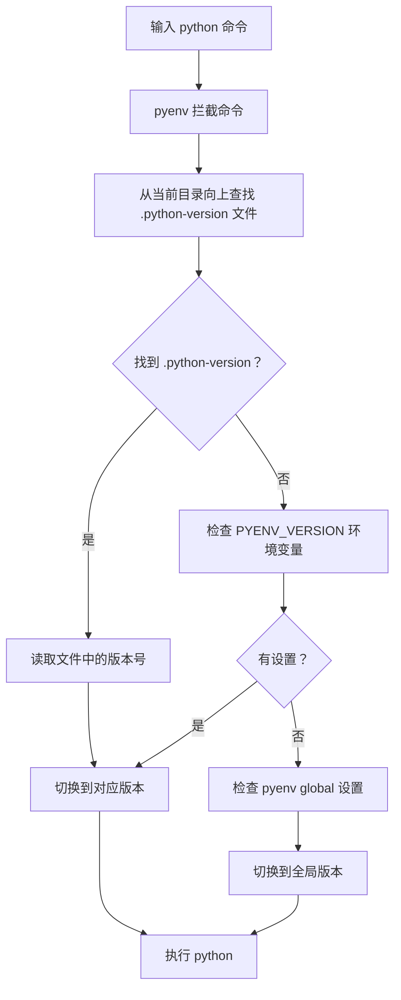

+++
title = "第4章 版本管理工具"
weight = 40
date = "2026-04-08T13:22:00+08:00"
type = "docs"
description = ""
isCJKLanguage = true
draft = false
+++

# 第四章：Python 版本管理器 —— 让 Python 学会「影分身术」

> 💡 **前置知识**：本章节会用到一点终端/命令行的概念，如果你还不知道终端是什么，建议先翻到附录看看"终端入门"。
>
> **章节难度**：⭐⭐ ☆☆☆（适中）
>
> **预计阅读时间**：25~35 分钟

---

想象一下这个场景：

你同时维护三个项目：

- 项目 A 用的是 Django 2.2，只支持 Python 3.6
- 项目 B 是个新潮的 AI 项目，必须用 Python 3.12
- 项目 C 是个祖传项目，Python 3.8，跑得好好的不敢动

然后有一天，你的 macOS 系统更新了，系统自带的 Python 从 3.9 变成了 3.11，你的老项目突然跑不起来了……

恭喜你，你进入了 **Python 版本地狱**。🤯

这一章，我们就是来学习怎么从地狱爬出来的。工具包括：**pyenv**、**pyenv-win**、**uv**、**conda**、**py.exe**、**asdf**。每个工具都有它的独门绝技，让我们一个一个来认识。

---

## 4.1 为什么需要 Python 版本管理器

### 4.1.1 不同项目依赖不同 Python 版本

Python 就像一个操作系统的「租客」—— 操作系统本身只提供一个「空房子」（也就是系统自带的 Python），但不同的项目需要不同「装修风格」的 Python。

举个例子：

| 项目 | 需要的 Python 版本 | 原因 |
|------|-------------------|------|
| 老旧运维脚本 | Python 3.6 | 稳定，不敢升级 |
| Web 后端项目 | Python 3.10 | Django 4.2 LTS 要求 |
| AI/ML 项目 | Python 3.12 | 需要新特性，NumPy 也要新版 |
| 尝鲜项目 | Python 3.13 | 就是想玩最新版 |

如果你的电脑只能装 **一个** Python 版本，那你每次切换项目都得重新安装/卸载 Python——这比搬家还麻烦。

版本管理器的作用就是：**在一台机器上同时安装多个 Python 版本，想用哪个用哪个，一键切换。**

### 4.1.2 系统 Python 与项目 Python 隔离

**系统 Python**（System Python）是操作系统自带的 Python。比如：

- macOS 自带 Python 2.7（别问为什么，问就是历史遗留）
- Ubuntu/Debian 通常自带一个 Python 3.x
- Windows 商店里可能有一个 Python

**⚠️ 重要警告**：**永远不要用 pip 安装包到系统 Python！**

为什么？因为：

1. **权限问题**：系统目录需要管理员权限，普通用户往里安装东西容易出权限错误
2. **污染环境**：你安装的包会影响系统工具（比如某些 Linux 发行版依赖系统自带的 Python 来运行系统工具）
3. **版本冲突**：系统工具可能依赖某个特定版本的包，你一升级，全系统一起崩溃

> **正确的做法**：每个项目用自己独立的 Python 环境，版本管理器帮你隔离。

### 4.1.3 快速切换版本的场景

你可能会想："我又不做那么多项目，干嘛要切换？"

好吧，让我给你列举几个真实场景：

**场景 1：调试兼容性 bug**
你的用户报告说在 Python 3.8 上运行报错，但你本地是 3.12，用版本管理器切到 3.8 分分钟复现问题。

**场景 2：测试你的代码在不同版本下的表现**
你想确认你的代码从 3.8 到 3.12 都能跑，版本管理器一键切换测试。

**场景 3：临时用一下新版本**
Python 3.13 发布了大新闻，你想赶紧试试新特性，但又不想污染现有环境。

**场景 4：给同事演示**
你发现了一个 Python 3.11 才有的语法糖，想给还在用 3.9 的同事展示……

版本管理器就是 Python 界的「任意门」，想去哪个版本就去哪个版本。

### 4.1.4 避免 pip 安装到系统目录

这个问题太重要了，值得单独讲一讲。

当你运行：

```bash
pip install requests
```

pip 默认会往**系统 Python 的 site-packages 目录**里安装。这个目录通常长这样：

- Linux/macOS: `/usr/lib/python3.x/site-packages/`
- Windows: `C:\Python312\lib\site-packages\`

往这里安装包会遇到各种问题：

1. **Permission Denied**（权限被拒绝）—— 普通用户没权限写系统目录
2. **破坏系统依赖**—— 你升级了某个系统依赖，系统工具炸了
3. **版本冲突**—— 项目 A 需要 requests 2.25，项目 B 需要 requests 2.30，矛盾！

**解决方案**：使用版本管理器创建虚拟环境，每个项目有自己独立的「包宇宙」，互不干扰。

> **一句话总结**：pip 是包管理器，但不是环境管理器。想既管理 Python 版本又管理包，请用版本管理器/虚拟环境工具。

---

## 4.2 pyenv：Linux/macOS 最流行

### 4.2.1 pyenv 是什么，它能做什么

**pyenv** 是一个开源的 Python 版本管理器，专门为 Linux 和 macOS 设计。它的核心理念是：

> **「让每个项目使用自己想要的 Python 版本，互不干扰，世界和平。」**

pyenv 的超能力包括：

- 🌍 **安装任意 Python 版本**：CPython（官方版本）、PyPy、Anaconda、Miniconda……都能装
- 🔄 **版本切换**：全局、项目级、shell 级，三种切换方式
- 🛡️ **完全隔离**：不污染系统 Python
- 📦 **配合 pyenv-virtualenv**：还能管理虚拟环境

**pyenv 工作原理（简单科普）**：

pyenv 会拦截你的 `python` 命令调用。它通过**修改 PATH 环境变量**，把自己管理的 Python 版本「插入」到系统 Python 前面。当你输入 `python` 时，实际运行的是 pyenv 选择的版本。

这个原理你不需要背，但知道一下有助于理解为什么它能工作。

### 4.2.2 pyenv 安装（macOS via Homebrew）

macOS 上最简单的方式是用 **Homebrew**（ macOS 著名的包管理器）安装。

#### 4.2.2.1 brew install pyenv

打开你的终端，输入：

```bash
brew install pyenv
```

Homebrew 会自动下载并安装 pyenv。安装完成后，你啥也看不到——因为它只是一个命令行工具，没有图形界面。

> 🎉 **恭喜**：你刚安装了一个「无形的 Python 版本管家」！

#### 4.2.2.2 安装后配置 .zshrc / .bashrc

安装完了还不够，你得告诉你的终端「每次打开时自动启用 pyenv」。

**首先**，判断你用的是什么 shell：

```bash
echo $SHELL
# 如果输出是 /bin/zsh → 你用的是 zsh（macOS 默认）
# 如果输出是 /bin/bash → 你用的是 bash
```

**然后**，根据你的 shell 编辑配置文件：

**对于 zsh（推荐）**：

```bash
# 打开配置文件
nano ~/.zshrc
```

在文件末尾添加以下内容：

```bash
# pyenv 配置
export PYENV_ROOT="$HOME/.pyenv"
export PATH="$PYENV_ROOT/bin:$PATH"
eval "$(pyenv init -)"
```

**对于 bash**：

```bash
# 打开配置文件
nano ~/.bashrc
```

添加：

```bash
# pyenv 配置
export PYENV_ROOT="$HOME/.pyenv"
export PATH="$PYENV_ROOT/bin:$PATH"
eval "$(pyenv init -)"
```

> 💡 **nano 编辑器小提示**：编辑完成后，按 `Ctrl + O` 保存，`Ctrl + X` 退出。

#### 4.2.2.3 source 配置文件

配置写好了，但当前 shell 还没生效。输入：

```bash
source ~/.zshrc   # 如果你用的是 zsh
source ~/.bashrc  # 如果你用的是 bash
```

或者干脆**关闭终端再重新打开**，效果一样。

**验证安装成功**：

```bash
pyenv --version
# 输出类似：pyenv 2.x.x
```

如果显示了版本号，恭喜！pyenv 已经就位了！🎊

### 4.2.3 pyenv 安装（Ubuntu / Debian via GitHub）

如果你用的是 Linux（Ubuntu、Debian 等），可以用 GitHub 克隆的方式安装。

#### 4.2.3.1 GitHub 克隆安装

```bash
# 克隆 pyenv 到家目录
git clone https://github.com/pyenv/pyenv.git ~/.pyenv
```

这会在你的 `~/.pyenv` 目录下创建 pyenv 的代码仓库。

#### 4.2.3.2 配置环境变量

编辑你的 shell 配置文件（通常是 `~/.bashrc` 或 `~/.zshrc`）：

```bash
nano ~/.bashrc
```

在末尾添加：

```bash
# pyenv 环境变量
export PYENV_ROOT="$HOME/.pyenv"
export PATH="$PYENV_ROOT/bin:$PATH"

# pyenv 初始化（关键！）
eval "$(pyenv init -)"
```

保存退出。

#### 4.2.3.3 安装 pyenv-doctor 检查

pyenv 官方提供了一个检测脚本 `pyenv-doctor`，可以检查你的系统是否满足 pyenv 的依赖要求。

```bash
# 安装 pyenv-doctor
git clone https://github.com/pyenv/pyenv-doctor.git ~/.pyenv/plugins/pyenv-doctor
```

然后运行：

```bash
pyenv doctor
```

它会扫描你的系统，告诉你缺了什么依赖、什么配置不对。就像一个「Python 环境体检报告」。

> 🩺 **小贴士**：如果报告里出现红色的警告，不用太慌，但最好按建议安装对应的包。

### 4.2.4 编译依赖安装（必须先装！）

**⚠️ 重点警告**：在安装 Python 之前，你必须先安装**编译依赖**！否则 pyenv 会下载 Python 源码但编译失败，你将得到一堆看不懂的错误信息。

pyenv 从源码安装 Python，所以需要 C 编译器等工具。

#### 4.2.4.1 macOS 需要安装的依赖

macOS 用户用 Homebrew 安装即可：

```bash
brew install openssl@3 readline sqlite3 xz zlib tcl-tk
```

> 🐧 **解释**：这些都是 Python 编译和运行时需要的依赖库。比如 `openssl` 用于 HTTPS 请求，`zlib` 用于压缩，`tcl-tk` 用于 Tkinter（GUI 库）。

安装完可能还需要配置：

```bash
# 为 Python 配置 SSL（让 requests 等库能正常工作）
export LDFLAGS="-L$(brew --prefix openssl@3)/lib"
export CPPFLAGS="-I$(brew --prefix openssl@3)/include"
export PKG_CONFIG_PATH="$(brew --prefix openssl@3)/lib/pkgconfig"
```

#### 4.2.4.2 Ubuntu/Debian 需要安装的依赖

Ubuntu/Debian 用户用 apt 安装：

```bash
sudo apt update
sudo apt install -y build-essential libssl-dev zlib1g-dev libbz2-dev \
libreadline-dev libsqlite3-dev curl libncursesw5-dev xz-utils tk-dev \
libxml2-dev libxmlsec1-dev libffi-dev liblzma-dev
```

> 🐧 **解释**：
> - `build-essential`：GCC 编译器等基础构建工具
> - `libssl-dev`：OpenSSL 开发库（用于 HTTPS）
> - `zlib1g-dev`：zlib 压缩库
> - `tk-dev`：Tkinter 图形库
> - 剩下的都是各种 Python 依赖库的_headers

**Debian 12+ 用户额外注意**：

```bash
sudo apt install -y libffi-dev liblzma-dev libmpdec-dev
```

### 4.2.5 使用 pyenv 安装 Python

好了，依赖装好了，现在开始安装 Python！

#### 4.2.5.1 pyenv install --list（查看可安装版本）

```bash
pyenv install --list
```

这个命令会列出 pyenv 支持安装的所有 Python 版本。输出会很长（几百个），包含：

- **官方 CPython 版本**：如 `3.8.19`、`3.9.19`、`3.10.14`、`3.11.9`、`3.12.3`、`3.13.0` 等
- **PyPy 版本**：如 `pypy3.10-7.3.16`
- **Anaconda/Miniconda 版本**：如 `anaconda3-2024.02-1`
- **其他**：如 `mypy-0.982` 等

> 🔍 **小技巧**：列表太长了，可以用 `grep` 过滤：
> ```bash
> pyenv install --list | grep " 3.12"
> # 只显示 3.12 相关的版本
> ```

#### 4.2.5.2 pyenv install 3.12.3（安装指定版本）

选择一个版本，开始安装：

```bash
pyenv install 3.12.3
```

pyenv 会：

1. 从 python.org 下载指定版本的源码（.tar.xz 包）
2. 解压到 `~/.pyenv/cache/`（如果你提前放进去，它就用缓存）
3. 编译（这可能需要几分钟，取决于你的电脑性能）
4. 安装到 `~/.pyenv/versions/`

> ⏳ **等多久？**：首次安装可能需要 3~10 分钟。如果太慢，可以把源码提前下载到 `~/.pyenv/cache/` 目录，pyenv 会自动使用。

**安装多个版本**：

```bash
pyenv install 3.8.19    # 旧项目用
pyenv install 3.10.14   # 主力版本
pyenv install 3.12.3    # 新项目用
pyenv install 3.13.0    # 尝鲜用
```

现在你有四个 Python 版本了，想用哪个用哪个！

#### 4.2.5.3 安装位置：~/.pyenv/versions/

所有通过 pyenv 安装的 Python 版本都放在：

```
~/.pyenv/versions/
```

目录结构是这样的：

```
~/.pyenv/versions/
├── 3.8.19/          # Python 3.8.19
│   ├── bin/         # 可执行文件：python3.8, pip3.8 等
│   ├── include/     # 头文件
│   ├── lib/         # 标准库
│   └── share/       # 文档、man pages
├── 3.10.14/         # Python 3.10.14
│   └── ...
├── 3.12.3/          # Python 3.12.3
│   └── ...
└── 3.13.0/          # Python 3.13.0
    └── ...
```

每个版本都是完全独立的「小宇宙」，互不干扰。

### 4.2.6 pyenv 版本切换

pyenv 提供了三种版本切换方式，适合不同的使用场景。

#### 4.2.6.1 pyenv global 3.12.3（全局版本）

设置**系统全局**默认使用的 Python 版本：

```bash
pyenv global 3.12.3
```

之后你在**任何地方**输入 `python`，默认都会用 3.12.3。

> ⚠️ **注意**：`global` 影响整个系统（当前用户），但不建议用 `global` 来管理项目级别的 Python，否则换项目时还得重新设置。

**查看全局版本**：

```bash
pyenv global
# 输出：3.12.3
```

**撤销全局设置**（恢复系统 Python）：

```bash
pyenv global system
```

#### 4.2.6.2 pyenv local 3.10.14（项目本地版本，创建 .python-version）

在**当前目录**创建一个 `.python-version` 文件，记录版本号：

```bash
cd ~/my-awesome-project   # 进入你的项目目录
pyenv local 3.10.14       # 设置项目级 Python
```

这会在当前目录生成一个 `.python-version` 文件：

```bash
cat .python-version
# 输出：3.10.14
```

以后只要你在这个目录下（或子目录），pyenv 自动使用 3.10.14。

> 🎯 **推荐方式**：项目级版本管理用 `local`，这是最常见的方式。

**撤销本地设置**：

```bash
pyenv local --unset
# 会删除 .python-version 文件
```

#### 4.2.6.3 pyenv shell 3.13.0（当前 shell 会话）

只影响**当前终端窗口/会话**，退出窗口就没了：

```bash
pyenv shell 3.13.0
```

这会设置一个 `PYENV_VERSION` 环境变量，只在当前 shell 生效。

**撤销 shell 设置**：

```bash
pyenv shell --unset
```

#### 4.2.6.4 pyenv versions（查看已安装版本）

查看 pyenv 已经安装的所有 Python 版本：

```bash
pyenv versions
```

输出类似：

```
  system
* 3.8.19 (set by /Users/xxx/.pyenv/version)
  3.10.14
  3.12.3
  3.13.0
```

解释：

- `system`：系统自带的 Python
- `*`：当前激活的版本
- `(set by ...)`：说明这个版本是通过什么方式激活的（文件路径或环境变量）

**优先级规则**（从高到低）：

```
pyenv shell (环境变量 PYENV_VERSION)
  ↓
.pyenv-version 文件（当前目录往上查找）
  ↓
.pyenv/version 文件（当前目录的 .python-version）
  ↓
pyenv global 全局设置
  ↓
system（系统 Python）
```

### 4.2.7 .python-version 文件的作用

#### 4.2.7.1 自动切换原理

当你输入 `python` 命令时，pyenv 的工作流程是这样的：



也就是说：**只要目录里有 `.python-version` 文件，pyenv 自动切换到指定版本**，你不需要手动做任何事情。

#### 4.2.7.2 放到 Git 中实现团队统一版本

把 `.python-version` 文件提交到 Git，团队成员 clone 后自动使用统一版本！

```bash
# 在项目根目录
echo "3.10.14" > .python-version
git add .python-version
git commit -m "Add .python-version for team consistency"
git push
```

现在团队里的小李、小王、小张 clone 这个仓库后，运行 `python` 时都会自动使用 3.10.14，版本统一，天下太平！🕊️

> 💡 **最佳实践**：在 `.gitignore` 中忽略 `venv/`、`__pycache__/` 等虚拟环境和缓存目录，但**保留 `.python-version`**。

### 4.2.8 pyenv-virtualenv 插件

pyenv 本身只管理 Python 版本，**不管理虚拟环境**。如果你想要类似「每个项目有自己独立的包」的功能，需要安装 `pyenv-virtualenv` 插件。

#### 4.2.8.1 安装插件

```bash
# 克隆 pyenv-virtualenv 插件
git clone https://github.com/pyenv/pyenv-virtualenv.git $(pyenv root)/plugins/pyenv-virtualenv
```

#### 4.2.8.2 配置初始化

在 `~/.zshrc` 或 `~/.bashrc` 中添加：

```bash
eval "$(pyenv virtualenv-init -)"
```

然后 `source` 配置文件：

```bash
source ~/.zshrc
```

#### 4.2.8.3 创建虚拟环境

```bash
# 创建一个基于 Python 3.10.14 的虚拟环境，名字叫 myproject
pyenv virtualenv 3.10.14 myproject
```

这会在 `$(pyenv root)/versions/` 下创建一个 `myproject` 目录，里面是一个独立的 Python 环境。

#### 4.2.8.4 激活与停用

**激活虚拟环境**：

```bash
# 方法 1：进入项目目录后自动激活（需要在 .python-version 中指定）
pyenv local myproject

# 方法 2：手动激活
pyenv activate myproject

# 方法 3：使用 workon（如果配置了）
workon myproject
```

激活后，你的终端会显示类似 `(myproject)` 的前缀，表示你在虚拟环境里。

**停用虚拟环境**：

```bash
pyenv deactivate
```

**其他常用命令**：

```bash
# 列出所有虚拟环境
pyenv virtualenvs

# 删除虚拟环境
pyenv virtualenv-delete myproject
```

---

## 4.3 pyenv-windows：Windows 上的 pyenv

### 4.3.1 安装 pyenv-win

pyenv 原本不支持 Windows，但有人开发了 **pyenv-win**——pyenv 的 Windows 版本。

> ⚠️ **重要**：pyenv-win 只管理 Python 版本，**不支持 pyenv-virtualenv**。Windows 上管理虚拟环境建议用 venv、virtualenv 或 uv。

#### 4.3.1.1 PowerShell 安装方式

打开 **PowerShell**（以管理员身份运行），输入：

```powershell
# 方法 1：使用 pip 安装
pip install pyenv-win

# 方法 2：或者用 pipx（更干净）
pipx install pyenv-win
```

> 💡 **pipx 是什么？**：pipx 是一个专门用来安装 Python 命令行工具的工具，它可以隔离安装，避免污染系统环境。

#### 4.3.1.2 解压配置

如果你下载了 release 包（.zip），解压到你想存放 pyenv 的目录（不要放在 C:\Windows 下！），然后手动设置环境变量：

```powershell
# 设置环境变量（PowerShell 管理员模式）
[System.Environment]::SetEnvironmentVariable('PYENV', 'C:\Tools\pyenv-win', 'User')
[System.Environment]::SetEnvironmentVariable('PYENV_ROOT', 'C:\Tools\pyenv-win', 'User')
[System.Environment]::SetEnvironmentVariable('PYENV_HOME', 'C:\Tools\pyenv-win', 'User')
```

将 `C:\Tools\pyenv-win\bin` 和 `C:\Tools\pyenv-win\shims` 添加到 PATH。

### 4.3.2 pyenv-win 命令

pyenv-win 的命令和 pyenv 几乎一样，但前面可能需要加 `pyenv` 或直接用。

#### 4.3.2.1 pyenv install --list

```powershell
pyenv install --list
```

列出所有可安装的 Python 版本。

#### 4.3.2.2 pyenv install 3.12.3

```powershell
pyenv install 3.12.3
```

安装指定版本。Windows 上 pyenv-win 通常下载的是预编译的安装包（.exe），比从源码编译快很多。

#### 4.3.2.3 pyenv global 3.12.3

```powershell
pyenv global 3.12.3
```

设置全局默认 Python 版本。

**其他常用命令**：

```powershell
pyenv local 3.10.14    # 项目级设置
pyenv versions         # 查看已安装版本
pyenv uninstall 3.8.19 # 卸载某个版本
```

### 4.3.3 与 py.exe（Python Launcher）的区别

#### 4.3.3.1 Python Launcher 是 Windows 自带的

**py.exe** 是 Windows 自带的 Python 版本启动器，安装 Python 时自动带上。它位于 `C:\Windows\py.exe`。

#### 4.3.3.2 pyenv-win 是第三方版本管理器

| 对比项 | py.exe | pyenv-win |
|--------|--------|-----------|
| 来源 | Windows 自带 | 第三方开源 |
| 安装 | Python 安装时自带 | 需要手动安装 |
| 功能 | 简单版本选择 | 完整版本管理 |
| 虚拟环境 | 不支持 | 不支持（但可配合其他工具） |
| 适用场景 | 临时运行不同版本 | 日常版本管理 |

> 💡 **建议**：Windows 用户可以**同时安装两者**——py.exe 用于临时运行脚本指定版本，pyenv-win 用于日常版本管理。

---

## 4.4 uv：2024 年最火爆的 Python 包管理器

### 4.4.1 uv 是什么

**uv** 是 2023~2024 年 Python 生态最火爆的工具没有之一。它是一个用 **Rust** 编写的极速 Python 包管理器。

#### 4.4.1.1 Rust 编写，极速（比 pip 快 10~100 倍）

uv 的核心卖点就是**快**！它的安装和包解析速度比 pip 快 10~100 倍，原因是：

- **Rust 编写**：编译型语言，执行效率极高
- **并行下载**：同时下载多个包
- **高效解析**：依赖解析算法优化
- **全局缓存**：已下载的包复用，不重复下载

> 🚀 **实际感受**：用 uv 安装一个中等规模的项目（50+ 包），可能只需要 5~10 秒，而用 pip 可能要 1~3 分钟。

#### 4.4.1.2 同时管理 Python 版本和虚拟环境

uv 不仅仅是一个包管理器，它是**全能选手**：

- 📦 **包管理**：安装、升级、卸载 Python 包（替代 pip）
- 🐍 **版本管理**：安装和管理不同 Python 版本（替代 pyenv）
- 🌿 **虚拟环境**：创建和管理虚拟环境（替代 venv）

一个工具，三种功能！这也是它爆火的原因之一。

#### 4.4.1.3 作者：astral-sh 团队

uv 由 **Astral** 团队开发，这个团队还开发了著名的 ** ruff**（超快的 Python linter）和 **uv** 本身。Astral 致力于打造极致的 Python 开发工具。

### 4.4.2 uv 安装

#### 4.4.2.1 macOS/Linux 安装方式

```bash
# macOS / Linux 一键安装
curl -LsSf https://astral.sh/uv/install.sh | sh
```

或者用 Homebrew：

```bash
brew install uv
```

#### 4.4.2.2 Windows 安装方式

**PowerShell**：

```powershell
powershell -ExecutionPolicy ByPass -c "irm https://astral.sh/uv/install.ps1 | iex"
```

或者用 pip：

```powershell
pip install uv
```

#### 4.4.2.3 验证：uv --version

```bash
uv --version
# 输出类似：uv 0.5.0 或更高版本
```

### 4.4.3 使用 uv 安装 Python

uv 自带 Python 版本管理功能，不需要额外安装 pyenv！

#### 4.4.3.1 uv python install（最新稳定版）

```bash
uv python install
```

这会安装**最新的稳定版 Python**（通常是 3.12.x 或 3.13.x）。

#### 4.4.3.2 uv python install 3.12

```bash
uv python install 3.12
```

安装 Python 3.12（会自动选择最新的 3.12 子版本，如 3.12.3）。

```bash
# 安装特定版本
uv python install 3.11.9
uv python install 3.10.14
uv python install 3.13.0
```

#### 4.4.3.3 uv python list（列出已安装版本）

```bash
uv python list
```

输出类似：

```
cpython-3.12.3+freebsd-x86_64      /Users/xxx/.local/share/uv/python/cpython-3.12.3+freebsd-x86_64/bin/python3.12
cpython-3.13.0+freethreaded-x86_64 /Users/xxx/.local/share/uv/python/cpython-3.13.0+freethreaded-x86_64/bin/python3.13
cpython-3.10.14-linux-x86_64       /Users/xxx/.local/share/uv/python/cpython-3.10.14-linux-x86_64/bin/python3.10
```

#### 4.4.3.4 uv python pin 3.12（固定版本）

在项目目录中固定 Python 版本：

```bash
uv python pin 3.12
```

这会在项目目录创建一个 `.python-version` 文件（与 pyenv 兼容！）：

```bash
cat .python-version
# 输出：3.12
```

### 4.4.4 使用 uv 创建虚拟环境

uv 创建虚拟环境既快又简单。

#### 4.4.4.1 uv venv（创建 .venv）

```bash
# 在当前目录创建 .venv 虚拟环境（使用默认 Python）
uv venv
```

默认使用当前 pyenv/uv 激活的 Python 版本。

#### 4.4.4.2 uv venv myenv --python 3.12

创建一个叫 `myenv` 的虚拟环境，使用 Python 3.12：

```bash
uv venv myenv --python 3.12
```

#### 4.4.4.3 uv venv .venv --python python3.13

创建一个标准的 `.venv` 目录，使用 Python 3.13：

```bash
uv venv .venv --python python3.13
```

**激活虚拟环境**：

```bash
# Linux/macOS
source .venv/bin/activate

# Windows PowerShell
.venv\Scripts\Activate.ps1
```

**停用**：

```bash
deactivate
```

### 4.4.5 uv 管理依赖

uv 的 pip 子命令可以替代 pip 使用。

#### 4.4.5.1 uv pip install requests

```bash
uv pip install requests
# 输出：Installed 1 package in 125ms
```

比 pip 快了不止一点点！

#### 4.4.5.2 uv pip install -r requirements.txt

```bash
uv pip install -r requirements.txt
```

批量安装依赖，秒完！

#### 4.4.5.3 uv pip freeze 导出依赖

```bash
uv pip freeze
# 输出：
# requests==2.31.0
# urllib3==2.2.1
# charset-normalizer==3.3.2
# ...
```

重定向到文件：

```bash
uv pip freeze > requirements.txt
```

### 4.4.6 uv vs pip vs poetry 性能对比

| 指标 | pip | poetry | uv |
|------|-----|--------|-----|
| 安装速度 | 慢 | 慢 | ⚡ 极快 |
| 依赖解析 | 一般 | 好 | 很好 |
| 锁文件 | 无 | pyproject.toml | uv.lock |
| Python 版本管理 | 无 | 无 | ✅ |
| 虚拟环境管理 | 无 | ✅ | ✅ |
| 学习曲线 | 低 | 中 | 低 |

> 🎯 **结论**：uv 可以完全替代 pip，速度碾压；配合 pyproject.toml 也能替代 poetry，但生态还在发展中。

### 4.4.7 uv 运行脚本

uv 最酷的功能之一：**可以直接运行脚本，无需手动创建环境**。

#### 4.4.7.1 uv run --python 3.12 python script.py

```bash
uv run --python 3.12 python script.py
```

uv 会：

1. 自动下载 Python 3.12（如果还没有）
2. 创建一个临时的虚拟环境
3. 运行脚本
4. 清理临时环境（可选）

#### 4.4.7.2 uv run pytest（自动创建临时环境）

```bash
uv run pytest
```

如果项目有 `pyproject.toml` 或 `requirements.txt`，uv 会：

1. 读取依赖
2. 在临时环境中安装
3. 运行 pytest
4. 完成后保留或清理环境

> 💡 **场景**：你在一个没有虚拟环境的项目里，想运行测试，直接 `uv run pytest`，不用先 activate 环境！

---

## 4.5 conda / mamba：数据科学领域

### 4.5.1 Anaconda、MiniConda、Miniforge 的区别

如果你做数据科学、机器学习、AI，你一定听说过 **conda**、**Anaconda**、**MiniConda**、**Miniforge** 这些名字。它们到底是什么？有什么区别？

#### 4.5.1.1 Anaconda：完整发行版（包含 250+ 包）

**Anaconda** 是一个**一站式 Python 发行版**，预装了大量数据科学常用的库，包括：

- NumPy、Pandas、Matplotlib、Scikit-learn
- Jupyter Notebook、Spyder
- TensorFlow、PyTorch（部分版本）

适合懒人——下载安装完，什么都有了。

> ⚠️ **缺点**：Anaconda 体积巨大（几个 GB），而且预装的很多包你可能永远用不到。

#### 4.5.1.2 MiniConda：最小化 conda 安装

**MiniConda** 是 Anaconda 的**精简版**。它只包含：

- conda 本身（包管理器）
- Python
- 一些基础工具（curl、wget 等）

其他包你需要手动 `conda install`。体积只有几百 MB。

> 💡 **推荐**：除非你确定需要 Anaconda 预装的所有东西，否则 **MiniConda 是更好的选择**。

#### 4.5.1.3 Miniforge：使用 conda-forge 频道的 Miniconda

**Miniforge** 本质上就是一个 Miniconda，但它默认使用 **conda-forge** 频道而不是 Anaconda 官方频道。

> 📖 **什么是 conda-forge？**：一个社区维护的 conda 包仓库，包的种类比官方多，很多官方没有的包这里有。

**三者对比**：

| | Anaconda | MiniConda | Miniforge |
|---|----------|-----------|-----------|
| 体积 | ~3GB+ | ~400MB | ~400MB |
| 预装包 | 250+ | 仅基础 | 仅基础 |
| 默认频道 | Anaconda | Anaconda | conda-forge |
| 免费 | ✅（免费） | ✅（免费） | 免费开源 |
| 适用场景 | 懒人一键配置 | 自定义安装 | 追求新包/开源 |

### 4.5.2 conda 安装

#### 4.5.2.1 下载安装脚本

去官网下载对应系统的安装脚本：

- MiniConda：https://docs.anaconda.com/miniconda/
- Miniforge：https://github.com/conda-forge/miniforge

或者用命令行下载：

```bash
# 下载 Miniforge（Linux/macOS）
curl -L -O "https://github.com/conda-forge/miniforge/releases/latest/download/Miniforge3-$(uname)-$(uname -m).sh"
```

#### 4.5.2.2 运行安装

```bash
# 运行安装脚本
bash Miniforge3-Linux-x86_64.sh
```

安装过程：

1. 阅读许可证，按 `Enter` 跳过
2. 输入 `yes` 接受条款
3. 选择安装位置（默认即可）
4. 问你是否初始化 conda，输入 `yes`

安装完成后，**重新打开终端**或 `source` 一下，conda 就启用了。

**验证安装**：

```bash
conda --version
# 输出：conda 24.x.x
```

### 4.5.3 conda 常用命令

conda 有自己的一套命令，和 pip/pyenv 不一样。

#### 4.5.3.1 conda create -n myenv python=3.12

创建一个新环境：

```bash
conda create -n myenv python=3.12
```

这会创建一个叫 `myenv` 的环境，使用 Python 3.12。

**创建时安装多个包**：

```bash
conda create -n myenv python=3.12 numpy pandas matplotlib
```

#### 4.5.3.2 conda activate myenv

激活环境：

```bash
conda activate myenv
```

激活后，终端前缀会变成 `(myenv)`。

> ⚠️ **旧版 conda**：在旧版 conda 中，激活命令是 `source activate myenv`。新版（conda 4.6+）推荐 `conda activate`。

#### 4.5.3.3 conda deactivate

退出当前环境：

```bash
conda deactivate
```

#### 4.5.3.4 conda env list

列出所有环境：

```bash
conda env list
```

输出：

```
# conda environments:
#
base                  /home/xxx/miniconda3
myenv                 /home/xxx/miniconda3/envs/myenv
data-science          /home/xxx/miniconda3/envs/data-science
```

#### 4.5.3.5 conda env remove -n myenv

删除环境：

```bash
conda env remove -n myenv
```

**其他常用 conda 命令**：

```bash
conda install requests    # 安装包
conda update numpy         # 更新包
conda remove requests      # 卸载包
conda list                 # 查看当前环境已安装的包
conda search numpy         # 搜索包
conda info                 # 查看 conda 信息
```

### 4.5.4 conda 环境导出与导入

conda 的环境管理功能非常强大，可以导出/导入环境配置。

#### 4.5.4.1 conda env export > environment.yml

在项目目录中导出当前环境：

```bash
conda activate myenv
conda env export > environment.yml
```

生成的 `environment.yml` 类似：

```yaml
name: myenv
channels:
  - defaults
  - conda-forge
dependencies:
  - python=3.12
  - numpy=1.26.0
  - pandas=2.1.0
  - pip=23.3.1
  - pip:
    - requests=2.31.0
```

#### 4.5.4.2 conda env create -f environment.yml

在新机器或新环境中重建：

```bash
conda env create -f environment.yml
```

conda 会根据 `environment.yml` 创建环境并安装所有依赖，一条命令搞定！

> 💡 **小技巧**：把 `environment.yml` 提交到 Git，团队成员就能轻松复现环境了！

### 4.5.5 mamba：C++ 重写的 conda 加速版

**mamba** 是 conda 的**马甲**（雾），实际上是 conda 的 C++ 重写版，专门解决 conda 最大的痛点：**慢**。

conda 的依赖解析是用 Python 写的，在复杂项目下可能需要几分钟。mamba 用 C++ 重写了核心的依赖解析逻辑，速度提升 10~50 倍！

#### 4.5.5.1 安装 mamba

Miniforge 默认就包含 mamba！如果你是用 Miniforge 安装的，直接就有：

```bash
mamba --version
# 输出：mamba 1.5.x
```

如果不是，用 conda 安装 mamba：

```bash
conda install mamba -n base -c conda-forge
```

#### 4.5.5.2 mamba install xxx（替代 conda install）

mamba 的命令和 conda 完全兼容，只需要把 `conda` 换成 `mamba`：

```bash
mamba install numpy pandas matplotlib
mamba install python=3.12
mamba create -n myenv python=3.12
```

> 🚀 **实测**：在一个有 100+ 依赖的项目中，`conda install` 花了 3 分 12 秒，`mamba install` 只花了 18 秒。差距就是这么大！

---

## 4.6 Python Launcher（py.exe）：Windows 内置

### 4.6.1 py.exe 是什么

**py.exe** 是 Windows 自带的 Python 启动器，只要你从 python.org 官网安装了 Python，就自动有了。

#### 4.6.1.1 Windows 安装 Python 时自动安装

安装 Python 时，py.exe 会被自动安装到 `C:\Windows\py.exe`。你不需要额外做任何事。

#### 4.6.1.2 位于：C:\Windows\py.exe

打开命令提示符（CMD）或 PowerShell，输入：

```powershell
where py
# 输出：C:\Windows\py.exe
```

### 4.6.2 py.exe 基本用法

#### 4.6.2.1 py --list（列出所有已安装版本）

```powershell
py --list
```

输出类似：

```
Installed Pythons:
  3.13 (64-bit) *
  3.12 (64-bit)
  3.10 (64-bit)
```

> 💡 **星号**表示默认版本。

#### 4.6.2.2 py -3.12 script.py（运行指定版本）

```powershell
# 用 Python 3.12 运行脚本
py -3.12 script.py

# 简写形式
py -3.12 script.py

# 如果你只想用默认版本
py script.py
```

#### 4.6.2.3 py -3.12 -m pip install xxx

用指定版本 Python 的 pip 安装包：

```powershell
py -3.12 -m pip install requests
```

> 💡 **小技巧**：如果你同时装了多个 Python 版本，用 `py -3.x -m pip` 比直接用 `pip` 更安全，可以避免包安装到错误的 Python 版本。

### 4.6.3 shebang 行在 Windows 的支持

#### 4.6.3.1 #! python3 在 Windows 的行为

在 Linux/macOS 上，脚本第一行的 `#!/usr/bin/env python3` 叫 **shebang**（读作 "sharp bang"，也叫 hash-bang），告诉系统用哪个解释器运行脚本。

在 Windows 上，py.exe 支持类似的功能！如果你在脚本第一行写：

```python
#! python3
print("Hello, World!")
```

然后双击或用 `py` 命令运行，py.exe 会读取 shebang 并使用对应的 Python 版本。

> ⚠️ **注意**：Windows 上 shebang 支持是 py.exe 特有的，不是一般的 Windows 行为。

#### 4.6.3.2 py.ini 配置文件

py.exe 有一个配置文件，可以设置默认行为。在脚本同目录或用户目录（`%USERPROFILE%`）创建 `py.ini`：

```ini
[commands]
python = C:\Python312\python.exe
```

这样可以自定义 py.exe 的行为。

---

## 4.7 asdf：通用版本管理器

### 4.7.1 asdf 是什么

**asdf** 是一个**通用版本管理器**，可以管理**多种编程语言**的版本。

#### 4.7.1.1 支持多种语言：Python、Node.js、Ruby、Go...

asdf 的核心理念是：**一个工具，管理所有语言**。只需安装一次 asdf，通过插件支持不同的语言：

- 🐍 Python
- 🟢 Node.js
- 💎 Ruby
- 🔵 Go
- 🦀 Rust
- ☕ Java
- 等等……

#### 4.7.1.2 单工具管理所有语言版本

你不再需要：

- pyenv 管理 Python
- nvm 管理 Node.js
- rbenv 管理 Ruby
- goenv 管理 Go

asdf 一个就搞定！✅

### 4.7.2 asdf 安装

#### 4.7.2.1 macOS 安装方式

```bash
# 用 Homebrew 安装
brew install asdf
```

安装完成后，需要添加到 shell 配置。根据你用的 shell：

**zsh**：

```bash
echo '. $(brew --prefix asdf)/libexec/asdf.sh' >> ~/.zshrc
```

**bash**：

```bash
echo '. $(brew --prefix asdf)/libexec/asdf.sh' >> ~/.bashrc
```

#### 4.7.2.2 Linux 安装方式

```bash
# 安装依赖
apt update
apt install -y curl git

# 克隆 asdf
git clone https://github.com/asdf-vm/asdf.git ~/.asdf --branch v0.14.0
```

添加到 shell 配置：

**bash**（`~/.bashrc`）：

```bash
. "$HOME/.asdf/asdf.sh"
. "$HOME/.asdf/completions/asdf.bash"
```

**zsh**（`~/.zshrc`）：

```bash
. "$HOME/.asdf/asdf.sh"
fpath+=("$HOME/.asdf/completions")
autoload -Uz compinit
```

### 4.7.3 asdf Python 插件

#### 4.7.3.1 asdf plugin add python

```bash
asdf plugin add python
```

这会添加 Python 插件，让 asdf 知道怎么管理 Python 版本。

#### 4.7.3.2 asdf install python 3.12.3

```bash
asdf install python 3.12.3
```

安装 Python 3.12.3。asdf 会使用 `python-build` 来编译安装 Python。

**安装最新稳定版**：

```bash
asdf install python latest
```

**安装 PyPy**：

```bash
asdf install python pypy3.10-7.3.16
```

#### 4.7.3.3 asdf global python 3.12.3

设置全局默认版本：

```bash
asdf global python 3.12.3
```

**项目级设置**（在项目目录创建 `.tool-versions`）：

```bash
cd ~/my-project
asdf local python 3.10.14
```

asdf 会在当前目录创建 `.tool-versions` 文件，类似于 pyenv 的 `.python-version`：

```
python 3.10.14
nodejs 20.11.0
```

**其他常用命令**：

```bash
asdf list python          # 列出已安装的 Python 版本
asdf list all python      # 列出所有可安装的 Python 版本
asdf uninstall python 3.8.19  # 卸载某个版本
asdf current python        # 查看当前 Python 版本
asdf global python        # 显示全局版本
```

---

## 本章小结

这一章我们学习了 Python 版本管理的各种工具，来做个总结：

### 工具对比一览

| 工具 | 平台 | 版本管理 | 包管理 | 虚拟环境 | 速度 | 难度 |
|------|------|----------|--------|----------|------|------|
| pyenv | Linux/macOS | ✅ | ❌ | 需插件 | 快 | 中 |
| pyenv-win | Windows | ✅ | ❌ | 需其他工具 | 快 | 中 |
| uv | 全平台 | ✅ | ✅ | ✅ | ⚡极速 | 低 |
| conda | 全平台 | ✅ | ✅ | ✅ | 慢（mamba 快） | 中 |
| py.exe | Windows | ✅ | ❌ | ❌ | - | 低 |
| asdf | 全平台 | ✅（多语言） | ❌ | 需插件 | 快 | 中 |

### 核心要点

1. **永远不要往系统 Python 装包**—— 系统 Python 是系统的，用 pip 安装到系统目录会引发各种问题。

2. **每个项目用独立的 Python 环境**—— 版本管理器帮你隔离，切换项目时不会互相影响。

3. **pyenv 是 Linux/macOS 最流行的版本管理器**—— 轻量、简单、专门管 Python 版本。

4. **uv 是 2024 年的明星工具**—— 一个工具同时搞定 Python 版本管理、包管理和虚拟环境，速度极快。

5. **conda 是数据科学领域的首选**—— 自带大量科学计算包，环境管理强大；如果嫌慢，用 mamba 替代。

6. **py.exe 是 Windows 自带的启动器**—— 适合临时指定版本，完整版本管理还是用 pyenv-win。

7. **asdf 适合多语言项目**—— 如果你同时维护 Python、Node.js、Ruby 等多种语言的项目，asdf 一个就够了。

8. **把 `.python-version` 或 `environment.yml` 提交到 Git**—— 让团队成员自动使用统一的 Python 版本，避免"在我电脑上能跑"综合症。

> 🎯 **实战建议**：日常开发推荐组合：
> - **Linux/macOS**：pyenv + pyenv-virtualenv 或直接用 uv
> - **Windows**：pyenv-win + venv 或直接用 uv
> - **数据科学**：Miniforge + mamba
> - **多语言项目**：asdf

学会用版本管理器，你就再也不会陷入"Python 版本地狱"了。切换项目就像翻书页一样轻松！📖✨

---

**← 上一章**：[第三章：Python 安装指南](./Chapter-03-Installation.md)

**→ 下一章**：[第五章：pip 与包管理](./Chapter-05-Package-Manager.md)
