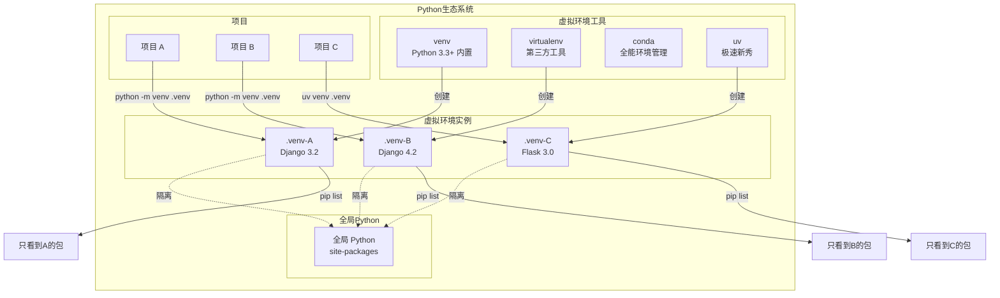

+++
title = "第5章 虚拟环境"
weight = 50
date = "2026-04-08T13:22:00+08:00"
type = "docs"
description = ""
isCJKLanguage = true
draft = false
+++

# 第五章：虚拟环境——Python 界的"独栋别墅"

> 想象一下：你住在一套巨大的公寓里，所有人共享同一个厨房、同一张床、同一个马桶。听起来很恐怖对吧？但如果不使用虚拟环境，这正是你的 Python 项目正在经历的事——所有包挤在一起，版本打架，互相看不顺眼。今天我们就来给每个项目买一套"独栋别墅"。

## 5.1 什么是虚拟环境

### 5.1.1 虚拟环境的概念

**虚拟环境（Virtual Environment）** 是什么？简单来说，它就是一个"独立的小房间"，里面住着你自己专属的 Python 解释器和一堆 Python 包。别人家的 Django 3.x 和你家的 Django 4.x 井水不犯河水，各自岁月静好。

#### 5.1.1.1 每个项目有独立的 Python 解释器和包目录

当你创建一个虚拟环境时，Python 实际上做了这么几件事：

1. **复制一份 Python 解释器**（或者做个链接）到你指定的目录
2. **创建一个独立的包安装目录**，通常是 `Lib/site-packages`（Windows）或 `lib/python3.x/site-packages`（Linux/macOS）
3. **设置环境变量**，让你执行 `python` 和 `pip` 时自动使用这套独立的"班子"

这样一来，每个项目都像住进了自己的独栋别墅，有自己的"厨房"（Python）、自己的"冰箱"（包），互不干扰。

```bash
# 项目A的虚拟环境
项目A/
├── python.exe          # Python 解释器
├── Scripts/            # Windows 下的脚本目录
└── Lib/site-packages/  # 包们的家
    ├── django/          # Django 4.x 住这里
    └── flask/           # Flask 住这里

# 项目B的虚拟环境（完全独立！）
项目B/
├── python.exe
├── Scripts/
└── Lib/site-packages/
    ├── django/          # Django 3.x 住这里（和楼上不是同一套房）
    └── requests/         # 自己的 requests
```

#### 5.1.1.2 避免全局 site-packages 污染

**site-packages** 是什么？它是 Python 安装第三方包（通过 pip install）的默认目录。你可以把它想象成"公共仓库"——所有安装的包都存在这儿。

问题是：如果所有人都往同一个仓库里放东西，这个仓库迟早会乱成一锅粥。你装个包，结果把别人的项目搞挂了；或者你卸载一个包，顺手把别人依赖的包也删了。这就是"全局污染"。

虚拟环境就像是给每个项目发了一张专属仓库的钥匙，进去的包只属于这个项目，外面的包想进来？门儿都没有！

```bash
# 你的全局 site-packages（污染现场）
# C:\Python311\Lib\site-packages\
# - django 4.2
# - flask 3.0
# - requests 2.31
# - numpy 1.26
# - pandas 2.1
# - 你三年前随手装的一个不知名包
# - 你同事装的一个神秘版本
# - 不知道谁装的什么鬼
```

#### 5.1.1.3 解决依赖冲突问题（项目 A 需要 Django 3.x，项目 B 需要 Django 4.x）

这是虚拟环境最核心的价值之一。想象这个场景：

> 🏢 **项目 A**：公司老系统，用 Django 3.2 开发，不能升级，升级了其他兼容库会炸
> 
> 🏠 **项目 B**：新项目，想用 Django 4.2，享受最新特性和安全补丁
> 
> 😱 **没有虚拟环境**：你只能安装一个版本的 Django，要么项目 A 跑不起来，要么项目 B 没法用新特性

有了虚拟环境，世界和平了：

| 项目 | 虚拟环境 | Django 版本 | 状态 |
|------|----------|-------------|------|
| 项目 A | venv_a | Django 3.2.x | ✅ 岁月静好 |
| 项目 B | venv_b | Django 4.2.x | ✅ 享受新特性 |
| 全局环境 | （没人用） | - | ❌ 吃灰 |

---

### 5.1.2 没有虚拟环境会怎样

#### 5.1.2.1 pip 安装全局包，版本冲突

> 下面是一个经典的"没有虚拟环境"的惨案 🐔

你正在开发项目 A，用的是 Django 3.2，一切正常。然后你的同事说："帮我跑一下项目 B，我这儿 Django 出问题了。"

你手一滑，执行了：

```bash
pip install django==4.2
```

结果：

- 项目 A：❌ "Django 3.2 不兼容，炸了"
- 项目 B：✅ "好了好了"
- 你：🤯 "我只是好心帮忙啊！"

这就是全局安装的可怕之处——pip install 装到的是全局，谁用都是同一套，牵一发动全身。

#### 5.1.2.2 不同项目依赖互相覆盖

再想象一个更复杂的场景：

```
全局 site-packages：
├── flask 2.0          # 项目C需要
├── flask 3.0          # 项目D需要，覆盖了
├── django 4.0         # 项目E需要
├── django 3.2         # 项目F需要，覆盖了
├── numpy 1.21         # 数据分析需要
├── numpy 2.0          # 深度学习需要，覆盖了
└── 某神秘包 v0.1.0    # 没人知道是干啥的
```

最终结果：全局环境里只剩最新版本的包，而某些老项目因为依赖特定版本，直接宣告死亡。

#### 5.1.2.3 删除项目时包清理困难

当你终于下定决心删除一个旧项目时，你发现了一个哲学问题：

> "这个包是我现在项目用的吗？还是之前那个项目装的？删了会不会炸？"

```
# 你的全局包列表（的部分）
requests==2.28.0
requests==2.31.0       # 哪个项目用的？
numpy==1.23.0
pandas==1.5.0
django==3.2.16
django==4.2.0
flask==2.0.0
flask==3.0.0
# ... 还有 200 多个
```

你不敢删，也不知道该删哪些。结果全局环境越来越臃肿，像一间堆满杂物的储藏室，你甚至不确定哪些东西还有用。

---

## 5.2 venv：Python 3.3+ 内置虚拟环境

Python 从 3.3 版本开始内置了 `venv` 模块，这意味着你不需要安装任何第三方工具，就能创建虚拟环境。这是 Python 自带的"官方解决方案"。

### 5.2.1 创建虚拟环境

#### 5.2.1.1 python -m venv myenv（创建名为 myenv 的虚拟环境）

```bash
# 在当前目录下创建一个叫 myenv 的虚拟环境
python -m venv myenv
```

这行命令做了啥？

- 创建一个 `myenv` 目录
- 在里面放入独立的 Python 解释器副本（Windows 是 `python.exe`）
- 创建独立的 `site-packages` 目录
- 设置激活脚本

创建完成后，你的目录结构大概是这样的：

```bash
myenv/
├── Include/           # C 头文件
├── Lib/               # 库文件（Windows）
│   └── site-packages/ # 包安装在这里
├── Scripts/            # 脚本目录（Windows）
│   ├── activate       # 激活脚本
│   ├── activate.bat   # CMD 批处理版
│   ├── Activate.ps1   # PowerShell 版
│   ├── python.exe     # Python 解释器
│   └── pip.exe        # pip 工具
└── pyvenv.cfg         # 配置文件
```

#### 5.2.1.2 python -m venv .venv（创建名为 .venv 的虚拟环境，推荐）

```bash
# 创建名为 .venv 的虚拟环境（注意前面有个点）
python -m venv .venv
```

为什么推荐 `.venv`？

| 命名 | 优点 | 缺点 |
|------|------|------|
| `myenv` | 直观，一看就知道是虚拟环境 | 可能会和项目代码混在一起，IDE 可能会误以为它是项目代码 |
| `.venv` | 点开头表示"隐藏"目录，IDE 默认忽略，符合 PEP 建议 | 不够直观，新手可能找不到 |

> 💡 **最佳实践**：很多现代工具（如 VS Code、PyCharm、uv）都默认 `.venv` 作为标准命名。如果你用的是 Python 生态的主流工具链，用 `.venv` 可以少踩很多坑。

#### 5.2.1.3 `python -m venv myenv --system-site-packages`（继承全局包，不推荐）

```bash
# 继承全局 site-packages 的虚拟环境
python -m venv myenv --system-site-packages
```

加了 `--system-site-packages` 意味着：

- 虚拟环境**可以看到**全局安装的包
- 虚拟环境**优先使用**自己的包
- 全局包**不会被复制**，只是"可见"

具体区别如下：

| 情况 | 效果 |
|------|------|
| **不带 flag** | 虚拟环境是"空房间"，里面只有基础包，全局安装的 django? 不存在 |
| **带 flag** | 虚拟环境可以"借用"全局安装的包。但如果虚拟环境里自己装了 django，就会用自己的 |

为什么不推荐？继承全局包会让你重新遇到"版本冲突"的问题，违背了虚拟环境的初衷。除非你有特殊理由（比如需要访问全局安装的 CUDA 驱动包），否则别用这个选项。

---

### 5.2.2 激活虚拟环境

创建虚拟环境只是建好了"毛坯房"，你还需要"搬进去"才能享受它的好处。激活就是"搬进去"的过程。

#### 5.2.2.1 Windows CMD: myenv\Scripts\activate

```bash
# CMD 用户
myenv\Scripts\activate
```

> 注意：在 Windows 上，如果你用的是 CMD（命令提示符），直接运行 `activate` 脚本就行。但如果脚本报错，可能需要先运行 `myenv\Scripts\activate.bat`

#### 5.2.2.2 Windows PowerShell: myenv\Scripts\Activate.ps1

```powershell
# PowerShell 用户
myenv\Scripts\Activate.ps1
```

> ⚠️ **PowerShell 执行策略问题**：如果遇到"禁止运行脚本"错误，这是因为 PowerShell 的安全策略。你需要先调整执行策略：
> ```powershell
> Set-ExecutionPolicy -ExecutionPolicy RemoteSigned -Scope CurrentUser
> ```
> 然后再激活。这个操作只需要做一次。

#### 5.2.2.3 Linux/macOS: source myenv/bin/activate

```bash
# Linux / macOS 用户
source myenv/bin/activate
```

`source` 命令的作用是"执行脚本并保持效果"——也就是让当前 shell 记住"我现在在虚拟环境里"。

```bash
# 激活前
$ which python
/usr/bin/python                    # 全局 Python

# 激活后
$ source myenv/bin/activate
(myenv) $ which python
/home/user/project/myenv/bin/python # 虚拟环境里的 Python！
```

---

### 5.2.3 激活后的变化

激活虚拟环境后，你的命令行会发生一些微妙但重要的变化。

#### 5.2.3.1 命令行前缀变为 (myenv)

这是最直观的变化：

```bash
# 激活前
C:\Users\longx\project>

# 激活后
(myenv) C:\Users\longx\project>
```

`(myenv)` 就像是你的"房间门牌号"，时刻提醒你："你现在在哪个环境里，别搞混了！"

#### 5.2.3.2 which python（Linux/macOS）指向虚拟环境

```bash
# 激活前
$ which python
/usr/bin/python

# 激活后
(myenv) $ which python
/home/longx/myproject/.venv/bin/python
```

`which` 命令会告诉你"当你输入 python 时，实际执行的是哪个文件"。激活虚拟环境后，它指向了虚拟环境目录里的 Python，而不是全局的。

#### 5.2.3.3 where python（Windows）指向虚拟环境

```powershell
# 激活前
PS C:\> where python
C:\Python311\python.exe

# 激活后
PS C:\> where python
C:\Users\longx\myproject\myenv\Scripts\python.exe
C:\Python311\python.exe    # 旧的还在，但优先级变了
```

`where` 是 Windows 版的 `which`。

#### 5.2.3.4 pip list 只显示当前环境的包

```bash
# 激活前（全局环境）
(myenv) $ pip list
Package    Version
---------- -------
pip        23.2.1
setuptools 68.0.0
wheel      0.41.0

# 安装 django 后
(myenv) $ pip install django==4.2
(myenv) $ pip list
Package    Version
---------- -------
asgiref    3.7.2
Django     4.2
pip        23.2.1
setuptools 68.0.0
sqlparse   0.4.4
wheel      0.41.0
```

只有当前虚拟环境里安装的包会被显示出来。全局安装的那些"神秘来客"？不好意思，它们不存在于这个世界里。

---

### 5.2.4 停用虚拟环境

#### 5.2.4.1 deactivate 命令

```bash
# 退出虚拟环境，回到全局
deactivate
```

```bash
# 例子
(myenv) $ deactivate
# 前缀消失，又回到全局
$ which python
/usr/bin/python    # 全局 Python 回来了
```

`deactivate` 是个"万能钥匙"，不管你是用 venv、virtualenv 还是 conda 创建的虚拟环境，都用这个命令退出。

---

### 5.2.5 venv 目录结构

让我们详细看看虚拟环境里都有什么。

#### 5.2.5.1 myenv/bin/（Linux/macOS）或 myenv\Scripts\（Windows）

这是"工具箱"目录，里面放着一堆可执行文件和脚本。

```bash
# Linux/macOS 的 bin/ 目录
myenv/bin/
├── python          # Python 解释器（软链接或脚本）
├── python3         # 可能是另一个名字的 Python
├── pip             # pip 工具
├── pip3            # 可能是另一个名字的 pip
├── activate        # 激活脚本（source 执行）
├── deactivate      # 停用脚本
└── python-config   # Python 配置工具
```

```bash
# Windows 的 Scripts\ 目录
myenv\Scripts\
├── activate        # 批处理版激活脚本
├── Activate.ps1   # PowerShell 版激活脚本
├── deactivate.bat  # 停用脚本
├── python.exe     # Python 解释器
├── pythonw.exe    # 无窗口 Python（GUI 用）
├── pip.exe        # pip 工具
└── pip3.exe       # pip3
```

#### 5.2.5.2 python 可执行文件

这就是你每次敲 `python` 时实际运行的程序。在虚拟环境里，它会：

1. 设置正确的 `PATH` 环境变量
2. 指向虚拟环境自己的 `site-packages`
3. 加载虚拟环境专属的包配置

你可以直接执行它来启动 Python：

```bash
# 激活环境后
$ python
Python 3.11.5 (tags/v3.11.5:46231f7, Sep  4 2023, 08:36:04)
[GCC 11.4.0] on linux
Type "help", "copyright", "credits" or "license" for more information.
>>> import sys
>>> sys.prefix
'/home/user/myenv'    # 指向虚拟环境目录
>>> sys.base_prefix
'/usr'                # 指向全局 Python 目录
```

关键区别：

- `sys.prefix`：当前环境的前缀（虚拟环境目录）
- `sys.base_prefix`：全局 Python 的前缀

如果两者不同，说明你在虚拟环境里。

#### 5.2.5.3 pip、activate、python 等命令

这些命令实际上都是指向虚拟环境目录里对应文件的"快捷方式"。

```bash
# 看看 pip 到底在哪
(myenv) $ which pip
/home/user/myenv/bin/pip

# 或者在 Windows 上
(myenv) $ where pip
C:\Users\longx\myenv\Scripts\pip.exe
```

当你运行 `pip install django` 时：

1. 找到 `pip` → 虚拟环境里的那个
2. 执行安装 → 包被放到 `myenv/lib/python3.11/site-packages/`
3. 完成 → Django 只属于这个虚拟环境

#### 5.2.5.4 myenv/lib/python3.x/site-packages/（包安装目录）

这是所有第三方包的实际存放位置。`site-packages` 是 Python 的"包仓库"目录。

```bash
# Linux/macOS
myenv/lib/python3.11/site-packages/
├── django/
├── flask/
├── requests/
└── pip/

# Windows
myenv\Lib\site-packages\
├── django/
├── flask/
├── requests/
└── pip/
```

当你 `pip install xxx` 时，包就被解压安装到这里。每个虚拟环境有自己独立的 `site-packages`，这就是它们互不干扰的秘密。

#### 5.2.5.5 pyvenv.cfg 配置文件

这是虚拟环境的"身份证"，记录了这个环境的基本信息。

```ini
# Windows 上的 pyvenv.cfg
home = C:\Python311           # 全局 Python 的安装目录
include-system-site-packages = false  # 是否继承全局包
version = 3.11.5             # Python 版本
```

```ini
# Linux/macOS 上的 pyvenv.cfg
home = /usr/bin
include-system-site-packages = false
version = 3.11.5
```

这个文件告诉 Python："我是一个虚拟环境，我基于哪个 Python 版本创建的，我是否可以看到全局的包。"

---

### 5.2.6 在 IDE 中选择虚拟环境解释器

现代 IDE 非常聪明，它们可以自动检测和使用虚拟环境。但有时候你得手动告诉它们："嘿，用这个虚拟环境！"

#### 5.2.6.1 VS Code：Python: Select Interpreter

1. 按 `Ctrl + Shift + P`（或 `Cmd + Shift + P` on macOS）打开命令面板
2. 输入 `Python: Select Interpreter`
3. 从列表中选择你的虚拟环境（会自动检测 `.venv`、`venv` 等）

```
> Python: Select Interpreter

 detected
✓ .venv (Python 3.11.5)
✓ myenv (Python 3.11.5)
✓ /usr/bin/python3 (Global)
```

或者直接按 `Ctrl + Shift + P` 后输入 `Python: Select Interpreter`，VS Code 会列出它找到的所有 Python 环境。

> 💡 **VS Code 小技巧**：在项目根目录创建 `.venv` 文件夹，VS Code 会自动识别并推荐你使用这个虚拟环境。

#### 5.2.6.2 PyCharm：Project → Python Interpreter → Add

1. 打开 `File` → `Settings`（或 `PyCharm` → `Preferences` on macOS）
2. 导航到 `Project: <你的项目名>` → `Python Interpreter`
3. 点击齿轮图标 → `Add...`
4. 选择 `Existing environment` 或 `New environment`
   - **Existing environment**：浏览到 `myenv/Scripts/python.exe`（Windows）或 `myenv/bin/python`（Linux/macOS）
   - **New environment**：PyCharm 帮你创建一个新的虚拟环境

```
Settings / Python Interpreter / ⚙️

Add Interpreter
├── New Virtualenv Environment
│   ├── Location: ~/PycharmProjects/myproject/.venv
│   └── Base interpreter: Python 3.11
│
└── Existing Virtualenv Environment
    └── Interpreter: /path/to/myenv/bin/python
```

---

## 5.3 virtualenv：更灵活的虚拟环境工具

`venv` 是 Python 内置的，功能够用但相对基础。而 `virtualenv` 是一个更老牌、功能更丰富的第三方工具，在 Python 3.3 之前（那时候还没有 venv）是创建虚拟环境的事实标准。

### 5.3.1 安装 virtualenv

```bash
# 用 pip 安装
pip install virtualenv

# 验证安装
virtualenv --version
# 输出类似：virtualenv 20.24.0
```

> 💡 虽然 Python 3.3+ 自带 venv，但 virtualenv 仍然有其用武之地——比如它支持创建"可重定位"虚拟环境，这在某些场景下很有用。

### 5.3.2 基本用法

#### 5.3.2.1 virtualenv myenv

```bash
# 创建一个叫 myenv 的虚拟环境
virtualenv myenv
```

和 `python -m venv myenv` 效果类似，但 virtualenv 会使用它自己的一些增强功能。

#### 5.3.2.2 virtualenv -p python3.14 myenv（指定 Python 版本）

这是 virtualenv 的杀手锏功能之一——指定使用哪个 Python 版本：

```bash
# 使用指定版本的 Python 创建虚拟环境
virtualenv -p python3.14 myenv

# 或者更通用的写法
virtualenv -p python3 myenv    # 用系统里的 python3

# 指定具体路径
virtualenv -p /usr/bin/python3.11 myenv
```

> 💡 **使用场景**：假设你的系统有 Python 3.8、3.10、3.11 三个版本，你想在每个版本上测试代码。用 virtualenv 就可以轻松创建多个不同 Python 版本的环境。

#### 5.3.2.3 `virtualenv --system-site-packages myenv`（访问全局包）

```bash
# 继承全局 site-packages
virtualenv --system-site-packages myenv
```

和 venv 的 `--system-site-packages` 一样，让虚拟环境可以"看到"全局安装的包。

### 5.3.3 创建可重定位虚拟环境

virtualenv 的一个高级特性是支持"可重定位"虚拟环境——也就是说，你可以把创建的虚拟环境移动到其他位置，而不需要重建。

```bash
# 创建可重定位虚拟环境
virtualenv --relocatable myenv
```

> ⚠️ **注意**：可重定位功能有一些限制，比如涉及到 C 扩展的包可能无法正常工作。Python 官方也不推荐依赖这个特性，了解一下就好，生产环境慎用。

### 5.3.4 virtualenvwrapper 便捷管理

如果你的项目很多，虚拟环境目录散落一地管理起来会很头疼。`virtualenvwrapper` 就是来解决这个问题的——它把所有虚拟环境集中管理，提供简洁的命令操作。

#### 5.3.4.1 安装

```bash
# 安装 virtualenvwrapper
pip install virtualenvwrapper

# Windows 用户可以用 virtualenvwrapper-win
pip install virtualenvwrapper-win
```

#### 5.3.4.2 配置 .bashrc / .zshrc

```bash
# 在 ~/.bashrc 或 ~/.zshrc 中添加

# Linux/macOS
export WORKON_HOME=$HOME/.virtualenvs  # 所有虚拟环境都放在这个目录
export VIRTUALENVWRAPPER_PYTHON=/usr/bin/python3
source /usr/local/bin/virtualenvwrapper.sh

# 重新加载配置
source ~/.bashrc   # 或 source ~/.zshrc
```

> 💡 `WORKON_HOME` 是 virtualenvwrapper 集中存放所有虚拟环境的目录。默认是 `~/.virtualenvs`。

#### 5.3.4.3 创建：mkvirtualenv myenv

```bash
# 创建虚拟环境（会自动放到 WORKON_HOME 目录）
mkvirtualenv myenv

# 创建时指定 Python 版本
mkvirtualenv myenv -p python3.11

# 然后（手动）安装需要的包
pip install django flask
```

创建完成后会自动激活这个虚拟环境（进入该环境）。

#### 5.3.4.4 切换：workon myenv

```bash
# 切换到指定虚拟环境
workon myenv

# 工作完了，切换到另一个
workon another_env
```

> 💡 `workon` 就像"传送门"，你可以瞬间在不同的虚拟环境之间跳跃。

#### 5.3.4.5 停用：deactivate

```bash
# 退出当前虚拟环境
deactivate

# 然后可以 workon 另一个
workon other_env
```

#### 5.3.4.6 列出：lsvirtualenv

```bash
# 列出所有虚拟环境
lsvirtualenv

# 输出类似：
# myenv
# another_env
# web_scraper
# data_analysis
```

#### 5.3.4.7 删除：rmvirtualenv myenv

```bash
# 删除虚拟环境（会彻底删除目录）
rmvirtualenv myenv

# 注意：删除前最好先 deactivate
deactivate
rmvirtualenv myenv
```

> ⚠️ **危险操作**：这个命令会直接删除虚拟环境目录。如果里面还有重要东西……就没了。删之前确认一下。

---

## 5.4 conda 虚拟环境

`conda` 不仅仅是一个包管理器，它是一个完整的**环境管理系统**和**包管理器**。它最初是为数据科学和科学计算设计的，但现在已经广泛应用于各种 Python 项目。

> 💡 **conda vs pip**：pip 只能管理 Python 包，而 conda 可以管理任何语言（包括 C、R 等）的包和依赖。这让 conda 在处理复杂依赖（特别是涉及非 Python 库的科学计算项目）时更加强大。

### 5.4.1 conda create 创建环境

#### 5.4.1.1 `conda create -n myenv python=3.14`

```bash
# 创建一个名为 myenv 的新环境，Python 版本为 3.14
conda create -n myenv python=3.14

# 创建完成后激活
conda activate myenv
```

#### 5.4.1.2 `conda create -n myenv python=3.14 numpy pandas`

```bash
# 创建环境时直接安装一些常用包
conda create -n myenv python=3.14 numpy pandas

# conda 会自动解决依赖问题
# Solving environment: done
```

> 💡 **conda 的依赖解析**：conda 使用的高级依赖求解器（Mamba）可以比 pip 更智能地处理复杂依赖关系，特别是涉及 C/C++ 库的 scientific computing 包。

### 5.4.2 conda 环境切换

#### 5.4.2.1 conda activate myenv

```bash
# 激活名为 myenv 的环境
conda activate myenv

# 激活后提示符会变化
# (myenv) $ which python
# /home/user/miniconda3/envs/myenv/bin/python
```

#### 5.4.2.2 conda deactivate

```bash
# 退出当前环境，回到基础环境
conda deactivate

# 或者在 base 环境下直接 activate 另一个
conda activate another_env
```

### 5.4.3 conda 环境导出与导入

这是 conda 最强大的功能之一——**环境可复现性**。

#### 5.4.3.1 `conda env export > environment.yml`

```bash
# 激活要导出的环境
conda activate myenv

# 导出环境配置到 YAML 文件
conda env export > environment.yml
```

生成的 `environment.yml` 文件大概长这样：

```yaml
name: myenv
channels:
  - defaults
  - conda-forge
dependencies:
  - python=3.11
  - numpy=1.24.3
  - pandas=2.0.3
  - pip=23.2.1
  - pip:
    - django==4.2
    - requests==2.31.0
```

#### 5.4.3.2 conda env create -f environment.yml

```bash
# 根据 environment.yml 创建新环境
conda env create -f environment.yml

# conda 会创建一个全新的环境，所有依赖都和原来一模一样
```

> 💡 **团队协作神器**：把 `environment.yml` 提交到代码仓库，队友 clone 后一行命令就能搭建和你一模一样的开发环境，妈妈再也不用担心"在我机器上能跑"的问题了。

---

## 5.5 uv venv：极致轻量虚拟环境

`uv` 是最近崛起的 Python 包和项目管理器，由 Rust 编写，速度极快（据说是 pip 的 10-100 倍）。它的虚拟环境功能同样轻量高效。

> 💡 **uv 的特点**：
> - 🚀 **极速**：用 Rust 编写，大部分操作比 pip 快 10-100 倍
> - 📦 **统一**：同时管理 Python 版本、虚拟环境、包依赖
> - 🔒 **锁定**：内置 `uv.lock` 锁定精确版本
> - 🐍 **兼容**：兼容 `requirements.txt`、`pyproject.toml`

### 5.5.1 uv venv 创建

#### 5.5.1.1 uv venv（创建 .venv）

```bash
# 在当前目录创建 .venv 虚拟环境（使用默认 Python 版本）
uv venv
```

uv 会自动选择合适的 Python 版本，并创建 `.venv` 目录。

#### 5.5.1.2 uv venv myenv

```bash
# 创建名为 myenv 的虚拟环境
uv venv myenv

# 激活它（uv 不会自动激活，需要手动 source）
source myenv/bin/activate
```

#### 5.5.1.3 uv venv .venv --python 3.14

```bash
# 指定 Python 版本创建虚拟环境
uv venv .venv --python python3.14

# 或者指定具体路径
uv venv .venv --python /usr/bin/python3.11

# uv 会自动下载并使用指定版本（如果系统没有的话）
```

> 💡 **uv 的 Python 管理**：uv 内置了 Python 版本下载功能。如果指定的 Python 版本系统里没有，uv 会自动从官方源下载，而不需要你手动安装。

### 5.5.2 uv venv 与项目绑定

uv 的设计理念是"**项目即环境**"，每个项目目录天然就是一个独立的开发环境。

#### 5.5.2.1 .python-version 文件

uv 通过 `.python-version` 文件来记录项目所需的 Python 版本：

```bash
# 创建虚拟环境并生成 .python-version
uv venv --python 3.12

# .python-version 文件内容
3.12
```

以后只要在这个目录里运行 `uv sync` 或其他 uv 命令，它会自动读取这个文件并确保使用正确的 Python 版本。

#### 5.5.2.2 uv sync 自动创建环境

uv 的 `sync` 命令会根据 `pyproject.toml` 同步（创建、更新）虚拟环境：

```bash
# 如果 .venv 不存在，自动创建
uv sync

# 如果依赖变了，自动更新
uv sync

# 激活虚拟环境
source .venv/bin/activate
```

```toml
# pyproject.toml 示例
[project]
name = "my-project"
version = "0.1.0"
requires-python = ">=3.12"
dependencies = [
    "django>=4.2",
    "requests>=2.31",
]
```

---

## 5.6 虚拟环境最佳实践

好了，你现在知道怎么创建虚拟环境了。但怎么用好它才是关键。接下来是一些实战经验总结。

### 5.6.1 每个项目独立虚拟环境

**这是最重要的一条原则！**

```bash
# 项目 A
cd project-a
python -m venv .venv
source .venv/bin/activate
pip install django==3.2

# 项目 B（完全独立）
cd ../project-b
python -m venv .venv
source .venv/bin/activate
pip install django==4.2
```

> ❌ **反面教材**：所有项目共用一个全局虚拟环境
> 
> ✅ **正确做法**：每个项目有自己的专属虚拟环境

### 5.6.2 统一虚拟环境命名规范

为了避免混乱，建议团队统一虚拟环境的命名规范。

#### 5.6.2.1 .venv（标准，推荐）

```bash
# 在项目根目录创建
python -m venv .venv
```

- `.` 开头表示这是隐藏目录
- IDE（VS Code、PyCharm）默认忽略
- PEP 标准推荐
- 符合"项目即环境"的理念

#### 5.6.2.2 venv/

```bash
# 在项目根目录创建
python -m venv venv
```

- 不带点，直观可见
- 某些旧项目常用
- 可能会被 IDE 当作项目代码（需要配置忽略）

#### 5.6.2.3 myproject-env

```bash
# 在项目外某处集中管理时使用
cd ~/.virtualenvs
python -m venv myproject-env
```

- 适合配合 `virtualenvwrapper` 使用
- 集中管理，一目了然
- 但和项目目录分离，可能造成混淆

### 5.6.3 requirements.txt 锁定依赖版本

`requirements.txt` 是 pip 的依赖清单文件，记录了项目需要哪些包和版本。它是虚拟环境最重要的配套文件。

#### 5.6.3.1 pip freeze > requirements.txt

```bash
# 激活虚拟环境后，导出当前所有安装的包
pip freeze > requirements.txt
```

生成的 `requirements.txt` 大概长这样：

```text
asgiref==3.7.2
Django==4.2.0
pip==23.2.1
requests==2.31.0
setuptools==68.0.0
sqlparse==0.4.4
urllib3==2.0.3
wheel==0.41.0
```

> 💡 **小技巧**：加 `pip freeze` 之前先 `pip install pip==最新版本`，确保 pip 本身也是最新的。

#### 5.6.3.2 pip install -r requirements.txt

```bash
#在新机器或新环境上，一行命令安装所有依赖
pip install -r requirements.txt
```

> ⚠️ **注意**：`requirements.txt` 中的版本号是"精确版本"。如果某些包有新版本，这些包不会被安装。好处是环境可复现，坏处是不会自动获得安全更新。

#### 5.6.3.3 pip-tools 的 pip-compile 锁定精确版本

`pip-tools` 是一个更强大的依赖管理工具，它能生成更精确的依赖锁定文件。

```bash
# 安装 pip-tools
pip install pip-tools

# 创建 requirements.in（只写包名，不写版本）
pip-compile requirements.in

# 生成的 requirements.txt 包含所有传递依赖的精确版本
```

`requirements.in`（源文件，手动维护）：

```toml
django>=4.2
requests>=2.31
```

`requirements.txt`（生成的文件，包含所有传递依赖）：

```text
# pip-compile requirements.in 生成的
# 此文件自动生成，不要手动编辑

asgiref==3.7.2
    # via django (3.7.2)
certifi==2023.7.22
    # via requests (2.31.0)
charset-normalizer==3.2.0
    # via requests (2.31.0)
Django==4.2.0
    # via -r requirements.in (line 1)
idna==3.4
    # via requests (2.31.0)
requests==2.31.0
    # via -r requirements.in (line 2)
sqlparse==0.4.4
    # via django (4.2.0)
urllib3==2.0.3
    # via requests (2.31.0)
```

> 💡 **推荐做法**：生产环境用 `pip-compile`，开发环境可以用 `pip freeze`。前者会解析所有依赖的兼容性，后者只是简单导出当前状态。

### 5.6.4 .gitignore 排除虚拟环境目录

虚拟环境目录**绝对不能**提交到代码仓库。原因：

1. **体积巨大**：可能几百 MB 到几 GB
2. **环境特定**：换了电脑/系统就废了
3. **完全可重建**：一行命令就能恢复

#### 5.6.4.1 添加：venv/、.venv/、env/

在 `.gitignore` 文件中添加：

```gitignore
# 虚拟环境
venv/
.venv/
env/
```

#### 5.6.4.2 添加：env/、ENV/

有些工具或团队习惯用大写或不同的命名：

```gitignore
# 其他命名变体
env/
ENV/
.ENV/
```

#### 5.6.4.3 注意保留 requirements.txt（不要排除）

```gitignore
# .gitignore 示例

# 虚拟环境（不要上传）
venv/
.venv/
env/
ENV/

# 但这些要上传！
requirements.txt    # pip freeze 生成的锁定文件
requirements-dev.txt  # 开发依赖
pyproject.toml      # 项目配置
setup.py            # 包配置
environment.yml     # conda 环境配置
```

> 💡 **提交清单**：
> - ✅ `requirements.txt` — 必须提交
> - ✅ `pyproject.toml` — 建议提交
> - ✅ `environment.yml` — conda 项目建议提交
> - ❌ `.venv/` — 绝对不要提交
> - ❌ `venv/` — 绝对不要提交

### 5.6.5 快速重建虚拟环境

有时候虚拟环境会"坏掉"（依赖冲突、奇怪的错误），重建是最简单粗暴但有效的解决方案。

#### 5.6.5.1 删除旧的：rm -rf .venv

```bash
# 删除整个虚拟环境目录
rm -rf .venv

# Windows PowerShell
Remove-Item -Recurse -Force .venv

# Windows CMD
rd /s /q .venv
```

#### 5.6.5.2 重建：python -m venv .venv

```bash
# 重新创建虚拟环境
python -m venv .venv
```

#### 5.6.5.3 安装依赖：pip install -r requirements.txt

```bash
# 激活新环境
source .venv/bin/activate  # Linux/macOS
# 或
.venv\Scripts\activate     # Windows

# 安装所有依赖
pip install -r requirements.txt

# 完成！虚拟环境满血复活
```

> 💡 **uv 用户**：uv 方式更简单
> ```bash
> rm -rf .venv
> uv sync
> # 一条命令搞定重建 + 安装
> ```

### 5.6.6 使用 pyenv-virtualenv 或 uv 管理更方便

如果你觉得手动管理虚拟环境还是太麻烦，有更高级的工具可以帮你自动化。

#### pyenv-virtualenv（Linux/macOS 推荐）

`pyenv-virtualenv` 是 `pyenv` 的插件，可以和 Python 版本管理无缝集成：

```bash
# 安装
brew install pyenv-virtualenv  # macOS
# 或
pip install pyenv-virtualenv

# 创建虚拟环境（自动选择 Python 版本）
pyenv virtualenv 3.11.5 myproject

# 激活
pyenv activate myproject

# 退出
pyenv deactivate

# 在项目目录自动激活
# 在 .python-version 中写 3.11.5
# pyenv 会自动识别并激活对应环境
```

#### uv（未来趋势）

`uv` 把 Python 版本管理、虚拟环境、包管理全部统一了：

```bash
# 安装 uv
curl -LsSf https://astral.sh/uv/install.sh | sh

# 创建项目（自动包含虚拟环境）
uv init myproject
cd myproject

# 添加依赖
uv add django requests

# 运行代码
uv run python app.py

# 开发时自动激活
uv sync
source .venv/bin/activate
```

---

## 📊 虚拟环境全景图

为了帮助你更直观地理解各种工具的关系，下面是一张全景图：



---

## 本章小结

恭喜你！如果你读到这里，说明你已经完全掌握了 Python 虚拟环境的精髓。让我来总结一下这一章的核心要点：

### 🔑 核心概念

| 概念 | 解释 |
|------|------|
| **虚拟环境** | 每个项目独立的 Python 解释器 + 包目录，互不干扰 |
| **site-packages** | Python 存放第三方包的"仓库"目录 |
| **venv** | Python 3.3+ 内置的虚拟环境模块 |
| **virtualenv** | 第三方虚拟环境工具，功能更丰富 |
| **conda** | 不仅是 Python 包管理器，还能管理环境和非 Python 依赖 |
| **uv** | 用 Rust 写的极速工具，统一管理 Python 版本、环境和包 |

### 🛠 关键命令速查表

| 操作 | venv | virtualenv | conda | uv |
|------|------|------------|-------|-----|
| 创建环境 | `python -m venv .venv` | `virtualenv myenv` | `conda create -n myenv python=3.14` | `uv venv` |
| 激活 | `source .venv/bin/activate` | `source myenv/bin/activate` | `conda activate myenv` | `source .venv/bin/activate` |
| 停用 | `deactivate` | `deactivate` | `conda deactivate` | `deactivate` |
| 删除 | `rm -rf .venv` | `rm -rf myenv` | `conda env remove -n myenv` | `rm -rf .venv` |

### 📝 最佳实践清单

1. **每个项目独立虚拟环境** — 这是铁律，不要妥协
2. **统一命名规范** — 推荐 `.venv`
3. **提交 requirements.txt** — 保留，不提交 .venv/
4. **重建比修复快** — 遇到问题时，`rm -rf .venv && pip install -r requirements.txt`
5. **选择合适的工具** — venv 够用、uv 更快、conda 更全能

### 🎯 记住这个比喻

> 如果把 Python 全局环境比作所有人都住在一起的集体宿舍（嘈杂、冲突、隐私全无），那么虚拟环境就是每个人的独栋别墅——安静、私密、想怎么装修都行（安装包），不会影响隔壁邻居（其他项目）。

现在你已经掌握了虚拟环境的全部知识，是时候给每个 Python 项目都安一个"家"了！🏠

---

> 📚 **下一章预告**：学会了虚拟环境，是时候学习如何安装和管理 Python 包了。《第六章：pip——Python 包管理器》将带你深入了解 pip 的各种骚操作，让你的包管理技能树再添新枝！
