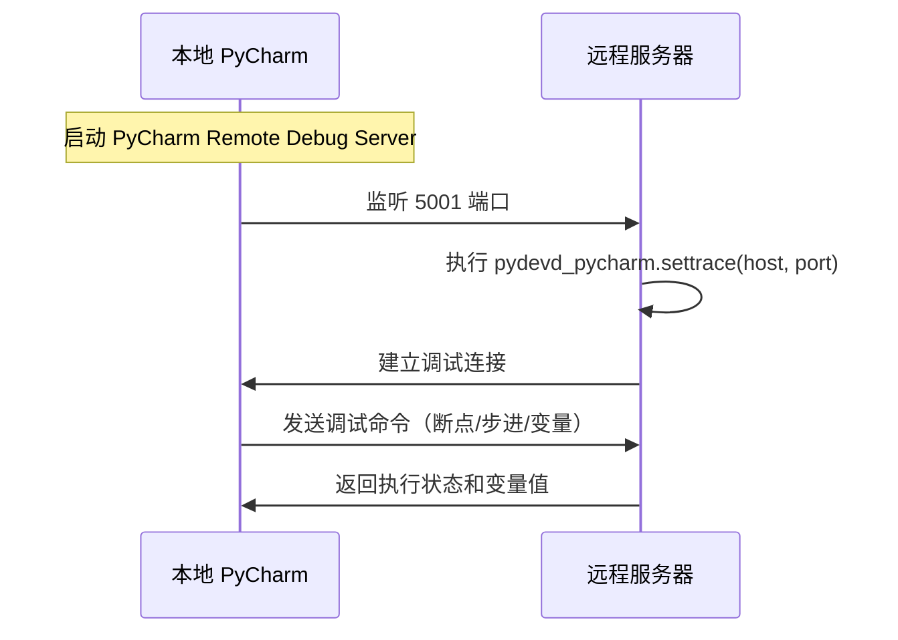

+++
title = "第7章 PyCharm和Python"
weight = 70
date = "2026-04-08T13:22:00+08:00"
type = "docs"
description = ""
isCJKLanguage = true
draft = false
+++

# Chapter 7：PyCharm - Python 开发者的瑞士军刀 🔪

> **题记**：如果说 VS Code 是Python界的"瑞士军刀"，那 PyCharm 就是那把专门为 Python 定制的、带有放大镜、激光笔、甚至还有自动咖啡机的——超级无敌工程队级别瑞士军刀！功能多到让你怀疑人生，但用好了，效率提升到让你怀疑老板给你发错了工资。

---

## 7.1 PyCharm 版本选择：Community 还是 Professional？

选择 PyCharm 版本这件事，堪称 Python 开发者必经的"灵魂拷问"——

- **Community（社区版）**：免费、开源、够用，像是租房时的"简装房"
- **Professional（专业版）**：付费、功能全、像是买下了整栋楼还带装修

两个版本的差异，其实比想象中要大得多。我们来一一拆解。

### 7.1.1 Community（免费版）功能

Community 版是 JetBrains 良心发现的产物——完全免费，而且对于纯 Python 开发来说，真的已经很能打了！

#### 7.1.1.1 Python 开发

社区版对 **Python 语言支持**做得相当到位：

- **智能代码补全（Intelligent Code Completion）**：不是简单匹配字符串，而是真的能理解你的代码上下文，猜你想要写什么。这就像一个贴心的助手，你刚想说"老板，我……"，它就帮你把话接上了。
- **代码重构（Refactoring）**：重命名变量、提取函数、改变函数签名——这些高频操作一键搞定，改完所有引用自动同步。
- **代码检查（Code Inspections）**：实时扫描代码问题，语法错误、风格问题、未使用的变量，全给你揪出来。
- **导航功能**：按住 `Ctrl` 点击任何函数/类，直接跳转；`Ctrl+N` 搜索类，`Ctrl+Shift+N` 搜索文件，快到让你怀疑人生。

> **小故事**：某小白程序员第一次用 PyCharm 的代码补全，惊呼"它怎么知道我要写这个！"——然后花了半小时研究是不是代码泄漏了。其实吧，这就是 JetBrains 的魔法，安心享用就好。

#### 7.1.1.2 调试、测试

- **内置调试器（Debugger）**：支持断点（Breakpoint）、单步执行（Step Over/Into/Out）、变量监视（Variables Watch）、调用栈（Call Stack）查看——标准的 IDE 调试全家桶。
- **单元测试支持**：支持 `unittest` 和 `pytest`（手动配置 Runner），可以运行和调试测试用例。
- **集成 Terminal**：不用切换窗口，直接在 PyCharm 里面敲命令行，社恐程序员的贴心伴侣。

#### 7.1.1.3 Git 版本控制

PyCharm Community 内置了 **Git 支持**（对，就是那个全球最大男性交友网站用的版本控制系统）：

- **Git 面板**：直接在侧边栏看到修改的文件、分支信息。
- **Diff 视图**：代码对比清晰明了，谁动了我的代码，一目了然。
- **Commit / Push**：不用记住那些 git 命令，点几下鼠标就搞定。

> **冷知识**：Git 的创始人 Linus Torvalds 是个瑞典人（后来去了美国），他给这个工具起名叫"Git"，在英国俚语里是"混蛋"的意思。——所以当你 git push 失败的时候，可以骂一句"Git 你这个混蛋！"是很有仪式感的。

#### 7.1.1.4 不支持 Django / Flask 等 Web 框架调试

**但是！** 社区版有个致命的软肋——**不支持 Django / Flask 等 Web 框架的专业调试**。

啥意思呢？就是说：

- ❌ 无法识别 Django/Flask 项目的特殊结构（settings.py、views.py、urls.py 这些）
- ❌ 无法利用 Django/Flask 的"运行配置"模版（Django Server / Flask 服务器配置）
- ❌ 无法对模板（Templates）进行调试——你在 HTML 里加的断点，PyCharm Community 根本不认识
- ❌ 无法利用 Pyramid、Bottle 等其他 Python Web 框架的集成支持

**一句话总结**：如果你要做 Web 开发，社区版就像给你一辆没有空调的车——能开，但夏天热得你想把车卖了。

---

### 7.1.2 Professional（付费版）额外功能

专业版（Professional）是 PyCharm 的"完全体"，功能多了不止一星半点。JetBrains 的定价策略是：**个人用户 $249/年第一年，学生/教师免费**，说实话，比起你浪费的时间，这钱真不算贵。

#### 7.1.2.1 Django / Flask / Pyramid 等 Web 框架支持

这是 Professional 版最核心的卖点之一：

- **Django 支持**：内置 Django 项目模板，HTML/CSS/JS 调试，模板调试（Template Debugging），Django ORM 支持。
- **Flask 支持**：同样带专属运行配置，支持 Jinja2 模板调试。
- **Pyramid / Bottle / web2py**：开箱即用。
- **SQL 支持**：在 Django/Flask 代码里内嵌 SQL 查询的时候，PyCharm 能帮你做数据库关联分析。

> **过来人忠告**：如果你做 Web 开发还在用 Community 版，就像买了个 iPhone 但只用来砸核桃——浪费！

#### 7.1.2.2 数据库支持

Professional 内置 **Database Navigator**（不需要单独安装插件）：

- **SQL 编辑器**：语法高亮、自动补全、查询执行。
- **数据库连接**：支持 PostgreSQL、MySQL、SQLite、MongoDB 等各种主流数据库。
- **数据查看器**：直接图形化查看表结构和数据，写 SQL 不用再装 Navicat。

#### 7.1.2.3 JavaScript / CSS / HTML 支持

Web 开发可不止 Python 一环，Professional 版对 **前端三剑客** 的支持也很到位：

- **JavaScript**：智能补全、语法高亮、ES6+ 支持、React/Vue/Angular 特殊支持。
- **CSS/SASS/SCSS/LESS**：样式表编辑、LiveEdit（改完保存，浏览器自动刷新）。
- **HTML/Emmet**：Zen Coding 高效编写 HTML，实时预览。

> **笑点**：有些 Python 开发者听到"前端"两个字就头疼，说"我是后端工程师，不学 JavaScript"。然后某天被迫改一个 CSS bug，在网上搜了 2 小时"为什么 div 居中不了"。——PyCharm Professional 至少能让你的 HTML/CSS 写得更顺一些。

#### 7.1.2.4 Remote Development（远程开发）

Remote Development 是 Professional 版在 2020 年之后主推的功能——**让你在本地编辑器里直接开发远程服务器上的代码**。

工作原理：
1. 代码实际运行在远程机器（Linux 服务器）
2. PyCharm 通过 SSH 连接到远程
3. 代码编辑、调试、运行，全在远程执行
4. 但你的显示器上，呈现的是本地的丝滑体验

**适用场景**：
- 你的代码需要在 GPU 服务器上运行（tensorflow/pytorch 炼丹）
- 你在 Windows 上写代码，但生产环境是 Linux
- 团队共用开发机，不想在本地装一堆环境

#### 7.1.2.5 Docker / Docker Compose 支持

容器化时代，PyCharm Professional 深度集成 **Docker**：

- **容器管理面板**：在 PyCharm 里直接看容器状态、启动/停止容器。
- **Docker Compose 支持**：一键启动多容器应用（前后端分离 + 数据库）。
- **在容器内运行/调试**：配置好之后，你的代码在容器里跑，你在本地点"运行"。

```dockerfile
# 你的 Dockerfile 示例
FROM python:3.11-slim

# 设置工作目录
WORKDIR /app

# 复制依赖文件
COPY requirements.txt .

# 安装依赖（生产环境别用清华源，这里只是示例）
RUN pip install --no-cache-dir -r requirements.txt

# 复制代码
COPY . .

# 暴露端口
EXPOSE 8000

# 启动命令
CMD ["python", "manage.py", "runserver", "0.0.0.0:8000"]
```

> **灵魂比喻**：Docker 就像是给你的代码提供了一个"集装箱"，里面水电全通，代码拎包入住。PyCharm Professional 就是那个帮你管理集装箱的"物业系统"。

---

## 7.2 必装插件清单：让你的 PyCharm 如虎添翼 🐅

插件（Plugins）是 PyCharm 的灵魂。没有插件的 PyCharm，就像没有 DLC 的游戏——能玩，但不完整。

### 7.2.1 Chinese (Simplified) Language Pack

**中文语言包**，插件市场搜索"Chinese"就能找到。

- JetBrains 官方出品，翻译质量有保障。
- 适合刚入门不习惯英文界面的同学。

> **争议话题**：老司机一般不推荐装汉化包，因为——1）网上 90% 的技术文档是英文的 2）IDE 的英文术语是通用的 3）装汉化包容易产生"依赖感"。但如果你实在看不惯英文，装上也无妨，学习初期"能用"比"优雅"更重要。

### 7.2.2 .ignore

**.ignore 插件**，帮你管理 `.gitignore`、`.dockerignore`、`.env` 等忽略文件。

- 在项目里添加新文件时，智能提示哪些文件应该被忽略（`node_modules`、`__pycache__`、`.pyc` 等）。
- 可视化编辑 .gitignore 规则。

### 7.2.3 Markdown

PyCharm 内置 Markdown 支持，但 **Markdown Plugins** 插件可以让预览效果更上一层楼：

- 实时预览（Split View，左右分栏）
- 支持 GFM（GitHub Flavored Markdown）
- 表格、代码块、任务列表渲染更漂亮

> **写文档的正确姿势**：用 Markdown 写技术文档，用 PyCharm 打开，直接预览。不用开 Typora，不用开 VS Code，一个编辑器搞定所有事。

### 7.2.4 IdeaVim

**IdeaVim 插件**，把 Vim 的操作方式带进 PyCharm。

- 如果你曾经被 Vim 的"退出难"问题困扰，IdeaVim 让你既享受 Vim 的高效键盘操作，又不用真的学会退出 Vim。
- 支持 `.ideavimrc` 配置文件，自定义按键映射。

```vim
" .ideavimrc 示例配置
set relativenumber    " 显示相对行号（Vim 高端操作）
set hlsearch          " 高亮搜索结果
set incsearch         " 增量搜索
let mapleader = ","   " 将 Leader 键映射为逗号（默认为反斜杠）
nnoremap <leader>d :action Debug<CR>   " 逗号+d 启动调试
nnoremap <leader>r :action Run<CR>      " 逗号+r 运行
```

> **程序员江湖规矩**：Vim 用户 > Emacs 用户 > 普通编辑器用户 > 鼠标党的鄙视链。虽然这是个玩笑，但 Vim 的键盘流操作确实能让你"手不离开键盘，代码写全场"。

### 7.2.5 Rainbow Brackets

**彩虹括号插件**，让你的代码告别"括号地狱"。

- 嵌套的 `(((())))` 变成 `(((())))` 的彩虹色版本
- 一眼看出哪个括号对应哪个，再也不用数手指头了
- 支持各种语言：Python、JavaScript、HTML（Tag）都能用

> **适用场景**：正则表达式狂魔、函数式编程爱好者、Lisp 遗老——你们懂的。

### 7.2.6 Key Promoter X

**Key Promoter X**，你鼠标操作的"曝光台"。

- 当你在 PyCharm 里用鼠标点击某个按钮/菜单时，Key Promoter X 会弹出提示，告诉你"这个操作对应的快捷键是什么"。
- 长期使用下来，你会记住越来越多的快捷键，效率蹭蹭往上涨。

> **励志故事**：某程序员装了 Key Promoter X，第一天被提示了 87 次"可以用 Ctrl+S 保存哦"，第三天变成 23 次，一周后只剩 3 次（都是第一次用的新功能）。三个月后，他成了办公室里快捷键最多的男人。

### 7.2.7 Docker（Professional）

**Docker 插件（Professional 版专属）**，在 PyCharm 里集成 Docker 管理：

- Docker 工具窗口：查看容器、镜像、网络、数据卷。
- 运行/调试配置可以直接指向 Docker 容器。
- Docker Compose 集成：多容器一键启动。

> **警告**：装了 Docker 插件但不装 Docker Desktop，就像买了游戏机但没买电视——Docker Desktop 是 Docker 运行的"宿主管家"，必须先装好。

### 7.2.8 Database Navigator（Professional）

**Database Navigator**，PyCharm Professional 内置的数据库管理工具：

- 连接管理：MySQL、PostgreSQL、SQLite、MongoDB 等。
- SQL 编辑器：语法高亮、自动补全。
- 数据浏览和编辑：直接在表格里改数据。

---

## 7.3 项目配置：让 PyCharm 认识你的代码 🧐

新项目创建好了，第一件事不是写代码——是先让 PyCharm "认识"你的项目结构。这一步没做好，后面会有各种奇奇怪怪的问题（比如"找不到模块"、"import 飘红"）。

### 7.3.1 Python 解释器选择

Python 解释器（Interpreter）就是执行 Python 代码的"发动机"。选错了解释器，就像给柴油车加汽油——能开？但肯定开不长。

#### 7.3.1.1 File → Project Structure → Add SDK

配置路径：**File → Project Structure → Platform Settings → SDKs → Add SDK**

```
File → Project Structure...
  ├── Platform Settings
  │   └── SDKs
  │       └── + → Add Python SDK
```

或者更直接的方式：

```
File → Settings → Project: xxx → Python Interpreter → Add...
```

#### 7.3.1.2 选择系统 Python / 虚拟环境 / Conda 环境

PyCharm 支持三种 Python 解释器来源：

**1. 系统 Python（System Interpreter）**
- 机器上全局安装的 Python，比如 `C:\Python311\python.exe`
- **优点**：简单，直接用
- **缺点**：所有项目共用一个环境，依赖容易打架（A 项目需要 Django 3.0，B 项目需要 Django 4.0，这时候就只能哭）

**2. 虚拟环境（Virtual Environment）**
- 用 `venv` 或 `virtualenv` 创建的独立 Python 环境
- 每个项目一个专属环境，依赖互不干扰

```bash
# 创建虚拟环境（venv 是 Python 3 内置的，不用额外装）
python -m venv venv

# 激活虚拟环境
# Windows:
venv\Scripts\activate
# Linux/Mac:
source venv/bin/activate

# 激活后，pip 安装的包都在 venv 里
pip install django
```

**3. Conda 环境**
- 用 Anaconda/Miniconda 创建的 conda 环境
- 支持 Python 包和 conda 包的混合管理

```bash
# 创建 conda 环境
conda create -n myenv python=3.11

# 激活
conda activate myenv

# 或者用 conda env create -f environment.yml
```

> **小白必读**：如果你是 Python 新手，还在"全局 Python 走天下"的阶段，请立刻改用**虚拟环境**。想象一下：你同时在维护两个项目，一个需要 `requests==2.25.1`，另一个需要 `requests==2.28.0`——不隔离环境的话，你每次切换项目都要重装包，那酸爽，谁经历谁知道。

#### 7.3.1.3 路径配置

在 `Project Structure` 里，你还可以配置：

- **项目根目录（Project Root）**
- **源代码目录（Source Roots）**
- **库目录（Library Roots）**

合理配置路径，可以让 PyCharm 正确解析你的 import 语句：

```
项目结构示例：
my_project/
├── src/              # 源代码（Source Root）
│   ├── __init__.py
│   ├── main.py
│   └── utils.py
├── tests/            # 测试代码
│   ├── __init__.py
│   └── test_utils.py
├── venv/             # 虚拟环境（不需要加入项目）
├── requirements.txt
└── README.md
```

### 7.3.2 项目结构与 Content Root

Content Root 是 PyCharm 识别项目结构的基准点。你可以理解成：PyCharm 的"世界观"从这里开始。

#### 7.3.2.1 Project 面板 → Project Structure

打开项目面板：

```
View → Tool Windows → Project
```

然后打开项目结构配置：

```
File → Project Structure → Project Settings → Project
```

#### 7.3.2.2 添加 Source Root（src/）

**Source Root**（源代码根目录）是 PyCharm 用来解析 import 语句的关键目录。

如果你有以下结构：

```
my_project/
├── src/              # ← 这个目录应该被标记为 Source Root
│   └── utils.py
└── main.py
```

在 `main.py` 中写 `from src import utils`，PyCharm 能不能找到 `utils`，就看你有没有正确标记 Source Root。

**标记方法**：

1. 在项目面板中，右键点击 `src/` 文件夹
2. 选择 **Mark Directory as** → **Sources Root**
3. 文件夹图标会变成蓝色（Sources Root 的专属颜色）

> **小技巧**：`src/` 变蓝，`tests/` 变绿，`venv/` 变红（被 Excluded）。这个颜色系统你记住之后，一眼就能看出项目结构是否合理。

### 7.3.3 模块路径配置

模块路径（Module Path）告诉 PyCharm"除了当前项目，还有哪些目录可以 import"。

#### 7.3.3.1 Mark Directory as → Sources Root / Excluded

**Sources Root（源代码根目录）**：
- 目录里的代码被视为项目的核心代码
- import 时 PyCharm 会从这个目录开始查找

**Excluded（排除目录）**：
- 告诉 PyCharm"这个目录的内容不需要索引"
- `venv/`、`__pycache__/`、`.git/`、`build/` 这些都应该被 Excluded
- 可以大幅提升大型项目的索引速度

**设置方法**：

```
右键目录 → Mark Directory as → Sources Root / Excluded / Test Sources Root
```

> **性能警告**：如果你有个 5GB 的 `node_modules`（前端项目），或者 2GB 的 `venv`，不把它们 Excluded 掉，PyCharm 会尝试索引里面的一切——然后你的电脑会发出飞机起飞一样的风扇声，PyCharm 卡成 PPT。

---

## 7.4 调试配置：告别 print 大法，走向断点人生 🐛

"调试"（Debugging）是每个程序员的必修课。不会调试的人，只能靠 `print("==========1==========")` 这种"赛博占卜法"来定位 bug——不是说不行，是太慢了。

PyCharm 的调试器（Debugger）是你最强大的武器，学会用它，你就是那个"断点一打，bug 飞灰"的高手。

### 7.4.1 Python 脚本调试

最基本的调试场景：直接运行一个 `.py` 文件。

#### 7.4.1.1 Run → Edit Configurations → Python

配置步骤：

```
Run → Edit Configurations...
  └── + → Python
        └── Name: My Script
        └── Script: /path/to/your/script.py
```

#### 7.4.1.2 Script path、Parameters、Working directory 配置

在配置页面中，有几个关键字段：

| 字段 | 含义 | 示例 |
|------|------|------|
| **Script path** | 要运行的 Python 文件路径 | `C:\project\main.py` |
| **Parameters** | 命令行参数（传递给 `sys.argv`） | `--config prod.ini --verbose` |
| **Working directory** | 程序运行时的工作目录 | `C:\project` |
| **Environment variables** | 环境变量 | `DEBUG=1, TOKEN=abc123` |

```bash
# 如果你在终端里运行：
python main.py --config prod.ini --verbose

# 对应的 PyCharm 配置：
# Script path: C:\project\main.py
# Parameters: --config prod.ini --verbose
# Working directory: C:\project
```

### 7.4.2 Python Remote Debug（远程调试）

远程调试是 Professional 版的功能，但绝对物超所值。当你的代码在远程服务器上运行时，本地打断点调试是刚需。

#### 7.4.2.1 安装 pydevd-pycharm

在**远程服务器**上安装 `pydevd-pycharm`（PyCharm 自带的远程调试协议包）：

```bash
# 在远程服务器上执行
pip install pydevd-pycharm
```

#### 7.4.2.2 在远程服务器代码中插入 settrace

在你想要调试的代码处插入以下代码：

```python
import pydevd_pycharm

# 连接到本地 PyCharm 的调试服务器
# host='本地机器IP', port=5001（调试服务器端口）
pydevd_pycharm.settrace(
    host='192.168.1.100',   # 你本地电脑的 IP 地址
    port=5001,              # 调试端口（自定义）
    stdoutToServer=True,    # 标准输出重定向到 PyCharm
    stderrToServer=True     # 错误输出重定向到 PyCharm
)
```

#### 7.4.2.3 PyCharm 配置 Remote Python Debug

在本地 PyCharm 中配置远程调试服务器：

```
Run → Edit Configurations...
  └── + → Python Remote Debug
        └── Name: Remote Debug
        └── Host: 192.168.1.100    # 远程服务器 IP
        └── Port: 5001             # 与代码中的端口一致
```

配置流程图（Mermaid）：



> **重要提醒**：远程调试的代码要和你本地 PyCharm 打开的代码完全一致（同一个版本），否则断点位置和代码行号会"对不上"，你断点打的是第 10 行，实际跑的是第 15 行——那酸爽，比 print 还让人迷茫。

### 7.4.3 pytest 调试配置

`pytest` 是 Python 生态里最流行的测试框架。如果你用 unittest，感觉就像在功能机时代坚持用短信聊天——能用，但没有发挥智能手机的全部能力。

#### 7.4.3.1 Runner 选择 pytest

配置测试 Runner：

```
Run → Edit Configurations...
  └── + → Python tests → pytest
        └── Target: 你的测试文件或目录
        └── Python interpreter: 选择对应解释器
```

或者在 Settings 中全局设置：

```
File → Settings → Tools → Python Integrated Tools
  └── Default test runner: pytest
```

#### 7.4.3.2 Target 配置

**Target** 字段指定你要运行哪些测试：

| Target 写法 | 含义 |
|------------|------|
| `tests/` | 运行 tests 目录下所有测试 |
| `tests/test_math.py` | 运行单个测试文件 |
| `tests/test_math.py::test_add` | 运行单个测试函数 |
| `tests -k "add and not slow"` | 按关键词过滤（`-k` 参数） |

> **pytest 实战示例**：

```python
# tests/test_math.py
import pytest

def test_add():
    """测试加法"""
    assert 1 + 1 == 2

def test_subtract():
    """测试减法"""
    assert 5 - 3 == 2

# 在 PyCharm 中配置：
# Target: /path/to/project/tests/test_math.py::test_add
# 这样就只会运行 test_add，不会运行 test_subtract
```

### 7.4.4 Django 调试配置

Django 项目有自己的运行方式，不能简单用"Python 脚本"来跑。Professional 版提供了专门的 Django Server 配置。

#### 7.4.4.1 Run → Edit Configurations → Django Server

```
Run → Edit Configurations...
  └── + → Django Server
        └── Name: Django Dev Server
        └── Host: 127.0.0.1
        └── Port: 8000
        └── Environment variables: DJANGO_SETTINGS_MODULE=myproject.settings
```

#### 7.4.4.2 Django server options 配置

常用配置选项：

| 选项 | 说明 | 示例 |
|------|------|------|
| **Host** | 监听地址 | `127.0.0.1`（仅本地）或 `0.0.0.0`（所有网卡） |
| **Port** | 监听端口 | `8000` |
| **Environment variables** | 环境变量 | `DJANGO_SETTINGS_MODULE=myproject.settings` |
| **Run browser** | 自动打开浏览器 | ✅ 勾选 |
| **Additional options** | 额外命令行参数 | `--noreload`（禁用自动重载）|

> **Django 调试断点示例**：

```python
# views.py
from django.http import HttpResponse

def hello(request):
    name = request.GET.get('name', 'World')  # ← 在这里打断点
    return HttpResponse(f"Hello, {name}!")
```

在调试模式下，当有人访问 `http://127.0.0.1:8000/hello?name=Jack` 时，断点触发，你可以在 Variables 面板里看到 `request` 对象的所有内容，甚至可以看到 GET 参数。

### 7.4.5 Flask 调试配置

Flask 是"微框架"的代表，小巧灵活，但调试配置和 Django 有一定区别。

#### 7.4.5.1 Run → Edit Configurations → Flask

```
Run → Edit Configurations...
  └── + → Flask
        └── Name: Flask Dev Server
        └── Module name: flask
        └── Target: hello:app（模块名:app对象名，与 FLASK_APP 值保持一致）
```

#### 7.4.5.2 Module name、FLASK_APP、FLASK_ENV 环境变量配置

Flask 的运行依赖几个关键环境变量：

| 环境变量 | 说明 | 示例 |
|---------|------|------|
| **FLASK_APP** | 指定 Flask 应用实例或模块 | `hello:app`（hello.py 里的 app 对象）或 `hello`（Flask 1.x 兼容模式） |
| **FLASK_ENV** | 指定运行环境 | `development`（开启调试模式）/ `production` |

**Flask 项目结构示例**：

```
flask_project/
├── hello.py
├── requirements.txt
└── templates/
    └── index.html
```

```python
# hello.py
from flask import Flask, render_template, request

app = Flask(__name__)

@app.route('/')
def index():
    name = request.args.get('name', 'World')
    return render_template('index.html', name=name)

if __name__ == '__main__':
    # 注意：debug=True 时 PyCharm 应该禁用它的自动重载，避免冲突
    app.run(debug=False)  # PyCharm 管理调试，我们不用 Flask 内置的
```

**PyCharm Flask 配置**：

```
Run → Edit Configurations → Flask
  Name: Flask Dev
  Module name: flask
  Target: hello:app
  Environment variables:
    FLASK_APP=hello:app
    FLASK_ENV=development
```

> **PyCharm + Flask 调试的坑**：Flask 内置的 `debug=True` 会启动 Werkzeug 重载器，这会和 PyCharm 的调试器产生冲突。**正确做法是**：在 `app.run()` 里设置 `debug=False`，然后让 PyCharm 的调试器来接管一切。

### 7.4.6 条件断点

普通断点的问题是：每次循环到这里都会停。如果你的循环有 10000 次，而你只想在第 5000 次的时候停下来，怎么办？

**条件断点（Conditional Breakpoint）** 拯救你！

#### 7.4.6.1 右键断点 → Condition

设置方法：

1. 在代码行号旁边点击，添加断点（红点）
2. **右键断点** → 选择 **Condition**
3. 输入条件表达式

```python
# 场景：遍历用户列表，只有当用户年龄大于 60 时才停下
for user in users:
    name = user['name']
    age = user['age']
    print(f"{name} is {age} years old")  # ← 在这里打断点
```

右键断点 → Condition，输入：

```
age > 60
```

这样，只有当 `age > 60` 时才会停下，否则代码一路狂奔。

> **使用场景**：处理大数据集时，用条件断点跳过你已经排查过的部分；或者 bug 只在特定条件下触发时（比如"只有当用户名为 admin 时才报错"），用条件断点精准定位。

### 7.4.7 日志断点

有些时候你不想代码停下来，只想在某个地方"打印点东西"——但又不想改代码加 `print()`，怕提交时忘了删。

**日志断点（Log Breakpoint）** 就是干这个的！

#### 7.4.7.1 右键断点 → Log → Evaluate and log

设置方法：

1. 添加断点（红点）
2. 右键断点 → 取消勾选 **Suspend**（暂停）
3. 勾选 **Log evaluated expression**，然后输入要输出的表达式

```python
# 场景：打印某个变量的值，但不中断执行
result = calculate_something(data)  # ← 断点不暂停，但输出 result
```

右键断点 → 配置：

```
✅ Log evaluated expression: "result = " + str(result)
✅ Log message: "经过 calculate_something，result = {result}"
❌ Suspend
```

这样，代码运行时会在 Console 里打印 `result` 的值，但不会中断执行——完美替代临时 print 大法！

### 7.4.8 异常断点

有时候你的代码抛出了异常，但你不确定是哪里抛出来的——堆栈信息太长，看得人头皮发麻。

**异常断点（Exception Breakpoint）** 让你的代码在抛出特定异常时自动停下来。

#### 7.4.8.1 View → Breakpoints

打开断点管理窗口：

```
View → Breakpoints...
```

快捷键：`Ctrl+Shift+F8`（Windows/Linux）或 `⌘+Shift+F8`（Mac）

#### 7.4.8.2 Python Exception Breakpoint

在 Breakpoints 窗口中：

1. 点击 `+` 号（添加新断点）
2. 选择 **Python Exception Breakpoint**
3. 输入要捕获的异常类型

常用配置：

| 异常类型 | 含义 |
|---------|------|
| `IndexError` | 列表/数组索引越界 |
| `KeyError` | 字典里没有这个键 |
| `ValueError` | 值类型对了但内容不对 |
| `AssertionError` | assert 断言失败 |
| `Exception` | 所有异常（慎用！会停在你不想停的地方）|

```python
# 场景：程序抛出了 KeyError，但你不知道是哪个字典的锅
user = {'name': 'Jack', 'age': 25}
profile = get_user_profile(user_id)  # 这个函数里有个 dict.get() 返回 None

# 设置 KeyError 异常断点后，代码会在那一刻停下来
# 你的 Call Stack（调用栈）会清晰显示：
# get_user_profile() ← line 45: profiles.get(user_id)  ← KeyError
```

> **调试神器**：当你看到 `KeyError: 'email'` 但完全不知道是哪个字典的哪个键时，异常断点 + 调用栈是你的救星。

### 7.4.9 Evaluate Expression（表达式计算）

在调试过程中，你想临时执行一段代码来看看某个变量的值，或者测试某个函数调用的结果——**Evaluate Expression** 就是你的"即时演算器"。

#### 7.4.9.1 Debug 面板 → Evaluate Expression

调试时，按住 `Alt+F8`（Windows/Linux）或 `⌥+F8`（Mac）调出 Evaluate 窗口。

```
Debug 面板
  └── Debug 工具栏
        └── Calculator icon (Evaluate Expression)
```

**使用示例**：

```python
# 在某个断点处停住了，你想看看：
# len(users) 是多少
# users[0]['name'] 能不能取到
# 甚至想测试一个修复后的逻辑能不能work

# 在 Evaluate 窗口里输入：
len(users)
# → 42

users[0]['name']
# → 'Jack'

# 甚至可以执行多行语句
temp = sorted(users, key=lambda u: u['age'], reverse=True)
temp[0]['name']
# → 'Martha'
```

> **比喻**：Evaluate Expression 就像调试模式下的"计算器"，你想算什么，直接按，不需要停下来写临时代码、重新运行——算完不满意，直接关掉，当作什么都没发生过。

### 7.4.10 Attach to Process（附加到进程）

有时候你的 Python 程序已经运行起来了，你想临时给它加上调试器——不需要重启，不需要改代码。

**Attach to Process** 就是这个"魔法"！

#### 7.4.10.1 Run → Attach to Process

```
Run → Attach to Process...
  └── 选择你要附加的 Python 进程
```

#### 7.4.10.2 附加到已运行的 Python 进程调试

**使用场景**：

1. **线上问题复现**：生产环境里某个进程偶发性出错，你不想重启服务耽误用户
2. **长期运行任务**：你的训练脚本跑了 3 小时，快跑完了才发现有问题——Attach 上去看看状态
3. **调试 fork/multiprocessing 问题**：多进程程序的子进程调试

**操作步骤**：

1. 找到你要调试的 Python 进程的 PID（在任务管理器里找，或者用 `ps aux | grep python`）
2. PyCharm 中 `Run → Attach to Process`
3. 在弹出的列表中选择对应进程（或者搜索 PID/进程名）
4. 附加成功后，在你想要打断点的代码处设置断点
5. 当代码执行到断点处时，进程会暂停，PyCharm 接管调试

```bash
# 假设你的服务器上运行着
python manage.py runserver 0.0.0.0:8000

# 你查到这个进程的 PID 是 12345
# 然后在 PyCharm 里 Attach to Process → 选这个进程
# 设置断点在某个 view 函数里
# 访问对应的 URL
# 断点触发！开始调试！
```

> **警告**：Attach 到进程后，调试器会暂停该进程的执行。如果这是生产环境的 Web 服务，所有用户的请求都会卡住——所以**生产环境慎用，建议先在测试环境复现问题**。

---

## 7.5 PyCharm 性能优化：让你的 IDE 健步如飞 🚀

PyCharm 功能强大，但代价是——它也是一个"内存怪兽"。默认配置下，打开大项目时你可能会看到：

- 索引卡顿（Indexing... 进度条慢得像蜗牛）
- 代码补全延迟（你打完字，过了 2 秒才弹出补全）
- 风扇狂转（CPU 100%，电脑热得能煎蛋）
- 甚至 OOM（Out of Memory，内存不足崩溃）

这一节，教你如何让 PyCharm 跑得又快又稳。

### 7.5.1 内存配置

PyCharm 是基于 Java（JVM）运行的，所以它的内存由 JVM 参数控制。你可以通过修改 **VM Options** 来调整分配给 PyCharm 的内存。

#### 7.5.1.1 Help → Edit Custom VM Options

打开方式：

```
Help → Edit Custom VM Options...
```

这会打开一个 `idea64.exe.vmoptions` 文件（Windows）或 `idea.vmoptions`（Linux/Mac）。

#### 7.5.1.2 -Xmx2048m（建议至少 2GB）

关键参数：

| 参数 | 含义 | 推荐值 |
|------|------|--------|
| `-Xmx` | 最大堆内存（PyCharm 能用的 RAM 上限） | `2048m`（2GB）或 `4096m`（4GB）|
| `-Xms` | 初始堆内存 | `512m` 或 `1024m` |

```properties
# idea64.exe.vmoptions 示例配置
# 设置最大内存为 4GB
-Xmx4096m

# 设置初始内存为 1GB
-Xms1024m

# 启用 G1 垃圾收集器（更适合大型应用）
-XX:+UseG1GC

# 禁用 Swing 跨平台外观检测（省一点点资源）
-Dsun.java2d.d3d=false
```

> **内存配置建议**：
>
> - **8GB RAM 机器**：给 PyCharm 分 2GB（`-Xmx2048m`），系统和其他软件留 6GB
> - **16GB RAM 机器**：给 PyCharm 分 4GB（`-Xmx4096m`）
> - **32GB+ RAM 机器**：有钱任性，分 8GB 也行，但别超过 10GB（JVM 本身也有 overhead）
>
> **重要**：修改完 VM Options 后需要**重启 PyCharm**才能生效。

### 7.5.2 大型项目索引优化

索引（Indexing）是 PyCharm 实现智能补全、代码跳转、搜索等功能的基础。但对于大型项目，索引可能会：

- 占用大量磁盘 I/O 和 CPU
- 第一次打开项目时等待时间超长（可能 10-30 分钟）
- 即使索引完了，某些操作还是很慢

#### 7.5.2.1 File → Invalidate Caches → Invalidate and Restart

**清缓存（Invalidate Caches）** 是解决 PyCharm"抽风"的第一招：

```
File → Invalidate Caches...
  └── ✅ Clear file system cache
  └── ✅ Clear VCS Log caches
  └── ✅ Clear thumbnails and HUD
  └── ✅ Invalidate and Restart
```

**什么时候用**：

- 打开项目后代码飘红（import 找不到），但明明安装了依赖——缓存损坏
- 删除了某些文件，但 PyCharm 还认为它们存在
- 任何莫名其妙的"PyCharm 抽风"问题

> **比喻**：Invalidate Caches 就像是"重启电脑能解决 90% 的问题"一样，是 PyCharm 世界里的"万能重启"。

#### 7.5.2.2 Exclude 不需要的目录：Mark as Excluded

PyCharm 会对 Content Root 下的所有文件建立索引。但有些目录**完全不需要索引**——标记为 Excluded 可以大幅减少索引负担：

**必须 Excluded 的目录**：

```
venv/                    # Python 虚拟环境（里面有成千上万个 .py 文件）
__pycache__/             # Python 字节码缓存
*.egg-info/               # pip install 产生的元数据
build/                    # 构建产物
dist/                     # 分发产物
node_modules/             # 前端依赖
.git/                     # Git 仓库（PyCharm 有专门的 Git 插件处理）
```

**标记方法**：

```
右键目录 → Mark Directory as → Excluded
```

被 Excluded 的目录：
- ❌ 不会参与索引
- ❌ 不会出现在 Search（Ctr+Shift+N）结果里
- ❌ PyCharm 不会提示这些目录里的代码问题
- ✅ 目录图标变成红色（表示"已排除"）

> **实测效果**：一个带有 3GB `node_modules` 的前端混合项目，排除前索引时间 15 分钟，排除后 3 分钟——快到飞起！

### 7.5.3 禁用不需要的插件

PyCharm 预装/推荐了很多插件，但不一定每个都对你有用。禁用不需要的插件可以：

- 加快启动速度
- 减少内存占用
- 降低 CPU 消耗

#### 7.5.3.1 File → Settings → Plugins

打开插件管理：

```
File → Settings → Plugins
```

#### 7.5.3.2 禁用不使用的插件加速启动

**可以安全禁用的插件**（如果你不用的话）：

| 插件名 | 用途 | 禁用条件 |
|--------|------|---------|
| **Angular** | Angular 框架支持 | 不做 Angular 开发 |
| **Vue.js** | Vue 框架支持 | 不做 Vue 开发 |
| **Ruby** | Ruby 开发支持 | 不写 Ruby |
| **PHP** | PHP 开发支持 | 不写 PHP |
| **Gittoolbox** | Git 增强工具 | 如果只用内置 Git 功能 |
| **Markdown** | Markdown 支持 | 如果只用 Typora 等外部编辑器 |
| **YAML** | YAML 文件支持 | 如果不写 Kubernetes/Docker Compose |
| **Kubernetes** | K8s 配置支持 | 不接触 K8s |

**不建议禁用的插件**：

| 插件名 | 原因 |
|--------|------|
| **Python Core** | 这就是你的饭碗，禁了就别写 Python 了 |
| **Git** | 版本控制是必备 |
| **Debugger** | 调试全靠它 |
| **IdeaVim** | 如果你正在用的话 |

> **优化效果预估**：禁用 5-10 个用不到的插件，启动时间可能减少 10-30%，内存占用减少 100-300MB。对于 8GB 内存的机器来说，这可能是"流畅使用"和"天天看卡顿"的区别。

---

## 本章小结 🎯

本章我们深入探索了 **PyCharm**——Python 开发者最强大的 IDE。回顾一下核心知识点：

### 版本选择

| 版本 | 价格 | 适用人群 |
|------|------|---------|
| **Community** | 免费 | 纯 Python 脚本开发、学习、小型项目 |
| **Professional** | $249/年 | Web 开发、数据科学、团队协作、需要远程调试/Docker |

### 插件生态

必备插件清单：`Chinese Language Pack`（汉化）、`.ignore`（忽略文件）、`Markdown`（文档）、`IdeaVim`（Vim 键盘流）、`Rainbow Brackets`（彩虹括号）、`Key Promoter X`（快捷键学习）、`Docker`（容器化）、`Database Navigator`（数据库）。

### 项目配置三板斧

1. **Python 解释器**：优先使用**虚拟环境**（venv），每个项目独立，避免依赖冲突
2. **Source Root**：把 `src/` 标记为 Sources Root，让 PyCharm 正确解析 import
3. **Excluded**：把 `venv/`、`__pycache__/`、`node_modules/` 标记为 Excluded，加速索引

### 调试六脉神剑

1. **普通断点**：基础暂停
2. **条件断点**：满足特定条件才停（右键 → Condition）
3. **日志断点**：不暂停，只打印日志（右键 → Log → Evaluate and log）
4. **异常断点**：捕获特定异常（View → Breakpoints → Python Exception Breakpoint）
5. **Remote Debug**：连接远程服务器断点调试（pydevd-pycharm + 配置 Remote Python Debug）
6. **Attach to Process**：附加到已运行的进程调试（Run → Attach to Process）

### 性能优化三板斧

1. **增大内存**：`Help → Edit Custom VM Options` → `-Xmx4096m`
2. **排除无效索引**：`Mark Directory as → Excluded`（venv/、__pycache__/ 等）
3. **禁用无用插件**：`File → Settings → Plugins` → 关闭不用的插件

---

> **结语**：PyCharm 是一个"用得越深，功能越多"的 IDE。本章覆盖的只是冰山一角，但这些知识点能帮你从"会用"走向"用好"。记住，工具是为了提高效率服务的——不要成为 IDE 的奴隶，也不要因为"命令行才是真男人"就拒绝使用好工具。**用对的工具，在对的时候，做对的事情**，这才是程序员的智慧。🛠️

---

*下章预告：在掌握了好用的 IDE 之后，我们将进入 Python 世界的"基础设施"——包管理与虚拟环境（pip / poetry / conda / uv）。告别依赖地狱，从下一章开始！*
