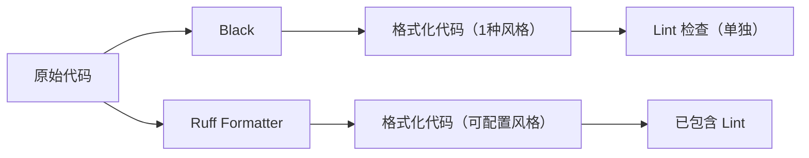
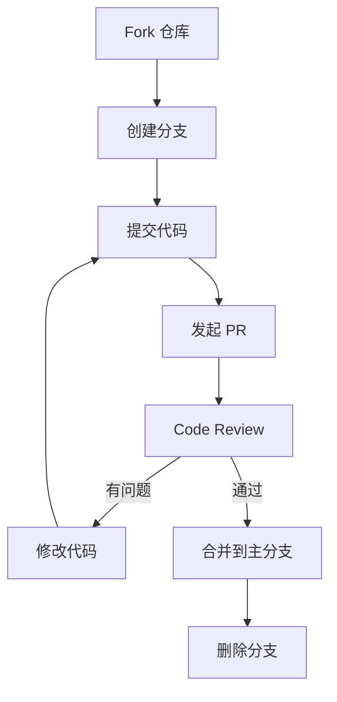

+++
title = "第9章 代码质量"
weight = 90
date = "2026-04-08T13:22:00+08:00"
type = "docs"
description = ""
isCJKLanguage = true
draft = false
+++

# 第 9 章 代码质量：让代码优雅得像艺术品 🖼️

> "Any fool can write code that a computer can understand. Good programmers write code that humans can understand."
> —— Martin Fowler

你知道程序员最怕什么吗？不是 bug，不是加班，是——**看到三年前自己写的代码**。那种感觉就像是打开冰箱发现里面藏着一块去年的三明治——你完全不记得它是怎么进去的，而且它似乎还活着。

代码质量，就是让你的代码即使过了三年再看，也能保持优雅（或者至少不会让你想把自己的眼睛挖出来）。在这一章里，我们会学习格式化、检查、类型提示、复杂度分析、代码审查和重构——全套"代码保养套餐"，让你的代码从"能跑就行"升级到"赏心悦目"。

---

## 9.1 代码格式化：告别"代码风格大战" 🤝

想象一下，你和一个同事在讨论代码格式：

- "缩进用四个空格！"
- "不，两个空格就够了！"
- "Tab 键才是正义！"
- "你的代码格式我不喜欢！"
- "..."

这种争论可以持续到宇宙热寂。为了终结这场"圣战"，我们有了**代码格式化工具**——它们就像是代码世界的"交通规则"，让所有人都乖乖遵守同一套标准。

### 9.1.1 Black（固执己见的格式化工具）

**Black** 是 Python 社区最"霸道"的格式化工具。它的口号是：**"不妥协、不废话、不接受配置"**（Well, it has some config, but mostly it's "my way or the highway"）。

为什么叫 Black？因为它想把代码"染成"统一的黑色——字面意思就是让所有代码看起来像一个黑客写的（并不是）。

#### 9.1.1.1 安装与使用

```bash
# 安装 Black
pip install black

# 格式化单个文件
black my_code.py

# 格式化整个目录
black my_project/

# 检查文件格式是否合规（不修改，只报告）
black --check my_code.py

# 显示需要格式化的文件列表（不修改）
black --diff my_code.py
```

> 💡 **小贴士**：`--diff` 参数超级有用！它会显示所有会做的修改，但不实际修改文件。适合在提交前做"预检"。

```python
# 格式化前（你的代码）
def  calculate(x,y,z):
    result=x+y*z
    return result

# 格式化后（Black 的版本）
def calculate(x, y, z):
    result = x + y * z
    return result
```

Black 会自动：
- 给变量名加空格（`x+y` → `x + y`）
- 规范化引号（`"hello"` 保持双引号，`'hello'` 变 `"hello"`）
- 调整行长度（超过 88 字符自动换行）
- 规范化尾部逗号（这个很重要！）

#### 9.1.1.2 pyproject.toml 配置

虽然 Black 很固执，但你还是可以在 `pyproject.toml` 里做一些微调：

```toml
[tool.black]
# 行长度，默认88
line-length = 88

# 是否包含源码目录，True=会格式化 __pycache__ 里的内容（不推荐）
include = '\.pyi?$'

# 排除某些目录不格式化
exclude = '''
/(
    \.git
  | \.venv
  | build
  | dist
)/
'''

# 是否使用双引号（默认True）
quote-style = "double"

# 是否使用魔法尾随逗号，默认Simple
magic-trailing-comma = "simple"
```

> ⚠️ **警告**：Black 的配置选项非常有限。如果你想要更多定制化，可能需要考虑 Ruff 或其他工具。Black 的哲学是：**"99%的情况，标准配置就是最好的配置"**。

#### 9.1.1.3 与 Ruff Formatter 的区别

Ruff 是 2023 年崛起的新星，它可以同时做 Lint 和 Format。来看看它们的区别：

| 特性 | Black | Ruff Formatter |
|------|-------|----------------|
| 速度 | 快 | **极快**（比 Black 快 10 倍） |
| 配置自由度 | 极少 | 中等 |
| 主要功能 | 格式化 | Lint + 格式化 |
| 规则数量 | 1套固定规则 | 200+ 规则可选 |
| 生态 | 独立工具 | 与 Ruff Lint 集成 |
| 兼容性 | 业界标准 | 与 Black 兼容 |



**什么时候用谁？**

- 如果你只需要格式化，Black 足够用，社区认可度高
- 如果你想 Lint + Format 二合一，选 Ruff
- 如果你在 Python 3.14+ 项目里，Ruff 是官方推荐

### 9.1.2 Ruff（极速 Lint + Format，Python 3.14 时代新标准）

**Ruff** 是用 Rust 编写的 Python Lint 工具，速度快到让你怀疑人生。官方测试显示，它比 flake8 快 **10~100 倍**！为什么？因为 Rust！

> 🦀 **什么是 Rust？** Rust 是一种系统编程语言，以"内存安全"著称，速度极快，用它写的工具比 Python 写的同类工具快几个数量级。

#### 9.1.2.1 安装与使用

```bash
# 安装 Ruff
pip install ruff

# 检查代码问题（Lint）
ruff check my_code.py

# 格式化代码
ruff format my_code.py

# 自动修复问题
ruff check --fix my_code.py

# 查看所有可用规则
ruff rule <rule_code>
# 例如：ruff rule F401
```

#### 9.1.2.2 Ruff as Linter 与 Ruff as Formatter

Ruff 有两个主要功能：

1. **Ruff as Linter**：检查代码问题（类似 Flake8）
2. **Ruff as Formatter**：格式化代码（类似 Black）

```bash
# 作为 Linter 使用
ruff check ./src

# 作为 Formatter 使用
ruff format ./src

# 两者结合：先检查再格式化
ruff check --fix ./src && ruff format ./src
```

> 💡 **进阶技巧**：Ruff 可以替代 `isort`（import 排序）、`flake8`（Lint）、`pylint`（部分功能）。一个工具顶三个，效率提升 300%！

#### 9.1.2.3 ruff.toml 配置

```toml
# ruff.toml

# 目标 Python 版本
target-version = "py311"

# 行长度
line-length = 88

# 选择要启用的规则选择器
select = [
    "E",      # pycodestyle errors
    "W",      # pycodestyle warnings
    "F",      # pyflakes
    "I",      # isort
    "B",      # flake8-bugbear
    "C4",     # flake8-comprehensions
    "UP",     # pyupgrade
]

# 忽略某些规则
ignore = [
    "E501",   # 行太长（由 formatter 处理）
]

# 排除不检查的目录
exclude = [
    ".git",
    "__pycache__",
    ".venv",
    "build",
    "dist",
]

# isort 配置
[tool.ruff.isort]
known-first-party = ["my_project"]
force-single-line = false

# 格式化器配置
[tool.ruff.format]
quote-style = "double"
indent-style = "space"
```

#### 9.1.2.4 Ruff 规则说明（E/F/W/I 四类）

Ruff 的规则命名很有规律，以字母开头，后面跟数字：

| 前缀 | 含义 | 来源 | 示例 |
|------|------|------|------|
| **E** | Error（错误） | pycodestyle | E501（行太长） |
| **W** | Warning（警告） | pycodestyle | W503（运算符换行） |
| **F** | Pyflakes | pyflakes | F401（未使用的 import） |
| **I** | Import（导入排序） | isort | I001（需要排序 import） |

更多的规则前缀：

| 前缀 | 含义 | 来源 |
|------|------|------|
| B | Bugbear | flake8-bugbear |
| C4 | Comprehensions | flake8-comprehensions |
| UP | Upgrade | pyupgrade |
| SIM | Simplify | ruff-simplify |
| RET | Return | ruff-return |

```bash
# 查看特定规则的详细信息
ruff rule E501

# 规则输出示例
"""
Line too long (89 > 88 characters)

Possible causes:
- Comment too long
- String too long
- Imported name too long

Ruff always ignores long lines with inline comments.
"""
```

#### 9.1.2.5 性能对比：比 flake8 快 10~100 倍

官方基准测试结果（来自 Ruff GitHub）：

| 工具 | 检查时间 | 相对速度 |
|------|----------|----------|
| flake8 | 24.0s | 1x（基准） |
| pylint | 45.2s | 0.5x（更慢！） |
| ruff | **0.23s** | **100x+** |

为什么这么快？

1. **用 Rust 编写**：编译型语言 vs 解释型语言，天然优势
2. **增量执行**：只检查修改过的文件
3. **并行处理**：充分利用多核 CPU
4. **优化算法**：避免了不必要的 AST 重解析

> 😂 **现实比喻**：flake8 检查一个中等项目要喝完一杯咖啡的时间，Ruff 检查完你还没来得及站起来。

### 9.1.3 isort（import 语句排序）

**isort** 的全称是 "Import Sorting"——专门负责把你的 import 语句排得整整齐齐。

为什么 import 排序重要？想象一下你去超市买菜，货架上的商品乱七八糟——鸡蛋放在牙膏旁边，面包堆在鱼罐头上面。这不是购物，这是寻宝游戏！isort 就是那个让货架整齐的管理员。

#### 9.1.3.1 安装与使用

```bash
# 安装 isort
pip install isort

# 排序单个文件
isort my_code.py

# 检查是否需要排序（不修改）
isort --check-only my_code.py

# 显示会做什么修改（不修改）
isort --diff my_code.py

# 递归处理整个项目
isort .
```

#### 9.1.3.2 与 Black 配合使用

isort 和 Black 是"天造地设的一对"！

```bash
# 先用 isort 排序 import
isort .

# 再用 Black 格式化代码
black .
```

不过有个问题：isort 默认的 import 分组和 Black 的期望不完全一致。所以如果你同时使用两者，需要配置 isort 让它"配合" Black：

```toml
# pyproject.toml
[tool.isort]
profile = "black"
```

> 💡 **懒人必备**：如果你用 Ruff，就不需要单独装 isort 了，因为 Ruff 的 `I` 规则已经包含了 isort 的功能！

#### 9.1.3.3 pyproject.toml 配置

```toml
[tool.isort]
# 使用 Black 兼容模式
profile = "black"

# 行长度（通常和 Black 保持一致）
line_length = 88

# 自定义分组顺序
force_sort_within_sections = true
known_first_party = ["my_project"]
known_third_party = ["requests", "numpy"]
known_local_folder = ["my_project"]

# 不排序的 import
force_single_line = false

# 添加 trailing comma（和 Black 配合）
add_trailing_comma = true
```

#### 9.1.3.4 五类 import 分组规则

isort 把 import 分为五大类，按以下顺序排列。**组与组之间用空行分隔**：

```python
# =============================================
# 第一类：STDLIB（标准库）—— Python 内置模块
# =============================================
import os
import sys
import json
from collections import defaultdict
from typing import List, Dict

# （空行分隔）

# =============================================
# 第二类：THIRDPARTY（第三方库）—— pip 安装的包
# =============================================
import requests
import numpy as np
from flask import Flask

# （空行分隔）

# =============================================
# 第三类：FIRSTPARTY（第一方）—— 项目内部模块（非本地文件夹）
# =============================================
from my_project.utils import helper
from my_project.models import User

# （空行分隔）

# =============================================
# 第四类：LOCALFOLDER（本地文件夹）—— 项目本地的子模块
# =============================================
# （在 known_local_folder 中配置后，这里专门放子模块的导入）

# （空行分隔）

# =============================================
# 第五类：CUSTOM（自定义组）—— 通过配置指定的特殊模块
# =============================================
# 在 pyproject.toml 中通过 known_first_party 和 known_local_folder
# 配置的模块会单独成组，放在最后
```

> 📝 **isort 五类 import 详解**：
> 1. **STDLIB**（标准库）：Python 自带的库，如 `os`、`sys`、`re`
> 2. **THIRDPARTY**（第三方库）：pip 安装的库，如 `requests`、`numpy`
> 3. **FIRSTPARTY**（第一方）：项目内部但不是本地文件夹的模块
> 4. **LOCALFOLDER**（本地文件夹）：项目本地的子模块（通过 `known_local_folder` 配置）
> 5. **CUSTOM**（自定义组）：通过 `known_first_party` 配置的模块（会单独成组）
>
> 顺序永远是：**标准库 → 第三方 → 第一方 → 本地 → 自定义**，组间用空行分隔。

### 9.1.4 yapf（Google 出品）

**yapf** 是 Google 出品的代码格式化工具，名字意思是 "Yet Another Formatter"（又一个格式化工具）。和 Black 的"不妥协"风格不同，yapf 提供更多配置选项。

```bash
# 安装 yapf
pip install yapf

# 格式化代码
yapf -i my_code.py

# 使用 diff 模式查看变更
yapf -d my_code.py
```

yapf 的特点是可以通过 `--style` 参数选择不同的风格：

```bash
# Google 风格
yapf -i --style=google my_code.py

# PEP 8 风格
yapf -i --style=pep8 my_code.py

# Facebook 风格
yapf -i --style=facebook my_code.py
```

```python
# yapf 配置示例（.style.yapf 或 pyproject.toml）

[style]
based_on_style = "pep8"
column_limit = 88
indent_width = 4
```

> 🤔 **选择困难症**：Black vs yapf vs Ruff Formatter，选哪个？
>
> - 如果你纠结，**选 Ruff**（趋势主流，性能极致）
> - 如果你要和其他项目协作，**选 Black**（社区标准）
> - 如果你需要高度定制，**选 yapf**（配置最灵活）

### 9.1.5 pre-commit hook：提交前自动格式化

**pre-commit hook** 就像是代码的"安检门"——在你把代码提交到仓库之前，自动检查和格式化。不合格的代码，根本不让你提交！

> 🪝 **什么是 Hook？** Hook 是"钩子"的意思，是一种在特定事件发生时被自动调用的脚本。这里的"特定事件"就是 `git commit`。

#### 9.1.5.1 安装 pre-commit

```bash
# 安装 pre-commit
pip install pre-commit

# 验证安装
pre-commit --version
# 输出: pre-commit 3.6.0
```

#### 9.1.5.2 创建 .pre-commit-config.yaml

在项目根目录创建 `.pre-commit-config.yaml` 文件：

```yaml
# .pre-commit-config.yaml
# pre-commit hook 配置文件

repos:
  # Ruff：Lint + Format 二合一
  - repo: https://github.com/astral-sh/ruff-pre-commit
    rev: v0.4.0
    hooks:
      # 先 Lint 检查
      - id: ruff
        args: [--fix]
      # 再格式化
      - id: ruff-format

  # isort：import 排序（如果不用 Ruff 的 I 规则）
  - repo: https://github.com/pycqa/isort
    rev: "5.13.2"
    hooks:
      - id: isort
        args: [--profile, black]

  # 验证 Python 语法
  - repo: https://github.com/pre-commit/pre-commit-hooks
    rev: v4.5.0
    hooks:
      - id: check-yaml          # 检查 YAML 语法
      - id: end-of-file-fixer   # 确保文件以换行符结尾
      - id: trailing-whitespace # 去除尾部空格
      - id: check-added-large-files  # 防止提交大文件
```

#### 9.1.5.3 安装 hook：pre-commit install

```bash
# 在项目根目录执行
pre-commit install

# 输出: pre-commit installed at .git/hooks/pre-commit

# 手动运行所有 hook（首次使用）
pre-commit run --all-files

# 或者针对特定文件
pre-commit run --files my_code.py
```

> ⚠️ **重要**：`.pre-commit-config.yaml` 必须放在 Git 仓库根目录，pre-commit 才能找到它。

现在，每次你执行 `git commit` 时，pre-commit 都会自动运行这些检查：

```bash
$ git commit -m "Add new feature"
Ruff.....................................................................Passed
Ruff Format...........................................................Passed
isort..................................................................Passed
Check Yaml............................................................Passed
End-of-file fixer.....................................................Passed
Trailing whitespace....................................................Passed
[main abc1234] Add new feature
```

如果任何一个检查失败，commit 就不会被执行！你得先修复问题再重试。

> 😂 **pre-commit 的哲学**：它就像一个超级严格的老师，每次交作业都要检查格式。不及格？重写！但好处是——期末考试（代码审查）时你会轻松很多。

---

## 9.2 代码检查（Lint）：让 bug 在上线前现形 🔍

**Lint** 是静态代码分析的统称，源自 C 语言 lint 程序（专门检查可疑代码）。在 Python 世界里，Lint 工具会帮你找出：

- 未使用的变量
- 未使用的 import
- 缩进错误
- 语法可疑的代码
- 潜在的性能问题
- 风格不符合规范的地方

**Lint 不做的事**：
- ❌ 不执行代码（静态分析）
- ❌ 不保证代码逻辑正确
- ❌ 不能发现运行时错误

> 💡 **Lint vs 格式化工具**：格式化工具负责"**怎么写**"（风格），Lint 负责"**写得对不对**"（问题）。

### 9.2.1 Flake8（经典代码检查工具）

**Flake8** 是 Python Lint 的"老前辈"，由 Python 社区长期维护。它实际上是三个工具的组合：
- PyFlakes：检查代码逻辑错误
- pycodestyle：检查 PEP 8 风格
- Ned's batchutil.pycog：检查复杂度

#### 9.2.1.1 安装与使用

```bash
# 安装 Flake8
pip install flake8

# 检查代码
flake8 my_code.py

# 检查整个项目
flake8 ./src

# 显示详细错误
flake8 --show-source my_code.py

# 最多显示的错误数量
flake8 --max-line-length=120 my_code.py
```

```bash
$ flake8 my_code.py
my_code.py:5:1: E302 expected 2 blank lines, found 1
my_code.py:15:20: E501 line too long (92 > 88 characters)
my_code.py:28:1: F401 'os' imported but unused
```

#### 9.2.1.2 .flake8 配置

在项目根目录创建 `.flake8` 文件：

```ini
[flake8]
# 行长度限制
max-line-length = 88

# 复杂度限制
max-complexity = 10

# 排除检查的目录
exclude =
    .git,
    __pycache__,
    .venv,
    build,
    dist,
    *.egg-info

# 忽略的错误
ignore =
    E203,  # 空格在冒号周围（Black 会处理）
    E501,  # 行太长（由 formatter 或手动处理）
    W503   # 运算符换行

# 统计每个错误类型出现的次数
count = True

# 显示错误来源
show-source = True
```

#### 9.2.1.3 常见错误代码含义（E501、E302、F401、W503）

| 错误代码 | 含义 | 示例 |
|---------|------|------|
| **E501** | 行太长 | 代码行超过 88 字符限制 |
| **E302** | 需要空行 | 函数定义前需要 2 个空行 |
| **F401** | 未使用的 import | `import os` 但代码里没用 `os` |
| **W503** | 运算符换行 | 二元运算符在行尾换行（Black 会处理） |

```python
# E501: 行太长 ❌
def get_user_info_from_database_and_format_itNicely(user_id, session_token, include_private_fields):
    pass

# 修复：缩短或换行 ✅
def get_user_info(
    user_id: int,
    session_token: str,
    include_private: bool
) -> dict:
    pass

# E302: 需要空行 ❌
def func_a():
    pass
def func_b():
    pass

# 修复：函数间加空行 ✅
def func_a():
    pass


def func_b():
    pass

# F401: 未使用的 import ❌
import os  # 导入了但没使用
def hello():
    print("Hello!")

# 修复：删除或使用它 ✅
import os
print(os.name)  # 现在用了
```

### 9.2.2 Pylint（深度代码分析，严格但全面）

**Pylint** 是最"严格"的 Python Lint 工具。它的口号是：**"找出所有可能的问题，不管你觉不觉得是问题"**。

> 🎓 **Pylint 的哲学**：宁可错杀一千，不可放过一个。它会检查代码质量、类命名、函数签名、docstring、代码复杂度......几乎能检查的都检查了。

#### 9.2.2.1 安装与使用

```bash
# 安装 Pylint
pip install pylint

# 检查代码
pylint my_code.py

# 检查模块
pylint my_project

# 只输出消息，不输出详细报告
pylint --reports=n my_code.py

# 生成报告文件
pylint --output-format=text my_code.py > report.txt
```

#### 9.2.2.2 评分机制（10/10 满分）

Pylint 会给代码打分，满分 10 分！分数太低？那你得好好反思一下了。

```bash
$ pylint my_code.py

--------------------------------------------------------------------
Your code has been rated at 5.67/10 (previous run: 5.50/10)

# 分数分解
+2.22 for line-related issues
+1.85 for unused imports
+0.67 for missing docstrings
+0.00 for other issues

# 问题数量统计
19 statements analysed.
21 errors, 5 warnings, 10 conventions
```

> 😂 **Pylint 评分等级**：
> - 10/10：完美！你是不是 Pylint 的作者？
> - 8-9/10：优秀代码，略有改进空间
> - 6-7/10：还行，但 Pylint 觉得你在偷懒
> - 4-5/10：有点糟糕，建议重写
> - < 4/10：......你确定这是代码？

#### 9.2.2.3 配置 pylintrc

Pylint 的配置非常详细（也意味着复杂）。创建 `pylintrc` 或在 `pyproject.toml` 中配置：

```toml
# pyproject.toml
[tool.pylint.messages_control]
# 禁用特定消息
disable = [
    "missing-docstring",
    "too-few-public-methods",
    "too-many-arguments",
]

[tool.pylint.format]
# 行长度
max-line-length = 88

# 空行数量
max-module-lines = 1000

[tool.pylint.basic]
# 良好的类名格式（正则）
class-naming-style = "PascalCase"

# 良好的函数名格式
function-naming-style = "snake_case"

[tool.pylint.design]
# 最大函数参数数量
max-args = 5

# 最大函数长度（行数）
max-locals = 15

# 最大分支数量
max-branches = 12
```

> 💡 **Pylint vs Flake8**：Flake8 轻量快速，适合日常使用；Pylint 严格全面，适合追求极致的项目。新项目推荐 Ruff，中大型项目可以用 Pylint 做深度检查。

### 9.2.3 Ruff（Lint + Format 二合一，极速）

还记得 9.1.2 介绍的 Ruff 吗？它不仅可以格式化代码，还能做 Lint 检查！一个工具当两个用，效率翻倍。

#### 9.2.3.1 安装与使用

```bash
# 安装（如果还没安装）
pip install ruff

# Lint 检查
ruff check ./src

# 详细输出
ruff check ./src --output-format=text

# 显示问题代码
ruff check ./src --show-fixes --diff
```

#### 9.2.3.2 自动修复：ruff check --fix

Ruff 最强大的功能之一：自动修复问题！

```bash
# 检查并自动修复
ruff check --fix ./src

# 只修复特定规则
ruff check --fix --select F401 ./src  # 只修复未使用的 import

# 查看能修复的内容（不实际修复）
ruff check --fix --diff ./src
```

```bash
$ ruff check --fix my_code.py

Found 3 errors (3 fixed, 0 unreadable, 0 unsupported).

✖ Fixed 3 errors:
  • F401: Removed unused import: 'os' (1 fix)
  • I001: Fixed import order (1 fix)
  • E714: Fixed test for singleton (1 fix)
```

> ⚡ **Ruff 自动修复速度**：修复 1000 个文件只需要不到 1 秒。比手动一个一个改快了不知道多少倍。

### 9.2.4 常见 Lint 错误代码含义与修复

#### 9.2.4.1 命名规范错误

| 错误 | 含义 | 错误示例 | 正确示例 |
|------|------|----------|----------|
| E731 | 函数名不符合规范 | `def myFunction():` | `def my_function():` |
| N806 | 变量名不符合规范 | `SomeConstant = 1` | `SOME_CONSTANT = 1` |

```python
# E731: 函数名用了 camelCase ❌
def calculateTotalPrice(items):
    return sum(item.price for item in items)

# 修复：使用 snake_case ✅
def calculate_total_price(items):
    return sum(item.price for item in items)

# N806: 常量名没用全大写 ❌
max_size = 1000
default_timeout = 30

# 修复：常量用全大写 ✅
MAX_SIZE = 1000
DEFAULT_TIMEOUT = 30
```

#### 9.2.4.2 import 顺序错误

| 错误 | 含义 | 示例 |
|------|------|------|
| I001 | import 需要排序 | 顺序不对 |
| I003 | 需要空行分隔 | 组间没空行 |

```python
# I001: import 顺序错误 ❌
import my_project.utils
import os
import requests

# 修复：标准库 → 第三方 → 本地 ✅
import os
import requests

import my_project.utils
```

#### 9.2.4.3 未使用的变量

| 错误 | 含义 | 示例 |
|------|------|------|
| F841 | 局部变量未使用 | `x = 1` 但后面没用 |
| F811 | import 但未使用 | `import os` 但代码里没有 `os` |

```python
# F841: 变量定义了但没使用 ❌
def calculate():
    result = 10 + 20  # result 没被使用
    return result

# 修复：删除或使用 ✅
def calculate():
    return 10 + 20

# 或者如果确实需要中间变量
def calculate():
    result = 10 + 20
    print(f"Debug: {result}")  # 用了
    return result

# F811: import 了但没用 ❌
import os  # 没用到
def hello():
    print("Hello")

# 修复：删除 import 或者使用它 ✅
def hello():
    print("Hello")
# import os 已删除
```

#### 9.2.4.4 代码复杂度超标

| 错误 | 含义 | 说明 |
|------|------|------|
| C901 | 函数太复杂 | 圈复杂度超过限制 |
| PLR0913 | 函数参数太多 | 超过 5 个参数 |
| PLR2004 | 魔法数值 | 使用了硬编码的数字 |

```python
# C901: 函数太复杂 ❌
def process_user_data(user_data, config, db, cache):
    # 100+ 行代码，嵌套 5 层 if
    if user_data.is_valid:
        if config.enable_cache:
            if cache.get(user_data.id):
                # ... 100行逻辑
    return result

# 修复：拆分成多个小函数 ✅
def process_user_data(user_data, config, db, cache):
    if not user_data.is_valid:
        return None
    
    cached = get_cached_data(cache, user_data.id, config)
    if cached:
        return cached
    
    return compute_and_cache(user_data, db, cache, config)
```

### 9.2.5 ignore 文件配置

有时候，Lint 规则太过严格，或者某些文件/行确实需要特殊处理。这时候就需要 ignore 配置。

#### 9.2.5.1 .ruffignore：忽略文件

创建 `.ruffignore` 文件（类似 `.gitignore`），让 Ruff 跳过某些文件：

```bash
# .ruffignore
# 忽略整个目录
tests/
build/
dist/

# 忽略特定文件
legacy_code.py
temporary_fix.py

# 忽略匹配模式的所有文件
*.pyc
__pycache__/
*.egg-info/
```

```bash
# 验证 ignore 是否生效
ruff check --verbose ./src

# 输出会显示哪些文件被忽略
Discovered 152 files. 3 files ignored by .ruffignore.
```

#### 9.2.5.2 # noqa：禁用某行检查

`noqa` 是 "NO QA" 的缩写，意思是"跳过这一行的 QA 检查"。

```python
# noqa: E501 跳过 E501 检查（行太长）
long_long_long_long_long_long_long_long_variable_name = "这是一个超长的变量名"  # noqa: E501

# noqa: F401 跳过 F401 检查（未使用的 import）—— 这种情况通常是 __all__ 导出
from my_module import helpers  # noqa: F401

# noqa: E302,F401 跳过多个规则
import os  # noqa: E302,F401

# 跳过所有检查
result = some_weird_calculation()  # noqa
```

> ⚠️ **警告**：使用 `# noqa` 要谨慎！它是"有理由才用"，不是"想用就用"。如果你发现自己写了很多 `# noqa`，可能是代码本身有问题，需要重构。

> 📝 **noqa 格式**：`# noqa: <规则代码>` 或者 `# noqa`（跳过所有）

---

## 9.3 静态类型检查：给 Python 加上"类型安全"锁 🔒

Python 传统上是**动态类型语言**——变量类型在运行时才确定。这让代码写起来灵活，但也在运行时埋下了定时炸弹：

```python
# 动态类型的"惊喜"
def add(a, b):
    return a + b

print(add(1, 2))       # 输出: 3 ✓
print(add("Hello", "World"))  # 输出: HelloWorld ✓
print(add(1, "World")) # 输出: TypeError! 💥
```

**静态类型检查** 在代码运行之前就检查类型错误，把"运行时爆炸"变成"编译时提醒"。

> 🎓 **什么是类型提示？** 类型提示（Type Hints）是 Python 3.5 引入的功能，用 `: type` 的形式声明变量/参数/返回值的预期类型。这不会影响代码运行，只是给 IDE 和类型检查器看的"注释"。

### 9.3.1 mypy：Python 类型检查先驱

**mypy** 是 Python 类型检查的"老前辈"，由 Python 创始人 Guido van Rossum 参与开发。它让 Python 程序员也能享受"类型安全"的快乐。

#### 9.3.1.1 安装与使用

```bash
# 安装 mypy
pip install mypy

# 检查代码
mypy my_code.py

# 检查整个项目
mypy ./src

# 严格模式
mypy --strict my_code.py
```

```python
# mypy_test.py
def greet(name: str) -> str:
    """问候函数"""
    return f"Hello, {name}!"

def add(a: int, b: int) -> int:
    return a + b

# 测试
print(greet("World"))  # OK
print(add(1, 2))       # OK
print(add("1", "2"))  # mypy 会报错！
```

```bash
$ mypy mypy_test.py

mypy_test.py:10: error: Argument 1 to "add" has incompatible type "str"; expected "int"
mypy_test.py:10: error: Argument 2 to "add" has incompatible type "str"; expected "int"
Found 2 errors in 1 file
```

#### 9.3.1.2 配置文件：mypy.ini / pyproject.toml [tool.mypy]

```toml
# pyproject.toml
[tool.mypy]
# Python 版本
python_version = "3.11"

# 严格模式（后面详解）
strict = false

# 忽略缺失的 import
ignore_missing_imports = true

# 排除检查的目录
exclude = [
    "tests/",
    "build/",
]
```

或者使用 `mypy.ini`：

```ini
[mypy]
python_version = 3.11
warn_return_any = True
warn_unused_configs = True
disallow_untyped_defs = False
ignore_missing_imports = True

[mypy-tests.*]
ignore_errors = True
```

#### 9.3.1.3 严格模式

mypy 的 `--strict` 模式会开启所有严格检查：

```bash
mypy --strict my_code.py
```

严格模式包括：

| 选项 | 含义 |
|------|------|
| `strict equality` | 不允许 `==` 比较不同类型 |
| `disallow_any` | 不允许隐式 `Any` 类型 |
| `disallow untyped defs` | 不允许没有类型注解的函数 |
| `warn not any` | 未注解的参数显示警告 |

```python
# 非严格模式：可以运行，但 mypy 可能放行
def process(data):  # 没有类型提示
    return data.value  # mypy 可能看不出问题

# 严格模式：必须写类型提示
def process(data: Any) -> Any:  # 或者具体类型
    return data.value
```

> 💡 **什么时候用严格模式？**
> - 新项目 / 重构项目：建议开启
> - 已有大量代码：逐步开启，先解决严重问题
> - 库 / SDK：强烈建议开启，确保类型安全

#### 9.3.1.4 忽略缺失导入配置

有时候代码会 import 第三方库，但 mypy 没有这个库的类型标注。这时可以忽略：

```toml
[tool.mypy]
# 忽略所有第三方库缺失的类型信息
ignore_missing_imports = true

# 或者针对特定库
[[tool.mypy.overrides]]
module = "pandas.*"
ignore_missing_imports = true
```

```bash
# 也可以在代码里用注释忽略
from untyped_library import something  # type: ignore[import]
```

### 9.3.2 Pyright / Pylance（微软出品，极速）

**Pyright** 是微软开发的静态类型检查器，用 TypeScript 编写，速度极快。**Pylance** 是 Pyright 的"超集"，专门为 VS Code 提供深度集成。

> ⚡ **Pyright 速度**：比 mypy 快 5 倍以上！原因：用 TypeScript 写的，不需要 Python 解释器。

#### 9.3.2.1 Pyright 安装

```bash
# 作为命令行工具安装
npm install -g pyright  # 需要 Node.js

# 或者用 pip
pip install pyright
```

```bash
# 检查代码
pyright my_code.py

# 检查整个项目
pyright ./src

# 输出 JSON 格式（适合 CI/CD）
pyright --outputjson ./src
```

#### 9.3.2.2 Pylance：VS Code 插件（内置）

在 VS Code 中，Pylance 是**默认启用**的（如果你装了 Python 插件）。它提供：

- **实时类型检查**：编辑代码时即时显示错误
- **自动导入**：自动补全并添加 import
- **代码导航**：跳转到定义、查找引用
- **Jupyter Notebook 支持**：在 Notebook 里也能用

> 💡 **如果你用 VS Code**：只需要装 Python 插件，Pylance 就内置了。不需要单独安装 Pyright CLI。

#### 9.3.2.3 pyrightconfig.json 配置

```json
{
    "include": ["src"],
    "exclude": ["**/__pycache__", "build", "dist"],
    "venvPath": ".",
    "venv": ".venv",
    "pythonVersion": "3.11",
    "typeCheckingMode": "basic",
    "reportMissingImports": true,
    "reportMissingTypeStubs": false,
    "reportUnusedVariable": "warning",
    "reportUnusedImport": "warning"
}
```

#### 9.3.2.4 严格级别配置

Pyright 有三种严格级别：

| 模式 | 设置 | 适用场景 |
|------|------|----------|
| `off` | 全部关闭 | 快速预览，不用类型检查 |
| `basic` | 基础检查 | 日常开发，推荐 |
| `strict` | 全部开启 | 库开发、高质量代码 |

```json
{
    "typeCheckingMode": "strict",
    
    // strict 模式下自动开启的选项
    "reportMissingTypeStubs": "error",
    "reportUnknownMemberType": "error",
    "reportUnknownVariableType": "error",
    "strictParameterType": true,
    "strictReturnType": true
}
```

### 9.3.3 类型提示与静态检查的关系

#### 9.3.3.1 类型提示是可选的（Python 动态类型）

Python 依然是动态类型语言！类型提示只是"建议"，不影响运行：

```python
# Python 不强制类型，所以这些都能运行
def greet(name: str) -> str:
    return f"Hello, {name}"

# 类型提示只是"建议"，Python 不会检查
greet(12345)  # 运行不会报错！只是 mypy 会报警
```

#### 9.3.3.2 静态类型检查器利用类型提示进行检查

mypy / Pyright 读取类型提示，然后分析代码逻辑：

```python
from typing import List, Dict, Optional

class User:
    def __init__(self, name: str, age: int):
        self.name: str = name
        self.age: int = age
    
    def to_dict(self) -> Dict[str, str]:
        return {
            "name": self.name,      # OK
            "age": str(self.age)     # OK: int → str 转换
        }

def get_users() -> List[User]:
    return [User("Alice", 30), User("Bob", 25)]

# mypy 会检查：
# - name 是 str，没问题
# - age 是 int，但在 to_dict() 里转成 str，没问题
# - 返回 List[User]，没问题
```

#### 9.3.3.3 渐进式类型化

**渐进式类型化**（Gradual Typing）是指：可以逐步为代码添加类型，不需要一次性全部添加。

```python
# 阶段 1：完全没有类型（Python 默认）
def process(data):
    return data.value

# 阶段 2：部分类型
def process(data: dict) -> Any:
    return data["value"]

# 阶段 3：完全类型化
from typing import Any
def process(data: Dict[str, Any]) -> str:
    return str(data["value"])
```

> 💡 **渐进式类型化的好处**：
> - 可以在遗留代码上逐步添加类型
> - 不需要一次性和尚（一次性全改）
> - 每次提交可以只改几个函数
>
> **坏处**？开始阶段效果有限，需要坚持才能看到全部收益。

---

## 9.4 代码复杂度分析：你的代码有多"绕"？ 🧩

代码复杂度（Complexity）衡量的是代码的"难以理解程度"。圈复杂度越高，代码越难维护，bug 越多。

> 🎯 **圈复杂度**（Cyclomatic Complexity）：衡量代码中线性独立路径的数量。圈复杂度为 N 意味着你需要 N 个测试用例来覆盖所有路径。

### 9.4.1 Radon（圈复杂度计算）

**Radon** 是一个 Python 代码复杂度分析工具，可以计算圈复杂度、Halstead 复杂度等指标。

#### 9.4.1.1 安装与使用

```bash
# 安装 Radon
pip install radon

# 计算复杂度
radon cc my_code.py

# 查看详细报告
radon cc -a my_code.py    # -a: 显示所有函数的复杂度
radon cc -x my_code.py    # -x: 显示复杂度的等级

# 计算代码行数
radon lines my_code.py

# 计算 Halstead 复杂度
radon halstead my_code.py
```

#### 9.4.1.2 计算圈复杂度

```bash
$ radon cc -a my_code.py

my_code.py
    M 4 (10) my_function - A
    M 3 (7) process_data - A
    F 2 (4) calculate - A
    M 1 (1) helper - A
```

> 📊 **Radon 输出格式**：`类型 复杂度(原始值) 函数名 - 等级`

#### 9.4.1.3 复杂度等级 A~F

| 等级 | 复杂度范围 | 含义 | 建议 |
|------|-----------|------|------|
| **A** | 0-5 | 简单，低风险 | ✅ 优秀 |
| **B** | 6-10 | 中等，可接受 | ✅ 良好 |
| **C** | 11-20 | 略复杂 | ⚠️ 需要注意 |
| **D** | 21-30 | 复杂，高风险 | ⚠️ 建议重构 |
| **E** | 31-40 | 非常复杂 | ❌ 必须重构 |
| **F** | > 40 | 不可测试 | ❌ 极度危险 |

```python
# 复杂度 A（简单）✅
def add(a, b):
    return a + b

# 复杂度 B（有点分支）✅
def classify_score(score):
    if score >= 90:
        return "A"
    elif score >= 80:
        return "B"
    elif score >= 70:
        return "C"
    else:
        return "F"

# 复杂度 F（炸弹）❌
def process_everything(data, config, user, env, options):
    if data:
        if config:
            if user:
                if env:
                    if options:
                        # ... 无限嵌套
                        pass
                    else:
                        pass
                else:
                    if options:
                        pass
```

### 9.4.2 wily（代码演进复杂度追踪）

**wily** 是一个追踪代码复杂度"历史"变化的工具。它会查看 Git 提交记录，展示代码复杂度如何随时间演变。

> 📈 **wily 的价值**：发现"复杂度陷阱"——哪些提交让代码变复杂了？谁应该对此负责？

#### 9.4.2.1 安装与使用

```bash
# 安装 wily
pip install wily

# 初始化（扫描 Git 历史）
wily calc ./src

# 查看报告
wily report ./src

# 查看某个文件的复杂度历史
wily graph ./src/my_code.py

# 查看 TOP 10 最复杂的函数
wily report ./src --metrics complexity --aggregate function
```

```bash
$ wily report ./src

File: src/utils.py
----------------------------------------
    Commit              Author      Complexity
    abc1234 (HEAD)      alice       A (3)
    def5678             alice       A (2)
    ghi9012             bob         C (15)  ← Bob 把复杂度弄高了
    jkl3456             alice       A (2)
```

> 💡 **wily 使用前提**：项目必须用 Git，且至少有一些提交记录。

---

## 9.5 代码审查流程：让代码"过审"的艺术 🏆

**代码审查**（Code Review）是团队协作中保证代码质量的关键环节。它不是"挑刺"，而是"集体智慧"——让多双眼睛一起发现问题。

### 9.5.1 GitHub Pull Request 流程

GitHub 的 Pull Request（PR）是代码审查的标准流程。下面是完整步骤：



#### 9.5.1.1 Fork 仓库

```bash
# 在 GitHub 网页上点击 "Fork" 按钮
# 或者用命令行
git clone https://github.com/你的用户名/项目名.git
cd 项目名
```

#### 9.5.1.2 创建分支

```bash
# 创建新分支
git checkout -b feature/add-user-validation

# 或者
git branch feature/add-user-validation
git checkout feature/add-user-validation
```

> 💡 **分支命名规范**：
> - `feature/xxx` - 新功能
> - `fix/xxx` - 修复 bug
> - `refactor/xxx` - 重构
> - `docs/xxx` - 文档更新

#### 9.5.1.3 提交代码

```bash
# 查看修改
git status
git diff

# 添加文件到暂存区
git add my_code.py
git add ./src/

# 提交
git commit -m "feat: 添加用户验证功能

- 添加邮箱格式验证
- 添加密码强度检查
- 更新相关测试"

# 推送分支
git push origin feature/add-user-validation
```

> 📝 **Commit 消息规范**（ Conventional Commits）：
> - `feat:` 新功能
> - `fix:` 修复 bug
> - `docs:` 文档更新
> - `style:` 格式调整（不影响代码）
> - `refactor:` 重构
> - `test:` 测试相关
> - `chore:` 构建/工具相关

#### 9.5.1.4 发起 PR

在 GitHub 网页上：
1. 切换到你的分支
2. 点击 "Compare & pull request"
3. 填写 PR 描述
4. 选择 Reviewer
5. 点击 "Create pull request"

```markdown
## PR 描述模板

### 做了什么
- 添加了用户邮箱验证功能
- 添加了密码强度检查（至少8位，包含数字和字母）

### 为什么做
- 解决用户注册时没有验证的问题
- 符合安全部门的要求

### 如何测试
1. 打开注册页面
2. 尝试输入无效邮箱 → 应该显示错误
3. 尝试输入弱密码 → 应该显示错误

### 截图/录屏
（如果有 UI 变化）
```

#### 9.5.1.5 Code Review

Reviewer 会：
- 查看代码逻辑
- 提出问题或建议
- 批准或请求修改

```markdown
## Review 注释示例

### 整体看起来不错！✅
> -- @reviewer_alice

### 小建议
> 这里可以用列表推导式让代码更简洁：
> ```python
> # 当前
> valid_users = []
> for user in users:
>     if user.is_active:
>         valid_users.append(user)
>
> # 建议
> valid_users = [u for u in users if u.is_active]
> ```
> -- @reviewer_bob

### 需要修改
> 这个函数没有处理空列表的情况，会抛出异常。需要在开头加个判断。
> -- @reviewer_alice
```

#### 9.5.1.6 合并到主分支

当 Review 通过后：

```bash
# 在 GitHub 网页上点击 "Merge pull request"
# 或者本地合并

git checkout main
git merge feature/add-user-validation
git push origin main

# 删除已合并的分支
git branch -d feature/add-user-validation
git push origin --delete feature/add-user-validation
```

### 9.5.2 pre-commit 自动化检查

在代码审查前，用 pre-commit 自动检查可以减少 Reviewer 的负担：

```yaml
# .pre-commit-config.yaml
# 完整示例

repos:
  # 1. 代码格式化（Lint + Format）
  - repo: https://github.com/astral-sh/ruff-pre-commit
    rev: v0.4.0
    hooks:
      - id: ruff
        args: [--fix]
      - id: ruff-format

  # 2. import 排序
  - repo: https://github.com/pycqa/isort
    rev: "5.13.2"
    hooks:
      - id: isort
        args: [--profile, black]

  # 3. 类型检查
  - repo: https://github.com/pre-commit/mirrors-mypy
    rev: v1.8.0
    hooks:
      - id: mypy
        additional_dependencies: [types-requests]

  # 4. 安全检查
  - repo: https://github.com/pycqa/bandit
    rev: "1.7.6"
    hooks:
      - id: bandit
        args: [-r]

  # 5. Git 基础检查
  - repo: https://github.com/pre-commit/pre-commit-hooks
    rev: v4.5.0
    hooks:
      - id: check-yaml
      - id: end-of-file-fixer
      - id: trailing-whitespace
      - id: check-added-large-files
        args: ['--maxkb=1000']
```

### 9.5.3 代码审查清单

Review 代码时，检查以下方面：

#### 9.5.3.1 功能是否正确

> 这个代码真的实现了需求吗？

- [ ] 代码逻辑是否正确？
- [ ] 边界条件处理了吗？（空值、零、最大值）
- [ ] 错误处理完善吗？
- [ ] 单元测试覆盖了吗？

#### 9.5.3.2 代码可读性

> 别人能看懂这段代码吗？（包括三个月后的你）

- [ ] 变量/函数命名清晰吗？
- [ ] 注释说明了"为什么"，而不是"是什么"
- [ ] 没有嵌套过深的代码？（超过 3 层就该考虑重构）
- [ ] 函数职责单一吗？

#### 9.5.3.3 测试覆盖

> 测试够不够？

- [ ] 有新增功能对应的测试吗？
- [ ] 测试覆盖了正常流程和异常流程吗？
- [ ] 测试是独立的吗？（不依赖其他测试）
- [ ] 测试名字有意义吗？

#### 9.5.3.4 性能影响

> 这段代码会拖慢系统吗？

- [ ] 有 N+1 查询问题吗？（循环里查数据库）
- [ ] 大量数据处理时用生成器了吗？
- [ ] 有不必要的重复计算吗？
- [ ] 缓存可以用吗？

---

## 9.6 重构技巧：让旧代码重获新生 🔧

**重构**（Refactoring）是在不改变代码外部行为的前提下，改善代码内部结构的过程。就像整理房间——东西还是那些东西，但更整洁、更好找。

> ⚠️ **重构黄金法则**：每次重构后都要运行测试！确保重构没有破坏任何功能。

### 9.6.1 提取函数（Extract Method）

**问题**：函数太长，阅读困难

```python
# 重构前 ❌
def send_order_email(order):
    # 验证订单
    if not order.items:
        return False
    if order.total <= 0:
        return False
    
    # 查找客户
    customer = get_customer(order.customer_id)
    if not customer:
        return False
    
    # 查找邮件模板
    template = get_template("order_confirmation")
    if not template:
        return False
    
    # 填充数据
    email_body = template.render(
        customer_name=customer.name,
        order_items=order.items,
        total=order.total
    )
    
    # 发送邮件
    send_email(customer.email, "Order Confirmation", email_body)
    return True

# 重构后 ✅
def send_order_email(order):
    if not validate_order(order):
        return False
    
    customer = get_customer(order.customer_id)
    if not customer:
        return False
    
    email_body = prepare_email_body(order, customer)
    send_email(customer.email, "Order Confirmation", email_body)
    return True

def validate_order(order):
    """验证订单是否有效"""
    return bool(order.items) and order.total > 0

def prepare_email_body(order, customer):
    """准备邮件内容"""
    template = get_template("order_confirmation")
    return template.render(
        customer_name=customer.name,
        order_items=order.items,
        total=order.total
    )
```

### 9.6.2 提取变量（Extract Variable）

**问题**：表达式太复杂，难以理解

```python
# 重构前 ❌
if (user.age >= 18 and user.country in ["US", "CA", "UK"]) or (user.age >= 21 and user.country == "US"):
    grant_access()

# 重构后 ✅
is_adult_in_supported_country = user.age >= 18 and user.country in ["US", "CA", "UK"]
is_us_adult = user.age >= 21 and user.country == "US"

if is_adult_in_supported_country or is_us_adult:
    grant_access()
```

### 9.6.3 用 dataclass 替代字典

**问题**：用字典传递数据，缺乏类型检查和代码提示

```python
# 重构前 ❌
def create_user(user_data):
    # 鬼知道 user_data 里有什么键！
    name = user_data["name"]
    email = user_data["email"]
    age = user_data.get("age", 0)
    return f"{name} ({email})"

user = {"name": "Alice", "email": "alice@example.com"}
print(create_user(user))

# 拼写错误？运行时才爆炸 💥
# print(create_user({"nmae": "Bob", "email": "bob@example.com"}))

# 重构后 ✅
from dataclasses import dataclass

@dataclass
class User:
    name: str
    email: str
    age: int = 0

def create_user(user: User) -> str:
    return f"{user.name} ({user.email})"

user = User(name="Alice", email="alice@example.com")
print(create_user(user))  # IDE 会提示可用属性！

# 拼写错误？写代码时就报错了 ✅
# User(nmae="Bob", email="bob@example.com")  # IDE 报错！
```

### 9.6.4 用枚举替代常量

**问题**：用魔法值（Magic Numbers）和字符串常量，含义不清

```python
# 重构前 ❌
def process_order(order, status):
    if status == "pending":
        # 处理待处理订单
        pass
    elif status == "paid":
        # 处理已支付订单
        pass
    elif status == "shipped":
        # 处理已发货订单
        pass
    elif status == "delivered":
        # 处理已送达订单
        pass

# 两年后...
# status == "pendig"  # 拼写错误，bug！
# status == 1  # 数字更难看不懂

# 重构后 ✅
from enum import Enum

class OrderStatus(Enum):
    PENDING = "pending"
    PAID = "paid"
    SHIPPED = "shipped"
    DELIVERED = "delivered"

def process_order(order, status: OrderStatus):
    if status == OrderStatus.PENDING:
        # 处理待处理订单
        pass
    elif status == OrderStatus.PAID:
        # 处理已支付订单
        pass
    # ...

# IDE 自动补全！拼写错误？不存在的！
```

### 9.6.5 消除嵌套过深（early return 技巧）

**问题**：多层嵌套，代码像"金字塔"

```python
# 重构前 ❌ - 金字塔地狱
def process_user(user):
    if user is not None:
        if user.is_active:
            if user.has_permission:
                if user.email_verified:
                    # 终于做正事！
                    send_notification(user)
                else:
                    return "请先验证邮箱"
            else:
                return "没有权限"
        else:
            return "用户未激活"
    else:
        return "用户不存在"

# 重构后 ✅ - Early Return
def process_user(user):
    # 提前返回，告别嵌套！
    if user is None:
        return "用户不存在"
    
    if not user.is_active:
        return "用户未激活"
    
    if not user.has_permission:
        return "没有权限"
    
    if not user.email_verified:
        return "请先验证邮箱"
    
    # 终于做正事！
    send_notification(user)
    return "成功"
```

> 💡 **Early Return 技巧**：也叫做"卫语句"（Guard Clauses）。把异常情况/边界条件先处理掉，函数主体逻辑就不会被嵌套包裹。

---

## 9.7 PEP 8 编码规范精讲：Python 界的"交通规则" 🚦

**PEP 8** 是 Python 代码风格指南，全称 "Python Enhancement Proposal #8"。它定义了"什么样的 Python 代码是好的"。

> 📜 **什么是 PEP？** PEP 是 "Python Enhancement Proposal" 的缩写，是 Python 社区提出新特性、改进流程的文档。PEP 8 就是关于代码风格的提案。

### 9.7.1 命名规范

名字是代码的门面。一个好的名字让人一眼就知道变量/函数是什么。

#### 9.7.1.1 变量/函数：小写 + 下划线（snake_case）

```python
# ✅ 正确
user_name = "Alice"
is_active = True
calculate_total_price = 100.0
get_user_by_id = lambda x: x

# ❌ 错误
userName = "Alice"       # camelCase（不 Python）
IsActive = True         # PascalCase（这是类名风格）
CalculateTotalPrice = 100.0  # PascalCase
```

#### 9.7.1.2 类名：大写开头的驼峰（PascalCase）

```python
# ✅ 正确
class UserAccount:
    pass

class ShoppingCart:
    pass

class HttpResponse:
    pass

# ❌ 错误
class user_account:  # snake_case（这是变量名风格）
    pass

class userAccount:  # camelCase（不标准）
    pass
```

#### 9.7.1.3 常量：全大写 + 下划线

```python
# ✅ 正确
MAX_RETRY_COUNT = 3
DEFAULT_TIMEOUT = 30
API_BASE_URL = "https://api.example.com"
PI = 3.14159

# ❌ 错误
max_retry_count = 3  # 这是变量，不是常量（虽然值不变）
```

> 💡 **Python 常量本质**：Python 没有真正的常量机制（`const` 在 Python 中不存在），只是"约定"你不去修改它们。所以命名用全大写来提示："这个值我当常量用，你别改"。

#### 9.7.1.4 私有变量：前缀下划线

单下划线 `_` 前缀表示"这是私有变量，外部不要直接访问"：

```python
class User:
    def __init__(self, name, email):
        self.name = name        # 公开属性
        self._email = email     # 私有属性（约定）
    
    def _send_email(self):  # 私有方法
        """私有方法，外部不要调用"""
        print(f"Sending email to {self._email}")
```

> 📝 **单下划线的"软私有"**：Python 没有真正的访问控制，但这是一个约定。外部代码"不应该"访问 `_xxx`，但技术上还是能访问的（Python 社区称之为 "soft private"）。

#### 9.7.1.5 类私有属性：双下划线前缀

双下划线 `__` 前缀会触发**名称改写**（Name Mangling）：

```python
class User:
    def __init__(self, password):
        self.__password = password  # 双下划线
    
    def _get_password(self):
        return self.__password

# 外部访问
user = User("secret")
# print(user.__password)  # ❌ AttributeError！

# 正确的访问方式（其实也不应该访问）
print(user._User__password)  # 能访问，但不建议！⚠️
```

> ⚠️ **名称改写**：Python 把 `__password` 变成了 `_类名__password`。这主要是为了避免子类不小心覆盖父类的属性，而不是真正的私有。

#### 9.7.1.6 避免使用 l、O、I 等易混淆字符

```python
# ❌ 避免：l（小写L）、O（大写o）、I（大写i）
l = 1   # 看起来像数字 1
O = 0   # 看起来像数字 0
I = 1   # 看起来像数字 1

# ✅ 推荐：用其他字符或单词
length = 1
count = 0
index = 1
```

> 😂 **真实案例**：有人写了 `O = 0`，然后在代码里用 `if O == 0:`，reviewer 看了半天愣是没发现 `O` 是字母不是数字。最后代码上线，运维说"这变量名太容易混淆了"。

### 9.7.2 行长度与换行规范

#### 9.7.2.1 每行最多 88 个字符（Black 默认）

Black 把 PEP 8 的 79 字符限制放宽到 88 字符（因为现代屏幕够宽）。

```python
# ❌ 超过 88 字符
def get_user_full_address_with_postal_code_and_country_name(user):
    return f"{user.street}, {user.city}, {user.postal_code}, {user.country_name}"

# ✅ 修复：缩短或换行
def get_user_full_address(
    user,
) -> str:
    return f"{user.street}, {user.city}, {user.postal_code}, {user.country_name}"
```

#### 9.7.2.2 换行位置：二元运算符前换行

PEP 8 建议：**二元运算符前换行**，而不是后换行。这样更易读。

```python
# ✅ 推荐：运算符在行首（数学家习惯）
total = (
    item_price
    + tax
    - discount
    + shipping
)

# ❌ 不推荐：运算符在行尾
total = (
    item_price +
    tax -
    discount +
    shipping
)
```

> 💡 **为什么运算符前换行更好？** 想象你检查数字，"对齐"比"分散"更容易阅读。数学课本上也是这么写的。

#### 9.7.2.3 续行对齐：括号内悬挂缩进

```python
# 方法一：悬挂缩进（Indentation with continuation）
def send_email(
    recipient,
    subject,
    body,
):
    # 继续代码

# 方法二：悬挂缩进（多一层缩进）
def send_email(
        recipient,
        subject,
        body,
    ):
    # 继续代码

# 方法三：括号对齐（更紧凑）
def send_email(recipient, subject, body):
    pass

# 方法四：反斜杠续行（不推荐，但有时需要）
text = "这是一段很长的文字，\
       可以用反斜杠连接。"
```

> 💡 **Black 的默认风格**：悬挂缩进 4 空格。这是最常见、最易读的方式。

### 9.7.3 import 规范

#### 9.7.3.1 每行一个 import

```python
# ✅ 正确
import os
import sys
import requests

# ❌ 错误
import os, sys, requests
```

#### 9.7.3.2 import 分组（标准库 / 第三方 / 本地），用空行分隔

```python
# 第一组：标准库
import os
import sys
import json
from collections import defaultdict
from typing import List, Dict

# 空行

# 第二组：第三方库
import requests
import numpy as np
from flask import Flask

# 空行

# 第三组：本地项目
from my_project.utils import helper
from my_project.models import User
```

#### 9.7.3.3 绝对导入优先

```python
# ✅ 推荐：绝对导入
from my_project.utils import helper
from my_project.models import User

# ❌ 避免：相对导入（除非在复杂包结构中）
from .utils import helper
from ..models import User
```

> 💡 **绝对导入的好处**：
> - 更清晰：`from package.sub.module import func` 一眼就知道从哪来
> - 避免循环导入问题
> - 重构时更安全

#### 9.7.3.4 避免 from xxx import *

```python
# ❌ 非常糟糕：不知道导入了什么
from my_module import *

# ✅ 明确列出需要的
from my_module import specific_function, SpecificClass

# ✅ 或者用模块前缀
import my_module
my_module.specific_function()
```

> ⚠️ **为什么避免 `import *`？**
> - 不知道哪些名字被导入（污染命名空间）
> - 可能覆盖其他地方的同名变量
> - 代码补全和跳转失效
> - Reviewer 会问你 "这个函数从哪来的？"

### 9.7.4 注释规范

#### 9.7.4.1 行内注释规范

```python
# ✅ 好的行内注释：解释"为什么"，而不是"是什么"
result = x / y  # 避免除以零错误（这里 y 已经是处理过的）

# ❌ 糟糕的行内注释：废话
x = x + 1  # x 加 1

# ❌ 更糟糕的：误导
x = x + 1  # x 减 1（明明是加！）

# ❌ 行内注释和代码同一行，要谨慎使用
def calculate(): return x + y  # 这里加注释容易看不清
```

> 💡 **行内注释的"三秒法则"**：如果三秒内能从代码看懂，就不需要注释。注释应该解释"为什么这么做"，不是"代码在做什么"。

#### 9.7.4.2 docstring 规范

Docstring 是函数/类/模块开头的文档字符串，用三引号包裹：

```python
# 单行 docstring（简单的函数）
def add(a, b):
    """返回两个数的和。"""
    return a + b

# 多行 docstring（复杂的函数/类）
def calculate_statistics(numbers):
    """
    计算一组数字的统计信息。
    
    参数:
        numbers: 数字列表
    
    返回:
        dict: 包含平均值、总和、最大值、最小值的字典
    
    示例:
        >>> calculate_statistics([1, 2, 3, 4, 5])
        {'mean': 3.0, 'sum': 15, 'max': 5, 'min': 1}
    """
    return {
        "mean": sum(numbers) / len(numbers),
        "sum": sum(numbers),
        "max": max(numbers),
        "min": min(numbers),
    }
```

#### 9.7.4.3 docstring 风格对比：Google vs NumPy vs Sphinx

Python 社区有三种主流 docstring 风格：

```python
# 风格一：Google Style
def func(arg1, arg2):
    """
    简短描述。
    
    更详细的描述（可选）。
    
    参数:
        arg1 (int): 参数1的描述
        arg2 (str): 参数2的描述
    
    返回:
        bool: 返回值的描述
    
    示例:
        >>> func(1, "hello")
        True
    """
    pass

# 风格二：NumPy Style
def func(arg1, arg2):
    """
    简短描述。
    
    更详细的描述（可选）。
    
    Parameters
    ----------
    arg1 : int
        参数1的描述
    arg2 : str
        参数2的描述
    
    Returns
    -------
    bool
        返回值的描述
    """
    pass

# 风格三：Sphinx / reST Style
def func(arg1, arg2):
    """
    简短描述。
    
    :param arg1: 参数1的描述
    :type arg1: int
    :param arg2: 参数2的描述
    :type arg2: str
    :return: 返回值的描述
    :rtype: bool
    """
    pass
```

| 风格 | 特点 | 适用场景 |
|------|------|----------|
| **Google** | 简洁易读，用空行分隔各部分 | NumPy 项目、科学计算 |
| **NumPy** | 和 Google 类似，但格式稍有不同 | NumPy 生态 |
| **Sphinx** | 机器友好，适合生成文档 | 官方文档、大型项目 |

> 💡 **选择建议**：Google 和 NumPy 更适合人类阅读，Sphinx 更适合工具解析。如果用 mkdocs-docstring 插件，Google 和 NumPy 都能自动生成文档。

---

## 本章小结

本章我们全面学习了 Python 代码质量保障的"武器库"：

### 格式化工具

- **Black**：固执己见的格式化工具，社区标准，风格统一
- **Ruff**：极速 Lint + Format 二合一，比 flake8 快 10~100 倍
- **isort**：专门排序 import 语句，配合 Black 使用
- **pre-commit hook**：提交前自动运行检查，不合格不让提交

### 代码检查（Lint）

- **Flake8**：经典 Lint 工具，轻量快速
- **Pylint**：严格全面，10 分满分评分机制
- **Ruff Lint**：极速 + 自动修复
- **ignore 配置**：`.ruffignore` 和 `# noqa` 处理特殊情况

### 静态类型检查

- **mypy**：Python 类型检查先驱，支持严格模式
- **Pyright/Pylance**：微软出品，速度极快，VS Code 内置
- **渐进式类型化**：可以逐步为代码添加类型

### 代码复杂度

- **Radon**：计算圈复杂度，等级 A~F
- **wily**：追踪复杂度历史变化

### 代码审查

- **GitHub PR 流程**：Fork → 分支 → 提交 → PR → Review → 合并
- **pre-commit 自动化**：减少 Reviewer 负担
- **审查清单**：功能、可读性、测试、性能

### 重构技巧

- **提取函数**：把长函数拆成小函数
- **提取变量**：给复杂表达式起名字
- **dataclass 替代字典**：类型安全
- **枚举替代常量**：语义清晰
- **Early Return**：消除嵌套金字塔

### PEP 8 规范

- **命名**：snake_case 变量/函数，PascalCase 类，SCREAMING_SNAKE_CASE 常量
- **行长度**：最多 88 字符（Black 默认）
- **import**：分三组（标准库/第三方/本地），用空行分隔
- **注释**：解释"为什么"，docstring 说明用途

> 🏆 **终极目标**：让代码优雅得像艺术品，让 Reviewer 看完只想点赞，让三个月后的自己看完想说"这是我写的吗？太优雅了！"
