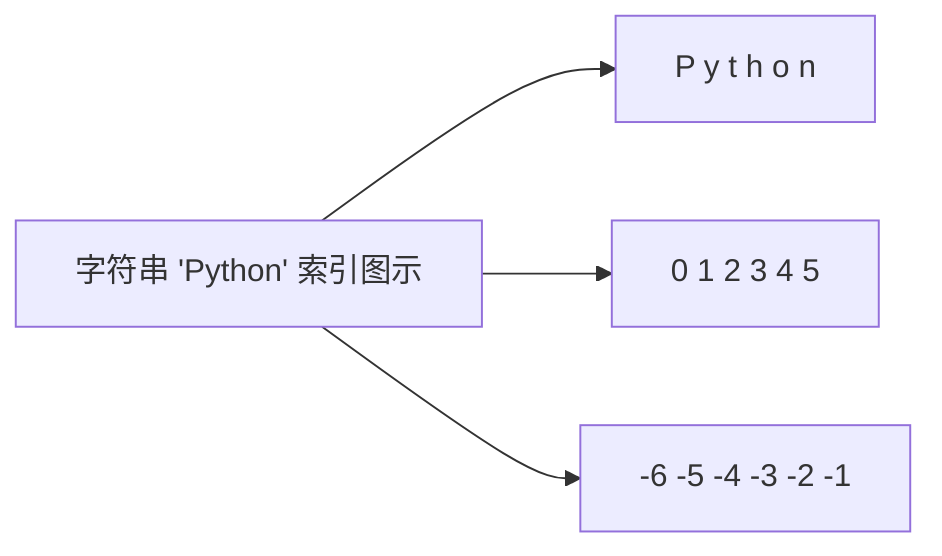
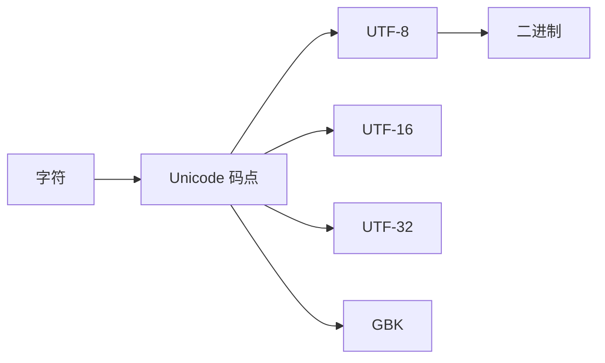

+++
title = "第11章 基础语法"
weight = 110
date = "2026-04-08T13:22:00+08:00"
type = "docs"
description = ""
isCJKLanguage = true
draft = false
+++

 第十一章 Python 基础语法

> 想象一下，如果厨房里每种食材都有自己的性格，那 Python 就是那个最友好、最随和的大厨——它的语法简单到连厨房小白都能看懂。本章我们就来认识这位大厨的基本功，从第一道"Hello, World!"开始，一步步走进 Python 的世界。

---

## 11.1 第一个 Python 程序

### 11.1.1 print("Hello, World!")

学编程的第一步是什么？当然是打印"Hello, World!"——这几乎成了程序员世界的入职仪式，就像入职第一天要自我介绍一样经典。

Python 解释器（想象成厨房里的大厨）会一丝不苟地执行你写的每一句指令。而 `print()` 就是大厨的名片，负责把东西"说"出来。

```python
# 这是你人生中第一个 Python 程序
print("Hello, World!")

# 输出: Hello, World!
```

> 没错，就是这么简单！有的语言要写十几行才能打印一句话，Python 表示："就这？"

### 11.1.2 保存为 .py 文件

光在交互式解释器里玩可不行，我们得把代码保存下来，这样下次想跑就不用重新敲了。

1. 打开任意文本编辑器（VS Code、Notepad++、甚至记事本都行）
2. 输入 `print("Hello, World!")`
3. 保存为 `hello.py`

> `.py` 就是 Python 的身份证后缀，代表"这是一个 Python 程序，不是番茄炒蛋的菜谱"。

### 11.1.3 运行方式

有几种方式可以让你的 Python 程序跑起来：

**方式一：命令行运行**

```powershell
# 在终端里执行
python hello.py
# 输出: Hello, World!
```

**方式二：在 IDE/编辑器里直接运行**

按 F5 或者点击那个看起来像播放按钮的东西（各编辑器不同，找找看）。

**方式三：当作模块导入**

```python
# 在 Python 解释器里
import hello
# 这会执行 hello.py 里的代码
```

---

## 11.2 注释

注释是什么？**注释是给人类看的备注，Python 解释器会直接无视它们**。你可以把它理解成美食评论家写在菜谱旁边的"少放盐，我口味淡"，厨师做菜的时候是不会看这句话的。

### 11.2.1 单行注释

用井号 `#` 开头，后面的内容全部是注释。

```python
# 这是一行注释
print("这行会执行")  # 这也是注释

x = 10  # x 是一个重要的数字
```

### 11.2.2 多行注释（三引号）

有时候你需要写一大段说明，这时候可以用三个引号包裹起来。

```python
"""
这是一个多行注释
可以写很多很多行
直到遇到下一个三引号为止
"""

print("代码还是正常执行")
```

> 严格来说，三引号是**文档字符串（docstring）**，但很多人把它当多行注释用。Python 并不介意这种"名不副实"——它只关心代码，不关心你怎么叫它。

### 11.2.3 文档字符串（docstring）

文档字符串是函数的"说明书"，放在函数定义的第一行之后。想象成外卖包装上的配料表。

```python
def greet(name):
    """
    向指定的人打招呼

    参数:
        name: 名字（字符串）
    返回:
        问候语（字符串）
    """
    return "你好，" + name + "！"

# 查看文档
help(greet)  # 会打印出上面的说明
print(greet.__doc__)  # 直接访问 __doc__ 属性
```

### 11.2.4 注释规范与最佳实践

| 场景 | 推荐做法 | 反面教材 |
|------|----------|----------|
| 解释为什么这么做 | `# 这里用 .upper() 因为API返回全大写` | `# 循环` |
| 注释复杂逻辑 | 写清每一步的目的 | 逐行翻译代码 |
| TODO 标记 | `# TODO: 优化性能` | `# 以后再说` |

> 好的注释是"为什么"，而不是"是什么"。"把 x 加 1"不需要注释，"为什么要加 1"才需要。

---

## 11.3 变量与赋值

### 11.3.1 一切皆对象的本质

在 Python 的世界里，**一切皆对象（Everything is an Object）**。数字是对象，字符串是对象，函数也是对象，甚至连"没有"（None）也是一个对象。

#### 11.3.1.1 变量是对象的引用（reference）

Python 的变量和其他语言不太一样。它不像是一个盒子，而更像是**便利贴**——你把便利贴贴在某个对象上，就说"这个变量指向那个对象"。

```python
x = 10
y = x      # 把 y 这个便利贴也贴在 10 上面
x = 20     # 把 x 撕下来，贴到 20 上面

print(y)   # y 还是贴着 10，所以输出 10
print(x)   # x 现在贴着 20，所以输出 20
```

> 就像你的快递被错贴了地址——原来的收件人不会因此搬家，只是有一个新的快递员拿着地址去找别人了。

#### 11.3.1.2 id() 和 == 的区别

- `id()` 返回对象的"身份证号"——一个整数，在同一次运行中是唯一的
- `==` 判断两个对象的**值**是否相等

```python
a = [1, 2, 3]
b = [1, 2, 3]

print(id(a))        # 例如 140234567890
print(id(b))        # 例如 140234567891（不同的内存地址）
print(a == b)       # True，值相等
print(a is b)       # False，不是同一个对象
```

> `id()` 就像是人的身份证号（全国唯一），`==` 就像是判断两个人是否同龄。同龄的人很多，但身份证号各不同。

#### 11.3.1.3 is 与 == 的区别

- `is` 判断两个变量是否指向**同一个对象**（身份证号相同）
- `==` 判断两个变量的值是否相等

```python
# 字符串驻留（小整数池）
s1 = "hello"
s2 = "hello"
print(s1 is s2)    # True（Python 优化，同一字符串复用内存）
print(s1 == s2)    # True

# 列表
l1 = [1, 2, 3]
l2 = [1, 2, 3]
print(l1 is l2)    # False（不同的列表对象）
print(l1 == l2)    # True（值相同）

# 整数
n1 = 100
n2 = 100
print(n1 is n2)    # True（-5 到 256 的小整数会被缓存）
```

> **经验法则**：判断值用 `==`，判断身份用 `is`（比如判断是不是 None，推荐用 `is None`）。

---

### 11.3.2 变量命名规则

#### 11.3.2.1 字母、数字、下划线

变量名可以包含字母、数字和下划线。

```python
name = "小明"      # 合法
user_name = "小红" # 合法
age2 = 18          # 合法
_count = 0         # 合法
```

#### 11.3.2.2 不能以数字开头

```python
2nd_place = "第二名"  # 语法错误！
name2 = "小明"        # 合法，数字不在开头
```

> 就像变量名不能是 "114514" 一样，编译器会懵的。

#### 11.3.2.3 不能使用关键字

Python 保留了一些单词作为"关键字"，这些词有特殊含义，不能用作变量名。

```python
# 下面这些都是关键字
# if, else, elif, for, while, def, class, return, import, from, as, try, except, finally, with, lambda, yield, pass, break, continue, and, or, not, in, is, True, False, None, nonlocal, global, assert, raise, del

# 如果你非要挑战
# if = 5  # SyntaxError: invalid syntax
```

> 关键字就是 Python 的"官方称呼"——你不能给自己孩子取名叫"警察"一样，虽然法律不一定管，但大家会觉得你很离谱。

#### 11.3.2.4 区分大小写

```python
Name = "小明"
name = "小红"
print(Name)  # 小明
print(name)  # 小红
```

> Python 认为 "Name" 和 "name" 是两个完全不同的便利贴。

---

### 11.3.3 多元赋值

#### 11.3.3.1 a, b = 1, 2

Python 支持同时给多个变量赋值，右边是一个元组（可以省略括号）。

```python
a, b = 1, 2
print(a)  # 1
print(b)  # 2
```

#### 11.3.3.2 a, b = b, a（交换变量，无需临时变量）

这可能是 Python 最优雅的特性之一——不借助第三个变量，直接交换两个变量的值。

```python
a, b = 1, 2
print(f"交换前: a={a}, b={b}")

a, b = b, a  # 一行搞定交换！

print(f"交换后: a={a}, b={b}")
# 输出:
# 交换前: a=1, b=2
# 交换后: a=2, b=1
```

> 在其他语言里，这需要借助临时变量：`temp = a; a = b; b = temp`。Python 表示："这太麻烦了。"

---

### 11.3.4 链式赋值

#### 11.3.4.1 a = b = c = 123

多个变量同时指向同一个值。

```python
a = b = c = 123
print(a)  # 123
print(b)  # 123
print(c)  # 123
print(a is b is c)  # True，三个变量指向同一个对象
```

> 就像三个人同时订阅了同一个 Newsletter，收到的是同一份内容。

---

## 11.4 数据类型概述

### 11.4.1 内置数据类型分类

Python 内置了丰富的数据类型，可以分为几大类：

```
内置数据类型
├── 数值类型
│   ├── int      # 整数：1, 42, -7
│   ├── float    # 浮点数：3.14, -0.5
│   └── complex  # 复数：1+2j
├── 序列类型
│   ├── str      # 字符串："hello"
│   ├── list     # 列表：[1, 2, 3]
│   └── tuple    # 元组：(1, 2, 3)
├── 映射类型
│   └── dict     # 字典：{"name": "小明"}
├── 集合类型
│   ├── set      # 集合：{1, 2, 3}
│   └── frozenset# 不可变集合
└── 布尔类型
    └── bool     # True / False
```

### 11.4.2 type() 函数查看类型

想知道一个变量是什么类型？`type()` 函数帮你忙。

```python
print(type(42))        # <class 'int'>
print(type(3.14))      # <class 'float'>
print(type("hello"))   # <class 'str'>
print(type([1, 2]))    # <class 'list'>
print(type(True))      # <class 'bool'>
```

### 11.4.3 isinstance() 判断类型

`isinstance()` 用来判断一个对象是否是某个类型的实例。

```python
print(isinstance(42, int))        # True
print(isinstance(3.14, float))    # True
print(isinstance("hello", str))   # True
print(isinstance([1, 2], list))   # True

# 也能判断是否是多个类型之一
print(isinstance("hello", (int, str, float)))  # True
```

> 区别：`type()` 告诉你"这是什么牌子"，`isinstance()` 告诉你"这是不是某种类型"。

---

## 11.5 运算符

### 11.5.1 算术运算符

#### 11.5.1.1 + - * / // % ** 的用法

| 运算符 | 名称 | 例子 | 结果 |
|--------|------|------|------|
| `+` | 加 | `5 + 3` | `8` |
| `-` | 减 | `5 - 3` | `2` |
| `*` | 乘 | `5 * 3` | `15` |
| `/` | 除 | `5 / 3` | `1.6666666666666667` |
| `//` | 整除 | `5 // 3` | `1` |
| `%` | 取余 | `5 % 3` | `2` |
| `**` | 幂 | `5 ** 3` | `125` |

```python
print(5 / 3)     # 1.6666666666666667（浮点数除法）
print(5 // 3)    # 1（地板除，向下取整）
print(5 % 3)     # 2（余数）
print(2 ** 10)   # 1024（2的10次方）
```

#### 11.5.1.2 divmod() 函数

同时得到商和余数。

```python
quotient, remainder = divmod(17, 5)
print(f"商={quotient}, 余数={remainder}")
# 输出: 商=3, 余数=2
```

#### 11.5.1.3 负数除法的行为

Python 的整除（`//`）和取余（`%`）遵循一个数学定律：**始终满足 `a = (a // b) * b + (a % b)`**。

```python
print(-5 // 2)   # -3（向下取整，所以是-3）
print(-5 % 2)    # 1（负数取余结果为正）

print(5 // -2)   # -3
print(5 % -2)    # -1
```

> 这个规则是为了让 `divmod(a, b)` 的结果对所有正负数都有效。

---

### 11.5.2 比较运算符

#### 11.5.2.1 == != > < >= <=

```python
print(3 == 3)    # True
print(3 != 4)    # True
print(5 > 3)     # True
print(5 < 3)     # False
print(5 >= 5)    # True
print(3 <= 5)    # True
```

#### 11.5.2.2 链式比较：a < b < c

Python 支持比较运算符链式使用，非常优雅。

```python
x = 5
print(1 < x < 10)       # True（相当于 1 < x and x < 10）
print(1 < x < 10 < 100) # True
print(x > 0 and x < 3) # False，链式写法更直观
```

> 链式比较不仅更短，还避免了 `&` 和 `and` 混用的问题。

---

### 11.5.3 赋值运算符

#### 11.5.3.1 = += -= *= /= //= %= **=

```python
a = 10

a += 5    # 等价于 a = a + 5
print(a)  # 15

a -= 3    # 等价于 a = a - 3
print(a)  # 12

a *= 2    # 等价于 a = a * 2
print(a)  # 24

a /= 3    # 等价于 a = a / 3
print(a)  # 8.0

a //= 2   # 等价于 a = a // 2
print(a)  # 4.0

a **= 2   # 等价于 a = a ** 2
print(a)  # 16.0
```

---

### 11.5.4 逻辑运算符

#### 11.5.4.1 and / or / not

```python
print(True and False)   # False
print(True or False)     # True
print(not True)          # False
```

#### 11.5.4.2 短路求值（Short-circuit evaluation）

Python 的逻辑运算符会在能确定结果时**立即返回**，不再继续计算右边。

```python
# and 的短路
print(False and 1/0)   # False（不会计算 1/0，避免除零错误）
print(True and 1/0)    # ZeroDivisionError（需要计算到第二个操作数）

# or 的短路
print(True or 1/0)     # True（不会计算 1/0）
print(False or 1/0)    # ZeroDivisionError
```

> 可以理解为："与"运算中，false 后面全是废话；"或"运算中，true 后面不用看了。

#### 11.5.4.3 真值判断规则

在 Python 中，几乎所有对象都能用在布尔上下文中。

```python
# 假值（Falsy）—— 布尔环境中视为 False
print(bool(None))      # False
print(bool(0))          # False
print(bool(0.0))        # False
print(bool(""))         # False（空字符串）
print(bool([]))         # False（空列表）
print(bool(()))         # False（空元组）
print(bool({}))         # False（空字典）
print(bool(set()))      # False（空集合）

# 真值（Truthy）—— 其他一切
print(bool(1))          # True
print(bool("hello"))     # True
print(bool([1, 2]))     # True
print(bool(-1))         # True（非零即真）
```

---

### 11.5.5 位运算符

位运算符直接操作整数的**二进制位**，是底层的位操作。

#### 11.5.5.1 &（与）、|（或）、^（异或）、~（取反）

| 运算符 | 名称 | 说明 |
|--------|------|------|
| `&` | 按位与 | 两位都是 1 才为 1 |
| `|` | 按位或 | 任一为 1 即为 1 |
| `^` | 按位异或 | 不同为 1，相同为 0 |
| `~` | 按位取反 | 0变1，1变0 |

```python
a = 5   # 二进制: 0101
b = 3   # 二进制: 0011

print(a & b)   # 1  (0001)
print(a | b)   # 7  (0111)
print(a ^ b)   # 6  (0110)
print(~a)      # -6 (按位取反)
```

> `~n` 的结果等价于 `-(n+1)`。

#### 11.5.5.2 <<（左移）、>>（右移）

```python
x = 5   # 二进制: 0101

print(x << 1)   # 10 (1010) —— 左移一位，相当于乘 2
print(x << 2)   # 20 (10100) —— 左移两位，相当于乘 4
print(x >> 1)   # 2  (0010) —— 右移一位，相当于除 2 取整
print(x >> 2)   # 1  (0001) —— 右移两位，相当于除 4 取整
```

#### 11.5.5.3 实战：快速乘除 2，判断奇偶

```python
# 判断奇偶
n = 17
print(n & 1)    # 1（奇数），0（偶数）

# 快速乘以 2
print(n << 1)   # 34

# 快速除以 2（整数除法）
print(n >> 1)   # 8
```

> 在性能敏感的代码中，`x << 1` 比 `x * 2` 更快（虽然现代编译器已经优化得很好了）。

---

### 11.5.6 身份运算符

#### 11.5.6.1 is / is not

```python
a = [1, 2, 3]
b = [1, 2, 3]
c = a

print(a is b)       # False（不同的对象）
print(a is c)       # True（同一个对象）
print(a is not b)   # True
```

#### 11.5.6.2 is 与 == 的区别

| 特性 | `is` | `==` |
|------|------|------|
| 比较内容 | 对象身份（内存地址） | 对象的值 |
| 适用场景 | 判断是否是同一对象 | 判断值是否相等 |

```python
# 字符串
s1 = "hello"
s2 = "hello"
print(s1 is s2)    # True（字符串驻留）
print(s1 == s2)    # True

# 列表
l1 = [1, 2]
l2 = [1, 2]
print(l1 is l2)    # False
print(l1 == l2)    # True
```

---

### 11.5.7 成员运算符

#### 11.5.7.1 in / not in

```python
fruits = ["苹果", "香蕉", "橙子"]

print("香蕉" in fruits)       # True
print("葡萄" not in fruits)   # True

text = "Hello, Python!"
print("Python" in text)       # True
print("python" in text)       # False（区分大小写）
```

---

### 11.5.8 运算符优先级

#### 11.5.8.1 完整优先级表（从高到低）

```
优先级（高 → 低）:
1.  ()              # 括号
2.  **               # 幂运算
3.  +x, -x, ~x       # 一元运算符
4.  *, /, //, %      # 乘除整除取余
5.  +, -             # 加减
6.  <<, >>           # 位移
7.  &                # 按位与
8.  ^                # 按位异或
9.  |                # 按位或
10. comparisons      # 比较运算符
11. not x            # 逻辑非
12. and              # 逻辑与
13. or               # 逻辑或
```

```python
# 实际例子
print(2 + 3 * 4)        # 14（先乘后加）
print((2 + 3) * 4)      # 20（括号优先）
print(2 ** 3 ** 2)      # 512（右结合，等于 2 ** (3 ** 2)）
print(3 > 2 and 4 < 5)  # True
```

#### 11.5.8.2 使用括号明确优先级

> **黄金法则**：如果不能 100% 确定优先级，就加括号。这不是能力问题，是代码可读性问题。

```python
# 可读性差的写法
result = a + b * c - d / e ** f

# 可读性好的写法
result = a + (b * c) - (d / (e ** f))
```

---

## 11.6 字符串

字符串是 Python 中最常用的数据类型之一。你可以把它想象成一串念珠——每个珠子是一个字符，按顺序排列。

### 11.6.1 字符串创建

#### 11.6.1.1 单引号：'Hello'

```python
name = 'Hello'
print(name)  # Hello
```

#### 11.6.1.2 双引号："Hello"

```python
name = "Hello"
print(name)  # Hello
```

> 单引号和双引号在 Python 中完全等价，选择哪一个纯属个人审美。我一般用双引号，因为按起来省力（不用按 Shift）。

#### 11.6.1.3 三引号："""多行字符串"""

```python
poem = """
床前明月光，
疑是地上霜。
举头望明月，
低头思故乡。
"""
print(poem)
```

#### 11.6.1.4 单双引号嵌套

当字符串内容包含引号时，需要灵活嵌套。

```python
# 方法一：外单内双
msg1 = '我说："你好！"'

# 方法二：外双内单
msg2 = "It's a sunny day!"

# 方法三：转义
msg3 = "他说：\"你好！\""

print(msg1)  # 我说："你好！"
print(msg2)  # It's a sunny day!
print(msg3)  # 他说："你好！"
```

---

### 11.6.2 原始字符串

#### 11.6.2.1 r"C:\new\file"（不转义反斜杠）

正常字符串中，反斜杠是转义字符的前缀。如果你想表示字面上的反斜杠，可以用原始字符串。

```python
# 普通字符串（反斜杠是转义字符）
path1 = "C:\new\file"
print(path1)  # C:
#            # ew
#            # ile（根据 \n \f 的不同，结果不同）

# 原始字符串（所见即所得）
path2 = r"C:\new\file"
print(path2)  # C:\new\file
```

> 在 Windows 文件路径、网络日志解析、正则表达式等场景中，原始字符串是救星。

---

### 11.6.3 字节字符串

#### 11.6.3.1 b"hello"（bytes 类型）

`bytes` 是 Python 中表示字节序列的类型，用于处理二进制数据、网络通信等。

```python
data = b"hello"
print(type(data))    # <class 'bytes'>
print(data)          # b'hello'
print(data[0])       # 104（第一个字符的 ASCII 码）
```

#### 11.6.3.2 编码转换

```python
# 字符串 → 字节
text = "你好"
byte_data = text.encode("utf-8")
print(byte_data)  # b'\xe4\xbd\xa0\xe5\xa5\xbd'

# 字节 → 字符串
back = byte_data.decode("utf-8")
print(back)  # 你好
```

---

### 11.6.4 字符串索引与切片

字符串像数组一样，可以通过索引访问每个字符。

```python
s = "Python"

# 正向索引（从0开始）
print(s[0])   # P
print(s[1])   # y
print(s[2])   # t

# 反向索引（从-1开始）
print(s[-1])  # n
print(s[-2])  # o
print(s[-3])  # h
```

> 可以把字符串想象成一个环形，正数从左数，负数从右数。

```python
s = "Python"

# 切片：s[起始:结束:步长]
print(s[0:3])   # Pyt（索引 0, 1, 2，不包括 3）
print(s[:3])    # Pyt（省略起始，默认从 0 开始）
print(s[2:])    # thon（从索引 2 到末尾）
print(s[:])     # Python（复制整个字符串）

# 步长切片
print(s[::2])   # Pto（每两个取一个：P-t-o）
print(s[::-1])  # nohtyP（反转字符串）
print(s[5:2:-1])# noh（从索引 5 反向到 3）
```

> **切片规则**：`s[start:end:step]`
> - `start`：起始索引（包含）
> - `end`：结束索引（不包含）
> - `step`：步长（默认 1）



---

### 11.6.5 字符串拼接

#### 11.6.5.1 + 运算符

```python
first = "Hello"
second = "World"
result = first + " " + second
print(result)  # Hello World
```

#### 11.6.5.2 "".join() 方法

拼接多个字符串时，`join()` 比 `+` 更高效。

```python
words = ["Python", "is", "awesome"]
result = " ".join(words)
print(result)  # Python is awesome

# 也可以用其他分隔符
csv = ",".join(["apple", "banana", "orange"])
print(csv)  # apple,banana,orange
```

#### 11.6.5.3 f-string 格式化

```python
name = "小明"
age = 18
print(f"我叫{name}，今年{age}岁")
# 输出: 我叫小明，今年18岁
```

#### 11.6.5.4 format() 方法

```python
# 位置参数
print("我叫{}，今年{}岁".format("小明", 18))

# 关键字参数
print("我叫{name}，今年{age}岁".format(name="小明", age=18))

# 索引
print("{0} + {1} = {2}".format(1, 2, 3))
```

#### 11.6.5.5 % 格式化（Python 2 风格，了解即可）

```python
name = "小明"
score = 95.5
print("我叫%s，这次考了%.1f分" % (name, score))
# 输出: 我叫小明，这次考了95.5分
```

> `%` 格式化是历史遗留，Python 3.6+ 推荐使用 f-string。

---

### 11.6.6 f-string 完整教程（Python 3.6+，含 3.12/3.14 改进）

f-string 是 Python 最强大的字符串格式化工具，读作 "f-string" 或者 "format string"。

#### 11.6.6.1 基本语法

```python
name = "Python"
version = 3.12
print(f"{name} {version}")
# 输出: Python 3.12
```

#### 11.6.6.2 表达式嵌入

f-string 中可以直接写表达式！

```python
a = 10
b = 20
print(f"{a} + {b} = {a + b}")     # 10 + 20 = 30
print(f"{a} * {b} = {a * b}")    # 10 * 20 = 200

# 调用方法
name = "python"
print(f"{name.upper()}")          # PYTHON

# 调用函数
import math
print(f"π 约等于 {math.pi:.2f}")  # π 约等于 3.14
```

#### 11.6.6.3 调试格式：f"{x=}"（Python 3.8+）

```python
x = 42
y = 3.14
print(f"{x=}")        # x=42
print(f"{y=}")        # y=3.14
print(f"{x + y = }")  # x + y = 45.14
```

> `=` 后缀会自动输出变量名和值，比手动写 `f"x={x}"` 方便多了。

#### 11.6.6.4 格式化规格

格式：`{value:spec}`

##### 11.6.6.4.1 保留小数位数：:.2f

```python
import math
print(f"{math.pi:.2f}")   # 3.14
print(f"{math.pi:.4f}")   # 3.1416
print(f"{100/3:.2f}")     # 33.33
```

##### 11.6.6.4.2 对齐与填充：:>10、:<10、:^10

| 格式 | 说明 |
|------|------|
| `:>10` | 右对齐，总宽度 10 |
| `:<10` | 左对齐，总宽度 10 |
| `:^10` | 居中对齐，总宽度 10 |

```python
name = "小明"
print(f"{name:>10}")   #          小明
print(f"{name:<10}")   # 小明
print(f"{name:^10}")   #     小明
print(f"{name:*^10}")  # ****小明***
```

##### 11.6.6.4.3 千分位分隔：:,

```python
population = 1400000000
print(f"{population:,}")    # 1,400,000,000
print(f"{population:,.2f}") # 1,400,000,000.00
```

##### 11.6.6.4.4 百分比格式：:%

```python
ratio = 0.756
print(f"{ratio:.1%}")    # 75.6%
print(f"{ratio:.2%}")    # 75.60%
```

##### 11.6.6.4.5 进制转换：:b、:o、:x

```python
num = 255
print(f"{num:b}")    # 11111111（二进制）
print(f"{num:o}")    # 377（八进制）
print(f"{num:x}")    # ff（十六进制）
print(f"{num:#x}")   # 0xff（带前缀）
```

##### 11.6.6.4.6 零填充：:08d

```python
num = 42
print(f"{num:08d}")    # 00000042
print(f"{num:8d}")     #     42（空格填充）
```

#### 11.6.6.5 类型转换：!r（repr）、!s（str）、!a（ascii）

```python
name = "小明"
print(f"{name!r}")    # '小明'（repr 格式，加引号）
print(f"{name!s}")    # 小明（str 格式）
print(f"{name!a}")    # '\u5c0f\u660e'（ASCII 表示）
```

#### 11.6.6.6 Python 3.12 的改进

Python 3.11 及之前，f-string 有一些限制：

- 不能在 f-string 中使用反斜杠
- 不能有注释
- 嵌套引号限制多

Python 3.12 大幅放宽了这些限制，最值得一提的是**可以在 f-string 中使用引号**：

```python
# Python 3.12+，终于可以在 f-string 里自由使用引号了
name = "World"
print(f"Hello, {name}")  # 正常
print(f"He said: '{name}'")  # 3.12+ 正常工作，3.11 会报 SyntaxError

# 跨行 f-string 也更自由了
```

---

### 11.6.7 format() 方法详解

`format()` 是 f-string 出现之前的主流格式化方法，现在仍然广泛使用。

#### 11.6.7.1 位置参数

```python
print("{} + {} = {}".format(1, 2, 3))     # 1 + 2 = 3
print("{0} {1} {0}".format("A", "B"))     # A B A
print("{2} {0} {1}".format("X", "Y", "Z")) # Z X Y
```

#### 11.6.7.2 关键字参数

```python
print("{name} is {age} years old".format(name="小明", age=18))
# 字典解包
data = {"name": "小明", "age": 18}
print("{name} is {age} years old".format(**data))
```

#### 11.6.7.3 格式化规格

和 f-string 一样的格式化规格，只是写法不同：

```python
print("{:.2f}".format(3.14159))    # 3.14
print("{:>10}".format("右对齐"))    #       右对齐
print("{:,}".format(1000000))      # 1,000,000
print("{:b}".format(255))          # 11111111
```

---

### 11.6.8 字符串常用方法

Python 字符串自带大量方法，用起来非常方便。

#### 11.6.8.1 s.split()：分割

```python
text = "apple,banana,orange"
print(text.split(","))       # ['apple', 'banana', 'orange']

# 默认按空白分割
sentence = "Hello Python World"
print(sentence.split())      # ['Hello', 'Python', 'World']
```

#### 11.6.8.2 s.join()：拼接

```python
words = ["Python", "is", "fun"]
print(" ".join(words))       # Python is fun
print("-".join(words))       # Python-is-fun
```

#### 11.6.8.3 s.strip()：去除空白

```python
text = "   hello   "
print(f"'{text.strip()}'")    # 'hello'

text = "###hello###"
print(text.strip("#"))       # hello

# 还有 lstrip() 和 rstrip()
print(text.lstrip("#"))      # hello###
print(text.rstrip("#"))      # ###hello
```

#### 11.6.8.4 s.replace()：替换

```python
text = "Hello World"
print(text.replace("World", "Python"))  # Hello Python
print(text.replace("o", "O"))           # HellO WOrld

# 替换次数限制
print(text.replace("o", "O", 1))        # HellO World
```

#### 11.6.8.5 s.find()：查找（返回 -1）

```python
text = "Hello Python"
print(text.find("Python"))    # 6（找到，返回起始索引）
print(text.find("Java"))      # -1（未找到）

# 也可以指定范围
print(text.find("o", 5, 10))  # 在指定范围内查找
```

#### 11.6.8.6 s.index()：查找（不存在抛异常）

```python
text = "Hello Python"
print(text.index("Python"))   # 6
# print(text.index("Java"))    # ValueError: substring not found

# rindex() 从右边开始找
print(text.rindex("o"))       # 11
```

#### 11.6.8.7 s.startswith()：判断前缀

```python
text = "Hello Python"
print(text.startswith("Hello"))     # True
print(text.startswith("Python"))    # False
print(text.startswith(("Hello", "Hi")))  # True（任一匹配即可）
```

#### 11.6.8.8 s.endswith()：判断后缀

```python
filename = "document.pdf"
print(filename.endswith(".pdf"))    # True
print(filename.endswith(".txt"))    # False
```

#### 11.6.8.9 s.upper()：转大写

```python
text = "Hello"
print(text.upper())     # HELLO
```

#### 11.6.8.10 s.lower()：转小写

```python
text = "HELLO"
print(text.lower())     # hello
```

#### 11.6.8.11 s.title()：首字母大写

```python
text = "hello python world"
print(text.title())     # Hello Python World
```

#### 11.6.8.12 s.capitalize()：首字母大写其余小写

```python
text = "hELLO pYTHON"
print(text.capitalize())  # Hello python
```

#### 11.6.8.13 s.swapcase()：大小写互换

```python
text = "HeLLo"
print(text.swapcase())  # hEllO
```

#### 11.6.8.14 s.isdigit()：是否为数字

```python
print("123".isdigit())    # True
print("123a".isdigit())   # False
print("一二三".isdigit())  # False
```

#### 11.6.8.15 s.isalpha()：是否为字母

```python
print("abc".isalpha())    # True
print("abc123".isalpha()) # False
print("小明".isalpha())   # True
```

#### 11.6.8.16 s.isalnum()：是否为字母或数字

```python
print("abc123".isalnum()) # True
print("abc 123".isalnum())# False（有空格）
print("abc-123".isalnum())# False（有连字符）
```

#### 11.6.8.17 s.isupper()：是否全大写

```python
print("ABC".isupper())    # True
print("ABC123".isupper()) # True
print("Abc".isupper())    # False
```

#### 11.6.8.18 s.islower()：是否全小写

```python
print("abc".islower())    # True
print("abc123".islower()) # True
print("Abc".islower())    # False
```

#### 11.6.8.19 s.isspace()：是否全空白

```python
print("   ".isspace())    # True
print("\t\n".isspace())   # True
print("".isspace())       # False
print(" a ".isspace())    # False
```

#### 11.6.8.20 s.count()：计数

```python
text = "hello python, hello world"
print(text.count("hello"))      # 2
print(text.count("o"))          # 4
print(text.count("l", 0, 5))    # 2（限定范围）
```

#### 11.6.8.21 s.splitlines()：按行分割

```python
text = "line1\nline2\nline3"
print(text.splitlines())  # ['line1', 'line2', 'line3']
```

#### 11.6.8.22 s.center()：居中对齐

```python
text = "Hi"
print(text.center(10))      # "    Hi    "
print(text.center(10, "*")) # "****Hi****"
```

#### 11.6.8.23 s.ljust()：左对齐

```python
text = "Hi"
print(text.ljust(10))      # "Hi        "
print(text.ljust(10, "-")) # "Hi--------"
```

#### 11.6.8.24 s.rjust()：右对齐

```python
text = "Hi"
print(text.rjust(10))      # "        Hi"
print(text.rjust(10, "0")) # "000000000Hi"
```

#### 11.6.8.25 s.zfill()：零填充

```python
text = "42"
print(text.zfill(8))   # "00000042"
print("-42".zfill(6))  # "-00042"
```

#### 11.6.8.26 s.partition()：分割为三部分

```python
text = "hello-world-python"
print(text.partition("-"))
# ('hello', '-', 'world-python')
print(text.partition("."))
# ('hello-world-python', '', '')  # 未找到时，原字符串在第一部分
```

#### 11.6.8.27 s.rpartition()：从右分割为三部分

```python
text = "hello-world-python"
print(text.rpartition("-"))
# ('hello-world', '-', 'python')
```

#### 11.6.8.28 s.expandtabs()：制表符展开

```python
text = "a\tb\tc"
print(text.expandtabs())      # a       b       c
print(text.expandtabs(4))     # a   b   c
```

#### 11.6.8.29 s.translate()：字符映射转换

```python
# 删除所有元音
text = "Hello Python"
table = str.maketrans("", "", "aeiouAEIOU")
print(text.translate(table))  # Hll Pythn

# 字符替换映射
table = str.maketrans("aeiou", "12345")
print(text.translate(table))  # H2ll4 Pyth6n
```

#### 11.6.8.30 s.encode()：编码为 bytes

```python
text = "你好"
encoded = text.encode("utf-8")
print(encoded)      # b'\xe4\xbd\xa0\xe5\xa5\xbd'

# 不同编码
encoded_gbk = text.encode("gbk")
print(encoded_gbk)  # b'\xc4\xe3\xba\xc3'
```

#### 11.6.8.31 s.casefold()：大小写折叠（用于不区分大小写比较）

```python
text1 = "HELLO"
text2 = "hello"
print(text1.lower() == text2.lower())   # True
print(text1.casefold() == text2.casefold())  # True

# 对于特殊字符，casefold 比 lower 更强
print("ß".lower())    # ß（不变）
print("ß".casefold()) # ss（转换为 ss）
```

#### 11.6.8.32 s.format_map()：类似 format 但不拷贝字典

```python
data = {"name": "小明", "age": 18}

# format 的情况
print("{name} is {age}".format(**data))

# format_map 的情况
print("{name} is {age}".format_map(data))

# 区别：当字典很大时，format_map 不复制字典，效率更高
```

---

### 11.6.9 字符串编码

#### 11.6.9.1 ASCII、UTF-8、GBK、Unicode 关系

| 编码 | 说明 | 字符数 |
|------|------|--------|
| ASCII | 最老牌，只能表示英文字母、数字和少量符号 | 128 个 |
| Unicode | 统一编码表，试图包含世界上所有文字 | 超过 10 万个 |
| UTF-8 | Unicode 的变长编码实现，英语用 1 字节，中文用 3 字节 | 可变 |
| GBK | 中文扩展编码，支持中文简体繁体及更多符号 | 中文字符为主 |



> 简单理解：Unicode 是"给每个字符分配一个编号"，UTF-8 是"如何把这些编号存进计算机"。

#### 11.6.9.2 encode()：str → bytes

```python
text = "你好"
encoded = text.encode("utf-8")
print(encoded)  # b'\xe4\xbd\xa0\xe5\xa5\xbd'
```

#### 11.6.9.3 decode()：bytes → str

```python
data = b'\xe4\xbd\xa0\xe5\xa5\xbd'
text = data.decode("utf-8")
print(text)  # 你好
```

#### 11.6.9.4 常见编码错误与解决

```python
# 场景一：编码错误
try:
    "你好".encode("ascii")
except UnicodeEncodeError as e:
    print(f"编码失败：{e}")

# 场景二：解码错误
try:
    b'\xe4\xbd\xa0'.decode("gbk")
except UnicodeDecodeError as e:
    print(f"解码失败：{e}")  # Python 3 默认会报 UnicodeDecodeError

# 解决：使用 errors 参数
print(b'\xe4\xbd\xa0'.decode("gbk", errors="ignore"))  # 忽略错误字节
print(b'\xe4\xbd\xa0'.decode("gbk", errors="replace")) # 用 ? 替换无法解码的字节
```

---

### 11.6.10 字符串不可变性

字符串是**不可变的（Immutable）**，这是 Python 的重要特性。

#### 11.6.10.1 字符串切片赋值报错

```python
s = "hello"
# s[0] = "H"  # TypeError: 'str' object does not support item assignment
```

> 想象成刻在石头上的字——你不能修改，只能重新刻一块新的石头。

#### 11.6.10.2 正确做法：s = s[:5] + "xxx" + s[5:]

```python
s = "hello"
s = s[:1].upper() + s[1:]
print(s)  # Hello

# 在中间插入
s = "hello"
s = s[:2] + "X" + s[2:]
print(s)  # heXllo

# 删除字符
s = "hello"
s = s[:2] + s[3:]
print(s)  # helo
```

---

## 11.7 布尔值

布尔值只有两个：`True`（真）和 `False`（假）。

### 11.7.1 True / False

```python
print(True)   # True
print(False)  # False
print(True == 1)    # True
print(False == 0)   # True
```

### 11.7.2 假值列表（falsy values）

#### 11.7.2.1 None、0、""、[]、()、{}、set()

这些值在布尔上下文中会被当作 `False`：

```python
falsy_values = [None, 0, 0.0, "", [], (), {}, set(), False]
for val in falsy_values:
    print(f"{val!r:8} -> bool: {bool(val)}")

# None  -> bool: False
# 0     -> bool: False
# 0.0   -> bool: False
# ''    -> bool: False
# []    -> bool: False
# ()    -> bool: False
# {}    -> bool: False
# set() -> bool: False
# False -> bool: False
```

#### 11.7.2.2 bool() 转换规则

`bool()` 函数将其他类型转换为布尔值：

```python
print(bool(42))        # True（非零数字）
print(bool(""))        # False
print(bool("非空"))     # True
print(bool([1]))       # True（非空列表）
print(bool(None))      # False
```

### 11.7.3 短路求值与布尔运算符

#### 11.7.3.1 "hello" and "world" → "world"

`and` 运算符返回第一个为假的值，或最后一个值：

```python
result = "hello" and "world"
print(result)  # world

result = "" and "world"
print(result)  # ''（返回空字符串，因为它是第一个假值）
```

#### 11.7.3.2 "" or "default" → "default"

`or` 运算符返回第一个为真的值，或最后一个值：

```python
result = "" or "default"
print(result)  # default

result = "hello" or "world"
print(result)  # hello
```

> 实际应用：设置默认值
> ```python
> name = user_input or "Anonymous"
> ```

---

## 11.8 控制流

### 11.8.1 if / elif / else 结构

#### 11.8.1.1 基本语法

```python
score = 85

if score >= 90:
    print("优秀")
elif score >= 80:
    print("良好")   # 这行会执行
elif score >= 60:
    print("及格")
else:
    print("不及格")
```

> **缩进是 Python 的灵魂！** 4 个空格的缩进不能忘。

#### 11.8.1.2 条件表达式（三元运算符）：x if condition else y

```python
age = 20
status = "成年" if age >= 18 else "未成年"
print(status)  # 成年
```

### 11.8.2 match...case（Python 3.10+）

match...case 是 Python 3.10 引入的模式匹配，类似于其他语言的 switch。

#### 11.8.2.1 基本 match 用法

```python
def http_status(status):
    match status:
        case 200:
            return "OK"
        case 404:
            return "Not Found"
        case 500:
            return "Internal Server Error"
        case _:
            return "Unknown"

print(http_status(200))   # OK
print(http_status(404))   # Not Found
```

#### 11.8.2.2 多种 case 模式

```python
def describe_point(point):
    match point:
        case (0, 0):
            return "原点"
        case (x, 0):
            return f"X轴上的点 ({x}, 0)"
        case (0, y):
            return f"Y轴上的点 (0, {y})"
        case (x, y):
            return f"平面上的点 ({x}, {y})"
        case _:
            return "未知"

print(describe_point((0, 0)))    # 原点
print(describe_point((3, 0)))    # X轴上的点 (3, 0)
print(describe_point((2, 5)))   # 平面上的点 (2, 5)
```

---

### 11.8.3 for 循环

#### 11.8.3.1 for item in iterable

遍历任何可迭代对象：

```python
fruits = ["苹果", "香蕉", "橙子"]
for fruit in fruits:
    print(fruit)

# 遍历字符串
for char in "Python":
    print(char)
```

#### 11.8.3.2 range() 循环

生成整数序列：

```python
# range(end)
for i in range(5):
    print(i)  # 0, 1, 2, 3, 4

# range(start, end)
for i in range(1, 6):
    print(i)  # 1, 2, 3, 4, 5

# range(start, end, step)
for i in range(0, 10, 2):
    print(i)  # 0, 2, 4, 6, 8
```

#### 11.8.3.3 enumerate()：同时获取索引和值

```python
fruits = ["苹果", "香蕉", "橙子"]
for index, fruit in enumerate(fruits):
    print(f"{index}: {fruit}")

# 输出:
# 0: 苹果
# 1: 香蕉
# 2: 橙子

# 从 1 开始编号
for i, fruit in enumerate(fruits, start=1):
    print(f"{i}. {fruit}")
```

#### 11.8.3.4 zip()：并行遍历多个序列

```python
names = ["Alice", "Bob", "Charlie"]
ages = [25, 30, 35]
cities = ["北京", "上海", "深圳"]

for name, age, city in zip(names, ages, cities):
    print(f"{name}, {age}岁, 住在{city}")

# 输出:
# Alice, 25岁, 住在北京
# Bob, 30岁, 住在上海
# Charlie, 35岁, 住在深圳
```

#### 11.8.3.5 reversed()：反向遍历

```python
fruits = ["苹果", "香蕉", "橙子"]
for fruit in reversed(fruits):
    print(fruit)

# 输出:
# 橙子
# 香蕉
# 苹果
```

#### 11.8.3.6 sorted()：排序遍历

```python
fruits = ["香蕉", "苹果", "橙子"]
for fruit in sorted(fruits):
    print(fruit)

# 输出:
# 苹果
# 橙子
# 香蕉
```

---

### 11.8.4 while 循环

#### 11.8.4.1 while condition

```python
count = 0
while count < 5:
    print(count)
    count += 1
```

#### 11.8.4.2 while True + break

```python
while True:
    user_input = input("输入 'quit' 退出: ")
    if user_input == "quit":
        break
    print(f"你输入了: {user_input}")
```

---

### 11.8.5 break / continue / pass 的区别

#### 11.8.5.1 break：跳出整个循环

```python
for i in range(10):
    if i == 5:
        break
    print(i)  # 0, 1, 2, 3, 4
```

#### 11.8.5.2 continue：跳过本次迭代

```python
for i in range(10):
    if i % 2 == 0:
        continue
    print(i)  # 1, 3, 5, 7, 9（只打印奇数）
```

#### 11.8.5.3 pass：空语句（占位符）

```python
for i in range(5):
    pass  # 还没想好要做什么，先占个位置

# 常用于定义空函数
def TODO():
    pass
```

> **记忆技巧**：
> - `break`：打破（整个循环都别玩了）
> - `continue`：继续（跳过这个，继续下一个）
> - `pass`：通过（什么都没做，就是个过客）

---

### 11.8.6 循环 else 子句

#### 11.8.6.1 for...else：当循环正常结束时执行 else

```python
# 场景：查找质数
for n in range(2, 10):
    for x in range(2, n):
        if n % x == 0:
            print(f"{n} 不是质数")
            break
    else:
        print(f"{n} 是质数")

# 当循环没有被 break 退出时，else 会执行
```

> 这个语法很独特，其他语言很少见。但用好了可以让代码更清晰。

---

### 11.8.7 推导式

#### 11.8.7.1 列表推导式

```python
# 传统写法
squares = []
for i in range(10):
    squares.append(i ** 2)

# 列表推导式
squares = [i ** 2 for i in range(10)]
print(squares)  # [0, 1, 4, 9, 16, 25, 36, 49, 64, 81]

# 带条件
even_squares = [i ** 2 for i in range(10) if i % 2 == 0]
print(even_squares)  # [0, 4, 16, 36, 64]
```

#### 11.8.7.2 集合推导式

```python
squares_set = {i ** 2 for i in range(10)}
print(squares_set)  # {0, 1, 4, 9, 16, 25, 36, 49, 64, 81}
```

#### 11.8.7.3 字典推导式

```python
squares_dict = {i: i ** 2 for i in range(5)}
print(squares_dict)  # {0: 0, 1: 1, 2: 4, 3: 9, 4: 16}
```

#### 11.8.7.4 生成器表达式

```python
# 和列表推导式类似，但用圆括号
squares_gen = (i ** 2 for i in range(10))
print(squares_gen)       # <generator object <genexpr> at ...>
print(list(squares_gen)) # [0, 1, 4, 9, 16, 25, 36, 49, 64, 81]

# 节省内存，因为生成器是惰性的
```

---

## 11.9 输入与输出

### 11.9.1 input() 函数

#### 11.9.1.1 input("请输入姓名：")

`input()` 会显示提示信息，等待用户输入：

```python
name = input("请输入姓名：")
print(f"你好，{name}！")
```

#### 11.9.1.2 返回字符串

`input()` 总是返回字符串：

```python
age = input("请输入年龄：")
print(type(age))  # <class 'str'>
print(age)        # 用户输入的内容
```

#### 11.9.1.3 类型转换

需要数字时记得转换类型：

```python
age = int(input("请输入年龄："))
height = float(input("请输入身高（米）："))

print(f"明年你就 {age + 1} 岁了")
print(f"身高是 {height:.2f} 米")
```

> 如果用户输入的不是数字，`int()` 会报 `ValueError`。生产环境中建议加异常处理。

---

### 11.9.2 print() 函数详解

`print()` 是 Python 最常用的输出函数，功能比看起来强大得多。

#### 11.9.2.1 sep：分隔符（默认空格）

```python
print("A", "B", "C")           # A B C
print("A", "B", "C", sep="-")  # A-B-C
print("2024", "01", "01", sep="-")  # 2024-01-01
```

#### 11.9.2.2 end：结尾字符（默认换行）

```python
print("Loading", end="")
for i in range(3):
    print(".", end="", flush=True)
    import time; time.sleep(0.5)
print("\n完成！")

# 输出: Loading...
# 完成！
```

#### 11.9.2.3 file：输出到文件

```python
with open("output.txt", "w", encoding="utf-8") as f:
    print("写入文件的内容", file=f)
```

#### 11.9.2.4 flush：强制刷新输出

```python
import time
print("正在下载...", end="", flush=True)
time.sleep(1)
print("完成！")
# 不加 flush=True，可能要等到缓冲区满了才显示
```

---

### 11.9.3 格式化输出

#### 11.9.3.1 f-string

```python
name = "小明"
score = 95.5
print(f"姓名: {name}, 成绩: {score:.1f}")
```

#### 11.9.3.2 format()

```python
print("姓名: {}, 成绩: {:.1f}".format("小明", 95.5))
```

#### 11.9.3.3 格式化输出表格

```python
# 用 f-string 对齐
header = f"{'姓名':^10}{'年龄':^10}{'城市':^10}"
print(header)
print("-" * 30)
print(f"{'小明':^10}{'18':^10}{'北京':^10}")
print(f"{'小红':^10}{'20':^10}{'上海':^10}")

# 输出:
#     姓名        年龄        城市
# ------------------------------
#     小明        18          北京
#     小红        20          上海
```

---

## 本章小结

本章我们一起踏入了 Python 的门槛，学习了以下核心知识点：

1. **第一个程序**：用 `print("Hello, World!")` 完成了编程世界的入职仪式。

2. **注释的艺术**：单行注释 `#`、多行三引号 `"""`、文档字符串，让代码成为"会说话的艺术品"。

3. **变量与引用**：Python 的变量是便利贴，对象才是真正的内容。`id()` 是身份证，`is` 判断同一个人，`==` 判断双胞胎。

4. **数据类型**：从数值到字符串，从列表到字典，Python 的内置类型能满足你的一切想象。

5. **运算符家族**：算术、比较、逻辑、位运算、身份运算、成员运算——Python 给了你完整的运算符工具箱。

6. **字符串**：Python 的字符串功能强大到可以单独写一本书。f-string、切片、方法链……让文字处理变得优雅。

7. **布尔值**：`True` 和 `False` 是逻辑的基础，而"假值列表"是 Python 特有的有趣知识点。

8. **控制流**：`if-elif-else` 铺路，`for-while` 循环跑圈，`break-continue-pass` 控制节奏，`match-case`（3.10+）开启模式匹配新时代。

9. **输入输出**：`input()` 读取用户心声，`print()` 输出万物，中间靠格式化串联。

> 记住：**代码是写给人看的，顺带能让机器运行**。写代码的时候多想想未来维护这段代码的人（很可能就是你自己）。

下一章，我们将继续探索 Python 的函数和模块世界！

---

*「Talk is cheap, show me the code」—— 但如果你连语法都不懂，代码怎么写呢？所以先把这章搞懂吧！*
