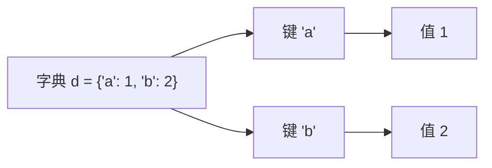

+++
title = "第12章 数据类型"
weight = 120
date = "2026-04-08T13:22:00+08:00"
type = "docs"
description = ""
isCJKLanguage = true
draft = false
+++

# 第 12 章：数据类型——Python 的积木们

> 🎉 欢迎来到 Python 数据的奇幻世界！在这一章里，我们要认识各种"数据类型"。如果说 Python 是一门艺术，那数据类型就是画家的颜料盘。没有颜料，画家也画不出蒙娜丽莎；没有数据类型，Python 程序员只能对屏幕发呆。所以，系好安全带，我们要发车了！

---

## 12.1 NoneType——"什么都没有"的哲学

### 12.1.1 None 的含义

在 Python 的世界里，有一个神奇的存在，它叫 `None`。它不是 0，不是空字符串，不是空列表，而是一个**表示"什么都没有"的特殊值**。

你可以把 `None` 想象成一个空箱子——这个箱子本身是存在的，但它里面啥都没有。就像你去快递柜取件，柜子是存在的，但里面没你的包裹。

```python
# None 就是 None，它自己
x = None
print(x)          # None
print(type(x))    # <class 'NoneType'>
```

> 📝 `NoneType` 是 `None` 的类型，全世界只有一个 `None` 的实例——对，就是那个 `None`。它不像 `int`、`str` 那样有无数个实例，`None` 是独一无二的孤独选手。

### 12.1.2 None vs 空值（""、[]、{}）

这是新手最容易搞混的地方。让我用一个生动的比喻来解释：

| 值 | 比喻 |
|---|---|
| `None` | 一个**不存在的空盒子**——盒子本身不存在 |
| `""` | 一个**存在的空盒子**——盒子在，但里面没东西 |
| `[]` | 一个**存在的空箱子**——箱子在，但里面没货物 |
| `{}` | 一个**存在的空抽屉柜**——柜子在，但抽屉都是空的 |

```python
# 让我们来验证一下
print(None == "")      # False —— 物种都不一样！
print(None == [])      # False —— 一个是虚无，一个是空list
print(None == {})      # False —— 完全不同

# 空值不是 None
print(bool(None))      # False —— None 是 falsy 的
print(bool(""))        # False —— 空字符串也是 falsy 的
print(bool([]))        # False —— 空列表还是 falsy 的
```

> 💡 虽然 `None`、`""`、`[]`、`{}` 在布尔判断中都等于 `False`（都是 falsy 值），但它们**本质上完全不同**！`None` 表示"这里压根没有值"，而空容器表示"这里有值，只是是空的"。

### 12.1.3 None 的用途

`None` 在 Python 中可是个多面手，用途广泛。

#### 12.1.3.1 作为函数默认参数

当你设计一个函数，有时候需要表示"用户没给我这个参数"的状态，这时候 `None` 就派上用场了。

```python
def greet(name=None):
    # 如果用户没传 name，我们就给他一个默认的
    if name is None:
        name = "神秘游客"
    print(f"你好，{name}！欢迎光临！")

greet()               # 你好，神秘游客！欢迎光临！
greet("小明")         # 你好，小明！欢迎光临！
```

> 💡 为什么不用 `""` 或其他默认值？因为 `None` 可以明确区分"用户没传参数"和"用户传了一个空值"。如果默认参数是 `""`，你就分不清用户是真的传了空字符串，还是压根没传。

#### 12.1.3.2 作为函数返回值

当函数不需要返回具体值时（比如只执行打印操作的函数），默认返回 `None`。

```python
def say_hello():
    print("Hello!")

result = say_hello()
print(result)         # None —— 没有 return 语句的函数都返回 None

# 常见的场景：查找操作，没找到就返回 None
def find_user(users, user_id):
    for user in users:
        if user["id"] == user_id:
            return user
    return None  # 找不到就返回 None，而不是抛异常

users = [{"id": 1, "name": "张三"}, {"id": 2, "name": "李四"}]
print(find_user(users, 99))   # None —— 没找到
print(find_user(users, 1))    # {'id': 1, 'name': '张三'}
```

#### 12.1.3.3 表示不存在或未知值

有时候，数据"暂时不存在"比"根本不应该存在"更准确。`None` 就是这种场景的最佳选择。

```python
# 比如一个用户的"最后一次登录时间"——新用户可能还没登录过
user = {"name": "小明", "last_login": None}
# 这里 None 表示"还没有登录记录"，而不是"登录时间是0"或者"忘记记录了"

# Optional 类型提示（Python 3.5+）
from typing import Optional

def get_user_age(user: Optional[dict]) -> Optional[int]:
    """获取用户年龄，可能用户不存在（返回 None）或者用户没设置年龄（也是 None）"""
    if user is None:
        return None
    return user.get("age")
```

---

## 12.2 数值类型——数字的万花筒

Python 提供了丰富的数值类型，从整数到浮点数，从复数到精确小数，应有尽有。让我们一个一个来认识它们！

### 12.2.1 int（整数）—— 没有上限的数字

#### 12.2.1.1 任意精度（无溢出）

在很多编程语言（比如 C、Java）中，`int` 是有上限的。超过上限就会**溢出**，数字会变成负数或者变成一个莫名其妙的结果。

但 Python 的 `int` 是**任意精度的**！理论上，你可以表示任意大的整数，只要你的内存够用。

```python
# 在 Python 中，你可以计算这个
big_number = 10 ** 1000  # 1 后面跟 1000 个零！
print(big_number)  # 这在 C 语言里早就溢出了，但 Python 表示：就这？

# 再来个大一点的
really_big = 2 ** 10000
print(f"2的10000次方有 {really_big.bit_length()} 位")
# 2的10000次方有 10001 位 —— 这数字比宇宙中的原子数还多！
```

> 🌌 Python 整数使用**变长表示**，即：数字越大，占用的内存越多。所以别想着用一个天文数字把电脑撑爆——最多只是算得慢一点。

#### 12.2.1.2 进制转换

Python 支持多种进制表示和转换，非常方便：

```python
# 字面量表示
print(42)           # 十进制: 42
print(0b101010)     # 二进制（binary）: 42 —— 前缀 0b
print(0o52)         # 八进制（octal）: 42 —— 前缀 0o
print(0x2a)         # 十六进制（hex）: 42 —— 前缀 0x

# 十进制转其他进制
print(bin(42))      # '0b101010'
print(oct(42))      # '0o52'
print(hex(42))      # '0x2a'

# 字符串转整数（指定进制）
print(int("101010", 2))   # 42 —— 把二进制字符串转成十进制int
print(int("0x2a", 16))   # 42 —— 把十六进制字符串转成十进制int
print(int("52", 8))       # 42 —— 把八进制字符串转成十进制int

# 格式化输出不同进制
print(f"{42:b}")  # 101010 —— 二进制
print(f"{42:o}")  # 52 —— 八进制
print(f"{42:x}")  # 2a —— 十六进制
```

> 💡 小技巧：二进制用 `0b`，八进制用 `0o`，十六进制用 `0x`—— 字母 o 和 x 帮助区分八进制（octal）和十六进制（hex）。

#### 12.2.1.3 位运算操作

位运算是对整数的二进制位进行操作，速度飞快，是高级 Python 程序员必备技能！

```python
# 与（&）：两个位都是1才得1
a = 0b1100  # 12
b = 0b1010  # 10
print(bin(a & b))   # 0b1000 —— 结果是 8

# 或（|）：只要有一个是1就得1
print(bin(a | b))   # 0b1110 —— 结果是 14

# 异或（^）：不同得1，相同得0
print(bin(a ^ b))   # 0b0110 —— 结果是 6

# 取反（~）：按位取反，等于 -(n+1)
print(~5)    # -6 —— 这是因为 Python 使用补码表示负数

# 左移（<<）：二进制位左移，相当于乘以2的n次方
print(1 << 3)   # 8 —— 1 左移 3 位，等于 1 * 2^3 = 8
print(5 << 2)   # 20 —— 5 * 4 = 20

# 右移（>>）：二进制位右移，相当于除以2的n次方（向下取整）
print(16 >> 2)   # 4 —— 16 / 4 = 4
print(15 >> 2)   # 3 —— 15 / 4 = 3.75，向下取整得 3
```

> 🐍 经典面试题：如何不用临时变量交换两个数字？
> ```python
> a = 5
> b = 8
> a = a ^ b
> b = a ^ b  # b = (a ^ b) ^ b = a
> a = a ^ b  # a = (a ^ b) ^ a = b
> print(a, b)  # 8 5 —— 交换完成！
> ```

#### 12.2.1.4 bit_length()、to_bytes()、from_bytes()

```python
# bit_length()：返回整数的二进制表示的位数
x = 15
print(x.bit_length())   # 4 —— 15 的二进制是 1111，有4位
print((2 ** 100).bit_length())  # 101 —— 2的100次方有101位

# to_bytes()：将整数转为字节串（用于文件写入、网络传输等）
# to_bytes(length, byteorder='big')
num = 1024
print(num.to_bytes(2, 'big'))    # b'\x04\x00' —— 大端序
print(num.to_bytes(2, 'little')) # b'\x00\x04' —— 小端序

# from_bytes()：从字节串恢复整数
b = b'\x04\x00'
print(int.from_bytes(b, 'big'))     # 1024
print(int.from_bytes(b, 'little'))  # 4
```

### 12.2.2 float（浮点数）—— 小数点的艺术

#### 12.2.2.1 IEEE 754 双精度标准

Python 的 `float`（又称**双精度浮点数**，double）遵循 **IEEE 754 标准**。这个标准规定：

- 使用 64 个二进制位（bit）存储一个浮点数
- 1 位用于符号（正/负）
- 11 位用于指数（决定数值范围）
- 52 位用于尾数（决定数值精度）

这意味着浮点数的精度是**有限的**，大约有 15-17 位有效十进制数字。

```python
import sys
print(sys.float_info)
# sys.float_info(max=1.7976931348623157e+308, max_exp=1024, ...)
# 这告诉我们：float 能表示的最大值约为 1.8 × 10^308
```

#### 12.2.2.2 精度问题（0.1 + 0.2 != 0.3）

这是 Python 浮点数最著名的问题——也是所有编程语言浮点数的通病！

```python
# 经典问题
print(0.1 + 0.2)   # 0.30000000000000004 —— 为什么会这样？！

# 比较浮点数不能直接用 ==
print(0.1 + 0.2 == 0.3)   # False —— 令人崩溃的 False！

# 正确的方法：使用 math.isclose() 或 round()
import math
print(math.isclose(0.1 + 0.2, 0.3))   # True —— 这才对嘛

# 或者用 decimal 模块（后面会详细介绍）
from decimal import Decimal
print(Decimal('0.1') + Decimal('0.2') == Decimal('0.3'))  # True —— 精确计算
```

> 🔬 为什么会这样？因为 `0.1` 在二进制中是一个**无限循环小数**！就像 1/3 在十进制中是 0.333... 一样，`0.1` 在二进制中是无限循环的。计算时只能截断，所以有了误差。

#### 12.2.2.3 inf / -inf / nan 的处理

浮点数有三个特殊值：正无穷、负无穷、和不是一个数（NaN）。

```python
# 无穷大
print(float('inf'))           # inf
print(float('-inf'))          # -inf
print(10 ** 1000)             # inf —— 超过 float 能表示的最大值

# 无穷大的运算
print(float('inf') + 1)       # inf
print(float('inf') + float('-inf'))  # nan —— 无穷加负无穷 = 不知道是啥
print(float('inf') - float('inf'))   # nan

# NaN（Not a Number）
print(float('nan'))           # nan
print(0.0 / 0.0)               # nan —— 0除以0
print(float('inf') - float('inf'))   # nan

# 判断是否是 nan —— 不能用 ==，要用 math.isnan()
import math
print(math.isnan(float('nan')))   # True
print(math.isnan(0.0 / 0.0))      # True

# 判断是否是有限或无穷
print(math.isfinite(1.0))         # True
print(math.isfinite(float('inf')))  # False
print(math.isfinite(float('nan'))) # False
```

> ⚠️ NaN 有一个诡异的特点：**NaN 不等于任何东西，包括它自己！**
> ```python
> import math
> nan = float('nan')
> print(nan == nan)          # False —— NaN 和谁都不等，包括它自己！
> print(math.isnan(nan))     # True —— 所以判断 NaN 要用 isnan()
> ```

### 12.2.3 complex（复数）—— 进入数学的平行世界

Python 原生支持**复数**（complex number），妈妈再也不用担心我算不出方程的根了！

#### 12.2.3.1 复数创建：3 + 4j

```python
# 复数的创建：使用 j（不是 i！）
z = 3 + 4j
print(z)            # (3+4j)
print(type(z))      # <class 'complex'>

# 也可以用 complex() 函数
z2 = complex(3, 4)  # 等价于 3 + 4j
print(z2)           # (3+4j)

# 纯虚数
pure_img = 5j
print(pure_img)     # 5j
```

#### 12.2.3.2 .real、.imag、conjugate()

```python
z = 3 + 4j

# 实部和虚部
print(z.real)      # 3.0 —— 实部
print(z.imag)      # 4.0 —— 虚部

# 共轭复数：实部不变，虚部取反
print(z.conjugate())   # (3-4j)

# 复数的模（绝对值）
print(abs(z))          # 5.0 —— sqrt(3^2 + 4^2) = 5

# 复数运算
z1 = 1 + 2j
z2 = 3 + 4j
print(z1 + z2)     # (4+6j)
print(z1 * z2)     # (-5+10j)
print(z1 / z2)     # (0.44+0.08j)
```

> 📐 复数在科学计算、信号处理、电气工程中非常有用。比如交流电路分析、傅里叶变换等，都离不开复数。

### 12.2.4 decimal（精确十进制）—— 财务人员的最爱

#### 12.2.4.1 Decimal 使用场景（金融计算）

浮点数虽然快，但精度不够。对于**金融计算**，必须用 `Decimal`！

```python
from decimal import Decimal

# 金融计算：发工资！
salary = Decimal('10000.00')
tax = Decimal('0.15')
bonus = Decimal('5000.00')

total = salary * (1 - tax) + bonus
print(total)   # 13000.00 —— 精确！

# 如果用 float 呢？
salary_f = 10000.00
tax_f = 0.15
bonus_f = 5000.00
total_f = salary_f * (1 - tax_f) + bonus_f
print(total_f)  # 12999.999999999998 —— 精度问题！

# 计算商品总价（复用上面的 Decimal）
price1 = Decimal('0.10')
price2 = Decimal('0.20')
print(price1 + price2)   # 0.30 —— 精确！
print(float(price1) + float(price2))  # 0.30000000000000004
```

> 💰 **重要原则**：涉及到钱的地方，永远用 `Decimal`！虽然 float 计算快，但如果算错账被老板叫去喝茶，那可就不好玩了。

#### 12.2.4.2 精度控制

```python
from decimal import Decimal, getcontext

# 设置精度（默认28位）
getcontext().prec = 10

a = Decimal('1') / Decimal('3')
print(a)   # 0.3333333333 —— 只有10位精度

# 量化（quantize）到指定小数位
from decimal import ROUND_HALF_UP
price = Decimal('19.99') * Decimal('3')
print(price.quantize(Decimal('0.01'), rounding=ROUND_HALF_UP))
# 59.97 —— 四舍五入到分
```

### 12.2.5 fractions（分数）—— 数学老师的梦想

#### 12.2.5.1 Fraction 类使用

如果你讨厌小数，用**分数**吧！

```python
from fractions import Fraction

# 创建分数
f1 = Fraction(3, 4)     # 3/4
f2 = Fraction('5/7')   # 也可以用字符串
f3 = Fraction(0.5)     # 从浮点数创建（注意精度损失）
f4 = Fraction("0.5")   # 从字符串创建（精确）

print(f1)      # 3/4
print(f2)      # 5/7
print(f3)      # 1/2
print(f4)      # 1/2

# 分数运算 —— 结果还是分数！
result = Fraction(1, 3) + Fraction(1, 6)
print(result)  # 1/2 —— 自动约分！

# 解决数学题：1/3 + 1/6 = ?
from fractions import Fraction
print(Fraction(1, 3) + Fraction(1, 6))  # 1/2

# 浮点数转分数
import math
print(Fraction(math.pi).limit_denominator(1000))
# 355/113 —— 著名的圆周率近似分数，误差极小！
```

### 12.2.6 math 模块详解——数学瑞士军刀

`math` 模块是 Python 内置的数学工具箱，函数多得让人眼花缭乱！

#### 12.2.6.1 数值函数（ceil、floor、sqrt、pow、exp、log 等）

```python
import math

# ceil(x)：向上取整 —— 天花板
print(math.ceil(3.2))    # 4 —— 往大的取
print(math.ceil(-3.2))   # -3 —— 往大的取（-3 > -3.2）

# floor(x)：向下取整 —— 地板
print(math.floor(3.9))   # 3 —— 往小的取
print(math.floor(-3.9))  # -4 —— 往小的取（-4 < -3.9）

# sqrt(x)：平方根
print(math.sqrt(16))    # 4.0
print(math.sqrt(2))     # 1.4142135623730951

# pow(x, y)：x的y次方（等价于 x ** y）
print(math.pow(2, 3))   # 8.0 —— 注意返回的是 float
print(2 ** 3)           # 8 —— 这个是 int

# exp(x)：e的x次方
print(math.exp(1))      # 2.718281828459045 —— e ≈ 2.718

# log(x, base)：对数，默认底数为 e（自然对数）
print(math.log(math.e))      # 1.0 —— ln(e) = 1
print(math.log(100, 10))     # 2.0 —— log10(100) = 2
print(math.log2(1024))       # 10.0 —— log2(1024) = 10
print(math.log10(1000))      # 3.0 —— log10(1000) = 3

# factorial(n)：阶乘
print(math.factorial(5))   # 120 —— 5! = 5×4×3×2×1 = 120

# gcd(a, b)：最大公约数
print(math.gcd(48, 18))    # 6 —— 48和18的最大公约数是6

# fabs(x)：绝对值（返回 float）
print(math.fabs(-5))    # 5.0

# trunc(x)：截断取整（向0取整）
print(math.trunc(3.9))    # 3 —— 和 floor 不同！
print(math.trunc(-3.9))   # -3 —— 向0取整
```

#### 12.2.6.2 常量（pi、e、tau、inf、nan）

```python
import math

print(math.pi)    # 3.141592653589793 —— 圆周率 π
print(math.e)     # 2.718281828459045 —— 自然常数 e
print(math.tau)   # 6.283185307179586 —— 2π，完整圆的弧度
print(math.inf)   # inf —— 无穷大
print(math.nan)   # nan —— 不是一个数
```

#### 12.2.6.3 三角函数

```python
import math

# 角度转弧度
angle_deg = 45
angle_rad = math.radians(angle_deg)
print(f"{angle_deg}° = {angle_rad} rad")  # 45° = 0.7853981633974483 rad

# 弧度转角度
rad = math.pi / 4
deg = math.degrees(rad)
print(f"{rad} rad = {deg}°")  # 0.785... rad = 45.0°

# 三角函数
print(math.sin(angle_rad))    # 0.7071067811865476 —— sin(45°) ≈ √2/2
print(math.cos(angle_rad))    # 0.7071067811865476 —— cos(45°) ≈ √2/2
print(math.tan(angle_rad))    # 0.9999999999999999 —— tan(45°) ≈ 1

# 反三角函数
print(math.asin(0.5))    # 0.5235987755982989 —— arcsin(0.5) = π/6
print(math.acos(0.5))    # 1.0471975511965979 —— arccos(0.5) = π/3
print(math.atan(1))      # 0.7853981633974483 —— arctan(1) = π/4

# 双曲函数
print(math.sinh(1))    # 1.1752011936438014
print(math.cosh(1))    # 1.5430806348152437
print(math.tanh(1))    # 0.7615941559557649
```

### 12.2.7 random 模块详解——让程序学会掷骰子

"随机"是程序员的魔法——也是游戏开发、数据分析、机器学习的基石！

#### 12.2.7.1 基本随机数（random、randint、uniform 等）

```python
import random

# random()：返回 [0.0, 1.0) 区间内的随机浮点数
print(random.random())       # 0.721... 每次运行都不一样！

# uniform(a, b)：返回 [a, b] 区间内的随机浮点数
print(random.uniform(1, 10)) # 5.374... 在1到10之间

# randint(a, b)：返回 [a, b] 区间内的随机整数（两端都包含）
print(random.randint(1, 6))  # 4 —— 掷骰子！

# randrange(start, stop, step)：返回随机选择的元素
print(random.randrange(0, 101, 2))  # 随机偶数，0到100之间
```

#### 12.2.7.2 随机选择与打乱（choice、sample、shuffle 等）

```python
import random

# choice(seq)：从序列中随机选一个元素
fruits = ["苹果", "香蕉", "橘子", "葡萄"]
print(random.choice(fruits))  # 随机选一个水果

# sample(population, k)：从总体中随机选k个不重复的元素
deck = list(range(1, 53))  # 52张牌
hand = random.sample(deck, 5)  # 发5张
print(hand)  # [23, 45, 12, 7, 38] —— 5张不重复的牌

# shuffle(x)：原地打乱序列（会修改原列表）
cards = ["红桃A", "黑桃K", "方块Q", "梅花J"]
random.shuffle(cards)  # 洗牌！
print(cards)  # 顺序被打乱了

# choices(population, weights=None, k=1)：可重复选择
# 模拟有偏骰子：6出现的概率是其他数字的2倍
weights = [1, 1, 1, 1, 1, 2]  # 1-5各1份，6有2份
print(random.choices(range(1, 7), weights=weights, k=10))
# 可能输出类似 [3, 6, 1, 6, 4, 6, 2, 6, 5, 6]
```

#### 12.2.7.3 随机分布（gauss、expovariate 等）

```python
import random

# gauss(mu, sigma)：正态分布（高斯分布）
# mu = 均值，sigma = 标准差
height = random.gauss(170, 10)  # 平均身高170，标准差10
print(f"随机身高：{height:.1f} cm")

# expovariate(lambd)：指数分布
# lambd = 1 / 平均值
arrival_time = random.expovariate(1/5)  # 平均5分钟来一辆车
print(f"随机等待时间：{arrival_time:.2f} 分钟")

# 其他分布
print(random.betavariate(2, 5))   # Beta分布
print(random.gammavariate(2, 2))  # Gamma分布
print(random.lognormvariate(0, 1)) # 对数正态分布
print(random.triangular(0, 1))    # 三角分布
```

#### 12.2.7.4 随机种子

**随机种子**让随机数"可重现"——相同的种子产生相同的随机序列！

```python
import random

# 设置种子
random.seed(42)
print(random.random())   # 0.6394267984578837
print(random.random())   # 0.02501075520032851
print(random.randint(1, 100))  # 81

# 重新设置种子，序列会重复
random.seed(42)
print(random.random())   # 0.6394267984578837 —— 和上面第一个一样！
print(random.random())   # 0.02501075520032851 —— 和上面第二个一样！
print(random.randint(1, 100))  # 81 —— 和上面第三个一样！
```

> 🎯 **实战技巧**：调试需要随机数但不想要随机结果时，设定种子！这样每次运行程序的行为都一致，方便排查问题。上线前记得把种子代码删掉或者改成基于时间！

### 12.2.8 statistics 模块——数据的统计大师

`statistics` 模块提供了一整套统计分析工具，是数据科学的好帮手！

```python
import statistics

data = [2, 4, 4, 4, 5, 5, 7, 9]

# 均值（mean）：所有数加起来除以个数
print(statistics.mean(data))       # 5.0 —— (2+4+4+4+5+5+7+9)/8 = 40/8 = 5

# 中位数（median）：排序后位于中间的值
print(statistics.median(data))     # 4.5 —— 排序后 [2,4,4,4,5,5,7,9]，中间是4和5，平均4.5
print(statistics.median([1, 2, 3]))  # 2 —— 奇数个直接取中间

# 众数（mode）：出现次数最多的值
print(statistics.mode(data))       # 4 —— 4出现了3次，最多

# 方差（variance）：衡量数据离散程度
print(statistics.variance(data))   # 4.0 —— 各数据与均值的差的平方的平均

# 标准差（stdev）：方差的平方根，更直观
print(statistics.stdev(data))      # 2.0 —— √4 = 2

# 其他统计量
print(statistics.harmonic_mean(data))  # 调和平均数
print(statistics.geometric_mean(data)) # 几何平均数
```

---

## 12.3 序列类型——排队是有讲究的

### 12.3.1 list（列表）—— 最常用的可变序列

**列表**是 Python 中最最常用的数据结构！它就像一个可以随时增删改的购物清单。

#### 12.3.1.1 列表创建（[]、list()、列表推导式）

```python
# 方法1：直接用方括号
empty = []
numbers = [1, 2, 3, 4, 5]
mixed = ["hello", 42, 3.14, True]  # 列表可以装任意类型

# 方法2：用 list() 函数
another_list = list()           # 空列表
from_string = list("hello")     # ['h', 'e', 'l', 'l', 'o']
from_tuple = list((1, 2, 3))    # [1, 2, 3] —— 从元组创建
from_range = list(range(5))     # [0, 1, 2, 3, 4]

# 方法3：列表推导式（List Comprehension）—— Python的独门绝技！
squares = [x ** 2 for x in range(5)]    # [0, 1, 4, 9, 16]
evens = [x for x in range(10) if x % 2 == 0]  # [0, 2, 4, 6, 8]
```

#### 12.3.1.2 索引访问与切片

```python
fruits = ["苹果", "香蕉", "橘子", "葡萄", "西瓜"]

# 正向索引：从0开始
print(fruits[0])   # 苹果 —— 第一个元素
print(fruits[1])   # 香蕉 —— 第二个元素

# 反向索引：从-1开始
print(fruits[-1])  # 西瓜 —— 最后一个
print(fruits[-2])  # 葡萄 —— 倒数第二个

# 切片：[start:stop:step]
print(fruits[1:4])     # ['香蕉', '橘子', '葡萄'] —— 索引1到3（不包括4）
print(fruits[:3])      # ['苹果', '香蕉', '橘子'] —— 从开头到索引2
print(fruits[2:])      # ['橘子', '葡萄', '西瓜'] —— 从索引2到结尾
print(fruits[::2])     # ['苹果', '橘子', '西瓜'] —— 每隔一个取一个
print(fruits[::-1])    # ['西瓜', '葡萄', '橘子', '香蕉', '苹果'] —— 反转！

# 切片是左闭右开区间 [start, stop)
print(fruits[1:2])  # ['香蕉'] —— 只取索引1，不包括索引2
```

> 💡 记住切片公式：`list[start:stop:step]`，其中 `start` 包含，`stop` 不包含！

#### 12.3.1.3 增删改操作（append、insert、pop、remove、del）

```python
nums = [1, 2, 3]

# 增
nums.append(4)      # 末尾添加：[1, 2, 3, 4]
print(nums)

nums.insert(1, 99)  # 在索引1位置插入99：[1, 99, 2, 3, 4]
print(nums)

nums.extend([5, 6])  # 末尾追加多个：[1, 99, 2, 3, 4, 5, 6]
print(nums)

# 改
nums[0] = 100       # 修改索引0的元素：[100, 99, 2, 3, 4, 5, 6]
print(nums)

# 删
nums.pop()          # 弹出最后一个：[100, 99, 2, 3, 4, 5]，返回6
print(nums)

nums.pop(1)         # 弹出索引1的元素：[100, 2, 3, 4, 5]，返回99
print(nums)

nums.remove(100)    # 删除第一个匹配的元素：[2, 3, 4, 5]
print(nums)

del nums[0]         # 删除索引0的元素：[3, 4, 5]
print(nums)

del nums[0:2]       # 删除切片：[5]
print(nums)
```

#### 12.3.1.4 排序（sort、sorted、reverse）

```python
numbers = [3, 1, 4, 1, 5, 9, 2, 6]

# sort()：原地排序（修改原列表）
numbers.sort()
print(numbers)  # [1, 1, 2, 3, 4, 5, 6, 9]

# sort(reverse=True)：降序排列
numbers.sort(reverse=True)
print(numbers)  # [9, 6, 5, 4, 3, 2, 1, 1]

# sort(key=)：自定义排序规则
words = ["banana", "apple", "Cherry", "date"]
words.sort(key=str.lower)  # 不区分大小写排序
print(words)  # ['apple', 'banana', 'Cherry', 'date']

# sorted()：返回排序后的新列表，不修改原列表
numbers = [3, 1, 4, 1, 5]
sorted_nums = sorted(numbers)
print(numbers)      # [3, 1, 4, 1, 5] —— 原列表不变
print(sorted_nums)  # [1, 1, 3, 4, 5] —— 新列表

# reverse()：原地反转
numbers.reverse()
print(numbers)  # [5, 4, 3, 1, 1]
```

#### 12.3.1.5 拷贝（copy、[:]、deepcopy）

这是新手容易踩坑的地方！

```python
# 浅拷贝的问题
a = [[1, 2], [3, 4]]
b = a          # 这不是拷贝！b和a是同一个对象
b[0][0] = 99
print(a)  # [[99, 2], [3, 4]] —— a也被改了！
print(b)  # [[99, 2], [3, 4]]

# 正确的拷贝方式
a = [[1, 2], [3, 4]]
c = a.copy()    # 浅拷贝：外层列表是新的，但内层列表还是共享的！
d = a[:]        # 同上
c[0][0] = 99    # 修改内层元素——这会影响原列表 a！
print(a)  # [[99, 2], [3, 4]] —— a 也被影响了，因为浅拷贝共享内层对象！
print(c)  # [[99, 2], [3, 4]]

# 真正的深拷贝
import copy
a = [[1, 2], [3, 4]]
e = copy.deepcopy(a)  # 深拷贝：完全独立
e[0][0] = 99
print(a)  # [[1, 2], [3, 4]] —— 原列表不受影响！
print(e)  # [[99, 2], [3, 4]]
```

> 🎭 **记忆口诀**：`=` 是"起别名"（共享对象），`.copy()` 是"浅拷贝"（表亲），`deepcopy()` 是"深拷贝"（完全独立）！

#### 12.3.1.6 列表推导式详解

列表推导式是 Python 的**语法糖**，让代码更简洁、更 Pythonic！

```python
# 基本格式：[表达式 for 项目 in 可迭代对象]

# 传统写法
squares = []
for x in range(10):
    squares.append(x ** 2)
print(squares)  # [0, 1, 4, 9, 16, 25, 36, 49, 64, 81]

# 列表推导式写法
squares = [x ** 2 for x in range(10)]
print(squares)  # [0, 1, 4, 9, 16, 25, 36, 49, 64, 81]

# 带条件过滤
evens = [x for x in range(20) if x % 2 == 0]
print(evens)  # [0, 2, 4, 6, 8, 10, 12, 14, 16, 18]

# 多重循环
pairs = [(x, y) for x in [1, 2] for y in [3, 4]]
print(pairs)  # [(1, 3), (1, 4), (2, 3), (2, 4)]

# 带条件的多重循环
pairs_50 = [(x, y) for x in [1, 2, 3] for y in [3, 4, 5] if x + y > 5]
print(pairs_50)  # [(1, 5), (2, 4), (2, 5), (3, 4), (3, 5)]

# 字典推导式（类似的语法）
word = "hello"
char_count = {c: word.count(c) for c in set(word)}
print(char_count)  # {'h': 1, 'e': 1, 'l': 2, 'o': 1}
```

#### 12.3.1.7 性能分析：append O(1)、insert O(n) 等

```python
# 时间复杂度分析
# O(1) - 常数时间：不管数据多大，操作时间不变
lst = []
lst.append(1)      # O(1) —— 追加很快

# O(n) - 线性时间：操作时间和数据量成正比
lst.insert(0, 1)   # O(n) —— 头部插入，需要移动所有元素

lst.pop()           # O(1) —— 尾部删除
lst.pop(0)          # O(n) —— 头部删除，需要移动所有元素

# O(1) 平均：访问、修改
lst[0] = 99         # O(1) —— 直接定位
val = lst[0]        # O(1) —— 直接访问

# 查找
print(1 in lst)     # O(n) —— 线性查找，需要遍历

# 排序
lst.sort()          # O(n log n) —— 最好的比较排序算法
```

> ⚡ **性能建议**：尾部操作多用 `append()`/`pop()`，避免频繁的 `insert(0, x)` 和 `pop(0)`。如果需要频繁在头部操作，考虑用 `collections.deque`！

### 12.3.2 tuple（元组）—— 不可变的序列

#### 12.3.2.1 元组创建与索引

```python
# 创建元组
empty = ()
single = (42,)  # 注意！单个元素的元组必须加逗号
multi = (1, 2, 3, "hello", True)

# 也可以不加括号（tuple unpacking 常见写法）
t = 1, 2, 3
print(t)  # (1, 2, 3)

# 用 tuple() 从其他序列创建
t_from_list = tuple([1, 2, 3])
t_from_str = tuple("hello")
print(t_from_str)  # ('h', 'e', 'l', 'l', 'o')

# 索引和切片（和列表一样）
t = (1, 2, 3, 4, 5)
print(t[0])      # 1 —— 正向索引
print(t[-1])     # 5 —— 反向索引
print(t[1:4])    # (2, 3, 4) —— 切片
```

#### 12.3.2.2 元组不可变性的意义

元组一旦创建，**内容不能修改**！

```python
t = (1, 2, 3)
# t[0] = 99  # TypeError: 'tuple' object does not support item assignment

# 但如果元组里包含可变对象，那些可变对象可以修改！
t = (1, [2, 3], 4)
t[1].append(99)  # 合法！因为 list 是可变的
print(t)  # (1, [2, 3, 99], 4)
```

> 🛡️ **元组的不可变性有什么好处？**
> 1. **安全**：作为字典的键或集合的元素时，不会被意外修改
> 2. **性能**：比列表更轻量，创建和存储更快
> 3. **语义明确**：向其他程序员声明"这些数据不应该被改变"

#### 12.3.2.3 命名元组（namedtuple）

```python
from collections import namedtuple

# 定义一个命名元组类型
Point = namedtuple('Point', ['x', 'y'])
p = Point(10, 20)

# 可以用索引访问
print(p[0])    # 10
print(p[1])    # 20

# 也可以用名字访问
print(p.x)    # 10 —— 更直观！
print(p.y)    # 20

# 可以像普通元组一样解包
x, y = p
print(x, y)   # 10 20

# 转换为字典
print(p._asdict())  # {'x': 10, 'y': 20}

# 替换某些字段（创建新实例）
p2 = p._replace(x=100)
print(p2)   # Point(x=100, y=20)
```

> 📍 **命名元组的应用场景**：当你要表示一个**固定结构的数据**（如坐标、RGB颜色、数据库记录）时，命名元组比普通元组更清晰，比类更轻量！

#### 12.3.2.4 元组解包

元组解包是 Python 最优雅的特性之一！

```python
# 基本解包
coordinates = (10, 20, 30)
x, y, z = coordinates
print(x, y, z)  # 10 20 30

# 交换变量（不需要临时变量！）
a, b = 1, 2
a, b = b, a  # Pythonic 的交换方式
print(a, b)  # 2 1

# 用 * 收集多余的元素
first, *rest = [1, 2, 3, 4, 5]
print(first)  # 1
print(rest)   # [2, 3, 4, 5]

# 函数返回元组
def get_min_max(numbers):
    return min(numbers), max(numbers)

low, high = get_min_max([3, 1, 4, 1, 5, 9, 2, 6])
print(f"最小值: {low}, 最大值: {high}")  # 最小值: 1, 最大值: 9

# 解包可以用于任何可迭代对象
*a, b = "hello"
print(a)  # ['h', 'e', 'l', 'l']
print(b)  # 'o'
```

#### 12.3.2.5 tuple vs list 的选择

| 特性 | tuple | list |
|------|-------|------|
| 可变性 | 不可变 | 可变 |
| 性能 | 更快、更省内存 | 稍慢 |
| 用途 | 固定数据、函数返回值 | 动态数据 |
| 能否做字典键 | ✅ 可以 | ❌ 不行 |
| 能否做集合元素 | ✅ 可以 | ❌ 不行 |

> 🎯 **选择原则**：如果数据**不应该被修改**，用 tuple；否则用 list。就像"常量"用 tuple，"变量"用 list 一样！

### 12.3.3 range —— 惰性整数序列

#### 12.3.3.1 range(start, stop, step)

```python
# range(start, stop, step)
# 注意：是左闭右开区间 [start, stop)

r = range(0, 10)      # 0 到 9
r2 = range(5, 15)     # 5 到 14
r3 = range(0, 10, 2)  # 0, 2, 4, 6, 8 —— 偶数
r4 = range(10, 0, -1) # 10, 9, 8, 7, 6, 5, 4, 3, 2, 1 —— 倒序

# 访问元素
print(r3[0])   # 0
print(r3[2])   # 4

# 判断是否在序列中
print(4 in r3)    # True
print(5 in r3)    # False

# 切片（返回新的 range）
print(r3[1:3])  # range(2, 6)
```

#### 12.3.3.2 range 是惰性的（不占内存）

`range` 是一个**惰性序列**——它不会一次性生成所有数字，而是按需计算！

```python
# range(0, 10**18) 在 C 层面实现，不占用大量内存
big_range = range(0, 10**18)
print(len(big_range))  # 1000000000000000000 —— 居然能算长度！
print(big_range[100])  # 100 —— 但只占用极少的内存
```

> 💾 **为什么 range 这么省内存？**
> 因为 `range` 存储的只是 `start`、`stop`、`step` 三个参数，每次访问元素时动态计算。想象一下，如果 `range(0, 10**18)` 要生成所有数字，那得占用 800 PB 内存！但用惰性序列，就只需要几个字节。

#### 12.3.3.3 range 与 list 互转

```python
# range 转 list
r = range(5)
lst = list(r)
print(lst)  # [0, 1, 2, 3, 4]

# list 转 range —— 没那么直接，但可以用
lst = [0, 1, 2, 3, 4]
r = range(len(lst))
print(r)  # range(0, 5)
```

#### 12.3.3.4 range 的性能优势

```python
import time

# 用 range 遍历
start = time.time()
for i in range(10000000):
    pass
end = time.time()
print(f"range 遍历: {end - start:.4f} 秒")

# 用 list 遍历
start = time.time()
for i in list(range(10000000)):
    pass
end = time.time()
print(f"list 遍历: {end - start:.4f} 秒")
# range 快得多，因为不需要预先创建大列表！
```

---

## 12.4 映射类型——键值对的艺术

### 12.4.1 dict（字典）—— Python 最核心的数据结构

**字典**是 Python 中最重要的数据结构！它用**键值对**存储数据，查找速度极快。



#### 12.4.1.1 字典创建（{}、dict()、dict comprehension）

```python
# 方法1：花括号
d1 = {}
d2 = {"name": "张三", "age": 25}

# 方法2：dict() 函数
d3 = dict()  # 空字典
d4 = dict([("a", 1), ("b", 2)])  # 从键值对列表创建
d5 = dict(name="李四", age=30)   # 关键字参数

# 方法3：字典推导式
squares = {x: x**2 for x in range(5)}
print(squares)  # {0: 0, 1: 1, 2: 4, 3: 9, 4: 16}
```

#### 12.4.1.2 键值访问（d["key"]、d.get("key")）

```python
person = {"name": "小明", "age": 18, "city": "北京"}

# 方式1：中括号访问（键不存在会报错）
print(person["name"])   # 小明
# print(person["gender"])  # KeyError: 'gender'

# 方式2：get 方法（键不存在返回 None 或默认值）
print(person.get("name"))       # 小明
print(person.get("gender"))     # None —— 不报错！
print(person.get("gender", "未知"))  # 未知 —— 提供默认值
```

#### 12.4.1.3 增删改操作

```python
d = {"name": "张三"}

# 增
d["age"] = 25       # 直接添加新键值对
d.update({"city": "北京", "job": "工程师"})  # 批量添加
print(d)  # {'name': '张三', 'age': 25, 'city': '北京', 'job': '工程师'}

# 改
d["age"] = 26       # 修改现有键的值
print(d)  # {'name': '张三', 'age': 26, 'city': '北京', 'job': '工程师'}

# 删
del d["job"]        # 删除指定键值对
print(d)  # {'name': '张三', 'age': 26, 'city': '北京'}

popped = d.pop("city")  # 弹出并返回被删除的值
print(popped)   # 北京
print(d)  # {'name': '张三', 'age': 26}

d.clear()        # 清空字典
print(d)  # {}
```

#### 12.4.1.4 视图对象（keys、values、items）

```python
d = {"a": 1, "b": 2, "c": 3}

# keys()：所有键
print(d.keys())    # dict_keys(['a', 'b', 'c'])

# values()：所有值
print(d.values())  # dict_values([1, 2, 3])

# items()：所有键值对
print(d.items())   # dict_items([('a', 1), ('b', 2), ('c', 3)])

# 视图对象是动态的——字典变，它们也跟着变
d["d"] = 4
print(d.keys())    # dict_keys(['a', 'b', 'c', 'd']) —— 自动更新！

# 可以遍历
for key in d.keys():
    print(f"{key}: {d[key]}")

for key, value in d.items():
    print(f"{key}: {value}")
```

#### 12.4.1.5 字典的哈希性要求

字典的**键**必须是**可哈希的（hashable）**——即不可变类型！

```python
# 可哈希的类型（可以作为字典的键）
valid_keys = {
    42: "整数键",
    "hello": "字符串键",
    (1, 2): "元组键",  # 元组不可变，所以可以
    3.14: "浮点数键",
    True: "布尔键",
}

# 不可哈希的类型（不能作为字典的键）
# 列表是可变的，所以不能作为键
# d = {[1, 2]: "列表键"}  # TypeError: unhashable type: 'list'

# 但是，如果列表在元组里，就可以！
d = {([1, 2],): "嵌套列表的元组键"}
print(d)  # {([1, 2],): '嵌套列表的元组键'}
```

> 🏷️ **哈希（Hash）**是什么？哈希是一种将任意长度的数据转换为固定长度值的函数。Python 用哈希快速定位键的位置，所以查找速度才能达到 O(1)！

#### 12.4.1.6 字典推导式

```python
# 数字平方的字典
squares = {x: x**2 for x in range(5)}
print(squares)  # {0: 0, 1: 1, 2: 4, 3: 9, 4: 16}

# 字符串长度字典
words = ["apple", "banana", "cherry"]
lengths = {w: len(w) for w in words}
print(lengths)  # {'apple': 5, 'banana': 6, 'cherry': 6}

# 条件过滤
nums = [1, 2, 3, 4, 5, 6]
evens_sq = {x: x**2 for x in nums if x % 2 == 0}
print(evens_sq)  # {2: 4, 4: 16, 6: 36}
```

#### 12.4.1.7 合并字典（| 和 |=，Python 3.9+）

```python
# Python 3.9+ 的字典合并运算符
d1 = {"a": 1, "b": 2}
d2 = {"b": 3, "c": 4}

# | 运算符：合并成新字典
merged = d1 | d2
print(merged)  # {'a': 1, 'b': 3, 'c': 4} —— 注意：d2 的值覆盖了 d1

# |= 运算符：就地扩展
d1 |= d2
print(d1)  # {'a': 1, 'b': 3, 'c': 4}
```

#### 12.4.1.8 性能分析：访问/设置平均 O(1)

```python
# 字典的操作复杂度
d = {}

# O(1) 操作
d["key"] = "value"    # 设置：常数时间
val = d["key"]        # 访问：常数时间
d.get("key")          # 获取：常数时间
d.pop("key")          # 删除：常数时间
"key" in d            # 成员检查：常数时间

# 遍历是 O(n)
for key in d:         # O(n)
    pass
```

> ⚡ **为什么字典这么快？** 因为 Python 字典底层是**哈希表**。当你访问键时，Python 先计算键的哈希值，然后用哈希值直接找到存储位置，不需要遍历整个字典！

#### 12.4.1.9 字典遍历顺序（Python 3.7+ 保证按插入顺序）

```python
# Python 3.7+，字典保持插入顺序
d = {}
d["z"] = 1
d["a"] = 2
d["m"] = 3

for key in d:
    print(key, end=" ")
print()  # 输出: z a m —— 插入顺序！
```

### 12.4.2 defaultdict（默认值字典）

#### 12.4.2.1 default_factory 参数

当访问不存在的键时，`defaultdict` 会自动创建一个默认值！

```python
from collections import defaultdict

# 创建一个默认值是 int（0）的字典
dd_int = defaultdict(int)
dd_int["a"] += 1  # 不需要先检查键是否存在
print(dd_int["a"])  # 1
print(dd_int["b"])  # 0 —— 自动创建，默认值是 int 的默认值（0）

# 创建一个默认值是 list 的字典
dd_list = defaultdict(list)
dd_list["fruits"].append("apple")
dd_list["fruits"].append("banana")
dd_list["colors"].append("red")
print(dd_list)  # defaultdict(<class 'list'>, {'fruits': ['apple', 'banana'], 'colors': ['red']})

# 创建一个默认值是 dict 的字典（二级字典）
dd_dict = defaultdict(dict)
dd_dict["user1"]["name"] = "张三"
print(dd_dict)  # defaultdict(<class 'dict'>, {'user1': {'name': '张三'}})
```

#### 12.4.2.2 与 dict.setdefault() 的对比

```python
# 传统 dict 的写法
d = {}
if "key" not in d:
    d["key"] = []
d["key"].append(1)

# 使用 setdefault
d = {}
d.setdefault("key", []).append(1)

# defaultdict 的写法（最简洁）
from collections import defaultdict
d = defaultdict(list)
d["key"].append(1)  # 自动创建空列表
```

> 🏆 **推荐**：`defaultdict` 比 `setdefault()` 更直观、更易读！

### 12.4.3 OrderedDict（有序字典）

#### 12.4.3.1 Python 3.7+ 字典已保证顺序

在 Python 3.7+ 中，普通字典已经保证了插入顺序，所以 `OrderedDict` 的主要优势已经不那么明显了！

```python
# Python 3.7+ 的普通字典
d = {}
d["z"] = 1
d["a"] = 2
d["b"] = 3
print(list(d.keys()))  # ['z', 'a', 'b'] —— 有序！
```

#### 12.4.3.2 move_to_end() 的用处

```python
from collections import OrderedDict

od = OrderedDict({"a": 1, "b": 2, "c": 3})

# 移动键到末尾
od.move_to_end("a")
print(list(od.keys()))  # ['b', 'c', 'a']

# 移动键到开头
od.move_to_end("c", last=False)
print(list(od.keys()))  # ['c', 'b', 'a']

# 适用场景：需要频繁调整顺序时
```

### 12.4.4 Counter（计数器）

#### 12.4.4.1 most_common(n)、elements()、运算操作

```python
from collections import Counter

# 统计单词出现次数
words = ["apple", "banana", "apple", "cherry", "banana", "apple"]
counter = Counter(words)
print(counter)  # Counter({'apple': 3, 'banana': 2, 'cherry': 1})

# most_common(n)：返回出现次数最多的 n 个元素
print(counter.most_common(2))  # [('apple', 3), ('banana', 2)]

# elements()：返回所有元素（重复出现次数次）
print(list(counter.elements()))
# ['apple', 'apple', 'apple', 'banana', 'banana', 'cherry']

# 计数器运算
c1 = Counter(a=3, b=1)
c2 = Counter(a=1, b=2)
print(c1 + c2)   # Counter({'a': 4, 'b': 3}) —— 加法
print(c1 - c2)   # Counter({'a': 2}) —— 减法（只保留正数）
print(c1 & c2)   # Counter({'a': 1, 'b': 1}) —— 交集（取较小值）
print(c1 | c2)   # Counter({'a': 3, 'b': 2}) —— 并集（取较大值）
```

### 12.4.5 ChainMap（字典链）

#### 12.4.5.1 多个字典链式访问

```python
from collections import ChainMap

# 把多个字典"链"在一起
dict1 = {"a": 1, "b": 2}
dict2 = {"b": 100, "c": 3}
dict3 = {"d": 4}

# ChainMap 按顺序查找
chain = ChainMap(dict1, dict2, dict3)
print(chain["a"])   # 1 —— 只在 dict1 中找到
print(chain["b"])   # 2 —— dict1 中的 b，优先！
print(chain["c"])   # 3 —— dict2 中的 c
print(chain["d"])   # 4 —— dict3 中的 d

# 修改只影响第一个字典
chain["a"] = 999
print(dict1)  # {'a': 999, 'b': 2}

# 适用场景：合并多个配置字典（如命令行参数 + 默认配置）
defaults = {"theme": "light", "language": "zh"}
user_config = {"theme": "dark"}
config = ChainMap(user_config, defaults)
print(config["theme"])   # dark —— 用户配置优先
print(config["language"])  # zh —— 回退到默认配置
```

---

## 12.5 集合类型——去重和找交集的神器

### 12.5.1 set（可变集合）

**集合**是无序的、元素不重复的数据结构。就像去参加派对，每个人都是独一无二的！

#### 12.5.1.1 集合创建（{}、set()）

```python
# 注意：创建空集合不能用 {}，那会创建字典！
empty_set = set()          # 空集合
numbers = {1, 2, 3, 4, 5}  # 非空集合

# 从其他序列创建
from_list = set([1, 2, 2, 3, 3, 3])  # {1, 2, 3} —— 自动去重！
from_string = set("hello")  # {'h', 'e', 'l', 'o'} —— l只出现一次
print(from_list)   # {1, 2, 3}
print(from_string) # {'h', 'e', 'l', 'o'}
```

#### 12.5.1.2 增删操作（add、remove、discard、pop）

```python
s = {1, 2, 3}

# 增
s.add(4)           # 添加单个元素
print(s)  # {1, 2, 3, 4}

s.update([5, 6, 7])  # 添加多个元素
print(s)  # {1, 2, 3, 4, 5, 6, 7}

# 删
s.remove(3)        # 删除指定元素，元素不存在会报错 KeyError
print(s)  # {1, 2, 4, 5, 6, 7}

s.discard(100)    # 删除指定元素，元素不存在也不会报错
s.pop()           # 随机删除并返回一个元素
print(s)
```

#### 12.5.1.3 集合运算（&、|、-、^）

```python
a = {1, 2, 3, 4}
b = {3, 4, 5, 6}

# 交集（&）：两个集合都有的元素
print(a & b)   # {3, 4}

# 并集（|）：所有元素
print(a | b)   # {1, 2, 3, 4, 5, 6}

# 差集（-）：a有但b没有的元素
print(a - b)   # {1, 2}
print(b - a)   # {5, 6}

# 对称差集（^）：只在其中一个集合中出现的元素
print(a ^ b)   # {1, 2, 5, 6}
```

> 🎨 **文氏图理解**：
> ```mermaid
> flowchart LR
>     A((A))
>     B((B))
>     A & B --> 交集
>     A - B --> A的差集
>     A | B --> 并集
>     A & B --> 对称差集
> ```

#### 12.5.1.4 集合关系判断（issubset、issuperset、isdisjoint）

```python
a = {1, 2, 3}
b = {1, 2, 3, 4, 5}
c = {6, 7, 8}

# issubset()：a 是否是 b 的子集
print(a.issubset(b))    # True —— a 的所有元素都在 b 中
print(b.issubset(a))    # False

# issuperset()：a 是否是 b 的超集
print(b.issuperset(a))  # True —— b 包含 a 的所有元素
print(a.issuperset(b))  # False

# isdisjoint()：a 和 b 是否没有交集
print(a.isdisjoint(c))  # True —— 完全没有共同元素
print(a.isdisjoint(b))  # False —— 有交集
```

#### 12.5.1.5 集合推导式

```python
# 基本语法：{表达式 for 项目 in 可迭代对象}
squares = {x ** 2 for x in range(10)}
print(squares)  # {0, 1, 64, 4, 36, 9, 16, 49, 81, 25}

# 带条件
evens = {x for x in range(20) if x % 2 == 0}
print(evens)  # {0, 2, 4, 6, 8, 10, 12, 14, 16, 18}
```

#### 12.5.1.6 性能分析：成员检查 O(1)

```python
# 集合的成员检查是 O(1) —— 极快！
s = set(range(1000000))
print(999999 in s)   # True —— 瞬间完成！

# 列表的成员检查是 O(n) —— 慢！
lst = list(range(1000000))
print(999999 in lst)  # True —— 需要遍历整个列表！
```

> ⚡ **经验法则**：如果要频繁检查"某个元素在不在集合里"，用 `set` 而不是 `list`！性能差距是指数级的！

### 12.5.2 frozenset（不可变集合）

#### 12.5.2.1 可作为字典的键

```python
# frozenset 是不可变的集合，可以作为字典的键！
fs1 = frozenset([1, 2, 3])
fs2 = frozenset([2, 3, 4])

# 作为字典的键
d = {fs1: "集合1", fs2: "集合2"}
print(d)  # {frozenset({1, 2, 3}): '集合1', frozenset({2, 3, 4}): '集合2'}

# 作为另一个集合的元素
set_of_frozensets = {frozenset([1, 2]), frozenset([3, 4])}
print(set_of_frozensets)
```

#### 12.5.2.2 与 set 的区别

| 操作 | set | frozenset |
|------|-----|-----------|
| 可变 | ✅ 可变 | ❌ 不可变 |
| 可哈希 | ❌ 不可哈希 | ✅ 可哈希 |
| 可作为字典键 | ❌ 不行 | ✅ 可以 |
| 可作为集合元素 | ❌ 不行 | ✅ 可以 |
| 添加/删除元素 | ✅ 可以 | ❌ 不行 |

---

## 12.6 其他内置类型

### 12.6.1 bytes 与 bytearray

**bytes** 和 **bytearray** 都是字节序列，用于处理二进制数据。

#### 12.6.1.1 bytes：不可变字节序列

```python
# bytes 是不可变的字节序列
b = b"hello"
print(b)            # b'hello'
print(type(b))      # <class 'bytes'>
print(len(b))       # 5
print(b[0])          # 104 —— 字节值（不是字符'h'）

# 从其他类型创建
b1 = bytes([104, 101, 108, 108, 111])  # 从整数列表
b2 = b"hello".replace(b"l", b"L")      # 使用 bytes 方法
b3 = "中文".encode("utf-8")            # 字符串编码

# bytes 不能修改
# b[0] = 72  # TypeError: 'bytes' object does not support item assignment
```

#### 12.6.1.2 bytearray：可变字节序列

```python
# bytearray 是可变的字节序列
ba = bytearray(b"hello")
print(ba)            # bytearray(b'hello')
ba[0] = 72           # 可以修改！h -> H
print(ba)            # bytearray(b'Hello')

ba.extend(b" world")  # 可以追加
print(ba)            # bytearray(b'Hello world')

ba.append(33)        # 可以追加单个字节
print(ba)            # bytearray(b'Hello world!')
```

#### 12.6.1.3 bytes 与 str 的转换

```python
# str -> bytes：编码（encode）
s = "hello 你好"
b = s.encode("utf-8")
print(b)  # b'hello \xe4\xbd\xa0\xe5\xa5\xbd' —— UTF-8编码的字节

# bytes -> str：解码（decode）
b = b'hello \xe4\xbd\xa0\xe5\xa5\xbd'
s = b.decode("utf-8")
print(s)  # hello 你好

# 十六进制表示
b = bytes.fromhex("e4 bd a0 e5 a5 bd")
print(b)        # b'\xe4\xbd\xa0\xe5\xa5\xbd'
print(b.hex())  # e4bda0e5a5bd
```

> 📡 **什么时候用 bytes？** 网络编程、文件读写（图片、音频等二进制文件）、加密操作等场景，都需要用 bytes 处理原始二进制数据！

### 12.6.2 type 与 isinstance

#### 12.6.2.1 type() 查看类型

```python
print(type(42))          # <class 'int'>
print(type(3.14))        # <class 'float'>
print(type("hello"))     # <class 'str'>
print(type([1, 2]))      # <class 'list'>
print(type((1, 2)))      # <class 'tuple'>
print(type({"a": 1}))    # <class 'dict'>
print(type({1, 2}))      # <class 'set'>
print(type(None))        # <class 'NoneType'>
```

#### 12.6.2.2 isinstance() 类型检查

```python
# isinstance() 是最推荐的类型检查方式
print(isinstance(42, int))          # True
print(isinstance(3.14, float))       # True
print(isinstance("hello", str))      # True
print(isinstance([1, 2], list))      # True
print(isinstance((1, 2), tuple))     # True

# isinstance 支持元组——检查是否是多种类型之一
print(isinstance(42, (int, float)))  # True
print(isinstance("hello", (int, str)))  # True
```

#### 12.6.2.3 type() vs isinstance() 的区别

```python
# type() 严格匹配类型
print(type(True) == bool)      # True
print(type(True) == int)       # False —— bool 不是 int 的子类？

# isinstance() 考虑继承关系
print(isinstance(True, bool))  # True
print(isinstance(True, int))    # True —— bool 是 int 的子类！
print(issubclass(bool, int))   # True —— 在 Python 中，bool 是 int 的子类

# 在 type() 中，使用 == 比较类型
# isinstance() 中使用 isinstance() 函数判断
```

> 🎯 **推荐用 `isinstance()` 而不是 `type() ==`**：因为 `isinstance()` 会考虑继承关系，更符合多态的思想。比如一个 `bool` 值既是 `bool` 类型，也是 `int` 类型（因为 `bool` 是 `int` 的子类）！

### 12.6.3 切片对象 slice

#### 12.6.3.1 s = slice(start, stop, step)

```python
# 创建一个切片对象
s = slice(1, 5, 2)  # 从索引1到5，步长2

# 用于序列切片
lst = [0, 1, 2, 3, 4, 5, 6, 7, 8, 9]
print(lst[s])  # [1, 3] —— 取 lst[1] 和 lst[3]

# 多维切片
matrix = [[1, 2, 3], [4, 5, 6], [7, 8, 9]]
s_rows = slice(0, 2)    # 前两行
s_cols = slice(1, 3)    # 后两列
print(matrix[s_rows][s_cols])  # [[2, 3], [5, 6]]

# 用在字典上
d = {"a": 1, "b": 2, "c": 3, "d": 4}
keys = ["a", "b", "c"]
s = slice(2)
print({k: d[k] for k in keys[s]})  # {'a': 1, 'b': 2}
```

---

## 12.7 文件操作——让数据永久保存

文件操作是 Python 编程中最重要的技能之一！数据存在内存里，关机就没了；存到文件里，才能永久保存。

### 12.7.1 文件打开与关闭

#### 12.7.1.1 open() 函数：open(file, mode='r', encoding='utf-8')

```python
# 基本语法
f = open("test.txt", mode="r", encoding="utf-8")
# file: 文件路径
# mode: 打开模式
# encoding: 字符编码（文本模式时使用）

# 读取文件内容
content = f.read()
f.close()  # 记得关闭！
```

#### 12.7.1.2 模式：r / w / a / x / b / t / +

| 模式 | 含义 | 文件不存在 | 指针位置 |
|------|------|-----------|---------|
| `r` | 只读 | 报错 | 开头 |
| `w` | 只写 | 创建 | 开头（清空文件） |
| `a` | 追加 | 创建 | 末尾 |
| `x` | 创建并写 | 报错（如果存在） | 开头 |
| `b` | 二进制模式 | - | - |
| `t` | 文本模式（默认） | - | - |
| `+` | 读写模式 | - | - |

```python
# 文本模式
f = open("text.txt", "r")   # 只读
f = open("text.txt", "w")   # 只写（覆盖）
f = open("text.txt", "a")   # 追加

# 二进制模式（用于图片、音频等）
f = open("image.png", "rb")   # 读取二进制
f = open("output.png", "wb")  # 写入二进制

# 组合模式
f = open("file.txt", "r+")   # 读写，指针在开头
f = open("file.txt", "w+")   # 读写（先清空）
f = open("file.txt", "a+")   # 读写，指针在末尾
```

#### 12.7.1.3 编码：utf-8 / gbk / latin-1

```python
# 推荐使用 UTF-8（万国码）
f = open("file.txt", "r", encoding="utf-8")

# 中文 Windows 可能默认用 gbk
f = open("file.txt", "r", encoding="gbk")

# latin-1 用于 Latin-1 字符（西欧语言）
f = open("file.txt", "r", encoding="latin-1")
```

> 💡 **编码小知识**：UTF-8 是最通用的编码，能表示世界上所有语言的字符。写代码时，**永远用 `encoding='utf-8'`**，别问为什么，问就是血的教训！

#### 12.7.1.4 with 语句（自动关闭）

**最佳实践**：永远用 `with` 语句打开文件，它会自动关闭文件！

```python
# 手动方式（容易忘记关闭）
f = open("test.txt", "r")
content = f.read()
f.close()  # 忘记关就麻烦了！

# with 语句（推荐！）
with open("test.txt", "r", encoding="utf-8") as f:
    content = f.read()
# 文件在这里自动关闭，即使发生异常也会关闭！
```

> 🛡️ `with` 语句就像一个贴心的管家——你用完文件后，它会自动帮你收拾残局。不用手动 `close()`，不用担心异常导致文件没关闭！

### 12.7.2 文件读取

```python
with open("sample.txt", "w", encoding="utf-8") as f:
    f.write("第一行\n第二行\n第三行\n第四行\n")
```

#### 12.7.2.1 read()：读取全部

```python
with open("sample.txt", "r", encoding="utf-8") as f:
    content = f.read()  # 读取整个文件
    print(content)

# 指定读取字符数
with open("sample.txt", "r", encoding="utf-8") as f:
    chunk = f.read(5)  # 只读5个字符
    print(chunk)  # 第一行
```

#### 12.7.2.2 readline()：读取一行

```python
with open("sample.txt", "r", encoding="utf-8") as f:
    line1 = f.readline()
    print(line1)  # 第一行（包含换行符）

    line2 = f.readline()
    print(line2)  # 第二行
```

#### 12.7.2.3 readlines()：读取所有行

```python
with open("sample.txt", "r", encoding="utf-8") as f:
    lines = f.readlines()
    print(lines)
    # ['第一行\n', '第二行\n', '第三行\n', '第四行\n']

# 去掉换行符
with open("sample.txt", "r", encoding="utf-8") as f:
    lines = [line.strip() for line in f.readlines()]
    print(lines)  # ['第一行', '第二行', '第三行', '第四行']
```

#### 12.7.2.4 迭代读取：for line in f

```python
# 最推荐的读取方式——逐行迭代
with open("sample.txt", "r", encoding="utf-8") as f:
    for line in f:
        print(line.strip())
# 第一行
# 第二行
# 第三行
# 第四行
```

> 🎯 **推荐方式**：大多数情况下，直接用 `for line in f` 迭代读取就行！它一行一行读，不会一次性把整个文件加载到内存，适合大文件！

### 12.7.3 文件写入

#### 12.7.3.1 write()：写入字符串

```python
with open("output.txt", "w", encoding="utf-8") as f:
    f.write("Hello, world!\n")  # 写入字符串（注意手动加换行）
    f.write("第二行\n")
    f.write("第三行\n")
```

#### 12.7.3.2 writelines()：写入多行

```python
lines = ["第一行\n", "第二行\n", "第三行\n"]

with open("output.txt", "w", encoding="utf-8") as f:
    f.writelines(lines)  # 批量写入
```

#### 12.7.3.3 print() 输出到文件

```python
with open("output.txt", "w", encoding="utf-8") as f:
    print("Hello", file=f)  # print 默认输出到屏幕，加上 file=f 就输出到文件
    print("World", file=f)
```

### 12.7.4 文件指针

文件指针就像读书时的手指头，告诉你**当前读到哪里了**。

#### 12.7.4.1 tell()：当前位置

```python
with open("sample.txt", "r", encoding="utf-8") as f:
    print(f.read(5))   # 读5个字符
    pos = f.tell()      # 获取当前位置
    print(f"当前指针位置: {pos}")  # 5（UTF-8下一个中文占3字节）
```

#### 12.7.4.2 seek()：移动指针

```python
with open("sample.txt", "r", encoding="utf-8") as f:
    # seek(offset, whence)
    # whence: 0=文件开头, 1=当前位置, 2=文件末尾

    f.read(10)  # 先读一些

    f.seek(0)  # 回到文件开头
    print(f.read(5))

    f.seek(0, 2)  # 跳到文件末尾
    print(f.read())  # 读不到任何东西（末尾之后）

    f.seek(0)  # 回到开头
```

### 12.7.5 pathlib 面向对象路径

`pathlib` 是 Python 3.4+ 引入的**面向对象的路径操作库**，比传统的 `os.path` 更直观！

#### 12.7.5.1 Path() 创建路径对象

```python
from pathlib import Path

# Windows 路径
p = Path("C:/Users/longx/Documents")
print(p)  # C:\Users\longx\Documents

# 相对路径
p = Path(".") / "docs" / "chapter12.md"
print(p)  # docs\chapter12.md
```

#### 12.7.5.2 路径拼接：Path() / / operator

```python
from pathlib import Path

# 用 / 运算符拼接路径（跨平台！）
base = Path("C:/Users")
docs = base / "Documents" / "Python" / "chapter12.md"
print(docs)  # C:\Users\Documents\Python\chapter12.md

# 也可以用 .joinpath()
docs = base.joinpath("Documents", "Python", "chapter12.md")
```

#### 12.7.5.3 读取写入：read_text() / write_text()

```python
from pathlib import Path

# 写入文件
p = Path("test.txt")
p.write_text("Hello, pathlib!\n第二行", encoding="utf-8")

# 读取文件
content = p.read_text(encoding="utf-8")
print(content)

# 二进制读写用 read_bytes() / write_bytes()
p.write_bytes(b"binary data")
data = p.read_bytes()
```

#### 12.7.5.4 路径检查：exists() / is_file() / is_dir()

```python
from pathlib import Path

p = Path("test.txt")
p.write_text("hello", encoding="utf-8")

print(p.exists())    # True —— 文件存在
print(p.is_file())   # True —— 是文件
print(p.is_dir())    # False —— 不是目录

d = Path(".")
print(d.exists())    # True
print(d.is_dir())    # True
print(d.is_file())   # False
```

#### 12.7.5.5 目录操作：mkdir() / rmdir() / iterdir()

```python
from pathlib import Path

# 创建目录
d = Path("new_folder")
d.mkdir(exist_ok=True)  # exist_ok=True 表示已存在也不报错

# 列出目录内容
for item in d.iterdir():
    print(item.name)

# 递归创建（父目录不存在也一起创建）
d = Path("a/b/c/d")
d.mkdir(parents=True, exist_ok=True)

# 删除目录（必须是空目录）
d.rmdir()

# 删除文件
p = Path("test.txt")
p.unlink()  # 删除文件
# p.rmdir()  # 只能删除空目录
```

### 12.7.6 shutil 高级文件操作

`shutil` 是 Python 的**高级文件操作库**，提供复制、移动、删除等功能。

#### 12.7.6.1 copy() / copy2() / copyfile()

```python
import shutil
from pathlib import Path

# 确保目录存在
Path("test_folder").mkdir(exist_ok=True)

# copy()：复制文件（保留权限，不保留元数据）
shutil.copy("source.txt", "test_folder/dest.txt")

# copy2()：复制文件并尽可能保留元数据（修改时间等）
shutil.copy2("source.txt", "test_folder/dest2.txt")

# copyfile()：只复制文件内容，不复制权限和元数据
shutil.copyfile("source.txt", "test_folder/dest3.txt")
```

> 📋 **copy vs copy2**：如果你在乎文件的"修改时间"等元数据，用 `copy2()`；如果只在乎内容，用 `copy()`。

#### 12.7.6.2 move() / rename()

```python
import shutil
from pathlib import Path

# move()：移动文件或目录（相当于剪切+粘贴）
shutil.move("old_location.txt", "new_location.txt")

# rename()：重命名（在同一目录）
p = Path("old_name.txt")
p.rename("new_name.txt")

# 如果目标在不同目录，效果等同于移动
p = Path("file.txt")
shutil.move("file.txt", "subfolder/file.txt")
```

#### 12.7.6.3 remove() / rmtree()

```python
import shutil
from pathlib import Path

# remove()：删除文件
p = Path("to_delete.txt")
p.unlink()  # 或者用 os.remove()
# p.remove()  # pathlib 没有 remove 方法，只有 unlink

# rmtree()：递归删除目录（删除整个目录树）
shutil.rmtree("danger_folder")  # 危险！整个文件夹都没了！
```

> ⚠️ **rmtree 危险警告**：这个操作**不可逆**！删除前请三思！建议先检查目录是否存在，或者先备份！

---

## 本章小结

本章我们全面探索了 Python 的数据类型宇宙，现在让我们来总结一下核心要点：

### 📌 NoneType
- `None` 表示"空"或"不存在"，不等于 `0`、`""`、`[]` 或 `{}`
- 常用于函数默认参数、返回值、以及表示"未知"状态

### 📌 数值类型
- **`int`**：任意精度整数，不会溢出，是 Python 的"数学超能力"
- **`float`**：IEEE 754 双精度浮点数，有精度问题（`0.1 + 0.2 != 0.3`）
- **`complex`**：复数类型，`3 + 4j`，有 `.real`、`.imag`、`conjugate()`
- **`Decimal`**：精确十进制，用于金融计算
- **`Fraction`**：分数类型，精确表示分数

### 📌 math / random / statistics
- `math` 模块提供数学函数（`ceil`、`floor`、`sqrt`、`log` 等）和常量（`pi`、`e`）
- `random` 模块用于生成随机数，**设置种子可以重现结果**
- `statistics` 模块提供统计函数（`mean`、`median`、`mode`、`stdev`）

### 📌 序列类型
- **`list`**：可变序列，最常用的数据结构，`append()` O(1)，`insert()` O(n)
- **`tuple`**：不可变序列，可作为字典键，支持解包和命名元组
- **`range`**：惰性序列，不占内存，适合遍历

### 📌 映射类型
- **`dict`**：键值对，O(1) 访问/查找，Python 3.7+ 保证插入顺序
- **`defaultdict`**：访问不存在的键时自动创建默认值
- **`Counter`**：计数器，`most_common()` 找最高频元素
- **`ChainMap`**：多个字典链式访问

### 📌 集合类型
- **`set`**：无序不重复，`&`、`|`、`-`、`^` 集合运算，O(1) 成员检查
- **`frozenset`**：不可变集合，可作为字典键

### 📌 其他内置类型
- **`bytes`**：不可变字节序列，`bytearray`：可变字节序列
- **`type()`** vs **`isinstance()`**：后者考虑继承关系，更推荐

### 📌 文件操作
- 用 **`with open()`** 自动管理文件关闭
- **`pathlib.Path`** 是现代推荐的面向对象路径操作
- **`shutil`** 提供高级文件操作（复制、移动、删除）

---

> 🎉 **恭喜你完成了数据类型的学习！** 现在你已经是 Python 数据的"老司机"了！当然，Python 的世界还有更多精彩等待你去探索（比如类、装饰器、异步编程等），但数据类型是基础中的基础，必须扎扎实实地掌握！继续加油！