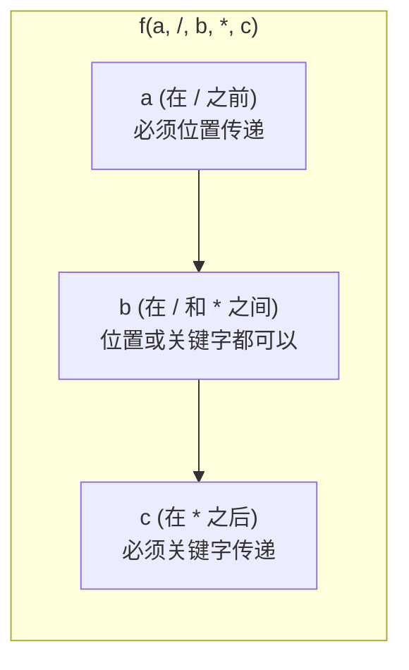

+++
title = "第13章 函数"
weight = 130
date = "2026-04-08T13:22:00+08:00"
type = "docs"
description = ""
isCJKLanguage = true
draft = false
+++

# 第 13 章：函数——Python 的"万能积木"

> 如果说编程是一场建造游戏，那函数就是你手里最万能的积木。它可以小到只做一件事，也可以复杂到帮你登上月球。这一章，我们来好好聊聊这个让你从"写代码"升级到"设计代码"的核心概念。

想象一下：如果每次做饭都要从种菜开始，你可能会疯掉。函数的本质就是让你**不要重复造轮子**——把常用的代码打包起来，下次想用的时候直接调用，省时省力，还不容易出错。

---

## 13.1 函数定义与调用

### 13.1.1 def 语句

在 Python 里，定义函数的关键字是 `def`（define 的缩写）。语法如下：

```python
def 函数名(参数1, 参数2, ...):
    # 函数体
    return 结果
```

来一个最简单的例子：

```python
def say_hello():
    """打印一句问候语"""
    print("你好，我是函数！")

# 调用函数
say_hello()
# 你好，我是函数！
```

> `def` 就像是你给这块积木贴上标签，告诉 Python："记住这个名字，下次你喊这个名字，我就执行这块积木里的代码。"

再看一个带参数的：

```python
def greet(name):
    """向指定的人打招呼"""
    print(f"嘿，{name}，今天怎么样？")

greet("小明")
# 嘿，小明，今天怎么样？

greet("小红")
# 嘿，小红，今天怎么样？
```

`def` 语句的魔力在于：它不仅定义了一个可调用的代码块，还**创建了一个对象**。这就是我们接下来要聊的内容——在 Python 里，函数是一等公民（First-Class Citizen）。

### 13.1.2 函数也是对象（函数作为参数/返回值）

等等，函数是对象？在 Python 里，这可不是开玩笑——**一切皆对象**，整数是对象，字符串是对象，列表是对象，函数也是对象。

这意味着：
1. 函数可以赋值给变量
2. 函数可以作为参数传递给另一个函数
3. 函数可以当作另一个函数的返回值

```python
def double(x):
    """把 x 翻倍"""
    return x * 2

def triple(x):
    """把 x 翻三倍"""
    return x * 3

# 函数赋值给变量
operation = double
print(operation(5))
# 10

# 函数作为参数传递给另一个函数
def apply_twice(func, value):
    """把函数 func 应用两次"""
    return func(func(value))

print(apply_twice(double, 3))
# 12（3 翻倍两次：3→6→12）

print(apply_twice(triple, 2))
# 18（2 翻三倍两次：2→6→18）
```

> 这里的 `apply_twice` 就是一个**高阶函数**（Higher-Order Function）——接受函数作为参数或返回函数的函数。后面 13.5.4 节会详细聊。

函数作为返回值更是家常便饭：

```python
def create_multiplier(factor):
    """创建一个乘以特定因子的乘法器"""
    def multiplier(number):
        return number * factor
    return multiplier

times_two = create_multiplier(2)
times_ten = create_multiplier(10)

print(times_two(7))
# 14

print(times_ten(7))
# 70
```

这里 `create_multiplier` 返回的 `multiplier` 就是所谓的**闭包**（Closure），我们后面 13.4.4 节会细说。

### 13.1.3 函数属性

既然函数是对象，那它就有属性。以下是几个最常用的：

#### 13.1.3.1 __name__：函数名

```python
def hello():
    pass

print(hello.__name__)
# hello
```

> 这个属性在装饰器里特别有用，可以用来保留原函数的名字。

#### 13.1.3.2 __doc__：文档字符串

```python
def greet(name):
    """向名字为 name 的人打招呼。
    
    这是函数的文档字符串，
    可以在 help() 中查看。
    """
    return f"你好，{name}！"

print(greet.__doc__)
# 向名字为 name 的人打招呼。
#
#     这是函数的文档字符串，
#     可以在 help() 中查看。
```

#### 13.1.3.3 __annotations__：类型注解字典

```python
def add(a: int, b: int) -> int:
    """返回两个整数的和"""
    return a + b

print(add.__annotations__)
# {'a': <class 'int'>, 'b': <class 'int'>, 'return': <class 'int'>}
```

Python 3.5 引入了**类型注解**（Type Hints），让函数的参数和返回值有了"注释"。但注意，Python 本身**不会**根据注解做类型检查（那是 mypy 或 pydantic 的活），这只是给程序员看的"文档"。

#### 13.1.3.4 __code__：代码对象

```python
def square(x):
    return x ** 2

print(square.__code__)
# <code object square at 0x...>

print(square.__code__.co_varnames)  # 局部变量名
# ('x',)

print(square.__code__.co_argcount)  # 参数个数
# 1
```

`__code__` 是一个代码对象（Code Object），包含了函数的字节码信息。普通程序员用得不多，但如果你在做性能分析或写调试工具，就派上用场了。

#### 13.1.3.5 __globals__：全局命名空间

```python
global_var = 100

def foo():
    local_var = 200
    return global_var

print(foo.__globals__['global_var'])
# 100
```

`__globals__` 返回函数定义所在模块的全局命名空间字典。通过它可以窥见函数能访问的所有全局变量。

---

## 13.2 参数传递机制

### 13.2.1 位置参数

最普通的参数传递方式，按照参数的位置顺序来匹配：

```python
def describe_pet(animal, name):
    """描述一只宠物"""
    print(f"我有一只{animal}，它叫{name}。")

describe_pet("猫", "汤姆")
# 我有一只猫，它叫汤姆。

describe_pet("狗", "旺财")
# 我有一只狗，它叫旺财。
```

> 这里的 "猫" 和 "狗" 是位置参数，Python 按顺序把 "猫" 给 `animal`，"汤姆" 给 `name`。

### 13.2.2 关键字参数

用 `参数名=值` 的形式传递，不依赖顺序：

```python
describe_pet(name="米老鼠", animal="老鼠")
# 我有一只老鼠，它叫米老鼠。
```

> 关键字参数就像点外卖——你告诉店员"我要一份大份的、不加辣的、送到XX路"，不用告诉店员这些菜是按什么顺序点的。

### 13.2.3 默认参数

给参数一个默认值，这样调用时可以省略这个参数：

```python
def power(base, exponent=2):
    """计算 base 的 exponent 次方，默认是平方"""
    return base ** exponent

print(power(3))
# 9（3 的平方）

print(power(3, 3))
# 27（3 的立方）
```

> 默认参数让函数有了"备胎"——如果不传这个参数，就用默认值。

### 13.2.4 默认参数陷阱

这是 Python 新手最常踩的坑之一，也是面试官最爱的考点。

#### 13.2.4.1 不要使用可变对象作为默认参数

```python
# 危险！不要这样做！
def dangerous_append(item, lst=[]):
    lst.append(item)
    return lst

print(dangerous_append(1))
# [1]

print(dangerous_append(2))
# [1, 2]  ← 什么？！第一次调用明明返回 [1]

print(dangerous_append(3))
# [1, 2, 3]  ← 越来越长！
```

> 惊不惊喜？意不意外？第二次调用时 `lst` 不是空的了！因为默认参数**在函数定义时就固定了**，它绑定在函数对象上，不会每次调用都重新创建。

正确做法是用 `None` 作为哨兵值：

```python
# 安全版本
def safe_append(item, lst=None):
    if lst is None:
        lst = []  # 每次调用都创建新的列表
    lst.append(item)
    return lst

print(safe_append(1))
# [1]

print(safe_append(2))
# [2]  ← 正常了！

print(safe_append(3))
# [3]
```

#### 13.2.4.2 陷阱原因：默认参数在函数定义时求值

Python 的默认参数默认值在 `def` 语句执行时**只求值一次**，绑定到函数对象的 `__defaults__` 属性上：

```python
def f(a, items=[]):
    items.append(a)
    return items

print(f.__defaults__)
# ([],) ← 这个空列表在函数定义时就创建好了

f(1)
print(f.__defaults__)
# ([1],)  ← 同一个列表被修改了！
```

> **记住规则**：默认参数只应该使用**不可变对象**（int、str、tuple、None 等）。如果需要可变默认值，务必用 `None` 作为哨兵值，在函数体内部创建新对象。

### 13.2.5 `*args` 可变位置参数

`*args` 允许函数接收任意数量的位置参数，这些参数被打包成一个**元组**（tuple）。

```python
def sum_all(*args):
    """求所有位置参数的和"""
    total = 0
    for num in args:
        total += num
    return total

print(sum_all(1, 2, 3))
# 6

print(sum_all(10, 20, 30, 40, 50))
# 150

print(sum_all())
# 0
```

> `args` 是 "arguments" 的缩写，前面的 `*` 表示"收集"（gather）。你可以理解为：把所有位置参数"打包"进一个叫 `args` 的元组里。

还可以用 `*` 来**解包**（unpack）可迭代对象：

```python
numbers = [1, 2, 3, 4, 5]
print(sum_all(*numbers))  # 相当于 sum_all(1, 2, 3, 4, 5)
# 15
```

### 13.2.6 `**kwargs` 可变关键字参数

`**kwargs` 允许函数接收任意数量的关键字参数，这些参数被打包成一个**字典**。

```python
def print_info(**kwargs):
    """打印所有关键字参数"""
    for key, value in kwargs.items():
        print(f"{key} = {value}")

print_info(name="小明", age=18, city="北京")
# name = 小明
# age = 18
# city = 北京
```

> `kwargs` 是 "keyword arguments" 的缩写，前面的 `**` 表示"收集关键字参数"。字典的好处是可以通过键名访问。

同样可以用 `**` 解包字典：

```python
info = {"name": "小红", "age": 20, "country": "中国"}
print_info(**info)
# name = 小红
# age = 20
# country = 中国
```

### 13.2.7 参数组合顺序

当多种参数混合使用时，必须遵守严格的顺序规则：

#### 13.2.7.1 位置参数 → `*args` → 默认参数 → `**kwargs`

```python
def mixed_params(pos1, pos2, *args, default="默认值", **kwargs):
    print(f"位置参数: {pos1}, {pos2}")
    print(f"*args: {args}")
    print(f"默认参数: {default}")
    print(f"**kwargs: {kwargs}")

mixed_params("A", "B", 1, 2, 3, default="改掉了", extra="额外参数")
# 位置参数: A, B
# *args: (1, 2, 3)
# 默认参数: 改掉了
# **kwargs: {'extra': '额外参数'}
```

> 这个顺序是 Python 的"交通规则"，不遵守就会报 `SyntaxError`。

### 13.2.8 / 分隔符（位置参数仅限关键字，Python 3.8+）

`/` 分隔符前面的参数**必须按位置传递**，后面的参数可以用位置或关键字传递：

```python
def f(a, /, b, *, c):
    """演示 / 和 * 分隔符"""
    print(f"a={a}, b={b}, c={c}")

f(1, 2, c=3)   # 正确：a 和 b 按位置，c 按关键字
# a=1, b=2, c=3

f(1, b=2, c=3) # 正确：a 按位置，b 和 c 按关键字
# a=1, b=2, c=3

# f(a=1, 2, c=3)  # 错误！a 不能用关键字传递
# TypeError: f() got some positional-only arguments passed as keyword arguments: 'a'
```

#### 13.2.8.1 def f(a, /, b, *, c)：/ 前必须位置传递，* 后必须关键字传递



> 想象 `/` 是一道左边的墙，`*` 是一道右边的墙：
> - `/` 左边的参数只能"走左边"（位置传参）
> - `*` 右边的参数只能"走右边"（关键字传参）
> - 中间的参数两条路都能走

这个特性有什么用？比如你想限制某个参数**只能按位置传递**（因为参数名可能与未来的关键字冲突），或者**只能按关键字传递**（为了让调用者更清晰）：

```python
# 典型应用：标准库中的例子
# int(x, base=10) 中 base 不能用位置传递
int("1010", base=2)  # 正确
# int("1010", 2)     # 错误！
```

### 13.2.9 强制关键字参数（* 分隔符）

单独使用 `*` 可以让后面的参数全部变为**强制关键字参数**：

```python
def greet(*, name, message):
    """name 和 message 都必须用关键字传参"""
    print(f"{message}，{name}！")

greet(name="小明", message="早上好")
# 早上好，小明！

# greet("小明", "早上好")  # 错误！TypeError
```

> 强制关键字参数的好处是：参数名一目了然，代码可读性大大提高。尤其当函数有很多参数时，`greet(name="小明", message="早上好")` 比 `greet("小明", "早上好")` 清晰多了。

---

## 13.3 函数返回值

### 13.3.1 return 语句

`return` 语句用于从函数返回一个值：

```python
def add(a, b):
    return a + b

result = add(3, 4)
print(result)
# 7
```

### 13.3.2 多返回值

Python 的函数可以返回多个值吗？严格来说不能，但 Python 会把多个返回值**打包成元组**：

```python
def divide(a, b):
    """返回商和余数"""
    quotient = a // b
    remainder = a % b
    return quotient, remainder  # 实际上是 return (quotient, remainder)

q, r = divide(17, 5)
print(f"商={q}, 余数={r}")
# 商=3, 余数=2

# 也可以只接收元组
result = divide(17, 5)
print(result)
# (3, 2)
```

> `return a, b` 等价于 `return (a, b)`。元组在返回多个值时自动创建。

### 13.3.3 return None：隐式返回

如果函数没有 `return` 语句，或者 `return` 后面没有值，则返回 `None`：

```python
def say_hi():
    print("你好！")

result = say_hi()
# 你好！

print(result)
# None

def maybe():
    if True:
        return
    print("这行不会执行")

print(maybe())
# None
```

> `print()` 和 `return None` 的区别：`print()` 是"表演"（输出到屏幕），`return` 是"汇报"（把值交给调用者）。有些函数只需要"表演"不需要"汇报"，这时省略 `return` 或写 `return` 就行。

### 13.3.4 返回生成器

函数可以返回生成器（Generator），而不是普通值。生成器是惰性迭代器，用 `yield` 关键字：

```python
def count_up_to(n):
    """生成从 1 到 n 的数"""
    i = 1
    while i <= n:
        yield i
        i += 1

gen = count_up_to(5)
print(gen)
# <generator object count_up_to at 0x...>

print(list(gen))
# [1, 2, 3, 4, 5]
```

> 生成器的优势是**惰性求值**——不在内存中一次性创建所有值，而是"用多少取多少"。处理大数据时特别有用。

---

## 13.4 作用域与命名空间

### 13.4.1 LEGB 规则详解

在 Python 中，当你使用一个变量名时，Python 会按 **LEGB** 顺序查找它的定义：

- **L**ocal（局部）：当前函数内部
- **E**nclosing（闭包）：外层函数（如果存在嵌套函数）
- **G**lobal（全局）：模块级别
- **B**uilt-in（内置）：Python 提供的内置命名空间

```python
x = "全局的 x"  # G

def outer():
    x = "闭包的 x"  # E（外层函数的变量）
    
    def inner():
        x = "局部的 x"  # L（当前函数内部）
        print(x)  # 找 L → 找到了 "局部的 x"
    
    inner()
    print(x)  # 找 E → 找到了 "闭包的 x"

print(x)  # 找 G → 找到了 "全局的 x"
```

> LEGB 规则就像在搬家时找东西：先翻自己的口袋（Local），找不到就问同桌（Enclosing），再问家里客厅（Global），最后查百度/手册（Built-in）。

#### 13.4.1.1 Local：函数内部

```python
def local_scope():
    local_var = "我是局部的"
    print(local_var)

local_scope()
# 我是局部的

# print(local_var)  # NameError！函数外部无法访问
```

#### 13.4.1.2 Enclosing：外层函数（闭包）

```python
def outer():
    message = "来自外层的消息"
    
    def inner():
        print(message)  # 引用了外层函数的变量
    
    inner()

outer()
# 来自外层的消息
```

#### 13.4.1.3 Global：模块级别

```python
counter = 0  # 全局变量

def increment():
    global counter  # 声明要使用全局的 counter
    counter += 1
    print(f"计数器: {counter}")

increment()
# 计数器: 1
increment()
# 计数器: 2
```

#### 13.4.1.4 Built-in：Python 内置（__builtins__）

```python
print(len([1, 2, 3]))  # len 是内置函数
print(__builtins__.len([1, 2, 3]))  # 同上
```

### 13.4.2 global 关键字

#### 13.4.2.1 在函数内部声明全局变量

`global` 关键字告诉 Python："我要修改**全局**变量，而不是创建局部变量。"

```python
name = "小明"  # 全局变量

def change_name():
    global name
    name = "小红"  # 修改的是全局的 name

print(name)
# 小明
change_name()
print(name)
# 小红
```

#### 13.4.2.2 滥用全局变量的危害

> 全局变量就像共享洗手间——谁都能改，容易出问题。

```python
# 全局变量的陷阱
counter = 0

def increment():
    global counter
    counter += 1

def decrement():
    global counter
    counter -= 1

def reset():
    global counter
    counter = 0

# 问题：任何地方的代码都可以改 counter
# 难以追踪是谁、在什么时候改了 counter
# 测试也变得困难——函数依赖全局状态
```

> **最佳实践**：尽量少用全局变量。如果需要共享状态，用**类**或**闭包**来封装。

### 13.4.3 nonlocal 关键字

#### 13.4.3.1 在嵌套函数中声明外层函数的变量

`nonlocal` 类似于 `global`，但它引用的是**外层函数**的变量（而非全局变量）：

```python
def outer():
    count = 0
    
    def inner():
        nonlocal count  # 声明要使用 outer 的 count
        count += 1
        print(f"Inner: {count}")
    
    inner()
    inner()
    print(f"Outer: {count}")

outer()
# Inner: 1
# Inner: 2
# Outer: 2
```

#### 13.4.3.2 作用于闭包中的自由变量

在闭包中，内部函数引用外部函数的变量，这个变量就叫**自由变量**（Free Variable）。`nonlocal` 允许你修改它：

```python
def make_counter():
    count = 0
    
    def counter():
        nonlocal count
        count += 1
        return count
    
    return counter

c1 = make_counter()
c2 = make_counter()

print(c1())
# 1
print(c1())
# 2
print(c1())
# 3
print(c2())
# 1 ← 新的计数器实例，独立计数
```

### 13.4.4 闭包（Closure）

#### 13.4.4.1 内部函数引用外部函数变量

闭包就是：一个内部函数**记住**了它诞生时外部函数的变量。

```python
def outer(x):
    def inner(y):
        return x + y  # inner "记住"了 x
    return inner

add_five = outer(5)
print(add_five(3))
# 8
print(add_five(10))
# 15
```

> `add_five` 是一个闭包，它"记住"了 `x=5`。即使 `outer()` 已经执行完毕，`x` 的值依然被 `add_five` 持有。

#### 13.4.4.2 闭包的实际应用场景

闭包在 Python 中非常有用：

**场景 1：创建带"记忆"的函数**

```python
def make_power_closure(base):
    """创建一个记住 base 的指数函数"""
    def power(exp):
        return base ** exp
    return power

square = make_power_closure(2)
cube = make_power_closure(3)

print(square(5))  # 2^5 = 32
# 32
print(cube(3))    # 3^3 = 27
# 27
```

**场景 2：函数柯里化（Currying）**

```python
def curried_add(x):
    def _add(y):
        return x + y
    return _add

add_10 = curried_add(10)
print(add_10(5))
# 15
print(add_10(20))
# 30
```

**场景 3：延迟计算**

```python
def lazy_multiply(factor):
    def _multiply(value):
        return value * factor
    return _multiply

delayed_double = lazy_multiply(2)
delayed_triple = lazy_multiply(3)

data = [1, 2, 3, 4]
print([delayed_double(x) for x in data])
# [2, 4, 6, 8]
print([delayed_triple(x) for x in data])
# [3, 6, 9, 12]
```

#### 13.4.4.3 闭包与自由变量

```python
def outer():
    messages = []  # 外层函数的变量
    
    def inner(msg):
        messages.append(msg)  # 引用自由变量
        return messages
    
    return inner

chat = outer()
print(chat("你好"))
# ['你好']
print(chat("吃了吗"))
# ['你好', '吃了吗']
```

> 闭包捕获的是**变量本身**，而不是变量的值。这意味着闭包可以修改被捕获的变量（通过 `nonlocal`）。

#### 13.4.4.4 nonlocal vs global 的区别

| 关键字 | 作用域 | 影响的变量 |
|--------|--------|-----------|
| `global` | 模块级别 | 全局命名空间中的变量 |
| `nonlocal` | 闭包外层函数 | 嵌套函数的外层函数的局部变量 |

```python
count = "全局的"

def outer():
    count = "外层的"
    
    def inner():
        nonlocal count  # 找 Enclosing → 找到 "外层的"
        count = "inner 修改后的"
    
    inner()
    print(count)  # inner 修改后的

outer()
print(count)  # 全局的（global 没被影响）
```

---

## 13.5 特殊函数

### 13.5.1 匿名函数：lambda

`lambda` 是创建小型匿名函数的语法糖。没有名字的函数，像临时工一样用完即弃。

#### 13.5.1.1 lambda x: x * 2

```python
# 普通函数
def double(x):
    return x * 2

# lambda 版本
double = lambda x: x * 2

print(double(5))
# 10
```

语法：`lambda 参数: 表达式`

> lambda 函数只能包含**一个表达式**，不能包含语句（如 `if`、`for`、`while`），也不能有 `return`。

#### 13.5.1.2 配合 map、filter、sorted、max、min 使用

```python
# map：对每个元素应用函数
nums = [1, 2, 3, 4, 5]
squared = list(map(lambda x: x ** 2, nums))
print(squared)
# [1, 4, 9, 16, 25]

# filter：过滤满足条件的元素
evens = list(filter(lambda x: x % 2 == 0, nums))
print(evens)
# [2, 4]

# sorted：自定义排序规则
words = ["banana", "apple", "cherry", "date"]
sorted_words = sorted(words, key=lambda w: len(w))
print(sorted_words)
# ['date', 'apple', 'banana', 'cherry']

# max：找最大元素
pairs = [(1, "one"), (3, "three"), (2, "two")]
max_pair = max(pairs, key=lambda p: p[0])
print(max_pair)
# (3, 'three')

# min：找最小元素
min_pair = min(pairs, key=lambda p: p[0])
print(min_pair)
# (1, 'one')
```

#### 13.5.1.3 lambda 的限制（只能包含表达式）

```python
# lambda 不能有赋值语句
# lambda x: x = x * 2  ← 语法错误！

# 不能有 if 语句（但可以有条件表达式）
# lambda x: if x > 0: x ← 错误！

# 正确写法：用条件表达式（三元运算符）
lambda x: x * 2 if x > 0 else 0
```

> lambda 的限制听起来很严格，但它的设计目的就是**小型、一次性**的函数。如果逻辑太复杂，请用普通 `def` 函数。

### 13.5.2 递归函数

递归就是函数调用自己。解决问题时，把大问题拆成小问题，小问题的解法和大问题一样。

#### 13.5.2.1 递归终止条件

```python
def countdown(n):
    """倒计时"""
    if n <= 0:  # 终止条件
        print("发射！")
        return
    print(n)
    countdown(n - 1)  # 递归调用

countdown(5)
# 5
# 4
# 3
# 2
# 1
# 发射！
```

> **没有终止条件的递归 = 无限循环 + 栈溢出！** 每个递归都必须有终止条件来"收手"。

经典递归例子——阶乘：

```python
def factorial(n):
    """计算 n 的阶乘"""
    if n <= 1:
        return 1
    return n * factorial(n - 1)

print(factorial(5))
# 120（5! = 5×4×3×2×1）
```

#### 13.5.2.2 递归深度限制：sys.getrecursionlimit()

Python 对递归深度有限制，默认大概是 1000 层：

```python
import sys

print(sys.getrecursionlimit())
# 1000

# 可以修改，但一般不推荐
# sys.setrecursionlimit(2000)
```

#### 13.5.2.3 尾递归优化（Python 不支持但可改写）

尾递归（Tail Recursion）是指递归调用是函数的最后一步。理论上可以被优化成迭代，但**Python 解释器没有尾递归优化**。

```python
# 普通递归（不是尾递归）
def factorial(n):
    if n <= 1:
        return 1
    return n * factorial(n - 1)  # 最后一步是乘法，不是递归调用

# 尾递归形式（Python 依然会栈溢出）
def factorial_tail(n, acc=1):
    if n <= 1:
        return acc
    return factorial_tail(n - 1, n * acc)  # 最后一步是递归调用

# Python 不做尾递归优化，改写成迭代吧：
def factorial_iter(n):
    result = 1
    for i in range(2, n + 1):
        result *= i
    return result
```

### 13.5.3 偏函数（functools.partial）

`functools.partial` 允许你"冻结"一个函数的某些参数，创建一个"新"函数。

#### 13.5.3.1 partial(func, *args, **kwargs)

```python
from functools import partial

def power(base, exponent):
    return base ** exponent

# 创建一个 square 函数（指数固定为 2）
square = partial(power, exponent=2)
print(square(5))
# 25

# 创建一个 cube 函数（指数固定为 3）
cube = partial(power, exponent=3)
print(cube(2))
# 8

# 也可以固定底数
two_power = partial(power, base=2)
print(two_power(10))
# 1024（2^10）
```

> partial 就像"预配置"——你在创建一个专用版本时，不需要每次都传所有参数。

### 13.5.4 高阶函数

高阶函数是函数式编程的基石——**接受函数作为参数**或**返回函数**。

#### 13.5.4.1 接受函数作为参数

```python
def apply_function(func, data):
    """对 data 中的每个元素应用 func"""
    return [func(x) for x in data]

numbers = [1, 2, 3, 4, 5]
print(apply_function(lambda x: x ** 2, numbers))
# [1, 4, 9, 16, 25]
print(apply_function(lambda x: x + 10, numbers))
# [11, 12, 13, 14, 15]
```

#### 13.5.4.2 返回函数的函数

```python
def create_discount_func(discount_rate):
    """创建一个应用折扣的函数"""
    def apply_discount(price):
        return price * (1 - discount_rate)
    return apply_discount

ten_percent_off = create_discount_func(0.1)
twenty_percent_off = create_discount_func(0.2)

prices = [100, 200, 300]
print([ten_percent_off(p) for p in prices])
# [90.0, 180.0, 270.0]
print([twenty_percent_off(p) for p in prices])
# [80.0, 160.0, 240.0]
```

#### 13.5.4.3 常用高阶函数：map、filter、sorted、any、all

```python
# map：映射
result = list(map(str, [1, 2, 3]))  # 转字符串
print(result)
# ['1', '2', '3']

# filter：过滤
result = list(filter(lambda x: x > 2, [1, 2, 3, 4]))
print(result)
# [3, 4]

# sorted：排序（自定义 key）
result = sorted([-3, 1, -1, 5, -2], key=abs)
print(result)
# [1, -1, -2, -3, 5]

# any：任意为真
print(any([False, False, True, False]))
# True

# all：全部为真
print(all([True, True, False, True]))
# False
```

---

## 13.6 装饰器

装饰器是 Python 中最"魔法"的概念之一。它允许你在不修改原函数的前提下，给函数添加新功能。

### 13.6.1 装饰器原理

装饰器本质上就是一个**高阶函数**。

#### 13.6.1.1 函数即对象

记住：函数是对象，可以赋值、传递、返回。

#### 13.6.1.2 装饰器接收函数作为参数

```python
def my_decorator(func):
    """一个装饰器，接收被装饰的函数"""
    return func  # 这里先原样返回，后面会增强
```

#### 13.6.1.3 装饰器返回新函数

```python
def my_decorator(func):
    def wrapper():
        print("我是增强的代码，原函数执行前！")
        func()
        print("我是增强的代码，原函数执行后！")
    return wrapper

def say_hello():
    print("你好！")

# 手动装饰
decorated_hello = my_decorator(say_hello)
decorated_hello()
# 我是增强的代码，原函数执行前！
# 你好！
# 我是增强的代码，原函数执行后！
```

### 13.6.2 @decorator 语法糖

`@decorator` 是装饰器的语法糖，相当于 `func = decorator(func)`：

```python
def my_decorator(func):
    def wrapper():
        print(">>> 调用前")
        func()
        print(">>> 调用后")
    return wrapper

@my_decorator
def say_hi():
    print("嗨！")

say_hi()
# >>> 调用前
# 嗨！
# >>> 调用后
```

### 13.6.3 带参数的装饰器（装饰器工厂）

如果装饰器需要参数，需要**再包一层**——这就是"装饰器工厂"。

#### 13.6.3.1 三层函数：decorator_factory → decorator → wrapper

```python
def repeat(times):  # decorator_factory
    """重复执行函数 times 次"""
    def decorator(func):  # decorator
        def wrapper(*args, **kwargs):  # wrapper
            for _ in range(times):
                func(*args, **kwargs)
        return wrapper
    return decorator

@repeat(3)
def say_goodbye():
    print("再见！")

say_goodbye()
# 再见！
# 再见！
# 再见！
```

> 三层含义：
> - `repeat(3)` 是工厂，产出装饰器
> - `decorator` 是真正的装饰器
> - `wrapper` 是加了功能的包装函数

### 13.6.4 functools.wraps

#### 13.6.4.1 保留原函数元信息：__name__、__doc__、__annotations__

装饰器有个问题：包装后的函数 `wrapper` 会"冒充"被装饰的函数，导致元信息丢失：

```python
def simple_decorator(func):
    def wrapper(*args, **kwargs):
        return func(*args, **kwargs)
    return wrapper

@simple_decorator
def hello():
    """打招呼的函数"""
    return "你好！"

print(hello.__name__)
# wrapper ← 元信息被偷换了！

print(hello.__doc__)
# None
```

`functools.wraps` 解决这个问题：

```python
import functools

def smart_decorator(func):
    @functools.wraps(func)  # 在 wrapper 上使用
    def wrapper(*args, **kwargs):
        return func(*args, **kwargs)
    return wrapper

@smart_decorator
def hello():
    """打招呼的函数"""
    return "你好！"

print(hello.__name__)
# hello ← 保留了！

print(hello.__doc__)
# 打招呼的函数 ← 也保留了！
```

### 13.6.5 常用装饰器

#### 13.6.5.1 @lru_cache：缓存结果

```python
import functools

@functools.lru_cache(maxsize=128)
def fibonacci(n):
    """斐波那契数列（带缓存）"""
    if n < 2:
        return n
    return fibonacci(n - 1) + fibonacci(n - 2)

print(fibonacci(100))  # 瞬间完成（因为有缓存）
```

#### 13.6.5.2 @property：属性装饰器

```python
class Circle:
    def __init__(self, radius):
        self._radius = radius
    
    @property
    def radius(self):
        """半径（只读）"""
        return self._radius
    
    @property
    def diameter(self):
        """直径（只读）"""
        return self._radius * 2
    
    @property
    def area(self):
        """面积（只读）"""
        return 3.14159 * self._radius ** 2

c = Circle(5)
print(c.radius)
# 5
print(c.diameter)
# 10
# c.radius = 10  ← AttributeError！属性是只读的
```

#### 13.6.5.3 @classmethod：类方法

```python
class Person:
    population = 0
    
    def __init__(self, name):
        self.name = name
        Person.population += 1
    
    @classmethod
    def total_population(cls):
        """类方法，访问类变量"""
        return f"总人口: {cls.population}"

print(Person.total_population())
# 总人口: 0
p1 = Person("小明")
p2 = Person("小红")
print(Person.total_population())
# 总人口: 2
```

> `@classmethod` 的第一个参数是类本身（通常叫 `cls`），可以通过 `cls` 访问类变量和类方法。

#### 13.6.5.4 @staticmethod：静态方法

```python
class Math:
    @staticmethod
    def add(a, b):
        """不依赖类和实例的静态方法"""
        return a + b
    
    @staticmethod
    def multiply(a, b):
        return a * b

# 调用静态方法不需要实例化
print(Math.add(3, 4))
# 7
print(Math.multiply(5, 6))
# 30
```

> `@staticmethod` 不需要 `self` 或 `cls` 参数，它就像普通函数一样，只是碰巧放在了类里。

#### 13.6.5.5 @functools.cache：无限缓存（Python 3.9+）

```python
import functools

@functools.cache
def expensive_computation(n):
    """模拟耗时计算"""
    result = 0
    for i in range(n * 1000000):
        result += i
    return result

# 第一次调用耗时
# 第二次调用瞬间返回（从缓存）
```

#### 13.6.5.6 @functools.singledispatch：单分派泛函数

```python
import functools

@functools.singledispatch
def process(data):
    """默认处理"""
    print(f"默认处理: {data}")

@process.register(int)
def _(data):
    """整数处理"""
    print(f"整数: {data} * 2 = {data * 2}")

@process.register(str)
def _(data):
    """字符串处理"""
    print(f"字符串: {data.upper()}")

@process.register(list)
def _(data):
    """列表处理"""
    print(f"列表: {data} 共 {len(data)} 项")

process(42)
# 整数: 42 * 2 = 84
process("hello")
# 字符串: HELLO
process([1, 2, 3])
# 列表: [1, 2, 3] 共 3 项
process(3.14)
# 默认处理: 3.14
```

### 13.6.6 类装饰器

装饰器不一定是函数，**类**也可以作为装饰器——只要它有 `__call__` 方法。

#### 13.6.6.1 class MyDecorator

```python
class CountCalls:
    """统计函数调用次数的装饰器类"""
    def __init__(self, func):
        self.func = func
        self.call_count = 0
    
    def __call__(self, *args, **kwargs):
        self.call_count += 1
        print(f"调用 #{self.call_count}")
        return self.func(*args, **kwargs)

@CountCalls
def greet(name):
    print(f"你好，{name}！")

greet("小明")
# 调用 #1
# 你好，小明！
greet("小红")
# 调用 #2
# 你好，小红！
```

#### 13.6.6.2 __call__ 方法

`__call__` 方法让类的实例可以像函数一样被调用。这就是"可调用对象"（Callable）的秘密。

---

## 13.7 文档字符串（Docstring）

### 13.7.1 docstring 的作用

Docstring 是写在函数/类开头的字符串，用来解释它们的作用。它可以被 `help()` 读取，也是代码即文档的体现。

### 13.7.2 Google 风格 docstring

```python
def compute_area(radius):
    """计算圆的面积。
    
    Args:
        radius: 圆的半径（浮点数或整数）
    
    Returns:
        圆的面积（浮点数）
    
    Raises:
        ValueError: 如果 radius 为负数
    
    Example:
        >>> compute_area(5)
        78.53975
    """
    if radius < 0:
        raise ValueError("半径不能为负数")
    import math
    return math.pi * radius ** 2
```

### 13.7.3 NumPy 风格 docstring

```python
def compute_area(radius):
    """计算圆的面积。
    
    Parameters
    ----------
    radius : float or int
        圆的半径
    
    Returns
    -------
    float
        圆的面积
    
    Raises
    ------
    ValueError
        如果 radius 为负数
    """
    if radius < 0:
        raise ValueError("半径不能为负数")
    import math
    return math.pi * radius ** 2
```

### 13.7.4 Sphinx 风格 docstring

```python
def compute_area(radius):
    """计算圆的面积。
    
    :param radius: 圆的半径（浮点数或整数）
    :type radius: float or int
    :return: 圆的面积
    :rtype: float
    :raises ValueError: 如果 radius 为负数
    """
    if radius < 0:
        raise ValueError("半径不能为负数")
    import math
    return math.pi * radius ** 2
```

### 13.7.5 __doc__ 属性

```python
def hello():
    """这是 hello 函数的文档"""
    pass

print(hello.__doc__)
# 这是 hello 函数的文档
```

### 13.7.6 help() 函数读取 docstring

```python
def greet(name, greeting="你好"):
    """向指定的人打招呼。
    
    Args:
        name: 人的名字
        greeting: 问候语，默认为"你好"
    
    Returns:
        完整的问候语
    """
    return f"{greeting}，{name}！"

help(greet)
# Help on function greet in module __main__:
#
# greet(name, greeting='你好')
#     向指定的人打招呼。
#
#     Args:
#         name: 人的名字
#         greeting: 问候语，默认为"你好"
#
#     Returns:
#         完整的问候语
```

---

## 13.8 函数式编程工具

Python 虽然不是纯函数式语言，但内置了不少函数式编程工具。

### 13.8.1 map（映射）

```python
# map(function, iterable) → 对每个元素应用函数
numbers = [1, 2, 3, 4, 5]

# 用 map + lambda
squared = list(map(lambda x: x ** 2, numbers))
print(squared)
# [1, 4, 9, 16, 25]

# 用 map + 普通函数
def cube(x):
    return x ** 3

cubed = list(map(cube, numbers))
print(cubed)
# [1, 8, 27, 64, 125]
```

### 13.8.2 filter（过滤）

```python
# filter(function, iterable) → 保留让函数返回 True 的元素
numbers = list(range(10))
print(numbers)
# [0, 1, 2, 3, 4, 5, 6, 7, 8, 9]

# 保留偶数
evens = list(filter(lambda x: x % 2 == 0, numbers))
print(evens)
# [0, 2, 4, 6, 8]

# 保留大于 5 的数
big = list(filter(lambda x: x > 5, numbers))
print(big)
# [6, 7, 8, 9]
```

### 13.8.3 zip（并行打包）

```python
# zip 将多个可迭代对象"拉链式"配对
names = ["Alice", "Bob", "Charlie"]
scores = [85, 92, 78]

paired = list(zip(names, scores))
print(paired)
# [('Alice', 85), ('Bob', 92), ('Charlie', 78)]

# 解压
n, s = zip(*paired)
print(n)
# ('Alice', 'Bob', 'Charlie')
print(s)
# (85, 92, 78)

# 长度不一时以短的为准
a = [1, 2, 3]
b = ['a', 'b']
print(list(zip(a, b)))
# [(1, 'a'), (2, 'b')]
```

### 13.8.4 enumerate（枚举）

```python
# enumerate 为可迭代对象添加索引
fruits = ["苹果", "香蕉", "橙子", "葡萄"]

for index, fruit in enumerate(fruits):
    print(f"{index}: {fruit}")
# 0: 苹果
# 1: 香蕉
# 2: 橙子
# 3: 葡萄

# 从 1 开始编号
for i, fruit in enumerate(fruits, start=1):
    print(f"{i}. {fruit}")
# 1. 苹果
# 2. 香蕉
# 3. 橙子
# 4. 葡萄
```

### 13.8.5 itertools 模块

`itertools` 提供了强大的迭代器工具，包括 `count()`、`cycle()`、`chain()`、`islice()` 等函数式工具。本章不展开，读者可参考官方文档深入了解。

### 13.8.6 functools 模块

`functools` 提供了 `partial()`（偏函数）、`lru_cache()`（缓存）、`reduce()`（累计）等高阶函数工具。其中 `partial` 和 `lru_cache` 本章前文已介绍过，`reduce` 请读者自行探索或参考官方文档。

---

## 本章小结

本章我们深入探索了 Python 函数的方方面面，以下是核心要点回顾：

| 主题 | 核心要点 |
|------|----------|
| **函数定义** | `def` 创建函数对象，函数是一等公民，可赋值、可传参、可返回 |
| **函数属性** | `__name__`、`__doc__`、`__annotations__`、`__code__`、`__globals__` |
| **参数传递** | 位置参数 → *args → 默认参数 → **kwargs，另有 `/` 和 `*` 分隔符控制传递方式 |
| **默认参数陷阱** | 永远不要用可变对象作为默认参数，用 `None` 代替 |
| **返回值** | `return` 语句返回结果，`return a, b` 返回元组，无 `return` 返回 `None` |
| **LEGB 作用域** | Local → Enclosing → Global → Built-in，按顺序查找变量 |
| **global / nonlocal** | `global` 修改全局变量，`nonlocal` 修改闭包中外层函数的变量 |
| **闭包** | 内部函数记住外部函数的变量，用于"带记忆"的函数创建 |
| **lambda** | 匿名函数，单表达式，用于短小的函数式操作 |
| **递归** | 函数调用自己，必须有终止条件，注意栈溢出 |
| **偏函数** | `functools.partial` 冻结部分参数，创建专用函数 |
| **装饰器** | 高阶函数，用 `@decorator` 语法糖包装函数，`functools.wraps` 保留元信息 |
| **文档字符串** | 写在函数开头的说明文字，可用 `help()` 查看，支持多种风格 |
| **函数式工具** | `map`、`filter`、`zip`、`enumerate` 是内置的函数式编程工具 |

> 函数是 Python 编程的核心。从最简单的 `def` 到装饰器、元编程，函数贯穿了 Python 的方方面面。掌握了本章的内容，你就掌握了 Python 的"内功"，接下来无论学面向对象、异步编程还是框架源码，都会事半功倍！
