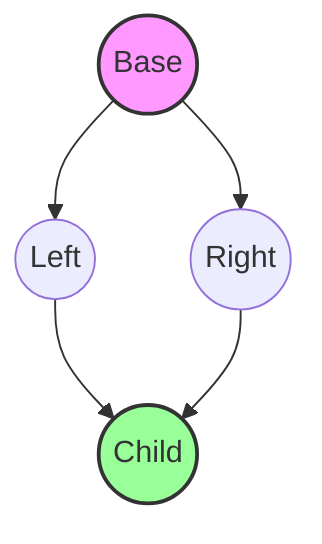
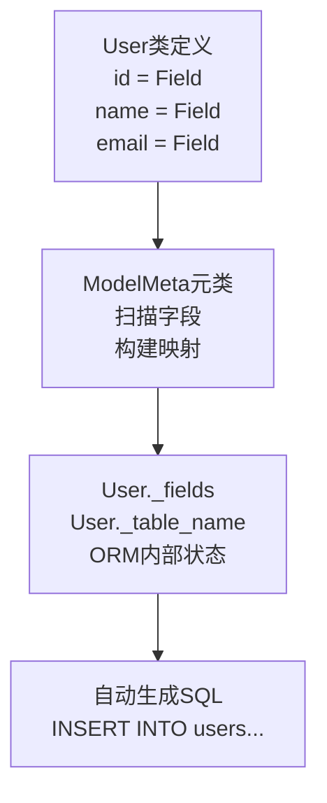

+++
title = "第14章 面向对象"
weight = 140
date = "2026-04-08T13:22:00+08:00"
type = "docs"
description = ""
isCJKLanguage = true
draft = false
+++

# Chapter 14：面向对象编程（OOP）——Python的"造人"指南

> 🎭 警告：前方高能！这可能是你见过最不正经的OOP教程，但保证看完能写出会跑的代码。

想象一下，如果你要造一个机器人，你会怎么做？

先画图纸（设计类），然后按照图纸组装零件（创建对象）？没错，这就是面向对象编程的核心思想！

Python的OOP，就像一场"造人秀"。你是造物主，对象是你的作品，而类，是你手中的蓝图。

---

## 14.1 类与对象

### 14.1.1 class 定义语法

在Python里，用`class`关键字来定义一个类。类就像是一个**模板**，告诉Python："我要造一个长这样的东西"。

```python
# 语法：class 类名:
#           属性
#           方法

class Dog:
    """这是一个Dog类！狗的模板！"""
    pass  # 空的啥也没有，先占个位
```

> 等等，`pass`是什么？就像你说"等一下，我还没想好怎么装修"，先空着不报错。

```python
# 创建一个 Dog 类的实例（对象）
my_dog = Dog()
print(type(my_dog))  # <class '__main__.Dog'>
```

> 运行结果：`<class '__main__.Dog'>` —— 证明你确实造出了一个Dog！

类名有个小规矩：**首字母大写**（大驼峰命名法）。这不是强制的，但全宇宙Python程序员都这么干，不这么干会被嘲笑的！

---

### 14.1.2 __init__ 构造函数

`__init__`是Python的**构造函数**——对象诞生时自动运行的初始化方法。

```python
class Dog:
    """带初始化的Dog类"""
    
    def __init__(self, name, age):
        """初始化方法，创建对象时自动调用"""
        self.name = name  # 给对象贴个名字标签
        self.age = age    # 给对象记个年龄
        print(f"🐕 有一只新狗出生了！它叫{name}，{age}岁！")

# 创建对象时会自动打印那句话！
d1 = Dog("旺财", 3)
d2 = Dog("二哈", 2)
```

> 运行结果：
> ```
> 🐕 有一只新狗出生了！它叫旺财，3岁！
> 🐕 有一只新狗出生了！它叫二哈，2岁！
> ```

> 🔑 敲黑板：`__init__`不是构造函数！真正的构造函数是`__new__`（后面会讲）。`__init__`更像是"初始化方法"，但叫惯了你就当它是构造函数吧，全世界都这么叫。

---

### 14.1.3 实例属性与类属性

Python里，属性分两种：

| 属性类型 | 作用域 | 访问方式 |
|---------|-------|---------|
| **实例属性** | 每个对象独有 | `self.属性名` |
| **类属性** | 所有对象共享 | `类名.属性名` |

```python
class Dog:
    species = "犬科"  # 类属性——所有狗都是犬科，写在类里面，方法外面
    
    def __init__(self, name, age):
        self.name = name  # 实例属性——每只狗名字可能不同
        self.age = age

# 创建两只狗
dog1 = Dog("旺财", 3)
dog2 = Dog("二哈", 2)

print(dog1.name)      # 旺财 —— 自己的名字
print(dog2.name)      # 二哈 —— 自己的名字
print(dog1.species)   # 犬科 —— 类属性也能访问
print(dog2.species)   # 犬科 —— 大家共享的
print(Dog.species)    # 犬科 —— 直接用类名访问
```

> 运行结果：
> ```
> 旺财
> 二哈
> 犬科
> 犬科
> 犬科
> ```

类属性就像"宪法"，所有对象都得遵守；实例属性就像"身份证"，每只狗都有自己独特的那张。

```python
# 修改类属性——会影响所有对象（除非对象自己覆盖了）
Dog.species = "哺乳动物"
print(dog1.species)   # 哺乳动物 —— 旺财的也跟着变了
print(dog2.species)   # 哺乳动物 —— 二哈的也是
```

---

### 14.1.4 self 的本质

`self`可能是Python OOP里最让人困惑的概念了。让我用一个"灵魂出窍"的比喻来解释：

```python
class Dog:
    def __init__(self, name, age):
        self.name = name   # 实际上是把 name 绑定到这个具体对象上
        self.age = age
    
    def bark(self):
        # self 就是"当前这个对象"的引用
        return f"{self.name} 叫了一声：汪汪汪！"
```

> 想象一下：`self`就是一面镜子，镜子照的是谁，`self`就是谁。

```python
d1 = Dog("旺财", 3)
d2 = Dog("二哈", 2)

# 当你调用 d1.bark() 时，Python内部大概是这么干的：
# Dog.bark(d1)  —— 把 d1 传进去作为 self
#
# 当你调用 d2.bark() 时：
# Dog.bark(d2)  —— 把 d2 传进去作为 self
#
# 所以 self.name 在 d1.bark() 里就是 "旺财"
#             在 d2.bark() 里就是 "二哈"
```

> `self`不是关键字！可以用别的名字，但**千万别这么干**，这是所有Python程序员的公愤。

```python
# 千万不要写这种代码！会被打！
class BadDog:
    def __init__(me, name):  # 用 me 代替 self —— 作死
        me.name = name

# Python不报错，但你的同事会报错（打你）
```

---

## 14.2 属性与访问控制

### 14.2.1 公有属性

默认情况下，Python的所有属性都是**公有的**——想访问就访问，想改就改。

```python
class Person:
    def __init__(self, name, age):
        self.name = name  # 公有属性 —— 随便改
        self.age = age

p = Person("张三", 25)
print(p.name)   # 张三 —— 随便读
p.name = "李四" # 李四 —— 随便改
print(p.name)   # 李四 —— 改了
```

> 公有属性就像公共厕所——谁都能进。当然，这有时候会带来问题……

---

### 14.2.2 受保护属性（_name 单下划线）

单下划线前缀 `_name` 是Python的一个**约定**，意思是："嘿，这是一个受保护的属性，外部代码最好不要直接访问。"

```python
class Person:
    def __init__(self, name, age):
        self._name = name    # 单下划线 —— 受保护属性
        self._age = age

p = Person("张三", 25)
print(p._name)   # 张三 —— Python不拦你，但……说了不要访问
```

> 就像咖啡厅的"员工专用"区域——没锁门，但你最好别进去。这是**君子协定**，技术层面不拦你，道德层面劝你善良。

---

### 14.2.3 私有属性（__name 双下划线，名称改写）

双下划线前缀 `__name` 会触发**名称改写（Name Mangling）**——Python会把属性名偷偷改成`_类名__属性名`，外部直接访问原名就找不到了。

```python
class Person:
    def __init__(self, name, age):
        self.__name = name    # 双下划线 —— 私有属性
        self.__age = age
    
    def get_info(self):
        return f"{self.__name}, {self.__age}岁"

p = Person("张三", 25)
print(p.get_info())      # 张三, 25岁 —— 内部方法可以访问

print(p.__name)          # AttributeError！找不到这个属性！
print(p.__age)            # AttributeError！
```

> 哈哈，被骗了吧！实际上Python把它藏起来了：

```python
# 它的真名是：
print(p._Person__name)   # 张三 —— 绕过去能访问，但不推荐！
print(p._Person__age)    # 25
```

> 这就是**名称改写**，双下划线开头会被自动改写成`_类名__属性名`。就像是你的身份证号被藏在一堆乱码后面，但只要你愿意翻，还是能找到的……

---

### 14.2.4 property 装饰器

property是Python的** getter/setter 解决方案**。在Java里你得写一堆getter/setter方法，但在Python里，你可以优雅地"伪装"属性。

#### 14.2.4.1 @property getter

```python
class Circle:
    def __init__(self, radius):
        self._radius = radius  # 半径（私有）
    
    @property
    def radius(self):
        """把方法伪装成属性来访问"""
        return self._radius
    
    @property
    def area(self):
        """只读计算属性"""
        return 3.14159 * self._radius ** 2

c = Circle(5)
print(c.radius)   # 5 —— 像访问属性一样，但实际调用了方法！
print(c.area)     # 78.53975 —— 同样是方法调用
# c.radius = 10   # AttributeError！只有getter，没有setter
```

> 就像一个展览柜——你可以看，但不好意思，不能摸。

#### 14.2.4.2 @name.setter

```python
class Circle:
    def __init__(self, radius):
        self._radius = radius
    
    @property
    def radius(self):
        return self._radius
    
    @radius.setter
    def radius(self, value):
        """setter —— 可以在赋值时做验证"""
        if value < 0:
            raise ValueError("半径不能为负数！")
        self._radius = value
    
    @property
    def area(self):
        return 3.14159 * self._radius ** 2

c = Circle(5)
print(c.radius)    # 5
c.radius = 10      # 合法赋值
print(c.radius)    # 10
c.radius = -5      # ValueError: 半径不能为负数！
```

> 有了setter，你就可以在赋值时"守门"——不符合条件的值一律拒绝！

#### 14.2.4.3 @name.deleter

```python
class Circle:
    def __init__(self, radius):
        self._radius = radius
    
    @property
    def radius(self):
        return self._radius
    
    @radius.setter
    def radius(self, value):
        self._radius = value
    
    @radius.deleter
    def radius(self):
        """删除属性时的逻辑"""
        print("⚠️ 有人要删掉我的半径！太残忍了！")
        del self._radius

c = Circle(5)
del c.radius  # ⚠️ 有人要删掉我的半径！太残忍了！
# print(c.radius)  # AttributeError —— 已经被删了
```

---

### 14.2.5 描述符（Descriptor）协议

描述符是Python最"魔法"的功能之一——它是**属性的管理协议**。当你访问或设置一个属性时，可以自定义行为。

描述符需要实现以下**协议方法**之一：
- `__get__(self, obj, type=None)` —— 访问属性时调用
- `__set__(self, obj, value)` —— 设置属性时调用
- `__delete__(self, obj)` —— 删除属性时调用

```python
class Range:
    """描述符：限制数值在指定范围内"""
    
    def __init__(self, minvalue=None, maxvalue=None):
        self.minvalue = minvalue
        self.maxvalue = maxvalue
    
    def __set_name__(self, owner, name):
        # 这个方法在属性被定义时自动调用
        # owner是拥有这个描述符的类，name是属性名
        self.name = name
    
    def __get__(self, obj, objtype=None):
        return getattr(obj, f'_{self.name}', None)
    
    def __set__(self, obj, value):
        if value is not None:
            if self.minvalue is not None and value < self.minvalue:
                raise ValueError(f"{self.name}不能小于{self.minvalue}")
            if self.maxvalue is not None and value > self.maxvalue:
                raise ValueError(f"{self.name}不能大于{self.maxvalue}")
        setattr(obj, f'_{self.name}', value)

class Temperature:
    """温度类，使用Range描述符限制温度范围"""
    celsius = Range(minvalue=-273.15)  # 绝对零度限制
    
    def __init__(self, celsius):
        self.celsius = celsius
    
    def __str__(self):
        return f"{self.celsius}°C"

t = Temperature(25)
print(t)          # 25°C

t.celsius = 100
print(t)          # 100°C

t.celsius = -300  # ValueError: celsius不能小于-273.15
```

> 描述符就像给属性装了一个"智能门卫"——读、写、删都归它管，你想怎么控制就怎么控制。

```python
# 描述符的典型应用：staticmethod 和 classmethod 内部就是这么实现的！
# 它们都是描述符
print(type(Temperature.__dict__['celsius']))  # <class 'Range'>
```

---

## 14.3 方法详解

### 14.3.1 实例方法

实例方法是最普通的方法，需要一个`self`参数，操作对象的状态。

```python
class Dog:
    def __init__(self, name):
        self.name = name
    
    def bark(self):          # 实例方法
        return f"{self.name}说：汪汪汪！"

d = Dog("旺财")
print(d.bark())              # 旺财说：汪汪汪！
```

> 实例方法就像你的个人技能——只有你这个"对象"能用。

---

### 14.3.2 类方法（@classmethod）

类方法操作**类本身**，而不是具体对象。第一个参数是类本身（习惯上叫`cls`）。

```python
class Dog:
    species = "犬科"
    count = 0  # 计数器
    
    def __init__(self, name):
        self.name = name
        Dog.count += 1
    
    @classmethod
    def get_count(cls):
        """类方法 —— 操作类属性"""
        return f"一共创建了 {cls.count} 只狗"
    
    @classmethod
    def create_puppy(cls, name):
        """类方法 —— 用类方法创建对象"""
        return cls(name + "（小狗）")

print(Dog.get_count())        # 一共创建了 0 只狗

d1 = Dog("旺财")
d2 = Dog("二哈")
print(Dog.get_count())        # 一共创建了 2 只狗

# 用类方法创建对象
d3 = Dog.create_puppy("小白")
print(d3.name)                 # 小白（小狗）
print(d3.get_count())         # 一共创建了 3 只狗
```

> 类方法就像是"狗厂厂长"的操作——不需要具体某只狗，厂长就能知道一共造了多少只狗！

---

### 14.3.3 静态方法（@staticmethod）

静态方法既不需要`self`，也不需要`cls`，它**与类或对象都没关系**，只是碰巧放在类里而已。

```python
import math

class Circle:
    def __init__(self, radius):
        self.radius = radius
    
    @staticmethod
    def pi():
        """静态方法 —— 不需要self也不需要cls"""
        return 3.14159
    
    @staticmethod
    def area_formula(r):
        """静态方法 —— 纯数学公式"""
        return 3.14159 * r ** 2

c = Circle(5)
print(c.pi())              # 3.14159 —— 通过对象调用
print(Circle.pi())         # 3.14159 —— 通过类调用
print(Circle.area_formula(5))  # 78.53975 —— 直接算面积，不需要对象
```

> 静态方法就像是"附赠品"——它逻辑上属于这个类，但没有用到类的任何东西。就是放在一起图个方便。

---

### 14.3.4 __new__ 与 __init__ 的区别

这是个好问题！很多人以为`__init__`是构造函数，但实际上是`__new__`在做构造，`__init__`只是做初始化。

| | `__new__` | `__init__` |
|--|---------|-----------|
| **职责** | 创建对象（分配内存） | 初始化对象（设置属性） |
| **调用时机** | 先调用 | 后调用 |
| **返回值** | 必须返回对象实例 | 不需要返回值 |
| **典型用途** | 单例模式、不可变对象 | 绝大多数情况 |

```python
class Animal:
    def __new__(cls, *args, **kwargs):
        """__new__ —— 真正创建对象的地方"""
        print(f"🔨 {cls.__name__} 正在被创建...")
        instance = super().__new__(cls)  # 调用父类的__new__创建实例
        return instance
    
    def __init__(self, name):
        """__init__ —— 初始化对象"""
        print(f"🎨 正在初始化 {name}...")
        self.name = name

a = Animal("狮子")
print(f"✅ {a.name} 创建完成！")
```

> 运行结果：
> ```
> 🔨 Animal 正在被创建...
> 🎨 正在初始化 狮子...
> ✅ 狮子 创建完成！
> ```

```python
# __new__ 的经典应用：单例模式
class Singleton:
    _instance = None
    
    def __new__(cls):
        if cls._instance is None:
            cls._instance = super().__new__(cls)
        return cls._instance

s1 = Singleton()
s2 = Singleton()
print(s1 is s2)    # True —— 两次获取的是同一个对象！
```

---

### 14.3.5 方法的绑定行为

Python的方法是"一等公民"——可以像普通对象一样传递。但方法从类到对象的过程中，会发生**绑定**。

```python
class Dog:
    def __init__(self, name):
        self.name = name
    
    def bark(self):
        return f"{self.name}叫：汪！"

d = Dog("旺财")

# 方法的绑定
print(d.bark)              # <bound method Dog.bark of <Dog object...>>
print(Dog.bark)            # <function Dog.bark at 0x...> —— 未绑定

# 未绑定的方法需要手动传self
print(Dog.bark(d))          # 旺财叫：汪！

# 绑定方法自动绑定了self
print(d.bark())             # 旺财叫：汪！
```

```python
# 把方法当回调函数用
class Button:
    def __init__(self, callback):
        self.callback = callback
    
    def click(self):
        return self.callback()  # 不需要知道回调是什么

class Game:
    def __init__(self):
        self.score = 0
    
    def increase_score(self):
        self.score += 10
        return f"得分：{self.score}"

game = Game()
button = Button(game.increase_score)  # 方法被绑定到game
print(button.click())   # 得分：10
print(button.click())   # 得分：20
```

---

## 14.4 特殊方法（魔术方法）

Python的魔术方法（也叫"双下方法"或"dunder方法"）是具有特殊名字的方法，比如`__init__`、`__str__`等。这些方法**不需要直接调用**，而是在特定操作发生时自动被Python解释器调用。

### 14.4.1 __str__ vs __repr__

| | `__str__` | `__repr__` |
|--|----------|-----------|
| **用途** | 给人看（用户友好） | 给开发者看（调试友好） |
| **调用场景** | `print()`、`str()` | 调试、交互环境 |
| **优先级** | 若无`__str__`，fallback到`__repr__` | 无`__str__`时充当备选 |

```python
class Dog:
    def __init__(self, name, age):
        self.name = name
        self.age = age
    
    def __str__(self):
        """给用户看的信息"""
        return f"一只叫{self.name}的狗，{self.age}岁"
    
    def __repr__(self):
        """给开发者看的"官方"表示"""
        return f"Dog(name='{self.name}', age={self.age})"

d = Dog("旺财", 3)

print(d)           # 一只叫旺财的狗，3岁 —— __str__
print(str(d))       # 一只叫旺财的狗，3岁 —— __str__
print(repr(d))      # Dog(name='旺财', age=3) —— __repr__
```

> 简单记忆：`str`是"说人话"，`repr`是"说码农话"。

```python
# __repr__ 的一个技巧：如果类没有定义__str__，print会fallback到__repr__
class Cat:
    def __init__(self, name):
        self.name = name
    
    def __repr__(self):
        return f"Cat('{self.name}')"

c = Cat("Tom")
print(c)       # Cat('Tom') —— 没有__str__，用__repr__
```

---

### 14.4.2 __eq__ vs __hash__

- `__eq__`：定义两个对象"相等"的判断逻辑
- `__hash__`：定义对象作为字典键或集合元素时的哈希值

> 规则：**如果你定义了`__eq__`，Python会自动把`__hash__`设为`None`**（除非你也显式定义它）。这意味着自定义的类对象默认**不可哈希**！

```python
class Person:
    def __init__(self, name, age):
        self.name = name
        self.age = age
    
    def __eq__(self, other):
        """相等判断：同名同年龄就相等"""
        if not isinstance(other, Person):
            return False
        return self.name == other.name and self.age == other.age

p1 = Person("张三", 25)
p2 = Person("张三", 25)
p3 = Person("李四", 25)

print(p1 == p2)   # True —— 同名同年龄
print(p1 == p3)   # False

# 由于定义了__eq__，hash被设为None
# 尝试把p1加入集合或作为字典键会报错
try:
    s = {p1}
except TypeError as e:
    print(f"⚠️ 错误：{e}")
```

```python
# 正确做法：同时定义__hash__
class Person:
    def __init__(self, name, age):
        self.name = name
        self.age = age
    
    def __eq__(self, other):
        if not isinstance(other, Person):
            return False
        return self.name == other.name and self.age == other.age
    
    def __hash__(self):
        """基于相等性定义的内容生成哈希"""
        return hash((self.name, self.age))

p1 = Person("张三", 25)
p2 = Person("张三", 25)
p3 = Person("李四", 25)

s = {p1, p2, p3}
print(len(s))      # 2 —— p1和p2是"同一个"人

# 验证
print(p1 is p2)    # False —— 不同的对象
print(p1 == p2)    # True —— 但相等
print(hash(p1) == hash(p2))  # True —— 所以哈希值也相同
```

---

### 14.4.3 __call__（让对象可调用）

如果一个对象定义了`__call__`方法，它就可以**像函数一样被调用**。

```python
class Counter:
    def __init__(self):
        self.count = 0
    
    def __call__(self):
        """让对象可以像函数一样调用"""
        self.count += 1
        return f"计数器：{self.count}"

c = Counter()
print(c())      # 计数器：1 —— 就像调用函数一样！
print(c())      # 计数器：2
print(c())      # 计数器：3

# 常见应用：带状态的函数（闭包的替代）
class Multiply:
    def __init__(self, n):
        self.n = n
    
    def __call__(self, x):
        return x * self.n

times3 = Multiply(3)
print(times3(10))   # 30
print(times3(7))    # 21
```

> `__call__`就像是给对象装了一个"变身器"——平时是个对象，一调用就变成函数！

---

### 14.4.4 __len__（len() 支持）

```python
class Stack:
    """一个简单的栈"""
    def __init__(self):
        self._items = []
    
    def push(self, item):
        self._items.append(item)
    
    def pop(self):
        return self._items.pop()
    
    def __len__(self):
        """支持len()函数"""
        return len(self._items)

s = Stack()
s.push(1)
s.push(2)
s.push(3)
print(len(s))   # 3 —— 直接用len()！
```

---

### 14.4.5 __getitem__ / __setitem__ / __delitem__（索引操作支持）

```python
class MyList:
    """一个支持索引操作的列表"""
    def __init__(self, data):
        self.data = data
    
    def __getitem__(self, index):
        """支持下标访问：my_list[0]"""
        return self.data[index]
    
    def __setitem__(self, index, value):
        """支持下标赋值：my_list[0] = 99"""
        self.data[index] = value
    
    def __delitem__(self, index):
        """支持del删除：del my_list[0]"""
        del self.data[index]
    
    def __len__(self):
        return len(self.data)
    
    def __repr__(self):
        return f"MyList({self.data})"

ml = MyList([10, 20, 30, 40, 50])
print(ml[0])         # 10 —— __getitem__
ml[1] = 200          # __setitem__
print(ml)            # MyList([10, 200, 30, 40, 50])
del ml[2]            # __delitem__
print(ml)            # MyList([10, 200, 40, 50])
print(ml[1:3])       # [200, 40] —— 切片也支持！
```

> 支持切片：`__getitem__`接收的参数可能是int（单个索引）或slice（切片对象）。

---

### 14.4.6 __iter__ / __next__（迭代器协议）

想要让自定义对象可以被`for`循环遍历？那就实现迭代器协议！

```python
class Fibonacci:
    """斐波那契数列迭代器"""
    def __init__(self, max_terms=10):
        self.max_terms = max_terms
        self.current = 0
        self.next_val = 1
    
    def __iter__(self):
        """返回迭代器本身"""
        return self
    
    def __next__(self):
        """返回下一个值"""
        if self.current >= self.max_terms:
            raise StopIteration  # 迭代结束
        
        result = self.current
        self.current, self.next_val = self.next_val, self.current + self.next_val
        return result

# 用法
fib = Fibonacci(10)
for i, val in enumerate(fib):
    print(f"F{i+1} = {val}")
```

> 运行结果：
> ```
> F1 = 0
> F2 = 1
> F3 = 1
> F4 = 2
> F5 = 3
> F6 = 5
> F7 = 8
> F8 = 13
> F9 = 21
> F10 = 34
> ```

```python
# 也可以用next()手动迭代
fib = Fibonacci(5)
print(next(fib))   # 0
print(next(fib))   # 1
print(next(fib))   # 1
print(next(fib))   # 2
print(next(fib))   # 3
# print(next(fib))  # StopIteration
```

---

### 14.4.7 __enter__ / __exit__（上下文管理器协议）

`with`语句背后的魔法——上下文管理器协议。

```python
class FileManager:
    def __init__(self, filename, mode):
        self.filename = filename
        self.mode = mode
        self.file = None
    
    def __enter__(self):
        """with语句进入时调用"""
        self.file = open(self.filename, self.mode)
        print(f"📂 打开文件：{self.filename}")
        return self.file
    
    def __exit__(self, exc_type, exc_val, exc_tb):
        """with语句结束时调用（无论是否异常）"""
        if self.file:
            self.file.close()
            print(f"📂 关闭文件：{self.filename}")
        # 返回True可以压制异常，否则异常会继续传播
        return False

# 使用
with FileManager("test.txt", "w") as f:
    f.write("Hello, Python!")
    print("✍️ 写入数据...")

print("✅ with块结束，文件已安全关闭")
```

> 运行结果：
> ```
> 📂 打开文件：test.txt
> ✍️ 写入数据...
> 📂 关闭文件：test.txt
> ✅ with块结束，文件已安全关闭
> ```

```python
# 即使发生异常，__exit__也会被调用
with FileManager("test.txt", "w") as f:
    f.write("Hello!")
    raise RuntimeError("哎呀出错了！")
    # __exit__ 仍然会被调用！

# 输出：
# 📂 打开文件：test.txt
# 📂 关闭文件：test.txt
# Traceback ... RuntimeError: 哎呀出错了！
```

> Python内置的`contextmanager`装饰器可以更方便地创建上下文管理器：
> ```python
> from contextlib import contextmanager
>
> @contextmanager
> def my_context():
>     print("进入")
>     yield
>     print("退出")
> ```

---

### 14.4.8 __add__ / __sub__ / __mul__ 等（运算符重载）

让自定义对象支持数学运算符！

```python
class Vector:
    """二维向量"""
    def __init__(self, x, y):
        self.x = x
        self.y = y
    
    def __repr__(self):
        return f"Vector({self.x}, {self.y})"
    
    def __add__(self, other):
        """+ 运算符"""
        return Vector(self.x + other.x, self.y + other.y)
    
    def __sub__(self, other):
        """- 运算符"""
        return Vector(self.x - other.x, self.y - other.y)
    
    def __mul__(self, scalar):
        """* 运算符（标量乘法）"""
        return Vector(self.x * scalar, self.y * scalar)
    
    def __rmul__(self, scalar):
        """标量 * 向量（右侧乘法）"""
        return self.__mul__(scalar)
    
    def __neg__(self):
        """一元负号"""
        return Vector(-self.x, -self.y)

v1 = Vector(1, 2)
v2 = Vector(3, 4)

print(v1 + v2)    # Vector(4, 6) —— __add__
print(v1 - v2)    # Vector(-2, -2) —— __sub__
print(v1 * 3)     # Vector(3, 6) —— __mul__
print(3 * v1)     # Vector(3, 6) —— __rmul__
print(-v1)        # Vector(-1, -2) —— __neg__
```

> 常用的运算符重载方法：
> - `__add__` (+)、`__sub__` (-)、`__mul__` (*)、`__truediv__` (/)
> - `__floordiv__` (//)、`__mod__` (%)、`__pow__` (**)
> - `__abs__` (abs())
> - `__neg__` (-一元)、`__pos__` (+一元)

---

### 14.4.9 __lt__ / __gt__ / __le__ / __ge__（比较运算符重载）

```python
class Student:
    def __init__(self, name, score):
        self.name = name
        self.score = score
    
    def __repr__(self):
        return f"Student('{self.name}', {self.score})"
    
    # 比较运算符
    def __lt__(self, other):    # <  小于
        return self.score < other.score
    
    def __le__(self, other):    # <= 小于等于
        return self.score <= other.score
    
    def __gt__(self, other):    # >  大于
        return self.score > other.score
    
    def __ge__(self, other):    # >= 大于等于
        return self.score >= other.score
    
    def __eq__(self, other):    # == 等于
        return self.score == other.score

students = [
    Student("张三", 85),
    Student("李四", 92),
    Student("王五", 78),
]

# Python内置的sorted使用 __lt__
sorted_students = sorted(students)
print([s.name for s in sorted_students])
# 运行结果：['王五', '张三', '李四']

# max/min 也依赖比较运算符
print(max(students))   # Student('李四', 92)
print(min(students))   # Student('王五', 78)
```

> 💡 小技巧：Python 3.7引入了`functools.total_ordering`装饰器，只需要定义`__eq__`和一个比较运算符（`__lt__`、`__le__`、`__gt__`或`__ge__`之一），其他运算符会自动生成。

---

### 14.4.10 __contains__（in 运算符支持）

```python
class BingoBoard:
    """一个简单的宾果板"""
    def __init__(self, numbers):
        self.numbers = numbers
    
    def __contains__(self, number):
        """支持 `in` 运算符"""
        return number in self.numbers

board = BingoBoard([7, 14, 21, 28, 35])

print(21 in board)   # True
print(10 in board)   # False
```

> 不实现`__contains__`时，`in`会退化为遍历`__iter__`。

---

### 14.4.11 __getattribute__ / __setattr__ / __delattr__（属性访问拦截）

这三个方法是属性访问的"总闸门"——**所有**属性访问都会经过它们！

```python
class AutoSave:
    """自动保存的字典，任何属性修改都会打印"""
    def __init__(self):
        object.__setattr__(self, 'data', {})  # 避免触发__setattr__
    
    def __getattribute__(self, name):
        """拦截所有属性读取"""
        print(f"📖 读取属性：{name}")
        return super().__getattribute__(name)
    
    def __setattr__(self, name, value):
        """拦截所有属性写入"""
        print(f"✍️  设置属性：{name} = {value}")
        super().__setattr__(name, value)
    
    def __delattr__(self, name):
        """拦截属性删除"""
        print(f"🗑️  删除属性：{name}")
        super().__delattr__(name)

obj = AutoSave()
obj.name = "测试"     # ✍️  设置属性：name = 测试
print(obj.name)      # 📖 读取属性：name
                       # 测试
del obj.name          # 🗑️ 删除属性：name
```

> ⚠️ 注意：使用这些方法时要注意**避免无限递归**！比如在`__setattr__`里写`self.name = value`会再次触发`__setattr__`。解决方案：使用`super().__setattr__(name, value)`。

---

### 14.4.12 __init_subclass__（子类初始化钩子）

这个钩子让你在**子类被定义时**（而不是实例化时）就能做一些操作。

```python
class PluginRegistry(type):
    """插件注册表的元类版本"""
    plugins = {}
    
    def __new__(mcs, name, bases, attrs):
        cls = super().__new__(mcs, name, bases, attrs)
        if 'name' in attrs:
            mcs.plugins[attrs['name']] = cls
        return cls

class Plugin(metaclass=PluginRegistry):
    """插件基类"""
    name = None
    
    def execute(self):
        raise NotImplementedError

class ImagePlugin(Plugin):
    name = "image"
    
    def execute(self):
        return "处理图片"

class TextPlugin(Plugin):
    name = "text"
    
    def execute(self):
        return "处理文本"

print(PluginRegistry.plugins)
# {'image': <class '__main__.ImagePlugin'>, 'text': <class '__main__.TextPlugin'>}
```

> `__init_subclass__`比元类更简洁，能达到类似效果：
> ```python
> class Plugin:
>     _registry = {}
>
>     def __init_subclass__(cls, **kwargs):
>         super().__init_subclass__(**kwargs)
>         if hasattr(cls, 'name'):
>             Plugin._registry[cls.name] = cls
> ```

---

### 14.4.13 __slots__

`__slots__`是Python的一个高级特性，用来**固定对象的属性**，从而节省内存并防止动态添加属性。

#### 14.4.13.1 限制实例属性

```python
class Point:
    __slots__ = ['x', 'y']  # 只能有这两个属性！
    
    def __init__(self, x, y):
        self.x = x
        self.y = y

p = Point(1, 2)
p.z = 3    # AttributeError: 'Point' object has no attribute 'z'
```

#### 14.4.13.2 内存优化

```python
import sys

class NormalClass:
    """普通类"""
    def __init__(self, x, y):
        self.x = x
        self.y = y

class SlottedClass:
    """使用__slots__的类"""
    __slots__ = ['x', 'y']
    
    def __init__(self, x, y):
        self.x = x
        self.y = y

n = NormalClass(1, 2)
s = SlottedClass(1, 2)

# 注意：sys.getsizeof()只返回对象本身的大小，不包括__dict__等
# __slots__真正的内存优势在于实例没有__dict__，节省了每个实例的字典开销
print(sys.getsizeof(n))      # 普通类对象（包含__dict__指针）
print(sys.getsizeof(s))      # __slots__对象（无__dict__，实际运行时内存更少）

# __slots__的实例没有__dict__，所以：
# print(s.__dict__)  # AttributeError！
```

#### 14.4.13.3 __slots__ 陷阱

```python
# 陷阱1：父类有__slots__，子类没有__slots__，那子类会有__dict__
class Base:
    __slots__ = ['a']

class Child(Base):
    pass  # 没有__slots__，就有__dict__

c = Child()
c.a = 1    # OK，从Base继承
c.b = 2    # OK，可以动态添加（因为有__dict__）

# 陷阱2：多重继承时，所有父类都要有__slots__才行
class A:
    __slots__ = ['a']

class B:
    __slots__ = ['b']

class C(A, B):
    __slots__ = ['c']  # OK，所有祖先都有slots

# 陷阱3：__slots__和property可以共存
class WithProperty:
    __slots__ = ['_value']
    
    @property
    def value(self):
        return self._value
    
    @value.setter
    def value(self, v):
        self._value = v
```

> 何时用`__slots__`？当你需要创建**大量**小对象时（比如游戏里的子弹、数据流中的事件对象），`__slots__`能显著减少内存占用。但对于普通脚本和面向对象的业务代码，可以暂时忽略它。

---

## 14.5 继承

### 14.5.1 单继承

单继承是最简单的继承形式——一个子类只有一个父类。

```python
class Animal:
    def __init__(self, name):
        self.name = name
    
    def speak(self):
        raise NotImplementedError("子类必须实现speak方法")

class Dog(Animal):  # 圆括号里写父类
    def speak(self):
        return f"{self.name}说：汪汪汪！"

class Cat(Animal):
    def speak(self):
        return f"{self.name}说：喵喵喵！"

dog = Dog("旺财")
cat = Cat("Tom")

print(dog.speak())   # 旺财说：汪汪汪！
print(cat.speak())   # Tom说：喵喵喵！
```

> 继承就是"子类自动拥有父类的属性和方法"，就像儿子自动继承老爸的姓氏一样。

```python
# 子类调用父类的方法
class GoldenRetriever(Dog):
    def speak(self):
        parent_sound = super().speak()  # 先调用父类的speak()
        return parent_sound + "（而且很温柔~）"

g = GoldenRetriever("小金")
print(g.speak())  # 小金说：汪汪汪！（而且很温柔~）
```

---

### 14.5.2 多继承

Python支持**多继承**——一个子类可以有多个父类。

```python
class Flyer:
    def fly(self):
        return "我可以飞！"

class Swimmer:
    def swim(self):
        return "我可以游泳！"

class Duck(Flyer, Swimmer):  # 同时继承两个类
    def quack(self):
        return "嘎嘎嘎！"

duck = Duck()
print(duck.fly())    # 我可以飞！
print(duck.swim())   # 我可以游泳！
print(duck.quack())  # 嘎嘎嘎！
```

> 想象一下：Duck既能飞又能游泳，这就是多继承的力量！

---

### 14.5.3 super() 函数

`super()`是Python实现**方法解析顺序（MRO）**的关键工具。

```python
class A:
    def __init__(self):
        print("A的__init__")
        super().__init__()

class B:
    def __init__(self):
        print("B的__init__")
        super().__init__()

class C(A, B):  # MRO: C -> A -> B -> object
    def __init__(self):
        print("C的__init__")
        super().__init__()

c = C()
# 运行结果：
# C的__init__
# A的__init__
# B的__init__
```

> `super()`不是简单的"调用父类"，它是按照**MRO顺序**找下一个类来调用！

---

### 14.5.4 MRO（方法解析顺序）

MRO（Method Resolution Order）——当调用一个方法时，Python按照什么顺序去各个父类里找这个方法。

```python
class A:
    def greet(self):
        return "A说：你好"

class B(A):
    def greet(self):
        # super().greet()  # 可以调用父类的
        return "B说：你好"

class C(A):
    def greet(self):
        return "C说：你好"

class D(B, C):  # D继承B和C，B和C都继承A
    pass

d = D()
print(d.greet())  # B说：你好
print(D.__mro__)  # 查看MRO顺序
```

> 运行结果：`(<class 'D'>, <class 'B'>, <class 'C'>, <class 'A'>, <class 'object'>)`

```python
# 查看MRO的几种方式
print(D.__mro__)                # __mro__属性方式
print(type.mro(D))              # type.mro()
print(D.__bases__)              # __bases__只显示直接父类，不是完整MRO
```

---

### 14.5.5 C3 线性化算法

Python的MRO是通过**C3线性化算法**计算的。这个算法的核心规则是：

> 一个类的MRO = 子类 + 合并(所有父类的MRO)

听起来复杂，但其实你不需要手动算——Python已经帮你算好了，直接看`__mro__`就行。

```python
# 理解C3线性化的合并规则
class A: pass
class B(A): pass
class C(A): pass
class D(B, C): pass

# D的MRO = D + merge(B的MRO, C的MRO, [B, C])
#       = D + merge([B, A, object], [C, A, object], [B, C])
#       = D + B + merge([A, object], [C, A, object], [C])
#       = D + B + C + merge([A, object], [A, object])
#       = D + B + C + A + object
#
# 最终：D, B, C, A, object

print(D.__mro__)
# (<class 'D'>, <class 'B'>, <class 'C'>, <class 'A'>, <class 'object'>)
```

---

### 14.5.6 多继承的菱形问题与钻石继承

菱形继承（Diamond Inheritance）是指：

```
      A
     / \
    B   C
     \ /
      D
```

D继承了B和C，B和C都继承了A——形成了一个菱形。

如果不加控制，会导致A被初始化两次。Python的MRO通过C3线性化确保每个类只被初始化一次。

```python
class Base:
    def __init__(self):
        print("Base初始化")
        super().__init__()  # 调用object的__init__，安全无害

class Left(Base):
    def __init__(self):
        print("Left初始化")
        super().__init__()

class Right(Base):
    def __init__(self):
        print("Right初始化")
        super().__init__()

class Child(Left, Right):
    def __init__(self):
        print("Child初始化")
        super().__init__()

# MRO: Child -> Left -> Right -> Base -> object
print(Child.__mro__)
# (<class 'Child'>, <class 'Left'>, <class 'Right'>, <class 'Base'>, <class 'object'>)

Child()
# 运行结果：
# Child初始化
# Left初始化
# Right初始化
# Base初始化
```

> 看！Base只被初始化了一次！这就是Python MRO的威力。



---

## 14.6 多态与鸭子类型

### 14.6.1 多态的概念

**多态（Polymorphism）**——"多种形态"。同一个接口（方法名），不同的对象实现不同的行为。

```python
class Animal:
    def speak(self):
        raise NotImplementedError

class Dog(Animal):
    def speak(self):
        return "汪汪汪"

class Cat(Animal):
    def speak(self):
        return "喵喵喵"

class Cow(Animal):
    def speak(self):
        return "哞哞哞"

def make_them_speak(animals):
    """统一接口：让一群动物说话"""
    for animal in animals:
        print(animal.speak())

animals = [Dog("旺财"), Cat("Tom"), Cow("奶牛")]
make_them_speak(animals)
```

> 运行结果：
> ```
> 汪汪汪
> 喵喵喵
> 哞哞哞
> ```

> 多态的核心：**调用同一个方法，产生不同行为**。就像"演出"命令下去，不同演员各演各的戏。

---

### 14.6.2 鸭子类型（Duck Typing）

> "如果它走路像鸭子，叫声像鸭子，那它就是鸭子。"
> —— 来自一只哲学鸭

Python不关心对象的"类型"，只关心它**能不能做这件事**。

```python
class Duck:
    def quack(self):
        return "嘎嘎嘎"

class Person:
    def quack(self):
        return "我模仿鸭子叫：嘎嘎嘎"

class Airplane:
    def quack(self):
        return "飞机不能嘎嘎叫，但假装可以：嘎嘎嘎"

def make_quack(obj):
    """不检查obj是什么类型，只管调用quack()"""
    print(obj.quack())

make_quack(Duck())       # 嘎嘎嘎
make_quack(Person())     # 我模仿鸭子叫：嘎嘎嘎
make_quack(Airplane())   # 飞机不能嘎嘎叫，但假装可以：嘎嘎嘎
```

> 鸭子类型的优点：**灵活**，不强制继承关系。
> 缺点：**缺乏约束**，你得自己确保对象有相应方法。

---

### 14.6.3 Protocol（结构化子类型）

Python 3.8引入了`typing.Protocol`，它定义了**结构化子类型**（Static Duck Typing）——在静态类型检查时定义"接口"。

```python
from typing import Protocol

class Drawable(Protocol):
    """只要你有draw方法，就是"可绘制的""""
    def draw(self) -> str:
        ...

class Circle:
    def draw(self) -> str:
        return "画一个圆"

class Square:
    def draw(self) -> str:
        return "画一个正方形"

class Triangle:
    def draw(self) -> str:
        return "画一个三角形"

def render(d: Drawable) -> None:
    print(d.draw())

render(Circle())   # 画一个圆
render(Square())  # 画一个正方形
render(Triangle()) # 画一个三角形
```

> Protocol的好处：**运行时不受限，静态检查时受限**。你可以传入任何有`draw`方法的对象，但类型检查器会确保你不会传入没有`draw`的对象。

---

## 14.7 抽象基类（ABC）

### 14.7.1 abc 模块

抽象基类（Abstract Base Class，ABC）是Python的"接口定义"工具——**定义一套规范，强制子类实现**。

```python
from abc import ABC, abstractmethod

class Shape(ABC):
    """抽象基类：所有形状的父类"""
    
    @abstractmethod
    def area(self):
        """抽象方法：必须被子类实现"""
        pass
    
    @abstractmethod
    def perimeter(self):
        """抽象方法：必须被子类实现"""
        pass
    
    def describe(self):
        """普通方法：可以有默认实现"""
        return f"这是一个{self.__class__.__name__}"
```

> `ABC`是`abc`模块提供的抽象基类，`@abstractmethod`标记抽象方法。

---

### 14.7.2 @abstractmethod

```python
class Rectangle(Shape):
    def __init__(self, width, height):
        self.width = width
        self.height = height
    
    def area(self):
        return self.width * self.height
    
    def perimeter(self):
        return 2 * (self.width + self.height)

class Circle(Shape):
    def __init__(self, radius):
        self.radius = radius
    
    def area(self):
        return 3.14159 * self.radius ** 2
    
    def perimeter(self):
        return 2 * 3.14159 * self.radius

# 测试
shapes = [Rectangle(3, 4), Circle(5)]
for s in shapes:
    print(f"{s.describe()}，面积={s.area():.2f}，周长={s.perimeter():.2f}")
```

> 运行结果：
> ```
> 这是一个Rectangle，面积=12.00，周长=14.00
> 这是一个Circle，面积=78.54，周长=31.42
> ```

```python
# 抽象类不能直接实例化！
try:
    s = Shape()  # TypeError: Can't instantiate abstract class Shape
except TypeError as e:
    print(f"⚠️ {e}")
```

---

### 14.7.3 抽象属性

```python
from abc import ABC, abstractmethod

class Database(ABC):
    @property
    @abstractmethod
    def connection_string(self):
        """抽象属性——用 @property + @abstractmethod 组合"""
        pass
    
    @abstractmethod
    def connect(self):
        pass

class MySQLDatabase(Database):
    @property
    def connection_string(self):
        return "mysql://localhost:3306"
    
    def connect(self):
        return "连接到MySQL"

db = MySQLDatabase()
print(db.connection_string)  # mysql://localhost:3306
db.connect()                 # 连接到MySQL
```

---

### 14.7.4 注册虚拟子类

有一种方式可以"欺骗"抽象基类——**注册虚拟子类**，即使你没有真正继承，也会被认为是子类。

```python
from abc import ABC, abstractmethod

class Flyable(ABC):
    @abstractmethod
    def fly(self):
        pass

# 普通类
class Bird:
    def fly(self):
        return "鸟儿飞翔"

class Airplane:
    def fly(self):
        return "飞机飞翔"

class Stone:
    pass

# 注册虚拟子类
Flyable.register(Bird)
Flyable.register(Airplane)

print(isinstance(Bird(), Flyable))    # True
print(isinstance(Airplane(), Flyable))  # True
print(isinstance(Stone(), Flyable))    # False
```

> 注册不是继承！`Stone`没有`fly`方法，但`Bird`和`Airplane`都有，所以注册后Python认为它们是`Flyable`的子类。

> 这种"静态检查器可能会被骗，但运行时检查不会"的特性，是ABC的一个有趣之处。

---

## 14.8 数据类（dataclass）

### 14.8.1 @dataclass 装饰器

数据类（dataclass）是Python 3.7引入的利器——自动生成`__init__`、`__repr__`、`__eq__`等方法，让你从样板代码中解放出来！

```python
from dataclasses import dataclass

@dataclass
class Point:
    x: int
    y: int

p1 = Point(1, 2)
p2 = Point(1, 2)
print(p1)           # Point(x=1, y=2) —— 自动生成__repr__
print(p1 == p2)     # True —— 自动生成__eq__
```

> 不用写`__init__`、`__repr__`、`__eq__`，Python帮你自动生成！

---

### 14.8.2 字段选项（default / field / kw_only）

```python
from dataclasses import dataclass, field

@dataclass
class Person:
    name: str              # 必填参数
    age: int = 0           # 带默认值
    email: str = field(default="unknown@example.com")  # 显式默认值
    tags: list = field(default_factory=list)  # 用工厂函数创建可变默认值！

# 如果用 tags=[] 会导致所有实例共享同一个列表！
p1 = Person("张三", 25)
p2 = Person("李四", email="li@example.com")

print(p1)  # Person(name='张三', age=25, email='unknown@example.com', tags=[])
print(p2)  # Person(name='李四', age=0, email='li@example.com', tags=[])
```

> ⚠️ **可变默认值陷阱**：`tags: list = []`在dataclass里会导致所有实例共享同一个列表！正确做法是用`field(default_factory=list)`。

```python
# kw_only=True：强制关键字参数
@dataclass(kw_only=True)
class Config:
    host: str = "localhost"
    port: int = 8080
    debug: bool = False

cfg = Config(host="example.com", debug=True)
```

---

### 14.8.3 frozen=True（不可变数据类）

```python
from dataclasses import dataclass

@dataclass(frozen=True)
class ImmutablePoint:
    x: int
    y: int

p = ImmutablePoint(1, 2)
p.x = 3  # FrozenInstanceError: cannot assign to field 'x'
```

> `frozen=True`让数据类**不可变**，就像`namedtuple`一样安全。

---

### 14.8.4 __post_init__（初始化后处理）

```python
from dataclasses import dataclass, field

@dataclass
class Circle:
    radius: float
    # area是由radius计算出来的
    
    def __post_init__(self):
        """在自动生成的__init__之后调用"""
        self.area = 3.14159 * self.radius ** 2

c = Circle(5)
print(f"半径={c.radius}, 面积={c.area}")  # 半径=5, 面积=78.53975
```

```python
from dataclasses import dataclass, field

@dataclass
class Student:
    name: str
    scores: list = field(default_factory=list)
    
    def __post_init__(self):
        self.average = sum(self.scores) / len(self.scores) if self.scores else 0

s = Student("张三", [85, 90, 78])
print(f"{s.name}的平均分是{s.average:.1f}")  # 张三的平均分是84.3
```

---

### 14.8.5 slots=True（数据类配合 __slots__）

Python 3.10引入的`slots=True`让dataclass自动使用`__slots__`，节省内存。

```python
from dataclasses import dataclass

@dataclass(slots=True)
class Point:
    x: int
    y: int

p = Point(1, 2)
# p.z = 3  # AttributeError —— 受slots限制
# p.__dict__  # AttributeError —— 没有__dict__！
```

---

### 14.8.6 dataclass vs namedtuple vs dict

| 特性 | dataclass | namedtuple | dict |
|-----|-----------|------------|------|
| 可变性 | 可变/不可变 | 不可变 | 可变 |
| 可读性 | 高（属性访问） | 高（属性访问） | 低（键访问） |
| 代码量 | 少（自动生成） | 中等 | 中等 |
| 内存效率 | 普通/高（slots） | 高 | 低 |
| 继承支持 | 支持 | 不支持 | 不支持 |
| 适用场景 | 数据+行为 | 纯数据 | 动态键值对 |

```python
from dataclasses import dataclass
from collections import namedtuple

# namedtuple —— 轻量、不可变
Point_tuple = namedtuple('Point', ['x', 'y'])
pt = Point_tuple(1, 2)
print(pt.x, pt.y)  # 1 2
# pt.x = 3  # AttributeError

# dataclass —— 可变、可带方法
@dataclass
class Point_dc:
    x: int
    y: int
    
    def distance_from_origin(self):
        return (self.x**2 + self.y**2) ** 0.5

p = Point_dc(3, 4)
print(p.distance_from_origin())  # 5.0

# dict —— 灵活但不够类型安全
point_dict = {'x': 1, 'y': 2}
print(point_dict['x'])  # 1
```

---

## 14.9 元类（Metaclass）

元类是Python最神秘、最强大的特性之一。**元类是类的类**——你通过元类来创建类，就像类通过它来创建对象一样。

### 14.9.1 type() 的三种用法

`type`在Python里有三重身份：

```python
# 用法1：查看对象的类型
print(type(123))            # <class 'int'>
print(type("hello"))        # <class 'str'>

# 用法2：创建新类（动态创建）
MyClass = type('MyClass', (), {'x': 1, 'greet': lambda self: 'Hello!'})
obj = MyClass()
print(obj.x)        # 1
print(obj.greet())  # Hello!

# 用法3：作为元类
print(type(MyClass))  # <class 'type'> —— MyClass是type的实例！
```

> 理解`type`的三个用法：
> 1. `type(obj)` → 问"你是什么类型？"
> 2. `type('Name', (), {})` → 动态创建一个类
> 3. `type`作为元类 → 控制类的创建过程

---

### 14.9.2 自定义元类

自定义元类需要继承`type`。

```python
class UppercaseAttributes(type):
    """元类：自动把属性名改成大写"""
    
    def __new__(mcs, name, bases, attrs):
        # 把所有属性名变成大写
        new_attrs = {k.upper(): v for k, v in attrs.items()}
        return super().__new__(mcs, name, bases, new_attrs)

class MyClass(metaclass=UppercaseAttributes):
    name = "张三"
    age = 25

print(MyClass.NAME)   # 张三 —— 原本的name变成了NAME
print(MyClass.AGE)    # 25 —— 原本的age变成了AGE
# print(MyClass.name)  # AttributeError —— 没了
```

> 元类的`__new__`在**类定义时**被调用，可以修改类的属性。

```python
# 元类的典型应用：自动注册类
class Registry(type):
    _registry = {}
    
    def __new__(mcs, name, bases, attrs):
        cls = super().__new__(mcs, name, bases, attrs)
        if hasattr(cls, 'name'):
            mcs._registry[cls.name] = cls
        return cls

class Plugin(metaclass=Registry):
    name = None
    
class ImagePlugin(Plugin):
    name = "image"
    
class TextPlugin(Plugin):
    name = "text"

print(Registry._registry)  # {'image': <class '__main__.ImagePlugin'>, 'text': <class '__main__.TextPlugin'>}
```

```python
# 更常见的元类应用：强制子类实现某些方法
class RequireImplementation(type):
    def __init__(cls, name, bases, attrs):
        super().__init__(name, bases, attrs)
        # 检查是否有抽象方法没实现
        for attr_name in getattr(cls, '_abstract_methods', []):
            if not hasattr(cls, attr_name) or getattr(cls, attr_name).__qualname__.startswith('RequireImplementation'):
                raise TypeError(f"子类 {name} 必须实现 {attr_name}")

class Base(metaclass=RequireImplementation):
    _abstract_methods = ['process']

class GoodImplementation(Base):
    def process(self):
        return "处理中..."

# class BadImplementation(Base):  # TypeError: 子类 BadImplementation 必须实现 process
#     pass
```

---

### 14.9.3 元类与类装饰器的对比

| 特性 | 元类 | 类装饰器 |
|-----|-----|---------|
| 执行时机 | 类定义时（创建类时） | 类定义后 |
| 继承方式 | `metaclass=` | `@decorator` |
| 复杂度 | 高 | 低 |
| 灵活性 | 极高 | 中等 |
| 典型应用 | ORM、自动注册、框架 | 增强类行为 |

```python
# 类装饰器版本（效果类似上面的Registry元类）
class Registry:
    _registry = {}
    
    def __init__(self, func):
        self._registry[func.__name__] = func
    
    def __call__(self, cls):
        Registry._registry[cls.__name__] = cls
        return cls

@Registry
class ImagePlugin:
    pass

@Registry
class TextPlugin:
    pass

print(Registry._registry)  # {'ImagePlugin': ..., 'TextPlugin': ...}
```

> 元类能做装饰器做不了的事：**修改类本身**。元类改的是类的创建过程，装饰器改的是类创建之后的结果。

---

### 14.9.4 ORM 框架中的元类应用

元类最著名的应用就是**ORM（对象关系映射）**框架，比如 Django ORM 和 SQLAlchemy。

```python
# 一个简化版的ORM元类
class Field:
    """字段描述符"""
    def __init__(self, column_name, column_type):
        self.column_name = column_name
        self.column_type = column_type

class ModelMeta(type):
    """元类：自动把类属性映射到数据库表"""
    
    def __new__(mcs, name, bases, attrs):
        cls = super().__new__(mcs, name, bases, attrs)
        
        # 收集所有Field
        cls._fields = {}
        for attr_name, attr_value in attrs.items():
            if isinstance(attr_value, Field):
                cls._fields[attr_name] = attr_value
        
        # 生成表名（默认是类名）
        cls._table_name = attrs.get('__tablename__', name.lower())
        
        return cls

class Model(metaclass=ModelMeta):
    """模型基类"""
    __tablename__ = None  # 子类必须设置

class User(Model):
    __tablename__ = 'users'
    
    id = Field('id', 'INTEGER PRIMARY KEY')
    name = Field('name', 'VARCHAR(100)')
    email = Field('email', 'VARCHAR(255)')

# 自动收集字段信息
print(f"表名：{User._table_name}")
print(f"字段：{list(User._fields.keys())}")
for field_name, field in User._fields.items():
    print(f"  {field_name}: {field.column_name} ({field.column_type})")
```

> 元类在ORM中做的事：
> 1. **扫描类属性**：找出所有字段定义
> 2. **构建表结构**：生成CREATE TABLE SQL
> 3. **注册映射**：把Python类映射到数据库表



---

## 本章小结

本章我们深入探索了Python面向对象编程的核心概念。让我用一张图来总结：

```mermaid
flowchart TB
    subgraph "类与对象"
        A1[class定义] --> A2[__init__构造函数]
        A2 --> A3[实例属性vs类属性]
        A3 --> A4[self的本质]
    end
    
    subgraph "属性与访问控制"
        B1[公有属性] --> B2[受保护属性_]
        B2 --> B3[私有属性__name改写]
        B3 --> B4[@property装饰器]
        B4 --> B5[描述符协议]
    end
    
    subgraph "方法"
        C1[实例方法] --> C2[@classmethod]
        C2 --> C3[@staticmethod]
        C3 --> C4[__new__vs__init__]
        C4 --> C5[方法绑定行为]
    end
    
    subgraph "魔术方法"
        D1[__str__vs__repr__] --> D2[__eq__vs__hash__]
        D2 --> D3[__call__]
        D3 --> D4[__iter__/__next__]
        D4 --> D5[__enter__/__exit__]
        D5 --> D6[运算符重载]
    end
    
    subgraph "继承与多态"
        E1[单继承] --> E2[多继承]
        E2 --> E3[super与MRO]
        E3 --> E4[多态]
        E4 --> E5[鸭子类型Protocol]
    end
    
    subgraph "高级特性"
        F1[ABC抽象基类] --> F2[dataclass数据类]
        F2 --> F3[元类metaclass]
    end
```

### 核心要点回顾：

1. **类和对象**：类是模板，对象是实例。`__init__`初始化对象，`self`是对象的引用。

2. **访问控制**：Python用命名约定（`_`受保护，`__`私有）而不是硬性限制。`property`让你优雅地控制属性访问。

3. **三种方法**：实例方法操作对象，类方法操作类，静态方法只是碰巧放在类里的函数。

4. **魔术方法**：Python通过双下划线方法让对象支持各种操作符和语法糖，`__str__`是给人看的，`__repr__`是给机器看的。

5. **继承**：单继承简单直接，多继承强大但复杂。`super()`和MRO确保每个类只被初始化一次。

6. **多态与鸭子类型**：Python更关心对象"能做什么"而不是"是什么"。Protocol提供了结构化类型检查。

7. **ABC抽象基类**：定义规范，强制子类实现。注册虚拟子类是"欺骗"ABC的有趣方式。

8. **dataclass**：用`@dataclass`告别样板代码，`frozen=True`保证不可变，`field`处理可变默认值。

9. **元类**：类是元类的实例。元类在类定义时介入，控制类的创建过程——这是ORM框架的基石。

> 记住：OOP不是银弹，但它是组织代码的绝佳方式。理解这些概念，让你在面对复杂问题时，能选择最合适的设计方案。

---

*本章完 🎉*
