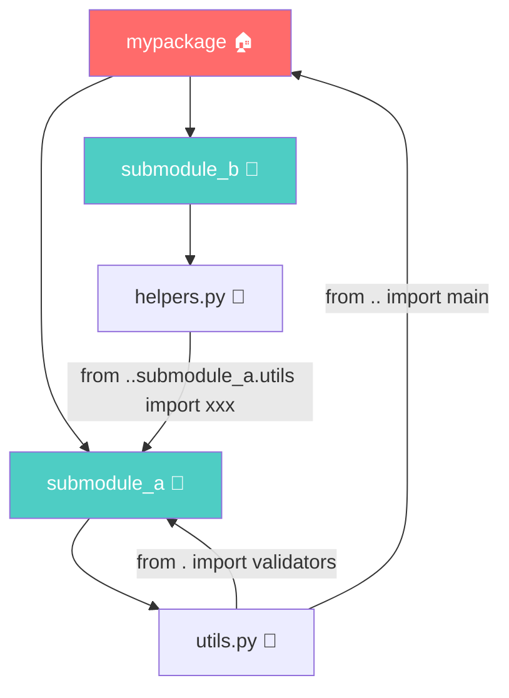
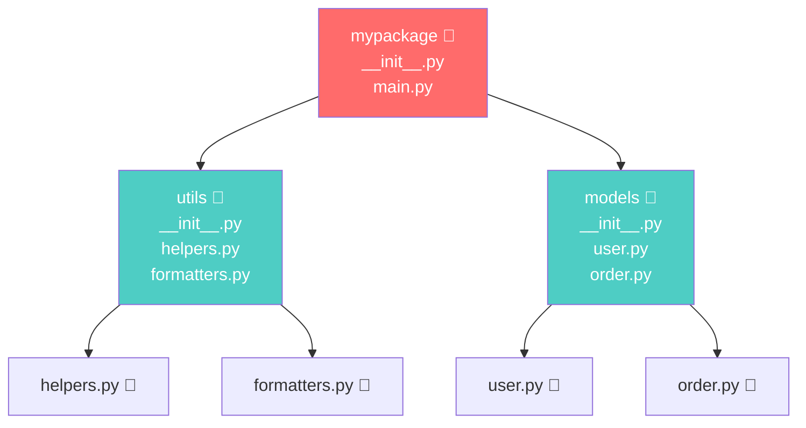
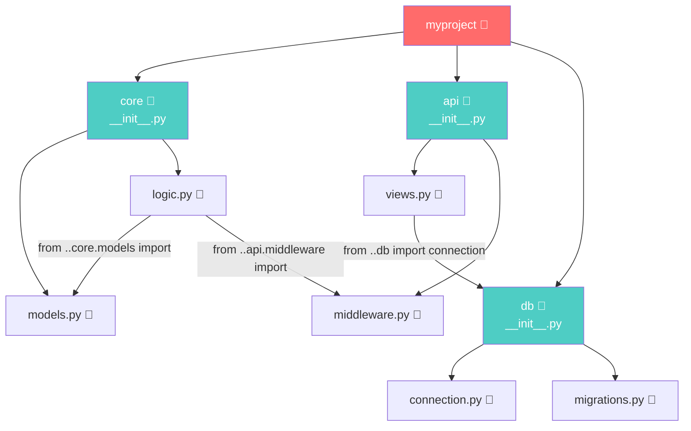

+++
title = "第16章 模块"
weight = 160
date = "2026-04-08T13:22:00+08:00"
type = "docs"
description = ""
isCJKLanguage = true
draft = false
+++

# Chapter 16: 模块——Python 的百宝箱

> 本章我们将探索 Python 世界里最神奇的东西——模块。想象一下，如果你是一家餐厅的厨师，不是每个菜都从零开始种菜养鸡，而是直接去菜市场买现成的原料。模块，就是 Python 的"菜市场"！

你知道 Python 为什么这么火吗？不是因为它的语法有多漂亮（虽然确实挺优雅的），而是因为它有一个超级庞大的"模块菜市场"——标准库加第三方库，几乎你想干什么都有现成的轮子。学会用模块，你就是那个站在巨人肩膀上的程序员，而不是从零开始造轮子的傻子（别误会，造轮子有时候也很酷，但没必要的事就别折腾了）。

---

## 16.1 import 机制

Python 的模块系统，说白了就是一种"共享代码"的艺术。你写了一个酷炫的函数，别人想用，怎么办？打包成模块，分享出去！反过来，你想用别人写的牛掰代码，怎么办？import 进来！

### 16.1.1 import 语句

`import` 是 Python 里最常见的四个字母组合之一，你几乎每天都会和它打交道。它的作用很简单：**把别人写好的模块请进你的程序**。

```python
# 基础 import 语法
import math          # 导入数学模块
import random        # 导入随机数模块
import os            # 导入操作系统接口模块

# 使用模块里的函数，要用"模块名.函数名"的方式
print(math.sqrt(16))    # 16的平方根 → 4.0
print(random.randint(1, 10))  # 1到10之间的随机整数（每次运行结果不同）
print(os.getcwd())      # 获取当前工作目录
```

> 小明：老师，`import` 是不是就像去超市买菜？
>
> 老师：差不多！不过你 import 的东西不用放冰箱，但你的代码硬盘空间可能会因为第三方库变得跟冰箱一样塞满各种奇怪的东西。

#### import 的本质

当你执行 `import math` 时，Python 干了三件事：

1. **创建模块对象**：Python 会创建一个专门的对象来代表 `math` 模块
2. **在 `sys.modules` 中注册**：把你的模块记录在案，以后再 import 就快了
3. **在当前命名空间创建引用**：让你能用 `math.` 来访问这个模块的内容

```python
import sys

# 查看 Python 已经加载的所有模块
print(len(sys.modules))  # 当前已加载模块数量（数字很大，Python 自带很多模块）
print('math' in sys.modules)  # 查看 math 模块是否已加载 → True
```

### 16.1.2 from...import 语句

有时候你只想吃菜市场的西红柿，不想把整个菜市场都搬回家。`from...import` 就是这个道理——**只拿你需要的那部分**。

```python
# 从模块中导入特定函数或变量
from math import sqrt, pi          # 只导入平方根和圆周率
from random import randint, choice  # 只导入随机整数和随机 choice

# 现在可以直接用，不用加模块名前缀
print(sqrt(25))      # → 5.0
print(pi)            # → 3.141592653589793
print(randint(1, 6)) # 掷骰子，1到6之间 → 每次结果不同
print(choice(['甲', '乙', '丙']))  # 随机选一个人回答问题
```

> 如果你 `from` 了一个名字，后来又定义了同名的变量，那可就热闹了——后来的会把 import 进来的覆盖掉。所以用 `from...import` 的时候，给名字留点活路。

```python
# 演示命名冲突的惨剧
from math import pi

pi = 3.14  # 糟糕！你刚才 import 的圆周率被你覆盖了！
print(pi)  # → 3.14 （不再是 3.14159...了，哭晕在厕所）
```

### 16.1.3 import...as 别名

有时候模块名太长，或者和你本地变量撞名了，这时候 `as` 就派上用场了——**给你讨厌的名字起个外号**。

```python
# 昵称的好处：简短、避免冲突
import numpy as np           # 数据科学家的最爱，简写为 np
import pandas as pd          # 数据处理神器，简写为 pd
import matplotlib.pyplot as plt  # 画图必备，简写为 plt
import tensorflow as tf      # 深度学习框架，简写为 tf

# 起了外号之后，就用外号来叫它
print(np.array([1, 2, 3]))   # numpy 的数组
print(pd.DataFrame({'a': [1, 2]}))  # pandas 的数据框
```

```python
# 给函数也起别名
from random import randint as ri
from collections import defaultdict as dd

print(ri(1, 100))  # 随机整数，简写版
d = dd(int)  # defaultdict，创建一个默认值为 0 的字典
d['score'] += 1
print(d['score'])  # → 1
```

> 起别名是个技术活，太短了记不住（如 `import a as b`），太长了没意义。业界惯例：`numpy as np`、`pandas as pd`、`matplotlib.pyplot as plt`、`tensorflow as tf`，记住这些你就是"专业的"！

### 16.1.4 相对导入与绝对导入

这是模块世界里一个稍微有点绕的概念，但别怕，我们用故事来讲。

**绝对导入**：从"菜市场门口"开始找，不管你现在在哪，直接报完整地址。

```python
# mypackage/utils.py 文件里
from mypackage import config      # 绝对导入：从项目根目录开始
from mypackage.helpers import foo  # 绝对导入另一个模块
```

**相对导入**：从"你现在站的位置"开始找，用 `.` 表示"当前位置"，`..` 表示"上一级"。

```python
# 假设项目结构：
# myproject/
#   __init__.py
#   main.py
#   utils/
#     __init__.py
#     helpers.py

# 在 utils/helpers.py 里，你想导入同一级的其他模块
from . import helpers      # 从当前包（utils）导入
from .. import main        # 从上级包（myproject）导入
from .specific import func  # 从当前包的 specific 模块导入
```

```python
# 实际栗子：假设你在 mypackage/utils/formatters.py 里
# 想导入同包的 validators.py
from .validators import validate_email  # 相对导入

# 或者导入父包的 config.py
from ..config import settings  # 相对导入，.. 表示上级目录
```

> 记住这个口诀：**绝对导入是从根出发，相对导入是从我出发**。



### 16.1.5 import 搜索路径（sys.path）

当你 `import something` 的时候，Python 到底去哪找这个 `something`？答案在 `sys.path` 里！

```python
import sys

# 打印 Python 找模块的路径列表
for i, path in enumerate(sys.path):
    print(f"{i}: {path}")
```

运行结果大概是这样的（路径因人而异）：

```
0: ''                                        # 当前脚本所在目录（最高优先级！）
1: C:\Python311\python311.zip               # Python 内置的预编译模块
2: C:\Python311\Lib                          # Python 标准库
3: C:\Python311\Lib\site-packages           # 第三方库安装目录
4: D:\my_projects\my_game                    # 你项目所在的目录
```

> **优先级从高到低**：当前目录 → 标准库 → 第三方库。如果都找不到，Python 就一脸懵，然后报错 `ModuleNotFoundError`。

```python
# 你可以手动往 sys.path 里加新路径
import sys
sys.path.append('D:/my_awesome_library')  # 把你的私人库目录加进去
sys.path.insert(0, 'D:/even_awesomer')    # 插队到最前面（最高优先级）

import my_module  # 现在 Python 也会去这两个地方找
```

```python
# 一个小技巧：获取模块的真实文件路径
import os
import math

# 想知道 import 的模块实际在哪个文件？
print(math.__file__)  # → C:\Python311\Lib\math.py （或者 .pyd 文件）
print(os.__file__)    # → C:\Python311\Lib\os\__init__.py
```

> 友情提示：修改 `sys.path` 只对当前程序生效，程序结束后世界恢复平静。如果你经常需要添加自定义路径，可以设置环境变量 `PYTHONPATH`，或者把库安装到 `site-packages` 目录。

### 16.1.6 __all__ 控制导出

如果你的模块是一个"自助餐厅"，有些菜是随便吃的，有些菜是VIP专区才能动的，怎么办？`__all__` 就是你的"菜品清单"——**用它来声明"公开供应"的函数和变量**。

```python
# mymodule.py

# 定义公开的 API（别人 import * 的时候能看到这些）
__all__ = ['public_function', 'MyClass', 'PUBLIC_CONSTANT']

def public_function():
    """这是公开展示的函数"""
    return "我是公开的！"

def _private_helper():
    """这是内部小助手，不在公开名单里"""
    return "我是隐藏的！"

class MyClass:
    pass

PUBLIC_CONSTANT = 42
_private_var = "看不到我"
```

```python
# 使用 import *
from mymodule import *  # 只能拿到 __all__ 里声明的

print(public_function())   # ✅ 正常用
print(MyClass)             # ✅ 正常用
print(PUBLIC_CONSTANT)    # ✅ 正常用
# print(_private_helper()) # ❌ 用 import * 不会导入它（不在 __all__ 中）；但显式 import _private_helper 是可以的
```

> 有人会问：那我给函数名前面加个 `_` 下划线呢？那个叫"民间约定"，告诉大家"这是个内部用的，别乱动"。但 `__all__` 是"官方声明"，两个配合使用效果最佳！

```python
# 强烈推荐写法：__all__ + 下划线约定 双重保险
__all__ = ['process_data', 'DataProcessor']  # 明确公开名单

def _internal_helper(data):  # 下划线开头，内部使用
    """清洗数据内部用的"""
    return [x.strip() for x in data]

def process_data(data):      # 公开 API
    cleaned = _internal_helper(data)
    return cleaned
```

---

## 16.2 包的结构

模块是单个 `.py` 文件，那如果一堆模块放在一起呢？那就是"包"（Package）了！包就是**装模块的文件夹**，但不是随便什么文件夹都行——它得有点"规矩"。

### 16.2.1 目录包结构

在 Python 2 时代，包文件夹里必须放一个 `__init__.py` 文件（哪怕是空文件），就像"这是我的地盘，Python 请入内"的牌子。Python 3 放宽了要求，但理解传统结构还是很有必要的。



```python
# 传统包目录结构
mypackage/
    __init__.py      # 包入口文件（空也行，有内容也行）
    main.py           # 主模块
    utils/
        __init__.py
        helpers.py
        formatters.py
    models/
        __init__.py
        user.py
        order.py
```

```python
# 使用包里的模块
from mypackage.utils.helpers import clean_data
from mypackage.models.user import User

user = User("张三")
print(clean_data([" 苹果 ", " 香蕉 "]))  # → ['苹果', '香蕉']
```

### 16.2.2 __init__.py 的作用

`__init__.py` 是个神奇的文件，它有以下几个超能力：

1. **把文件夹变成"可导入的包"**：Python 3.3 之前，这是必须的
2. **初始化包**：包被首次 import 时自动执行的代码
3. **控制 `from package import *` 的行为**：可以设置 `__all__`
4. **简化导入路径**：把子模块"提升"到包级别

```python
# mypackage/__init__.py 的内容

# 1. 首次 import 这个包时，会执行这里的代码
print("🥳 mypackage 被加载了！")

# 2. 把常用的子模块"提升"到包级别，简化导入
from .utils.helpers import clean_data  # 把 clean_data 提升到包级别
from .utils import helpers, formatters
from .models import user, order

# 3. 设置包级别的 __all__，控制 from mypackage import * 的行为
__all__ = ['clean_data', 'helpers', 'formatters', 'user', 'order']
```

```python
# 现在你可以这样导入（因为 __init__.py 帮你提升了）
import mypackage

# 原本要这样：from mypackage.utils.helpers import clean_data
# 现在可以这样（前提是 __init__.py 里已经 from .utils.helpers import clean_data）：
from mypackage import clean_data
```

```python
# __init__.py 还能用来做包初始化配置
# 比如 Flask 框架就是用 __init__.py 来初始化应用实例

# 假设这是 mypackage/config.py 的内容
DATABASE_URL = "sqlite:///mydb.sqlite3"
DEBUG = True

# mypackage/__init__.py 里
from .config import DATABASE_URL, DEBUG

# 这样外部可以直接 mypackage.DATABASE_URL 访问
```

> 想象 `__init__.py` 是包的"迎宾员"：客人（import）来了，它负责开门、准备茶水（加载子模块）、告诉你 VIP 包间在哪（简化导入路径）。一个好的迎宾员能让整个体验流畅无比！

### 16.2.3 命名空间包（Python 3.3+，不需要 __init__.py）

这是 Python 3.3 引入的"新式包"，它不需要 `__init__.py` 文件，而且允许多个目录"拼接"成一个逻辑包。听起来有点玄乎？来看栗子！

```python
# 命名空间包的特点：
# 1. 不需要 __init__.py
# 2. 可以跨多个目录
# 3. 是"只读"的，不能有 __init__.py 里的代码

# 假设你有这样的结构：
# /usr/lib/python3/site-packages/mypackage/__init__.py  （第三方库）
# /home/user/projects/mypackage/utils.py                  （你的代码）
# 
# 用户 import mypackage 时，Python 会自动"拼接"这两个目录的内容！
```

```python
# 命名空间包的实际应用：同一模块的不同来源
# 比如你写的代码和第三方库可以往同一个命名空间里加东西

# 创建命名空间包只需要建立目录，不放 __init__.py 即可
# Python 会智能合并所有同名包的路径

# 查看包的所有来源路径
import mypackage
print(mypackage.__path__)  # 会列出所有来源路径
```

> **命名空间包 vs 传统包怎么选？**
> - 需要初始化代码、配置？用传统包（有 `__init__.py`）
> - 只是为了组织代码、多个来源共享命名空间？用命名空间包
> - 新项目推荐从传统包开始，简单明了

### 16.2.4 子包与跨包导入

大项目会有多层级嵌套的包，就像公司有部门，部门有小组。子包就是包的"儿子（和孙子）"。



```python
# 跨包导入栗子：myproject/api/views.py 导入 db 模块

# 假设目录结构是：
# myproject/
#   __init__.py
#   api/
#     __init__.py
#     views.py
#   db/
#     __init__.py
#     connection.py

# myproject/db/connection.py
def get_connection():
    return "数据库连接对象"

# myproject/api/views.py
# 方式1：绝对导入（推荐，清晰明了）
from myproject.db import connection
conn = connection.get_connection()

# 方式2：相对导入（适合包内部使用）
from ..db import connection
conn = connection.get_connection()
```

```python
# 从子包"晋升"到父包
# 假设 myproject/core/logic.py 想访问 myproject/config.py

# myproject/core/logic.py
from .. import config  # .. 表示上级包（myproject）
print(config.SETTINGS)

# 或者
import myproject.config as config
print(config.SETTINGS)
```

> **跨包导入黄金法则**：
> - **包内**：用相对导入 `from . import xxx` 或 `from ..xxx import yyy`
> - **包外**（用户使用你的包）：用绝对导入 `from mypackage.submodule import func`
> - **不要用** `sys.path`  hack 来做包内导入，那是自找麻烦

---

## 16.3 模块的 __name__

每个 Python 模块都有一个隐藏属性叫 `__name__`，它记录了这个模块的"身份"。想知道你写的代码是被别人导入用，还是直接运行的？问 `__name__` 就知道了！

### 16.3.1 if __name__ == "__main__" 的作用

这是 Python 里最最最常用的"独门绝技"——让同一个文件既能当模块被导入，又能在需要时直接运行！

```python
# hello.py

def say_hello(name):
    """打招呼函数"""
    return f"你好，{name}！欢迎来到 Python 的世界！"

def _private_func():
    """内部小函数，不想被外面用"""
    return "这是内部用的"

# ⭐ 关键代码来了！
if __name__ == "__main__":
    # 只有直接运行这个文件时，以下代码才会执行
    # 如果是被其他文件 import 的，这块代码不会执行
    print("=== 直接运行模式 ===")
    print(say_hello("小明"))
    print(say_hello("小红"))
else:
    # 被 import 时的提示（可选）
    print(f"模块 {__name__} 被导入了")
```

```python
# 场景1：直接运行 hello.py
# 输出：
# === 直接运行模式 ===
# 你好，小明！欢迎来到 Python 的世界！
# 你好，小红！欢迎来到 Python 的世界！

# 场景2：在另一个文件里 import hello
# import hello
# 输出：
# 模块 hello 被导入了
# （不会打印问候语，因为 if __name__ == "__main__" 不会成立）
```

```python
# 实际项目中的经典用法：命令行工具
# bot.py

import sys
import json

def main():
    """主函数，程序的入口"""
    config = load_config()
    bot = create_bot(config)
    bot.run()

def load_config():
    with open('config.json') as f:
        return json.load(f)

def create_bot(config):
    print(f"启动机器人：{config['name']}")
    return type('Bot', (), {'run': lambda self: print("机器人运行中...")})()

if __name__ == "__main__":
    # 直接运行时执行
    main()
else:
    # 被作为模块导入时，不执行 main()
    print(f"{__name__} 模块已加载，供其他模块使用")
```

### 16.3.2 入口模块的特殊性

当 Python 直接运行一个文件时，这个文件就被称为"入口模块"或"主模块"，它的 `__name__` 属性会被设置为 `"__main__"`。

```python
# 检测自己是不是入口模块
print(f"当前模块的 __name__ 是：{__name__}")

if __name__ == "__main__":
    print("我是被直接运行的！")
else:
    print("我是被别的模块导入的")
```

```python
# 入口模块的 sys.argv 有特殊含义
# 假设你在命令行运行：python my_script.py arg1 arg2

import sys
if __name__ == "__main__":
    print(f"脚本名：{sys.argv[0]}")    # → my_script.py
    print(f"参数列表：{sys.argv[1:]}")  # → ['arg1', 'arg2']
```

> **为什么 `if __name__ == "__main__"` 这么重要？**
> 想象你写了一个很酷的排序算法库，里面有个测试函数 `test_sorting()`。如果别人 `import` 你的模块，你不希望测试代码自动运行（那多尴尬），但你自己调试时又希望能直接运行测试。`if __name__ == "__main__"` 就是解决这个问题的完美方案！

---

## 16.4 标准库速查

Python 自带了一大堆"赠品"，不用额外安装就能用，这就是**标准库（Standard Library）**。接下来我们按模块一个个介绍，全是干货，建议收藏！

### 16.4.1 os（操作系统接口）

`os` 模块是 Python 和操作系统之间的"翻译官"，不管你是 Windows、Mac 还是 Linux，它都能帮你和系统聊上天。

```python
import os

# 获取当前工作目录（你现在在哪个文件夹里）
cwd = os.getcwd()
print(f"当前目录：{cwd}")

# 创建目录
os.makedirs("test_folder", exist_ok=True)  # 递归创建，exist_ok=True 避免已存在报错

# 删除目录
os.rmdir("test_folder")  # 只能删除空目录

# 列出目录内容
print(os.listdir("."))  # 列出当前目录所有文件和文件夹

# 检查路径
print(os.path.exists("test_folder"))  # False，目录已被删除
print(os.path.isfile("Chapter-16-Modules.md"))  # 检查是否是文件
print(os.path.isdir("test_folder"))   # 检查是否是目录

# 路径拼接（跨平台兼容！）
full_path = os.path.join("home", "user", "documents", "file.txt")
print(full_path)  # Windows: home\user\documents\file.txt  Linux: home/user/documents/file.txt

# 获取文件信息
size = os.path.getsize("Chapter-16-Modules.md")
print(f"文件大小：{size} 字节")

# 环境变量
home_dir = os.environ.get("HOME") or os.environ.get("USERPROFILE")
print(f"用户目录：{home_dir}")

# 执行系统命令（慎用！有安全风险）
# os.system("dir")  # Windows
# os.system("ls")   # Linux/Mac
```

> **安全提醒**：`os.system()` 执行命令虽方便，但如果你把用户输入拼进去，可能导致**命令注入漏洞**。记住：**永远不要**把不可信的用户输入传给 `os.system()`。要用 `subprocess` 模块代替！

### 16.4.2 sys（系统相关参数）

`sys` 模块包含了 Python 解释器自己的"小秘密"，用它可以了解 Python 运行环境、命令行参数，以及做些"作弊"操作。

```python
import sys

# Python 版本信息
print(f"Python 版本：{sys.version}")
print(f"版本详情：{sys.version_info}")
print(f"主版本号：{sys.version_info.major}")  # 3
print(f"次版本号：{sys.version_info.minor}")  # 11

# 命令行参数（sys.argv）
# 假设运行：python script.py arg1 arg2
print(f"脚本名：{sys.argv[0]}")
print(f"参数个数：{len(sys.argv)}")

# 退出程序（别乱用！）
# sys.exit(0)  # 正常退出
# sys.exit(1)  # 出错退出

# 模块搜索路径
print(f"\n模块搜索路径：")
for p in sys.path[:3]:  # 只显示前3个
    print(f"  {p}")

# 最大的整数和浮点数
print(f"最大整数：{sys.maxsize}")
print(f"最大浮点数：{sys.float_info.max}")

# stdin / stdout / stderr
print("普通输出", file=sys.stdout)  # 打印到标准输出
print("错误信息", file=sys.stderr)  # 打印到标准错误

# 强制刷新输出
print("马上显示！", flush=True)

# 查看已加载的模块数量
print(f"\n已加载模块数：{len(sys.modules)}")
```

### 16.4.3 pathlib（面向对象路径处理）

`pathlib` 是 Python 3.4 引入的新一代路径处理工具，用面向对象的方式处理文件和目录，比 `os.path` 更直观、更优雅。

```python
from pathlib import Path

# 当前目录的 Path 对象
p = Path(".")
print(p)  # .

# 路径拼接，用 /
data_dir = Path("data") / "output" / "results"
print(data_dir)  # data\output\results

# 创建目录
data_dir.mkdir(parents=True, exist_ok=True)

# 路径存在性检查
print(Path("Chapter-16-Modules.md").exists())  # True
print(Path("不存在的文件.txt").exists())      # False

# 文件 vs 目录
print(Path("Chapter-16-Modules.md").is_file())   # True
print(Path(".").is_dir())                         # True

# 遍历目录
for item in Path(".").iterdir():
    print(f"  {item.name} ({'dir' if item.is_dir() else 'file'})")

# 路径.glob() 模式匹配
for py_file in Path(".").glob("*.md"):
    print(f"  找到 Markdown: {py_file.name}")

# 递归搜索
for py_file in Path(".").rglob("*.py"):
    print(f"  找到 Python: {py_file}")

# 读取/写入文件（Python 3.4+ 新写法）
test_file = data_dir / "test.txt"
test_file.write_text("Hello, pathlib!", encoding="utf-8")
content = test_file.read_text(encoding="utf-8")
print(f"读取内容：{content}")

# 获取各种路径信息
readme = Path("README.md")
print(f"文件名：{readme.name}")        # README.md
print(f"不含扩展名：{readme.stem}")    # README
print(f"扩展名：{readme.suffix}")     # .md
print(f"父目录：{readme.parent}")     # .
print(f"绝对路径：{readme.resolve()}")

# 解析路径（把字符串转成 Path 对象）
home = Path.home()
print(f"用户主目录：{home}")

# 相对路径
file_path = Path("data/config/settings.py")
print(f"相对路径：{file_path}")                    # data/config/settings.py
print(f"绝对路径：{file_path.resolve()}")           # D:\...\data\config\settings.py
```

> **pathlib vs os.path**：简单说，`pathlib` 是"网红新人"，`os.path` 是"老戏骨"。新代码推荐用 `pathlib`，更直观、更面向对象。如果你要处理大量路径操作，`pathlib` 能让你少写很多 `os.path.join("a", "b", "c")` 这样的代码。

### 16.4.4 time 与 datetime（时间处理）

时间处理是编程中的"老大难"问题，不同的时区、格式、夏令时能把人绕晕。Python 提供了两个模块来帮你：`time`（底层时间）和 `datetime`（高层时间）。

```python
import time
import datetime

# ===== time 模块 =====

# 获取当前时间戳（从1970年1月1日到现在经过的秒数）
timestamp = time.time()
print(f"当前时间戳：{timestamp}")

# 时间戳转 struct_time（分解时间）
struct = time.localtime(timestamp)
print(f"struct_time：{struct}")
print(f"年={struct.tm_year}, 月={struct.tm_mon}, 日={struct.tm_mday}")

# struct_time 转字符串
formatted = time.strftime("%Y-%m-%d %H:%M:%S", struct)
print(f"格式化时间：{formatted}")

# 字符串转 struct_time
parsed = time.strptime("2024-01-15 10:30:00", "%Y-%m-%d %H:%M:%S")
print(f"解析后：{parsed}")

# 暂停一会儿（程序"睡觉"）
print("我要睡2秒...")
time.sleep(2)
print("睡醒了！")

# ===== datetime 模块 =====

# 获取当前时间
now = datetime.datetime.now()
print(f"当前时间：{now}")

# 创建特定时间
birthday = datetime.datetime(2000, 1, 1, 0, 0, 0)
print(f"千禧年：{birthday}")

# 时间相减（得到 timedelta）
diff = now - birthday
print(f"活了 {diff.days} 天了！")

# 加减时间
future = now + datetime.timedelta(days=7)
past = now - datetime.timedelta(hours=12)
print(f"一周后：{future}")
print(f"12小时前：{past}")

# 格式化时间（strftime）
print(now.strftime("%Y年%m月%d日 %H:%M:%S"))
print(now.strftime("%A, %B %d, %Y"))  # 英文格式

# 字符串转时间（strptime）
date_str = "2024-06-01 12:00:00"
parsed_time = datetime.datetime.strptime(date_str, "%Y-%m-%d %H:%M:%S")
print(f"解析时间：{parsed_time}")

# date 对象（只有日期，没有时间）
today = datetime.date.today()
print(f"今天是：{today}")
print(f"今天是星期{['一','二','三','四','五','六','日'][today.weekday()]}")

# ===== 实用技巧 =====

# 简单计时器
def timer(func):
    """装饰器：计算函数执行时间"""
    def wrapper(*args, **kwargs):
        start = time.time()
        result = func(*args, **kwargs)
        end = time.time()
        print(f"{func.__name__} 耗时：{end - start:.4f}秒")
        return result
    return wrapper

@timer
def slow_function():
    time.sleep(1)
    return "完成"

print(slow_function())
```

> **时区处理**：如果你的程序需要处理不同时区，推荐用 `pytz` 或 `zoneinfo`（Python 3.9+）库。Python 自带的时区支持比较基础，国际化项目最好上专业的。

### 16.4.5 json（JSON 序列化）

JSON 是"网页API的数据血液"，也是很多配置文件的首选格式。Python 的 `json` 模块让你在字典和 JSON 字符串之间自由切换。

```python
import json

# ===== Python 对象 → JSON 字符串 =====

data = {
    "name": "小明",
    "age": 18,
    "scores": [95, 88, 92],
    "is_student": True,
    "address": {"city": "北京", "district": "朝阳区"}
}

# 序列化（dump：写入文件，dumps：写入字符串）
json_str = json.dumps(data, ensure_ascii=False, indent=2)
print("JSON 字符串：")
print(json_str)

# ===== JSON 字符串 → Python 对象 =====

json_text = '{"name": "小红", "age": 17, "grades": [80, 90]}'
parsed = json.loads(json_text)
print(f"解析后：{parsed}")
print(f"类型：{type(parsed)}")  # <class 'dict'>

# ===== 文件操作 =====

# 写入 JSON 文件
with open("data.json", "w", encoding="utf-8") as f:
    json.dump(data, f, ensure_ascii=False, indent=2)

# 读取 JSON 文件
with open("data.json", "r", encoding="utf-8") as f:
    loaded = json.load(f)
print(f"从文件读取：{loaded}")

# ===== 高级选项 =====

# 自定义序列化（处理 datetime 等特殊类型）
from datetime import datetime

class CustomEncoder(json.JSONEncoder):
    def default(self, obj):
        if isinstance(obj, datetime):
            return {"__datetime__": obj.isoformat()}
        return super().default(obj)

data_with_date = {"event": "派对", "time": datetime.now()}
encoded = json.dumps(data_with_date, cls=CustomEncoder)
print(f"带日期的JSON：{encoded}")

# ===== JSON vs Python 类型对照表 =====
# Python          → JSON
# dict            → object {}
# list, tuple     → array []
# str             → string ""
# int, float      → number
# True / False    → true / false
# None            → null
```

### 16.4.6 re（正则表达式）

正则表达式是处理文本的"瑞士军刀"，学会了能让你的字符串处理能力提升10倍。学不会的话……那就只能用一堆 `split`、`replace`、`indexOf` 把自己绕晕。

```python
import re

text = "我的邮箱是 zhangsan@163.com，另一个是 li_si@qq.com，别打 138-1234-5678 这个电话"

# ===== 基础匹配 =====

# findall: 找出所有匹配
emails = re.findall(r'\w+@\w+\.\w+', text)
print(f"邮箱：{emails}")

# search: 找第一个匹配
phone_match = re.search(r'\d{3}-\d{4}-\d{4}', text)
if phone_match:
    print(f"电话号码：{phone_match.group()}")

# match: 从开头匹配
result = re.match(r'^我的', text)
print(f"开头匹配：{result.group() if result else '不匹配'}")

# split: 用正则分割
parts = re.split(r'[,，。.]', "苹果,香蕉。草莓,葡萄")
print(f"分割结果：{parts}")

# sub: 替换
cleaned = re.sub(r'\d{3}-\d{4}-\d{4}', '[电话号码]', text)
print(f"脱敏后：{cleaned}")

# ===== 正则语法速查 =====

# .  匹配任意字符（除了换行）
# \d 匹配数字 [0-9]
# \D 匹配非数字 [^0-9]
# \w 匹配字母数字下划线 [a-zA-Z0-9_]
# \W 匹配非字母数字
# \s 匹配空白字符（空格、tab、换行）
# \S 匹配非空白字符
# ^  匹配字符串开头
# $  匹配字符串结尾
# *  0次或多次
# +  1次或多次
# ?  0次或1次（可选）
# {n} 恰好n次
# {n,m} n到m次
# [] 字符类，如 [aeiou] 匹配元音
# |  或，如 cat|dog
# () 分组

# ===== 高级：分组捕获 =====

log = "2024-06-15 10:30:45 ERROR Connection failed"
pattern = r'(\d{4})-(\d{2})-(\d{2}) (\d{2}):(\d{2}):(\d{2}) (\w+) (.+)'
match = re.match(pattern, log)
if match:
    print(f"日期：{match.group(1)}-{match.group(2)}-{match.group(3)}")
    print(f"时间：{match.group(4)}:{match.group(5)}:{match.group(6)}")
    print(f"级别：{match.group(7)}")
    print(f"消息：{match.group(8)}")
    # 也能用具名分组
    # (?P<name>pattern)

# ===== re.compile 预编译（多次使用时效率更高）=====

email_pattern = re.compile(r'\w+@\w+\.\w+')
urls = ["test@gmail.com", "invalid", "user@yahoo.com"]
for url in urls:
    if email_pattern.fullmatch(url):  # 完全匹配
        print(f"有效邮箱：{url}")
    else:
        print(f"无效：{url}")

# ===== 实战：验证手机号 =====
def validate_phone(phone):
    """验证中国手机号"""
    pattern = r'^1[3-9]\d{9}$'  # 1开头，第二位3-9，后面9位数字
    return bool(re.fullmatch(pattern, phone))

print(validate_phone("13812345678"))  # True
print(validate_phone("12345678901"))   # False
print(validate_phone("138-1234-5678")) # False
```

> 正则表达式有"毒"，一旦学会就老想用正则解决一切问题。但正则不是万能的——简单的字符串操作能搞定的就别用正则，你的脑子（和未来维护代码的同事）会感谢你。

### 16.4.7 collections（容器数据类型）

标准的数据类型有列表、字典、元组、集合，但 `collections` 模块给你提供了**升级版**，解决特定场景下的特殊需求。

```python
from collections import namedtuple, defaultdict, Counter, deque, OrderedDict

# ===== namedtuple：带名字的元组 =====
# 适合表示不可变的"记录"

Point = namedtuple('Point', ['x', 'y', 'z'])
p1 = Point(10, 20, 30)
p2 = Point(x=100, y=200, z=300)

print(f"点1：{p1}")
print(f"点1.x = {p1.x}, 点1.y = {p1.y}")  # 用名字访问，比索引直观
print(f"点2：{p2}")

# namedtuple 也有 _replace 方法创建"修改版"
p3 = p1._replace(x=999)
print(f"修改后的点：{p3}")

# ===== defaultdict：默认值字典 =====
# 访问不存在的 key 不会报错，会自动创建默认值

dd = defaultdict(int)  # 默认值是 0（int() 的结果）
words = ["apple", "banana", "apple", "cherry", "banana", "apple"]
for word in words:
    dd[word] += 1
print(f"水果计数：{dict(dd)}")  # {'apple': 3, 'banana': 2, 'cherry': 1}

# 默认值工厂：
# int → 0
# list → []
# dict → {}
# set → set()

dd2 = defaultdict(list)  # 默认值是空列表
dd2["colors"].append("red")
dd2["colors"].append("blue")
print(f"颜色列表：{dict(dd2)}")

# ===== Counter：计数器 =====
# 专门用来数东西出现次数

votes = ["A", "B", "A", "C", "B", "A", "A"]
counter = Counter(votes)
print(f"投票结果：{counter}")
print(f"最高票：{counter.most_common(1)}")  # [('A', 4)]
print(f"A 得了 {counter['A']} 票")

# Counter 运算
c1 = Counter(["a", "b", "c", "a"])
c2 = Counter(["a", "b", "d"])
print(f"合并：{c1 + c2}")  # {'a': 2, 'b': 2, 'c': 1, 'd': 1}
print(f"交集：{c1 & c2}")  # {'a': 1, 'b': 1}

# ===== deque：双端队列 =====
# 两端都能添加/删除，比 list 的 pop(0) 高效得多

dq = deque(["甲", "乙", "丙"])
dq.append("丁")      # 右端添加
dq.appendleft("甲'") # 左端添加
print(f"队列：{list(dq)}")

dq.pop()             # 右端弹出
dq.popleft()         # 左端弹出
print(f"操作后：{list(dq)}")

# deque 的实用场景：保持最后 N 个元素
last_lines = deque(maxlen=5)
for i in range(10):
    last_lines.append(f"行 {i}")
print(f"最后5行：{list(last_lines)}")

# ===== OrderedDict：有序字典 =====
# Python 3.7+ 普通字典已自动保持插入顺序，
# OrderedDict 在需要特定顺序操作（如 move_to_end）时仍有价值

od = OrderedDict()
od["first"] = 1
od["second"] = 2
od["third"] = 3
print(f"有序字典：{dict(od)}")

# 移动到末尾
od.move_to_end("first")
print(f"移动后：{list(od.keys())}")
```

### 16.4.8 itertools（迭代工具）

`itertools` 是 Python 里的"迭代器工厂"，提供了各种用于操作迭代器的函数，让你的代码更高效、更 pythonic。

```python
import itertools

# ===== count / cycle / repeat：无限迭代器 =====

# count: 无限计数器
for i in itertools.count(start=10, step=2):
    print(i, end=" ")
    if i > 20:
        break
print()  # 10 12 14 16 18 20 22

# cycle: 无限循环
cycler = itertools.cycle(["红", "绿", "蓝"])
for i in range(7):
    print(next(cycler), end=" ")
print()  # 红 绿 蓝 红 绿 蓝 红

# repeat: 重复一个值
repeater = itertools.repeat("呗", times=3)
print(list(repeater))  # ['呗', '呗', '呗']

# ===== 有限迭代器 =====

# accumulate: 累加
nums = [1, 2, 3, 4, 5]
print(list(itertools.accumulate(nums)))         # [1, 3, 6, 10, 15]
print(list(itertools.accumulate(nums, max)))    # [1, 2, 3, 4, 5]

# chain: 连接多个迭代器
a = [1, 2, 3]
b = [4, 5, 6]
print(list(itertools.chain(a, b)))  # [1, 2, 3, 4, 5, 6]
print(list(itertools.chain.from_iterable([a, b, [7, 8]])))  # 嵌套列表扁平化

# compress: 按条件过滤
data = ["甲", "乙", "丙", "丁", "戊"]
selector = [True, False, True, False, True]
print(list(itertools.compress(data, selector)))  # ['甲', '丙', '戊']

# dropwhile / takewhile: 按条件跳过/取元素
nums = [1, 3, 5, 2, 4, 6]
print(list(itertools.dropwhile(lambda x: x < 5, nums)))  # [5, 2, 4, 6] （遇到>=5的就开始保留）
print(list(itertools.takewhile(lambda x: x < 5, nums)))  # [1, 3] （遇到>=5的就停止）

# groupby: 分组（需要数据先排序）
data = [("甲", "A"), ("乙", "A"), ("丙", "B"), ("丁", "B"), ("戊", "A")]
data.sort(key=lambda x: x[1])  # 必须先排序！
for key, group in itertools.groupby(data, key=lambda x: x[1]):
    print(f"{key}: {list(group)}")
# A: [('甲', 'A'), ('乙', 'A')]
# B: [('丙', 'B'), ('丁', 'B')]
# A: [('戊', 'A')]

# ===== 组合生成器 =====

# product: 笛卡尔积
colors = ["红", "绿"]
sizes = ["S", "M", "L"]
print(list(itertools.product(colors, sizes)))
# [('红', 'S'), ('红', 'M'), ('红', 'L'), ('绿', 'S'), ('绿', 'M'), ('绿', 'L')]

# permutations: 排列（有序）
print(list(itertools.permutations("ABC", 2)))
# [('A', 'B'), ('A', 'C'), ('B', 'A'), ('B', 'C'), ('C', 'A'), ('C', 'B')]

# combinations: 组合（无序）
print(list(itertools.combinations("ABC", 2)))
# [('A', 'B'), ('A', 'C'), ('B', 'C')]

# combinations_with_replacement: 带重复的组合
print(list(itertools.combinations_with_replacement("AB", 3)))
# [('A', 'A', 'A'), ('A', 'A', 'B'), ('A', 'B', 'B'), ('B', 'B', 'B')]
```

### 16.4.9 functools（函数式编程工具）

`functools` 是 Python 函数式编程的"工具箱"，包含了高阶函数操作、装饰器工具等。

```python
import functools

# ===== lru_cache：记忆化缓存 =====
# 把函数的结果缓存起来，相同的参数不再重复计算

@functools.lru_cache(maxsize=128)
def fibonacci(n):
    """计算斐波那契数列（带缓存）"""
    if n < 2:
        return n
    return fibonacci(n-1) + fibonacci(n-2)

import time
start = time.time()
print(f"Fib(30) = {fibonacci(30)}")
print(f"耗时：{time.time() - start:.6f}秒")

# 清除缓存
fibonacci.cache_clear()

# ===== partial：偏函数 =====
# 固定函数的部分参数，创建一个"简化版"函数

def power(base, exponent):
    return base ** exponent

square = functools.partial(power, exponent=2)  # 固定 exponent=2
cube = functools.partial(power, exponent=3)   # 固定 exponent=3

print(square(5))  # 25
print(cube(5))    # 125

# ===== reduce：归约 =====
# 把序列"压缩"成一个值

numbers = [1, 2, 3, 4, 5]
total = functools.reduce(lambda x, y: x + y, numbers)
print(f"总和：{total}")  # 15

max_val = functools.reduce(lambda x, y: x if x > y else y, numbers)
print(f"最大值：{max_val}")  # 5

# ===== cmp_to_key：自定义排序 =====
# 把比较函数转成 key 函数

sorted(["香蕉", "苹果", "枣子"], key=functools.cmp_to_key(
    lambda a, b: len(a) - len(b)  # 按长度排序
))  # ['枣子', '苹果', '香蕉']

# ===== wraps：装饰器保存元信息 =====
# 让装饰器不要"吃掉"原函数的 __name__、__doc__ 等

def my_decorator(func):
    @functools.wraps(func)
    def wrapper(*args, **kwargs):
        print("调用前")
        result = func(*args, **kwargs)
        print("调用后")
        return result
    return wrapper

@my_decorator
def say_hi():
    """这个函数打招呼"""
    print("嗨！")

print(say_hi.__name__)  # say_hi （而不是 wrapper）
print(say_hi.__doc__)   # 这个函数打招呼

# ===== singledispatch：泛函数 =====
# 根据第一个参数的类型决定调用哪个实现

@functools.singledispatch
def process(x):
    """默认处理"""
    print(f"默认处理：{x}")

@process.register(int)
def _(x):
    print(f"整数处理：{x} 的平方是 {x**2}")

@process.register(str)
def _(x):
    print(f"字符串处理：'{x}' 长度是 {len(x)}")

process(10)      # 整数处理
process("hello") # 字符串处理
process([1, 2])  # 默认处理
```

### 16.4.10 logging（日志系统）

`logging` 是 Python 内置的日志系统，比 `print()` 高级一万倍。想象 `print` 是用手写字条传信，`logging` 则是专业的邮政系统——有级别、有格式、有目的地。

```python
import logging

# ===== 基础配置 =====
logging.basicConfig(
    level=logging.INFO,
    format='%(asctime)s - %(name)s - %(levelname)s - %(message)s',
    datefmt='%Y-%m-%d %H:%M:%S'
)

logger = logging.getLogger(__name__)  # 用模块名作为 logger 名字

logger.debug("调试信息（通常不显示）")
logger.info("一般信息")
logger.warning("警告信息")
logger.error("错误信息")
logger.critical("严重错误")

# ===== 日志级别 =====
# DEBUG < INFO < WARNING < ERROR < CRITICAL
# 默认是 WARNING 及以上才会输出

# ===== 输出到文件 =====
logging.basicConfig(
    level=logging.DEBUG,
    format='%(asctime)s - %(levelname)s - %(message)s',
    handlers=[
        logging.FileHandler('app.log', encoding='utf-8'),
        logging.StreamHandler()  # 同时输出到控制台
    ]
)

# ===== 实战配置 =====
logger2 = logging.getLogger('myapp')
logger2.setLevel(logging.DEBUG)

# 创建 handler（输出到文件）
file_handler = logging.FileHandler('debug.log', encoding='utf-8')
file_handler.setLevel(logging.DEBUG)

# 创建 handler（输出到控制台）
console_handler = logging.StreamHandler()
console_handler.setLevel(logging.INFO)

# 设置格式
formatter = logging.Formatter('%(asctime)s [%(levelname)s] %(name)s: %(message)s')
file_handler.setFormatter(formatter)
console_handler.setFormatter(formatter)

# 添加 handler
logger2.addHandler(file_handler)
logger2.addHandler(console_handler)

logger2.info("这条会同时出现在文件和屏幕上")
logger2.debug("这条只出现在文件里")
```

### 16.4.11 argparse（命令行参数）

`argparse` 让你的 Python 程序可以接收命令行参数，专业程度瞬间提升 100 倍。不用它的话，你的程序就只能靠 `input()` 交互了。

```python
import argparse

# ===== 创建解析器 =====
parser = argparse.ArgumentParser(
    description="我的超牛命令行工具",
    epilog="使用愉快！有问题请提 Issue"
)

# ===== 添加参数 =====

# 位置参数（必须提供）
parser.add_argument('input_file', help="输入文件路径")

# 可选参数
parser.add_argument('-o', '--output', default='result.txt', help="输出文件路径")
parser.add_argument('-n', '--number', type=int, default=10, help="处理数量")
parser.add_argument('-v', '--verbose', action='store_true', help="详细模式")
parser.add_argument('-q', '--quiet', action='store_true', help="安静模式")
parser.add_argument('--format', choices=['json', 'csv', 'xml'], default='csv', help="输出格式")

# 互斥组（不能同时使用）
group = parser.add_mutually_exclusive_group()
group.add_argument('--encrypt', action='store_true', help="加密模式")
group.add_argument('--decrypt', action='store_true', help="解密模式")

# ===== 解析参数 =====
args = parser.parse_args()

# ===== 使用参数 =====
print(f"输入文件：{args.input_file}")
print(f"输出文件：{args.output}")
print(f"处理数量：{args.number}")
print(f"详细模式：{args.verbose}")
print(f"输出格式：{args.format}")
```

```bash
# 命令行使用示例：
# python mytool.py data.csv -n 100 -v --format json -o out.json
# python mytool.py --help
```

### 16.4.12 urllib（网络请求）

`urllib` 是 Python 内置的网络请求工具，可以"上网"获取网页、数据等。简单场景用它就够了，复杂场景推荐 `requests` 库。

```python
from urllib import request, parse, error

# ===== GET 请求 =====
try:
    with request.urlopen('https://httpbin.org/get') as response:
        data = response.read().decode('utf-8')
        print(f"响应长度：{len(data)} 字符")
        print(f"状态码：{response.status}")
except error.URLError as e:
    print(f"请求失败：{e}")

# ===== 带参数的 GET 请求 =====
params = parse.urlencode({'name': '张三', 'age': 18})
url = f'https://httpbin.org/get?{params}'
print(f"请求URL：{url}")

# ===== POST 请求 =====
data = parse.urlencode({'username': 'admin', 'password': '123456'}).encode()
try:
    with request.urlopen('https://httpbin.org/post', data=data) as response:
        result = response.read().decode()
        print(f"POST响应：{result[:100]}...")
except error.URLError as e:
    print(f"请求失败：{e}")

# ===== 设置请求头 =====
req = request.Request(
    'https://httpbin.org/headers',
    headers={
        'User-Agent': 'Mozilla/5.0 (Windows NT 10.0; Win64; x64) AppleWebKit/537.36',
        'Accept': 'application/json'
    },
    method='GET'
)
with request.urlopen(req) as response:
    import json
    headers = json.loads(response.read().decode())
    print(f"发送的请求头：{headers}")
```

### 16.4.13 http（HTTP 协议）

`http` 模块提供了 HTTP 协议层面的抽象，包含 HTTP 状态码、请求方法等常量。

```python
import http.client
import http.server
import http.cookies

# ===== HTTP 状态码速查 =====
import http.HTTPStatus as status

print(f"200 OK: {status.OK}")          # 200
print(f"404 Not Found: {status.NOT_FOUND}")  # 404
print(f"500 Server Error: {status.INTERNAL_SERVER_ERROR}")  # 500

# 常用状态码分类
# 1xx: 信息性
# 2xx: 成功
# 3xx: 重定向
# 4xx: 客户端错误
# 5xx: 服务器错误

# ===== HTTP 请求方法 =====
import http.HTTPMethod
print(f"GET: {http.HTTPMethod.GET}")
print(f"POST: {http.HTTPMethod.POST}")
print(f"PUT: {http.HTTPMethod.PUT}")
print(f"DELETE: {http.HTTPMethod.DELETE}")

# ===== Cookie（简单用法）=====
cookie = http.cookies.SimpleCookie()
cookie['session'] = 'abc123'
cookie['user'] = '张三'
print(cookie.output())

# ===== 建立 HTTP 连接（低级操作）=====
conn = http.client.HTTPSConnection('httpbin.org', timeout=10)
conn.request('GET', '/get', headers={'User-Agent': 'Python'})
response = conn.getresponse()

print(f"状态：{response.status} {response.reason}")
print(f"响应头：{dict(response.getheaders())}")
body = response.read().decode()
print(f"响应体（前100字符）：{body[:100]}")
conn.close()
```

### 16.4.14 sqlite3（SQLite 数据库）

`sqlite3` 是 Python 内置的 SQLite 数据库模块。SQLite 是一个"零配置"的数据库，整个数据库就是一个文件，非常适合桌面应用、移动应用和小型网站。

```python
import sqlite3

# ===== 创建连接（数据库文件会自动创建）=====
conn = sqlite3.connect('test.db')
cursor = conn.cursor()

# ===== 创建表 =====
cursor.execute('''
    CREATE TABLE IF NOT EXISTS users (
        id INTEGER PRIMARY KEY AUTOINCREMENT,
        name TEXT NOT NULL,
        age INTEGER,
        email TEXT UNIQUE
    )
''')

# ===== 插入数据 =====
# 方法1：参数化查询（防 SQL 注入！）
cursor.execute(
    'INSERT INTO users (name, age, email) VALUES (?, ?, ?)',
    ('张三', 25, 'zhangsan@example.com')
)

# 方法2：命名参数
cursor.execute(
    'INSERT INTO users (name, age, email) VALUES (:name, :age, :email)',
    {'name': '李四', 'age': 30, 'email': 'lisi@example.com'}
)

# 批量插入
users = [
    ('王五', 22, 'wangwu@example.com'),
    ('赵六', 28, 'zhaoliu@example.com'),
]
cursor.executemany(
    'INSERT INTO users (name, age, email) VALUES (?, ?, ?)',
    users
)

conn.commit()  # 提交事务

# ===== 查询数据 =====
cursor.execute('SELECT * FROM users')
all_rows = cursor.fetchall()
print("所有用户：")
for row in all_rows:
    print(f"  ID={row[0]}, 姓名={row[1]}, 年龄={row[2]}, 邮箱={row[3]}")

# 带条件的查询
cursor.execute('SELECT * FROM users WHERE age > ?', (25,))
print("25岁以上的用户：")
for row in cursor:
    print(f"  {row[1]} ({row[2]}岁)")

# ===== 更新数据 =====
cursor.execute('UPDATE users SET age = ? WHERE name = ?', (26, '张三'))
conn.commit()
print(f"更新了 {cursor.rowcount} 行")

# ===== 删除数据 =====
cursor.execute('DELETE FROM users WHERE name = ?', ('赵六',))
conn.commit()
print(f"删除了 {cursor.rowcount} 行")

# ===== 事务控制 =====
try:
    cursor.execute('INSERT INTO users (name, age, email) VALUES (?, ?, ?)', ('测试', 99, 'test@example.com'))
    conn.commit()  # 先提交，模拟正常情况
    # 然后故意出错，演示回滚
    raise ValueError("出错了！")
except:
    conn.rollback()  # 回滚事务
    print("事务已回滚")

# ===== 关闭连接 =====
conn.close()

# ===== 使用上下文管理器（自动提交/回滚）=====
with sqlite3.connect('test.db') as conn:
    cursor = conn.cursor()
    cursor.execute('SELECT COUNT(*) FROM users')
    count = cursor.fetchone()[0]
    print(f"用户总数：{count}")
```

> **SQL 注入是什么？** 就是坏人把恶意 SQL 代码塞进你的查询参数里。避免方法：`cursor.execute('SELECT * FROM users WHERE id = ?', (user_id,))` 用 `?` 占位符，而不是字符串拼接 `cursor.execute(f'SELECT * FROM users WHERE id = {user_id}')`。

### 16.4.15 csv（CSV 文件处理）

CSV（Comma-Separated Values）是最常见的表格数据格式，Excel 都能打开。Python 的 `csv` 模块让你读写 CSV 文件变得超级简单。

```python
import csv

# ===== 写入 CSV =====

with open('students.csv', 'w', newline='', encoding='utf-8') as f:
    writer = csv.writer(f)
    
    # 写入表头
    writer.writerow(['姓名', '年龄', '班级', '成绩'])
    
    # 写入数据行
    writer.writerow(['小明', 15, '初三(1)', 92])
    writer.writerow(['小红', 14, '初二(3)', 88])
    writer.writerow(['小李', 16, '高一(2)', 95])

# ===== 读取 CSV =====

with open('students.csv', 'r', encoding='utf-8') as f:
    reader = csv.reader(f)
    
    # 逐行读取
    for row in reader:
        print(row)

# ===== 使用字典方式读写（更直观）=====

with open('students.csv', 'w', newline='', encoding='utf-8') as f:
    fieldnames = ['姓名', '年龄', '班级', '成绩']
    writer = csv.DictWriter(f, fieldnames=fieldnames)
    
    writer.writeheader()  # 写入表头
    writer.writerow({'姓名': '小刚', '年龄': 15, '班级': '初三(2)', '成绩': 91})
    writer.writerow({'姓名': '小美', '年龄': 14, '班级': '初二(1)', '成绩': 89})

with open('students.csv', 'r', encoding='utf-8') as f:
    reader = csv.DictReader(f)
    for row in reader:
        print(f"{row['姓名']} 在 {row['班级']}，成绩 {row['成绩']}")

# ===== 处理不同分隔符 =====
# 有些 CSV 用分号或制表符分隔

with open('data.tsv', 'w', newline='', encoding='utf-8') as f:
    writer = csv.writer(f, delimiter='\t')
    writer.writerow(['水果', '价格', '数量'])
    writer.writerow(['苹果', '5.5', '10'])
```

> **重要**：打开 CSV 文件时一定要用 `newline=''`，不然在 Windows 上可能会出现空行问题。这是 Python 官方文档推荐的写法。

### 16.4.16 hashlib（哈希与摘要）

哈希（Hash）就是把任意长度的数据"压缩"成固定长度的"指纹"。这个"指纹"是单向的——从数据能算出指纹，但不能用指纹反推数据。常用于密码存储、文件完整性校验等。

```python
import hashlib

# ===== 常见哈希算法 =====

data = "Hello, World!"

# MD5（不安全，已被破解，不用于安全场景）
md5 = hashlib.md5(data.encode('utf-8'))
print(f"MD5: {md5.hexdigest()}")  # 16字节十六进制 = 32个字符

# SHA-1（也不安全了）
sha1 = hashlib.sha1(data.encode('utf-8'))
print(f"SHA-1: {sha1.hexdigest()}")  # 20字节 = 40个字符

# SHA-256（推荐，安全）
sha256 = hashlib.sha256(data.encode('utf-8'))
print(f"SHA-256: {sha256.hexdigest()}")  # 32字节 = 64个字符

# SHA-512（更安全，更长）
sha512 = hashlib.sha512(data.encode('utf-8'))
print(f"SHA-512: {sha512.hexdigest()}")  # 64字节 = 128个字符

# ===== 大文件哈希 =====
filename = "Chapter-16-Modules.md"
with open(filename, 'rb') as f:
    sha256_hash = hashlib.sha256()
    for chunk in iter(lambda: f.read(4096), b''):
        sha256_hash.update(chunk)
    print(f"{filename} 的 SHA-256: {sha256_hash.hexdigest()}")

# ===== 密码存储（加盐）=====
import secrets
import bcrypt  # 如果安装了 bcrypt 库

def hash_password(password):
    """安全的密码哈希"""
    # 生成随机盐
    salt = hashlib.sha256(secrets.token_bytes(16)).hexdigest()
    # 用盐来哈希密码
    hashed = hashlib.pbkdf2_hmac('sha256', 
                                  password.encode('utf-8'),
                                  salt.encode('utf-8'),
                                  100000)  # 迭代次数
    return salt + hashed.hex()

def verify_password(password, stored_hash):
    """验证密码"""
    salt = stored_hash[:64]
    stored_password_hash = stored_hash[64:]
    new_hash = hashlib.pbkdf2_hmac('sha256',
                                     password.encode('utf-8'),
                                     salt.encode('utf-8'),
                                     100000)
    return new_hash.hex() == stored_password_hash

# 使用示例
password = "MySecurePassword123!"
stored = hash_password(password)
print(f"存储的哈希：{stored[:80]}...")  # 前80字符
print(f"验证结果：{verify_password(password, stored)}")
print(f"错误密码验证：{verify_password('wrong', stored)}")
```

> **MD5 和 SHA-1 不安全！** 它们虽然快，但已被破解。如果你要存密码或做安全相关的事情，用 `bcrypt`、`argon2` 或 PBKDF2（Python 内置）。MD5 和 SHA-1 只适合做文件完整性校验（不怕被篡改的那种）。

### 16.4.17 secrets（安全随机数）

`secrets` 是 Python 3.6 引入的"安全随机数"模块，专门用于生成密码、token、密钥等安全相关的随机数据。**不要再用 `random` 模块做安全相关的事了！**

```python
import secrets

# ===== 生成安全随机数 =====

# 随机字节（最底层的方式）
token_bytes = secrets.token_bytes(32)  # 32字节
print(f"随机字节：{token_bytes.hex()}")

# token_hex：十六进制字符串
token_hex = secrets.token_hex(16)  # 32个十六进制字符
print(f"十六进制token：{token_hex}")

# token_urlsafe：URL 安全的 base64 编码
token_url = secrets.token_urlsafe(32)
print(f"URL安全token：{token_url}")

# ===== 生成随机数用于密码等 =====

# 随机整数（在范围内）
random_int = secrets.randbelow(1000000)  # 0 到 999999 之间
print(f"随机整数：{random_int}")

# 随机选择（不重复）
choices = ['a', 'b', 'c', 'd', 'e', 'f', 'g', 'h']
selected = secrets.choice(choices)
print(f"随机选中：{selected}")

# ===== 生成安全的随机密码 =====
import string

def generate_password(length=16):
    """生成安全的随机密码"""
    alphabet = string.ascii_letters + string.digits + string.punctuation
    while True:
        password = ''.join(secrets.choice(alphabet) for _ in range(length))
        # 确保密码强度：包含大小写字母和数字
        if (any(c.islower() for c in password)
                and any(c.isupper() for c in password)
                and any(c.isdigit() for c in password)):
            return password

print(f"安全密码：{generate_password()}")

# ===== 比较两个值（防时序攻击）=====
# 正常比较 password == stored_password 可能被时序攻击破解
# secrets.compare_digest 更安全

a = "secret123"
b = "secret124"
print(f"正常比较：{a == b}")                     # False
print(f"安全比较：{secrets.compare_digest(a, b)}")  # False
# 在密码验证等场景，两者应该用 secrets.compare_digest
```

> **为什么不能用 `random`？** `random` 模块用的是"伪随机数生成器"，它的输出可以被预测。如果用 `random` 生成密码或 token，攻击者可能猜出下一个随机数。但 `secrets` 用的是操作系统提供的真随机数来源，无法预测。

### 16.4.18 zipfile（ZIP 压缩）

`zipfile` 模块让你在 Python 里操作 ZIP 压缩文件，可以创建、读取、提取 ZIP 文件。

```python
import zipfile
import os

# ===== 创建 ZIP 文件 =====
with zipfile.ZipFile('example.zip', 'w', zipfile.ZIP_DEFLATED) as zf:
    # 添加文件
    zf.write('students.csv')  # 添加已有文件
    
    # 从字符串创建压缩文件
    zf.writestr('readme.txt', '这是一个自动创建的说明文件\n作者：小明')
    
    # 从字符串添加更多内容
    zf.writestr('data.json', '{"name": "测试", "value": 123}')

print("ZIP 文件已创建！")

# ===== 读取 ZIP 文件内容 =====
with zipfile.ZipFile('example.zip', 'r') as zf:
    # 列出所有文件
    print("ZIP 内容：")
    for info in zf.infolist():
        print(f"  {info.filename} - {info.file_size} 字节 (压缩后: {info.compress_size} 字节)")
    
    # 读取单个文件
    with zf.open('readme.txt') as f:
        content = f.read().decode('utf-8')
        print(f"\nreadme.txt 内容：\n{content}")

# ===== 提取（解压）ZIP 文件 =====
with zipfile.ZipFile('example.zip', 'r') as zf:
    zf.extractall('extracted_folder')  # 提取所有文件
    # 或者提取单个文件
    # zf.extract('readme.txt', 'output_folder')

print("文件已解压到 extracted_folder/")

# ===== 检查 ZIP 文件完整性 =====
with zipfile.ZipFile('example.zip', 'r') as zf:
    if zf.testzip() is None:
        print("ZIP 文件完整性检查通过！")
    else:
        print(f"有问题的文件：{zf.testzip()}")
```

### 16.4.19 threading（多线程）

线程是"轻量级并发"——让程序同时做多件事。Python 的 `threading` 模块让你可以创建和管理线程。但要注意：**Python 有 GIL（全局解释器锁）**，多线程在 CPU 密集型任务上并不能提速，只在 I/O 密集型任务（如下载文件、读写磁盘）上有效。

```python
import threading
import time

# ===== 创建线程的基本方法 =====

def task(name, seconds):
    """模拟耗时任务"""
    print(f"[{name}] 开始")
    time.sleep(seconds)
    print(f"[{name}] 完成（耗时{seconds}秒）")

# 方法1：创建 Thread 对象
t1 = threading.Thread(target=task, args=("任务A", 2))
t2 = threading.Thread(target=task, args=("任务B", 3))

start = time.time()
t1.start()  # 启动线程
t2.start()
t1.join()   # 等待线程结束
t2.join()
print(f"总耗时：{time.time() - start:.2f}秒")  # ~3秒（并行），而不是5秒（串行）

# ===== 线程间共享数据（需要锁）=====

# 注意：全局变量在线程间共享，但访问前需先声明 global
_counter = 0
_lock = threading.Lock()

def increment():
    global _counter
    for _ in range(1000000):
        with _lock:  # 自动获取和释放锁
            _counter += 1

threads = [threading.Thread(target=increment) for _ in range(4)]
for t in threads:
    t.start()
for t in threads:
    t.join()
print(f"计数器最终值：{_counter}")  # 应该是 4000000

# ===== Thread 子类 =====
class MyThread(threading.Thread):
    def __init__(self, name):
        super().__init__()
        self.name = name
    
    def run(self):  # 线程执行的入口
        print(f"[{self.name}] 正在运行")
        time.sleep(1)
        print(f"[{self.name}] 结束")

my_thread = MyThread("自定义线程")
my_thread.start()
my_thread.join()

# ===== 其他同步原语 =====

# Event：线程间信号
event = threading.Event()

def waiter():
    print("等待信号...")
    event.wait()  # 阻塞直到收到信号
    print("收到信号！")

def sender():
    time.sleep(2)
    event.set()  # 发送信号

t1 = threading.Thread(target=waiter)
t2 = threading.Thread(target=sender)
t1.start()
t2.start()
t1.join()
t2.join()

# Semaphore：信号量（限制并发数量）
semaphore = threading.Semaphore(2)

def limited_task(n):
    with semaphore:
        print(f"任务{n}开始")
        time.sleep(1)
        print(f"任务{n}结束")

for i in range(5):
    threading.Thread(target=limited_task, args=(i,)).start()
```

> **记住**：`threading` 是对付 I/O 密集型任务的。对于 CPU 密集型任务（如科学计算），用 `multiprocessing` 绕过 GIL。

### 16.4.20 multiprocessing（多进程）

多进程是"真正的并行"——每个进程有自己独立的 Python 解释器和内存空间，可以真正利用多核 CPU。代价是进程间通信比线程间通信麻烦一些。

```python
import multiprocessing
import time

def cpu_task(n):
    """CPU 密集型任务：计算"""
    result = sum(i * i for i in range(10000000))
    return result

# ===== 创建进程池 =====
if __name__ == "__main__":
    with multiprocessing.Pool(processes=4) as pool:
        start = time.time()
        results = pool.map(cpu_task, range(4))
        print(f"4个任务并行耗时：{time.time() - start:.2f}秒")
        print(f"结果：{results}")

    # ===== 进程间通信：Queue =====
    def producer(q):
        for i in range(5):
            q.put(i)
        q.put(None)  # 发送结束信号

    def consumer(q):
        while True:
            item = q.get()
            if item is None:
                break
            print(f"消费：{item}")

    queue = multiprocessing.Queue()
    p1 = multiprocessing.Process(target=producer, args=(queue,))
    p2 = multiprocessing.Process(target=consumer, args=(queue,))
    p1.start()
    p2.start()
    p1.join()
    p2.join()

    # ===== 进程间共享数据：Value/Array =====
    shared_counter = multiprocessing.Value('i', 0)  # i = int 类型
    lock = multiprocessing.Lock()

    def increment_shared():
        with lock:
            shared_counter.value += 1

    processes = [multiprocessing.Process(target=increment_shared) for _ in range(100)]
    for p in processes:
        p.start()
    for p in processes:
        p.join()
    print(f"共享计数器：{shared_counter.value}")
```

> **重要**：在 Windows 上，`multiprocessing` 代码必须放在 `if __name__ == "__main__":` 下面，否则会出问题。

### 16.4.21 asyncio（异步编程）

`asyncio` 是 Python 3.4+ 引入的"异步 I/O"框架，专为高并发 I/O 场景设计（如大量网络请求）。它的核心是"事件循环"，让单个线程可以高效处理成千上万个并发 I/O 操作。

```python
import asyncio

# ===== 最简单的异步函数 =====
async def say_hello():
    """async def 定义异步函数"""
    print("Hello...")
    await asyncio.sleep(1)  # 模拟 I/O 操作
    print("World!")

# 运行异步函数
asyncio.run(say_hello())

# ===== 并发执行多个任务 =====
async def fetch(url, delay):
    print(f"开始获取: {url}")
    await asyncio.sleep(delay)  # 模拟网络请求
    print(f"完成: {url}")
    return f"{url} 数据"

async def main():
    # 创建多个任务
    task1 = asyncio.create_task(fetch("http://api1.com", 1))
    task2 = asyncio.create_task(fetch("http://api2.com", 2))
    task3 = asyncio.create_task(fetch("http://api3.com", 0.5))
    
    # 等待所有任务完成
    results = await asyncio.gather(task1, task2, task3)
    print(f"所有结果：{results}")

asyncio.run(main())

# ===== async with 和 async for =====
class AsyncResource:
    """模拟异步资源"""
    async def __aenter__(self):
        print("获取资源")
        await asyncio.sleep(0.1)
        return self
    
    async def __aexit__(self, *args):
        print("释放资源")
        await asyncio.sleep(0.1)

async def resource_user():
    async with AsyncResource() as res:
        print("使用资源中...")

asyncio.run(resource_user())

# ===== 异步生成器 =====
async def async_generator():
    for i in range(5):
        await asyncio.sleep(0.1)
        yield i

async def main_gen():
    async for value in async_generator():
        print(f"生成值: {value}")

asyncio.run(main_gen())

# ===== 对比：同步 vs 异步性能 =====
import time

def sync_tasks():
    """同步执行3个任务"""
    time.sleep(1)
    time.sleep(1)
    time.sleep(1)

async def async_tasks():
    """异步执行3个任务"""
    await asyncio.sleep(1)
    await asyncio.sleep(1)
    await asyncio.sleep(1)

print("=== 同步执行 ===")
start = time.time()
sync_tasks()
print(f"耗时：{time.time() - start:.2f}秒")  # ~3秒

print("\n=== 异步执行（并发）===")
start = time.time()
asyncio.run(asyncio.gather(
    asyncio.sleep(1),
    asyncio.sleep(1),
    asyncio.sleep(1)
))
print(f"耗时：{time.time() - start:.2f}秒")  # ~1秒
```

### 16.4.22 concurrent（并发工具）

`concurrent.futures` 是 Python 3.2 引入的高级并发接口，封装了 `threading` 和 `multiprocessing`，让并发编程变得更简单。

```python
from concurrent.futures import ThreadPoolExecutor, ProcessPoolExecutor, as_completed
import time

# ===== 线程池（ThreadPoolExecutor）=====

def heavy_task(n):
    """模拟耗时任务"""
    time.sleep(1)
    return f"任务{n}完成"

# 线程池执行
with ThreadPoolExecutor(max_workers=3) as executor:
    # 提交任务
    futures = [executor.submit(heavy_task, i) for i in range(5)]
    
    # 获取结果（按完成顺序）
    for future in as_completed(futures):
        print(future.result())

# ===== 进程池（ProcessPoolExecutor）=====

def cpu_intensive(n):
    """CPU 密集型任务"""
    return sum(i * i for i in range(n))

with ProcessPoolExecutor(max_workers=4) as executor:
    results = list(executor.map(cpu_intensive, [1000000, 2000000, 3000000, 4000000]))
    print(f"进程池结果：{results}")

# ===== 异步回调 =====
def callback(future):
    print(f"回调收到结果：{future.result()}")

with ThreadPoolExecutor(max_workers=2) as executor:
    future = executor.submit(lambda: 42)
    future.add_done_callback(callback)  # 完成后自动调用回调

# ===== 异常处理 =====
def may_fail(x):
    if x == 2:
        raise ValueError("我不喜欢数字2！")
    return x * 2

with ThreadPoolExecutor(max_workers=2) as executor:
    futures = [executor.submit(may_fail, i) for i in range(4)]
    for future in futures:
        try:
            result = future.result(timeout=5)
            print(f"结果：{result}")
        except Exception as e:
            print(f"异常：{e}")
```

### 16.4.23 queue（队列）

`queue` 模块提供了线程安全的队列实现，用于在线程间传递数据。

```python
import queue
import threading
import time

# ===== 基本队列操作 =====

q = queue.Queue(maxsize=5)  # 最多放5个元素

# 放入元素
q.put("苹果")  # 阻塞直到队列有空间
q.put("香蕉")
q.put("橘子", timeout=1)  # 最多等1秒，超时报错

# 取出元素
item1 = q.get()  # 阻塞直到队列有元素
item2 = q.get_nowait()  # 不阻塞，没有元素立即报错

# 检查队列状态
print(f"队列大小：{q.qsize()}")
print(f"是否为空：{q.empty()}")
print(f"是否满了：{q.full()}")

# ===== 生产者-消费者模式 =====

def producer(q, items):
    for item in items:
        print(f"生产：{item}")
        q.put(item)
        time.sleep(0.5)
    q.put(None)  # 发送结束信号

def consumer(q):
    while True:
        item = q.get()
        if item is None:
            break
        print(f"消费：{item}")
        time.sleep(1)

q = queue.Queue()
threads = [
    threading.Thread(target=producer, args=(q, ["A", "B", "C", "D"])),
    threading.Thread(target=consumer, args=(q,)),
    threading.Thread(target=consumer, args=(q,))
]

for t in threads:
    t.start()
for t in threads:
    t.join()

# ===== 其他队列类型 =====

# LifoQueue：后进先出（像堆叠的盘子）
lifo = queue.LifoQueue()
lifo.put(1)
lifo.put(2)
lifo.put(3)
print(f"LIFO: {lifo.get()}")  # → 3

# PriorityQueue：优先级队列（数字越小优先级越高）
priority = queue.PriorityQueue()
priority.put((2, "普通任务"))
priority.put((1, "紧急任务"))
priority.put((3, "低优先级"))
print(f"优先级队列：{priority.get()[1]}")  # → 紧急任务
```

### 16.4.24 enum（枚举）

枚举是"受限的常量集合"，用 `enum` 模块可以让你的代码更清晰、更安全。

```python
from enum import Enum, auto

# ===== 基本枚举 =====

class Color(Enum):
    RED = 1
    GREEN = 2
    BLUE = 3

print(Color.RED)        # Color.RED
print(Color.RED.name)   # RED
print(Color.RED.value)  # 1

# 遍历枚举
for color in Color:
    print(f"{color.name} = {color.value}")

# ===== 自动编号 =====
class Status(Enum):
    PENDING = auto()
    RUNNING = auto()
    SUCCESS = auto()
    FAILED = auto()

print(list(Status))  # 所有枚举值

# ===== StringEnum（字符串枚举）=====
class HttpStatus(Enum):
    OK = (200, "OK")
    NOT_FOUND = (404, "Not Found")
    INTERNAL_ERROR = (500, "Internal Server Error")
    
    def __init__(self, code, description):
        self.code = code
        self.description = description

print(HttpStatus.OK.code)         # 200
print(HttpStatus.OK.description)  # OK

# ===== 枚举比较 =====

color1 = Color.RED
color2 = Color.RED
color3 = Color.BLUE

print(color1 == color2)  # True
print(color1 == color3)  # False
print(color1 is Color.RED)  # True

# ===== 枚举的实用场景 =====

class Weekday(Enum):
    MONDAY = 1
    TUESDAY = 2
    WEDNESDAY = 3
    THURSDAY = 4
    FRIDAY = 5
    SATURDAY = 6
    SUNDAY = 7

def is_weekend(day):
    return day in [Weekday.SATURDAY, Weekday.SUNDAY]

print(is_weekend(Weekday.MONDAY))   # False
print(is_weekend(Weekday.SATURDAY)) # True

# ===== Flag：可组合的枚举 =====
from enum import Flag, auto

class Permission(Flag):
    READ = auto()
    WRITE = auto()
    EXECUTE = auto()

READ_WRITE = Permission.READ | Permission.WRITE
print(f"读写权限：{READ_WRITE}")
print(f"是否有写权限：{bool(READ_WRITE & Permission.WRITE)}")
```

### 16.4.25 dataclasses（数据类）

`dataclasses` 是 Python 3.7+ 引入的"数据类"装饰器，自动生成 `__init__`、`__repr__`、`__eq__` 等方法，省去大量模板代码。适合表示"数据结构"或"DTO（数据传输对象）"。

```python
from dataclasses import dataclass, field
from typing import List, Optional
import math

# ===== 最简单的数据类 =====

@dataclass
class Point:
    x: float
    y: float

p1 = Point(3, 4)
p2 = Point(3, 4)
p3 = Point(5, 6)

print(p1)            # Point(x=3, y=4)  ← 自动生成 __repr__
print(p1 == p2)      # True             ← 自动生成 __eq__
print(p1 == p3)      # False

# ===== 带默认值的数据类 =====

@dataclass
class User:
    name: str
    age: int = 0  # 默认值
    email: str = ""  # 默认值

user1 = User("张三")
user2 = User("李四", 25)
user3 = User("王五", 30, "wang@example.com")
print(user1)  # User(name='张三', age=0, email='')
print(user2)  # User(name='李四', age=25, email='')

# ===== 带初始化后处理的 __post_init__ =====

@dataclass
class Circle:
    radius: float
    # 自动计算的字段用 field(init=False)
    area: float = field(init=False)
    perimeter: float = field(init=False)
    
    def __post_init__(self):
        self.area = math.pi * self.radius ** 2
        self.perimeter = 2 * math.pi * self.radius

c = Circle(5)
print(f"圆 - 半径: {c.radius}, 面积: {c.area:.2f}, 周长: {c.perimeter:.2f}")

# ===== 可变默认值的坑 =====

# 错误写法！list 是可变对象，会在所有实例间共享
# @dataclass
# class BadStudent:
#     name: str
#     scores: list = []  # 千万别这样写！

# 正确写法：用 field
@dataclass
class GoodStudent:
    name: str
    scores: List[int] = field(default_factory=list)

s1 = GoodStudent("甲")
s1.scores.append(90)
s2 = GoodStudent("乙")
s2.scores.append(85)
print(f"s1.scores: {s1.scores}")  # [90]，不受 s2 影响
print(f"s2.scores: {s2.scores}")  # [85]

# ===== frozen（不可变）数据类 =====

@dataclass(frozen=True)
class ImmutablePoint:
    x: float
    y: float

ip = ImmutablePoint(1, 2)
# ip.x = 3  # 报错！FrozenInstanceError

# ===== 比较和排序 =====

@dataclass
class Product:
    name: str
    price: float
    quantity: int = 0
    
    # 定义排序关键字
    def __lt__(self, other):
        return self.price < other.price

products = [
    Product("苹果", 5.0),
    Product("香蕉", 2.5),
    Product("樱桃", 15.0)
]

for p in sorted(products):
    print(f"{p.name}: ¥{p.price}")
```

### 16.4.26 typing（类型提示）

`typing` 模块是 Python 的"类型注解系统"，让你可以为变量、函数参数、返回值声明类型。虽然 Python 不会强制检查，但类型提示能让代码更清晰，也让 IDE 的自动补全和错误检查更准确。

```python
from typing import List, Dict, Tuple, Set, Optional, Union, Callable, TypeVar, Generic

# ===== 基本类型提示 =====

def greet(name: str) -> str:
    return f"你好，{name}！"

print(greet("小明"))  # 类型检查器会发现 greet(123) 是错误的

# ===== 容器类型 =====

def process_scores(scores: List[int]) -> float:
    """处理分数列表"""
    return sum(scores) / len(scores)

def word_count(text: str) -> Dict[str, int]:
    """统计单词出现次数"""
    return {word: text.count(word) for word in set(text.split())}

# ===== Optional 和 Union =====

# Optional[str] 等价于 Union[str, None]
def find_user(user_id: int) -> Optional[str]:
    if user_id == 1:
        return "张三"
    return None

# Union 允许多种类型
def parse_input(value: Union[int, str, float]) -> float:
    return float(value)

# ===== Callable（可调用对象）=====

def apply_func(func: Callable[[int, int], int], a: int, b: int) -> int:
    """接收一个双参数函数并调用它"""
    return func(a, b)

result = apply_func(lambda x, y: x + y, 3, 5)
print(f"3 + 5 = {result}")  # 8

# ===== TypeVar（泛型变量）=====

T = TypeVar('T')  # 声明一个类型变量

def find_max(arr: List[T]) -> T:
    """找出列表中的最大元素（类型保持一致）"""
    return max(arr)

print(find_max([3, 1, 4, 1, 5]))     # int 类型
print(find_max(['a', 'b', 'c']))      # str 类型

# ===== TypeAlias（类型别名）=====

Vector = List[float]  # 给复杂类型起别名
Matrix = List[List[float]]

def normalize(v: Vector) -> Vector:
    """向量归一化"""
    norm = sum(x**2 for x in v) ** 0.5
    return [x / norm for x in v]

# ===== Protocol（结构化子类型）=====
# 类似 Go 的 interface

from typing import Protocol, runtime_checkable

@runtime_checkable
class Closeable(Protocol):
    def close(self) -> None:
        ...

class MyResource:
    def close(self) -> None:
        print("资源已关闭")

# MyResource 被认为是 Closeable 的子类（structural subtyping）
def close_all(resource: Closeable) -> None:
    resource.close()

r = MyResource()
close_all(r)  # 正常
```

### 16.4.27 abc（抽象基类）

抽象基类（Abstract Base Class）是一种"接口规范"——你定义一个抽象基类，规定子类**必须**实现哪些方法，但不提供具体实现。

```python
from abc import ABC, abstractmethod
from typing import List

# ===== 定义抽象基类 =====

class Animal(ABC):
    """动物抽象基类"""
    
    @abstractmethod
    def speak(self) -> str:
        """所有动物都会叫"""
        pass
    
    @abstractmethod
    def move(self) -> str:
        """所有动物都会移动"""
        pass
    
    def info(self) -> str:
        """具体方法，抽象基类可以提供默认实现"""
        return f"我叫 {self.name}"

class Dog(Animal):
    """狗"""
    def __init__(self, name: str):
        self.name = name
    
    def speak(self) -> str:
        return "汪汪！"
    
    def move(self) -> str:
        return "用四条腿跑"

class Bird(Animal):
    """鸟"""
    def __init__(self, name: str):
        self.name = name
    
    def speak(self) -> str:
        return "唧唧！"
    
    def move(self) -> str:
        return "用翅膀飞"

# ===== 使用抽象基类 =====

animals: List[Animal] = [Dog("旺财"), Bird("小黄")]

for animal in animals:
    print(f"{animal.name}: {animal.speak()}, {animal.move()}")

# ===== 抽象属性 =====

class Shape(ABC):
    @property
    @abstractmethod
    def area(self) -> float:
        """面积"""
        pass
    
    @property
    @abstractmethod
    def perimeter(self) -> float:
        """周长"""
        pass

class Rectangle(Shape):
    def __init__(self, width: float, height: float):
        self.width = width
        self.height = height
    
    @property
    def area(self) -> float:
        return self.width * self.height
    
    @property
    def perimeter(self) -> float:
        return 2 * (self.width + self.height)

rect = Rectangle(5, 3)
print(f"矩形面积：{rect.area}, 周长：{rect.perimeter}")

# ===== 抽象类不能实例化 =====
# shape = Shape()  # 报错：TypeError: Can't instantiate abstract class Shape

# ===== 抽象方法可以有默认实现 =====
class Plugin(ABC):
    @abstractmethod
    def process(self, data):
        pass
    
    def log(self, message: str):
        print(f"[Plugin] {message}")

class MyPlugin(Plugin):
    def process(self, data):
        self.log(f"处理数据：{data}")
        return data.upper()
```

> 抽象基类是"设计工具"，帮你定义"必须有这些方法"的规范。普通程序员的代码不需要用 ABC，除非你在写框架或库让别人继承。

### 16.4.28 copy（浅拷贝与深拷贝）

Python 的赋值（`a = b`）只是传递引用，不是复制。`copy` 模块提供了两种复制方式：**浅拷贝**和**深拷贝**。

```python
import copy

# ===== 问题：赋值只是引用 =====

list1 = [1, [2, 3], 4]
list2 = list1       # 同一个对象！
list2[0] = 999      # 修改 list2
print(list1[0])     # 999（list1 也变了！）

# ===== 浅拷贝（copy.copy）=====
# 创建新对象，但内部嵌套对象仍然是引用

original = [1, [2, 3], 4]
shallow = copy.copy(original)
shallow[0] = 999       # 修改顶层，不影响 original
shallow[1].append(99)  # 修改嵌套对象，original 也会变！

print(f"original: {original}")  # [1, [2, 3, 99], 4]
print(f"shallow: {shallow}")    # [999, [2, 3, 99], 4]

# ===== 深拷贝（copy.deepcopy）=====
# 递归复制所有层级，完全独立

original2 = [1, [2, 3], 4]
deep = copy.deepcopy(original2)
deep[0] = 888
deep[1].append(77)

print(f"original2: {original2}")  # [1, [2, 3], 4] ← 完全不受影响
print(f"deep: {deep}")            # [888, [2, 3, 77], 4]

# ===== 对象拷贝 =====

class Person:
    def __init__(self, name: str, friends: list):
        self.name = name
        self.friends = friends

p1 = Person("张三", ["李四", "王五"])

# 浅拷贝
p2 = copy.copy(p1)
p2.name = "李四"
p2.friends.append("赵六")

print(f"p1: {p1.name}, friends={p1.friends}")   # 张三, ['李四', '王五', '赵六']
print(f"p2: {p2.name}, friends={p2.friends}")  # 李四, ['李四', '王五', '赵六']

# 深拷贝
p3 = copy.deepcopy(p1)
p3.name = "王五"
p3.friends.append("孙七")

print(f"p1: {p1.name}, friends={p1.friends}")   # 张三, ['李四', '王五', '赵六']
print(f"p3: {p3.name}, friends={p3.friends}")  # 王五, ['李四', '王五', '赵六', '孙七']

# ===== 使用场景 =====

# 可变对象作为函数参数时，如果不想被修改，用深拷贝
def add_items(lst: list):
    lst.append(999)

my_list = [1, 2, 3]
add_items(copy.deepcopy(my_list))  # 原列表不受影响
print(f"my_list: {my_list}")       # [1, 2, 3]
```

> **什么时候用哪种拷贝？**
> - 只有简单类型（数字、字符串）→ 直接赋值就够了
> - 有嵌套可变对象，但不需要独立复制 → 浅拷贝
> - 需要完全独立的副本 → 深拷贝
> - 性能优先时，想想是否真的需要拷贝，可能引用就够了

### 16.4.29 pickle（对象序列化）

`pickle` 是 Python 的"对象序列化"工具，能把任意 Python 对象转成字节流，也可以从字节流恢复对象。适合存储 Python 特定的对象，但**不要用来读写不信任的数据**（安全问题）。

```python
import pickle

# ===== 基本序列化 =====

data = {
    "name": "张三",
    "age": 25,
    "scores": [90, 85, 92],
    "is_student": True
}

# 序列化（dump：写入文件，dumps：写入字符串）
pickled_data = pickle.dumps(data)
print(f"序列化后长度：{len(pickled_data)} 字节")

# 反序列化
unpickled = pickle.loads(pickled_data)
print(f"反序列化：{unpickled}")
print(f"数据类型：{type(unpickled)}")  # <class 'dict'>

# ===== 文件操作 =====

# 写入文件
with open('data.pkl', 'wb') as f:
    pickle.dump(data, f)

# 读取文件
with open('data.pkl', 'rb') as f:
    loaded = pickle.load(f)
print(f"从文件加载：{loaded}")

# ===== 自定义对象 =====

class User:
    def __init__(self, name, email):
        self.name = name
        self.email = email
        self.logged_in = False
    
    def login(self):
        self.logged_in = True
    
    def __repr__(self):
        return f"User({self.name}, {self.email})"

user = User("小明", "xiaoming@example.com")
user.login()

# 序列化
pickled_user = pickle.dumps(user)
print(f"用户对象已序列化，长度：{len(pickled_user)}")

# 反序列化
restored_user = pickle.loads(pickled_user)
print(f"恢复后的用户：{restored_user}")
print(f"登录状态：{restored_user.logged_in}")  # True！

# ===== pickle vs json =====
# pickle：
#   ✅ 能序列化任意 Python 对象
#   ❌ 只支持 Python，跨语言不兼容
#   ❌ 有安全风险（恶意 pickle 数据能执行任意代码）
# json：
#   ✅ 跨语言，通用
#   ✅ 相对安全
#   ❌ 只能序列化基本类型（dict, list, str, int, float, bool, None）
```

> **安全警告**：永远不要 `pickle.load()` 来源不明的数据！攻击者可以构造恶意的 pickle 数据，在反序列化时执行任意代码。建议用 `json` 做数据交换格式。

### 16.4.30 io（IO 操作）

`io` 模块提供了 Python 的 I/O 操作抽象，包括内存中的文件（StringIO、BytesIO）和各种流式接口。

```python
import io

# ===== StringIO：内存中的文本文件 =====

# 像文件一样写入
text_io = io.StringIO()
text_io.write("第一行\n")
text_io.write("第二行\n")
text_io.write("第三行\n")

# 读取所有内容
print(f"当前内容：{text_io.getvalue()}")

# 也可以用一个字符串初始化
text_io2 = io.StringIO("初始内容\n追加的行")
print(f"text_io2: {text_io2.read()}")

# ===== BytesIO：内存中的二进制文件 =====

bytes_io = io.BytesIO()
bytes_io.write(b'\x89PNG\r\n')  # PNG 文件头
bytes_io.write(b'\x1a\n')
bytes_io.write(b'\x00' * 100)  # 填充

# 获取字节内容
data = bytes_io.getvalue()
print(f"BytesIO 内容长度：{len(data)} 字节")
print(f"前4字节：{data[:4]}")

# ===== 文件对象模式 =====

# 'r' 读模式（默认）
# 'w' 写模式（覆盖）
# 'a' 追加模式
# 'x' 创建模式（文件存在则报错）
# 'b' 二进制模式（'rb', 'wb'）
# '+' 读写模式（'r+', 'w+'）

# ===== Buffering（缓冲区）=====

# 默认是有缓冲的，可以关闭
# with open('test.txt', 'w', buffering=1) as f:  # 行缓冲
# with open('test.txt', 'w', buffering=-1) as f:  # 全缓冲（默认）
# with open('test.txt', 'w', buffering=0) as f:  # 无缓冲（只用于二进制）

# ===== TextIOWrapper vs BufferedReader =====

# 底层：
# - BufferedReader：处理字节流
# - TextIOWrapper：在 BufferedReader 基础上处理 Unicode

# ===== BytesIO 实战：用 BytesIO 处理图片 =====

from PIL import Image  # 假设安装了 Pillow
import io

# 模拟从网络获取图片数据
image_data = b'\x89PNG\r\n\x1a\n...'  # 这里放真实的图片数据

# 在内存中处理
img_io = io.BytesIO(image_data)
# img = Image.open(img_io)  # 如果有真实图片数据，可以这样打开

# ===== StringIO 实战：格式化输出 =====

output = io.StringIO()
print("Hello, World!", file=output)
print("第二行内容", file=output)
content = output.getvalue()
print(f"捕获的输出：\n{content}")
```

---

## 本章小结

恭喜你！终于把模块这一章啃完了。让我们来回顾一下这一章的核心要点：

### 模块导入（import 机制）

- **`import`** 是 Python 代码复用的基础，通过它可以加载标准库、第三方库或自定义模块
- **`from...import`** 允许从模块中导入特定成员，避免命名空间污染
- **`import...as`** 为模块或成员起别名，解决命名冲突或简化长名称
- **相对导入**（`.` 和 `..`）用于包内部模块间引用，**绝对导入**用于包外使用
- **`sys.path`** 定义了 Python 搜索模块的路径顺序：当前目录 → 标准库 → 第三方库
- **`__all__`** 控制 `from module import *` 的导出行为，是模块的"公开 API 清单"

### 包的结构

- **包**是组织多个模块的目录，让大型项目结构清晰
- **`__init__.py`** 将普通目录变成 Python 包（Python 3.3+ 可选），常用于初始化和简化导入路径
- **命名空间包**（Python 3.3+）允许多目录"拼接"成一个逻辑包，不需要 `__init__.py`
- 子包之间通过**相对导入**和**绝对导入**实现跨包引用

### 模块的 `__name__`

- 每个模块都有 `__name__` 属性，被运行时为 `"__main__"`，被导入时为模块名
- **`if __name__ == "__main__"`** 让同一文件既可作为脚本直接运行，又可作为模块被导入

### 标准库速查

- **`os`**：操作系统接口，文件和目录操作
- **`sys`**：Python 解释器配置（路径、参数、版本）
- **`pathlib`**：面向对象路径处理，比 `os.path` 更直观
- **`time` / `datetime`**：时间戳、结构化时间、日期计算
- **`json`**：JSON 序列化与反序列化
- **`re`**：正则表达式，文本处理的瑞士军刀
- **`collections`**：`namedtuple`、`defaultdict`、`Counter`、`deque`、`OrderedDict`
- **`itertools`**：无限迭代器、排列组合、笛卡尔积
- **`functools`**：`lru_cache`、`partial`、`reduce`、`singledispatch`
- **`logging`**：分级日志系统，比 `print` 更专业
- **`argparse`**：命令行参数解析
- **`urllib`**：HTTP 请求（GET/POST）
- **`http`**：HTTP 协议常量（状态码、方法）
- **`sqlite3`**：轻量级 SQLite 数据库
- **`csv`**：CSV 文件读写
- **`hashlib`**：哈希摘要（MD5/SHA 系列）
- **`secrets`**：安全随机数，用于密码和 token 生成
- **`zipfile`**：ZIP 压缩与解压
- **`threading`**：多线程（适合 I/O 密集型）
- **`multiprocessing`**：多进程（适合 CPU 密集型）
- **`asyncio`**：异步 I/O，单线程高并发
- **`concurrent.futures`**：`ThreadPoolExecutor` 和 `ProcessPoolExecutor`
- **`queue`**：线程安全的队列
- **`enum`**：枚举常量
- **`dataclasses`**：自动生成 `__init__`、`__repr__`、`__eq__` 的数据类
- **`typing`**：类型注解，提高代码可读性和 IDE 支持
- **`abc`**：抽象基类，定义接口规范
- **`copy`**：`shallow copy` 和 `deep copy`，区分引用和复制
- **`pickle`**：Python 对象序列化（注意安全风险）
- **`io`**：I/O 抽象，`StringIO` 和 `BytesIO` 用于内存文件操作

### 学习建议

1. **不要死记硬背**——知道每个模块能做什么，用时再查文档
2. **多动手实践**——每个模块都亲自跑一遍代码，比看一百遍文档有用
3. **理解概念**——浅拷贝与深拷贝、进程与线程、同步与异步，这些概念比 API 更重要
4. **注意安全**——`pickle`、`eval`、`os.system` 等危险操作要谨慎使用

> 模块系统是 Python 最强大的特性之一。学会利用模块，你就能站在"巨人的肩膀上"，用别人造好的轮子快速构建强大的应用。记住：**不要重新发明轮子，除非你想练习造轮子**！下一章我们将学习 Python 的异常处理，让你的程序在出错时也能优雅地应对。

---

*本章结束。祝你玩转模块，玩转 Python！*
