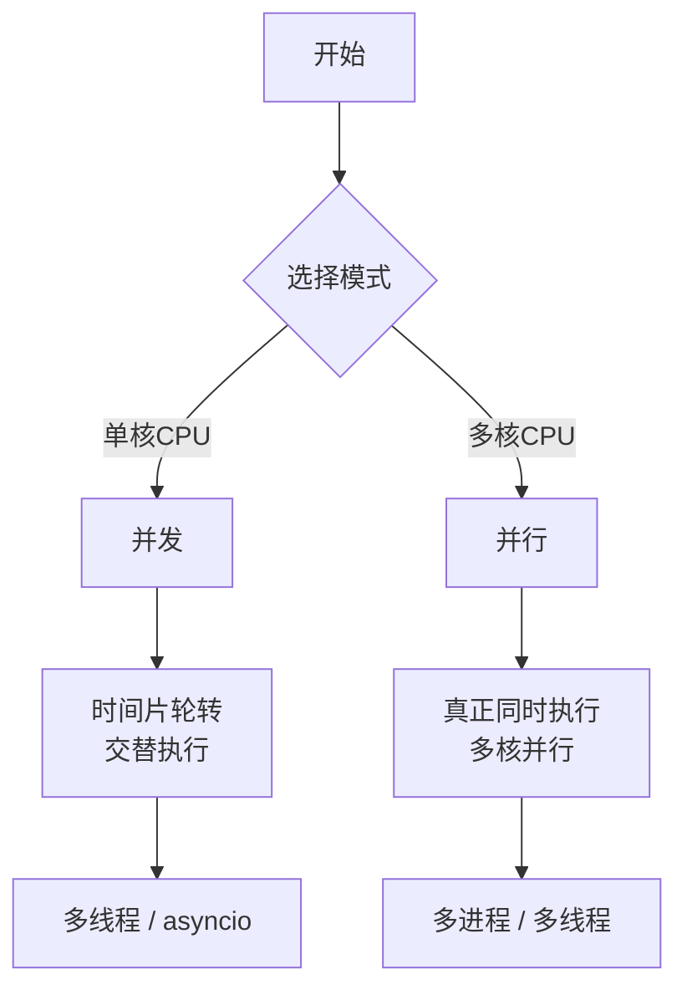
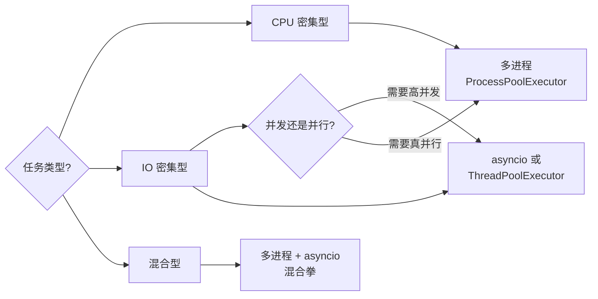
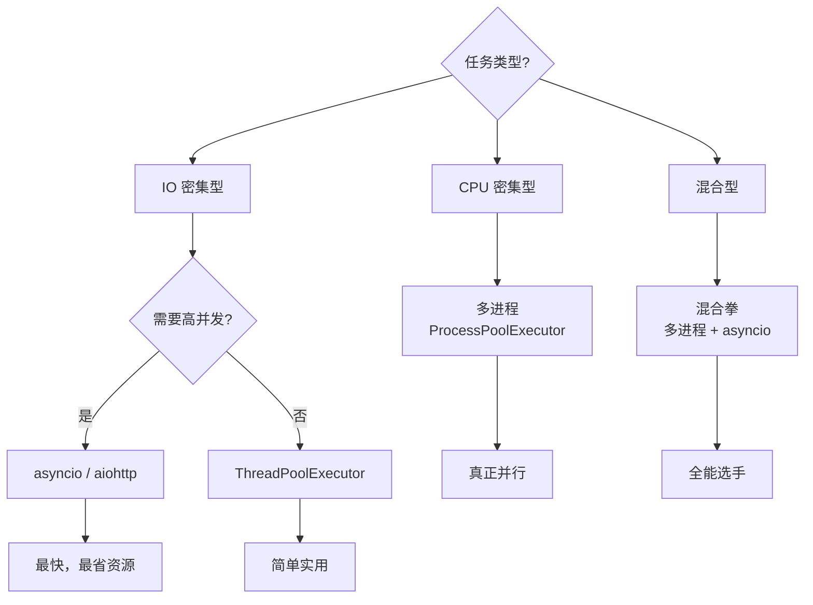
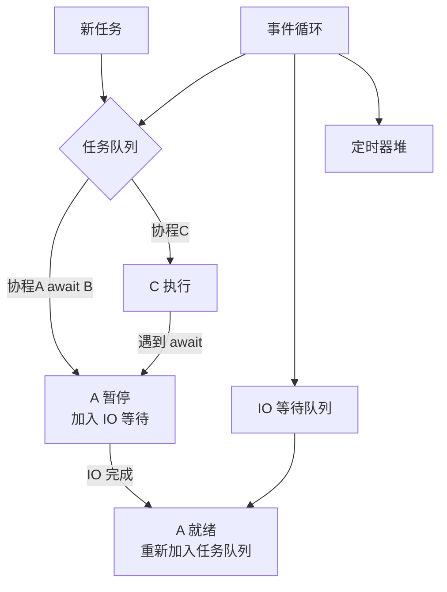
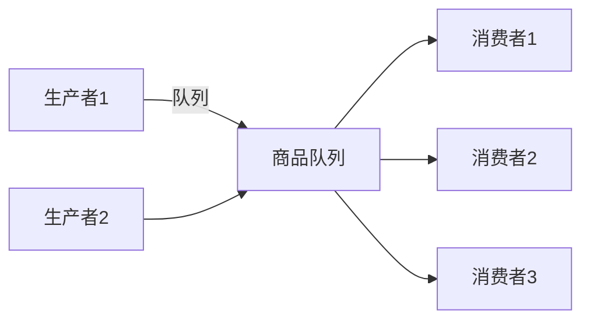

+++
title = "第18章 并发编程"
weight = 180
date = "2026-04-08T13:22:00+08:00"
type = "docs"
description = ""
isCJKLanguage = true
draft = false
+++

# 第 18 章：并发编程——让你的程序学会"一心多用"

> 想象一下，你是一家餐厅的厨师。以前你只能一次做一道菜——等水烧开的时候只能盯着锅发呆，等客人吃完才能去收拾桌子。这样的生活，想想都觉得窒息。并发编程，就是让你变成一个"分身术"高手——在等待的时候做别的事，多个工作同时推进，效率直接起飞。

Python 提供了三种主要的"分身术"：**多线程**、**多进程**和**异步编程**。这一章我们就来逐一解剖，看看它们的原理、使用方法和适用场景。

---

## 18.1 并发基础

### 18.1.1 并发 vs 并行 vs 异步

这三个概念，就像三胞胎，很多人都分不清谁是谁。

- **并发（Concurrency）**：同一个时间段内，多个任务都在推进。想象你在做饭——你把水壶放上灶台烧水，然后趁烧水的间隙去切菜。这就叫并发，本质上是**时间片轮转**，CPU 在不同任务之间快速切换，给你一种"同时进行"的感觉。

- **并行（Parallelism）**：真正的同时执行，需要多个 CPU 核心。比如你有两双手，左手炒菜右手切菜，两个动作真正同时发生。并行需要硬件支持——多核 CPU。

- **异步（Asynchrony）**：一种编程范式，核心是"不等"。发起一个任务后，不阻塞在这里，继续做别的事，等任务完成再回来处理结果。异步通常用**回调函数**或**Promise**或**async/await**来表达。



> **一个形象的比喻**：你（单核 CPU）在电脑上下载电影，同时听音乐。这是**并发**——因为 CPU 在两个任务之间快速切换，切换速度快到你感觉不到停顿。但如果你是多核 CPU，分别用两个核心同时下载和播放，那就是**并行**。

**关键区别**：
- 并发：一个 CPU，分时复用（假同时）
- 并行：多个 CPU，真正同时（真同时）
- 异步：一种编程方式，核心是"不等"

### 18.1.2 GIL（全局解释器锁）真相

GIL 是 Python 界最著名的"背锅侠"。

**什么是 GIL？**

GIL 的全称是 Global Interpreter Lock（全局解释器锁）。它是 CPython（最常用的 Python 解释器）内部的一个机制：在任意时刻，**只有一个线程在执行 Python 字节码**。即使你有多个线程，也只有一个能真正执行 Python 代码。

**为什么要有 GIL？**

Python 的内存管理不是线程安全的。引入 GIL 可以简化 CPython 的实现，避免复杂的锁机制带来的性能开销和 bug。简单来说，GIL 是 Python 为了"省事"和"安全"做出的一个取舍。

**GIL 的影响**：

```python
import threading
import time

counter = 0

def worker():
    global counter
    for _ in range(10_000_000):
        counter += 1  # 这个操作在 Python 内部其实不是原子的

# 创建两个线程
threads = [threading.Thread(target=worker) for _ in range(2)]
for t in threads:
    t.start()
for t in threads:
    t.join()

print(counter)  # 结果经常不是 20000000！GIL 导致的竞态条件
# 期望: 20000000
# 实际: 19945032（每次都不一样）
```

> **GIL 的误解澄清**：GIL 只影响**纯 Python 代码执行**，不影响 **IO 操作**（网络请求、文件读写）和**调用外部 C 库**（NumPy、Pandas 的核心计算都在 C 里，GIL 在调用 C 扩展时会释放）。

**GIL 的解决方案**：

- 如果是 **CPU 密集型**（数学计算、图像处理）：用**多进程**绕过 GIL
- 如果是 **IO 密集型**（网络请求、文件读写）：用**异步编程**或**多线程**（IO 时 GIL 会释放）

### 18.1.3 CPU 密集型 vs IO 密集型

这是选择并发方式的核心判断依据。

| 类型 | 特点 | 例子 | 推荐方案 |
|------|------|------|----------|
| **CPU 密集型** | 大量计算，CPU 是瓶颈 | 视频编码、机器学习、加密解密 | 多进程 |
| **IO 密集型** | 大量等待，CPU 闲置 | 网络请求、文件读写、API 调用 | 异步 / 多线程 |

**如何判断？**

```python
import time

# CPU 密集型：模拟大量计算
def cpu_bound():
    total = 0
    for i in range(10_000_000):
        total += i * i
    return total

# IO 密集型：模拟等待（sleep 代表网络/磁盘操作）
def io_bound():
    time.sleep(0.001)  # 模拟 1ms 的 IO 等待
    return "Done"

# 粗略判断方法：观察 CPU 使用率
# CPU 使用率 100% → CPU 密集型
# CPU 使用率很低但程序运行慢 → IO 密集型
```

### 18.1.4 适用场景选择



**选择指南**：

- **网络爬虫**：大量 HTTP 请求 → **asyncio + aiohttp**（最高效）
- **Web 服务**：处理请求 → **FastAPI / uvicorn**（异步生态）
- **数据处理/科学计算**：NumPy、Pandas → **多进程**（GIL 之外的计算）
- **GUI 应用**：保持界面响应 → **多线程**
- **批量图片处理**：CPU 密集 → **多进程**

---

## 18.2 多线程：threading 模块

### 18.2.1 Thread 创建（函数式 / 类继承）

线程是"轻量级"的执行单位。Python 的 `threading` 模块让你可以在同一个进程内创建多个线程。

**函数式创建**：

```python
import threading
import time

def cook(name, seconds):
    """模拟做饭"""
    print(f"[{name}] 开始做饭...")
    time.sleep(seconds)
    print(f"[{name}] 做好了！耗时 {seconds} 秒")

# 创建线程（函数式）
t1 = threading.Thread(target=cook, args=("厨师小李", 3))
t2 = threading.Thread(target=cook, args=("厨师小王", 2))

# 启动线程
t1.start()
t2.start()

# 等待线程结束
t1.join()
t2.join()

print("所有菜都做好了！")
# [厨师小李] 开始做饭...
# [厨师小王] 开始做饭...
# [厨师小王] 做好了！耗时 2 秒
# [厨师小李] 做好了！耗时 3 秒
# 所有菜都做好了！
```

**类继承式创建**：

```python
import threading

class CounterThread(threading.Thread):
    """自定义计数器线程"""
    
    def __init__(self, name, count):
        super().__init__()
        self.name = name
        self.count = count
        self.result = 0
    
    def run(self):
        """线程执行入口（必须是 run）"""
        print(f"[{self.name}] 开始计数到 {self.count}")
        for i in range(1, self.count + 1):
            self.result = i
        print(f"[{self.name}] 完成，最终值: {self.result}")

# 使用
t = CounterThread("计数线程", 5)
t.start()
t.join()

print(f"线程返回值: {t.result}")
# [计数线程] 开始计数到 5
# [计数线程] 完成，最终值: 5
# 线程返回值: 5
```

### 18.2.2 线程同步原语（Lock / RLock / Semaphore / Event / Condition）

多线程最大的问题是**共享资源访问**——两个线程同时改一个变量，就会乱套。同步原语就是用来解决这个问题的"纪律委员"。

**Lock（互斥锁）**：

```python
import threading

# 全局共享变量
counter = 0
# 创建锁
lock = threading.Lock()

def increment():
    global counter
    for _ in range(1000000):
        with lock:  # 自动获取/释放锁
            counter += 1

# 两个线程同时累加
t1 = threading.Thread(target=increment)
t2 = threading.Thread(target=increment)
t1.start(); t2.start()
t1.join(); t2.join()

print(counter)  # 2000000（没有锁的话结果会小于 2000000）
# 2000000
```

**RLock（可重入锁）**：

同一个线程可以多次获取同一个 RLock，不会死锁。Lock 则不行——同一个线程连续两次 `acquire()` 会卡死。

```python
import threading

rlock = threading.RLock()

def outer():
    print("外层函数")
    with rlock:
        print("外层获取了锁")
        inner()  # 内层也要同一把锁
        print("外层继续执行")

def inner():
    with rlock:  # 同一个线程再次获取同一把 RLock，不会卡死
        print("内层函数也获取了锁")

outer()
print("程序结束")
# 外层函数
# 外层获取了锁
# 内层函数也获取了锁
# 外层继续执行
# 程序结束
```

**Semaphore（信号量）**：

控制同时访问某个资源的线程数量。相当于一个"限流器"。

```python
import threading
import time

# 限制最多 3 个线程同时访问
semaphore = threading.Semaphore(3)

def access_database(id):
    print(f"[用户 {id}] 等待数据库连接...")
    with semaphore:
        print(f"[用户 {id}] 获得连接，开始查询...")
        time.sleep(2)  # 模拟查询
        print(f"[用户 {id}] 查询完成，释放连接")

# 模拟 10 个用户同时请求
threads = [threading.Thread(target=access_database, args=(i,)) for i in range(10)]
for t in threads:
    t.start()
for t in threads:
    t.join()

print("所有用户查询完成！")
# 只有 3 个用户能同时查询，其他等待
```

**Event（事件）**：

线程之间的"信号灯"，一个线程等待另一个线程的通知。

```python
import threading
import time

event = threading.Event()

def waiter(name, wait_time):
    print(f"[{name}] 正在等待信号...")
    # 等待事件被设置（带超时）
    is_set = event.wait(timeout=wait_time)
    if is_set:
        print(f"[{name}] 收到信号，开始行动！")
    else:
        print(f"[{name}] 等待超时（{wait_time} 秒），自己先行动了")

def setter():
    time.sleep(3)
    print("[信号发送者] 发送信号！")
    event.set()

# 线程1：等待信号
t1 = threading.Thread(target=waiter, args=("急性子线程", 5))
# 线程2：等待信号
t2 = threading.Thread(target=waiter, args=("慢性子线程", 10))
# 线程3：发送信号
t3 = threading.Thread(target=setter)

t1.start(); t2.start(); t3.start()
t1.join(); t2.join(); t3.join()
# [急性子线程] 正在等待信号...
# [慢性子线程] 正在等待信号...
# [信号发送者] 发送信号！
# [急性子线程] 收到信号，开始行动！
# [慢性子线程] 收到信号，开始行动！
```

**Condition（条件变量）**：

更复杂的同步机制，线程可以等待某个条件满足后才继续。

```python
import threading
import time

buffer = []
buffer_size = 5
condition = threading.Condition()

def producer():
    for i in range(10):
        with condition:
            while len(buffer) >= buffer_size:
                condition.wait()  # 缓冲区满，等待消费
            item = f"产品-{i}"
            buffer.append(item)
            print(f"[生产者] 放入 {item}，缓冲区: {len(buffer)}")
            condition.notify()  # 通知消费者
        time.sleep(0.5)

def consumer(name):
    for _ in range(5):
        with condition:
            while len(buffer) == 0:
                condition.wait()  # 缓冲区空，等待生产
            item = buffer.pop(0)
            print(f"[消费者 {name}] 取出 {item}，缓冲区: {len(buffer)}")
            condition.notify()  # 通知生产者
        time.sleep(1)

t_producer = threading.Thread(target=producer)
t_consumer1 = threading.Thread(target=consumer, args=("A",))
t_consumer2 = threading.Thread(target=consumer, args=("B",))
t_producer.start()
t_consumer1.start()
t_consumer2.start()
t_producer.join(); t_consumer1.join(); t_consumer2.join()
print("生产和消费完成！")
```

### 18.2.3 死锁的成因与避免

死锁，就是两个或多个线程互相持有对方需要的锁，谁也不肯放手，形成一个"等来等去"的僵局。

**经典的死锁场景**：

```python
import threading
import time

# 两把锁
lock_a = threading.Lock()
lock_b = threading.Lock()

def thread_1():
    """线程1：先拿A，再拿B"""
    with lock_a:
        print("线程1: 拿到了锁A")
        time.sleep(0.1)  # 模拟一些操作
        with lock_b:
            print("线程1: 拿到了锁B")
            print("线程1: 完成任务！")

def thread_2():
    """线程2：先拿B，再拿A"""
    with lock_b:
        print("线程2: 拿到了锁B")
        time.sleep(0.1)
        with lock_a:
            print("线程2: 拿到了锁A")
            print("线程2: 完成任务！")

# 危险！如果线程1拿到A时，线程2拿到了B，就会死锁
t1 = threading.Thread(target=thread_1)
t2 = threading.Thread(target=thread_2)
t1.start()
t2.start()
t1.join(timeout=3)
t2.join(timeout=3)

if t1.is_alive() or t2.is_alive():
    print("💥 检测到死锁！程序卡住了！")
# 可能输出：
# 线程1: 拿到了锁A
# 线程2: 拿到了锁B
# 💥 检测到死锁！程序卡住了！
```

**避免死锁的策略**：

```python
import threading
import time

lock_a = threading.Lock()
lock_b = threading.Lock()

def thread_1_fixed():
    """固定策略：始终按固定顺序获取锁"""
    with lock_a:
        print("线程1: 拿到了锁A")
        time.sleep(0.1)
        with lock_b:
            print("线程1: 拿到了锁B（按顺序拿，永远不死锁）")
            print("线程1: 完成任务！")

def thread_2_fixed():
    """固定策略：也按同样顺序拿"""
    with lock_a:  # 永远先拿 A
        print("线程2: 拿到了锁A")
        time.sleep(0.1)
        with lock_b:
            print("线程2: 拿到了锁B")
            print("线程2: 完成任务！")

t1 = threading.Thread(target=thread_1_fixed)
t2 = threading.Thread(target=thread_2_fixed)
t1.start(); t2.start()
t1.join(); t2.join()
print("程序正常结束！")
# 线程1: 拿到了锁A
# 线程1: 拿到了锁B（按顺序拿，永远不死锁）
# 线程1: 完成任务！
# 线程2: 拿到了锁A
# 线程2: 拿到了锁B
# 线程2: 完成任务！
# 程序正常结束！
```

> **死锁四大条件**（要避免死锁，只需破坏任意一个）：
> 1. **互斥**：资源不能共享
> 2. **持有并等待**：持有资源的同时请求新资源
> 3. **不可抢占**：资源不能被强行夺走
> 4. **循环等待**：形成资源请求环路
>
> 解决死锁的常用方法：**固定加锁顺序**，或**使用 RLock 替代 Lock**，或**设置超时**。

### 18.2.4 ThreadPoolExecutor（线程池）

每次创建和销毁线程都有开销。线程池就是**提前创建好一批线程，用完了再还回去**，避免频繁创建销毁。

```python
import concurrent.futures
import time

def task(n):
    """模拟耗时的 IO 任务"""
    time.sleep(1)
    return f"任务 {n} 完成"

# 创建线程池（最多 3 个线程）
with concurrent.futures.ThreadPoolExecutor(max_workers=3) as executor:
    # 提交多个任务
    futures = [executor.submit(task, i) for i in range(6)]
    
    # 获取结果（按完成顺序）
    for future in concurrent.futures.as_completed(futures):
        result = future.result()
        print(result)

print("所有任务完成！")
# 任务 1 完成
# 任务 0 完成
# 任务 2 完成
# 任务 3 完成
# 任务 4 完成
# 任务 5 完成
# （每批 3 个并行，所以约 2 秒完成）
```

**线程池的 map 用法**（更简洁）：

```python
import concurrent.futures

def square(n):
    return n * n

with concurrent.futures.ThreadPoolExecutor(max_workers=4) as executor:
    results = executor.map(square, [1, 2, 3, 4, 5])
    print(list(results))
# [1, 4, 9, 16, 25]
```

### 18.2.5 threading.local（线程局部存储）

每个线程都有自己独立的数据副本，互不干扰。

```python
import threading
import time

# 创建线程局部存储
local_data = threading.local()

def process(name):
    local_data.value = f"{name}的数据"
    print(f"[{name}] 设置数据为: {local_data.value}")
    time.sleep(0.1)
    print(f"[{name}] 读取数据: {local_data.value}")

t1 = threading.Thread(target=process, args=("线程A",))
t2 = threading.Thread(target=process, args=("线程B",))
t1.start(); t2.start()
t1.join(); t2.join()
# [线程A] 设置数据为: 线程A的数据
# [线程B] 设置数据为: 线程B的数据
# [线程A] 读取数据: 线程A的数据
# [线程B] 读取数据: 线程B的数据
# 线程A 和线程B 的数据完全隔离！
```

**典型应用场景**：在 Web 框架中存储每个请求的上下文（用户信息、请求 ID 等），Flask 的 `g` 对象就是基于 `threading.local` 实现的。

### 18.2.6 守护线程（daemon thread）

守护线程是"背景工作人员"，当所有非守护线程结束时，守护线程会被**自动终止**，不等你完成手头的工作。

```python
import threading
import time

def background_task():
    """后台日志记录任务"""
    print("[守护线程] 开始记录日志...")
    for i in range(10):
        time.sleep(1)
        print(f"[守护线程] 日志记录 {i+1}")
    print("[守护线程] 日志记录完成！")

def main_task():
    """主任务"""
    print("[主线程] 启动后台守护线程...")
    daemon = threading.Thread(target=background_task, daemon=True)
    daemon.start()
    print("[主线程] 主任务完成，程序退出")
    # 主线程结束，守护线程会被强制终止

main_task()
print("程序退出")
# [主线程] 启动后台守护线程...
# [主线程] 主任务完成，程序退出
# 程序退出
# [守护线程] 开始记录日志...
# 日志记录 1
# 程序退出了，守护线程也被强制结束
```

> **守护线程的典型用途**：日志记录、监控心跳、自动保存等"后台服务"。主程序退出时，它们应该跟着一起退出，不用等它们"收尾"。

### 18.2.7 GIL 对多线程的影响

前面已经说过，GIL 让同一时刻只有一个线程执行 Python 字节码。但这不是说多线程完全没用：

```python
import threading
import time

# 模拟 IO 密集型任务
def io_task(n):
    time.sleep(0.001)
    return n

# 模拟 CPU 密集型任务
def cpu_task(n):
    total = 0
    for i in range(100000):
        total += i
    return total

# IO 密集型：多线程有用（IO 时 GIL 会释放）
start = time.time()
threads = [threading.Thread(target=io_task, args=(i,)) for i in range(100)]
for t in threads:
    t.start()
for t in threads:
    t.join()
print(f"IO 密集型（100线程）耗时: {time.time() - start:.3f}秒")
# IO 密集型（100线程）耗时: 0.022秒（并发效果明显）
```

```python
import threading
import time

# CPU 密集型：多线程反而更慢！
def cpu_task(n):
    total = 0
    for i in range(1000000):
        total += i
    return total

# 单线程
start = time.time()
cpu_task(0)
single_time = time.time() - start
print(f"单线程耗时: {single_time:.3f}秒")

# 多线程（受 GIL 限制，不会更快）
import threading
start = time.time()
threads = [threading.Thread(target=cpu_task, args=(i,)) for i in range(4)]
for t in threads:
    t.start()
for t in threads:
    t.join()
multi_time = time.time() - start
print(f"4线程耗时: {multi_time:.3f}秒")
# 单线程耗时: 0.287秒
# 4线程耗时: 0.612秒（更慢！线程切换开销）
```

**结论**：
- **IO 密集型**：多线程 + GIL 释放 = 有用
- **CPU 密集型**：多线程 + GIL 存在 = 基本无用，换多进程

---

## 18.3 多进程：multiprocessing 模块

### 18.3.1 Process 创建

多进程是绕过 GIL 的终极方案——每个进程有独立的 Python 解释器，独立的 GIL，各自为战。

**函数式创建**：

```python
import multiprocessing
import time

def worker(name, seconds):
    print(f"[进程{name}] 开始工作...")
    time.sleep(seconds)
    print(f"[进程{name}] 工作完成！")
    return name

if __name__ == "__main__":
    # 创建进程
    p1 = multiprocessing.Process(target=worker, args=("A", 2))
    p2 = multiprocessing.Process(target=worker, args=("B", 1))
    
    p1.start()  # 启动
    p2.start()
    
    p1.join()   # 等待结束
    p2.join()
    
    print("所有进程结束")
# [进程A] 开始工作...
# [进程B] 开始工作...
# [进程B] 工作完成！
# [进程A] 工作完成！
# 所有进程结束
```

> ⚠️ **重要**：`multiprocessing` 在 Windows 上必须放在 `if __name__ == "__main__":` 下，否则会出问题。

### 18.3.2 进程间通信（Queue / Pipe / 共享内存）

进程之间内存隔离，不能直接共享变量。需要通过**进程间通信（IPC）**机制。

**Queue（队列）**：

```python
import multiprocessing

def producer(queue):
    """生产者：往队列里放数据"""
    for i in range(5):
        queue.put(f"消息 {i}")
    queue.put(None)  # 发送结束信号

def consumer(queue):
    """消费者：从队列里取数据"""
    while True:
        item = queue.get()
        if item is None:  # 收到结束信号
            break
        print(f"收到: {item}")

if __name__ == "__main__":
    queue = multiprocessing.Queue()
    
    p_producer = multiprocessing.Process(target=producer, args=(queue,))
    p_consumer = multiprocessing.Process(target=consumer, args=(queue,))
    
    p_producer.start()
    p_consumer.start()
    
    p_producer.join()
    p_consumer.join()
    
    print("通信完成！")
# 收到: 消息 0
# 收到: 消息 1
# 收到: 消息 2
# 收到: 消息 3
# 收到: 消息 4
# 通信完成！
```

**Pipe（管道）**：

```python
import multiprocessing

def sender(conn):
    """发送者"""
    conn.send("你好，接收者！")
    conn.send([1, 2, 3])
    conn.close()  # 发送完毕，关闭连接

if __name__ == "__main__":
    parent_conn, child_conn = multiprocessing.Pipe()
    
    p = multiprocessing.Process(target=sender, args=(child_conn,))
    p.start()
    
    print("接收:", parent_conn.recv())  # 阻塞等待
    print("接收:", parent_conn.recv())
    
    p.join()
# 接收: 你好，接收者！
# 接收: [1, 2, 3]
```

**共享内存**：

```python
import multiprocessing

def worker(shared_value, shared_array):
    """修改共享内存"""
    shared_value.value = 42
    shared_array[0] = 999

if __name__ == "__main__":
    # 创建共享内存
    shared_value = multiprocessing.Value('i', 0)  # 整数
    shared_array = multiprocessing.Array('i', [0, 0, 0])  # 整数数组
    
    p = multiprocessing.Process(target=worker, args=(shared_value, shared_array))
    p.start()
    p.join()
    
    print(f"共享值: {shared_value.value}")
    print(f"共享数组: {list(shared_array)}")
# 共享值: 42
# 共享数组: [999, 0, 0]
```

### 18.3.3 ProcessPoolExecutor（进程池）

和多线程一样，进程也有池化管理的高级接口。

```python
import concurrent.futures
import time

def cpu_intensive(n):
    """模拟 CPU 密集型任务"""
    total = sum(i * i for i in range(10_000_000))
    return f"任务 {n} 完成，结果末位: {total % 10}"

if __name__ == "__main__":
    start = time.time()
    
    # 使用进程池（4 个进程）
    with concurrent.futures.ProcessPoolExecutor(max_workers=4) as executor:
        futures = [executor.submit(cpu_intensive, i) for i in range(8)]
        
        for future in concurrent.futures.as_completed(futures):
            print(future.result())
    
    print(f"总耗时: {time.time() - start:.2f}秒")
# 任务 0 完成，结果末位: 0
# 任务 1 完成，结果末位: 5
# ...（8 个任务，4 进程并行，约 2 批完成）
# 总耗时: 2.45秒
```

### 18.3.4 进程 vs 线程的选择

| 维度 | 多线程 | 多进程 |
|------|--------|--------|
| 内存 | 共享本进程内存，轻量 | 独立内存，较重量 |
| GIL | 受 GIL 限制 | 独立 GIL，真正并行 |
| 适用场景 | IO 密集型 | CPU 密集型 |
| 通信 | 容易（共享内存） | 复杂（需要 IPC） |
| 稳定性 | 一个崩溃可能影响其他 | 一个崩溃不影响其他 |
| 创建成本 | 低 | 高 |



### 18.3.5 进程间同步（Lock / Semaphore / Event）

和线程一样，多进程也有同步原语，通过 `multiprocessing` 模块访问。

```python
import multiprocessing

def increment(shared_counter, lock, iterations):
    for _ in range(iterations):
        with lock:
            shared_counter.value += 1

if __name__ == "__main__":
    # 注意：Lock 不能直接传递给 Pool，需要用 Manager 创建
    manager = multiprocessing.Manager()
    lock = manager.Lock()
    shared_counter = manager.Value('i', 0)  # 共享内存整数
    
    with multiprocessing.Pool(4) as pool:
        pool.starmap(increment, [(shared_counter, lock, 500000) for _ in range(4)])
    
    print(f"计数器值: {shared_counter.value}")  # 正确: 2000000
    # 2000000
```

### 18.3.6 进程池管理（Pool）

`multiprocessing.Pool` 是更底层的进程池管理接口，提供了更多控制能力。

```python
import multiprocessing

def square(n):
    return n * n

if __name__ == "__main__":
    with multiprocessing.Pool(processes=4) as pool:
        # map：顺序返回结果
        results = pool.map(square, [1, 2, 3, 4, 5])
        print("map 结果:", results)
        
        # apply_async：异步提交单个任务
        result = pool.apply_async(square, (10,))
        print("apply_async 结果:", result.get())
        
        # map_async：异步 map
        async_result = pool.map_async(square, [1, 2, 3])
        print("map_async 结果:", async_result.get())
        
        # starmap：处理多参数
        def add(a, b):
            return a + b
        results = pool.starmap(add, [(1, 2), (3, 4), (5, 6)])
        print("starmap 结果:", results)
        
    print("进程池关闭")
# map 结果: [1, 4, 9, 16, 25]
# apply_async 结果: 100
# map_async 结果: [1, 4, 9]
# starmap 结果: [3, 7, 11]
# 进程池关闭
```

**Pool 的回调函数**：

```python
import multiprocessing
import time

def heavy_compute(n):
    time.sleep(1)
    return n * n

def print_result(result):
    print(f"任务完成，结果: {result}")

if __name__ == "__main__":
    with multiprocessing.Pool(3) as pool:
        for i in range(3):
            pool.apply_async(heavy_compute, (i,), callback=print_result)
        
        pool.close()
        pool.join()
        print("所有任务完成")
# 任务完成，结果: 0
# 任务完成，结果: 1
# 任务完成，结果: 4
# 所有任务完成
```

### 18.3.7 进程间对象传递（pickle 序列化）

进程间通信传递的对象，必须能被**序列化（pickle）**。Python 的大多数对象都可以 pickle，但有些不行。

```python
import multiprocessing
import pickle

class MyClass:
    def __init__(self, value):
        self.value = value
    def __repr__(self):
        return f"MyClass({self.value})"

def worker(obj):
    print(f"收到对象: {obj}")
    obj.value *= 2
    return obj

if __name__ == "__main__":
    obj = MyClass(10)
    
    # pickle 序列化过程
    serialized = pickle.dumps(obj)
    print(f"序列化后大小: {len(serialized)} 字节")
    
    # 反序列化
    deserialized = pickle.loads(serialized)
    print(f"反序列化: {deserialized}")
    
    # 通过 Pool 传递（自动 pickle）
    with multiprocessing.Pool(1) as pool:
        result = pool.apply(worker, (obj,))
        print(f"返回的对象: {result}")
# 序列化后大小: 69 字节
# 反序列化: MyClass(10)
# 收到对象: MyClass(10)
# 返回的对象: MyClass(20)
```

**不能 pickle 的对象**：

- Lambda 函数
- 闭包中的局部变量
- 某些 C 扩展对象
- 生成器

---

## 18.4 异步编程：asyncio

### 18.4.1 事件循环（asyncio.run()）

事件循环是异步编程的"总指挥"，负责调度协程、管理 IO 事件、定时器等。

```python
import asyncio

async def main():
    print("Hello!")
    await asyncio.sleep(1)
    print("World!")

# Python 3.7+ 推荐用法
asyncio.run(main())
# Hello!
# World!
```

`asyncio.run()` 做了三件事：
1. 创建新的事件循环
2. 运行协程直到完成
3. 关闭事件循环

**事件循环的原理**：



### 18.4.2 async / await 语法

`async` 定义一个**协程函数**，`await` 等待一个**可等待对象**（协程、Task 或 Future）。

```python
import asyncio

async def say(what, delay):
    """一个协程函数"""
    await asyncio.sleep(delay)  # 等待，不会阻塞事件循环
    print(what)

async def main():
    # 并发执行三个协程
    await asyncio.gather(
        say("第1句", 3),
        say("第2句", 1),
        say("第3句", 2),
    )

asyncio.run(main())
# 第2句（1秒后）
# 第3句（2秒后）
# 第1句（3秒后）
# 总耗时约 3 秒（而不是 6 秒）
```

**await 的本质**：

```python
import asyncio

async def step1():
    print("步骤1：洗菜")
    await asyncio.sleep(0.5)
    print("步骤1完成：菜洗好了")

async def step2():
    print("步骤2：切菜")
    await asyncio.sleep(0.3)
    print("步骤2完成：菜切好了")

async def cook():
    await step1()  # 等洗菜完成
    await step2()  # 等切菜完成
    print("开始炒菜！")

# 串行：总耗时 0.8 秒
async def cook_sequential():
    await cook()

# 实际上 step1 和 step2 可以并行
async def cook_parallel():
    await asyncio.gather(step1(), step2())  # 同时进行
    print("开始炒菜！")
```

### 18.4.3 协程函数与协程对象

协程函数用 `async def` 定义，调用它会返回一个**协程对象**。

```python
import asyncio

# 协程函数
async def greet():
    return "Hello, World!"

# 调用协程函数，返回协程对象
coro = greet()
print(type(coro))  # <class 'coroutine'>

# 运行协程
result = asyncio.run(coro)
print(result)  # Hello, World!
```

**协程 vs 生成器**：

虽然看起来像，但协程和生成器是不同的概念。协程是用于**并发编程**的，而生成器是用于**惰性求值**的。不过在 Python 的历史发展中，它们确实有过一些交集（`@asyncio.coroutine` 装饰器现在已经废弃）。

```python
import asyncio

async def coro():
    """这是一个协程"""
    return "协程"

def gen():
    """这是一个生成器"""
    yield 1
    yield 2

print(asyncio.iscoroutinefunction(coro))  # True（协程函数）
print(asyncio.iscoroutinefunction(gen))   # False（生成器函数）

print(asyncio.iscoroutine(coro()))  # True（协程对象）
print(asyncio.iscoroutine(gen()))   # False（生成器对象）
```

### 18.4.4 Task（任务调度）

Task 是对协程的封装，用于**调度**协程的执行，让它可以在事件循环中"后台"运行。

```python
import asyncio

async def task_work(n):
    await asyncio.sleep(n)
    return f"任务 {n} 完成"

async def main():
    # 创建任务（立即调度执行）
    task1 = asyncio.create_task(task_work(2))
    task2 = asyncio.create_task(task_work(1))
    
    print("任务已创建，开始等待...")
    
    # 等待任务完成
    result1 = await task1
    result2 = await task2
    
    print(result1)
    print(result2)

asyncio.run(main())
# 任务已创建，开始等待...
# 任务 1 完成
# 任务 2 完成
# 总耗时约 2 秒（并行）
```

**Task 的取消**：

```python
import asyncio

async def long_task():
    try:
        for i in range(100):
            print(f"工作中... {i}%")
            await asyncio.sleep(0.1)
        return "完成"
    except asyncio.CancelledError:
        print("任务被取消了！")
        raise  # 重新抛出取消异常

async def main():
    task = asyncio.create_task(long_task())
    
    await asyncio.sleep(0.5)  # 让它工作一会儿
    task.cancel()  # 取消任务
    
    try:
        await task
    except asyncio.CancelledError:
        print("确认：任务已被取消")

asyncio.run(main())
# 工作中... 0%
# 工作中... 1%
# 工作中... 2%
# 工作中... 3%
# 工作中... 4%
# 任务被取消了！
# 确认：任务已被取消
```

### 18.4.5 Future（未来对象）

Future 是一个**占位符**，代表一个"将来会有结果"的操作。它是协程和 Task 的底层机制。

```python
import asyncio

async def set_after(fut, value, delay):
    """模拟一个异步操作，延迟设置 Future 的值"""
    await asyncio.sleep(delay)
    fut.set_result(value)

async def main():
    # 创建一个 Future
    loop = asyncio.get_running_loop()
    fut = loop.create_future()
    
    # 调度在 1 秒后设置 Future 的值
    asyncio.create_task(set_after(fut, "操作完成！", 1))
    
    # 等待 Future 完成（get_result）
    result = await fut
    print(f"Future 结果: {result}")

asyncio.run(main())
# Future 结果: 操作完成！
```

> **什么时候直接用 Future？**：通常不需要直接操作 Future，用 `asyncio.create_task()` 创建 Task 就行了。但在写底层库或需要更多控制时，Future 更灵活。

### 18.4.6 异步上下文管理器（async with）

`async with` 用于**异步上下文管理器**，在进入和退出上下文时执行异步操作。

```python
import asyncio

class AsyncResource:
    """模拟一个需要异步获取/释放的资源"""
    
    async def __aenter__(self):
        print("获取资源中...")
        await asyncio.sleep(0.5)  # 模拟异步获取
        print("资源获取完成！")
        return self
    
    async def __aexit__(self, exc_type, exc_val, exc_tb):
        print("释放资源中...")
        await asyncio.sleep(0.5)  # 模拟异步释放
        print("资源释放完成！")
        return False  # 不吞掉异常

async def use_resource():
    async with AsyncResource() as resource:
        print("使用资源中...")
        await asyncio.sleep(1)
        print("资源使用完毕！")

asyncio.run(use_resource())
# 获取资源中...
# 资源获取完成！
# 使用资源中...
# 资源使用完毕！
# 释放资源中...
# 资源释放完成！
```

### 18.4.7 异步迭代器与异步生成器（async for）

`async for` 用于遍历**异步可迭代对象**，每个迭代都是异步的。

```python
import asyncio

class AsyncCounter:
    """异步迭代器：从 N 倒数到 1"""
    
    def __init__(self, n):
        self.n = n
        self.current = n
    
    def __aiter__(self):
        return self
    
    async def __anext__(self):
        if self.current <= 0:
            raise StopAsyncIteration
        await asyncio.sleep(0.3)  # 模拟异步操作
        value = self.current
        self.current -= 1
        return value

async def main():
    async for i in AsyncCounter(5):
        print(f"倒数: {i}")

asyncio.run(main())
# 倒数: 5
# 倒数: 4
# 倒数: 3
# 倒数: 2
# 倒数: 1
```

**异步生成器**（更简洁）：

```python
import asyncio

async def async_range(start, stop):
    """异步生成器"""
    for i in range(start, stop):
        await asyncio.sleep(0.2)
        yield i

async def main():
    async for i in async_range(3, 8):
        print(i)

asyncio.run(main())
# 3
# 4
# 5
# 6
# 7
```

### 18.4.8 asyncio 队列（Queue / PriorityQueue / LifoQueue）

asyncio 也有自己的队列实现，用于协程间的通信。

```python
import asyncio

async def producer(queue, name):
    """生产者"""
    for i in range(5):
        await queue.put(f"{name}: 产品 {i}")
        print(f"[{name}] 生产了: 产品 {i}")
        await asyncio.sleep(0.5)
    await queue.put(None)  # 结束信号

async def consumer(queue, name):
    """消费者"""
    while True:
        item = await queue.get()
        if item is None:
            break
        print(f"[{name}] 消费了: {item}")
        await asyncio.sleep(0.3)
        queue.task_done()

async def main():
    queue = asyncio.Queue()
    
    # 启动生产者和消费者
    await asyncio.gather(
        producer(queue, "工厂A"),
        producer(queue, "工厂B"),
        consumer(queue, "商店"),
    )

asyncio.run(main())
# [工厂A] 生产了: 产品 0
# [工厂B] 生产了: 产品 0
# [商店] 消费了: 工厂A: 产品 0
# ...
```

**优先级队列**：

```python
import asyncio
import random

async def priority_demo():
    queue = asyncio.PriorityQueue()
    
    # 添加带优先级的任务
    tasks = [
        (3, "低优先级"),
        (1, "紧急任务"),
        (2, "普通任务"),
    ]
    
    for priority, task in tasks:
        await queue.put((priority, task))
    
    # 按优先级取出
    while not queue.empty():
        priority, task = await queue.get()
        print(f"[优先级 {priority}] {task}")

asyncio.run(priority_demo())
# [优先级 1] 紧急任务
# [优先级 2] 普通任务
# [优先级 3] 低优先级
```

### 18.4.9 TaskGroup（Python 3.11+）

Python 3.11 引入了 `TaskGroup`，是更优雅的任务管理方式，无需手动 `create_task`。

```python
import asyncio

async def task(name, delay):
    await asyncio.sleep(delay)
    print(f"{name} 完成")

async def main():
    async with asyncio.TaskGroup() as tg:
        tg.create_task(task("任务A", 2))
        tg.create_task(task("任务B", 1))
        tg.create_task(task("任务C", 3))
    # 所有任务在此处已完成
    print("所有任务完成！")

asyncio.run(main())
# 任务B 完成
# 任务A 完成
# 任务C 完成
# 所有任务完成！
```

**with 结构自动等待**：`TaskGroup` 会在退出 `async with` 块时等待所有任务完成，比手动管理 Task 更简洁，也更安全（自动处理异常）。

### 18.4.10 asyncio 常用函数

```python
import asyncio

# asyncio.sleep - 异步睡眠（不阻塞事件循环）
async def demo_sleep():
    print("开始睡 1 秒...")
    await asyncio.sleep(1)
    print("醒了！")

# asyncio.gather - 并发执行多个协程
async def demo_gather():
    results = await asyncio.gather(
        asyncio.sleep(2, result="A"),
        asyncio.sleep(1, result="B"),
        asyncio.sleep(3, result="C"),
    )
    print(results)  # ['A', 'B', 'C']

# asyncio.wait - 等待任务完成，支持超时
async def demo_wait():
    task1 = asyncio.create_task(asyncio.sleep(5))
    task2 = asyncio.create_task(asyncio.sleep(2))
    
    done, pending = await asyncio.wait(
        [task1, task2],
        timeout=3  # 3 秒后返回
    )
    
    print(f"完成: {len(done)} 个")
    print(f"等待中: {len(pending)} 个")
    
    for t in pending:
        t.cancel()

# asyncio.shield - 保护等待中的任务不被取消
async def demo_shield():
    async def inner():
        await asyncio.sleep(10)
    
    task = asyncio.create_task(inner())
    
    try:
        await asyncio.wait_for(task, timeout=1)
    except asyncio.TimeoutError:
        print("外层超时，但任务被保护了...")
        # inner() 仍在后台运行
    
    # 如果不用 shield，inner() 也会被取消
```

```python
import asyncio

async def main():
    # 完整示例：gather + sleep
    async def fetch(url):
        await asyncio.sleep(0.5)  # 模拟网络请求
        return f"获取: {url}"
    
    urls = ["a.com", "b.com", "c.com", "d.com"]
    
    start = asyncio.get_running_loop().time()
    
    # 串行：需要 4 * 0.5 = 2 秒
    # results = [await fetch(url) for url in urls]
    
    # 并发：只需要 0.5 秒
    results = await asyncio.gather(*[fetch(url) for url in urls])
    
    elapsed = asyncio.get_running_loop().time() - start
    
    for r in results:
        print(r)
    print(f"总耗时: {elapsed:.2f}秒")

asyncio.run(main())
# 获取: a.com
# 获取: b.com
# 获取: c.com
# 获取: d.com
# 总耗时: 0.50秒
```

---

## 18.5 异步 HTTP 请求

### 18.5.1 aiohttp（异步 HTTP 客户端 / 服务器）

`aiohttp` 是 Python 最流行的异步 HTTP 库，既能做客户端发请求，也能做服务器。

**客户端用法**：

```python
import asyncio
import aiohttp

async def fetch_all(session, urls):
    """并发获取多个 URL"""
    async def fetch_one(url):
        async with session.get(url) as response:
            return await response.text()
    
    async with aiohttp.ClientSession() as session:
        tasks = [fetch_one(url) for url in urls]
        return await asyncio.gather(*tasks)

async def main():
    urls = [
        "https://httpbin.org/delay/1",
        "https://httpbin.org/delay/2",
        "https://httpbin.org/delay/1",
    ]
    
    start = asyncio.get_event_loop().time()
    
    async with aiohttp.ClientSession() as session:
        results = await asyncio.gather(*[
            session.get(url) for url in urls
        ])
        for resp in results:
            print(f"状态码: {resp.status}")
    
    elapsed = asyncio.get_event_loop().time() - start
    print(f"总耗时（并发）: {elapsed:.2f}秒")
    # 如果串行：4秒；并发：约2秒

asyncio.run(main())
```

**aiohttp 服务器**：

```python
import asyncio
from aiohttp import web

async def hello(request):
    """处理 GET / 请求"""
    name = request.match_info.get('name', 'World')
    return web.Response(text=f'Hello, {name}!')

async def post_handler(request):
    """处理 POST /data"""
    data = await request.json()
    return web.json_response({'received': data})

app = web.Application()
app.router.add_get('/', hello)
app.router.add_get('/hello/{name}', hello)
app.router.add_post('/data', post_handler)

if __name__ == '__main__':
    web.run_app(app, host='127.0.0.1', port=8080)
```

### 18.5.2 httpx（同步 + 异步双模式）

`httpx` 是后起之秀，API 类似 `requests`，但同时支持同步和异步。

**异步用法**：

```python
import asyncio
import httpx

async def fetch_with_httpx():
    urls = [
        "https://httpbin.org/get",
        "https://httpbin.org/ip",
        "https://httpbin.org/headers",
    ]
    
    async with httpx.AsyncClient(timeout=10.0) as client:
        tasks = [client.get(url) for url in urls]
        responses = await asyncio.gather(*tasks)
        
        for resp in responses:
            print(f"{resp.url}: {resp.status_code}")

asyncio.run(fetch_with_httpx())
# https://httpbin.org/get: 200
# https://httpbin.org/ip: 200
# https://httpbin.org/headers: 200
```

**同步用法**（切换方便）：

```python
import httpx

# 完全一样的 API，但阻塞
response = httpx.get("https://httpbin.org/get")
print(response.json())
```

> **aiohttp vs httpx**：
> - 如果你只需要异步客户端：**httpx** 更好，API 友好
> - 如果你需要异步**服务器**：选 **aiohttp**
> - 如果你需要完整的异步 Web 框架：选 **FastAPI**（底层用 httpx 或 aiohttp）

---

## 18.6 异步数据库

### 18.6.1 aiomysql（异步 MySQL）

`aiomysql` 让 MySQL 操作变成异步的，释放数据库等待时的线程。

```python
import asyncio
import aiomysql

async def main():
    # 创建连接池
    pool = await aiomysql.create_pool(
        host='localhost',
        port=3306,
        user='root',
        password='password',
        db='test',
        minsize=1,
        maxsize=10
    )
    
    async with pool.acquire() as conn:
        async with conn.cursor() as cur:
            # 查询
            await cur.execute("SELECT 1, 2, 3")
            result = await cur.fetchall()
            print("查询结果:", result)
            
            # 插入
            await cur.execute("CREATE TABLE IF NOT EXISTS test (id INT PRIMARY KEY, name VARCHAR(255))")
            await cur.execute("INSERT INTO test VALUES (1, 'Alice')")
            await cur.execute("INSERT INTO test VALUES (2, 'Bob')")
            await conn.commit()
            
            # 查询
            await cur.execute("SELECT * FROM test")
            async for row in cur:
                print(f"行: {row}")
    
    pool.close()
    await pool.wait_closed()

asyncio.run(main())
# 查询结果: ((1, 2, 3),)
# 行: (1, 'Alice')
# 行: (2, 'Bob')
```

### 18.6.2 asyncpg（异步 PostgreSQL）

`asyncpg` 是目前最快的 Python PostgreSQL 异步驱动，比 psycopg2 快 10 倍以上。

```python
import asyncio
import asyncpg

async def main():
    # 连接数据库
    conn = await asyncpg.connect(
        host='localhost',
        port=5432,
        user='postgres',
        password='password',
        database='test'
    )
    
    # 创建表
    await conn.execute('''
        CREATE TABLE IF NOT EXISTS users (
            id SERIAL PRIMARY KEY,
            name VARCHAR(100)
        )
    ''')
    
    # 批量插入（高性能）
    values = [(f'User{i}',) for i in range(1000)]
    await conn.executemany(
        'INSERT INTO users(name) VALUES ($1)',
        values
    )
    
    # 查询
    rows = await conn.fetch('SELECT * FROM users LIMIT 5')
    for row in rows:
        print(f"ID: {row['id']}, Name: {row['name']}")
    
    # 单行查询
    row = await conn.fetchrow('SELECT * FROM users WHERE id = $1', 1)
    print(f"单行查询: {row}")
    
    await conn.close()

asyncio.run(main())
```

### 18.6.3 aiosqlite（异步 SQLite）

`aiosqlite` 让 SQLite 操作变成异步的，特别适合移动端或本地数据存储。

```python
import asyncio
import aiosqlite

async def main():
    async with aiosqlite.connect('test.db') as db:
        # 创建表
        await db.execute('''
            CREATE TABLE IF NOT EXISTS products (
                id INTEGER PRIMARY KEY,
                name TEXT,
                price REAL
            )
        ''')
        await db.commit()
        
        # 插入
        await db.execute(
            'INSERT INTO products (name, price) VALUES (?, ?)',
            ('Apple', 3.5)
        )
        await db.execute(
            'INSERT INTO products (name, price) VALUES (?, ?)',
            ('Banana', 2.0)
        )
        await db.commit()
        
        # 查询（异步迭代）
        async with db.execute(
            'SELECT * FROM products WHERE price > ?', (1.0,)
        ) as cursor:
            async for row in cursor:
                print(f"产品: {row[1]}, 价格: {row[2]}")
        
        # 使用 fetchall
        cursor = await db.execute('SELECT * FROM products')
        rows = await cursor.fetchall()
        print(f"总共 {len(rows)} 个产品")

asyncio.run(main())
# 产品: Apple, 价格: 3.5
# 产品: Banana, 价格: 2.0
# 总共 2 个产品
```

### 18.6.4 SQLAlchemy async（异步 ORM）

SQLAlchemy 2.0 原生支持异步，结合了 ORM 的便利和异步的高效。

```python
import asyncio
from sqlalchemy import select
from sqlalchemy.ext.asyncio import create_async_engine, AsyncSession
from sqlalchemy.orm import DeclarativeBase, Mapped, mapped_column

# 定义模型
class Base(DeclarativeBase):
    pass

class User(Base):
    __tablename__ = 'users'
    
    id: Mapped[int] = mapped_column(primary_key=True)
    name: Mapped[str] = mapped_column()

async def main():
    # 创建异步引擎（SQLite）
    engine = create_async_engine(
        'sqlite+aiosqlite:///test.db',
        echo=True
    )
    
    # 创建表
    async with engine.begin() as conn:
        await conn.run_sync(Base.metadata.create_all)
    
    # 使用 Session
    async with AsyncSession(engine) as session:
        # 插入
        user = User(name='Alice')
        session.add(user)
        await session.commit()
        
        # 查询
        stmt = select(User).where(User.name == 'Alice')
        result = await session.execute(stmt)
        alice = result.scalar_one()
        print(f"找到用户: {alice.name}, ID: {alice.id}")
    
    await engine.dispose()

asyncio.run(main())
```

---

## 18.7 高性能异步框架

### 18.7.1 FastAPI（现代异步 Web 框架）

FastAPI 是 Python 最火的现代 Web 框架，性能直逼 Node.js 和 Go，号称"Python 中的复兴者"。

```python
from fastapi import FastAPI
import asyncio

app = FastAPI()

@app.get("/")
async def root():
    return {"message": "Hello, FastAPI!"}

@app.get("/items/{item_id}")
async def read_item(item_id: int, q: str = None):
    return {
        "item_id": item_id,
        "q": q
    }

@app.post("/items/")
async def create_item(item: dict):
    """接收任意 JSON"""
    return {"received": item}

@app.get("/async-task")
async def async_task():
    """演示异步处理"""
    # 模拟异步数据库查询
    await asyncio.sleep(0.5)
    return {"status": "done", "data": [1, 2, 3]}

if __name__ == "__main__":
    import uvicorn
    uvicorn.run(app, host="0.0.0.0", port=8000)
```

FastAPI 的自动文档（Swagger UI）可以在 `/docs` 访问，ReDoc 在 `/redocs`。

### 18.7.2 uvicorn（ASGI 服务器）

uvicorn 是 FastAPI 的"发动机"，是一个 ASGI 服务器实现。

```bash
# 命令行启动
uvicorn main:app --host 0.0.0.0 --port 8000 --reload

# 参数说明：
# --reload：开发模式，热重载
# --workers 4：多进程（生产环境）
# --ssl-keyfile：启用 HTTPS
```

**ASGI vs WSGI**：

- **WSGI**：同步，Flask/Django 用的老标准
- **ASGI**：异步，FastAPI/Starlette 用的新标准

```python
# 直接用 uvicorn 启动
if __name__ == "__main__":
    import uvicorn
    uvicorn.run(
        "main:app",
        host="127.0.0.1",
        port=8000,
        reload=True,
        log_level="info"
    )
```

### 18.7.3 uvloop（asyncio 加速，2~4 倍）

`uvloop` 是用 Cython 编写的 asyncio 替代品，性能是原生 asyncio 的 **2~4 倍**。

```python
import uvloop
import asyncio
import uvicorn
from app import app  # 你的 FastAPI app

async def main():
    config = uvicorn.Config(app, host="127.0.0.1", port=8000)
    server = uvicorn.Server(config)
    await server.serve()

if __name__ == "__main__":
    # 替换默认事件循环
    uvloop.run(main())
```

**安装**：`pip install uvloop`

> **uvloop 的原理**：uvloop 底层使用 libuv（Node.js 也在用），这是一个高性能的跨平台 I/O 库。原生 asyncio 是纯 Python 实现的，uvloop 把核心逻辑换成了 C，性能自然飞升。

---

## 18.8 并发模式

### 18.8.1 生产者-消费者模式

这是最经典的并发模式：**生产者制造数据，消费者处理数据**，中间用队列连接。

```python
import asyncio
import random

async def producer(queue, name, count):
    """生产者：制造产品"""
    for i in range(count):
        product = f"{name}-产品-{i}"
        await queue.put(product)
        print(f"[{name}] 生产了: {product}")
        await asyncio.sleep(random.uniform(0.1, 0.5))
    await queue.put(None)  # 发送结束信号

async def consumer(queue, name):
    """消费者：消费产品"""
    while True:
        product = await queue.get()
        if product is None:
            queue.task_done()
            break
        print(f"[{name}] 消费了: {product}")
        await asyncio.sleep(random.uniform(0.2, 0.6))
        queue.task_done()

async def main():
    queue = asyncio.Queue()
    
    # 2 个生产者，3 个消费者
    producers = [
        asyncio.create_task(producer(queue, f"工厂{i}", 5))
        for i in range(2)
    ]
    
    consumers = [
        asyncio.create_task(consumer(queue, f"商店{i}"))
        for i in range(3)
    ]
    
    # 等待所有生产者完成
    await asyncio.gather(*producers)
    
    # 发送消费者结束信号（每个消费者一个 None）
    for _ in range(3):
        await queue.put(None)
    
    # 等待所有消费者完成
    await asyncio.gather(*consumers)
    
    print("所有生产和消费完成！")

asyncio.run(main())
```



### 18.8.2 信号量模式

信号量控制并发数量，避免资源被耗尽。

```python
import asyncio

# 信号量：限制最多 3 个并发请求
semaphore = asyncio.Semaphore(3)

async def limited_request(url):
    async with semaphore:
        print(f"开始请求: {url}")
        await asyncio.sleep(1)  # 模拟网络请求
        return f"完成: {url}"

async def main():
    urls = [f"http://api.com/item/{i}" for i in range(10)]
    
    tasks = [limited_request(url) for url in urls]
    results = await asyncio.gather(*tasks)
    
    for r in results:
        print(r)

asyncio.run(main())
# 同时只有 3 个请求发出
# 其他请求等待前面完成后再发出
```

**爬虫限流场景**：

```python
import asyncio
import aiohttp

class RateLimitedSpider:
    """限流爬虫"""
    
    def __init__(self, max_concurrent=5, rate_limit=10):
        self.semaphore = asyncio.Semaphore(max_concurrent)
        self.rate_limit = rate_limit  # 每秒最多 N 个请求
    
    async def fetch(self, session, url):
        async with self.semaphore:
            async with session.get(url) as response:
                return await response.text()
    
    async def crawl(self, urls):
        async with aiohttp.ClientSession() as session:
            tasks = [self.fetch(session, url) for url in urls]
            return await asyncio.gather(*tasks)
```

### 18.8.3 工作池模式

预先创建一组"工人"协程，任务通过队列分配给他们。

```python
import asyncio
from dataclasses import dataclass

@dataclass
class WorkItem:
    task_id: int
    payload: str

async def worker(worker_id: int, task_queue: asyncio.Queue, result_queue: asyncio.Queue):
    """工人协程：不断从任务队列取任务，处理后放入结果队列"""
    print(f"[工人 {worker_id}] 上班了")
    while True:
        work = await task_queue.get()
        if work is None:  # 收到结束信号
            task_queue.task_done()
            break
        
        # 模拟处理
        await asyncio.sleep(0.1)
        result = f"[工人 {worker_id}] 处理了 {work.payload}"
        await result_queue.put(result)
        task_queue.task_done()

async def main():
    NUM_WORKERS = 4
    task_queue = asyncio.Queue()
    result_queue = asyncio.Queue()
    
    # 创建工人
    workers = [
        asyncio.create_task(worker(i, task_queue, result_queue))
        for i in range(NUM_WORKERS)
    ]
    
    # 分发任务
    for i in range(20):
        await task_queue.put(WorkItem(i, f"任务数据-{i}"))
    
    # 发送结束信号
    for _ in range(NUM_WORKERS):
        await task_queue.put(None)
    
    # 等待工人完成
    await asyncio.gather(*workers)
    
    # 收集结果
    results = []
    while not result_queue.empty():
        results.append(await result_queue.get())
    
    print(f"处理了 {len(results)} 个任务")
    for r in results[:5]:
        print(r)

asyncio.run(main())
# [工人 0] 上班了
# [工人 1] 上班了
# [工人 2] 上班了
# [工人 3] 上班了
# [工人 0] 处理了 任务数据-0
# [工人 1] 处理了 任务数据-1
# ...
```

### 18.8.4 并行 MapReduce 模式

MapReduce 把大任务拆成小任务（Map），并行处理，最后汇总结果（Reduce）。

```python
import asyncio
import concurrent.futures
from collections import Counter

def map_function(word: str) -> list:
    """Map：将句子拆分成单词"""
    # 模拟一个稍微复杂的操作
    return word.lower().split()

def reduce_function(mapped_results: list) -> Counter:
    """Reduce：统计词频"""
    return Counter(mapped_results)

async def parallel_word_count(texts: list, num_workers: int = 4) -> Counter:
    """并行词频统计"""
    
    def sync_map(text):
        """在进程池中执行"""
        return map_function(text)
    
    def parallel_map(texts):
        """在进程池中执行真正的并行 Map"""
        with concurrent.futures.ProcessPoolExecutor(max_workers=num_workers) as pool:
            results = list(pool.map(sync_map, texts))
        return results
    
    # 把整个 Map 阶段放入进程池（避免循环引用）
    loop = asyncio.get_running_loop()
    mapped_results = await loop.run_in_executor(None, parallel_map, texts)
    
    # Reduce 阶段：汇总所有 Map 结果
    all_words = [word for result in mapped_results for word in result]
    result = reduce_function(all_words)
    return result

async def main():
    # 模拟一批文档
    documents = [
        "Python is a great language",
        "Java is also popular",
        "Python runs everywhere",
        "Async programming is powerful",
        "Python asyncio is amazing",
    ]
    
    result = await parallel_word_count(documents)
    
    print("词频统计结果：")
    for word, count in result.most_common():
        print(f"  {word}: {count}")

asyncio.run(main())
# 词频统计结果：
#   is: 2
#   python: 2
#   a: 2
#   great: 1
#   language: 1
#   ...
```

**分布式 MapReduce（伪代码示例）**：

```python
import asyncio
from concurrent.futures import ProcessPoolExecutor

async def distributed_map_reduce():
    """
    分布式 MapReduce 的 Python 实现思路：
    
    1. Map 阶段：每个 worker 处理一部分数据
    2. Shuffle 阶段：将相同 key 的数据发送到同一 worker
    3. Reduce 阶段：每个 worker 对自己的 key 做聚合
    """
    
    # 模拟数据分片
    shards = list(range(100))  # 100 个数据分片
    
    NUM_MAPPERS = 10
    NUM_REDUCERS = 5
    
    def map_shard(shard_id):
        """Map：处理一个分片"""
        # 模拟处理
        results = [(shard_id % NUM_REDUCERS, shard_id * 2)]
        return results
    
    def reduce_key(key, values):
        """Reduce：聚合一个 key 的所有值"""
        return (key, sum(values))
    
    with ProcessPoolExecutor(max_workers=NUM_MAPPERS) as pool:
        # Map 阶段
        map_results = list(pool.map(map_shard, shards))
    
    # Shuffle 阶段
    shuffled = [[] for _ in range(NUM_REDUCERS)]
    for partial_results in map_results:
        for (key, value) in partial_results:
            shuffled[key].append(value)
    
    # Reduce 阶段
    final_results = [
        reduce_key(i, values) 
        for i, values in enumerate(shuffled) 
        if values
    ]
    
    print(f"最终结果: {final_results}")

asyncio.run(distributed_map_reduce())
```

---

## 本章小结

这一章我们深入探讨了 Python 的三大并发利器：

### 核心概念
- **并发**是"看起来同时"，**并行**是"真正同时"，**异步**是"不等结果"
- **GIL**让同一时刻只有一个线程执行 Python 字节码，但 IO 时会自动释放
- **CPU 密集型**选多进程，**IO 密集型**选 asyncio 或多线程

### 多线程（threading）
- 轻量级，共享内存，适合 IO 密集型
- 同步原语：`Lock`、`RLock`、`Semaphore`、`Event`、`Condition`
- 死锁的四大条件：互斥、持有并等待、不可抢占、循环等待
- 线程池用 `ThreadPoolExecutor`，数据隔离用 `threading.local`

### 多进程（multiprocessing）
- 绕过 GIL，真正并行，适合 CPU 密集型
- 进程间通信：`Queue`、`Pipe`、`共享内存`
- 进程池用 `ProcessPoolExecutor` 或 `multiprocessing.Pool`
- 进程间传递对象依赖 pickle 序列化

### 异步编程（asyncio）
- 事件循环 + 协程 + await，用单线程实现高并发
- `async/await` 是语法糖，`Task` 封装协程调度
- `asyncio.gather()` 并发执行，`asyncio.Queue` 协程间通信
- Python 3.11+ 推荐 `TaskGroup`

### 异步生态
- HTTP：`aiohttp`（异步服务器）、`httpx`（同步+异步双模式）
- 数据库：`aiomysql`、`asyncpg`、`aiosqlite`、SQLAlchemy async
- Web 框架：`FastAPI` + `uvicorn`，`uvloop` 可提速 2~4 倍

### 并发模式
- **生产者-消费者**：队列解耦，平衡生产速度和消费速度
- **信号量**：限流，避免资源被耗尽
- **工作池**：预创建工人，任务分配更均衡
- **MapReduce**：分而治之，并行处理后汇总

> 记住：**没有银弹**。IO 密集型用 asyncio，CPU 密集型用多进程，混合型可以用多进程+asyncio 的组合拳。选择对的工具，才能让程序真正"快"起来。
