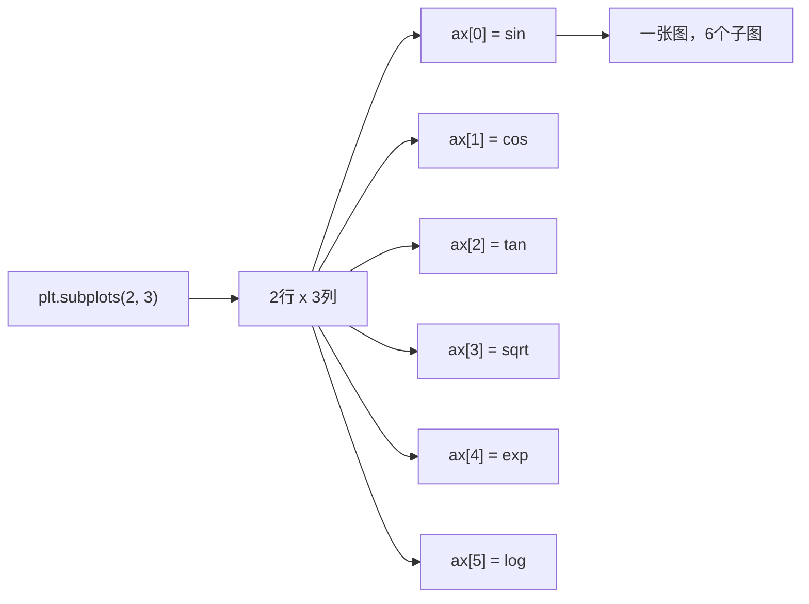

+++
title = "第19章 AI基础"
weight = 190
date = "2026-04-08T13:22:00+08:00"
type = "docs"
description = ""
isCJKLanguage = true
draft = false
+++

# 第十九章：AI 基础知识——NumPy、Pandas、Matplotlib 三剑客

> 🎭 旁白：很久很久以前，有一个神奇的江湖。江湖里有三大高手——"数值计算大师"NumPy、"数据分析侠"Pandas、"可视化仙子"Matplotlib。他们各怀绝技，又配合得天衣无缝。任何想要踏入 AI 江湖的程序员，都必须拜他们为师。这一章，我们就来认识这三位绝世高手！

想象一下，你正准备进入 AI（人工智能）和数据科学的神秘殿堂。结果推开大门，发现里面全是数字、表格、图表——比你高考数学卷子上的数字还多。顿时感觉人生艰难，对不对？

别慌！NumPy、Pandas、Matplotlib 就是你在数据江湖中的三大法宝。它们就像是厨房里的刀、砧板、锅——没有它们，你连一碗泡面都煮不好（好吧，也许能煮，但会很狼狈）。有了它们，处理海量数据就像变魔术一样酷炫。

在这一章里，我们会用大量幽默的例子和完整的代码，手把手教你掌握这三个库的精髓。准备好了吗？Let's go！🚀

---

## 19.1 NumPy（数值计算基础）

**NumPy** 是 "Numerical Python" 的缩写，中文名叫"数值计算库"。它是 Python 在科学计算领域的根基，相当于武侠小说里的"内功心法"——没有它，后面的 Pandas 和 Matplotlib 就是两堆废铁。NumPy 的核心是 **n 维数组对象（ndarray）**，你可以把它想象成一个超级智能的表格，里面只能装同一种类型的数据（比如全是数字），然后它能以惊人的速度帮你做各种数学运算。

为什么 NumPy 这么快？答案是：**它底层是用 C 语言写的，而且使用了 SIMD（单指令多数据）指令集**。用人话来说，就是它一次性可以处理一大堆数字，而不是像普通 Python 列表那样一个一个来。这就好比你有 10000 个快递要送，普通 Python 是一辆小电动车一单一单送，NumPy 是一架巨型直升机一次全扔下去。

> 💡 **小知识**：NumPy 的作者是 Travis Oliphant，他在 2005 年创建了这个库。在此之前，Python 的科学计算生态是一片荒漠；有了 NumPy 之后，Python 终于可以和 MATLAB、Octave 这些老牌科学计算软件叫板了。

### 19.1.1 数组创建（np.array / np.zeros / np.arange / np.linspace）

好啦，理论讲完了，该动手了！我们先来看看怎么创建数组。NumPy 创建数组的方式多种多样，就像超市里有散装糖果、袋装糖果、礼盒装糖果——总有一款适合你。

```python
import numpy as np

# 方式1：直接从 Python 列表转换（最直接的方式）
# 把一个普通列表扔给 np.array，它就自动变成数组了
arr1 = np.array([1, 2, 3, 4, 5])
print(arr1)
# [1 2 3 4 5]

# 也可以创建二维数组（矩阵）
arr2 = np.array([[1, 2, 3],
                 [4, 5, 6]])
print(arr2)
# [[1 2 3]
#  [4 5 6]]

# 方式2：np.zeros - 创建全0数组
# 想象一下你要初始化一个游戏地图，所有格子都是空的，那就用这个
zeros_arr = np.zeros((3, 4))  # 3行4列的全0数组
print(zeros_arr)
# [[0. 0. 0. 0.]
#  [0. 0. 0. 0.]
#  [0. 0. 0. 0.]]

# 方式3：np.ones - 创建全1数组
ones_arr = np.ones((2, 3))
print(ones_arr)
# [[1. 1. 1.]
#  [1. 1. 1.]]

# 方式4：np.arange - 类似 Python 的 range，但返回数组
# arange = array + range，天才的命名！
range_arr = np.arange(0, 10, 2)  # 从0开始，到10结束（不包含），步长2
print(range_arr)
# [0 2 4 6 8]

# 方式5：np.linspace - 创建等差数列
# linspace = linear space，在"线性空间"里均匀分布
# 常用于创建坐标轴上的点，比如 0 到 1 之间取 5 个点
linspace_arr = np.linspace(0, 1, 5)
print(linspace_arr)
# [0.   0.25 0.5  0.75 1.  ]

# 方式6：np.full - 创建一个填充了指定值的数组
# 想象一下你要创建一个"已读"通知数组，全是 True
full_arr = np.full((2, 2), 888)  # 2x2数组，所有元素都是888
print(full_arr)
# [[888 888]
#  [888 888]]
```

> 💡 **记忆技巧**：`np.zeros` 和 `np.ones` 的形状参数是一个**元组**！别问我怎么知道的，问就是踩过坑。`np.zeros(3, 4)` 会报错，而 `np.zeros((3, 4))` 才是正确的——新手必踩坑之一！

### 19.1.2 数组属性（shape / dtype / ndim / size）

NumPy 数组有几个重要的"体检指标"，就像人去做体检时测身高、体重、血压一样。这些属性可以让你快速了解一个数组的基本信息。

```python
import numpy as np

arr = np.array([[1, 2, 3],
                [4, 5, 6]])

# shape - 形状，即各维度的长度
# 返回一个元组，比如 (2, 3) 表示2行3列
print("形状:", arr.shape)      # (2, 3)

# dtype - 数据类型
# NumPy 支持比 Python 更丰富的数据类型
print("数据类型:", arr.dtype)  # int64

# ndim - 维度数量
# 标量是0维，向量是1维，矩阵是2维，张量是3维及以上
print("维度:", arr.ndim)       # 2

# size - 总元素数量
print("元素总数:", arr.size)   # 6

# 还有一个很有用的属性：itemsize（每个元素的字节数）
print("每个元素字节数:", arr.itemsize)  # 8
```

> 🎭 **生活类比**：想象你订了一个组合衣柜（NumPy数组），`shape` 告诉你柜子有几层几列，`dtype` 告诉你每个隔间只能放什么类型的物品（只能放苹果？只能放书？），`ndim` 告诉你这是一个平面柜子还是立体柜子，`size` 告诉你总共有多少个隔间。

NumPy 的数据类型（dtype）包括但不限于：

| dtype | 说明 |
|-------|------|
| `int32` / `int64` | 有符号整数 |
| `uint32` / `uint64` | 无符号整数（不能是负数） |
| `float32` / `float64` | 浮点数（相当于小数） |
| `complex64` / `complex128` | 复数 |
| `bool` | 布尔值（True/False） |
| `object` | Python 对象（什么都能装，但很慢） |
| `str_` | 字符串 |

### 19.1.3 数组运算（+ / * / @ 矩阵乘法）

终于到了激动人心的部分！NumPy 最大的魅力之一就是：**它的运算可以直接对整个数组操作，而不需要写循环**。这叫做**向量化（vectorization）**，是 NumPy 的核心哲学。

用人话来说：如果 Python 列表是"逐个敲门送快递"，NumPy 就是"用导弹精准投送"。当然，导弹比敲门贵，但 NumPy 比循环快！

```python
import numpy as np

a = np.array([1, 2, 3, 4])
b = np.array([10, 20, 30, 40])

# 加法：对应元素相加（注意：是对应元素，不是向量加法）
print("a + b =", a + b)  # [11 22 33 44]

# 减法
print("a - b =", a - b)  # [-9 -18 -27 -36]

# 乘法：对应元素相乘（不是矩阵乘法！）
print("a * b =", a * b)  # [10 40 90 160]

# 除法
print("a / b =", a / b)  # [0.1 0.1 0.1 0.1]

# 标量运算：一个数字和整个数组运算
print("a * 10 =", a * 10)  # [10 20 30 40]
print("a ** 2 =", a ** 2)  # [1 4 9 16]（**是幂运算）

# ========== 矩阵乘法 @ ==========
# @ 运算符是 NumPy 的矩阵乘法符号
# 矩阵乘法的规则：左边矩阵的列数必须等于右边矩阵的行数
A = np.array([[1, 2],
              [3, 4]])
B = np.array([[5, 6],
              [7, 8]])

# A @ B 表示矩阵 A 乘以矩阵 B
C = A @ B
print("A @ B =")
print(C)
# [[19 22]
#  [43 46]]

# 验算一下：19 = 1*5 + 2*7，22 = 1*6 + 2*8，43 = 3*5 + 4*7，46 = 3*6 + 4*8

# np.dot 也可以做矩阵乘法（但它对1维数组有不同含义）
print("np.dot(A, B) =")
print(np.dot(A, B))
# [[19 22]
#  [43 46]]
```

> ⚠️ **易错警告**：`A * B` 和 `A @ B` 是完全不同的东西！`*` 是**对应元素相乘**（element-wise），`@` 是**矩阵乘法**。如果你做过线性代数作业，应该记得矩阵乘法可不是那么简单的事情——1行乘1列要分别相乘再求和！
>
> ```python
> # 常见错误对比
> A = np.array([[1, 2], [3, 4]])
> B = np.array([[5, 6], [7, 8]])
> print(A * B)  # [[5,12],[21,32]]  ← 对应元素相乘
> print(A @ B)  # [[19,22],[43,46]] ← 真正的矩阵乘法
> ```

### 19.1.4 广播机制（broadcasting）

**广播机制**是 NumPy 最酷的特性之一，也是最容易让人"哇哦"的功能。简单来说，广播允许你在形状不一样的数组之间进行运算——NumPy 会自动"拉伸"较小的数组来匹配较大的数组。

想象一下，你有一排可乐（3瓶），你想给每个人都发一听可乐。如果只有你自己，那就是你喝3瓶。如果是3个人，那就是每人1瓶。广播就是这个道理——NumPy 自动理解了这个"复制"的逻辑。

```python
import numpy as np

# 场景1：一维数组和标量运算
# 这个最简单，标量会被"广播"到数组的每个元素
arr = np.array([1, 2, 3, 4])
print(arr + 100)  # [101 102 103 104]
# 相当于 [1,2,3,4] + [100,100,100,100]

# 场景2：二维数组和一行数组
# 想象你有一张成绩表（3个学生，4门课）
grades = np.array([[85, 90, 78, 92],
                   [88, 76, 95, 81],
                   [92, 85, 88, 79]])
# 给每个学生加5分bonus
bonus = np.array([5, 5, 5, 5])  # 每门课加5分
print(grades + bonus)
# [[90 95 83 97]
#  [93 81 100 86]
#  [97 90 93 84]]

# 场景3：二维数组和一列数组
# 如果每个学生还有一个额外的加分（比如课堂表现分）
extra_bonus = np.array([[3],
                        [5],
                        [2]])  # 学生1加3分，学生2加5分，学生3加2分
print(grades + extra_bonus)
# [[88 93 81 95]
#  [93 81 100 86]
#  [94 87 90 81]]

# 场景4：挑战一下，3维和2维能广播吗？
a = np.zeros((3, 4, 2))
b = np.ones((4, 2))
print((a + b).shape)  # (3, 4, 2) - b 被广播到了第三个维度

# 场景5：不能广播的情况（会报错）
try:
    a = np.array([1, 2, 3])
    b = np.array([4, 5])  # 长度不同
    print(a + b)  # ValueError
except ValueError as e:
    print(f"报错了！{e}")
# 广播虽好，但也不是万能的！
```

> 📐 **广播规则**：两个数组的形状从**右边**开始逐一比较，如果：
> - 它们相等，或者
> - 其中一个是 1
> 那么就可以广播，否则就报错。
>
> 举例：`shape (3,4,2)` 和 `shape (4,2)` → 从右边比：2=2 ✓，4=4 ✓，3对应1 ✓ → 可以广播

### 19.1.5 索引与切片

NumPy 数组的索引和切片，和 Python 列表非常像，但更强大——因为 NumPy 数组是多维的。你可以像切蛋糕一样精准地取出你想要的部分。

```python
import numpy as np

arr = np.array([[1, 2, 3, 4],
                [5, 6, 7, 8],
                [9, 10, 11, 12]])

print("原数组:")
print(arr)
# [[ 1  2  3  4]
#  [ 5  6  7  8]
#  [ 9 10 11 12]]

# -------- 基本索引 --------
# 获取第2行第3列的元素（从0开始数！）
print(arr[1, 2])  # 7

# -------- 切片 --------
# 取出第0行和第1行，第1列到第2列（不包含第3列）
sub = arr[0:2, 1:3]
print("arr[0:2, 1:3] =")
print(sub)
# [[2 3]
#  [6 7]]

# 所有行的第0列（也就是第一列）
col = arr[:, 0]
print("第一列:", col)  # [1 5 9]

# 所有列的第2行（也就是第三行）
row = arr[2, :]
print("第三行:", row)  # [9 10 11 12]

# -------- 高级索引（布尔索引）--------
# 找出所有大于5的元素
mask = arr > 5
print("大于5的元素:", arr[mask])  # [ 6  7  8  9 10 11 12]

# 也可以直接写条件
print("小于10的偶数:", arr[(arr < 10) & (arr % 2 == 0)])
# & 表示 AND，| 表示 OR，但记得加括号！

# -------- 花式索引（用数组来索引）--------
# 选取特定行：第0行、第2行、第1行
fancy_rows = arr[[0, 2, 1]]
print("按特定顺序取行:")
print(fancy_rows)
# [[ 1  2  3  4]
#  [ 9 10 11 12]
#  [ 5  6  7  8]]

# 选取特定位置的元素（配对索引）
selected = arr[[0, 1, 2], [0, 1, 2]]  # (0,0), (1,1), (2,2) 三个位置
print("对角线元素:", selected)  # [1 6 11]
```

> 🎯 **实战场景**：假设你有一个股票价格数组，你想找出所有价格超过 100 元且成交量超过 100 万手的交易日。布尔索引就是你的好朋友！
>
> ```python
> prices = np.array([98, 102, 105, 99, 110, 95, 103])
> volumes = np.array([80, 120, 150, 90, 200, 70, 110])  # 单位：万手
>
> # 同时满足两个条件
> mask = (prices > 100) & (volumes > 100)
> print("符合条件的交易日:", prices[mask])  # [102 105 110 103]
> ```

### 19.1.6 常用函数（sum / mean / std / dot / transpose）

NumPy 自带了一大堆数学函数，堪称"瑞士军刀"。这里介绍最常用的几个——它们在数据分析中出场率极高，建议全部背下来（或者至少知道有这么个东西）。

```python
import numpy as np

arr = np.array([[1, 2, 3],
                [4, 5, 6]])

# -------- 统计函数 --------
print("数组内容:")
print(arr)
# [[1 2 3]
#  [4 5 6]]

# sum - 求和
print("所有元素之和:", np.sum(arr))           # 21
print("每列之和:", np.sum(arr, axis=0))       # [5 7 9]
print("每行之和:", np.sum(arr, axis=1))       # [ 6 15]

# mean - 平均值
print("平均值:", np.mean(arr))                 # 3.5
print("每行平均值:", np.mean(arr, axis=1))     # [2. 5.]

# std - 标准差
# 标准差衡量数据的离散程度，越大说明数据越分散
print("标准差:", np.std(arr))                  # 约1.707

# var - 方差（标准差的平方）
print("方差:", np.var(arr))                    # 约2.916

# min / max - 最小值/最大值
print("最小值:", np.min(arr))                  # 1
print("最大值:", np.max(arr))                   # 6
print("每行最小值:", np.min(arr, axis=1))       # [1 4]

# -------- dot - 点积（内积）--------
a = np.array([1, 2, 3])
b = np.array([4, 5, 6])
# 点积 = a[0]*b[0] + a[1]*b[1] + a[2]*b[2] = 1*4 + 2*5 + 3*6 = 32
print("点积:", np.dot(a, b))                   # 32

# -------- transpose (T) - 转置 --------
# 转置就是行列互换：原来的行变成列，列变成行
print("转置:")
print(arr.T)
# [[1 4]
#  [2 5]
#  [3 6]]

# -------- 累计函数 --------
print("累加:", np.cumsum(arr))  # [1 3 6 10 15 21]
print("累乘:", np.cumprod(arr))  # [1 2 6 24 120 720]
```

> 📊 **axis 参数详解**：`axis=0` 表示沿着**列**操作（压缩行），`axis=1` 表示沿着**行**操作（压缩列）。记不住？想象你有一叠纸牌，`axis=0` 就是从上面往下压（列合并），`axis=1` 就是从左往右捏（行合并）！

### 19.1.7 条件筛选（np.where / np.extract）

在数据分析中，我们经常需要"挑出满足条件的元素"。这就好比在一堆水果里挑出所有苹果，或者在一群学生中找出考试不及格的。NumPy 提供了两个神器：`np.where` 和 `np.extract`。

```python
import numpy as np

arr = np.array([10, 25, 30, 45, 50, 65, 70, 85])

# -------- np.where - 条件替换 --------
# np.where(condition, x, y) = 如果条件成立输出x，否则输出y
# 找出一个数组中所有大于40的元素，替换成"大"，否则替换成"小"
result = np.where(arr > 40, "大", "小")
print("分类结果:", result)  # ['小' '小' '小' '大' '大' '大' '大' '大']

# 实际应用中：把负数替换成0（常用于数据预处理）
scores = np.array([85, -1, 90, -1, 75, 88, -1, 92])
# -1 表示缺考，我们把它替换成0
cleaned_scores = np.where(scores == -1, 0, scores)
print("清理后的成绩:", cleaned_scores)  # [85  0 90  0 75 88  0 92]

# 进阶：返回满足条件的索引
indices = np.where(arr > 40)
print("大于40的索引:", indices)  # (array([3, 4, 5, 6, 7]),)
print("大于40的元素:", arr[indices])  # [45 50 65 70 85]

# -------- np.extract - 直接提取元素 --------
# 语法：np.extract(condition, array)
# 相当于 arr[condition] 的快捷方式
condition = arr > 40
extracted = np.extract(condition, arr)
print("np.extract提取:", extracted)  # [45 50 65 70 85]

# -------- 结合多个条件 --------
# 找出 30 < arr < 60 的元素
multi_condition = (arr > 30) & (arr < 60)
print("30到60之间的元素:", np.extract(multi_condition, arr))  # [45 50]

# 注意：多个条件要用 & 连接，而不是 and！
# 而且每个条件都要加括号！
```

> 💬 **幽默一刻**：想象你在相亲节目现场，手上有一叠女生资料（数组），你要找出"年龄小于30岁 AND 有房 AND 不是程序员"的候选人。`np.where` 就是你的红娘助手，帮你快速筛选！
>
> ```python
> # 假设我们有一组相亲候选人的数据
> age = np.array([28, 35, 25, 40, 30])
> has_house = np.array([True, False, True, False, True])
> is_coder = np.array([False, False, True, False, False])
>
> # 找出理想型
> ideal = np.extract((age < 30) & has_house & ~is_coder, age)
> print("理想型年龄:", ideal)  # [28]
> ```

### 19.1.8 数组形状操作（reshape / flatten / concatenate / split）

NumPy 数组的形状是可以灵活变化的——你可以把一个 1x12 的数组变成 3x4，也可以把 2x3x4 的立方体"压扁"成 1x24。这就像玩魔方一样，只要总块数不变，你想怎么转就怎么转。

```python
import numpy as np

# -------- reshape - 改变形状 --------
arr = np.arange(12)  # [0 1 2 3 4 5 6 7 8 9 10 11]
print("原数组:", arr)

# 变成 3 行 4 列
reshaped = arr.reshape(3, 4)
print("reshape(3,4):")
print(reshaped)
# [[ 0  1  2  3]
#  [ 4  5  6  7]
#  [ 8  9 10 11]]

# 变成 4 行 3 列
reshaped2 = arr.reshape(4, 3)
print("reshape(4,3):")
print(reshaped2)
# [[ 0  1  2]
#  [ 3  4  5]
#  [ 6  7  8]
#  [ 9 10 11]]

# 神奇的 -1：让 NumPy 自动计算维度
# 如果知道有4行，列数让它自己算
auto_col = arr.reshape(4, -1)
print("reshape(4,-1):")
print(auto_col)
# [[ 0  1  2]
#  [ 3  4  5]
#  [ 6  7  8]
#  [ 9 10 11]]

# -------- flatten - 展平 --------
# 把多维数组变成一维（就像把卷起的报纸展开）
flat = reshaped.flatten()
print("flatten后:", flat)  # [0 1 2 ... 11]

# ravel 和 flatten 的区别：
# flatten 返回副本，修改不影响原数组
# ravel 返回视图（如果可能），更省内存
flat2 = reshaped.ravel()
print("ravel后:", flat2)  # [0 1 2 ... 11]

# -------- concatenate - 拼接 --------
a = np.array([1, 2, 3])
b = np.array([4, 5, 6])

# 沿 axis=0（默认）拼接
c = np.concatenate([a, b])
print("拼接结果:", c)  # [1 2 3 4 5 6]

# 拼接二维数组
A = np.array([[1, 2],
              [3, 4]])
B = np.array([[5, 6],
              [7, 8]])

# 按行拼接（vertical stack）
vstack = np.vstack([A, B])
print("按行拼接 (vstack):")
print(vstack)
# [[1 2]
#  [3 4]
#  [5 6]
#  [7 8]]

# 按列拼接（horizontal stack）
hstack = np.hstack([A, B])
print("按列拼接 (hstack):")
print(hstack)
# [[1 2 5 6]
#  [3 4 7 8]]

# -------- split - 分割 --------
# 把数组分成几份
arr = np.arange(12)
print("原数组:", arr)

# 分成3等份
pieces = np.split(arr, 3)
print("分成3份:", pieces)  # [array([0,1,2,3]), array([4,5,6,7]), array([8,9,10,11])]

# 在指定位置分割
left, right = np.split(arr, [5])  # 在索引5处分割
print("左半:", left)   # [0 1 2 3 4]
print("右半:", right)  # [ 5  6  7  8  9 10 11]

# vsplit / hsplit 是 vstack / hstack 的逆向操作
A = np.array([[1, 2, 3],
              [4, 5, 6],
              [7, 8, 9]])
top, bottom = np.vsplit(A, [2])  # 在第2行处分割
print("上半部分:")
print(top)
# [[1 2 3]
#  [4 5 6]]
print("下半部分:")
print(bottom)
# [[7 8 9]]
```

> 🧩 **拼图游戏**：想象你有一幅 1000 块的拼图，每块拼图就是一个数字。你可以把它们排成 1x1000 的一条长龙，也可以排成 20x50 的矩形，还可以排成 5x10x20 的立体形状。`reshape` 就是你调整拼图排列方式的超能力！唯一的要求是：**总块数不变**——12 个数字永远只能组成总面积为 12 的形状。

### 19.1.9 随机数生成（np.random）

随机数在科学计算和数据分析中无处不在——模拟实验、初始化神经网络、生成测试数据，都需要随机数。NumPy 的 `np.random` 模块就是你的"随机数大药房"。

```python
import numpy as np

# 设置随机种子，让结果可复现
# 如果不设置种子，每次运行结果都不一样（这对调试很不友好）
np.random.seed(42)  # 42 是"宇宙终极答案"，很多人喜欢用它

# -------- 基础随机数 --------
# rand: 生成 [0, 1) 区间的均匀分布随机数
print("rand(3,2) - 3行2列的随机数:")
print(np.random.rand(3, 2))
# [[0.37454012 0.95071431]
#  [0.73199394 0.59865848]
#  [0.15601864 0.15599452]]

# randn: 生成标准正态分布（平均0，标准差1）的随机数
# 正态分布又叫高斯分布，形状像一口钟
print("randn(4) - 标准正态分布:")
print(np.random.randn(4))
# 类似 [-0.23, 1.15, -0.07, 0.42]

# randint: 生成随机整数
print("randint(1, 10, 5) - 1到10之间的5个随机整数:")
print(np.random.randint(1, 10, 5))  # 左闭右开区间 [1, 10)

# -------- 分布随机数 --------
# uniform: 均匀分布
print("uniform(0, 1, 3) - 0到1之间的3个随机数:")
print(np.random.uniform(0, 1, 3))

# normal: 正态分布（可指定均值和标准差）
print("normal(100, 15, 5) - IQ分数模拟:")
print(np.random.normal(100, 15, 5))  # 平均100，标准差15（真实的IQ分布）

# binomial: 二项分布（做n次实验，成功概率为p）
# 模拟抛10次硬币，重复5次实验
print("binomial(10, 0.5, 5) - 抛硬币模拟:")
print(np.random.binomial(10, 0.5, 5))

# choice: 从数组中随机挑选
colors = np.array(['红', '蓝', '绿'])
print("随机选3次:", np.random.choice(colors, 3))  # 可能得到 ['红' '红' '绿']

# -------- 打乱和抽样 --------
deck = np.array(['A', '2', '3', '4', '5', '6', '7', '8', '9', '10', 'J', 'Q', 'K'])
np.random.shuffle(deck)  # 原地打乱（修改原数组）
print("洗牌后:", deck)

# 从大数据集中随机抽样（不放回）
population = np.arange(100)
sample = np.random.choice(population, 10, replace=False)
print("随机抽10个:", sample)

# -------- 随机漫步模拟 --------
# 随机漫步 = 每天股票价格的变化 = 醉汉走路
steps = np.random.choice([-1, 1], 100)  # 每天要么+1要么-1
walk = np.cumsum(steps)  # 累加每天的位置
print("随机漫步前10步:", walk[:10])
# 类似 [-1, 0, 1, 0, 1, 2, 1, 0, 1, 2]
```

> 🎰 **赌场模拟器**：`np.random` 是你构建"Monte Carlo 模拟"的核心工具。Monte Carlo 方法就是用大量随机样本来估算数学问题的解。比如你想估算圆周率 π，就可以在一个正方形里随机撒点，统计落在内切圆里的比例——这个比例乘以4就是π的近似值！试试看：
>
> ```python
> np.random.seed(0)
> points = np.random.rand(1000000, 2) * 2 - 1  # 在 [-1,1]x[-1,1] 正方形内随机撒点
> inside = np.sum(points[:,0]**2 + points[:,1]**2 < 1)  # 落在单位圆内的点
> print("π的近似值:", 4 * inside / 1000000)  # 约等于 3.14
> ```

### 19.1.10 线性代数（np.linalg）

**线性代数**是 AI 和机器学习的数学基石之一——神经网络的正向传播和反向传播本质上就是一系列矩阵运算。NumPy 的 `np.linalg`（linear algebra = 线性代数）模块提供了所有你需要的基本工具。

```python
import numpy as np

A = np.array([[1, 2],
              [3, 4]])
b = np.array([5, 6])

# -------- 求解线性方程组 --------
# 求解：Ax = b，即：
# 1*x + 2*y = 5
# 3*x + 4*y = 6
x = np.linalg.solve(A, b)
print("线性方程组 Ax=b 的解:", x)
# 验证：1*1 + 2*2 = 5 ✓，3*1 + 4*2 = 11 ≠ 6 ... 呃，可能无解或数值误差

# 用最小二乘法求解超定方程组（最常用于拟合）
# 正常方程 Ax = b 的解：x = (A^T A)^(-1) A^T b
# np.linalg.lstsq 可以直接算这个

# -------- 矩阵分解 --------
# 行列式（determinant）
det = np.linalg.det(A)
print("行列式 det(A):", det)  # 1*4 - 2*3 = -2

# 逆矩阵（inverse matrix）
# A^(-1) * A = I（单位矩阵）
A_inv = np.linalg.inv(A)
print("逆矩阵:")
print(A_inv)
# 验证：A @ A_inv 应该接近单位矩阵
print("验证 (A @ A_inv):")
print(np.round(A @ A_inv))
# [[1. 0.]
#  [0. 1.]]

# 特征值和特征向量（eigenvalues and eigenvectors）
# 满足：Av = λv 的 λ 叫特征值，v 叫特征向量
# 这是 PCA（主成分分析）和很多算法的核心
eigenvalues, eigenvectors = np.linalg.eig(A)
print("特征值:", eigenvalues)
print("特征向量:")
print(eigenvectors)

# SVD 奇异值分解（Singular Value Decomposition）
# A = U Σ V^T，任何矩阵都可以分解成这三个矩阵的乘积
# SVD 是降维、推荐系统、图像压缩的神器
U, S, Vt = np.linalg.svd(A)
print("U:", U)
print("奇异值 S:", S)
print("V^T:", Vt)

# -------- 范数（norm）--------
# 范数衡量向量或矩阵的"大小"
v = np.array([3, 4])

# L2 范数（欧几里得距离）= sqrt(3² + 4²) = 5
print("L2范数:", np.linalg.norm(v))  # 5.0
print("L2范数（显式）:", np.sqrt(np.sum(v**2)))  # 5.0

# L1 范数 = |3| + |4| = 7
print("L1范数:", np.linalg.norm(v, ord=1))  # 7.0

# -------- 矩阵范数 --------
# Frobenius 范数（类比 L2 范数对矩阵的推广）
print("Frobenius范数:", np.linalg.norm(A, 'fro'))  # sqrt(1+4+9+16) = sqrt(30)

# -------- QR 分解 --------
Q, R = np.linalg.qr(A)
print("Q:", Q)
print("R:", R)
# 验证：A ≈ Q @ R
print("Q @ R:", Q @ R)
```

> 🧠 **特征值的物理意义**：想象一个弹性物体，你往某个方向捅一下（施加力），它会往另一个方向变形。如果力的方向和变形方向一样，那这个方向就是**特征向量**，变形的倍数就是**特征值**。在 AI 中，特征值分解可以帮你找出数据中最重要的"方向"——这就是 PCA（主成分分析）的核心思想！

下面是一个用线性代数求解线性回归问题的完整示例（正规方程）：

```python
import numpy as np

# 假设我们要拟合：y = w0 + w1*x1 + w2*x2
# 训练数据
X = np.array([[1, 1, 2],
              [1, 2, 4],
              [1, 3, 6],
              [1, 4, 5],
              [1, 5, 8]])
y = np.array([5, 8, 11, 13, 17])

# 正规方程：w = (X^T X)^(-1) X^T y
w = np.linalg.inv(X.T @ X) @ X.T @ y
print("拟合参数 w:", np.round(w, 2))
# w[0] 是截距，w[1] 和 w[2] 是系数

# 预测
y_pred = X @ w
print("预测值:", np.round(y_pred, 2))
print("真实值:", y)
```

---

## 19.2 Pandas（数据分析）

如果说 NumPy 是"内功心法"，那么 **Pandas** 就是"招式秘籍"。Pandas 是在 NumPy 基础上构建的，提供了两个核心数据结构：**Series** 和 **DataFrame**。它们让数据处理变得更直观、更人性化——你可以把 DataFrame 想象成一个 Excel 表格，或者 SQL 数据库中的一张表。

> 💡 **Pandas 的诞生**：Pandas 由 Wes McKinney 于 2008 年创建。当时他在 AQR Capital Management（一家量化投资公司）工作，需要处理金融数据，但发现现有的 Python 工具都不够用。于是他"一气之下"写了 Pandas。事实证明，这个"一气之下"非常伟大——Pandas 彻底改变了 Python 在数据分析领域的地位。

### 19.2.1 Series 和 DataFrame

Pandas 的两个核心数据结构是 **Series** 和 **DataFrame**：

- **Series**：想象成 Excel 中的一列——一个一维带标签的数组
- **DataFrame**：想象成整个 Excel 表格——一个二维带标签的表格

```python
import pandas as pd
import numpy as np

# -------- Series --------
# Series = 一维带索引的数组
s = pd.Series([10, 20, 30, 40, 50])
print("Series示例:")
print(s)
# 0    10
# 1    20
# 2    30
# 3    40
# 4    50
# dtype: int64

# 自定义索引
s2 = pd.Series([98, 85, 92, 78, 88],
               index=['语文', '数学', '英语', '物理', '化学'])
print("\n带标签的Series:")
print(s2)
# 语文    98
# 数学    85
# 英语    92
# 物理    78
# 化学    88
# dtype: int64

# 用字典创建 Series
dict_data = {'苹果': 5, '香蕉': 3, '橙子': 7, '葡萄': 2}
s3 = pd.Series(dict_data)
print("\n字典转Series:")
print(s3)
# 苹果    5
# 香蕉    3
# 橙子    7
# 葡萄    2
# dtype: int64

# -------- DataFrame --------
# DataFrame = 二维表格，每个列可以是不同的数据类型

# 创建 DataFrame 的方式1：字典
data = {
    '姓名': ['张三', '李四', '王五', '赵六'],
    '年龄': [25, 30, 35, 28],
    '城市': ['北京', '上海', '广州', '深圳'],
    '年薪(万)': [30, 45, 35, 40]
}
df = pd.DataFrame(data)
print("\nDataFrame示例:")
print(df)
#    姓名  年龄  城市  年薪(万)
# 0  张三  25  北京      30
# 1  李四  30  上海      45
# 2  王五  35  广州      35
# 3  赵六  28  深圳      40

# 创建 DataFrame 的方式2：二维数组
arr = np.array([[1, 2, 3],
                [4, 5, 6],
                [7, 8, 9]])
df2 = pd.DataFrame(arr, columns=['A列', 'B列', 'C列'])
print("\n数组转DataFrame:")
print(df2)

# -------- DataFrame 基本操作 --------
print("\n前2行:")
print(df.head(2))  # 默认前5行

print("\n后2行:")
print(df.tail(2))

print("\n数据类型:")
print(df.dtypes)

print("\n列名:")
print(df.columns)

print("\n形状:")
print(df.shape)  # (4, 4)

print("\n描述统计:")
print(df.describe())
```

> 🎭 **生活类比**：把 DataFrame 想象成一张**Excel 表格**：
> - **每列**就是一个 Series（就像 Excel 的 A 列、B 列）
> - **每行**就是一条记录（就像 Excel 中每一行是一个人的信息）
> - **索引**就是行号（就像 Excel 的 1、2、3...，不过 Pandas 可以用文字做索引）
> - **列名**就是列标题（就像 Excel 的"姓名"、"年龄"）

### 19.2.2 数据读取（read_csv / read_excel / read_json）

在真实工作中，你的数据通常存储在文件或数据库里，而不是写死在代码里。Pandas 提供了强大的 IO 功能，可以读取各种格式的数据文件。

```python
import pandas as pd

# -------- read_csv --------
# CSV = Comma Separated Values，逗号分隔值
# 这是最常用的数据格式之一，Excel可以直接导出CSV

# 读取CSV（假设当前目录有一个叫 data.csv 的文件）
# df = pd.read_csv('data.csv')

# 常用参数：
# df = pd.read_csv('data.csv', encoding='utf-8')  # 指定编码
# df = pd.read_csv('data.csv', sep=';')           # 分隔符是分号而不是逗号
# df = pd.read_csv('data.csv', header=0)           # 第0行是表头
# df = pd.read_csv('data.csv', names=['列1','列2'])# 自己指定列名
# df = pd.read_csv('data.csv', index_col=0)        # 第0列作为索引
# df = pd.read_csv('data.csv', nrows=100)          # 只读取前100行

# 模拟演示：读取字符串格式的CSV
from io import StringIO
csv_data = """姓名,年龄,城市,年薪(万)
张三,25,北京,30
李四,30,上海,45
王五,35,广州,35
赵六,28,深圳,40"""
df = pd.read_csv(StringIO(csv_data))
print("从CSV读取:")
print(df)

# -------- read_excel --------
# 读取Excel文件（需要安装 openpyxl 或 xlrd）
# df = pd.read_excel('data.xlsx', sheet_name='Sheet1')
# sheet_name 参数可以指定读取哪个工作表

# 模拟演示：读取字典列表格式
excel_data = [
    {'姓名': '张三', '年龄': 25, '城市': '北京'},
    {'姓名': '李四', '年龄': 30, '城市': '上海'},
]
df_excel = pd.DataFrame(excel_data)
print("\n模拟Excel数据:")
print(df_excel)

# -------- read_json --------
# JSON = JavaScript Object Notation，键值对格式
# API接口返回的数据通常是这个格式

json_data = [
    {'name': 'Alice', 'age': 25, 'city': 'Beijing'},
    {'name': 'Bob', 'age': 30, 'city': 'Shanghai'}
]
df_json = pd.read_json(pd.DataFrame(json_data).to_json(orient='records'))
print("\n从JSON读取:")
print(df_json)

# JSON 的不同格式：
# orient='records': [{"a":1}, {"a":2}]
# orient='index': {"0":{"a":1}, "1":{"a":2}}
# orient='columns': {"a":{"0":1, "1":2}}

# -------- 读取大文件的技巧 --------
# 如果文件很大，不需要全部读入内存
# df = pd.read_csv('big_data.csv', chunksize=10000)  # 分块读取
# for chunk in pd.read_csv('big_data.csv', chunksize=10000):
#     process(chunk)  # 每次处理10000行
```

> 💡 **编码问题**：读取中文文件最常遇到的坑就是**编码**。Windows 默认用 `gbk` 编码，Linux 和 Mac 用 `utf-8`。如果遇到读出来的中文是乱码，试试 `encoding='utf-8'` 或 `encoding='gbk'`。

### 19.2.3 数据选择（loc / iloc / at / iat）

数据选择是 Pandas 最常用的操作之一。你需要从表格中挑出特定的行或列。Pandas 提供了两套选择机制：**标签索引（loc）** 和 **位置索引（iloc）**。

```python
import pandas as pd
import numpy as np

df = pd.DataFrame({
    '姓名': ['张三', '李四', '王五', '赵六', '钱七'],
    '年龄': [25, 30, 35, 28, 32],
    '城市': ['北京', '上海', '广州', '深圳', '杭州'],
    '年薪(万)': [30, 45, 35, 40, 50]
}, index=['a', 'b', 'c', 'd', 'e'])

print("原数据:")
print(df)
#    姓名  年龄  城市  年薪(万)
# a  张三  25  北京      30
# b  李四  30  上海      45
# c  王五  35  广州      35
# d  赵六  28  深圳      40
# e  钱七  32  杭州      50

# -------- loc：基于标签的选择 --------
# 选择一行
print("用loc选择'a'行:")
print(df.loc['a'])
# 姓名    张三
# 年龄    25
# 城市    北京
# 年薪(万)    30
# Name: a, dtype: object

# 选择多行
print("\n选择'a','c','e'行:")
print(df.loc[['a', 'c', 'e']])

# 条件选择（布尔索引）
print("\n年龄大于30的行:")
print(df.loc[df['年龄'] > 30])

# 选择特定行+特定列
print("\n选择'b'行，姓名和城市:")
print(df.loc['b', ['姓名', '城市']])  # 姓名    李四, 城市    上海

# 切片选择（包含两端）
print("\n选择'a'到'c'行:")
print(df.loc['a':'c'])
# 包含 a, b, c 三行（注意：这是闭区间，不是半开区间！）

# -------- iloc：基于位置的选择 --------
# 选择第0行（第一行）
print("\niloc[0]:")
print(df.iloc[0])

# 选择前3行
print("\niloc[:3]:")
print(df.iloc[:3])

# 选择第1行和第3行
print("\niloc[[1,3]]:")
print(df.iloc[[1, 3]])

# 选择第0列和第2列
print("\n选择第0列和第2列:")
print(df.iloc[:, [0, 2]])

# 选择第1到第3行，第0到第2列
print("\niloc[1:4, 0:3]:")
print(df.iloc[1:4, 0:3])

# -------- at 和 iat：快速访问单个值 --------
# at 类似于 loc，但只能访问单个值（更快）
print("\nat['b', '年薪(万)']:", df.at['b', '年薪(万)'])  # 45

# iat 类似于 iloc，但只能访问单个值（最快）
print("iat[1, 3]:", df.iat[1, 3])  # 45

# -------- 选择列的简便方法 --------
print("\n选择'姓名'列（返回Series）:")
print(df['姓名'])

# 也可以用属性语法（列名是字符串时）
print("\ndf.姓名:")
print(df.姓名)

# 选择多列（必须用双括号！）
print("\n选择姓名和城市:")
print(df[['姓名', '城市']])
```

> 🎯 **loc vs iloc 记忆技巧**：
> - **loc** = **l**abel（标签索引）→ 用**名字**选，如 `df.loc['row1', 'col1']`
> - **iloc** = **i**nteger（整数位置）→ 用**编号**选，如 `df.iloc[0, 1]`
>
> **易错点**：
> 1. `df.loc['a':'c']` 是**闭区间**（包含 'a' 和 'c'），而 Python 列表的切片是半开区间
> 2. `df['姓名']` 选列（返回一个 Series），`df[['姓名']]` 选列（返回一个 DataFrame）

### 19.2.4 数据清洗（dropna / fillna / drop_duplicates）

现实世界的数据是"脏"的——有缺失值、有重复行、有异常值。数据清洗就是"洗脏衣服"的过程，让数据变得干净可用。

```python
import pandas as pd
import numpy as np

# 创建一些"脏"数据
df = pd.DataFrame({
    '姓名': ['张三', '李四', '王五', '张三', '赵六', None],
    '年龄': [25, None, 35, 28, 32, 45],
    '城市': ['北京', '上海', None, '深圳', '杭州', '广州'],
    '年薪(万)': [30, 45, 35, 40, 50, 35]
})

print("脏数据:")
print(df)
print(df.isnull())  # 查看哪些位置是空值

# -------- dropna：删除缺失值 --------
print("\n--- dropna 删除空值 ---")

# 默认删除任何含有空值的行
print("删除含有空值的行:")
print(df.dropna())
#     姓名  年龄  城市  年薪(万)
# 4   赵六  32.0  杭州        50

# 只删除全为空值的行（没有这种情况）

# 删除含有空值的列
print("删除含有空值的列:")
print(df.dropna(axis=1))

# 只删除'年龄'列为空值的行
print("删除'年龄'为空值的行:")
print(df.dropna(subset=['年龄']))

# -------- fillna：填充空值 --------
print("\n--- fillna 填充空值 ---")

# 用固定值填充
df_filled = df.copy()
df_filled['姓名'].fillna('未知', inplace=True)
print("'姓名'空值填充为'未知':")
print(df_filled)

# 用均值填充（数值列）
df_filled2 = df.copy()
df_filled2['年龄'].fillna(df['年龄'].mean(), inplace=True)
print("\n'年龄'空值填充为均值:")
print(df_filled2)

# 用前一个值填充（forward fill）
print("\n用前向填充:")
print(df.fillna(method='ffill'))

# 用后一个值填充（backward fill）
print("\n用后向填充:")
print(df.fillna(method='bfill'))

# -------- drop_duplicates：删除重复行 --------
df_dup = pd.DataFrame({
    '姓名': ['张三', '李四', '张三', '王五', '李四'],
    '年龄': [25, 30, 25, 35, 30],
    '城市': ['北京', '上海', '北京', '广州', '上海']
})

print("\n--- drop_duplicates 删除重复行 ---")
print("有重复行的数据:")
print(df_dup)
print("\n删除完全重复的行:")
print(df_dup.drop_duplicates())

# 只考虑某些列
print("\n只根据'姓名'和'城市'去重:")
print(df_dup.drop_duplicates(subset=['姓名', '城市']))

# 保留最后一个
print("\n保留最后一个重复:")
print(df_dup.drop_duplicates(keep='last'))
```

> 🧹 **数据清洗流程建议**：
> 1. 先用 `df.info()` 查看数据概况，知道有哪些列、哪些类型、有多少空值
> 2. 用 `df.isnull().sum()` 统计每列的空值数量
> 3. 根据业务逻辑决定是删除还是填充空值
> 4. 检查重复行，用 `drop_duplicates` 处理
> 5. 检查异常值（如年龄=0或年龄=999）

### 19.2.5 数据变换（apply / map / transform）

数据变换是对现有数据进行计算、转换、衍生新列的操作。就像厨师对原材料进行切、炒、调味一样。

```python
import pandas as pd
import numpy as np

df = pd.DataFrame({
    '姓名': ['张三', '李四', '王五', '赵六'],
    '数学': [85, 92, 78, 88],
    '语文': [90, 85, 92, 80],
    '英语': [88, 90, 85, 92]
})

print("原始数据:")
print(df)

# -------- apply：对行或列应用函数 --------
print("\n--- apply ---")

# 计算每人的总分（沿 axis=1，即跨列）
df['总分'] = df[['数学', '语文', '英语']].apply(np.sum, axis=1)
print("加总分列:")
print(df)

# 用自定义函数
def grade_level(score):
    """根据分数评级"""
    if score >= 90:
        return 'A'
    elif score >= 80:
        return 'B'
    elif score >= 70:
        return 'C'
    else:
        return 'D'

df['数学等级'] = df['数学'].apply(grade_level)
print("\n加数学等级列:")
print(df)

# -------- map：对 Series 应用函数 --------
print("\n--- map ---")

# 给城市换个标签
city_map = {'北京': '北方', '上海': '南方', '广州': '南方', '深圳': '南方'}
df2 = pd.DataFrame({
    '姓名': ['张三', '李四', '王五', '赵六'],
    '城市': ['北京', '上海', '广州', '深圳']
})
df2['区域'] = df2['城市'].map(city_map)
print("城市映射到区域:")
print(df2)

# 用 lambda
df2['城市简称'] = df2['城市'].map(lambda x: x[0])
print("城市简称:")
print(df2)

# -------- transform：同时返回相同形状的结果 --------
print("\n--- transform ---")

# transform 和 apply 的区别：
# apply 可以返回不同形状，transform 必须返回相同形状
# transform 更快（支持向量化操作）

df3 = pd.DataFrame({
    '班级': ['A', 'A', 'B', 'B', 'A'],
    '成绩': [85, 92, 78, 88, 90]
})

# 计算每个班级的平均分，然后广播到每个人
df3['班级平均'] = df3.groupby('班级')['成绩'].transform('mean')
print("添加班级平均分:")
print(df3)

# -------- assign：链式添加列 --------
df = df.assign(
    平均分=lambda x: x['总分'] / 3,
    最高分=lambda x: x[['数学', '语文', '英语']].max(axis=1),
    最低分=lambda x: x[['数学', '语文', '英语']].min(axis=1)
)
print("\n用assign添加多列:")
print(df)

# -------- replace：替换值 --------
s = pd.Series(['红', '蓝', '绿', '红'])
s_replaced = s.replace(['红', '蓝'], ['RED', 'BLUE'])
print("\n替换颜色:")
print(s_replaced)
```

> 🔧 **apply / map / transform 选择指南**：
> - `map`：`Series`专用，将每个值映射到新值（字典、函数皆可）
> - `apply`：`DataFrame`行/列专用，最灵活，可以聚合
> - `transform`：和 apply 类似，但**必须返回和输入相同形状的结果**，在分组操作中很有用

### 19.2.6 分组聚合（groupby / agg / pivot）

分组聚合是数据分析的核心操作之一。想象你有一堆商品销售记录，你想按月份汇总、按产品类别汇总——这时候 `groupby` 就是你的超级武器。

```python
import pandas as pd
import numpy as np

# 模拟电商销售数据
df = pd.DataFrame({
    '日期': ['2024-01-01', '2024-01-02', '2024-01-03', '2024-01-04', '2024-01-05', '2024-01-06'],
    '商品类别': ['电子产品', '服装', '电子产品', '食品', '服装', '电子产品'],
    '商品': ['手机', 'T恤', '耳机', '面包', '裤子', '充电器'],
    '销量': [100, 50, 80, 30, 60, 90],
    '单价': [2000, 100, 300, 5, 150, 50],
    '城市': ['北京', '上海', '北京', '广州', '深圳', '上海']
})
df['销售额'] = df['销量'] * df['单价']
print("原始销售数据:")
print(df)

# -------- groupby 基础 --------
print("\n--- groupby 基础 ---")

# 按商品类别分组
grouped = df.groupby('商品类别')
print("分组后的组数:", grouped.ngroups)  # 3

# 遍历每个组
for name, group in grouped:
    print(f"\n{name}组:")
    print(group[['商品', '销量', '销售额']])

# -------- 聚合函数 agg --------
print("\n--- agg 聚合 ---")

# 单个聚合
print("按类别求销量总和:")
print(df.groupby('商品类别')['销量'].sum())

# 多个聚合
print("\n按类别聚合（销量总和、销量均值、销售额总和）:")
result = df.groupby('商品类别').agg({
    '销量': ['sum', 'mean'],
    '销售额': 'sum'
})
print(result)
# 列名会变成多级索引

# 使用命名聚合（更清晰）
result2 = df.groupby('商品类别').agg(
    总销量=('销量', 'sum'),
    平均销量=('销量', 'mean'),
    总销售额=('销售额', 'sum')
)
print("\n命名聚合（更清晰）:")
print(result2)

# -------- 内置聚合函数 --------
# 常用聚合函数：sum, mean, median, std, var, min, max, count, first, last, std

# -------- pivot 透视表 --------
print("\n--- pivot 透视表 ---")

pivot = df.pivot_table(
    values='销售额',
    index='商品类别',
    columns='城市',
    aggfunc='sum',
    fill_value=0  # 空值填0
)
print("销售额透视表（类别 x 城市）:")
print(pivot)

# 多个聚合函数
pivot2 = df.pivot_table(
    values='销售额',
    index='商品类别',
    aggfunc=['sum', 'mean', 'count']
)
print("\n多聚合透视表:")
print(pivot2)

# -------- crosstab 交叉表 --------
print("\n--- crosstab 交叉表 ---")
ct = pd.crosstab(df['商品类别'], df['城市'], margins=True)
print("交叉表（计数）:")
print(ct)

# -------- 分组后过滤 --------
print("\n--- 分组过滤 ---")
# 找出销售额总计超过 10000 的类别
def filter_group(group):
    return group['销售额'].sum() > 10000

print("销售额超过1万的类别:")
print(df.groupby('商品类别').filter(filter_group))
```

> 📊 **groupby 原理**：groupby 就像一个"分组标签打印机"。它把你的数据按某个标准分成 N 个组，每个组都是一个"小表格"，然后你可以对这些小表格分别进行操作。
>
> ```mermaid
> graph TD
>     A["原始 DataFrame<br/>所有行"] --> B["groupby('商品类别')"]
>     B --> C1["电子产品组<br/>3行"]
>     B --> C2["服装组<br/>2行"]
>     B --> C3["食品组<br/>1行"]
>     C1 --> D1["sum/mean/count..."]
>     C2 --> D2["sum/mean/count..."]
>     C3 --> D3["sum/mean/count..."]
>     D1 --> E["聚合结果"]
>     D2 --> E
>     D3 --> E
> ```

### 19.2.7 数据合并（concat / merge / join）

当你的数据分散在多个地方时，你需要把它们"拼"在一起。Pandas 提供了三种合并方式：`concat`、`merge`、`join`。想象你有多份学生档案，要按学号合并；或者有多张表格，要上下拼在一起。

```python
import pandas as pd
import numpy as np

# -------- concat：沿轴拼接 --------
print("--- concat 拼接 ---")

df1 = pd.DataFrame({
    '姓名': ['张三', '李四'],
    '数学': [85, 92]
})
df2 = pd.DataFrame({
    '姓名': ['王五', '赵六'],
    '数学': [78, 88]
})

# 上下拼接（增加行）
result = pd.concat([df1, df2], ignore_index=True)
print("上下拼接（ignore_index=True重置索引）:")
print(result)

# 左右拼接（增加列）- 需要有相同的索引
df3 = pd.DataFrame({
    '姓名': ['张三', '李四'],
    '语文': [90, 85]
})
result2 = pd.concat([df1, df3], axis=1)
print("\n左右拼接:")
print(result2)

# -------- merge：基于列的合并（类似SQL JOIN）--------
print("\n--- merge 合并 ---")

students = pd.DataFrame({
    '学号': ['S001', 'S002', 'S003', 'S004'],
    '姓名': ['张三', '李四', '王五', '赵六']
})

scores = pd.DataFrame({
    '学号': ['S001', 'S002', 'S003', 'S005'],
    '数学': [85, 92, 78, 88],
    '英语': [90, 85, 92, 80]
})

# INNER JOIN：只保留两边都有的
inner = pd.merge(students, scores, on='学号', how='inner')
print("INNER JOIN:")
print(inner)

# LEFT JOIN：保留左边的全部
left = pd.merge(students, scores, on='学号', how='left')
print("\nLEFT JOIN:")
print(left)

# OUTER JOIN：保留所有
outer = pd.merge(students, scores, on='学号', how='outer')
print("\nOUTER JOIN:")
print(outer)

# 多个key合并
df_a = pd.DataFrame({
    '姓': ['张', '李', '王'],
    '名': ['三', '四', '五'],
    '年龄': [25, 30, 35]
})
df_b = pd.DataFrame({
    '姓': ['张', '李', '赵'],
    '名': ['三', '四', '六'],
    '城市': ['北京', '上海', '广州']
})
result3 = pd.merge(df_a, df_b, on=['姓', '名'], how='inner')
print("\n多键合并:")
print(result3)

# -------- join：基于索引的合并 --------
print("\n--- join 基于索引 ---")

df_left = pd.DataFrame({
    '数学': [85, 92, 78],
    '语文': [90, 85, 92]
}, index=['张三', '李四', '王五'])

df_right = pd.DataFrame({
    '英语': [88, 90, 85],
    '物理': [92, 88, 95]
}, index=['张三', '李四', '王五'])

result4 = df_left.join(df_right)
print("join 结果:")
print(result4)
```

> 🔗 **merge vs join vs concat 选择指南**：
> - `concat`：把多个结构相同的 DataFrame 首尾相连（行拼接），或并排放置（列拼接）
> - `merge`：基于**列**合并两个 DataFrame，类似 SQL 的 JOIN
> - `join`：基于**索引**合并两个 DataFrame
>
> 一般来说：`merge` 最常用（因为基于列更直观），`concat` 用于追加行或列，`join` 用于快速合并同索引的表。

### 19.2.8 字符串处理（str accessor）

Pandas 为字符串列提供了强大的 `str` 访问器，让你可以像操作 Python 字符串一样操作整列数据，而且是用 C 语言加速的！

```python
import pandas as pd

df = pd.DataFrame({
    '姓名': ['张三', '李四', '王五', '赵六'],
    '邮箱': ['zhangsan@qq.com', 'lisi@gmail.com', 'wangwu@163.com', 'zhaoliu@outlook.com'],
    '电话': ['138-0000-1234', '139-8888-5678', '137-6666-9999', '136-3333-4444'],
    '城市': ['北京市', '上海市', '广州市', '深圳市']
})

print("原始数据:")
print(df)

# -------- 常用字符串函数 --------
print("\n--- 字符串函数 ---")

# lower / upper / title
print("邮箱转小写:")
print(df['邮箱'].str.lower())

# 提取域名
print("\n提取邮箱域名:")
print(df['邮箱'].str.extract(r'@(.+)$'))

# contains：是否包含某个子串
print("\n使用qq邮箱的用户:")
print(df[df['邮箱'].str.contains('qq')])

# startswith / endswith
print("\n以.com结尾的邮箱:")
print(df[df['邮箱'].str.endswith('.com')])

# split：分割
print("\n分割电话（取第一部分）:")
print(df['电话'].str.split('-').str[0])

# replace：替换
print("\n去掉城市后缀'市':")
print(df['城市'].str.replace('市', '', regex=False))

# strip / lstrip / rstrip：去除空白
df_dirty = pd.DataFrame({'名字': ['  张三  ', '李四\n', '\t王五']})
print("\n带空白的数据:")
print(df_dirty)
print("\n去除空白:")
print(df_dirty['名字'].str.strip())

# 计算字符串长度
print("\n姓名长度:")
print(df['姓名'].str.len())

# count：计数子串出现次数
emails = pd.Series(['aaa@xxx.com', 'bbb@xxx.com', 'ccc@xxx.com'])
print("\n'@'出现次数:")
print(emails.str.count('@'))
```

> 💬 **正则表达式补充**：字符串操作中，`str.extract`、`str.replace`（带 `regex=True`）等支持**正则表达式**。正则表达式是处理字符串的瑞士军刀——比如 `\d+` 匹配一个或多个数字，`[a-zA-Z]` 匹配字母等。

### 19.2.9 时间序列（DatetimeIndex / resample）

**时间序列数据**是指带有时间戳的数据，比如股票价格、天气数据、网站访问量等。Pandas 提供了强大的时间序列处理功能。

```python
import pandas as pd
import numpy as np

# -------- 创建时间序列 --------
print("--- 创建时间序列 ---")

# date_range：生成日期范围
dates = pd.date_range('2024-01-01', periods=10, freq='D')
print("日期范围（每天）:")
print(dates)

# 创建带时间索引的 DataFrame
df = pd.DataFrame({
    '温度': np.random.randint(15, 30, 10),  # 随机温度 15-30度
    '湿度': np.random.randint(40, 80, 10)
}, index=dates)
df.index.name = '日期'
print("\n时间序列数据:")
print(df)

# -------- DatetimeIndex 属性 --------
print("\n--- DatetimeIndex 属性 ---")
print("年份:", df.index.year)
print("月份:", df.index.month)
print("日:", df.index.day)
print("星期几:", df.index.day_name())
print("是周末吗:", df.index.is_weekend())

# -------- 字符串转时间 --------
print("\n--- 字符串转时间 ---")
df_str = pd.DataFrame({
    '日期': ['2024-01-01', '2024-01-02', '2024-01-03'],
    '销量': [100, 150, 120]
})
df_str['日期'] = pd.to_datetime(df_str['日期'])
df_str.set_index('日期', inplace=True)
print("转换为DatetimeIndex后:")
print(df_str)

# -------- 重采样 resample --------
print("\n--- resample 重采样 ---")

# 创建更密集的时间序列（每小时）
hourly_dates = pd.date_range('2024-01-01 00:00', periods=48, freq='H')
hourly_df = pd.DataFrame({
    '访问量': np.random.randint(100, 500, 48)
}, index=hourly_dates)

# 按天聚合
daily = hourly_df.resample('D').sum()
print("按天聚合的访问量:")
print(daily)

# 按6小时聚合
six_hourly = hourly_df.resample('6H').mean()
print("\n按6小时聚合的平均访问量:")
print(six_hourly)

# -------- 移动窗口（rolling）--------
print("\n--- rolling 移动窗口 ---")
df_random = pd.DataFrame({
    '价格': [100, 102, 101, 105, 103, 108, 107, 110, 109, 112]
}, index=pd.date_range('2024-01-01', periods=10))

# 计算3日移动平均
df_random['移动平均(3日)'] = df_random['价格'].rolling(window=3).mean()
print("带移动平均的价格:")
print(df_random)

# -------- 时区处理 --------
print("\n--- 时区处理 ---")
# 创建带时区的时间序列
ts_utc = pd.date_range('2024-01-01 00:00', periods=5, freq='D', tz='UTC')
print("UTC时间:")
print(ts_utc)

# 转换时区
ts_shanghai = ts_utc.tz_convert('Asia/Shanghai')
print("\n转换为上海时间:")
print(ts_shanghai)
```

> ⏰ **时间频率字符**：`freq` 参数常用的有：
> - `'D'` = 每天
> - `'W'` = 每周
> - `'M'` = 每月
> - `'H'` = 每小时
> - `'T'` 或 `'min'` = 每分钟
> - `'S'` = 每秒

### 19.2.10 导出数据（to_csv / to_excel / to_json）

分析完数据后，你需要把结果保存下来。Pandas 支持多种导出格式——CSV、Excel、JSON、HTML、SQL 等。

```python
import pandas as pd
import numpy as np

# 创建示例数据
df = pd.DataFrame({
    '姓名': ['张三', '李四', '王五'],
    '数学': [85, 92, 78],
    '语文': [90, 85, 92]
})

# -------- to_csv --------
# 保存为CSV文件
# df.to_csv('students.csv', index=False)  # index=False 不保存行索引

# 演示：用 StringIO 模拟保存
from io import StringIO
csv_buffer = StringIO()
df.to_csv(csv_buffer, index=False, encoding='utf-8')
print("CSV内容:")
print(csv_buffer.getvalue())

# 常用参数：
# to_csv(path, index=False)              # 不保存索引
# to_csv(path, sep=';')                   # 用分号分隔
# to_csv(path, encoding='utf-8-sig')     # 带BOM的UTF-8（Excel打开中文不乱码）
# to_csv(path, na_rep='NULL')            # 空值保存为'NULL'

# -------- to_excel --------
# 保存为Excel（需要 openpyxl）
# df.to_excel('students.xlsx', sheet_name='成绩', index=False)
# 多个DataFrame写入同一个Excel的不同sheet：
# with pd.ExcelWriter('combined.xlsx') as writer:
#     df1.to_excel(writer, sheet_name='Sheet1')
#     df2.to_excel(writer, sheet_name='Sheet2')

# 演示
print("\nExcel文件示例（df.to_excel）:")
print("需要安装 openpyxl: pip install openpyxl")

# -------- to_json --------
json_str = df.to_json(orient='records', force_ascii=False, indent=2)
print("\nJSON内容（records格式）:")
print(json_str)

# 不同格式：
# orient='records': [{"列":"值"}, ...]
# orient='index': {"行索引":{"列":"值"}, ...}
# orient='columns': {"列名":{"行索引":"值"}, ...}
# orient='table': {"schema":..., "data": [...]}

# -------- to_html --------
html_str = df.to_html(index=False)
print("\nHTML表格:")
print(html_str)

# -------- to_sql --------
# 保存到SQLite数据库（需要 sqlalchemy）
# from sqlalchemy import create_engine
# engine = create_engine('sqlite:///students.db')
# df.to_sql('student_scores', engine, index=False, if_exists='replace')

# -------- to_clipboard --------
# 复制到剪贴板（可以直接粘贴到Excel）
# df.to_clipboard(index=False)

# -------- pickling（pickle格式，高速序列化）--------
# 保存为pickle格式（读取速度比CSV快很多倍）
# df.to_pickle('students.pkl')
# df_from_pickle = pd.read_pickle('students.pkl')
```

> 📁 **格式选择建议**：
> - **CSV**：通用格式，任何工具都能打开，但不支持多sheet
> - **Excel（xlsx）**：适合人类阅读，支持多sheet，但文件较大
> - **JSON**：适合API交互、Web开发
> - **Pickle**：Python专用，读取极快，适合中间结果缓存
> - **Parquet**：列式存储，适合大数据分析（Apache Arrow生态）

---

## 19.3 Matplotlib（数据可视化）

如果说数据是一堆数字，那图表就是把数字变成"图片"的魔法。**Matplotlib** 是 Python 最流行的可视化库，它的-logo 就是那个著名的"套娃"图——三个相互嵌套的图表，象征着 Matplotlib 的层级结构。

> 📖 **Matplotlib 的历史**：Matplotlib 诞生于 2002 年，由 John Hunter（一个神经科学家）创建。他当时需要可视化癫痫患者的脑电数据，但市面上的工具都不够灵活，于是他自己写了一个——这就是 Matplotlib 的由来。John Hunter 于 2012 年因胰腺癌去世，但他的作品至今仍是 Python 可视化的基石。

Matplotlib 的设计哲学是：**简单的事情简单做，复杂的事情也能做**。它可以画出从最简单的折线图到极其复杂的三维图、热力图、动画图，几乎你想画的图它都能实现。

### 19.3.1 基本绘图（plot / scatter / bar / hist）

Matplotlib 有四种最常用的图表类型：**折线图**、**散点图**、**柱状图**、**直方图**。它们各有各的用途。

```python
import matplotlib.pyplot as plt
import numpy as np

# 设置中文字体支持（后面会详细讲）
plt.rcParams['font.sans-serif'] = ['SimHei', 'Microsoft YaHei']
plt.rcParams['axes.unicode_minus'] = False

# 创建数据
x = np.linspace(0, 10, 100)
y1 = np.sin(x)
y2 = np.cos(x)

# -------- plot：折线图 --------
# 折线图适合展示趋势，比如股票价格、温度变化
fig, ax = plt.subplots(figsize=(10, 5))
ax.plot(x, y1, label='sin(x)', color='blue', linewidth=2, linestyle='--')
ax.plot(x, y2, label='cos(x)', color='red', linewidth=2, linestyle='-.')
ax.set_title('三角函数', fontsize=16)
ax.set_xlabel('x轴')
ax.set_ylabel('y轴')
ax.legend()  # 显示图例
ax.grid(True)  # 显示网格
plt.tight_layout()
plt.show()

# 常用参数：
# color 或 c: 颜色 ('red', '#FF0000', (1,0,0)  RGB元组)
# linewidth 或 lw: 线宽
# linestyle 或 ls: 线型 ('-', '--', '-.', ':')
# marker: 标记点 ('o', 's', '^', 'D')
# label: 图例标签

# -------- scatter：散点图 --------
# 散点图适合展示两个变量之间的关系
np.random.seed(42)
x_scatter = np.random.randn(100)
y_scatter = x_scatter * 2 + np.random.randn(100) * 0.5  # 线性相关的数据

fig, ax = plt.subplots(figsize=(8, 6))
scatter = ax.scatter(x_scatter, y_scatter,
                     c=np.random.rand(100),  # 颜色映射
                     s=np.random.rand(100) * 100,  # 点大小映射
                     alpha=0.6,  # 透明度
                     cmap='viridis')  # 颜色映射方案
ax.set_title('散点图示例（大小和颜色代表不同维度）', fontsize=14)
ax.set_xlabel('X')
ax.set_ylabel('Y')
plt.colorbar(scatter, label='颜色值')  # 显示颜色条
plt.tight_layout()
plt.show()

# -------- bar：柱状图 --------
# 柱状图适合比较分类数据
categories = ['苹果', '香蕉', '橙子', '葡萄', '西瓜']
values = [45, 30, 25, 20, 35]

fig, ax = plt.subplots(figsize=(8, 5))
bars = ax.bar(categories, values, color=['red', 'yellow', 'orange', 'purple', 'green'])
ax.set_title('水果销量统计', fontsize=14)
ax.set_xlabel('水果种类')
ax.set_ylabel('销量（个）')

# 给柱子加数值标签
for bar in bars:
    height = bar.get_height()
    ax.text(bar.get_x() + bar.get_width()/2., height,
            f'{int(height)}',
            ha='center', va='bottom', fontsize=10)

plt.tight_layout()
plt.show()

# -------- hist：直方图 --------
# 直方图适合展示数据分布
data_normal = np.random.randn(1000)

fig, ax = plt.subplots(figsize=(10, 5))
# bins: 分成多少个柱子；alpha: 透明度；color: 颜色；edgecolor: 边框颜色
n, bins, patches = ax.hist(data_normal, bins=30, alpha=0.7, color='steelblue', edgecolor='white')

# 根据数值大小给不同柱子不同颜色
cm = plt.cm.get_cmap('Blues')
bin_centers = 0.5 * (bins[:-1] + bins[1:])
for c, p in zip(bin_centers, patches):
    p.set_facecolor(cm(c / max(bin_centers)))

ax.set_title('正态分布直方图', fontsize=14)
ax.set_xlabel('数值')
ax.set_ylabel('频数')
ax.axvline(x=0, color='red', linestyle='--', label='均值=0')
ax.legend()
plt.tight_layout()
plt.show()
```

> 🎨 **颜色参考**：Matplotlib 支持多种颜色指定方式：
> - **颜色名称**：`'red'`, `'blue'`, `'green'`, `'orange'`, `'purple'` 等
> - **Hex代码**：`'#FF6B6B'`, `'#4ECDC4'` 等
> - **RGB元组**：`(1, 0, 0)` 表示红色
> - **RGBA元组**：`(1, 0, 0, 0.5)` 表示半透明红色
> - **灰度**：`'0.8'` 表示 80% 灰度

### 19.3.2 子图（subplot / subplots）

当你想在一张图上展示多个相关图表时，子图就派上用场了。就像 PowerPoint 里一张幻灯片放多张图一样。

```python
import matplotlib.pyplot as plt
import numpy as np

plt.rcParams['font.sans-serif'] = ['SimHei']
plt.rcParams['axes.unicode_minus'] = False

# -------- subplot：在一张图上创建子图 --------
# subplot(行数, 列数, 子图索引)
# 子图索引从1开始，从左到右、从上到下编号

x = np.linspace(0, 10, 100)

fig = plt.figure(figsize=(12, 8))

# 子图1：sin函数
ax1 = fig.add_subplot(2, 2, 1)
ax1.plot(x, np.sin(x), 'b-')
ax1.set_title('sin(x)')
ax1.grid(True)

# 子图2：cos函数
ax2 = fig.add_subplot(2, 2, 2)
ax2.plot(x, np.cos(x), 'r-')
ax2.set_title('cos(x)')
ax2.grid(True)

# 子图3：tan函数
ax3 = fig.add_subplot(2, 2, 3)
ax3.plot(x, np.tan(x), 'g-')
ax3.set_title('tan(x)')
ax3.set_ylim(-5, 5)  # 限制y轴范围，避免无穷大
ax3.grid(True)

# 子图4：sin和cos叠加
ax4 = fig.add_subplot(2, 2, 4)
ax4.plot(x, np.sin(x), 'b-', label='sin')
ax4.plot(x, np.cos(x), 'r--', label='cos')
ax4.set_title('sin + cos')
ax4.legend()
ax4.grid(True)

plt.tight_layout()
plt.show()

# -------- subplots：一次性创建所有子图（推荐） --------
# 返回一个 Figure 对象和一个包含所有 Axes 的数组
fig, axes = plt.subplots(2, 3, figsize=(14, 8))
axes = axes.flatten()  # 展平，方便遍历

functions = ['sin', 'cos', 'tan', 'sqrt', 'exp', 'log']
for i, (ax, func_name) in enumerate(zip(axes, functions)):
    if func_name == 'sin':
        y = np.sin(x)
    elif func_name == 'cos':
        y = np.cos(x)
    elif func_name == 'tan':
        y = np.tan(x)
        ax.set_ylim(-5, 5)
    elif func_name == 'sqrt':
        y = np.sqrt(x)
    elif func_name == 'exp':
        y = np.exp(x / 5)
    elif func_name == 'log':
        y = np.log(x + 1)
    
    ax.plot(x, y)
    ax.set_title(func_name + '(x)', fontsize=12)
    ax.grid(True, alpha=0.3)

plt.suptitle('数学函数全家福', fontsize=16, y=1.02)
plt.tight_layout()
plt.show()

# -------- 不同大小的子图 --------
fig = plt.figure(figsize=(12, 6))

# 大图占左半边 (2行1列的第1列)
ax_big = plt.subplot2grid((2, 2), (0, 0), rowspan=2)
ax_big.plot(x, np.sin(x), 'purple', linewidth=3)
ax_big.set_title('大图', fontsize=14)

# 小图1占右上
ax_ul = plt.subplot2grid((2, 2), (0, 1))
ax_ul.bar(['A', 'B', 'C'], [3, 7, 5], color='teal')
ax_ul.set_title('柱状图')

# 小图2占右下
ax_lr = plt.subplot2grid((2, 2), (1, 1))
ax_lr.scatter(np.random.rand(30), np.random.rand(30), alpha=0.6)
ax_lr.set_title('散点图')

plt.tight_layout()
plt.show()
```



### 19.3.3 图表元素（标题 / 坐标轴 / 图例 / 网格）

一个完整的图表需要多种元素的配合。Matplotlib 允许你精细控制每一个元素。

```python
import matplotlib.pyplot as plt
import numpy as np

plt.rcParams['font.sans-serif'] = ['SimHei']
plt.rcParams['axes.unicode_minus'] = False

x = np.linspace(0, 10, 100)
y = np.sin(x)

fig, ax = plt.subplots(figsize=(10, 6))

# -------- 标题和标签 --------
ax.plot(x, y, 'b-', linewidth=2, label='sin(x)')

# set_title：设置图表标题
ax.set_title('这是一个正弦波', fontsize=20, fontweight='bold', pad=20)
# pad: 标题与图表的距离

# set_xlabel / set_ylabel：设置坐标轴标签
ax.set_xlabel('时间 (秒)', fontsize=12, labelpad=10)
ax.set_ylabel('振幅 (米)', fontsize=12, labelpad=10)

# -------- 坐标轴范围和刻度 --------
ax.set_xlim(0, 10)  # x轴范围 0 到 10
ax.set_ylim(-1.5, 1.5)  # y轴范围 -1.5 到 1.5

# 设置刻度标签
ax.set_xticks([0, 2, 4, 6, 8, 10])
ax.set_xticklabels(['零', '二', '四', '六', '八', '十'])
ax.set_yticks([-1, -0.5, 0, 0.5, 1])
ax.set_yticklabels(['最低', '半低', '中', '半高', '最高'])

# -------- 图例 legend --------
ax.legend(loc='upper right',  # 位置：'best', 'upper left', 'lower right' 等
          fontsize=10,
          framealpha=0.9,  # 背景透明度
          title='函数',   # 图例标题
          title_fontsize=10)

# -------- 网格 grid --------
ax.grid(True, which='major', axis='both', linestyle='--', alpha=0.3)
# which='major'/'minor'/'both'：主刻度/次刻度/两者
# axis='x'/'y'/'both'：只在x轴/y轴/两者加网格

# -------- 添加注释和箭头 --------
ax.annotate('峰值',
            xy=(np.pi/2, 1),  # 箭头指向点
            xytext=(np.pi/2 + 1, 1.3),  # 文字位置
            fontsize=10,
            arrowprops=dict(arrowstyle='->', color='red'),
            color='red')

ax.annotate('谷值',
            xy=(3*np.pi/2, -1),
            xytext=(3*np.pi/2 + 0.5, -1.3),
            fontsize=10,
            arrowprops=dict(arrowstyle='->', color='green'),
            color='green')

# -------- 添加文本 --------
ax.text(5, 0.5, '这是一个文本注释', fontsize=10, ha='center')

# -------- 添加水平/垂直线 --------
ax.axhline(y=0, color='black', linewidth=0.8, linestyle='-')  # 水平线（y=0）
ax.axvline(x=np.pi, color='orange', linewidth=1.5, linestyle=':')  # 垂直线（x=π）

# -------- Spine（脊柱）--------
# 隐藏上边框和右边框，让图更简洁
ax.spines['top'].set_visible(False)
ax.spines['right'].set_visible(False)

plt.tight_layout()
plt.show()
```

> 🎨 **annotate 高级用法**：`annotate` 是给图表添加注释的利器。除了基本用法，你还可以用它添加带边框的文本框、指向特定数据点的箭头等。

```python
# 注释框样式
ax.annotate('最高点',
            xy=(np.pi/2, 1),
            xytext=(1.5, 1.3),
            fontsize=10,
            bbox=dict(boxstyle='round,pad=0.3', facecolor='yellow', alpha=0.7),
            arrowprops=dict(arrowstyle='->', color='red', lw=2))
```

### 19.3.4 样式与配色

Matplotlib 自带了很多内置样式，可以一键美化你的图表。同时，颜色映射（colormap）是数据可视化的重要工具。

```python
import matplotlib.pyplot as plt
import numpy as np

plt.rcParams['font.sans-serif'] = ['SimHei']

# -------- 内置样式 --------
print("可用样式列表:")
print(plt.style.available)
# ['Solarize_Light2', '_classic_test_patch', 'bmh', 'classic', 'dark_background',
#  'fast', 'fivethirtyeight', 'ggplot', 'grayscale', '海洋风格', 'seaborn-v0_8',
#  'seaborn-v0_8-bright', 'seaborn-v0_8-colorblind', 'seaborn-v0_8-dark',
#  'seaborn-v0_8-dark-palette', 'seaborn-v0_8-muted', 'seaborn-v0_8-notebook',
#  'seaborn-v0_8-paper', 'seaborn-v0_8-poster', 'seaborn-v0_8-talk',
#  'seaborn-v0_8-whitegrid', 'seaborn-v0_8-whitegrid', 'tableau-colorblind10']

# 使用 ggplot 风格（模仿 R 的 ggplot2）
plt.style.use('ggplot')

fig, axes = plt.subplots(1, 2, figsize=(12, 5))

# 左图：多条线对比
x = np.linspace(0, 10, 100)
for i, alpha in enumerate(np.linspace(0.3, 1, 5)):
    axes[0].plot(x, np.sin(x + i * 0.5), linewidth=2, alpha=alpha, label=f'曲线{i+1}')
axes[0].set_title('正弦波簇', fontsize=14)
axes[0].legend()
axes[0].grid(True, alpha=0.3)

# 右图：填充曲线
axes[1].fill_between(x, np.sin(x), alpha=0.3, color='steelblue', label='sin(x)区域')
axes[1].plot(x, np.sin(x), 'darkblue', linewidth=2)
axes[1].fill_between(x, np.cos(x), alpha=0.3, color='coral', label='cos(x)区域')
axes[1].plot(x, np.cos(x), 'darkred', linewidth=2)
axes[1].set_title('填充面积图', fontsize=14)
axes[1].legend()
axes[1].grid(True, alpha=0.3)

plt.tight_layout()
plt.show()

# -------- 颜色映射（Colormap）--------
plt.style.use('default')  # 恢复默认

fig, axes = plt.subplots(1, 2, figsize=(14, 5))

# 模拟热力图数据
data = np.random.rand(10, 10)

# 离散颜色映射
im1 = axes[0].imshow(data, cmap='Set3')
axes[0].set_title('离散色图 Set3')
plt.colorbar(im1, ax=axes[0])

# 连续颜色映射
im2 = axes[1].imshow(data, cmap='RdYlGn')  # 红黄绿渐变
axes[1].set_title('连续色图 RdYlGn（红-黄-绿）')
plt.colorbar(im2, ax=axes[1])

plt.tight_layout()
plt.show()

# -------- 调色板 --------
# 使用 cycler 创建自定义颜色循环
from cycler import cycler

fig, ax = plt.subplots(figsize=(10, 6))
x = np.linspace(0, 10, 100)

# 自定义颜色循环
custom_cycler = cycler(color=['#E74C3C', '#3498DB', '#2ECC71', '#F39C12', '#9B59B6'])
ax.set_prop_cycle(custom_cycler)

for i in range(5):
    ax.plot(x, np.sin(x + i) * (i + 1), linewidth=3, label=f'曲线{i+1}')
ax.set_title('自定义颜色循环', fontsize=14)
ax.legend()
ax.grid(True, alpha=0.3)
plt.show()
```

> 🎨 **常用色图推荐**：
> - `viridis`：黄绿蓝渐变，色盲友好（默认值）
> - `plasma`：蓝紫红渐变
> - `coolwarm`：蓝红渐变，适合正负数据
> - `RdYlGn`：红黄绿渐变，适合有中性中点的数据
> - `Set3`：离散分类数据

### 19.3.5 中文显示设置

这是所有 Matplotlib 新手都会遇到的"拦路虎"——不设置中文字体，你的图上只能看到一堆方块（□）。让我们解决这个问题！

```python
import matplotlib.pyplot as plt
import matplotlib as mpl

# -------- 方法1：全局设置（推荐）--------
plt.rcParams['font.sans-serif'] = ['SimHei', 'Microsoft YaHei', 'Arial Unicode MS']
plt.rcParams['axes.unicode_minus'] = False  # 解决负号显示问题

# 测试
fig, ax = plt.subplots(figsize=(6, 4))
ax.plot([1, 2, 3], [4, 5, 6])
ax.set_title('中文标题')
ax.set_xlabel('X轴标签')
ax.set_ylabel('Y轴标签')
plt.show()

# -------- 方法2：单独指定字体 --------
from matplotlib.font_manager import FontProperties

# 查找系统中可用的中文字体
import os
font_paths = mpl.font_manager.findSystemFonts()
chinese_fonts = [f for f in font_paths if 'SimHei' in f or 'Microsoft' in f or 'YaHei' in f]
print("可能可用的中文字体:", chinese_fonts[:5])

# 如果找到了字体，可以这样用
if chinese_fonts:
    font_path = chinese_fonts[0]
    font_prop = FontProperties(fname=font_path)
    fig, ax = plt.subplots()
    ax.set_title('使用指定字体', fontproperties=font_prop)
    ax.text(0.5, 0.5, '中文测试', fontproperties=font_prop, fontsize=20, ha='center')
    plt.show()

# -------- 方法3：下载中文字体到项目目录 --------
# 如果你的系统没有中文字体，可以下载（如 SourceHanSansSC-Regular.otf）
# 然后：
# font_prop = FontProperties(fname='./fonts/SourceHanSansSC-Regular.otf')

# -------- 方法4：使用 rc_context 临时设置 --------
with mpl.rc_context({
    'font.sans-serif': ['SimHei'],
    'axes.unicode_minus': False
}):
    fig, ax = plt.subplots()
    ax.plot([1, 2, 3], [1, 4, 9])
    ax.set_title('这是在 rc_context 中')
    plt.show()

# -------- 方法5：让 Matplotlib 显示英文（调试用）--------
# 如果实在搞不定中文，暂时用英文
mpl.rcParams['font.family'] = 'DejaVu Sans'
```

> 💡 **Windows 用户**常见的中文字体：`SimHei`（黑体）、`Microsoft YaHei`（微软雅黑）、`KaiTi`（楷体）、`FangSong`（仿宋）
>
> **macOS 用户**：`Arial Unicode MS`、`PingFang SC`（苹方）
>
> **Linux 用户**：可能需要安装字体：`sudo apt-get install fonts-wqy-microhei`

### 19.3.6 保存图表

画完图后，当然要保存！Matplotlib 支持多种图片格式，不同格式有不同的用途。

```python
import matplotlib.pyplot as plt
import numpy as np

plt.rcParams['font.sans-serif'] = ['SimHei']
plt.rcParams['axes.unicode_minus'] = False

x = np.linspace(0, 10, 100)
y = np.sin(x)

fig, ax = plt.subplots(figsize=(10, 5))
ax.plot(x, y, 'b-', linewidth=2, label='sin(x)')
ax.set_title('正弦波保存示例')
ax.legend()
ax.grid(True, alpha=0.3)

# -------- 保存为不同格式 --------
# PNG（位图，推荐用于网页）
fig.savefig('sin_wave.png', dpi=300, bbox_inches='tight')
# dpi: 分辨率，300适合打印，72适合网页
# bbox_inches='tight': 自动裁剪白边

# JPG（位图，有损压缩，不支持透明）
fig.savefig('sin_wave.jpg', dpi=150, bbox_inches='tight')

# SVG（矢量图，推荐用于论文/演示文稿）
fig.savefig('sin_wave.svg', bbox_inches='tight')
# SVG 优点：放大不失真，可以用Illustrator编辑

# PDF（矢量图，适合论文）
fig.savefig('sin_wave.pdf', bbox_inches='tight')

# EPS（封装PostScript，适合LaTeX排版）
fig.savefig('sin_wave.eps', bbox_inches='tight')

# -------- 保存时带透明背景 --------
fig, ax = plt.subplots(figsize=(10, 5))
ax.plot(x, y, 'purple', linewidth=3)
ax.set_facecolor('none')  # 透明背景
fig.patch.set_facecolor('none')
fig.savefig('transparent_bg.png', transparent=True, dpi=300, bbox_inches='tight')

print("图表已保存为 PNG, JPG, SVG, PDF, EPS 格式！")

# -------- 用 show() 还是 savefig()？--------
# show()：在屏幕上显示（调试时用）
# savefig()：保存到文件（最终结果用）
# 注意：show() 会清空当前图，所以先 savefig 再 show
```

> 📁 **格式选择指南**：
> - **PNG**：网页、PPT，有损但清晰，支持透明
> - **JPG**：照片类图，有损压缩，不支持透明
> - **SVG/PDF/EPS**：矢量格式，学术论文必备，放大不失真
> - **高清打印**：至少 300 dpi
> - **PPT/网页**：72-150 dpi 足够

---

## 本章小结

本章我们踏入了 AI 和数据科学的大门，学习了 Python 生态中最重要的三个库：

### 1. NumPy —— 数值计算的基础设施

NumPy 是整个 Python 科学计算生态的**基石**。它的核心是 **ndarray（n维数组）**，这是一种比 Python 原生列表高效得多的数据结构。

**核心要点：**
- 数组创建：`np.array()`、`np.zeros()`、`np.arange()`、`np.linspace()` 是最常用的创建方式
- **广播机制**是 NumPy 的精髓——形状不同的数组也能直接运算
- 矩阵乘法用 `@` 运算符，别用错了（`*` 是对应元素相乘）
- `np.random` 模块是随机数和蒙特卡洛模拟的主力
- `np.linalg` 提供了完整的线性代数工具——求逆、求特征值、SVD 分解等

### 2. Pandas —— 数据分析的瑞士军刀

Pandas 构建在 NumPy 之上，提供了两个核心数据结构 **Series（一维）**和 **DataFrame（二维表格）**，让数据分析变得直观。

**核心要点：**
- `loc`（标签索引）和 `iloc`（位置索引）是数据选择的两把钥匙
- 数据清洗三件套：`dropna()` 删除空值、`fillna()` 填充空值、`drop_duplicates()` 去重
- `groupby` 是分组聚合的核心——"分-组-合"三步走
- `merge` 基于列合并（类似 SQL JOIN），`concat` 基于轴拼接
- 时间序列数据的处理：`DatetimeIndex`、`resample()` 重采样、`rolling()` 移动窗口

### 3. Matplotlib —— 数据可视化的画笔

Matplotlib 是 Python 可视化的鼻祖，几乎能画出任何你能想到的图表。

**核心要点：**
- 四种基本图表：**折线图**（趋势）、**散点图**（关系）、**柱状图**（比较）、**直方图**（分布）
- `subplots()` 是创建多子图的最佳方式
- 图表元素（标题、坐标轴、图例、网格、注释）赋予图表完整的表达能力
- 中文显示需要设置 `rcParams['font.sans-serif']`
- 矢量格式（SVG/PDF）适合论文，位图格式（PNG）适合网页

> 📌 **三者的关系**：NumPy 提供了高效的数组计算能力，Pandas 在此基础上提供了表格化的数据分析能力，Matplotlib 则负责把数据变成人类能看懂的图形。它们三个配合起来，就是 Python 数据科学家的标配武器库。掌握了这三剑客，你就拥有了进入 AI 和数据科学世界的基本门票！

---

*本章完*
