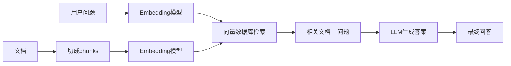

+++
title = "第20章 大语言模型"
weight = 200
date = "2026-04-08T13:22:00+08:00"
type = "docs"
description = ""
isCJKLanguage = true
draft = false
+++

# 第 20 章 玩转大模型：LLM 应用的修炼指南

> 本章我们将和大模型来个亲密接触，从调 API、搭本地模型、用 LangChain 搭 Agent、到 RAG、Prompt Engineering、PEFT 微调，一条龙服务到底。准备好了吗？让我们一起进入 AI 的奇幻世界！

---

## 20.1 LLM 基础概念

在正式开始写代码之前，我们先来聊聊大模型到底是什么。LLM 的全称是 **Large Language Model**，翻译过来就是"大型语言模型"。你可以把它想象成一个超级阅读了互联网上海量文本的"书虫"，它记住了几乎所有人类写过的文字，然后可以根据你的问题来"编"出合理的回答——注意是"编"，不是"查"，因为它真的不是在搜索，而是在根据概率生成下一个词。

### 20.1.1 常见模型（GPT / Claude / Gemini / 通义 / 文心）

大模型的世界里，有几个响当当的名字：

**GPT 系列（OpenAI）**

GPT 是 Generative Pre-trained Transformer 的缩写，中文叫"生成式预训练Transformer"。它就像是班里的学霸，见多识广，什么都能聊。GPT-4 是目前最旗舰的版本，智商在线，但价格也"在线"。它的兄弟 GPT-3.5 则走性价比路线，便宜量大。

**Claude（Anthropic）**

Claude 是由 Anthropic 公司打造的大模型，特色是**对齐训练**做得很好——换句话说，它更听话，更不容易"发疯"或者输出有害内容。Claude 3 系列包括 Haiku（轻量级）、Sonnet（中等）、Opus（旗舰级），名字取得很有艺术感。Claude 特别擅长写作、编程和长文本分析。

**Gemini（Google）**

Google 的亲儿子，原生支持多模态（能看图、看视频、听声音）。Gemini 1.5 版本的上下文窗口可以达到 100 万 token，相当于能一口气读完一整本《战争与和平》还有余。

**通义千问（阿里）**

国产之光！阿里云的通义千问系列开源了多个尺寸的模型，比如 Qwen-7B、Qwen-14B、Qwen-72B 等，在中文场景下表现非常出色。而且阿里还开源了视觉模型 Qwen-VL，简直是国产大模型的骄傲。

**文心一言（百度）**

百度基于 ERNIE（Enhanced Representation through Knowledge Integration）系列模型打造的生成式 AI 产品，在中文 NLP 领域积累深厚，特别擅长中文理解和生成。

| 模型 | 厂商 | 特色 | 适用场景 |
|------|------|------|----------|
| GPT-4 | OpenAI | 全能学霸 | 通用对话、编程 |
| Claude 3 | Anthropic | 安全对齐 | 写作、长文本 |
| Gemini | Google | 多模态强 | 图文混合任务 |
| Qwen | 阿里 | 中文开源 | 国产部署 |
| ERNIE | 百度 | 中文理解 | 中文企业场景 |

### 20.1.2 API 调用 vs 本地部署

这里有两条路可以走：

**API 调用（云端）**

你通过 HTTP 请求，把问题发送给大模型服务商（如 OpenAI、Anthropic）的服务器，服务器处理完后把答案返回给你。

优点：省心省力，不用自己折腾显卡，模型质量顶级。
缺点：要花钱（按 token 计费），数据要经过第三方服务器（隐私敏感场景要注意）。

**本地部署（私有化）**

你把模型下载到自己的机器上，用专门的推理框架（如 Ollama、vLLM、Text Generation Inference）在本地跑。

优点：完全私有，数据不出本机，免费（只需要电费和硬件成本），可以随意定制。
缺点：需要 GPU（显存至少 16GB 才勉强能跑 7B 模型），推理速度比云端慢，模型效果通常比顶级云端模型差一些。

> 打个比方：API 调用就像点外卖——别人做好了送上门，方便但要花钱；本地部署就像自己做饭——前期准备麻烦点，但完全可控，而且深夜饿了随时能开火。

### 20.1.3 Token 与上下文窗口

**Token（令牌）**

大模型并不直接处理"文字"，而是以 token 为单位处理。你可以把 token 理解为"词块"——英文里大约 1 个 token 等于 4 个字符，或者一个单词的片段；中文里通常 1-2 个汉字算一个 token。具体数字取决于模型的词表（vocabulary）。

举个例子：
```
"你好，世界" → ["你好", "，", "世界"] → 大约 3-4 个 token
"Hello, world" → ["Hello", ",", " world"] → 大约 3-4 个 token
```

为什么要用 token？因为模型处理数字比处理文字更在行。token 就是文字和数字之间的"翻译官"。

**上下文窗口（Context Window）**

上下文窗口是指模型一次能"看到"的最大 token 数量，包括你输入的问题和它输出的回答。如果你的输入超过了上下文窗口，模型就会"忘记"前面说过的话（严格来说是直接截断前面的内容）。

GPT-4 的上下文窗口是 128K tokens（约 10 万汉字），Claude 3 Opus 是 200K tokens，Gemini 1.5 更是高达 100 万 tokens。这就好比是模型的"工作记忆"——记忆越长，能处理的任务越复杂。

> 一个小技巧：如果你要处理一本 10 万字的小说，要选上下文窗口至少 10 万 token 的模型，否则模型会"记不住"前面看过的内容。

---

## 20.2 OpenAI API 调用

好了，理论基础够了，让我们开始写代码！先从最常见的 OpenAI API 说起。

### 20.2.1 openai Python SDK

首先安装一下 SDK：

```bash
pip install openai
```

然后你需要一个 API Key。去哪里找？去 [OpenAI 官网](https://platform.openai.com/) 注册一个账号，在 API Keys 页面创建一个密钥。注意：这个 Key 就像密码一样珍贵，千万别提交到 GitHub 上，否则你的钱钱会被别人用光光！

创建一个 `.env` 文件来管理 Key（推荐使用 `python-dotenv`）：

```bash
pip install python-dotenv
```

```python
# 准备工作：设置 API Key
import os
from dotenv import load_dotenv

load_dotenv()  # 加载 .env 文件
api_key = os.getenv("OPENAI_API_KEY")

# 如果你非要直接写 Key（不推荐），那就：
# api_key = "sk-xxxxxxxxxxxxxxxxxxxxxxxx"
```

### 20.2.2 ChatGPT API 调用

让我们先来一个最基础的调用，感受一下：

```python
from openai import OpenAI

client = OpenAI(api_key="your-api-key-here")

response = client.chat.completions.create(
    model="gpt-4o",  # 也可以用 "gpt-3.5-turbo" 省钱
    messages=[
        {"role": "system", "content": "你是一个幽默的 Python 老师"},
        {"role": "user", "content": "什么是装饰器？用通俗易懂的方式解释"}
    ],
    temperature=0.7,  # 控制随机性，0 最保守，1 最放飞自我
    max_tokens=500    # 最大生成 token 数
)

print(response.choices[0].message.content)
# 输出：装饰器就像是给你的函数戴上一顶"帽子"...（生动有趣的解释）
```

> 解释一下这些参数：
> - `model`：用哪个模型，"gpt-4o"是最新最强大的，"gpt-3.5-turbo"便宜又快
> - `messages`：对话历史，role 可以是 system（系统设定）、user（用户）、assistant（助手）
> - `temperature`：创意程度，0=非常确定性的回答，1=天马行空的回答
> - `max_tokens`：限制输出长度，避免模型写太长的废话

### 20.2.3 流式输出（Streaming）

如果你用过 ChatGPT 网页版，会发现回答是逐字出现的，这就是流式输出。好处是用户不用等全部生成完就能看到内容，体验超好。

```python
from openai import OpenAI

client = OpenAI(api_key="your-api-key-here")

stream = client.chat.completions.create(
    model="gpt-4o",
    messages=[
        {"role": "user", "content": "用一句话解释为什么程序员喜欢 Python"}
    ],
    stream=True  # 开启流式输出
)

# 逐字打印
for chunk in stream:
    if chunk.choices[0].delta.content:
        print(chunk.choices[0].delta.content, end="", flush=True)

# 输出：因为人生苦短，我用 Python（逐字出现）
```

> 流式输出的原理：服务器以 Server-Sent Events（SSE）的方式一个字一个字地推送数据。你看到的效果就像打字机一样。

### 20.2.4 函数调用（Function Calling）

Function Calling 是 GPT 的杀手锏功能之一。它让模型可以"调用函数"，也就是让 AI 能够执行具体操作，比如查天气、搜数据库、发邮件——而不只是"嘴上说说"。

首先定义函数：

```python
import json
from openai import OpenAI

client = OpenAI(api_key="your-api-key-here")

# 第一步：定义函数
functions = [
    {
        "name": "get_weather",
        "description": "获取指定城市的天气",
        "parameters": {
            "type": "object",
            "properties": {
                "city": {
                    "type": "string",
                    "description": "城市名称，比如北京、上海"
                },
                "unit": {
                    "type": "string",
                    "enum": ["celsius", "fahrenheit"],
                    "description": "温度单位"
                }
            },
            "required": ["city"]
        }
    }
]

# 第二步：发起带函数的请求
response = client.chat.completions.create(
    model="gpt-4o",
    messages=[
        {"role": "user", "content": "北京今天多少度？"}
    ],
    tools=[
        {"type": "function", "function": functions[0]}
    ],
    tool_choice="auto"
)

# 第三步：解析函数调用
message = response.choices[0].message

if message.tool_calls:
    tool_call = message.tool_calls[0]
    func_name = tool_call.function.name
    func_args = json.loads(tool_call.function.arguments)
    
    print(f"模型想调用函数：{func_name}")
    print(f"参数是：{func_args}")
    # 输出：模型想调用函数：get_weather
    # 参数是：{'city': '北京', 'unit': 'celsius'}
    
    # 这里可以真的调用天气 API，然后返回结果
    # weather_result = get_weather(func_args["city"], func_args["unit"])
```

> Function Calling 的本质是：模型识别到用户需要某个具体操作，于是"暂停生成"，告诉你"我需要调用一个函数，请提供结果"。你执行完函数后，再把结果传回去，模型继续生成。

### 20.2.5 多轮对话实现

真正的对话不会是只问一句话就结束了。我们需要一个"记忆"机制，把对话历史保存下来：

```python
from openai import OpenAI

client = OpenAI(api_key="your-api-key-here")

# 对话历史，初始化系统提示
conversation_history = [
    {"role": "system", "content": "你是一个博学多才的哲学导师"}
]

def chat(user_input):
    # 把用户的新消息加入历史
    conversation_history.append({"role": "user", "content": user_input})
    
    response = client.chat.completions.create(
        model="gpt-4o",
        messages=conversation_history
    )
    
    assistant_msg = response.choices[0].message.content
    
    # 把助手的回复也加入历史
    conversation_history.append({"role": "assistant", "content": assistant_msg})
    
    return assistant_msg

# 多轮对话
print(chat("人生的意义是什么？"))
# 模型回复关于人生意义的哲学思考...

print(chat("那宇宙的意义呢？"))
# 模型联系之前的对话，讨论宇宙层面的意义...
```

> 有一个需要注意的地方：上下文窗口是有限的。如果对话历史太长，超过了模型的最大 token 数，就需要"截断"早期对话。一个简单的策略是只保留最近 N 条消息。

---

## 20.3 Claude API 调用

Claude 是 Anthropic 公司的明星产品，它和 OpenAI 的 API 风格略有不同，但 SDK 也很好用。

### 20.3.1 anthropic Python SDK

```bash
pip install anthropic
```

```python
from anthropic import Anthropic

client = Anthropic(api_key="your-anthropic-api-key")

# 发送消息
message = client.messages.create(
    model="claude-3-5-sonnet-20241022",  # 也可以用 claude-3-opus, claude-3-haiku
    max_tokens=1024,
    messages=[
        {"role": "user", "content": "用一首诗形容 Python 的优雅"}
    ]
)

print(message.content[0].text)
# 输出：一行代码行天下，万千包中任横槊...
```

### 20.3.2 流式与非流式调用

**非流式（普通调用）**

```python
message = client.messages.create(
    model="claude-3-5-sonnet-20241022",
    messages=[
        {"role": "user", "content": "解释一下什么是 AIGC"}
    ]
)
print(message.content[0].text)
```

**流式调用**

```python
with client.messages.stream(
    model="claude-3-5-sonnet-20241022",
    messages=[
        {"role": "user", "content": "给我讲个程序员的笑话"}
    ]
) as stream:
    for event in stream:
        if event.type == "content_block_delta":
            print(event.delta.text, end="", flush=True)
```

> Claude 的 SDK 用的是 `client.messages.stream()` 的上下文管理器风格，with 块结束时自动完成。OpenAI 的 `stream=True` 参数则是迭代器风格。两种都很优雅，只是口味不同。

---

## 20.4 国产大模型

国产大模型近年来发展迅猛，而且很多都开源了！如果你不想付钱给 OpenAI，国产模型是很好的选择。

### 20.4.1 阿里通义千问（qwen-api）

通义千问（Qwen）是阿里云开源的大模型系列，支持 API 调用和本地部署。

```bash
pip install dashscope  # 阿里云的 SDK
```

```python
import os
from dashscope import Generation

# 设置 API Key
os.environ["DASHSCOPE_API_KEY"] = "your-api-key"

response = Generation.call(
    model="qwen-turbo",
    prompt="用 Python 写一个快速排序算法",
    temperature=0.8
)

if response.status_code == 200:
    print(response.output.text)
else:
    print(f"请求失败: {response.code}, {response.message}")
```

> Qwen 的模型矩阵非常丰富：
> - Qwen-Turbo：快速版，适合实时对话
> - Qwen-Plus：增强版，效果更好
> - Qwen-Max：旗舰版，效果最佳（但也更贵）
> - 开源版：Qwen-7B、Qwen-14B、Qwen-72B，可以下载到本地跑

### 20.4.2 百度文心一言（ERNIE）

百度的 ERNIE 系列在国内企业市场应用广泛，通过千帆大模型平台提供服务：

```bash
pip install qianfan
```

```python
import os
import qianfan

# 设置认证信息（也可以直接传入 api_key 和 secret_key）
os.environ["QIANFAN_ACCESS_KEY"] = "your-access-key"
os.environ["QIANFAN_SECRET_KEY"] = "your-secret-key"

# 使用 ERNIE-4.0
response = qianfan.ChatCompletion().do(
    model="ernie-4.0-8k-latest",
    messages=[
        {"role": "user", "content": "什么是大模型？"}
    ]
)

# response 是一个 Completion 对象，访问方式如下
print(response.result)
```

> 千帆平台是百度智能云的大模型服务平台，除了 ERNIE，还接入了很多第三方模型，一站式购齐。

### 20.4.3 智谱 GLM（zhipuai）

智谱 AI 的 GLM 系列是清华系团队的杰作，效果杠杠的，SDK 也很好用：

```bash
pip install zhipuai
```

```python
import zhipuai

zhipuai.api_key = "your-api-key"

# 同步调用（同步模式）
response = zhipuai.model_api.invoke(
    model="glm-4-flash",  # 快速版，或者用 glm-4 旗舰版
    prompt=[
        {"role": "user", "content": "用 Python 写一个斐波那契数列生成器"}
    ]
)

# response 是一个对象，属性访问方式
print(response.data.choices[0].content)
```

> 智谱还有一个厉害的地方：他们开源了 **ChatGLM** 系列（后面会在本地部署部分提到），在 Hugging Face 上非常受欢迎。

---

## 20.5 本地大模型部署

不想花钱？想让大模型在你的电脑上跑？没问题！这一节我们来聊聊本地部署。

### 20.5.1 Ollama（本地 LLM 部署工具）

**Ollama** 是目前最流行的本地大模型运行工具，零配置，开箱即用。它支持 Windows、macOS、Linux，而且自带命令行工具。

安装 Ollama（Windows 用户去 [ollama.com](https://ollama.com) 下载安装包即可）。

```bash
# 下载并运行模型（自动下载，自动运行）
ollama run llama3.2

# 运行中文模型
ollama run qwen2.5:7b

# 运行更小的模型（适合 CPU）
ollama run phi3
```

Ollama 启动后，会在本地启动一个 API 服务，默认地址是 `http://localhost:11434`。然后你就可以用 OpenAI 兼容的 API 来调用它：

```python
from openai import OpenAI

# Ollama 的 API 和 OpenAI 兼容，只需要改 base URL
client = OpenAI(
    base_url="http://localhost:11434/v1",
    api_key="ollama"  # Ollama 不需要真正的 key，随便写
)

response = client.chat.completions.create(
    model="qwen2.5:7b",  # 你下载的模型名
    messages=[
        {"role": "user", "content": "用 Python 写一个猜数字游戏"}
    ]
)

print(response.choices[0].message.content)
```

> Ollama 的好处就是"傻瓜式"——一行命令下载模型，一行命令运行模型，然后用标准 API 调用。缺点是目前不支持多卡并行推理，大模型在单卡上跑比较慢。

### 20.5.2 ChatGLM 本地部署

ChatGLM 是清华团队开源的双语对话模型，有 6B、12B 等版本。用 Ollama 来跑最简单：

```bash
ollama run chatglm3:6b
```

如果想手动部署（更多定制化），可以用 Hugging Face 的 `transformers` 库：

```bash
pip install transformers torch
```

```python
from transformers import AutoTokenizer, AutoModelForCausalLM

model_name = "THUDM/chatglm3-6b"

# 加载 tokenizer 和模型
tokenizer = AutoTokenizer.from_pretrained(model_name, trust_remote_code=True)
model = AutoModelForCausalLM.from_pretrained(
    model_name,
    trust_remote_code=True,
    torch_dtype="auto",  # 自动选择精度（GPU用float16，CPU用int8）
    device_map="auto"    # 自动分配设备
)

# 推理
prompt = "用一句话解释什么是机器学习"
inputs = tokenizer(prompt, return_tensors="pt").to(model.device)

outputs = model.generate(**inputs, max_new_tokens=200)
result = tokenizer.decode(outputs[0], skip_special_tokens=True)
print(result)
```

> `trust_remote_code=True` 是因为 ChatGLM 使用了自定义的模型代码，不是 Hugging Face 标准格式。这个参数允许加载模型目录下额外的 Python 代码。
>
> **显存警告**：ChatGLM-6B 全精度需要约 13GB 显存，量化后（int4）可以压缩到 5-6GB。量化就像是"压缩模型"，用更少的位数表示权重，牺牲一点精度换取速度和显存。

### 20.5.3 Qwen 本地部署

阿里 Qwen 的开源版也可以用 Ollama 一键运行：

```bash
ollama run qwen2.5:7b
```

或者用 Hugging Face：

```bash
pip install transformers accelerate
```

```python
from transformers import AutoTokenizer, AutoModelForCausalLM

model_name = "Qwen/Qwen2.5-7B-Instruct"  # Instruct 版本是对话优化过的

tokenizer = AutoTokenizer.from_pretrained(model_name, trust_remote_code=True)
model = AutoModelForCausalLM.from_pretrained(
    model_name,
    torch_dtype="bfloat16",  # bfloat16 比 float16 更稳定
    device_map="auto"
)

prompt = "写一个 Python 装饰器，实现缓存功能"
messages = [{"role": "user", "content": prompt}]
text = tokenizer.apply_chat_template(messages, tokenize=False, add_generation_prompt=True)
inputs = tokenizer([text], return_tensors="pt").to(model.device)

outputs = model.generate(**inputs, max_new_tokens=300)
print(tokenizer.decode(outputs[0][len(inputs.input_ids[0]):], skip_special_tokens=True))
```

> Qwen 2.5 使用了 `apply_chat_template`，这是 Hugging Face 新版 transformers 推荐的对话格式处理方式，让模型能正确理解对话结构。

### 20.5.4 vLLM（高效推理引擎）

如果 Ollama 的速度让你觉得"蜗牛爬"，那可以试试 **vLLM**。vLLM 是加州伯克利大学开源的高性能推理引擎，使用了 **PagedAttention** 技术，显存利用率比 naive 方式高 2-4 倍，吞吐量直接起飞。

```bash
pip install vllm
```

```python
from vllm import LLM, SamplingParams

# 加载模型
llm = LLM(model="Qwen/Qwen2.5-7B-Instruct")

# 设置采样参数
sampling_params = SamplingParams(
    temperature=0.7,
    top_p=0.95,
    max_tokens=512
)

# 批量推理（vLLM 的强项）
prompts = [
    "解释一下什么是递归",
    "用 Python 实现一个递归函数",
    "递归和循环的区别是什么"
]

outputs = llm.generate(prompts, sampling_params)

for output in outputs:
    print(output.outputs[0].text)
```

> vLLM 的核心黑科技是 **PagedAttention**。它借鉴了操作系统内存管理的思想，把 KV 缓存（模型生成过程中需要记住的上下文）分成"页"来管理，避免了传统方式中预先分配大片显存造成的浪费。
>
> 简单理解：传统方式是"先预定一整层楼"，vLLM 是"按需开房，随用随开"。

---

## 20.6 LangChain

终于到了 LangChain！这个框架是 AI 应用的"万能胶水"，把各种 AI 组件粘合在一起，让开发 AI 应用变得像搭积木一样简单。

### 20.6.1 LangChain 核心概念

LangChain 的核心理念是：**把 AI 应用拆分成不同的模块，然后灵活组合**。

核心模块包括：
- **Models**：支持的各种大模型（OpenAI、Anthropic、 Hugging Face 等）
- **Prompts**：提示词模板管理
- **Chains**：把多个步骤串起来
- **Agents**：让 AI 自主决策使用什么工具
- **Memory**：对话记忆
- **Tools**：外部工具（搜索引擎、数据库、API 等）

```bash
pip install langchain langchain-openai langchain-anthropic
```

### 20.6.2 Prompt 模板

Prompt 模板让你不用每次都手写完整的提示词，只要准备一个"填空模板"就行：

```python
from langchain.prompts import PromptTemplate

# 定义一个带变量的模板
template = PromptTemplate.from_template(
    """你是一个{language}翻译专家。
    请把下面的句子翻译成{output_language}：

    原文：{text}
    翻译："""
)

# 填入变量，生成最终 prompt
prompt = template.format(
    language="专业",
    output_language="中文",
    text="The quick brown fox jumps over the lazy dog."
)

print(prompt)
# 输出：
# 你是一个专业翻译专家。
# 请把下面的句子翻译成中文：
# 原文：The quick brown fox jumps over the lazy dog.
# 翻译：
```

### 20.6.3 Chain（链式调用）

Chain 把多个步骤串起来，形成一个处理流水线。最基础的是 LLMChain：

```python
from langchain_openai import OpenAI
from langchain.chains import LLMChain
from langchain.prompts import PromptTemplate

# 初始化模型
llm = OpenAI(api_key="your-api-key", temperature=0.9)

# 创建 chain
chain = LLMChain(
    llm=llm,
    prompt=PromptTemplate.from_template(
        "请为以下产品想一个创意广告语：{product_name}"
    )
)

# 运行 chain
result = chain.invoke({"product_name": "防晒霜"})
print(result["text"])
# 输出：阳光亲吻你的肌肤，我们守护你的美丽——XXX防晒霜
```

> Chain 的强大之处在于可以**组合**。比如 SequentialChain 可以把多个 Chain 串联起来，第一个 Chain 的输出作为第二个 Chain 的输入。

### 20.6.4 Agent（自主决策代理）

Agent 是 LangChain 最酷的功能！它让 AI 有了"自主行动"的能力——AI 会思考需要调用什么工具来完成任务。

```python
from langchain.agents import Agent, Tool, initialize_agent
from langchain_openai import OpenAI
from langchain.utilities import SerpAPIWrapper

# 假设我们有一个搜索工具
search = SerpAPIWrapper(serpapi_api_key="your-serpapi-key")

# 定义工具列表
tools = [
    Tool(
        name="搜索",
        func=search.run,
        description="当你需要查找最新信息时使用"
    )
]

# 初始化 Agent
llm = OpenAI(api_key="your-api-key", temperature=0)
agent = initialize_agent(
    tools=tools,
    llm=llm,
    agent="zero-shot-react-description",  # 让 Agent 描述自己的行动
    verbose=True  # 打印思考过程
)

# 让 Agent 自己决定怎么做
agent.run("2024年诺贝尔物理学奖得主是谁？")
```

> Agent 的工作原理基于 **ReAct**（Reasoning + Acting）范式：先思考（Reason），决定行动（Act），执行后观察结果（Observe），再继续循环。有点像是让 AI 在"想"和"做"之间反复横跳。
>
> `zero-shot-react-description` 的意思是：Agent 有零样本学习能力，可以根据工具的描述（description）来决定使用哪个工具，不需要提前训练。

### 20.6.5 Memory（对话记忆）

默认情况下，LLM 没有记忆——每次对话都是独立的。LangChain 提供了多种 Memory 实现：

```python
from langchain_openai import OpenAI
from langchain.chains import ConversationChain
from langchain.memory import ConversationBufferMemory

# 创建带记忆的对话链
llm = OpenAI(api_key="your-api-key", temperature=0)
memory = ConversationBufferMemory()

conversation = ConversationChain(
    llm=llm,
    memory=memory,
    verbose=True
)

# 对话
conversation.invoke({"input": "我叫小明"})
conversation.invoke({"input": "我叫什么呢？"})  # Agent 会记住"小明"
```

> LangChain 支持多种 Memory 类型：
> - `ConversationBufferMemory`：保存全部历史
> - `ConversationSummaryMemory`：自动总结历史，节省 token
> - `ConversationBufferWindowMemory`：只保留最近 N 条对话

### 20.6.6 工具调用（Tool Use）

除了 Agent 里面用工具，LangChain 也支持在 Chain 中直接集成工具：

```python
from langchain.tools import tool
from langchain_openai import OpenAI

# 自定义工具
@tool
def calculate_bmi(height: float, weight: float) -> float:
    """计算 BMI 指数"""
    return weight / (height ** 2)

@tool
def get_bmi_advice(bmi: float) -> str:
    """根据 BMI 值给出健康建议"""
    if bmi < 18.5:
        return "偏瘦，建议加强营养"
    elif bmi < 24:
        return "正常，继续保持！"
    else:
        return "偏重，建议加强运动"

llm = OpenAI(api_key="your-api-key", temperature=0)

# 用 bind_tools 把工具绑定到模型（类似 Function Calling）
llm_with_tools = llm.bind_tools([calculate_bmi, get_bmi_advice])
```

---

## 20.7 RAG（检索增强生成）

RAG 是目前最流行的 AI 应用架构之一，特别适合让 AI"阅读"私有文档（比如你的笔记、公司内部文件）来回答问题。

### 20.7.1 RAG 原理

RAG = **R**etrieval **A**ugmented **G**eneration（检索增强生成）。

原理很简单：
1. 把文档切成小块（chunks）
2. 用 Embedding 模型把每块变成向量
3. 存入向量数据库
4. 用户提问时，把问题也变成向量
5. 在向量数据库中搜索最相关的文档块
6. 把相关文档和问题一起发给 LLM，让 LLM 基于真实文档回答



> 为什么要 RAG？因为 LLM 的知识有截止日期，而且"记不住"你的私有文档。RAG 就像是给 LLM 配了一个图书管理员——先检索，再回答，而不是让它"蒙着眼睛瞎猜"。

### 20.7.2 文档加载（DocumentLoaders）

LangChain 提供了超级多的文档加载器，PDF、Word、网页、Notion、Slack 什么都有：

```bash
pip install langchain-community pypdf
```

```python
from langchain_community.document_loaders import PyPDFLoader

# 加载 PDF
loader = PyPDFLoader("data/python_tutorial.pdf")
pages = loader.load()

print(f"共加载了 {len(pages)} 页")
print(f"第一页内容（前200字）：{pages[0].page_content[:200]}")

# 加载网页
from langchain_community.document_loaders import WebBaseLoader
web_loader = WebBaseLoader(["https://python.org"])
web_docs = web_loader.load()
```

> 如果你需要加载中文 PDF，可能会用到 `unstructured` 库来处理更复杂的格式。

### 20.7.3 文本分割（RecursiveCharacterTextSplitter）

文档太大了，需要切成小块。每个块（chunk）会被 Embedding 并存入向量数据库。

```python
from langchain.text_splitter import RecursiveCharacterTextSplitter

# 初始化分割器
splitter = RecursiveCharacterTextSplitter(
    chunk_size=500,      # 每个块的最大字符数
    chunk_overlap=50,   # 块之间的重叠（避免切断语义）
    separators=["\n\n", "\n", "。", "！", "？", " "]  # 分割优先级
)

# 分割文档
docs = ["这是第一段文字。", "这是第二段文字，包含更多信息。", "最后一段。"]
chunks = splitter.create_documents(docs)

for i, chunk in enumerate(chunks):
    print(f"Chunk {i}: {chunk.page_content}")

# Chunk 0: 这是第一段文字。
# Chunk 1: 这是第二段文字，包含更多信息。
# Chunk 2: 最后一段。
```

> `chunk_size` 不能太大也不能太小。太大了向量检索精度下降，太小了语义不完整。通常 300-500 个字符是个不错的起点。

### 20.7.4 向量数据库（Chroma / Milvus / FAISS）

向量数据库是 RAG 的"图书馆"——存储文档的向量表示，并提供高速相似度搜索。

**Chroma（最简单，适合入门）**

```bash
pip install chromadb
```

```python
import chromadb

# 创建本地向量数据库（v0.4+ 推荐写法）
client = chromadb.PersistentClient(path="./chroma_data")
collection = client.get_or_create_collection(name="my_docs")

# 添加文档
collection.add(
    documents=["Python是一门优雅的编程语言", "Java是企业级开发的主流语言"],
    ids=["doc1", "doc2"]
)

# 搜索
results = collection.query(
    query_texts=["编程语言"],
    n_results=2
)

print(results["documents"][0])
# 输出：['Python是一门优雅的编程语言', 'Java是企业级开发的主流语言']
```

**FAISS（Facebook AI Similarity Search，适合大规模数据）**

```bash
pip install faiss-cpu  # 或者 faiss-gpu（如果你有 NVIDIA GPU）
```

```python
import faiss
import numpy as np

# 假设我们有一些 128 维的向量
dimension = 128
vectors = np.random.random((1000, dimension)).astype('float32')

# 建立索引
index = faiss.IndexFlatL2(dimension)  # L2 距离
index.add(vectors)

# 搜索最近的 5 个向量
query = np.random.random((1, dimension)).astype('float32')
distances, indices = index.search(query, k=5)

print(f"最近的5个索引: {indices[0]}")
print(f"对应距离: {distances[0]}")
```

**Milvus（生产级，分布式支持）**

Milvus 是专业的向量数据库，支持分布式部署，适合亿级向量数据。这里就不展开讲安装过程了（需要 Docker），只展示核心用法：

```python
from pymilvus import connections, Collection

connections.connect(host="localhost", port="19530")
collection = Collection("my_collection")
collection.load()

# 搜索（需要先有一个 query_vector 向量，由 Embedding 模型生成）
# 注意：query_vector 的维度必须与索引向量的维度一致，这里假设是 128 维
query_vector = [0.1] * 128  # 示例占位向量，实际使用时用 Embedding 模型生成真实向量
search_params = {"metric_type": "IP", "params": {"nprobe": 10}}
results = collection.search(
    data=[query_vector],
    anns_field="embedding",
    param=search_params,
    limit=10
)
```

> 选择建议：
> - Chroma：快速原型、最小部署
> - FAISS：单机中等规模（百万级向量）
> - Milvus/Pinecone：生产环境、大规模分布式

### 20.7.5 Embedding 模型

Embedding 模型负责把文字变成向量（数字列表）。常见的 Embedding 模型：

```python
# OpenAI 的 Embedding
from langchain_openai import OpenAIEmbeddings

embeddings = OpenAIEmbeddings(api_key="your-api-key")

# 嵌入单个文档
vec = embeddings.embed_query("Python编程")
print(f"向量维度: {len(vec)}")  # 1536 维（OpenAI text-embedding-3-small）
```

```python
# 国产 Embedding（中文效果更好）
# 阿里 gte-Qwen2 7B 在中文上表现不错
# 或者用中文专用模型 m3e

from langchain_community.embeddings import HuggingFaceBgeEmbeddings

# 这个模型中文效果好
embeddings = HuggingFaceBgeEmbeddings(
    model_name="BAAI/bge-large-zh-v1.5",
    model_kwargs={"device": "cpu"},
    encode_kwargs={"normalize_embeddings": True}
)

text_embedding = embeddings.embed_query("这是一段中文文本")
```

> 什么是 Embedding？简单说就是把文字"翻译"成一大串数字。意思相近的文字在数字空间里距离也近。比如"猫"和"狗"的向量距离，就比"猫"和"飞机"的距离近。

### 20.7.6 完整 RAG 流程实现

把上面的组件串起来，实现一个完整的 RAG 问答系统：

```python
from langchain_community.document_loaders import TextLoader
from langchain.text_splitter import RecursiveCharacterTextSplitter
from langchain_community.embeddings import HuggingFaceBgeEmbeddings
from langchain_community.vectorstores import Chroma
from langchain_openai import OpenAI
from langchain.chains.retrieval_qa.base import RetrievalQA

# 第一步：加载文档
loader = TextLoader("knowledge.txt", encoding="utf-8")
documents = loader.load()

# 第二步：分割文档
splitter = RecursiveCharacterTextSplitter(chunk_size=300, chunk_overlap=30)
chunks = splitter.split_documents(documents)

# 第三步：Embedding 并存入向量数据库
embeddings = HuggingFaceBgeEmbeddings(model_name="BAAI/bge-large-zh-v1.5")
db = Chroma.from_documents(chunks, embeddings, persist_directory="./chroma_db")

# 第四步：构建检索问答链
llm = OpenAI(api_key="your-api-key", temperature=0)
qa_chain = RetrievalQA.from_chain_type(
    llm=llm,
    chain_type="stuff",  # 把检索到的文档"塞"进 prompt
    retriever=db.as_retriever(search_kwargs={"k": 3})  # 返回最相关的3个文档
)

# 第五步：提问
query = "文档里关于Python的描述是什么？"
result = qa_chain.invoke({"query": query})

print(result["result"])
# 输出：基于检索到的文档片段生成的答案
```

> `chain_type="stuff"` 是最简单的方式，把所有检索到的文档直接拼接塞进 prompt。缺点是文档太多时可能超过上下文窗口。还有其他策略：
> - `map_reduce`：每个文档单独总结，再合并
> - `refine`：逐个精炼答案
> - `map_rerank`：每个文档打分，选最高分的

---

## 20.8 Prompt Engineering

Prompt Engineering（提示工程）是大模型时代程序员的新技能——写好提示词比调参更重要。

### 20.8.1 Zero-shot / Few-shot 提示

**Zero-shot** 就是直接问，不给例子：

```python
response = client.chat.completions.create(
    model="gpt-4o",
    messages=[
        {"role": "user", "content": "把'你好'翻译成英文"}
    ]
)
```

**Few-shot** 是给模型几个例子，让它"照着做"：

```python
response = client.chat.completions.create(
    model="gpt-4o",
    messages=[
        {"role": "system", "content": "你是一个翻译助手，用户给你一个中文句子，你翻译成英文。"},
        {"role": "user", "content": "你好"},
        {"role": "assistant", "content": "Hello"},
        {"role": "user", "content": "今天天气真不错"},
        {"role": "assistant", "content": "The weather is really nice today"},
        {"role": "user", "content": "我想吃火锅"}  # 模型会按例子推断
    ]
)

print(response.choices[0].message.content)
# 输出：I want to eat hotpot
```

> Few-shot 的魔力在于：即使模型从来没见过的任务，只要给它几个例子，它就能学会模式。这比 Zero-shot 通常效果好很多。

### 20.8.2 Chain of Thought（思维链）

思维链（CoT）是一种让模型"一步一步思考"的技术，特别适合数学和逻辑问题：

```python
# 没有 CoT：直接给答案，容易算错
response = client.chat.completions.create(
    model="gpt-4o",
    messages=[
        {"role": "user", "content": "一个商店有 15 个苹果，卖掉了 8 个，又进货 12 个，现在有多少个？"}
    ]
)

# 有 CoT：让模型解释推理过程
response = client.chat.completions.create(
    model="gpt-4o",
    messages=[
        {"role": "user", "content": """
一个商店有 15 个苹果，卖掉了 8 个，又进货 12 个，现在有多少个？

请分步思考，每一步用一句话说明计算过程。
"""}
    ]
)
```

> CoT 的论文（"Chain-of-Thought Prompting Elicits Reasoning in Large Language Models"）发现：只要在 prompt 里加一句"请分步思考"或者"Let me think step by step"，模型的数学和推理能力就能大幅提升。这是因为模型在生成中间步骤时，可以"借用"更多的计算资源。
>
> 更高级的版本是 **Self-Consistency**——让模型生成多条推理路径，然后投票选最一致的答案。

### 20.8.3 Prompt 模板设计

一个好的 Prompt 模板应该结构清晰：

```
【角色】你是一位[专业领域]专家
【任务】请完成以下任务：[具体任务描述]
【要求】
1. [要求1]
2. [要求2]
【格式】请以[指定格式]输出
【示例】
输入：[例子]
输出：[期望结果]
```

```python
from langchain.prompts import PromptTemplate

code_review_prompt = PromptTemplate.from_template("""【角色】你是一位资深代码审查员

【任务】请审查以下 Python 代码，找出潜在问题

【代码】
```{language}
{code}
```

【审查维度】
1. 代码安全性（是否有 SQL 注入、XSS 等漏洞）
2. 性能问题（是否有低效实现）
3. 代码可读性（命名、注释、风格）
4. 错误处理（是否有异常捕获）

【输出格式】
请用 JSON 格式输出，字段包括：
- security_issues: 安全问题列表
- performance_issues: 性能问题列表
- readability_issues: 可读性问题列表
- error_handling_issues: 错误处理问题列表
- overall_score: 1-10 分的综合评分
""")

prompt = code_review_prompt.format(language="python", code="print('hello')")
```

### 20.8.4 输出结构化（JSON 模式）

有时候你希望模型的输出是结构化的 JSON，方便程序解析：

```python
response = client.chat.completions.create(
    model="gpt-4o",
    messages=[
        {"role": "user", "content": """分析以下公司信息，返回 JSON：
公司名：阿里巴巴
行业：电商/云计算
员工数：约 23 万人

请返回 JSON，字段包括 company_name, industry, employee_count, ai_strategy（用一句话描述其AI战略）"""}
    ],
    response_format={"type": "json_object"}  # 强制输出 JSON
)

import json
result = json.loads(response.choices[0].message.content)
print(result["company_name"])  # 阿里巴巴
```

> `response_format={"type": "json_object"}` 是 GPT-4 的新特性，强制模型输出有效的 JSON。但要注意：模型可能不会 100% 严格遵循 JSON schema，最好在代码里做 try-except 容错处理。

---

## 20.9 AI Agent 开发

Agent 是 AI 应用的前沿领域——让 AI 不仅仅是回答问题，而是能够**自主规划、调用工具、完成任务**。

### 20.9.1 OpenAI Agents SDK

OpenAI 推出了自己的 Agents SDK，轻量级且专为多 Agent 协作设计：

```bash
pip install openai-agents
```

```python
from agents import Agent, function_tool

# 定义一个工具
@function_tool
def get_weather(city: str) -> str:
    """获取城市天气"""
    return f"{city}今天晴天，25度"

# 创建一个 Agent
weather_agent = Agent(
    name="天气助手",
    instructions="你是一个天气助手，用提供的工具回答用户关于天气的问题。",
    tools=[get_weather]
)

# 运行 Agent
result = weather_agent.run("北京现在天气怎么样？")
print(result.output)
```

### 20.9.2 CrewAI（多智能体协作）

CrewAI 是多 Agent 框架中的明星项目，让你用 YAML 配置就能编排多个 Agent：

```bash
pip install crewai
```

```python
from crewai import Agent, Task, Crew

# 创建多个 Agent
researcher = Agent(
    role="市场研究员",
    goal="收集最新 AI 技术动态",
    backstory="你是一名资深的 AI 行业研究员"
)

writer = Agent(
    role="科技记者",
    goal="把研究成果写成通俗易懂的报道",
    backstory="你是一名擅长写作的科技记者"
)

# 创建任务
task1 = Task(
    description="调研 2024 年大模型领域的最新进展",
    agent=researcher
)

task2 = Task(
    description="把研究员的发现写成一篇 500 字的科普文章",
    agent=writer,
    context=[task1]  # 等待 task1 的输出
)

# 组建团队并运行
crew = Crew(agents=[researcher, writer], tasks=[task1, task2])
result = crew.kickoff()

print(result)
```

> CrewAI 的核心概念是**角色扮演**——每个 Agent 有自己的 role（角色）、goal（目标）、backstory（背景故事）。合理的角色设定能显著提升 Agent 的表现。

### 20.9.3 AutoGen（微软多智能体框架）

微软的 AutoGen 支持更复杂的多 Agent 对话模式：

```bash
pip install autogen-agentchat
```

```python
import autogen

# 定义助手 Agent（能写代码、执行任务）
assistant = autogen.AssistantAgent(
    name="编程助手",
    system_message="你是 Python 编程专家，帮助用户解决编程问题。"
)

# 定义用户代理（代表用户）
user_proxy = autogen.UserProxyAgent(
    name="用户",
    human_input_mode="NEVER"  # 不需要人工介入
)

# 开始对话
user_proxy.initiate_chat(
    assistant,
    message="用 Python 写一个快速排序"
)
```

### 20.9.4 工具调用设计

无论用哪个框架，工具（Tools）的设计都很关键。一个好用的工具应该：

1. **命名清晰**：`get_weather` 比 `gw` 好 100 倍
2. **描述详细**：让 Agent 知道什么时候该用它
3. **参数 Schema 明确**：用 JSON Schema 定义每个参数的类型和用途

```python
from langchain.tools import tool

@tool
def search_flights(
    origin: str,
    destination: str,
    date: str,
    passengers: int = 1
) -> str:
    """
    搜索航班信息。

    参数：
        origin: 出发城市机场代码，如 PEK（首都机场）, SHA（虹桥）
        destination: 目的城市机场代码
        date: 出发日期，格式 YYYY-MM-DD
        passengers: 乘客数量，默认为 1

    返回：
        航班列表，包含航班号、起飞时间、到达时间、价格
    """
    # 这里调用真实的航班 API
    return "搜索结果：MU5107，起飞 08:00，到达 10:30，票价 800 元"
```

### 20.9.5 对话记忆管理

在复杂的 Agent 场景中，记忆管理尤为重要。常见的策略：

```python
from langchain.memory import ConversationSummaryMemory
from langchain_openai import OpenAI

llm = OpenAI(api_key="your-api-key", temperature=0)

# 自动总结式记忆（避免上下文爆炸）
memory = ConversationSummaryMemory(
    llm=llm,
    max_token_limit=2000  # 超过这个长度就总结
)

# 在 Agent 中使用
from langchain.agents import Agent, Tool

tools = [search_flights]  # 假设已定义

agent = Agent(
    llm=llm,
    tools=tools,
    memory=memory,
    verbose=True
)
```

---

## 20.10 大模型微调（PEFT）

预训练大模型很强大，但在特定任务上微调（Fine-tuning）能让模型表现更出色。PEFT（Parameter-Efficient Fine-Tuning，参数高效微调）让你用消费级 GPU 就能微调大模型。

### 20.10.1 LoRA 原理

**LoRA**（Low-Rank Adaptation）是目前最流行的 PEFT 方法。

核心思想：预训练模型的权重矩阵（ huge 的大矩阵）已经包含了丰富的知识，我们不需要重新训练所有参数。LoRA 的做法是：

1. 在原来的权重矩阵旁边，添加两个小矩阵 A 和 B
2. 训练时只更新 A 和 B，原来的大矩阵冻结不动
3. 推理时，把 A×B 的结果加到原权重上

```mermaid
flowchart TD
    A[冻结的预训练权重 W] -->|+[加法] F[更新后的权重]
    B[LoRA: 矩阵 A] --> C[矩阵 B]
    B --> F
    C --> F
```

> 举个例子：假设原权重矩阵 W 是 4096×4096，那是 1600 万个参数！但 LoRA 只添加两个小矩阵——A 是 4096×r，B 是 r×4096。如果 r=8，那就是 4096×8 + 8×4096 = 6.5 万个参数。只训练原来的 0.4%！
>
> 为什么叫"低秩"？因为 A×B 的乘积是一个低秩矩阵，只用 r 个维度就表达了 W 的"变化方向"。这就好比用简笔画捕捉一个人的特征——不需要画毛孔，但能认出是谁。

### 20.10.2 使用 Hugging Face PEFT 微调

下面是一个完整的 LoRA 微调示例，用的是 Hugging Face 的 `peft` 库和 `transformers`：

```bash
pip install peft transformers datasets trl
```

```python
from transformers import AutoModelForCausalLM, AutoTokenizer, TrainingArguments
from peft import LoraConfig, get_peft_model
from datasets import load_dataset

# 第一步：加载模型
model_name = "Qwen/Qwen2.5-0.5B-Instruct"  # 用小模型演示
tokenizer = AutoTokenizer.from_pretrained(model_name)
model = AutoModelForCausalLM.from_pretrained(
    model_name,
    device_map="auto",
    torch_dtype="float16"
)

# 第二步：配置 LoRA
lora_config = LoraConfig(
    r=8,                           # 低秩矩阵的秩，越大越强但越慢
    lora_alpha=16,                 # 缩放因子
    target_modules=["q_proj", "v_proj"],  # 只微调这些层
    lora_dropout=0.05,
    bias="none",
    task_type="CAUSAL_LM"          # 因果语言模型
)

# 第三步：给模型套上 LoRA
model = get_peft_model(model, lora_config)
model.print_trainable_parameters()
# 输出：trainable params: 393,216 || all params: 315,824,640 || trainable%: 0.124

# 第四步：准备数据集（这里用默认的 tiny_shakespeare 演示）
dataset = load_dataset("tiny_shakespeare", split="train")

def tokenize(example):
    # 把文本编码成 token
    result = tokenizer(
        example["text"],
        truncation=True,
        max_length=128,
        padding="max_length"
    )
    result["labels"] = result["input_ids"].copy()
    return result

tokenized_dataset = dataset.map(tokenize, batched=True)

# 第五步：训练参数
training_args = TrainingArguments(
    output_dir="./lora_output",
    per_device_train_batch_size=4,
    gradient_accumulation_steps=4,
    num_train_epochs=3,
    learning_rate=2e-4,
    logging_steps=10,
    fp16=True,  # 混合精度训练
)

# 第六步：开始训练！
from trl import SFTTrainer

trainer = SFTTrainer(
    model=model,
    args=training_args,
    train_dataset=tokenized_dataset,
    processing_class=tokenizer,
)

trainer.train()

# 第七步：保存 LoRA 权重
model.save_pretrained("./lora_weights")
```

> 微调后的权重只有几 MB（相比原始模型几个 GB 来说），可以轻松分享和加载！
>
> 加载微调后的模型：
> ```python
> from peft import PeftModel
> base_model = AutoModelForCausalLM.from_pretrained("Qwen/Qwen2.5-0.5B-Instruct")
> model = PeftModel.from_pretrained(base_model, "./lora_weights")
> ```

### 20.10.3 微调数据准备

微调效果好不好，数据质量是关键。数据格式通常是 **instruction-tuning** 格式：

```json
[
    {
        "instruction": "把下面的句子改成被动语态",
        "input": "科学家发现了这种新元素",
        "output": "这种新元素被科学家发现了"
    },
    {
        "instruction": "将以下中文翻译成英文",
        "input": "春眠不觉晓",
        "output": "Sleeping in spring, I am unaware of dawn"
    }
]
```

```python
from datasets import Dataset
import json

# 从 JSON 文件加载数据
with open("train_data.json", "r", encoding="utf-8") as f:
    raw_data = json.load(f)

# 转换成对话格式（模型能理解的形式）
def format_instruction(example):
    return {
        "text": f"问：{example['instruction']}\n答：{example['output']}"
    }

# 或者更规范的方式，用 chat template
def format_chat(example):
    messages = [
        {"role": "user", "content": example["instruction"] + "\n" + example.get("input", "")},
        {"role": "assistant", "content": example["output"]}
    ]
    text = tokenizer.apply_chat_template(messages, tokenize=False)
    return {"text": text}

dataset = Dataset.from_list(raw_data)
formatted_dataset = dataset.map(format_chat)
```

> **数据准备小贴士**：
> 1. 数据量不需要太多，100-1000 条高质量数据往往就够用
> 2. 格式要一致，指令（instruction）、输入（input）、输出（output）缺一不可
> 3. 清理噪声数据，错误答案不如没有答案
> 4. 如果有条件，做一下数据多样性分析，避免模型"偏科"

---

## 本章小结

这一章我们从多个维度深入探索了大模型（LLM）的应用世界。回顾一下核心要点：

### 基础知识
- **LLM** 是大语言模型，通过海量文本预训练获得语言理解和生成能力
- 常见模型包括 GPT、Claude、Gemini、通义千问、文心一言等，各有特色
- **Token** 是模型处理的基本单位，中文约 1-2 字一个 token
- **上下文窗口**决定模型一次能处理的最大 token 数

### API 调用
- **OpenAI API** 通过 `openai` SDK 调用，支持流式输出、函数调用、多轮对话
- **Claude API** 通过 `anthropic` SDK 调用，风格略有不同但同样强大
- **国产大模型**（通义千问、文心一言、智谱 GLM）提供开源/闭源多种选择

### 本地部署
- **Ollama** 是最简单的本地部署工具，一行命令运行各种开源模型
- **ChatGLM、Qwen** 等开源模型可以下载到本地，支持量化压缩
- **vLLM** 是高性能推理引擎，PagedAttention 技术让吞吐量大幅提升

### LangChain
- LangChain 是 AI 应用的"万能胶水"，把模型、工具、记忆串联起来
- **Prompt 模板**实现提示词复用
- **Chain** 把多个处理步骤串成流水线
- **Agent** 让 AI 自主决策使用什么工具
- **Memory** 为对话提供记忆能力

### RAG
- **RAG = 检索 + 生成**，解决 LLM 知识过时和无法访问私有数据的问题
- 核心流程：文档加载 → 文本分割 → Embedding → 向量存储 → 检索 → 生成
- 向量数据库（Chroma、FAISS、Milvus）提供高效相似度搜索
- Embedding 模型把文本映射到向量空间

### Prompt Engineering
- **Zero-shot** 直接提问，**Few-shot** 给例子效果更好
- **Chain of Thought** 引导模型分步思考，大幅提升推理能力
- 结构化的 Prompt 模板和 JSON 输出格式让结果更可控

### AI Agent
- Agent = 模型 + 工具 + 规划能力，能自主完成复杂任务
- **OpenAI Agents SDK**、**CrewAI**、**AutoGen** 是主流多 Agent 框架
- 工具设计要命名清晰、描述详细、参数 Schema 明确

### 模型微调（PEFT）
- **LoRA** 是最流行的参数高效微调方法，只训练 0.1%-1% 的参数
- 通过冻结原权重、添加低秩矩阵的方式，大幅降低微调成本
- 微调数据质量比数量更重要，100-1000 条高质量数据通常足够

> 大模型的世界日新月异，本章介绍的技术栈只是冰山一角。保持好奇心，持续学习，你就能在这个 AI 时代乘风破浪！记住：**AI 是工具，你是主人**——学会用好它，而不是被它吓倒。加油，未来的 AI 大师！ 🚀
