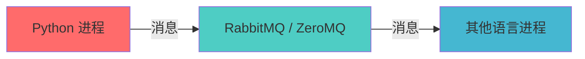
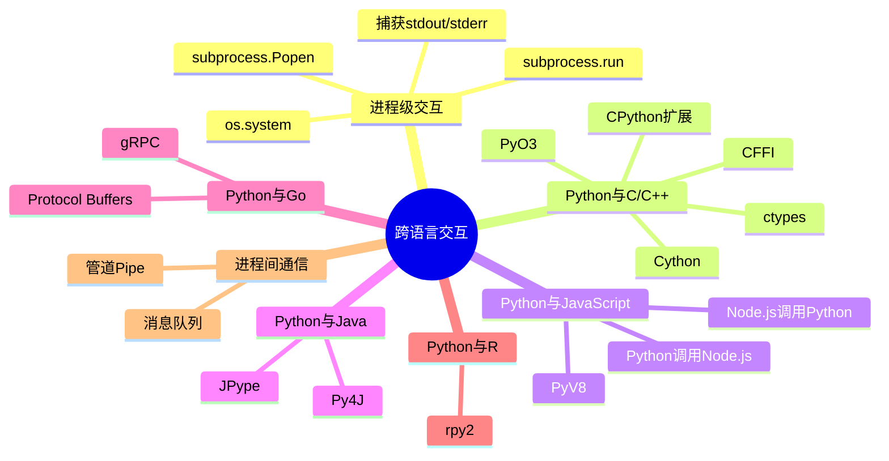

+++
title = "第21章 跨语言"
weight = 210
date = "2026-04-08T13:22:00+08:00"
type = "docs"
description = ""
isCJKLanguage = true
draft = false
+++

# 第二十一章：Python 与其他语言的"外交官"生涯

> 🎭 *本章导言：Python 虽然强大，但它可不是孤岛。这一章，我们让 Python 走出舒适区，学会和 C、Java、JavaScript、Go、R 等各路英雄豪杰称兄道弟、互帮互助。毕竟，独木不成林，孤码不成活！*

---

## 21.1 进程级交互（外部调用）

你有没有遇到过这种情况：Python 想说"给我运行一个系统命令"，但又懒得亲自下场？Python 说："没关系，我自己不方便做的事，我可以让别人帮我做！"

进程级交互，就是 Python 作为"老板"，把任务外包给系统命令，自己则坐等结果。形象地说，就是 Python 拿起电话（subprocess），给操作系统打了个电话："喂，帮我跑个 `ls` 或者 `git push` 呗。"

### 21.1.1 subprocess.run()（调用系统命令）

`subprocess.run()` 是 Python 3.5 引入的"万能遥控器"，用它可以轻松调用系统命令。想象你是一个遥控器爱好者，按一下按钮，电视就开了——`run()` 就是那个按钮。

**先解释几个概念：**
- **subprocess**：子进程模块，就是"帮我生个孩子（进程），让它去干活"
- **run()**：运行的意思，这里指"跑一个命令"
- **stdout**：标准输出，就是程序"正常说话"的那张嘴
- **stderr**：标准错误，就是程序"抱怨/报错"的那张嘴

```python
import subprocess

# 最简单的用法：运行一个命令，看看它能不能跑通
result = subprocess.run(['echo', 'Hello from the other side!'], capture_output=True, text=True)

# 打印运行结果
print(result.stdout)  # Hello from the other side!
print(result.returncode)  # 0（0表示成功，非0表示搞砸了）
```

> 运行一个命令就像点外卖：你下单（传入命令参数），厨房做菜（系统执行），外卖送达（返回结果）。`returncode` 就是外卖小哥给你的评分——0分是满分，意思是一切顺利！

再来看一个更有用的例子——获取系统信息：

```python
import subprocess

# 在 Windows 上获取 IP 地址
result = subprocess.run(['ipconfig'], capture_output=True, text=True, encoding='gbk')

# 或者跨平台的写法
result = subprocess.run(['python', '--version'], capture_output=True, text=True)

print(result.stdout)  # Python 3.11.4
print(result.stderr)  # 如果有错误，会在这里显示
print(result.returncode)  # 0
```

> **小贴士：** 在 Windows 上，默认输出是 GBK 编码；在 Linux/Mac 上是 UTF-8。如果不指定编码，中文可能会变成乱码（变成一串 `�`），那场面就像是看《指环王》里的半兽人在说话。

`run()` 的常见参数：
- `args`：要执行的命令，可以是字符串列表（推荐）或字符串
- `capture_output=True`：捕获 stdout 和 stderr
- `text=True`：返回字符串而非字节（人类友好）
- `encoding`：指定编码
- `timeout`：超时时间，防止命令卡死（比如你的命令去泡茶了）
- `cwd`：工作目录（命令在哪个文件夹里执行）

```python
import subprocess
import time

# 模拟一个耗时任务（实际上你不会真的这么用）
result = subprocess.run(['python', '-c', 'import time; time.sleep(1); print("我醒了！")'],
                        capture_output=True, text=True, timeout=5)
print(result.stdout)  # 我醒了！
```

### 21.1.2 subprocess.Popen()（进程管道通信）

如果说 `run()` 是"打个电话等对方说完就挂断"，那 `Popen()` 就是"打开一个持久连接，可以随时聊天"。

**什么时候用 Popen 而不是 run？**
- 你需要和进程**持续交流**（比如实时获取日志）
- 你需要**同时**向进程输入和输出
- 你要启动一个**长时间运行**的进程

```python
import subprocess

# 启动一个 Python 进程
proc = subprocess.Popen(
    ['python', '-c', 'while True: import time; print("心跳..."); time.sleep(1)'],
    stdout=subprocess.PIPE,
    stderr=subprocess.PIPE,
    text=True
)

# 读取前 3 行输出
for i in range(3):
    line = proc.stdout.readline()
    if line:
        print(f"收到: {line.strip()}")

# 干完活，让进程优雅地退休
proc.terminate()  # 发送终止信号
proc.wait()  # 等待它真正结束
print("进程已终止，优雅退休！")
```

> **比喻时间：** `run()` 像是发短信——发出去，等回复，看完就完了。`Popen()` 像是打电话——你可以随时说话、听对方说、随时打断。管道（Pipe）就是电话线。

**用 Popen 实现一个"双人对话"：**

```python
import subprocess

# 启动一个可以交互的程序，比如 Python 解释器本身
proc = subprocess.Popen(
    ['python', '-i'],  # -i 表示交互模式
    stdin=subprocess.PIPE,
    stdout=subprocess.PIPE,
    stderr=subprocess.PIPE,
    text=True
)

# 向 Python 解释器发送代码
proc.stdin.write('print(1 + 1)\n')
proc.stdin.flush()  # 刷新缓冲区，确保数据发送出去

# 读取结果
output = proc.stdout.readline()
print(f"Python 说：{output.strip()}")

# 再来一发！
proc.stdin.write('import sys; print(sys.version)\n')
proc.stdin.flush()
output = proc.stdout.readline()
print(f"Python 版本：{output.strip()}")

# 退出交互式 Python
proc.stdin.write('exit()\n')
proc.wait()
```

> **友情提示：** `Popen` 打开的进程要记得关掉！不然就变成了"僵尸进程"——一个已经死掉但还占用系统资源的行尸走肉。这就像吃完外卖不扔餐盒，既浪费空间又招虫子。

### 21.1.3 os.system（简单命令执行）

这是 Python 里的"老前辈"，比 subprocess 还早出现。简单粗暴，一行搞定。

```python
import os

# 执行一个系统命令（Windows）
os.system('dir')  # 相当于在 CMD 里敲 dir

# 执行一个系统命令（Linux/Mac）
os.system('ls -la')

# 也可以这样（Linux 下）
os.system('echo "Hello from the old school!"')
```

> **历史小知识：** `os.system()` 诞生于 Python 1.x 时代，是元老级选手。它简单，但功能也简单——只能执行命令、返回退出码，没法捕获输出。后来有了 subprocess，它就慢慢退居二线了。现在的 `os.system()` 就像是退休的老干部，偶尔用用可以，但重要任务还是交给 subprocess 吧。

**对比一下三者的区别：**

| 特性 | `os.system` | `subprocess.run` | `subprocess.Popen` |
|------|-------------|-----------------|-------------------|
| 诞生年代 | Python 1.x | Python 3.5 | Python 2.4 |
| 获取输出 | ❌ 只能打印 | ✅ 可以捕获 | ✅ 实时读取 |
| 管道通信 | ❌ | ❌ | ✅ |
| 超时控制 | ❌ | ✅ | ✅ |
| 推荐程度 | ⭐ 不推荐 | ⭐⭐⭐ 推荐 | ⭐⭐⭐⭐ 专业场景 |

```python
import os
import subprocess

# 不推荐的方式：os.system（输出直接打印到屏幕，不好捕获）
# os.system('echo "This goes directly to screen"')

# 推荐的方式：subprocess.run
result = subprocess.run('echo "This is captured"', capture_output=True, text=True, shell=True)
print(f"捕获的输出: {result.stdout.strip()}")
```

### 21.1.4 捕获输出（stdout / stderr）

程序运行时会"说话"，它的"嘴巴"有两张嘴：
- **stdout（标准输出）**：程序正常说话的内容
- **stderr（标准错误）**：程序抱怨、报错的内容

有时候我们想把这两张嘴说的话都录下来，这就叫"捕获输出"。

```python
import subprocess

# 场景1：正常输出 vs 错误输出
result = subprocess.run(
    ['python', '-c', 'print("我是正常输出"); import sys; sys.stderr.write("我是错误输出\n")'],
    capture_output=True,
    text=True
)

print("=== stdout（正常输出）===")
print(result.stdout)  # 我是正常输出

print("=== stderr（错误输出）===")
print(result.stderr)  # 我是错误输出
```

```python
# 场景2：分别捕获
result = subprocess.run(
    ['python', '-c', '''
import sys
print("标准输出：我很好")
print("标准错误：我有问题！", file=sys.stderr)
''',
    ],
    capture_output=True,
    text=True,
    encoding='utf-8'
)

print(f"stdout: {result.stdout}")
print(f"stderr: {result.stderr}")
```

```python
# 场景3：shell=True 的情况下合并输出
result = subprocess.run(
    'echo "normal" && python -c "import sys; sys.stderr.write(\"error\\n\")"',
    shell=True,
    capture_output=True,
    text=True
)
print(f"combined: {result.stdout}")
print(f"stderr: {result.stderr}")
```

> **生活实例：** 想象你在看一个人演讲（程序运行）。stdout 就是他演讲的内容，stderr 就是他在台下小声嘀咕的抱怨。捕获输出就像是在他嘴边放两个录音笔，分别录下演讲和抱怨。

```python
# 场景4：丢弃输出（不关心输出，只关心退出码）
result = subprocess.run(['python', '-c', 'print("无声的输出")'], capture_output=True)

# 丢弃所有输出
import subprocess
import os

# 方法1：定向到 devnull
result = subprocess.run(['ls', '-la'], stdout=subprocess.DEVNULL, stderr=subprocess.DEVNULL)
print(f"退出码: {result.returncode}")  # 0 表示成功

# 方法2：在 Linux 上用 > /dev/null 2>&1
result = subprocess.run('ls > /dev/null 2>&1', shell=True)
print(f"退出码: {result.returncode}")
```

> **程序员的自嘲：** "捕获输出"有时候是为了假装程序没有报错——就像把警告音响关掉，但问题还在。不过更健康的做法是正视错误，而不是掩耳盗铃。

---

## 21.2 Python 与 C / C++ 交互

Python 和 C/C++ 的关系，有点像"老板和高级打工仔"。Python 是老板，说话好听（语法简洁），但不擅长干苦力活（性能敏感的计算）。C/C++ 是打工仔，说话难听（语法复杂），但力大无穷（执行速度快）。

Python 想要调用 C/C++ 的能力，有几种方式，我们一一道来。

### 21.2.1 ctypes（调用 C 动态链接库）

`ctypes` 是 Python 内置的"外语翻译器"，它能让 Python 直接调用 C 编写的动态链接库（.dll 在 Windows，.so 在 Linux）。

**先科普几个概念：**
- **动态链接库（.dll / .so）**：编译好的二进制代码，别人可以直接拿来用，不用重新编译
- **ctypes**：Python 标准库，专门干"翻译"的活，让 Python 能调用 C 的函数
- **FFI**：Foreign Function Interface，外国函数接口——就是"让不同语言能互相调用函数"的通用术语

```python
# 首先，你需要一个编译好的 C 库
# 假设你有一个名为 libmath_functions 的库（编译好的 .so 或 .dll）

import ctypes

# 加载动态链接库
# Windows 上
# lib = ctypes.CDLL("path/to/your_library.dll")

# Linux 上
# lib = ctypes.CDLL("libm.so.6")  # 数学库

# 假设我们有一个 C 函数：int add(int a, int b)
# lib.add.argtypes = [ctypes.c_int, ctypes.c_int]  # 指定参数类型
# lib.add.restype = ctypes.c_int  # 指定返回类型

# 调用它！
# result = lib.add(3, 5)
# print(result)  # 8
```

> **ctypes 的本质：** 它就像一个翻译软件，把 Python 的"我想调用 add 函数，参数是 3 和 5"翻译成 C 能听懂的话，再把 C 的返回值翻译回 Python 能理解的形式。

**一个完整的例子（假设你有一个 C 写的加法函数）：**

```c
// mylib.c - 这是一个 C 源文件
// 编译命令：gcc -shared -fPIC -o libmylib.so mylib.c

int add(int a, int b) {
    return a + b;
}

double square(double x) {
    return x * x;
}

void greet(char* name) {
    printf("Hello, %s!\n", name);
}
```

```python
import ctypes

# 加载编译好的库（假设叫 libmylib.so 或 mylib.dll）
lib = ctypes.CDLL("./libmylib.so")  # Linux/Mac
# lib = ctypes.CDLL("./mylib.dll")  # Windows

# 设置函数签名（告诉 ctypes 参数和返回值的类型）
lib.add.argtypes = [ctypes.c_int, ctypes.c_int]
lib.add.restype = ctypes.c_int

# 调用 C 函数
result = lib.add(10, 20)
print(f"10 + 20 = {result}")  # 30
```

> **ctypes 的局限：** 它只能调用 C 函数，不能调用 C++ 类和方法。而且，你必须知道 C 函数的签名（参数类型、返回类型），否则就会乱套——就像让翻译软件翻译一篇它不懂专业的文章，结果会牛头不对马嘴。

### 21.2.2 CFFI（C 外部函数接口）

CFFI 是"现代版"的 ctypes，比 ctypes 更强大、更灵活。如果说 ctypes 是"老式翻译机"，那 CFFI 就是"AI 翻译官"。

**CFFI 的优势：**
- 语法更优雅
- 支持更多的数据类型
- 可以在 Python 中直接编写 C 代码片段
- 对 C++ 的支持更好

```python
# 安装：pip install cffi

from cffi import FFI

ffi = FFI()

# 声明 C 函数和结构
ffi.cdef("""
    int add(int a, int b);
    double square(double x);
    void greet(char* name);
""")

# 加载库
C = ffi.dlopen("./libmylib.so")  # Linux/Mac
# C = ffi.dlopen("./mylib.dll")  # Windows

# 调用 C 函数
result = C.add(5, 7)
print(f"5 + 7 = {result}")  # 12

result = C.square(3.5)
print(f"3.5² = {result}")  # 12.25
```

```python
# CFFI 还能让你在 Python 里写 C 代码！
from cffi import FFI

ffi = FFI()

# 在 Python 中内嵌 C 代码
ffi.cdef("""
    // 声明一个计算圆面积的函数
    double circle_area(double radius);
""")

# 写 C 代码并编译
ffi.set_source("my_extension", """
    #include <math.h>
    double circle_area(double radius) {
        return M_PI * radius * radius;
    }
""")

ffi.compile()

# 导入编译好的模块
import my_extension
print(f"半径为 5 的圆面积: {my_extension.circle_area(5):.2f}")  # 78.54
```

> **CFFI vs ctypes：** 如果 ctypes 是手动挡汽车，那 CFFI 就是自动挡——更舒服、更智能。但两者都是"翻译"工具，最终目的都是让 Python 能调用 C 代码。

### 21.2.3 Cython（Python 编译为 C）

Cython 是 Python 世界里的"超级赛亚人"。它能把 Python 代码翻译成 C 代码，然后再编译成机器码，让 Python 跑得像 C 一样快。

**应用场景：**
- 加速 Python 里的循环（Python 的 for 循环很慢！）
- 加速数学计算
- 保护 Python 源代码（编译成 .so 后，源代码就看不见了）

```python
# 安装：pip install cython

# 原始的 Python 代码（慢）
def py_sum(n):
    total = 0
    for i in range(n):
        total += i
    return total
```

```cython
# speedup.pyx - Cython 代码（快）
# 编译命令：cythonize -i speedup.pyx

def cy_sum(int n):
    cdef int total = 0  # cdef 是 Cython 的关键字，声明 C 类型的变量
    cdef int i
    for i in range(n):
        total += i
    return total

# 带类型标注的版本（更快）
cpdef double cy_sum_float(int n):
    cdef double total = 0.0
    cdef int i
    for i in range(n):
        total += i
    return total
```

```python
# setup.py - 编译脚本
from setuptools import setup
from Cython.Build import cythonize

setup(
    name="speedup",
    ext_modules=cythonize("speedup.pyx"),
)
```

```bash
# 编译命令
# python setup.py build_ext --inplace
```

```python
# 使用编译好的模块
from speedup import cy_sum, cy_sum_float
import time

n = 10_000_000

# 测试 Python 版本
start = time.time()
py_result = py_sum(n)  # 假设 py_sum 在 py_version.py 里
py_time = time.time() - start

# 测试 Cython 版本
start = time.time()
cy_result = cy_sum(n)
cy_time = time.time() - start

print(f"Python 用时: {py_time:.3f}秒")
print(f"Cython 用时: {cy_time:.3f}秒")
print(f"加速比: {py_time/cy_time:.1f}x")
```

> **Cython 的秘密：** Cython 其实是"带了类型注解的 Python"。它允许你在 Python 代码里加入 C 的类型声明，这样 Python 解释器就不用"猜"数据类型了，执行速度自然就快了。这就像从"普通话"升级到"英语"——外国人（CPU）听起来更清晰，执行起来更顺畅。

### 21.2.4 CPython 扩展开发（Python/C API）

这是 Python 官方提供的"官方渠道"，最正统、最底层的方式——直接用 C 语言编写 Python 扩展模块。

**听起来很复杂？** 确实，这是 Python 和 C 交互中最"硬核"的方式。需要你：
1. 懂 C 语言
2. 懂 Python 的 C API
3. 懂 CPython 的内部原理

```c
// mymodule.c - 用 C 写的 Python 扩展
#define PY_SSIZE_T_CLEAN
#include <Python.h>

// 这是我们的 C 函数
static PyObject* py_add(PyObject* self, PyObject* args) {
    int a, b;
    // 解析 Python 传来的参数
    if (!PyArg_ParseTuple(args, "ii", &a, &b)) {
        return NULL;  // 参数解析失败
    }
    // 计算结果
    int result = a + b;
    // 返回 Python 的整数对象
    return PyLong_FromLong(result);
}

// 描述这个模块里有哪些函数
static PyMethodDef MyMethods[] = {
    {"add", py_add, METH_VARARGS, "Add two integers."},
    {NULL, NULL, 0, NULL}  // 结束标记
};

// 模块定义
static struct PyModuleDef mymodule = {
    PyModuleDef_HEAD_INIT,
    "mymodule",
    "A simple example module",
    -1,
    MyMethods
};

// 模块初始化函数（必须是 PyInit_模块名）
PyMODINIT_FUNC PyInit_mymodule(void) {
    return PyModule_Create(&mymodule);
}
```

```python
# setup.py - 编译 C 扩展
from setuptools import setup, Extension

ext_modules = [
    Extension('mymodule', ['mymodule.c']),
]

setup(
    name='mymodule',
    ext_modules=ext_modules,
)
```

```bash
# 编译（在命令行执行）
# python setup.py build_ext --inplace
```

```python
# 在 Python 中使用
import mymodule

result = mymodule.add(3, 5)
print(f"3 + 5 = {result}")  # 8
```

> **为什么叫 CPython 扩展？** CPython 就是用 C 语言实现的 Python 官方解释器。CPython 扩展就是"给 CPython 添加新功能"的方式——就像给手机装 App，只不过这个 App 是用 C 语言写的，而且需要重新编译整个"手机系统"才能用（导入编译好的 .so/.pyd 文件）。

> **Python/C API 速览：** `PyObject` 是 Python 所有对象的"祖宗"，`PyLong_FromLong()` 把 C 的 long 转成 Python 的整数，`PyArg_ParseTuple()` 解析 Python 传来的参数。这套 API 是 C 和 Python 之间沟通的"官方语言"。

### 21.2.5 PyO3（Rust 编写 Python 扩展）

PyO3 是 Rust 语言写 Python 扩展的"神器"。Rust 是一种现代系统编程语言，以安全著称——它能在编译时就防止很多 C/C++ 里常见的 bug（比如内存泄漏）。

**Rust + Python = ？"安全飞毯"？**

```rust
// lib.rs - 用 Rust 写的 Python 扩展
use pyo3::prelude::*;
use pyo3::wrap_pyfunction;

#[pyfunction]
fn rust_add(a: i32, b: i32) -> i32 {
    a + b
}

#[pyfunction]
fn rust_fibonacci(n: u32) -> u32 {
    match n {
        0 => 0,
        1 => 1,
        _ => {
            let mut a = 0;
            let mut b = 1;
            for _ in 2..=n {
                let temp = a + b;
                a = b;
                b = temp;
            }
            b
        }
    }
}

#[pymodule]
fn myrustlib(py: Python, m: &PyModule) -> PyResult<()> {
    m.add_function(wrap_pyfunction!(rust_add, m)?, py)?;
    m.add_function(wrap_pyfunction!(rust_fibonacci, m)?, py)?;
    m.add_class::<MyStruct>()?;
    Ok(())
}

// 定义一个 Rust 结构体，可在 Python 中直接使用
#[pyclass]
struct MyStruct {
    #[pyo3(get, set)]
    x: i32,
    #[pyo3(get, set)]
    y: i32,
}

#[pymethods]
impl MyStruct {
    #[new]
    fn new(x: i32, y: i32) -> Self {
        MyStruct { x, y }
    }

    fn multiply(&mut self, factor: i32) {
        self.x *= factor;
        self.y *= factor;
    }
}
```

```toml
# Cargo.toml - Rust 项目的配置
[package]
name = "myrustlib"
version = "0.1.0"
edition = "2021"

[lib]
name = "myrustlib"
crate-type = ["cdylib"]  # 动态库，用于 Python 扩展

[dependencies]
pyo3 = "0.22"
```

```bash
# 构建 Rust 扩展
# maturin develop  # 开发模式
# maturin build   # 生产模式
```

```python
# Python 中使用 Rust 扩展
import myrustlib

result = myrustlib.rust_add(10, 20)
print(f"10 + 20 = {result}")  # 30

result = myrustlib.rust_fibonacci(10)
print(f"Fibonacci(10) = {result}")  # 55
```

> **PyO3 的魅力：** Rust 写的扩展既快又安全，而且 Rust 代码很难写出内存泄漏——编译器会"强制"你做对。这就像雇了一个既勤快又细心的员工，几乎不会出错。

```python
# PyO3 还能做更多！
# 比如，直接在 Python 中定义 Rust 结构体

from myrustlib import MyStruct

# 创建一个 Rust 结构体
s = MyStruct(x=10, y=20)
print(f"x={s.x}, y={s.y}")
s.multiply(5)
print(f"After multiply(5): x={s.x}, y={s.y}")
```

---

## 21.3 Python 与 JavaScript / Node.js 交互

Python 和 JavaScript 是"Web 世界的两大巨头"——Python 主宰后端，JavaScript 主宰前端。它们各自为营，但也需要互相合作。

### 21.3.1 在 Node.js 中调用 Python（child_process）

Node.js 可以通过 `child_process` 模块启动 Python 进程，然后通过标准输入输出进行通信。这就像 Node.js "雇佣"了一个 Python 员工，让它帮忙干活。

```javascript
// app.js - Node.js 代码
const { spawn } = require('child_process');

// 启动 Python 解释器
const python = spawn('python', ['-u', 'python_script.py']);

// 监听 Python 的输出
python.stdout.on('data', (data) => {
    console.log(`Python says: ${data.toString().trim()}`);
});

python.stderr.on('data', (data) => {
    console.error(`Python error: ${data.toString().trim()}`);
});

// 向 Python 发送数据
python.stdin.write('Hello from Node.js!\n');
python.stdin.write('Another message\n');
python.stdin.end();  // 告诉 Python 我说完了

python.on('close', (code) => {
    console.log(`Python process exited with code ${code}`);
});
```

```python
# python_script.py - Python 代码
import sys

# 实时读取 Node.js 发来的数据
for line in sys.stdin:
    message = line.strip()
    if message:
        print(f"Received: {message}")
        # 可以根据消息内容做不同的事情
        if message == "Hello from Node.js!":
            print("Hi there, Node.js!")
        elif message == "Another message":
            print("Got it!")
```

> **工作原理：** Node.js 和 Python 通过管道（stdin/stdout）进行通信。Node.js 往 stdin 里写数据，Python 从 stdin 里读数据；Python 往 stdout 里写结果，Node.js 从 stdout 里读结果。这就像两个人通过一根水管传递纸条——简单但有效。

**更优雅的方式：JSON 通信**

```javascript
// Node.js 端
const { spawn } = require('child_process');
const python = spawn('python', ['-u', 'json_server.py']);

const request = {
    action: 'calculate',
    params: { a: 10, b: 20 }
};

python.stdout.on('data', (data) => {
    const response = JSON.parse(data.toString());
    console.log('Result:', response.result);
});

python.stdin.write(JSON.stringify(request) + '\n');
python.stdin.end();
```

```python
# Python 端：json_server.py
import sys
import json

def calculate(a, b):
    return a + b

for line in sys.stdin:
    line = line.strip()
    if not line:
        continue
    request = json.loads(line)
    
    if request['action'] == 'calculate':
        result = calculate(**request['params'])
        response = {'status': 'ok', 'result': result}
        print(json.dumps(response))
        sys.stdout.flush()
```

### 21.3.2 在 Python 中调用 Node.js（subprocess）

反过来，Python 也可以调用 Node.js——通过 subprocess 模块启动 Node.js 进程。

```python
import subprocess
import json

# 启动 Node.js 脚本
result = subprocess.run(
    ['node', '-e', '''
        const crypto = require('crypto');
        const hash = crypto.createHash('sha256').update('hello').digest('hex');
        console.log(hash);
    '''],
    capture_output=True,
    text=True
)

print(f"SHA256 of 'hello': {result.stdout.strip()}")  # 2cf24dba5fb0a30e26e83b2ac5b9e29e1b161e5c1fa7425e73043362938b9824
```

```python
# 更复杂的例子：调用一个 Node.js 的 HTTP 服务
import subprocess
import json

# 先启动一个简单的 Node.js HTTP 服务器
node_code = '''
const http = require('http');
const server = http.createServer((req, res) => {
    if (req.url === '/api/hello') {
        res.writeHead(200, {'Content-Type': 'application/json'});
        res.end(JSON.stringify({message: 'Hello from Node.js!'}));
    } else {
        res.writeHead(404);
        res.end('Not Found');
    }
});
server.listen(3000, () => console.log('Server ready'));
'''

# 启动 Node.js 服务器
proc = subprocess.Popen(
    ['node', '-e', node_code],
    stdout=subprocess.PIPE,
    stderr=subprocess.PIPE,
    text=True
)

import time
time.sleep(1)  # 等待服务器启动

# 用 Python 发送 HTTP 请求
import urllib.request

try:
    with urllib.request.urlopen('http://localhost:3000/api/hello') as response:
        data = json.loads(response.read().decode())
        print(data['message'])  # Hello from Node.js!
finally:
    proc.terminate()
    proc.wait()
```

> **HTTP 通信的优势：** 如果说管道（stdin/stdout）是"对讲机"，那 HTTP 就是"打电话"。对于复杂的数据交换，HTTP+JSON 是更标准、更可扩展的方式。

### 21.3.3 PyV8（Python 中的 V8 引擎）

V8 是 Chrome 和 Node.js 使用的 JavaScript 引擎，它负责"执行" JavaScript 代码。PyV8 就是让 Python 能够"驾驶" V8 引擎，直接在 Python 里运行 JavaScript。

```python
# 安装：pip install pyv8（注意：PyV8 已经停止维护，且 Python 3.x 支持有限）

import PyV8

# 创建一个 JavaScript 上下文
with PyV8.JSContext() as ctx:
    # 执行 JavaScript 代码
    ctx.eval("""
        function greet(name) {
            return "Hello, " + name + "!";
        }
        var result = greet("Python");
    """)
    
    # 在 Python 中获取 JavaScript 的变量
    result = ctx.locals.result
    print(result)  # Hello, Python!
```

> **PyV8 的现状：** PyV8 的最后一次更新是在 2014 年，对 Python 3.x 的支持几乎为零。在现代 Python 环境中，PyV8 已经不太实用了。取而代之的方案包括：
> - `quickjs`：一个用 C 编写的 JavaScript 引擎，有 Python 绑定
> - `py_mini_racer`：基于 V8 的 Python 绑定
> - 直接用 subprocess 调用 Node.js

```python
# 现代替代方案：使用 quickjs
# pip install quickjs

from quickjs import Context

ctx = Context()
ctx.eval("""
    function fib(n) {
        if (n <= 1) return n;
        return fib(n-1) + fib(n-2);
    }
    fib(10);
""")

print(ctx.eval("fib(10)"))  # 55
```

---

## 21.4 Python 与 Java 交互

Python 和 Java 的"世纪和解"——Python 优雅简洁，Java 严谨笨重（开个玩笑）。但两者确实经常需要合作：Python 做数据分析，Java 做企业应用。如何让它们互通有无？

### 21.4.1 JPype（调用 Java 类库）

JPype 就像是给 Python 装了一个"Java 虚拟机遥控器"，让 Python 能直接调用 Java 的类库。

**科普：**
- **JVM**：Java Virtual Machine，Java 虚拟机——Java 代码跑在 JVM 上，而不是直接跑在操作系统上
- **JPype**：让 Python 能控制 JVM，从而调用 Java 代码

```python
# 安装：pip install jpype1

import jpype

# 启动 JVM（这一步很重要！）
jpype.startJVM()

# 导入 Java 类
java_util_List = jpype.JClass('java.util.ArrayList')

# 创建一个 Java ArrayList
my_list = java_util_List()
my_list.add("Python")
my_list.add("Java")
my_list.add("C++")

print(f"列表大小: {my_list.size()}")  # 3
print(f"第一个元素: {my_list.get(0)}")  # Python

# 调用 Java 的其他方法
my_list.add(1, "Ruby")  # 在索引 1 处插入
print(f"插入后大小: {my_list.size()}")  # 4

# 遍历 Java 列表
for item in my_list:
    print(f"  - {item}")

# 关闭 JVM
jpype.shutdownJVM()
```

```python
# 更实用的例子：调用第三方 Java 库
import jpype

# 启动 JVM（可以指定 classpath 来加载额外的 JAR 包）
jpype.startJVM(classpath=["/path/to/my-library.jar"])

# 导入自定义的 Java 类
MyClass = jpype.JClass('com.example.MyClass')
my_obj = MyClass()

# 调用 Java 方法
result = my_obj.processData("some input")
print(f"Java 处理结果: {result}")

# 关闭 JVM
jpype.shutdownJVM()
```

> **JPype 的优点：** 你可以完全用 Python 的语法操作 Java 对象，就像它们是 Python 对象一样。而且，你不需要修改任何 Java 代码——JPype 可以直接使用已有的 Java 库。

```python
# 类型转换示例
import jpype

jpype.startJVM()

# Python 类型会自动转换为 Java 类型
java_list = jpype.JClass('java.util.ArrayList')()
java_list.add(42)           # int -> Integer
java_list.add(3.14)         # float -> Double
java_list.add("hello")      # str -> String
java_list.add(True)         # bool -> Boolean

# 反过来，Java 类型在 Python 中也可以转换
print(f"整数: {jpype.JInt(42)}")
print(f"字符串: {jpype.JString('hi')}")

jpype.shutdownJVM()
```

### 21.4.2 Py4J（Python 与 JVM 通信）

Py4J 和 JPype 的区别在于：JPype 让 Python "拥有" JVM 的控制权，而 Py4J 让 Python "访问" JVM 的服务——Python 是客户端，JVM 是服务端。

**什么时候用 Py4J？**
- 你有一个正在运行的 Java 应用程序，想让 Python 访问它
- 你想在 Spark、Hadoop 等大数据生态中用 Python 操作 Java 代码
- 你需要"按需"访问 Java，而不是一直维持 JVM 连接

```python
# 安装：pip install py4j

# Java 端需要部署 Py4J 的 GatewayServer
# Python 端连接 GatewayServer 来访问 Java 对象
```

> **Py4J vs JPype：** 如果 JPype 是"Python 直接开 Java 车"，那 Py4J 就是"Python 打车去 Java 那儿"。JPype 启动一个独立的 JVM；Py4J 连接到已有的 JVM。

```python
# Py4J 简单示例
from py4j.java_gateway import JavaGateway

# 连接到一个 Java Gateway（需要 Java 端启动 GatewayServer）
gateway = JavaGateway()

# 获取 Java 对象
java_object = gateway.entry_point.getObject()

# 调用 Java 方法
result = java_object.doSomething()

# 或者直接执行 Java 代码
result = gateway.execute("com.example.MyClass.staticMethod()")
```

> **Py4J 在 Spark 中的应用：** 如果你用过 PySpark，你其实已经在用 Py4J 了。PySpark 底层就是用 Py4J 把 Python 代码和 JVM 连接起来，让 Python 能操作 Spark 的 Java 对象。

---

## 21.5 Python 与 Go 交互

Python 和 Go 是"现代后端的两大新星"——Python 灵活，Go 高效。它们的"联姻"通常是为了取长补短：Python 快速开发，Go 高并发。

### 21.5.1 gRPC（跨语言 RPC 框架）

gRPC 是 Google 开发的高性能 RPC（Remote Procedure Call，远程过程调用）框架，支持多语言。简单说，gRPC 就是"让一台机器能调用另一台机器上的函数"，就像调用本地函数一样简单。

**科普：**
- **RPC**：Remote Procedure Call，远程过程调用——"远程"就是网络上的另一台机器，"过程调用"就是调用函数。RPC 就是"像调用本地函数一样调用远程函数"的技术。
- **Protocol Buffers**：简称 Protobuf，Google 的跨语言数据序列化协议——比 JSON 更小、更快
- **HTTP/2**：gRPC 使用的传输协议，比 HTTP/1.1 快很多

```protobuf
// user.proto - 定义服务接口
syntax = "proto3";

package user;

service UserService {
    // 获取用户信息
    rpc GetUser (UserRequest) returns (UserResponse);
    // 批量获取用户
    rpc ListUsers (ListRequest) returns (stream UserResponse);
}

message UserRequest {
    string user_id = 1;
}

message UserResponse {
    string user_id = 1;
    string name = 2;
    string email = 3;
    int32 age = 4;
}

message ListRequest {
    repeated string user_ids = 1;  // repeated 表示数组
}
```

```go
// user_server.go - Go 语言的 gRPC 服务端
package main

import (
    "context"
    "log"
    "net"

    "google.golang.org/grpc"
    pb "your/package/user"  // 生成的 Go 代码
)

type UserServiceServer struct {
    pb.UnimplementedUserServiceServer
    // 这里可以放数据库连接等
}

func (s *UserServiceServer) GetUser(ctx context.Context, req *pb.UserRequest) (*pb.UserResponse, error) {
    // 模拟查询数据库
    return &pb.UserResponse{
        UserId: req.UserId,
        Name:   "张三",
        Email:  "zhangsan@example.com",
        Age:    25,
    }, nil
}

func main() {
    lis, _ := net.Listen("tcp", ":50051")
    s := grpc.NewServer()
    pb.RegisterUserServiceServer(s, &UserServiceServer{})
    log.Println("gRPC server started on :50051")
    s.Serve(lis)
}
```

```python
# user_client.py - Python 语言的 gRPC 客户端
import grpc
import user_pb2      # 生成的 Python 代码
import user_pb2_grpc

def run():
    # 连接到 gRPC 服务器
    with grpc.insecure_channel('localhost:50051') as channel:
        stub = user_pb2_grpc.UserServiceStub(channel)
        
        # 调用远程函数
        response = stub.GetUser(user_pb2.UserRequest(user_id='12345'))
        print(f"用户ID: {response.user_id}")
        print(f"姓名: {response.name}")
        print(f"邮箱: {response.email}")
        print(f"年龄: {response.age}")

if __name__ == '__main__':
    run()
```

```bash
# 安装 gRPC 工具
# pip install grpcio grpcio-tools

# 从 .proto 文件生成 Python 代码
# python -m grpc_tools.protoc -I. --python_out=. --grpc_python_out=. user.proto
```

> **gRPC 的工作流程：** 
> 1. 用 Protobuf 定义接口（.proto 文件）
> 2. 用 protoc 工具生成各语言的代码（Go 服务端、Python 客户端）
> 3. Go 服务端实现接口
> 4. Python 客户端调用接口
> 
> 整个过程就像：建筑师画图纸（.proto），然后不同国家的工人按图纸各自施工（生成各语言代码）。

### 21.5.2 Protocol Buffers（跨语言序列化）

Protocol Buffers 是 Google 的"万能翻译器"——它能把你定义的数据结构，翻译成任何语言的代码。

**Protobuf vs JSON：**
- JSON 是"人类友好"的格式，易读易写
- Protobuf 是"机器友好"的格式，更小更快

```protobuf
// addressbook.proto - 定义数据结构
syntax = "proto3";

message Person {
    string name = 1;        // 字符串字段
    int32 id = 2;           // 整数字段
    string email = 3;       // 另一个字符串
    enum PhoneType {        // 枚举类型
        MOBILE = 0;
        HOME = 1;
        WORK = 2;
    }
    message PhoneNumber {   // 嵌套消息
        string number = 1;
        PhoneType type = 2;
    }
    repeated PhoneNumber phones = 4;  // 数组字段
}

message AddressBook {
    repeated Person people = 1;  // 数组
}
```

```python
# Python 使用 Protobuf
import addressbook_pb2

# 创建一个 Person
person = addressbook_pb2.Person()
person.name = "李四"
person.id = 2
person.email = "lisi@example.com"

# 添加电话号码
phone = person.phones.add()
phone.number = "13800138000"
phone.type = addressbook_pb2.Person.MOBILE

# 序列化为二进制（用于网络传输或存储）
data = person.SerializeToString()
print(f"序列化后的大小: {len(data)} bytes")  # 比 JSON 小很多！

# 反序列化
received_person = addressbook_pb2.Person()
received_person.ParseFromString(data)
print(f"姓名: {received_person.name}")
print(f"电话: {received_person.phones[0].number}")
```

> **Protobuf 的优势：** 序列化后的二进制数据比 JSON 小 3-10 倍，解析速度快 10-100 倍。而且，.proto 文件是"语言无关的契约"——只要 .proto 文件不变，不同语言之间就能互相通信。

---

## 21.6 Python 与 R 交互

Python 和 R 是"数据科学的两大流派"——Python 是"全能型选手"，R 是"统计学专家"。对于数据科学项目，有时候我们需要同时用到两者。

### 21.6.1 rpy2（Python 调用 R）

rpy2 是 R 的 Python 接口，让 Python 能直接调用 R 的函数和包——Python 程序员终于能"偷师" R 的统计学武器库了！

**科普：**
- **R**：一种专门用于统计和可视化的编程语言，在学术界和数据科学领域非常流行
- **rpy2**：R 的 Python 版本（第 2 版），让 Python 能操控 R 的世界

```python
# 安装：pip install rpy2

import rpy2.robjects as ro
from rpy2.robjects import r, pandas2ri
from rpy2.robjects.packages import importr

# 激活 pandas <-> R 数据框的自动转换
pandas2ri.activate()

# 执行 R 代码
r('print("Hello from R!")')

# 在 Python 中定义 R 变量
r['x'] = 10
r['y'] = 20
r('z <- x + y')
print(f"z = {r['z'][0]}")  # 30
```

```python
# 更实用的例子：使用 R 的统计函数
import rpy2.robjects as ro

# R 的线性回归
ro.globalenv['x'] = [1, 2, 3, 4, 5]
ro.globalenv['y'] = [2.1, 4.0, 5.2, 7.8, 10.3]

# 执行 R 的 lm() 函数（线性回归）
ro.globalenv['model'] = ro.r('lm(y ~ x)')

# 获取回归结果
summary = ro.r('summary(model)')
print(summary)
```

```python
# 使用 R 的包（需要先安装）
from rpy2.robjects.packages import importr

# 导入 R 的 ggplot2（需要 R 端先安装：install.packages("ggplot2")）
ggplot2 = importr('ggplot2')

# 在 Python 中创建 R 数据框
import pandas as pd
df = pd.DataFrame({
    'x': [1, 2, 3, 4, 5],
    'y': [2, 4, 5, 4, 5]
})

# 转换为 R 数据框
from rpy2.robjects import pandas2ri
r_df = pandas2ri.py2rpy(df)

# 用 R 的 ggplot2 绘图（结果可以在 R 的图形设备中显示）
ro.r('''
library(ggplot2)
ggplot(data = r_df, aes(x = x, y = y)) + geom_point() + geom_line()
''')
```

```python
# 高级用法：自定义 R 函数并在 Python 中调用
import rpy2.robjects as ro

# 定义一个 R 函数
ro.r('''
add_numbers <- function(a, b) {
    return(a + b)
}

calculate_stats <- function(data) {
    return(c(
        mean = mean(data),
        median = median(data),
        sd = sd(data)
    ))
}
''')

# 在 Python 中调用 R 函数
add_func = ro.globalenv['add_numbers']
result = add_func(3, 7)
print(f"3 + 7 = {result[0]}")  # 10

# 调用 R 的统计函数
stats_func = ro.globalenv['calculate_stats']
data = [1, 2, 3, 4, 5, 6, 7, 8, 9, 10]
stats_result = stats_func(data)
print(f"均值: {stats_result[0]:.2f}")
print(f"中位数: {stats_result[1]:.2f}")
print(f"标准差: {stats_result[2]:.2f}")
```

> **rpy2 的注意事项：**
> 1. rpy2 需要 R 的运行环境（R 解释器）
> 2. R 和 Python 的数据类型自动转换（但不是所有类型都能完美转换）
> 3. 性能上会有一些开销（毕竟在两个世界之间切换）

---

## 21.7 进程间通信

进程间通信（IPC，Inter-Process Communication）是指两个独立运行的程序之间交换数据的技术。就像两个人想要交流，可以通过写信、发短信、打电话等方式。

### 21.7.1 管道（Pipe）

管道是"亲缘进程"之间的通信方式——父子进程、兄弟进程可以通过管道传递数据。

```python
import subprocess
import os

# 创建一个管道
read_fd, write_fd = os.pipe()

# Fork 一个子进程（在 Unix 系统上）
pid = os.fork()

if pid == 0:
    # 子进程：向管道写数据
    os.close(read_fd)  # 子进程不需要读端
    message = "Hello from child process!"
    os.write(write_fd, message.encode())
    os.close(write_fd)
else:
    # 父进程：从管道读数据
    os.close(write_fd)  # 父进程不需要写端
    data = os.read(read_fd, 1024)
    os.close(read_fd)
    print(f"父进程收到: {data.decode()}")
    
    # 等待子进程结束
    os.waitpid(pid, 0)
```

```python
# 使用 multiprocessing.Pipe（跨平台更简单的方式）
from multiprocessing import Process, Pipe
import time

def sender(conn):
    """发送者进程"""
    conn.send("你好，接收者！")
    conn.send([1, 2, 3, 4, 5])
    time.sleep(0.5)
    conn.send("再见！")
    conn.close()

def receiver(conn):
    """接收者进程"""
    while True:
        try:
            msg = conn.recv()
            print(f"收到: {msg}")
        except EOFError:
            print("管道已关闭")
            break

# 创建管道（返回两个连接对象）
parent_conn, child_conn = Pipe()

# 创建进程
p1 = Process(target=sender, args=(child_conn,))
p2 = Process(target=receiver, args=(parent_conn,))

p1.start()
p2.start()

p1.join()
p2.join()
```

> **管道的限制：** 管道是"半双工"的——同一时间只能一个方向传输数据。如果要双向通信，需要创建两个管道。而且，管道只适合有亲缘关系的进程。

### 21.7.2 消息队列（RabbitMQ / ZeroMQ）

消息队列是"进程间通信的邮局"——发送方把消息放进队列，接收方从队列取出消息。它们不必同时在线，消息会"排队等候"。

**RabbitMQ vs ZeroMQ：**
- **RabbitMQ**：功能强大的企业级消息队列，有服务器（Broker），支持多种协议，适合大型分布式系统
- **ZeroMQ**（简称 ZMQ）：轻量级的消息库，没有服务器（Peer-to-Peer），适合高性能场景

```python
# RabbitMQ 示例
# 需要先安装：pip install pika
# 需要运行 RabbitMQ 服务器

import pika
import json

# 连接到 RabbitMQ 服务器
connection = pika.BlockingConnection(pika.ConnectionParameters('localhost'))
channel = connection.channel()

# 创建一个队列（如果不存在的话）
channel.queue_declare(queue='task_queue', durable=True)

# 发送消息
message = json.dumps({'task': 'send_email', 'to': 'user@example.com'})
channel.basic_publish(
    exchange='',
    routing_key='task_queue',
    body=message,
    properties=pika.BasicProperties(delivery_mode=2)  # 持久化消息
)

print(f"已发送消息: {message}")
connection.close()
```

```python
# RabbitMQ 消费者
import pika
import json

connection = pika.BlockingConnection(pika.ConnectionParameters('localhost'))
channel = connection.channel()

# 确保队列存在
channel.queue_declare(queue='task_queue', durable=True)

def callback(ch, method, properties, body):
    """处理收到的消息"""
    message = json.loads(body)
    print(f"收到任务: {message}")
    
    # 模拟处理任务
    print(f"处理中...")
    
    # 确认消息已被处理
    ch.basic_ack(delivery_tag=method.delivery_tag)

# 告诉 RabbitMQ 收到消息后调用 callback 函数
channel.basic_consume(queue='task_queue', on_message_callback=callback)

print("等待消息中... 按 Ctrl+C 退出")
channel.start_consuming()
```

```python
# ZeroMQ 示例（更简单，不需要服务器）
# 安装：pip install pyzmq

import zmq
import time

def server():
    """ZeroMQ 服务端（REP - Reply 模式）"""
    context = zmq.Context()
    socket = context.socket(zmq.REP)
    socket.bind("tcp://*:5555")
    
    print("ZeroMQ 服务器已启动，等待消息...")
    
    while True:
        message = socket.recv_string()
        print(f"收到: {message}")
        
        # 处理后回复
        response = f"服务器已收到: {message}"
        socket.send_string(response)

def client():
    """ZeroMQ 客户端（REQ - Request 模式）"""
    context = zmq.Context()
    socket = context.socket(zmq.REQ)
    socket.connect("tcp://localhost:5555")
    
    for i in range(5):
        message = f"消息 {i+1}"
        print(f"发送: {message}")
        socket.send_string(message)
        
        # 等待回复
        reply = socket.recv_string()
        print(f"收到回复: {reply}")
        time.sleep(0.5)
    
    context.term()

# 注意：ZeroMQ 的 REQ/REP 是成对使用的
# 客户端必须先发，服务器必须先收
# 如果你需要一个"随时收发"的模式，用 ZMQ.ROUTER/ZMQ.DEALER
```

```python
# ZeroMQ 广播模式（PUB/SUB）
import zmq
import time
import threading

def publisher():
    """发布者"""
    context = zmq.Context()
    socket = context.socket(zmq.PUB)
    socket.bind("tcp://*:5556")
    
    topic = "news"
    for i in range(10):
        message = f"{topic} {i}: 这是一条新闻 #{i}"
        socket.send_string(message)
        print(f"发布: {message}")
        time.sleep(1)
    
    context.term()

def subscriber(topic_filter):
    """订阅者"""
    context = zmq.Context()
    socket = context.socket(zmq.SUB)
    socket.connect("tcp://localhost:5556")
    
    # 设置过滤条件（空字符串表示订阅所有）
    socket.setsockopt_string(zmq.SUBSCRIBE, topic_filter)
    
    print(f"订阅主题: '{topic_filter}'")
    
    for _ in range(5):
        message = socket.recv_string()
        print(f"收到: {message}")
    
    context.term()

# 启动发布者和订阅者（实际应用中通常在不同进程中）
threading.Thread(target=publisher, daemon=True).start()
time.sleep(0.1)  # 等待发布者启动
threading.Thread(target=subscriber, args=("news",), daemon=True).start()

time.sleep(6)  # 等待订阅者收完消息
```

> **消息队列的"三大模式"：**
> 1. **点对点（Point-to-Point）**：一个发送者，一个接收者，消息被消费后消失
> 2. **发布/订阅（Pub/Sub）**：一个发布者，多个订阅者，消息会广播给所有订阅者
> 3. **请求/回复（Request/Reply）**：发送请求，等待回复，像打电话一样



---

## 📊 本章小结

这一章我们学习了 Python 与其他语言和系统打交道的各种方式。让我用一张图来总结：



### 🎯 核心要点回顾

1. **subprocess 模块**：Python 调用系统命令的首选工具
   - `run()` 适合一次性任务
   - `Popen()` 适合需要持续交互的场景

2. **与 C/C++ 交互**：
   - `ctypes`：轻量级，调用 C 动态库
   - `CFFI`：更现代的 FFI
   - `Cython`：将 Python 加速为 C
   - `PyO3`：用 Rust 写 Python 扩展

3. **与 Java 交互**：
   - `JPype`：启动独立 JVM
   - `Py4J`：连接到已有 JVM

4. **与 Go 交互**：
   - `gRPC`：跨语言 RPC 框架
   - `Protocol Buffers`：高效的跨语言序列化

5. **与 R 交互**：
   - `rpy2`：Python 中调用 R 的统计学功能

6. **进程间通信**：
   - **管道**：适合亲缘进程间的简单通信
   - **消息队列**（RabbitMQ/ZeroMQ）：适合分布式系统

### 💡 实战建议

| 场景 | 推荐方案 |
|------|---------|
| 执行简单系统命令 | `subprocess.run()` |
| 需要实时交互 | `subprocess.Popen()` |
| 加速 Python 代码 | Cython |
| 调用已有 C 库 | ctypes |
| 保护 Python 源码 | Cython 编译 |
| 高性能计算 | PyO3 (Rust) |
| 企业级 Java 集成 | JPype |
| 大数据生态集成 | Py4J (PySpark) |
| 微服务通信 | gRPC |
| 数据科学统计 | rpy2 |
| 分布式消息队列 | RabbitMQ / ZeroMQ |

### 🏆 一句话总结

> Python 虽然是一门"独立自主"的语言，但它并不封闭。通过 subprocess、ctypes、Cython、gRPC、rpy2 等工具，Python 可以和任何语言、任何系统"谈笑风生"，真正做到了"海纳百川、有容乃大"。掌握这些跨语言交互技术，你就拥有了构建大型分布式系统的"万能钥匙"！
